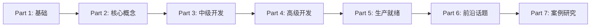

# OpenCode Swarm Agent Development Tutorial

> **从零开始构建智能AI代理系统：从Hello World到分布式多代理架构**

## 教程概述

本教程以opencode-swarm项目为实例，由浅入深地介绍AI代理开发的完整技术栈。从最简单的Hello World插件开始，逐步深入到复杂的多代理协作系统，最终掌握生产级AI代理系统的设计与实现。

### 学习路径

### 教程特色

- **渐进式学习路径** - 从简单到复杂，每个概念都建立在前面知识的基础上
- **丰富的可视化** - 使用Mermaid图表展示架构和流程
- **实战导向** - 每个章节都包含可运行的代码示例
- **最佳实践** - 基于真实项目的生产经验分享
- **完整覆盖** - 从基础概念到高级模式的全面覆盖

### 适用对象

- 具有基础TypeScript/JavaScript经验的开发者
- 希望了解AI代理开发的软件工程师
- 需要构建多代理系统的架构师
- 对AI自动化工具感兴趣的技术人员

### 前置知识

- 基础的TypeScript/JavaScript编程能力
- 了解Node.js生态系统
- 基本的命令行操作经验
- 对AI/LLM有初步概念（非必须）

### 技术栈

- **语言**: TypeScript/JavaScript
- **运行时**: Node.js, Bun
- **主要框架**: opencode-swarm
- **工具链**: Git, npm/bun
- **测试框架**: Jest, Bun Test

### 教程结构

#### Part 1: 基础篇 (Foundation)
- 第1章: AI代理开发简介
- 第2章: Hello World代理

#### Part 2: 核心概念 (Core Concepts)
- 第3章: 代理类型与专业化
- 第4章: 工具系统

#### Part 3: 中级开发 (Intermediate Development)
- 第5章: 状态管理与持久化
- 第6章: 工作流编排

#### Part 4: 高级开发 (Advanced Development)
- 第7章: 子代理实现
- 第8章: 异步和后台操作
- 第9章: 代理间通信

#### Part 5: 生产就绪 (Production Ready)
- 第10章: 安全与防护
- 第11章: 性能与可扩展性
- 第12章: 测试与质量保证

#### Part 6: 前沿话题 (Advanced Topics)
- 第13章: 技能系统与外部集成
- 第14章: 记忆与知识管理
- 第15章: 高级架构模式

#### Part 7: 案例研究 (Case Studies)
- 第16章: 真实实现案例
- 第17章: 最佳实践与模式
- 第18章: 故障排除与调试

### 开始学习

选择你的起点：

- 🚀 **新手**: 从 [第1章: AI代理开发简介](01-chapter1-introduction.md) 开始
- ⚡ **有经验**: 直接跳转到 [第3章: 代理类型与专业化](03-chapter3-agent-types.md)
- 🔧 **实战者**: 查看 [第16章: 真实实现案例](16-chapter16-case-studies.md)

### 学习资源

- 📖 [完整教程目录](tutorial-index.md)
- 💻 [代码示例仓库](https://github.com/zaxbysauce/opencode-swarm)
- 🤝 [社区讨论](https://github.com/zaxbysauce/opencode-swarm/discussions)
- 🐛 [问题反馈](https://github.com/zaxbysauce/opencode-swarm/issues)

### 贡献指南

欢迎对本教程提出建议和改进：

1. Fork 项目仓库
2. 创建改进分支
3. 提交你的改动
4. 发起 Pull Request

### 许可证

本教程采用 MIT 许可证，与主项目保持一致。

---

**开始你的AI代理开发之旅！** 🎉
