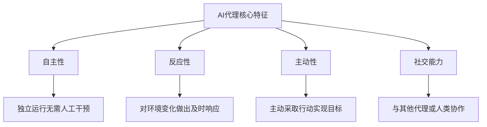
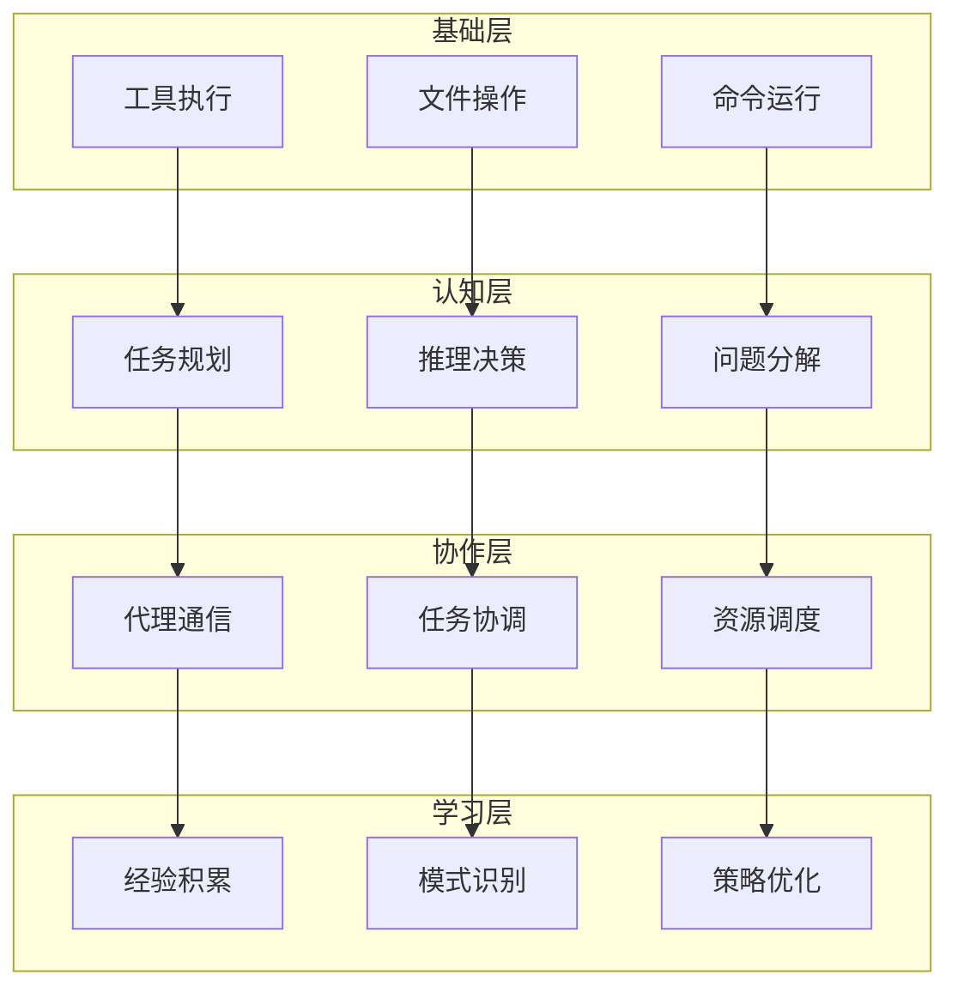
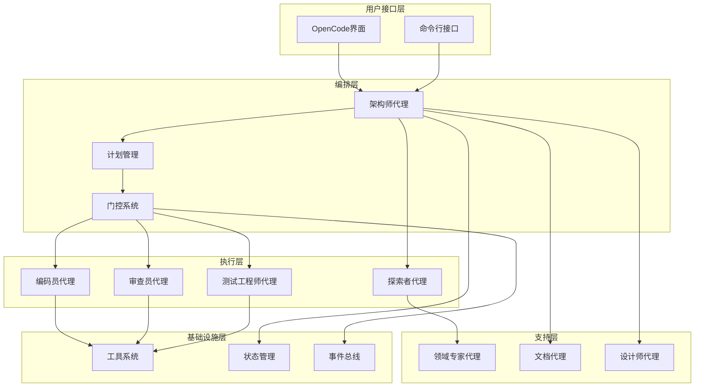
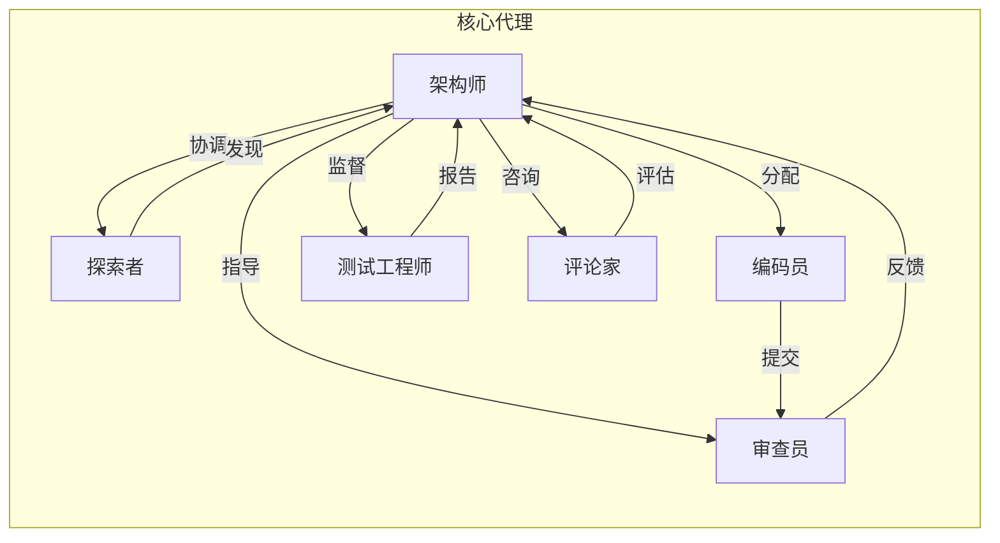
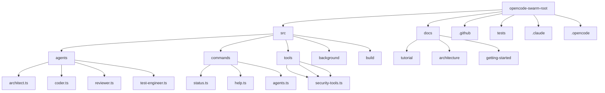
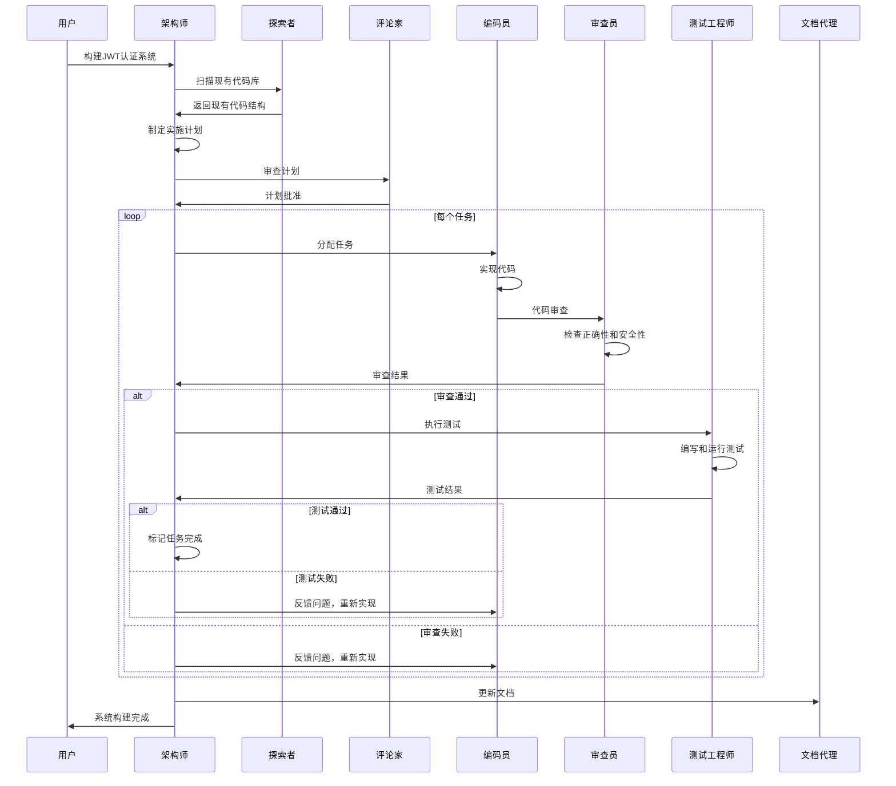
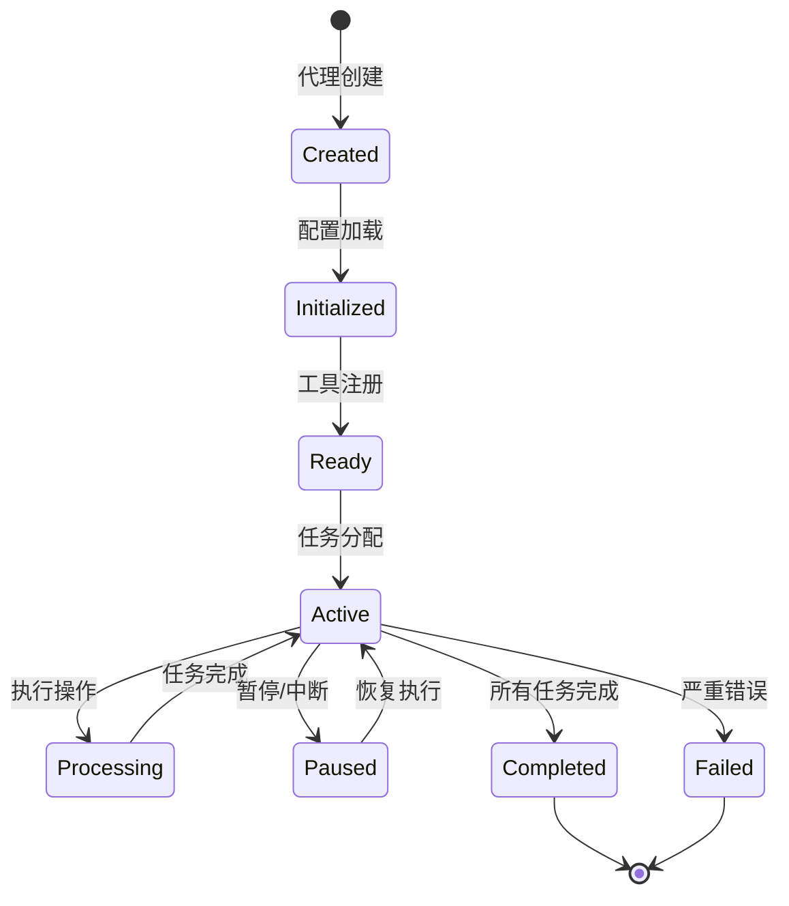
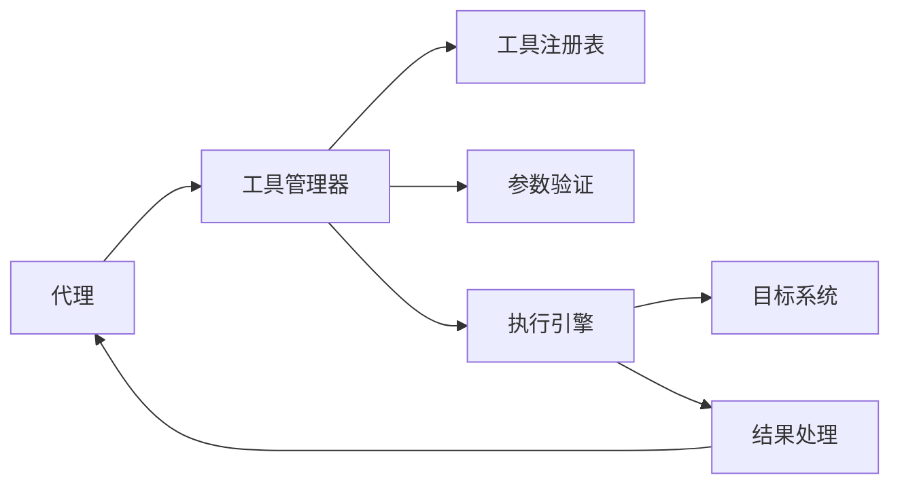

# 第1章: AI代理开发简介

## 学习目标

- 理解AI代理的基本概念和特征
- 了解AI代理与传统程序的区别
- 掌握opencode-swarm项目的核心架构
- 建立对多代理协作系统的基本认知

## 1.1 什么是AI代理？

### 1.1.1 代理的定义

AI代理（AI Agent）是一个能够感知环境、做出决策并执行行动的自主系统。与传统的被动程序不同，AI代理具有以下核心特征：



### 1.1.2 代理 vs 传统程序

传统程序和AI代理的主要区别：

| 特征 | 传统程序 | AI代理 |
|------|---------|--------|
| **执行方式** | 被动执行指令 | 主动感知和决策 |
| **适应性** | 固定的逻辑分支 | 动态学习和适应 |
| **交互方式** | 预定义的输入输出 | 自然语言交互 |
| **处理范围** | 特定任务 | 广泛的问题域 |
| **自主程度** | 完全依赖人工 | 高度自主决策 |

### 1.1.3 AI代理的能力层级

现代AI代理系统通常包含以下能力层级：



## 1.2 opencode-swarm生态系统

### 1.2.1 项目简介

opencode-swarm是一个为OpenCode构建的多代理协作插件，它将单个AI编码会话转换为**由架构师领导的专业代理团队**。

#### 核心理念

> "一个代理编写代码，不同的代理进行审查，另一个代理编写和运行测试。在所有必需的关卡通过之前，不会有任何代码交付。"

#### 主要特点

- 🏗️ **专业化代理团队** - 架构师、编码员、审查员、测试工程师等
- 🔒 **门控流水线** - 确保代码质量的多层验证机制
- 🔍 **深度扫描协议** - 按需的高强度代码审计
- 📝 **状态持久化** - 所有状态保存在`.swarm/`目录中，随时恢复

### 1.2.2 系统架构



### 1.2.3 代理角色系统

opencode-swarm定义了多种专业化的代理角色：

#### 核心代理



| 代理角色 | 主要职责 | 专业领域 |
|---------|---------|----------|
| **架构师** | 工作流编排、计划制定、门控执行 | 系统设计、任务分解 |
| **探索者** | 代码库扫描、上下文收集 | 代码分析、依赖映射 |
| **编码员** | 具体任务实现 | 代码编写、功能实现 |
| **审查员** | 代码正确性和安全性检查 | 质量保证、安全审计 |
| **测试工程师** | 测试编写和执行 | 测试策略、质量验证 |
| **评论家** | 计划审查和质量把关 | 风险评估、决策支持 |

#### 可选代理

- **SME (Subject Matter Expert)**: 提供领域专业知识
- **文档代理**: 维护项目文档
- **设计师**: UI设计和设计令牌
- **评论家监督**: 全自动模式的唯一质量关卡
- **各种评论家**: 漂移验证、幻觉验证等

## 1.3 开发环境设置

### 1.3.1 系统要求

在开始之前，确保你的开发环境满足以下要求：

- **Node.js**: v18.0 或更高版本
- **包管理器**: Bun (推荐) 或 npm
- **Git**: 版本控制
- **IDE**: 支持TypeScript的开发环境
- **终端**: 现代终端应用程序

### 1.3.2 安装步骤

#### 1. 克隆项目

```bash
git clone https://github.com/zaxbysauce/opencode-swarm.git
cd opencode-swarm
```

#### 2. 安装依赖

```bash
# 使用Bun (推荐)
bun install

# 或使用npm
npm install
```

#### 3. 构建项目

```bash
# 使用Bun
bun run build

# 或使用npm
npm run build
```

#### 4. 运行测试

```bash
# 使用Bun
bun test

# 或使用npm
npm test
```

### 1.3.3 项目结构



**主要目录说明：**

- `src/`: 源代码目录
  - `agents/`: 代理实现
  - `commands/`: 命令实现
  - `tools/`: 工具实现
  - `background/`: 后台服务
  - `build/`: 构建相关代码
  
- `docs/`: 文档目录
  - `tutorial/`: 本教程
  - `architecture/`: 架构文档
  - `getting-started/`: 快速开始指南
  
- `tests/`: 测试文件
- `.claude/`: Claude配置
- `.opencode/`: OpenCode配置

### 1.3.4 配置文件

创建你的配置文件 `~/.config/opencode/opencode-swarm.json`:

```json
{
  "agents": {
    "architect": {
      "model": "opencode/minimax-m2.5-free"
    },
    "coder": {
      "model": "opencode/minimax-m2.5-free",
      "fallback_models": ["opencode/big-pickle"]
    },
    "reviewer": {
      "model": "opencode/big-pickle"
    },
    "test_engineer": {
      "model": "opencode/minimax-m2.5-free"
    }
  },
  "guardrails": {
    "max_tool_calls": 200,
    "max_duration_minutes": 30
  },
  "authority": {
    "enabled": true,
    "rules": {
      "coder": {
        "allowedPrefix": ["src/", "lib/", "tests/"],
        "blockedPrefix": [".swarm/", ".git/", "node_modules/"]
      }
    }
  }
}
```

## 1.4 代理协作示例

让我们通过一个具体的例子来理解多代理系统如何工作：

### 场景：构建JWT认证系统



### 协作流程说明

1. **需求分析阶段**
   - 用户提出需求
   - 架构师协调探索者扫描现有代码
   - 基于发现制定详细计划

2. **计划审查阶段**
   - 评论家审查计划的可行性
   - 识别潜在风险
   - 批准或要求修改

3. **执行阶段**
   - 架构师将任务分解为可执行单元
   - 编码员逐个实现任务
   - 每个任务完成后进入审查流程

4. **质量保证阶段**
   - 审查员检查代码正确性
   - 测试工程师验证功能
   - 失败时反馈给编码员修正

5. **完成阶段**
   - 所有任务完成后更新文档
   - 生成最终报告

## 1.5 技术概念概览

### 1.5.1 代理生命周期



### 1.5.2 消息传递机制

代理之间的通信通过结构化消息实现：

```typescript
interface AgentMessage {
  from: string;           // 发送者代理ID
  to: string;             // 接收者代理ID
  type: MessageType;      // 消息类型
  payload: unknown;       // 消息内容
  timestamp: number;      // 时间戳
  correlationId?: string; // 关联ID
}

enum MessageType {
  TASK_ASSIGNMENT = 'task_assignment',
  TASK_COMPLETION = 'task_completion',
  REVIEW_REQUEST = 'review_request',
  REVIEW_RESULT = 'review_result',
  ERROR = 'error',
  STATUS_UPDATE = 'status_update'
}
```

### 1.5.3 工具调用机制

工具是代理与外部系统交互的主要方式：



**工具执行流程：**

1. 代理调用工具
2. 工具管理器验证参数
3. 执行引擎运行工具
4. 处理执行结果
5. 返回格式化结果给代理

## 1.6 本章小结

### 关键要点

- **AI代理特征**: 自主性、反应性、主动性、社交能力
- **opencode-swarm**: 多代理协作系统，专业团队分工
- **核心代理**: 架构师、编码员、审查员、测试工程师等
- **协作流程**: 规划 → 审查 → 执行 → 验证的闭环

### 下一步学习

现在你已经了解了AI代理的基本概念，接下来我们将：

- 📖 **第2章**: 创建你的第一个Hello World代理
- 🔧 **实践**: 动手实现简单的工具和代理
- 🎯 **目标**: 理解代理系统的基本工作原理

### 思考题

1. AI代理与传统自动化脚本的主要区别是什么？
2. 为什么需要多个专业化的代理而不是一个通用代理？
3. 在多代理系统中，如何确保代理之间的有效协作？
4. opencode-swarm的架构设计解决了哪些实际问题？

---

**准备好了吗？让我们开始构建你的第一个AI代理！** 🚀
