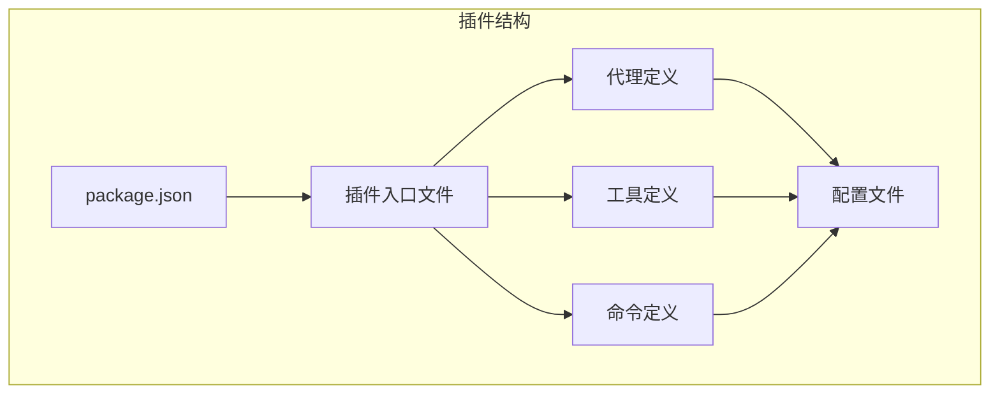
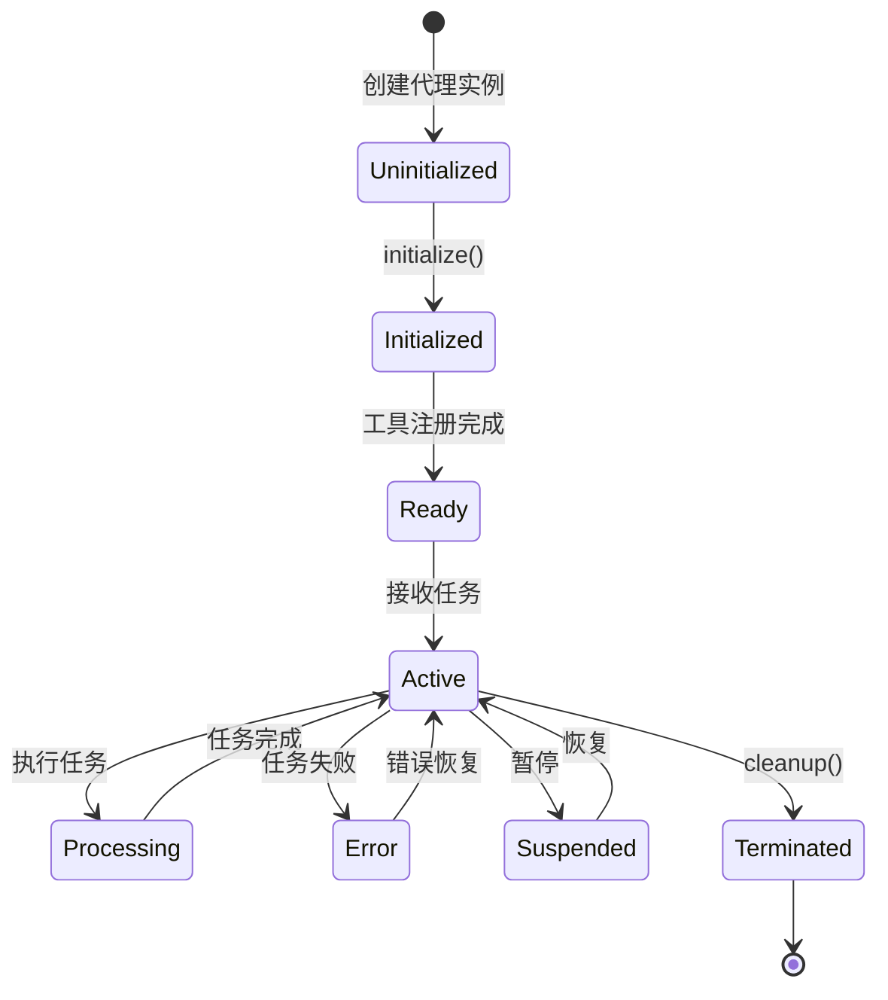

# 第2章: Hello World代理

## 学习目标

- 创建你的第一个OpenCode插件
- 理解代理的基本结构和接口
- 学习工具系统的使用方法
- 掌握代理测试和调试技巧

## 2.1 你的第一个插件

### 2.1.1 插件基础结构

一个OpenCode插件的基本结构包含以下组件：



### 2.1.2 创建Hello World插件

让我们创建一个简单的Hello World插件：

#### 步骤1: 创建项目目录

```bash
mkdir hello-world-agent
cd hello-world-agent
```

#### 步骤2: 初始化项目

```bash
# 使用npm
npm init -y

# 或使用bun
bun init -y
```

#### 步骤3: 创建package.json

```json
{
  "name": "hello-world-agent",
  "version": "1.0.0",
  "description": "My first OpenCode agent plugin",
  "main": "dist/index.js",
  "types": "dist/index.d.ts",
  "scripts": {
    "build": "tsc",
    "dev": "tsc --watch",
    "test": "bun test"
  },
  "keywords": ["opencode", "agent", "plugin"],
  "author": "Your Name",
  "license": "MIT",
  "dependencies": {
    "opencode-swarm": "^1.0.0"
  },
  "devDependencies": {
    "@types/node": "^20.0.0",
    "typescript": "^5.0.0"
  }
}
```

#### 步骤4: 创建TypeScript配置

```json
// tsconfig.json
{
  "compilerOptions": {
    "target": "ES2020",
    "module": "commonjs",
    "lib": ["ES2020"],
    "outDir": "./dist",
    "rootDir": "./src",
    "strict": true,
    "esModuleInterop": true,
    "skipLibCheck": true,
    "forceConsistentCasingInFileNames": true,
    "resolveJsonModule": true,
    "moduleResolution": "node",
    "declaration": true,
    "declarationMap": true,
    "sourceMap": true
  },
  "include": ["src/**/*"],
  "exclude": ["node_modules", "dist"]
}
```

### 2.1.3 创建基本代理

现在让我们创建一个简单的Hello World代理：

```typescript
// src/agents/hello-world.ts
import { BaseAgent } from 'opencode-swarm';

export interface HelloWorldAgentConfig {
  greeting?: string;
  maxRetries?: number;
}

export class HelloWorldAgent extends BaseAgent<HelloWorldAgentConfig> {
  private greeting: string;
  private taskCount: number;
  
  constructor(config: HelloWorldAgentConfig = {}) {
    super({
      name: 'hello-world',
      version: '1.0.0',
      description: 'A simple hello world agent',
      ...config
    });
    
    this.greeting = config.greeting || 'Hello, World!';
    this.taskCount = 0;
  }

  async initialize(): Promise<void> {
    console.log(`${this.greeting} - Agent initialized`);
    this.taskCount = 0;
  }

  async executeTask(task: string): Promise<string> {
    this.taskCount++;
    
    const response = `${this.greeting}\n` +
                    `Task ${this.taskCount}: ${task}\n` +
                    `Executed at: ${new Date().toISOString()}`;
    
    return response;
  }

  async cleanup(): Promise<void> {
    console.log(`Agent executed ${this.taskCount} tasks`);
    await super.cleanup();
  }
}
```

### 2.1.4 创建插件入口

```typescript
// src/index.ts
import { HelloWorldAgent } from './agents/hello-world';

export function registerHelloWorldAgent() {
  return {
    id: 'hello-world-agent',
    version: '1.0.0',
    agents: [
      {
        id: 'hello-world',
        class: HelloWorldAgent,
        config: {
          greeting: 'Hello from my agent!',
          maxRetries: 3
        }
      }
    ],
    tools: [],
    commands: []
  };
}

export default registerHelloWorldAgent;
```

### 2.1.5 构建和测试

```bash
# 安装依赖
npm install

# 构建项目
npm run build

# 测试插件
node test-plugin.js
```

创建测试文件：

```javascript
// test-plugin.js
const plugin = require('./dist/index.js');

async function testPlugin() {
  console.log('Testing Hello World Agent Plugin...\n');
  
  const registration = plugin.default();
  console.log('Plugin ID:', registration.id);
  console.log('Version:', registration.version);
  console.log('Agents:', registration.agents.length);
  
  const AgentClass = registration.agents[0].class;
  const agent = new AgentClass(registration.agents[0].config);
  
  await agent.initialize();
  
  const result1 = await agent.executeTask('First task');
  console.log('\n--- Result 1 ---');
  console.log(result1);
  
  const result2 = await agent.executeTask('Second task');
  console.log('\n--- Result 2 ---');
  console.log(result2);
  
  await agent.cleanup();
}

testPlugin().catch(console.error);
```

## 2.2 理解代理解剖结构

### 2.2.1 代理接口

每个代理都需要实现核心接口：

```typescript
interface AgentInterface {
  // 代理标识
  id: string;
  name: string;
  version: string;
  description: string;
  
  // 生命周期方法
  initialize(config?: AgentConfig): Promise<void>;
  executeTask(task: Task): Promise<TaskResult>;
  cleanup(): Promise<void>;
  
  // 状态管理
  getState(): AgentState;
  setState(state: AgentState): void;
  
  // 工具访问
  hasTool(toolId: string): boolean;
  useTool(toolId: string, params: unknown): Promise<ToolResult>;
}
```

### 2.2.2 代理生命周期



### 2.2.3 代理状态管理

```typescript
interface AgentState {
  // 基本信息
  id: string;
  status: AgentStatus;
  
  // 执行状态
  currentTask?: Task;
  completedTasks: Task[];
  failedTasks: Task[];
  
  // 统计信息
  metrics: {
    tasksCompleted: number;
    tasksFailed: number;
    totalExecutionTime: number;
    averageTaskTime: number;
  };
  
  // 配置
  config: AgentConfig;
  
  // 自定义数据
  customData?: Record<string, unknown>;
}

enum AgentStatus {
  UNINITIALIZED = 'uninitialized',
  INITIALIZED = 'initialized',
  READY = 'ready',
  ACTIVE = 'active',
  PROCESSING = 'processing',
  ERROR = 'error',
  SUSPENDED = 'suspended',
  TERMINATED = 'terminated'
}
```

## 2.3 Hello World with Tools

### 2.3.1 工具基础

工具是代理与外部系统交互的接口：

```typescript
interface Tool {
  // 工具标识
  id: string;
  name: string;
  description: string;
  version: string;
  
  // 执行方法
  execute(params: unknown, context: ToolContext): Promise<ToolResult>;
  
  // 验证
  validate(params: unknown): ValidationResult;
  
  // 权限
  permissions: string[];
  
  // 配置
  config?: ToolConfig;
}
```

### 2.3.2 创建文件读取工具

让我们创建一个简单的文件读取工具：

```typescript
// src/tools/file-reader.ts
import { Tool, ToolContext, ToolResult } from 'opencode-swarm';

// 定义参数接口
export interface FileReaderParams {
  path: string;
  encoding?: BufferEncoding;
}

// 定义验证结果接口
export interface ValidationResult {
  valid: boolean;
  errors?: string[];
  // 添加可选的已验证参数，避免使用类型断言
  validatedParams?: FileReaderParams;
}

export class FileReaderTool extends Tool {
  constructor() {
    super({
      id: 'file-reader',
      name: 'File Reader',
      description: 'Reads file contents from the file system',
      version: '1.0.0'
    });
  }

  // 创建类型守卫函数
  private isFileReaderParams(params: unknown): params is FileReaderParams {
    if (typeof params !== 'object' || params === null) {
      return false;
    }

    const fileParams = params as Record<string, unknown>;
    
    if (!fileParams.path || typeof fileParams.path !== 'string') {
      return false;
    }

    // encoding 参数是可选的，如果存在必须是字符串
    if (fileParams.encoding !== undefined && typeof fileParams.encoding !== 'string') {
      return false;
    }

    return true;
  }

  validate(params: unknown): ValidationResult {
    if (!this.isFileReaderParams(params)) {
      return { 
        valid: false, 
        errors: ['Parameters must be an object with a valid path string'] 
      };
    }

    // 返回包含已验证参数的结果，避免在 execute 中使用类型断言
    return { 
      valid: true,
      validatedParams: params
    };
  }

  async execute(params: unknown, context: ToolContext): Promise<ToolResult> {
    const validation = this.validate(params);
    if (!validation.valid) {
      return {
        success: false,
        error: validation.errors?.join(', ') || 'Invalid parameters'
      };
    }

    try {
      // 使用验证后的参数，而不是类型断言
      const fileParams = validation.validatedParams!;
      const fs = await import('fs/promises');
      
      const encoding = fileParams.encoding || 'utf-8';
      const content = await fs.readFile(fileParams.path, encoding);
      
      return {
        success: true,
        data: {
          path: fileParams.path,
          content: content,
          size: content.length,
          timestamp: new Date().toISOString()
        }
      };
    } catch (error) {
      return {
        success: false,
        error: `Failed to read file: ${error instanceof Error ? error.message : 'Unknown error'}`
      };
    }
  }
}
```

### 2.3.3 创建文件写入工具

```typescript
// src/tools/file-writer.ts
import { Tool, ToolContext, ToolResult } from 'opencode-swarm';

// 定义参数接口
export interface FileWriterParams {
  path: string;
  content: string;
  encoding?: BufferEncoding;
  mode?: number;
}

// 定义验证结果接口
export interface ValidationResult {
  valid: boolean;
  errors?: string[];
  // 添加可选的已验证参数，避免使用类型断言
  validatedParams?: FileWriterParams;
}

export class FileWriterTool extends Tool {
  constructor() {
    super({
      id: 'file-writer',
      name: 'File Writer',
      description: 'Writes content to files on the file system',
      version: '1.0.0'
    });
  }

  // 创建类型守卫函数
  private isFileWriterParams(params: unknown): params is FileWriterParams {
    if (typeof params !== 'object' || params === null) {
      return false;
    }

    const fileParams = params as Record<string, unknown>;
    
    // 必需参数验证
    if (!fileParams.path || typeof fileParams.path !== 'string') {
      return false;
    }

    if (!fileParams.content || typeof fileParams.content !== 'string') {
      return false;
    }

    // 可选参数类型检查
    if (fileParams.encoding !== undefined && typeof fileParams.encoding !== 'string') {
      return false;
    }

    if (fileParams.mode !== undefined && typeof fileParams.mode !== 'number') {
      return false;
    }

    return true;
  }

  validate(params: unknown): ValidationResult {
    if (!this.isFileWriterParams(params)) {
      return { 
        valid: false, 
        errors: ['Parameters must be an object with path and content strings'] 
      };
    }

    // 返回包含已验证参数的结果
    return { 
      valid: true,
      validatedParams: params
    };
  }

  async execute(params: unknown, context: ToolContext): Promise<ToolResult> {
    const validation = this.validate(params);
    if (!validation.valid) {
      return {
        success: false,
        error: validation.errors?.join(', ') || 'Invalid parameters'
      };
    }

    try {
      // 使用验证后的参数，而不是类型断言
      const fileParams = validation.validatedParams!;
      const fs = await import('fs/promises');
      
      // 确保目录存在
      const pathModule = await import('path');
      const dir = pathModule.dirname(fileParams.path);
      await fs.mkdir(dir, { recursive: true });
      
      // 写入文件
      const encoding = fileParams.encoding || 'utf-8';
      await fs.writeFile(fileParams.path, fileParams.content, encoding, 
        fileParams.mode ? { mode: fileParams.mode } : undefined);
      
      return {
        success: true,
        data: {
          path: fileParams.path,
          size: fileParams.content.length,
          encoding: encoding,
          timestamp: new Date().toISOString()
        }
      };
    } catch (error) {
      return {
        success: false,
        error: `Failed to write file: ${error instanceof Error ? error.message : 'Unknown error'}`
      };
    }
  }
}
```

### 2.3.4 更新代理以使用工具

```typescript
// src/agents/hello-world-with-tools.ts
import { BaseAgent } from 'opencode-swarm';
import { FileReaderTool } from '../tools/file-reader';
import { FileWriterTool } from '../tools/file-writer';

export class HelloWorldWithToolsAgent extends BaseAgent {
  private fileReader: FileReaderTool;
  private fileWriter: FileWriterTool;
  
  constructor() {
    super({
      name: 'hello-world-with-tools',
      version: '1.0.0',
      description: 'Hello World agent with file operations'
    });
    
    this.fileReader = new FileReaderTool();
    this.fileWriter = new FileWriterTool();
  }

  async initialize(): Promise<void> {
    console.log('Hello World with Tools Agent initialized');
    
    // 注册工具
    this.registerTool(this.fileReader);
    this.registerTool(this.fileWriter);
  }

  async executeTask(task: string): Promise<string> {
    try {
      // 使用文件写入工具
      const writeResult = await this.useTool('file-writer', {
        path: './hello-output.txt',
        content: `Hello from task: ${task}\nExecuted at: ${new Date().toISOString()}`
      });

      if (!writeResult.success) {
        return `Failed to write file: ${writeResult.error}`;
      }

      // 使用文件读取工具
      const readResult = await this.useTool('file-reader', {
        path: './hello-output.txt'
      });

      if (!readResult.success) {
        return `Failed to read file: ${readResult.error}`;
      }

      return `Successfully created and read file. Content:\n${readResult.data.content}`;
      
    } catch (error) {
      return `Task execution failed: ${error instanceof Error ? error.message : 'Unknown error'}`;
    }
  }
}
```

## 2.4 错误处理基础

### 2.4.1 错误处理模式

```typescript
// src/utils/error-handler.ts
export enum ErrorCode {
  AGENT_INITIALIZATION_FAILED = 'AGENT_INITIALIZATION_FAILED',
  TASK_EXECUTION_FAILED = 'TASK_EXECUTION_FAILED',
  TOOL_EXECUTION_FAILED = 'TOOL_EXECUTION_FAILED',
  VALIDATION_FAILED = 'VALIDATION_FAILED',
  TIMEOUT = 'TIMEOUT',
  RESOURCE_EXHAUSTED = 'RESOURCE_EXHAUSTED'
}

export class AgentError extends Error {
  constructor(
    public code: ErrorCode,
    message: string,
    public details?: unknown
  ) {
    super(message);
    this.name = 'AgentError';
  }
}

export class ErrorHandler {
  static handle(error: unknown, context: string): AgentError {
    if (error instanceof AgentError) {
      return error;
    }

    if (error instanceof Error) {
      return new AgentError(
        ErrorCode.TASK_EXECUTION_FAILED,
        `${context}: ${error.message}`,
        { stack: error.stack }
      );
    }

    return new AgentError(
      ErrorCode.TASK_EXECUTION_FAILED,
      `${context}: Unknown error`,
      { originalError: error }
    );
  }
}
```

### 2.4.2 在代理中使用错误处理

```typescript
// src/agents/hello-world-robust.ts
import { BaseAgent } from 'opencode-swarm';
import { ErrorHandler, ErrorCode, AgentError } from '../utils/error-handler';

export class HelloWorldRobustAgent extends BaseAgent {
  private maxRetries: number;
  private retryCount: number;
  
  constructor(maxRetries: number = 3) {
    super({
      name: 'hello-world-robust',
      version: '1.0.0',
      description: 'Robust Hello World agent with error handling'
    });
    
    this.maxRetries = maxRetries;
    this.retryCount = 0;
  }

  async executeTask(task: string): Promise<string> {
    this.retryCount = 0;
    
    while (this.retryCount < this.maxRetries) {
      try {
        return await this.executeTaskInternal(task);
      } catch (error) {
        this.retryCount++;
        
        if (this.retryCount >= this.maxRetries) {
          throw ErrorHandler.handle(error, `Task execution failed after ${this.maxRetries} retries`);
        }
        
        console.log(`Retry ${this.retryCount}/${this.maxRetries} after error:`, error);
        await this.delay(1000 * this.retryCount); // 指数退避
      }
    }
    
    throw new AgentError(ErrorCode.RESOURCE_EXHAUSTED, 'Max retries exceeded');
  }

  private async executeTaskInternal(task: string): Promise<string> {
    // 模拟可能失败的操作
    if (Math.random() > 0.7) {
      throw new Error('Random task failure for testing');
    }
    
    return `Task completed successfully: ${task}`;
  }

  private delay(ms: number): Promise<void> {
    return new Promise(resolve => setTimeout(resolve, ms));
  }
}
```

## 2.5 测试你的代理

### 2.5.1 创建单元测试

```typescript
// tests/agents/hello-world.test.ts
import { describe, it, expect, beforeEach, afterEach } from 'bun:test';
import { HelloWorldAgent } from '../src/agents/hello-world';

describe('HelloWorldAgent', () => {
  let agent: HelloWorldAgent;

  beforeEach(() => {
    agent = new HelloWorldAgent({
      greeting: 'Test Greeting',
      maxRetries: 3
    });
  });

  afterEach(async () => {
    await agent.cleanup();
  });

  it('should initialize successfully', async () => {
    await agent.initialize();
    expect(agent.getState().status).toBe('ready');
  });

  it('should execute simple tasks', async () => {
    await agent.initialize();
    
    const result1 = await agent.executeTask('Task 1');
    const result2 = await agent.executeTask('Task 2');
    
    expect(result1).toContain('Task 1');
    expect(result2).toContain('Task 2');
  });

  it('should track task count', async () => {
    await agent.initialize();
    
    await agent.executeTask('Task 1');
    await agent.executeTask('Task 2');
    await agent.executeTask('Task 3');
    
    const state = agent.getState();
    expect(state.metrics.tasksCompleted).toBe(3);
  });

  it('should use custom greeting', async () => {
    await agent.initialize();
    
    const result = await agent.executeTask('Test');
    expect(result).toContain('Test Greeting');
  });
});
```

### 2.5.2 集成测试

```typescript
// tests/integration/plugin-integration.test.ts
import { describe, it, expect } from 'bun:test';
import plugin from '../src/index';

describe('Plugin Integration', () => {
  it('should register plugin correctly', () => {
    const registration = plugin.default();
    
    expect(registration.id).toBe('hello-world-agent');
    expect(registration.version).toBeDefined();
    expect(registration.agents).toBeInstanceOf(Array);
    expect(registration.agents.length).toBeGreaterThan(0);
  });

  it('should create agent instance', async () => {
    const registration = plugin.default();
    const agentConfig = registration.agents[0];
    
    const AgentClass = agentConfig.class;
    const agent = new AgentClass(agentConfig.config);
    
    await agent.initialize();
    expect(agent.getState().status).toBe('ready');
    
    await agent.cleanup();
  });
});
```

### 2.5.3 运行测试

```bash
# 运行所有测试
bun test

# 运行特定测试文件
bun test tests/agents/hello-world.test.ts

# 监视模式
bun test --watch
```

## 2.6 调试技巧

### 2.6.1 日志记录

```typescript
// src/utils/logger.ts
export enum LogLevel {
  DEBUG = 'DEBUG',
  INFO = 'INFO',
  WARN = 'WARN',
  ERROR = 'ERROR'
}

export class Logger {
  private level: LogLevel;
  private prefix: string;

  constructor(prefix: string, level: LogLevel = LogLevel.INFO) {
    this.prefix = prefix;
    this.level = level;
  }

  private shouldLog(level: LogLevel): boolean {
    const levels = [LogLevel.DEBUG, LogLevel.INFO, LogLevel.WARN, LogLevel.ERROR];
    return levels.indexOf(level) >= levels.indexOf(this.level);
  }

  debug(message: string, ...args: unknown[]): void {
    if (this.shouldLog(LogLevel.DEBUG)) {
      console.debug(`[${this.prefix}] [DEBUG] ${message}`, ...args);
    }
  }

  info(message: string, ...args: unknown[]): void {
    if (this.shouldLog(LogLevel.INFO)) {
      console.log(`[${this.prefix}] [INFO] ${message}`, ...args);
    }
  }

  warn(message: string, ...args: unknown[]): void {
    if (this.shouldLog(LogLevel.WARN)) {
      console.warn(`[${this.prefix}] [WARN] ${message}`, ...args);
    }
  }

  error(message: string, ...args: unknown[]): void {
    if (this.shouldLog(LogLevel.ERROR)) {
      console.error(`[${this.prefix}] [ERROR] ${message}`, ...args);
    }
  }
}
```

### 2.6.2 在代理中使用日志

```typescript
// src/agents/hello-world-with-logging.ts
import { BaseAgent } from 'opencode-swarm';
import { Logger } from '../utils/logger';

export class HelloWorldWithLoggingAgent extends BaseAgent {
  private logger: Logger;
  
  constructor() {
    super({
      name: 'hello-world-with-logging',
      version: '1.0.0',
      description: 'Hello World agent with logging'
    });
    
    this.logger = new Logger('HelloWorldAgent', LogLevel.DEBUG);
  }

  async initialize(): Promise<void> {
    this.logger.info('Initializing agent');
    this.logger.debug('Agent configuration:', this.config);
    await super.initialize();
    this.logger.info('Agent initialized successfully');
  }

  async executeTask(task: string): Promise<string> {
    this.logger.info(`Starting task: ${task}`);
    
    try {
      const result = await this.executeTaskInternal(task);
      this.logger.info(`Task completed successfully`);
      return result;
    } catch (error) {
      this.logger.error(`Task failed:`, error);
      throw error;
    }
  }

  private async executeTaskInternal(task: string): Promise<string> {
    this.logger.debug('Executing task logic');
    // 实际任务逻辑
    return `Completed: ${task}`;
  }
}
```

### 2.6.3 调试工具

创建调试辅助脚本：

```javascript
// debug-agent.js
const plugin = require('./dist/index.js');

async function debugAgent() {
  console.log('=== Agent Debug Session ===\n');
  
  // 启用详细日志
  process.env.DEBUG = 'true';
  process.env.LOG_LEVEL = 'debug';
  
  const registration = plugin.default();
  const agentConfig = registration.agents[0];
  
  console.log('1. Loading Agent Configuration');
  console.log('   Config:', JSON.stringify(agentConfig.config, null, 2));
  
  const AgentClass = agentConfig.class;
  const agent = new AgentClass({
    ...agentConfig.config,
    debug: true
  });
  
  console.log('\n2. Initializing Agent');
  await agent.initialize();
  console.log('   Status:', agent.getState().status);
  
  console.log('\n3. Executing Test Tasks');
  const tasks = ['Task 1', 'Task 2', 'Task 3'];
  
  for (const task of tasks) {
    console.log(`   Executing: ${task}`);
    const result = await agent.executeTask(task);
    console.log(`   Result: ${result.substring(0, 50)}...`);
  }
  
  console.log('\n4. Final Agent State');
  const state = agent.getState();
  console.log('   Completed Tasks:', state.metrics.tasksCompleted);
  console.log('   Average Time:', state.metrics.averageTaskTime);
  
  console.log('\n5. Cleanup');
  await agent.cleanup();
  console.log('   Done!');
}

debugAgent().catch(error => {
  console.error('Debug session failed:', error);
  process.exit(1);
});
```

## 2.7 本章小结

### 关键要点

- **插件结构**: package.json、TypeScript配置、入口文件
- **代理基础**: 继承BaseAgent、实现生命周期方法
- **工具系统**: 工具定义、参数验证、执行机制
- **错误处理**: 结构化错误、重试机制、指数退避
- **测试策略**: 单元测试、集成测试、调试工具

### 最佳实践

1. **始终使用TypeScript** - 类型安全防止运行时错误
2. **实现完整的生命周期** - initialize、executeTask、cleanup
3. **使用结构化错误处理** - 便于调试和维护
4. **编写全面的测试** - 单元测试和集成测试
5. **添加详细日志** - 便于生产环境调试

### 下一步学习

现在你已经掌握了基础的代理创建技巧，接下来我们将：

- 📖 **第3章**: 深入了解代理类型与专业化
- 🔧 **实践**: 构建更复杂的专业化代理
- 🎯 **目标**: 理解多代理协作的核心机制

### 练习项目

1. **扩展Hello World代理**: 添加更多工具功能
2. **创建自定义工具**: 实现网络请求工具
3. **错误处理练习**: 添加更复杂的错误恢复逻辑
4. **测试覆盖**: 为你的代理编写完整的测试套件

---

**准备好深入学习了吗？让我们探索更复杂的代理类型和专业化模式！** 🚀
