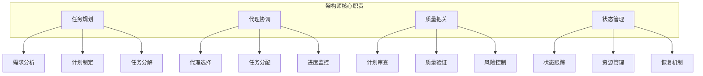
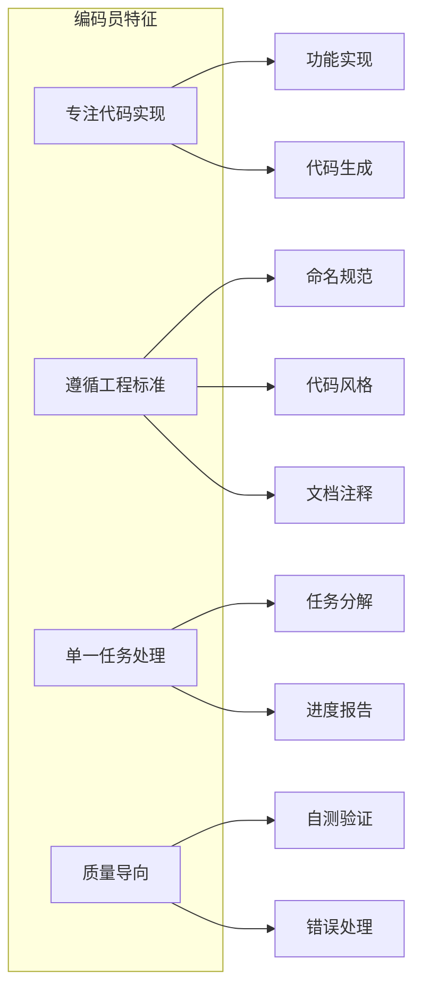
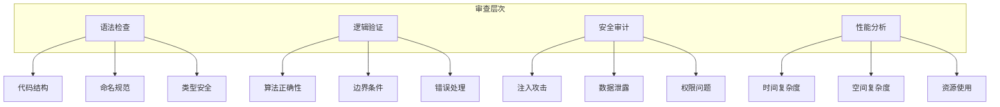
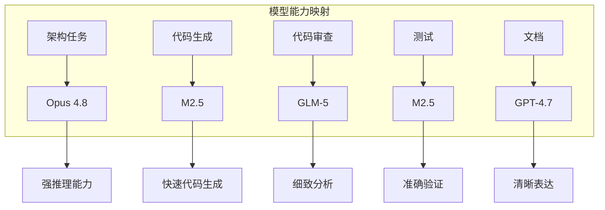

# 第3章: 代理类型与专业化

## 学习目标

- 理解opencode-swarm中的核心代理类型
- 掌握专业代理的设计模式
- 学习代理配置和模型选择
- 了解代理权限和权威系统

## 3.1 核心代理模式

### 3.1.1 架构师代理 (Architect Agent)

架构师是整个多代理系统的协调者，负责工作流编排和全局决策。

#### 架构师的核心职责



#### 架构师代理实现

```typescript
// src/agents/architect.ts
import { BaseAgent, AgentConfig, Task, Plan, Phase } from 'opencode-swarm';
import { Explorer } from './explorer';
import { Critic } from './critic';

export interface ArchitectConfig extends AgentConfig {
  maxPhases?: number;
  autoProceed?: boolean;
  enableCritic?: boolean;
}

export class ArchitectAgent extends BaseAgent<ArchitectConfig> {
  private explorer: Explorer;
  private critic?: Critic;
  private currentPlan?: Plan;
  private currentPhase?: Phase;
  
  constructor(config: ArchitectConfig = {}) {
    super({
      name: 'architect',
      version: '1.0.0',
      description: 'Principal orchestrator agent',
      maxToolCalls: 500,
      ...config
    });
    
    this.explorer = new Explorer();
    if (config.enableCritic) {
      this.critic = new Critic();
    }
  }

  async initialize(): Promise<void> {
    await super.initialize();
    
    // 初始化依赖代理
    await this.explorer.initialize();
    if (this.critic) {
      await this.critic.initialize();
    }
    
    this.info('Architect agent initialized');
  }

  async processRequest(request: string): Promise<string> {
    this.info('Processing request:', request);
    
    // 1. 发现阶段 - 使用探索者了解代码库
    await this.discoveryPhase();
    
    // 2. 规划阶段 - 创建实施计划
    await this.planningPhase(request);
    
    // 3. 执行阶段 - 实施计划
    const result = await this.executionPhase();
    
    // 4. 完成阶段 - 文档和总结
    await this.completionPhase();
    
    return result;
  }

  private async discoveryPhase(): Promise<void> {
    this.info('Starting discovery phase');
    
    const discovery = await this.explorer.scanCodebase({
      include: ['src/', 'lib/', 'tests/'],
      exclude: ['node_modules/', '.git/'],
      depth: 3
    });
    
    this.info('Discovery completed:', {
      filesFound: discovery.files.length,
      directories: discovery.directories.length,
      patterns: discovery.patterns
    });
    
    // 存储发现结果用于后续规划
    this.setState({
      discovery,
      timestamp: Date.now()
    });
  }

  private async planningPhase(request: string): Promise<void> {
    this.info('Starting planning phase');
    
    // 创建初始计划
    const plan: Plan = await this.createPlan(request);
    
    // 如果启用了评论家，进行计划审查
    if (this.critic) {
      const review = await this.critic.reviewPlan(plan);
      
      if (!review.approved) {
        this.warn('Plan rejected by critic:', review.feedback);
        // 根据反馈修改计划
        await this.revisePlan(plan, review.feedback);
      }
    }
    
    this.currentPlan = plan;
    this.info('Plan created and approved');
    
    // 保存计划
    await this.savePlan(plan);
  }

  private async executionPhase(): Promise<string> {
    this.info('Starting execution phase');
    
    if (!this.currentPlan) {
      throw new Error('No plan available for execution');
    }
    
    const results: string[] = [];
    
    // 执行每个阶段的任务
    for (const phase of this.currentPlan.phases) {
      this.currentPhase = phase;
      this.info(`Executing phase: ${phase.name}`);
      
      const phaseResult = await this.executePhase(phase);
      results.push(...phaseResult);
      
      // 阶段完成检查
      await this.verifyPhaseCompletion(phase);
    }
    
    return results.join('\n');
  }

  private async completionPhase(): Promise<void> {
    this.info('Starting completion phase');
    
    // 更新文档
    await this.updateDocumentation();
    
    // 生成总结报告
    await this.generateSummary();
    
    this.info('Session completed successfully');
  }

  private async createPlan(request: string): Promise<Plan> {
    // 分析请求并创建计划
    const phases: Phase[] = [
      {
        id: 'phase-1',
        name: 'Analysis and Design',
        tasks: [
          {
            id: 'task-1-1',
            title: 'Analyze requirements',
            assignee: 'architect',
            status: 'pending'
          },
          {
            id: 'task-1-2',
            title: 'Design solution',
            assignee: 'architect',
            status: 'pending'
          }
        ]
      },
      {
        id: 'phase-2',
        name: 'Implementation',
        tasks: [
          {
            id: 'task-2-1',
            title: 'Implement core functionality',
            assignee: 'coder',
            status: 'pending'
          }
        ]
      }
    ];
    
    return {
      id: `plan-${Date.now()}`,
      request,
      phases,
      createdAt: new Date().toISOString()
    };
  }

  private async executePhase(phase: Phase): Promise<string[]> {
    const results: string[] = [];
    
    for (const task of phase.tasks) {
      const result = await this.executeTask(task);
      results.push(result);
    }
    
    return results;
  }

  private async executeTask(task: Task): Promise<string> {
    // 根据任务分配给相应的代理
    switch (task.assignee) {
      case 'coder':
        return await this.delegateToCoder(task);
      case 'reviewer':
        return await this.delegateToReviewer(task);
      case 'test_engineer':
        return await this.delegateToTestEngineer(task);
      default:
        return await this.executeTaskDirectly(task);
    }
  }

  private async delegateToCoder(task: Task): Promise<string> {
    // 实现代理委托逻辑
    const coder = await this.getAgent('coder');
    return await coder.executeTask(task);
  }

  private async delegateToReviewer(task: Task): Promise<string> {
    const reviewer = await this.getAgent('reviewer');
    return await reviewer.executeTask(task);
  }

  private async delegateToTestEngineer(task: Task): Promise<string> {
    const testEngineer = await this.getAgent('test_engineer');
    return await testEngineer.executeTask(task);
  }

  private async executeTaskDirectly(task: Task): Promise<string> {
    this.info(`Executing task directly: ${task.title}`);
    return `Task completed: ${task.title}`;
  }

  private async verifyPhaseCompletion(phase: Phase): Promise<void> {
    this.info(`Verifying phase completion: ${phase.name}`);
    
    // 检查所有任务是否完成
    const allTasksComplete = phase.tasks.every(task => task.status === 'completed');
    
    if (!allTasksComplete) {
      throw new Error(`Phase ${phase.name} has incomplete tasks`);
    }
    
    // 运行阶段完成检查
    await this.runPhaseGates(phase);
  }

  private async runPhaseGates(phase: Phase): Promise<void> {
    // 实现质量关卡
    this.info('Running phase quality gates');
    
    // 语法检查
    await this.runSyntaxCheck();
    
    // 安全扫描
    await this.runSecurityScan();
    
    // 测试验证
    await this.runTestValidation();
  }

  private async savePlan(plan: Plan): Promise<void> {
    // 保存计划到文件系统
    const fs = await import('fs/promises');
    await fs.mkdir('.swarm', { recursive: true });
    await fs.writeFile('.swarm/plan.json', JSON.stringify(plan, null, 2));
  }

  private async updateDocumentation(): Promise<void> {
    this.info('Updating documentation');
    // 实现文档更新逻辑
  }

  private async generateSummary(): Promise<void> {
    this.info('Generating summary');
    // 实现总结生成逻辑
  }

  private async revisePlan(plan: Plan, feedback: string): Promise<void> {
    this.info('Revising plan based on feedback');
    // 实现计划修订逻辑
  }

  private async getAgent(agentType: string): Promise<BaseAgent> {
    // 获取指定类型的代理实例
    // 这是简化实现，实际应该从代理工厂获取
    throw new Error(`Agent type ${agentType} not implemented`);
  }

  private async runSyntaxCheck(): Promise<void> {
    // 实现语法检查
  }

  private async runSecurityScan(): Promise<void> {
    // 实现安全扫描
  }

  private async runTestValidation(): Promise<void> {
    // 实现测试验证
  }
}
```

### 3.1.2 编码员代理 (Coder Agent)

编码员代理专注于具体的代码实现，是主要的代码生成者。

#### 编码员的特征



#### 编码员代理实现

```typescript
// src/agents/coder.ts
import { BaseAgent, AgentConfig, Task } from 'opencode-swarm';

export interface CoderConfig extends AgentConfig {
  allowedPaths?: string[];
  blockedPaths?: string[];
  maxFilesPerTask?: number;
  enableAutoTest?: boolean;
}

export class CoderAgent extends BaseAgent<CoderConfig> {
  private allowedPaths: string[];
  private blockedPaths: string[];
  private taskHistory: Task[];
  
  constructor(config: CoderConfig = {}) {
    super({
      name: 'coder',
      version: '1.0.0',
      description: 'Code implementation specialist',
      maxToolCalls: 500,
      ...config
    });
    
    this.allowedPaths = config.allowedPaths || ['src/', 'lib/', 'tests/'];
    this.blockedPaths = config.blockedPaths || ['.swarm/', '.git/', 'node_modules/'];
    this.taskHistory = [];
  }

  async executeTask(task: Task): Promise<string> {
    this.info('Executing task:', task.id);
    
    try {
      // 1. 验证任务范围
      await this.validateTaskScope(task);
      
      // 2. 分析现有代码
      const context = await this.analyzeContext(task);
      
      // 3. 实现代码
      const implementation = await this.implementTask(task, context);
      
      // 4. 验证实现
      await this.validateImplementation(implementation);
      
      // 5. 自我测试
      if (this.config.enableAutoTest) {
        await this.runSelfTests(implementation);
      }
      
      // 6. 记录任务
      this.recordTaskCompletion(task);
      
      return `Task ${task.id} completed successfully`;
      
    } catch (error) {
      this.error(`Task ${task.id} failed:`, error);
      throw error;
    }
  }

  private async validateTaskScope(task: Task): Promise<void> {
    this.info('Validating task scope');
    
    // 检查任务涉及的所有路径是否在允许范围内
    for (const filePath of task.files || []) {
      if (!this.isPathAllowed(filePath)) {
        throw new Error(`Path ${filePath} is not allowed for coder agent`);
      }
    }
  }

  private isPathAllowed(filePath: string): boolean {
    // 检查路径是否在允许列表中
    const isAllowed = this.allowedPaths.some(allowed => 
      filePath.startsWith(allowed)
    );
    
    // 检查路径是否在阻止列表中
    const isBlocked = this.blockedPaths.some(blocked => 
      filePath.startsWith(blocked)
    );
    
    return isAllowed && !isBlocked;
  }

  private async analyzeContext(task: Task): Promise<any> {
    this.info('Analyzing context for task');
    
    // 读取相关文件以了解上下文
    const context: any = {
      files: [],
      dependencies: [],
      patterns: []
    };
    
    // 分析现有代码结构
    for (const filePath of task.files || []) {
      const fileContent = await this.readFile(filePath);
      context.files.push({
        path: filePath,
        content: fileContent
      });
    }
    
    return context;
  }

  private async implementTask(task: Task, context: any): Promise<any> {
    this.info('Implementing task');
    
    // 根据任务类型实现不同的逻辑
    switch (task.type) {
      case 'create_file':
        return await this.createFile(task, context);
      case 'modify_file':
        return await this.modifyFile(task, context);
      case 'create_function':
        return await this.createFunction(task, context);
      default:
        return await this.implementGenericTask(task, context);
    }
  }

  private async createFile(task: Task, context: any): Promise<any> {
    const filePath = task.targetPath;
    const content = this.generateFileContent(task, context);
    
    await this.writeFile(filePath, content);
    
    return {
      type: 'file_created',
      path: filePath,
      size: content.length
    };
  }

  private async modifyFile(task: Task, context: any): Promise<any> {
    const filePath = task.targetPath;
    const existingContent = await this.readFile(filePath);
    const modifiedContent = this.modifyFileContent(task, existingContent, context);
    
    await this.writeFile(filePath, modifiedContent);
    
    return {
      type: 'file_modified',
      path: filePath,
      changes: this.calculateChanges(existingContent, modifiedContent)
    };
  }

  private generateFileContent(task: Task, context: any): string {
    // 生成文件内容的逻辑
    return `// Generated by coder agent\n// Task: ${task.title}\n// Time: ${new Date().toISOString()}\n\n`;
  }

  private modifyFileContent(task: Task, existingContent: string, context: any): string {
    // 修改文件内容的逻辑
    return existingContent;
  }

  private calculateChanges(original: string, modified: string): any {
    // 计算变更的统计信息
    return {
      additions: modified.split('\n').length - original.split('\n').length,
      deletions: 0,
      modifications: 0
    };
  }

  private async validateImplementation(implementation: any): Promise<void> {
    this.info('Validating implementation');
    
    // 验证实现是否符合要求
    if (!implementation || !implementation.type) {
      throw new Error('Invalid implementation result');
    }
  }

  private async runSelfTests(implementation: any): Promise<void> {
    this.info('Running self tests');
    
    // 运行基本的自检测试
    switch (implementation.type) {
      case 'file_created':
        await this.verifyFileExists(implementation.path);
        break;
      case 'file_modified':
        await this.verifyFileModified(implementation.path);
        break;
    }
  }

  private async verifyFileExists(filePath: string): Promise<void> {
    const fs = await import('fs/promises');
    try {
      await fs.access(filePath);
    } catch {
      throw new Error(`File ${filePath} was not created`);
    }
  }

  private async verifyFileModified(filePath: string): Promise<void> {
    // 验证文件修改
  }

  private recordTaskCompletion(task: Task): void {
    this.taskHistory.push({
      ...task,
      completedAt: new Date().toISOString(),
      status: 'completed'
    });
  }

  private async readFile(filePath: string): Promise<string> {
    const fs = await import('fs/promises');
    return await fs.readFile(filePath, 'utf-8');
  }

  private async writeFile(filePath: string, content: string): Promise<void> {
    const fs = await import('fs/promises');
    const path = await import('path');
    
    // 确保目录存在
    await fs.mkdir(path.dirname(filePath), { recursive: true });
    await fs.writeFile(filePath, content, 'utf-8');
  }
}
```

### 3.1.3 审查员代理 (Reviewer Agent)

审查员代理负责代码质量保证，检查正确性和安全性。

#### 审查员的多层次检查



#### 审查员代理实现

```typescript
// src/agents/reviewer.ts
import { BaseAgent, AgentConfig, Task } from 'opencode-swarm';

export interface ReviewerConfig extends AgentConfig {
  securityFocus?: boolean;
  performanceFocus?: boolean;
  enableAutoFix?: boolean;
  maxIssuesPerFile?: number;
}

export class ReviewerAgent extends BaseAgent<ReviewerConfig> {
  private securityEnabled: boolean;
  private performanceEnabled: boolean;
  private reviewHistory: any[];
  
  constructor(config: ReviewerConfig = {}) {
    super({
      name: 'reviewer',
      version: '1.0.0',
      description: 'Code quality and security specialist',
      ...config
    });
    
    this.securityEnabled = config.securityFocus ?? true;
    this.performanceEnabled = config.performanceFocus ?? true;
    this.reviewHistory = [];
  }

  async executeTask(task: Task): Promise<string> {
    this.info('Starting code review for task:', task.id);
    
    try {
      // 1. 收集要审查的文件
      const filesToReview = await this.collectFiles(task);
      
      // 2. 执行多层次审查
      const reviewResults = await this.performReview(filesToReview, task);
      
      // 3. 生成审查报告
      const report = this.generateReviewReport(reviewResults);
      
      // 4. 如果启用自动修复，尝试修复问题
      if (this.config.enableAutoFix) {
        await this.attemptAutoFix(reviewResults);
      }
      
      // 5. 保存审查历史
      this.saveReviewHistory(task, reviewResults);
      
      return this.formatReviewOutput(report);
      
    } catch (error) {
      this.error('Review failed:', error);
      throw error;
    }
  }

  private async collectFiles(task: Task): Promise<string[]> {
    this.info('Collecting files for review');
    
    const files: string[] = [];
    
    // 从任务中获取相关文件
    if (task.files) {
      files.push(...task.files);
    }
    
    // 添加最近修改的文件
    const recentChanges = await this.getRecentChanges();
    files.push(...recentChanges);
    
    return [...new Set(files)]; // 去重
  }

  private async getRecentChanges(): Promise<string[]> {
    // 获取最近更改的文件列表
    const { execSync } = await import('child_process');
    
    try {
      const output = execSync('git diff --name-only HEAD~1..HEAD', {
        encoding: 'utf-8'
      });
      
      return output.split('\n').filter(Boolean);
    } catch {
      return [];
    }
  }

  private async performReview(files: string[], task: Task): Promise<any> {
    this.info(`Performing review on ${files.length} files`);
    
    const results: any = {
      syntax: [],
      logic: [],
      security: [],
      performance: [],
      style: []
    };
    
    for (const file of files) {
      const fileResult = await this.reviewFile(file, task);
      
      results.syntax.push(...fileResult.syntax);
      results.logic.push(...fileResult.logic);
      results.security.push(...fileResult.security);
      results.performance.push(...fileResult.performance);
      results.style.push(...fileResult.style);
    }
    
    return results;
  }

  private async reviewFile(filePath: string, task: Task): Promise<any> {
    this.info('Reviewing file:', filePath);
    
    const fileContent = await this.readFile(filePath);
    
    const result: any = {
      filePath,
      syntax: [],
      logic: [],
      security: [],
      performance: [],
      style: []
    };
    
    // 语法检查
    result.syntax.push(...await this.checkSyntax(filePath, fileContent));
    
    // 逻辑验证
    result.logic.push(...await this.checkLogic(filePath, fileContent, task));
    
    // 安全审计
    if (this.securityEnabled) {
      result.security.push(...await this.checkSecurity(filePath, fileContent));
    }
    
    // 性能分析
    if (this.performanceEnabled) {
      result.performance.push(...await this.checkPerformance(filePath, fileContent));
    }
    
    // 代码风格
    result.style.push(...await this.checkStyle(filePath, fileContent));
    
    return result;
  }

  private async checkSyntax(filePath: string, content: string): Promise<any[]> {
    const issues: any[] = [];
    
    try {
      // 使用tree-sitter进行语法分析
      const syntaxErrors = await this.analyzeSyntax(filePath, content);
      
      for (const error of syntaxErrors) {
        issues.push({
          type: 'syntax',
          severity: error.severity,
          message: error.message,
          line: error.line,
          column: error.column,
          suggestion: error.suggestion
        });
      }
    } catch (error) {
      issues.push({
        type: 'syntax',
        severity: 'error',
        message: `Syntax analysis failed: ${error instanceof Error ? error.message : 'Unknown error'}`,
        line: 0,
        column: 0
      });
    }
    
    return issues;
  }

  private async checkLogic(filePath: string, content: string, task: Task): Promise<any[]> {
    const issues: any[] = [];
    
    // 检查常见逻辑问题
    const patterns = [
      {
        name: 'Missing error handling',
        pattern: /async\s+\w+\s*\([^)]*\)\s*\{([^}]*)\}/g,
        severity: 'warning',
        suggestion: 'Consider adding error handling for async operations'
      },
      {
        name: 'Potential null reference',
        pattern: /(\w+)\.\w+/g,
        severity: 'warning',
        suggestion: 'Verify variable is not null before accessing properties'
      },
      {
        name: 'Missing validation',
        pattern: /function\s+\w+\s*\([^)]*\)\s*\{[^}]*\}/g,
        severity: 'info',
        suggestion: 'Consider adding input validation'
      }
    ];
    
    for (const pattern of patterns) {
      const matches = content.matchAll(pattern.pattern);
      for (const match of matches) {
        issues.push({
          type: 'logic',
          severity: pattern.severity,
          message: pattern.name,
          suggestion: pattern.suggestion,
          context: match[0]
        });
      }
    }
    
    return issues;
  }

  private async checkSecurity(filePath: string, content: string): Promise<any[]> {
    const issues: any[] = [];
    
    // 安全检查模式
    const securityPatterns = [
      {
        name: 'SQL Injection risk',
        pattern: /execute\s*\(\s*['"`].*?\+\s*.*?['"`]\s*\)/gi,
        severity: 'critical',
        suggestion: 'Use parameterized queries to prevent SQL injection'
      },
      {
        name: 'Hardcoded credentials',
        pattern: /(password|secret|key)\s*[:=]\s*['"`](?!localhost|127\.0\.0\.1)[^'"`]{8,}['"`]/gi,
        severity: 'critical',
        suggestion: 'Remove hardcoded credentials, use environment variables'
      },
      {
        name: 'Command injection risk',
        pattern: /exec\s*\(\s*['"`].*?\+\s*.*?['"`]\s*\)/gi,
        severity: 'high',
        suggestion: 'Avoid executing user-provided commands directly'
      },
      {
        name: 'Unsafe eval',
        pattern: /eval\s*\(/gi,
        severity: 'high',
        suggestion: 'Avoid using eval() with user input'
      },
      {
        name: 'Weak crypto',
        pattern: /(md5|sha1)\s*\(/gi,
        severity: 'medium',
        suggestion: 'Use stronger cryptographic algorithms (SHA-256+)'
      }
    ];
    
    for (const pattern of securityPatterns) {
      const matches = content.matchAll(pattern.pattern);
      for (const match of matches) {
        issues.push({
          type: 'security',
          severity: pattern.severity,
          message: pattern.name,
          suggestion: pattern.suggestion,
          context: match[0]
        });
      }
    }
    
    return issues;
  }

  private async checkPerformance(filePath: string, content: string): Promise<any[]> {
    const issues: any[] = [];
    
    // 性能检查模式
    const performancePatterns = [
      {
        name: 'Inefficient loop',
        pattern: /for\s*\(\s*\w+\s+in\s+.*?\)\s*\{\s*.*\.push\s*\(/g,
        severity: 'warning',
        suggestion: 'Consider pre-allocating array size or using more efficient methods'
      },
      {
        name: 'Nested loops',
        pattern: /for\s*\([^)]+\)\s*\{[^}]*for\s*\(/g,
        severity: 'info',
        suggestion: 'Consider optimizing nested loops for better performance'
      },
      {
        name: 'Synchronous operations in async context',
        pattern: /async\s+\w+\s*\([^)]*\)\s*\{[^}]*\.(read|write)(FileSync)?\s*\(/g,
        severity: 'warning',
        suggestion: 'Use async versions of file operations for better performance'
      }
    ];
    
    for (const pattern of performancePatterns) {
      const matches = content.matchAll(pattern.pattern);
      for (const match of matches) {
        issues.push({
          type: 'performance',
          severity: pattern.severity,
          message: pattern.name,
          suggestion: pattern.suggestion,
          context: match[0]
        });
      }
    }
    
    return issues;
  }

  private async checkStyle(filePath: string, content: string): Promise<any[]> {
    const issues: any[] = [];
    
    // 代码风格检查
    const stylePatterns = [
      {
        name: 'Inconsistent spacing',
        pattern: /\s{4,}/g,
        severity: 'info',
        suggestion: 'Use consistent indentation (prefer 2 or 4 spaces)'
      },
      {
        name: 'Long lines',
        pattern: /^.{120,}$/gm,
        severity: 'info',
        suggestion: 'Consider breaking long lines for better readability'
      },
      {
        name: 'Missing semicolon',
        pattern: /^[^;{}\n]+$/gm,
        severity: 'info',
        suggestion: 'Consider adding semicolons for consistency'
      }
    ];
    
    for (const pattern of stylePatterns) {
      const matches = content.matchAll(pattern.pattern);
      for (const match of matches) {
        issues.push({
          type: 'style',
          severity: pattern.severity,
          message: pattern.name,
          suggestion: pattern.suggestion,
          context: match[0]
        });
      }
    }
    
    return issues;
  }

  private async analyzeSyntax(filePath: string, content: string): Promise<any[]> {
    // 使用tree-sitter或其他语法分析工具
    // 这里是简化实现
    return [];
  }

  private generateReviewReport(results: any): any {
    const totalIssues = 
      results.syntax.length + 
      results.logic.length + 
      results.security.length + 
      results.performance.length + 
      results.style.length;
    
    const criticalIssues = 
      [...results.security, ...results.syntax].filter(issue => issue.severity === 'critical').length;
    
    return {
      summary: {
        totalFiles: 1, // 简化实现
        totalIssues,
        criticalIssues,
        highSeverity: results.security.filter(i => i.severity === 'high').length,
        warnings: results.logic.filter(i => i.severity === 'warning').length,
        info: results.style.filter(i => i.severity === 'info').length
      },
      details: results,
      recommendations: this.generateRecommendations(results)
    };
  }

  private generateRecommendations(results: any): string[] {
    const recommendations: string[] = [];
    
    if (results.security.some(issue => issue.severity === 'critical')) {
      recommendations.push('Critical security issues must be addressed before deployment');
    }
    
    if (results.syntax.length > 0) {
      recommendations.push('Fix syntax errors to ensure code can run properly');
    }
    
    if (results.performance.length > 5) {
      recommendations.push('Consider performance optimization for better user experience');
    }
    
    return recommendations;
  }

  private async attemptAutoFix(results: any): Promise<void> {
    this.info('Attempting automatic fixes');
    
    // 尝试自动修复一些简单问题
    for (const issue of results.style) {
      if (issue.severity === 'info') {
        // 尝试自动修复风格问题
        await this.fixStyleIssue(issue);
      }
    }
  }

  private async fixStyleIssue(issue: any): Promise<void> {
    // 实现自动修复逻辑
  }

  private saveReviewHistory(task: Task, results: any): void {
    this.reviewHistory.push({
      taskId: task.id,
      timestamp: new Date().toISOString(),
      results
    });
  }

  private formatReviewOutput(report: any): string {
    return `Review completed:
- Total Issues: ${report.summary.totalIssues}
- Critical: ${report.summary.criticalIssues}
- High: ${report.summary.highSeverity}
- Warnings: ${report.summary.warnings}
- Info: ${report.summary.info}

Recommendations:
${report.recommendations.map(r => `- ${r}`).join('\n')}`;
  }

  private async readFile(filePath: string): Promise<string> {
    const fs = await import('fs/promises');
    return await fs.readFile(filePath, 'utf-8');
  }
}
```

## 3.2 专业代理类型

### 3.2.1 测试工程师代理 (Test Engineer Agent)

测试工程师专注于测试策略制定和测试执行。

```typescript
// src/agents/test-engineer.ts
import { BaseAgent, AgentConfig, Task } from 'opencode-swarm';

export interface TestEngineerConfig extends AgentConfig {
  frameworks?: string[];
  coverageThreshold?: number;
  enableAdversarialTesting?: boolean;
}

export class TestEngineerAgent extends BaseAgent<TestEngineerConfig> {
  private frameworks: string[];
  private coverageThreshold: number;
  
  constructor(config: TestEngineerConfig = {}) {
    super({
      name: 'test_engineer',
      version: '1.0.0',
      description: 'Testing specialist',
      ...config
    });
    
    this.frameworks = config.frameworks || ['jest', 'mocha', 'bun'];
    this.coverageThreshold = config.coverageThreshold || 0.8;
  }

  async executeTask(task: Task): Promise<string> {
    this.info('Starting test engineering for task:', task.id);
    
    // 1. 分析代码结构
    const codeAnalysis = await this.analyzeCodeStructure(task);
    
    // 2. 设计测试策略
    const testStrategy = await this.designTestStrategy(codeAnalysis);
    
    // 3. 生成测试代码
    const testCode = await this.generateTests(testStrategy);
    
    // 4. 执行测试
    const testResults = await this.executeTests(testCode);
    
    // 5. 分析覆盖率
    const coverage = await this.analyzeCoverage(testResults);
    
    // 6. 如果启用了对抗性测试，运行对抗性测试
    if (this.config.enableAdversarialTesting) {
      await this.runAdversarialTests(testStrategy);
    }
    
    return this.formatTestResults(testResults, coverage);
  }

  private async analyzeCodeStructure(task: Task): Promise<any> {
    this.info('Analyzing code structure');
    
    const analysis: any = {
      functions: [],
      classes: [],
      dependencies: []
    };
    
    // 分析代码结构
    for (const filePath of task.files || []) {
      const content = await this.readFile(filePath);
      const fileAnalysis = await this.analyzeFile(filePath, content);
      
      analysis.functions.push(...fileAnalysis.functions);
      analysis.classes.push(...fileAnalysis.classes);
      analysis.dependencies.push(...fileAnalysis.dependencies);
    }
    
    return analysis;
  }

  private async designTestStrategy(analysis: any): Promise<any> {
    this.info('Designing test strategy');
    
    return {
      unitTests: this.generateUnitTestPlan(analysis),
      integrationTests: this.generateIntegrationTestPlan(analysis),
      edgeCases: this.identifyEdgeCases(analysis),
      performanceTests: this.generatePerformanceTestPlan(analysis)
    };
  }

  private async generateTests(strategy: any): Promise<string> {
    this.info('Generating test code');
    
    let testCode = '';
    
    // 生成单元测试
    testCode += this.generateUnitTests(strategy.unitTests);
    
    // 生成集成测试
    testCode += this.generateIntegrationTests(strategy.integrationTests);
    
    // 生成边缘案例测试
    testCode += this.generateEdgeCaseTests(strategy.edgeCases);
    
    return testCode;
  }

  private async executeTests(testCode: string): Promise<any> {
    this.info('Executing tests');
    
    // 实现测试执行逻辑
    return {
      total: 0,
      passed: 0,
      failed: 0,
      duration: 0
    };
  }

  private async analyzeCoverage(results: any): Promise<any> {
    this.info('Analyzing code coverage');
    
    return {
      lines: 0,
      functions: 0,
      branches: 0,
      statements: 0
    };
  }

  private async runAdversarialTests(strategy: any): Promise<void> {
    this.info('Running adversarial tests');
    
    // 实现对抗性测试逻辑
  }

  private formatTestResults(results: any, coverage: any): string {
    return `Test Results:
- Total: ${results.total}
- Passed: ${results.passed}
- Failed: ${results.failed}
- Duration: ${results.duration}ms

Coverage:
- Lines: ${coverage.lines}%
- Functions: ${coverage.functions}%
- Branches: ${coverage.branches}%`;
  }

  private async analyzeFile(filePath: string, content: string): Promise<any> {
    // 分析单个文件
    return {
      functions: [],
      classes: [],
      dependencies: []
    };
  }

  private generateUnitTestPlan(analysis: any): any {
    return {};
  }

  private generateIntegrationTestPlan(analysis: any): any {
    return {};
  }

  private identifyEdgeCases(analysis: any): any {
    return [];
  }

  private generatePerformanceTestPlan(analysis: any): any {
    return {};
  }

  private generateUnitTests(plan: any): string {
    return '';
  }

  private generateIntegrationTests(plan: any): string {
    return '';
  }

  private generateEdgeCaseTests(cases: any[]): string {
    return '';
  }

  private async readFile(filePath: string): Promise<string> {
    const fs = await import('fs/promises');
    return await fs.readFile(filePath, 'utf-8');
  }
}
```

## 3.3 代理配置和模型选择

### 3.3.1 模型选择策略

不同类型的任务需要不同的模型能力：



### 3.3.2 代理配置示例

```typescript
// config/agents.ts
export const AGENT_CONFIGS = {
  architect: {
    model: 'anthropic/claude-opus-4-8',
    fallback_models: ['anthropic/claude-sonnet-5'],
    temperature: 0.7,
    max_tokens: 8000,
    capabilities: ['planning', 'coordination', 'analysis']
  },
  
  coder: {
    model: 'minimax-coding-plan/MiniMax-M2.5',
    fallback_models: ['minimax-coding-plan/MiniMax-M2.1'],
    temperature: 0.3,
    max_tokens: 4000,
    capabilities: ['code_generation', 'debugging', 'optimization']
  },
  
  reviewer: {
    model: 'zai-coding-plan/glm-5',
    fallback_models: ['opencode/big-pickle'],
    temperature: 0.2,
    max_tokens: 6000,
    capabilities: ['security_analysis', 'code_review', 'performance_analysis']
  },
  
  test_engineer: {
    model: 'minimax-coding-plan/MiniMax-M2.5',
    fallback_models: ['minimax-coding-plan/MiniMax-M2.1'],
    temperature: 0.4,
    max_tokens: 5000,
    capabilities: ['test_generation', 'test_execution', 'coverage_analysis']
  },
  
  explorer: {
    model: 'google/gemini-2.5-flash',
    fallback_models: [],
    temperature: 0.1,
    max_tokens: 3000,
    capabilities: ['code_analysis', 'pattern_matching', 'dependency_tracking']
  }
};
```

## 3.4 本章小结

### 关键要点

- **核心代理类型**: 架构师、编码员、审查员、测试工程师
- **代理专业化**: 每个代理专注于特定领域的能力
- **模型选择策略**: 根据任务类型选择合适的模型
- **代理配置**: 通过配置文件灵活调整代理行为

### 下一步学习

现在你已经理解了核心代理类型，接下来我们将：

- 📖 **第4章**: 深入了解工具系统
- 🔧 **实践**: 构建自定义工具
- 🎯 **目标**: 掌握代理与外部系统的交互

---

**准备好探索工具系统的强大功能了吗？** 🛠️
