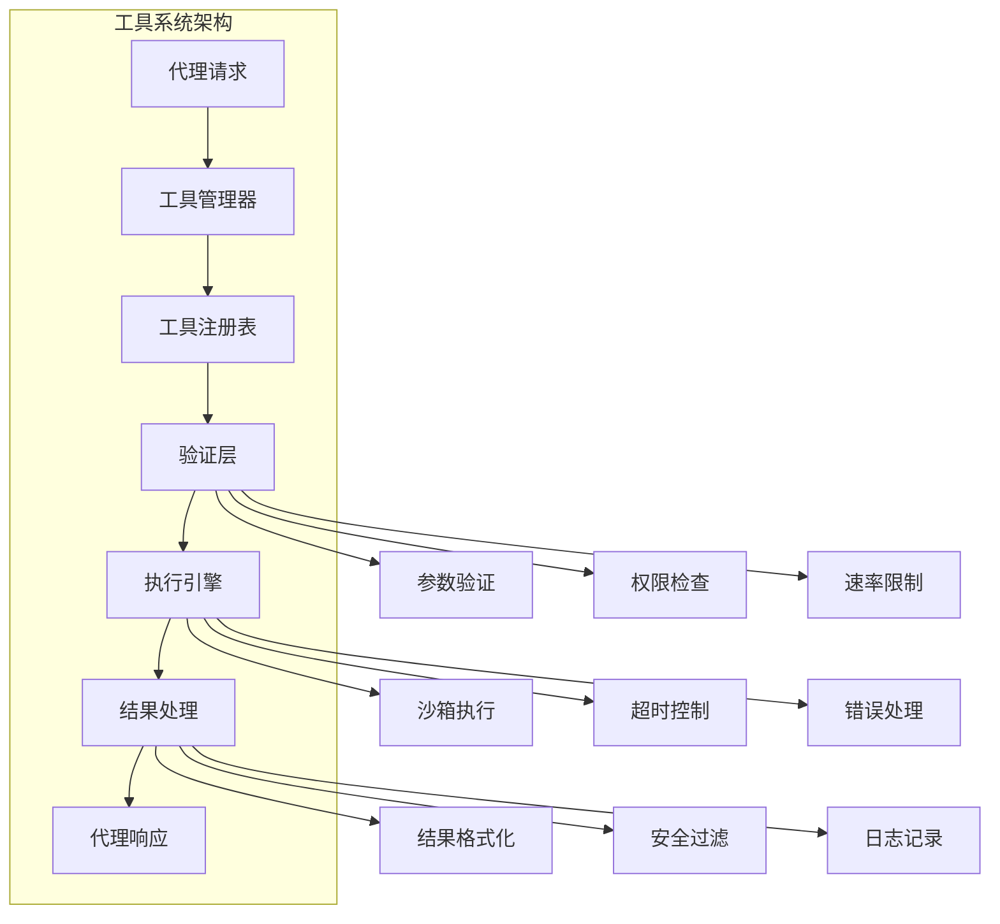

# 第4章: 工具系统

## 学习目标

- 理解工具系统的核心概念和架构
- 掌握工具的定义、注册和执行机制
- 学习工具安全性和权限管理
- 构建生产级的工具实现

## 4.1 工具基础

### 4.1.1 工具系统架构

工具系统是代理与外部系统交互的核心接口，提供了安全、可控的方式让代理执行各种操作。



### 4.1.2 工具接口定义

```typescript
// src/core/tool-interface.ts
export interface Tool {
  // 工具标识信息
  id: string;
  name: string;
  description: string;
  version: string;
  category: ToolCategory;
  
  // 执行相关
  execute(params: unknown, context: ToolContext): Promise<ToolResult>;
  validate(params: unknown): ValidationResult;
  
  // 权限和配置
  permissions: ToolPermission[];
  config?: ToolConfig;
  
  // 元数据
  metadata?: ToolMetadata;
}

export enum ToolCategory {
  FILE_OPERATIONS = 'file_operations',
  CODE_ANALYSIS = 'code_analysis',
  NETWORK = 'network',
  SYSTEM = 'system',
  DATABASE = 'database',
  CUSTOM = 'custom'
}

export interface ToolContext {
  agentId: string;
  taskId: string;
  sessionId: string;
  timestamp: number;
  environment: 'development' | 'staging' | 'production';
}

export interface ToolResult {
  success: boolean;
  data?: unknown;
  error?: string;
  metadata?: {
    executionTime: number;
    memoryUsage?: number;
    [key: string]: unknown;
  };
}

export interface ValidationResult {
  valid: boolean;
  errors?: string[];
  warnings?: string[];
}

export interface ToolPermission {
  type: 'read' | 'write' | 'execute' | 'network' | 'admin';
  resource: string;
  conditions?: Record<string, unknown>;
}

export interface ToolConfig {
  timeout?: number;
  maxRetries?: number;
  cacheable?: boolean;
  rateLimit?: {
    maxRequests: number;
    windowMs: number;
  };
}

export interface ToolMetadata {
  author?: string;
  createdAt?: string;
  updatedAt?: string;
  tags?: string[];
  examples?: ToolExample[];
}

export interface ToolExample {
  description: string;
  params: unknown;
  expectedResult: unknown;
}
```

### 4.1.3 基础工具抽象类

```typescript
// src/core/base-tool.ts
import { Tool, ToolContext, ToolResult, ValidationResult } from './tool-interface';

export abstract class BaseTool implements Tool {
  public abstract readonly id: string;
  public abstract readonly name: string;
  public abstract readonly description: string;
  public abstract readonly version: string;
  public abstract readonly category: ToolCategory;
  
  protected config: ToolConfig = {};
  protected permissions: ToolPermission[] = [];
  protected metadata: ToolMetadata = {};

  constructor(config?: ToolConfig) {
    if (config) {
      this.config = { ...this.config, ...config };
    }
  }

  // 抽象方法，子类必须实现
  abstract execute(params: unknown, context: ToolContext): Promise<ToolResult>;
  abstract validate(params: unknown): ValidationResult;

  // 工具信息
  getInfo() {
    return {
      id: this.id,
      name: this.name,
      description: this.description,
      version: this.version,
      category: this.category,
      permissions: this.permissions,
      config: this.config,
      metadata: this.metadata
    };
  }

  // 安全执行包装器
  async safeExecute(params: unknown, context: ToolContext): Promise<ToolResult> {
    const startTime = Date.now();
    
    try {
      // 1. 验证参数
      const validation = this.validate(params);
      if (!validation.valid) {
        return {
          success: false,
          error: `Validation failed: ${validation.errors?.join(', ')}`,
          metadata: { executionTime: Date.now() - startTime }
        };
      }

      // 2. 检查权限
      if (!this.checkPermissions(context)) {
        return {
          success: false,
          error: 'Permission denied',
          metadata: { executionTime: Date.now() - startTime }
        };
      }

      // 3. 检查速率限制
      if (this.config.rateLimit && !this.checkRateLimit(context)) {
        return {
          success: false,
          error: 'Rate limit exceeded',
          metadata: { executionTime: Date.now() - startTime }
        };
      }

      // 4. 执行工具
      const result = await this.executeWithTimeout(params, context, this.config.timeout || 30000);
      
      // 5. 添加执行元数据
      result.metadata = {
        ...result.metadata,
        executionTime: Date.now() - startTime
      };

      return result;
      
    } catch (error) {
      return {
        success: false,
        error: `Execution failed: ${error instanceof Error ? error.message : 'Unknown error'}`,
        metadata: { executionTime: Date.now() - startTime }
      };
    }
  }

  // 带超时的执行
  private async executeWithTimeout(
    params: unknown,
    context: ToolContext,
    timeout: number
  ): Promise<ToolResult> {
    return Promise.race([
      this.execute(params, context),
      this.createTimeoutPromise(timeout)
    ]);
  }

  private createTimeoutPromise(timeout: number): Promise<never> {
    return new Promise((_, reject) => {
      setTimeout(() => reject(new Error(`Tool execution timeout after ${timeout}ms`)), timeout);
    });
  }

  // 权限检查
  private checkPermissions(context: ToolContext): boolean {
    // 简化实现，实际应该根据上下文和权限配置检查
    return true;
  }

  // 速率限制检查
  private checkRateLimit(context: ToolContext): boolean {
    // 简化实现，实际应该实现速率限制逻辑
    return true;
  }

  // 设置权限
  setPermissions(permissions: ToolPermission[]): void {
    this.permissions = permissions;
  }

  // 设置元数据
  setMetadata(metadata: ToolMetadata): void {
    this.metadata = { ...this.metadata, ...metadata };
  }
}
```

## 4.2 文件操作工具

### 4.2.1 文件读取工具

```typescript
// src/tools/file-read.ts
import { BaseTool, ToolContext, ToolResult, ValidationResult, ToolCategory } from '../core/base-tool';

interface FileReadParams {
  path: string;
  encoding?: string;
  maxLines?: number;
  startLine?: number;
}

export class FileReadTool extends BaseTool {
  readonly id = 'file-read';
  readonly name = 'File Read';
  readonly description = 'Reads file contents with support for partial reading and multiple encodings';
  readonly version = '1.0.0';
  readonly category = ToolCategory.FILE_OPERATIONS;

  constructor() {
    super();
    
    // 设置权限
    this.setPermissions([
      {
        type: 'read',
        resource: 'filesystem',
        conditions: { path: '.*' }
      }
    ]);
    
    // 设置元数据
    this.setMetadata({
      author: 'opencode-swarm',
      createdAt: '2024-01-01',
      tags: ['file', 'read', 'filesystem'],
      examples: [
        {
          description: 'Read entire file',
          params: { path: './src/index.ts' },
          expectedResult: { success: true, data: { content: '...' } }
        },
        {
          description: 'Read first 100 lines',
          params: { path: './src/index.ts', maxLines: 100 },
          expectedResult: { success: true, data: { content: '...', lineCount: 100 } }
        }
      ]
    });
  }

  validate(params: unknown): ValidationResult {
    const errors: string[] = [];
    const warnings: string[] = [];

    if (typeof params !== 'object' || params === null) {
      return {
        valid: false,
        errors: ['Parameters must be an object']
      };
    }

    const fileParams = params as Record<string, unknown>;

    // 验证必需参数
    if (!fileParams.path || typeof fileParams.path !== 'string') {
      errors.push('path parameter is required and must be a string');
    }

    // 验证可选参数
    if (fileParams.encoding !== undefined && typeof fileParams.encoding !== 'string') {
      errors.push('encoding parameter must be a string');
    }

    if (fileParams.maxLines !== undefined && typeof fileParams.maxLines !== 'number') {
      errors.push('maxLines parameter must be a number');
    } else if (typeof fileParams.maxLines === 'number' && fileParams.maxLines <= 0) {
      errors.push('maxLines parameter must be positive');
    }

    if (fileParams.startLine !== undefined && typeof fileParams.startLine !== 'number') {
      errors.push('startLine parameter must be a number');
    } else if (typeof fileParams.startLine === 'number' && fileParams.startLine < 0) {
      errors.push('startLine parameter must be non-negative');
    }

    // 路径安全检查
    if (typeof fileParams.path === 'string') {
      if (fileParams.path.includes('..')) {
        warnings.push('Path contains .. which may access parent directories');
      }
      
      if (fileParams.path.length > 260) {
        errors.push('Path length exceeds maximum (260 characters)');
      }
    }

    return {
      valid: errors.length === 0,
      errors: errors.length > 0 ? errors : undefined,
      warnings: warnings.length > 0 ? warnings : undefined
    };
  }

  async execute(params: unknown, context: ToolContext): Promise<ToolResult> {
    try {
      const fileParams = params as FileReadParams;
      const fs = await import('fs/promises');
      const path = await import('path');

      // 规范化路径
      const normalizedPath = path.normalize(fileParams.path);
      
      // 检查文件是否存在
      try {
        await fs.access(normalizedPath);
      } catch {
        return {
          success: false,
          error: `File not found: ${normalizedPath}`
        };
      }

      // 读取文件
      const encoding = fileParams.encoding || 'utf-8';
      const fullContent = await fs.readFile(normalizedPath, encoding);
      
      // 处理部分读取
      let content = fullContent;
      let lineCount = 0;
      let bytesRead = fullContent.length;
      
      if (fileParams.maxLines || fileParams.startLine) {
        const lines = fullContent.split('\n');
        const startLine = fileParams.startLine || 0;
        const maxLines = fileParams.maxLines || lines.length - startLine;
        
        content = lines.slice(startLine, startLine + maxLines).join('\n');
        lineCount = Math.min(maxLines, lines.length - startLine);
        bytesRead = content.length;
      } else {
        lineCount = fullContent.split('\n').length;
      }

      // 获取文件统计信息
      const stats = await fs.stat(normalizedPath);
      
      return {
        success: true,
        data: {
          path: normalizedPath,
          content,
          size: bytesRead,
          lineCount,
          encoding,
          fileStats: {
            created: stats.birthtime,
            modified: stats.mtime,
            size: stats.size,
            isFile: stats.isFile(),
            isDirectory: stats.isDirectory()
          }
        }
      };
      
    } catch (error) {
      return {
        success: false,
        error: `Failed to read file: ${error instanceof Error ? error.message : 'Unknown error'}`
      };
    }
  }
}
```

### 4.2.2 文件写入工具

```typescript
// src/tools/file-write.ts
import { BaseTool, ToolContext, ToolResult, ValidationResult, ToolCategory } from '../core/base-tool';

interface FileWriteParams {
  path: string;
  content: string;
  encoding?: string;
  createDirs?: boolean;
  backup?: boolean;
}

export class FileWriteTool extends BaseTool {
  readonly id = 'file-write';
  readonly name = 'File Write';
  readonly description = 'Writes content to files with automatic directory creation and backup support';
  readonly version = '1.0.0';
  readonly category = ToolCategory.FILE_OPERATIONS;

  constructor() {
    super({
      timeout: 10000 // 文件写入超时设置
    });
    
    this.setPermissions([
      {
        type: 'write',
        resource: 'filesystem',
        conditions: { path: '.*' }
      }
    ]);
  }

  validate(params: unknown): ValidationResult {
    const errors: string[] = [];
    const warnings: string[] = [];

    if (typeof params !== 'object' || params === null) {
      return { valid: false, errors: ['Parameters must be an object'] };
    }

    const fileParams = params as Record<string, unknown>;

    if (!fileParams.path || typeof fileParams.path !== 'string') {
      errors.push('path parameter is required and must be a string');
    }

    if (fileParams.content === undefined || typeof fileParams.content !== 'string') {
      errors.push('content parameter is required and must be a string');
    }

    if (typeof fileParams.path === 'string') {
      // 路径安全检查
      if (fileParams.path.includes('..')) {
        warnings.push('Path contains .. which may access parent directories');
      }
      
      // 检查危险路径
      const dangerousPaths = [
        '/etc/passwd',
        '/etc/shadow',
        'system32',
        'windows'
      ];
      
      for (const dangerous of dangerousPaths) {
        if (fileParams.path.toLowerCase().includes(dangerous)) {
          errors.push(`Attempting to write to potentially dangerous path: ${dangerous}`);
        }
      }
    }

    // 内容大小检查
    if (typeof fileParams.content === 'string' && fileParams.content.length > 10_000_000) {
      warnings.push('Content size exceeds 10MB, this may take longer to write');
    }

    return {
      valid: errors.length === 0,
      errors: errors.length > 0 ? errors : undefined,
      warnings: warnings.length > 0 ? warnings : undefined
    };
  }

  async execute(params: unknown, context: ToolContext): Promise<ToolResult> {
    try {
      const fileParams = params as FileWriteParams;
      const fs = await import('fs/promises');
      const path = await import('path');

      const normalizedPath = path.normalize(fileParams.path);
      const encoding = fileParams.encoding || 'utf-8';
      const content = fileParams.content;

      // 备份现有文件
      if (fileParams.backup) {
        await this.createBackup(normalizedPath);
      }

      // 创建目录
      if (fileParams.createDirs !== false) {
        await fs.mkdir(path.dirname(normalizedPath), { recursive: true });
      }

      // 写入文件
      await fs.writeFile(normalizedPath, content, encoding);

      // 验证写入
      const writtenContent = await fs.readFile(normalizedPath, encoding);
      if (writtenContent !== content) {
        return {
          success: false,
          error: 'File write verification failed'
        };
      }

      // 获取文件统计
      const stats = await fs.stat(normalizedPath);

      return {
        success: true,
        data: {
          path: normalizedPath,
          bytesWritten: content.length,
          encoding,
          timestamp: new Date().toISOString(),
          fileStats: {
            size: stats.size,
            modified: stats.mtime
          }
        }
      };

    } catch (error) {
      return {
        success: false,
        error: `Failed to write file: ${error instanceof Error ? error.message : 'Unknown error'}`
      };
    }
  }

  private async createBackup(filePath: string): Promise<void> {
    try {
      const fs = await import('fs/promises');
      const path = await import('path');
      
      // 检查文件是否存在
      await fs.access(filePath);
      
      // 创建备份路径
      const backupPath = `${filePath}.backup-${Date.now()}`;
      await fs.copyFile(filePath, backupPath);
      
    } catch (error) {
      // 文件不存在或其他错误，忽略备份
    }
  }
}
```

### 4.2.3 文件搜索工具

```typescript
// src/tools/file-search.ts
import { BaseTool, ToolContext, ToolResult, ValidationResult, ToolCategory } from '../core/base-tool';

interface FileSearchParams {
  pattern: string;
  directory?: string;
  recursive?: boolean;
  fileTypes?: string[];
  maxResults?: number;
  caseSensitive?: boolean;
  excludePatterns?: string[];
}

export class FileSearchTool extends BaseTool {
  readonly id = 'file-search';
  readonly name = 'File Search';
  readonly description = 'Searches for files matching patterns with advanced filtering capabilities';
  readonly version = '1.0.0';
  readonly category = ToolCategory.FILE_OPERATIONS;

  validate(params: unknown): ValidationResult {
    const errors: string[] = [];

    if (typeof params !== 'object' || params === null) {
      return { valid: false, errors: ['Parameters must be an object'] };
    }

    const searchParams = params as Record<string, unknown>;

    if (!searchParams.pattern || typeof searchParams.pattern !== 'string') {
      errors.push('pattern parameter is required and must be a string');
    }

    return {
      valid: errors.length === 0,
      errors: errors.length > 0 ? errors : undefined
    };
  }

  async execute(params: unknown, context: ToolContext): Promise<ToolResult> {
    try {
      const searchParams = params as FileSearchParams;
      const fs = await import('fs/promises');
      const path = await import('path');

      const directory = searchParams.directory || '.';
      const maxResults = searchParams.maxResults || 100;
      const caseSensitive = searchParams.caseSensitive || false;
      
      const results = await this.searchRecursively(
        directory,
        searchParams.pattern,
        searchParams.recursive !== false,
        searchParams.fileTypes,
        maxResults,
        caseSensitive,
        searchParams.excludePatterns || []
      );

      return {
        success: true,
        data: {
          results: results.matches,
          totalMatches: results.totalMatches,
          searchTime: results.searchTime,
          directoriesScanned: results.directoriesScanned
        }
      };

    } catch (error) {
      return {
        success: false,
        error: `Search failed: ${error instanceof Error ? error.message : 'Unknown error'}`
      };
    }
  }

  private async searchRecursively(
    directory: string,
    pattern: string,
    recursive: boolean,
    fileTypes?: string[],
    maxResults?: number,
    caseSensitive?: boolean,
    excludePatterns: string[] = []
  ): Promise<any> {
    const startTime = Date.now();
    const matches: any[] = [];
    let totalMatches = 0;
    let directoriesScanned = 0;

    const regex = new RegExp(
      caseSensitive ? pattern : pattern,
      caseSensitive ? 'g' : 'gi'
    );

    const excludeRegex = excludePatterns.map(p => 
      new RegExp(p, caseSensitive ? '' : 'i')
    );

    async function scanDir(dir: string) {
      directoriesScanned++;
      const entries = await fs.readdir(dir, { withFileTypes: true });

      for (const entry of entries) {
        if (matches.length >= (maxResults || Infinity)) {
          return;
        }

        const fullPath = path.join(dir, entry.name);

        // 检查排除模式
        if (excludeRegex.some(regex => regex.test(fullPath))) {
          continue;
        }

        if (entry.isDirectory() && recursive) {
          await scanDir(fullPath);
        } else if (entry.isFile()) {
          // 检查文件类型
          if (fileTypes && !fileTypes.some(ext => entry.name.endsWith(ext))) {
            continue;
          }

          // 读取文件内容并搜索
          try {
            const content = await fs.readFile(fullPath, 'utf-8');
            const fileMatches = content.match(regex);
            
            if (fileMatches) {
              totalMatches += fileMatches.length;
              matches.push({
                path: fullPath,
                matches: fileMatches.length,
                sampleMatches: fileMatches.slice(0, 5)
              });
            }
          } catch (error) {
            // 无法读取文件，跳过
          }
        }
      }
    }

    await scanDir(directory);

    return {
      matches,
      totalMatches,
      searchTime: Date.now() - startTime,
      directoriesScanned
    };
  }
}
```

## 4.3 代码分析工具

### 4.3.1 语法分析工具

```typescript
// src/tools/syntax-analyzer.ts
import { BaseTool, ToolContext, ToolResult, ValidationResult, ToolCategory } from '../core/base-tool';

interface SyntaxAnalysisParams {
  files: string[];
  language?: string;
  includeAST?: boolean;
  includeTokens?: boolean;
}

export class SyntaxAnalyzerTool extends BaseTool {
  readonly id = 'syntax-analyzer';
  readonly name = 'Syntax Analyzer';
  readonly description = 'Analyzes code syntax using tree-sitter for multiple programming languages';
  readonly version = '1.0.0';
  readonly category = ToolCategory.CODE_ANALYSIS;

  private supportedLanguages = new Set([
    'typescript', 'javascript', 'python', 'go', 'rust', 
    'java', 'c', 'cpp', 'csharp', 'php', 'ruby'
  ]);

  validate(params: unknown): ValidationResult {
    const errors: string[] = [];

    if (typeof params !== 'object' || params === null) {
      return { valid: false, errors: ['Parameters must be an object'] };
    }

    const analysisParams = params as Record<string, unknown>;

    if (!analysisParams.files || !Array.isArray(analysisParams.files)) {
      errors.push('files parameter is required and must be an array');
    }

    if (analysisParams.language && typeof analysisParams.language !== 'string') {
      errors.push('language parameter must be a string');
    }

    return {
      valid: errors.length === 0,
      errors: errors.length > 0 ? errors : undefined
    };
  }

  async execute(params: unknown, context: ToolContext): Promise<ToolResult> {
    try {
      const analysisParams = params as SyntaxAnalysisParams;
      const fs = await import('fs/promises');

      const results: any[] = [];

      for (const filePath of analysisParams.files) {
        try {
          const content = await fs.readFile(filePath, 'utf-8');
          const language = analysisParams.language || this.detectLanguage(filePath);
          
          if (!this.supportedLanguages.has(language)) {
            results.push({
              file: filePath,
              error: `Unsupported language: ${language}`
            });
            continue;
          }

          const analysis = await this.analyzeSyntax(
            content,
            language,
            analysisParams.includeAST,
            analysisParams.includeTokens
          );

          results.push({
            file: filePath,
            language,
            ...analysis
          });

        } catch (error) {
          results.push({
            file: filePath,
            error: error instanceof Error ? error.message : 'Unknown error'
          });
        }
      }

      return {
        success: true,
        data: {
          results,
          totalFiles: analysisParams.files.length,
          successful: results.filter(r => !r.error).length,
          failed: results.filter(r => r.error).length
        }
      };

    } catch (error) {
      return {
        success: false,
        error: `Syntax analysis failed: ${error instanceof Error ? error.message : 'Unknown error'}`
      };
    }
  }

  private detectLanguage(filePath: string): string {
    const ext = filePath.split('.').pop()?.toLowerCase();
    
    const languageMap: Record<string, string> = {
      'ts': 'typescript',
      'tsx': 'typescript',
      'js': 'javascript',
      'jsx': 'javascript',
      'py': 'python',
      'go': 'go',
      'rs': 'rust',
      'java': 'java',
      'c': 'c',
      'cpp': 'cpp',
      'cs': 'csharp',
      'php': 'php',
      'rb': 'ruby'
    };

    return languageMap[ext || ''] || 'typescript';
  }

  private async analyzeSyntax(
    content: string,
    language: string,
    includeAST: boolean = false,
    includeTokens: boolean = false
  ): Promise<any> {
    // 这里应该使用实际的tree-sitter绑定
    // 由于这是一个示例，我们使用简化的实现
    
    const lines = content.split('\n');
    const errors: any[] = [];
    
    // 基本的语法检查
    for (let i = 0; i < lines.length; i++) {
      const line = lines[i];
      const lineNum = i + 1;
      
      // 检查常见语法错误
      if (line.includes('syntax error')) {
        errors.push({
          line: lineNum,
          message: 'Potential syntax error',
          severity: 'error'
        });
      }
    }

    return {
      errors,
      warnings: [],
      metrics: {
        lines: lines.length,
        characters: content.length,
        nonEmptyLines: lines.filter(line => line.trim().length > 0).length
      },
      ast: includeAST ? this.generateAST(content) : undefined,
      tokens: includeTokens ? this.tokenize(content) : undefined
    };
  }

  private generateAST(content: string): any {
    // 简化的AST生成
    return {
      type: 'Program',
      body: []
    };
  }

  private tokenize(content: string): any[] {
    // 简化的分词
    return content.split(/\s+/).map(token => ({
      type: 'Unknown',
      value: token
    }));
  }
}
```

## 4.4 网络工具

### 4.4.1 HTTP请求工具

```typescript
// src/tools/http-client.ts
import { BaseTool, ToolContext, ToolResult, ValidationResult, ToolCategory } from '../core/base-tool';

interface HttpRequestParams {
  url: string;
  method?: 'GET' | 'POST' | 'PUT' | 'DELETE' | 'PATCH';
  headers?: Record<string, string>;
  body?: any;
  timeout?: number;
  followRedirects?: boolean;
}

export class HttpClientTool extends BaseTool {
  readonly id = 'http-client';
  readonly name = 'HTTP Client';
  readonly description = 'Makes HTTP requests with support for various methods and configurations';
  readonly version = '1.0.0';
  readonly category = ToolCategory.NETWORK;

  constructor() {
    super({
      timeout: 30000,
      rateLimit: {
        maxRequests: 100,
        windowMs: 60000 // 100 requests per minute
      }
    });

    this.setPermissions([
      {
        type: 'network',
        resource: 'http',
        conditions: { allowedProtocols: ['http', 'https'] }
      }
    ]);
  }

  validate(params: unknown): ValidationResult {
    const errors: string[] = [];
    const warnings: string[] = [];

    if (typeof params !== 'object' || params === null) {
      return { valid: false, errors: ['Parameters must be an object'] };
    }

    const httpParams = params as Record<string, unknown>;

    if (!httpParams.url || typeof httpParams.url !== 'string') {
      errors.push('url parameter is required and must be a string');
    } else {
      try {
        const url = new URL(httpParams.url as string);
        if (!['http:', 'https:'].includes(url.protocol)) {
          errors.push('Only http and https protocols are supported');
        }
      } catch {
        errors.push('Invalid URL format');
      }
    }

    if (httpParams.method && !['GET', 'POST', 'PUT', 'DELETE', 'PATCH'].includes(httpParams.method as string)) {
      errors.push('method must be one of: GET, POST, PUT, DELETE, PATCH');
    }

    if (httpParams.timeout !== undefined && typeof httpParams.timeout !== 'number') {
      errors.push('timeout parameter must be a number');
    }

    return {
      valid: errors.length === 0,
      errors: errors.length > 0 ? errors : undefined,
      warnings: warnings.length > 0 ? warnings : undefined
    };
  }

  async execute(params: unknown, context: ToolContext): Promise<ToolResult> {
    try {
      const httpParams = params as HttpRequestParams;
      const method = httpParams.method || 'GET';
      const url = httpParams.url;
      const timeout = httpParams.timeout || 30000;

      const startTime = Date.now();

      // 使用fetch API (Node.js 18+)
      const controller = new AbortController();
      const timeoutId = setTimeout(() => controller.abort(), timeout);

      const response = await fetch(url, {
        method,
        headers: httpParams.headers,
        body: httpParams.body ? JSON.stringify(httpParams.body) : undefined,
        signal: controller.signal
      });

      clearTimeout(timeoutId);

      const duration = Date.now() - startTime;

      // 获取响应数据
      const responseData = await this.getResponseData(response);

      return {
        success: response.ok,
        data: {
          url,
          method,
          status: response.status,
          statusText: response.statusText,
          headers: Object.fromEntries(response.headers.entries()),
          duration,
          data: responseData,
          size: JSON.stringify(responseData).length
        },
        error: response.ok ? undefined : `HTTP ${response.status}: ${response.statusText}`
      };

    } catch (error) {
      return {
        success: false,
        error: `HTTP request failed: ${error instanceof Error ? error.message : 'Unknown error'}`
      };
    }
  }

  private async getResponseData(response: Response): Promise<any> {
    const contentType = response.headers.get('content-type');

    if (contentType?.includes('application/json')) {
      return await response.json();
    } else if (contentType?.includes('text/')) {
      return await response.text();
    } else {
      return await response.arrayBuffer();
    }
  }
}
```

## 4.5 工具安全管理

### 4.5.1 工具权限系统

```typescript
// src/core/tool-permission-manager.ts
export interface PermissionCheckResult {
  allowed: boolean;
  reason?: string;
  conditions?: Record<string, unknown>;
}

export class ToolPermissionManager {
  private agentPermissions: Map<string, Set<string>> = new Map();
  private toolPermissions: Map<string, ToolPermission[]> = new Map();

  // 设置代理权限
  setAgentPermissions(agentId: string, permissions: string[]): void {
    this.agentPermissions.set(agentId, new Set(permissions));
  }

  // 检查工具权限
  checkToolPermission(
    agentId: string,
    toolId: string,
    context: ToolContext
  ): PermissionCheckResult {
    // 1. 检查代理是否有权限使用该工具
    const agentPerms = this.agentPermissions.get(agentId);
    if (!agentPerms || !agentPerms.has(toolId)) {
      return {
        allowed: false,
        reason: `Agent ${agentId} does not have permission to use tool ${toolId}`
      };
    }

    // 2. 检查工具特定的权限条件
    const toolPerms = this.toolPermissions.get(toolId);
    if (toolPerms) {
      for (const perm of toolPerms) {
        const check = this.checkPermissionCondition(perm, context);
        if (!check.allowed) {
          return check;
        }
      }
    }

    return { allowed: true };
  }

  // 检查权限条件
  private checkPermissionCondition(
    permission: ToolPermission,
    context: ToolContext
  ): PermissionCheckResult {
    // 实现权限条件检查逻辑
    return { allowed: true };
  }

  // 注册工具权限
  registerToolPermissions(toolId: string, permissions: ToolPermission[]): void {
    this.toolPermissions.set(toolId, permissions);
  }
}
```

### 4.5.2 工具速率限制

```typescript
// src/core/tool-rate-limiter.ts
interface RateLimitEntry {
  count: number;
  windowStart: number;
}

export class ToolRateLimiter {
  private entries: Map<string, RateLimitEntry> = new Map();
  private maxRequests: number;
  private windowMs: number;

  constructor(maxRequests: number, windowMs: number) {
    this.maxRequests = maxRequests;
    this.windowMs = windowMs;
  }

  checkLimit(identifier: string): { allowed: boolean; resetTime?: number } {
    const now = Date.now();
    const entry = this.entries.get(identifier);

    if (!entry || now - entry.windowStart > this.windowMs) {
      // 创建新的时间窗口
      this.entries.set(identifier, {
        count: 1,
        windowStart: now
      });
      return { allowed: true };
    }

    if (entry.count >= this.maxRequests) {
      return {
        allowed: false,
        resetTime: entry.windowStart + this.windowMs
      };
    }

    entry.count++;
    return { allowed: true };
  }

  cleanup(): void {
    const now = Date.now();
    for (const [key, entry] of this.entries.entries()) {
      if (now - entry.windowStart > this.windowMs) {
        this.entries.delete(key);
      }
    }
  }
}
```

## 4.6 本章小结

### 关键要点

- **工具架构**: 分层设计，包括验证层、执行引擎、结果处理
- **工具类型**: 文件操作、代码分析、网络请求等分类
- **安全机制**: 权限管理、速率限制、参数验证
- **生产实现**: 超时控制、错误处理、日志记录

### 最佳实践

1. **总是验证输入参数** - 防止安全漏洞和错误
2. **实现适当的权限控制** - 限制代理的操作范围
3. **添加速率限制** - 防止滥用和资源耗尽
4. **提供详细的错误信息** - 便于调试和问题解决
5. **记录工具使用日志** - 审计和监控

### 下一步学习

现在你已经掌握了工具系统的核心概念，接下来我们将：

- 📖 **第5章**: 学习状态管理和持久化
- 🔧 **实践**: 构建可恢复的代理系统
- 🎯 **目标**: 理解如何保存和恢复代理状态

---

**准备好深入状态管理的高级话题了吗？** 💾
