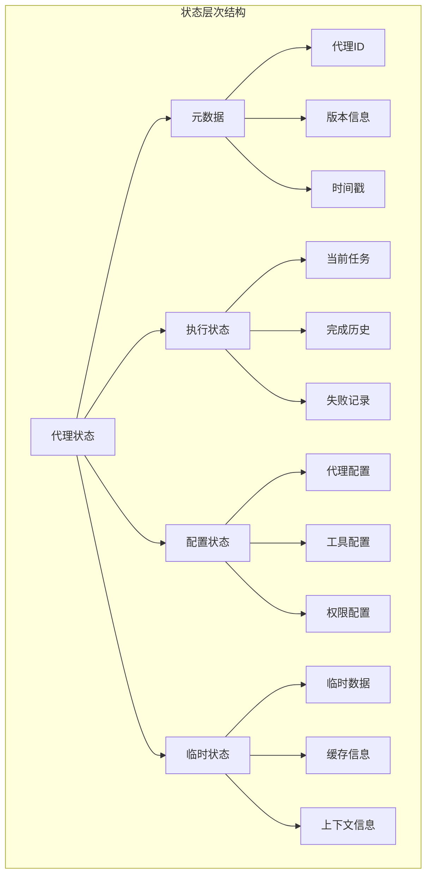
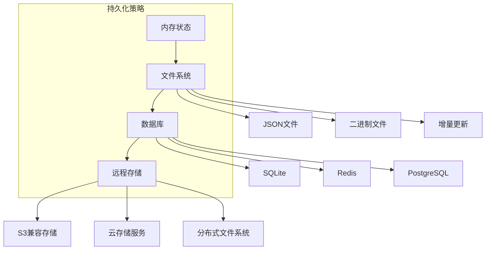
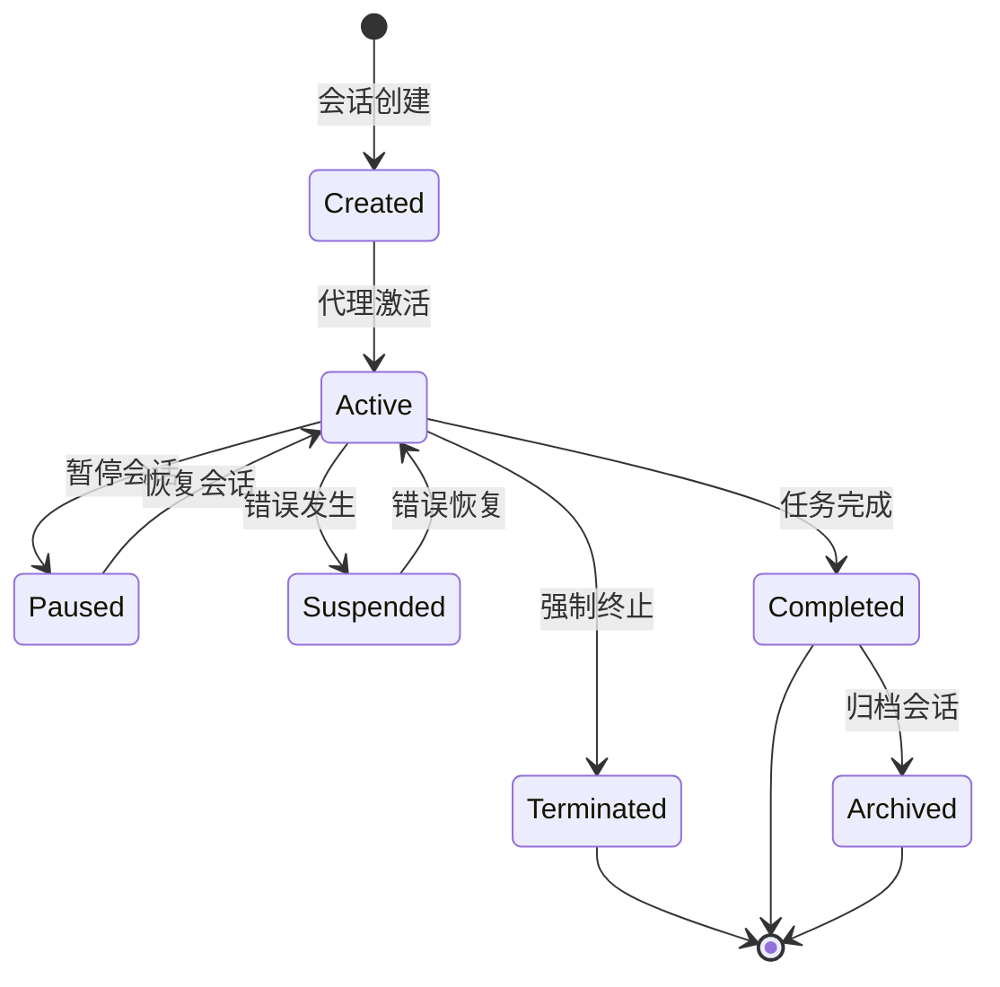
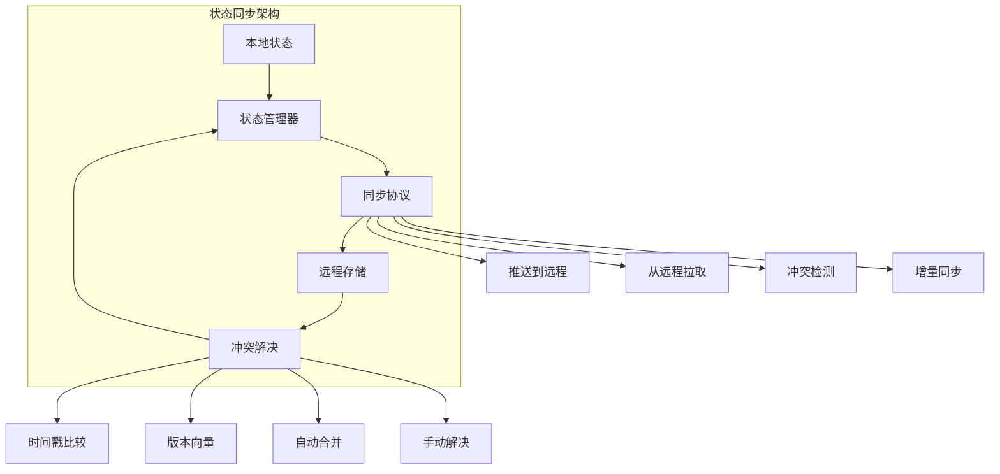

# 第5章: 状态管理与持久化

## 学习目标

- 理解代理状态管理的核心概念
- 掌握状态持久化的实现机制
- 学习会话管理和恢复策略
- 构建可靠的状态同步系统

## 5.1 状态管理基础

### 5.1.1 代理状态模型

代理状态是代理在执行过程中的所有信息的集合，包括配置、执行历史、当前任务等。



### 5.1.2 状态接口定义

```typescript
// src/core/state-interface.ts
export interface AgentState {
  // 基础信息
  id: string;
  name: string;
  version: string;
  status: AgentStatus;
  
  // 时间信息
  createdAt: number;
  updatedAt: number;
  lastActivityAt: number;
  
  // 执行信息
  currentTask?: Task;
  taskHistory: TaskHistory;
  metrics: AgentMetrics;
  
  // 配置信息
  config: AgentConfig;
  tools: ToolState[];
  
  // 自定义数据
  customData?: Record<string, unknown>;
}

export enum AgentStatus {
  UNINITIALIZED = 'uninitialized',
  INITIALIZING = 'initializing',
  READY = 'ready',
  BUSY = 'busy',
  PAUSED = 'paused',
  ERROR = 'error',
  COMPLETED = 'completed',
  TERMINATED = 'terminated'
}

export interface TaskHistory {
  completed: Task[];
  failed: Task[];
  skipped: Task[];
  total: number;
}

export interface AgentMetrics {
  tasksCompleted: number;
  tasksFailed: number;
  totalExecutionTime: number;
  averageTaskTime: number;
  memoryUsage: number;
  cpuUsage: number;
}

export interface ToolState {
  id: string;
  name: string;
  status: 'active' | 'inactive' | 'error';
  usageCount: number;
  lastUsed?: number;
  errorCount: number;
}

export interface StateSnapshot extends AgentState {
  snapshotId: string;
  snapshotTime: number;
  checksum: string;
}

export interface StateTransition {
  from: AgentStatus;
  to: AgentStatus;
  timestamp: number;
  reason?: string;
  metadata?: Record<string, unknown>;
}
```

### 5.1.3 状态管理器实现

```typescript
// src/core/state-manager.ts
import { EventEmitter } from 'events';
import { AgentState, AgentStatus, StateSnapshot, StateTransition } from './state-interface';

export class StateManager extends EventEmitter {
  private state: AgentState;
  private transitions: StateTransition[] = [];
  private snapshots: Map<string, StateSnapshot> = new Map();
  private autoSaveEnabled: boolean = true;
  private maxSnapshots: number = 10;

  constructor(initialState: AgentState) {
    super();
    this.state = this.cloneState(initialState);
  }

  // 获取当前状态
  getState(): AgentState {
    return this.cloneState(this.state);
  }

  // 更新状态
  async updateState(updates: Partial<AgentState>): Promise<void> {
    const oldState = this.cloneState(this.state);
    
    // 合并更新
    this.state = {
      ...this.state,
      ...updates,
      updatedAt: Date.now(),
      lastActivityAt: Date.now()
    };

    // 检查状态转换
    if (oldState.status !== this.state.status) {
      await this.recordTransition(oldState.status, this.state.status);
    }

    // 触发状态更新事件
    this.emit('stateUpdated', this.state, oldState);

    // 自动保存
    if (this.autoSaveEnabled) {
      await this.saveState();
    }
  }

  // 记录状态转换
  private async recordTransition(from: AgentStatus, to: AgentStatus): Promise<void> {
    const transition: StateTransition = {
      from,
      to,
      timestamp: Date.now(),
      reason: this.getTransitionReason(from, to)
    };

    this.transitions.push(transition);

    // 触发转换事件
    this.emit('statusChanged', transition);

    // 限制转换历史大小
    if (this.transitions.length > 100) {
      this.transitions = this.transitions.slice(-100);
    }
  }

  // 获取状态转换原因
  private getTransitionReason(from: AgentStatus, to: AgentStatus): string {
    const reasons: Record<string, string> = {
      'uninitialized->initializing': 'Agent initialization started',
      'initializing->ready': 'Agent initialization completed',
      'ready->busy': 'Task execution started',
      'busy->ready': 'Task execution completed',
      'busy->error': 'Task execution failed',
      'error->ready': 'Error recovered',
      'ready->completed': 'All tasks completed',
      'completed->terminated': 'Agent shutdown',
      'error->terminated': 'Agent terminated due to error'
    };

    return reasons[`${from}->${to}`] || `Status changed from ${from} to ${to}`;
  }

  // 创建状态快照
  async createSnapshot(): Promise<StateSnapshot> {
    const snapshot: StateSnapshot = {
      ...this.cloneState(this.state),
      snapshotId: this.generateSnapshotId(),
      snapshotTime: Date.now(),
      checksum: this.calculateChecksum()
    };

    // 存储快照
    this.snapshots.set(snapshot.snapshotId, snapshot);

    // 限制快照数量
    if (this.snapshots.size > this.maxSnapshots) {
      const oldestSnapshot = this.findOldestSnapshot();
      if (oldestSnapshot) {
        this.snapshots.delete(oldestSnapshot.snapshotId);
      }
    }

    // 触发快照事件
    this.emit('snapshotCreated', snapshot);

    return snapshot;
  }

  // 恢复快照
  async restoreSnapshot(snapshotId: string): Promise<boolean> {
    const snapshot = this.snapshots.get(snapshotId);
    
    if (!snapshot) {
      throw new Error(`Snapshot ${snapshotId} not found`);
    }

    // 验证快照完整性
    if (snapshot.checksum !== this.calculateChecksumFromState(snapshot)) {
      throw new Error('Snapshot checksum mismatch - data may be corrupted');
    }

    // 恢复状态
    this.state = this.cloneState(snapshot);
    
    // 触发恢复事件
    this.emit('snapshotRestored', snapshot);

    return true;
  }

  // 获取快照列表
  getSnapshots(): StateSnapshot[] {
    return Array.from(this.snapshots.values())
      .sort((a, b) => b.snapshotTime - a.snapshotTime);
  }

  // 删除快照
  deleteSnapshot(snapshotId: string): boolean {
    return this.snapshots.delete(snapshotId);
  }

  // 保存状态到持久化存储
  async saveState(): Promise<void> {
    try {
      const stateData = JSON.stringify(this.state, null, 2);
      const fs = await import('fs/promises');
      const path = await import('path');

      const stateDir = '.swarm/state';
      await fs.mkdir(stateDir, { recursive: true });

      const stateFile = path.join(stateDir, `${this.state.id}.json`);
      await fs.writeFile(stateFile, stateData, 'utf-8');

      // 触发保存事件
      this.emit('stateSaved', this.state);

    } catch (error) {
      this.emit('stateSaveError', error);
      throw new Error(`Failed to save state: ${error instanceof Error ? error.message : 'Unknown error'}`);
    }
  }

  // 从持久化存储加载状态
  async loadState(agentId: string): Promise<AgentState | null> {
    try {
      const fs = await import('fs/promises');
      const path = await import('path');

      const stateFile = path.join('.swarm/state', `${agentId}.json`);
      const stateData = await fs.readFile(stateFile, 'utf-8');
      
      this.state = JSON.parse(stateData);
      
      // 触发加载事件
      this.emit('stateLoaded', this.state);

      return this.state;

    } catch (error) {
      if ((error as NodeJS.ErrnoException).code === 'ENOENT') {
        return null; // 文件不存在，返回null
      }
      throw new Error(`Failed to load state: ${error instanceof Error ? error.message : 'Unknown error'}`);
    }
  }

  // 清除状态
  async clearState(): Promise<void> {
    this.state = this.createInitialState();
    this.snapshots.clear();
    this.transitions = [];

    // 触发清除事件
    this.emit('stateCleared');
  }

  // 获取状态转换历史
  getTransitions(): StateTransition[] {
    return [...this.transitions];
  }

  // 设置自动保存
  setAutoSave(enabled: boolean): void {
    this.autoSaveEnabled = enabled;
  }

  // 设置最大快照数
  setMaxSnapshots(max: number): void {
    this.maxSnapshots = max;
    
    // 清理多余的快照
    while (this.snapshots.size > this.maxSnapshots) {
      const oldestSnapshot = this.findOldestSnapshot();
      if (oldestSnapshot) {
        this.snapshots.delete(oldestSnapshot.snapshotId);
      } else {
        break;
      }
    }
  }

  // 辅助方法：克隆状态
  private cloneState(state: AgentState): AgentState {
    return JSON.parse(JSON.stringify(state));
  }

  // 辅助方法：生成快照ID
  private generateSnapshotId(): string {
    return `snapshot-${Date.now()}-${Math.random().toString(36).substr(2, 9)}`;
  }

  // 辅助方法：计算校验和
  private calculateChecksum(): string {
    return this.calculateChecksumFromState(this.state);
  }

  // 辅助方法：从状态计算校验和
  private calculateChecksumFromState(state: AgentState): string {
    const crypto = require('crypto');
    const stateString = JSON.stringify(state);
    return crypto.createHash('sha256').update(stateString).digest('hex');
  }

  // 辅助方法：查找最旧的快照
  private findOldestSnapshot(): StateSnapshot | undefined {
    let oldest: StateSnapshot | undefined;
    
    for (const snapshot of this.snapshots.values()) {
      if (!oldest || snapshot.snapshotTime < oldest.snapshotTime) {
        oldest = snapshot;
      }
    }

    return oldest;
  }

  // 辅助方法：创建初始状态
  private createInitialState(): AgentState {
    return {
      id: '',
      name: '',
      version: '',
      status: AgentStatus.UNINITIALIZED,
      createdAt: Date.now(),
      updatedAt: Date.now(),
      lastActivityAt: Date.now(),
      taskHistory: {
        completed: [],
        failed: [],
        skipped: [],
        total: 0
      },
      metrics: {
        tasksCompleted: 0,
        tasksFailed: 0,
        totalExecutionTime: 0,
        averageTaskTime: 0,
        memoryUsage: 0,
        cpuUsage: 0
      },
      config: {},
      tools: []
    };
  }
}
```

## 5.2 状态持久化

### 5.2.1 持久化策略



### 5.2.2 文件系统持久化

```typescript
// src/persistence/filesystem-persistence.ts
import { AgentState } from '../core/state-interface';
import { promises as fs } from 'fs';
import * as path from 'path';
import * as crypto from 'crypto';

export class FileSystemPersistence {
  private basePath: string;
  private compressionEnabled: boolean;
  private encryptionEnabled: boolean;
  private encryptionKey?: Buffer;

  constructor(
    basePath: string = '.swarm',
    options: {
      compression?: boolean;
      encryption?: boolean;
      encryptionKey?: string;
    } = {}
  ) {
    this.basePath = basePath;
    this.compressionEnabled = options.compression || false;
    this.encryptionEnabled = options.encryption || false;
    
    if (options.encryptionKey) {
      this.encryptionKey = Buffer.from(options.encryptionKey, 'hex');
    }
  }

  async saveState(agentId: string, state: AgentState): Promise<void> {
    const stateDir = path.join(this.basePath, 'state');
    await fs.mkdir(stateDir, { recursive: true });

    const stateFile = path.join(stateDir, `${agentId}.json`);
    
    // 序列化状态
    let stateData = JSON.stringify(state, null, 2);

    // 加密
    if (this.encryptionEnabled && this.encryptionKey) {
      stateData = this.encryptData(stateData);
    }

    // 压缩
    if (this.compressionEnabled) {
      stateData = await this.compressData(stateData);
    }

    // 写入文件
    await fs.writeFile(stateFile, stateData, 'utf-8');

    // 创建元数据
    await this.saveMetadata(agentId, state);
  }

  async loadState(agentId: string): Promise<AgentState | null> {
    try {
      const stateFile = path.join(this.basePath, 'state', `${agentId}.json`);
      
      // 读取文件
      let stateData = await fs.readFile(stateFile, 'utf-8');

      // 解压缩
      if (this.compressionEnabled) {
        stateData = await this.decompressData(stateData);
      }

      // 解密
      if (this.encryptionEnabled && this.encryptionKey) {
        stateData = this.decryptData(stateData);
      }

      // 解析状态
      const state = JSON.parse(stateData);
      
      // 验证完整性
      const metadata = await this.loadMetadata(agentId);
      if (metadata && metadata.checksum !== this.calculateChecksum(state)) {
        throw new Error('State file integrity check failed');
      }

      return state;

    } catch (error) {
      if ((error as NodeJS.ErrnoException).code === 'ENOENT') {
        return null;
      }
      throw error;
    }
  }

  async deleteState(agentId: string): Promise<void> {
    const stateFile = path.join(this.basePath, 'state', `${agentId}.json`);
    const metadataFile = path.join(this.basePath, 'metadata', `${agentId}.json`);

    await fs.unlink(stateFile).catch(() => {});
    await fs.unlink(metadataFile).catch(() => {});
  }

  async listStates(): Promise<string[]> {
    const stateDir = path.join(this.basePath, 'state');
    
    try {
      const files = await fs.readdir(stateDir);
      return files
        .filter(file => file.endsWith('.json'))
        .map(file => file.replace('.json', ''));
    } catch {
      return [];
    }
  }

  private async saveMetadata(agentId: string, state: AgentState): Promise<void> {
    const metadataDir = path.join(this.basePath, 'metadata');
    await fs.mkdir(metadataDir, { recursive: true });

    const metadataFile = path.join(metadataDir, `${agentId}.json`);
    const metadata = {
      agentId,
      checksum: this.calculateChecksum(state),
      createdAt: state.createdAt,
      updatedAt: state.updatedAt,
      size: JSON.stringify(state).length
    };

    await fs.writeFile(metadataFile, JSON.stringify(metadata, null, 2), 'utf-8');
  }

  private async loadMetadata(agentId: string): Promise<any> {
    try {
      const metadataFile = path.join(this.basePath, 'metadata', `${agentId}.json`);
      const metadataData = await fs.readFile(metadataFile, 'utf-8');
      return JSON.parse(metadataData);
    } catch {
      return null;
    }
  }

  private calculateChecksum(state: AgentState): string {
    const stateString = JSON.stringify(state);
    return crypto.createHash('sha256').update(stateString).digest('hex');
  }

  private encryptData(data: string): string {
    if (!this.encryptionKey) {
      throw new Error('Encryption key not provided');
    }

    const algorithm = 'aes-256-gcm';
    const iv = crypto.randomBytes(16);
    const cipher = crypto.createCipheriv(algorithm, this.encryptionKey, iv);

    let encrypted = cipher.update(data, 'utf8', 'hex');
    encrypted += cipher.final('hex');
    const authTag = cipher.getAuthTag();

    return JSON.stringify({
      encrypted,
      iv: iv.toString('hex'),
      authTag: authTag.toString('hex')
    });
  }

  private decryptData(encryptedData: string): string {
    if (!this.encryptionKey) {
      throw new Error('Encryption key not provided');
    }

    const { encrypted, iv, authTag } = JSON.parse(encryptedData);
    const algorithm = 'aes-256-gcm';
    
    const decipher = crypto.createDecipheriv(
      algorithm,
      this.encryptionKey,
      Buffer.from(iv, 'hex')
    );

    decipher.setAuthTag(Buffer.from(authTag, 'hex'));

    let decrypted = decipher.update(encrypted, 'hex', 'utf8');
    decrypted += decipher.final('utf8');

    return decrypted;
  }

  private async compressData(data: string): Promise<string> {
    // 简化实现，实际应该使用压缩库
    return data;
  }

  private async decompressData(data: string): Promise<string> {
    // 简化实现，实际应该使用解压缩库
    return data;
  }
}
```

### 5.2.3 数据库持久化

```typescript
// src/persistence/database-persistence.ts
import Database from 'better-sqlite3';
import { AgentState } from '../core/state-interface';

export class DatabasePersistence {
  private db: Database.Database;
  private initialized: boolean = false;
  private initializationPromise: Promise<void> | null = null;

  private constructor(dbPath: string = '.swarm/state.db') {
    this.db = new Database(dbPath);
  }

  /**
   * 静态工厂方法：创建并初始化 DatabasePersistence 实例
   * 这是推荐的创建方式，确保数据库在返回前已正确初始化
   */
  static async create(dbPath: string = '.swarm/state.db'): Promise<DatabasePersistence> {
    const instance = new DatabasePersistence(dbPath);
    await instance.initialize();
    return instance;
  }

  /**
   * 异步初始化数据库表结构
   * 必须在使用实例前完成此初始化
   */
  private async initialize(): Promise<void> {
    // 防止重复初始化
    if (this.initializationPromise) {
      return this.initializationPromise;
    }

    this.initializationPromise = (async () => {
      if (this.initialized) return;

      try {
        // 创建表
        this.db.exec(`
          CREATE TABLE IF NOT EXISTS agent_states (
            agent_id TEXT PRIMARY KEY,
            state_data TEXT NOT NULL,
            checksum TEXT NOT NULL,
            created_at INTEGER NOT NULL,
            updated_at INTEGER NOT NULL,
            version INTEGER NOT NULL DEFAULT 1
          );

          CREATE TABLE IF NOT EXISTS state_snapshots (
            snapshot_id TEXT PRIMARY KEY,
            agent_id TEXT NOT NULL,
            state_data TEXT NOT NULL,
            created_at INTEGER NOT NULL,
            FOREIGN KEY (agent_id) REFERENCES agent_states(agent_id) ON DELETE CASCADE
          );

          CREATE INDEX IF NOT EXISTS idx_snapshots_agent ON state_snapshots(agent_id);
          CREATE INDEX IF NOT EXISTS idx_snapshots_created ON state_snapshots(created_at);
        `);

        this.initialized = true;
      } catch (error) {
        // 清理失败的初始化状态，允许重试
        this.initializationPromise = null;
        throw new Error(
          `Failed to initialize database: ${error instanceof Error ? error.message : 'Unknown error'}`
        );
      }
    })();

    return this.initializationPromise;
  }

  /**
   * 确保数据库已初始化
   * 所有公共方法应在操作前调用此方法
   */
  private async ensureInitialized(): Promise<void> {
    if (!this.initialized) {
      if (!this.initializationPromise) {
        // 如果通过构造函数创建而非工厂方法，延迟初始化
        await this.initialize();
      } else {
        await this.initializationPromise;
      }
    }
  }

  async saveState(agentId: string, state: AgentState): Promise<void> {
    // 确保数据库已初始化
    await this.ensureInitialized();

    const stateData = JSON.stringify(state);
    const checksum = this.calculateChecksum(state);
    const now = Date.now();

    const stmt = this.db.prepare(`
      INSERT OR REPLACE INTO agent_states 
      (agent_id, state_data, checksum, created_at, updated_at, version)
      VALUES (?, ?, ?, ?, ?, 
        COALESCE((SELECT version FROM agent_states WHERE agent_id = ?) + 1, 1)
      )
    `);

    stmt.run(agentId, stateData, checksum, state.createdAt, now, agentId);
  }

  async loadState(agentId: string): Promise<AgentState | null> {
    // 确保数据库已初始化
    await this.ensureInitialized();

    const stmt = this.db.prepare('SELECT state_data, checksum FROM agent_states WHERE agent_id = ?');
    const row = stmt.get(agentId) as any;

    if (!row) {
      return null;
    }

    const state = JSON.parse(row.state_data) as AgentState;
    
    // 验证校验和
    if (row.checksum !== this.calculateChecksum(state)) {
      throw new Error('State checksum mismatch');
    }

    return state;
  }

  async deleteState(agentId: string): Promise<void> {
    // 确保数据库已初始化
    await this.ensureInitialized();

    const stmt = this.db.prepare('DELETE FROM agent_states WHERE agent_id = ?');
    stmt.run(agentId);
  }

  async listStates(): Promise<Array<{ agentId: string; updatedAt: number }>> {
    // 确保数据库已初始化
    await this.ensureInitialized();

    const stmt = this.db.prepare('SELECT agent_id, updated_at FROM agent_states ORDER BY updated_at DESC');
    return stmt.all() as any;
  }

  async saveSnapshot(agentId: string, snapshotId: string, state: AgentState): Promise<void> {
    // 确保数据库已初始化
    await this.ensureInitialized();

    const stateData = JSON.stringify(state);
    const now = Date.now();

    const stmt = this.db.prepare(`
      INSERT INTO state_snapshots (snapshot_id, agent_id, state_data, created_at)
      VALUES (?, ?, ?, ?)
    `);

    stmt.run(snapshotId, agentId, stateData, now);
  }

  async loadSnapshot(snapshotId: string): Promise<AgentState | null> {
    // 确保数据库已初始化
    await this.ensureInitialized();

    const stmt = this.db.prepare('SELECT state_data FROM state_snapshots WHERE snapshot_id = ?');
    const row = stmt.get(snapshotId) as any;

    if (!row) {
      return null;
    }

    return JSON.parse(row.state_data);
  }

  async listSnapshots(agentId: string): Promise<Array<{ snapshotId: string; createdAt: number }>> {
    // 确保数据库已初始化
    await this.ensureInitialized();

    const stmt = this.db.prepare(`
      SELECT snapshot_id, created_at 
      FROM state_snapshots 
      WHERE agent_id = ? 
      ORDER BY created_at DESC
    `);
    
    return stmt.all(agentId) as any;
  }

  async deleteSnapshot(snapshotId: string): Promise<void> {
    // 确保数据库已初始化
    await this.ensureInitialized();

    const stmt = this.db.prepare('DELETE FROM state_snapshots WHERE snapshot_id = ?');
    stmt.run(snapshotId);
  }

  async cleanup(oldThanMs: number): Promise<number> {
    // 确保数据库已初始化
    await this.ensureInitialized();

    const cutoffTime = Date.now() - oldThanMs;

    const stmt = this.db.prepare('DELETE FROM state_snapshots WHERE created_at < ?');
    const result = stmt.run(cutoffTime);

    return result.changes;
  }

  private calculateChecksum(state: AgentState): string {
    const crypto = require('crypto');
    const stateString = JSON.stringify(state);
    return crypto.createHash('sha256').update(stateString).digest('hex');
  }

  close(): void {
    this.db.close();
  }

  /**
   * 使用说明：
   *
   * 推荐使用静态工厂方法创建实例：
   * ```typescript
   * const persistence = await DatabasePersistence.create();
   * ```
   *
   * 或者传入已初始化的持久化实例：
   * ```typescript
   * const existing = await DatabasePersistence.create('./custom/path.db');
   * const sessionManager = await SessionManager.create(existing);
   * ```
   *
   * 不推荐但支持的向后兼容方式：
   * ```typescript
   * const persistence = new DatabasePersistence(); // 延迟初始化
   * await persistence.saveState(id, state); // 首次使用时自动初始化
   * ```
   */
}
```

## 5.3 会话管理

### 5.3.1 会话生命周期



### 5.3.2 会话管理器实现

```typescript
// src/core/session-manager.ts
import { EventEmitter } from 'events';
import { AgentState } from './state-interface';
import { DatabasePersistence } from '../persistence/database-persistence';

export interface SessionConfig {
  sessionId: string;
  agentId: string;
  projectPath: string;
  timeout?: number;
  autoSave?: boolean;
  autoResume?: boolean;
}

export interface Session extends SessionConfig {
  status: SessionStatus;
  createdAt: number;
  updatedAt: number;
  lastActivityAt: number;
  state: AgentState;
}

export enum SessionStatus {
  CREATED = 'created',
  ACTIVE = 'active',
  PAUSED = 'paused',
  SUSPENDED = 'suspended',
  COMPLETED = 'completed',
  ARCHIVED = 'archived',
  TERMINATED = 'terminated'
}

export class SessionManager extends EventEmitter {
  private sessions: Map<string, Session> = new Map();
  private persistence: DatabasePersistence;
  private cleanupInterval: NodeJS.Timeout | null = null;
  private defaultTimeout: number = 30 * 60 * 1000; // 30分钟

  private constructor(persistence: DatabasePersistence) {
    super();
    this.persistence = persistence;
    this.startCleanup();
  }

  /**
   * 静态工厂方法：创建并初始化 SessionManager 实例
   * 推荐使用此方法以确保数据库持久化层正确初始化
   */
  static async create(persistence?: DatabasePersistence): Promise<SessionManager> {
    const dbPersistence = persistence || await DatabasePersistence.create();
    return new SessionManager(dbPersistence);
  }

  // 创建会话
  async createSession(config: SessionConfig, initialState: AgentState): Promise<Session> {
    const session: Session = {
      ...config,
      status: SessionStatus.CREATED,
      createdAt: Date.now(),
      updatedAt: Date.now(),
      lastActivityAt: Date.now(),
      state: initialState
    };

    this.sessions.set(config.sessionId, session);

    // 持久化会话状态
    await this.persistence.saveState(config.sessionId, initialState);

    // 触发事件
    this.emit('sessionCreated', session);

    return session;
  }

  // 激活会话
  async activateSession(sessionId: string): Promise<Session> {
    const session = this.getSession(sessionId);
    
    if (!session) {
      throw new Error(`Session ${sessionId} not found`);
    }

    session.status = SessionStatus.ACTIVE;
    session.updatedAt = Date.now();
    session.lastActivityAt = Date.now();

    await this.updateSession(session);
    this.emit('sessionActivated', session);

    return session;
  }

  // 暂停会话
  async pauseSession(sessionId: string): Promise<Session> {
    const session = this.getSession(sessionId);
    
    if (!session) {
      throw new Error(`Session ${sessionId} not found`);
    }

    session.status = SessionStatus.PAUSED;
    session.updatedAt = Date.now();

    await this.updateSession(session);
    this.emit('sessionPaused', session);

    return session;
  }

  // 恢复会话
  async resumeSession(sessionId: string): Promise<Session> {
    const session = this.getSession(sessionId);
    
    if (!session) {
      throw new Error(`Session ${sessionId} not found`);
    }

    if (session.status !== SessionStatus.PAUSED && session.status !== SessionStatus.SUSPENDED) {
      throw new Error(`Cannot resume session with status ${session.status}`);
    }

    return await this.activateSession(sessionId);
  }

  // 完成会话
  async completeSession(sessionId: string): Promise<Session> {
    const session = this.getSession(sessionId);
    
    if (!session) {
      throw new Error(`Session ${sessionId} not found`);
    }

    session.status = SessionStatus.COMPLETED;
    session.updatedAt = Date.now();

    await this.updateSession(session);
    this.emit('sessionCompleted', session);

    return session;
  }

  // 终止会话
  async terminateSession(sessionId: string): Promise<Session> {
    const session = this.getSession(sessionId);
    
    if (!session) {
      throw new Error(`Session ${sessionId} not found`);
    }

    session.status = SessionStatus.TERMINATED;
    session.updatedAt = Date.now();

    await this.updateSession(session);
    this.emit('sessionTerminated', session);

    return session;
  }

  // 获取会话
  getSession(sessionId: string): Session | undefined {
    return this.sessions.get(sessionId);
  }

  // 获取或加载会话
  async getOrLoadSession(sessionId: string): Promise<Session> {
    let session = this.getSession(sessionId);

    if (!session) {
      // 尝试从持久化存储加载
      const state = await this.persistence.loadState(sessionId);
      
      if (state) {
        session = {
          sessionId,
          agentId: state.id,
          projectPath: '',
          status: SessionStatus.PAUSED,
          createdAt: state.createdAt,
          updatedAt: state.updatedAt,
          lastActivityAt: state.lastActivityAt,
          state
        };

        this.sessions.set(sessionId, session);
        this.emit('sessionLoaded', session);
      } else {
        throw new Error(`Session ${sessionId} not found in memory or storage`);
      }
    }

    return session;
  }

  // 列出所有会话
  listSessions(): Session[] {
    return Array.from(this.sessions.values())
      .sort((a, b) => b.updatedAt - a.updatedAt);
  }

  // 更新会话
  private async updateSession(session: Session): Promise<void> {
    session.updatedAt = Date.now();
    session.lastActivityAt = Date.now();

    // 更新状态
    await this.persistence.saveState(session.sessionId, session.state);

    this.sessions.set(session.sessionId, session);
  }

  // 更新会话状态
  async updateSessionState(sessionId: string, state: AgentState): Promise<void> {
    const session = this.getSession(sessionId);
    
    if (!session) {
      throw new Error(`Session ${sessionId} not found`);
    }

    session.state = state;
    session.updatedAt = Date.now();
    session.lastActivityAt = Date.now();

    await this.updateSession(session);
    this.emit('sessionStateChanged', session, state);
  }

  // 检查会话超时
  private checkTimeouts(): void {
    const now = Date.now();
    
    for (const [sessionId, session] of this.sessions.entries()) {
      const inactiveTime = now - session.lastActivityAt;
      const timeout = session.timeout || this.defaultTimeout;

      if (inactiveTime > timeout && session.status === SessionStatus.ACTIVE) {
        this.emit('sessionTimeout', session);
        this.pauseSession(sessionId).catch(error => {
          console.error(`Failed to pause timed out session ${sessionId}:`, error);
        });
      }
    }
  }

  // 启动清理
  private startCleanup(): void {
    this.cleanupInterval = setInterval(() => {
      this.checkTimeouts();
    }, 60 * 1000); // 每分钟检查一次
  }

  // 停止清理
  stopCleanup(): void {
    if (this.cleanupInterval) {
      clearInterval(this.cleanupInterval);
      this.cleanupInterval = null;
    }
  }

  // 清理旧会话
  async cleanup(olderThanMs: number = 7 * 24 * 60 * 60 * 1000): Promise<number> {
    const now = Date.now();
    const toDelete: string[] = [];

    for (const [sessionId, session] of this.sessions.entries()) {
      if (now - session.updatedAt > olderThanMs) {
        toDelete.push(sessionId);
      }
    }

    for (const sessionId of toDelete) {
      await this.deleteSession(sessionId);
    }

    return toDelete.length;
  }

  // 删除会话
  async deleteSession(sessionId: string): Promise<void> {
    const session = this.getSession(sessionId);
    
    if (session) {
      this.sessions.delete(sessionId);
      await this.persistence.deleteState(sessionId);
      this.emit('sessionDeleted', session);
    }
  }

  // 销毁
  destroy(): void {
    this.stopCleanup();
    this.persistence.close();
  }
}
```

## 5.4 状态同步

### 5.4.1 状态同步架构



### 5.4.2 状态同步器实现

```typescript
// src/core/state-sync.ts
import { AgentState } from './state-interface';
import { EventEmitter } from 'events';

export interface SyncConfig {
  enabled: boolean;
  interval: number;
  conflictResolution: 'timestamp' | 'version' | 'manual';
  remoteStorage: RemoteStorageAdapter;
}

export interface SyncResult {
  success: boolean;
  conflicts: StateConflict[];
  merged: boolean;
  timestamp: number;
}

export interface StateConflict {
  field: string;
  localValue: any;
  remoteValue: any;
  localTimestamp: number;
  remoteTimestamp: number;
}

export interface RemoteStorageAdapter {
  saveState(sessionId: string, state: AgentState): Promise<void>;
  loadState(sessionId: string): Promise<AgentState | null>;
  listStates(): Promise<string[]>;
}

export class StateSyncer extends EventEmitter {
  private config: SyncConfig;
  private syncInterval: NodeJS.Timeout | null = null;
  private syncing: boolean = false;
  private lastSyncTime: number = 0;

  constructor(config: SyncConfig) {
    super();
    this.config = config;
    
    if (config.enabled) {
      this.startSync();
    }
  }

  // 启动同步
  startSync(): void {
    if (this.syncInterval) {
      return;
    }

    this.syncInterval = setInterval(() => {
      this.performSync().catch(error => {
        this.emit('syncError', error);
      });
    }, this.config.interval);

    this.emit('syncStarted');
  }

  // 停止同步
  stopSync(): void {
    if (this.syncInterval) {
      clearInterval(this.syncInterval);
      this.syncInterval = null;
      this.emit('syncStopped');
    }
  }

  // 执行同步
  async performSync(localState: AgentState, sessionId: string): Promise<SyncResult> {
    if (this.syncing) {
      throw new Error('Sync already in progress');
    }

    this.syncing = true;
    const startTime = Date.now();

    try {
      // 1. 从远程获取状态
      const remoteState = await this.config.remoteStorage.loadState(sessionId);

      if (!remoteState) {
        // 远程没有状态，推送本地状态
        await this.pushState(sessionId, localState);
        
        return {
          success: true,
          conflicts: [],
          merged: false,
          timestamp: Date.now()
        };
      }

      // 2. 检测冲突
      const conflicts = this.detectConflicts(localState, remoteState);

      if (conflicts.length === 0) {
        // 没有冲突，使用时间戳决定更新方向
        if (remoteState.updatedAt > localState.updatedAt) {
          // 远程更新，拉取到本地
          return await this.pullState(sessionId, remoteState);
        } else {
          // 本地更新，推送到远程
          return await this.pushState(sessionId, localState);
        }
      }

      // 3. 解决冲突
      const resolvedState = await this.resolveConflicts(
        localState,
        remoteState,
        conflicts
      );

      // 4. 更新两端
      await this.config.remoteStorage.saveState(sessionId, resolvedState);
      this.emit('stateSynced', resolvedState);

      return {
        success: true,
        conflicts,
        merged: true,
        timestamp: Date.now()
      };

    } catch (error) {
      this.emit('syncError', error);
      throw error;
    } finally {
      this.syncing = false;
      this.lastSyncTime = Date.now();
    }
  }

  // 推送状态到远程
  private async pushState(sessionId: string, localState: AgentState): Promise<SyncResult> {
    await this.config.remoteStorage.saveState(sessionId, localState);
    this.emit('statePushed', localState);

    return {
      success: true,
      conflicts: [],
      merged: false,
      timestamp: Date.now()
    };
  }

  // 从远程拉取状态
  private async pullState(sessionId: string, remoteState: AgentState): Promise<SyncResult> {
    this.emit('statePulled', remoteState);

    return {
      success: true,
      conflicts: [],
      merged: false,
      timestamp: Date.now()
    };
  }

  // 检测冲突
  private detectConflicts(localState: AgentState, remoteState: AgentState): StateConflict[] {
    const conflicts: StateConflict[] = [];
    const fieldsToCheck = [
      'status',
      'currentTask',
      'taskHistory',
      'metrics',
      'customData'
    ];

    for (const field of fieldsToCheck) {
      const localValue = (localState as any)[field];
      const remoteValue = (remoteState as any)[field];

      if (JSON.stringify(localValue) !== JSON.stringify(remoteValue)) {
        conflicts.push({
          field,
          localValue,
          remoteValue,
          localTimestamp: localState.updatedAt,
          remoteTimestamp: remoteState.updatedAt
        });
      }
    }

    return conflicts;
  }

  // 解决冲突
  private async resolveConflicts(
    localState: AgentState,
    remoteState: AgentState,
    conflicts: StateConflict[]
  ): Promise<AgentState> {
    switch (this.config.conflictResolution) {
      case 'timestamp':
        return this.resolveByTimestamp(localState, remoteState, conflicts);
      
      case 'version':
        return this.resolveByVersion(localState, remoteState, conflicts);
      
      case 'manual':
        return await this.resolveManually(localState, remoteState, conflicts);
      
      default:
        return this.resolveByTimestamp(localState, remoteState, conflicts);
    }
  }

  // 基于时间戳解决冲突
  private resolveByTimestamp(
    localState: AgentState,
    remoteState: AgentState,
    conflicts: StateConflict[]
  ): AgentState {
    const resolved = { ...localState };

    for (const conflict of conflicts) {
      if (conflict.remoteTimestamp > conflict.localTimestamp) {
        (resolved as any)[conflict.field] = conflict.remoteValue;
      }
    }

    return resolved;
  }

  // 基于版本解决冲突
  private resolveByVersion(
    localState: AgentState,
    remoteState: AgentState,
    conflicts: StateConflict[]
  ): AgentState {
    // 简化实现，实际应该使用版本向量
    return this.resolveByTimestamp(localState, remoteState, conflicts);
  }

  // 手动解决冲突
  private async resolveManually(
    localState: AgentState,
    remoteState: AgentState,
    conflicts: StateConflict[]
  ): Promise<AgentState> {
    // 触发冲突事件，等待外部解决
    this.emit('conflictDetected', conflicts);

    // 默认使用本地状态
    return localState;
  }

  // 获取同步状态
  getSyncStatus(): { syncing: boolean; lastSyncTime: number; enabled: boolean } {
    return {
      syncing: this.syncing,
      lastSyncTime: this.lastSyncTime,
      enabled: this.config.enabled
    };
  }

  // 销毁
  destroy(): void {
    this.stopSync();
  }
}
```

## 5.5 本章小结

### 关键要点

- **状态模型**: 分层状态结构，包括元数据、执行状态、配置状态
- **持久化策略**: 文件系统和数据库两种存储方式
- **会话管理**: 会话生命周期管理和恢复机制
- **状态同步**: 冲突检测和解决策略

### 最佳实践

1. **定期保存状态** - 防止数据丢失
2. **使用快照功能** - 便于回滚和恢复
3. **实施状态验证** - 确保数据完整性
4. **合理设置超时** - 防止资源泄漏
5. **监控会话状态** - 及时处理异常情况

### 下一步学习

现在你已经掌握了状态管理的核心技术，接下来我们将：

- 📖 **第6章**: 学习工作流编排
- 🔧 **实践**: 构建复杂的多阶段任务系统
- 🎯 **目标**: 理解任务分解和执行协调

---

**准备好探索工作流编排的强大功能了吗？** 🔄
