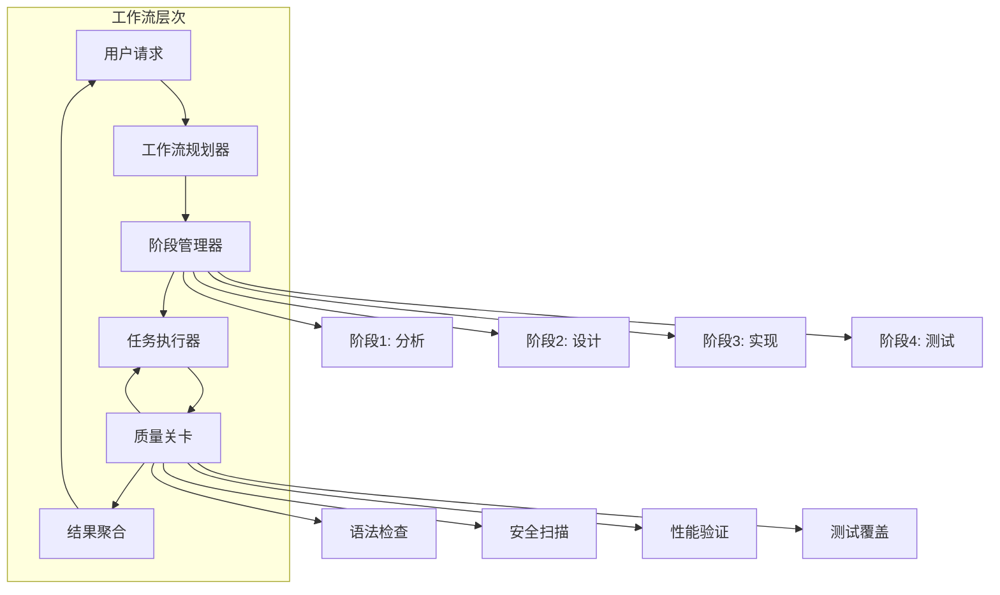
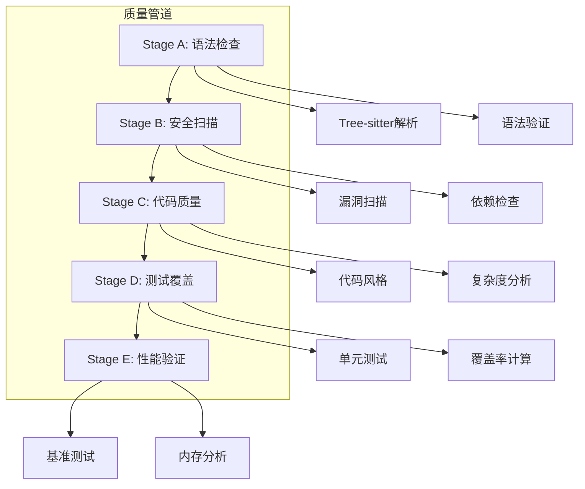
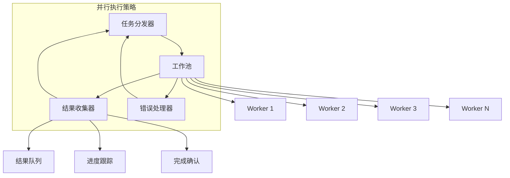
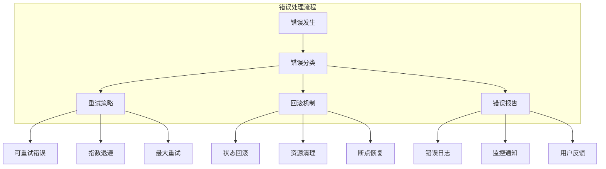

# 第6章: 工作流编排

## 学习目标

- 理解工作流编排的核心概念
- 掌握管道架构和门控系统
- 学习任务分解和执行协调
- 构建复杂的多阶段工作流

## 6.1 工作流基础

### 6.1.1 工作流架构模型

工作流编排是管理复杂任务执行的核心机制，它将大任务分解为可管理的小任务，并协调它们的执行顺序。



### 6.1.2 工作流接口定义

```typescript
// src/workflow/workflow-interface.ts
export interface Workflow {
  id: string;
  name: string;
  description: string;
  version: string;
  
  phases: Phase[];
  dependencies: WorkflowDependency[];
  config: WorkflowConfig;
  
  status: WorkflowStatus;
  metrics: WorkflowMetrics;
}

export interface Phase {
  id: string;
  name: string;
  description: string;
  tasks: Task[];
  dependencies: string[];
  gates: GateConfig[];
  
  status: PhaseStatus;
  config: PhaseConfig;
  
  timeout?: number;
  retryPolicy?: RetryPolicy;
}

export interface Task {
  id: string;
  title: string;
  description: string;
  assignee: string;
  required: boolean;
  
  inputs: TaskInput[];
  outputs: TaskOutput[];
  dependencies: string[];
  
  status: TaskStatus;
  result?: TaskResult;
  error?: TaskError;
  
  estimatedDuration?: number;
  actualDuration?: number;
}

export interface TaskInput {
  name: string;
  type: string;
  value: unknown;
  required: boolean;
}

export interface TaskOutput {
  name: string;
  type: string;
  value: unknown;
}

export interface GateConfig {
  id: string;
  name: string;
  type: GateType;
  config: Record<string, unknown>;
  
  required: boolean;
  onFailure: 'continue' | 'retry' | 'fail';
  maxRetries?: number;
}

export enum GateType {
  SYNTAX_CHECK = 'syntax_check',
  SECURITY_SCAN = 'security_scan',
  TEST_COVERAGE = 'test_coverage',
  PERFORMANCE_CHECK = 'performance_check',
  CODE_QUALITY = 'code_quality',
  DOCUMENTATION = 'documentation',
  CUSTOM = 'custom'
}

export enum WorkflowStatus {
  PENDING = 'pending',
  RUNNING = 'running',
  PAUSED = 'paused',
  COMPLETED = 'completed',
  FAILED = 'failed',
  CANCELLED = 'cancelled'
}

export enum PhaseStatus {
  PENDING = 'pending',
  RUNNING = 'running',
  COMPLETED = 'completed',
  FAILED = 'failed',
  SKIPPED = 'skipped'
}

export enum TaskStatus {
  PENDING = 'pending',
  ASSIGNED = 'assigned',
  RUNNING = 'running',
  COMPLETED = 'completed',
  FAILED = 'failed',
  CANCELLED = 'cancelled',
  BLOCKED = 'blocked'
}

export interface WorkflowConfig {
  parallelExecution: boolean;
  maxParallelTasks: number;
  timeout: number;
  retryPolicy: RetryPolicy;
}

export interface RetryPolicy {
  maxRetries: number;
  backoffStrategy: 'linear' | 'exponential' | 'fixed';
  initialDelay: number;
  maxDelay: number;
}

export interface WorkflowMetrics {
  totalDuration: number;
  taskCompletionRate: number;
  averagePhaseDuration: number;
  errorRate: number;
}
```

### 6.1.3 工作流管理器实现

```typescript
// src/workflow/workflow-manager.ts
import { EventEmitter } from 'events';
import { Workflow, Phase, Task, WorkflowStatus, PhaseStatus, TaskStatus } from './workflow-interface';

export class WorkflowManager extends EventEmitter {
  private workflows: Map<string, Workflow> = new Map();
  private activeExecutions: Map<string, WorkflowExecution> = new Map();

  // 创建工作流
  createWorkflow(config: Partial<Workflow>): Workflow {
    const workflow: Workflow = {
      id: this.generateWorkflowId(),
      name: config.name || 'Unnamed Workflow',
      description: config.description || '',
      version: config.version || '1.0.0',
      phases: config.phases || [],
      dependencies: config.dependencies || [],
      config: config.config || this.getDefaultConfig(),
      status: WorkflowStatus.PENDING,
      metrics: {
        totalDuration: 0,
        taskCompletionRate: 0,
        averagePhaseDuration: 0,
        errorRate: 0
      }
    };

    this.workflows.set(workflow.id, workflow);
    this.emit('workflowCreated', workflow);

    return workflow;
  }

  // 执行工作流
  async executeWorkflow(workflowId: string): Promise<WorkflowResult> {
    const workflow = this.workflows.get(workflowId);
    if (!workflow) {
      throw new Error(`Workflow ${workflowId} not found`);
    }

    const execution = new WorkflowExecution(workflow);
    this.activeExecutions.set(workflowId, execution);

    try {
      this.emit('workflowStarted', workflow);
      workflow.status = WorkflowStatus.RUNNING;

      const result = await execution.execute();
      
      workflow.status = result.success ? WorkflowStatus.COMPLETED : WorkflowStatus.FAILED;
      workflow.metrics = result.metrics;

      this.emit('workflowCompleted', workflow, result);
      return result;

    } catch (error) {
      workflow.status = WorkflowStatus.FAILED;
      this.emit('workflowFailed', workflow, error);
      throw error;
    } finally {
      this.activeExecutions.delete(workflowId);
    }
  }

  // 暂停工作流
  pauseWorkflow(workflowId: string): void {
    const execution = this.activeExecutions.get(workflowId);
    if (execution) {
      execution.pause();
    }
  }

  // 恢复工作流
  resumeWorkflow(workflowId: string): void {
    const execution = this.activeExecutions.get(workflowId);
    if (execution) {
      execution.resume();
    }
  }

  // 取消工作流
  cancelWorkflow(workflowId: string): void {
    const execution = this.activeExecutions.get(workflowId);
    if (execution) {
      execution.cancel();
    }
    
    const workflow = this.workflows.get(workflowId);
    if (workflow) {
      workflow.status = WorkflowStatus.CANCELLED;
      this.emit('workflowCancelled', workflow);
    }
  }

  // 获取工作流状态
  getWorkflowStatus(workflowId: string): Workflow | null {
    return this.workflows.get(workflowId) || null;
  }

  // 列出所有工作流
  listWorkflows(): Workflow[] {
    return Array.from(this.workflows.values());
  }

  // 删除工作流
  deleteWorkflow(workflowId: string): boolean {
    const workflow = this.workflows.get(workflowId);
    if (workflow && workflow.status === WorkflowStatus.PENDING) {
      this.workflows.delete(workflowId);
      this.emit('workflowDeleted', workflow);
      return true;
    }
    return false;
  }

  private generateWorkflowId(): string {
    return `workflow-${Date.now()}-${Math.random().toString(36).substr(2, 9)}`;
  }

  private getDefaultConfig(): WorkflowConfig {
    return {
      parallelExecution: false,
      maxParallelTasks: 1,
      timeout: 300000, // 5分钟
      retryPolicy: {
        maxRetries: 3,
        backoffStrategy: 'exponential',
        initialDelay: 1000,
        maxDelay: 10000
      }
    };
  }
}

// 工作流执行类
class WorkflowExecution {
  private workflow: Workflow;
  private paused: boolean = false;
  private cancelled: boolean = false;
  private currentPhaseIndex: number = 0;
  private startTime: number = 0;

  constructor(workflow: Workflow) {
    this.workflow = workflow;
  }

  async execute(): Promise<WorkflowResult> {
    this.startTime = Date.now();
    const results: PhaseResult[] = [];

    for (let i = 0; i < this.workflow.phases.length; i++) {
      this.currentPhaseIndex = i;

      // 检查暂停状态
      await this.waitIfPaused();

      // 检查取消状态
      if (this.cancelled) {
        return {
          success: false,
          phases: results,
          metrics: this.calculateMetrics(results)
        };
      }

      const phase = this.workflow.phases[i];
      const phaseResult = await this.executePhase(phase);
      results.push(phaseResult);

      if (!phaseResult.success && phase.config.required !== false) {
        return {
          success: false,
          phases: results,
          metrics: this.calculateMetrics(results)
        };
      }
    }

    return {
      success: true,
      phases: results,
      metrics: this.calculateMetrics(results)
    };
  }

  private async executePhase(phase: Phase): Promise<PhaseResult> {
    phase.status = PhaseStatus.RUNNING;
    const startTime = Date.now();

    try {
      const taskResults: TaskResult[] = [];

      // 执行阶段中的所有任务
      for (const task of phase.tasks) {
        await this.waitIfPaused();
        
        if (this.cancelled) {
          task.status = TaskStatus.CANCELLED;
          continue;
        }

        const taskResult = await this.executeTask(task);
        taskResults.push(taskResult);

        // 如果任务失败且该任务是必需的，则阶段失败
        if (!taskResult.success && task.required) {
          return {
            success: false,
            tasks: taskResults,
            duration: Date.now() - startTime
          };
        }
      }

      // 执行阶段关卡
      const gateResults = await this.executeGates(phase);

      // 检查关卡结果
      const allGatesPassed = gateResults.every(result => result.success);
      if (!allGatesPassed && phase.config.required !== false) {
        return {
          success: false,
          tasks: taskResults,
          gates: gateResults,
          duration: Date.now() - startTime
        };
      }

      phase.status = PhaseStatus.COMPLETED;
      return {
        success: true,
        tasks: taskResults,
        gates: gateResults,
        duration: Date.now() - startTime
      };

    } catch (error) {
      phase.status = PhaseStatus.FAILED;
      return {
        success: false,
        tasks: [],
        duration: Date.now() - startTime,
        error: error instanceof Error ? error.message : 'Unknown error'
      };
    }
  }

  private async executeTask(task: Task): Promise<TaskResult> {
    task.status = TaskStatus.RUNNING;
    const startTime = Date.now();

    try {
      // 这里应该调用相应的代理来执行任务
      // 简化实现，直接标记为完成
      await this.delay(100); // 模拟任务执行

      task.status = TaskStatus.COMPLETED;
      task.actualDuration = Date.now() - startTime;

      return {
        success: true,
        taskId: task.id,
        duration: task.actualDuration,
        output: {}
      };

    } catch (error) {
      task.status = TaskStatus.FAILED;
      task.error = {
        message: error instanceof Error ? error.message : 'Unknown error',
        timestamp: Date.now()
      };

      return {
        success: false,
        taskId: task.id,
        duration: Date.now() - startTime,
        error: task.error.message
      };
    }
  }

  private async executeGates(phase: Phase): Promise<GateResult[]> {
    const results: GateResult[] = [];

    for (const gate of phase.gates) {
      const result = await this.executeGate(gate);
      results.push(result);

      if (!result.success && gate.required) {
        if (gate.onFailure === 'fail') {
          break;
        }
      }
    }

    return results;
  }

  private async executeGate(gate: GateConfig): Promise<GateResult> {
    // 简化实现，实际应该调用相应的检查器
    return {
      success: true,
      gateId: gate.id,
      duration: 0,
      output: {}
    };
  }

  private pause(): void {
    this.paused = true;
  }

  private resume(): void {
    this.paused = false;
  }

  private cancel(): void {
    this.cancelled = true;
  }

  private async waitIfPaused(): Promise<void> {
    while (this.paused) {
      await this.delay(100);
    }
  }

  private delay(ms: number): Promise<void> {
    return new Promise(resolve => setTimeout(resolve, ms));
  }

  private calculateMetrics(phaseResults: PhaseResult[]): WorkflowMetrics {
    const totalDuration = Date.now() - this.startTime;
    const completedPhases = phaseResults.filter(r => r.success).length;
    const totalPhases = phaseResults.length;
    const taskCompletionRate = totalPhases > 0 ? completedPhases / totalPhases : 0;

    return {
      totalDuration,
      taskCompletionRate,
      averagePhaseDuration: totalDuration / totalPhases,
      errorRate: 1 - taskCompletionRate
    };
  }
}

// 结果接口
interface WorkflowResult {
  success: boolean;
  phases: PhaseResult[];
  metrics: WorkflowMetrics;
}

interface PhaseResult {
  success: boolean;
  tasks: TaskResult[];
  gates?: GateResult[];
  duration: number;
  error?: string;
}

interface TaskResult {
  success: boolean;
  taskId: string;
  duration: number;
  output: Record<string, unknown>;
  error?: string;
}

interface GateResult {
  success: boolean;
  gateId: string;
  duration: number;
  output: Record<string, unknown>;
  error?: string;
}

interface TaskError {
  message: string;
  timestamp: number;
}
```

## 6.2 管道架构

### 6.2.1 质量管道系统



### 6.2.2 管道执行器

```typescript
// src/workflow/pipeline-interface.ts
export interface Stage {
  id: string;
  name: string;
  type: string;
  order: number;
  config: StageConfig;
  customCheck?: (input: Record<string, unknown>) => Promise<Record<string, unknown>>;
}

export interface StageConfig {
  required: boolean;
  timeout?: number;
  retryPolicy?: RetryPolicy;
}

export interface PipelineConfig {
  parallelExecution: boolean;
  maxParallelStages: number;
  timeout: number;
}

// src/workflow/pipeline-executor.ts
import { EventEmitter } from 'events';
import { Stage, StageResult, PipelineConfig } from './pipeline-interface';

export class PipelineExecutor extends EventEmitter {
  private config: PipelineConfig;
  private stages: Map<string, Stage> = new Map();

  constructor(config: PipelineConfig) {
    super();
    this.config = config;
  }

  // 注册阶段
  registerStage(stage: Stage): void {
    this.stages.set(stage.id, stage);
    this.emit('stageRegistered', stage);
  }

  // 执行管道
  async execute(input: Record<string, unknown>): Promise<PipelineResult> {
    const startTime = Date.now();
    const results: StageResult[] = [];
    let currentData = input;

    try {
      for (const stage of this.getOrderedStages()) {
        const stageResult = await this.executeStage(stage, currentData);
        results.push(stageResult);

        if (!stageResult.success) {
          if (stage.config.required !== false) {
            return {
              success: false,
              stages: results,
              duration: Date.now() - startTime,
              finalData: currentData
            };
          }
        } else {
          currentData = stageResult.output;
        }
      }

      return {
        success: true,
        stages: results,
        duration: Date.now() - startTime,
        finalData: currentData
      };

    } catch (error) {
      return {
        success: false,
        stages: results,
        duration: Date.now() - startTime,
        error: error instanceof Error ? error.message : 'Unknown error'
      };
    }
  }

  // 执行单个阶段
  private async executeStage(stage: Stage, input: Record<string, unknown>): Promise<StageResult> {
    const startTime = Date.now();

    try {
      this.emit('stageStarted', stage);

      // 执行阶段检查
      const output = await this.runStageCheck(stage, input);

      const result: StageResult = {
        success: true,
        stageId: stage.id,
        duration: Date.now() - startTime,
        output
      };

      this.emit('stageCompleted', stage, result);
      return result;

    } catch (error) {
      const result: StageResult = {
        success: false,
        stageId: stage.id,
        duration: Date.now() - startTime,
        error: error instanceof Error ? error.message : 'Unknown error'
      };

      this.emit('stageFailed', stage, result);
      return result;
    }
  }

  // 运行阶段检查
  private async runStageCheck(stage: Stage, input: Record<string, unknown>): Promise<Record<string, unknown>> {
    // 根据阶段类型执行不同的检查
    switch (stage.type) {
      case 'syntax_check':
        return await this.runSyntaxCheck(stage, input);
      case 'security_scan':
        return await this.runSecurityScan(stage, input);
      case 'code_quality':
        return await this.runCodeQuality(stage, input);
      case 'test_coverage':
        return await this.runTestCoverage(stage, input);
      case 'performance_check':
        return await this.runPerformanceCheck(stage, input);
      default:
        return await this.runCustomCheck(stage, input);
    }
  }

  // 语法检查
  private async runSyntaxCheck(stage: Stage, input: Record<string, unknown>): Promise<Record<string, unknown>> {
    // 实现语法检查逻辑
    return { valid: true, errors: [] };
  }

  // 安全扫描
  private async runSecurityScan(stage: Stage, input: Record<string, unknown>): Promise<Record<string, unknown>> {
    // 实现安全扫描逻辑
    return { vulnerabilities: [], severity: 'none' };
  }

  // 代码质量检查
  private async runCodeQuality(stage: Stage, input: Record<string, unknown>): Promise<Record<string, unknown>> {
    // 实现代码质量检查逻辑
    return { score: 85, issues: [] };
  }

  // 测试覆盖率检查
  private async runTestCoverage(stage: Stage, input: Record<string, unknown>): Promise<Record<string, unknown>> {
    // 实现测试覆盖率检查逻辑
    return { coverage: 80, threshold: 75 };
  }

  // 性能检查
  private async runPerformanceCheck(stage: Stage, input: Record<string, unknown>): Promise<Record<string, unknown>> {
    // 实现性能检查逻辑
    return { score: 90, bottlenecks: [] };
  }

  // 自定义检查
  private async runCustomCheck(stage: Stage, input: Record<string, unknown>): Promise<Record<string, unknown>> {
    if (stage.customCheck) {
      return await stage.customCheck(input);
    }
    return {};
  }

  // 获取排序后的阶段
  private getOrderedStages(): Stage[] {
    return Array.from(this.stages.values())
      .sort((a, b) => a.order - b.order);
  }
}

// 管道接口
interface PipelineResult {
  success: boolean;
  stages: StageResult[];
  duration: number;
  finalData?: Record<string, unknown>;
  error?: string;
}

interface StageResult {
  success: boolean;
  stageId: string;
  duration: number;
  output?: Record<string, unknown>;
  error?: string;
}
```

## 6.3 并行执行

### 6.3.1 并行执行模式



### 6.3.2 并行任务执行器

```typescript
// src/workflow/parallel-executor.ts
import { EventEmitter } from 'events';
import { Task, TaskResult } from './workflow-interface';

export interface ParallelConfig {
  maxWorkers: number;
  taskTimeout: number;
  retryPolicy: RetryPolicy;
}

export class ParallelExecutor extends EventEmitter {
  private config: ParallelConfig;
  private workers: Map<string, Worker> = new Map();
  private taskQueue: Task[] = [];
  private runningTasks: Map<string, Task> = new Map();
  private results: Map<string, TaskResult> = new Map();

  constructor(config: ParallelConfig) {
    super();
    this.config = config;
  }

  // 执行并行任务
  async execute(tasks: Task[]): Promise<ParallelResult> {
    this.taskQueue = [...tasks];
    this.results.clear();
    this.runningTasks.clear();

    const startTime = Date.now();

    try {
      // 启动工作池
      await this.startWorkers();

      // 分发任务
      await this.distributeTasks();

      // 等待所有任务完成
      await this.waitForCompletion();

      const duration = Date.now() - startTime;
      const allResults = Array.from(this.results.values());

      return {
        success: this.checkOverallSuccess(allResults),
        tasks: allResults,
        duration,
        completedCount: allResults.filter(r => r.success).length,
        failedCount: allResults.filter(r => !r.success).length
      };

    } catch (error) {
      return {
        success: false,
        tasks: Array.from(this.results.values()),
        duration: Date.now() - startTime,
        error: error instanceof Error ? error.message : 'Unknown error'
      };
    } finally {
      await this.stopWorkers();
    }
  }

  // 启动工作池
  private async startWorkers(): Promise<void> {
    for (let i = 0; i < this.config.maxWorkers; i++) {
      const worker = new Worker(i, this.config);
      this.workers.set(`worker-${i}`, worker);
      
      worker.on('taskCompleted', (result: TaskResult) => {
        this.handleTaskResult(result);
      });

      worker.on('taskFailed', (error: { taskId: string; message: string; duration?: number }) => {
        this.handleTaskError(error);
      });

      await worker.start();
    }
  }

  // 停止工作池
  private async stopWorkers(): Promise<void> {
    for (const worker of this.workers.values()) {
      await worker.stop();
    }
    this.workers.clear();
  }

  // 分发任务
  private async distributeTasks(): Promise<void> {
    while (this.taskQueue.length > 0) {
      const availableWorker = this.findAvailableWorker();
      
      if (!availableWorker) {
        await this.delay(100);
        continue;
      }

      const task = this.taskQueue.shift();
      if (task) {
        await availableWorker.assignTask(task);
        this.runningTasks.set(task.id, task);
        this.emit('taskAssigned', task);
      }
    }
  }

  // 处理任务结果
  private handleTaskResult(result: TaskResult): void {
    this.results.set(result.taskId, result);
    this.runningTasks.delete(result.taskId);
    this.emit('taskCompleted', result);
  }

  // 处理任务错误
  private handleTaskError(error: { taskId: string; message: string; duration?: number }): void {
    const task = this.runningTasks.get(error.taskId);
    if (task) {
      const result: TaskResult = {
        success: false,
        taskId: error.taskId,
        duration: error.duration || 0,
        error: error.message,
        output: {}
      };
      this.handleTaskResult(result);
    }
  }

  // 等待完成
  private async waitForCompletion(): Promise<void> {
    while (this.runningTasks.size > 0 || this.taskQueue.length > 0) {
      await this.delay(100);
    }
  }

  // 查找可用工作器
  private findAvailableWorker(): Worker | null {
    for (const worker of this.workers.values()) {
      if (worker.isAvailable()) {
        return worker;
      }
    }
    return null;
  }

  // 检查整体成功
  private checkOverallSuccess(results: TaskResult[]): boolean {
    return results.every(result => result.success);
  }

  // 延迟辅助方法
  private delay(ms: number): Promise<void> {
    return new Promise(resolve => setTimeout(resolve, ms));
  }
}

// 工作器类
class Worker extends EventEmitter {
  private id: string;
  private config: ParallelConfig;
  private currentTask: Task | null = null;
  private busy: boolean = false;

  constructor(id: number, config: ParallelConfig) {
    super();
    this.id = `worker-${id}`;
    this.config = config;
  }

  async start(): Promise<void> {
    // 工作器初始化
  }

  async stop(): Promise<void> {
    // 工作器清理
  }

  isAvailable(): boolean {
    return !this.busy;
  }

  async assignTask(task: Task): Promise<void> {
    this.currentTask = task;
    this.busy = true;

    try {
      const result = await this.executeTask(task);
      this.emit('taskCompleted', result);
    } catch (error) {
      this.emit('taskFailed', {
        taskId: task.id,
        message: error instanceof Error ? error.message : 'Unknown error',
        duration: 0
      });
    } finally {
      this.busy = false;
      this.currentTask = null;
    }
  }

  private async executeTask(task: Task): Promise<TaskResult> {
    const startTime = Date.now();

    try {
      // 这里应该调用相应的代理来执行任务
      // 简化实现
      await this.delay(100);

      return {
        success: true,
        taskId: task.id,
        duration: Date.now() - startTime,
        output: {}
      };

    } catch (error) {
      return {
        success: false,
        taskId: task.id,
        duration: Date.now() - startTime,
        error: error instanceof Error ? error.message : 'Unknown error'
      };
    }
  }

  private delay(ms: number): Promise<void> {
    return new Promise(resolve => setTimeout(resolve, ms));
  }
}

// 并行结果接口
interface ParallelResult {
  success: boolean;
  tasks: TaskResult[];
  duration: number;
  completedCount: number;
  failedCount: number;
  error?: string;
}

interface RetryPolicy {
  maxRetries: number;
  backoffStrategy: 'linear' | 'exponential' | 'fixed';
  initialDelay: number;
  maxDelay: number;
}
```

## 6.4 错误处理和恢复

### 6.4.1 错误处理策略



### 6.4.2 错误处理器实现

```typescript
// src/workflow/error-handler.ts
import { EventEmitter } from 'events';
import { WorkflowError, ErrorSeverity, RecoveryStrategy } from './error-interface';

export class WorkflowErrorHandler extends EventEmitter {
  private errorHistory: Map<string, WorkflowError[]> = new Map();
  private recoveryStrategies: Map<string, RecoveryStrategy> = new Map();

  // 处理错误
  async handleError(error: WorkflowError): Promise<ErrorHandlingResult> {
    // 记录错误
    this.recordError(error);

    // 分类错误
    const errorType = this.classifyError(error);
    
    // 确定恢复策略
    const strategy = this.determineRecoveryStrategy(error, errorType);

    try {
      // 尝试恢复
      const recoveryResult = await this.attemptRecovery(error, strategy);

      this.emit('errorRecovered', error, recoveryResult);
      return {
        success: true,
        action: recoveryResult.action,
        error: null
      };

    } catch (recoveryError) {
      // 恢复失败
      const finalResult = await this.handleFailedRecovery(error, recoveryError as Error);
      
      this.emit('errorRecoveryFailed', error, finalResult);
      return finalResult;
    }
  }

  // 分类错误
  private classifyError(error: WorkflowError): ErrorType {
    if (error.code.includes('timeout')) {
      return ErrorType.TIMEOUT;
    } else if (error.code.includes('network') || error.code.includes('connection')) {
      return ErrorType.NETWORK;
    } else if (error.code.includes('permission') || error.code.includes('access')) {
      return ErrorType.PERMISSION;
    } else if (error.code.includes('resource') || error.code.includes('memory')) {
      return ErrorType.RESOURCE;
    } else if (error.code.includes('validation') || error.code.includes('syntax')) {
      return ErrorType.VALIDATION;
    } else {
      return ErrorType.UNKNOWN;
    }
  }

  // 确定恢复策略
  private determineRecoveryStrategy(error: WorkflowError, errorType: ErrorType): RecoveryStrategy {
    // 检查是否有自定义策略
    const customStrategy = this.recoveryStrategies.get(error.code);
    if (customStrategy) {
      return customStrategy;
    }

    // 根据错误类型返回默认策略
    switch (errorType) {
      case ErrorType.TIMEOUT:
        return RecoveryStrategy.RETRY_WITH_BACKOFF;
      
      case ErrorType.NETWORK:
        return RecoveryStrategy.RETRY_IMMEDIATELY;
      
      case ErrorType.RESOURCE:
        return RecoveryStrategy.REDUCE_LOAD;
      
      case ErrorType.VALIDATION:
        return RecoveryStrategy.FALLBACK_TO_DEFAULT;
      
      default:
        return RecoveryStrategy.FAIL_FAST;
    }
  }

  // 尝试恢复
  private async attemptRecovery(error: WorkflowError, strategy: RecoveryStrategy): Promise<RecoveryResult> {
    switch (strategy) {
      case RecoveryStrategy.RETRY_WITH_BACKOFF:
        return await this.retryWithBackoff(error);
      
      case RecoveryStrategy.RETRY_IMMEDIATELY:
        return await this.retryImmediately(error);
      
      case RecoveryStrategy.REDUCE_LOAD:
        return await this.reduceLoad(error);
      
      case RecoveryStrategy.FALLBACK_TO_DEFAULT:
        return await this.fallbackToDefault(error);
      
      case RecoveryStrategy.SKIP_AND_CONTINUE:
        return await this.skipAndContinue(error);
      
      case RecoveryStrategy.FAIL_FAST:
        throw new Error(`Cannot recover from error: ${error.message}`);
      
      default:
        throw new Error(`Unknown recovery strategy: ${strategy}`);
    }
  }

  // 带退避的重试
  private async retryWithBackoff(error: WorkflowError): Promise<RecoveryResult> {
    const maxRetries = 3;
    const baseDelay = 1000;

    for (let attempt = 1; attempt <= maxRetries; attempt++) {
      try {
        await this.delay(baseDelay * Math.pow(2, attempt - 1)); // 指数退避
        
        // 尝试重新执行失败的操作
        const result = await this.retryOperation(error);
        
        return {
          success: true,
          action: 'retry_success',
          attempts: attempt
        };

      } catch (retryError) {
        if (attempt === maxRetries) {
          throw retryError;
        }
      }
    }

    throw new Error('Retry with backoff failed');
  }

  // 立即重试
  private async retryImmediately(error: WorkflowError): Promise<RecoveryResult> {
    try {
      const result = await this.retryOperation(error);
      return {
        success: true,
        action: 'immediate_retry_success',
        attempts: 1
      };
    } catch (retryError) {
      throw retryError;
    }
  }

  // 降低负载
  private async reduceLoad(error: WorkflowError): Promise<RecoveryResult> {
    // 降低并发度，减少资源使用
    return {
      success: true,
      action: 'load_reduced',
      details: 'Reduced concurrency and resource usage'
    };
  }

  // 回退到默认值
  private async fallbackToDefault(error: WorkflowError): Promise<RecoveryResult> {
    // 使用默认值或备用方案
    return {
      success: true,
      action: 'fallback_used',
      details: 'Used default value or fallback mechanism'
    };
  }

  // 跳过并继续
  private async skipAndContinue(error: WorkflowError): Promise<RecoveryResult> {
    return {
      success: true,
      action: 'skipped',
      details: 'Skipped failed operation and continued'
    };
  }

  // 处理恢复失败
  private async handleFailedRecovery(originalError: WorkflowError, recoveryError: Error): Promise<ErrorHandlingResult> {
    // 记录严重错误
    const criticalError: WorkflowError = {
      ...originalError,
      severity: ErrorSeverity.CRITICAL,
      recoveryAttempted: true,
      recoveryError: recoveryError.message
    };

    this.recordError(criticalError);

    return {
      success: false,
      action: 'recovery_failed',
      error: criticalError
    };
  }

  // 记录错误
  private recordError(error: WorkflowError): void {
    const workflowId = error.workflowId || 'global';
    const errors = this.errorHistory.get(workflowId) || [];
    
    errors.push({
      ...error,
      timestamp: error.timestamp || Date.now()
    });

    // 限制错误历史大小
    if (errors.length > 100) {
      errors.shift(); // 移除最旧的错误
    }

    this.errorHistory.set(workflowId, errors);
  }

  // 注册恢复策略
  registerRecoveryStrategy(errorCode: string, strategy: RecoveryStrategy): void {
    this.recoveryStrategies.set(errorCode, strategy);
  }

  // 获取错误历史
  getErrorHistory(workflowId?: string): WorkflowError[] {
    if (workflowId) {
      return this.errorHistory.get(workflowId) || [];
    }
    
    // 返回所有错误
    const allErrors: WorkflowError[] = [];
    for (const errors of this.errorHistory.values()) {
      allErrors.push(...errors);
    }
    return allErrors;
  }

  // 清除错误历史
  clearErrorHistory(workflowId?: string): void {
    if (workflowId) {
      this.errorHistory.delete(workflowId);
    } else {
      this.errorHistory.clear();
    }
  }

  // 辅助方法：重试操作
  private async retryOperation(error: WorkflowError): Promise<Record<string, unknown>> {
    // 这里应该根据错误信息重新执行失败的操作
    // 简化实现
    return {};
  }

  // 辅助方法：延迟
  private delay(ms: number): Promise<void> {
    return new Promise(resolve => setTimeout(resolve, ms));
  }
}

// 错误接口
export interface WorkflowError {
  code: string;
  message: string;
  workflowId?: string;
  taskId?: string;
  severity: ErrorSeverity;
  timestamp?: number;
  recoveryAttempted?: boolean;
  recoveryError?: string;
  context?: Record<string, unknown>;
}

export enum ErrorSeverity {
  LOW = 'low',
  MEDIUM = 'medium',
  HIGH = 'high',
  CRITICAL = 'critical'
}

export enum ErrorType {
  TIMEOUT = 'timeout',
  NETWORK = 'network',
  PERMISSION = 'permission',
  RESOURCE = 'resource',
  VALIDATION = 'validation',
  UNKNOWN = 'unknown'
}

export enum RecoveryStrategy {
  RETRY_WITH_BACKOFF = 'retry_with_backoff',
  RETRY_IMMEDIATELY = 'retry_immediately',
  REDUCE_LOAD = 'reduce_load',
  FALLBACK_TO_DEFAULT = 'fallback_to_default',
  SKIP_AND_CONTINUE = 'skip_and_continue',
  FAIL_FAST = 'fail_fast'
}

interface ErrorHandlingResult {
  success: boolean;
  action: string;
  error?: WorkflowError;
}

interface RecoveryResult {
  success: boolean;
  action: string;
  attempts?: number;
  details?: string;
}
```

## 6.5 本章小结

### 关键要点

- **工作流架构**: 分阶段执行，任务分解和协调
- **质量管道**: 语法检查、安全扫描、代码质量等多层验证
- **并行执行**: 工作池模式，提高执行效率
- **错误处理**: 错误分类、恢复策略、自动重试

### 最佳实践

1. **合理分解任务** - 将大任务分解为可管理的小任务
2. **设置适当的关卡** - 确保代码质量的多层验证
3. **控制并发度** - 避免资源耗尽和性能下降
4. **实施错误恢复** - 提高系统的健壮性和可用性
5. **监控执行状态** - 及时发现和处理异常情况

### 下一步学习

现在你已经掌握了工作流编排的核心技术，接下来我们将：

- 📖 **第7章**: 深入了解子代理实现
- 🔧 **实践**: 构建可扩展的多代理系统
- 🎯 **目标**: 掌握代理间的协作和通信

---

**准备好探索高级代理开发的精彩世界了吗？** 🚀
