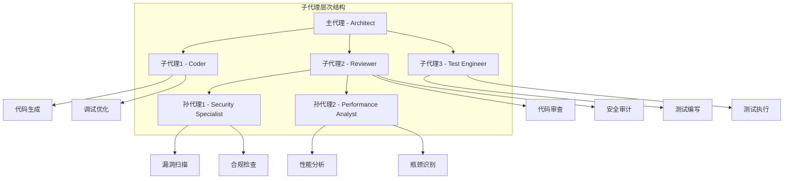
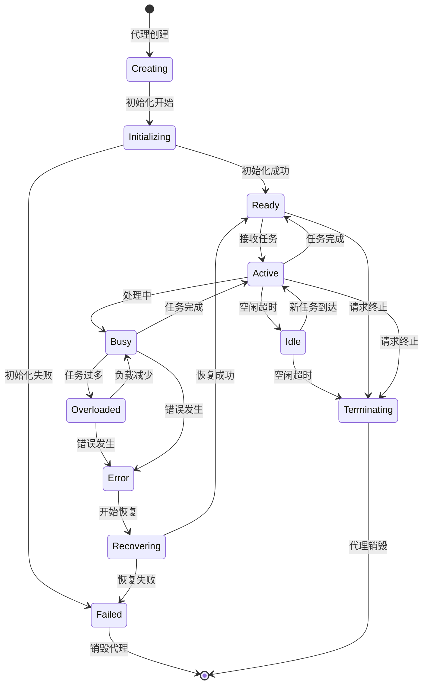
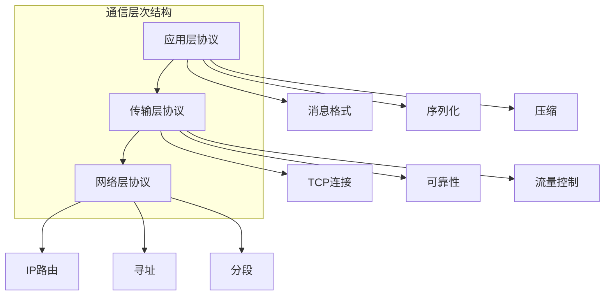
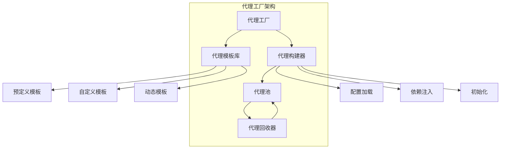

# 第7章: 子代理实现

## 学习目标

- 理解子代理创建和生命周期管理
- 掌握代理委托和任务分配机制
- 学习代理间通信协议
- 构建可扩展的多代理协作系统

## 7.1 子代理基础

### 7.1.1 子代理架构

子代理是多代理系统中的核心概念，允许主代理将特定任务委托给专门化的子代理处理。



### 7.1.2 子代理接口定义

```typescript
// src/agents/subagent-interface.ts
import { BaseAgent } from './base-agent';

export interface SubAgentConfig {
  id: string;
  name: string;
  type: SubAgentType;
  parentAgent?: string;

  capabilities: string[];
  maxConcurrentTasks?: number;
  timeout?: number;
  resourceLimits?: ResourceLimits;

  communication: CommunicationConfig;
  lifecycle: LifecycleConfig;
  security?: SecurityConfig;
  monitoring?: MonitoringConfig;
}

export interface ResourceLimits {
  maxMemoryMB?: number;
  maxCpuPercent?: number;
  maxExecutionTime?: number;
}

export interface SecurityConfig {
  enableSandbox?: boolean;
  allowedDomains?: string[];
  allowedOperations?: string[];
  maxFileSize?: number;
}

export interface MonitoringConfig {
  enableMetrics?: boolean;
  enableLogging?: boolean;
  metricsInterval?: number;
  logLevel?: 'debug' | 'info' | 'warn' | 'error';
}

export enum SubAgentType {
  CODER = 'coder',
  REVIEWER = 'reviewer',
  TEST_ENGINEER = 'test_engineer',
  SECURITY_SPECIALIST = 'security_specialist',
  PERFORMANCE_ANALYST = 'performance_analyst',
  DOCUMENTATION = 'documentation',
  CUSTOM = 'custom'
}

export interface RetryPolicy {
  maxRetries: number;
  backoffStrategy: 'linear' | 'exponential' | 'custom';
  initialDelay: number;
  maxDelay: number;
  retryCondition?: (error: Error) => boolean;
}

export interface CommunicationConfig {
  protocol: 'direct' | 'message_queue' | 'event_bus';
  heartbeatInterval: number;
  responseTimeout: number;
  retryPolicy: RetryPolicy;
  enableCompression?: boolean;
  enableEncryption?: boolean;
  maxMessageSize?: number;
}

export interface LifecycleConfig {
  autoStart: boolean;
  idleTimeout: number;
  maxLifetime: number;
  gracefulShutdown: boolean;
}

// 定义消息负载类型
export interface TaskPayload {
  id: string;
  type: string;
  data: Record<string, unknown>;
  priority?: number;
  timestamp?: number;
}

export interface ResultPayload {
  success: boolean;
  data: Record<string, unknown>;
  error?: ErrorInfo;
  duration?: number;
  executionTime?: number;
}

export interface ErrorInfo {
  code: string;
  message: string;
  stack?: string;
  details?: Record<string, unknown>;
}

export interface StatusUpdatePayload {
  status: SubAgentStatus;
  progress: number;
  message: string;
  metadata?: Record<string, unknown>;
}

export interface QueryPayload {
  query: string;
  parameters?: Record<string, unknown>;
  timeout?: number;
}

export interface ResponsePayload {
  correlationId: string;
  result: unknown;
  success: boolean;
  timestamp: number;
}

export type MessagePayload = TaskPayload | ResultPayload | StatusUpdatePayload | QueryPayload | ResponsePayload | Record<string, unknown>;

export interface SubAgentMessage {
  id: string;
  from: string;
  to: string;
  type: MessageType;
  payload: MessagePayload;
  timestamp: number;
  priority: MessagePriority;
  correlationId?: string;
  replyTo?: string;
}

export enum MessageType {
  TASK_ASSIGNMENT = 'task_assignment',
  TASK_RESULT = 'task_result',
  STATUS_UPDATE = 'status_update',
  HEARTBEAT = 'heartbeat',
  ERROR = 'error',
  QUERY = 'query',
  RESPONSE = 'response',
  CONTROL = 'control'
}

export enum MessagePriority {
  LOW = 1,
  NORMAL = 2,
  HIGH = 3,
  CRITICAL = 4
}

export interface SubAgentDelegate {
  agent: BaseAgent;
  status: SubAgentStatus;
  currentTasks: string[];
  metrics: SubAgentMetrics;
  lastHeartbeat: number;
}

export enum SubAgentStatus {
  IDLE = 'idle',
  BUSY = 'busy',
  OVERLOADED = 'overloaded',
  ERROR = 'error',
  TERMINATED = 'terminated'
}

export interface SubAgentMetrics {
  tasksCompleted: number;
  tasksFailed: number;
  averageExecutionTime: number;
  cpuUsage: number;
  memoryUsage: number;
}
```

### 7.1.3 子代理管理器实现

```typescript
// src/agents/subagent-manager.ts
import { EventEmitter } from 'events';
import { BaseAgent } from './base-agent';
import { SubAgentConfig, SubAgentDelegate, SubAgentStatus, SubAgentMessage, MessageType } from './subagent-interface';

export class SubAgentManager extends EventEmitter {
  private subAgents: Map<string, SubAgentDelegate> = new Map();
  private messageQueue: Map<string, SubAgentMessage[]> = new Map();
  private heartbeatMonitor: NodeJS.Timeout | null = null;
  private config: SubAgentManagerConfig;

  constructor(config: SubAgentManagerConfig = {}) {
    super();
    this.config = {
      maxSubAgents: config.maxSubAgents || 10,
      heartbeatInterval: config.heartbeatInterval || 30000,
      messageTimeout: config.messageTimeout || 60000,
      ...config
    };

    this.startHeartbeatMonitor();
  }

  // 注册子代理
  async registerSubAgent(agentConfig: SubAgentConfig, agentInstance: BaseAgent): Promise<void> {
    if (this.subAgents.size >= this.config.maxSubAgents) {
      throw new Error('Maximum number of subagents reached');
    }

    const delegate: SubAgentDelegate = {
      agent: agentInstance,
      status: SubAgentStatus.IDLE,
      currentTasks: [],
      metrics: {
        tasksCompleted: 0,
        tasksFailed: 0,
        averageExecutionTime: 0,
        cpuUsage: 0,
        memoryUsage: 0
      },
      lastHeartbeat: Date.now()
    };

    this.subAgents.set(agentConfig.id, delegate);
    this.messageQueue.set(agentConfig.id, []);

    await agentInstance.initialize();

    this.emit('subAgentRegistered', agentConfig.id);
  }

  // 注销子代理
  async unregisterSubAgent(agentId: string): Promise<void> {
    const delegate = this.subAgents.get(agentId);
    if (!delegate) {
      throw new Error(`Subagent ${agentId} not found`);
    }

    // 等待当前任务完成或取消
    if (delegate.currentTasks.length > 0) {
      await this.cancelAgentTasks(agentId);
    }

    // 清理代理
    await delegate.agent.cleanup();

    this.subAgents.delete(agentId);
    this.messageQueue.delete(agentId);

    this.emit('subAgentUnregistered', agentId);
  }

  // 委托任务给子代理
  async delegateTask<T extends MessagePayload = TaskPayload>(agentId: string, task: T): Promise<ResultPayload> {
    const delegate = this.subAgents.get(agentId);
    if (!delegate) {
      throw new Error(`Subagent ${agentId} not found`);
    }

    if (delegate.status === SubAgentStatus.TERMINATED) {
      throw new Error(`Subagent ${agentId} is terminated`);
    }

    // 检查代理负载
    if (delegate.status === SubAgentStatus.OVERLOADED) {
      throw new Error(`Subagent ${agentId} is overloaded`);
    }

    // 创建任务消息
    const message: SubAgentMessage = {
      id: this.generateMessageId(),
      from: 'manager',
      to: agentId,
      type: MessageType.TASK_ASSIGNMENT,
      payload: task,
      timestamp: Date.now(),
      priority: this.determineTaskPriority(task),
      correlationId: this.generateCorrelationId()
    };

    // 添加到消息队列
    this.messageQueue.get(agentId)?.push(message);

    // 更新代理状态
    delegate.currentTasks.push(message.id);
    this.updateAgentStatus(agentId);

    // 发送消息
    await this.sendMessage(message);

    // 等待响应
    const response = await this.waitForResponse(message.correlationId!, this.config.messageTimeout);

    // 更新代理状态和指标
    delegate.currentTasks = delegate.currentTasks.filter(id => id !== message.id);
    this.updateAgentStatus(agentId);
    this.updateAgentMetrics(agentId, response);

    return response;
  }

  // 批量委托任务
  async delegateTasks<T extends MessagePayload = TaskPayload>(agentId: string, tasks: T[]): Promise<ResultPayload[]> {
    const delegate = this.subAgents.get(agentId);
    if (!delegate) {
      throw new Error(`Subagent ${agentId} not found`);
    }

    // 检查代理是否可以处理多个任务
    const config = this.getAgentConfig(delegate);
    const maxConcurrent = config.maxConcurrentTasks || 1;

    if (tasks.length > maxConcurrent) {
      throw new Error(`Subagent ${agentId} can only handle ${maxConcurrent} concurrent tasks`);
    }

    // 并发执行任务
    const results = await Promise.all(
      tasks.map(task => this.delegateTask(agentId, task))
    );

    return results;
  }

  // 获取代理配置（类型安全的方法）
  private getAgentConfig(delegate: SubAgentDelegate): SubAgentConfig {
    const config = delegate.agent.getConfig();
    if (!this.isValidSubAgentConfig(config)) {
      throw new Error('Invalid agent configuration');
    }
    return config;
  }

  // 验证代理配置
  private isValidSubAgentConfig(config: unknown): config is SubAgentConfig {
    if (!config || typeof config !== 'object') {
      return false;
    }
    const cfg = config as Partial<SubAgentConfig>;
    return (
      typeof cfg.id === 'string' &&
      typeof cfg.name === 'string' &&
      typeof cfg.type === 'string' &&
      Array.isArray(cfg.capabilities) &&
      typeof cfg.communication === 'object'
    );
  }

  // 查找可用代理
  findAvailableAgent(requiredCapabilities: string[]): string | null {
    for (const [agentId, delegate] of this.subAgents.entries()) {
      if (delegate.status === SubAgentStatus.IDLE) {
        const config = this.getAgentConfig(delegate);
        const hasCapabilities = requiredCapabilities.every(cap =>
          config.capabilities.includes(cap)
        );

        if (hasCapabilities) {
          return agentId;
        }
      }
    }
    return null;
  }

  // 获取代理状态
  getAgentStatus(agentId: string): SubAgentDelegate | null {
    return this.subAgents.get(agentId) || null;
  }

  // 获取所有代理状态
  getAllAgentsStatus(): Map<string, SubAgentDelegate> {
    return new Map(this.subAgents);
  }

  // 发送消息
  private async sendMessage(message: SubAgentMessage): Promise<void> {
    const delegate = this.subAgents.get(message.to);
    if (!delegate) {
      throw new Error(`Subagent ${message.to} not found`);
    }

    try {
      // 根据通信协议发送消息
      const config = this.getAgentConfig(delegate);

      switch (config.communication.protocol) {
        case 'direct':
          await this.sendDirectMessage(delegate, message);
          break;
        case 'message_queue':
          await this.sendToMessageQueue(message);
          break;
        case 'event_bus':
          await this.sendToEventBus(message);
          break;
        default:
          throw new Error(`Unknown protocol: ${config.communication.protocol}`);
      }

      this.emit('messageSent', message);

    } catch (error) {
      this.emit('messageError', message, error);
      throw error;
    }
  }

  // 直接发送消息
  private async sendDirectMessage(delegate: SubAgentDelegate, message: SubAgentMessage): Promise<void> {
    // 直接调用代理的消息处理方法
    await delegate.agent.handleMessage(message);
  }

  // 发送到消息队列
  private async sendToMessageQueue(message: SubAgentMessage): Promise<void> {
    const queue = this.messageQueue.get(message.to);
    if (queue) {
      queue.push(message);
    }
  }

  // 发送到事件总线
  private async sendToEventBus(message: SubAgentMessage): Promise<void> {
    this.emit(`agent:${message.to}`, message);
  }

  // 等待响应
  private async waitForResponse(correlationId: string, timeout: number): Promise<ResultPayload> {
    const startTime = Date.now();

    return new Promise((resolve, reject) => {
      const checkInterval = setInterval(() => {
        // 检查是否收到响应
        const response = this.findResponse(correlationId);

        if (response) {
          clearInterval(checkInterval);
          resolve(response);
        } else if (Date.now() - startTime > timeout) {
          clearInterval(checkInterval);
          reject(new Error('Response timeout'));
        }
      }, 100);
    });
  }

  // 查找响应
  private findResponse(correlationId: string): ResultPayload | null {
    // 在实际实现中，应该从响应存储中查找
    // 这里是简化实现
    return null;
  }

  // 更新代理状态
  private updateAgentStatus(agentId: string): void {
    const delegate = this.subAgents.get(agentId);
    if (!delegate) return;

    const config = this.getAgentConfig(delegate);
    const currentTasks = delegate.currentTasks.length;
    const maxConcurrent = config.maxConcurrentTasks || 1;

    if (currentTasks === 0) {
      delegate.status = SubAgentStatus.IDLE;
    } else if (currentTasks >= maxConcurrent) {
      delegate.status = SubAgentStatus.OVERLOADED;
    } else {
      delegate.status = SubAgentStatus.BUSY;
    }

    this.emit('agentStatusChanged', agentId, delegate.status);
  }

  // 更新代理指标
  private updateAgentMetrics(agentId: string, response: ResultPayload): void {
    const delegate = this.subAgents.get(agentId);
    if (!delegate) return;

    if (response.success) {
      delegate.metrics.tasksCompleted++;
    } else {
      delegate.metrics.tasksFailed++;
    }

    // 更新平均执行时间
    const duration = response.executionTime || response.duration || 0;
    const totalTime = delegate.metrics.tasksCompleted * delegate.metrics.averageExecutionTime + duration;
    delegate.metrics.averageExecutionTime = totalTime / delegate.metrics.tasksCompleted;

    this.emit('agentMetricsUpdated', agentId, delegate.metrics);
  }

  // 确定任务优先级
  private determineTaskPriority(task: MessagePayload): MessagePriority {
    // 检查是否是任务负载类型
    if (this.isTaskPayload(task)) {
      if (task.priority && task.priority >= 4) {
        return MessagePriority.CRITICAL;
      } else if (task.priority && task.priority >= 3) {
        return MessagePriority.HIGH;
      }
    }

    // 检查是否包含紧急或重要标志
    if (this.isPriorityTask(task)) {
      if (task.urgent) {
        return MessagePriority.CRITICAL;
      } else if (task.important) {
        return MessagePriority.HIGH;
      }
    }

    return MessagePriority.NORMAL;
  }

  // 类型守卫：检查是否是任务负载
  private isTaskPayload(payload: MessagePayload): payload is TaskPayload {
    return (
      typeof payload === 'object' &&
      payload !== null &&
      'id' in payload &&
      'type' in payload &&
      'data' in payload
    );
  }

  // 类型守卫：检查是否是优先级任务
  private isPriorityTask(task: MessagePayload): task is TaskPayload & { urgent?: boolean; important?: boolean } {
    return (
      this.isTaskPayload(task) &&
      ('urgent' in task || 'important' in task)
    );
  }

  // 启动心跳监控
  private startHeartbeatMonitor(): void {
    this.heartbeatMonitor = setInterval(() => {
      this.checkHeartbeats();
    }, this.config.heartbeatInterval);
  }

  // 检查心跳
  private checkHeartbeats(): void {
    const now = Date.now();

    for (const [agentId, delegate] of this.subAgents.entries()) {
      const timeSinceLastHeartbeat = now - delegate.lastHeartbeat;
      const timeoutThreshold = this.config.heartbeatInterval * 2;

      if (timeSinceLastHeartbeat > timeoutThreshold) {
        this.handleMissingHeartbeat(agentId);
      }
    }
  }

  // 处理缺失心跳
  private handleMissingHeartbeat(agentId: string): void {
    const delegate = this.subAgents.get(agentId);
    if (!delegate) return;

    this.emit('agentHeartbeatMissing', agentId);

    // 尝试重新连接代理
    this.reconnectAgent(agentId).catch(error => {
      this.emit('agentReconnectFailed', agentId, error);
    });
  }

  // 重新连接代理
  private async reconnectAgent(agentId: string): Promise<void> {
    const delegate = this.subAgents.get(agentId);
    if (!delegate) return;

    try {
      await delegate.agent.initialize();
      delegate.lastHeartbeat = Date.now();
      this.emit('agentReconnected', agentId);
    } catch (error) {
      delegate.status = SubAgentStatus.ERROR;
      throw error;
    }
  }

  // 取消代理任务
  private async cancelAgentTasks(agentId: string): Promise<void> {
    const delegate = this.subAgents.get(agentId);
    if (!delegate) return;

    for (const taskId of delegate.currentTasks) {
      try {
        await this.cancelTask(agentId, taskId);
      } catch (error) {
        this.emit('taskCancelFailed', agentId, taskId, error);
      }
    }
  }

  // 取消任务
  private async cancelTask(agentId: string, taskId: string): Promise<void> {
    const message: SubAgentMessage = {
      id: this.generateMessageId(),
      from: 'manager',
      to: agentId,
      type: MessageType.CONTROL,
      payload: { action: 'cancel', taskId },
      timestamp: Date.now(),
      priority: MessagePriority.HIGH
    };

    await this.sendMessage(message);
  }

  // 生成消息ID
  private generateMessageId(): string {
    return `msg-${Date.now()}-${Math.random().toString(36).substr(2, 9)}`;
  }

  // 生成关联ID
  private generateCorrelationId(): string {
    return `corr-${Date.now()}-${Math.random().toString(36).substr(2, 9)}`;
  }

  // 销毁管理器
  destroy(): void {
    if (this.heartbeatMonitor) {
      clearInterval(this.heartbeatMonitor);
    }

    // 清理所有子代理
    for (const agentId of this.subAgents.keys()) {
      this.unregisterSubAgent(agentId).catch(error => {
        console.error(`Failed to cleanup subagent ${agentId}:`, error);
      });
    }
  }
}

// 配置接口
interface SubAgentManagerConfig {
  maxSubAgents?: number;
  heartbeatInterval?: number;
  messageTimeout?: number;
}
```

## 7.2 代理生命周期管理

### 7.2.1 生命周期状态机



### 7.2.2 生命周期管理器

```typescript
// src/agents/lifecycle-manager.ts
import { EventEmitter } from 'events';
import { BaseAgent } from './base-agent';
import { SubAgentConfig, SubAgentStatus } from './subagent-interface';

export interface LifecycleEvent {
  agentId: string;
  status: SubAgentStatus;
  timestamp: number;
  reason?: string;
  metadata?: Record<string, unknown>;
}

export class LifecycleManager extends EventEmitter {
  private agents: Map<string, AgentLifecycle> = new Map();
  private monitors: Map<string, NodeJS.Timeout> = new Map();

  // 代理生命周期
  async createAgent(config: SubAgentConfig, agentClass: new (config: SubAgentConfig) => BaseAgent): Promise<string> {
    const agentId = config.id;
    
    const lifecycle: AgentLifecycle = {
      agentId,
      status: SubAgentStatus.IDLE,
      config,
      createdAt: Date.now(),
      statusHistory: [],
      metrics: {
        totalUptime: 0,
        activeTime: 0,
        idleTime: 0,
        errorCount: 0,
        lastError: null
      }
    };

    this.agents.set(agentId, lifecycle);
    this.recordStatusChange(agentId, SubAgentStatus.IDLE, 'Agent created');

    try {
      // 创建代理实例
      const agent = new agentClass(config);
      lifecycle.agent = agent;

      // 初始化代理
      await this.initializeAgent(agentId);

      // 启动监控
      this.startMonitoring(agentId);

      this.emit('agentCreated', agentId);
      return agentId;

    } catch (error) {
      await this.destroyAgent(agentId, 'Creation failed');
      throw error;
    }
  }

  // 初始化代理
  private async initializeAgent(agentId: string): Promise<void> {
    const lifecycle = this.agents.get(agentId);
    if (!lifecycle) throw new Error(`Agent ${agentId} not found`);

    this.recordStatusChange(agentId, SubAgentStatus.BUSY, 'Initializing');

    try {
      await lifecycle.agent!.initialize();
      this.recordStatusChange(agentId, SubAgentStatus.IDLE, 'Initialized successfully');
      
      // 设置空闲超时
      this.setIdleTimeout(agentId);

    } catch (error) {
      this.recordStatusChange(agentId, SubAgentStatus.ERROR, 'Initialization failed');
      lifecycle.metrics.errorCount++;
      lifecycle.metrics.lastError = {
        message: error instanceof Error ? error.message : 'Unknown error',
        timestamp: Date.now()
      };
      throw error;
    }
  }

  // 激活代理
  async activateAgent(agentId: string): Promise<void> {
    const lifecycle = this.agents.get(agentId);
    if (!lifecycle) throw new Error(`Agent ${agentId} not found`);

    // 清除空闲超时
    this.clearIdleTimeout(agentId);

    this.recordStatusChange(agentId, SubAgentStatus.BUSY, 'Task assigned');
    lifecycle.metrics.activeTime += Date.now() - lifecycle.lastStatusChange;
  }

  // 停用代理
  async deactivateAgent(agentId: string): Promise<void> {
    const lifecycle = this.agents.get(agentId);
    if (!lifecycle) throw new Error(`Agent ${agentId} not found`);

    this.recordStatusChange(agentId, SubAgentStatus.IDLE, 'Task completed');
    lifecycle.metrics.idleTime += Date.now() - lifecycle.lastStatusChange;

    // 设置空闲超时
    this.setIdleTimeout(agentId);
  }

  // 错误恢复
  async recoverAgent(agentId: string): Promise<boolean> {
    const lifecycle = this.agents.get(agentId);
    if (!lifecycle) return false;

    this.recordStatusChange(agentId, SubAgentStatus.BUSY, 'Attempting recovery');

    try {
      // 清理旧代理
      if (lifecycle.agent) {
        try {
          await lifecycle.agent.cleanup();
        } catch (error) {
          console.error('Cleanup during recovery failed:', error);
        }
      }

      // 创建新代理实例
      const newAgent = this.createAgentInstance(lifecycle.config);
      lifecycle.agent = newAgent;

      // 初始化新代理
      await newAgent.initialize();

      this.recordStatusChange(agentId, SubAgentStatus.IDLE, 'Recovery successful');
      this.emit('agentRecovered', agentId);
      return true;

    } catch (error) {
      this.recordStatusChange(agentId, SubAgentStatus.ERROR, 'Recovery failed');
      lifecycle.metrics.errorCount++;
      lifecycle.metrics.lastError = {
        message: error instanceof Error ? error.message : 'Unknown error',
        timestamp: Date.now()
      };
      return false;
    }
  }

  // 创建代理实例（类型安全的方法）
  private createAgentInstance(config: SubAgentConfig): BaseAgent {
    // 这里应该根据实际的代理类型创建相应的实例
    // 在实际实现中，应该有一个代理注册表来管理可用的代理类
    const AgentClass = this.getAgentClassForType(config.type);
    return new AgentClass(config);
  }

  // 获取代理类（类型安全的方法）
  private getAgentClassForType(type: SubAgentType): new (config: SubAgentConfig) => BaseAgent {
    // 在实际实现中，这应该从代理注册表中获取
    // 这里简化为返回基类
    return BaseAgent as new (config: SubAgentConfig) => BaseAgent;
  }

  // 销毁代理
  async destroyAgent(agentId: string, reason?: string): Promise<void> {
    const lifecycle = this.agents.get(agentId);
    if (!lifecycle) return;

    // 停止监控
    this.stopMonitoring(agentId);
    this.clearIdleTimeout(agentId);

    // 清理代理
    if (lifecycle.agent) {
      try {
        await lifecycle.agent.cleanup();
      } catch (error) {
        console.error(`Cleanup failed for agent ${agentId}:`, error);
      }
    }

    // 计算总运行时间
    lifecycle.metrics.totalUptime = Date.now() - lifecycle.createdAt;

    this.recordStatusChange(agentId, SubAgentStatus.TERMINATED, reason || 'Agent destroyed');

    this.agents.delete(agentId);
    this.emit('agentDestroyed', agentId, lifecycle.metrics);
  }

  // 获取代理状态
  getAgentStatus(agentId: string): AgentLifecycle | null {
    return this.agents.get(agentId) || null;
  }

  // 获取所有代理状态
  getAllAgentsStatus(): Map<string, AgentLifecycle> {
    return new Map(this.agents);
  }

  // 记录状态变更
  private recordStatusChange(agentId: string, newStatus: SubAgentStatus, reason?: string): void {
    const lifecycle = this.agents.get(agentId);
    if (!lifecycle) return;

    const oldStatus = lifecycle.status;
    lifecycle.status = newStatus;
    lifecycle.lastStatusChange = Date.now();

    const event: LifecycleEvent = {
      agentId,
      status: newStatus,
      timestamp: Date.now(),
      reason,
      metadata: {
        previousStatus: oldStatus,
        changeReason: reason || 'Status changed'
      }
    };

    lifecycle.statusHistory.push({
      from: oldStatus,
      to: newStatus,
      timestamp: Date.now(),
      reason
    });

    this.emit('agentStatusChanged', event);
  }

  // 设置空闲超时
  private setIdleTimeout(agentId: string): void {
    const lifecycle = this.agents.get(agentId);
    if (!lifecycle) return;

    const idleTimeout = lifecycle.config.lifecycle?.idleTimeout || 300000; // 5分钟默认

    const timeoutId = setTimeout(async () => {
      if (lifecycle.status === SubAgentStatus.IDLE) {
        await this.destroyAgent(agentId, 'Idle timeout');
      }
    }, idleTimeout);

    this.monitors.set(`idle-${agentId}`, timeoutId);
  }

  // 清除空闲超时
  private clearIdleTimeout(agentId: string): void {
    const timeoutId = this.monitors.get(`idle-${agentId}`);
    if (timeoutId) {
      clearTimeout(timeoutId);
      this.monitors.delete(`idle-${agentId}`);
    }
  }

  // 启动监控
  private startMonitoring(agentId: string): void {
    const lifecycle = this.agents.get(agentId);
    if (!lifecycle) return;

    const heartbeatInterval = lifecycle.config.communication?.heartbeatInterval || 30000;

    const intervalId = setInterval(async () => {
      await this.checkAgentHealth(agentId);
    }, heartbeatInterval);

    this.monitors.set(`monitor-${agentId}`, intervalId);
  }

  // 停止监控
  private stopMonitoring(agentId: string): void {
    const monitorId = this.monitors.get(`monitor-${agentId}`);
    if (monitorId) {
      clearInterval(monitorId);
      this.monitors.delete(`monitor-${agentId}`);
    }
  }

  // 检查代理健康
  private async checkAgentHealth(agentId: string): Promise<void> {
    const lifecycle = this.agents.get(agentId);
    if (!lifecycle) return;

    // 更新心跳时间
    // 在实际实现中，这里应该检查代理是否响应心跳

    // 检查生命周期
    const maxLifetime = lifecycle.config.lifecycle?.maxLifetime;
    if (maxLifetime && Date.now() - lifecycle.createdAt > maxLifetime) {
      await this.destroyAgent(agentId, 'Maximum lifetime reached');
    }
  }

  // 清理所有代理
  async destroyAllAgents(): Promise<void> {
    const agentIds = Array.from(this.agents.keys());
    
    for (const agentId of agentIds) {
      await this.destroyAgent(agentId, 'Manager shutdown');
    }
  }
}

// 生命周期接口
interface AgentLifecycle {
  agentId: string;
  status: SubAgentStatus;
  config: SubAgentConfig;
  agent?: BaseAgent;
  createdAt: number;
  lastStatusChange: number;
  statusHistory: StatusChange[];
  metrics: LifecycleMetrics;
}

interface StatusChange {
  from: SubAgentStatus;
  to: SubAgentStatus;
  timestamp: number;
  reason?: string;
}

interface LifecycleMetrics {
  totalUptime: number;
  activeTime: number;
  idleTime: number;
  errorCount: number;
  lastError: {
    message: string;
    timestamp: number;
  } | null;
}
```

## 7.3 代理通信协议

### 7.3.1 通信架构



### 7.3.2 消息协议实现

```typescript
// src/agents/communication-protocol.ts
import { SubAgentMessage, MessageType, MessagePriority } from './subagent-interface';

export interface MessageProtocol {
  serialize(message: SubAgentMessage): string;
  deserialize(data: string): SubAgentMessage;
  validate(message: SubAgentMessage): boolean;
  compress(data: string): string;
  decompress(data: string): string;
}

export class JSONMessageProtocol implements MessageProtocol {
  // 序列化消息
  serialize(message: SubAgentMessage): string {
    const envelope = {
      version: '1.0',
      timestamp: Date.now(),
      message
    };

    return JSON.stringify(envelope);
  }

  // 反序列化消息
  deserialize(data: string): SubAgentMessage {
    try {
      const envelope = JSON.parse(data);
      
      if (!this.validateEnvelope(envelope)) {
        throw new Error('Invalid message envelope');
      }

      return envelope.message;
    } catch (error) {
      throw new Error(`Message deserialization failed: ${error instanceof Error ? error.message : 'Unknown error'}`);
    }
  }

  // 验证消息
  validate(message: SubAgentMessage): boolean {
    // 检查必需字段
    if (!message.id || !message.from || !message.to || !message.type) {
      return false;
    }

    // 检查消息类型
    if (!Object.values(MessageType).includes(message.type)) {
      return false;
    }

    // 检查优先级
    if (!Object.values(MessagePriority).includes(message.priority)) {
      return false;
    }

    // 检查时间戳
    if (message.timestamp > Date.now() + 60000) { // 允许1分钟的时钟偏差
      return false;
    }

    return true;
  }

  // 压缩数据
  compress(data: string): string {
    // 简化实现，实际应该使用压缩库
    return data;
  }

  // 解压数据
  decompress(data: string): string {
    // 简化实现，实际应该使用解压缩库
    return data;
  }

  // 验证信封
  private validateEnvelope(envelope: unknown): boolean {
    if (!envelope || typeof envelope !== 'object') {
      return false;
    }

    const env = envelope as Partial<MessageEnvelope>;

    return (
      env.version === '1.0' &&
      env.message !== undefined &&
      typeof env.message === 'object'
    );
  }
}

// 消息信封接口（类外部定义）
interface MessageEnvelope {
  version: string;
  timestamp: number;
  message: SubAgentMessage;
}
}

export class BinaryMessageProtocol implements MessageProtocol {
  // 使用二进制格式提高性能
  serialize(message: SubAgentMessage): string {
    // 简化实现，实际应该使用二进制序列化
    try {
      return JSON.stringify(message);
    } catch (error) {
      throw new Error(`Serialization failed: ${error instanceof Error ? error.message : 'Unknown error'}`);
    }
  }

  deserialize(data: string): SubAgentMessage {
    // 简化实现
    try {
      const parsed = JSON.parse(data);
      // 验证解析后的数据结构
      if (!this.isValidMessageStructure(parsed)) {
        throw new Error('Invalid message structure');
      }
      return parsed as SubAgentMessage;
    } catch (error) {
      throw new Error(`Deserialization failed: ${error instanceof Error ? error.message : 'Unknown error'}`);
    }
  }

  validate(message: SubAgentMessage): boolean {
    // 基本验证
    return (
      typeof message.id === 'string' &&
      message.id.length > 0 &&
      typeof message.from === 'string' &&
      message.from.length > 0 &&
      typeof message.to === 'string' &&
      message.to.length > 0 &&
      Object.values(MessageType).includes(message.type)
    );
  }

  compress(data: string): string {
    // 使用更高效的压缩算法
    return data;
  }

  decompress(data: string): string {
    return data;
  }

  // 类型守卫：验证消息结构
  private isValidMessageStructure(data: unknown): boolean {
    if (!data || typeof data !== 'object') {
      return false;
    }

    const msg = data as Partial<SubAgentMessage>;
    return (
      typeof msg.id === 'string' &&
      typeof msg.from === 'string' &&
      typeof msg.to === 'string' &&
      typeof msg.type === 'string' &&
      typeof msg.timestamp === 'number' &&
      typeof msg.priority === 'number'
    );
  }
}

// 类型安全的工具函数
export class TypeGuards {
  // 验证是否为有效的错误对象
  static isError(error: unknown): error is Error {
    return (
      error instanceof Error ||
      (typeof error === 'object' &&
        error !== null &&
        'message' in error &&
        'stack' in error)
    );
  }

  // 验证是否为有效的配置对象
  static isValidConfig(config: unknown): config is Record<string, unknown> {
    return (
      typeof config === 'object' &&
      config !== null &&
      !Array.isArray(config)
    );
  }

  // 验证是否为数字
  static isNumber(value: unknown): value is number {
    return typeof value === 'number' && !isNaN(value);
  }

  // 验证是否为字符串
  static isString(value: unknown): value is string {
    return typeof value === 'string';
  }

  // 验证是否为数组
  static isArray<T>(value: unknown, guard?: (item: unknown) => item is T): value is T[] {
    if (!Array.isArray(value)) {
      return false;
    }
    if (guard) {
      return value.every(guard);
    }
    return true;
  }

  // 验证是否为对象
  static isObject(value: unknown): value is Record<string, unknown> {
    return (
      typeof value === 'object' &&
      value !== null &&
      !Array.isArray(value)
    );
  }

  // 验证是否为布尔值
  static isBoolean(value: unknown): value is boolean {
    return typeof value === 'boolean';
  }

  // 安全的类型转换
  static toNumber(value: unknown, defaultValue: number = 0): number {
    if (this.isNumber(value)) {
      return value;
    }
    if (this.isString(value)) {
      const parsed = parseFloat(value);
      return isNaN(parsed) ? defaultValue : parsed;
    }
    return defaultValue;
  }

  // 安全的字符串转换
  static toString(value: unknown, defaultValue: string = ''): string {
    if (this.isString(value)) {
      return value;
    }
    if (value === null || value === undefined) {
      return defaultValue;
    }
    return String(value);
  }
}
```

### 7.3.3 消息总线实现

```typescript
// src/agents/message-bus.ts
import { EventEmitter } from 'events';
import { SubAgentMessage, MessageType } from './subagent-interface';
import { MessageProtocol } from './communication-protocol';

export interface MessageBusConfig {
  protocol: MessageProtocol;
  maxMessageSize: number;
  maxQueueSize: number;
  enableCompression: boolean;
  enableEncryption: boolean;
}

export class MessageBus extends EventEmitter {
  private config: MessageBusConfig;
  private messageQueues: Map<string, SubAgentMessage[]> = new Map();
  private messageHistory: Map<string, SubAgentMessage[]> = new Map();
  private subscriptions: Map<string, Set<string>> = new Map(); // topic -> subscribers

  constructor(config: MessageBusConfig) {
    super();
    this.config = config;
  }

  // 发送消息
  async sendMessage(message: SubAgentMessage): Promise<void> {
    // 验证消息
    if (!this.config.protocol.validate(message)) {
      throw new Error('Invalid message format');
    }

    // 序列化消息
    let serialized = this.config.protocol.serialize(message);

    // 检查消息大小
    if (serialized.length > this.config.maxMessageSize) {
      throw new Error(`Message size exceeds maximum (${serialized.length} > ${this.config.maxMessageSize})`);
    }

    // 压缩消息
    if (this.config.enableCompression) {
      serialized = this.config.protocol.compress(serialized);
    }

    // 加密消息
    if (this.config.enableEncryption) {
      serialized = this.encryptMessage(serialized);
    }

    // 添加到目标队列
    await this.enqueueMessage(message.to, message);

    // 记录消息历史
    this.recordMessage(message);

    // 触发事件
    this.emit('messageSent', message);
    this.emit(`agent:${message.to}`, message);
  }

  // 接收消息
  async receiveMessages(agentId: string, maxMessages?: number): Promise<SubAgentMessage[]> {
    const queue = this.messageQueues.get(agentId);
    if (!queue || queue.length === 0) {
      return [];
    }

    const messagesToReceive = maxMessages || queue.length;
    const messages = queue.splice(0, messagesToReceive);

    // 更新队列
    this.messageQueues.set(agentId, queue);

    // 触发事件
    for (const message of messages) {
      this.emit('messageReceived', message);
      this.emit(`agent:${agentId}:received`, message);
    }

    return messages;
  }

  // 订阅主题
  subscribe(agentId: string, topic: string): void {
    let subscribers = this.subscriptions.get(topic);
    if (!subscribers) {
      subscribers = new Set();
      this.subscriptions.set(topic, subscribers);
    }
    subscribers.add(agentId);

    this.emit('subscriptionAdded', agentId, topic);
  }

  // 取消订阅
  unsubscribe(agentId: string, topic: string): void {
    const subscribers = this.subscriptions.get(topic);
    if (subscribers) {
      subscribers.delete(agentId);
      this.emit('subscriptionRemoved', agentId, topic);
    }
  }

  // 发布到主题
  async publish(topic: string, message: SubAgentMessage): Promise<void> {
    const subscribers = this.subscriptions.get(topic);
    if (!subscribers || subscribers.size === 0) {
      return; // 没有订阅者
    }

    // 向所有订阅者发送消息
    const promises = Array.from(subscribers).map(subscriberId => {
      const subscriberMessage = { ...message, to: subscriberId };
      return this.sendMessage(subscriberMessage);
    });

    await Promise.all(promises);

    this.emit('topicPublished', topic, message);
  }

  // 添加消息到队列
  private async enqueueMessage(agentId: string, message: SubAgentMessage): Promise<void> {
    let queue = this.messageQueues.get(agentId);
    if (!queue) {
      queue = [];
      this.messageQueues.set(agentId, queue);
    }

    // 检查队列大小
    if (queue.length >= this.config.maxQueueSize) {
      // 移除最旧的消息
      queue.shift();
      this.emit('messageDropped', agentId, 'Queue full');
    }

    // 按优先级插入
    this.insertByPriority(queue, message);
  }

  // 按优先级插入消息
  private insertByPriority(queue: SubAgentMessage[], message: SubAgentMessage): void {
    let insertIndex = queue.length;

    for (let i = 0; i < queue.length; i++) {
      if (message.priority > queue[i].priority) {
        insertIndex = i;
        break;
      }
    }

    queue.splice(insertIndex, 0, message);
  }

  // 记录消息历史
  private recordMessage(message: SubAgentMessage): void {
    let history = this.messageHistory.get(message.to);
    if (!history) {
      history = [];
      this.messageHistory.set(message.to, history);
    }

    history.push(message);

    // 限制历史大小
    if (history.length > 100) {
      history.shift();
    }
  }

  // 获取消息历史
  getMessageHistory(agentId: string): SubAgentMessage[] {
    return this.messageHistory.get(agentId) || [];
  }

  // 获取队列状态
  getQueueStatus(agentId: string): { size: number; oldest?: number; newest?: number } {
    const queue = this.messageQueues.get(agentId);
    if (!queue || queue.length === 0) {
      return { size: 0 };
    }

    return {
      size: queue.length,
      oldest: queue[0].timestamp,
      newest: queue[queue.length - 1].timestamp
    };
  }

  // 清空队列
  clearQueue(agentId: string): void {
    this.messageQueues.delete(agentId);
    this.emit('queueCleared', agentId);
  }

  // 加密消息
  private encryptMessage(data: string): string {
    // 简化实现，实际应该使用加密库
    return data;
  }

  // 销毁消息总线
  destroy(): void {
    this.messageQueues.clear();
    this.messageHistory.clear();
    this.subscriptions.clear();
    this.emit('destroyed');
  }
}
```

## 7.4 动态代理创建

### 7.4.1 代理工厂模式



### 7.4.2 代理工厂实现

```typescript
// src/agents/agent-factory.ts
import { BaseAgent } from './base-agent';
import { SubAgentConfig, SubAgentType } from './subagent-interface';

export interface AgentTemplate {
  id: string;
  name: string;
  description: string;
  type: SubAgentType;
  config: SubAgentConfig;
  agentClass: new (config: SubAgentConfig) => BaseAgent;
}

export class AgentFactory {
  private templates: Map<string, AgentTemplate> = new Map();
  private agentPool: Map<string, BaseAgent[]> = new Map();
  private poolConfig: PoolConfig;

  constructor(poolConfig: PoolConfig = {}) {
    this.poolConfig = {
      minPoolSize: poolConfig.minPoolSize || 2,
      maxPoolSize: poolConfig.maxPoolSize || 10,
      poolTimeout: poolConfig.poolTimeout || 300000,
      ...poolConfig
    };

    this.initializeDefaultTemplates();
    this.startPoolMaintenance();
  }

  // 注册模板
  registerTemplate(template: AgentTemplate): void {
    this.templates.set(template.id, template);
    
    // 预热代理池
    this.prewarmPool(template.id);
  }

  // 创建代理
  async createAgent(templateId: string, customConfig?: Partial<SubAgentConfig>): Promise<BaseAgent> {
    // 首先尝试从池中获取
    const pooledAgent = this.getFromPool(templateId);
    if (pooledAgent) {
      return pooledAgent;
    }

    // 从模板创建新代理
    const template = this.templates.get(templateId);
    if (!template) {
      throw new Error(`Template ${templateId} not found`);
    }

    // 合并配置
    const config: SubAgentConfig = {
      ...template.config,
      ...customConfig,
      id: this.generateAgentId()
    };

    // 创建代理实例
    const agent = new template.agentClass(config);

    // 初始化代理
    await agent.initialize();

    return agent;
  }

  // 回收代理
  async recycleAgent(agent: BaseAgent, templateId: string): Promise<void> {
    const pool = this.agentPool.get(templateId);
    if (!pool) {
      await agent.cleanup();
      return;
    }

    // 检查池大小
    if (pool.length >= this.poolConfig.maxPoolSize) {
      await agent.cleanup();
      return;
    }

    // 重置代理状态
    await this.resetAgent(agent);

    // 添加到池中
    pool.push(agent);
  }

  // 从池中获取代理
  private getFromPool(templateId: string): BaseAgent | null {
    const pool = this.agentPool.get(templateId);
    if (!pool || pool.length === 0) {
      return null;
    }

    return pool.pop() || null;
  }

  // 预热池
  private async prewarmPool(templateId: string): Promise<void> {
    const pool = this.agentPool.get(templateId);
    if (!pool) {
      this.agentPool.set(templateId, []);
      return;
    }

    // 创建最小池大小
    while (pool.length < this.poolConfig.minPoolSize) {
      try {
        const agent = await this.createAgent(templateId);
        pool.push(agent);
      } catch (error) {
        console.error(`Failed to prewarm pool for ${templateId}:`, error);
        break;
      }
    }
  }

  // 重置代理
  private async resetAgent(agent: BaseAgent): Promise<void> {
    // 重置代理状态
    const state = agent.getState();

    // 使用类型守卫确保状态对象的有效性
    if (this.isValidAgentState(state)) {
      state.status = 'idle';
      state.currentTask = undefined;
    }

    // 清理临时数据
    await agent.cleanup();
  }

  // 类型守卫：验证代理状态
  private isValidAgentState(state: unknown): state is { status: string; currentTask?: unknown } {
    return (
      typeof state === 'object' &&
      state !== null &&
      'status' in state &&
      'currentTask' in state
    );
  }

  // 启动池维护
  private startPoolMaintenance(): void {
    setInterval(() => {
      this.maintainPools();
    }, 60000); // 每分钟维护一次
  }

  // 维护池
  private async maintainPools(): Promise<void> {
    const now = Date.now();

    for (const [templateId, pool] of this.agentPool.entries()) {
      // 移除超时的代理
      for (let i = pool.length - 1; i >= 0; i--) {
        const agent = pool[i];
        const lastUsed = agent.getState().lastActivityAt;

        if (now - lastUsed > this.poolConfig.poolTimeout) {
          pool.splice(i, 1);
          await agent.cleanup();
        }
      }

      // 确保最小池大小
      await this.prewarmPool(templateId);
    }
  }

  // 初始化默认模板
  private initializeDefaultTemplates(): void {
    // 注册默认的代理模板
    this.registerTemplate({
      id: 'default-coder',
      name: 'Default Coder',
      description: 'Standard code generation agent',
      type: SubAgentType.CODER,
      config: {
        id: 'coder-template',
        name: 'Coder',
        type: SubAgentType.CODER,
        capabilities: ['code_generation', 'debugging', 'optimization'],
        communication: {
          protocol: 'direct',
          heartbeatInterval: 30000,
          responseTimeout: 60000,
          retryPolicy: {
            maxRetries: 3,
            backoffStrategy: 'exponential',
            initialDelay: 1000,
            maxDelay: 10000
          }
        },
        lifecycle: {
          autoStart: true,
          idleTimeout: 300000,
          maxLifetime: 3600000,
          gracefulShutdown: true
        }
      },
      agentClass: this.getDefaultAgentClass()
    });

    // 可以添加更多默认模板
  }

  // 获取默认代理类
  private getDefaultAgentClass(): new (config: SubAgentConfig) => BaseAgent {
    // 在实际实现中，这应该从代理注册表中获取
    // 这里返回基类作为默认实现
    return BaseAgent as new (config: SubAgentConfig) => BaseAgent;
  }

  // 生成代理ID
  private generateAgentId(): string {
    return `agent-${Date.now()}-${Math.random().toString(36).substr(2, 9)}`;
  }

  // 获取模板列表
  getTemplates(): AgentTemplate[] {
    return Array.from(this.templates.values());
  }

  // 获取池状态
  getPoolStatus(): Map<string, { size: number; available: number }> {
    const status = new Map();

    for (const [templateId, pool] of this.agentPool.entries()) {
      status.set(templateId, {
        size: pool.length,
        available: pool.length
      });
    }

    return status;
  }

  // 清理所有资源
  async cleanup(): Promise<void> {
    for (const pool of this.agentPool.values()) {
      for (const agent of pool) {
        await agent.cleanup();
      }
    }
    this.agentPool.clear();
  }
}

// 池配置接口
interface PoolConfig {
  minPoolSize?: number;
  maxPoolSize?: number;
  poolTimeout?: number;
}
```

## 7.5 本章小结

### 关键要点

- **子代理架构**: 层次化代理系统，专业化分工
- **生命周期管理**: 状态机模式，完整的代理生命周期
- **通信协议**: 结构化消息传递，可靠的数据传输
- **动态创建**: 工厂模式，代理池管理

### 最佳实践

1. **合理设计代理层次** - 避免过深的嵌套层次
2. **实现优雅降级** - 子代理失败时的恢复机制
3. **监控代理健康** - 心跳检测和自动恢复
4. **优化通信协议** - 选择合适的序列化和传输方式
5. **管理资源池** - 代理复用和资源回收

### 下一步学习

现在你已经掌握了子代理实现的核心技术，接下来我们将：

- 📖 **第8章**: 学习异步和后台操作
- 🔧 **实践**: 构建高性能的后台服务
- 🎯 **目标**: 掌握事件驱动架构和实时监控

---

**准备好探索异步编程的强大功能了吗？** ⚡
