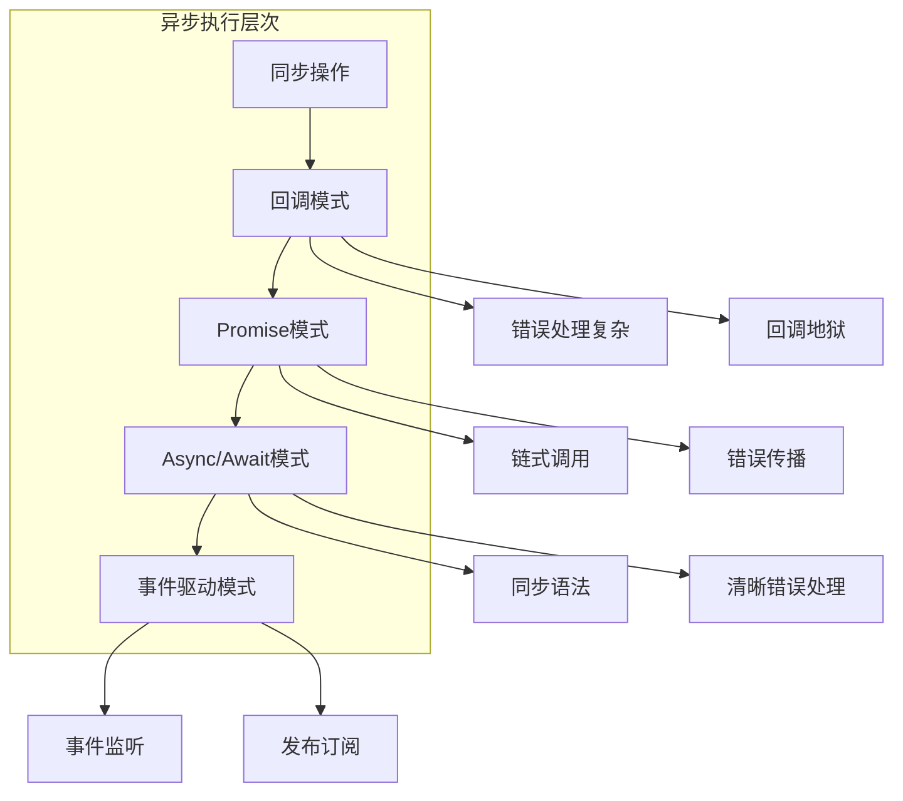
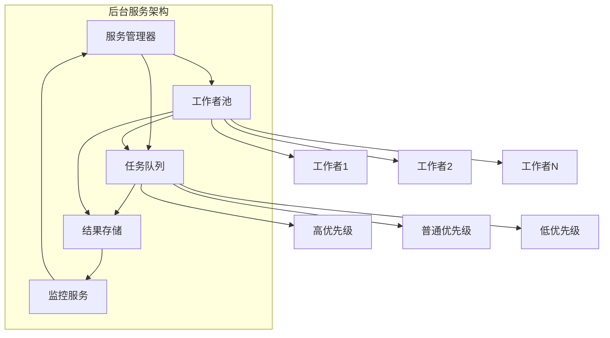
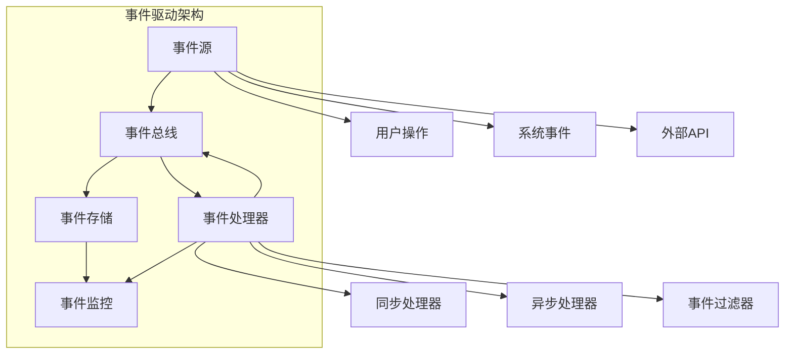
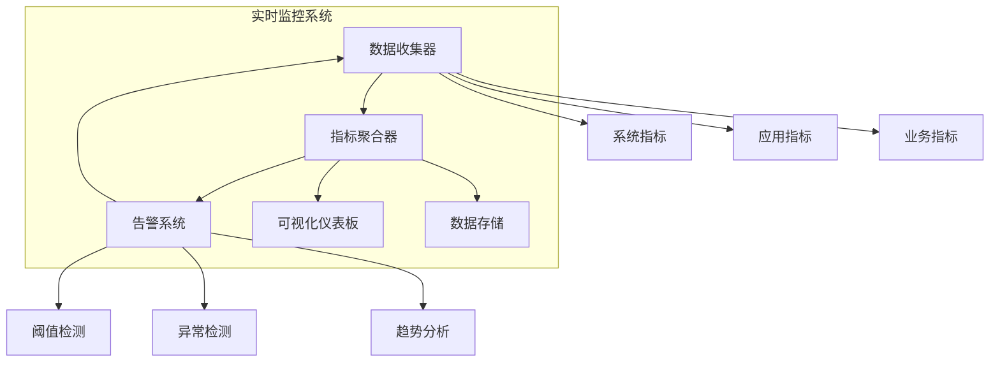

# 第8章: 异步和后台操作

## 学习目标

- 理解异步编程模型和事件驱动架构
- 掌握后台服务和任务队列实现
- 学习实时监控和事件处理
- 构建高性能的异步系统

## 8.1 异步执行模式

### 8.1.1 异步编程架构

异步编程是现代AI代理系统的核心，允许多个操作同时进行而不阻塞主线程。



### 8.1.2 异步任务调度器

```typescript
// src/async/task-scheduler.ts
import { EventEmitter } from 'events';

export interface ScheduledTask {
  id: string;
  name: string;
  handler: () => Promise<any>;
  schedule: TaskSchedule;
  status: TaskStatus;
  lastRun?: number;
  nextRun?: number;
  runCount: number;
  errorCount: number;
  lastError?: Error;
}

export interface TaskSchedule {
  type: 'once' | 'interval' | 'cron' | 'delayed';
  delay?: number;
  interval?: number;
  cron?: string;
  immediate?: boolean;
}

export enum TaskStatus {
  PENDING = 'pending',
  RUNNING = 'running',
  COMPLETED = 'completed',
  FAILED = 'failed',
  CANCELLED = 'cancelled',
  PAUSED = 'paused'
}

export class TaskScheduler extends EventEmitter {
  private tasks: Map<string, ScheduledTask> = new Map();
  private timers: Map<string, NodeJS.Timeout> = new Map();
  private queue: TaskQueue;
  private config: SchedulerConfig;

  constructor(config: SchedulerConfig = {}) {
    super();
    this.config = {
      maxConcurrentTasks: config.maxConcurrentTasks || 10,
      queueTimeout: config.queueTimeout || 30000,
      retryPolicy: config.retryPolicy || {
        maxRetries: 3,
        backoffStrategy: 'exponential',
        initialDelay: 1000,
        maxDelay: 10000
      },
      ...config
    };

    this.queue = new TaskQueue(this.config.maxConcurrentTasks);
  }

  // 调度任务
  schedule(taskConfig: {
    name: string;
    handler: () => Promise<any>;
    schedule: TaskSchedule;
  }): string {
    const task: ScheduledTask = {
      id: this.generateTaskId(),
      name: taskConfig.name,
      handler: taskConfig.handler,
      schedule: taskConfig.schedule,
      status: TaskStatus.PENDING,
      runCount: 0,
      errorCount: 0
    };

    this.tasks.set(task.id, task);

    // 根据调度类型设置定时器
    switch (taskConfig.schedule.type) {
      case 'once':
        this.scheduleOnce(task);
        break;
      case 'interval':
        this.scheduleInterval(task);
        break;
      case 'cron':
        this.scheduleCron(task);
        break;
      case 'delayed':
        this.scheduleDelayed(task);
        break;
    }

    this.emit('taskScheduled', task);
    return task.id;
  }

  // 调度一次性任务
  private scheduleOnce(task: ScheduledTask): void {
    if (task.schedule.immediate) {
      this.executeTask(task);
    } else {
      const delay = task.schedule.delay || 0;
      const timer = setTimeout(() => {
        this.executeTask(task);
      }, delay);
      this.timers.set(task.id, timer);
    }
  }

  // 调度间隔任务
  private scheduleInterval(task: ScheduledTask): void {
    const interval = task.schedule.interval || 60000;
    
    const timer = setInterval(() => {
      this.executeTask(task);
    }, interval);

    this.timers.set(task.id, timer);

    if (task.schedule.immediate) {
      this.executeTask(task);
    }
  }

  // 调度Cron任务
  private scheduleCron(task: ScheduledTask): void {
    // 简化实现，实际应该使用cron库
    const cronExpression = task.schedule.cron || '0 * * * *';
    const interval = this.parseCronToInterval(cronExpression);
    
    this.scheduleInterval({
      ...task,
      schedule: {
        type: 'interval',
        interval
      }
    });
  }

  // 调度延迟任务
  private scheduleDelayed(task: ScheduledTask): void {
    const delay = task.schedule.delay || 0;
    const timer = setTimeout(() => {
      this.executeTask(task);
    }, delay);
    this.timers.set(task.id, timer);
  }

  // 执行任务
  private async executeTask(task: ScheduledTask): Promise<void> {
    if (task.status === TaskStatus.RUNNING || task.status === TaskStatus.PAUSED) {
      return; // 任务正在运行或已暂停
    }

    task.status = TaskStatus.RUNNING;
    task.lastRun = Date.now();
    this.emit('taskStarted', task);

    try {
      // 添加到执行队列
      const result = await this.queue.add(() => task.handler());

      task.status = TaskStatus.COMPLETED;
      task.runCount++;
      this.emit('taskCompleted', task, result);

    } catch (error) {
      task.status = TaskStatus.FAILED;
      task.errorCount++;
      task.lastError = error as Error;
      this.emit('taskFailed', task, error);

      // 根据重试策略决定是否重试
      if (task.errorCount <= this.config.retryPolicy.maxRetries) {
        this.scheduleRetry(task);
      }

    } finally {
      // 更新下次运行时间
      this.updateNextRun(task);
    }
  }

  // 调度重试
  private scheduleRetry(task: ScheduledTask): void {
    const retryDelay = this.calculateRetryDelay(task.errorCount);
    
    setTimeout(() => {
      this.executeTask(task);
    }, retryDelay);
  }

  // 计算重试延迟
  private calculateRetryDelay(errorCount: number): number {
    const { initialDelay, maxDelay, backoffStrategy } = this.config.retryPolicy;

    switch (backoffStrategy) {
      case 'linear':
        return Math.min(initialDelay * errorCount, maxDelay);
      
      case 'exponential':
        return Math.min(initialDelay * Math.pow(2, errorCount - 1), maxDelay);
      
      case 'fixed':
        return initialDelay;
      
      default:
        return initialDelay;
    }
  }

  // 暂停任务
  pauseTask(taskId: string): void {
    const task = this.tasks.get(taskId);
    if (task) {
      task.status = TaskStatus.PAUSED;
      this.emit('taskPaused', task);
    }
  }

  // 恢复任务
  resumeTask(taskId: string): void {
    const task = this.tasks.get(taskId);
    if (task && task.status === TaskStatus.PAUSED) {
      task.status = TaskStatus.PENDING;
      this.emit('taskResumed', task);
      this.executeTask(task);
    }
  }

  // 取消任务
  cancelTask(taskId: string): void {
    const task = this.tasks.get(taskId);
    if (!task) return;

    // 清除定时器
    const timer = this.timers.get(taskId);
    if (timer) {
      clearTimeout(timer);
      clearInterval(timer);
      this.timers.delete(taskId);
    }

    task.status = TaskStatus.CANCELLED;
    this.emit('taskCancelled', task);
  }

  // 获取任务状态
  getTaskStatus(taskId: string): ScheduledTask | null {
    return this.tasks.get(taskId) || null;
  }

  // 获取所有任务
  getAllTasks(): ScheduledTask[] {
    return Array.from(this.tasks.values());
  }

  // 更新下次运行时间
  private updateNextRun(task: ScheduledTask): void {
    if (task.schedule.type === 'interval' && task.schedule.interval) {
      task.nextRun = Date.now() + task.schedule.interval;
    } else if (task.schedule.type === 'cron') {
      task.nextRun = this.calculateNextCronTime(task.schedule.cron!);
    }
  }

  // 解析Cron表达式到间隔
  private parseCronToInterval(cronExpression: string): number {
    // 简化实现，实际应该使用完整的cron解析器
    const parts = cronExpression.split(' ');
    if (parts.length !== 5) {
      return 60000; // 默认1分钟
    }

    const minute = parts[0];
    if (minute === '*') {
      return 60000; // 每分钟
    } else if (!minute.includes('/')) {
      return 60000 * 60; // 每小时
    }

    return 60000; // 默认1分钟
  }

  // 计算下次Cron时间
  private calculateNextCronTime(cronExpression: string): number {
    const interval = this.parseCronToInterval(cronExpression);
    return Date.now() + interval;
  }

  // 生成任务ID
  private generateTaskId(): string {
    return `task-${Date.now()}-${Math.random().toString(36).substr(2, 9)}`;
  }

  // 清理资源
  cleanup(): void {
    // 取消所有定时器
    for (const timer of this.timers.values()) {
      clearTimeout(timer);
      clearInterval(timer);
    }
    this.timers.clear();
    this.tasks.clear();
    this.queue.cleanup();
  }
}

// 任务队列实现
class TaskQueue {
  private queue: Array<() => Promise<any>> = [];
  private activeWorkers: number = 0;
  private maxConcurrency: number;
  private pendingResults: Map<string, any> = new Map();

  constructor(maxConcurrency: number) {
    this.maxConcurrency = maxConcurrency;
  }

  // 添加任务到队列
  async add<T>(task: () => Promise<T>): Promise<T> {
    return new Promise((resolve, reject) => {
      const wrappedTask = async () => {
        try {
          const result = await task();
          resolve(result);
        } catch (error) {
          reject(error);
        }
      };

      this.queue.push(wrappedTask);
      this.processQueue();
    });
  }

  // 处理队列
  private async processQueue(): Promise<void> {
    while (this.queue.length > 0 && this.activeWorkers < this.maxConcurrency) {
      const task = this.queue.shift();
      if (task) {
        this.activeWorkers++;
        
        task().finally(() => {
          this.activeWorkers--;
          this.processQueue();
        });
      }
    }
  }

  // 清理队列
  cleanup(): void {
    this.queue = [];
    this.activeWorkers = 0;
    this.pendingResults.clear();
  }
}

// 调度器配置接口
interface SchedulerConfig {
  maxConcurrentTasks?: number;
  queueTimeout?: number;
  retryPolicy?: RetryPolicy;
}

interface RetryPolicy {
  maxRetries: number;
  backoffStrategy: 'linear' | 'exponential' | 'fixed';
  initialDelay: number;
  maxDelay: number;
}
```

## 8.2 后台服务架构

### 8.2.1 服务组件架构



### 8.2.2 后台服务管理器

```typescript
// src/async/background-service.ts
import { EventEmitter } from 'events';
import { TaskScheduler } from './task-scheduler';

export interface BackgroundServiceConfig {
  maxWorkers?: number;
  workerTimeout?: number;
  queueSize?: number;
  enableMonitoring?: boolean;
  monitoringInterval?: number;
}

export class BackgroundServiceManager extends EventEmitter {
  private services: Map<string, BackgroundService> = new Map();
  private workers: WorkerPool;
  private taskQueue: PriorityTaskQueue;
  private monitoring: ServiceMonitoring;
  private config: BackgroundServiceConfig;

  constructor(config: BackgroundServiceConfig = {}) {
    super();
    this.config = {
      maxWorkers: config.maxWorkers || 4,
      workerTimeout: config.workerTimeout || 300000,
      queueSize: config.queueSize || 1000,
      enableMonitoring: config.enableMonitoring !== false,
      monitoringInterval: config.monitoringInterval || 30000,
      ...config
    };

    this.workers = new WorkerPool(this.config.maxWorkers);
    this.taskQueue = new PriorityTaskQueue(this.config.queueSize);
    this.monitoring = new ServiceMonitoring(this.config.monitoringInterval);

    this.initialize();
  }

  // 初始化服务管理器
  private async initialize(): Promise<void> {
    // 启动工作者池
    await this.workers.start();

    // 启动任务处理
    this.startTaskProcessing();

    // 启动监控
    if (this.config.enableMonitoring) {
      await this.monitoring.start();
    }

    this.emit('initialized');
  }

  // 注册后台服务
  registerService(serviceConfig: ServiceConfig): string {
    const service = new BackgroundService(serviceConfig);
    const serviceId = service.getId();

    this.services.set(serviceId, service);

    // 启动服务
    service.start().catch(error => {
      this.emit('serviceError', serviceId, error);
    });

    this.emit('serviceRegistered', serviceId, service);
    return serviceId;
  }

  // 提交后台任务
  async submitTask(task: BackgroundTask): Promise<string> {
    const taskId = task.id || this.generateTaskId();
    task.id = taskId;

    // 添加到队列
    await this.taskQueue.enqueue(task);

    this.emit('taskSubmitted', taskId, task);
    return taskId;
  }

  // 获取任务状态
  async getTaskStatus(taskId: string): Promise<TaskStatus | null> {
    return this.taskQueue.getTaskStatus(taskId);
  }

  // 取消任务
  async cancelTask(taskId: string): Promise<boolean> {
    const cancelled = await this.taskQueue.remove(taskId);
    
    if (cancelled) {
      this.emit('taskCancelled', taskId);
    }

    return cancelled;
  }

  // 获取服务状态
  getServiceStatus(serviceId: string): ServiceStatus | null {
    const service = this.services.get(serviceId);
    return service ? service.getStatus() : null;
  }

  // 获取所有服务状态
  getAllServicesStatus(): Map<string, ServiceStatus> {
    const status = new Map();

    for (const [serviceId, service] of this.services.entries()) {
      status.set(serviceId, service.getStatus());
    }

    return status;
  }

  // 启动任务处理
  private startTaskProcessing(): void {
    const processTasks = async () => {
      while (true) {
        try {
          // 从队列获取任务
          const task = await this.taskQueue.dequeue();

          if (!task) {
            await this.delay(100);
            continue;
          }

          // 分配给工作者
          await this.workers.assignTask(task);

        } catch (error) {
          this.emit('processingError', error);
          await this.delay(1000);
        }
      }
    };

    // 启动处理循环
    processTasks().catch(error => {
      this.emit('fatalError', error);
    });
  }

  // 生成任务ID
  private generateTaskId(): string {
    return `bg-task-${Date.now()}-${Math.random().toString(36).substr(2, 9)}`;
  }

  // 延迟辅助方法
  private delay(ms: number): Promise<void> {
    return new Promise(resolve => setTimeout(resolve, ms));
  }

  // 清理资源
  async cleanup(): Promise<void> {
    // 停止监控
    await this.monitoring.stop();

    // 停止工作者池
    await this.workers.stop();

    // 停止所有服务
    for (const service of this.services.values()) {
      await service.stop();
    }

    this.services.clear();
    this.emit('cleanup');
  }
}

// 后台服务实现
class BackgroundService extends EventEmitter {
  private config: ServiceConfig;
  private status: ServiceInternalStatus;
  private scheduler: TaskScheduler;
  private tasks: Map<string, ScheduledTask> = new Map();

  constructor(config: ServiceConfig) {
    super();
    this.config = config;
    this.status = {
      state: 'stopped',
      startTime: 0,
      tasksProcessed: 0,
      tasksFailed: 0,
      lastActivity: 0
    };

    this.scheduler = new TaskScheduler();
  }

  // 启动服务
  async start(): Promise<void> {
    if (this.status.state === 'running') {
      return;
    }

    this.status.state = 'running';
    this.status.startTime = Date.now();

    // 调度服务的定期任务
    if (this.config.intervalTasks) {
      for (const intervalTask of this.config.intervalTasks) {
        const taskId = this.scheduler.schedule({
          name: intervalTask.name,
          handler: intervalTask.handler,
          schedule: {
            type: 'interval',
            interval: intervalTask.interval,
            immediate: intervalTask.immediate
          }
        });

        this.tasks.set(taskId, this.scheduler.getTaskStatus(taskId)!);
      }
    }

    this.emit('started');
  }

  // 停止服务
  async stop(): Promise<void> {
    if (this.status.state !== 'running') {
      return;
    }

    this.status.state = 'stopped';

    // 取消所有任务
    for (const taskId of this.tasks.keys()) {
      this.scheduler.cancelTask(taskId);
    }
    this.tasks.clear();

    this.emit('stopped');
  }

  // 获取服务ID
  getId(): string {
    return this.config.id;
  }

  // 获取服务状态
  getStatus(): ServiceStatus {
    return {
      id: this.config.id,
      name: this.config.name,
      state: this.status.state,
      uptime: this.status.state === 'running' ? Date.now() - this.status.startTime : 0,
      tasksProcessed: this.status.tasksProcessed,
      tasksFailed: this.status.tasksFailed,
      lastActivity: this.status.lastActivity
    };
  }

  // 处理任务结果
  private handleTaskResult(taskId: string, result: any): void {
    this.status.tasksProcessed++;
    this.status.lastActivity = Date.now();
    this.emit('taskCompleted', taskId, result);
  }

  // 处理任务错误
  private handleTaskError(taskId: string, error: Error): void {
    this.status.tasksFailed++;
    this.status.lastActivity = Date.now();
    this.emit('taskError', taskId, error);
  }
}

// 工作者池实现
class WorkerPool {
  private workers: Worker[] = [];
  private maxWorkers: number;
  private taskQueue: BackgroundTask[] = [];

  constructor(maxWorkers: number) {
    this.maxWorkers = maxWorkers;
  }

  // 启动工作者池
  async start(): Promise<void> {
    for (let i = 0; i < this.maxWorkers; i++) {
      const worker = new Worker(i);
      await worker.start();
      this.workers.push(worker);
    }
  }

  // 分配任务
  async assignTask(task: BackgroundTask): Promise<void> {
    const availableWorker = this.workers.find(w => w.isAvailable());

    if (availableWorker) {
      await availableWorker.assignTask(task);
    } else {
      // 所有工作者都忙，等待或扩展池
      this.taskQueue.push(task);
    }
  }

  // 停止工作者池
  async stop(): Promise<void> {
    for (const worker of this.workers) {
      await worker.stop();
    }
    this.workers = [];
  }
}

// 工作者实现
class Worker {
  private id: number;
  private currentTask: BackgroundTask | null = null;
  private busy: boolean = false;

  constructor(id: number) {
    this.id = id;
  }

  // 启动工作者
  async start(): Promise<void> {
    // 工作者初始化
  }

  // 停止工作者
  async stop(): Promise<void> {
    // 工作者清理
  }

  // 检查是否可用
  isAvailable(): boolean {
    return !this.busy;
  }

  // 分配任务
  async assignTask(task: BackgroundTask): Promise<void> {
    this.currentTask = task;
    this.busy = true;

    try {
      await task.handler();
    } finally {
      this.busy = false;
      this.currentTask = null;
    }
  }
}

// 优先级任务队列
class PriorityTaskQueue {
  private queues: Map<Priority, BackgroundTask[]> = new Map();
  private maxSize: number;

  constructor(maxSize: number) {
    this.maxSize = maxSize;

    // 初始化不同优先级的队列
    for (const priority of Object.values(Priority)) {
      this.queues.set(priority, []);
    }
  }

  // 入队
  async enqueue(task: BackgroundTask): Promise<void> {
    const priority = task.priority || Priority.NORMAL;
    const queue = this.queues.get(priority)!;

    // 检查队列大小
    const totalSize = this.getTotalSize();
    if (totalSize >= this.maxSize) {
      throw new Error('Task queue is full');
    }

    queue.push(task);
  }

  // 出队
  async dequeue(): Promise<BackgroundTask | null> {
    // 按优先级顺序检查队列
    for (const priority of Object.values(Priority)) {
      const queue = this.queues.get(priority)!;
      if (queue.length > 0) {
        return queue.shift()!;
      }
    }

    return null;
  }

  // 移除任务
  async remove(taskId: string): Promise<boolean> {
    for (const queue of this.queues.values()) {
      const index = queue.findIndex(task => task.id === taskId);
      if (index !== -1) {
        queue.splice(index, 1);
        return true;
      }
    }
    return false;
  }

  // 获取任务状态
  getTaskStatus(taskId: string): TaskStatus | null {
    for (const queue of this.queues.values()) {
      const task = queue.find(t => t.id === taskId);
      if (task) {
        return {
          id: task.id,
          status: 'pending',
          submittedAt: task.submittedAt,
          priority: task.priority
        };
      }
    }
    return null;
  }

  // 获取总队列大小
  private getTotalSize(): number {
    let total = 0;
    for (const queue of this.queues.values()) {
      total += queue.length;
    }
    return total;
  }
}

// 服务监控实现
class ServiceMonitoring {
  private interval: number;
  private monitorInterval: NodeJS.Timeout | null = null;
  private metrics: Map<string, ServiceMetrics> = new Map();

  constructor(interval: number) {
    this.interval = interval;
  }

  // 启动监控
  async start(): Promise<void> {
    this.monitorInterval = setInterval(() => {
      this.collectMetrics();
    }, this.interval);
  }

  // 停止监控
  async stop(): Promise<void> {
    if (this.monitorInterval) {
      clearInterval(this.monitorInterval);
      this.monitorInterval = null;
    }
  }

  // 收集指标
  private collectMetrics(): void {
    // 收集各种性能指标
    const timestamp = Date.now();

    // 存储指标
    this.metrics.set(timestamp.toString(), {
      timestamp,
      cpuUsage: process.cpuUsage(),
      memoryUsage: process.memoryUsage(),
      activeWorkers: 0,
      queueSize: 0
    });
  }
}

// 相关接口定义
interface BackgroundTask {
  id?: string;
  handler: () => Promise<any>;
  priority?: Priority;
  submittedAt: number;
  timeout?: number;
  retryPolicy?: RetryPolicy;
}

interface ServiceConfig {
  id: string;
  name: string;
  intervalTasks?: IntervalTask[];
  dependencies?: string[];
  healthCheck?: () => Promise<boolean>;
}

interface IntervalTask {
  name: string;
  interval: number;
  handler: () => Promise<void>;
  immediate?: boolean;
}

interface ServiceStatus {
  id: string;
  name: string;
  state: 'running' | 'stopped' | 'error';
  uptime: number;
  tasksProcessed: number;
  tasksFailed: number;
  lastActivity: number;
}

interface ServiceInternalStatus {
  state: 'running' | 'stopped' | 'error';
  startTime: number;
  tasksProcessed: number;
  tasksFailed: number;
  lastActivity: number;
}

interface ServiceMetrics {
  timestamp: number;
  cpuUsage: NodeJS.CpuUsage;
  memoryUsage: NodeJS.MemoryUsage;
  activeWorkers: number;
  queueSize: number;
}

enum Priority {
  LOW = 0,
  NORMAL = 1,
  HIGH = 2,
  CRITICAL = 3
}
```

## 8.3 事件驱动架构

### 8.3.1 事件系统架构



### 8.3.2 事件总线实现

```typescript
// src/async/event-bus.ts
import { EventEmitter } from 'events';

export interface DomainEvent {
  id: string;
  type: string;
  aggregateId: string;
  payload: any;
  timestamp: number;
  version: number;
  metadata?: EventMetadata;
}

export interface EventMetadata {
  causationId?: string;
  correlationId?: string;
  userId?: string;
  source: string;
  tags?: string[];
}

export interface EventSubscription {
  eventType: string;
  handler: EventHandler;
  filter?: EventFilter;
  priority?: number;
}

export interface EventHandler {
  (event: DomainEvent): Promise<void> | void;
}

export interface EventFilter {
  (event: DomainEvent): boolean;
}

export class EventBus extends EventEmitter {
  private subscriptions: Map<string, EventSubscription[]> = new Map();
  private eventStore: EventStore;
  private middleware: EventMiddleware[] = [];
  private monitoring: EventMonitoring;

  constructor(eventStore?: EventStore) {
    super();
    this.eventStore = eventStore || new InMemoryEventStore();
    this.monitoring = new EventMonitoring();
  }

  // 发布事件
  async publish(event: DomainEvent): Promise<void> {
    // 生成事件ID和时间戳
    event.id = event.id || this.generateEventId();
    event.timestamp = event.timestamp || Date.now();

    try {
      // 应用中间件
      const processedEvent = await this.applyMiddleware(event);

      // 存储事件
      await this.eventStore.save(processedEvent);

      // 分发事件
      await this.dispatchEvent(processedEvent);

      // 记录监控指标
      this.monitoring.recordEvent(processedEvent);

    } catch (error) {
      this.emit('publishError', event, error);
      throw error;
    }
  }

  // 订阅事件
  subscribe(subscription: EventSubscription): () => void {
    const eventType = subscription.eventType;
    
    if (!this.subscriptions.has(eventType)) {
      this.subscriptions.set(eventType, []);
    }

    // 按优先级插入订阅
    const subscriptions = this.subscriptions.get(eventType)!;
    const priority = subscription.priority || 0;
    
    let insertIndex = subscriptions.length;
    for (let i = 0; i < subscriptions.length; i++) {
      if (priority > (subscriptions[i].priority || 0)) {
        insertIndex = i;
        break;
      }
    }

    subscriptions.splice(insertIndex, 0, subscription);

    // 返回取消订阅函数
    return () => this.unsubscribe(eventType, subscription);
  }

  // 取消订阅
  unsubscribe(eventType: string, subscription: EventSubscription): void {
    const subscriptions = this.subscriptions.get(eventType);
    if (subscriptions) {
      const index = subscriptions.indexOf(subscription);
      if (index !== -1) {
        subscriptions.splice(index, 1);
      }
    }
  }

  // 分发事件
  private async dispatchEvent(event: DomainEvent): Promise<void> {
    const subscriptions = this.subscriptions.get(event.type) || [];
    const successfulHandlers: string[] = [];
    const failedHandlers: string[] = [];

    for (const subscription of subscriptions) {
      try {
        // 应用过滤器
        if (subscription.filter && !subscription.filter(event)) {
          continue;
        }

        // 执行处理器
        await subscription.handler(event);
        successfulHandlers.push(subscription.eventType);

      } catch (error) {
        failedHandlers.push(subscription.eventType);
        this.emit('handlerError', event, subscription, error);
      }
    }

    // 触发事件处理完成事件
    this.emit('eventProcessed', event, {
      successful: successfulHandlers.length,
      failed: failedHandlers.length,
      handlers: {
        successful: successfulHandlers,
        failed: failedHandlers
      }
    });
  }

  // 添加中间件
  use(middleware: EventMiddleware): void {
    this.middleware.push(middleware);
  }

  // 应用中间件
  private async applyMiddleware(event: DomainEvent): Promise<DomainEvent> {
    let processedEvent = event;

    for (const middleware of this.middleware) {
      processedEvent = await middleware(processedEvent, this);
    }

    return processedEvent;
  }

  // 重放事件
  async replayEvents(aggregateId: string, fromVersion?: number): Promise<void> {
    const events = await this.eventStore.getEventsByAggregate(aggregateId, fromVersion);

    for (const event of events) {
      await this.dispatchEvent(event);
    }
  }

  // 获取事件历史
  async getEventHistory(eventType?: string, limit?: number): Promise<DomainEvent[]> {
    return await this.eventStore.getEvents(eventType, limit);
  }

  // 生成事件ID
  private generateEventId(): string {
    return `event-${Date.now()}-${Math.random().toString(36).substr(2, 9)}`;
  }

  // 获取监控统计
  getMonitoringStats() {
    return this.monitoring.getStats();
  }
}

// 事件存储接口
interface EventStore {
  save(event: DomainEvent): Promise<void>;
  getEvents(eventType?: string, limit?: number): Promise<DomainEvent[]>;
  getEventsByAggregate(aggregateId: string, fromVersion?: number): Promise<DomainEvent[]>;
}

// 内存事件存储实现
class InMemoryEventStore implements EventStore {
  private events: DomainEvent[] = [];

  async save(event: DomainEvent): Promise<void> {
    this.events.push(event);
  }

  async getEvents(eventType?: string, limit?: number): Promise<DomainEvent[]> {
    let filtered = this.events;

    if (eventType) {
      filtered = filtered.filter(e => e.type === eventType);
    }

    if (limit) {
      filtered = filtered.slice(-limit);
    }

    return filtered;
  }

  async getEventsByAggregate(aggregateId: string, fromVersion?: number): Promise<DomainEvent[]> {
    let filtered = this.events.filter(e => e.aggregateId === aggregateId);

    if (fromVersion) {
      filtered = filtered.filter(e => e.version > fromVersion);
    }

    return filtered;
  }
}

// 事件监控实现
class EventMonitoring {
  private stats: EventStats = {
    totalEvents: 0,
    eventsByType: new Map(),
    eventsPerSecond: 0,
    errorRate: 0,
    lastResetTime: Date.now()
  };

  recordEvent(event: DomainEvent): void {
    this.stats.totalEvents++;

    const typeCount = this.stats.eventsByType.get(event.type) || 0;
    this.stats.eventsByType.set(event.type, typeCount + 1);

    this.updateEventsPerSecond();
  }

  private updateEventsPerSecond(): void {
    const now = Date.now();
    const elapsed = (now - this.stats.lastResetTime) / 1000;
    this.stats.eventsPerSecond = this.stats.totalEvents / elapsed;
  }

  getStats(): EventStats {
    return { ...this.stats };
  }
}

// 中间件类型
type EventMiddleware = (event: DomainEvent, bus: EventBus) => Promise<DomainEvent>;

// 统计接口
interface EventStats {
  totalEvents: number;
  eventsByType: Map<string, number>;
  eventsPerSecond: number;
  errorRate: number;
  lastResetTime: number;
}
```

## 8.4 实时监控系统

### 8.4.1 监控架构



### 8.4.2 监控系统实现

```typescript
// src/async/monitoring-system.ts
import { EventEmitter } from 'events';

export interface Metric {
  name: string;
  value: number;
  timestamp: number;
  labels?: Record<string, string>;
  type: MetricType;
}

export enum MetricType {
  COUNTER = 'counter',
  GAUGE = 'gauge',
  HISTOGRAM = 'histogram',
  SUMMARY = 'summary'
}

export interface AlertRule {
  id: string;
  name: string;
  condition: AlertCondition;
  severity: AlertSeverity;
  actions: AlertAction[];
  cooldown?: number;
}

export interface AlertCondition {
  metric: string;
  operator: 'gt' | 'lt' | 'eq' | 'ne';
  threshold: number;
  duration?: number;
}

export enum AlertSeverity {
  INFO = 'info',
  WARNING = 'warning',
  ERROR = 'error',
  CRITICAL = 'critical'
}

export interface AlertAction {
  type: 'log' | 'email' | 'webhook' | 'auto_remediate';
  config: any;
}

export class MonitoringSystem extends EventEmitter {
  private metrics: MetricsStore;
  private alerts: AlertManager;
  private dashboards: DashboardManager;
  private collectors: Map<string, MetricCollector> = new Map();

  constructor() {
    super();
    this.metrics = new MetricsStore();
    this.alerts = new AlertManager(this.metrics);
    this.dashboards = new DashboardManager(this.metrics);
  }

  // 注册指标收集器
  registerCollector(collector: MetricCollector): void {
    this.collectors.set(collector.getId(), collector);
    collector.on('metric', (metric) => {
      this.recordMetric(metric);
    });
  }

  // 记录指标
  recordMetric(metric: Metric): void {
    this.metrics.record(metric);
    this.emit('metricRecorded', metric);
    
    // 检查告警规则
    this.alerts.checkMetric(metric);
  }

  // 添加告警规则
  addAlertRule(rule: AlertRule): void {
    this.alerts.addRule(rule);
  }

  // 创建仪表板
  createDashboard(config: DashboardConfig): string {
    return this.dashboards.createDashboard(config);
  }

  // 获取指标数据
  getMetrics(query: MetricQuery): Metric[] {
    return this.metrics.query(query);
  }

  // 获取告警状态
  getAlertStatus(): AlertStatus[] {
    return this.alerts.getStatus();
  }

  // 获取仪表板数据
  getDashboardData(dashboardId: string): DashboardData {
    return this.dashboards.getData(dashboardId);
  }

  // 启动系统
  async start(): Promise<void> {
    // 启动所有收集器
    for (const collector of this.collectors.values()) {
      await collector.start();
    }

    // 启动告警检查
    this.alerts.start();

    this.emit('started');
  }

  // 停止系统
  async stop(): Promise<void> {
    // 停止所有收集器
    for (const collector of this.collectors.values()) {
      await collector.stop();
    }

    // 停止告警检查
    this.alerts.stop();

    this.emit('stopped');
  }
}

// 指标存储实现
class MetricsStore {
  private metrics: Map<string, Metric[]> = new Map();
  private aggregations: Map<string, MetricAggregation> = new Map();

  record(metric: Metric): void {
    const key = this.getMetricKey(metric);
    
    if (!this.metrics.has(key)) {
      this.metrics.set(key, []);
    }

    const metrics = this.metrics.get(key)!;
    metrics.push(metric);

    // 保持最近1小时的数据
    const oneHourAgo = Date.now() - 3600000;
    const recentMetrics = metrics.filter(m => m.timestamp > oneHourAgo);
    this.metrics.set(key, recentMetrics);

    // 更新聚合
    this.updateAggregation(key, recentMetrics);
  }

  query(query: MetricQuery): Metric[] {
    const results: Metric[] = [];

    for (const [key, metrics] of this.metrics.entries()) {
      if (this.matchesQuery(key, query)) {
        // 应用时间范围过滤
        const filtered = this.filterByTimeRange(metrics, query);
        results.push(...filtered);
      }
    }

    return results;
  }

  private getMetricKey(metric: Metric): string {
    const labels = metric.labels ? JSON.stringify(metric.labels) : '';
    return `${metric.name}:${metric.type}:${labels}`;
  }

  private matchesQuery(key: string, query: MetricQuery): boolean {
    if (query.name && !key.includes(query.name)) {
      return false;
    }

    if (query.type && !key.includes(query.type)) {
      return false;
    }

    return true;
  }

  private filterByTimeRange(metrics: Metric[], query: MetricQuery): Metric[] {
    if (!query.startTime && !query.endTime) {
      return metrics;
    }

    return metrics.filter(metric => {
      if (query.startTime && metric.timestamp < query.startTime) {
        return false;
      }
      if (query.endTime && metric.timestamp > query.endTime) {
        return false;
      }
      return true;
    });
  }

  private updateAggregation(key: string, metrics: Metric[]): void {
    if (metrics.length === 0) return;

    const latest = metrics[metrics.length - 1];
    const values = metrics.map(m => m.value);

    const aggregation: MetricAggregation = {
      key,
      count: metrics.length,
      min: Math.min(...values),
      max: Math.max(...values),
      avg: values.reduce((sum, val) => sum + val, 0) / values.length,
      sum: values.reduce((sum, val) => sum + val, 0),
      lastValue: latest.value,
      lastTimestamp: latest.timestamp
    };

    this.aggregations.set(key, aggregation);
  }

  getAggregation(metricName: string, labels?: Record<string, string>): MetricAggregation | null {
    const key = this.getMetricKey({ name: metricName, type: MetricType.GAUGE, value: 0, timestamp: 0, labels });
    return this.aggregations.get(key) || null;
  }
}

// 告警管理器实现
class AlertManager extends EventEmitter {
  private rules: Map<string, AlertRule> = new Map();
  private activeAlerts: Map<string, ActiveAlert> = new Map();
  private checkInterval: NodeJS.Timeout | null = null;
  private metrics: MetricsStore;

  constructor(metrics: MetricsStore) {
    super();
    this.metrics = metrics;
  }

  addRule(rule: AlertRule): void {
    this.rules.set(rule.id, rule);
    this.emit('ruleAdded', rule);
  }

  removeRule(ruleId: string): void {
    this.rules.delete(ruleId);
    this.emit('ruleRemoved', ruleId);
  }

  checkMetric(metric: Metric): void {
    for (const rule of this.rules.values()) {
      if (rule.condition.metric === metric.name) {
        this.evaluateRule(rule, metric);
      }
    }
  }

  private evaluateRule(rule: AlertRule, metric: Metric): void {
    const { operator, threshold } = rule.condition;
    let triggered = false;

    switch (operator) {
      case 'gt':
        triggered = metric.value > threshold;
        break;
      case 'lt':
        triggered = metric.value < threshold;
        break;
      case 'eq':
        triggered = metric.value === threshold;
        break;
      case 'ne':
        triggered = metric.value !== threshold;
        break;
    }

    if (triggered) {
      this.triggerAlert(rule, metric);
    } else {
      this.resolveAlert(rule.id);
    }
  }

  private triggerAlert(rule: AlertRule, metric: Metric): void {
    const existingAlert = this.activeAlerts.get(rule.id);

    // 检查冷却期
    if (existingAlert && rule.cooldown) {
      const timeSinceLastTrigger = Date.now() - existingAlert.triggeredAt;
      if (timeSinceLastTrigger < rule.cooldown) {
        return;
      }
    }

    const alert: ActiveAlert = {
      ruleId: rule.id,
      ruleName: rule.name,
      severity: rule.severity,
      triggeredAt: Date.now(),
      metric,
      status: 'active'
    };

    this.activeAlerts.set(rule.id, alert);
    this.emit('alertTriggered', alert);

    // 执行告警动作
    this.executeActions(rule.actions, alert);
  }

  private resolveAlert(ruleId: string): void {
    const alert = this.activeAlerts.get(ruleId);
    if (alert) {
      alert.status = 'resolved';
      alert.resolvedAt = Date.now();
      this.emit('alertResolved', alert);
      this.activeAlerts.delete(ruleId);
    }
  }

  private async executeActions(actions: AlertAction[], alert: ActiveAlert): Promise<void> {
    for (const action of actions) {
      try {
        await this.executeAction(action, alert);
      } catch (error) {
        this.emit('actionError', action, alert, error);
      }
    }
  }

  private async executeAction(action: AlertAction, alert: ActiveAlert): Promise<void> {
    switch (action.type) {
      case 'log':
        console.log(`[${alert.severity.toUpperCase()}] ${alert.ruleName}: ${alert.metric.value}`);
        break;

      case 'webhook':
        // 发送webhook通知
        await this.sendWebhook(action.config.url, alert);
        break;

      case 'email':
        // 发送邮件通知
        await this.sendEmail(action.config.recipients, alert);
        break;

      case 'auto_remediate':
        // 自动修复
        await this.autoRemediate(action.config, alert);
        break;
    }
  }

  private async sendWebhook(url: string, alert: ActiveAlert): Promise<void> {
    // 实现webhook发送
  }

  private async sendEmail(recipients: string[], alert: ActiveAlert): Promise<void> {
    // 实现邮件发送
  }

  private async autoRemediate(config: any, alert: ActiveAlert): Promise<void> {
    // 实现自动修复
  }

  start(): void {
    this.checkInterval = setInterval(() => {
      this.checkAllRules();
    }, 60000); // 每分钟检查一次
  }

  stop(): void {
    if (this.checkInterval) {
      clearInterval(this.checkInterval);
      this.checkInterval = null;
    }
  }

  private checkAllRules(): void {
    // 检查所有规则的当前状态
  }

  getStatus(): AlertStatus[] {
    return Array.from(this.activeAlerts.values());
  }
}

// 仪表板管理器实现
class DashboardManager {
  private dashboards: Map<string, Dashboard> = new Map();
  private metrics: MetricsStore;

  constructor(metrics: MetricsStore) {
    this.metrics = metrics;
  }

  createDashboard(config: DashboardConfig): string {
    const dashboard: Dashboard = {
      id: this.generateDashboardId(),
      name: config.name,
      panels: config.panels.map(panel => ({
        ...panel,
        id: this.generatePanelId()
      })),
      layout: config.layout || 'grid',
      refreshInterval: config.refreshInterval || 30000
    };

    this.dashboards.set(dashboard.id, dashboard);
    return dashboard.id;
  }

  getData(dashboardId: string): DashboardData {
    const dashboard = this.dashboards.get(dashboardId);
    if (!dashboard) {
      throw new Error(`Dashboard ${dashboardId} not found`);
    }

    const panelsData: Map<string, PanelData> = new Map();

    for (const panel of dashboard.panels) {
      const panelData = this.getPanelData(panel);
      panelsData.set(panel.id, panelData);
    }

    return {
      dashboardId,
      name: dashboard.name,
      panels: panelsData,
      lastUpdate: Date.now()
    };
  }

  private getPanelData(panel: Panel): PanelData {
    const query: MetricQuery = {
      name: panel.metricName,
      type: panel.metricType,
      startTime: Date.now() - panel.timeRange,
      endTime: Date.now()
    };

    const metrics = this.metrics.query(query);
    const aggregation = this.metrics.getAggregation(panel.metricName, panel.labels);

    return {
      panelId: panel.id,
      title: panel.title,
      type: panel.type,
      metrics,
      aggregation,
      visualization: this.generateVisualization(panel, metrics, aggregation)
    };
  }

  private generateVisualization(panel: Panel, metrics: Metric[], aggregation: any): any {
    // 根据面板类型生成可视化数据
    switch (panel.type) {
      case 'line':
        return this.generateLineChart(metrics);
      case 'bar':
        return this.generateBarChart(metrics);
      case 'gauge':
        return this.generateGauge(aggregation);
      case 'table':
        return this.generateTable(metrics);
      default:
        return {};
    }
  }

  private generateLineChart(metrics: Metric[]): any {
    return {
      type: 'line',
      data: metrics.map(m => ({ x: m.timestamp, y: m.value }))
    };
  }

  private generateBarChart(metrics: Metric[]): any {
    return {
      type: 'bar',
      data: metrics.map(m => ({ x: m.timestamp, y: m.value }))
    };
  }

  private generateGauge(aggregation: any): any {
    return {
      type: 'gauge',
      value: aggregation?.lastValue || 0,
      min: aggregation?.min || 0,
      max: aggregation?.max || 100
    };
  }

  private generateTable(metrics: Metric[]): any {
    return {
      type: 'table',
      data: metrics.map(m => ({
        timestamp: new Date(m.timestamp).toISOString(),
        value: m.value,
        labels: m.labels
      }))
    };
  }

  private generateDashboardId(): string {
    return `dashboard-${Date.now()}`;
  }

  private generatePanelId(): string {
    return `panel-${Date.now()}-${Math.random().toString(36).substr(2, 9)}`;
  }
}

// 指标收集器接口
interface MetricCollector extends EventEmitter {
  getId(): string;
  start(): Promise<void>;
  stop(): Promise<void>;
}

// 相关接口定义
interface MetricQuery {
  name?: string;
  type?: MetricType;
  startTime?: number;
  endTime?: number;
  labels?: Record<string, string>;
}

interface MetricAggregation {
  key: string;
  count: number;
  min: number;
  max: number;
  avg: number;
  sum: number;
  lastValue: number;
  lastTimestamp: number;
}

interface ActiveAlert {
  ruleId: string;
  ruleName: string;
  severity: AlertSeverity;
  triggeredAt: number;
  resolvedAt?: number;
  metric: Metric;
  status: 'active' | 'resolved';
}

interface AlertStatus {
  ruleId: string;
  ruleName: string;
  severity: AlertSeverity;
  triggeredAt: number;
  status: string;
}

interface DashboardConfig {
  name: string;
  panels: Panel[];
  layout?: string;
  refreshInterval?: number;
}

interface Dashboard {
  id: string;
  name: string;
  panels: Panel[];
  layout: string;
  refreshInterval: number;
}

interface Panel {
  id: string;
  title: string;
  type: 'line' | 'bar' | 'gauge' | 'table' | 'stat';
  metricName: string;
  metricType?: MetricType;
  timeRange: number;
  labels?: Record<string, string>;
}

interface DashboardData {
  dashboardId: string;
  name: string;
  panels: Map<string, PanelData>;
  lastUpdate: number;
}

interface PanelData {
  panelId: string;
  title: string;
  type: string;
  metrics: Metric[];
  aggregation?: MetricAggregation;
  visualization: any;
}
```

## 8.5 本章小结

### 关键要点

- **异步编程模型**: 从回调到async/await的演进
- **任务调度**: 一次性、间隔、Cron等多种调度方式
- **后台服务**: 工作者池、优先级队列、服务监控
- **事件驱动**: 事件总线、事件存储、事件重放
- **实时监控**: 指标收集、告警规则、可视化仪表板

### 最佳实践

1. **合理设置超时** - 防止任务无限期挂起
2. **实现优雅关闭** - 确保资源正确释放
3. **监控异步操作** - 及时发现和处理异常
4. **使用优先级队列** - 确保重要任务优先执行
5. **实现重试机制** - 提高系统的可靠性

### 下一步学习

现在你已经掌握了异步编程的核心技术，接下来我们将：

- 📖 **第9章**: 学习代理间通信
- 🔧 **实践**: 构建高效的多代理协作系统
- 🎯 **目标**: 掌握代理协调和消息传递

---

**准备好探索代理通信的高级话题了吗？** 📡
