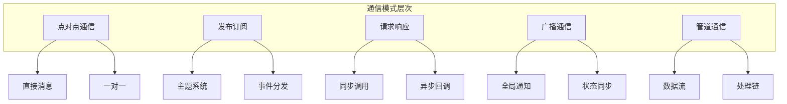
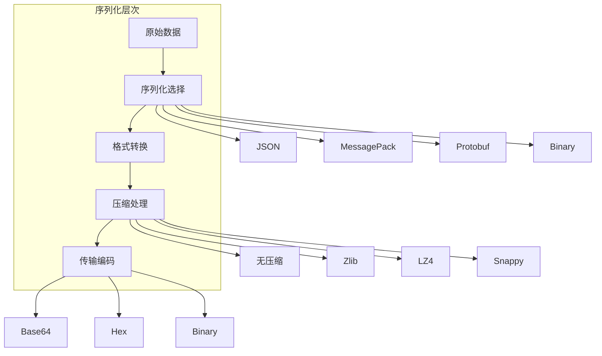
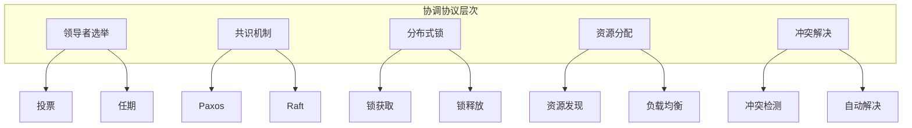
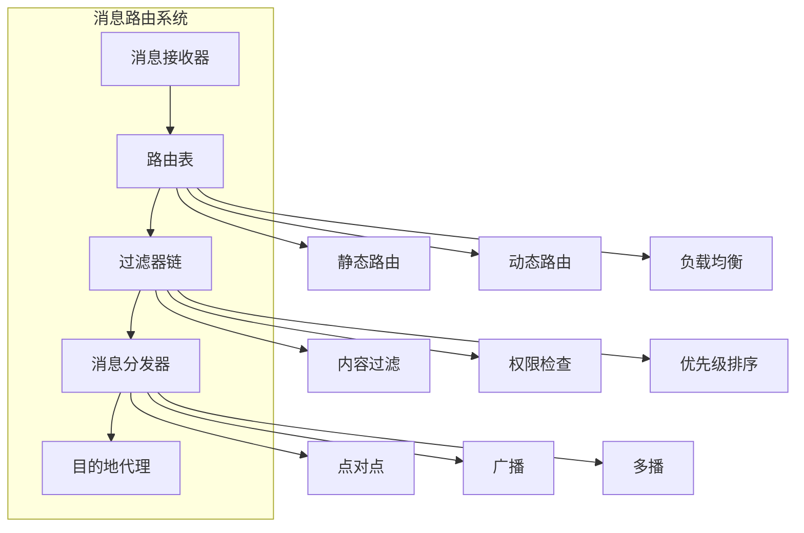
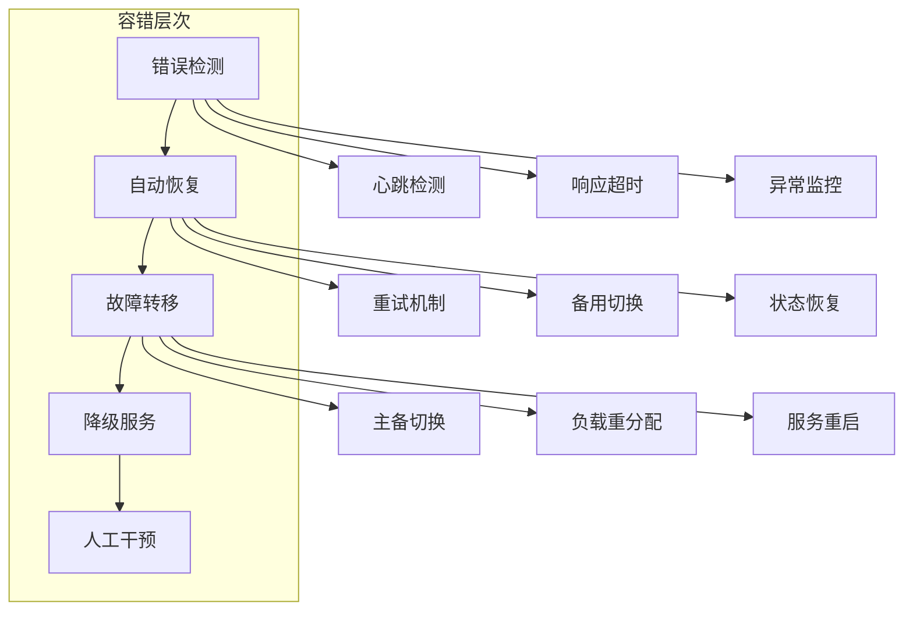

# 第9章: 代理间通信

## 学习目标

- 理解代理间通信的核心概念和模式
- 掌握消息协议和序列化技术
- 学习协商和协调机制
- 构建高效的多代理协作系统

## 9.1 通信协议和模式

### 9.1.1 通信模式架构

代理间通信是多代理系统协调工作的基础，支持多种通信模式和协议。



### 9.1.2 通信协议实现

```typescript
// src/communication/communication-protocol.ts
import { SubAgentMessage, MessageType, MessagePriority } from '../agents/subagent-interface';

export interface CommunicationProtocol {
  name: string;
  version: string;
  
  serialize(message: SubAgentMessage): Buffer;
  deserialize(data: Buffer): SubAgentMessage;
  
  validate(message: SubAgentMessage): boolean;
  compress(data: Buffer): Buffer;
  decompress(data: Buffer): Buffer;
  
  calculateChecksum(data: Buffer): string;
  verifyChecksum(data: Buffer, checksum: string): boolean;
}

export class BinaryProtocol implements CommunicationProtocol {
  public readonly name = 'binary';
  public readonly version = '2.0';

  serialize(message: SubAgentMessage): Buffer {
    // 创建协议头
    const header = this.createHeader(message);
    
    // 序列化消息体
    const body = this.serializeBody(message);
    
    // 组合头部和主体
    const packet = Buffer.concat([header, body]);
    
    // 计算校验和
    const checksum = this.calculateChecksum(packet);
    
    // 添加校验和
    const checksumBuffer = Buffer.from(checksum, 'hex');
    
    return Buffer.concat([packet, checksumBuffer]);
  }

  deserialize(data: Buffer): SubAgentMessage {
    try {
      // 验证数据长度
      if (data.length < 20) {
        throw new Error('Data too short to be valid message');
      }

      // 解析头部
      const header = this.parseHeader(data.slice(0, 20));
      
      // 验证版本
      if (header.version !== this.version) {
        throw new Error(`Protocol version mismatch: expected ${this.version}, got ${header.version}`);
      }

      // 提取主体
      const bodyStart = 20;
      const bodyEnd = 20 + header.bodyLength;
      const body = data.slice(bodyStart, bodyEnd);
      
      // 提取校验和
      const checksumStart = bodyEnd;
      const checksumEnd = checksumStart + 32;
      const checksum = data.slice(checksumStart, checksumEnd).toString('hex');
      
      // 验证校验和
      const packet = data.slice(0, bodyEnd);
      if (!this.verifyChecksum(packet, checksum)) {
        throw new Error('Checksum verification failed');
      }

      // 解压缩（如果启用）
      const decompressedBody = header.compressed ? 
        this.decompress(body) : body;

      // 反序列化消息
      return this.deserializeBody(decompressedBody, header);

    } catch (error) {
      throw new Error(`Message deserialization failed: ${error instanceof Error ? error.message : 'Unknown error'}`);
    }
  }

  validate(message: SubAgentMessage): boolean {
    // 验证必需字段
    if (!message.id || !message.from || !message.to || !message.type) {
      return false;
    }

    // 验证消息类型
    if (!Object.values(MessageType).includes(message.type)) {
      return false;
    }

    // 验证优先级
    if (!Object.values(MessagePriority).includes(message.priority)) {
      return false;
    }

    // 验证时间戳
    const now = Date.now();
    if (Math.abs(message.timestamp - now) > 60000) { // 允许1分钟的时钟偏差
      return false;
    }

    // 验证消息大小
    const serialized = JSON.stringify(message);
    if (serialized.length > 1048576) { // 1MB限制
      return false;
    }

    return true;
  }

  compress(data: Buffer): Buffer {
    // 使用zlib压缩
    const zlib = require('zlib');
    return zlib.deflateSync(data);
  }

  decompress(data: Buffer): Buffer {
    // 使用zlib解压缩
    const zlib = require('zlib');
    return zlib.inflateSync(data);
  }

  calculateChecksum(data: Buffer): string {
    const crypto = require('crypto');
    return crypto.createHash('sha256').update(data).digest('hex');
  }

  verifyChecksum(data: Buffer, checksum: string): boolean {
    const calculatedChecksum = this.calculateChecksum(data);
    return calculatedChecksum === checksum;
  }

  private createHeader(message: SubAgentMessage): Buffer {
    const header = Buffer.alloc(20);
    
    // 魔数 (4字节)
    header.writeUInt32LE(0x4D534747, 0); // 'MSGG'
    
    // 版本 (4字节)
    const versionBuffer = Buffer.from(this.version, 'ascii').slice(0, 4);
    versionBuffer.copy(header, 4);
    
    // 消息类型 (4字节)
    const typeBuffer = Buffer.from(message.type, 'ascii').slice(0, 4);
    typeBuffer.copy(header, 8);
    
    // 优先级 (1字节)
    header.writeUInt8(message.priority, 12);
    
    // 压缩标志 (1字节)
    header.writeUInt8(1, 13); // 默认启用压缩
    
    // 主体长度 (4字节)
    const body = this.serializeBody(message);
    const compressedBody = this.compress(body);
    header.writeUInt32LE(compressedBody.length, 14);
    
    // 保留 (2字节)
    header.writeUInt16LE(0, 18);
    
    return header;
  }

  private parseHeader(header: Buffer): ParsedHeader {
    return {
      magic: header.readUInt32LE(0),
      version: header.slice(4, 8).toString('ascii').replace(/\0/g, ''),
      messageType: header.slice(8, 12).toString('ascii').replace(/\0/g, ''),
      priority: header.readUInt8(12),
      compressed: header.readUInt8(13) === 1,
      bodyLength: header.readUInt32LE(14)
    };
  }

  private serializeBody(message: SubAgentMessage): Buffer {
    // 序列化消息为JSON
    const json = JSON.stringify(message);
    return Buffer.from(json, 'utf-8');
  }

  private deserializeBody(body: Buffer, header: ParsedHeader): SubAgentMessage {
    const json = body.toString('utf-8');
    const message = JSON.parse(json) as SubAgentMessage;
    return message;
  }
}

// JSON协议实现（更简单但性能较低）
export class JSONProtocol implements CommunicationProtocol {
  public readonly name = 'json';
  public readonly version = '1.0';

  serialize(message: SubAgentMessage): Buffer {
    const envelope = {
      protocol: this.name,
      version: this.version,
      timestamp: Date.now(),
      message
    };

    const json = JSON.stringify(envelope);
    return Buffer.from(json, 'utf-8');
  }

  deserialize(data: Buffer): SubAgentMessage {
    try {
      const json = data.toString('utf-8');
      const envelope = JSON.parse(json);

      if (envelope.protocol !== this.name) {
        throw new Error(`Protocol mismatch: expected ${this.name}, got ${envelope.protocol}`);
      }

      return envelope.message;
    } catch (error) {
      throw new Error(`JSON deserialization failed: ${error instanceof Error ? error.message : 'Unknown error'}`);
    }
  }

  validate(message: SubAgentMessage): boolean {
    // 基本验证
    return !!message.id && !!message.from && !!message.to && !!message.type;
  }

  compress(data: Buffer): Buffer {
    // JSON协议通常不需要压缩
    return data;
  }

  decompress(data: Buffer): Buffer {
    return data;
  }

  calculateChecksum(data: Buffer): string {
    const crypto = require('crypto');
    return crypto.createHash('md5').update(data).digest('hex');
  }

  verifyChecksum(data: Buffer, checksum: string): boolean {
    const calculatedChecksum = this.calculateChecksum(data);
    return calculatedChecksum === checksum;
  }
}

// 解析头部接口
interface ParsedHeader {
  magic: number;
  version: string;
  messageType: string;
  priority: number;
  compressed: boolean;
  bodyLength: number;
}
```

### 9.1.3 通信模式实现

```typescript
// src/communication/communication-patterns.ts
import { SubAgentMessage, MessageType } from '../agents/subagent-interface';
import { EventEmitter } from 'events';

// 点对点通信
export class PointToPointCommunication extends EventEmitter {
  private connections: Map<string, AgentConnection> = new Map();

  async sendDirectMessage(from: string, to: string, message: SubAgentMessage): Promise<void> {
    const connection = this.connections.get(to);
    
    if (!connection) {
      throw new Error(`No connection found to agent ${to}`);
    }

    if (!connection.isConnected) {
      throw new Error(`Connection to ${to} is not active`);
    }

    // 发送消息
    await connection.send(message);
    this.emit('messageSent', { from, to, message });
  }

  establishConnection(agentId: string, connectionHandler: ConnectionHandler): void {
    const connection: AgentConnection = {
      agentId,
      isConnected: true,
      send: async (message) => {
        await connectionHandler(message);
      }
    };

    this.connections.set(agentId, connection);
    this.emit('connectionEstablished', agentId);
  }

  closeConnection(agentId: string): void {
    const connection = this.connections.get(agentId);
    if (connection) {
      connection.isConnected = false;
      this.connections.delete(agentId);
      this.emit('connectionClosed', agentId);
    }
  }

  getConnectionStatus(agentId: string): ConnectionStatus | null {
    const connection = this.connections.get(agentId);
    return connection ? {
      agentId,
      isConnected: connection.isConnected,
      lastActivity: Date.now()
    } : null;
  }
}

// 发布订阅通信
export class PubSubCommunication extends EventEmitter {
  private topics: Map<string, Set<string>> = new Map(); // topic -> subscribers
  private subscriptions: Map<string, Set<string>> = new Map(); // subscriber -> topics

  publish(topic: string, message: SubAgentMessage): void {
    const subscribers = this.topics.get(topic);
    
    if (!subscribers || subscribers.size === 0) {
      this.emit('topicPublished', { topic, subscribers: 0 });
      return;
    }

    // 向所有订阅者发送消息
    for (const subscriberId of subscribers) {
      this.emit(`message:${subscriberId}`, { topic, message });
    }

    this.emit('topicPublished', { topic, subscribers: subscribers.size });
  }

  subscribe(subscriberId: string, topic: string): void {
    // 添加到主题订阅者集合
    if (!this.topics.has(topic)) {
      this.topics.set(topic, new Set());
    }
    this.topics.get(topic)!.add(subscriberId);

    // 添加到订阅者主题集合
    if (!this.subscriptions.has(subscriberId)) {
      this.subscriptions.set(subscriberId, new Set());
    }
    this.subscriptions.get(subscriberId)!.add(topic);

    this.emit('subscriptionAdded', { subscriberId, topic });
  }

  unsubscribe(subscriberId: string, topic: string): void {
    const subscribers = this.topics.get(topic);
    if (subscribers) {
      subscribers.delete(subscriberId);
    }

    const subscriptions = this.subscriptions.get(subscriberId);
    if (subscriptions) {
      subscriptions.delete(topic);
    }

    this.emit('subscriptionRemoved', { subscriberId, topic });
  }

  unsubscribeAll(subscriberId: string): void {
    const topics = this.subscriptions.get(subscriberId);
    if (topics) {
      for (const topic of topics) {
        this.unsubscribe(subscriberId, topic);
      }
    }
  }

  getTopicSubscribers(topic: string): string[] {
    const subscribers = this.topics.get(topic);
    return subscribers ? Array.from(subscribers) : [];
  }

  getSubscriberTopics(subscriberId: string): string[] {
    const topics = this.subscriptions.get(subscriberId);
    return topics ? Array.from(topics) : [];
  }
}

// 请求响应通信
export class RequestResponseCommunication extends EventEmitter {
  private pendingRequests: Map<string, PendingRequest> = new Map();
  private responseHandlers: Map<string, ResponseHandler> = new Map();
  private timeout: number = 30000; // 30秒默认超时

  async sendRequest(to: string, request: SubAgentMessage): Promise<SubAgentMessage> {
    const requestId = request.correlationId || this.generateRequestId();
    request.correlationId = requestId;

    // 创建待处理请求
    const pendingRequest: PendingRequest = {
      id: requestId,
      request,
      timestamp: Date.now(),
      timeout: this.timeout
    };

    this.pendingRequests.set(requestId, pendingRequest);

    try {
      // 发送请求
      this.emit(`request:${to}`, request);

      // 等待响应
      const response = await this.waitForResponse(requestId, this.timeout);

      this.pendingRequests.delete(requestId);
      return response;

    } catch (error) {
      this.pendingRequests.delete(requestId);
      throw error;
    }
  }

  sendResponse(to: string, response: SubAgentMessage): void {
    const requestId = response.correlationId;
    
    if (!requestId) {
      throw new Error('Response must have correlationId');
    }

    // 检查是否有对应的请求
    const pendingRequest = this.pendingRequests.get(requestId);
    if (!pendingRequest) {
      this.emit('orphanedResponse', { requestId, response });
      return;
    }

    // 发送响应
    this.emit(`response:${to}`, response);
    this.emit('responseSent', { requestId, response });
  }

  registerHandler(agentId: string, handler: ResponseHandler): void {
    this.responseHandlers.set(agentId, handler);

    // 监听请求
    this.on(`request:${agentId}`, async (request: SubAgentMessage) => {
      try {
        const response = await handler(request);
        this.sendResponse(request.from, response);
      } catch (error) {
        // 发送错误响应
        const errorResponse: SubAgentMessage = {
          id: this.generateMessageId(),
          from: agentId,
          to: request.from,
          type: MessageType.ERROR,
          payload: {
            originalRequestId: request.id,
            error: error instanceof Error ? error.message : 'Unknown error'
          },
          timestamp: Date.now(),
          priority: request.priority,
          correlationId: request.correlationId
        };

        this.sendResponse(request.from, errorResponse);
      }
    });

    // 监听响应
    this.on(`response:${agentId}`, (response: SubAgentMessage) => {
      const requestId = response.correlationId;
      if (requestId) {
        const pendingRequest = this.pendingRequests.get(requestId);
        if (pendingRequest) {
          // 解析等待中的请求
          const resolver = pendingRequest.resolver;
          if (resolver) {
            resolver(response);
          }
        }
      }
    });
  }

  private async waitForResponse(requestId: string, timeout: number): Promise<SubAgentMessage> {
    return new Promise((resolve, reject) => {
      const timer = setTimeout(() => {
        this.pendingRequests.delete(requestId);
        reject(new Error(`Request ${requestId} timed out after ${timeout}ms`));
      }, timeout);

      const pendingRequest = this.pendingRequests.get(requestId);
      if (pendingRequest) {
        pendingRequest.resolver = (response: SubAgentMessage) => {
          clearTimeout(timer);
          resolve(response);
        };
      }
    });
  }

  private generateRequestId(): string {
    return `req-${Date.now()}-${Math.random().toString(36).substr(2, 9)}`;
  }

  private generateMessageId(): string {
    return `msg-${Date.now()}-${Math.random().toString(36).substr(2, 9)}`;
  }
}

// 广播通信
export class BroadcastCommunication extends EventEmitter {
  private agents: Map<string, AgentInfo> = new Map();
  private broadcastChannels: Map<string, Set<string>> = new Map();

  registerAgent(agentId: string, agentInfo: AgentInfo): void {
    this.agents.set(agentId, agentInfo);
    this.emit('agentRegistered', agentId);
  }

  unregisterAgent(agentId: string): void {
    this.agents.delete(agentId);
    
    // 从所有广播频道移除
    for (const subscribers of this.broadcastChannels.values()) {
      subscribers.delete(agentId);
    }

    this.emit('agentUnregistered', agentId);
  }

  broadcast(message: SubAgentMessage, channel?: string): void {
    const recipients = channel ? 
      this.broadcastChannels.get(channel) : 
      new Set(this.agents.keys());

    if (!recipients || recipients.size === 0) {
      this.emit('broadcastSkipped', { message, channel, reason: 'No recipients' });
      return;
    }

    for (const recipientId of recipients) {
      this.emit(`broadcast:${recipientId}`, message);
    }

    this.emit('broadcastSent', {
      message,
      channel,
      recipients: Array.from(recipients)
    });
  }

  joinChannel(agentId: string, channel: string): void {
    if (!this.broadcastChannels.has(channel)) {
      this.broadcastChannels.set(channel, new Set());
    }

    this.broadcastChannels.get(channel)!.add(agentId);
    this.emit('channelJoined', { agentId, channel });
  }

  leaveChannel(agentId: string, channel: string): void {
    const subscribers = this.broadcastChannels.get(channel);
    if (subscribers) {
      subscribers.delete(agentId);
      this.emit('channelLeft', { agentId, channel });
    }
  }

  getChannelInfo(channel: string): ChannelInfo | null {
    const subscribers = this.broadcastChannels.get(channel);
    return subscribers ? {
      channel,
      subscribers: Array.from(subscribers),
      messageCount: 0
    } : null;
  }

  getAllChannels(): ChannelInfo[] {
    const channels: ChannelInfo[] = [];
    
    for (const [channel, subscribers] of this.broadcastChannels.entries()) {
      channels.push({
        channel,
        subscribers: Array.from(subscribers),
        messageCount: 0
      });
    }

    return channels;
  }
}

// 相关接口定义
interface AgentConnection {
  agentId: string;
  isConnected: boolean;
  send: (message: SubAgentMessage) => Promise<void>;
}

interface ConnectionHandler {
  (message: SubAgentMessage): Promise<void>;
}

interface ConnectionStatus {
  agentId: string;
  isConnected: boolean;
  lastActivity: number;
}

interface ResponseHandler {
  (request: SubAgentMessage): Promise<SubAgentMessage>;
}

interface PendingRequest {
  id: string;
  request: SubAgentMessage;
  timestamp: number;
  timeout: number;
  resolver?: (response: SubAgentMessage) => void;
}

interface AgentInfo {
  id: string;
  name: string;
  type: string;
  capabilities: string[];
  status: 'online' | 'offline' | 'busy';
}

interface ChannelInfo {
  channel: string;
  subscribers: string[];
  messageCount: number;
}
```

## 9.2 消息序列化和压缩

### 9.2.1 序列化策略



### 9.2.2 序列化器实现

```typescript
// src/communication/serializer.ts
import { SubAgentMessage } from '../agents/subagent-interface';

export interface MessageSerializer {
  serialize(message: SubAgentMessage): Buffer;
  deserialize(data: Buffer): SubAgentMessage;
  getContentType(): string;
}

// JSON序列化器
export class JSONSerializer implements MessageSerializer {
  serialize(message: SubAgentMessage): Buffer {
    const json = JSON.stringify(message, null, 0);
    return Buffer.from(json, 'utf-8');
  }

  deserialize(data: Buffer): SubAgentMessage {
    const json = data.toString('utf-8');
    return JSON.parse(json);
  }

  getContentType(): string {
    return 'application/json';
  }
}

// MessagePack序列化器（更高效的二进制格式）
export class MessagePackSerializer implements MessageSerializer {
  serialize(message: SubAgentMessage): Buffer {
    // 简化实现，实际应该使用msgpack库
    const json = JSON.stringify(message);
    const buffer = Buffer.from(json, 'utf-8');
    
    // 添加MessagePack头部
    const header = Buffer.from([0x81, 0x82]); // 简化的头部
    return Buffer.concat([header, buffer]);
  }

  deserialize(data: Buffer): SubAgentMessage {
    // 移除MessagePack头部
    const body = data.slice(2);
    const json = body.toString('utf-8');
    return JSON.parse(json);
  }

  getContentType(): string {
    return 'application/msgpack';
  }
}

// Protocol Buffers序列化器（最高效）
export class ProtobufSerializer implements MessageSerializer {
  private schema: ProtobufSchema;

  constructor(schema: ProtobufSchema) {
    this.schema = schema;
  }

  serialize(message: SubAgentMessage): Buffer {
    // 简化实现，实际应该使用protobuf库
    const json = JSON.stringify(message);
    const buffer = Buffer.from(json, 'utf-8');
    
    // 添加protobuf头部
    const header = Buffer.alloc(4);
    header.writeUInt32LE(buffer.length, 0);
    
    return Buffer.concat([header, buffer]);
  }

  deserialize(data: Buffer): SubAgentMessage {
    // 读取头部
    const length = data.readUInt32LE(0);
    
    // 读取主体
    const body = data.slice(4, 4 + length);
    const json = body.toString('utf-8');
    
    return JSON.parse(json);
  }

  getContentType(): string {
    return 'application/x-protobuf';
  }
}

// 压缩管理器
export class CompressionManager {
  private compressors: Map<string, Compressor> = new Map();

  constructor() {
    this.registerDefaultCompressors();
  }

  registerCompressor(name: string, compressor: Compressor): void {
    this.compressors.set(name, compressor);
  }

  compress(data: Buffer, algorithm: string = 'zlib'): Buffer {
    const compressor = this.compressors.get(algorithm);
    
    if (!compressor) {
      throw new Error(`Compression algorithm ${algorithm} not found`);
    }

    return compressor.compress(data);
  }

  decompress(data: Buffer, algorithm: string = 'zlib'): Buffer {
    const compressor = this.compressors.get(algorithm);
    
    if (!compressor) {
      throw new Error(`Compression algorithm ${algorithm} not found`);
    }

    return compressor.decompress(data);
  }

  private registerDefaultCompressors(): void {
    // Zlib压缩器
    this.registerCompressor('zlib', new ZlibCompressor());
    
    // LZ4压缩器（更快但压缩率较低）
    this.registerCompressor('lz4', new LZ4Compressor());
    
    // Snappy压缩器（平衡速度和压缩率）
    this.registerCompressor('snappy', new SnappyCompressor());
  }
}

// Zlib压缩器
class ZlibCompressor implements Compressor {
  compress(data: Buffer): Buffer {
    const zlib = require('zlib');
    return zlib.deflateSync(data);
  }

  decompress(data: Buffer): Buffer {
    const zlib = require('zlib');
    return zlib.inflateSync(data);
  }
}

// LZ4压缩器
class LZ4Compressor implements Compressor {
  compress(data: Buffer): Buffer {
    // 简化实现，实际应该使用lz4库
    return data;
  }

  decompress(data: Buffer): Buffer {
    // 简化实现
    return data;
  }
}

// Snappy压缩器
class SnappyCompressor implements Compressor {
  compress(data: Buffer): Buffer {
    // 简化实现，实际应该使用snappy库
    return data;
  }

  decompress(data: Buffer): Buffer {
    // 简化实现
    return data;
  }
}

// 相关接口定义
interface Compressor {
  compress(data: Buffer): Buffer;
  decompress(data: Buffer): Buffer;
}

interface ProtobufSchema {
  // Protobuf schema definition
}
```

## 9.3 协调和协商机制

### 9.3.1 协调协议



### 9.3.2 协调器实现

```typescript
// src/coordination/coordinator.ts
import { EventEmitter } from 'events';

export interface CoordinatorConfig {
  electionTimeout?: number;
  heartbeatInterval?: number;
  leaseTimeout?: number;
}

export class AgentCoordinator extends EventEmitter {
  private agents: Map<string, AgentState> = new Map();
  private leader: string | null = null;
  private electionInProgress: boolean = false;
  private config: CoordinatorConfig;
  private heartbeatTimer: NodeJS.Timeout | null = null;

  constructor(config: CoordinatorConfig = {}) {
    super();
    this.config = {
      electionTimeout: config.electionTimeout || 10000,
      heartbeatInterval: config.heartbeatInterval || 5000,
      leaseTimeout: config.leaseTimeout || 30000,
      ...config
    };

    this.startHeartbeatMonitor();
  }

  // 注册代理
  registerAgent(agentId: string, capabilities: string[]): void {
    const agentState: AgentState = {
      id: agentId,
      status: 'follower',
      capabilities,
      term: 0,
      lastHeartbeat: Date.now(),
      votedFor: null,
      votes: 0
    };

    this.agents.set(agentId, agentState);
    this.emit('agentRegistered', agentId);

    // 如果没有领导者，开始选举
    if (!this.leader) {
      this.startElection();
    }
  }

  // 注销代理
  unregisterAgent(agentId: string): void {
    const agentState = this.agents.get(agentId);
    
    if (agentState && agentState.id === this.leader) {
      // 领导者离开，重新选举
      this.leader = null;
      this.startElection();
    }

    this.agents.delete(agentId);
    this.emit('agentUnregistered', agentId);
  }

  // 开始选举
  private async startElection(): Promise<void> {
    if (this.electionInProgress) {
      return;
    }

    this.electionInProgress = true;
    this.emit('electionStarted');

    try {
      // 增加任期
      const newTerm = this.getCurrentTerm() + 1;

      // 请求投票
      const votesRequired = Math.floor(this.agents.size / 2) + 1;
      const votes = await this.requestVotes(newTerm);

      if (votes >= votesRequired) {
        // 成为领导者
        this.becomeLeader(newTerm);
      } else {
        // 等待其他代理成为领导者
        await this.waitForLeader(newTerm);
      }

    } catch (error) {
      this.emit('electionFailed', error);
    } finally {
      this.electionInProgress = false;
    }
  }

  // 请求投票
  private async requestVotes(term: number): Promise<number> {
    let votes = 0;

    for (const [agentId, agentState] of this.agents.entries()) {
      if (this.shouldGrantVote(agentId, term)) {
        agentState.term = term;
        agentState.votedFor = agentId;
        votes++;
      }
    }

    return votes;
  }

  // 判断是否应该投票
  private shouldGrantVote(agentId: string, term: number): boolean {
    const agentState = this.agents.get(agentId);
    
    if (!agentState) {
      return false;
    }

    // 如果已经投票给其他候选者
    if (agentState.votedFor && agentState.votedFor !== agentId) {
      return false;
    }

    // 如果任期更大，投票
    if (term > agentState.term) {
      return true;
    }

    // 如果任期相同，根据其他规则决定
    return term >= agentState.term;
  }

  // 成为领导者
  private becomeLeader(term: number): void {
    this.leader = this.getCurrentAgentId();

    for (const agentState of this.agents.values()) {
      agentState.status = 'follower';
      agentState.term = term;
    }

    const leaderState = this.agents.get(this.leader);
    if (leaderState) {
      leaderState.status = 'leader';
      leaderState.term = term;
    }

    this.emit('leaderElected', this.leader, term);
  }

  // 等待领导者
  private async waitForLeader(term: number): Promise<void> {
    const timeout = this.config.electionTimeout || 10000;
    const startTime = Date.now();

    while (!this.leader && Date.now() - startTime < timeout) {
      await this.delay(100);
    }

    if (!this.leader) {
      throw new Error('No leader elected within timeout');
    }
  }

  // 发送心跳
  sendHeartbeat(agentId: string): void {
    const agentState = this.agents.get(agentId);
    
    if (agentState) {
      agentState.lastHeartbeat = Date.now();
      
      if (agentState.status === 'leader') {
        // 领导者发送心跳，更新所有代理的任期
        for (const state of this.agents.values()) {
          if (state.status === 'follower') {
            state.term = agentState.term;
          }
        }

        this.emit('heartbeatSent', agentId);
      }
    }
  }

  // 获取当前领导者
  getLeader(): string | null {
    return this.leader;
  }

  // 获取当前任期
  getCurrentTerm(): number {
    let maxTerm = 0;

    for (const agentState of this.agents.values()) {
      if (agentState.term > maxTerm) {
        maxTerm = agentState.term;
      }
    }

    return maxTerm;
  }

  // 获取代理状态
  getAgentStates(): Map<string, AgentState> {
    return new Map(this.agents);
  }

  // 启动心跳监控
  private startHeartbeatMonitor(): void {
    this.heartbeatTimer = setInterval(() => {
      this.checkHeartbeats();
    }, this.config.heartbeatInterval);
  }

  // 检查心跳
  private checkHeartbeats(): void {
    const now = Date.now();
    const timeout = this.config.leaseTimeout || 30000;

    for (const [agentId, agentState] of this.agents.entries()) {
      if (now - agentState.lastHeartbeat > timeout) {
        this.emit('agentTimeout', agentId);

        // 如果领导者超时，重新选举
        if (agentId === this.leader) {
          this.leader = null;
          this.startElection();
        }
      }
    }
  }

  // 获取当前代理ID（简化实现）
  private getCurrentAgentId(): string {
    // 在实际实现中，这应该返回当前代理的ID
    return 'current-agent';
  }

  // 延迟辅助方法
  private delay(ms: number): Promise<void> {
    return new Promise(resolve => setTimeout(resolve, ms));
  }

  // 清理资源
  destroy(): void {
    if (this.heartbeatTimer) {
      clearInterval(this.heartbeatTimer);
    }
    this.agents.clear();
    this.leader = null;
  }
}

// 分布式锁管理器
export class DistributedLockManager {
  private locks: Map<string, Lock> = new Map();
  private lockHolders: Map<string, Set<string>> = new Map();

  // 获取锁
  async acquireLock(agentId: string, resource: string, timeout?: number): Promise<boolean> {
    const existingLock = this.locks.get(resource);

    // 检查锁是否已存在
    if (existingLock && existingLock.expiry > Date.now()) {
      return false; // 锁已被其他代理持有
    }

    // 创建新锁
    const lock: Lock = {
      resource,
      holder: agentId,
      acquiredAt: Date.now(),
      expiry: Date.now() + (timeout || 30000)
    };

    this.locks.set(resource, lock);

    // 记录锁持有者
    if (!this.lockHolders.has(agentId)) {
      this.lockHolders.set(agentId, new Set());
    }
    this.lockHolders.get(agentId)!.add(resource);

    return true;
  }

  // 释放锁
  releaseLock(agentId: string, resource: string): boolean {
    const lock = this.locks.get(resource);

    if (!lock || lock.holder !== agentId) {
      return false; // 锁不存在或不是持有者
    }

    this.locks.delete(resource);

    // 从持有者记录中移除
    const holderLocks = this.lockHolders.get(agentId);
    if (holderLocks) {
      holderLocks.delete(resource);
    }

    return true;
  }

  // 检查锁状态
  checkLock(resource: string): LockStatus | null {
    const lock = this.locks.get(resource);

    if (!lock) {
      return null;
    }

    // 检查锁是否已过期
    if (lock.expiry <= Date.now()) {
      this.locks.delete(resource);
      return null;
    }

    return {
      resource,
      holder: lock.holder,
      remainingTime: lock.expiry - Date.now()
    };
  }

  // 强制释放锁
  forceReleaseLock(resource: string): boolean {
    const lock = this.locks.get(resource);
    
    if (!lock) {
      return false;
    }

    this.locks.delete(resource);
    return true;
  }

  // 获取代理持有的所有锁
  getAgentLocks(agentId: string): string[] {
    const holderLocks = this.lockHolders.get(agentId);
    return holderLocks ? Array.from(holderLocks) : [];
  }

  // 清理过期锁
  cleanupExpiredLocks(): number {
    let cleaned = 0;
    const now = Date.now();

    for (const [resource, lock] of this.locks.entries()) {
      if (lock.expiry <= now) {
        this.locks.delete(resource);
        cleaned++;
      }
    }

    return cleaned;
  }
}

// 相关接口定义
interface AgentState {
  id: string;
  status: 'leader' | 'follower' | 'candidate';
  capabilities: string[];
  term: number;
  lastHeartbeat: number;
  votedFor: string | null;
  votes: number;
}

interface Lock {
  resource: string;
  holder: string;
  acquiredAt: number;
  expiry: number;
}

interface LockStatus {
  resource: string;
  holder: string;
  remainingTime: number;
}
```

## 9.4 消息路由和过滤

### 9.4.1 路由架构



### 9.4.2 路由器实现

```typescript
// src/communication/router.ts
import { SubAgentMessage } from '../agents/subagent-interface';

export interface Route {
  pattern: string;
  target: string | string[];
  priority: number;
  filters: MessageFilter[];
  transform?: MessageTransform;
}

export interface MessageFilter {
  (message: SubAgentMessage): boolean;
}

export interface MessageTransform {
  (message: SubAgentMessage): SubAgentMessage;
}

export class MessageRouter {
  private routes: Route[] = [];
  private defaultRoute?: Route;
  private statistics: RouterStatistics = {
    totalMessages: 0,
    routedMessages: 0,
    unroutedMessages: 0,
    filteredMessages: 0
  };

  // 添加路由
  addRoute(route: Route): void {
    this.routes.push(route);
    // 按优先级排序
    this.routes.sort((a, b) => b.priority - a.priority);
  }

  // 设置默认路由
  setDefaultRoute(route: Route): void {
    this.defaultRoute = route;
  }

  // 路由消息
  async routeMessage(message: SubAgentMessage): Promise<RoutingResult> {
    this.statistics.totalMessages++;

    // 查找匹配的路由
    const route = this.findRoute(message);

    if (!route) {
      this.statistics.unroutedMessages++;
      return {
        success: false,
        reason: 'No matching route found'
      };
    }

    // 应用过滤器
    if (!this.applyFilters(message, route.filters)) {
      this.statistics.filteredMessages++;
      return {
        success: false,
        reason: 'Message filtered out'
      };
    }

    // 应用转换
    let transformedMessage = message;
    if (route.transform) {
      transformedMessage = route.transform(message);
    }

    // 确定目标
    const targets = Array.isArray(route.target) ? route.target : [route.target];
    this.statistics.routedMessages++;

    return {
      success: true,
      targets,
      message: transformedMessage
    };
  }

  // 查找路由
  private findRoute(message: SubAgentMessage): Route | undefined {
    // 首先尝试匹配路由模式
    for (const route of this.routes) {
      if (this.matchesPattern(message, route.pattern)) {
        return route;
      }
    }

    // 如果没有匹配的路由，使用默认路由
    return this.defaultRoute;
  }

  // 匹配模式
  private matchesPattern(message: SubAgentMessage, pattern: string): boolean {
    // 简化实现，支持通配符匹配
    const regex = new RegExp(pattern.replace(/\*/g, '.*'));
    
    return regex.test(message.type) || 
           regex.test(message.from) || 
           regex.test(message.to);
  }

  // 应用过滤器
  private applyFilters(message: SubAgentMessage, filters: MessageFilter[]): boolean {
    for (const filter of filters) {
      if (!filter(message)) {
        return false;
      }
    }
    return true;
  }

  // 获取统计信息
  getStatistics(): RouterStatistics {
    return { ...this.statistics };
  }

  // 重置统计信息
  resetStatistics(): void {
    this.statistics = {
      totalMessages: 0,
      routedMessages: 0,
      unroutedMessages: 0,
      filteredMessages: 0
    };
  }
}

// 消息过滤器工厂
export class MessageFilterFactory {
  // 类型过滤器
  static typeFilter(allowedTypes: string[]): MessageFilter {
    return (message: SubAgentMessage) => allowedTypes.includes(message.type);
  }

  // 优先级过滤器
  static priorityFilter(minPriority: number): MessageFilter {
    return (message: SubAgentMessage) => message.priority >= minPriority;
  }

  // 大小过滤器
  static sizeFilter(maxSize: number): MessageFilter {
    return (message: SubAgentMessage) => {
      const serialized = JSON.stringify(message);
      return serialized.length <= maxSize;
    };
  }

  // 时间范围过滤器
  static timeRangeFilter(startTime: number, endTime: number): MessageFilter {
    return (message: SubAgentMessage) => 
      message.timestamp >= startTime && message.timestamp <= endTime;
  }

  // 自定义过滤器
  static customFilter(predicate: (message: SubAgentMessage) => boolean): MessageFilter {
    return predicate;
  }
}

// 消息转换器工厂
export class MessageTransformFactory {
  // 添加时间戳
  static addTimestamp(): MessageTransform {
    return (message: SubAgentMessage) => ({
      ...message,
      timestamp: Date.now()
    });
  }

  // 添加路由标记
  static addRouteStamp(route: string): MessageTransform {
    return (message: SubAgentMessage) => ({
      ...message,
      payload: {
        ...message.payload,
        _route: route
      }
    });
  }

  // 压缩大型载荷
  static compressPayload(): MessageTransform {
    return (message: SubAgentMessage) => {
      const payloadString = JSON.stringify(message.payload);
      
      if (payloadString.length > 10000) { // 大于10KB
        // 在实际实现中应该压缩载荷
        return {
          ...message,
          payload: {
            ...message.payload,
            _compressed: true
          }
        };
      }

      return message;
    };
  }

  // 添加序列号
  static addSequenceNumber(): MessageTransform {
    let sequence = 0;
    return (message: SubAgentMessage) => ({
      ...message,
      payload: {
        ...message.payload,
        _sequence: ++sequence
      }
    });
  }
}

// 负载均衡器
export class LoadBalancer {
  private targets: Map<string, TargetInfo> = new Map();
  private algorithm: LoadBalanceAlgorithm = 'round-robin';
  private currentIndex = 0;

  // 注册目标
  registerTarget(targetId: string, weight: number = 1): void {
    this.targets.set(targetId, {
      id: targetId,
      weight,
      activeConnections: 0,
      totalRequests: 0
    });
  }

  // 注销目标
  unregisterTarget(targetId: string): void {
    this.targets.delete(targetId);
  }

  // 选择目标
  selectTarget(): string | null {
    const availableTargets = Array.from(this.targets.values())
      .filter(target => this.isTargetAvailable(target));

    if (availableTargets.length === 0) {
      return null;
    }

    switch (this.algorithm) {
      case 'round-robin':
        return this.roundRobinSelect(availableTargets);
      
      case 'least-connections':
        return this.leastConnectionsSelect(availableTargets);
      
      case 'weighted':
        return this.weightedSelect(availableTargets);
      
      case 'random':
        return this.randomSelect(availableTargets);
      
      default:
        return this.roundRobinSelect(availableTargets);
    }
  }

  // 轮询选择
  private roundRobinSelect(targets: TargetInfo[]): string {
    if (this.currentIndex >= targets.length) {
      this.currentIndex = 0;
    }
    return targets[this.currentIndex++].id;
  }

  // 最少连接选择
  private leastConnectionsSelect(targets: TargetInfo[]): string {
    const sorted = [...targets].sort((a, b) => a.activeConnections - b.activeConnections);
    return sorted[0].id;
  }

  // 加权选择
  private weightedSelect(targets: TargetInfo[]): string {
    const totalWeight = targets.reduce((sum, target) => sum + target.weight, 0);
    let random = Math.random() * totalWeight;

    for (const target of targets) {
      random -= target.weight;
      if (random <= 0) {
        return target.id;
      }
    }

    return targets[targets.length - 1].id;
  }

  // 随机选择
  private randomSelect(targets: TargetInfo[]): string {
    const index = Math.floor(Math.random() * targets.length);
    return targets[index].id;
  }

  // 检查目标是否可用
  private isTargetAvailable(target: TargetInfo): boolean {
    // 在实际实现中应该检查目标健康状态
    return true;
  }

  // 设置负载均衡算法
  setAlgorithm(algorithm: LoadBalanceAlgorithm): void {
    this.algorithm = algorithm;
  }

  // 更新目标连接数
  updateConnections(targetId: string, increment: number): void {
    const target = this.targets.get(targetId);
    if (target) {
      target.activeConnections += increment;
      target.totalRequests++;
    }
  }

  // 获取目标状态
  getTargetStatus(): Map<string, TargetInfo> {
    return new Map(this.targets);
  }
}

// 相关接口和类型定义
interface RoutingResult {
  success: boolean;
  targets?: string[];
  message?: SubAgentMessage;
  reason?: string;
}

interface RouterStatistics {
  totalMessages: number;
  routedMessages: number;
  unroutedMessages: number;
  filteredMessages: number;
}

interface TargetInfo {
  id: string;
  weight: number;
  activeConnections: number;
  totalRequests: number;
}

type LoadBalanceAlgorithm = 'round-robin' | 'least-connections' | 'weighted' | 'random';
```

## 9.5 容错和恢复

### 9.5.1 容错策略



### 9.5.2 容错管理器

```typescript
// src/communication/fault-tolerance.ts
import { EventEmitter } from 'events';

export interface FaultToleranceConfig {
  maxRetries: number;
  retryDelay: number;
  circuitBreakerThreshold: number;
  circuitBreakerTimeout: number;
  fallbackStrategy: 'retry' | 'circuit-breaker' | 'fallback';
}

export class FaultToleranceManager extends EventEmitter {
  private circuitBreakers: Map<string, CircuitBreaker> = new Map();
  private retryPolicies: Map<string, RetryPolicy> = new Map();
  private fallbackHandlers: Map<string, FallbackHandler> = new Map();
  private config: FaultToleranceConfig;

  constructor(config: FaultToleranceConfig) {
    super();
    this.config = config;
  }

  // 执行容错操作
  async executeWithFaultTolerance(
    operation: () => Promise<any>,
    context: string
  ): Promise<any> {
    const circuitBreaker = this.getCircuitBreaker(context);

    // 检查断路器状态
    if (circuitBreaker.isOpen()) {
      return await this.executeFallback(context, 'Circuit breaker is open');
    }

    try {
      // 执行操作
      const result = await operation();
      
      // 操作成功，记录成功
      circuitBreaker.recordSuccess();
      return result;

    } catch (error) {
      // 操作失败，记录失败
      circuitBreaker.recordFailure();

      // 根据策略处理错误
      return await this.handleError(error, context);
    }
  }

  // 获取断路器
  private getCircuitBreaker(context: string): CircuitBreaker {
    if (!this.circuitBreakers.has(context)) {
      this.circuitBreakers.set(context, new CircuitBreaker(
        this.config.circuitBreakerThreshold,
        this.config.circuitBreakerTimeout
      ));
    }
    return this.circuitBreakers.get(context)!;
  }

  // 错误处理
  private async handleError(error: any, context: string): Promise<any> {
    const retryPolicy = this.getRetryPolicy(context);

    if (retryPolicy.canRetry()) {
      // 重试操作
      retryPolicy.recordRetry();

      await this.delay(this.config.retryDelay);

      return await this.executeWithFaultTolerance(
        retryPolicy.getOperation(),
        context
      );
    }

    // 重试次数用尽，执行降级
    return await this.executeFallback(context, error);
  }

  // 执行降级
  private async executeFallback(context: string, error: any): Promise<any> {
    const fallback = this.fallbackHandlers.get(context);

    if (fallback) {
      this.emit('fallbackExecuted', context);
      return await fallback.execute(error);
    }

    throw new Error(`Operation failed and no fallback available: ${error}`);
  }

  // 获取重试策略
  private getRetryPolicy(context: string): RetryPolicy {
    if (!this.retryPolicies.has(context)) {
      this.retryPolicies.set(context, new RetryPolicy(
        this.config.maxRetries,
        this.config.retryDelay
      ));
    }
    return this.retryPolicies.get(context)!;
  }

  // 注册降级处理器
  registerFallback(context: string, handler: () => Promise<any>): void {
    this.fallbackHandlers.set(context, new FallbackHandler(handler));
  }

  // 重置断路器
  resetCircuitBreaker(context: string): void {
    const circuitBreaker = this.circuitBreakers.get(context);
    if (circuitBreaker) {
      circuitBreaker.reset();
    }
  }

  // 获取断路器状态
  getCircuitBreakerStatus(context: string): CircuitBreakerStatus | null {
    const circuitBreaker = this.circuitBreakers.get(context);
    return circuitBreaker ? circuitBreaker.getStatus() : null;
  }

  // 延迟辅助方法
  private delay(ms: number): Promise<void> {
    return new Promise(resolve => setTimeout(resolve, ms));
  }
}

// 断路器实现
class CircuitBreaker {
  private failureCount: number = 0;
  private successCount: number = 0;
  private lastFailureTime: number = 0;
  private state: CircuitBreakerState = 'closed';
  private threshold: number;
  private timeout: number;

  constructor(threshold: number, timeout: number) {
    this.threshold = threshold;
    this.timeout = timeout;
  }

  recordSuccess(): void {
    this.failureCount = 0;
    this.successCount++;

    if (this.state === 'half-open') {
      this.state = 'closed';
    }
  }

  recordFailure(): void {
    this.failureCount++;
    this.lastFailureTime = Date.now();

    if (this.failureCount >= this.threshold) {
      this.state = 'open';
    }
  }

  isOpen(): boolean {
    if (this.state === 'open') {
      // 检查是否应该尝试恢复
      if (Date.now() - this.lastFailureTime > this.timeout) {
        this.state = 'half-open';
        return false;
      }
      return true;
    }
    return false;
  }

  reset(): void {
    this.failureCount = 0;
    this.successCount = 0;
    this.lastFailureTime = 0;
    this.state = 'closed';
  }

  getStatus(): CircuitBreakerStatus {
    return {
      state: this.state,
      failureCount: this.failureCount,
      successCount: this.successCount,
      lastFailureTime: this.lastFailureTime
    };
  }
}

// 重试策略实现
class RetryPolicy {
  private retries: number = 0;
  private maxRetries: number;
  private delay: number;
  private operation?: () => Promise<any>;

  constructor(maxRetries: number, delay: number) {
    this.maxRetries = maxRetries;
    this.delay = delay;
  }

  canRetry(): boolean {
    return this.retries < this.maxRetries;
  }

  recordRetry(): void {
    this.retries++;
  }

  setOperation(operation: () => Promise<any>): void {
    this.operation = operation;
  }

  getOperation(): () => Promise<any> {
    if (!this.operation) {
      throw new Error('Operation not set');
    }
    return this.operation;
  }

  reset(): void {
    this.retries = 0;
  }
}

// 降级处理器实现
class FallbackHandler {
  private handler: () => Promise<any>;

  constructor(handler: () => Promise<any>) {
    this.handler = handler;
  }

  async execute(error: any): Promise<any> {
    return await this.handler();
  }
}

// 相关接口定义
type CircuitBreakerState = 'closed' | 'open' | 'half-open';

interface CircuitBreakerStatus {
  state: CircuitBreakerState;
  failureCount: number;
  successCount: number;
  lastFailureTime: number;
}
```

## 9.6 本章小结

### 关键要点

- **通信协议**: 多种协议支持，二进制和JSON格式
- **通信模式**: 点对点、发布订阅、请求响应、广播
- **序列化技术**: JSON、MessagePack、Protobuf等多种格式
- **协调机制**: 领导者选举、分布式锁、共识协议
- **容错策略**: 断路器、重试机制、降级服务

### 最佳实践

1. **选择合适的协议** - 根据性能和复杂度需求选择
2. **实现消息压缩** - 减少网络传输开销
3. **使用容错机制** - 提高系统可靠性
4. **监控通信状态** - 及时发现和解决问题
5. **设计合理的路由** - 优化消息分发效率

### 下一步学习

恭喜你完成了高级开发部分的学习！接下来我们将：

- 📖 **第10章**: 深入安全与防护
- 🔧 **实践**: 构建生产级安全系统
- 🎯 **目标**: 掌握AI代理系统的安全最佳实践

---

**准备好探索安全防护的重要话题了吗？** 🔒
