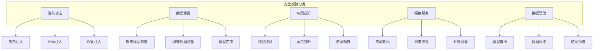
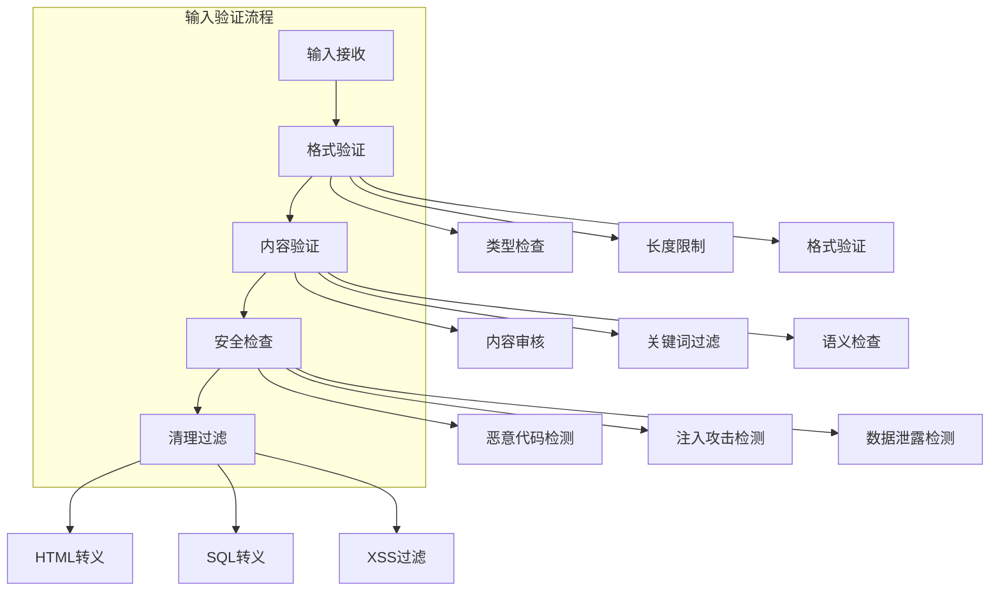
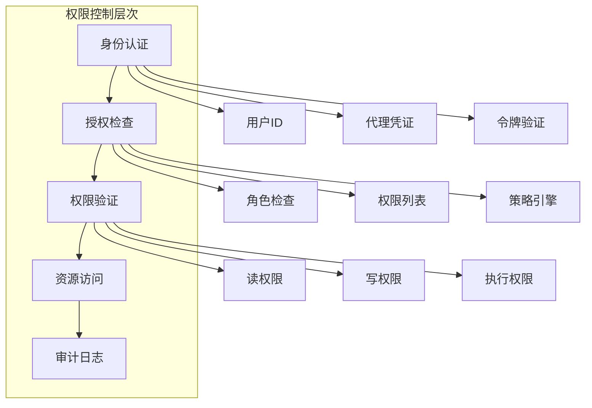
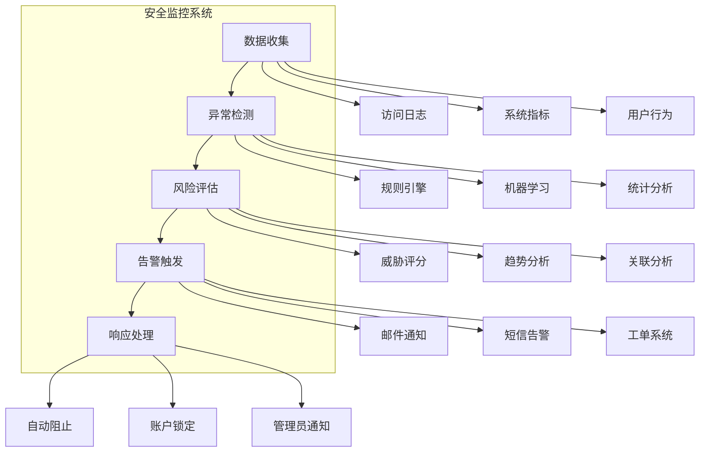

# 第10章: 安全与防护

## 学习目标

- 理解AI代理系统的安全威胁和风险
- 掌握输入验证和输出过滤技术
- 学习权限控制和访问管理
- 构建生产级的安全防护体系

## 10.1 安全威胁分析

### 10.1.1 威胁模型

AI代理系统面临多种安全威胁，需要建立全面的威胁模型来识别和防范。



### 10.1.2 威胁分析矩阵

| 威胁类型 | 可能性 | 影响程度 | 风险等级 | 缓解措施 |
|---------|--------|----------|----------|----------|
| 提示注入 | 高 | 高 | 🔴 严重 | 输入验证、输出过滤 |
| 代码注入 | 中 | 高 | 🟠 高 | 沙箱执行、权限限制 |
| 数据泄露 | 中 | 高 | 🟠 高 | 加密存储、访问控制 |
| 权限提升 | 低 | 高 | 🟡 中 | 最小权限原则、审计 |
| 拒绝服务 | 中 | 中 | 🟡 中 | 速率限制、资源配额 |
| 数据篡改 | 低 | 高 | 🟡 中 | 完整性检查、数字签名 |

### 10.1.3 安全分析器实现

```typescript
// src/security/threat-analyzer.ts
import { SubAgentMessage } from '../agents/subagent-interface';

export interface ThreatAssessment {
  severity: ThreatSeverity;
  confidence: number;
  category: ThreatCategory;
  description: string;
  indicators: string[];
  mitigation: string[];
}

export enum ThreatSeverity {
  LOW = 'low',
  MEDIUM = 'medium',
  HIGH = 'high',
  CRITICAL = 'critical'
}

export enum ThreatCategory {
  PROMPT_INJECTION = 'prompt_injection',
  CODE_INJECTION = 'code_injection',
  DATA_EXFILTRATION = 'data_exfiltration',
  PRIVILEGE_ESCALATION = 'privilege_escalation',
  DENIAL_OF_SERVICE = 'denial_of_service',
  DATA_TAMPERING = 'data_tampering'
}

export class ThreatAnalyzer {
  private patterns: Map<ThreatCategory, ThreatPattern[]> = new Map();
  private statistics: ThreatStatistics = {
    totalScans: 0,
    threatsDetected: 0,
    threatsByCategory: new Map(),
    threatsBySeverity: new Map()
  };

  constructor() {
    this.initializePatterns();
  }

  // 分析消息威胁
  analyzeMessage(message: SubAgentMessage): ThreatAssessment[] {
    this.statistics.totalScans++;

    const threats: ThreatAssessment[] = [];

    // 检查各类威胁模式
    for (const [category, patterns] of this.patterns.entries()) {
      for (const pattern of patterns) {
        if (this.matchesPattern(message, pattern)) {
          threats.push({
            severity: pattern.severity,
            confidence: pattern.confidence,
            category,
            description: pattern.description,
            indicators: pattern.indicators,
            mitigation: pattern.mitigation
          });

          this.updateStatistics(pattern.severity, category);
        }
      }
    }

    if (threats.length > 0) {
      this.statistics.threatsDetected += threats.length;
    }

    return threats;
  }

  // 分析代码威胁
  analyzeCode(code: string, context: string): ThreatAssessment[] {
    const threats: ThreatAssessment[] = [];

    // 检查恶意代码模式
    const maliciousPatterns = [
      {
        pattern: /eval\s*\(/gi,
        severity: ThreatSeverity.HIGH,
        confidence: 0.9,
        category: ThreatCategory.CODE_INJECTION,
        description: 'Dangerous eval() usage detected',
        indicators: ['eval function call'],
        mitigation: ['Avoid eval()', 'Use alternative safe methods', 'Validate input']
      },
      {
        pattern: /exec\s*\(/gi,
        severity: ThreatSeverity.HIGH,
        confidence: 0.85,
        category: ThreatCategory.CODE_INJECTION,
        description: 'Dangerous exec() usage detected',
        indicators: ['exec function call'],
        mitigation: ['Avoid exec()', 'Use child_process with validation', 'Sanitize commands']
      },
      {
        pattern: /__import__\s*\(/gi,
        severity: ThreatSeverity.MEDIUM,
        confidence: 0.7,
        category: ThreatCategory.PRIVILEGE_ESCALATION,
        description: 'Dynamic import usage detected',
        indicators: ['Dynamic import'],
        mitigation: ['Validate import paths', 'Use whitelist', 'Monitor imports']
      }
    ];

    for (const pattern of maliciousPatterns) {
      const matches = code.match(pattern.pattern);
      if (matches) {
        threats.push({
          severity: pattern.severity,
          confidence: pattern.confidence,
          category: pattern.category,
          description: pattern.description,
          indicators: pattern.indicators,
          mitigation: pattern.mitigation
        });
      }
    }

    return threats;
  }

  // 分析提示注入威胁
  analyzePromptInjection(prompt: string): ThreatAssessment[] {
    const threats: ThreatAssessment[] = [];

    // 检查提示注入模式
    const injectionPatterns = [
      {
        pattern: /ignore\s+(previous|all)\s+(instructions|commands)/gi,
        severity: ThreatSeverity.CRITICAL,
        confidence: 0.95,
        indicators: ['Instruction override attempt'],
        mitigation: ['Reject prompt', 'Sanitize input', 'Use instruction隔离']
      },
      {
        pattern: /(?:forget|disregard|override)\s+everything\s+(?:above|before|previous)/gi,
        severity: ThreatSeverity.CRITICAL,
        confidence: 0.9,
        indicators: ['System instruction override'],
        mitigation: ['Reject prompt', 'Validate instructions', 'Use context isolation']
      },
      {
        pattern: /\b(?:you\s+are\s+now|act\s+as|pretend\s+to\s+be)\b/gi,
        severity: ThreatSeverity.HIGH,
        confidence: 0.8,
        indicators: ['Role manipulation attempt'],
        mitigation: ['Validate role changes', 'Use approved roles only', 'Monitor role assignments']
      },
      {
        pattern: /\b(?:show\s+me|tell\s+me|display|reveal)\s+(?:passwords?|keys?|secrets?|tokens?)\b/gi,
        severity: ThreatSeverity.CRITICAL,
        confidence: 0.95,
        indicators: ['Sensitive information request'],
        mitigation: ['Block request', 'Alert security team', 'Log attempt']
      }
    ];

    for (const injectionPattern of injectionPatterns) {
      const matches = prompt.match(injectionPattern.pattern);
      if (matches) {
        threats.push({
          severity: injectionPattern.severity,
          confidence: injectionPattern.confidence,
          category: ThreatCategory.PROMPT_INJECTION,
          description: `Prompt injection detected: ${injectionPattern.indicators[0]}`,
          indicators: injectionPattern.indicators,
          mitigation: injectionPattern.mitigation
        });
      }
    }

    return threats;
  }

  // 检查数据泄露威胁
  checkDataExfiltration(data: any, context: string): ThreatAssessment[] {
    const threats: ThreatAssessment[] = [];
    const dataString = JSON.stringify(data);

    // 检查敏感数据模式
    const sensitivePatterns = [
      {
        pattern: /\b[A-Za-z0-9._%+-]+@[A-Za-z0-9.-]+\.[A-Z|a-z]{2,}\b/g,
        severity: ThreatSeverity.MEDIUM,
        confidence: 0.7,
        indicators: ['Email address detected'],
        mitigation: ['Mask email addresses', 'Remove personal data', 'Use data anonymization']
      },
      {
        pattern: /\b(?:\d{3}[-.\s]?\d{3}[-.\s]?\d{4}|\d{3}[-.\s]?\d{2}[-.\s]?\d{2}[-.\s]?\d{2})\b/g,
        severity: ThreatSeverity.HIGH,
        confidence: 0.8,
        indicators: ['Phone number detected'],
        mitigation: ['Mask phone numbers', 'Remove personal data', 'Validate necessity']
      },
      {
        pattern: /\b(?:\d{4}[-\s]?\d{4}[-\s]?\d{4}[-\s]?\d{4}|\d{4}[-\s]?\d{6}[-\s]?\d{5})\b/g,
        severity: ThreatSeverity.HIGH,
        confidence: 0.85,
        indicators: ['Credit card number detected'],
        mitigation: ['Block credit card numbers', 'Alert security team', 'Encrypt sensitive data']
      },
      {
        pattern: /\b(?:API[_-]?KEY|SECRET|TOKEN|PASSWORD)\s*[:=]\s*[A-Za-z0-9._+/=]{10,}\b/gi,
        severity: ThreatSeverity.CRITICAL,
        confidence: 0.95,
        indicators: ['Credential detected'],
        mitigation: ['Block credentials', 'Alert security team', 'Use secure storage']
      }
    ];

    for (const sensitivePattern of sensitivePatterns) {
      const matches = dataString.match(sensitivePattern.pattern);
      if (matches) {
        threats.push({
          severity: sensitivePattern.severity,
          confidence: sensitivePattern.confidence,
          category: ThreatCategory.DATA_EXFILTRATION,
          description: `Sensitive data detected: ${sensitivePattern.indicators[0]}`,
          indicators: sensitivePattern.indicators,
          mitigation: sensitivePattern.mitigation
        });
      }
    }

    return threats;
  }

  // 生成安全报告
  generateSecurityReport(): SecurityReport {
    return {
      timestamp: Date.now(),
      statistics: { ...this.statistics },
      recommendations: this.generateRecommendations(),
      topThreats: this.getTopThreats(),
      recentAlerts: this.getRecentAlerts()
    };
  }

  // 匹配模式
  private matchesPattern(message: SubAgentMessage, pattern: ThreatPattern): boolean {
    // 检查消息内容
    const content = JSON.stringify(message.payload);
    return pattern.pattern.test(content);
  }

  // 更新统计信息
  private updateStatistics(severity: ThreatSeverity, category: ThreatCategory): void {
    // 更新按类别统计
    const categoryCount = this.statistics.threatsByCategory.get(category) || 0;
    this.statistics.threatsByCategory.set(category, categoryCount + 1);

    // 更新按严重程度统计
    const severityCount = this.statistics.threatsBySeverity.get(severity) || 0;
    this.statistics.threatsBySeverity.set(severity, severityCount + 1);
  }

  // 生成建议
  private generateRecommendations(): string[] {
    const recommendations: string[] = [];

    // 基于统计信息生成建议
    const highThreatCount = (this.statistics.threatsBySeverity.get(ThreatSeverity.HIGH) || 0) +
                           (this.statistics.threatsBySeverity.get(ThreatSeverity.CRITICAL) || 0);

    if (highThreatCount > 10) {
      recommendations.push('Consider implementing stricter input validation');
      recommendations.push('Review and update security policies');
    }

    if (this.statistics.threatsByCategory.has(ThreatCategory.PROMPT_INJECTION)) {
      recommendations.push('Implement prompt injection detection and prevention');
      recommendations.push('Train models to resist adversarial prompts');
    }

    return recommendations;
  }

  // 获取主要威胁
  private getTopThreats(): Array<{ category: string; count: number }> {
    const topThreats: Array<{ category: string; count: number }> = [];

    for (const [category, count] of this.statistics.threatsByCategory.entries()) {
      topThreats.push({ category, count });
    }

    return topThreats.sort((a, b) => b.count - a.count).slice(0, 5);
  }

  // 获取最近告警
  private getRecentAlerts(): ThreatAlert[] {
    // 简化实现，实际应该从告警存储中获取
    return [];
  }

  // 初始化威胁模式
  private initializePatterns(): void {
    // 提示注入模式
    this.patterns.set(ThreatCategory.PROMPT_INJECTION, [
      {
        pattern: /ignore\s+.*?\s+instructions/gi,
        severity: ThreatSeverity.CRITICAL,
        confidence: 0.95,
        description: 'Attempt to ignore instructions',
        indicators: ['指令忽略尝试'],
        mitigation: ['拒绝输入', '隔离上下文', '验证指令完整性']
      },
      {
        pattern: /(?:act|pretend)\s+as\s+.*?\s+(?:admin|root|administrator)/gi,
        severity: ThreatSeverity.HIGH,
        confidence: 0.85,
        description: 'Role escalation attempt',
        indicators: ['角色提升尝试'],
        mitigation: ['验证角色变更', '限制角色权限', '监控角色分配']
      }
    ]);

    // 代码注入模式
    this.patterns.set(ThreatCategory.CODE_INJECTION, [
      {
        pattern: /eval\s*\(/gi,
        severity: ThreatSeverity.HIGH,
        confidence: 0.9,
        description: 'Dynamic code execution attempt',
        indicators: ['动态代码执行尝试'],
        mitigation: ['禁止eval使用', '使用安全替代方案', '验证输入']
      },
      {
        pattern: /require\s*\(\s*['"`]\s*\$/gi,
        severity: ThreatSeverity.HIGH,
        confidence: 0.8,
        description: 'Remote code execution attempt',
        indicators: ['远程代码执行尝试'],
        mitigation: ['限制require使用', '验证路径', '使用白名单']
      }
    ]);
  }
}

// 相关接口定义
interface ThreatPattern {
  pattern: RegExp;
  severity: ThreatSeverity;
  confidence: number;
  description: string;
  indicators: string[];
  mitigation: string[];
}

interface ThreatStatistics {
  totalScans: number;
  threatsDetected: number;
  threatsByCategory: Map<ThreatCategory, number>;
  threatsBySeverity: Map<ThreatSeverity, number>;
}

interface SecurityReport {
  timestamp: number;
  statistics: ThreatStatistics;
  recommendations: string[];
  topThreats: Array<{ category: string; count: number }>;
  recentAlerts: ThreatAlert[];
}

interface ThreatAlert {
  timestamp: number;
  category: ThreatCategory;
  severity: ThreatSeverity;
  description: string;
}
```

## 10.2 输入验证和输出过滤

### 10.2.1 验证架构



### 10.2.2 验证器实现

```typescript
// src/security/validator.ts
import { ThreatAnalyzer } from './threat-analyzer';

export interface ValidationResult {
  valid: boolean;
  errors: ValidationError[];
  warnings: ValidationWarning[];
  sanitized: any;
}

export interface ValidationError {
  field: string;
  message: string;
  code: string;
  severity: 'error' | 'critical';
}

export interface ValidationWarning {
  field: string;
  message: string;
  code: string;
  severity: 'warning' | 'info';
}

export class InputValidator {
  private threatAnalyzer: ThreatAnalyzer;
  private validationRules: Map<string, ValidationRule[]> = new Map();
  private sanitizers: Map<string, Sanitizer> = new Map();

  constructor(threatAnalyzer?: ThreatAnalyzer) {
    this.threatAnalyzer = threatAnalyzer || new ThreatAnalyzer();
    this.initializeDefaultRules();
    this.initializeSanitizers();
  }

  // 验证输入
  async validate(input: any, context: string): Promise<ValidationResult> {
    const errors: ValidationError[] = [];
    const warnings: ValidationWarning[] = [];

    // 基本类型验证
    const typeValidation = this.validateType(input, context);
    errors.push(...typeValidation.errors);
    warnings.push(...typeValidation.warnings);

    // 长度验证
    const lengthValidation = this.validateLength(input, context);
    errors.push(...lengthValidation.errors);
    warnings.push(...lengthValidation.warnings);

    // 格式验证
    const formatValidation = this.validateFormat(input, context);
    errors.push(...formatValidation.errors);
    warnings.push(...formatValidation.warnings);

    // 内容安全验证
    const securityValidation = await this.validateSecurity(input, context);
    errors.push(...securityValidation.errors);
    warnings.push(...securityValidation.warnings);

    // 业务规则验证
    const businessValidation = this.validateBusinessRules(input, context);
    errors.push(...businessValidation.errors);
    warnings.push(...businessValidation.warnings);

    // 清理和过滤
    const sanitized = this.sanitize(input, context);

    return {
      valid: errors.length === 0,
      errors,
      warnings,
      sanitized
    };
  }

  // 类型验证
  private validateType(input: any, context: string): ValidationResult {
    const errors: ValidationError[] = [];
    const warnings: ValidationWarning[] = [];

    const rules = this.validationRules.get(context);
    if (!rules) {
      return { errors, warnings, sanitized: input };
    }

    for (const rule of rules) {
      if (rule.type === 'type') {
        const typeCheck = this.checkType(input, rule.expectedType);
        if (!typeCheck.valid) {
          errors.push({
            field: rule.field || 'input',
            message: `Expected type ${rule.expectedType}, got ${typeof input}`,
            code: 'TYPE_MISMATCH',
            severity: 'error'
          });
        }
      }
    }

    return { errors, warnings, sanitized: input };
  }

  // 长度验证
  private validateLength(input: any, context: string): ValidationResult {
    const errors: ValidationError[] = [];
    const warnings: ValidationWarning[] = [];

    const rules = this.validationRules.get(context);
    if (!rules) {
      return { errors, warnings, sanitized: input };
    }

    for (const rule of rules) {
      if (rule.type === 'length') {
        const value = this.getFieldValue(input, rule.field);
        const length = value ? String(value).length : 0;

        if (rule.minLength && length < rule.minLength) {
          errors.push({
            field: rule.field,
            message: `Minimum length is ${rule.minLength}, got ${length}`,
            code: 'MIN_LENGTH',
            severity: 'error'
          });
        }

        if (rule.maxLength && length > rule.maxLength) {
          errors.push({
            field: rule.field,
            message: `Maximum length is ${rule.maxLength}, got ${length}`,
            code: 'MAX_LENGTH',
            severity: 'error'
          });
        }
      }
    }

    return { errors, warnings, sanitized: input };
  }

  // 格式验证
  private validateFormat(input: any, context: string): ValidationResult {
    const errors: ValidationError[] = [];
    const warnings: ValidationWarning[] = [];

    const rules = this.validationRules.get(context);
    if (!rules) {
      return { errors, warnings, sanitized: input };
    }

    for (const rule of rules) {
      if (rule.type === 'format') {
        const value = this.getFieldValue(input, rule.field);
        
        if (value && rule.pattern) {
          const pattern = new RegExp(rule.pattern, rule.flags || '');
          if (!pattern.test(String(value))) {
            errors.push({
              field: rule.field,
              message: `Format does not match pattern ${rule.pattern}`,
              code: 'FORMAT_MISMATCH',
              severity: 'error'
            });
          }
        }
      }
    }

    return { errors, warnings, sanitized: input };
  }

  // 安全验证
  private async validateSecurity(input: any, context: string): Promise<ValidationResult> {
    const errors: ValidationError[] = [];
    const warnings: ValidationWarning[] = [];

    // 使用威胁分析器检查
    const inputString = JSON.stringify(input);
    const threats = this.threatAnalyzer.analyzePromptInjection(inputString);

    for (const threat of threats) {
      if (threat.severity === 'high' || threat.severity === 'critical') {
        errors.push({
          field: 'input',
          message: `Security threat detected: ${threat.description}`,
          code: 'SECURITY_THREAT',
          severity: 'error'
        });
      } else {
        warnings.push({
          field: 'input',
          message: `Potential security issue: ${threat.description}`,
          code: 'SECURITY_WARNING',
          severity: 'warning'
        });
      }
    }

    return { errors, warnings, sanitized: input };
  }

  // 业务规则验证
  private validateBusinessRules(input: any, context: string): ValidationResult {
    const errors: ValidationError[] = [];
    const warnings: ValidationWarning[] = [];

    const rules = this.validationRules.get(context);
    if (!rules) {
      return { errors, warnings, sanitized: input };
    }

    for (const rule of rules) {
      if (rule.type === 'custom' && rule.validator) {
        const result = rule.validator(input);
        if (!result.valid) {
          errors.push({
            field: rule.field || 'input',
            message: result.message || 'Custom validation failed',
            code: rule.code || 'CUSTOM_VALIDATION',
            severity: 'error'
          });
        }
      }
    }

    return { errors, warnings, sanitized: input };
  }

  // 清理输入
  private sanitize(input: any, context: string): any {
    let sanitized = { ...input };

    for (const [field, sanitizer] of this.sanitizers) {
      const value = this.getFieldValue(sanitized, field);
      if (value) {
        const sanitizedValue = sanitizer.sanitize(String(value));
        sanitized = this.setFieldValue(sanitized, field, sanitizedValue);
      }
    }

    return sanitized;
  }

  // 获取字段值
  private getFieldValue(input: any, field: string): any {
    const keys = field.split('.');
    let value = input;

    for (const key of keys) {
      if (value && typeof value === 'object') {
        value = value[key];
      } else {
        return undefined;
      }
    }

    return value;
  }

  // 设置字段值
  private setFieldValue(input: any, field: string, value: any): any {
    const keys = field.split('.');
    const result = { ...input };
    let current = result;

    for (let i = 0; i < keys.length - 1; i++) {
      const key = keys[i];
      if (!current[key]) {
        current[key] = {};
      }
      current = current[key];
    }

    current[keys[keys.length - 1]] = value;
    return result;
  }

  // 检查类型
  private checkType(input: any, expectedType: string): { valid: boolean } {
    const actualType = typeof input;

    switch (expectedType) {
      case 'string':
        return { valid: actualType === 'string' };
      case 'number':
        return { valid: actualType === 'number' };
      case 'boolean':
        return { valid: actualType === 'boolean' };
      case 'array':
        return { valid: Array.isArray(input) };
      case 'object':
        return { valid: actualType === 'object' && input !== null && !Array.isArray(input) };
      default:
        return { valid: true };
    }
  }

  // 添加验证规则
  addValidationRule(context: string, rule: ValidationRule): void {
    if (!this.validationRules.has(context)) {
      this.validationRules.set(context, []);
    }
    this.validationRules.get(context)!.push(rule);
  }

  // 添加清理器
  addSanitizer(field: string, sanitizer: Sanitizer): void {
    this.sanitizers.set(field, sanitizer);
  }

  // 初始化默认规则
  private initializeDefaultRules(): void {
    // 通用输入规则
    this.addValidationRule('general', {
      type: 'length',
      field: 'input',
      minLength: 1,
      maxLength: 10000
    });

    // 用户输入规则
    this.addValidationRule('user_input', {
      type: 'length',
      field: 'prompt',
      minLength: 1,
      maxLength: 5000
    });

    // 文件路径规则
    this.addValidationRule('file_path', {
      type: 'format',
      field: 'path',
      pattern: '^[\w\-./]+$',
      flags: 'i'
    });
  }

  // 初始化清理器
  private initializeSanitizers(): void {
    // HTML清理器
    this.addSanitizer('html', {
      sanitize: (value: string) => {
        // 移除HTML标签
        return value.replace(/<[^>]*>/g, '');
      }
    });

    // SQL清理器
    this.addSanitizer('sql', {
      sanitize: (value: string) => {
        // 转义SQL特殊字符
        return value
          .replace(/'/g, "''")
          .replace(/"/g, '""')
          .replace(/\\/g, '\\\\');
      }
    });

    // 脚本清理器
    this.addSanitizer('script', {
      sanitize: (value: string) => {
        // 移除潜在的脚本内容
        return value
          .replace(/<script[^>]*>.*?<\/script>/gi, '')
          .replace(/javascript:/gi, '')
          .replace(/on\w+\s*=/gi, '');
      }
    });
  }
}

// 相关接口定义
interface ValidationRule {
  type: 'type' | 'length' | 'format' | 'custom';
  field?: string;
  expectedType?: string;
  minLength?: number;
  maxLength?: number;
  pattern?: string;
  flags?: string;
  validator?: (input: any) => { valid: boolean; message?: string };
  code?: string;
}

interface Sanitizer {
  sanitize: (value: string) => string;
}
```

## 10.3 权限控制和访问管理

### 10.3.1 权限模型



### 10.3.2 权限管理器

```typescript
// src/security/permission-manager.ts
import { EventEmitter } from 'events';

export interface Permission {
  id: string;
  name: string;
  description: string;
  resource: string;
  action: string;
  conditions?: PermissionCondition[];
}

export interface Role {
  id: string;
  name: string;
  permissions: Permission[];
  inherits?: string[];
}

export interface AgentCredentials {
  agentId: string;
  roles: string[];
  attributes: Record<string, any>;
  validFrom: number;
  validUntil: number;
}

export class PermissionManager extends EventEmitter {
  private roles: Map<string, Role> = new Map();
  private agents: Map<string, AgentCredentials> = new Map();
  private policies: AccessPolicy[] = [];
  private auditLogger: AuditLogger;

  constructor(auditLogger?: AuditLogger) {
    super();
    this.auditLogger = auditLogger || new InMemoryAuditLogger();
    this.initializeDefaultRoles();
  }

  // 检查权限
  async checkPermission(
    agentId: string,
    resource: string,
    action: string,
    context?: any
  ): Promise<AccessResult> {
    const startTime = Date.now();

    try {
      // 获取代理凭证
      const credentials = this.agents.get(agentId);
      if (!credentials) {
        const result: AccessResult = {
          granted: false,
          reason: 'Agent not found or not authenticated',
          timestamp: Date.now()
        };

        await this.auditLogger.logAccess({
          agentId,
          resource,
          action,
          result: false,
          reason: result.reason,
          timestamp: Date.now()
        });

        return result;
      }

      // 检查凭证有效期
      const now = Date.now();
      if (now < credentials.validFrom || now > credentials.validUntil) {
        const result: AccessResult = {
          granted: false,
          reason: 'Credentials expired or not yet valid',
          timestamp: Date.now()
        };

        await this.auditLogger.logAccess({
          agentId,
          resource,
          action,
          result: false,
          reason: result.reason,
          timestamp: Date.now()
        });

        return result;
      }

      // 收集所有权限
      const permissions = this.collectPermissions(credentials.roles);

      // 检查是否有匹配的权限
      const hasPermission = this.hasMatchingPermission(
        permissions,
        resource,
        action,
        context
      );

      // 检查策略
      const policyResult = this.evaluatePolicies(
        agentId,
        resource,
        action,
        context,
        credentials
      );

      if (!policyResult.granted) {
        await this.auditLogger.logAccess({
          agentId,
          resource,
          action,
          result: false,
          reason: policyResult.reason,
          timestamp: Date.now()
        });

        return policyResult;
      }

      const result: AccessResult = {
        granted: hasPermission,
        reason: hasPermission ? 'Permission granted' : 'Insufficient permissions',
        timestamp: Date.now(),
        duration: Date.now() - startTime
      };

      await this.auditLogger.logAccess({
        agentId,
        resource,
        action,
        result: result.granted,
        reason: result.reason,
        timestamp: Date.now()
      });

      return result;

    } catch (error) {
      const errorResult: AccessResult = {
        granted: false,
        reason: `Permission check failed: ${error instanceof Error ? error.message : 'Unknown error'}`,
        timestamp: Date.now()
      };

      await this.auditLogger.logAccess({
        agentId,
        resource,
        action,
        result: false,
        reason: errorResult.reason,
        timestamp: Date.now(),
        error: error instanceof Error ? error.message : 'Unknown error'
      });

      return errorResult;
    }
  }

  // 注册代理
  registerAgent(credentials: AgentCredentials): void {
    this.agents.set(credentials.agentId, credentials);
    this.emit('agentRegistered', credentials.agentId);
  }

  // 注销代理
  unregisterAgent(agentId: string): void {
    this.agents.delete(agentId);
    this.emit('agentUnregistered', agentId);
  }

  // 添加角色
  addRole(role: Role): void {
    this.roles.set(role.id, role);
    this.emit('roleAdded', role.id);
  }

  // 添加权限到角色
  addPermissionToRole(roleId: string, permission: Permission): void {
    const role = this.roles.get(roleId);
    if (role) {
      role.permissions.push(permission);
      this.emit('permissionAdded', roleId, permission.id);
    }
  }

  // 添加策略
  addPolicy(policy: AccessPolicy): void {
    this.policies.push(policy);
    this.emit('policyAdded', policy.id);
  }

  // 收集权限
  private collectPermissions(roleIds: string[]): Permission[] {
    const permissions: Permission[] = [];
    const processedRoles = new Set<string>();

    const collectFromRole = (roleId: string) => {
      if (processedRoles.has(roleId)) {
        return;
      }

      processedRoles.add(roleId);
      const role = this.roles.get(roleId);

      if (role) {
        // 添加当前角色的权限
        permissions.push(...role.permissions);

        // 递归添加继承角色的权限
        if (role.inherits) {
          for (const inheritedRoleId of role.inherits) {
            collectFromRole(inheritedRoleId);
          }
        }
      }
    };

    for (const roleId of roleIds) {
      collectFromRole(roleId);
    }

    return permissions;
  }

  // 检查匹配的权限
  private hasMatchingPermission(
    permissions: Permission[],
    resource: string,
    action: string,
    context?: any
  ): boolean {
    for (const permission of permissions) {
      if (this.matchesPermission(permission, resource, action, context)) {
        return true;
      }
    }
    return false;
  }

  // 匹配权限
  private matchesPermission(
    permission: Permission,
    resource: string,
    action: string,
    context?: any
  ): boolean {
    // 检查资源匹配
    if (!this.matchesResource(permission.resource, resource)) {
      return false;
    }

    // 检查动作匹配
    if (!this.matchesAction(permission.action, action)) {
      return false;
    }

    // 检查条件
    if (permission.conditions && permission.conditions.length > 0) {
      return this.evaluateConditions(permission.conditions, context);
    }

    return true;
  }

  // 匹配资源
  private matchesResource(pattern: string, resource: string): boolean {
    // 支持通配符匹配
    const regex = new RegExp('^' + pattern.replace(/\*/g, '.*').replace(/\?/g, '.') + '$');
    return regex.test(resource);
  }

  // 匹配动作
  private matchesAction(pattern: string, action: string): boolean {
    // 支持多个动作用逗号分隔
    const allowedActions = pattern.split(',').map(a => a.trim());
    return allowedActions.includes(action) || allowedActions.includes('*');
  }

  // 评估条件
  private evaluateConditions(conditions: PermissionCondition[], context?: any): boolean {
    for (const condition of conditions) {
      if (!this.evaluateCondition(condition, context)) {
        return false;
      }
    }
    return true;
  }

  // 评估单个条件
  private evaluateCondition(condition: PermissionCondition, context?: any): boolean {
    switch (condition.type) {
      case 'time_range':
        if (condition.startTime && condition.endTime) {
          const now = Date.now();
          return now >= condition.startTime && now <= condition.endTime;
        }
        return true;

      case 'attribute':
        if (condition.attribute && condition.value !== undefined) {
          const contextValue = context?.[condition.attribute];
          return contextValue === condition.value;
        }
        return true;

      case 'custom':
        if (condition.evaluator) {
          return condition.evaluator(context);
        }
        return true;

      default:
        return true;
    }
  }

  // 评估策略
  private evaluatePolicies(
    agentId: string,
    resource: string,
    action: string,
    context?: any,
    credentials?: AgentCredentials
  ): AccessResult {
    // 按优先级评估策略
    const sortedPolicies = [...this.policies].sort((a, b) => b.priority - a.priority);

    for (const policy of sortedPolicies) {
      if (this.matchesPolicy(policy, agentId, resource, action, context)) {
        const result = this.evaluatePolicyEffect(policy, context);
        if (!result.granted) {
          return result;
        }
      }
    }

    return { granted: true, timestamp: Date.now() };
  }

  // 匹配策略
  private matchesPolicy(
    policy: AccessPolicy,
    agentId: string,
    resource: string,
    action: string,
    context?: any
  ): boolean {
    // 检查主体匹配
    if (policy.subject && !this.matchesSubject(policy.subject, agentId)) {
      return false;
    }

    // 检查资源匹配
    if (policy.resource && !this.matchesResource(policy.resource, resource)) {
      return false;
    }

    // 检查动作匹配
    if (policy.action && !this.matchesAction(policy.action, action)) {
      return false;
    }

    return true;
  }

  // 匹配主体
  private matchesSubject(pattern: string, agentId: string): boolean {
    // 支持通配符和正则表达式
    if (pattern === '*') {
      return true;
    }

    const regex = new RegExp('^' + pattern.replace(/\*/g, '.*') + '$');
    return regex.test(agentId);
  }

  // 评估策略效果
  private evaluatePolicyEffect(policy: AccessPolicy, context?: any): AccessResult {
    switch (policy.effect) {
      case 'allow':
        return { granted: true, timestamp: Date.now() };

      case 'deny':
        return {
          granted: false,
          reason: `Denied by policy ${policy.id}`,
          timestamp: Date.now()
        };

      default:
        return { granted: true, timestamp: Date.now() };
    }
  }

  // 获取代理角色
  getAgentRoles(agentId: string): string[] {
    const credentials = this.agents.get(agentId);
    return credentials ? credentials.roles : [];
  }

  // 获取访问审计日志
  async getAccessLogs(filters?: AuditFilters): Promise<AccessLog[]> {
    return await this.auditLogger.getLogs(filters);
  }

  // 初始化默认角色
  private initializeDefaultRoles(): void {
    // 管理员角色
    this.addRole({
      id: 'admin',
      name: 'Administrator',
      permissions: [
        {
          id: 'admin-all',
          name: 'All Permissions',
          description: 'Full access to all resources',
          resource: '*',
          action: '*'
        }
      ]
    });

    // 编码员角色
    this.addRole({
      id: 'coder',
      name: 'Coder',
      permissions: [
        {
          id: 'coder-read',
          name: 'Read Source Code',
          description: 'Read source code files',
          resource: '/src/**',
          action: 'read'
        },
        {
          id: 'coder-write',
          name: 'Write Source Code',
          description: 'Write source code files',
          resource: '/src/**',
          action: 'write',
          conditions: [
            {
              type: 'attribute',
              attribute: 'project_access',
              value: true
            }
          ]
        }
      ]
    });

    // 审查员角色
    this.addRole({
      id: 'reviewer',
      name: 'Reviewer',
      permissions: [
        {
          id: 'reviewer-read',
          name: 'Read for Review',
          description: 'Read files for code review',
          resource: '/src/**',
          action: 'read'
        },
        {
          id: 'reviewer-comment',
          name: 'Add Review Comments',
          description: 'Add comments to review files',
          resource: '/.swarm/evidence/**',
          action: 'write'
        }
      ]
    });
  }
}

// 相关接口定义
interface AccessResult {
  granted: boolean;
  reason?: string;
  timestamp: number;
  duration?: number;
}

interface PermissionCondition {
  type: 'time_range' | 'attribute' | 'custom';
  startTime?: number;
  endTime?: number;
  attribute?: string;
  value?: any;
  evaluator?: (context: any) => boolean;
}

interface AccessPolicy {
  id: string;
  subject?: string;
  resource?: string;
  action?: string;
  effect: 'allow' | 'deny';
  priority: number;
  conditions?: PermissionCondition[];
}

interface AccessLog {
  agentId: string;
  resource: string;
  action: string;
  result: boolean;
  reason?: string;
  timestamp: number;
  error?: string;
}

interface AuditFilters {
  agentId?: string;
  resource?: string;
  action?: string;
  startTime?: number;
  endTime?: number;
  minSeverity?: string;
}

// 审计日志接口
interface AuditLogger {
  logAccess(log: AccessLog): Promise<void>;
  getLogs(filters?: AuditFilters): Promise<AccessLog[]>;
}

// 内存审计日志实现
class InMemoryAuditLogger implements AuditLogger {
  private logs: AccessLog[] = [];

  async logAccess(log: AccessLog): Promise<void> {
    this.logs.push(log);

    // 保持最近10000条日志
    if (this.logs.length > 10000) {
      this.logs = this.logs.slice(-10000);
    }
  }

  async getLogs(filters?: AuditFilters): Promise<AccessLog[]> {
    let filtered = [...this.logs];

    if (filters) {
      if (filters.agentId) {
        filtered = filtered.filter(log => log.agentId === filters.agentId);
      }

      if (filters.resource) {
        filtered = filtered.filter(log => log.resource.includes(filters.resource));
      }

      if (filters.action) {
        filtered = filtered.filter(log => log.action === filters.action);
      }

      if (filters.startTime) {
        filtered = filtered.filter(log => log.timestamp >= filters.startTime!);
      }

      if (filters.endTime) {
        filtered = filtered.filter(log => log.timestamp <= filters.endTime!);
      }
    }

    return filtered.reverse(); // 最新的在前
  }
}
```

## 10.4 安全监控和告警

### 10.4.1 监控架构



### 10.4.2 安全监控器

```typescript
// src/security/security-monitor.ts
import { EventEmitter } from 'events';
import { PermissionManager } from './permission-manager';
import { ThreatAnalyzer, ThreatSeverity } from './threat-analyzer';

export interface SecurityEvent {
  id: string;
  type: SecurityEventType;
  source: string;
  timestamp: number;
  severity: SecurityEventSeverity;
  details: any;
  context?: any;
}

export enum SecurityEventType {
  AUTHENTICATION_FAILURE = 'authentication_failure',
  AUTHORIZATION_FAILURE = 'authorization_failure',
  THREAT_DETECTED = 'threat_detected',
  ANOMALY_DETECTED = 'anomaly_detected',
  POLICY_VIOLATION = 'policy_violation',
  SYSTEM_BREACH = 'system_breach'
}

export enum SecurityEventSeverity {
  LOW = 'low',
  MEDIUM = 'medium',
  HIGH = 'high',
  CRITICAL = 'critical'
}

export class SecurityMonitor extends EventEmitter {
  private events: SecurityEvent[] = [];
  private threatAnalyzer: ThreatAnalyzer;
  private permissionManager: PermissionManager;
  private anomalyDetector: AnomalyDetector;
  private alertManager: AlertManager;
  private config: SecurityMonitorConfig;

  constructor(
    threatAnalyzer: ThreatAnalyzer,
    permissionManager: PermissionManager,
    config: SecurityMonitorConfig = {}
  ) {
    super();
    this.threatAnalyzer = threatAnalyzer;
    this.permissionManager = permissionManager;
    this.config = {
      maxEvents: 10000,
      retentionDays: 30,
      alertThresholds: {
        critical: 1,
        high: 5,
        medium: 20,
        low: 50
      },
      ...config
    };

    this.anomalyDetector = new AnomalyDetector();
    this.alertManager = new AlertManager(this.config.alertThresholds);

    this.initializeMonitoring();
  }

  // 记录安全事件
  async recordSecurityEvent(event: SecurityEvent): Promise<void> {
    // 生成事件ID
    event.id = this.generateEventId();
    event.timestamp = event.timestamp || Date.now();

    // 分析事件
    const analysis = await this.analyzeEvent(event);

    // 添加到事件列表
    this.events.push(event);

    // 保持事件列表大小
    if (this.events.length > this.config.maxEvents) {
      this.events.shift();
    }

    // 检查异常
    const anomaly = this.anomalyDetector.detectAnomaly(event);
    if (anomaly.isAnomalous) {
      event.details = {
        ...event.details,
        anomaly: anomaly.details
      };
    }

    // 触发告警
    await this.triggerAlert(event, analysis);

    // 触发事件
    this.emit('securityEvent', event, analysis);
  }

  // 分析事件
  private async analyzeEvent(event: SecurityEvent): Promise<EventAnalysis> {
    const analysis: EventAnalysis = {
      riskScore: 0,
      recommendations: [],
      relatedEvents: []
    };

    // 基于事件类型计算风险评分
    switch (event.type) {
      case SecurityEventType.AUTHENTICATION_FAILURE:
        analysis.riskScore = this.calculateAuthFailureRisk(event);
        break;

      case SecurityEventType.THREAT_DETECTED:
        analysis.riskScore = this.calculateThreatRisk(event);
        break;

      case SecurityEventType.ANOMALY_DETECTED:
        analysis.riskScore = this.calculateAnomalyRisk(event);
        break;

      default:
        analysis.riskScore = 50; // 默认中等风险
    }

    // 查找相关事件
    analysis.relatedEvents = this.findRelatedEvents(event);

    // 生成建议
    analysis.recommendations = this.generateRecommendations(event, analysis);

    return analysis;
  }

  // 计算认证失败风险
  private calculateAuthFailureRisk(event: SecurityEvent): number {
    const recentFailures = this.events.filter(e =>
      e.type === SecurityEventType.AUTHENTICATION_FAILURE &&
      e.source === event.source &&
      Date.now() - e.timestamp < 3600000 // 1小时内
    ).length;

    // 基于失败次数计算风险
    if (recentFailures > 10) return 90;
    if (recentFailures > 5) return 70;
    if (recentFailures > 3) return 50;
    if (recentFailures > 1) return 30;
    return 10;
  }

  // 计算威胁风险
  private calculateThreatRisk(event: SecurityEvent): number {
    const severity = event.severity;

    switch (severity) {
      case SecurityEventSeverity.CRITICAL:
        return 90;
      case SecurityEventSeverity.HIGH:
        return 70;
      case SecurityEventSeverity.MEDIUM:
        return 50;
      case SecurityEventSeverity.LOW:
        return 30;
      default:
        return 50;
    }
  }

  // 计算异常风险
  private calculateAnomalyRisk(event: SecurityEvent): number {
    const anomaly = event.details?.anomaly;
    if (!anomaly) {
      return 50;
    }

    // 基于异常评分计算风险
    return anomaly.score || 50;
  }

  // 查找相关事件
  private findRelatedEvents(event: SecurityEvent): SecurityEvent[] {
    const timeWindow = 3600000; // 1小时窗口
    const cutoffTime = Date.now() - timeWindow;

    return this.events.filter(e => {
      if (e.timestamp < cutoffTime) {
        return false;
      }

      // 相同来源
      if (e.source === event.source) {
        return true;
      }

      // 相同类型
      if (e.type === event.type) {
        return true;
      }

      return false;
    }).slice(0, 10); // 最多返回10个相关事件
  }

  // 生成建议
  private generateRecommendations(event: SecurityEvent, analysis: EventAnalysis): string[] {
    const recommendations: string[] = [];

    if (analysis.riskScore > 70) {
      recommendations.push('立即调查此安全事件');
      recommendations.push('考虑暂时禁用相关账户');
    }

    if (event.type === SecurityEventType.AUTHENTICATION_FAILURE) {
      recommendations.push('检查认证凭据');
      recommendations.push('实施账户锁定策略');
    }

    if (event.type === SecurityEventType.THREAT_DETECTED) {
      recommendations.push('分析威胁来源和影响');
      recommendations.push('更新安全规则');
    }

    if (analysis.relatedEvents.length > 5) {
      recommendations.push('调查相关事件的模式');
      recommendations.push('考虑升级安全级别');
    }

    return recommendations;
  }

  // 触发告警
  private async triggerAlert(event: SecurityEvent, analysis: EventAnalysis): Promise<void> {
    const shouldAlert = this.alertManager.shouldAlert(event, analysis);

    if (shouldAlert) {
      const alert: SecurityAlert = {
        id: this.generateAlertId(),
        eventId: event.id,
        type: event.type,
        severity: event.severity,
        riskScore: analysis.riskScore,
        message: this.generateAlertMessage(event, analysis),
        recommendations: analysis.recommendations,
        timestamp: Date.now()
      };

      await this.alertManager.sendAlert(alert);
      this.emit('securityAlert', alert);
    }
  }

  // 生成告警消息
  private generateAlertMessage(event: SecurityEvent, analysis: EventAnalysis): string {
    return `Security ${event.type} detected from ${event.source}. Risk score: ${analysis.riskScore}/100`;
  }

  // 获取安全统计
  getSecurityStatistics(): SecurityStatistics {
    const now = Date.now();
    const last24Hours = now - 86400000;

    const recentEvents = this.events.filter(e => e.timestamp > last24Hours);

    const statistics: SecurityStatistics = {
      totalEvents: this.events.length,
      recent24Hours: recentEvents.length,
      byType: this.groupEventsByType(recentEvents),
      bySeverity: this.groupEventsBySeverity(recentEvents),
      topSources: this.getTopSources(recentEvents),
      riskTrend: this.calculateRiskTrend(recentEvents)
    };

    return statistics;
  }

  // 获取事件历史
  getEventHistory(filters?: EventFilters): SecurityEvent[] {
    let filtered = [...this.events];

    if (filters) {
      if (filters.type) {
        filtered = filtered.filter(e => e.type === filters.type);
      }

      if (filters.source) {
        filtered = filtered.filter(e => e.source === filters.source);
      }

      if (filters.severity) {
        filtered = filtered.filter(e => e.severity === filters.severity);
      }

      if (filters.startTime) {
        filtered = filtered.filter(e => e.timestamp >= filters.startTime!);
      }

      if (filters.endTime) {
        filtered = filtered.filter(e => e.timestamp <= filters.endTime!);
      }
    }

    return filtered.reverse(); // 最新的在前
  }

  // 按类型分组事件
  private groupEventsByType(events: SecurityEvent[]): Record<string, number> {
    const grouped: Record<string, number> = {};

    for (const event of events) {
      const type = event.type;
      grouped[type] = (grouped[type] || 0) + 1;
    }

    return grouped;
  }

  // 按严重程度分组事件
  private groupEventsBySeverity(events: SecurityEvent[]): Record<string, number> {
    const grouped: Record<string, number> = {};

    for (const event of events) {
      const severity = event.severity;
      grouped[severity] = (grouped[severity] || 0) + 1;
    }

    return grouped;
  }

  // 获取主要来源
  private getTopSources(events: SecurityEvent[]): Array<{ source: string; count: number }> {
    const sourceCounts = new Map<string, number>();

    for (const event of events) {
      const count = sourceCounts.get(event.source) || 0;
      sourceCounts.set(event.source, count + 1);
    }

    return Array.from(sourceCounts.entries())
      .map(([source, count]) => ({ source, count }))
      .sort((a, b) => b.count - a.count)
      .slice(0, 10);
  }

  // 计算风险趋势
  private calculateRiskTrend(events: SecurityEvent[]): 'increasing' | 'decreasing' | 'stable' {
    if (events.length < 2) {
      return 'stable';
    }

    // 分为两个时间段比较
    const midPoint = Math.floor(events.length / 2);
    const firstHalf = events.slice(0, midPoint);
    const secondHalf = events.slice(midPoint);

    const firstHalfSevere = firstHalf.filter(e => 
      e.severity === SecurityEventSeverity.HIGH || 
      e.severity === SecurityEventSeverity.CRITICAL
    ).length;

    const secondHalfSevere = secondHalf.filter(e =>
      e.severity === SecurityEventSeverity.HIGH ||
      e.severity === SecurityEventSeverity.CRITICAL
    ).length;

    if (secondHalfSevere > firstHalfSevere * 1.2) {
      return 'increasing';
    } else if (secondHalfSevere < firstHalfSevere * 0.8) {
      return 'decreasing';
    } else {
      return 'stable';
    }
  }

  // 初始化监控
  private initializeMonitoring(): void {
    // 设置定期监控任务
    setInterval(() => {
      this.performScheduledChecks();
    }, 300000); // 每5分钟
  }

  // 执行定期检查
  private async performScheduledChecks(): Promise<void> {
    // 检查异常模式
    await this.checkForAnomalousPatterns();

    // 检查事件频率
    await this.checkEventFrequency();

    // 更新统计信息
    this.emit('statisticsUpdated', this.getSecurityStatistics());
  }

  // 检查异常模式
  private async checkForAnomalousPatterns(): Promise<void> {
    // 实现异常模式检测逻辑
  }

  // 检查事件频率
  private async checkEventFrequency(): Promise<void> {
    const now = Date.now();
    const lastHour = now - 3600000;

    const recentEvents = this.events.filter(e => e.timestamp > lastHour);

    // 检查事件频率是否异常
    if (recentEvents.length > 100) {
      const event: SecurityEvent = {
        id: this.generateEventId(),
        type: SecurityEventType.ANOMALY_DETECTED,
        source: 'system',
        timestamp: now,
        severity: SecurityEventSeverity.MEDIUM,
        details: {
          message: 'High event frequency detected',
          eventCount: recentEvents.length
        }
      };

      await this.recordSecurityEvent(event);
    }
  }

  // 生成事件ID
  private generateEventId(): string {
    return `event-${Date.now()}-${Math.random().toString(36).substr(2, 9)}`;
  }

  // 生成告警ID
  private generateAlertId(): string {
    return `alert-${Date.now()}-${Math.random().toString(36).substr(2, 9)}`;
  }
}

// 相关接口和类实现
class AnomalyDetector {
  private baseline: Map<string, number> = new Map();
  private thresholds: Map<string, number> = new Map();

  detectAnomaly(event: SecurityEvent): AnomalyResult {
    const key = `${event.type}:${event.source}`;
    const baseline = this.baseline.get(key) || 0;
    const threshold = this.thresholds.get(key) || 10;

    // 简化异常检测：检查是否超过阈值
    if (baseline > threshold) {
      return {
        isAnomalous: true,
        score: Math.min(100, (baseline / threshold) * 50),
        details: {
          message: 'Activity exceeds baseline threshold',
          baseline,
          threshold,
          current: baseline
        }
      };
    }

    return { isAnomalous: false };
  }
}

class AlertManager {
  private thresholds: AlertThresholds;
  private recentAlerts: SecurityAlert[] = [];

  constructor(thresholds: AlertThresholds) {
    this.thresholds = thresholds;
  }

  shouldAlert(event: SecurityEvent, analysis: EventAnalysis): boolean {
    const severity = event.severity;
    const riskScore = analysis.riskScore;

    // 检查是否超过阈值
    if (riskScore >= 80) {
      return true;
    }

    if (severity === SecurityEventSeverity.CRITICAL) {
      return true;
    }

    if (severity === SecurityEventSeverity.HIGH && riskScore >= 60) {
      return true;
    }

    return false;
  }

  async sendAlert(alert: SecurityAlert): Promise<void> {
    this.recentAlerts.push(alert);

    // 保持最近100个告警
    if (this.recentAlerts.length > 100) {
      this.recentAlerts.shift();
    }

    // 在实际实现中，这里应该发送通知
    console.log(`[SECURITY ALERT] ${alert.message}`);
  }
}

// 相关接口定义
interface EventAnalysis {
  riskScore: number;
  recommendations: string[];
  relatedEvents: SecurityEvent[];
}

interface SecurityStatistics {
  totalEvents: number;
  recent24Hours: number;
  byType: Record<string, number>;
  bySeverity: Record<string, number>;
  topSources: Array<{ source: string; count: number }>;
  riskTrend: 'increasing' | 'decreasing' | 'stable';
}

interface EventFilters {
  type?: SecurityEventType;
  source?: string;
  severity?: SecurityEventSeverity;
  startTime?: number;
  endTime?: number;
}

interface SecurityAlert {
  id: string;
  eventId: string;
  type: SecurityEventType;
  severity: SecurityEventSeverity;
  riskScore: number;
  message: string;
  recommendations: string[];
  timestamp: number;
}

interface AnomalyResult {
  isAnomalous: boolean;
  score?: number;
  details?: any;
}

interface AlertThresholds {
  critical: number;
  high: number;
  medium: number;
  low: number;
}
```

## 10.5 本章小结

### 关键要点

- **威胁分析**: 全面的威胁模型和检测机制
- **输入验证**: 多层次的验证和清理流程
- **权限控制**: 基于角色的访问控制和策略引擎
- **安全监控**: 实时监控和告警响应机制

### 最佳实践

1. **纵深防御** - 多层安全控制，防止单点失效
2. **最小权限原则** - 只授予必要的最小权限
3. **持续监控** - 7x24小时安全监控和响应
4. **定期审计** - 定期安全审计和权限审查
5. **安全培训** - 提升团队安全意识和技能

### 下一步学习

现在你已经掌握了安全防护的核心技术，接下来我们将：

- 📖 **第11章**: 学习性能与可扩展性
- 🔧 **实践**: 构建高性能的系统架构
- 🎯 **目标**: 掌握系统优化和扩展技术

---

**准备好探索性能优化的精彩内容了吗？** ⚡
