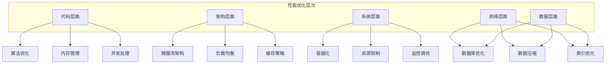
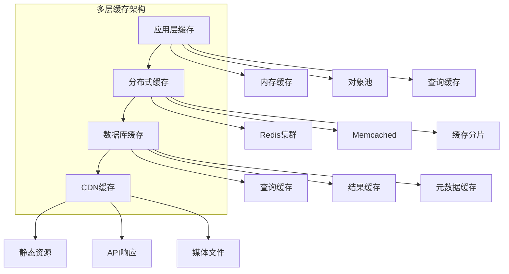
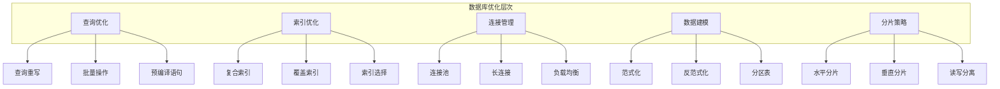
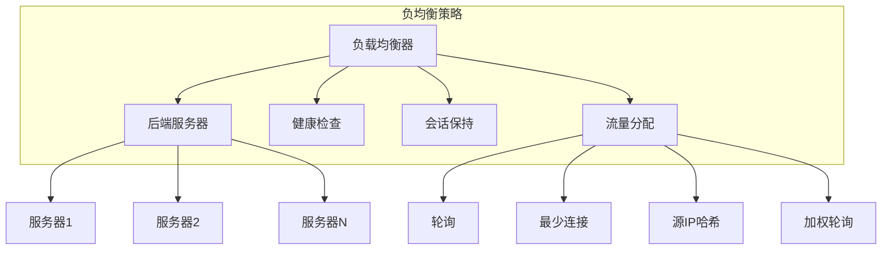

# 第11章: 性能与可扩展性

## 学习目标

- 理解性能优化的核心原则和方法
- 掌握资源管理和负载均衡技术
- 学习缓存策略和数据库优化
- 构建高性能、可扩展的系统架构

## 11.1 性能优化基础

### 11.1.1 性能优化架构

性能优化是确保AI代理系统高效运行的关键，涉及多个层面的优化策略。



### 11.1.2 性能分析器

```typescript
// src/performance/performance-analyzer.ts
import { EventEmitter } from 'events';

export interface PerformanceMetrics {
  cpuUsage: number;
  memoryUsage: number;
  responseTime: number;
  throughput: number;
  errorRate: number;
  resourceUtilization: ResourceUtilization;
}

export interface ResourceUtilization {
  disk: number;
  network: number;
  gpu?: number;
  cache: number;
}

export interface PerformanceReport {
  timestamp: number;
  metrics: PerformanceMetrics;
  bottlenecks: Bottleneck[];
  recommendations: string[];
  trends: PerformanceTrends;
}

export class PerformanceAnalyzer extends EventEmitter {
  private metrics: MetricsStore;
  private profiler: CodeProfiler;
  private resourceMonitor: ResourceMonitor;
  private config: PerformanceAnalyzerConfig;

  constructor(config: PerformanceAnalyzerConfig = {}) {
    super();
    this.config = {
      samplingInterval: config.samplingInterval || 1000,
      profileDuration: config.profileDuration || 30000,
      alertThresholds: config.alertThresholds || {
        cpu: 80,
        memory: 85,
        responseTime: 5000,
        errorRate: 5
      },
      ...config
    };

    this.metrics = new MetricsStore();
    this.profiler = new CodeProfiler();
    this.resourceMonitor = new ResourceMonitor();

    this.startMonitoring();
  }

  // 开始性能分析
  async startAnalysis(duration?: number): Promise<PerformanceReport> {
    const analysisDuration = duration || this.config.profileDuration;
    const startTime = Date.now();

    // 启动性能采样
    this.startSampling();

    // 等待分析完成
    await this.delay(analysisDuration);

    // 停止采样
    this.stopSampling();

    // 生成性能报告
    const report = await this.generateReport();

    this.emit('analysisCompleted', report);
    return report;
  }

  // 生成性能报告
  private async generateReport(): Promise<PerformanceReport> {
    const timestamp = Date.now();
    
    // 收集当前指标
    const currentMetrics = this.collectCurrentMetrics();
    
    // 分析性能瓶颈
    const bottlenecks = await this.identifyBottlenecks(currentMetrics);
    
    // 生成优化建议
    const recommendations = this.generateRecommendations(currentMetrics, bottlenecks);
    
    // 分析性能趋势
    const trends = this.analyzeTrends();

    return {
      timestamp,
      metrics: currentMetrics,
      bottlenecks,
      recommendations,
      trends
    };
  }

  // 收集当前指标
  private collectCurrentMetrics(): PerformanceMetrics {
    return {
      cpuUsage: this.resourceMonitor.getCPUUsage(),
      memoryUsage: this.resourceMonitor.getMemoryUsage(),
      responseTime: this.metrics.getAverageResponseTime(),
      throughput: this.metrics.getThroughput(),
      errorRate: this.metrics.getErrorRate(),
      resourceUtilization: {
        disk: this.resourceMonitor.getDiskUsage(),
        network: this.resourceMonitor.getNetworkUsage(),
        cache: this.metrics.getCacheHitRate()
      }
    };
  }

  // 识别性能瓶颈
  private async identifyBottlenecks(metrics: PerformanceMetrics): Promise<Bottleneck[]> {
    const bottlenecks: Bottleneck[] = [];

    // CPU瓶颈检测
    if (metrics.cpuUsage > this.config.alertThresholds.cpu) {
      bottlenecks.push({
        type: 'cpu',
        severity: this.calculateSeverity(metrics.cpuUsage, this.config.alertThresholds.cpu),
        description: 'High CPU usage detected',
        currentValue: metrics.cpuUsage,
        threshold: this.config.alertThresholds.cpu,
        impact: this.estimateImpact('cpu', metrics.cpuUsage)
      });
    }

    // 内存瓶颈检测
    if (metrics.memoryUsage > this.config.alertThresholds.memory) {
      bottlenecks.push({
        type: 'memory',
        severity: this.calculateSeverity(metrics.memoryUsage, this.config.alertThresholds.memory),
        description: 'High memory usage detected',
        currentValue: metrics.memoryUsage,
        threshold: this.config.alertThresholds.memory,
        impact: this.estimateImpact('memory', metrics.memoryUsage)
      });
    }

    // 响应时间瓶颈检测
    if (metrics.responseTime > this.config.alertThresholds.responseTime) {
      bottlenecks.push({
        type: 'response_time',
        severity: this.calculateSeverity(metrics.responseTime, this.config.alertThresholds.responseTime),
        description: 'Slow response time detected',
        currentValue: metrics.responseTime,
        threshold: this.config.alertThresholds.responseTime,
        impact: this.estimateImpact('response_time', metrics.responseTime)
      });
    }

    // 错误率瓶颈检测
    if (metrics.errorRate > this.config.alertThresholds.errorRate) {
      bottlenecks.push({
        type: 'error_rate',
        severity: this.calculateSeverity(metrics.errorRate, this.config.alertThresholds.errorRate),
        description: 'High error rate detected',
        currentValue: metrics.errorRate,
        threshold: this.config.alertThresholds.errorRate,
        impact: this.estimateImpact('error_rate', metrics.errorRate)
      });
    }

    return bottlenecks;
  }

  // 生成优化建议
  private generateRecommendations(metrics: PerformanceMetrics, bottlenecks: Bottleneck[]): string[] {
    const recommendations: string[] = [];

    // 基于瓶颈生成建议
    for (const bottleneck of bottlenecks) {
      switch (bottleneck.type) {
        case 'cpu':
          recommendations.push('Consider optimizing CPU-intensive operations');
          recommendations.push('Review and optimize algorithms');
          recommendations.push('Consider implementing caching');
          break;

        case 'memory':
          recommendations.push('Identify and fix memory leaks');
          recommendations.push('Optimize data structures and algorithms');
          recommendations.push('Implement memory pooling');
          recommendations.push('Consider using streaming for large datasets');
          break;

        case 'response_time':
          recommendations.push('Optimize database queries');
          recommendations.push('Implement request batching');
          recommendations.push('Use CDN for static content');
          recommendations.push('Consider database indexing');
          break;

        case 'error_rate':
          recommendations.push('Review error handling and logging');
          recommendations.push('Implement circuit breakers');
          recommendations.push('Add more robust error recovery');
          recommendations.push('Review and update retry policies');
          break;
      }
    }

    // 基于资源利用率生成建议
    if (metrics.resourceUtilization.disk > 80) {
      recommendations.push('Consider disk cleanup or expansion');
      recommendations.push('Implement log rotation');
      recommendations.push('Archive old data');
    }

    if (metrics.resourceUtilization.cache < 50) {
      recommendations.push('Review and optimize caching strategy');
      recommendations.push('Consider implementing cache warming');
    }

    return recommendations;
  }

  // 分析性能趋势
  private analyzeTrends(): PerformanceTrends {
    const recentMetrics = this.metrics.getRecentMetrics(3600000); // 1小时

    if (recentMetrics.length < 2) {
      return {
        cpuTrend: 'stable',
        memoryTrend: 'stable',
        responseTimeTrend: 'stable',
        throughputTrend: 'stable'
      };
    }

    return {
      cpuTrend: this.calculateTrend(recentMetrics.map(m => m.cpuUsage)),
      memoryTrend: this.calculateTrend(recentMetrics.map(m => m.memoryUsage)),
      responseTimeTrend: this.calculateTrend(recentMetrics.map(m => m.responseTime)),
      throughputTrend: this.calculateTrend(recentMetrics.map(m => m.throughput))
    };
  }

  // 计算趋势
  private calculateTrend(values: number[]): 'increasing' | 'decreasing' | 'stable' {
    if (values.length < 2) return 'stable';

    const firstHalf = values.slice(0, Math.floor(values.length / 2));
    const secondHalf = values.slice(Math.floor(values.length / 2));

    const firstAvg = firstHalf.reduce((sum, val) => sum + val, 0) / firstHalf.length;
    const secondAvg = secondHalf.reduce((sum, val) => sum + val, 0) / secondHalf.length;

    const percentChange = ((secondAvg - firstAvg) / firstAvg) * 100;

    if (percentChange > 20) return 'increasing';
    if (percentChange < -20) return 'decreasing';
    return 'stable';
  }

  // 计算严重程度
  private calculateSeverity(value: number, threshold: number): BottleneckSeverity {
    const ratio = value / threshold;

    if (ratio > 1.5) return 'critical';
    if (ratio > 1.2) return 'high';
    if (ratio > 1.0) return 'medium';
    return 'low';
  }

  // 估算影响
  private estimateImpact(type: string, value: number): number {
    // 基于类型和数值估算性能影响
    const baseImpact = 50;
    const valueFactor = Math.min(100, value);
    return Math.min(100, baseImpact + valueFactor);
  }

  // 启动监控
  private startMonitoring(): void {
    // 资源监控
    this.resourceMonitor.on('metrics', (metrics) => {
      this.metrics.recordMetrics(metrics);
      this.checkThresholds(metrics);
    });

    this.resourceMonitor.start();
  }

  // 检查阈值
  private checkThresholds(metrics: PerformanceMetrics): void {
    if (metrics.cpuUsage > this.config.alertThresholds.cpu) {
      this.emit('thresholdExceeded', 'cpu', metrics.cpuUsage);
    }

    if (metrics.memoryUsage > this.config.alertThresholds.memory) {
      this.emit('thresholdExceeded', 'memory', metrics.memoryUsage);
    }

    if (metrics.responseTime > this.config.alertThresholds.responseTime) {
      this.emit('thresholdExceeded', 'response_time', metrics.responseTime);
    }

    if (metrics.errorRate > this.config.alertThresholds.errorRate) {
      this.emit('thresholdExceeded', 'error_rate', metrics.errorRate);
    }
  }

  // 开始采样
  private startSampling(): void {
    this.metrics.startRecording();
    this.profiler.startProfiling();
  }

  // 停止采样
  private stopSampling(): void {
    this.metrics.stopRecording();
    this.profiler.stopProfiling();
  }

  // 延迟辅助方法
  private delay(ms: number): Promise<void> {
    return new Promise(resolve => setTimeout(resolve, ms));
  }

  // 获取性能报告
  getPerformanceReport(): PerformanceReport | null {
    return this.metrics.getLatestReport();
  }
}

// 指标存储实现
class MetricsStore {
  private metrics: PerformanceMetrics[] = [];
  private isRecording: boolean = false;
  private recordingInterval: NodeJS.Timeout | null = null;
  private latestReport: PerformanceReport | null = null;

  startRecording(): void {
    if (this.isRecording) return;

    this.isRecording = true;
    this.recordingInterval = setInterval(() => {
      this.recordMetrics(this.collectCurrentMetrics());
    }, 1000);
  }

  stopRecording(): void {
    this.isRecording = false;
    if (this.recordingInterval) {
      clearInterval(this.recordingInterval);
      this.recordingInterval = null;
    }
  }

  recordMetrics(metrics: PerformanceMetrics): void {
    this.metrics.push({
      ...metrics,
      timestamp: Date.now()
    } as any);

    // 保持最近1小时的数据
    const oneHourAgo = Date.now() - 3600000;
    this.metrics = this.metrics.filter((m: any) => m.timestamp > oneHourAgo);
  }

  collectCurrentMetrics(): PerformanceMetrics {
    const cpuUsage = process.cpuUsage().user / 1000000; // 转换为百分比
    const memoryUsage = (process.memoryUsage().heapUsed / process.memoryUsage().heapTotal) * 100;

    return {
      cpuUsage,
      memoryUsage,
      responseTime: 0, // 需要从实际测量中获取
      throughput: 0,    // 需要从实际测量中获取
      errorRate: 0,     // 需要从实际测量中获取
      resourceUtilization: {
        disk: 0,
        network: 0,
        cache: 0
      }
    };
  }

  getRecentMetrics(duration: number): PerformanceMetrics[] {
    const cutoff = Date.now() - duration;
    return this.metrics.filter((m: any) => m.timestamp > cutoff);
  }

  getAverageResponseTime(): number {
    if (this.metrics.length === 0) return 0;

    const total = this.metrics.reduce((sum: number, m: any) => sum + m.responseTime, 0);
    return total / this.metrics.length;
  }

  getThroughput(): number {
    if (this.metrics.length === 0) return 0;

    const total = this.metrics.reduce((sum: number, m: any) => sum + m.throughput, 0);
    return total / this.metrics.length;
  }

  getErrorRate(): number {
    if (this.metrics.length === 0) return 0;

    const total = this.metrics.reduce((sum: number, m: any) => sum + m.errorRate, 0);
    return total / this.metrics.length;
  }

  getCacheHitRate(): number {
    return 0; // 需要从实际缓存统计中获取
  }

  setLatestReport(report: PerformanceReport): void {
    this.latestReport = report;
  }

  getLatestReport(): PerformanceReport | null {
    return this.latestReport;
  }
}

// 代码分析器实现
class CodeProfiler {
  private isProfiling: boolean = false;
  private profileData: any[] = [];

  startProfiling(): void {
    this.isProfiling = true;
    this.profileData = [];

    // 在实际实现中，这里应该启动性能分析
    console.log('Profiling started');
  }

  stopProfiling(): void {
    this.isProfiling = false;
    console.log('Profiling stopped');
  }

  getProfileData(): any[] {
    return this.profileData;
  }
}

// 资源监控器实现
class ResourceMonitor extends EventEmitter {
  private monitoring: boolean = false;
  private intervalId: NodeJS.Timeout | null = null;

  start(): void {
    if (this.monitoring) return;

    this.monitoring = true;
    this.intervalId = setInterval(() => {
      const metrics = this.collectMetrics();
      this.emit('metrics', metrics);
    }, 1000);
  }

  stop(): void {
    this.monitoring = false;
    if (this.intervalId) {
      clearInterval(this.intervalId);
      this.intervalId = null;
    }
  }

  collectMetrics(): PerformanceMetrics {
    return {
      cpuUsage: this.getCPUUsage(),
      memoryUsage: this.getMemoryUsage(),
      responseTime: 0,
      throughput: 0,
      errorRate: 0,
      resourceUtilization: {
        disk: this.getDiskUsage(),
        network: this.getNetworkUsage(),
        cache: 0
      }
    };
  }

  getCPUUsage(): number {
    const usage = process.cpuUsage();
    return (usage.user / 1000000); // 转换为百分比
  }

  getMemoryUsage(): number {
    const usage = process.memoryUsage();
    return (usage.heapUsed / usage.heapTotal) * 100;
  }

  getDiskUsage(): number {
    // 简化实现，实际应该检查磁盘使用情况
    return 0;
  }

  getNetworkUsage(): number {
    // 简化实现，实际应该检查网络使用情况
    return 0;
  }
}

// 相关接口定义
interface Bottleneck {
  type: string;
  severity: BottleneckSeverity;
  description: string;
  currentValue: number;
  threshold: number;
  impact: number;
}

type BottleneckSeverity = 'low' | 'medium' | 'high' | 'critical';

interface PerformanceTrends {
  cpuTrend: 'increasing' | 'decreasing' | 'stable';
  memoryTrend: 'increasing' | 'decreasing' | 'stable';
  responseTimeTrend: 'increasing' | 'decreasing' | 'stable';
  throughputTrend: 'increasing' | 'decreasing' | 'stable';
}

interface PerformanceAnalyzerConfig {
  samplingInterval?: number;
  profileDuration?: number;
  alertThresholds?: {
    cpu: number;
    memory: number;
    responseTime: number;
    errorRate: number;
  };
}
```

## 11.2 缓存策略

### 11.2.1 缓存架构



### 11.2.2 缓存管理器

```typescript
// src/performance/cache-manager.ts
import { EventEmitter } from 'events';

export interface CacheConfig {
  maxSize: number;
  ttl: number;
  strategy: CacheStrategy;
  compression: boolean;
  persistence: boolean;
  backupEnabled: boolean;
}

export enum CacheStrategy {
  LRU = 'lru',
  LFU = 'lfu',
  FIFO = 'fifo',
  LIFO = 'lifo',
  RANDOM = 'random'
}

export interface CacheEntry {
  key: string;
  value: any;
  metadata: CacheMetadata;
  compressed: boolean;
  size: number;
}

export interface CacheMetadata {
  createdAt: number;
  expiresAt: number;
  accessCount: number;
  lastAccessedAt: number;
  size: number;
  tags: string[];
  version: number;
}

export class CacheManager extends EventEmitter {
  private cache: Map<string, CacheEntry> = new Map();
  private index: Map<string, Set<string>> = new Map(); // tag -> keys
  private stats: CacheStatistics = {
    hits: 0,
    misses: 0,
    evictions: 0,
    size: 0
  };
  private config: CacheConfig;

  constructor(config: CacheConfig) {
    this.config = config;
    this.startMaintenance();
  }

  // 获取缓存值
  async get(key: string): Promise<any | null> {
    const entry = this.cache.get(key);

    if (!entry) {
      this.stats.misses++;
      this.emit('cacheMiss', key);
      return null;
    }

    // 检查是否过期
    if (entry.metadata.expiresAt < Date.now()) {
      await this.remove(key);
      this.stats.misses++;
      this.emit('cacheExpired', key);
      return null;
    }

    // 更新访问信息
    entry.metadata.accessCount++;
    entry.metadata.lastAccessedAt = Date.now();

    // 解压缩值
    const value = entry.compressed ? 
      await this.decompress(entry.value) : 
      entry.value;

    this.stats.hits++;
    this.emit('cacheHit', key);

    // 更新缓存位置（基于策略）
    this.updateCachePosition(key);

    return value;
  }

  // 设置缓存值
  async set(key: string, value: any, options?: CacheOptions): Promise<boolean> {
    const now = Date.now();
    const ttl = options?.ttl || this.config.ttl;
    const tags = options?.tags || [];

    // 检查缓存大小
    const entrySize = this.calculateSize(value);
    if (entrySize > this.config.maxSize) {
      this.emit('cacheTooLarge', key, entrySize);
      return false;
    }

    // 确保有足够空间
    await this.ensureCapacity(entrySize);

    // 压缩值（如果启用）
    const compressedValue = this.config.compression ? 
      await this.compress(value) : 
      value;

    // 创建缓存条目
    const entry: CacheEntry = {
      key,
      value: compressedValue,
      metadata: {
        createdAt: now,
        expiresAt: now + ttl,
        accessCount: 0,
        lastAccessedAt: now,
        size: entrySize,
        tags,
        version: options?.version || 1
      },
      compressed: this.config.compression,
      size: entrySize
    };

    // 存储缓存
    this.cache.set(key, entry);

    // 更新标签索引
    for (const tag of tags) {
      if (!this.index.has(tag)) {
        this.index.set(tag, new Set());
      }
      this.index.get(tag)!.add(key);
    }

    // 更新统计
    this.stats.size = this.cache.size;

    this.emit('cacheSet', key, entry);

    return true;
  }

  // 删除缓存值
  async remove(key: string): Promise<boolean> {
    const entry = this.cache.get(key);
    
    if (!entry) {
      return false;
    }

    // 移除标签索引
    for (const tag of entry.metadata.tags) {
      const keys = this.index.get(tag);
      if (keys) {
        keys.delete(key);
      }
    }

    // 删除缓存
    this.cache.delete(key);

    // 更新统计
    this.stats.size = this.cache.size;

    this.emit('cacheRemoved', key);

    return true;
  }

  // 批量获取
  async getMultiple(keys: string[]): Promise<Map<string, any>> {
    const results = new Map();

    for (const key of keys) {
      const value = await this.get(key);
      if (value !== null) {
        results.set(key, value);
      }
    }

    return results;
  }

  // 批量设置
  async setMultiple(entries: Map<string, any>, options?: CacheOptions): Promise<number> {
    let setCount = 0;

    for (const [key, value] of entries.entries()) {
      const success = await this.set(key, value, options);
      if (success) {
        setCount++;
      }
    }

    return setCount;
  }

  // 按标签获取
  async getByTag(tag: string): Promise<Map<string, any>> {
    const keys = this.index.get(tag);
    if (!keys || keys.size === 0) {
      return new Map();
    }

    const results = new Map();
    for (const key of keys) {
      const value = await this.get(key);
      if (value !== null) {
        results.set(key, value);
      }
    }

    return results;
  }

  // 按标签删除
  async removeByTag(tag: string): Promise<number> {
    const keys = this.index.get(tag);
    if (!keys || keys.size === 0) {
      return 0;
    }

    let removedCount = 0;
    for (const key of keys) {
      const removed = await this.remove(key);
      if (removed) {
        removedCount++;
      }
    }

    return removedCount;
  }

  // 清空缓存
  async clear(): Promise<void> {
    this.cache.clear();
    this.index.clear();
    this.stats = {
      hits: 0,
      misses: 0,
      evictions: 0,
      size: 0
    };

    this.emit('cacheCleared');
  }

  // 确保容量
  private async ensureCapacity(requiredSize: number): Promise<void> {
    const currentSize = this.calculateCurrentSize();

    if (currentSize + requiredSize <= this.config.maxSize) {
      return;
    }

    // 需要驱逐一些条目
    const toRemove = await this.selectEntriesToEvict(requiredSize);
    
    for (const key of toRemove) {
      await this.remove(key);
      this.stats.evictions++;
    }
  }

  // 选择要驱逐的条目
  private async selectEntriesToEvict(requiredSize: number): Promise<string[]> {
    const toRemove: string[] = [];
    let freedSize = 0;

    const entries = Array.from(this.cache.entries())
      .map(([key, entry]) => ({ key, entry }))
      .sort((a, b) => this.compareEntries(a.key, b.key, a.entry, b.entry));

    for (const { key, entry } of entries) {
      if (freedSize >= requiredSize) {
        break;
      }

      toRemove.push(key);
      freedSize += entry.size;
    }

    return toRemove;
  }

  // 比较缓存条目
  private compareEntries(keyA: string, keyB: string, entryA: CacheEntry, entryB: CacheEntry): number {
    switch (this.config.strategy) {
      case CacheStrategy.LRU:
        // 最近最少使用
        return entryA.metadata.lastAccessedAt - entryB.metadata.lastAccessedAt;

      case CacheStrategy.LFU:
        // 最少使用频率
        return entryA.metadata.accessCount - entryB.metadata.accessCount;

      case CacheStrategy.FIFO:
        // 先进先出
        return entryA.metadata.createdAt - entryB.metadata.createdAt;

      case CacheStrategy.LIFO:
        // 后进先出
        return entryB.metadata.createdAt - entryA.metadata.createdAt;

      case CacheStrategy.RANDOM:
        // 随机
        return Math.random() - 0.5;

      default:
        return 0;
    }
  }

  // 更新缓存位置
  private updateCachePosition(key: string): void {
    if (this.config.strategy === CacheStrategy.LRU) {
      // LRU策略需要将访问的条目移到前面
      const entry = this.cache.get(key);
      if (entry) {
        this.cache.delete(key);
        this.cache.set(key, entry);
      }
    }
  }

  // 计算大小
  private calculateSize(value: any): number {
    // 简化实现，实际应该计算实际内存占用
    return JSON.stringify(value).length * 2; // UTF-16编码
  }

  // 计算当前大小
  private calculateCurrentSize(): number {
    let totalSize = 0;

    for (const entry of this.cache.values()) {
      totalSize += entry.size;
    }

    return totalSize;
  }

  // 压缩数据
  private async compress(data: any): Promise<any> {
    // 简化实现，实际应该使用压缩库
    return data;
  }

  // 解压缩数据
  private async decompress(data: any): Promise<any> {
    // 简化实现
    return data;
  }

  // 获取缓存统计
  getStatistics(): CacheStatistics {
    return { ...this.stats };
  }

  // 获取缓存命中率
  getHitRate(): number {
    const total = this.stats.hits + this.stats.misses;
    return total > 0 ? (this.stats.hits / total) * 100 : 0;
  }

  // 预热缓存
  async warmup(keys: string[], valueProvider: (key: string) => Promise<any>): Promise<void> {
    const batchSize = 10;

    for (let i = 0; i < keys.length; i += batchSize) {
      const batch = keys.slice(i, i + batchSize);
      
      const promises = batch.map(async (key) => {
        try {
          const value = await valueProvider(key);
          await this.set(key, value);
        } catch (error) {
          console.error(`Failed to warmup cache for key ${key}:`, error);
        }
      });

      await Promise.all(promises);
    }

    this.emit('cacheWarmedUp', keys.length);
  }

  // 启动维护任务
  private startMaintenance(): void {
    // 定期清理过期条目
    setInterval(async () => {
      await this.cleanupExpired();
    }, 60000); // 每分钟清理一次

    // 定期统计报告
    setInterval(() => {
      this.emit('statisticsUpdate', this.getStatistics());
    }, 300000); // 每5分钟报告一次
  }

  // 清理过期条目
  private async cleanupExpired(): Promise<void> {
    const now = Date.now();
    const expiredKeys: string[] = [];

    for (const [key, entry] of this.cache.entries()) {
      if (entry.metadata.expiresAt < now) {
        expiredKeys.push(key);
      }
    }

    for (const key of expiredKeys) {
      await this.remove(key);
    }

    if (expiredKeys.length > 0) {
      this.emit('expiredCleanedUp', expiredKeys.length);
    }
  }
}

// 相关接口定义
interface CacheOptions {
  ttl?: number;
  tags?: string[];
  version?: number;
}

interface CacheStatistics {
  hits: number;
  misses: number;
  evictions: number;
  size: number;
}
```

## 11.3 数据库优化

### 11.3.1 数据库性能优化



### 11.3.2 数据库优化器

```typescript
// src/performance/database-optimizer.ts
import { EventEmitter } from 'events';

export interface QueryOptimization {
  originalQuery: string;
  optimizedQuery: string;
  improvements: string[];
  estimatedImprovement: number;
}

export interface IndexOptimization {
  table: string;
  suggestedIndexes: SuggestedIndex[];
  existingIndexes: string[];
  impact: IndexImpact;
}

export interface SuggestedIndex {
  columns: string[];
  type: 'simple' | 'composite' | 'unique';
  reason: string;
  estimatedBenefit: number;
}

export interface IndexImpact {
  queryPerformance: number;
  storageOverhead: number;
  writePerformance: number;
}

export class DatabaseOptimizer extends EventEmitter {
  private queryAnalyzer: QueryAnalyzer;
  private indexAnalyzer: IndexAnalyzer;
  private connectionPool: ConnectionPool;
  private config: DatabaseOptimizerConfig;

  constructor(config: DatabaseOptimizerConfig = {}) {
    super();
    this.config = {
      enableQueryCaching: config.enableQueryCaching !== false,
      enableConnectionPooling: config.enableConnectionPooling !== false,
      maxConnections: config.maxConnections || 10,
      queryCacheSize: config.queryCacheSize || 100,
      ...config
    };

    this.queryAnalyzer = new QueryAnalyzer();
    this.indexAnalyzer = new IndexAnalyzer();
    this.connectionPool = new ConnectionPool({
      maxConnections: this.config.maxConnections,
      minConnections: 2,
      acquireTimeout: 30000,
      idleTimeout: 300000
    });

    this.initialize();
  }

  // 优化查询
  async optimizeQuery(query: string, context?: QueryContext): Promise<QueryOptimization> {
    // 分析查询
    const analysis = await this.queryAnalyzer.analyze(query, context);

    // 生成优化建议
    const optimization: QueryOptimization = {
      originalQuery: query,
      optimizedQuery: query,
      improvements: [],
      estimatedImprovement: 0
    };

    // 应用优化规则
    for (const issue of analysis.issues) {
      const improvements = this.generateImprovements(issue);
      optimization.improvements.push(...improvements);
    }

    // 应用优化
    if (optimization.improvements.length > 0) {
      optimization.optimizedQuery = this.applyImprovements(query, optimization.improvements);
      optimization.estimatedImprovement = this.estimateImprovement(optimization.improvements);
    }

    this.emit('queryOptimized', optimization);
    return optimization;
  }

  // 优化索引
  async optimizeIndexes(table: string, currentIndexes: string[]): Promise<IndexOptimization> {
    // 分析索引使用情况
    const analysis = await this.indexAnalyzer.analyze(table, currentIndexes);

    const optimization: IndexOptimization = {
      table,
      suggestedIndexes: analysis.suggestions,
      existingIndexes: currentIndexes,
      impact: analysis.impact
    };

    this.emit('indexesOptimized', optimization);
    return optimization;
  }

  // 执行优化查询
  async executeOptimizedQuery(query: string, params?: any[]): Promise<any> {
    // 检查查询缓存
    if (this.config.enableQueryCaching) {
      const cached = this.getCachedQuery(query, params);
      if (cached) {
        return cached;
      }
    }

    // 获取连接
    const connection = await this.connectionPool.acquire();

    try {
      // 执行查询
      const result = await connection.query(query, params);

      // 缓存结果
      if (this.config.enableQueryCaching && this.isCacheable(query)) {
        this.cacheQuery(query, params, result);
      }

      return result;

    } finally {
      // 释放连接
      await this.connectionPool.release(connection);
    }
  }

  // 批量操作
  async executeBatch(queries: Array<{ query: string; params?: any[] }>): Promise<any[]> {
    const results: any[] = [];

    for (const { query, params } of queries) {
      try {
        const result = await this.executeOptimizedQuery(query, params);
        results.push(result);
      } catch (error) {
        results.push({ error: error instanceof Error ? error.message : 'Unknown error' });
      }
    }

    return results;
  }

  // 事务处理
  async executeTransaction(queries: Array<{ query: string; params?: any[] }>): Promise<any[]> {
    const connection = await this.connectionPool.acquire();

    try {
      // 开始事务
      await connection.beginTransaction();

      const results: any[] = [];

      // 执行查询
      for (const { query, params } of queries) {
        const result = await connection.query(query, params);
        results.push(result);
      }

      // 提交事务
      await connection.commitTransaction();

      return results;

    } catch (error) {
      // 回滚事务
      await connection.rollbackTransaction();
      throw error;
    } finally {
      await this.connectionPool.release(connection);
    }
  }

  // 生成改进建议
  private generateImprovements(issue: QueryIssue): string[] {
    const improvements: string[] = [];

    switch (issue.type) {
      case 'SELECT_STAR':
        improvements.push('Replace SELECT * with specific columns');
        improvements.push('Only select required fields');
        break;

      case 'MISSING_WHERE_CLAUSE':
        improvements.push('Add WHERE clause to limit result set');
        improvements.push('Use proper indexing for WHERE conditions');
        break;

      case 'N_PLUS_ONE':
        improvements.push('Use JOIN instead of separate queries');
        improvements.push('Consider batch fetching');
        break;

      case 'LACK_OF_INDEX':
        improvements.push('Add index on filtered columns');
        improvements.push('Use covering indexes for frequent queries');
        break;

      case 'INEFFICIENT_JOIN':
        improvements.push('Optimize JOIN order');
        improvements.push('Ensure JOIN columns are indexed');
        break;

      case 'UNNECESSARY_SORT':
        improvements.push('Remove ORDER BY if not needed');
        improvements.push('Consider using pagination for large result sets');
        break;
    }

    return improvements;
  }

  // 应用改进
  private applyImprovements(query: string, improvements: string[]): string {
    let optimizedQuery = query;

    for (const improvement of improvements) {
      optimizedQuery = this.applyImprovement(optimizedQuery, improvement);
    }

    return optimizedQuery;
  }

  // 应用单个改进
  private applyImprovement(query: string, improvement: string): string {
    // 简化实现，实际应该使用SQL解析器和重写器
    return query;
  }

  // 估算改进效果
  private estimateImprovement(improvements: string[]): number {
    let totalImprovement = 0;

    for (const improvement of improvements) {
      // 基于改进类型估算性能提升
      if (improvement.includes('index')) {
        totalImprovement += 30;
      } else if (improvement.includes('JOIN')) {
        totalImprovement += 20;
      } else if (improvement.includes('cache')) {
        totalImprovement += 40;
      } else {
        totalImprovement += 10;
      }
    }

    return Math.min(90, totalImprovement); // 最大90%改进
  }

  // 检查是否可缓存
  private isCacheable(query: string): boolean {
    // 查询是否只读
    const upperQuery = query.toUpperCase().trim();
    return upperQuery.startsWith('SELECT');
  }

  // 获取缓存查询
  private getCachedQuery(query: string, params?: any[]): any | null {
    // 简化实现
    return null;
  }

  // 缓存查询
  private cacheQuery(query: string, params?: any[], result?: any): void {
    // 简化实现
  }

  // 初始化
  private initialize(): void {
    // 启动连接池
    this.connectionPool.initialize();

    this.emit('initialized');
  }

  // 获取性能统计
  getPerformanceStats(): DatabasePerformanceStats {
    return {
      queryCacheHitRate: this.connectionPool.getQueryCacheHitRate(),
      connectionPoolUtilization: this.connectionPool.getUtilization(),
      averageQueryTime: this.connectionPool.getAverageQueryTime(),
      activeConnections: this.connectionPool.getActiveConnections(),
      totalQueries: this.connectionPool.getTotalQueries()
    };
  }
}

// 查询分析器实现
class QueryAnalyzer {
  async analyze(query: string, context?: QueryContext): Promise<QueryAnalysisResult> {
    const issues: QueryIssue[] = [];
    const upperQuery = query.toUpperCase().trim();

    // 检查SELECT *
    if (upperQuery.includes('SELECT *')) {
      issues.push({
        type: 'SELECT_STAR',
        severity: 'medium',
        message: 'SELECT * retrieves all columns',
        suggestion: 'Specify required columns'
      });
    }

    // 检查WHERE子句
    if (!upperQuery.includes('WHERE') && !upperQuery.includes('LIMIT')) {
      issues.push({
        type: 'MISSING_WHERE_CLAUSE',
        severity: 'high',
        message: 'Query lacks WHERE clause',
        suggestion: 'Add WHERE clause to filter results'
      });
    }

    // 检查N+1问题
    if (context?.hasMultipleQueries) {
      issues.push({
        type: 'N_PLUS_ONE',
        severity: 'high',
        message: 'Potential N+1 query pattern detected',
        suggestion: 'Use JOINs or batch fetching'
      });
    }

    // 检查索引使用
    if (!this.hasEffectiveIndex(query, context)) {
      issues.push({
        type: 'LACK_OF_INDEX',
        severity: 'medium',
        message: 'Query may not use indexes effectively',
        suggestion: 'Add appropriate indexes'
      });
    }

    return {
      originalQuery: query,
      issues,
      recommendations: this.generateRecommendations(issues)
    };
  }

  private hasEffectiveIndex(query: string, context?: QueryContext): boolean {
    // 简化实现，实际应该分析查询计划
    return true;
  }

  private generateRecommendations(issues: QueryIssue[]): string[] {
    return issues.map(issue => issue.suggestion);
  }
}

// 索引分析器实现
class IndexAnalyzer {
  async analyze(table: string, currentIndexes: string[]): Promise<IndexAnalysisResult> {
    const suggestions: SuggestedIndex[] = [];

    // 分析表结构和使用模式
    // 简化实现，实际应该分析查询模式和现有索引

    return {
      table,
      suggestions,
      existingIndexes: currentIndexes,
      impact: {
        queryPerformance: 0,
        storageOverhead: 0,
        writePerformance: 0
      }
    };
  }
}

// 连接池实现
class ConnectionPool {
  private pool: Connection[] = [];
  private maxConnections: number;
  private minConnections: number;
  private acquireTimeout: number;
  private idleTimeout: number;

  constructor(config: ConnectionPoolConfig) {
    this.maxConnections = config.maxConnections;
    this.minConnections = config.minConnections;
    this.acquireTimeout = config.acquireTimeout;
    this.idleTimeout = config.idleTimeout;
  }

  initialize(): void {
    // 创建最小连接数
    for (let i = 0; i < this.minConnections; i++) {
      this.pool.push({
        id: `conn-${i}`,
        busy: false,
        createdAt: Date.now(),
        lastUsed: Date.now()
      });
    }
  }

  async acquire(): Promise<Connection> {
    const startTime = Date.now();

    while (Date.now() - startTime < this.acquireTimeout) {
      const connection = this.pool.find(conn => !conn.busy);

      if (connection) {
        connection.busy = true;
        connection.lastUsed = Date.now();
        return connection;
      }

      await this.delay(100);
    }

    throw new Error('Connection acquire timeout');
  }

  async release(connection: Connection): Promise<void> {
    connection.busy = false;
    connection.lastUsed = Date.now();
  }

  getQueryCacheHitRate(): number {
    return 0; // 简化实现
  }

  getUtilization(): number {
    const active = this.pool.filter(conn => conn.busy).length;
    return (active / this.pool.length) * 100;
  }

  getAverageQueryTime(): number {
    return 0; // 简化实现
  }

  getActiveConnections(): number {
    return this.pool.filter(conn => conn.busy).length;
  }

  getTotalQueries(): number {
    return 0; // 简化实现
  }

  private delay(ms: number): Promise<void> {
    return new Promise(resolve => setTimeout(resolve, ms));
  }
}

// 相关接口定义
interface QueryContext {
  hasMultipleQueries?: boolean;
  tables?: string[];
  columns?: string[];
}

interface QueryAnalysisResult {
  originalQuery: string;
  issues: QueryIssue[];
  recommendations: string[];
}

interface QueryIssue {
  type: string;
  severity: string;
  message: string;
  suggestion: string;
}

interface IndexAnalysisResult {
  table: string;
  suggestions: SuggestedIndex[];
  existingIndexes: string[];
  impact: IndexImpact;
}

interface Connection {
  id: string;
  busy: boolean;
  createdAt: number;
  lastUsed: number;
  query?: (sql: string, params?: any[]) => Promise<any>;
  beginTransaction?(): Promise<void>;
  commitTransaction?(): Promise<void>;
  rollbackTransaction?(): Promise<void>;
}

interface ConnectionPoolConfig {
  maxConnections: number;
  minConnections: number;
  acquireTimeout: number;
  idleTimeout: number;
}

interface DatabaseOptimizerConfig {
  enableQueryCaching?: boolean;
  enableConnectionPooling?: boolean;
  maxConnections?: number;
  queryCacheSize?: number;
}

interface DatabasePerformanceStats {
  queryCacheHitRate: number;
  connectionPoolUtilization: number;
  averageQueryTime: number;
  activeConnections: number;
  totalQueries: number;
}
```

## 11.4 负载均衡

### 11.4.1 负载均衡策略



### 11.4.2 负载均衡器

```typescript
// src/performance/load-balancer.ts
import { EventEmitter } from 'events';

export interface LoadBalancerConfig {
  algorithm: LoadBalanceAlgorithm;
  healthCheckInterval: number;
  healthCheckTimeout: number;
  maxRetries: number;
  sessionAffinity: boolean;
  retryPolicy: RetryPolicy;
}

export enum LoadBalanceAlgorithm {
  ROUND_ROBIN = 'round_robin',
  LEAST_CONNECTIONS = 'least_connections',
  WEIGHTED_ROUND_ROBIN = 'weighted_round_robin',
  IP_HASH = 'ip_hash',
  RANDOM = 'random',
  CONSISTENT_HASH = 'consistent_hash'
}

export class LoadBalancer extends EventEmitter {
  private backends: Map<string, BackendInfo> = new Map();
  private algorithm: LoadBalanceAlgorithm;
  private healthChecker: HealthChecker;
  private config: LoadBalancerConfig;
  private currentIndex = 0;

  constructor(config: LoadBalancerConfig) {
    super();
    this.config = config;
    this.algorithm = config.algorithm;
    this.healthChecker = new HealthChecker({
      interval: config.healthCheckInterval,
      timeout: config.healthCheckTimeout
    });

    this.initializeHealthCheck();
  }

  // 添加后端服务器
  addBackend(backend: BackendConfig): void {
    const backendInfo: BackendInfo = {
      id: backend.id,
      address: backend.address,
      port: backend.port,
      weight: backend.weight || 1,
      maxConnections: backend.maxConnections || 100,
      currentConnections: 0,
      totalRequests: 0,
      failedRequests: 0,
      healthy: true,
      lastHealthCheck: Date.now()
    };

    this.backends.set(backend.id, backendInfo);
    this.emit('backendAdded', backend.id);
  }

  // 移除后端服务器
  removeBackend(backendId: string): void {
    const backendInfo = this.backends.get(backendId);
    
    if (backendInfo) {
      this.backends.delete(backendId);
      this.emit('backendRemoved', backendId);
    }
  }

  // 选择后端
  async selectBackend(context?: RequestContext): Promise<BackendSelection> {
    const healthyBackends = Array.from(this.backends.values()).filter(b => b.healthy);

    if (healthyBackends.length === 0) {
      throw new Error('No healthy backends available');
    }

    let selectedBackend: BackendInfo;

    switch (this.algorithm) {
      case LoadBalanceAlgorithm.ROUND_ROBIN:
        selectedBackend = this.roundRobinSelect(healthyBackends);
        break;

      case LoadBalanceAlgorithm.LEAST_CONNECTIONS:
        selectedBackend = this.leastConnectionsSelect(healthyBackends);
        break;

      case LoadBalanceAlgorithm.WEIGHTED_ROUND_ROBIN:
        selectedBackend = this.weightedRoundRobinSelect(healthyBackends);
        break;

      case LoadBalanceAlgorithm.IP_HASH:
        selectedBackend = this.ipHashSelect(healthyBackends, context);
        break;

      case LoadBalanceAlgorithm.RANDOM:
        selectedBackend = this.randomSelect(healthyBackends);
        break;

      case LoadBalanceAlgorithm.CONSISTENT_HASH:
        selectedBackend = this.consistentHashSelect(healthyBackends, context);
        break;

      default:
        selectedBackend = this.roundRobinSelect(healthyBackends);
    }

    // 增加连接计数
    selectedBackend.currentConnections++;
    selectedBackend.totalRequests++;

    return {
      backend: selectedBackend,
      retryCount: 0,
      attempts: []
    };
  }

  // 轮询选择
  private roundRobinSelect(backends: BackendInfo[]): BackendInfo {
    if (this.currentIndex >= backends.length) {
      this.currentIndex = 0;
    }
    return backends[this.currentIndex++];
  }

  // 最少连接选择
  private leastConnectionsSelect(backends: BackendInfo[]): BackendInfo {
    return backends.reduce((min, backend) =>
      backend.currentConnections < min.currentConnections ? backend : min
    );
  }

  // 加权轮询选择
  private weightedRoundRobinSelect(backends: BackendInfo[]): BackendInfo {
    const totalWeight = backends.reduce((sum, b) => sum + b.weight, 0);
    let random = Math.random() * totalWeight;

    for (const backend of backends) {
      random -= backend.weight;
      if (random <= 0) {
        return backend;
      }
    }

    return backends[backends.length - 1];
  }

  // IP哈希选择
  private ipHashSelect(backends: BackendInfo[], context?: RequestContext): BackendInfo {
    const clientIp = context?.clientIp || '0.0.0.0';
    const hash = this.hashString(clientIp);
    const index = hash % backends.length;
    return backends[index];
  }

  // 一致性哈希选择
  private consistentHashSelect(backends: BackendInfo[], context?: RequestContext): BackendInfo {
    const key = context?.sessionId || context?.clientIp || 'default';
    const hash = this.hashString(key);
    const index = hash % backends.length;
    return backends[index];
  }

  // 随机选择
  private randomSelect(backends: BackendInfo[]): BackendInfo {
    const index = Math.floor(Math.random() * backends.length);
    return backends[index];
  }

  // 释放后端
  releaseBackend(backendId: string): void {
    const backend = this.backends.get(backendId);
    
    if (backend) {
      backend.currentConnections--;
    }
  }

  // 记录成功请求
  recordSuccess(backendId: string): void {
    const backend = this.backends.get(backendId);
    
    if (backend) {
      // 重置失败计数
      backend.failedRequests = 0;
    }
  }

  // 记录失败请求
  recordFailure(backendId: string): void {
    const backend = this.backends.get(backendId);
    
    if (backend) {
      backend.failedRequests++;

      // 如果失败次数过多，标记为不健康
      if (backend.failedRequests > this.config.maxRetries) {
        backend.healthy = false;
        this.emit('backendUnhealthy', backendId);
      }
    }
  }

  // 获取后端状态
  getBackendStatus(): Map<string, BackendStatus> {
    const status = new Map();

    for (const [id, backend] of this.backends.entries()) {
      status.set(id, {
        id,
        healthy: backend.healthy,
        currentConnections: backend.currentConnections,
        totalRequests: backend.totalRequests,
        failedRequests: backend.failedRequests,
        weight: backend.weight,
        utilization: (backend.currentConnections / backend.maxConnections) * 100
      });
    }

    return status;
  }

  // 初始化健康检查
  private initializeHealthCheck(): void {
    this.healthChecker.on('healthCheck', async (backendId: string) => {
      const backend = this.backends.get(backendId);
      
      if (!backend) return;

      try {
        const isHealthy = await this.performHealthCheck(backend);
        
        if (!backend.healthy && isHealthy) {
          backend.healthy = true;
          this.emit('backendRecovered', backendId);
        } else if (backend.healthy && !isHealthy) {
          backend.healthy = false;
          this.emit('backendUnhealthy', backendId);
        }

        backend.lastHealthCheck = Date.now();

      } catch (error) {
        backend.healthy = false;
        this.emit('backendHealthCheckFailed', backendId, error);
      }
    });

    this.healthChecker.start();
  }

  // 执行健康检查
  private async performHealthCheck(backend: BackendInfo): Promise<boolean> {
    // 简化实现，实际应该检查后端健康状态
    return true;
  }

  // 字符串哈希
  private hashString(str: string): number {
    let hash = 0;
    
    for (let i = 0; i < str.length; i++) {
      const char = str.charCodeAt(i);
      hash = ((hash << 5) - hash) + char;
      hash = hash & hash; // Convert to 32-bit integer
    }

    return Math.abs(hash);
  }

  // 销毁
  destroy(): void {
    this.healthChecker.stop();
    this.backends.clear();
    this.emit('destroyed');
  }
}

// 健康检查器实现
class HealthChecker extends EventEmitter {
  private intervalId: NodeJS.Timeout | null = null;
  private config: HealthCheckConfig;

  constructor(config: HealthCheckConfig) {
    this.config = config;
  }

  start(): void {
    if (this.intervalId) return;

    this.intervalId = setInterval(() => {
      this.performHealthChecks();
    }, this.config.interval);
  }

  stop(): void {
    if (this.intervalId) {
      clearInterval(this.intervalId);
      this.intervalId = null;
    }
  }

  private async performHealthChecks(): Promise<void> {
    // 简化实现，实际应该检查所有后端的健康状态
  }
}

// 相关接口定义
interface BackendInfo {
  id: string;
  address: string;
  port: number;
  weight: number;
  maxConnections: number;
  currentConnections: number;
  totalRequests: number;
  failedRequests: number;
  healthy: boolean;
  lastHealthCheck: number;
}

interface BackendConfig {
  id: string;
  address: string;
  port: number;
  weight?: number;
  maxConnections?: number;
}

interface BackendStatus {
  id: string;
  healthy: boolean;
  currentConnections: number;
  totalRequests: number;
  failedRequests: number;
  weight: number;
  utilization: number;
}

interface BackendSelection {
  backend: BackendInfo;
  retryCount: number;
  attempts: BackendAttempt[];
}

interface BackendAttempt {
  backendId: string;
  timestamp: number;
  success: boolean;
  error?: string;
}

interface RequestContext {
  clientIp?: string;
  sessionId?: string;
  userId?: string;
  headers?: Record<string, string>;
}

interface RetryPolicy {
  maxRetries: number;
  backoffStrategy: 'linear' | 'exponential';
  initialDelay: number;
  maxDelay: number;
}

interface HealthCheckConfig {
  interval: number;
  timeout: number;
}
```

## 11.5 本章小结

### 关键要点

- **性能分析**: 多维度性能指标收集和瓶颈识别
- **缓存策略**: 多层缓存架构和智能驱逐算法
- **数据库优化**: 查询优化、索引设计、连接池管理
- **负载均衡**: 多种负载均衡算法和健康检查机制

### 最佳实践

1. **性能监控** - 实时监控性能指标，及时发现问题
2. **缓存优先** - 合理使用缓存减少数据库负载
3. **数据库优化** - 优化查询、建立合适的索引
4. **负载均衡** - 根据场景选择合适的负载均衡算法
5. **容量规划** - 提前规划和扩展系统能力

### 下一步学习

恭喜你完成了生产就绪部分的学习！最后我们将：

- 📖 **第12章**: 学习测试与质量保证
- 🔧 **实践**: 构建完整的测试体系
- 🎯 **目标**: 掌握生产级测试的最佳实践

---

**准备好探索质量保证的最终篇章了吗？** ✅
