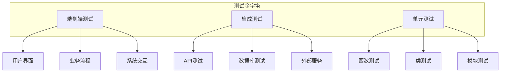
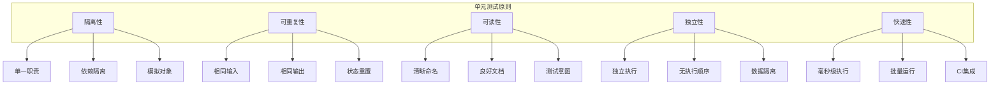
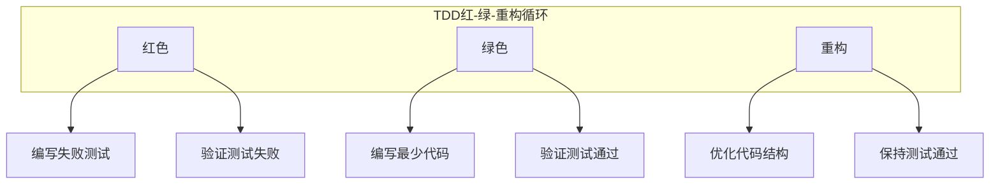

# 第12章: 测试与质量保证

## 学习目标

- 理解软件测试的核心原则和方法
- 掌握单元测试、集成测试、端到端测试
- 学习测试驱动开发(TDD)实践
- 构建完整的质量保证体系

## 12.1 测试基础架构

### 12.1.1 测试金字塔

测试金字塔是软件测试的核心概念，定义了不同类型测试的比例和责任。



### 12.1.2 测试框架实现

```typescript
// src/testing/test-framework.ts
import { EventEmitter } from 'events';

export interface TestSuite {
  id: string;
  name: string;
  description: string;
  tests: TestCase[];
  setup?: () => Promise<void>;
  teardown?: () => Promise<void>;
  timeout?: number;
}

export interface TestCase {
  id: string;
  name: string;
  description: string;
  test: () => Promise<TestResult> | TestResult;
  timeout?: number;
  skip?: boolean;
  only?: boolean;
  tags?: string[];
}

export interface TestResult {
  passed: boolean;
  duration: number;
    error?: Error;
  assertions?: AssertionResult[];
  coverage?: TestCoverage;
  metadata?: TestMetadata;
}

export interface AssertionResult {
  passed: boolean;
  description: string;
  expected: any;
  actual: any;
  location?: string;
}

export interface TestCoverage {
  lines: number;
  functions: number;
  branches: number;
  statements: number;
}

export interface TestMetadata {
  timestamp: number;
  tester?: string;
  environment: string;
  version: string;
}

export class TestFramework extends EventEmitter {
  private suites: Map<string, TestSuite> = new Map();
  private results: Map<string, TestResult[]> = new Map();
  private config: TestFrameworkConfig;
  private coverage: CoverageCollector;

  constructor(config: TestFrameworkConfig = {}) {
    super();
    this.config = {
      timeout: config.timeout || 5000,
      parallel: config.parallel || false,
      coverage: config.coverage || false,
      ...config
    };

    this.coverage = new CoverageCollector();
    this.initialize();
  }

  // 注册测试套件
  registerSuite(suite: TestSuite): void {
    this.suites.set(suite.id, suite);
    this.emit('suiteRegistered', suite.id);
  }

  // 运行测试套件
  async runSuite(suiteId: string): Promise<TestSuiteResult> {
    const suite = this.suites.get(suiteId);
    
    if (!suite) {
      throw new Error(`Test suite ${suiteId} not found`);
    }

    const startTime = Date.now();
    const results: TestResult[] = [];

    try {
      // 执行setup
      if (suite.setup) {
        await suite.setup();
      }

      // 运行测试
      for (const test of suite.tests) {
        if (test.skip) {
          this.emit('testSkipped', test.id);
          continue;
        }

        if (test.only && !this.config.parallel) {
          // 只运行标记为only的测试
        }

        const result = await this.runTest(test, suite.timeout || this.config.timeout);
        results.push(result);

        if (!result.passed && !this.config.parallel) {
          // 失败时停止（非并行模式）
          break;
        }
      }

    } finally {
      // 执行teardown
      if (suite.teardown) {
        await suite.teardown();
      }
    }

    const duration = Date.now() - startTime;

    // 计算测试覆盖率
    const coverage = this.config.coverage ? 
      await this.coverage.collectCoverage(suiteId) : 
      undefined;

    const suiteResult: TestSuiteResult = {
      suiteId,
      suiteName: suite.name,
      totalTests: suite.tests.length,
      passed: results.filter(r => r.passed).length,
      failed: results.filter(r => !r.passed).length,
      skipped: results.filter(r => r.metadata?.skipped).length,
      duration,
      results,
      coverage
    };

    this.results.set(suiteId, results);
    this.emit('suiteCompleted', suiteResult);

    return suiteResult;
  }

  // 运行所有测试
  async runAllTests(): Promise<TestRunResult> {
    const startTime = Date.now();
    const suiteResults: TestSuiteResult[] = [];

    const suiteIds = Array.from(this.suites.keys());

    if (this.config.parallel) {
      // 并行运行测试套件
      const promises = suiteIds.map(id => this.runSuite(id));
      const results = await Promise.all(promises);
      suiteResults.push(...results);
    } else {
      // 串行运行测试套件
      for (const suiteId of suiteIds) {
        const result = await this.runSuite(suiteId);
        suiteResults.push(result);
      }
    }

    const duration = Date.now() - startTime;

    // 汇总结果
    const totalTests = suiteResults.reduce((sum, result) => sum + result.totalTests, 0);
    const passed = suiteResults.reduce((sum, result) => sum + result.passed, 0);
    const failed = suiteResults.reduce((sum, result) => sum + result.failed, 0);
    const skipped = suiteResults.reduce((sum, result) => sum + result.skipped, 0);

    return {
      totalSuites: suiteIds.length,
      totalTests,
      passed,
      failed,
      skipped,
      duration,
      suites: suiteResults,
      timestamp: Date.now()
    };
  }

  // 运行单个测试
  private async runTest(test: TestCase, timeout: number): Promise<TestResult> {
    const startTime = Date.now();

    try {
      // 执行测试
      const result = typeof test.test === 'function' ?
        await Promise.resolve(test.test()) :
        test.test;

      const duration = Date.now() - startTime;

      return {
        passed: result.passed || true,
        duration,
        assertions: result.assertions || [],
        metadata: {
          timestamp: Date.now(),
          environment: process.env.NODE_ENV || 'unknown',
          version: '1.0.0'
        }
      };

    } catch (error) {
      const duration = Date.now() - startTime;

      return {
        passed: false,
        duration,
        error: error as Error,
        assertions: [],
        metadata: {
          timestamp: Date.now(),
          environment: process.env.NODE_ENV || 'unknown',
          version: '1.0.0'
        }
      };
    }
  }

  // 获取测试结果
  getResults(suiteId?: string): Map<string, TestResult[]> | TestResult[] {
    if (suiteId) {
      return this.results.get(suiteId) || [];
    }
    return this.results;
  }

  // 初始化
  private initialize(): void {
    this.emit('initialized');
  }
}

// 覆盖盖收集器
class CoverageCollector {
  private coverageData: Map<string, FileCoverage> = new Map();

  async collectCoverage(suiteId?: string): Promise<TestCoverage> {
    // 简化实现，实际应该使用覆盖率工具
    return {
      lines: 0,
      functions: 0,
      branches: 0,
      statements: 0
    };
  }

  // 记录覆盖率
  recordCoverage(file: string, line: number): void {
    if (!this.coverageData.has(file)) {
      this.coverageData.set(file, {
        file,
        totalLines: 0,
        coveredLines: new Set<number>(),
        branches: new Map(),
        functions: new Set()
      });
    }

    const coverage = this.coverageData.get(file)!;
    coverage.coveredLines.add(line);
  }
}

// 相关接口定义
interface TestSuiteResult {
  suiteId: string;
  suiteName: string;
  totalTests: number;
  passed: number;
  failed: number;
  skipped: number;
  duration: number;
  results: TestResult[];
  coverage?: TestCoverage;
}

interface TestRunResult {
  totalSuites: number;
  totalTests: number;
  passed: number;
  failed: number;
  skipped: number;
  duration: number;
  suites: TestSuiteResult[];
  timestamp: number;
}

interface FileCoverage {
  file: string;
  totalLines: number;
  coveredLines: Set<number>;
  branches: Map<string, boolean>;
  functions: Set<string>;
}

interface TestFrameworkConfig {
  timeout?: number;
  parallel?: boolean;
  coverage?: boolean;
  verbose?: boolean;
  retry?: number;
}
```

## 12.2 单元测试实践

### 12.2.1 单元测试原则



### 12.2.2 单元测试框架

```typescript
// src/testing/unit-test-framework.ts
import { TestFramework, TestCase, TestResult } from './test-framework';
import { MockProvider } from './mock-provider';

export interface UnitTestSuite {
  name: string;
  description: string;
  tests: UnitTestCase[];
  setup?: () => void | Promise<void>;
  teardown?: () => void | Promise<void>;
}

export interface UnitTestCase {
  name: string;
  description: string;
  function: () => void | Promise<void>;
  expectations: Assertion[];
  mocks?: MockConfiguration;
  timeout?: number;
}

export interface Assertion {
  type: 'equal' | 'notEqual' | 'deepEqual' | 'throws' | 'doesNotThrow' | 'contains' | 'instanceOf';
  expected?: any;
  message?: string;
}

export interface MockConfiguration {
  mocks: MockDefinition[];
  providers: MockProvider[];
}

export interface MockDefinition {
  id: string;
  type: 'function' | 'object' | 'class';
  name: string;
  implementation: any;
  behavior: MockBehavior;
}

export interface MockBehavior {
  returns?: any;
  throws?: Error;
  times?: number;
  verify?: () => boolean;
}

export class UnitTestRunner extends TestFramework {
  private mockProvider: MockProvider;

  constructor() {
    super({});
    this.mockProvider = new MockProvider();
  }

  // 创建测试套件
  createSuite(config: UnitTestSuite): string {
    const suiteId = this.generateSuiteId();

    const testCases: TestCase[] = config.tests.map(test => ({
      id: this.generateTestId(),
      name: test.name,
      description: test.description,
      test: async () => {
        const result = await this.executeUnitTest(test, config);
        return result;
      },
      timeout: test.timeout || 5000
    }));

    const suite: TestSuite = {
      id: suiteId,
      name: config.name,
      description: config.description,
      tests: testCases,
      setup: config.setup ? async () => config.setup() : undefined,
      teardown: config.teardown ? async () => config.teardown() : undefined
    };

    this.registerSuite(suite);
    return suiteId;
  }

  // 执行单元测试
  private async executeUnitTest(test: UnitTestCase, suiteConfig: UnitTestSuite): Promise<TestResult> {
    const startTime = Date.now();
    const assertions: AssertionResult[] = [];

    try {
      // 设置模拟
      if (test.mocks) {
        this.setupMocks(test.mocks);
      }

      // 执行测试函数
      await test.function();

      // 验证期望
      for (const expectation of test.expectations) {
        const assertionResult = await this.verifyAssertion(expectation);
        assertions.push(assertionResult);
      }

      const duration = Date.now() - startTime;

      // 检查是否有失败的断言
      const passed = assertions.every(a => a.passed);

      return {
        passed,
        duration,
        assertions,
        metadata: {
          timestamp: Date.now(),
          environment: process.env.NODE_ENV || 'unknown',
          version: '1.0.0'
        }
      };

    } catch (error) {
      const duration = Date.now() - startTime;

      return {
        passed: false,
        duration,
        error: error as Error,
        assertions,
        metadata: {
          timestamp: Date.now(),
          environment: process.env.NODE_ENV || 'unknown',
          version: '1.0.0'
        }
      };
    } finally {
      // 清理模拟
      if (test.mocks) {
        this.cleanupMocks(test.mocks);
      }
    }
  }

  // 设置模拟
  private setupMocks(mocks: MockConfiguration): void {
    for (const mockDef of mocks.mocks) {
      this.mockProvider.createMock(mockDef);
    }

    for (const provider of mocks.providers) {
      // 设置模拟提供器
      this.mockProvider.registerProvider(provider);
    }
  }

  // 清理模拟
  private cleanupMocks(mocks: MockConfiguration): void {
    this.mockProvider.reset();
  }

  // 验证断言
  private async verifyAssertion(assertion: Assertion): Promise<AssertionResult> {
    switch (assertion.type) {
      case 'equal':
        return this.verifyEqual(assertion);

      case 'notEqual':
        return this.verifyNotEqual(assertion);

      case 'deepEqual':
        return this.verifyDeepEqual(assertion);

      case 'throws':
        return await this.verifyThrows(assertion);

      case 'doesNotThrow':
        return await this.verifyDoesNotThrow(assertion);

      case 'contains':
        return this.verifyContains(assertion);

      case 'instanceOf':
        return this.verifyInstanceOf(assertion);

      default:
        return {
          passed: false,
          description: `Unknown assertion type: ${assertion.type}`,
          expected: assertion.expected,
          actual: undefined
        };
    }
  }

  // 验证相等
  private verifyEqual(assertion: Assertion): AssertionResult {
    const actual = this.getActualValue(assertion);
    const passed = actual === assertion.expected;

    return {
      passed,
      description: assertion.message || `Expected ${assertion.expected}, got ${actual}`,
      expected: assertion.expected,
      actual
    };
  }

  // 验证不相等
  private verifyNotEqual(assertion: Assertion): AssertionResult {
    const actual = this.getActualValue(assertion);
    const passed = actual !== assertion.expected;

    return {
      passed,
      description: assertion.message || `Expected not ${assertion.expected}, got ${actual}`,
      expected: assertion.expected,
      actual
    };
  }

  // 验证深度相等
  private verifyDeepEqual(assertion: Assertion): AssertionResult {
    const actual = this.getActualValue(assertion);
    const passed = JSON.stringify(actual) === JSON.stringify(assertion.expected);

    return {
      passed,
      description: assertion.message || `Expected deep equality, got ${JSON.stringify(actual)}`,
      expected: assertion.expected,
      actual
    };
  }

  // 验证抛出异常
  private async verifyThrows(assertion: Assertion): Promise<AssertionResult> {
    try {
      await assertion.expected();
      return {
        passed: false,
        description: 'Expected function to throw, but it did not',
        expected: 'throws',
        actual: 'no throw'
      };
    } catch (error) {
      return {
        passed: true,
        description: assertion.message || 'Function threw as expected',
        expected: 'throws',
        actual: 'threw'
      };
    }
  }

  // 验证不抛出异常
  private async verifyDoesNotThrow(assertion: Assertion): Promise<AssertionResult> {
    try {
      await assertion.expected();
      return {
        passed: true,
        description: 'Function did not throw as expected',
        expected: 'does not throw',
        actual: 'no throw'
      };
    } catch (error) {
      return {
        passed: false,
        description: `Function threw unexpectedly: ${error instanceof Error ? error.message : 'unknown'}`,
        expected: 'does not throw',
        actual: 'threw'
      };
    }
  }

  // 验证包含
  private verifyContains(assertion: Assertion): AssertionResult {
    const actual = this.getActualValue(assertion);
    const passed = actual.includes(assertion.expected);

    return {
      passed,
      description: assertion.message || `Expected to contain "${assertion.expected}", got ${actual}`,
      expected: assertion.expected,
      actual
    };
  }

  // 验证实例
  private verifyInstanceOf(assertion: Assertion): AssertionResult {
    const actual = this.getActualValue(assertion);
    const passed = actual instanceof assertion.expected;

    return {
      passed,
      description: assertion.message || `Expected instance of ${assertion.expected.name}, got ${actual?.constructor?.name}`,
      expected: assertion.expected,
      actual
    };
  }

  // 获取实际值
  private getActualValue(assertion: Assertion): any {
    // 简化实现，实际应该从测试上下文中获取
    return assertion.actual;
  }

  // 生成套件ID
  private generateSuiteId(): string {
    return `suite-${Date.now()}-${Math.random().toString(36).substr(2, 9)}`;
  }

  // 生成测试ID
  private generateTestId(): string {
    return `test-${Date.now()}-${Math.random().toString(36).substr(2, 9)}`;
  }
}

// 模拟提供器
class MockProvider {
  private mocks: Map<string, any> = new Map();
  private callHistory: Map<string, number> = new Map();

  createMock(mockDef: MockDefinition): void {
    const mock = this.createMockImplementation(mockDef);
    this.mocks.set(mockDef.id, mock);
  }

  private createMockImplementation(mockDef: MockDefinition): any {
    switch (mockDef.type) {
      case 'function':
        return this.createFunctionMock(mockDef);
      case 'object':
        return this.createObjectMock(mockDef);
      case 'class':
        return this.createClassMock(mockDef);
      default:
        throw new Error(`Unknown mock type: ${mockDef.type}`);
    }
  }

  private createFunctionMock(mockDef: MockDefinition): Function {
    const self = this;
    return function(...args: any[]) {
      // 记录调用
      self.recordCall(mockDef.id, args);

      // 检查行为
      const behavior = mockDef.behavior;

      if (behavior?.throws) {
        throw behavior.throws;
      }

      if (behavior?.returns !== undefined) {
        return behavior.returns;
      }

      return undefined;
    };
  }

  private createObjectMock(mockDef: MockDefinition): any {
    const self = this;

    const mock: any = {};
    
    if (mockDef.implementation) {
      Object.assign(mock, mockDef.implementation);
    }

    if (mockDef.behavior) {
      for (const [key, value] of Object.entries(mockDef.behavior)) {
        mock[key] = function(...args: any[]) {
          self.recordCall(`${mockDef.id}.${key}`, args);
          return value;
        };
      }
    }

    return mock;
  }

  private createClassMock(mockDef: MockDefinition): any {
    // 简化实现，实际应该创建类模拟
    return this.createObjectMock(mockDef);
  }

  registerProvider(provider: MockProvider): void {
    // 注册模拟提供器
  }

  recordCall(mockId: string, args: any[]): void {
    const count = this.callHistory.get(mockId) || 0;
    this.callHistory.set(mockId, count + 1);
  }

  getCallHistory(mockId?: string): Map<string, number> {
    if (mockId) {
      const history = new Map();
      const count = this.callHistory.get(mockId) || 0;
      history.set(mockId, count);
      return history;
    }
    return this.callHistory;
  }

  reset(): void {
    this.mocks.clear();
    this.callHistory.clear();
  }
}
```

## 12.3 测试驱动开发(TDD)

### 12.3.1 TDD工作流程



### 12.3.2 TDD框架实现

```typescript
// src/testing/tdd-framework.ts
import { UnitTestRunner, UnitTestSuite } from './unit-test-framework';

export interface TDDCycle {
  requirements: string[];
  redPhase: RedPhaseResult;
  greenPhase: GreenPhaseResult;
  refactorPhase: RefactorPhaseResult;
}

export interface RedPhaseResult {
  failedTests: string[];
  totalTests: string[];
  duration: number;
}

export interface GreenPhaseResult {
  passingTests: string[];
  totalTests: string[];
  duration: number;
}

export interface RefactorPhaseResult {
  refactoredFiles: string[];
  maintainedTests: string[];
  codeQuality: CodeQualityMetrics;
  duration: number;
}

export class TDDFramework extends UnitTestRunner {
  private cycles: Map<string, TDDCycle> = new Map();

  // 开始TDD周期
  async startTDD(requirements: string[], featureId: string): Promise<TDDCycle> {
    console.log(`🎯 Starting TDD cycle for feature: ${featureId}`);
    console.log(`📋 Requirements: ${requirements.join(', ')}`);

    const cycle: TDDCycle = {
      requirements,
      redPhase: { failedTests: [], totalTests: [], duration: 0 },
      greenPhase: { passingTests: [], totalTests: [], duration: 0 },
      refactorPhase: { refactoredFiles: [], maintainedTests: [], codeQuality: {} as any, duration: 0 }
    };

    // 红色阶段：编写失败测试
    console.log('🔴 RED Phase: Writing failing tests');
    cycle.redPhase = await this.executeRedPhase(requirements, featureId);

    // 绿色阶段：编写最少代码使测试通过
    console.log('🟢 GREEN Phase: Writing minimal code');
    cycle.greenPhase = await this.executeGreenPhase(cycle.redPhase.failedTests, featureId);

    // 重构阶段：优化代码结构
    console.log('♻️ REFACTOR Phase: Optimizing code');
    cycle.refactorPhase = await this.executeRefactorPhase(cycle.greenPhase.passingTests, featureId);

    this.cycles.set(featureId, cycle);

    console.log('✅ TDD Cycle completed!');
    this.printCycleSummary(cycle);

    return cycle;
  }

  // 红色阶段
  private async executeRedPhase(requirements: string[], featureId: string): Promise<RedPhaseResult> {
    const startTime = Date.now();
    const failedTests: string[] = [];
    const totalTests: string[] = [];

    for (const requirement of requirements) {
      // 为每个需求创建失败的测试
      const testId = await this.createFailingTest(requirement, featureId);
      totalTests.push(testId);
      failedTests.push(testId);
    }

    return {
      failedTests,
      totalTests,
      duration: Date.now() - startTime
    };
  }

  // 绿色阶段
  private async executeGreenPhase(failedTestIds: string[], featureId: string): Promise<GreenPhaseResult> {
    const startTime = Date.now();
    const passingTests: string[] = [];

    for (const testId of failedTestIds) {
      // 为失败的测试编写最小实现
      await this.writeMinimalImplementation(testId, featureId);

      // 验证测试现在通过
      const testPassed = await this.verifyTestPasses(testId);
      if (testPassed) {
        passingTests.push(testId);
      }
    }

    return {
      passingTests,
      totalTests: failedTestIds,
      duration: Date.now() - startTime
    };
  }

  // 重构阶段
  private async executeRefactorPhase(passingTestIds: string[], featureId: string): Promise<RefactorPhaseResult> {
    const startTime = Date.now();
    const refactoredFiles: string[] = [];
    const maintainedTests: string[] = [];

    // 分析代码质量
    const codeQuality = await this.analyzeCodeQuality(featureId);

    // 执行重构
    for (const aspect of ['readability', 'performance', 'maintainability']) {
      const refactored = await this.refactorCode(featureId, aspect);
      refactoredFiles.push(...refactoredFiles);
    }

    // 验证所有测试仍然通过
    for (const testId of passingTestIds) {
      const stillPassing = await this.verifyTestPasses(testId);
      if (stillPassing) {
        maintainedTests.push(testId);
      }
    }

    return {
      refactoredFiles,
      maintainedTests,
      codeQuality,
      duration: Date.now() - startTime
    };
  }

  // 创建失败的测试
  private async createFailingTest(requirement: string, featureId: string): Promise<string> {
    const testId = `test-${Date.now()}-${Math.random().toString(36).substr(2, 9)}`;

    const testCase: UnitTestCase = {
      name: `Test: ${requirement}`,
      description: `Automated test for requirement: ${requirement}`,
      function: () => {
        // 测试目前应该失败，因为功能还没实现
        throw new Error(`Feature not yet implemented: ${requirement}`);
      },
      expectations: [
        {
          type: 'throws',
          expected: new Error('Feature not yet implemented'),
          message: 'Should throw error until feature is implemented'
        }
      ]
    };

    // 存储测试定义
    await this.storeTestDefinition(testId, testCase, featureId);

    return testId;
  }

  // 编写最小实现
  private async writeMinimalImplementation(testId: string, featureId: string): Promise<void> {
    // 查找测试定义
    const testCase = await this.getTestDefinition(testId, featureId);

    if (!testCase) {
      throw new Error(`Test definition not found: ${testId}`);
    }

    // 分析测试需求
    const requirements = this.analyzeTestRequirements(testCase);

    // 生成最小实现
    const implementation = this.generateMinimalImplementation(requirements);

    // 写入实现文件
    await this.writeImplementation(implementation, featureId);
  }

  // 重构代码
  private async refactorCode(featureId: string, aspect: string): Promise<string[]> {
    const refactoredFiles: string[] = [];

    // 分析当前代码
    const currentCode = await this.getCurrentCode(featureId);

    // 根据方面进行重构
    const refactoredCode = await this.performRefactoring(currentCode, aspect);

    // 写入重构后的代码
    await this.writeRefactoredCode(refactoredCode, featureId);

    return refactoredFiles;
  }

  // 分析测试需求
  private analyzeTestRequirements(testCase: UnitTestCase): CodeRequirements {
    // 从测试中提取代码需求
    return {
      functions: [],
      classes: [],
      dependencies: [],
      interfaces: []
    };
  }

  // 生成最小实现
  private generateMinimalImplementation(requirements: CodeRequirements): string {
    let code = '';

    // 生成函数实现
    for (const func of requirements.functions) {
      code += `function ${func.name}() {\n`;
      code += `  // TODO: Implement ${func.name}\n`;
      code += `  throw new Error('Not implemented');\n`;
      code += `}\n\n`;
    }

    // 生成类实现
    for (const cls of requirements.classes) {
      code += `class ${cls.name} {\n`;
      code += `  // TODO: Implement ${cls.name}\n`;
      code += `}\n\n`;
    }

    return code;
  }

  // 获取测试定义
  private async getTestDefinition(testId: string, featureId: string): Promise<UnitTestCase | null> {
    // 从存储中获取测试定义
    return null;
  }

  // 存储测试定义
  private async storeTestDefinition(testId: string, testCase: UnitTestCase, featureId: string): Promise<void> {
    // 存储测试定义
  }

  // 写入实现
  private async writeImplementation(implementation: string, featureId: string): Promise<void> {
    // 写入实现代码
  }

  // 获取当前代码
  private async getCurrentCode(featureId: string): Promise<any> {
    // 获取当前实现的代码
    return {};
  }

  // 执行重构
  private async performRefactoring(code: any, aspect: string): Promise<any> {
    // 执行代码重构
    return code;
  }

  // 写入重构代码
  private async writeRefactoredCode(code: any, featureId: string): Promise<void> {
    // 写入重构后的代码
  }

  // 验证测试通过
  private async verifyTestPasses(testId: string): Promise<boolean> {
    // 验证测试是否通过
    return true;
  }

  // 分析代码质量
  private async analyzeCodeQuality(featureId: string): Promise<CodeQualityMetrics> {
    // 分析代码质量指标
    return {
      readability: 0,
      performance: 0,
      maintainability: 0,
      testCoverage: 0
    };
  }

  // 打印周期摘要
  private printCycleSummary(cycle: TDDCycle): void {
    console.log('\n📊 TDD Cycle Summary:');
    console.log('═════════════════════════════');
    console.log(`Requirements: ${cycle.requirements.length}`);
    console.log(`Red Phase: ${cycle.redPhase.failedTests.length} tests, ${cycle.redPhase.duration}ms`);
    console.log(`Green Phase: ${cycle.greenPhase.passingTests.length} tests, ${cycle.greenPhase.duration}ms`);
    console.log(`Refactor Phase: ${cycle.refactorPhase.refactoredFiles.length} files, ${cycle.refactorPhase.duration}ms`);
    console.log(`Total Duration: ${cycle.redPhase.duration + cycle.greenPhase.duration + cycle.refactorPhase.duration}ms`);
    console.log('═══════════════════════════\n');
  }
}

// 相关接口定义
interface CodeRequirements {
  functions: FunctionRequirement[];
  classes: ClassRequirement[];
  dependencies: DependencyRequirement[];
  interfaces: InterfaceRequirement[];
}

interface FunctionRequirement {
  name: string;
  parameters: Parameter[];
  returnType: string;
}

interface ClassRequirement {
  name: string;
  methods: string[];
  properties: PropertyRequirement[];
}

interface DependencyRequirement {
  module: string;
  version: string;
  type: 'runtime' | 'development' | 'peer';
}

interface InterfaceRequirement {
  name: string;
  methods: string[];
}

interface Parameter {
  name: string;
  type: string;
  optional: boolean;
  default?: any;
}

interface PropertyRequirement {
  name: string;
  type: string;
  optional: boolean;
  default?: any;
}

interface CodeQualityMetrics {
  readability: number;
  performance: number;
  maintainability: number;
  testCoverage: number;
}
```

## 12.4 集成测试和端到端测试

### 12.4.1 集成测试框架

```typescript
// src/testing/integration-test-framework.ts
import { TestFramework, TestSuite, TestResult } from './test-framework';

export interface IntegrationTestSuite {
  name: string;
  description: string;
  tests: IntegrationTestCase[];
  setup?: () => Promise<void>;
  teardown?: () => Promise<void>;
  environment: TestEnvironment;
}

export interface IntegrationTestCase {
  name: string;
  description: string;
  scenario: TestScenario;
  setup?: () => Promise<void>;
  execute: () => Promise<IntegrationTestResult>;
  cleanup?: () => Promise<void>;
  expectedResults: ExpectedResults;
  timeout?: number;
}

export interface TestScenario {
  preconditions: TestState[];
  steps: TestStep[];
  data?: TestDataSet;
}

export interface TestStep {
  action: string;
  target: string;
  parameters?: any;
  expectedOutcome?: any;
}

export interface TestState {
  component: string;
  state: Record<string, any>;
  dependencies: string[];
}

export interface TestStep {
  action: string;
  target: string;
  parameters?: any;
  expectedOutcome?: any;
}

export interface TestDataSet {
  name: string;
  description: string;
  data: any[];
}

export interface IntegrationTestResult {
  passed: boolean;
  duration: number;
  steps: TestStepResult[];
  deviations: TestDeviation[];
  coverage: TestCoverage;
  artifacts: TestArtifacts;
}

export interface TestStepResult {
  step: number;
  description: string;
  passed: boolean;
  duration: number;
  actual: any;
  expected: any;
  deviation?: string;
}

export interface TestDeviation {
  step: number;
  type: DeviationType;
  description: string;
  severity: DeviationSeverity;
}

export type DeviationType = 'timing' | 'value' | 'format' | 'presence' | 'performance';
export type DeviationSeverity = 'critical' | 'high' | 'medium' | 'low' | 'info';

export class IntegrationTestRunner extends TestFramework {
  private testEnvironment: TestEnvironmentManager;
  private resultAnalyzer: TestResultAnalyzer;
  private artifactManager: TestArtifactManager;

  constructor() {
    super({});
    this.testEnvironment = new TestEnvironmentManager();
    this.resultAnalyzer = new TestResultAnalyzer();
    this.artifactManager = new TestArtifactManager();
  }

  // 创建集成测试套件
  createIntegrationSuite(suite: IntegrationTestSuite): string {
    const suiteId = this.generateSuiteId();

    const testCases: TestCase[] = suite.tests.map(test => ({
      id: this.generateTestId(),
      name: test.name,
      description: test.description,
      test: async () => {
        const result = await this.executeIntegrationTest(test, suite.environment);
        return result;
      },
      timeout: test.timeout || 30000
    }));

    const testSuite: TestSuite = {
      id: suiteId,
      name: suite.name,
      description: suite.description,
      tests: testCases,
      setup: suite.setup,
      teardown: suite.teardown
    };

    this.registerSuite(testSuite);
    return suiteId;
  }

  // 执行集成测试
  private async executeIntegrationTest(test: IntegrationTestCase, environment: TestEnvironment): Promise<TestResult> {
    const startTime = Date.now();

    try {
      // 设置测试环境
      await this.setupTestEnvironment(test, environment);

      // 执行测试场景
      const scenarioResult = await this.executeTestScenario(test.scenario);

      // 验证结果
      const validation = this.validateResults(scenarioResult, test.expectedResults);

      const duration = Date.now() - startTime;

      // 收集测试工件
      const artifacts = await this.collectArtifacts(test, scenarioResult);

      return {
        passed: scenarioResult.steps.every(step => step.passed) && validation.overallPassed,
        duration,
        assertions: [
          {
            passed: validation.overallPassed,
            description: 'Integration test passed',
            expected: validation.expected,
            actual: validation.actual
          }
        ],
        metadata: {
          timestamp: Date.now(),
          environment: environment.name || 'default',
          version: '1.0.0'
        }
      };

    } catch (error) {
      const duration = Date.now() - startTime;

      return {
        passed: false,
        duration,
        error: error as Error,
        assertions: [],
        metadata: {
          timestamp: Date.now(),
          environment: environment.name || 'default',
          version: '1.0.0'
        }
      };
    } finally {
      // 清理测试环境
      await this.cleanupTestEnvironment(test, environment);
    }
  }

  // 设置测试环境
  private async setupTestEnvironment(test: IntegrationTestCase, environment: TestEnvironment): Promise<void> {
    // 设置前置条件
    for (const precondition of test.scenario.preconditions) {
      await this.setComponentState(precondition);
    }

    // 执行测试特定设置
    if (test.setup) {
      await test.setup();
    }
  }

  // 执行测试场景
  private async executeTestScenario(scenario: TestScenario): Promise<IntegrationTestResult> {
    const steps: TestStepResult[] = [];

    for (let i = 0; i < scenario.steps.length; i++) {
      const step = scenario.steps[i];
      const stepResult = await this.executeStep(step, i);
      steps.push(stepResult);

      if (!stepResult.passed && !this.canContinue(stepResult, scenario.expectedResults)) {
        break;
      }
    }

    // 计算覆盖率
    const coverage = await this.calculateCoverage(scenario);

    return {
      passed: steps.every(s => s.passed),
      duration: 0,
      steps,
      deviations: this.identifyDeviations(steps),
      coverage,
      artifacts: {}
    };
  }

  // 执行测试步骤
  private async executeStep(step: TestStep, index: number): Promise<TestStepResult> {
    const startTime = Date.now();

    try {
      const actual = await this.executeAction(step);

      const passed = this.validateStepResult(step, actual);
      const duration = Date.now() - startTime;

      return {
        step: index,
        description: `${step.action} on ${step.target}`,
        passed,
        duration,
        actual,
        expected: step.expectedOutcome
      };

    } catch (error) {
      const duration = Date.now() - startTime;

      return {
        step: index,
        description: `${step.action} on ${step.target}`,
        passed: false,
        duration,
        actual: error instanceof Error ? error.message : 'Unknown error',
        expected: step.expectedOutcome,
        deviation: 'Execution failed'
      };
    }
  }

  // 验证结果
  private validateResults(result: IntegrationTestResult, expected: ExpectedResults): ValidationResult {
    const overallPassed = result.passed;
    const expected = expected.expected;
    const actual = {
      stepsPassed: result.steps.filter(s => s.passed).length,
      totalSteps: result.steps.length,
      coverage: result.coverage
    };

    return {
      overallPassed,
      expected,
      actual,
      details: []
    };
  }

  // 设置组件状态
  private async setComponentState(state: TestState): Promise<void> {
    // 设置组件到指定状态
    for (const [key, value] of Object.entries(state.state)) {
      await this.testEnvironment.setComponentState(state.component, key, value);
    }
  }

  // 执行动作
  private async executeAction(step: TestStep): Promise<any> {
    // 根据动作类型执行相应操作
    switch (step.action) {
      case 'click':
        return await this.testEnvironment.clickElement(step.target, step.parameters);

      case 'input':
        return await this.testEnvironment.inputValue(step.target, step.parameters);

      case 'navigate':
        return await this.testEnvironment.navigateTo(step.target, step.parameters);

      case 'wait':
        return await this.testEnvironment.waitFor(step.target, step.parameters);

      case 'validate':
        return await this.testEnvironment.validateElement(step.target, step.parameters);

      case 'api':
        return await this.testEnvironment.callAPI(step.target, step.parameters);

      default:
        throw new Error(`Unknown action: ${step.action}`);
    }
  }

  // 验证步骤结果
  private validateStepResult(step: TestStep, actual: any): boolean {
    if (!step.expectedOutcome) {
      return true; // 没有期望结果，只检查是否成功执行
    }

    return this.compareResults(actual, step.expectedOutcome);
  }

  // 比较结果
  private compareResults(actual: any, expected: any): boolean {
    // 简化实现，实际应该支持多种比较策略
    return JSON.stringify(actual) === JSON.stringify(expected);
  }

  // 是否可以继续
  private canContinue(stepResult: TestStepResult, expected: ExpectedResults): boolean {
    // 如果是关键步骤失败，不能继续
    return !this.isCriticalStep(stepResult) || stepResult.passed;
  }

  // 检查是否是关键步骤
  private isCriticalStep(stepResult: TestStepResult): boolean {
    // 简化实现
    return false;
  }

  // 计算覆盖率
  private async calculateCoverage(scenario: TestScenario): Promise<TestCoverage> {
    // 计算测试覆盖率
    return {
      lines: 0,
      functions: 0,
      branches: 0,
      statements: 0
    };
  }

  // 识别偏差
  private identifyDeviations(steps: TestStepResult[]): TestDeviation[] {
    const deviations: TestDeviation[] = [];

    for (const step of steps) {
      if (step.deviation) {
        deviations.push({
          step: step.step,
          type: 'timing',
          description: step.deviation,
          severity: 'info',
          steps: [step.step]
        });
      }
    }

    return deviations;
  }

  // 收集测试工件
  private async collectArtifacts(test: IntegrationTestCase, result: IntegrationTestResult): Promise<TestArtifacts> {
    const artifacts: TestArtifacts = {};

    // 收集截图
    artifacts.screenshots = await this.artifactManager.collectScreenshots(test);

    // 收集日志
    artifacts.logs = await this.artifactManager.collectLogs(test);

    // 收集性能数据
    artifacts.performance = await this.artifactManager.collectPerformanceData(test);

    return artifacts;
  }

  // 清理测试环境
  private async cleanupTestEnvironment(test: IntegrationTestCase, environment: TestEnvironment): Promise<void> {
    // 执行清理
    if (test.cleanup) {
      await test.cleanup();
    }

    // 重置测试环境
    await this.testEnvironment.reset();
  }

  // 生成套件ID
  private generateSuiteId(): string {
    return `integration-suite-${Date.now()}-${Math.random().toString(36).substr(2, 9)}`;
  }

  // 生成测试ID
  private generateTestId(): string {
    return `integration-test-${Date.now()}-${Math.random().toString(36).substr(2, 9)}`;
  }
}

// 相关接口定义
interface TestCase {
  id: string;
  name: string;
  description: string;
  test: () => Promise<TestResult>;
  timeout?: number;
}

interface TestEnvironment {
  name: string;
  type: 'development' | 'staging' | 'production';
  configuration: EnvironmentConfig;
}

interface EnvironmentConfig {
  baseURL?: string;
  database?: DatabaseConfig;
  services?: ServiceConfig[];
  settings?: Record<string, any>;
}

interface DatabaseConfig {
  type: 'postgresql' | 'mysql' | 'mongodb' | 'sqlite';
  connection: string;
  schema?: string;
  migrations?: string[];
}

interface ServiceConfig {
  name: string;
  url: string;
  credentials?: ServiceCredentials;
  configuration?: any;
}

interface ServiceCredentials {
  username?: string;
  password?: string;
  apiKey?: string;
  token?: string;
}

interface ExpectedResults {
  expected: any;
  exitCriteria?: ExitCriteria;
}

interface ExitCriteria {
  success?: boolean;
  errorPattern?: string;
  performanceConstraints?: PerformanceConstraints;
}

interface PerformanceConstraints {
  maxResponseTime?: number;
  maxMemoryUsage?: number;
  maxCPUUsage?: number;
}

interface TestArtifacts {
  screenshots?: string[];
  logs?: string[];
  performance?: PerformanceData;
  traces?: string[];
}

interface PerformanceData {
  responseTimes: number[];
  memoryUsage: number[];
  cpuUsage: number[];
  networkIO?: NetworkIOStats;
}

interface NetworkIOStats {
  bytesSent: number;
  bytesReceived: number;
  requestCount: number;
}

interface ValidationResult {
  overallPassed: boolean;
  expected: any;
  actual: any;
  details: string[];
}
```

### 12.4.2 端到端测试框架

```typescript
// src/testing/e2e-test-framework.ts
import { IntegrationTestRunner } from './integration-test-framework';

export interface E2ETestScenario {
  name: string;
  description: string;
  userJourneys: UserJourney[];
  acceptanceCriteria: AcceptanceCriteria[];
  configuration: E2EConfiguration;
}

export interface UserJourney {
  name: string;
  description: string;
  steps: E2ETestStep[];
  testData?: TestData[];
}

export interface E2ETestStep {
  description: string;
  action: E2EAction;
  target: string;
  parameters?: any;
  assertions?: E2EAssertion[];
  timeout?: number;
}

export type E2EAction =
  | 'navigate'
  | 'click'
  | 'input'
  | 'scroll'
  | 'wait'
  | 'assert'
  | 'submit'
  | 'screenshot'
  | 'hover'
  | 'select'
  | 'upload';

export interface E2EAssertion {
  type: 'visible' | 'enabled' | 'contains' | 'hasValue' | 'hasAttribute';
  target: string;
  expected: any;
  message?: string;
  timeout?: number;
}

export interface AcceptanceCriteria {
  id: string;
  description: string;
  category: 'functional' | 'performance' | 'accessibility' | 'usability' | 'security';
  priority: 'must' | 'should' | 'could';
  automated: boolean;
}

export interface E2EConfiguration {
  browsers: string[];
  viewports: ViewportConfig[];
  baseURL: string;
  credentials?: TestCredentials;
  timeout: number;
  retryStrategy: RetryStrategy;
}

export interface ViewportConfig {
  width: number;
  height: number;
  device?: string;
  orientation?: 'portrait' | 'landscape';
  scale?: number;
}

export interface TestCredentials {
  username?: string;
  password?: string;
  apiKey?: string;
  OAuthConfig?: OAuthConfig;
}

export interface OAuthConfig {
  provider: string;
  flow: 'implicit' | 'authorization_code' | 'client_credentials';
  scopes: string[];
}

export class E2ETestRunner extends IntegrationTestRunner {
  private browserManager: BrowserManager;
  private testReporter: E2ETestReporter;

  constructor() {
    super({});
    this.browserManager = new BrowserManager();
    this.testReporter = new E2ETestReporter();
  }

  // 创建端到端测试
  async createE2ETest(scenario: E2ETestScenario): Promise<string> {
    const suiteId = this.generateSuiteId();

    // 为每个用户旅程创建测试
    const testCases: TestCase[] = [];

    for (const journey of scenario.userJourneys) {
      const testCasesForJourney = await this.createTestsFromJourney(journey);
      testCases.push(...testCasesForJourney);
    }

    const testSuite: TestSuite = {
      id: suiteId,
      name: scenario.name,
      description: scenario.description,
      tests: testCases
    };

    this.registerSuite(testSuite);
    return suiteId;
  }

  // 从用户旅程创建测试
  private async createTestsFromJourney(journey: UserJourney): Promise<TestCase[]> {
    const testCases: TestCase[] = [];

    const testCase: TestCase = {
      id: this.generateTestId(),
      name: journey.name,
      description: journey.description,
      test: async () => {
        const result = await this.executeUserJourney(journey);
        return result;
      },
      timeout: 30000 // E2E测试默认30秒超时
    };

    testCases.push(testCase);
    return testCases;
  }

  // 执行用户旅程
  private async executeUserJourney(journey: UserJourney): Promise<E2ETestResult> {
    const startTime = Date.now();
    const testResults: E2EStepResult[] = [];

    try {
      // 初始化测试环境
      await this.initializeTestEnvironment(journey);

      // 执行测试步骤
      for (let i = 0; i < journey.steps.length; i++) {
        const step = journey.steps[i];
        const result = await this.executeE2EStep(step);
        testResults.push(result);

        if (!result.passed && !this.canContinue(result, journey)) {
          break;
        }
      }

      // 验证验收标准
      const acceptanceResults = await this.validateAcceptanceCriteria(testResults);

      return {
        passed: acceptanceResults.every(r => r.passed),
        duration: Date.now() - startTime,
        steps: testResults,
        acceptanceCriteria: acceptanceResults,
        artifacts: await this.collectE2EArtifacts(journey),
        metadata: {
          journeyName: journey.name,
          timestamp: Date.now(),
          browser: this.browserManager.getCurrentBrowser(),
          viewport: this.browserManager.getCurrentViewport()
        }
      };

    } catch (error) {
      return {
        passed: false,
        duration: Date.now() - startTime,
        steps: testResults,
        error: error as Error,
        metadata: {
          journeyName: journey.name,
          timestamp: Date.now()
        }
      };
    }
  }

  // 初始化测试环境
  private async initializeTestEnvironment(journey: UserJourney): Promise<void> {
    // 启动浏览器
    await this.browserManager.launchBrowser();

    // 设置视口
    const viewport = journey.testData?.[0]?.viewport || { width: 1920, height: 1080 };
    await this.browserManager.setViewport(viewport);

    // 导航到基础URL
    const baseURL = journey.testData?.[0]?.baseURL || 'http://localhost:3000';
    await this.browserManager.navigate(baseURL);
  }

  // 执行E2E步骤
  private async executeE2EStep(step: E2ETestStep): Promise<E2EStepResult> {
    const startTime = Date.now();

    try {
      let actual: any;

      switch (step.action) {
        case 'navigate':
          actual = await this.browserManager.navigate(step.target);
          break;

        case 'click':
          actual = await this.browserManager.click(step.target);
          break;

        case 'input':
          actual = await this.browserManager.inputValue(step.target, step.parameters?.value);
          break;

        case 'scroll':
          actual = await this.browserManager.scroll(step.target, step.parameters);
          break;

        case 'wait':
          actual = await this.browserManager.waitFor(step.target, step.parameters);
          break;

        case 'assert':
          actual = await this.browserManager.assertCondition(step.target, step.assertions![0]);
          break;

        case 'submit':
          actual = await this.browserManager.submitForm(step.target);
          break;

        case 'screenshot':
          actual = await this.browserManager.takeScreenshot(step.target);
          break;

        case 'hover':
          actual = await this.browserManager.hover(step.target);
          break;

        case 'select':
          actual = await this.browserManager.selectOption(step.target, step.parameters?.option);
          break;

        case 'upload':
          actual = await this.browserManager.uploadFile(step.target, step.parameters?.filePath);
          break;

        default:
          throw new Error(`Unknown E2E action: ${step.action}`);
      }

      // 验证断言
      const assertionsPassed = await this.verifyAssertions(step, actual);

      const duration = Date.now() - startTime;

      return {
        description: step.description,
        passed: assertionsPassed,
        duration,
        actual,
        expected: step.assertions,
        metadata: {
          action: step.action,
          target: step.target
        }
      };

    } catch (error) {
      const duration = Date.now() - startTime;

      return {
        description: step.description,
        passed: false,
        duration,
        actual: error instanceof Error ? error.message : 'Unknown error',
        expected: step.assertions,
        error: error as Error,
        metadata: {
          action: step.action,
          target: step.target
        }
      };
    }
  }

  // 验证所有断言
  private async verifyAssertions(step: E2ETestStep, actual: any): Promise<boolean> {
    if (!step.assertions || step.assertions.length === 0) {
      return true; // 没有断言，视为通过
    }

    for (const assertion of step.assertions) {
      const passed = await this.verifyAssertion(assertion, actual);
      if (!passed) {
        return false;
      }
    }

    return true;
  }

  // 验证单个断言
  private async verifyAssertion(assertion: E2EAssertion, actual: any): Promise<boolean> {
    switch (assertion.type) {
      case 'visible':
        return await this.browserManager.isVisible(assertion.target);

      case 'enabled':
        return await this.browserManager.isEnabled(assertion.target);

      case 'contains':
        return await this.browserManager.containsText(assertion.target, assertion.expected);

      case 'hasValue':
        return await this.browserManager.hasValue(assertion.target, assertion.expected);

      case 'hasAttribute':
        return await this.browserManager.hasAttribute(assertion.target, assertion.expected);

      default:
        throw new Error(`Unknown assertion type: ${assertion.type}`);
    }
  }

  // 验证验收标准
  private async validateAcceptanceCriteria(steps: E2EStepResult[]): Promise<AcceptanceResult[]> {
    const results: AcceptanceResult[] = [];

    // 简化实现，实际应该根据验收标准验证
    return results;
  }

  // 收集E2E工件
  private async collectE2EArtifacts(journey: UserJourney): Promise<E2EArtifacts> {
    const artifacts: E2EArtifacts = {
      screenshots: [],
      logs: [],
      videos: [],
      metrics: {}
    };

    // 收集所有截图
    for (const step of journey.steps) {
      const screenshot = await this.browserManager.takeScreenshot(`step-${Date.now()}`);
      if (screenshot) {
        artifacts.screenshots.push(screenshot);
      }
    }

    return artifacts;
  }

  // 判断是否可以继续
  private canContinue(result: E2EStepResult, journey: UserJourney): boolean {
    // 如果是关键步骤失败，不能继续
    return result.passed;
  }

  // 生成套件ID
  private generateSuiteId(): string {
    return `e2e-suite-${Date.now()}`;
  }

  // 生成测试ID
  private generateTestId(): string {
    return `e2e-test-${Date.now()}`;
  }
}

// 浏览器管理器
class BrowserManager {
  private currentBrowser: string = 'chromium';
  private currentViewport: ViewportConfig = { width: 1920, height: 1080 };
  private baseURL: string = 'http://localhost:3000';

  async launchBrowser(): Promise<void> {
    // 启动浏览器
    console.log('🌐 Launching browser...');
  }

  async navigate(url: string): Promise<any> {
    // 导航到URL
    console.log(`📍 Navigating to: ${url}`);
    return { url };
  }

  async click(selector: string): Promise<any> {
    // 点击元素
    console.log(`🖱️ Clicking: ${selector}`);
    return { clicked: selector };
  }

  async inputValue(selector: string, value: string): Promise<any> {
    // 输入值
    console.log(`⌨️  Inputting value into: ${selector}`);
    return { inputted: selector, value };
  }

  async scroll(selector: string, options?: any): Promise<any> {
    // 滚动
    console.log(`📜 Scrolling: ${selector}`);
    return { scrolled: selector };
  }

  async waitFor(selector: string, options?: any): Promise<any> {
    // 等待元素
    console.log(`⏳ Waiting for: ${selector}`);
    return { waited: selector };
  }

  async assertCondition(selector: string, assertion: any): Promise<boolean> {
    // 断言条件
    console.log(`✅ Asserting: ${selector}`);
    return true;
  }

  async submitForm(selector: string): Promise<any> {
    // 提交表单
    console.log(`📝 Submitting form: ${selector}`);
    return { submitted: selector };
  }

  async takeScreenshot(identifier: string): Promise<string> {
    // 截图
    console.log(`📸 Taking screenshot: ${identifier}`);
    return `screenshot-${identifier}.png`;
  }

  async hover(selector: string): Promise<any> {
    // 悬停
    console.log(`🖱️ Hovering: ${selector}`);
    return { hovered: selector };
  }

  async selectOption(selector: string, option: string): Promise<any> {
    // 选择选项
    console.log(`🎯 Selecting option: ${selector} -> ${option}`);
    return { selected: selector, option };
  }

  async uploadFile(selector: string, filePath: string): Promise<any> {
    // 上传文件
    console.log(`📤 Uploading file: ${filePath} to ${selector}`);
    return { uploaded: selector, filePath };
  }

  async isVisible(selector: string): Promise<boolean> {
    // 检查是否可见
    return true;
  }

  async isEnabled(selector: string): Promise<boolean> {
    // 检查是否启用
    return true;
  }

  async containsText(selector: string, text: string): Promise<boolean> {
    // 检查是否包含文本
    return true;
  }

  async hasValue(selector: string, value: string): Promise<boolean> {
    // 检查是否有值
    return true;
  }

  async hasAttribute(selector: string, attribute: any): Promise<boolean> {
    // 检查是否有属性
    return true;
  }

  setViewport(viewport: ViewportConfig): void {
    this.currentViewport = viewport;
  }

  getCurrentBrowser(): string {
    return this.currentBrowser;
  }

  getCurrentViewport(): ViewportConfig {
    return this.currentViewport;
  }
}

// E2E测试报告器
class E2ETestReporter {
  async generateReport(results: E2ETestResult[]): Promise<E2ETestReport> {
    return {
      timestamp: Date.now(),
      summary: {
        total: results.length,
        passed: results.filter(r => r.passed).length,
        failed: results.filter(r => !r.passed).length
      },
      details: results,
      artifacts: [],
      recommendations: []
    };
  }
}

// 相关接口定义
interface E2ETestResult {
  passed: boolean;
  duration: number;
  steps: E2EStepResult[];
  acceptanceCriteria?: AcceptanceResult[];
  artifacts?: E2EArtifacts;
  error?: Error;
  metadata: E2ETestMetadata;
}

interface E2EStepResult {
  description: string;
  passed: boolean;
  duration: number;
  actual: any;
  expected?: E2EAssertion[];
  metadata?: E2EStepMetadata;
}

interface E2ETestMetadata {
  action: E2EAction;
  target: string;
}

interface E2EStepMetadata {
  action: E2EAction;
  target: string;
}

interface E2EArtifacts {
  screenshots: string[];
  logs: string[];
  videos: string[];
  metrics: any;
}

interface AcceptanceResult {
  criteria: string;
  passed: boolean;
  details: string;
}

interface E2ETestReport {
  timestamp: number;
  summary: {
    total: number;
    passed: number;
    failed: number;
  };
  details: E2ETestResult[];
  artifacts: string[];
  recommendations: string[];
}
```

## 12.5 本章小结

### 关键要点

- **测试金字塔**: 单元测试、集成测试、端到端测试的合理比例
- **TDD实践**: 红-绿-重构循环，迭代开发
- **测试自动化**: 自动化测试执行和结果分析
- **质量门禁**: 在发布前强制执行所有质量检查
- **持续集成**: 将测试集成到CI/CD流水线

### 最佳实践

1. **测试优先** - 先写测试，再写代码
2. **保持简单** - 每个测试应该只验证一个功能点
3. **独立性** - 测试之间应该相互独立
4. **可重复性** - 测试结果应该一致
5. **快速执行** - 单元测试应该快速执行

### 下一步学习

恭喜你完成了完整的AI代理开发教程学习！🎉

你已经掌握了：

- 📖 **从基础到高级**的完整知识体系
- 🔧 **实战技能** 和 **最佳实践**
- 🏗️ **架构设计** 和 **系统优化**
- 🔒 **安全防护** 和 **性能调优**

### 接下来的学习建议

1. **实践项目** - 将所学知识应用到实际项目中
2. **深入源码** - 研究opencode-swarm的实现细节
3. **贡献代码** - 为项目做出贡献
4. **持续学习** - 关注AI和代理技术的最新发展
5. **社区交流** - 参与讨论，分享经验

### 学习资源

- 📖 [完整教程目录](00-tutorial-index.md)
- 💻 [代码示例仓库](https://github.com/zaxbysauce/opencode-swarm)
- 🤝 [社区讨论](https://github.com/zaxbysauce/opencode-swarm/discussions)
- 🐛 [问题反馈](https://github.com/zaxbysauce/opencode-swarm/issues)

---

**🎉 恭喜你完成了完整的AI代理开发教程学习！现在可以开始构建你自己的智能代理系统了！** 🚀
