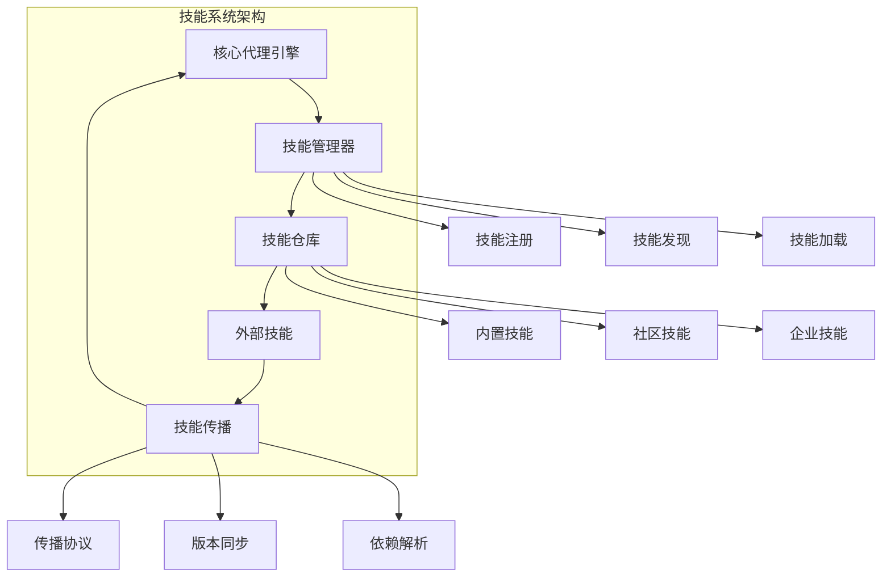
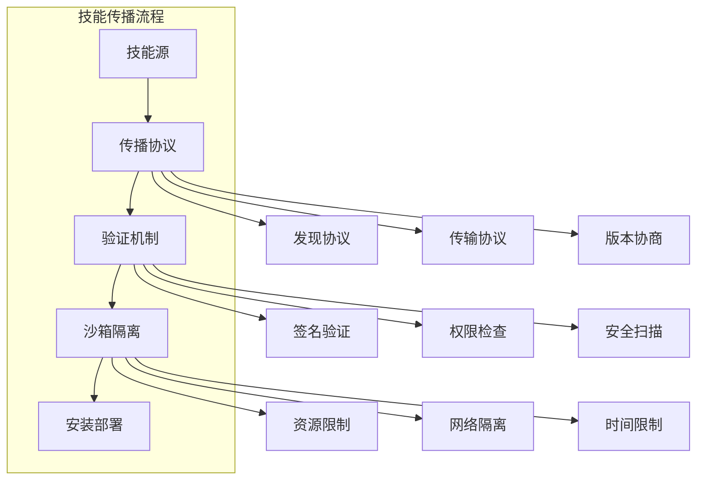

# 第13章: 技能系统与外部集成

## 学习目标

- 理解技能系统的架构和设计原理
- 掌握外部技能的集成和管理
- 学习技能传播和生命周期管理
- 构建可扩展的技能生态系统

## 13.1 技能系统基础

### 13.1.1 技能系统架构

技能系统为代理提供了动态扩展能力的机制，允许代理在运行时获取新技能和知识。



### 13.1.2 技能接口定义

```typescript
// src/skills/skill-interface.ts
export interface Skill {
  // 技能标识
  id: string;
  name: string;
  description: string;
  version: string;
  
  // 技能元数据
  category: SkillCategory;
  author: string;
  license: string;
  
  // 执行相关
  execute: (context: SkillContext) => Promise<SkillResult>;
  
  // 依赖和兼容性
  dependencies: SkillDependency[];
  compatibility: SkillCompatibility;
  
  // 配置
  config: SkillConfig;
  
  // 状态管理
  lifecycle: SkillLifecycle;
}

export enum SkillCategory {
  CODE_GENERATION = 'code_generation',
  DATA_PROCESSING = 'data_processing',
  ANALYSIS = 'analysis',
  COMMUNICATION = 'communication',
  AUTOMATION = 'automation',
  INTEGRATION = 'integration',
  CUSTOM = 'custom'
}

export interface SkillContext {
  agentId: string;
  sessionId: string;
  timestamp: number;
  
  // 输入数据
  input: any;
  params: Record<string, unknown>;
  
  // 上下文信息
  environment: 'development' | 'staging' | 'production';
  metadata: Record<string, unknown>;
  
  // 工具访问
  tools: ToolRegistry;
  
  // 状态访问
  state: StateManager;
}

export interface SkillResult {
  success: boolean;
  data?: any;
  error?: string;
  
  // 执行信息
  executionTime: number;
  memoryUsed?: number;
  
  // 元数据
  metadata?: Record<string, unknown>;
}

export interface SkillDependency {
  skillId: string;
  version: string;
  required: boolean;
}

export interface SkillCompatibility {
  minAgentVersion: string;
  maxAgentVersion?: string;
  platform: string[];
  features: string[];
}

export interface SkillConfig {
  // 执行配置
  timeout: number;
  maxRetries: number;
  
  // 资源配置
  maxMemory: number;
  maxCpuTime: number;
  
  // 缓存配置
  cacheable: boolean;
  cacheTTL: number;
  
  // 安全配置
  sandbox: boolean;
  permissions: string[];
}

export interface SkillLifecycle {
  installed: boolean;
  enabled: boolean;
  
  installDate?: string;
  lastUsed?: string;
  usageCount: number;
  
  status: SkillStatus;
}

export enum SkillStatus {
  AVAILABLE = 'available',
  INSTALLED = 'installed',
  ENABLED = 'enabled',
  DISABLED = 'disabled',
  ERROR = 'error',
  DEPRECATED = 'deprecated'
}
```

### 13.1.3 技能管理器实现

```typescript
// src/skills/skill-manager.ts
import { EventEmitter } from 'events';
import { Skill, SkillContext, SkillResult, SkillStatus } from './skill-interface';

export class SkillManager extends EventEmitter {
  private skills: Map<string, Skill> = new Map();
  private repositories: Map<string, SkillRepository> = new Map();
  private usageStats: Map<string, SkillUsageStats> = new Map();
  
  constructor() {
    super();
    this.initializeBuiltinSkills();
  }

  // 注册技能
  async registerSkill(skill: Skill): Promise<void> {
    // 验证技能
    const validation = await this.validateSkill(skill);
    if (!validation.valid) {
      throw new Error(`Skill validation failed: ${validation.errors.join(', ')}`);
    }

    // 检查依赖
    await this.checkDependencies(skill);

    // 注册技能
    this.skills.set(skill.id, skill);
    skill.lifecycle.status = SkillStatus.INSTALLED;
    skill.lifecycle.installDate = new Date().toISOString();

    this.emit('skillRegistered', skill);
  }

  // 注销技能
  async unregisterSkill(skillId: string): Promise<void> {
    const skill = this.skills.get(skillId);
    if (!skill) {
      throw new Error(`Skill ${skillId} not found`);
    }

    // 检查是否有其他技能依赖此技能
    const dependents = this.findDependents(skillId);
    if (dependents.length > 0) {
      throw new Error(`Cannot unregister skill ${skillId} - it is required by: ${dependents.join(', ')}`);
    }

    this.skills.delete(skillId);
    this.emit('skillUnregistered', skill);
  }

  // 执行技能
  async executeSkill(skillId: string, context: SkillContext): Promise<SkillResult> {
    const skill = this.skills.get(skillId);
    if (!skill) {
      throw new Error(`Skill ${skillId} not found`);
    }

    // 检查技能状态
    if (skill.lifecycle.status !== SkillStatus.ENABLED) {
      throw new Error(`Skill ${skillId} is not enabled`);
    }

    // 检查兼容性
    const compatibility = this.checkCompatibility(skill);
    if (!compatibility.compatible) {
      throw new Error(`Skill ${skillId} is not compatible: ${compatibility.reason}`);
    }

    const startTime = Date.now();
    const stats = this.getUsageStats(skillId);

    try {
      // 增加使用计数
      stats.executionCount++;
      stats.lastUsed = new Date().toISOString();

      // 执行技能
      const result = await this.executeWithTimeout(skill, context, skill.config.timeout);

      // 更新统计信息
      stats.successCount++;
      stats.totalExecutionTime += Date.now() - startTime;
      stats.averageExecutionTime = stats.totalExecutionTime / stats.executionCount;

      this.emit('skillExecuted', skill, result);
      return result;

    } catch (error) {
      // 更新错误统计
      stats.failureCount++;
      stats.lastError = {
        message: error instanceof Error ? error.message : 'Unknown error',
        timestamp: new Date().toISOString()
      };

      this.emit('skillExecutionFailed', skill, error);
      throw error;
    }
  }

  // 启用技能
  enableSkill(skillId: string): void {
    const skill = this.skills.get(skillId);
    if (skill) {
      skill.lifecycle.enabled = true;
      skill.lifecycle.status = SkillStatus.ENABLED;
      this.emit('skillEnabled', skill);
    }
  }

  // 禁用技能
  disableSkill(skillId: string): void {
    const skill = this.skills.get(skillId);
    if (skill) {
      skill.lifecycle.enabled = false;
      skill.lifecycle.status = SkillStatus.DISABLED;
      this.emit('skillDisabled', skill);
    }
  }

  // 获取技能信息
  getSkill(skillId: string): Skill | undefined {
    return this.skills.get(skillId);
  }

  // 列出所有技能
  listSkills(filter?: SkillFilter): Skill[] {
    let skills = Array.from(this.skills.values());

    if (filter) {
      skills = this.filterSkills(skills, filter);
    }

    return skills.sort((a, b) => a.name.localeCompare(b.name));
  }

  // 搜索技能
  searchSkills(query: string): Skill[] {
    const lowerQuery = query.toLowerCase();
    return this.listSkills().filter(skill => 
      skill.name.toLowerCase().includes(lowerQuery) ||
      skill.description.toLowerCase().includes(lowerQuery) ||
      skill.id.toLowerCase().includes(lowerQuery)
    );
  }

  // 添加技能仓库
  addRepository(repository: SkillRepository): void {
    this.repositories.set(repository.id, repository);
    this.emit('repositoryAdded', repository);
  }

  // 从仓库安装技能
  async installFromRepository(repositoryId: string, skillId: string): Promise<void> {
    const repository = this.repositories.get(repositoryId);
    if (!repository) {
      throw new Error(`Repository ${repositoryId} not found`);
    }

    const skill = await repository.downloadSkill(skillId);
    await this.registerSkill(skill);
  }

  // 更新技能
  async updateSkill(skillId: string): Promise<void> {
    const skill = this.skills.get(skillId);
    if (!skill) {
      throw new Error(`Skill ${skillId} not found`);
    }

    // 检查更新
    for (const repository of this.repositories.values()) {
      if (await repository.hasUpdate(skillId, skill.version)) {
        const updatedSkill = await repository.downloadSkill(skillId);
        
        // 保留使用统计
        const stats = this.getUsageStats(skillId);
        
        this.skills.set(skillId, updatedSkill);
        this.usageStats.set(skillId, stats);
        
        this.emit('skillUpdated', updatedSkill);
        break;
      }
    }
  }

  // 获取使用统计
  getUsageStats(skillId: string): SkillUsageStats {
    if (!this.usageStats.has(skillId)) {
      this.usageStats.set(skillId, {
        skillId,
        executionCount: 0,
        successCount: 0,
        failureCount: 0,
        totalExecutionTime: 0,
        averageExecutionTime: 0,
        lastUsed: undefined,
        lastError: undefined
      });
    }
    return this.usageStats.get(skillId)!;
  }

  // 验证技能
  private async validateSkill(skill: Skill): Promise<SkillValidationResult> {
    const errors: string[] = [];
    const warnings: string[] = [];

    // 基本验证
    if (!skill.id || !skill.name || !skill.version) {
      errors.push('Skill must have id, name, and version');
    }

    // 格式验证
    if (!this.isValidVersion(skill.version)) {
      errors.push('Invalid version format');
    }

    // 功能验证
    if (typeof skill.execute !== 'function') {
      errors.push('Skill must have an execute function');
    }

    return {
      valid: errors.length === 0,
      errors: errors.length > 0 ? errors : undefined,
      warnings: warnings.length > 0 ? warnings : undefined
    };
  }

  // 检查依赖
  private async checkDependencies(skill: Skill): Promise<void> {
    for (const dep of skill.dependencies) {
      const depSkill = this.skills.get(dep.skillId);
      
      if (!depSkill) {
        if (dep.required) {
          throw new Error(`Required dependency ${dep.skillId} not found`);
        }
      } else {
        // 检查版本兼容性
        if (!this.isVersionCompatible(depSkill.version, dep.version)) {
          throw new Error(`Dependency ${dep.skillId} version ${depSkill.version} is not compatible with required ${dep.version}`);
        }
      }
    }
  }

  // 查找依赖者
  private findDependents(skillId: string): string[] {
    const dependents: string[] = [];
    
    for (const skill of this.skills.values()) {
      if (skill.dependencies.some(dep => dep.skillId === skillId)) {
        dependents.push(skill.id);
      }
    }
    
    return dependents;
  }

  // 检查兼容性
  private checkCompatibility(skill: Skill): CompatibilityResult {
    // 简化实现
    return {
      compatible: true,
      reason: undefined
    };
  }

  // 带超时的执行
  private async executeWithTimeout(
    skill: Skill,
    context: SkillContext,
    timeout: number
  ): Promise<SkillResult> {
    return Promise.race([
      skill.execute(context),
      this.createTimeoutPromise(timeout)
    ]);
  }

  // 创建超时Promise
  private createTimeoutPromise(timeout: number): Promise<never> {
    return new Promise((_, reject) => {
      setTimeout(() => reject(new Error(`Skill execution timeout after ${timeout}ms`)), timeout);
    });
  }

  // 初始化内置技能
  private initializeBuiltinSkills(): void {
    // 注册内置技能
  }

  // 版本格式验证
  private isValidVersion(version: string): boolean {
    return /^\d+\.\d+\.\d+$/.test(version);
  }

  // 版本兼容性检查
  private isVersionCompatible(current: string, required: string): boolean {
    // 简化实现，使用语义化版本比较
    return current === required;
  }

  // 技能过滤
  private filterSkills(skills: Skill[], filter: SkillFilter): Skill[] {
    return skills.filter(skill => {
      if (filter.category && skill.category !== filter.category) {
        return false;
      }
      if (filter.status && skill.lifecycle.status !== filter.status) {
        return false;
      }
      if (filter.enabled !== undefined && skill.lifecycle.enabled !== filter.enabled) {
        return false;
      }
      return true;
    });
  }
}

// 技能仓库接口
export interface SkillRepository {
  id: string;
  name: string;
  url: string;
  
  listSkills(): Promise<SkillInfo[]>;
  downloadSkill(skillId: string): Promise<Skill>;
  hasUpdate(skillId: string, currentVersion: string): Promise<boolean>;
}

// 技能信息接口
export interface SkillInfo {
  id: string;
  name: string;
  description: string;
  version: string;
  category: SkillCategory;
}

// 使用统计接口
export interface SkillUsageStats {
  skillId: string;
  executionCount: number;
  successCount: number;
  failureCount: number;
  totalExecutionTime: number;
  averageExecutionTime: number;
  lastUsed?: string;
  lastError?: {
    message: string;
    timestamp: string;
  };
}

// 技能过滤器接口
export interface SkillFilter {
  category?: SkillCategory;
  status?: SkillStatus;
  enabled?: boolean;
}

// 验证结果接口
export interface SkillValidationResult {
  valid: boolean;
  errors?: string[];
  warnings?: string[];
}

// 兼容性结果接口
export interface CompatibilityResult {
  compatible: boolean;
  reason?: string;
}
```

## 13.2 外部技能集成

### 13.2.1 技能传播机制



### 13.2.2 外部技能加载器

```typescript
// src/skills/external-skill-loader.ts
import { Skill, SkillStatus } from './skill-interface';
import { SkillManager } from './skill-manager';

export interface ExternalSkillConfig {
  source: SkillSource;
  validation: ValidationConfig;
  sandbox: SandboxConfig;
  caching: CacheConfig;
}

export interface SkillSource {
  type: 'git' | 'npm' | 'http' | 'file';
  location: string;
  branch?: string;
  version?: string;
}

export interface ValidationConfig {
  verifySignature: boolean;
  checkVulnerabilities: boolean;
  requireManifest: boolean;
  allowedDomains?: string[];
}

export interface SandboxConfig {
  enable: boolean;
  maxMemory: number;
  maxCpuTime: number;
  networkAccess: boolean;
  filesystemAccess: string[];
}

export interface CacheConfig {
  enable: boolean;
  ttl: number;
  maxSize: number;
}

export class ExternalSkillLoader {
  private skillManager: SkillManager;
  private cache: Map<string, CachedSkill> = new Map();
  private config: ExternalSkillConfig;

  constructor(skillManager: SkillManager, config: ExternalSkillConfig) {
    this.skillManager = skillManager;
    this.config = config;
  }

  // 加载外部技能
  async loadSkill(source: SkillSource): Promise<Skill> {
    const cacheKey = this.generateCacheKey(source);

    // 检查缓存
    if (this.config.caching.enable) {
      const cached = this.cache.get(cacheKey);
      if (cached && !this.isCacheExpired(cached)) {
        return cached.skill;
      }
    }

    // 下载技能
    const skillCode = await this.downloadSkill(source);
    
    // 验证技能
    await this.validateSkill(skillCode, source);
    
    // 创建技能实例
    const skill = await this.createSkillInstance(skillCode);
    
    // 缓存技能
    if (this.config.caching.enable) {
      this.cache.set(cacheKey, {
        skill,
        cachedAt: Date.now(),
        ttl: this.config.caching.ttl
      });
    }

    return skill;
  }

  // 批量加载技能
  async loadSkills(sources: SkillSource[]): Promise<Skill[]> {
    const skills: Skill[] = [];
    const errors: Array<{ source: SkillSource; error: string }> = [];

    for (const source of sources) {
      try {
        const skill = await this.loadSkill(source);
        skills.push(skill);
      } catch (error) {
        errors.push({
          source,
          error: error instanceof Error ? error.message : 'Unknown error'
        });
      }
    }

    if (errors.length > 0) {
      console.warn(`Failed to load ${errors.length} skills:`, errors);
    }

    return skills;
  }

  // 下载技能
  private async downloadSkill(source: SkillSource): Promise<string> {
    switch (source.type) {
      case 'git':
        return await this.downloadFromGit(source);
      case 'npm':
        return await this.downloadFromNpm(source);
      case 'http':
        return await this.downloadFromHttp(source);
      case 'file':
        return await this.loadFromFile(source);
      default:
        throw new Error(`Unsupported source type: ${source.type}`);
    }
  }

  // 从Git下载
  private async downloadFromGit(source: SkillSource): Promise<string> {
    const { execSync } = await import('child_process');
    const path = await import('path');
    const fs = await import('fs/promises');

    // 创建临时目录
    const tempDir = path.join('.swarm', 'temp', `skill-${Date.now()}`);
    await fs.mkdir(tempDir, { recursive: true });

    try {
      // 克隆仓库
      const branch = source.branch ? `-b ${source.branch}` : '';
      execSync(`git clone ${branch} ${source.location} ${tempDir}`, {
        stdio: 'inherit'
      });

      // 读取技能文件
      const skillFile = path.join(tempDir, 'skill.ts');
      const skillCode = await fs.readFile(skillFile, 'utf-8');

      return skillCode;
    } finally {
      // 清理临时目录
      await fs.rm(tempDir, { recursive: true, force: true });
    }
  }

  // 从NPM下载
  private async downloadFromNpm(source: SkillSource): Promise<string> {
    const { execSync } = await import('child_process');
    const path = await import('path');
    const fs = await import('fs/promises');

    const tempDir = path.join('.swarm', 'temp', `skill-${Date.now()}`);
    await fs.mkdir(tempDir, { recursive: true });

    try {
      // 安装包
      const version = source.version ? `@${source.version}` : '';
      execSync(`npm install ${source.location}${version} --prefix ${tempDir}`, {
        stdio: 'inherit'
      });

      // 读取技能文件
      const skillPath = path.join(tempDir, 'node_modules', source.location, 'skill.ts');
      const skillCode = await fs.readFile(skillPath, 'utf-8');

      return skillCode;
    } finally {
      await fs.rm(tempDir, { recursive: true, force: true });
    }
  }

  // 从HTTP下载
  private async downloadFromHttp(source: SkillSource): Promise<string> {
    const response = await fetch(source.location);
    
    if (!response.ok) {
      throw new Error(`HTTP ${response.status}: ${response.statusText}`);
    }

    return await response.text();
  }

  // 从文件加载
  private async loadFromFile(source: SkillSource): Promise<string> {
    const fs = await import('fs/promises');
    return await fs.readFile(source.location, 'utf-8');
  }

  // 验证技能
  private async validateSkill(skillCode: string, source: SkillSource): Promise<void> {
    // 安全扫描
    if (this.config.validation.checkVulnerabilities) {
      await this.scanForVulnerabilities(skillCode);
    }

    // 签名验证
    if (this.config.validation.verifySignature) {
      await this.verifySignature(skillCode, source);
    }

    // 清单检查
    if (this.config.validation.requireManifest) {
      await this.checkManifest(skillCode);
    }
  }

  // 漏洞扫描
  private async scanForVulnerabilities(skillCode: string): Promise<void> {
    // 检查危险模式
    const dangerousPatterns = [
      /eval\s*\(/gi,
      /new\s+Function\s*\(/gi,
      /require\s*\(\s*['"`]\s*\.\s*['"`]/gi,
      /child_process\.exec\s*\(/gi,
      /fs\.\w+\s*\(\s*['"`]\s*\.\s*['"`]/gi
    ];

    for (const pattern of dangerousPatterns) {
      if (pattern.test(skillCode)) {
        throw new Error(`Potential security vulnerability detected: ${pattern.source}`);
      }
    }
  }

  // 签名验证
  private async verifySignature(skillCode: string, source: SkillSource): Promise<void> {
    // 简化实现，实际应该使用加密库验证签名
    console.log('Signature verification skipped in this implementation');
  }

  // 清单检查
  private async checkManifest(skillCode: string): Promise<void> {
    // 检查是否包含必需的清单文件
    const hasManifest = /export\s+const\s+manifest\s*=/i.test(skillCode);
    
    if (!hasManifest) {
      throw new Error('Skill manifest is missing');
    }
  }

  // 创建技能实例
  private async createSkillInstance(skillCode: string): Promise<Skill> {
    // 在沙箱中执行代码
    if (this.config.sandbox.enable) {
      return await this.executeInSandbox(skillCode);
    } else {
      return await this.executeDirectly(skillCode);
    }
  }

  // 在沙箱中执行
  private async executeInSandbox(skillCode: string): Promise<Skill> {
    // 使用VM模块创建隔离环境
    const { Script } = await import('vm');
    
    const script = new Script(skillCode);
    const context = this.createSandboxContext();
    
    try {
      script.runInContext(context, {
        timeout: this.config.sandbox.maxCpuTime,
        displayErrors: true
      });
      
      return context.skill as Skill;
    } catch (error) {
      throw new Error(`Sandbox execution failed: ${error instanceof Error ? error.message : 'Unknown error'}`);
    }
  }

  // 直接执行
  private async executeDirectly(skillCode: string): Promise<Skill> {
    try {
      // 动态导入模块
      const module = await import(`data:text/typescript;base64,${Buffer.from(skillCode).toString('base64')}`);
      return module.default as Skill;
    } catch (error) {
      throw new Error(`Direct execution failed: ${error instanceof Error ? error.message : 'Unknown error'}`);
    }
  }

  // 创建沙箱上下文
  private createSandboxContext(): any {
    const vm = require('vm');
    const util = require('util');
    
    return vm.createContext({
      console: {
        log: (...args: any[]) => console.log('[Skill]', ...args),
        error: (...args: any[]) => console.error('[Skill]', ...args),
        warn: (...args: any[]) => console.warn('[Skill]', ...args)
      },
      require: (module: string) => {
        // 限制可导入的模块
        const allowedModules = ['util', 'crypto', 'buffer'];
        if (allowedModules.includes(module)) {
          return require(module);
        }
        throw new Error(`Module ${module} is not allowed in sandbox`);
      },
      exports: {},
      module: { exports: {} },
      Buffer,
      setTimeout,
      clearTimeout,
      setInterval,
      clearInterval
    });
  }

  // 生成缓存键
  private generateCacheKey(source: SkillSource): string {
    return `${source.type}:${source.location}:${source.version || 'latest'}`;
  }

  // 检查缓存是否过期
  private isCacheExpired(cached: CachedSkill): boolean {
    return Date.now() - cached.cachedAt > cached.ttl;
  }
}

// 缓存的技能接口
interface CachedSkill {
  skill: Skill;
  cachedAt: number;
  ttl: number;
}
```

## 13.3 技能传播与同步

### 13.3.1 传播协议实现

```typescript
// src/skills/skill-propagation.ts
import { EventEmitter } from 'events';
import { Skill, SkillStatus } from './skill-interface';

export interface PropagationConfig {
  syncInterval: number;
  maxRetries: number;
  retryDelay: number;
  
  sources: PropagationSource[];
  targets: PropagationTarget[];
  
  filter: SkillFilter;
  strategy: PropagationStrategy;
}

export interface PropagationSource {
  type: 'repository' | 'peer' | 'cloud';
  location: string;
  credentials?: Record<string, string>;
}

export interface PropagationTarget {
  type: 'local' | 'peer' | 'cloud';
  location: string;
  credentials?: Record<string, string>;
}

export interface SkillFilter {
  categories: string[];
  minVersion?: string;
  excludeIds?: string[];
}

export enum PropagationStrategy {
  PULL = 'pull',
  PUSH = 'push',
  BIDIRECTIONAL = 'bidirectional'
}

export class SkillPropagationService extends EventEmitter {
  private config: PropagationConfig;
  private syncTimer: NodeJS.Timeout | null = null;
  private syncing: boolean = false;

  constructor(config: PropagationConfig) {
    super();
    this.config = config;
  }

  // 启动传播服务
  start(): void {
    if (this.syncTimer) {
      return;
    }

    this.syncTimer = setInterval(() => {
      this.sync().catch(error => {
        this.emit('syncError', error);
      });
    }, this.config.syncInterval);

    this.emit('serviceStarted');
  }

  // 停止传播服务
  stop(): void {
    if (this.syncTimer) {
      clearInterval(this.syncTimer);
      this.syncTimer = null;
    }

    this.emit('serviceStopped');
  }

  // 同步技能
  async sync(): Promise<SyncResult> {
    if (this.syncing) {
      throw new Error('Sync already in progress');
    }

    this.syncing = true;
    const startTime = Date.now();

    try {
      this.emit('syncStarted');

      let result: SyncResult = {
        success: true,
        skillsProcessed: 0,
        skillsInstalled: 0,
        skillsUpdated: 0,
        skillsFailed: 0,
        duration: 0
      };

      // 根据策略执行同步
      switch (this.config.strategy) {
        case PropagationStrategy.PULL:
          result = await this.pullSkills();
          break;
        case PropagationStrategy.PUSH:
          result = await this.pushSkills();
          break;
        case PropagationStrategy.BIDIRECTIONAL:
          result = await this.bidirectionalSync();
          break;
      }

      result.duration = Date.now() - startTime;

      if (result.success) {
        this.emit('syncCompleted', result);
      } else {
        this.emit('syncFailed', result);
      }

      return result;

    } finally {
      this.syncing = false;
    }
  }

  // 拉取技能
  private async pullSkills(): Promise<SyncResult> {
    const result: SyncResult = {
      success: true,
      skillsProcessed: 0,
      skillsInstalled: 0,
      skillsUpdated: 0,
      skillsFailed: 0,
      duration: 0
    };

    for (const source of this.config.sources) {
      try {
        const skills = await this.fetchFromSource(source);
        
        for (const skill of skills) {
          result.skillsProcessed++;
          
          if (this.shouldIncludeSkill(skill)) {
            const installResult = await this.installOrUpdateSkill(skill);
            
            if (installResult.success) {
              if (installResult.installed) {
                result.skillsInstalled++;
              } else if (installResult.updated) {
                result.skillsUpdated++;
              }
            } else {
              result.skillsFailed++;
            }
          }
        }
      } catch (error) {
        console.error(`Failed to pull from source ${source.location}:`, error);
        result.success = false;
      }
    }

    return result;
  }

  // 推送技能
  private async pushSkills(): Promise<SyncResult> {
    const result: SyncResult = {
      success: true,
      skillsProcessed: 0,
      skillsInstalled: 0,
      skillsUpdated: 0,
      skillsFailed: 0,
      duration: 0
    };

    // 获取本地技能
    const localSkills = await this.getLocalSkills();

    for (const target of this.config.targets) {
      try {
        for (const skill of localSkills) {
          if (this.shouldIncludeSkill(skill)) {
            result.skillsProcessed++;
            
            const pushResult = await this.pushToTarget(skill, target);
            
            if (pushResult.success) {
              result.skillsInstalled++;
            } else {
              result.skillsFailed++;
            }
          }
        }
      } catch (error) {
        console.error(`Failed to push to target ${target.location}:`, error);
        result.success = false;
      }
    }

    return result;
  }

  // 双向同步
  private async bidirectionalSync(): Promise<SyncResult> {
    // 先拉取，再推送
    const pullResult = await this.pullSkills();
    const pushResult = await this.pushSkills();

    return {
      success: pullResult.success && pushResult.success,
      skillsProcessed: pullResult.skillsProcessed + pushResult.skillsProcessed,
      skillsInstalled: pullResult.skillsInstalled + pushResult.skillsInstalled,
      skillsUpdated: pullResult.skillsUpdated + pushResult.skillsUpdated,
      skillsFailed: pullResult.skillsFailed + pushResult.skillsFailed,
      duration: 0
    };
  }

  // 从源获取技能
  private async fetchFromSource(source: PropagationSource): Promise<Skill[]> {
    switch (source.type) {
      case 'repository':
        return await this.fetchFromRepository(source);
      case 'peer':
        return await this.fetchFromPeer(source);
      case 'cloud':
        return await this.fetchFromCloud(source);
      default:
        throw new Error(`Unsupported source type: ${source.type}`);
    }
  }

  // 从仓库获取
  private async fetchFromRepository(source: PropagationSource): Promise<Skill[]> {
    // 实现从仓库获取技能的逻辑
    return [];
  }

  // 从对等节点获取
  private async fetchFromPeer(source: PropagationSource): Promise<Skill[]> {
    // 实现从对等节点获取技能的逻辑
    return [];
  }

  // 从云端获取
  private async fetchFromCloud(source: PropagationSource): Promise<Skill[]> {
    // 实现从云端获取技能的逻辑
    return [];
  }

  // 推送到目标
  private async pushToTarget(skill: Skill, target: PropagationTarget): Promise<{ success: boolean }> {
    switch (target.type) {
      case 'peer':
        return await this.pushToPeer(skill, target);
      case 'cloud':
        return await this.pushToCloud(skill, target);
      default:
        throw new Error(`Unsupported target type: ${target.type}`);
    }
  }

  // 推送到对等节点
  private async pushToPeer(skill: Skill, target: PropagationTarget): Promise<{ success: boolean }> {
    // 实现推送到对等节点的逻辑
    return { success: true };
  }

  // 推送到云端
  private async pushToCloud(skill: Skill, target: PropagationTarget): Promise<{ success: boolean }> {
    // 实现推送到云端的逻辑
    return { success: true };
  }

  // 获取本地技能
  private async getLocalSkills(): Promise<Skill[]> {
    // 返回本地技能列表
    return [];
  }

  // 检查是否应该包含技能
  private shouldIncludeSkill(skill: Skill): boolean {
    // 检查类别过滤
    if (this.config.filter.categories.length > 0) {
      if (!this.config.filter.categories.includes(skill.category)) {
        return false;
      }
    }

    // 检查版本过滤
    if (this.config.filter.minVersion) {
      if (!this.isVersionCompatible(skill.version, this.config.filter.minVersion)) {
        return false;
      }
    }

    // 检查排除列表
    if (this.config.filter.excludeIds) {
      if (this.config.filter.excludeIds.includes(skill.id)) {
        return false;
      }
    }

    return true;
  }

  // 安装或更新技能
  private async installOrUpdateSkill(skill: Skill): Promise<{
    success: boolean;
    installed: boolean;
    updated: boolean;
  }> {
    // 实现安装或更新逻辑
    return {
      success: true,
      installed: false,
      updated: false
    };
  }

  // 版本兼容性检查
  private isVersionCompatible(current: string, min: string): boolean {
    // 简化实现
    return current >= min;
  }
}

// 同步结果接口
export interface SyncResult {
  success: boolean;
  skillsProcessed: number;
  skillsInstalled: number;
  skillsUpdated: number;
  skillsFailed: number;
  duration: number;
}
```

## 13.4 实际应用示例

### 13.4.1 创建自定义技能

```typescript
// examples/custom-skills/code-generator-skill.ts
import { Skill, SkillContext, SkillResult, SkillCategory } from '../../src/skills/skill-interface';

export const codeGeneratorSkill: Skill = {
  id: 'code-generator-v1',
  name: 'Code Generator',
  description: 'Generates code snippets based on natural language descriptions',
  version: '1.0.0',
  category: SkillCategory.CODE_GENERATION,
  author: 'Your Team',
  license: 'MIT',
  
  dependencies: [
    {
      skillId: 'syntax-analyzer',
      version: '1.0.0',
      required: true
    }
  ],
  
  compatibility: {
    minAgentVersion: '1.0.0',
    platform: ['node', 'browser'],
    features: ['typescript', 'javascript', 'python']
  },
  
  config: {
    timeout: 30000,
    maxRetries: 3,
    maxMemory: 512 * 1024 * 1024, // 512MB
    maxCpuTime: 10000,
    cacheable: true,
    cacheTTL: 3600000, // 1小时
    sandbox: true,
    permissions: ['file:read', 'network:request']
  },
  
  lifecycle: {
    installed: false,
    enabled: false,
    usageCount: 0,
    status: SkillStatus.AVAILABLE
  },
  
  async execute(context: SkillContext): Promise<SkillResult> {
    const startTime = Date.now();
    
    try {
      const { description, language, style } = context.params;
      
      // 验证输入
      if (!description || !language) {
        throw new Error('Description and language are required');
      }
      
      // 生成代码
      const code = await this.generateCode(description, language, style);
      
      // 语法分析
      const syntaxCheck = await context.tools.useTool('syntax-analyzer', {
        code,
        language
      });
      
      if (!syntaxCheck.success) {
        throw new Error(`Generated code has syntax errors: ${syntaxCheck.error}`);
      }
      
      return {
        success: true,
        data: {
          code,
          language,
          syntaxValid: true,
          generatedAt: new Date().toISOString()
        },
        executionTime: Date.now() - startTime,
        metadata: {
          description,
          style: style || 'default'
        }
      };
      
    } catch (error) {
      return {
        success: false,
        error: error instanceof Error ? error.message : 'Unknown error',
        executionTime: Date.now() - startTime
      };
    }
  },
  
  async generateCode(description: string, language: string, style?: string): Promise<string> {
    // 实现代码生成逻辑
    // 这里可以集成AI模型或代码生成引擎
    
    return `// Generated code for: ${description}\n// Language: ${language}\n// Style: ${style || 'default'}\n\n`;
  }
};

export default codeGeneratorSkill;
```

## 13.5 本章小结

### 关键要点

- **技能系统架构**: 技能管理器、技能仓库、外部技能集成
- **技能传播**: 拉取/推送策略、双向同步、依赖解析
- **安全机制**: 签名验证、漏洞扫描、沙箱隔离
- **可扩展性**: 技能注册、动态加载、版本管理

### 最佳实践

1. **设计可重用的技能** - 专注于单一职责，提高复用性
2. **实施严格的验证** - 确保外部技能的安全性和可靠性
3. **使用沙箱隔离** - 防止恶意代码影响系统安全
4. **优化缓存策略** - 提高技能加载和执行性能
5. **监控技能使用** - 收集统计数据，优化技能质量

### 下一步学习

现在你已经掌握了技能系统的核心技术，接下来我们将：

- 📖 **第14章**: 学习记忆与知识管理
- 🔧 **实践**: 构建智能记忆系统
- 🎯 **目标**: 理解知识存储和检索机制

---

**准备好探索记忆管理的奇妙世界了吗？** 🧠
