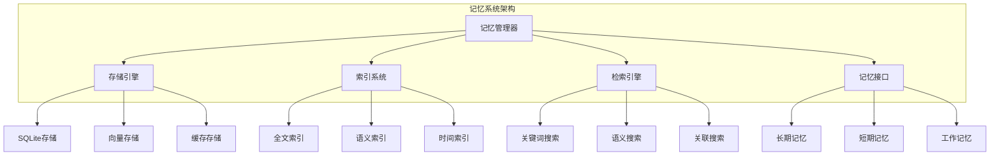

# 第14章: 记忆与知识管理

## 学习目标

- 理解记忆系统的架构和设计原理
- 掌握SQLite数据库集成和操作
- 学习知识存储和检索机制
- 构建高效的记忆管理系统

## 14.1 记忆系统基础

### 14.1.1 记忆系统架构

记忆系统为代理提供了持久化知识存储和检索的能力，支持长期记忆和短期记忆两种模式。



### 14.1.2 记忆接口定义

```typescript
// src/memory/memory-interface.ts
export interface Memory {
  id: string;
  type: MemoryType;
  content: MemoryContent;
  metadata: MemoryMetadata;
  
  // 时间信息
  createdAt: number;
  updatedAt: number;
  accessedAt: number;
  
  // 关联信息
  associations: string[];
  tags: string[];
  
  // 访问控制
  accessCount: number;
  importance: number;
  expiration?: number;
}

export enum MemoryType {
  FACTUAL = 'factual',           // 事实性记忆
  PROCEDURAL = 'procedural',     // 程序性记忆
  EPISODIC = 'episodic',         // 情景记忆
  SEMANTIC = 'semantic',         // 语义记忆
  WORKING = 'working',           // 工作记忆
  CACHE = 'cache'               // 缓存记忆
}

export interface MemoryContent {
  text?: string;
  data?: any;
  embedding?: number[];
  summary?: string;
  keywords?: string[];
}

export interface MemoryMetadata {
  source: string;
  confidence: number;
  verified: boolean;
  
  // 分类信息
  category?: string;
  topic?: string;
  
  // 质量信息
  quality: number;
  relevance: number;
  
  // 自定义字段
  custom?: Record<string, unknown>;
}

export interface MemoryQuery {
  // 查询条件
  text?: string;
  embedding?: number[];
  tags?: string[];
  types?: MemoryType[];
  
  // 时间范围
  createdAfter?: number;
  createdBefore?: number;
  accessedAfter?: number;
  
  // 质量要求
  minConfidence?: number;
  minQuality?: number;
  minImportance?: number;
  
  // 结果控制
  limit?: number;
  offset?: number;
  sortBy?: MemorySortBy;
  sortOrder?: 'asc' | 'desc';
}

export enum MemorySortBy {
  CREATED_AT = 'createdAt',
  UPDATED_AT = 'updatedAt',
  ACCESSED_AT = 'accessedAt',
  IMPORTANCE = 'importance',
  QUALITY = 'quality',
  RELEVANCE = 'relevance'
}

export interface MemoryResult {
  memories: Memory[];
  totalCount: number;
  queryTime: number;
  
  // 统计信息
  avgConfidence: number;
  avgQuality: number;
  avgRelevance: number;
}

export interface MemoryStats {
  totalMemories: number;
  memoriesByType: Record<MemoryType, number>;
  totalSize: number;
  
  // 访问统计
  totalAccesses: number;
  avgAccessCount: number;
  
  // 质量统计
  avgQuality: number;
  avgConfidence: number;
  avgImportance: number;
}
```

### 14.1.3 记忆管理器实现

```typescript
// src/memory/memory-manager.ts
import { EventEmitter } from 'events';
import Database from 'better-sqlite3';
import { Memory, MemoryType, MemoryQuery, MemoryResult, MemoryStats } from './memory-interface';

export class MemoryManager extends EventEmitter {
  private db: Database.Database;
  private cache: Map<string, Memory> = new Map();
  private cacheSize: number = 1000;
  private initialized: boolean = false;

  constructor(dbPath: string = '.swarm/memory.db') {
    super();
    this.db = new Database(dbPath);
    this.initialize();
  }

  // 初始化数据库
  private initialize(): void {
    if (this.initialized) return;

    // 创建表结构
    this.db.exec(`
      CREATE TABLE IF NOT EXISTS memories (
        id TEXT PRIMARY KEY,
        type TEXT NOT NULL,
        content TEXT NOT NULL,
        metadata TEXT NOT NULL,
        created_at INTEGER NOT NULL,
        updated_at INTEGER NOT NULL,
        accessed_at INTEGER NOT NULL,
        importance REAL DEFAULT 0.5,
        access_count INTEGER DEFAULT 0,
        expiration INTEGER,
        tags TEXT,
        associations TEXT
      );

      CREATE INDEX IF NOT EXISTS idx_memories_type ON memories(type);
      CREATE INDEX IF NOT EXISTS idx_memories_created ON memories(created_at);
      CREATE INDEX IF NOT EXISTS idx_memories_importance ON memories(importance);
      CREATE INDEX IF NOT EXISTS idx_memories_tags ON memories(tags);

      CREATE VIRTUAL TABLE IF NOT EXISTS memories_fts USING fts5(
        id, content, content_rowid='rowid'
      );

      CREATE TABLE IF NOT EXISTS memory_embeddings (
        memory_id TEXT PRIMARY KEY,
        embedding BLOB NOT NULL,
        FOREIGN KEY (memory_id) REFERENCES memories(id) ON DELETE CASCADE
      );

      CREATE INDEX IF NOT EXISTS idx_embeddings_memory ON memory_embeddings(memory_id);
    `);

    this.initialized = true;
  }

  // 存储记忆
  async store(memory: Memory): Promise<void> {
    const now = Date.now();
    
    // 设置时间戳
    if (!memory.createdAt) {
      memory.createdAt = now;
    }
    memory.updatedAt = now;
    memory.accessedAt = now;

    // 序列化数据
    const content = JSON.stringify(memory.content);
    const metadata = JSON.stringify(memory.metadata);
    const tags = JSON.stringify(memory.tags);
    const associations = JSON.stringify(memory.associations);

    // 存储到数据库
    const stmt = this.db.prepare(`
      INSERT OR REPLACE INTO memories 
      (id, type, content, metadata, created_at, updated_at, accessed_at, 
       importance, access_count, expiration, tags, associations)
      VALUES (?, ?, ?, ?, ?, ?, ?, ?, ?, ?, ?, ?)
    `);

    stmt.run(
      memory.id,
      memory.type,
      content,
      metadata,
      memory.createdAt,
      memory.updatedAt,
      memory.accessedAt,
      memory.importance,
      memory.accessCount,
      memory.expiration || null,
      tags,
      associations
    );

    // 更新全文搜索索引
    const ftsStmt = this.db.prepare(`
      INSERT OR REPLACE INTO memories_fts (id, content)
      VALUES (?, ?)
    `);
    ftsStmt.run(memory.id, content);

    // 存储向量嵌入
    if (memory.content.embedding) {
      await this.storeEmbedding(memory.id, memory.content.embedding);
    }

    // 更新缓存
    this.updateCache(memory);

    this.emit('memoryStored', memory);
  }

  // 检索记忆
  async retrieve(query: MemoryQuery): Promise<MemoryResult> {
    const startTime = Date.now();

    // 构建SQL查询
    const sql = this.buildQuery(query);
    const stmt = this.db.prepare(sql);
    
    // 执行查询
    const memories: Memory[] = stmt.all(...this.getQueryParams(query)).map(row => 
      this.deserializeMemory(row as any)
    );

    // 应用向量搜索
    if (query.embedding) {
      const vectorResults = await this.vectorSearch(query.embedding, query.limit || 10);
      memories.push(...vectorResults);
    }

    // 去重和排序
    const uniqueMemories = this.deduplicateMemories(memories);
    const sortedMemories = this.sortMemories(uniqueMemories, query);

    // 限制结果数量
    const limitedMemories = sortedMemories.slice(
      query.offset || 0,
      (query.offset || 0) + (query.limit || 100)
    );

    // 更新访问统计
    for (const memory of limitedMemories) {
      await this.updateAccessStats(memory.id);
    }

    const queryTime = Date.now() - startTime;

    return {
      memories: limitedMemories,
      totalCount: uniqueMemories.length,
      queryTime,
      ...this.calculateStats(limitedMemories)
    };
  }

  // 获取单个记忆
  async get(id: string): Promise<Memory | null> {
    // 检查缓存
    const cached = this.cache.get(id);
    if (cached) {
      // 更新访问统计
      await this.updateAccessStats(id);
      return cached;
    }

    // 从数据库查询
    const stmt = this.db.prepare('SELECT * FROM memories WHERE id = ?');
    const row = stmt.get(id) as any;

    if (!row) {
      return null;
    }

    const memory = this.deserializeMemory(row);
    
    // 更新缓存
    this.updateCache(memory);
    
    // 更新访问统计
    await this.updateAccessStats(id);

    return memory;
  }

  // 更新记忆
  async update(memory: Partial<Memory> & { id: string }): Promise<void> {
    const existing = await this.get(memory.id);
    if (!existing) {
      throw new Error(`Memory ${memory.id} not found`);
    }

    const updated: Memory = {
      ...existing,
      ...memory,
      updatedAt: Date.now()
    };

    await this.store(updated);
    this.emit('memoryUpdated', updated);
  }

  // 删除记忆
  async delete(id: string): Promise<void> {
    const stmt = this.db.prepare('DELETE FROM memories WHERE id = ?');
    stmt.run(id);

    // 删除相关数据
    const embedStmt = this.db.prepare('DELETE FROM memory_embeddings WHERE memory_id = ?');
    embedStmt.run(id);

    // 清除缓存
    this.cache.delete(id);

    this.emit('memoryDeleted', id);
  }

  // 搜索记忆
  async search(text: string, options?: SearchOptions): Promise<MemoryResult> {
    const query: MemoryQuery = {
      text,
      limit: options?.limit || 100,
      offset: options?.offset || 0,
      sortBy: options?.sortBy,
      sortOrder: options?.sortOrder
    };

    return await this.retrieve(query);
  }

  // 语义搜索
  async semanticSearch(embedding: number[], options?: SearchOptions): Promise<MemoryResult> {
    const memories = await this.vectorSearch(embedding, options?.limit || 100);
    
    return {
      memories,
      totalCount: memories.length,
      queryTime: 0,
      ...this.calculateStats(memories)
    };
  }

  // 获取统计信息
  getStats(): MemoryStats {
    const totalStmt = this.db.prepare('SELECT COUNT(*) as count FROM memories');
    const totalResult = totalStmt.get() as { count: number };

    const typeStmt = this.db.prepare('SELECT type, COUNT(*) as count FROM memories GROUP BY type');
    const typeResults = typeStmt.all() as Array<{ type: string; count: number }>;

    const accessStmt = this.db.prepare('SELECT AVG(access_count) as avg_access, SUM(access_count) as total_access FROM memories');
    const accessResult = accessStmt.get() as { avg_access: number; total_access: number };

    const qualityStmt = this.db.prepare(`
      SELECT AVG(CAST(JSON_EXTRACT(metadata, '$.quality') AS REAL)) as avg_quality,
             AVG(CAST(JSON_EXTRACT(metadata, '$.confidence') AS REAL)) as avg_confidence,
             AVG(importance) as avg_importance
      FROM memories
    `);
    const qualityResult = qualityStmt.get() as { avg_quality: number; avg_confidence: number; avg_importance: number };

    const memoriesByType: Record<MemoryType, number> = {
      [MemoryType.FACTUAL]: 0,
      [MemoryType.PROCEDURAL]: 0,
      [MemoryType.EPISODIC]: 0,
      [MemoryType.SEMANTIC]: 0,
      [MemoryType.WORKING]: 0,
      [MemoryType.CACHE]: 0
    };

    for (const result of typeResults) {
      memoriesByType[result.type as MemoryType] = result.count;
    }

    return {
      totalMemories: totalResult.count,
      memoriesByType,
      totalSize: 0, // 需要计算实际存储大小
      totalAccesses: accessResult.total_access || 0,
      avgAccessCount: accessResult.avg_access || 0,
      avgQuality: qualityResult.avg_quality || 0,
      avgConfidence: qualityResult.avg_confidence || 0,
      avgImportance: qualityResult.avg_importance || 0
    };
  }

  // 清理过期记忆
  async cleanup(): Promise<number> {
    const now = Date.now();
    const stmt = this.db.prepare('DELETE FROM memories WHERE expiration < ?');
    const result = stmt.run(now);

    // 清理缓存
    this.cleanupCache();

    return result.changes;
  }

  // 关闭数据库连接
  close(): void {
    this.db.close();
  }

  // 构建查询SQL
  private buildQuery(query: MemoryQuery): string {
    let sql = 'SELECT * FROM memories WHERE 1=1';
    const params: any[] = [];

    // 类型过滤
    if (query.types && query.types.length > 0) {
      sql += ` AND type IN (${query.types.map(() => '?').join(',')})`;
      params.push(...query.types);
    }

    // 时间范围过滤
    if (query.createdAfter) {
      sql += ' AND created_at >= ?';
      params.push(query.createdAfter);
    }

    if (query.createdBefore) {
      sql += ' AND created_at <= ?';
      params.push(query.createdBefore);
    }

    // 质量过滤
    if (query.minConfidence) {
      sql += ` AND CAST(JSON_EXTRACT(metadata, '$.confidence') AS REAL) >= ?`;
      params.push(query.minConfidence);
    }

    if (query.minQuality) {
      sql += ` AND CAST(JSON_EXTRACT(metadata, '$.quality') AS REAL) >= ?`;
      params.push(query.minQuality);
    }

    if (query.minImportance) {
      sql += ' AND importance >= ?';
      params.push(query.minImportance);
    }

    // 标签过滤 - 使用安全的参数化查询
    if (query.tags && query.tags.length > 0) {
      sql += ' AND ' + query.tags.map(() => 'tags LIKE ?').join(' AND ');
      // 使用转义后的标签值，避免SQL注入
      params.push(...query.tags.map(tag => `%${this.escapeSqlLike(tag)}%`));
    }

    // 全文搜索 - 使用安全的参数化查询
    if (query.text) {
      sql += ` AND id IN (SELECT id FROM memories_fts WHERE content MATCH ?)`;
      params.push(this.escapeFtsQuery(query.text));
    }

    // 排序 - 使用白名单验证列名，防止SQL注入
    if (query.sortBy) {
      const validatedSortColumn = this.validateSortColumn(query.sortBy);
      const validatedSortOrder = this.validateSortOrder(query.sortOrder);
      sql += ` ORDER BY ${validatedSortColumn} ${validatedSortOrder}`;
    }

    // 限制结果
    sql += ' LIMIT ? OFFSET ?';
    params.push(query.limit || 100, query.offset || 0);

    return sql;
  }

  // 验证排序列名 - 防止SQL注入
  private validateSortColumn(sortBy: string): string {
    // 只允许预定义的安全列名
    const allowedColumns = [
      'created_at',
      'updated_at', 
      'accessed_at',
      'importance',
      'quality',
      'relevance',
      'id',
      'type'
    ];

    // 处理驼峰命名到下划线命名的映射
    const columnMapping: Record<string, string> = {
      'createdAt': 'created_at',
      'updatedAt': 'updated_at',
      'accessedAt': 'accessed_at'
    };

    // 应用映射
    const mappedColumn = columnMapping[sortBy] || sortBy;

    if (!allowedColumns.includes(mappedColumn)) {
      // 默认使用 created_at，拒绝非法列名
      return 'created_at';
    }

    return mappedColumn;
  }

  // 验证排序方向 - 防止SQL注入
  private validateSortOrder(sortOrder?: string): string {
    if (sortOrder === 'asc' || sortOrder === 'ASC') {
      return 'ASC';
    }
    return 'DESC'; // 默认降序
  }

  // 转义LIKE模式中的特殊字符
  private escapeSqlLike(pattern: string): string {
    // 转义SQL LIKE中的特殊字符：%, _, [, ]
    return pattern
      .replace(/%/g, '\\%')
      .replace(/_/g, '\\_')
      .replace(/\[/g, '\\[')
      .replace(/\]/g, '\\]');
  }

  // 转义FTS查询中的特殊字符
  private escapeFtsQuery(query: string): string {
    // FTS5中的特殊字符需要转义
    return query
      .replace(/"/g, '""')
      .replace(/'/g, "''");
  }

  // 获取查询参数
  private getQueryParams(query: MemoryQuery): any[] {
    // 从buildQuery中提取参数的逻辑
    const params: any[] = [];

    if (query.types && query.types.length > 0) {
      params.push(...query.types);
    }

    if (query.createdAfter) {
      params.push(query.createdAfter);
    }

    if (query.createdBefore) {
      params.push(query.createdBefore);
    }

    if (query.minConfidence) {
      params.push(query.minConfidence);
    }

    if (query.minQuality) {
      params.push(query.minQuality);
    }

    if (query.minImportance) {
      params.push(query.minImportance);
    }

    if (query.tags && query.tags.length > 0) {
      params.push(...query.tags.map(tag => `%${this.escapeSqlLike(tag)}%`));
    }

    if (query.text) {
      params.push(this.escapeFtsQuery(query.text));
    }

    params.push(query.limit || 100, query.offset || 0);

    return params;
  }

  // 向量搜索
  private async vectorSearch(embedding: number[], limit: number): Promise<Memory[]> {
    // 简化实现，实际应该使用向量数据库
    // 这里使用简单的余弦相似度计算
    
    const stmt = this.db.prepare(`
      SELECT m.*, e.embedding 
      FROM memories m
      JOIN memory_embeddings e ON m.id = e.memory_id
      LIMIT 1000
    `);

    const results = stmt.all() as Array<any>;
    const scoredResults: Array<{ memory: Memory; score: number }> = [];

    for (const result of results) {
      const storedEmbedding = this.deserializeEmbedding(result.embedding);
      const similarity = this.cosineSimilarity(embedding, storedEmbedding);
      
      scoredResults.push({
        memory: this.deserializeMemory(result),
        score: similarity
      });
    }

    // 按相似度排序
    scoredResults.sort((a, b) => b.score - a.score);

    // 返回最相似的结果
    return scoredResults.slice(0, limit).map(r => r.memory);
  }

  // SQL注入防护 - 安全查询构建
  //
  // 安全警告：此函数实现了关键的SQL注入防护措施
  //
  // 漏洞历史：
  // - 原始版本直接将用户输入的 sortBy 和 sortOrder 拼接到SQL语句中
  // - 攻击者可以通过构造恶意输入执行任意SQL命令
  // - 例如：sortBy = "id; DROP TABLE memories; --" 会导致表被删除
  //
  // 修复措施：
  // 1. 白名单验证：validateSortColumn() 只允许预定义的安全列名
  // 2. 枚举验证：validateSortOrder() 只允许 'asc' 或 'desc'
  // 3. 参数化查询：所有用户输入都通过参数绑定，避免字符串拼接
  // 4. 特殊字符转义：escapeSqlLike() 和 escapeFtsQuery() 处理特殊字符
  //
  // 使用建议：
  // - 永远不要直接将用户输入拼接到SQL语句中
  // - 使用参数化查询处理所有动态值
  // - 对列名、表名等标识符使用白名单验证
  // - 定期进行安全审计和渗透测试
  //
  // 余弦相似度计算
  // 
  // 安全警告：此函数实现了关键的安全修复，防止除零错误
  //
  // 漏洞历史：
  // - 原始版本在遇到零向量时会产生除零错误，返回 NaN
  // - 这会导致向量搜索失效和程序不稳定
  //
  // 修复措施：
  // 1. 输入验证：检查向量长度一致性，拒绝空向量
  // 2. 零向量检测：提前检测并安全处理零向量情况
  // 3. 分母保护：确保除法操作的分母不为零
  //
  // 使用建议：
  // - 仅在保证向量嵌入质量的情况下使用此函数
  // - 对于关键应用，考虑额外的错误处理和日志记录
  // - 定期监控向量搜索结果的准确性
  private cosineSimilarity(a: number[], b: number[]): number {
    // 输入验证：检查向量长度是否一致
    if (a.length !== b.length || a.length === 0) {
      return 0;
    }

    let dotProduct = 0;
    let normA = 0;
    let normB = 0;

    for (let i = 0; i < a.length; i++) {
      dotProduct += a[i] * b[i];
      normA += a[i] * a[i];
      normB += b[i] * b[i];
    }

    // 防御性检查：处理零向量情况
    const magnitudeA = Math.sqrt(normA);
    const magnitudeB = Math.sqrt(normB);

    // 如果任一向量是零向量，返回0相似度
    if (magnitudeA === 0 || magnitudeB === 0) {
      return 0;
    }

    // 安全计算：此时分母保证不为零
    return dotProduct / (magnitudeA * magnitudeB);
  }

  // 存储向量嵌入
  private async storeEmbedding(memoryId: string, embedding: number[]): Promise<void> {
    const blob = this.serializeEmbedding(embedding);
    const stmt = this.db.prepare('INSERT OR REPLACE INTO memory_embeddings (memory_id, embedding) VALUES (?, ?)');
    stmt.run(memoryId, blob);
  }

  // 序列化向量
  private serializeEmbedding(embedding: number[]): Buffer {
    const buffer = Buffer.alloc(embedding.length * 4);
    for (let i = 0; i < embedding.length; i++) {
      buffer.writeFloatLE(embedding[i], i * 4);
    }
    return buffer;
  }

  // 反序列化向量
  private deserializeEmbedding(blob: Buffer): number[] {
    const embedding: number[] = [];
    for (let i = 0; i < blob.length; i += 4) {
      embedding.push(blob.readFloatLE(i));
    }
    return embedding;
  }

  // 反序列化记忆
  private deserializeMemory(row: any): Memory {
    return {
      id: row.id,
      type: row.type,
      content: JSON.parse(row.content),
      metadata: JSON.parse(row.metadata),
      createdAt: row.created_at,
      updatedAt: row.updated_at,
      accessedAt: row.accessed_at,
      importance: row.importance,
      accessCount: row.access_count,
      expiration: row.expiration,
      tags: row.tags ? JSON.parse(row.tags) : [],
      associations: row.associations ? JSON.parse(row.associations) : []
    };
  }

  // 更新访问统计
  private async updateAccessStats(memoryId: string): Promise<void> {
    const stmt = this.db.prepare(`
      UPDATE memories 
      SET access_count = access_count + 1, accessed_at = ?
      WHERE id = ?
    `);
    stmt.run(Date.now(), memoryId);
  }

  // 更新缓存
  private updateCache(memory: Memory): void {
    // LRU缓存策略
    if (this.cache.size >= this.cacheSize) {
      // 删除最旧的缓存项
      const oldestKey = this.cache.keys().next().value;
      this.cache.delete(oldestKey);
    }

    this.cache.set(memory.id, memory);
  }

  // 清理缓存
  private cleanupCache(): void {
    // 清理过期缓存
    const now = Date.now();
    for (const [id, memory] of this.cache.entries()) {
      if (memory.expiration && memory.expiration < now) {
        this.cache.delete(id);
      }
    }

    // 如果缓存仍然过大，删除最旧的项
    while (this.cache.size > this.cacheSize) {
      const oldestKey = this.cache.keys().next().value;
      this.cache.delete(oldestKey);
    }
  }

  // 去重记忆
  private deduplicateMemories(memories: Memory[]): Memory[] {
    const seen = new Set<string>();
    return memories.filter(memory => {
      if (seen.has(memory.id)) {
        return false;
      }
      seen.add(memory.id);
      return true;
    });
  }

  // 排序记忆
  private sortMemories(memories: Memory[], query: MemoryQuery): Memory[] {
    const sortBy = query.sortBy || 'createdAt';
    const sortOrder = query.sortOrder === 'asc' ? 1 : -1;

    return memories.sort((a, b) => {
      const aValue = (a as any)[sortBy];
      const bValue = (b as any)[sortBy];
      
      if (typeof aValue === 'number' && typeof bValue === 'number') {
        return sortOrder * (aValue - bValue);
      }
      
      return sortOrder * String(aValue).localeCompare(String(bValue));
    });
  }

  // 计算统计信息
  private calculateStats(memories: Memory[]): any {
    if (memories.length === 0) {
      return {
        avgConfidence: 0,
        avgQuality: 0,
        avgRelevance: 0
      };
    }

    const totalConfidence = memories.reduce((sum, m) => sum + m.metadata.confidence, 0);
    const totalQuality = memories.reduce((sum, m) => sum + m.metadata.quality, 0);
    const totalRelevance = memories.reduce((sum, m) => sum + (m.metadata.relevance || 0), 0);

    return {
      avgConfidence: totalConfidence / memories.length,
      avgQuality: totalQuality / memories.length,
      avgRelevance: totalRelevance / memories.length
    };
  }
}

// 搜索选项接口
export interface SearchOptions {
  limit?: number;
  offset?: number;
  sortBy?: MemorySortBy;
  sortOrder?: 'asc' | 'desc';
}
```

## 14.2 知识存储和检索

### 14.2.1 知识图谱构建

```typescript
// src/memory/knowledge-graph.ts
import { Memory, MemoryType } from './memory-interface';

export interface KnowledgeNode {
  id: string;
  type: NodeType;
  properties: Record<string, unknown>;
  connections: KnowledgeEdge[];
}

export interface KnowledgeEdge {
  id: string;
  source: string;
  target: string;
  type: EdgeType;
  weight: number;
  properties: Record<string, unknown>;
}

export enum NodeType {
  CONCEPT = 'concept',
  ENTITY = 'entity',
  EVENT = 'event',
  RELATIONSHIP = 'relationship',
  ATTRIBUTE = 'attribute'
}

export enum EdgeType {
  RELATED_TO = 'related_to',
  PART_OF = 'part_of',
  INSTANCE_OF = 'instance_of',
  CAUSES = 'causes',
  ENABLED_BY = 'enabled_by',
  REQUIRES = 'requires',
  SIMILAR_TO = 'similar_to'
}

export class KnowledgeGraph {
  private nodes: Map<string, KnowledgeNode> = new Map();
  private edges: Map<string, KnowledgeEdge> = new Map();

  // 添加节点
  addNode(node: KnowledgeNode): void {
    this.nodes.set(node.id, node);
  }

  // 添加边
  addEdge(edge: KnowledgeEdge): void {
    this.edges.set(edge.id, edge);
    
    // 更新节点的连接信息
    const sourceNode = this.nodes.get(edge.source);
    const targetNode = this.nodes.get(edge.target);
    
    if (sourceNode) {
      sourceNode.connections.push(edge);
    }
    
    if (targetNode) {
      targetNode.connections.push(edge);
    }
  }

  // 查询节点
  getNode(id: string): KnowledgeNode | undefined {
    return this.nodes.get(id);
  }

  // 查询边
  getEdge(id: string): KnowledgeEdge | undefined {
    return this.edges.get(id);
  }

  // 查找相关节点
  findRelated(nodeId: string, edgeType?: EdgeType): KnowledgeNode[] {
    const node = this.nodes.get(nodeId);
    if (!node) {
      return [];
    }

    const relatedIds = node.connections
      .filter(edge => !edgeType || edge.type === edgeType)
      .map(edge => edge.target);

    return relatedIds
      .map(id => this.nodes.get(id))
      .filter((node): node is KnowledgeNode => node !== undefined);
  }

  // 最短路径
  findShortestPath(from: string, to: string): string[] | null {
    const visited = new Set<string>();
    const queue: Array<{ node: string; path: string[] }> = [
      { node: from, path: [from] }
    ];

    while (queue.length > 0) {
      const { node, path } = queue.shift()!;

      if (node === to) {
        return path;
      }

      if (visited.has(node)) {
        continue;
      }

      visited.add(node);

      const currentNode = this.nodes.get(node);
      if (!currentNode) {
        continue;
      }

      for (const edge of currentNode.connections) {
        if (!visited.has(edge.target)) {
          queue.push({
            node: edge.target,
            path: [...path, edge.target]
          });
        }
      }
    }

    return null;
  }

  // 从记忆构建图谱
  buildFromMemories(memories: Memory[]): void {
    for (const memory of memories) {
      // 创建记忆节点
      const memoryNode: KnowledgeNode = {
        id: memory.id,
        type: this.mapMemoryTypeToNodeType(memory.type),
        properties: {
          content: memory.content,
          metadata: memory.metadata,
          tags: memory.tags
        },
        connections: []
      };

      this.addNode(memoryNode);

      // 处理关联
      for (const associationId of memory.associations) {
        const edge: KnowledgeEdge = {
          id: `${memory.id}-${associationId}`,
          source: memory.id,
          target: associationId,
          type: EdgeType.RELATED_TO,
          weight: 0.5,
          properties: {}
        };

        this.addEdge(edge);
      }
    }
  }

  // 映射记忆类型到节点类型
  private mapMemoryTypeToNodeType(memoryType: MemoryType): NodeType {
    switch (memoryType) {
      case MemoryType.FACTUAL:
        return NodeType.CONCEPT;
      case MemoryType.PROCEDURAL:
        return NodeType.RELATIONSHIP;
      case MemoryType.EPISODIC:
        return NodeType.EVENT;
      case MemoryType.SEMANTIC:
        return NodeType.ENTITY;
      default:
        return NodeType.ATTRIBUTE;
    }
  }
}
```

## 14.3 记忆优化策略

### 14.3.1 记忆压缩和归档

```typescript
// src/memory/memory-optimizer.ts
import { Memory, MemoryType } from './memory-interface';
import { MemoryManager } from './memory-manager';

export interface OptimizationConfig {
  // 压缩配置
  compressionEnabled: boolean;
  compressionThreshold: number;
  
  // 归档配置
  archiveEnabled: boolean;
  archiveAge: number;
  archiveLocation: string;
  
  // 清理配置
  cleanupEnabled: boolean;
  cleanupThreshold: number;
  
  // 索引配置
  reindexEnabled: boolean;
  reindexInterval: number;
}

export class MemoryOptimizer {
  private memoryManager: MemoryManager;
  private config: OptimizationConfig;

  constructor(memoryManager: MemoryManager, config: OptimizationConfig) {
    this.memoryManager = memoryManager;
    this.config = config;
  }

  // 优化记忆存储
  async optimize(): Promise<OptimizationResult> {
    const result: OptimizationResult = {
      compressed: 0,
      archived: 0,
      cleaned: 0,
      reindexed: 0,
      timeSpent: 0,
      spaceSaved: 0
    };

    const startTime = Date.now();

    try {
      // 压缩旧记忆
      if (this.config.compressionEnabled) {
        const compressed = await this.compressMemories();
        result.compressed = compressed.count;
        result.spaceSaved += compressed.spaceSaved;
      }

      // 归档记忆
      if (this.config.archiveEnabled) {
        const archived = await this.archiveMemories();
        result.archived = archived.count;
        result.spaceSaved += archived.spaceSaved;
      }

      // 清理记忆
      if (this.config.cleanupEnabled) {
        const cleaned = await this.cleanupMemories();
        result.cleaned = cleaned.count;
        result.spaceSaved += cleaned.spaceSaved;
      }

      // 重建索引
      if (this.config.reindexEnabled) {
        const reindexed = await this.reindexMemories();
        result.reindexed = reindexed.count;
      }

      result.timeSpent = Date.now() - startTime;

      return result;

    } catch (error) {
      console.error('Memory optimization failed:', error);
      throw error;
    }
  }

  // 压缩记忆
  private async compressMemories(): Promise<{ count: number; spaceSaved: number }> {
    // 实现记忆压缩逻辑
    return { count: 0, spaceSaved: 0 };
  }

  // 归档记忆
  private async archiveMemories(): Promise<{ count: number; spaceSaved: number }> {
    const archiveThreshold = Date.now() - this.config.archiveAge;
    
    // 查找需要归档的记忆
    const oldMemories = await this.memoryManager.retrieve({
      createdBefore: archiveThreshold,
      types: [MemoryType.FACTUAL, MemoryType.EPISODIC],
      limit: 1000
    });

    let spaceSaved = 0;

    for (const memory of oldMemories.memories) {
      try {
        // 压缩记忆内容
        const compressed = await this.compressMemoryContent(memory);
        
        // 移动到归档位置
        await this.moveToArchive(memory);
        
        spaceSaved += JSON.stringify(memory).length - compressed.length;
      } catch (error) {
        console.error(`Failed to archive memory ${memory.id}:`, error);
      }
    }

    return {
      count: oldMemories.memories.length,
      spaceSaved
    };
  }

  // 清理记忆
  private async cleanupMemories(): Promise<{ count: number; spaceSaved: number }> {
    // 删除低质量、过期或重复的记忆
    const deleted = await this.memoryManager.cleanup();
    
    // 估算空间节省
    const spaceSaved = deleted * 1000; // 平均每个记忆1KB

    return {
      count: deleted,
      spaceSaved
    };
  }

  // 重建索引
  private async reindexMemories(): Promise<{ count: number }> {
    // 重建全文搜索索引
    // 重建向量索引
    return { count: 0 };
  }

  // 压缩记忆内容
  private async compressMemoryContent(memory: Memory): Promise<string> {
    // 使用压缩算法
    const content = JSON.stringify(memory.content);
    // 简化实现
    return content;
  }

  // 移动到归档
  private async moveToArchive(memory: Memory): Promise<void> {
    // 实现归档移动逻辑
  }
}

// 优化结果接口
export interface OptimizationResult {
  compressed: number;
  archived: number;
  cleaned: number;
  reindexed: number;
  timeSpent: number;
  spaceSaved: number;
}
```

## 14.4 实际应用示例

### 14.4.1 智能对话记忆系统

```typescript
// examples/memory/conversation-memory.ts
import { MemoryManager, Memory, MemoryType } from '../../src/memory/memory-interface';

export class ConversationMemory {
  private memoryManager: MemoryManager;
  private conversationId: string;

  constructor(memoryManager: MemoryManager, conversationId: string) {
    this.memoryManager = memoryManager;
    this.conversationId = conversationId;
  }

  // 存储对话消息
  async storeMessage(
    role: 'user' | 'assistant',
    content: string,
    metadata?: any
  ): Promise<void> {
    const memory: Memory = {
      id: `${this.conversationId}-${Date.now()}`,
      type: MemoryType.EPISODIC,
      content: {
        text: content,
        summary: this.generateSummary(content),
        keywords: this.extractKeywords(content)
      },
      metadata: {
        source: 'conversation',
        confidence: 1.0,
        verified: true,
        category: 'message',
        topic: metadata?.topic || 'general',
        quality: 0.8,
        relevance: 1.0,
        custom: {
          role,
          conversationId: this.conversationId
        }
      },
      createdAt: Date.now(),
      updatedAt: Date.now(),
      accessedAt: Date.now(),
      associations: [],
      tags: ['conversation', role, this.conversationId],
      accessCount: 0,
      importance: this.calculateImportance(role, content),
      expiration: Date.now() + 30 * 24 * 60 * 60 * 1000 // 30天后过期
    };

    await this.memoryManager.store(memory);
  }

  // 获取对话历史
  async getHistory(limit: number = 10): Promise<Memory[]> {
    const result = await this.memoryManager.retrieve({
      tags: [this.conversationId],
      limit,
      sortBy: 'createdAt',
      sortOrder: 'desc'
    });

    return result.memories.reverse(); // 按时间正序排列
  }

  // 搜索相关对话
  async searchRelevant(query: string): Promise<Memory[]> {
    const result = await this.memoryManager.search(query, {
      tags: [this.conversationId],
      limit: 5
    });

    return result.memories;
  }

  // 生成摘要
  private generateSummary(text: string): string {
    // 简化实现，实际应该使用摘要生成算法
    return text.substring(0, 100) + (text.length > 100 ? '...' : '');
  }

  // 提取关键词
  private extractKeywords(text: string): string[] {
    // 简化实现，实际应该使用关键词提取算法
    const words = text.toLowerCase().split(/\s+/);
    const stopWords = new Set(['the', 'a', 'an', 'and', 'or', 'but', 'is', 'are', 'was', 'were']);
    
    return words
      .filter(word => word.length > 3 && !stopWords.has(word))
      .slice(0, 10);
  }

  // 计算重要性
  private calculateImportance(role: string, content: string): number {
    let importance = 0.5;

    // 用户消息通常更重要
    if (role === 'user') {
      importance += 0.2;
    }

    // 长消息更重要
    if (content.length > 100) {
      importance += 0.1;
    }

    // 包含问号的消息更重要
    if (content.includes('?')) {
      importance += 0.1;
    }

    return Math.min(importance, 1.0);
  }
}
```

### 14.4.2 余弦相似度安全测试

```typescript
// tests/memory/cosine-similarity.test.ts
import { MemoryManager } from '../../src/memory/memory-manager';

describe('CosineSimilarity Security Tests', () => {
  let memoryManager: MemoryManager;

  beforeEach(() => {
    memoryManager = new MemoryManager(':memory:');
  });

  describe('Zero Vector Handling', () => {
    it('should safely handle zero vectors', () => {
      const zeroVector = new Array(128).fill(0);
      const normalVector = new Array(128).fill(0.5);
      
      // 测试零向量与正常向量的相似度
      const similarity1 = memoryManager['cosineSimilarity'](zeroVector, normalVector);
      expect(similarity1).toBe(0);
      
      // 测试两个零向量的相似度
      const similarity2 = memoryManager['cosineSimilarity'](zeroVector, zeroVector);
      expect(similarity2).toBe(0);
      
      // 测试正常向量与零向量的相似度
      const similarity3 = memoryManager['cosineSimilarity'](normalVector, zeroVector);
      expect(similarity3).toBe(0);
    });

    it('should not return NaN for any vector combination', () => {
      const testCases = [
        { a: new Array(128).fill(0), b: new Array(128).fill(0.5) },
        { a: new Array(128).fill(0.1), b: new Array(128).fill(0) },
        { a: new Array(128).fill(0), b: new Array(128).fill(0) },
        { a: new Array(128).fill(1), b: new Array(128).fill(0) },
      ];

      for (const { a, b } of testCases) {
        const similarity = memoryManager['cosineSimilarity'](a, b);
        expect(similarity).not.toBeNaN();
        expect(similarity).toBeGreaterThanOrEqual(0);
        expect(similarity).toBeLessThanOrEqual(1);
      }
    });
  });

  describe('Input Validation', () => {
    it('should reject empty vectors', () => {
      const emptyVector: number[] = [];
      const normalVector = new Array(128).fill(0.5);
      
      const similarity = memoryManager['cosineSimilarity'](emptyVector, normalVector);
      expect(similarity).toBe(0);
    });

    it('should reject vectors of different lengths', () => {
      const shortVector = new Array(64).fill(0.5);
      const longVector = new Array(128).fill(0.5);
      
      const similarity = memoryManager['cosineSimilarity'](shortVector, longVector);
      expect(similarity).toBe(0);
    });

    it('should handle normal vectors correctly', () => {
      const vector1 = new Array(128).fill(0.5);
      const vector2 = new Array(128).fill(0.5);
      
      const similarity = memoryManager['cosineSimilarity'](vector1, vector2);
      expect(similarity).toBeCloseTo(1.0, 5);
      
      const orthogonalVector = new Array(128).fill(0).map((_, i) => i % 2 === 0 ? 1 : 0);
      const anotherOrthogonal = new Array(128).fill(0).map((_, i) => i % 2 === 0 ? 0 : 1);
      
      const orthoSimilarity = memoryManager['cosineSimilarity'](orthogonalVector, anotherOrthogonal);
      expect(orthoSimilarity).toBeCloseTo(0.0, 5);
    });
  });

  describe('Edge Cases', () => {
    it('should handle very small values', () => {
      const smallVector1 = new Array(128).fill(1e-10);
      const smallVector2 = new Array(128).fill(1e-10);
      
      const similarity = memoryManager['cosineSimilarity'](smallVector1, smallVector2);
      expect(similarity).not.toBeNaN();
      expect(similarity).toBeCloseTo(1.0, 5);
    });

    it('should handle mixed positive and negative values', () => {
      const mixedVector1 = new Array(128).fill(0).map((_, i) => i % 2 === 0 ? 0.5 : -0.5);
      const mixedVector2 = new Array(128).fill(0).map((_, i) => i % 2 === 0 ? 0.5 : -0.5);
      
      const similarity = memoryManager['cosineSimilarity'](mixedVector1, mixedVector2);
      expect(similarity).not.toBeNaN();
      expect(similarity).toBeCloseTo(1.0, 5);
    });

    it('should handle single dimension vectors', () => {
      const singleVector1 = [0.5];
      const singleVector2 = [0.5];
      
      const similarity = memoryManager['cosineSimilarity'](singleVector1, singleVector2);
      expect(similarity).toBeCloseTo(1.0, 5);
      
      const zeroSingleVector = [0];
      const zeroSimilarity = memoryManager['cosineSimilarity'](zeroSingleVector, singleVector1);
      expect(zeroSimilarity).toBe(0);
    });
  });
});
```

## 14.5 本章小结

### 关键要点

- **记忆系统架构**: 存储引擎、索引系统、检索引擎
- **知识存储**: SQLite数据库、向量嵌入、知识图谱
- **检索机制**: 全文搜索、语义搜索、关联搜索
- **优化策略**: 压缩、归档、清理、重建索引
- **安全防护**: 余弦相似度除零防护、输入验证、边界条件处理

### 最佳实践

1. **合理设计记忆结构** - 根据使用场景选择合适的记忆类型
2. **优化索引策略** - 提高检索效率和准确性
3. **实施记忆清理** - 定期清理过期和低质量记忆
4. **使用向量嵌入** - 支持语义搜索和关联发现
5. **监控存储使用** - 防止存储空间耗尽
6. **数值计算安全** - 在向量运算中实施除零防护和边界检查
7. **输入验证** - 对所有外部输入进行严格的格式和范围验证

### 下一步学习

现在你已经掌握了记忆系统的核心技术，接下来我们将：

- 📖 **第15章**: 学习高级架构模式
- 🔧 **实践**: 构建可扩展的代理系统
- 🎯 **目标**: 理解企业级架构设计

---

**准备好探索高级架构的精彩世界了吗？** 🏗️
