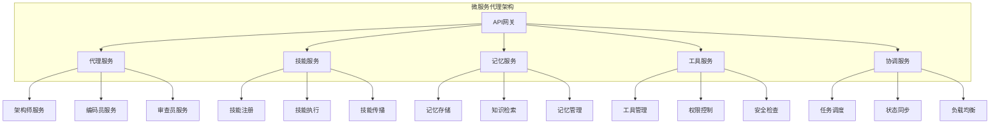

# 第15章: 高级架构模式

## 学习目标

- 理解企业级代理系统的架构模式
- 掌握微服务架构在代理系统中的应用
- 学习事件驱动架构和消息传递模式
- 构建高可用、可扩展的代理系统

## 15.1 微服务架构

### 15.1.1 代理微服务化架构



### 15.1.2 服务发现和注册

```typescript
// src/architecture/service-registry.ts
import { EventEmitter } from 'events';

export interface ServiceInfo {
  id: string;
  name: string;
  type: ServiceType;
  version: string;
  
  // 网络信息
  host: string;
  port: number;
  
  // 健康检查
  healthCheckUrl: string;
  lastHealthCheck: number;
  status: ServiceStatus;
  
  // 负载信息
  load: number;
  capacity: number;
  
  // 元数据
  metadata: Record<string, unknown>;
}

export enum ServiceType {
  AGENT = 'agent',
  SKILL = 'skill',
  MEMORY = 'memory',
  TOOL = 'tool',
  COORDINATOR = 'coordinator',
  GATEWAY = 'gateway'
}

export enum ServiceStatus {
  STARTING = 'starting',
  HEALTHY = 'healthy',
  UNHEALTHY = 'unhealthy',
  TERMINATING = 'terminating',
  TERMINATED = 'terminated'
}

export class ServiceRegistry extends EventEmitter {
  private services: Map<string, ServiceInfo> = new Map();
  private healthCheckInterval: NodeJS.Timeout | null = null;
  private healthCheckIntervalMs: number = 30000; // 30秒

  // 注册服务
  registerService(service: ServiceInfo): void {
    // 验证服务信息
    this.validateService(service);
    
    // 设置初始状态
    service.status = ServiceStatus.STARTING;
    service.lastHealthCheck = Date.now();
    
    // 注册服务
    this.services.set(service.id, service);
    
    // 开始健康检查
    this.performHealthCheck(service.id);
    
    this.emit('serviceRegistered', service);
  }

  // 注销服务
  unregisterService(serviceId: string): void {
    const service = this.services.get(serviceId);
    if (!service) {
      throw new Error(`Service ${serviceId} not found`);
    }

    service.status = ServiceStatus.TERMINATING;
    this.services.delete(serviceId);
    
    this.emit('serviceUnregistered', service);
  }

  // 发现服务
  discoverService(criteria: ServiceCriteria): ServiceInfo[] {
    return Array.from(this.services.values()).filter(service => {
      // 类型匹配
      if (criteria.type && service.type !== criteria.type) {
        return false;
      }
      
      // 状态匹配
      if (criteria.status && service.status !== criteria.status) {
        return false;
      }
      
      // 版本匹配
      if (criteria.version && !this.isVersionCompatible(service.version, criteria.version)) {
        return false;
      }
      
      // 标签匹配
      if (criteria.tags && criteria.tags.length > 0) {
        const serviceTags = service.metadata.tags as string[] || [];
        if (!criteria.tags.every(tag => serviceTags.includes(tag))) {
          return false;
        }
      }
      
      // 负载匹配
      if (criteria.maxLoad !== undefined && service.load > criteria.maxLoad) {
        return false;
      }
      
      return true;
    });
  }

  // 获取服务
  getService(serviceId: string): ServiceInfo | undefined {
    return this.services.get(serviceId);
  }

  // 列出所有服务
  listServices(): ServiceInfo[] {
    return Array.from(this.services.values());
  }

  // 获取健康服务
  getHealthyServices(): ServiceInfo[] {
    return Array.from(this.services.values()).filter(
      service => service.status === ServiceStatus.HEALTHY
    );
  }

  // 选择最佳服务
  selectBestService(criteria: ServiceCriteria): ServiceInfo | undefined {
    const services = this.discoverService(criteria);
    
    if (services.length === 0) {
      return undefined;
    }

    // 根据负载选择最佳服务
    return services.sort((a, b) => a.load - b.load)[0];
  }

  // 更新服务负载
  updateServiceLoad(serviceId: string, load: number): void {
    const service = this.services.get(serviceId);
    if (service) {
      service.load = load;
      this.emit('serviceLoadUpdated', service);
    }
  }

  // 启动健康检查
  startHealthChecks(): void {
    if (this.healthCheckInterval) {
      return;
    }

    this.healthCheckInterval = setInterval(() => {
      this.performHealthChecks();
    }, this.healthCheckIntervalMs);

    this.emit('healthChecksStarted');
  }

  // 停止健康检查
  stopHealthChecks(): void {
    if (this.healthCheckInterval) {
      clearInterval(this.healthCheckInterval);
      this.healthCheckInterval = null;
      this.emit('healthChecksStopped');
    }
  }

  // 执行健康检查
  private async performHealthChecks(): Promise<void> {
    for (const service of this.services.values()) {
      await this.performHealthCheck(service.id);
    }
  }

  // 执行单个服务健康检查
  private async performHealthCheck(serviceId: string): Promise<void> {
    const service = this.services.get(serviceId);
    if (!service) {
      return;
    }

    try {
      // 使用AbortController实现超时控制
      const controller = new AbortController();
      const timeoutId = setTimeout(() => controller.abort(), 5000);

      const response = await fetch(service.healthCheckUrl, {
        method: 'GET',
        signal: controller.signal
      });

      // 清除超时定时器
      clearTimeout(timeoutId);

      if (response.ok) {
        const newStatus = ServiceStatus.HEALTHY;
        if (service.status !== newStatus) {
          const oldStatus = service.status;
          service.status = newStatus;
          service.lastHealthCheck = Date.now();
          this.emit('serviceStatusChanged', service, oldStatus);
        }
      } else {
        this.markServiceUnhealthy(service);
      }
    } catch (error) {
      // 处理超时和其他错误
      if (error instanceof Error && error.name === 'AbortError') {
        console.warn(`Health check timeout for service ${serviceId}`);
      }
      this.markServiceUnhealthy(service);
    }
  }

  // 标记服务为不健康
  private markServiceUnhealthy(service: ServiceInfo): void {
    const newStatus = ServiceStatus.UNHEALTHY;
    if (service.status !== newStatus) {
      const oldStatus = service.status;
      service.status = newStatus;
      service.lastHealthCheck = Date.now();
      this.emit('serviceStatusChanged', service, oldStatus);
    }
  }

  // 验证服务信息
  private validateService(service: ServiceInfo): void {
    if (!service.id || !service.name || !service.type || !service.version) {
      throw new Error('Service must have id, name, type, and version');
    }

    if (!service.host || !service.port) {
      throw new Error('Service must have host and port');
    }

    if (!service.healthCheckUrl) {
      throw new Error('Service must have healthCheckUrl');
    }
  }

  // 版本兼容性检查
  private isVersionCompatible(serviceVersion: string, requiredVersion: string): boolean {
    // 简化实现，使用语义化版本比较
    return serviceVersion === requiredVersion;
  }
}

// 服务查询条件
export interface ServiceCriteria {
  type?: ServiceType;
  status?: ServiceStatus;
  version?: string;
  tags?: string[];
  maxLoad?: number;
}
```

## 15.2 事件驱动架构

### 15.2.1 事件总线实现

```typescript
// src/architecture/event-bus.ts
import { EventEmitter } from 'events';

export interface Event {
  id: string;
  type: string;
  source: string;
  timestamp: number;
  
  data: any;
  metadata: EventMetadata;
}

export interface EventMetadata {
  correlationId?: string;
  causationId?: string;
  replyTo?: string;
  ttl?: number;
  priority?: EventPriority;
  retryCount?: number;
  maxRetries?: number;
}

export enum EventPriority {
  LOW = 0,
  NORMAL = 1,
  HIGH = 2,
  CRITICAL = 3
}

export interface EventHandler {
  handle(event: Event): Promise<void>;
}

export class EventBus extends EventEmitter {
  private handlers: Map<string, EventHandler[]> = new Map();
  private queue: Event[] = [];
  private processing: boolean = false;
  private maxQueueSize: number = 10000;
  private maxRetries: number = 3;

  // 发布事件
  async publish(event: Event): Promise<void> {
    // 验证事件
    this.validateEvent(event);

    // 设置时间戳
    event.timestamp = Date.now();

    // 添加到队列
    this.addToQueue(event);

    // 触发发布事件
    this.emit('eventPublished', event);

    // 处理队列
    this.processQueue();
  }

  // 订阅事件
  subscribe(eventType: string, handler: EventHandler): void {
    if (!this.handlers.has(eventType)) {
      this.handlers.set(eventType, []);
    }

    this.handlers.get(eventType)!.push(handler);
    this.emit('handlerSubscribed', eventType, handler);
  }

  // 取消订阅
  unsubscribe(eventType: string, handler: EventHandler): void {
    const handlers = this.handlers.get(eventType);
    if (handlers) {
      const index = handlers.indexOf(handler);
      if (index > -1) {
        handlers.splice(index, 1);
        this.emit('handlerUnsubscribed', eventType, handler);
      }
    }
  }

  // 发送并等待响应
  async sendAndWait(event: Event, timeout: number = 5000): Promise<Event> {
    const correlationId = this.generateCorrelationId();
    event.metadata.correlationId = correlationId;
    event.metadata.replyTo = `reply-${correlationId}`;

    // 创建响应Promise
    const responsePromise = this.createResponsePromise(correlationId, timeout);

    // 发布事件
    await this.publish(event);

    // 等待响应
    return await responsePromise;
  }

  // 处理队列
  private async processQueue(): Promise<void> {
    if (this.processing || this.queue.length === 0) {
      return;
    }

    this.processing = true;

    try {
      while (this.queue.length > 0) {
        const event = this.queue.shift()!;
        await this.dispatchEvent(event);
      }
    } finally {
      this.processing = false;
    }
  }

  // 分发事件
  private async dispatchEvent(event: Event): Promise<void> {
    const handlers = this.handlers.get(event.type);
    
    if (!handlers || handlers.length === 0) {
      this.emit('eventNoHandlers', event);
      return;
    }

    const errors: Error[] = [];

    for (const handler of handlers) {
      try {
        await handler.handle(event);
        this.emit('eventHandled', event, handler);
      } catch (error) {
        errors.push(error as Error);
        this.emit('eventHandlingFailed', event, handler, error);

        // 重试逻辑
        if (this.shouldRetry(event)) {
          await this.retryEvent(event);
        }
      }
    }

    if (errors.length > 0) {
      this.emit('eventErrors', event, errors);
    }
  }

  // 重试事件
  private async retryEvent(event: Event): Promise<void> {
    const retryCount = event.metadata.retryCount || 0;
    const maxRetries = event.metadata.maxRetries || this.maxRetries;

    if (retryCount < maxRetries) {
      event.metadata.retryCount = retryCount + 1;
      
      // 指数退避
      const delay = Math.pow(2, retryCount) * 1000;
      await this.delay(delay);
      
      await this.publish(event);
    } else {
      this.emit('eventMaxRetriesReached', event);
    }
  }

  // 检查是否应该重试
  private shouldRetry(event: Event): boolean {
    const retryCount = event.metadata.retryCount || 0;
    const maxRetries = event.metadata.maxRetries || this.maxRetries;
    return retryCount < maxRetries;
  }

  // 创建响应Promise
  private createResponsePromise(correlationId: string, timeout: number): Promise<Event> {
    return new Promise((resolve, reject) => {
      const timer = setTimeout(() => {
        this.removeListener(`reply-${correlationId}`, responseHandler);
        reject(new Error('Response timeout'));
      }, timeout);

      const responseHandler = (response: Event) => {
        clearTimeout(timer);
        resolve(response);
      };

      this.once(`reply-${correlationId}`, responseHandler);
    });
  }

  // 添加到队列
  private addToQueue(event: Event): void {
    if (this.queue.length >= this.maxQueueSize) {
      // 队列满，移除最旧的事件
      this.queue.shift();
      this.emit('eventQueueFull', event);
    }

    this.queue.push(event);
  }

  // 验证事件
  private validateEvent(event: Event): void {
    if (!event.type) {
      throw new Error('Event must have type');
    }

    if (!event.source) {
      throw new Error('Event must have source');
    }

    if (!event.id) {
      event.id = this.generateEventId();
    }

    if (!event.metadata) {
      event.metadata = {};
    }
  }

  // 生成事件ID
  private generateEventId(): string {
    return `event-${Date.now()}-${Math.random().toString(36).substr(2, 9)}`;
  }

  // 生成关联ID
  private generateCorrelationId(): string {
    return `corr-${Date.now()}-${Math.random().toString(36).substr(2, 9)}`;
  }

  // 延迟辅助方法
  private delay(ms: number): Promise<void> {
    return new Promise(resolve => setTimeout(resolve, ms));
  }

  // 获取队列统计
  getQueueStats(): { size: number; processing: boolean } {
    return {
      size: this.queue.length,
      processing: this.processing
    };
  }
}
```

### 15.2.2 事件溯源实现

```typescript
// src/architecture/event-sourcing.ts
import { Event } from './event-bus';

export interface EventStore {
  appendEvent(event: Event): Promise<void>;
  getEvents(aggregateId: string, fromVersion?: number): Promise<Event[]>;
  getLastEvent(aggregateId: string): Promise<Event | null>;
}

export class EventSourcingEngine {
  private eventStore: EventStore;
  private snapshots: Map<string, AggregateSnapshot> = new Map();
  private snapshotInterval: number = 100;

  constructor(eventStore: EventStore) {
    this.eventStore = eventStore;
  }

  // 重构聚合状态
  async replayAggregate(aggregateId: string): Promise<AggregateState> {
    // 检查快照
    const snapshot = this.getLatestSnapshot(aggregateId);
    let state = snapshot ? snapshot.state : this.createInitialState();
    let fromVersion = snapshot ? snapshot.version + 1 : 0;

    // 重放事件
    const events = await this.eventStore.getEvents(aggregateId, fromVersion);
    
    for (const event of events) {
      state = this.applyEvent(state, event);
    }

    return state;
  }

  // 保存事件
  async saveEvent(event: Event): Promise<void> {
    await this.eventStore.appendEvent(event);

    // 检查是否需要创建快照
    const snapshot = this.snapshots.get(event.source);
    if (!snapshot || (snapshot.version + 1) % this.snapshotInterval === 0) {
      await this.createSnapshot(event.source);
    }
  }

  // 应用事件
  applyEvent(state: AggregateState, event: Event): AggregateState {
    switch (event.type) {
      case 'AgentCreated':
        return this.handleAgentCreated(state, event);
      case 'AgentUpdated':
        return this.handleAgentUpdated(state, event);
      case 'AgentDeleted':
        return this.handleAgentDeleted(state, event);
      default:
        return state;
    }
  }

  // 创建快照
  private async createSnapshot(aggregateId: string): Promise<void> {
    const state = await this.replayAggregate(aggregateId);
    const events = await this.eventStore.getEvents(aggregateId);
    const version = events.length;

    this.snapshots.set(aggregateId, {
      aggregateId,
      state,
      version,
      createdAt: Date.now()
    });
  }

  // 获取最新快照
  private getLatestSnapshot(aggregateId: string): AggregateSnapshot | undefined {
    return this.snapshots.get(aggregateId);
  }

  // 创建初始状态
  private createInitialState(): AggregateState {
    return {
      id: '',
      status: 'created',
      version: 0,
      data: {}
    };
  }

  // 事件处理器
  private handleAgentCreated(state: AggregateState, event: Event): AggregateState {
    return {
      ...state,
      id: event.source,
      status: 'created',
      version: state.version + 1,
      data: event.data
    };
  }

  private handleAgentUpdated(state: AggregateState, event: Event): AggregateState {
    return {
      ...state,
      status: 'updated',
      version: state.version + 1,
      data: { ...state.data, ...event.data }
    };
  }

  private handleAgentDeleted(state: AggregateState, event: Event): AggregateState {
    return {
      ...state,
      status: 'deleted',
      version: state.version + 1
    };
  }
}

// 聚合状态接口
export interface AggregateState {
  id: string;
  status: string;
  version: number;
  data: any;
}

// 聚合快照接口
export interface AggregateSnapshot {
  aggregateId: string;
  state: AggregateState;
  version: number;
  createdAt: number;
}
```

## 15.3 分布式协调

### 15.3.1 分布式锁实现

```typescript
// src/architecture/distributed-lock.ts
import { EventEmitter } from 'events';

export interface LockOptions {
  ttl: number;           // 锁的生存时间
  autoExtend: boolean;   // 自动延长锁
  retryInterval: number; // 重试间隔
  maxRetries: number;    // 最大重试次数
}

export class DistributedLockManager extends EventEmitter {
  private locks: Map<string, LockInfo> = new Map();
  private lockCleanupInterval: NodeJS.Timeout | null = null;

  constructor() {
    super();
    this.startLockCleanup();
  }

  // 获取锁
  async acquireLock(resource: string, owner: string, options: LockOptions): Promise<LockHandle> {
    const startTime = Date.now();
    let attempts = 0;

    while (attempts < options.maxRetries) {
      // 尝试获取锁
      const lock = await this.tryAcquireLock(resource, owner, options);
      
      if (lock) {
        this.emit('lockAcquired', resource, owner);
        
        return {
          resource,
          owner,
          acquiredAt: Date.now(),
          ttl: options.ttl,
          autoExtend: options.autoExtend,
          
          async release(): Promise<void> {
            await this.releaseLock(resource, owner);
          },
          
          async extend(ttl: number): Promise<boolean> {
            return await this.extendLock(resource, owner, ttl);
          }
        };
      }

      // 等待后重试
      await this.delay(options.retryInterval);
      attempts++;
    }

    throw new Error(`Failed to acquire lock after ${attempts} attempts`);
  }

  // 释放锁
  async releaseLock(resource: string, owner: string): Promise<void> {
    const lock = this.locks.get(resource);
    
    if (!lock) {
      throw new Error(`Lock ${resource} not found`);
    }

    if (lock.owner !== owner) {
      throw new Error(`Lock ${resource} is owned by ${lock.owner}, not ${owner}`);
    }

    this.locks.delete(resource);
    this.emit('lockReleased', resource, owner);
  }

  // 延长锁
  async extendLock(resource: string, owner: string, ttl: number): Promise<boolean> {
    const lock = this.locks.get(resource);
    
    if (!lock || lock.owner !== owner) {
      return false;
    }

    lock.expiresAt = Date.now() + ttl;
    this.emit('lockExtended', resource, owner, ttl);
    
    return true;
  }

  // 尝试获取锁
  private async tryAcquireLock(
    resource: string,
    owner: string,
    options: LockOptions
  ): Promise<LockInfo | null> {
    const existingLock = this.locks.get(resource);

    // 检查锁是否已存在
    if (existingLock) {
      // 检查锁是否已过期
      if (existingLock.expiresAt < Date.now()) {
        this.locks.delete(resource);
      } else {
        // 锁仍然有效
        return null;
      }
    }

    // 创建新锁
    const lock: LockInfo = {
      resource,
      owner,
      acquiredAt: Date.now(),
      expiresAt: Date.now() + options.ttl,
      ttl: options.ttl,
      autoExtend: options.autoExtend
    };

    this.locks.set(resource, lock);
    return lock;
  }

  // 启动锁清理
  private startLockCleanup(): void {
    this.lockCleanupInterval = setInterval(() => {
      this.cleanupExpiredLocks();
    }, 60000); // 每分钟清理一次
  }

  // 清理过期锁
  private cleanupExpiredLocks(): void {
    const now = Date.now();
    const expired: string[] = [];

    for (const [resource, lock] of this.locks.entries()) {
      if (lock.expiresAt < now) {
        expired.push(resource);
      }
    }

    for (const resource of expired) {
      const lock = this.locks.get(resource);
      this.locks.delete(resource);
      this.emit('lockExpired', resource, lock?.owner);
    }
  }

  // 延迟辅助方法
  private delay(ms: number): Promise<void> {
    return new Promise(resolve => setTimeout(resolve, ms));
  }

  // 获取锁统计
  getLockStats(): { total: number; active: number; expired: number } {
    const now = Date.now();
    const active = Array.from(this.locks.values()).filter(lock => lock.expiresAt > now).length;
    const expired = this.locks.size - active;

    return {
      total: this.locks.size,
      active,
      expired
    };
  }

  // 清理
  destroy(): void {
    if (this.lockCleanupInterval) {
      clearInterval(this.lockCleanupInterval);
      this.lockCleanupInterval = null;
    }
    this.locks.clear();
  }
}

// 锁信息接口
export interface LockInfo {
  resource: string;
  owner: string;
  acquiredAt: number;
  expiresAt: number;
  ttl: number;
  autoExtend: boolean;
}

// 锁句柄接口
export interface LockHandle {
  resource: string;
  owner: string;
  acquiredAt: number;
  ttl: number;
  autoExtend: boolean;
  
  release(): Promise<void>;
  extend(ttl: number): Promise<boolean>;
}
```

### 15.3.2 领导者选举

```typescript
// src/architecture/leader-election.ts
import { EventEmitter } from 'events';

export interface ElectionConfig {
  nodeId: string;
  electionTimeout: number;
  heartbeatInterval: number;
  leaseDuration: number;
}

export class LeaderElection extends EventEmitter {
  private config: ElectionConfig;
  private currentLeader: string | null = null;
  private votes: Map<string, string> = new Map();
  private electionTimer: NodeJS.Timeout | null = null;
  private heartbeatTimer: NodeJS.Timeout | null = null;
  private participants: Set<string> = new Set();

  constructor(config: ElectionConfig) {
    super();
    this.config = config;
  }

  // 开始选举
  startElection(): void {
    this.emit('electionStarted');
    this.votes.clear();
    this.votes.set(this.config.nodeId, this.config.nodeId);

    // 请求投票
    this.requestVotes();

    // 设置选举超时
    this.electionTimer = setTimeout(() => {
      this.concludeElection();
    }, this.config.electionTimeout);
  }

  // 请求投票
  private requestVotes(): void {
    this.emit('voteRequested', this.config.nodeId);
    // 在实际实现中，这里会向其他节点发送投票请求
  }

  // 投票
  castVote(candidateId: string): void {
    if (this.currentLeader) {
      return; // 已有领导者，不投票
    }

    this.votes.set(this.config.nodeId, candidateId);
    this.emit('voteCast', this.config.nodeId, candidateId);

    // 检查是否达到多数
    this.checkMajority();
  }

  // 收集投票
  receiveVote(voterId: string, candidateId: string): void {
    this.votes.set(voterId, candidateId);
    this.emit('voteReceived', voterId, candidateId);

    // 检查是否达到多数
    this.checkMajority();
  }

  // 检查多数
  private checkMajority(): void {
    const voteCounts = this.countVotes();
    const majority = Math.floor(this.participants.size / 2) + 1;

    for (const [candidateId, count] of Object.entries(voteCounts)) {
      if (count >= majority) {
        this.declareWinner(candidateId);
        break;
      }
    }
  }

  // 宣布获胜者
  private declareWinner(leaderId: string): void {
    if (this.electionTimer) {
      clearTimeout(this.electionTimer);
      this.electionTimer = null;
    }

    this.currentLeader = leaderId;
    this.emit('leaderElected', leaderId);

    if (leaderId === this.config.nodeId) {
      this.startLeadership();
    } else {
      this.startHeartbeat();
    }
  }

  // 结束选举
  private concludeElection(): void {
    if (this.currentLeader) {
      return; // 已有领导者
    }

    // 没有候选人获得多数票，重新开始选举
    this.emit('electionFailed');
    this.startElection();
  }

  // 开始领导任期
  private startLeadership(): void {
    this.emit('leadershipAcquired', this.config.nodeId);

    // 定期发送心跳
    this.heartbeatTimer = setInterval(() => {
      this.sendHeartbeat();
    }, this.config.heartbeatInterval);
  }

  // 开始心跳监控
  private startHeartbeat(): void {
    this.heartbeatTimer = setInterval(() => {
      this.checkLeaderHealth();
    }, this.config.heartbeatInterval);
  }

  // 发送心跳
  private sendHeartbeat(): void {
    this.emit('heartbeatSent', this.config.nodeId);
  }

  // 检查领导者健康
  private checkLeaderHealth(): void {
    const lastHeartbeat = this.getLastHeartbeat(this.currentLeader!);
    if (Date.now() - lastHeartbeat > this.config.leaseDuration) {
      // 领导者失效，开始新选举
      this.emit('leaderFailed', this.currentLeader);
      this.currentLeader = null;
      this.startElection();
    }
  }

  // 获取最后心跳时间
  private getLastHeartbeat(leaderId: string): number {
    // 简化实现，实际应该跟踪心跳时间
    return Date.now();
  }

  // 统计投票
  private countVotes(): Record<string, number> {
    const counts: Record<string, number> = {};

    for (const candidateId of this.votes.values()) {
      counts[candidateId] = (counts[candidateId] || 0) + 1;
    }

    return counts;
  }

  // 添加参与者
  addParticipant(nodeId: string): void {
    this.participants.add(nodeId);
    this.emit('participantAdded', nodeId);
  }

  // 移除参与者
  removeParticipant(nodeId: string): void {
    this.participants.delete(nodeId);
    this.votes.delete(nodeId);
    this.emit('participantRemoved', nodeId);
  }

  // 停止选举
  stop(): void {
    if (this.electionTimer) {
      clearTimeout(this.electionTimer);
      this.electionTimer = null;
    }

    if (this.heartbeatTimer) {
      clearInterval(this.heartbeatTimer);
      this.heartbeatTimer = null;
    }

    this.emit('electionStopped');
  }

  // 获取当前领导者
  getCurrentLeader(): string | null {
    return this.currentLeader;
  }

  // 检查是否为领导者
  isLeader(): boolean {
    return this.currentLeader === this.config.nodeId;
  }
}
```

## 15.4 高可用性模式

### 15.4.1 断路器模式

```typescript
// src/architecture/circuit-breaker.ts
import { EventEmitter } from 'events';

export interface CircuitBreakerConfig {
  failureThreshold: number;
  successThreshold: number;
  timeout: number;
  resetTimeout: number;
}

export enum CircuitState {
  CLOSED = 'closed',     // 正常状态
  OPEN = 'open',         // 断开状态
  HALF_OPEN = 'half_open' // 半开状态
}

export class CircuitBreaker extends EventEmitter {
  private config: CircuitBreakerConfig;
  private state: CircuitState = CircuitState.CLOSED;
  private failureCount: number = 0;
  private successCount: number = 0;
  private lastFailureTime: number = 0;
  private nextAttemptTime: number = 0;

  constructor(config: CircuitBreakerConfig) {
    super();
    this.config = config;
  }

  // 执行操作
  async execute<T>(operation: () => Promise<T>): Promise<T> {
    if (this.state === CircuitState.OPEN) {
      if (Date.now() < this.nextAttemptTime) {
        throw new Error('Circuit breaker is OPEN');
      }
      this.transitionToHalfOpen();
    }

    try {
      const result = await this.executeWithTimeout(operation, this.config.timeout);
      this.onSuccess();
      return result;
    } catch (error) {
      this.onFailure();
      throw error;
    }
  }

  // 成功处理
  private onSuccess(): void {
    this.failureCount = 0;

    if (this.state === CircuitState.HALF_OPEN) {
      this.successCount++;

      if (this.successCount >= this.config.successThreshold) {
        this.transitionToClosed();
      }
    }

    this.emit('success');
  }

  // 失败处理
  private onFailure(): void {
    this.failureCount++;
    this.lastFailureTime = Date.now();
    this.successCount = 0;

    if (this.failureCount >= this.config.failureThreshold) {
      this.transitionToOpen();
    }

    this.emit('failure');
  }

  // 转换到关闭状态
  private transitionToClosed(): void {
    this.state = CircuitState.CLOSED;
    this.failureCount = 0;
    this.successCount = 0;
    this.emit('stateChanged', CircuitState.CLOSED);
  }

  // 转换到断开状态
  private transitionToOpen(): void {
    this.state = CircuitState.OPEN;
    this.nextAttemptTime = Date.now() + this.config.resetTimeout;
    this.emit('stateChanged', CircuitState.OPEN);
  }

  // 转换到半开状态
  private transitionToHalfOpen(): void {
    this.state = CircuitState.HALF_OPEN;
    this.successCount = 0;
    this.emit('stateChanged', CircuitState.HALF_OPEN);
  }

  // 带超时的执行
  private async executeWithTimeout<T>(operation: () => Promise<T>, timeout: number): Promise<T> {
    return Promise.race([
      operation(),
      this.createTimeoutPromise<T>(timeout)
    ]);
  }

  // 创建超时Promise
  private createTimeoutPromise<T>(timeout: number): Promise<T> {
    return new Promise((_, reject) => {
      setTimeout(() => reject(new Error('Operation timeout')), timeout);
    });
  }

  // 获取当前状态
  getState(): CircuitState {
    return this.state;
  }

  // 获取统计信息
  getStats(): {
    state: CircuitState;
    failureCount: number;
    successCount: number;
    lastFailureTime: number;
  } {
    return {
      state: this.state,
      failureCount: this.failureCount,
      successCount: this.successCount,
      lastFailureTime: this.lastFailureTime
    };
  }

  // 重置断路器
  reset(): void {
    this.transitionToClosed();
  }
}
```

## 15.5 实际应用示例

### 15.5.1 分布式代理集群

```typescript
// examples/architecture/distributed-cluster.ts
import { ServiceRegistry, ServiceType } from '../../src/architecture/service-registry';
import { EventBus, Event } from '../../src/architecture/event-bus';
import { DistributedLockManager } from '../../src/architecture/distributed-lock';
import { LeaderElection } from '../../src/architecture/leader-election';

export class AgentCluster {
  private serviceRegistry: ServiceRegistry;
  private eventBus: EventBus;
  private lockManager: DistributedLockManager;
  private leaderElection: LeaderElection;
  private nodeId: string;

  constructor(nodeId: string) {
    this.nodeId = nodeId;
    this.serviceRegistry = new ServiceRegistry();
    this.eventBus = new EventBus();
    this.lockManager = new DistributedLockManager();
    this.leaderElection = new LeaderElection({
      nodeId,
      electionTimeout: 10000,
      heartbeatInterval: 5000,
      leaseDuration: 15000
    });

    this.setupEventHandlers();
  }

  // 启动集群节点
  async start(): Promise<void> {
    // 注册服务
    this.serviceRegistry.registerService({
      id: `agent-${this.nodeId}`,
      name: `Agent Service ${this.nodeId}`,
      type: ServiceType.AGENT,
      version: '1.0.0',
      host: 'localhost',
      port: 3000,
      healthCheckUrl: `http://localhost:3000/health`,
      lastHealthCheck: Date.now(),
      status: 'starting',
      load: 0,
      capacity: 100,
      metadata: {}
    });

    // 开始健康检查
    this.serviceRegistry.startHealthChecks();

    // 参与领导者选举
    this.leaderElection.addParticipant(this.nodeId);
    this.leaderElection.startElection();

    console.log(`Cluster node ${this.nodeId} started`);
  }

  // 停止集群节点
  async stop(): Promise<void> {
    this.leaderElection.stop();
    this.serviceRegistry.stopHealthChecks();
    this.lockManager.destroy();
  }

  // 处理分布式任务
  async handleTask(task: any): Promise<any> {
    // 获取分布式锁
    const lock = await this.lockManager.acquireLock(
      `task-${task.id}`,
      this.nodeId,
      { ttl: 30000, autoExtend: true, retryInterval: 1000, maxRetries: 3 }
    );

    try {
      // 检查是否为领导者
      if (this.leaderElection.isLeader()) {
        return await this.processAsLeader(task);
      } else {
        return await this.processAsFollower(task);
      }
    } finally {
      await lock.release();
    }
  }

  // 领导者处理
  private async processAsLeader(task: any): Promise<any> {
    console.log(`Processing task ${task.id} as leader`);
    // 实现领导者处理逻辑
    return { result: 'processed_by_leader' };
  }

  // 跟随者处理
  private async processAsFollower(task: any): Promise<any> {
    console.log(`Processing task ${task.id} as follower`);
    // 实现跟随者处理逻辑
    return { result: 'processed_by_follower' };
  }

  // 设置事件处理器
  private setupEventHandlers(): void {
    this.eventBus.subscribe('task.created', {
      handle: async (event: Event) => {
        console.log(`Task created: ${event.data.taskId}`);
        await this.handleTask(event.data);
      }
    });

    this.leaderElection.on('leaderElected', (leaderId: string) => {
      console.log(`Leader elected: ${leaderId}`);
      if (leaderId === this.nodeId) {
        console.log('This node is now the leader');
      }
    });
  }
}
```

## 15.6 本章小结

### 关键要点

- **微服务架构**: 服务注册、发现、负载均衡
- **事件驱动架构**: 事件总线、事件溯源、CQRS模式
- **分布式协调**: 分布式锁、领导者选举、一致性协议
- **高可用性**: 断路器模式、重试机制、降级策略

### 最佳实践

1. **设计弹性系统** - 假设故障会发生，设计相应的恢复机制
2. **实施监控告警** - 实时监控系统健康状态
3. **使用断路器模式** - 防止级联故障
4. **实现优雅降级** - 在故障时提供基本功能
5. **定期测试故障** - 验证系统的故障恢复能力

### 下一步学习

现在你已经掌握了高级架构模式，接下来我们将：

- 📖 **第16章**: 真实实现案例分析
- 🔧 **实践**: 学习真实项目的架构设计
- 🎯 **目标**: 理解企业级应用的最佳实践

---

**准备好探索真实案例的精彩世界了吗？** 💼
