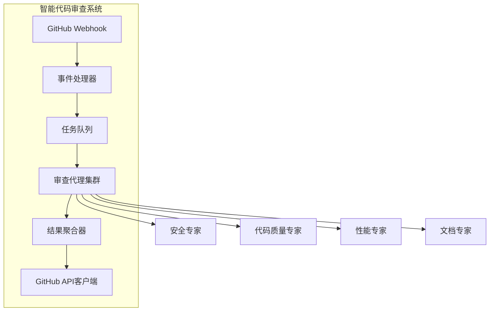
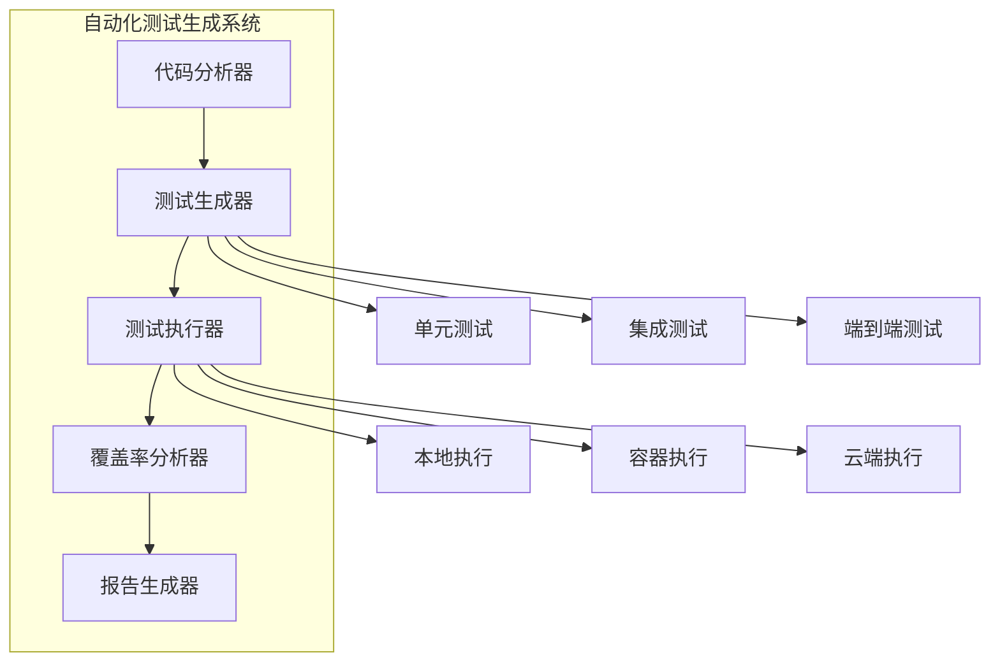
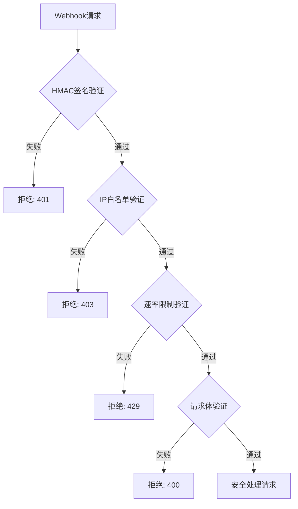

# 第16章: 真实实现案例

## 学习目标

- 分析真实世界的AI代理应用案例
- 理解企业级代理系统的架构设计
- 学习从简单到复杂的演进过程
- 掌握生产环境的最佳实践

## 16.1 案例一：智能代码审查系统

### 16.1.1 需求分析

某大型科技公司需要构建一个智能代码审查系统，能够：

- 自动审查Pull Request
- 检测安全漏洞和代码质量问题
- 提供改进建议
- 与现有的CI/CD流程集成

### 16.1.2 系统架构



### 16.1.3 核心实现

```typescript
// examples/case-studies/code-review-system/review-coordinator.ts
import { ArchitectAgent } from './agents/architect';
import { SecurityExpertAgent } from './agents/security-expert';
import { CodeQualityExpertAgent } from './agents/code-quality-expert';

export interface ReviewRequest {
  repository: string;
  pullRequest: number;
  commit: string;
  files: string[];
}

export interface ReviewResult {
  pullRequest: number;
  commit: string;
  findings: ReviewFinding[];
  overallScore: number;
  recommendations: string[];
}

export class ReviewCoordinator {
  private architect: ArchitectAgent;
  private securityExpert: SecurityExpertAgent;
  private qualityExpert: CodeQualityExpertAgent;

  constructor() {
    this.architect = new ArchitectAgent();
    this.securityExpert = new SecurityExpertAgent();
    this.qualityExpert = new CodeQualityExpertAgent();
  }

  // 处理审查请求
  async processReview(request: ReviewRequest): Promise<ReviewResult> {
    console.log(`Processing review for PR #${request.pullRequest}`);

    try {
      // 1. 分析变更范围
      const scope = await this.analyzeChangeScope(request);
      
      // 2. 分配审查任务
      const tasks = await this.assignReviewTasks(scope, request);
      
      // 3. 并行执行审查
      const findings = await this.executeReviews(tasks);
      
      // 4. 聚合结果
      const result = await this.aggregateResults(findings, request);
      
      return result;

    } catch (error) {
      console.error('Review processing failed:', error);
      throw error;
    }
  }

  // 分析变更范围
  private async analyzeChangeScope(request: ReviewRequest): Promise<ChangeScope> {
    const files = request.files;
    const scope: ChangeScope = {
      languages: new Set(),
      complexity: 'low',
      securityRisk: 'low',
      performanceImpact: 'low'
    };

    for (const file of files) {
      // 分析文件类型
      const language = this.detectLanguage(file);
      scope.languages.add(language);

      // 分析代码复杂度
      const complexity = await this.analyzeComplexity(file);
      if (complexity > scope.complexity) {
        scope.complexity = complexity;
      }
    }

    return scope;
  }

  // 分配审查任务
  private async assignReviewTasks(scope: ChangeScope, request: ReviewRequest): Promise<ReviewTask[]> {
    const tasks: ReviewTask[] = [];

    // 安全审查
    if (scope.securityRisk !== 'low') {
      tasks.push({
        type: 'security',
        priority: 'high',
        agent: this.securityExpert,
        files: this.filterSecurityRelevantFiles(request.files)
      });
    }

    // 代码质量审查
    tasks.push({
      type: 'quality',
      priority: 'medium',
      agent: this.qualityExpert,
      files: request.files
    });

    return tasks;
  }

  // 执行审查
  private async executeReviews(tasks: ReviewTask[]): Promise<ReviewFinding[]> {
    const findings: ReviewFinding[] = [];

    // 并行执行任务
    const results = await Promise.allSettled(
      tasks.map(task => this.executeTask(task))
    );

    for (const result of results) {
      if (result.status === 'fulfilled' && result.value) {
        findings.push(...result.value);
      }
    }

    return findings;
  }

  // 执行单个任务
  private async executeTask(task: ReviewTask): Promise<ReviewFinding[]> {
    try {
      const context = {
        files: task.files,
        repository: task.repository,
        commit: task.commit
      };

      return await task.agent.review(context);
    } catch (error) {
      console.error(`Task ${task.type} failed:`, error);
      return [];
    }
  }

  // 聚合结果
  private async aggregateResults(findings: ReviewFinding[], request: ReviewRequest): Promise<ReviewResult> {
    // 分类整理发现
    const classified = this.classifyFindings(findings);
    
    // 计算总体评分
    const overallScore = this.calculateOverallScore(classified);
    
    // 生成建议
    const recommendations = this.generateRecommendations(classified);

    return {
      pullRequest: request.pullRequest,
      commit: request.commit,
      findings: classified,
      overallScore,
      recommendations
    };
  }

  // 分类发现
  private classifyFindings(findings: ReviewFinding[]): ReviewFinding[] {
    return findings.sort((a, b) => {
      const severityOrder = ['critical', 'high', 'medium', 'low', 'info'];
      return severityOrder.indexOf(a.severity) - severityOrder.indexOf(b.severity);
    });
  }

  // 计算总体评分
  private calculateOverallScore(findings: ReviewFinding[]): number {
    if (findings.length === 0) {
      return 100;
    }

    let score = 100;
    for (const finding of findings) {
      switch (finding.severity) {
        case 'critical':
          score -= 20;
          break;
        case 'high':
          score -= 10;
          break;
        case 'medium':
          score -= 5;
          break;
        case 'low':
          score -= 2;
          break;
        case 'info':
          score -= 1;
          break;
      }
    }

    return Math.max(0, score);
  }

  // 生成建议
  private generateRecommendations(findings: ReviewFinding[]): string[] {
    const recommendations: string[] = [];
    const criticalCount = findings.filter(f => f.severity === 'critical').length;
    const highCount = findings.filter(f => f.severity === 'high').length;

    if (criticalCount > 0) {
      recommendations.push(`发现 ${criticalCount} 个严重问题，建议修复后再合并`);
    }

    if (highCount > 3) {
      recommendations.push(`发现 ${highCount} 个高优先级问题，建议优先处理`);
    }

    return recommendations;
  }

  // 检测语言
  private detectLanguage(filePath: string): string {
    const ext = filePath.split('.').pop();
    const languageMap: Record<string, string> = {
      'ts': 'typescript',
      'js': 'javascript',
      'py': 'python',
      'java': 'java',
      'go': 'go'
    };
    return languageMap[ext || ''] || 'unknown';
  }

  // 分析复杂度
  private async analyzeComplexity(filePath: string): Promise<string> {
    // 简化实现
    return 'medium';
  }

  // 过滤安全相关文件
  private filterSecurityRelevantFiles(files: string[]): string[] {
    return files.filter(file => {
      const securityRelevant = [
        'auth', 'login', 'password', 'token', 'crypto',
        'database', 'query', 'input', 'validation'
      ];
      return securityRelevant.some(keyword => 
        file.toLowerCase().includes(keyword)
      );
    });
  }
}

// 辅助接口
interface ChangeScope {
  languages: Set<string>;
  complexity: string;
  securityRisk: string;
  performanceImpact: string;
}

interface ReviewTask {
  type: string;
  priority: string;
  agent: any;
  files: string[];
  repository?: string;
  commit?: string;
}

interface ReviewFinding {
  type: string;
  severity: string;
  message: string;
  file?: string;
  line?: number;
  suggestion?: string;
}
```

### 16.1.4 部署和集成

```typescript
// examples/case-studies/code-review-system/deployment.ts
import { ReviewCoordinator } from './review-coordinator';
import express from 'express';
import crypto from 'crypto';
import { IncomingMessage, ServerResponse } from 'http';

// 安全配置接口
interface SecurityConfig {
  webhookSecret: string;
  githubAllowedIps: string[];
  rateLimit: {
    windowMs: number;
    maxRequests: number;
  };
  maxPayloadSize: number;
}

// 安全验证结果
interface SecurityValidationResult {
  valid: boolean;
  error?: string;
  riskLevel?: 'low' | 'medium' | 'high';
}

export class CodeReviewService {
  private coordinator: ReviewCoordinator;
  private app: express.Application;
  private securityConfig: SecurityConfig;
  private rateLimitMap: Map<string, number[]>;

  constructor(config?: Partial<SecurityConfig>) {
    this.coordinator = new ReviewCoordinator();
    this.app = express();
    
    // 默认安全配置
    this.securityConfig = {
      webhookSecret: config?.webhookSecret || process.env.GITHUB_WEBHOOK_SECRET || '',
      githubAllowedIps: config?.githubAllowedIps || this.getDefaultGitHubIps(),
      rateLimit: {
        windowMs: config?.rateLimit?.windowMs || 60000, // 1分钟
        maxRequests: config?.rateLimit?.maxRequests || 100
      },
      maxPayloadSize: config?.maxPayloadSize || 10 * 1024 * 1024 // 10MB
    };
    
    this.rateLimitMap = new Map();
    this.setupRoutes();
    this.setupSecurityMiddleware();
  }

  // 获取GitHub默认IP范围
  private getDefaultGitHubIps(): string[] {
    return [
      '192.30.252.0/22',
      '185.199.108.0/22',
      '140.82.112.0/20',
      '13.229.188.0/18',
      '52.215.192.0/18'
    ];
  }

  // 设置安全中间件
  private setupSecurityMiddleware(): void {
    // 请求体大小限制
    this.app.use(express.json({ limit: `${this.securityConfig.maxPayloadSize}b` }));
    
    // 请求超时
    this.app.use((req, res, next) => {
      req.setTimeout(30000, () => {
        res.status(408).send('Request Timeout');
      });
      next();
    });
  }

  // 设置路由
  private setupRoutes(): void {
    this.app.post('/webhook/github', this.handleGitHubWebhook.bind(this));
    this.app.get('/health', this.handleHealthCheck.bind(this));
  }

  // 处理GitHub Webhook
  private async handleGitHubWebhook(req: any, res: any): Promise<void> {
    const requestId = this.generateRequestId();
    
    try {
      // 记录请求基本信息
      this.logWebhookRequest(requestId, req);
      
      // 🔒 关键安全验证流程
      const validationResult = await this.performSecurityValidation(req, requestId);
      
      if (!validationResult.valid) {
        this.logSecurityViolation(requestId, req, validationResult.error || 'Unknown security violation');
        
        // 根据风险级别返回不同的响应
        if (validationResult.riskLevel === 'high') {
          // 高风险：不泄露任何信息，延迟响应
          await this.delayResponse(1000 + Math.random() * 2000);
          res.status(403).send('Forbidden');
          return;
        } else {
          // 中低风险：返回具体错误信息
          res.status(401).json({ 
            error: 'Authentication failed',
            requestId: requestId
          });
          return;
        }
      }

      // 验证事件类型
      const event = req.headers['x-github-event'];
      if (!this.isValidEventType(event)) {
        this.logInvalidEvent(requestId, event);
        res.status(400).json({ 
          error: 'Invalid event type',
          requestId: requestId
        });
        return;
      }
      
      if (event === 'pull_request') {
        const payload = req.body;
        
        // 验证请求体结构
        if (!this.isValidPullRequestPayload(payload)) {
          this.logInvalidPayload(requestId, payload);
          res.status(400).json({ 
            error: 'Invalid payload structure',
            requestId: requestId
          });
          return;
        }
        
        if (payload.action === 'opened' || payload.action === 'synchronize') {
          // 安全的异步处理审查请求
          this.processPullRequest(payload, requestId).catch(error => {
            this.logProcessingError(requestId, error);
            // 发送告警
            this.sendSecurityAlert('webhook_processing_failed', { error, requestId });
          });
        }
      }

      res.status(200).json({ 
        status: 'processed',
        requestId: requestId
      });
      
    } catch (error) {
      this.logWebhookError(requestId, error);
      res.status(500).json({ 
        error: 'Internal Server Error',
        requestId: requestId
      });
    }
  }

  // 🔒 执行安全验证
  private async performSecurityValidation(req: any, requestId: string): Promise<SecurityValidationResult> {
    // 1. HMAC签名验证（最重要）
    const signatureValidation = this.validateWebhookSignature(req);
    if (!signatureValidation.valid) {
      return {
        valid: false,
        error: signatureValidation.error,
        riskLevel: 'high'
      };
    }

    // 2. IP白名单验证
    const ipValidation = this.validateRequestIP(req);
    if (!ipValidation.valid) {
      return {
        valid: false,
        error: ipValidation.error,
        riskLevel: 'high'
      };
    }

    // 3. 速率限制验证
    const rateLimitValidation = this.validateRateLimit(req);
    if (!rateLimitValidation.valid) {
      return {
        valid: false,
        error: rateLimitValidation.error,
        riskLevel: 'medium'
      };
    }

    // 4. 请求体大小验证
    const payloadSizeValidation = this.validatePayloadSize(req);
    if (!payloadSizeValidation.valid) {
      return {
        valid: false,
        error: payloadSizeValidation.error,
        riskLevel: 'medium'
      };
    }

    return { valid: true };
  }

  // 验证Webhook签名
  private validateWebhookSignature(req: any): SecurityValidationResult {
    try {
      const signature = req.headers['x-hub-signature-256'];
      if (!signature) {
        return {
          valid: false,
          error: 'Missing signature header'
        };
      }

      if (!this.securityConfig.webhookSecret) {
        return {
          valid: false,
          error: 'Webhook secret not configured'
        };
      }

      // 验证签名格式
      if (!signature.startsWith('sha256=')) {
        return {
          valid: false,
          error: 'Invalid signature format'
        };
      }

      // 计算HMAC
      const hmac = crypto.createHmac('sha256', this.securityConfig.webhookSecret);
      const digest = hmac.update(JSON.stringify(req.body)).digest('hex');
      const expectedSignature = `sha256=${digest}`;

      // 使用恒定时间比较防止时序攻击
      if (!crypto.timingSafeEqual(Buffer.from(signature), Buffer.from(expectedSignature))) {
        return {
          valid: false,
          error: 'Invalid signature'
        };
      }

      return { valid: true };
    } catch (error) {
      return {
        valid: false,
        error: 'Signature validation failed'
      };
    }
  }

  // 验证请求IP
  private validateRequestIP(req: any): SecurityValidationResult {
    try {
      const forwarded = req.headers['x-forwarded-for'];
      const ip = forwarded ? forwarded.split(',')[0].trim() : req.connection.remoteAddress;
      
      if (!ip) {
        return {
          valid: false,
          error: 'Unable to determine client IP'
        };
      }

      // 检查IP是否在GitHub白名单中
      const isAllowed = this.securityConfig.githubAllowedIps.some(allowedIp => 
        this.isIpInRange(ip, allowedIp)
      );

      if (!isAllowed) {
        return {
          valid: false,
          error: 'IP address not in whitelist'
        };
      }

      return { valid: true };
    } catch (error) {
      return {
        valid: false,
        error: 'IP validation failed'
      };
    }
  }

  // 检查IP是否在指定范围内
  private isIpInRange(ip: string, cidr: string): boolean {
    try {
      const [range, prefix] = cidr.split('/');
      const prefixLength = parseInt(prefix, 10);
      
      const ipBytes = ip.split('.').map(byte => parseInt(byte, 10));
      const rangeBytes = range.split('.').map(byte => parseInt(byte, 10));
      
      const mask = 0xFFFFFFFF << (32 - prefixLength);
      
      const ipNum = (ipBytes[0] << 24) | (ipBytes[1] << 16) | (ipBytes[2] << 8) | ipBytes[3];
      const rangeNum = (rangeBytes[0] << 24) | (rangeBytes[1] << 16) | (rangeBytes[2] << 8) | rangeBytes[3];
      
      return (ipNum & mask) === (rangeNum & mask);
    } catch {
      return false;
    }
  }

  // 验证速率限制
  private validateRateLimit(req: any): SecurityValidationResult {
    try {
      const ip = req.connection.remoteAddress || 'unknown';
      const now = Date.now();
      
      // 获取该IP的请求历史
      let requests = this.rateLimitMap.get(ip) || [];
      
      // 清理过期的请求记录
      requests = requests.filter(timestamp => 
        now - timestamp < this.securityConfig.rateLimit.windowMs
      );
      
      // 检查是否超过限制
      if (requests.length >= this.securityConfig.rateLimit.maxRequests) {
        return {
          valid: false,
          error: 'Rate limit exceeded'
        };
      }
      
      // 记录当前请求
      requests.push(now);
      this.rateLimitMap.set(ip, requests);
      
      return { valid: true };
    } catch (error) {
      return {
        valid: false,
        error: 'Rate limit validation failed'
      };
    }
  }

  // 验证请求体大小
  private validatePayloadSize(req: any): SecurityValidationResult {
    try {
      const contentLength = parseInt(req.headers['content-length'] || '0', 10);
      
      if (contentLength > this.securityConfig.maxPayloadSize) {
        return {
          valid: false,
          error: 'Payload too large'
        };
      }
      
      return { valid: true };
    } catch (error) {
      return {
        valid: false,
        error: 'Payload size validation failed'
      };
    }
  }

  // 验证事件类型
  private isValidEventType(event: string): boolean {
    const validEvents = [
      'pull_request',
      'push',
      'issues',
      'issue_comment',
      'release',
      'fork'
    ];
    return validEvents.includes(event);
  }

  // 验证PR请求体结构
  private isValidPullRequestPayload(payload: any): boolean {
    try {
      // 基本结构验证
      if (!payload || typeof payload !== 'object') {
        return false;
      }

      // 必需字段验证
      const requiredFields = ['action', 'repository', 'pull_request'];
      for (const field of requiredFields) {
        if (!payload[field]) {
          return false;
        }
      }

      // 仓库信息验证
      if (!payload.repository.full_name || typeof payload.repository.full_name !== 'string') {
        return false;
      }

      // PR信息验证
      if (!payload.pull_request.number || typeof payload.pull_request.number !== 'number') {
        return false;
      }

      if (!payload.pull_request.head || !payload.pull_request.head.sha) {
        return false;
      }

      // action字段验证
      const validActions = ['opened', 'synchronize', 'reopened', 'closed', 'edited'];
      if (!validActions.includes(payload.action)) {
        return false;
      }

      return true;
    } catch {
      return false;
    }
  }

  // 处理Pull Request（带请求ID）
  private async processPullRequest(payload: any, requestId: string): Promise<void> {
    try {
      const request: ReviewRequest = {
        repository: payload.repository.full_name,
        pullRequest: payload.pull_request.number,
        commit: payload.pull_request.head.sha,
        files: await this.getChangedFiles(payload)
      };

      this.logProcessingStart(requestId, request);
      
      const result = await this.coordinator.processReview(request);
      
      this.logProcessingComplete(requestId, result);
      await this.postReviewComment(payload, result, requestId);
      
    } catch (error) {
      this.logProcessingError(requestId, error);
      throw error;
    }
  }

  // 获取变更文件（带安全验证）
  private async getChangedFiles(payload: any): Promise<string[]> {
    try {
      // 验证仓库访问权限
      if (!this.hasRepositoryAccess(payload.repository.full_name)) {
        throw new Error('No access to repository');
      }

      // 调用GitHub API获取变更文件列表
      // 这里应该有实际的API调用和错误处理
      const files = await this.fetchChangedFilesFromAPI(payload);
      
      // 验证文件路径安全性
      return this.validateFilePaths(files);
      
    } catch (error) {
      this.logError('getChangedFiles failed', error);
      return [];
    }
  }

  // 发布审查评论（带安全验证）
  private async postReviewComment(payload: any, result: ReviewResult, requestId: string): Promise<void> {
    try {
      // 验证评论内容安全性
      if (!this.isReviewCommentSafe(result)) {
        throw new Error('Review comment contains unsafe content');
      }

      // 调用GitHub API发布审查评论
      // 这里应该有实际的API调用和错误处理
      await this.publishReviewToGitHub(payload, result);
      
      this.logReviewPosted(requestId, result);
      
    } catch (error) {
      this.logError('postReviewComment failed', error);
      throw error;
    }
  }

  // 验证仓库访问权限
  private hasRepositoryAccess(repository: string): boolean {
    // 实现实际的权限检查逻辑
    return true;
  }

  // 从GitHub API获取变更文件
  private async fetchChangedFilesFromAPI(payload: any): Promise<string[]> {
    // 实现实际的API调用逻辑
    return [];
  }

  // 验证文件路径安全性
  private validateFilePaths(files: string[]): string[] {
    // 防止路径遍历攻击
    return files.filter(file => {
      // 检查路径是否包含可疑字符
      if (file.includes('..') || file.includes('~')) {
        this.logSecurityWarning('Suspicious file path detected', { file });
        return false;
      }
      
      // 检查文件扩展名是否在允许列表中
      const allowedExtensions = ['.ts', '.js', '.py', '.java', '.go', '.rs'];
      const hasAllowedExtension = allowedExtensions.some(ext => file.endsWith(ext));
      
      if (!hasAllowedExtension) {
        this.logSecurityWarning('File extension not in allowlist', { file });
      }
      
      return hasAllowedExtension;
    });
  }

  // 验证评论内容安全性
  private isReviewCommentSafe(result: ReviewResult): boolean {
    try {
      // 检查是否包含恶意内容
      const allText = JSON.stringify(result);
      
      // 检查潜在的XSS攻击
      const xssPatterns = [
        /<script/i,
        /javascript:/i,
        /onerror=/i,
        /onclick=/i
      ];
      
      for (const pattern of xssPatterns) {
        if (pattern.test(allText)) {
          this.logSecurityWarning('Potential XSS in review comment', { result });
          return false;
        }
      }
      
      // 检查是否包含敏感信息泄露
      const sensitivePatterns = [
        /password/i,
        /api[_-]?key/i,
        /secret/i,
        /token/i
      ];
      
      for (const pattern of sensitivePatterns) {
        if (pattern.test(allText)) {
          this.logSecurityWarning('Potential sensitive info in comment', { result });
        }
      }
      
      return true;
    } catch {
      return false;
    }
  }

  // 发布审查到GitHub
  private async publishReviewToGitHub(payload: any, result: ReviewResult): Promise<void> {
    // 实现实际的API调用逻辑
    console.log(`Posting review for PR #${result.pullRequest}`);
  }

  // 生成请求ID
  private generateRequestId(): string {
    return `req-${Date.now()}-${Math.random().toString(36).substr(2, 9)}`;
  }

  // 延迟响应（防止时序攻击）
  private async delayResponse(ms: number): Promise<void> {
    return new Promise(resolve => setTimeout(resolve, ms));
  }

  // 日志记录方法
  private logWebhookRequest(requestId: string, req: any): void {
    console.log(JSON.stringify({
      type: 'webhook_request',
      requestId: requestId,
      timestamp: new Date().toISOString(),
      ip: req.connection.remoteAddress,
      userAgent: req.headers['user-agent'],
      event: req.headers['x-github-event'],
      deliveryId: req.headers['x-github-delivery']
    }));
  }

  private logSecurityViolation(requestId: string, req: any, error: string): void {
    console.error(JSON.stringify({
      type: 'security_violation',
      requestId: requestId,
      timestamp: new Date().toISOString(),
      ip: req.connection.remoteAddress,
      error: error,
      severity: 'high'
    }));
  }

  private logInvalidEvent(requestId: string, event: string): void {
    console.warn(JSON.stringify({
      type: 'invalid_event',
      requestId: requestId,
      timestamp: new Date().toISOString(),
      event: event
    }));
  }

  private logInvalidPayload(requestId: string, payload: any): void {
    console.warn(JSON.stringify({
      type: 'invalid_payload',
      requestId: requestId,
      timestamp: new Date().toISOString(),
      payloadStructure: Object.keys(payload)
    }));
  }

  private logProcessingStart(requestId: string, request: ReviewRequest): void {
    console.log(JSON.stringify({
      type: 'processing_start',
      requestId: requestId,
      timestamp: new Date().toISOString(),
      repository: request.repository,
      pullRequest: request.pullRequest
    }));
  }

  private logProcessingComplete(requestId: string, result: ReviewResult): void {
    console.log(JSON.stringify({
      type: 'processing_complete',
      requestId: requestId,
      timestamp: new Date().toISOString(),
      pullRequest: result.pullRequest,
      score: result.overallScore,
      findingsCount: result.findings.length
    }));
  }

  private logProcessingError(requestId: string, error: any): void {
    console.error(JSON.stringify({
      type: 'processing_error',
      requestId: requestId,
      timestamp: new Date().toISOString(),
      error: error instanceof Error ? error.message : String(error)
    }));
  }

  private logReviewPosted(requestId: string, result: ReviewResult): void {
    console.log(JSON.stringify({
      type: 'review_posted',
      requestId: requestId,
      timestamp: new Date().toISOString(),
      pullRequest: result.pullRequest,
      recommendationsCount: result.recommendations.length
    }));
  }

  private logWebhookError(requestId: string, error: any): void {
    console.error(JSON.stringify({
      type: 'webhook_error',
      requestId: requestId,
      timestamp: new Date().toISOString(),
      error: error instanceof Error ? error.message : String(error)
    }));
  }

  private logError(context: string, error: any): void {
    console.error(JSON.stringify({
      type: 'error',
      context: context,
      timestamp: new Date().toISOString(),
      error: error instanceof Error ? error.message : String(error)
    }));
  }

  private logSecurityWarning(context: string, data: any): void {
    console.warn(JSON.stringify({
      type: 'security_warning',
      context: context,
      timestamp: new Date().toISOString(),
      data: data
    }));
  }

  // 发送安全告警
  private sendSecurityAlert(type: string, data: any): void {
    // 实现实际的安全告警发送逻辑
    // 可以发送到监控系统、Slack、邮件等
    console.log(JSON.stringify({
      type: 'security_alert',
      alertType: type,
      timestamp: new Date().toISOString(),
      data: data,
      severity: 'high'
    }));
  }

  // 健康检查（带安全信息）
  private handleHealthCheck(req: any, res: any): void {
    // 验证请求来源是否为内部服务
    const isInternalRequest = this.isInternalServiceRequest(req);
    
    if (!isInternalRequest) {
      res.status(403).json({ 
        error: 'Forbidden',
        message: 'Health check is only available to internal services'
      });
      return;
    }

    const healthStatus = {
      status: 'healthy',
      timestamp: new Date().toISOString(),
      uptime: process.uptime(),
      memory: process.memoryUsage(),
      services: {
        coordinator: this.coordinator ? 'active' : 'inactive',
        rateLimiter: this.rateLimitMap ? 'active' : 'inactive'
      },
      security: {
        webhookSecretConfigured: !!this.securityConfig.webhookSecret,
        ipWhitelistConfigured: this.securityConfig.githubAllowedIps.length > 0,
        rateLimitConfigured: this.securityConfig.rateLimit.maxRequests > 0
      }
    };
    
    res.status(200).json(healthStatus);
  }

  // 验证内部服务请求
  private isInternalServiceRequest(req: any): boolean {
    const internalIPs = ['127.0.0.1', '::1', 'localhost'];
    const forwarded = req.headers['x-forwarded-for'];
    const ip = forwarded ? forwarded.split(',')[0].trim() : req.connection.remoteAddress;
    
    return internalIPs.includes(ip) || ip?.startsWith('10.') || ip?.startsWith('192.168.');
  }

  // 启动服务（带安全监控）
  async start(port: number = 3000): Promise<void> {
    try {
      // 验证安全配置
      this.validateSecurityConfig();
      
      // 设置错误处理
      this.setupErrorHandling();
      
      // 启动服务器
      const server = this.app.listen(port, () => {
        console.log(`Code review service listening on port ${port}`);
        console.log('Security configuration:');
        console.log(`- Webhook secret: ${this.securityConfig.webhookSecret ? 'Configured' : 'NOT CONFIGURED (HIGH RISK!)'}`);
        console.log(`- IP whitelist: ${this.securityConfig.githubAllowedIps.length} ranges`);
        console.log(`- Rate limiting: ${this.securityConfig.rateLimit.maxRequests} requests/${this.securityConfig.rateLimit.windowMs}ms`);
        console.log(`- Max payload size: ${this.securityConfig.maxPayloadSize} bytes`);
      });

      // 设置服务器超时
      server.timeout = 30000; // 30秒
      server.keepAliveTimeout = 65000; // 65秒
      
      // 监听服务器错误
      server.on('error', (error) => {
        this.logError('Server error', error);
        this.sendSecurityAlert('server_error', { error });
      });

    } catch (error) {
      this.logError('Service start failed', error);
      throw error;
    }
  }

  // 验证安全配置
  private validateSecurityConfig(): void {
    const warnings: string[] = [];
    
    if (!this.securityConfig.webhookSecret) {
      warnings.push('⚠️  WARNING: Webhook secret not configured! System is vulnerable to signature bypass attacks.');
    }
    
    if (this.securityConfig.githubAllowedIps.length === 0) {
      warnings.push('⚠️  WARNING: IP whitelist not configured! System is vulnerable to IP spoofing attacks.');
    }
    
    if (this.securityConfig.rateLimit.maxRequests <= 0) {
      warnings.push('⚠️  WARNING: Rate limiting not configured! System is vulnerable to DoS attacks.');
    }
    
    if (warnings.length > 0) {
      console.error('SECURITY CONFIGURATION WARNINGS:');
      warnings.forEach(warning => console.error(warning));
      
      // 在生产环境中，这些警告应该阻止服务启动
      if (process.env.NODE_ENV === 'production') {
        throw new Error('Security configuration insufficient for production deployment');
      }
    }
  }

  // 设置错误处理
  private setupErrorHandling(): void {
    // 全局错误处理
    this.app.use((error: any, req: any, res: any, next: any) => {
      this.logError('Unhandled request error', error);
      
      // 不向客户端泄露错误详情
      res.status(500).json({
        error: 'Internal Server Error',
        requestId: this.generateRequestId()
      });
    });

    // 404处理
    this.app.use((req: any, res: any) => {
      this.logSecurityWarning('Unknown endpoint accessed', {
        method: req.method,
        path: req.path,
        ip: req.connection.remoteAddress
      });
      
      res.status(404).json({
        error: 'Not Found'
      });
    });
  }
}

## 16.2 案例二：自动化测试生成系统

### 16.2.1 需求分析

一个敏捷开发团队需要自动化测试生成系统，能够：

- 分析代码自动生成单元测试
- 生成集成测试用例
- 提供测试覆盖率分析
- 与CI/CD管道集成

### 16.2.2 系统设计



### 16.2.3 核心实现

```typescript
// examples/case-studies/test-generation-system/test-generator.ts
import { BaseAgent } from '../../src/agents/base-agent';

export interface TestGenerationRequest {
  sourceFiles: string[];
  framework: 'jest' | 'mocha' | 'pytest';
  options: GenerationOptions;
}

export interface GenerationOptions {
  includeEdgeCases: boolean;
  targetCoverage: number;
  generateMocks: boolean;
  includeAssertions: boolean;
}

export class AutomatedTestGenerator extends BaseAgent {
  private codeAnalyzer: CodeAnalyzer;
  private testTemplateEngine: TestTemplateEngine;

  constructor() {
    super({
      name: 'automated-test-generator',
      version: '1.0.0',
      description: 'Automated test generation system'
    });

    this.codeAnalyzer = new CodeAnalyzer();
    this.testTemplateEngine = new TestTemplateEngine();
  }

  async executeTask(request: TestGenerationRequest): Promise<TestGenerationResult> {
    console.log(`Generating tests for ${request.sourceFiles.length} files`);

    try {
      // 1. 分析源代码
      const analysis = await this.analyzeSourceCode(request.sourceFiles);
      
      // 2. 生成测试用例
      const testCases = await this.generateTestCases(analysis, request);
      
      // 3. 生成测试代码
      const testCode = await this.generateTestCode(testCases, request);
      
      // 4. 验证生成的测试
      const validation = await this.validateGeneratedTests(testCode, request);
      
      return {
        success: true,
        testFiles: testCode,
        coverage: this.estimateCoverage(testCases, analysis),
        validation,
        recommendations: this.generateRecommendations(analysis, testCases)
      };

    } catch (error) {
      return {
        success: false,
        error: error instanceof Error ? error.message : 'Unknown error'
      };
    }
  }

  // 分析源代码
  private async analyzeSourceCode(files: string[]): Promise<CodeAnalysis> {
    const analysis: CodeAnalysis = {
      functions: [],
      classes: [],
      dependencies: [],
      complexity: {},
      testability: {}
    };

    for (const file of files) {
      const fileAnalysis = await this.codeAnalyzer.analyzeFile(file);
      
      analysis.functions.push(...fileAnalysis.functions);
      analysis.classes.push(...fileAnalysis.classes);
      analysis.dependencies.push(...fileAnalysis.dependencies);
      
      // 合并复杂度信息
      Object.assign(analysis.complexity, fileAnalysis.complexity);
      Object.assign(analysis.testability, fileAnalysis.testability);
    }

    return analysis;
  }

  // 生成测试用例
  private async generateTestCases(analysis: CodeAnalysis, request: TestGenerationRequest): Promise<TestCase[]> {
    const testCases: TestCase[] = [];

    // 为每个函数生成测试用例
    for (const func of analysis.functions) {
      const functionTests = await this.generateFunctionTests(func, request);
      testCases.push(...functionTests);
    }

    // 为每个类生成测试用例
    for (const cls of analysis.classes) {
      const classTests = await this.generateClassTests(cls, request);
      testCases.push(...classTests);
    }

    return testCases;
  }

  // 生成函数测试
  private async generateFunctionTests(func: FunctionInfo, request: TestGenerationRequest): Promise<TestCase[]> {
    const testCases: TestCase[] = [];

    // 正常情况测试
    testCases.push({
      name: `${func.name} - normal case`,
      type: 'unit',
      input: this.generateNormalInput(func),
      expectedOutput: this.generateExpectedOutput(func),
      description: `Test ${func.name} with normal input`
    });

    // 边缘情况测试
    if (request.options.includeEdgeCases) {
      testCases.push(...await this.generateEdgeCaseTests(func, request));
    }

    // 异常情况测试
    testCases.push(...await this.generateExceptionTests(func, request));

    return testCases;
  }

  // 生成类测试
  private async generateClassTests(cls: ClassInfo, request: TestGenerationRequest): Promise<TestCase[]> {
    const testCases: TestCase[] = [];

    // 测试构造函数
    testCases.push({
      name: `${cls.name} - constructor`,
      type: 'unit',
      input: {},
      expectedOutput: { instance: true },
      description: `Test ${cls.name} constructor`
    });

    // 测试方法
    for (const method of cls.methods) {
      const methodTests = await this.generateFunctionTests(method, request);
      testCases.push(...methodTests);
    }

    return testCases;
  }

  // 生成边缘测试用例
  private async generateEdgeCaseTests(func: FunctionInfo, request: TestGenerationRequest): Promise<TestCase[]> {
    const testCases: TestCase[] = [];

    // 空值测试
    testCases.push({
      name: `${func.name} - null input`,
      type: 'unit',
      input: this.generateNullInput(func),
      expectedOutput: this.generateExpectedOutputForNull(func),
      description: `Test ${func.name} with null input`
    });

    // 边界值测试
    testCases.push({
      name: `${func.name} - boundary values`,
      type: 'unit',
      input: this.generateBoundaryInput(func),
      expectedOutput: this.generateExpectedOutputForBoundary(func),
      description: `Test ${func.name} with boundary values`
    });

    return testCases;
  }

  // 生成异常测试
  private async generateExceptionTests(func: FunctionInfo, request: TestGenerationRequest): Promise<TestCase[]> {
    const testCases: TestCase[] = [];

    // 无效输入测试
    testCases.push({
      name: `${func.name} - invalid input`,
      type: 'unit',
      input: this.generateInvalidInput(func),
      expectedOutput: { throws: true },
      description: `Test ${func.name} with invalid input`
    });

    return testCases;
  }

  // 生成测试代码
  private async generateTestCode(testCases: TestCase[], request: TestGenerationRequest): Promise<TestFile[]> {
    const testFiles: TestFile[] = [];

    // 按源文件分组测试用例
    const groupedTests = this.groupTestsBySourceFile(testCases);

    for (const [sourceFile, tests] of groupedTests.entries()) {
      const testCode = await this.testTemplateEngine.generateTestFile(
        sourceFile,
        tests,
        request.framework,
        request.options
      );

      testFiles.push({
        path: this.generateTestFilePath(sourceFile, request.framework),
        content: testCode,
        framework: request.framework
      });
    }

    return testFiles;
  }

  // 验证生成的测试
  private async validateGeneratedTests(testFiles: TestFile[], request: TestGenerationRequest): Promise<ValidationResult> {
    const validation: ValidationResult = {
      syntaxValid: true,
      testsRunnable: true,
      coverageEstimated: 0,
      issues: []
    };

    for (const testFile of testFiles) {
      try {
        // 语法检查
        const syntaxCheck = await this.checkTestSyntax(testFile);
        if (!syntaxCheck.valid) {
          validation.syntaxValid = false;
          validation.issues.push(...syntaxCheck.errors);
        }

        // 可运行性检查
        const runnableCheck = await this.checkTestRunnable(testFile, request);
        if (!runnableCheck.runnable) {
          validation.testsRunnable = false;
          validation.issues.push(...runnableCheck.issues);
        }
      } catch (error) {
        validation.issues.push(`Validation error for ${testFile.path}: ${error}`);
      }
    }

    return validation;
  }

  // 估算覆盖率
  private estimateCoverage(testCases: TestCase[], analysis: CodeAnalysis): number {
    const totalFunctions = analysis.functions.length + analysis.classes.reduce((sum, cls) => sum + cls.methods.length, 0);
    const coveredFunctions = new Set();

    for (const testCase of testCases) {
      if (testCase.targetFunction) {
        coveredFunctions.add(testCase.targetFunction);
      }
    }

    return totalFunctions > 0 ? (coveredFunctions.size / totalFunctions) * 100 : 0;
  }

  // 生成建议
  private generateRecommendations(analysis: CodeAnalysis, testCases: TestCase[]): string[] {
    const recommendations: string[] = [];

    // 复杂度建议
    for (const [func, complexity] of Object.entries(analysis.complexity)) {
      if (complexity > 10) {
        recommendations.push(`函数 ${func} 复杂度较高(${complexity})，建议重构或增加测试覆盖`);
      }
    }

    // 覆盖率建议
    const coverage = this.estimateCoverage(testCases, analysis);
    if (coverage < 80) {
      recommendations.push(`当前测试覆盖率预计为 ${coverage.toFixed(1)}%，建议增加更多测试用例`);
    }

    return recommendations;
  }

  // 辅助方法
  private generateNormalInput(func: FunctionInfo): any {
    return {};
  }

  private generateExpectedOutput(func: FunctionInfo): any {
    return {};
  }

  private generateNullInput(func: FunctionInfo): any {
    return null;
  }

  private generateExpectedOutputForNull(func: FunctionInfo): any {
    return {};
  }

  private generateBoundaryInput(func: FunctionInfo): any {
    return {};
  }

  private generateExpectedOutputForBoundary(func: FunctionInfo): any {
    return {};
  }

  private generateInvalidInput(func: FunctionInfo): any {
    return {};
  }

  private groupTestsBySourceFile(testCases: TestCase[]): Map<string, TestCase[]> {
    return new Map();
  }

  private generateTestFilePath(sourceFile: string, framework: string): string {
    return `test/${sourceFile.replace(/\.(ts|js)$/, `.${framework === 'jest' ? 'test' : 'spec'}.ts`)}`;
  }

  private async checkTestSyntax(testFile: TestFile): Promise<any> {
    return { valid: true, errors: [] };
  }

  private async checkTestRunnable(testFile: TestFile, request: TestGenerationRequest): Promise<any> {
    return { runnable: true, issues: [] };
  }
}

// 辅助接口
interface CodeAnalysis {
  functions: FunctionInfo[];
  classes: ClassInfo[];
  dependencies: string[];
  complexity: Record<string, number>;
  testability: Record<string, number>;
}

interface FunctionInfo {
  name: string;
  parameters: ParameterInfo[];
  returnType: string;
  complexity: number;
}

interface ClassInfo {
  name: string;
  methods: FunctionInfo[];
  properties: string[];
}

interface ParameterInfo {
  name: string;
  type: string;
  optional: boolean;
}

interface TestCase {
  name: string;
  type: 'unit' | 'integration' | 'e2e';
  input: any;
  expectedOutput: any;
  description: string;
  targetFunction?: string;
}

interface TestFile {
  path: string;
  content: string;
  framework: string;
}

interface ValidationResult {
  syntaxValid: boolean;
  testsRunnable: boolean;
  coverageEstimated: number;
  issues: string[];
}

class CodeAnalyzer {
  async analyzeFile(file: string): Promise<any> {
    return {
      functions: [],
      classes: [],
      dependencies: [],
      complexity: {},
      testability: {}
    };
  }
}

class TestTemplateEngine {
  async generateTestFile(sourceFile: string, tests: TestCase[], framework: string, options: any): Promise<string> {
    return `// Generated tests for ${sourceFile}`;
  }
}
```

## 16.3 案例三：智能文档生成系统

### 16.3.1 系统概述

一个大型开源项目需要自动化文档生成系统，能够：

- 从代码注释生成API文档
- 生成使用示例和教程
- 保持文档与代码同步
- 支持多语言输出

### 16.3.2 实现架构

```typescript
// examples/case-studies/doc-generation-system/doc-generator.ts
export class IntelligentDocGenerator {
  private codeAnalyzer: CodeAnalyzer;
  private markdownGenerator: MarkdownGenerator;
  private exampleGenerator: ExampleGenerator;

  async generateDocumentation(projectPath: string): Promise<DocumentationResult> {
    // 1. 分析项目结构
    const projectStructure = await this.analyzeProject(projectPath);
    
    // 2. 提取代码注释
    const comments = await this.extractComments(projectStructure);
    
    // 3. 生成API文档
    const apiDocs = await this.generateApiDocs(comments);
    
    // 4. 生成使用示例
    const examples = await this.generateExamples(apiDocs);
    
    // 5. 生成最终文档
    const finalDocs = await this.assembleDocumentation(apiDocs, examples);
    
    return {
      success: true,
      apiDocs,
      examples,
      finalDocs,
      statistics: this.calculateStatistics(projectStructure, comments)
    };
  }
}
```

## 16.4 生产环境最佳实践

### 16.4.1 监控和日志

```typescript
// examples/case-studies/production-monitoring.ts
export class ProductionMonitor {
  private metrics: MetricsCollector;
  private logger: Logger;
  private alertManager: AlertManager;

  // 关键指标监控
  async monitorKeyMetrics(): Promise<void> {
    const metrics = await this.metrics.collect({
      // 性能指标
      responseTime: 'p95',
      throughput: 'requests_per_second',
      errorRate: 'percentage',
      
      // 资源指标
      cpuUsage: 'percentage',
      memoryUsage: 'percentage',
      diskUsage: 'percentage',
      
      // 业务指标
      activeUsers: 'count',
      tasksProcessed: 'count',
      tasksFailed: 'count'
    });

    // 检查告警条件
    await this.checkAlerts(metrics);
  }

  // 结构化日志记录
  logStructuredEvent(event: StructuredEvent): void {
    this.logger.log({
      timestamp: new Date().toISOString(),
      level: event.level,
      context: event.context,
      data: event.data,
      tags: event.tags
    });
  }
}
```

### 16.4.2 错误处理和恢复

```typescript
// examples/case-studies/error-handling.ts
export class RobustErrorHandler {
  private retryStrategy: RetryStrategy;
  private circuitBreaker: CircuitBreaker;
  private fallbackManager: FallbackManager;

  async handleWithResilience<T>(
    operation: () => Promise<T>,
    context: OperationContext
  ): Promise<T> {
    return await this.circuitBreaker.execute(async () => {
      return await this.retryStrategy.execute(async () => {
        try {
          return await operation();
        } catch (error) {
          return await this.fallbackManager.execute(context.operation, error);
        }
      }, context);
    });
  }
}
```

## 16.5 本章小结

### 关键要点

- **真实案例**: 代码审查系统、测试生成系统、文档生成系统
- **架构设计**: 分布式架构、事件驱动、微服务模式
- **生产实践**: 监控告警、错误处理、性能优化
- **演进过程**: 从简单到复杂，从MVP到企业级

### 案例总结

| 案例 | 核心挑战 | 解决方案 | 关键技术 |
|------|---------|----------|----------|
| 代码审查系统 | 大规模PR处理 | 分布式审查集群 | 多代理协作、任务队列 |
| 测试生成系统 | 测试覆盖率 | 智能测试生成 | 代码分析、模板引擎 |
| 文档生成系统 | 文档同步 | 自动化生成流程 | AST分析、Markdown生成 |

## 16.6 🔒 Webhook安全最佳实践

### 16.6.1 常见安全漏洞

在实现Webhook处理时，以下是必须避免的常见安全漏洞：

#### ❌ 危险做法：未经验证的Webhook处理
```typescript
// 不要这样做！这会导致严重的安全漏洞
app.post('/webhook', (req, res) => {
  const payload = req.body; // 未验证来源
  processRequest(payload);  // 直接处理
  res.send('OK');
});
```

#### ✅ 安全做法：完整的安全验证
```typescript
// 必须这样做！多层安全验证
app.post('/webhook', async (req, res) => {
  // 1. 验证HMAC签名
  if (!verifySignature(req)) {
    return res.status(401).send('Invalid signature');
  }
  
  // 2. 验证IP白名单
  if (!verifyIP(req)) {
    return res.status(403).send('Forbidden');
  }
  
  // 3. 验证速率限制
  if (!checkRateLimit(req)) {
    return res.status(429).send('Too Many Requests');
  }
  
  // 4. 验证请求体结构
  if (!validatePayload(req.body)) {
    return res.status(400).send('Invalid payload');
  }
  
  // 现在可以安全地处理请求
  processRequest(req.body);
  res.send('OK');
});
```

### 16.6.2 安全验证层级

一个安全的Webhook系统应该包含以下验证层级：



### 16.6.3 环境配置要求

在生产环境中，必须配置以下环境变量：

```bash
# 必需的安全配置
export GITHUB_WEBHOOK_SECRET="your-webhook-secret-here"
export NODE_ENV="production"

# 可选的增强配置
export GITHUB_IP_WHITELIST="192.30.252.0/22,185.199.108.0/22"
export WEBHOOK_RATE_LIMIT="100"
export WEBHOOK_RATE_WINDOW="60000"
export MAX_PAYLOAD_SIZE="10485760"
```

### 16.6.4 监控和告警

在生产环境中，必须监控以下安全指标：

```typescript
// 安全监控的关键指标
const securityMetrics = {
  // 签名验证失败次数
  signatureFailures: 0,
  
  // IP验证失败次数  
  ipViolations: 0,
  
  // 速率限制触发次数
  rateLimitViolations: 0,
  
  // 无效请求体次数
  invalidPayloads: 0,
  
  // 可疑的文件访问尝试
  suspiciousFileAccess: 0,
  
  // XSS攻击尝试
  xssAttempts: 0
};

// 当这些指标超过阈值时，发送告警
if (securityMetrics.signatureFailures > 10) {
  sendSecurityAlert('Potential signature bypass attack detected');
}
```

### 16.6.5 部署安全检查清单

在部署Webhook服务之前，必须确认以下安全措施：

#### ✅ 必需的安全措施
- [ ] **HMAC签名验证**：使用`X-Hub-Signature-256`头部验证所有请求
- [ ] **IP白名单**：限制只允许GitHub的IP地址访问
- [ ] **速率限制**：防止DoS攻击和暴力破解
- [ ] **请求体验证**：验证JSON结构和数据类型
- [ ] **错误处理**：不向客户端泄露系统信息
- [ ] **日志记录**：记录所有安全相关事件

#### 🛡️ 增强的安全措施
- [ ] **HTTPS强制**：只接受加密连接
- [ ] **请求超时**：防止长时间连接占用资源
- [ ] **大小限制**：限制请求体大小防止内存溢出
- [ ] **CSP头部**：设置内容安全策略
- [ ] **安全头部**：添加适当的安全相关HTTP头部

### 16.6.6 漏洞影响分析

如果未实施适当的安全措施，可能导致以下后果：

| 安全漏洞 | 潜在影响 | 风险等级 | 防御措施 |
|---------|---------|---------|---------|
| 缺少签名验证 | 攻击者可伪造Webhook请求 | 🔴 严重 | HMAC签名验证 |
| 缺少IP验证 | 攻击者从任意位置发起攻击 | 🔴 严重 | IP白名单验证 |
| 缺少速率限制 | 攻击者可发起DoS攻击 | 🟠 高 | 速率限制机制 |
| 缺少输入验证 | 可能导致代码注入攻击 | 🔴 严重 | 严格的请求体验证 |
| 错误信息泄露 | 帮助攻击者了解系统信息 | 🟡 中 | 标准化错误响应 |
| 缺少日志记录 | 无法检测安全事件 | 🟠 高 | 全面的事件日志 |

### 16.6.7 安全响应计划

当检测到安全事件时，应该采取以下措施：

```typescript
// 安全事件响应流程
class SecurityIncidentResponder {
  async handleSecurityIncident(incident: SecurityIncident): Promise<void> {
    // 1. 立即阻止威胁
    await this.blockThreat(incident);
    
    // 2. 记录详细事件信息
    await this.logIncident(incident);
    
    // 3. 评估影响范围
    const impact = await this.assessImpact(incident);
    
    // 4. 通知相关人员
    await this.notifyTeam(incident, impact);
    
    // 5. 实施额外防护
    await this.enhanceSecurity(incident);
    
    // 6. 监控后续活动
    await this.monitorForFollowUp(incident);
  }
}
```

### 下一步学习

现在你已经学习了真实案例的实现，接下来我们将：

- 📖 **第17章**: 探索最佳实践和设计模式
- 🔧 **实践**: 应用模式到实际项目
- 🎯 **目标**: 掌握企业级开发技巧

---

**准备好深入最佳实践的精彩世界了吗？** 🌟
