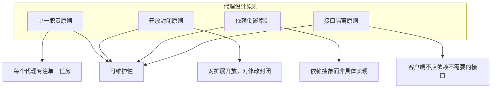

# 第17章: 最佳实践与设计模式

## 学习目标

- 掌握AI代理开发的核心最佳实践
- 学习常见的设计模式和反模式
- 理解性能优化和安全加固方法
- 构建可维护、可扩展的代理系统

## 17.1 核心最佳实践

### 17.1.1 代理设计原则



### 17.1.2 实践指南

#### 1. 代理职责划分

```typescript
// good-practices/agent-separation.ts
import { BaseAgent } from './base-agent';

// ✅ 好的实践：每个代理有明确的职责
export class CodeAnalysisAgent extends BaseAgent {
  async analyzeCode(file: string): Promise<CodeAnalysis> {
    // 专注于代码分析
  }
}

export class SecurityScanAgent extends BaseAgent {
  async scanForVulnerabilities(code: string): Promise<SecurityReport> {
    // 专注于安全扫描
  }
}

// ❌ 不好的实践：一个代理承担太多职责
export class MonolithicAgent extends BaseAgent {
  async analyzeCode(file: string): Promise<CodeAnalysis> { }
  async scanForVulnerabilities(code: string): Promise<SecurityReport> { }
  async generateTests(code: string): Promise<TestSuite> { }
  async writeDocumentation(code: string): Promise<string> { }
  // ... 更多不相关的功能
}
```

#### 2. 接口设计和依赖注入

```typescript
// good-practices/dependency-injection.ts
// ✅ 好的实践：使用接口和依赖注入
export interface ICodeAnalyzer {
  analyze(code: string): Promise<AnalysisResult>;
}

export interface ISecurityScanner {
  scan(code: string): Promise<SecurityResult>;
}

export class ReviewAgent extends BaseAgent {
  constructor(
    private codeAnalyzer: ICodeAnalyzer,
    private securityScanner: ISecurityScanner
  ) {
    super();
  }

  async reviewCode(code: string): Promise<ReviewResult> {
    const analysis = await this.codeAnalyzer.analyze(code);
    const security = await this.securityScanner.scan(code);
    return { analysis, security };
  }
}

// 使用时注入具体实现
const agent = new ReviewAgent(
  new TreeSitterAnalyzer(),
  new SemgrepScanner()
);
```

### 17.1.3 错误处理模式

```typescript
// good-practices/error-handling.ts
export class RobustAgent extends BaseAgent {
  async executeTask(task: Task): Promise<TaskResult> {
    try {
      // 验证输入
      this.validateTask(task);
      
      // 执行主要逻辑
      const result = await this.executeWithRetry(
        async () => await this.processTask(task),
        {
          maxRetries: 3,
          backoff: 'exponential',
          onRetry: (error, attempt) => {
            this.logger.warn(`Retry attempt ${attempt} for task ${task.id}`, { error });
          }
        }
      );
      
      return { success: true, data: result };
      
    } catch (error) {
      // 结构化错误处理
      return this.handleTaskError(task, error);
    }
  }

  // 带重试的执行
  private async executeWithRetry<T>(
    operation: () => Promise<T>,
    config: RetryConfig
  ): Promise<T> {
    let lastError: Error;
    
    for (let attempt = 1; attempt <= config.maxRetries; attempt++) {
      try {
        return await operation();
      } catch (error) {
        lastError = error as Error;
        
        if (attempt < config.maxRetries) {
          const delay = this.calculateBackoff(attempt, config.backoff);
          await this.sleep(delay);
          config.onRetry?.(lastError, attempt);
        }
      }
    }
    
    throw lastError!;
  }

  // 任务错误处理
  private handleTaskError(task: Task, error: unknown): TaskResult {
    const appError = error instanceof AppError ? error : AppError.fromUnknown(error);
    
    this.logger.error(`Task ${task.id} failed`, {
      error: appError.message,
      code: appError.code,
      context: appError.context
    });
    
    // 根据错误类型决定处理策略
    switch (appError.severity) {
      case 'transient':
        return { success: false, retryable: true, error: appError.message };
      case 'permanent':
        return { success: false, retryable: false, error: appError.message };
      case 'critical':
        // 触发告警
        this.alertManager.sendAlert(appError);
        return { success: false, retryable: false, error: appError.message };
    }
  }
}
```

## 17.2 设计模式应用

### 17.2.1 策略模式

```typescript
// design-patterns/strategy-pattern.ts
// 策略模式允许在运行时选择不同的算法

export interface CodeAnalysisStrategy {
  analyze(code: string): Promise<AnalysisResult>;
}

export class SimpleAnalysisStrategy implements CodeAnalysisStrategy {
  async analyze(code: string): Promise<AnalysisResult> {
    // 简单快速的分析
    return { complexity: 'low', lines: code.split('\n').length };
  }
}

export class DeepAnalysisStrategy implements CodeAnalysisStrategy {
  async analyze(code: string): Promise<AnalysisResult> {
    // 深度详细的分析
    return {
      complexity: 'high',
      lines: code.split('\n').length,
      functions: [],
      classes: []
    };
  }
}

export class ConfigurableAnalyzer {
  private strategy: CodeAnalysisStrategy;

  setStrategy(strategy: CodeAnalysisStrategy): void {
    this.strategy = strategy;
  }

  async analyze(code: string): Promise<AnalysisResult> {
    return await this.strategy.analyze(code);
  }
}

// 使用示例
const analyzer = new ConfigurableAnalyzer();

// 快速分析模式
analyzer.setStrategy(new SimpleAnalysisStrategy());
await analyzer.analyze(largeCodebase);

// 详细分析模式
analyzer.setStrategy(new DeepAnalysisStrategy());
await analyzer.analyze(criticalModule);
```

### 17.2.2 观察者模式

```typescript
// design-patterns/observer-pattern.ts
// 观察者模式用于事件通知和状态变化

export interface Observer {
  update(event: AgentEvent): void;
}

export interface Subject {
  attach(observer: Observer): void;
  detach(observer: Observer): void;
  notify(event: AgentEvent): void;
}

export class AgentEventBus implements Subject {
  private observers: Set<Observer> = new Set();

  attach(observer: Observer): void {
    this.observers.add(observer);
  }

  detach(observer: Observer): void {
    this.observers.delete(observer);
  }

  notify(event: AgentEvent): void {
    for (const observer of this.observers) {
      try {
        observer.update(event);
      } catch (error) {
        console.error('Observer notification failed:', error);
      }
    }
  }
}

// 具体观察者实现
export class MetricsCollector implements Observer {
  private metrics: Map<string, number> = new Map();

  update(event: AgentEvent): void {
    switch (event.type) {
      case 'task_completed':
        this.incrementMetric('tasks_completed', 1);
        break;
      case 'task_failed':
        this.incrementMetric('tasks_failed', 1);
        break;
    }
  }

  private incrementMetric(key: string, value: number): void {
    const current = this.metrics.get(key) || 0;
    this.metrics.set(key, current + value);
  }

  getMetrics(): Record<string, number> {
    return Object.fromEntries(this.metrics);
  }
}

export class AuditLogger implements Observer {
  update(event: AgentEvent): void {
    console.log(`[AUDIT] ${event.timestamp}: ${event.type}`, event.data);
  }
}
```

### 17.2.3 责任链模式

```typescript
// design-patterns/chain-of-responsibility.ts
// 责任链模式用于处理管道和验证

export abstract class ValidationHandler {
  private next: ValidationHandler | null = null;

  setNext(handler: ValidationHandler): ValidationHandler {
    this.next = handler;
    return handler;
  }

  async handle(request: ValidationRequest): Promise<ValidationResult> {
    const result = await this.validate(request);
    
    if (!result.valid && result.severity === 'critical') {
      return result; // 停止处理
    }
    
    if (this.next) {
      const nextResult = await this.next.handle(request);
      return this.mergeResults(result, nextResult);
    }
    
    return result;
  }

  protected abstract validate(request: ValidationRequest): Promise<ValidationResult>;

  private mergeResults(current: ValidationResult, next: ValidationResult): ValidationResult {
    return {
      valid: current.valid && next.valid,
      errors: [...current.errors, ...next.errors],
      warnings: [...current.warnings, ...next.warnings],
      severity: this.getHighestSeverity(current.severity, next.severity)
    };
  }

  private getHighestSeverity(s1: string, s2: string): string {
    const severityOrder = ['info', 'warning', 'error', 'critical'];
    const i1 = severityOrder.indexOf(s1);
    const i2 = severityOrder.indexOf(s2);
    return severityOrder[Math.max(i1, i2)];
  }
}

// 具体处理器实现
export class SyntaxValidator extends ValidationHandler {
  protected async validate(request: ValidationRequest): Promise<ValidationResult> {
    // 语法验证逻辑
    return { valid: true, errors: [], warnings: [], severity: 'info' };
  }
}

export class SecurityValidator extends ValidationHandler {
  protected async validate(request: ValidationRequest): Promise<ValidationResult> {
    // 安全验证逻辑
    return { valid: true, errors: [], warnings: [], severity: 'warning' };
  }
}

export class PerformanceValidator extends ValidationHandler {
  protected async validate(request: ValidationRequest): Promise<ValidationResult> {
    // 性能验证逻辑
    return { valid: true, errors: [], warnings: [], severity: 'info' };
  }
}

// 使用示例
const chain = new SyntaxValidator();
chain.setNext(new SecurityValidator())
    .setNext(new PerformanceValidator());

const result = await chain.handle(validationRequest);
```

## 17.3 性能优化模式

### 17.3.1 缓存策略

```typescript
// optimization/caching-strategies.ts
export class SmartCacheManager {
  private caches: Map<string, Cache> = new Map();

  // 多级缓存
  async get(key: string): Promise<any> {
    // L1: 内存缓存
    const l1Cache = this.getCache('L1');
    const l1Result = await l1Cache.get(key);
    if (l1Result) {
      return l1Result;
    }

    // L2: Redis缓存
    const l2Cache = this.getCache('L2');
    const l2Result = await l2Cache.get(key);
    if (l2Result) {
      // 回填L1缓存
      await l1Cache.set(key, l2Result, { ttl: 60000 });
      return l2Result;
    }

    // L3: 数据库
    return null;
  }

  // 智能缓存预热
  async warmup(pattern: string): Promise<void> {
    const keys = await this.getKeysMatchingPattern(pattern);
    
    await Promise.all(
      keys.map(key => this.get(key).then(() => key))
    );
  }

  // 缓存失效策略
  async invalidate(pattern: string): Promise<void> {
    const keys = await this.getKeysMatchingPattern(pattern);
    
    for (const cache of this.caches.values()) {
      await cache.invalidate(keys);
    }
  }
}

// LRU缓存实现
export class LRUCache {
  private capacity: number;
  private cache: Map<string, CacheEntry>;

  constructor(capacity: number) {
    this.capacity = capacity;
    this.cache = new Map();
  }

  async get(key: string): Promise<any> {
    const entry = this.cache.get(key);
    
    if (!entry) {
      return undefined;
    }

    // 更新访问时间
    this.cache.delete(key);
    this.cache.set(key, entry);

    return entry.value;
  }

  async set(key: string, value: any, options?: CacheOptions): Promise<void> {
    // 如果缓存已满，删除最旧的项
    if (this.cache.size >= this.capacity) {
      const firstKey = this.cache.keys().next().value;
      this.cache.delete(firstKey);
    }

    this.cache.set(key, {
      value,
      timestamp: Date.now(),
      ttl: options?.ttl || 3600000 // 默认1小时
    });
  }
}
```

### 17.3.2 批处理优化

```typescript
// optimization/batch-processing.ts
export class BatchProcessor<T> {
  private queue: T[] = [];
  private processing: boolean = false;
  private batchSize: number;
  private batchTimeout: number;
  private processor: (batch: T[]) => Promise<void>;

  constructor(
    batchSize: number,
    batchTimeout: number,
    processor: (batch: T[]) => Promise<void>
  ) {
    this.batchSize = batchSize;
    this.batchTimeout = batchTimeout;
    this.processor = processor;
  }

  async add(item: T): Promise<void> {
    this.queue.push(item);

    if (this.queue.length >= this.batchSize) {
      await this.processBatch();
    } else if (!this.processing) {
      this.scheduleBatch();
    }
  }

  private scheduleBatch(): void {
    setTimeout(() => {
      if (this.queue.length > 0) {
        this.processBatch();
      }
    }, this.batchTimeout);
  }

  private async processBatch(): Promise<void> {
    if (this.processing || this.queue.length === 0) {
      return;
    }

    this.processing = true;
    const batch = this.queue.splice(0, this.batchSize);

    try {
      await this.processor(batch);
    } finally {
      this.processing = false;

      // 如果还有项目，继续处理
      if (this.queue.length > 0) {
        await this.processBatch();
      }
    }
  }

  async flush(): Promise<void> {
    while (this.queue.length > 0) {
      await this.processBatch();
    }
  }
}

// 使用示例
const dbBatchProcessor = new BatchProcessor(
  100, // 每批100条
  5000, // 5秒超时
  async (batch) => {
    await database.bulkInsert(batch);
  }
);

for (const record of records) {
  await dbBatchProcessor.add(record);
}
await dbBatchProcessor.flush();
```

### 17.3.3 并发控制

```typescript
// optimization/concurrency-control.ts
export class ConcurrencyController {
  private semaphore: Semaphore;
  private queue: TaskQueue;

  constructor(maxConcurrent: number) {
    this.semaphore = new Semaphore(maxConcurrent);
    this.queue = new TaskQueue();
  }

  async execute<T>(
    task: () => Promise<T>,
    priority?: number
  ): Promise<T> {
    return await this.semaphore.acquire(async () => {
      return await task();
    });
  }

  // 带优先级的执行
  async executeWithPriority<T>(
    task: () => Promise<T>,
    priority: number
  ): Promise<T> {
    return await this.queue.enqueue(task, priority, async () => {
      return await this.execute(task);
    });
  }
}

export class Semaphore {
  private permits: number;

  constructor(permits: number) {
    this.permits = permits;
  }

  async acquire<T>(operation: () => Promise<T>): Promise<T> {
    while (this.permits <= 0) {
      await this.sleep(10);
    }

    this.permits--;

    try {
      return await operation();
    } finally {
      this.permits++;
    }
  }

  private sleep(ms: number): Promise<void> {
    return new Promise(resolve => setTimeout(resolve, ms));
  }
}

// 使用示例
const controller = new ConcurrencyController(5); // 最多5个并发

// 执行多个任务
const tasks = Array.from({ length: 100 }, (_, i) => 
  controller.execute(() => processItem(i))
);

await Promise.all(tasks);
```

## 17.4 安全最佳实践

### 17.4.1 输入验证和清理

```typescript
// security/input-validation.ts
export class SecurityValidator {
  // 输入验证
  validateInput(input: unknown, schema: ValidationSchema): ValidationResult {
    // 类型检查
    if (!this.checkType(input, schema.type)) {
      return { valid: false, errors: ['Type mismatch'] };
    }

    // 长度检查
    if (schema.maxLength && this.getStringLength(input) > schema.maxLength) {
      return { valid: false, errors: ['Input too long'] };
    }

    // 格式检查
    if (schema.pattern && !this.matchesPattern(input, schema.pattern)) {
      return { valid: false, errors: ['Format mismatch'] };
    }

    // 范围检查
    if (schema.range && !this.inRange(input, schema.range)) {
      return { valid: false, errors: ['Value out of range'] };
    }

    return { valid: true, errors: [] };
  }

  // XSS防护
  sanitizeHtml(input: string): string {
    return input
      .replace(/&/g, '&amp;')
      .replace(/</g, '&lt;')
      .replace(/>/g, '&gt;')
      .replace(/"/g, '&quot;')
      .replace(/'/g, '&#x27;')
      .replace(/\//g, '&#x2F;');
  }

  // SQL注入防护
  sanitizeSqlInput(input: string): string {
    // 转义特殊字符
    return input.replace(/[\0\x08\x09\x1a\n\r"'\\\%]/g, char => {
      switch (char) {
        case '\0': return '\\0';
        case '\x08': return '\\b';
        case '\x09': return '\\t';
        case '\x1a': return '\\z';
        case '\n': return '\\n';
        case '\r': return '\\r';
        case '"': case "'": case '\\': case '%': return '\\' + char;
        default: return char;
      }
    });
  }

  // 命令注入防护
  validateCommandInput(input: string): boolean {
    // 检查危险字符
    const dangerousChars = /[;&|`$(){}[]!*?<>]/;
    return !dangerousChars.test(input);
  }
}
```

### 17.4.2 权限控制

```typescript
// security/authorization.ts
export class PermissionManager {
  private rolePermissions: Map<string, Set<string>> = new Map();
  private resourceOwners: Map<string, string> = new Map();

  // RBAC实现
  hasPermission(agentId: string, permission: string): boolean {
    const roles = this.getAgentRoles(agentId);
    
    for (const role of roles) {
      const permissions = this.rolePermissions.get(role);
      if (permissions?.has(permission)) {
        return true;
      }
    }

    return false;
  }

  // 资源所有权检查
  isResourceOwner(agentId: string, resourceId: string): boolean {
    const owner = this.resourceOwners.get(resourceId);
    return owner === agentId;
  }

  // 操作授权
  canPerformOperation(agentId: string, operation: Operation): boolean {
    // 检查基本权限
    if (!this.hasPermission(agentId, operation.permission)) {
      return false;
    }

    // 检查资源权限
    if (operation.resourceId) {
      if (operation.requiresOwnership && 
          !this.isResourceOwner(agentId, operation.resourceId)) {
        return false;
      }
    }

    return true;
  }
}

// 使用示例
const permissionManager = new PermissionManager();

// 定义权限
permissionManager.defineRole('admin', [
  'read', 'write', 'delete', 'admin'
]);

permissionManager.defineRole('user', [
  'read', 'write'
]);

// 检查权限
if (permissionManager.hasPermission(agentId, 'delete')) {
  await performDeleteOperation();
}
```

### 17.4.3 敏感数据处理

```typescript
// security/sensitive-data.ts
export class DataProtection {
  // 数据加密
  async encryptData(data: string, key: Buffer): Promise<string> {
    try {
      const algorithm = 'aes-256-gcm';
      const iv = crypto.randomBytes(16);
      const cipher = crypto.createCipheriv(algorithm, key, iv);

      let encrypted = cipher.update(data, 'utf8', 'hex');
      encrypted += cipher.final('hex');
      const authTag = cipher.getAuthTag();

      return JSON.stringify({
        encrypted,
        iv: iv.toString('hex'),
        authTag: authTag.toString('hex')
      });
    } catch (error) {
      throw new Error(`Encryption failed: ${error instanceof Error ? error.message : 'Unknown error'}`);
    }
  }

  // 数据解密
  async decryptData(encryptedData: string, key: Buffer): Promise<string> {
    try {
      const parsed = JSON.parse(encryptedData);
      const { encrypted, iv, authTag } = parsed;
      
      if (!encrypted || !iv || !authTag) {
        throw new Error('Invalid encrypted data format');
      }

      const algorithm = 'aes-256-gcm';

      const decipher = crypto.createDecipheriv(
        algorithm,
        key,
        Buffer.from(iv, 'hex')
      );

      decipher.setAuthTag(Buffer.from(authTag, 'hex'));

      let decrypted = decipher.update(encrypted, 'hex', 'utf8');
      decrypted += decipher.final('utf8');

      return decrypted;
    } catch (error) {
      if (error instanceof SyntaxError) {
        throw new Error('Invalid encrypted data: JSON parse failed');
      }
      throw new Error(`Decryption failed: ${error instanceof Error ? error.message : 'Unknown error'}`);
    }
  }

  // 从密码派生密钥
  async deriveKeyFromPassword(password: string, salt: Buffer): Promise<Buffer> {
    return new Promise((resolve, reject) => {
      crypto.pbkdf2(
        password,
        salt,
        100000, // 迭代次数
        32, // 密钥长度（256位）
        'sha256',
        (err, derivedKey) => {
          if (err) {
            reject(new Error(`Key derivation failed: ${err.message}`));
          } else {
            resolve(derivedKey);
          }
        }
      );
    });
  }

  // 生成随机密钥
  generateRandomKey(): Buffer {
    return crypto.randomBytes(32); // 256位密钥
  }

  // 生成随机盐值
  generateSalt(): Buffer {
    return crypto.randomBytes(16);
  }

  // 数据脱敏
  maskSensitiveData(data: Record<string, unknown>): Record<string, unknown> {
    const sensitiveFields = ['password', 'token', 'apiKey', 'secret'];
    const masked: Record<string, unknown> = {};

    for (const [key, value] of Object.entries(data)) {
      if (sensitiveFields.some(field => key.toLowerCase().includes(field))) {
        masked[key] = this.maskValue(String(value));
      } else {
        masked[key] = value;
      }
    }

    return masked;
  }

  private maskValue(value: string): string {
    if (value.length <= 4) {
      return '****';
    }
    return value.substring(0, 2) + '****' + value.substring(value.length - 2);
  }

  // 完整使用示例
  static async usageExample() {
    const dataProtection = new DataProtection();
    
    // 示例1: 使用随机密钥加密
    const key = dataProtection.generateRandomKey();
    const sensitiveData = 'This is sensitive information';
    
    const encrypted = await dataProtection.encryptData(sensitiveData, key);
    console.log('Encrypted:', encrypted);
    
    const decrypted = await dataProtection.decryptData(encrypted, key);
    console.log('Decrypted:', decrypted);
    
    // 示例2: 从密码派生密钥
    const password = 'user_password_123';
    const salt = dataProtection.generateSalt();
    
    const derivedKey = await dataProtection.deriveKeyFromPassword(password, salt);
    const encrypted2 = await dataProtection.encryptData(sensitiveData, derivedKey);
    const decrypted2 = await dataProtection.decryptData(encrypted2, derivedKey);
    
    // 示例3: 数据脱敏
    const userData = {
      username: 'john_doe',
      password: 'secret123',
      email: 'john@example.com',
      apiKey: 'sk-1234567890'
    };
    
    const maskedData = dataProtection.maskSensitiveData(userData);
    console.log('Masked data:', maskedData);
    // 输出: { username: 'john_doe', password: 'se****23', email: 'john@example.com', apiKey: 'sk-****90' }
  }
}
```

## 17.5 反模式识别

### 17.5.1 常见反模式

```typescript
// anti-patterns/common-mistakes.ts

// ❌ 反模式1: 上帝代理
class GodAgent extends BaseAgent {
  // 承担太多职责
  async analyzeCode() { }
  async writeCode() { }
  async testCode() { }
  async deployCode() { }
  async monitorCode() { }
}

// ✅ 正确做法: 职责分离
class CodeAnalyzer extends BaseAgent {
  async analyze() { }
}

class CodeWriter extends BaseAgent {
  async write() { }
}

// ❌ 反模式2: 紧密耦合
class TightlyCoupledAgent extends BaseAgent {
  constructor() {
    super();
    this.dependency = new ConcreteImplementation(); // 硬编码依赖
  }
}

// ✅ 正确做法: 依赖注入
class LooselyCoupledAgent extends BaseAgent {
  constructor(private dependency: Interface) {
    super();
  }
}

// ❌ 反模式3: 忽略错误处理
class UnsafeAgent extends BaseAgent {
  async process(data: string): Promise<void> {
    const result = JSON.parse(data); // 可能抛出异常
    await this.processData(result); // 可能失败但没有错误处理
  }
}

// ✅ 正确做法: 完整错误处理
class SafeAgent extends BaseAgent {
  async process(data: string): Promise<void> {
    try {
      const result = this.parseAndValidate(data);
      await this.processData(result);
    } catch (error) {
      await this.handleError(error);
      await this.reportIncident(error);
    }
  }
}
```

## 17.6 监控和调试

### 17.6.1 结构化日志

```typescript
// monitoring/structured-logging.ts
export class StructuredLogger {
  private context: LogContext;

  constructor(context: LogContext) {
    this.context = context;
  }

  info(message: string, meta?: Record<string, unknown>): void {
    this.log('info', message, meta);
  }

  error(message: string, error?: Error, meta?: Record<string, unknown>): void {
    this.log('error', message, {
      ...meta,
      error: {
        message: error?.message,
        stack: error?.stack,
        code: (error as any).code
      }
    });
  }

  private log(level: string, message: string, meta?: Record<string, unknown>): void {
    const logEntry = {
      timestamp: new Date().toISOString(),
      level,
      message,
      context: this.context,
      ...meta
    };

    console.log(JSON.stringify(logEntry));
  }
}

// 使用示例
const logger = new StructuredLogger({
  service: 'agent-service',
  component: 'review-agent',
  instance: 'agent-001'
});

logger.info('Processing started', { taskId: '12345' });
logger.error('Processing failed', error, { taskId: '12345' });
```

### 17.6.2 性能监控

```typescript
// monitoring/performance-tracking.ts
export class PerformanceTracker {
  private metrics: Map<string, Metric> = new Map();

  // 跟踪操作性能
  async track<T>(
    operation: string,
    fn: () => Promise<T>
  ): Promise<T> {
    const start = Date.now();
    const metric = this.getOrCreateMetric(operation);

    try {
      const result = await fn();
      const duration = Date.now() - start;

      this.recordSuccess(metric, duration);
      return result;

    } catch (error) {
      const duration = Date.now() - start;
      this.recordFailure(metric, duration, error);
      throw error;
    }
  }

  // 获取性能统计
  getStatistics(operation: string): PerformanceStats {
    const metric = this.metrics.get(operation);
    if (!metric) {
      throw new Error(`No metrics for operation: ${operation}`);
    }

    return {
      totalCalls: metric.successCount + metric.failureCount,
      successRate: metric.successCount / (metric.successCount + metric.failureCount),
      averageDuration: metric.totalDuration / metric.successCount,
      minDuration: metric.minDuration,
      maxDuration: metric.maxDuration,
      percentile95: this.calculatePercentile(metric.durations, 95)
    };
  }

  private calculatePercentile(durations: number[], p: number): number {
    const sorted = durations.slice().sort((a, b) => a - b);
    const index = Math.ceil((p / 100) * sorted.length) - 1;
    return sorted[index];
  }
}
```

## 17.7 本章小结

### 关键要点

- **设计原则**: SOLID原则在代理开发中的应用
- **设计模式**: 策略模式、观察者模式、责任链模式
- **性能优化**: 缓存策略、批处理、并发控制
- **安全实践**: 输入验证、权限控制、数据保护

### 最佳实践清单

✅ **代码质量**
- 使用接口和依赖注入
- 实施完整的错误处理
- 编写可测试的代码
- 遵循一致的代码风格

✅ **性能优化**
- 实施多级缓存策略
- 使用批处理减少开销
- 控制并发避免资源竞争
- 监控性能指标

✅ **安全加固**
- 验证所有输入数据
- 实施最小权限原则
- 加密敏感信息
- 定期安全审计

✅ **运维监控**
- 结构化日志记录
- 性能指标收集
- 错误追踪和告警
- 健康检查端点

### 下一步学习

现在你已经掌握了最佳实践和设计模式，最后我们将：

- 📖 **第18章**: 故障排除和调试技巧
- 🔧 **实践**: 解决实际问题
- 🎯 **目标**: 成为AI代理开发专家

---

**准备好学习最后的调试技巧了吗？** 🛠️
