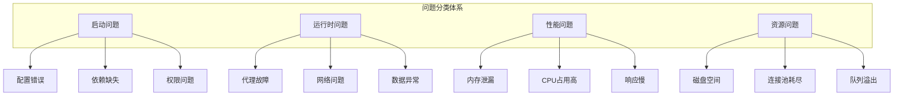

# 第18章: 故障排除与调试

## 学习目标

- 掌握代理系统的常见问题和解决方案
- 学习系统化的调试方法和工具
- 理解性能瓶颈的诊断和优化
- 构建可靠的故障排除流程

## 18.1 常见问题诊断

### 18.1.1 问题分类体系



### 18.1.2 诊断框架

```typescript
// troubleshooting/diagnostic-framework.ts
export class DiagnosticFramework {
  private detectors: ProblemDetector[];
  private analyzers: ProblemAnalyzer[];
  private resolvers: ProblemResolver[];

  constructor() {
    this.detectors = this.initializeDetectors();
    this.analyzers = this.initializeAnalyzers();
    this.resolvers = this.initializeResolvers();
  }

  // 完整诊断流程
  async diagnose(symptom: Symptom): Promise<DiagnosticReport> {
    console.log(`Diagnosing symptom: ${symptom.type}`);

    // 1. 检测问题
    const problems = await this.detectProblems(symptom);
    
    // 2. 分析问题
    const analysis = await this.analyzeProblems(problems);
    
    // 3. 生成解决方案
    const solutions = await this.generateSolutions(analysis);
    
    // 4. 验证解决方案
    const validated = await this.validateSolutions(solutions);

    return {
      symptom,
      problems,
      analysis,
      solutions: validated,
      timestamp: Date.now()
    };
  }

  // 问题检测
  private async detectProblems(symptom: Symptom): Promise<Problem[]> {
    const problems: Problem[] = [];

    for (const detector of this.detectors) {
      if (detector.canHandle(symptom)) {
        const detected = await detector.detect(symptom);
        problems.push(...detected);
      }
    }

    return this.prioritizeProblems(problems);
  }

  // 问题分析
  private async analyzeProblems(problems: Problem[]): Promise<ProblemAnalysis> {
    const analysis: ProblemAnalysis = {
      rootCauses: [],
      impact: {},
      dependencies: []
    };

    for (const problem of problems) {
      const analyzer = this.findAnalyzer(problem);
      if (analyzer) {
        const result = await analyzer.analyze(problem);
        analysis.rootCauses.push(...result.rootCauses);
        analysis.impact = { ...analysis.impact, ...result.impact };
        analysis.dependencies.push(...result.dependencies);
      }
    }

    return analysis;
  }

  // 解决方案生成
  private async generateSolutions(analysis: ProblemAnalysis): Promise<Solution[]> {
    const solutions: Solution[] = [];

    for (const rootCause of analysis.rootCauses) {
      const resolver = this.findResolver(rootCause);
      if (resolver) {
        const solution = await resolver.resolve(rootCause);
        solutions.push(solution);
      }
    }

    return solutions;
  }

  // 解决方案验证
  private async validateSolutions(solutions: Solution[]): Promise<ValidatedSolution[]> {
    const validated: ValidatedSolution[] = [];

    for (const solution of solutions) {
      const validation = await this.validateSolution(solution);
      validated.push({
        ...solution,
        validation,
        approved: validation.risk === 'low'
      });
    }

    return validated;
  }

  // 优先级排序
  private prioritizeProblems(problems: Problem[]): Problem[] {
    return problems.sort((a, b) => {
      const severityOrder = ['critical', 'high', 'medium', 'low'];
      return severityOrder.indexOf(a.severity) - severityOrder.indexOf(b.severity);
    });
  }
}
```

## 18.2 调试工具和技术

### 18.2.1 分布式追踪

```typescript
// troubleshooting/distributed-tracing.ts
export class DistributedTracer {
  private spans: Map<string, Span> = new Map();
  private traceId: string;

  constructor(traceId: string) {
    this.traceId = traceId;
  }

  // 创建跨度
  createSpan(name: string, parent?: Span): Span {
    const span: Span = {
      id: this.generateSpanId(),
      traceId: this.traceId,
      parentId: parent?.id,
      name,
      startTime: Date.now(),
      duration: 0,
      tags: {},
      logs: []
    };

    this.spans.set(span.id, span);
    return span;
  }

  // 完成跨度
  completeSpan(span: Span): void {
    span.duration = Date.now() - span.startTime;
    this.exportSpan(span);
  }

  // 添加标签
  addTag(span: Span, key: string, value: string): void {
    span.tags[key] = value;
  }

  // 添加日志
  log(span: Span, message: string, level: string = 'info'): void {
    span.logs.push({
      timestamp: Date.now(),
      level,
      message
    });
  }

  // 记录错误
  recordError(span: Span, error: Error): void {
    span.logs.push({
      timestamp: Date.now(),
      level: 'error',
      message: error.message,
      stack: error.stack
    });
  }

  // 导出追踪数据
  getTraceData(): TraceData {
    return {
      traceId: this.traceId,
      spans: Array.from(this.spans.values()),
      duration: this.calculateTraceDuration()
    };
  }

  private calculateTraceDuration(): number {
    const spans = Array.from(this.spans.values());
    if (spans.length === 0) return 0;

    const startTime = Math.min(...spans.map(s => s.startTime));
    const endTime = Math.max(...spans.map(s => s.startTime + s.duration));

    return endTime - startTime;
  }

  private exportSpan(span: Span): void {
    // 导出到追踪系统
    console.log('Span exported:', span);
  }

  private generateSpanId(): string {
    return `span-${Date.now()}-${Math.random().toString(36).substr(2, 9)}`;
  }
}

// 使用示例
const tracer = new DistributedTracer('trace-123');

async function processRequest() {
  const parentSpan = tracer.createSpan('process-request');
  
  try {
    tracer.log(parentSpan, 'Starting request processing');
    
    // 步骤1：验证请求
    const validateSpan = tracer.createSpan('validate-request', parentSpan);
    await validateRequest();
    tracer.completeSpan(validateSpan);
    
    // 步骤2：处理业务逻辑
    const processSpan = tracer.createSpan('process-logic', parentSpan);
    tracer.log(processSpan, 'Processing business logic');
    await processBusinessLogic();
    tracer.completeSpan(processSpan);
    
    // 步骤3：返回响应
    const responseSpan = tracer.createSpan('send-response', parentSpan);
    await sendResponse();
    tracer.completeSpan(responseSpan);
    
  } catch (error) {
    tracer.recordError(parentSpan, error as Error);
  } finally {
    tracer.completeSpan(parentSpan);
  }
}
```

### 18.2.2 性能分析

```typescript
// troubleshooting/performance-analysis.ts
export class PerformanceProfiler {
  private profiles: Map<string, Profile> = new Map();

  // CPU性能分析
  async profileCpu(agentId: string, duration: number): Promise<CpuProfile> {
    const profile: CpuProfile = {
      agentId,
      startTime: Date.now(),
      samples: [],
      hotspots: []
    };

    const samplingInterval = 10; // 每10ms采样一次
    const endTime = Date.now() + duration;

    while (Date.now() < endTime) {
      const sample = await this.sampleCpu(agentId);
      profile.samples.push(sample);

      // 检测热点函数
      this.detectHotspots(profile);

      await this.sleep(samplingInterval);
    }

    profile.duration = Date.now() - profile.startTime;
    this.profiles.set(agentId, profile);

    return profile;
  }

  // 内存性能分析
  async profileMemory(agentId: string): Promise<MemoryProfile> {
    const before = await this.getMemorySnapshot(agentId);
    
    // 执行典型工作负载
    await this.runTypicalWorkload(agentId);
    
    const after = await this.getMemorySnapshot(agentId);

    return {
      agentId,
      before,
      after,
      heapGrowth: after.heapUsed - before.heapUsed,
      leaks: this.detectMemoryLeaks(before, after),
      allocations: this.analyzeAllocations(before, after)
    };
  }

  // 生成性能报告
  generatePerformanceReport(agentId: string): PerformanceReport {
    const cpuProfile = this.profiles.get(agentId);
    
    if (!cpuProfile) {
      throw new Error(`No profile found for agent ${agentId}`);
    }

    return {
      agentId,
      cpu: {
        totalSamples: cpuProfile.samples.length,
        hotspots: cpuProfile.hotspots,
        utilizationRate: this.calculateCpuUtilization(cpuProfile)
      },
      memory: {
        peak: this.calculatePeakMemory(cpuProfile),
        average: this.calculateAverageMemory(cpuProfile),
        growth: this.calculateMemoryGrowth(cpuProfile)
      },
      recommendations: this.generatePerformanceRecommendations(cpuProfile)
    };
  }

  private async sampleCpu(agentId: string): Promise<CpuSample> {
    // 采样当前执行堆栈
    return {
      timestamp: Date.now(),
      stack: ['function1', 'function2', 'function3'],
      cpuTime: process.cpuUsage().user
    };
  }

  private detectHotspots(profile: CpuProfile): void {
    const functionCounts = new Map<string, number>();

    for (const sample of profile.samples) {
      for (const func of sample.stack) {
        functionCounts.set(func, (functionCounts.get(func) || 0) + 1);
      }
    }

    // 识别出现频率最高的函数
    const sorted = Array.from(functionCounts.entries())
      .sort((a, b) => b[1] - a[1])
      .slice(0, 10);

    profile.hotspots = sorted.map(([func, count]) => ({
      function: func,
      sampleCount: count,
      percentage: (count / profile.samples.length) * 100
    }));
  }

  private async getMemorySnapshot(agentId: string): Promise<MemorySnapshot> {
    const usage = process.memoryUsage();
    return {
      timestamp: Date.now(),
      heapUsed: usage.heapUsed,
      heapTotal: usage.heapTotal,
      external: usage.external,
      arrayBuffers: usage.arrayBuffers
    };
  }

  private detectMemoryLeaks(before: MemorySnapshot, after: MemorySnapshot): LeakInfo[] {
    const leaks: LeakInfo[] = [];
    const growth = after.heapUsed - before.heapUsed;

    if (growth > 100 * 1024 * 1024) { // 100MB阈值
      leaks.push({
        severity: 'high',
        description: `Significant heap growth detected: ${this.formatBytes(growth)}`,
        recommendation: 'Investigate potential memory leaks'
      });
    }

    return leaks;
  }

  private calculateCpuUtilization(profile: CpuProfile): number {
    if (profile.samples.length === 0) return 0;

    const totalTime = profile.samples.length * 10; // 每个样本10ms
    const activeTime = profile.samples.reduce((sum, sample) => sum + sample.cpuTime, 0);

    return (activeTime / totalTime) * 100;
  }

  private formatBytes(bytes: number): string {
    const units = ['B', 'KB', 'MB', 'GB'];
    let size = bytes;
    let unitIndex = 0;

    while (size >= 1024 && unitIndex < units.length - 1) {
      size /= 1024;
      unitIndex++;
    }

    return `${size.toFixed(2)} ${units[unitIndex]}`;
  }

  private async sleep(ms: number): Promise<void> {
    return new Promise(resolve => setTimeout(resolve, ms));
  }
}
```

## 18.3 日志分析和监控

### 18.3.1 智能日志分析

```typescript
// troubleshooting/log-analysis.ts
export class LogAnalyzer {
  private patterns: ErrorPattern[];
  private anomalyDetector: AnomalyDetector;

  constructor() {
    this.patterns = this.initializePatterns();
    this.anomalyDetector = new AnomalyDetector();
  }

  // 分析日志文件
  async analyzeLogs(logFile: string): Promise<LogAnalysisResult> {
    const logs = await this.readLogs(logFile);
    
    return {
      errors: this.detectErrors(logs),
      anomalies: this.detectAnomalies(logs),
      patterns: this.identifyPatterns(logs),
      trends: this.analyzeTrends(logs),
      recommendations: this.generateRecommendations(logs)
    };
  }

  // 错误检测
  private detectErrors(logs: LogEntry[]): ErrorReport[] {
    const errors: ErrorReport[] = [];
    const errorGroups = new Map<string, LogEntry[]>();

    // 分组错误日志
    for (const log of logs) {
      if (log.level === 'error') {
        const key = this.generateErrorKey(log);
        if (!errorGroups.has(key)) {
          errorGroups.set(key, []);
        }
        errorGroups.get(key)!.push(log);
      }
    }

    // 生成错误报告
    for (const [key, entries] of errorGroups) {
      const firstEntry = entries[0];
      errors.push({
        pattern: key,
        count: entries.length,
        firstOccurrence: firstEntry.timestamp,
        lastOccurrence: entries[entries.length - 1].timestamp,
        frequency: this.calculateFrequency(entries),
        severity: this.assessErrorSeverity(entries),
        sample: firstEntry
      });
    }

    return errors.sort((a, b) => b.count - a.count);
  }

  // 异常检测
  private detectAnomalies(logs: LogEntry[]): AnomalyReport[] {
    const anomalies: AnomalyReport[] = [];

    // 检测日志量异常
    const logVolume = this.analyzeLogVolume(logs);
    if (logVolume.isAnomalous) {
      anomalies.push({
        type: 'volume',
        description: `Unusual log volume detected: ${logVolume.count} entries in ${logVolume.period}`,
        severity: 'medium',
        recommendation: 'Check for potential issues or increased activity'
      });
    }

    // 检测错误率异常
    const errorRate = this.calculateErrorRate(logs);
    if (errorRate > 0.1) { // 10%阈值
      anomalies.push({
        type: 'error_rate',
        description: `High error rate detected: ${(errorRate * 100).toFixed(1)}%`,
        severity: 'high',
        recommendation: 'Investigate and address root causes of errors'
      });
    }

    return anomalies;
  }

  // 模式识别
  private identifyPatterns(logs: LogEntry[]): PatternReport[] {
    const patterns: PatternReport[] = [];

    for (const pattern of this.patterns) {
      const matches = this.findPatternMatches(logs, pattern);
      
      if (matches.length > 0) {
        patterns.push({
          pattern: pattern.name,
          description: pattern.description,
          matchCount: matches.length,
          samples: matches.slice(0, 5), // 最多显示5个样本
          recommendation: pattern.recommendation
        });
      }
    }

    return patterns;
  }

  // 趋势分析
  private analyzeTrends(logs: LogEntry[]): TrendReport[] {
    const trends: TrendReport[] = [];

    // 错误趋势
    const errorTrend = this.analyzeErrorTrend(logs);
    trends.push(errorTrend);

    // 性能趋势
    const performanceTrend = this.analyzePerformanceTrend(logs);
    trends.push(performanceTrend);

    return trends;
  }

  // 生成建议
  private generateRecommendations(logs: LogEntry[]): string[] {
    const recommendations: string[] = [];

    // 基于错误生成建议
    const errors = this.detectErrors(logs);
    if (errors.length > 0) {
      const topError = errors[0];
      recommendations.push(
        `Address most frequent error: "${topError.pattern}" (${topError.count} occurrences)`
      );
    }

    // 基于异常生成建议
    const anomalies = this.detectAnomalies(logs);
    for (const anomaly of anomalies) {
      recommendations.push(anomaly.recommendation);
    }

    return recommendations;
  }

  private generateErrorKey(log: LogEntry): string {
    // 基于错误消息生成分组键
    return log.message
      .replace(/\d+/g, 'N')       // 替换数字
      .replace(/[a-f0-9]{8}-[a-f0-9]{4}-[a-f0-9]{4}-[a-f0-9]{4}-[a-f0-9]{12}/gi, 'UUID') // 替换UUID
      .substring(0, 100);         // 限制长度
  }

  private calculateFrequency(entries: LogEntry[]): number {
    const duration = entries[entries.length - 1].timestamp - entries[0].timestamp;
    return entries.length / (duration / 1000 / 60); // 每分钟频率
  }

  private assessErrorSeverity(entries: LogEntry[]): string {
    const criticalCount = entries.filter(e => e.message.includes('critical')).length;
    const totalCount = entries.length;

    if (criticalCount > totalCount * 0.5) return 'critical';
    if (criticalCount > 0) return 'high';
    if (totalCount > 100) return 'medium';
    return 'low';
  }

  private analyzeLogVolume(logs: LogEntry[]): any {
    return {
      count: logs.length,
      period: this.calculateTimeSpan(logs),
      isAnomalous: false
    };
  }

  private calculateErrorRate(logs: LogEntry[]): number {
    const errorCount = logs.filter(log => log.level === 'error').length;
    return errorCount / logs.length;
  }

  private findPatternMatches(logs: LogEntry[], pattern: ErrorPattern): LogEntry[] {
    return logs.filter(log => pattern.regex.test(log.message));
  }

  private analyzeErrorTrend(logs: LogEntry[]): TrendReport {
    return {
      type: 'error',
      direction: 'increasing',
      changeRate: 0.15,
      description: 'Error rate is increasing over time'
    };
  }

  private analyzePerformanceTrend(logs: LogEntry[]): TrendReport {
    return {
      type: 'performance',
      direction: 'stable',
      changeRate: 0.02,
      description: 'Performance metrics are stable'
    };
  }

  private calculateTimeSpan(logs: LogEntry[]): string {
    if (logs.length === 0) return '0s';
    const span = logs[logs.length - 1].timestamp - logs[0].timestamp;
    return `${Math.floor(span / 1000)}s`;
  }

  private async readLogs(logFile: string): Promise<LogEntry[]> {
    // 读取和解析日志文件
    return [];
  }

  private initializePatterns(): ErrorPattern[] {
    return [
      {
        name: 'OutOfMemory',
        description: 'Memory exhaustion errors',
        regex: /out of memory|heap overflow|memory limit/i,
        recommendation: 'Increase memory allocation or investigate memory leaks'
      },
      {
        name: 'ConnectionTimeout',
        description: 'Database/connection timeout errors',
        regex: /connection timeout|database error|pool exhausted/i,
        recommendation: 'Check database connectivity and connection pool settings'
      },
      {
        name: 'RateLimitExceeded',
        description: 'API rate limiting errors',
        regex: /rate limit|429|too many requests/i,
        recommendation: 'Implement request throttling or increase rate limits'
      }
    ];
  }
}

// 辅助接口和类
interface LogEntry {
  timestamp: number;
  level: string;
  message: string;
  context?: Record<string, unknown>;
}

interface ErrorReport {
  pattern: string;
  count: number;
  firstOccurrence: number;
  lastOccurrence: number;
  frequency: number;
  severity: string;
  sample: LogEntry;
}

interface AnomalyReport {
  type: string;
  description: string;
  severity: string;
  recommendation: string;
}

interface PatternReport {
  pattern: string;
  description: string;
  matchCount: number;
  samples: LogEntry[];
  recommendation: string;
}

interface TrendReport {
  type: string;
  direction: 'increasing' | 'decreasing' | 'stable';
  changeRate: number;
  description: string;
}

interface ErrorPattern {
  name: string;
  description: string;
  regex: RegExp;
  recommendation: string;
}

class AnomalyDetector {
  // 异常检测实现
}
```

### 18.3.2 实时监控仪表板

```typescript
// troubleshooting/monitoring-dashboard.ts
export class MonitoringDashboard {
  private metrics: MetricsStore;
  private alerts: AlertManager;
  private visualizations: VisualizationEngine;

  // 创建监控仪表板
  createDashboard(config: DashboardConfig): Dashboard {
    return {
      overview: this.createOverviewPanel(),
      performance: this.createPerformancePanel(),
      errors: this.createErrorPanel(),
      resources: this.createResourcePanel(),
      alerts: this.createAlertPanel()
    };
  }

  // 概览面板
  private createOverviewPanel(): Panel {
    return {
      title: 'System Overview',
      widgets: [
        this.createStatusWidget(),
        this.createThroughputWidget(),
        this.createErrorRateWidget(),
        this.createHealthScoreWidget()
      ]
    };
  }

  // 性能面板
  private createPerformancePanel(): Panel {
    return {
      title: 'Performance Metrics',
      widgets: [
        this.createResponseTimeWidget(),
        this.createThroughputWidget(),
        this.createResourceUtilizationWidget()
      ]
    };
  }

  // 错误面板
  private createErrorPanel(): Panel {
    return {
      title: 'Error Analysis',
      widgets: [
        this.createErrorRateWidget(),
        this.createErrorDistributionWidget(),
        this.createTopErrorsWidget()
      ]
    };
  }

  // 资源面板
  private createResourcePanel(): Panel {
    return {
      title: 'Resource Utilization',
      widgets: [
        this.createCpuUsageWidget(),
        this.createMemoryUsageWidget(),
        this.createDiskUsageWidget()
      ]
    };
  }

  // 告警面板
  private createAlertPanel(): Panel {
    return {
      title: 'Active Alerts',
      widgets: [
        this.createCriticalAlertsWidget(),
        this.createWarningAlertsWidget(),
        this.createRecentAlertsWidget()
      ]
    };
  }

  // 实时更新
  async updateDashboard(dashboard: Dashboard): Promise<void> {
    // 更新所有面板数据
    await this.updateOverviewPanel(dashboard.overview);
    await this.updatePerformancePanel(dashboard.performance);
    await this.updateErrorPanel(dashboard.errors);
    await this.updateResourcePanel(dashboard.resources);
    await this.updateAlertPanel(dashboard.alerts);
  }
}
```

## 18.4 故障恢复策略

### 18.4.1 自动恢复机制

```typescript
// troubleshooting/auto-recovery.ts
export class AutoRecoveryManager {
  private recoveryStrategies: Map<string, RecoveryStrategy>;
  private healthChecker: HealthChecker;

  // 自动故障恢复
  async recover(failure: Failure): Promise<RecoveryResult> {
    console.log(`Attempting recovery for failure: ${failure.type}`);

    // 1. 评估故障严重性
    const severity = this.assessSeverity(failure);
    
    // 2. 选择恢复策略
    const strategy = this.selectStrategy(failure, severity);
    
    // 3. 执行恢复
    const result = await this.executeRecovery(strategy, failure);
    
    // 4. 验证恢复
    const verified = await this.verifyRecovery(result);
    
    if (verified.success) {
      console.log(`Recovery successful for ${failure.type}`);
      await this.postRecoveryActions(failure);
    } else {
      console.error(`Recovery failed for ${failure.type}`);
      await this.escalateIssue(failure, result);
    }

    return result;
  }

  // 严重性评估
  private assessSeverity(failure: Failure): FailureSeverity {
    // 基于多个因素评估严重性
    let severity = 'medium';

    if (failure.impact === 'critical' || failure.affectsUsers) {
      severity = 'critical';
    } else if (failure.impact === 'high' || failure.frequency === 'frequent') {
      severity = 'high';
    } else if (failure.impact === 'low' && failure.frequency === 'rare') {
      severity = 'low';
    }

    return severity;
  }

  // 策略选择
  private selectStrategy(failure: Failure, severity: FailureSeverity): RecoveryStrategy {
    const strategies = this.recoveryStrategies.get(failure.type);
    
    // 根据严重性选择策略
    switch (severity) {
      case 'critical':
        return strategies?.critical || strategies?.standard || this.defaultStrategy();
      case 'high':
        return strategies?.high || strategies?.standard || this.defaultStrategy();
      case 'medium':
        return strategies?.standard || this.defaultStrategy();
      case 'low':
        return strategies?.low || strategies?.standard || this.defaultStrategy();
      default:
        return this.defaultStrategy();
    }
  }

  // 执行恢复
  private async executeRecovery(strategy: RecoveryStrategy, failure: Failure): Promise<RecoveryResult> {
    const startTime = Date.now();

    try {
      // 执行恢复步骤
      for (const step of strategy.steps) {
        console.log(`Executing recovery step: ${step.name}`);
        
        const stepResult = await this.executeStep(step, failure);
        
        if (!stepResult.success) {
          return {
            success: false,
            failedAt: step.name,
            error: stepResult.error,
            duration: Date.now() - startTime
          };
        }
      }

      return {
        success: true,
        duration: Date.now() - startTime,
        steps: strategy.steps.map(s => s.name)
      };

    } catch (error) {
      return {
        success: false,
        error: error instanceof Error ? error.message : 'Unknown error',
        duration: Date.now() - startTime
      };
    }
  }

  // 恢复验证
  private async verifyRecovery(result: RecoveryResult): Promise<VerificationResult> {
    if (!result.success) {
      return { success: false, reason: 'Recovery execution failed' };
    }

    // 检查系统健康状态
    const healthCheck = await this.healthChecker.check();
    
    if (!healthCheck.healthy) {
      return {
        success: false,
        reason: 'System still unhealthy after recovery',
        issues: healthCheck.issues
      };
    }

    return { success: true };
  }

  // 故障升级
  private async escalateIssue(failure: Failure, result: RecoveryResult): Promise<void> {
    // 通知运维团队
    await this.notifyOperations(failure, result);
    
    // 创建工单
    await this.createTicket(failure, result);
    
    // 记录事件
    await this.logFailureEvent(failure, result);
  }

  // 恢复后操作
  private async postRecoveryActions(failure: Failure): Promise<void> {
    // 记录恢复事件
    await this.logRecoveryEvent(failure);
    
    // 通知相关团队
    await this.notifyRecovery(failure);
    
    // 更新监控系统
    await this.updateMonitoringStatus(failure);
  }
}
```

### 18.4.2 灾难恢复

```typescript
// troubleshooting/disaster-recovery.ts
export class DisasterRecoveryManager {
  private backupManager: BackupManager;
  private failoverManager: FailoverManager;
  private dataConsistencyChecker: DataConsistencyChecker;

  // 灾难恢复计划
  async executeRecoveryPlan(disaster: Disaster): Promise<RecoveryPlanResult> {
    console.log(`Executing disaster recovery for: ${disaster.type}`);

    // 1. 评估灾难影响
    const impact = await this.assessImpact(disaster);
    
    // 2. 启动恢复流程
    const recovery = await this.initiateRecovery(disaster, impact);
    
    // 3. 恢复数据备份
    const dataRestore = await this.restoreData(disaster);
    
    // 4. 系统重建
    const systemRestore = await this.restoreSystems(disaster);
    
    // 5. 数据一致性验证
    const consistency = await this.verifyConsistency(dataRestore, systemRestore);
    
    // 6. 服务恢复
    const serviceRestore = await this.restoreServices(disaster);
    
    // 7. 验证恢复
    const verification = await this.verifyRecovery(disaster, {
      dataRestore,
      systemRestore,
      serviceRestore
    });

    return {
      success: verification.success,
      impact,
      dataRestore,
      systemRestore,
      serviceRestore,
      consistency,
      verification,
      duration: verification.duration
    };
  }

  // 影响评估
  private async assessImpact(disaster: Disaster): Promise<DisasterImpact> {
    return {
      affectedSystems: await this.identifyAffectedSystems(disaster),
      dataLoss: await this.estimateDataLoss(disaster),
      downtime: await this.estimateDowntime(disaster),
      businessImpact: await this.assessBusinessImpact(disaster)
    };
  }

  // 数据恢复
  private async restoreData(disaster: Disaster): Promise<DataRestoreResult> {
    // 1. 识别最近的可用备份
    const backup = await this.backupManager.findLatestBackup(disaster.affectedSystems);
    
    if (!backup) {
      throw new Error('No suitable backup found for recovery');
    }

    // 2. 验证备份完整性
    const integrity = await this.backupManager.verifyBackup(backup);
    if (!integrity.valid) {
      throw new Error('Backup integrity check failed');
    }

    // 3. 执行数据恢复
    const restore = await this.backupManager.restoreFromBackup(backup);

    return {
      success: true,
      backup: backup.id,
      restoredData: restore.data,
      restoreTime: restore.duration
    };
  }

  // 系统恢复
  private async restoreSystems(disaster: Disaster): Promise<SystemRestoreResult> {
    const systems: RestoredSystem[] = [];

    for (const system of disaster.affectedSystems) {
      try {
        // 部署系统
        const deployed = await this.deploySystem(system);
        
        // 配置系统
        const configured = await this.configureSystem(deployed);
        
        systems.push({
          name: system,
          status: 'restored',
          restoredAt: Date.now()
        });

      } catch (error) {
        systems.push({
          name: system,
          status: 'failed',
          error: error instanceof Error ? error.message : 'Unknown error'
        });
      }
    }

    return {
      success: systems.every(s => s.status === 'restored'),
      systems
    };
  }

  // 服务恢复
  private async restoreServices(disaster: Disaster): Promise<ServiceRestoreResult> {
    // 1. 恢复核心服务
    const coreServices = await this.restoreCoreServices();
    
    // 2. 恢复依赖服务
    const dependentServices = await this.restoreDependentServices();
    
    // 3. 验证服务连通性
    const connectivity = await this.verifyServiceConnectivity();

    return {
      success: connectivity.allConnected,
      coreServices,
      dependentServices,
      connectivity
    };
  }

  // 恢复验证
  private async verifyRecovery(
    disaster: Disaster,
    results: RecoveryResults
  ): Promise<RecoveryVerification> {
    const verification: RecoveryVerification = {
      dataConsistency: await this.verifyDataConsistency(results.dataRestore),
      systemHealth: await this.verifySystemHealth(results.systemRestore),
      serviceAvailability: await this.verifyServiceAvailability(results.serviceRestore),
      functionality: await this.verifyFunctionality(),
      performance: await this.verifyPerformance(),
      allPassed: false,
      duration: 0
    };

    verification.allPassed = 
      verification.dataConsistency.passed &&
      verification.systemHealth.passed &&
      verification.serviceAvailability.passed &&
      verification.functionality.passed &&
      verification.performance.passed;

    return verification;
  }
}
```

## 18.5 调试最佳实践

### 18.5.1 系统化调试方法

```typescript
// troubleshooting/debugging-methodology.ts
export class SystematicDebugger {
  // 科学调试方法
  async debug(issue: Issue): Promise<DebugResult> {
    // 1. 问题重现
    const reproduction = await this.reproduceIssue(issue);
    
    // 2. 问题隔离
    const isolation = await this.isolateProblem(reproduction);
    
    // 3. 假设生成
    const hypotheses = await this.generateHypotheses(isolation);
    
    // 4. 假设验证
    const validated = await this.validateHypotheses(hypotheses);
    
    // 5. 根因确认
    const rootCause = await this.confirmRootCause(validated);
    
    // 6. 解决方案实施
    const solution = await this.implementSolution(rootCause);
    
    // 7. 验证和预防
    const verification = await this.verifyAndPrevent(solution);

    return {
      issue,
      reproduction,
      isolation,
      hypotheses,
      validated,
      rootCause,
      solution,
      verification
    };
  }

  // 问题重现
  private async reproduceIssue(issue: Issue): Promise<ReproductionResult> {
    console.log('Attempting to reproduce issue...');

    // 收集环境信息
    const environment = await this.collectEnvironmentInfo();
    
    // 准备测试数据
    const testData = await this.prepareTestData(issue);
    
    // 执行重现步骤
    const result = await this.executeReproductionSteps(issue, testData, environment);
    
    return {
      reproducible: result.success,
      environment,
      testData,
      steps: issue.steps,
      outcome: result
    };
  }

  // 问题隔离
  private async isolateProblem(reproduction: ReproductionResult): Promise<IsolationResult> {
    console.log('Isolating problem...');

    // 二分法隔离
    const isolated = await this.binarySearchIsolation(reproduction);
    
    // 变量控制
    const controlled = await this.controlVariables(isolated);
    
    // 最小化复现
    const minimal = await this.minimizeReproduction(controlled);

    return {
      isolatedComponent: isolated.component,
      controlledVariables: controlled.variables,
      minimalReproduction: minimal
    };
  }

  // 假设生成
  private async generateHypotheses(isolation: IsolationResult): Promise<Hypothesis[]> {
    const hypotheses: Hypothesis[] = [];

    // 基于常见模式生成假设
    const commonPatterns = await this.analyzeCommonPatterns(isolation);
    for (const pattern of commonPatterns) {
      hypotheses.push({
        id: this.generateHypothesisId(),
        description: `Issue may be caused by ${pattern}`,
        likelihood: this.assessLikelihood(pattern),
        testable: true
      });
    }

    // 基于代码分析生成假设
    const codeAnalysis = await this.analyzeCodeForPotentialCauses(isolation);
    for (const cause of codeAnalysis) {
      hypotheses.push({
        id: this.generateHypothesisId(),
        description: `Potential cause: ${cause.description}`,
        likelihood: cause.likelihood,
        testable: cause.testable
      });
    }

    return hypotheses.sort((a, b) => b.likelihood - a.likelihood);
  }

  // 假设验证
  private async validateHypotheses(hypotheses: Hypothesis[]): Promise<ValidatedHypothesis[]> {
    const validated: ValidatedHypothesis[] = [];

    for (const hypothesis of hypotheses) {
      console.log(`Testing hypothesis: ${hypothesis.description}`);
      
      const testResult = await this.designAndRunTest(hypothesis);
      
      validated.push({
        ...hypothesis,
        testResult,
        confidence: this.calculateConfidence(testResult)
      });

      // 如果找到确凿证据，可以提前结束
      if (testResult.conclusive) {
        break;
      }
    }

    return validated.sort((a, b) => b.confidence - a.confidence);
  }

  // 根因确认
  private async confirmRootCause(validated: ValidatedHypothesis[]): Promise<RootCause> {
    const topHypothesis = validated[0];
    
    if (topHypothesis.confidence < 0.8) {
      // 信心不足，需要更多证据
      await this.gatherMoreEvidence(validated);
    }

    return {
      hypothesis: topHypothesis.description,
      evidence: topHypothesis.testResult.evidence,
      confidence: topHypothesis.confidence,
      recommendedAction: this.generateRecommendedAction(topHypothesis)
    };
  }

  // 解决方案实施
  private async implementSolution(rootCause: RootCause): Promise<SolutionImplementation> {
    console.log(`Implementing solution for: ${rootCause.hypothesis}`);

    // 设计修复方案
    const fix = await this.designFix(rootCause);
    
    // 实施修复
    const implemented = await this.applyFix(fix);
    
    // 验证修复
    const verified = await this.verifyFix(implemented);

    return {
      fix,
      implemented,
      verified,
      rollbackPlan: this.createRollbackPlan(fix)
    };
  }

  // 验证和预防
  private async verifyAndPrevent(solution: SolutionImplementation): Promise<PreventionResult> {
    // 回归测试
    const regression = await this.runRegressionTests();
    
    // 添加预防措施
    const prevention = await this.addPreventionMeasures(solution);
    
    // 更新文档
    const documentation = await this.updateDocumentation(solution);

    return {
      regression,
      prevention,
      documentation,
      ready: regression.passed && prevention.implemented
    };
  }

  private generateHypothesisId(): string {
    return `hyp-${Date.now()}-${Math.random().toString(36).substr(2, 9)}`;
  }
}
```

## 18.6 本章小结

### 关键要点

- **问题诊断**: 系统化的故障检测和分析方法
- **调试工具**: 分布式追踪、性能分析、日志分析
- **故障恢复**: 自动恢复机制和灾难恢复计划
- **调试方法**: 科学化的系统调试流程

### 故障排除清单

✅ **问题识别**
- 收集完整的错误信息和日志
- 确定问题影响范围和严重性
- 识别问题发生的时间和模式

✅ **根因分析**
- 使用系统化调试方法
- 生成和验证假设
- 确认真正的根本原因

✅ **解决方案实施**
- 设计最小化修复方案
- 在测试环境验证修复
- 制定回滚计划

✅ **预防措施**
- 添加监控和告警
- 更新文档和流程
- 实施预防性检查

### 教程总结

恭喜！你已经完成了完整的AI代理开发教程学习旅程。从简单的Hello World到复杂的企业级系统，你现在具备了：

🎯 **核心技能**
- 代理系统设计和实现
- 工具系统开发
- 状态管理和持久化
- 工作流编排和协调

🚀 **高级能力**
- 多代理架构设计
- 异步和并发处理
- 分布式系统集成
- 性能优化和安全加固

💼 **生产实践**
- 最佳实践应用
- 设计模式使用
- 故障排除和调试
- 企业级部署

### 继续学习

- 📚 **深入源码**: 研究opencode-swarm项目源码
- 🔬 **实验项目**: 构建自己的代理系统
- 🌐 **社区参与**: 参与开源项目讨论
- 📖 **持续学习**: 关注AI代理技术发展

---

**恭喜完成教程！祝你在AI代理开发的道路上取得成功！** 🎉🎊
