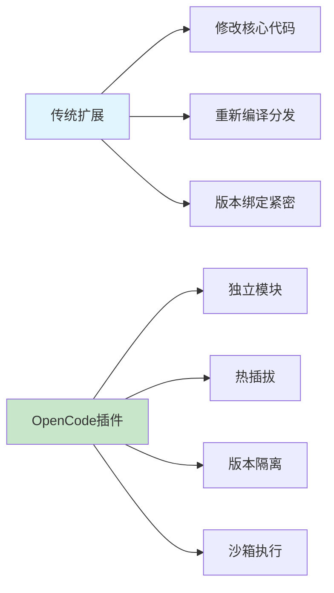
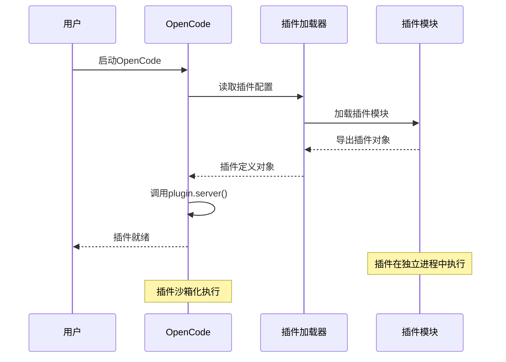
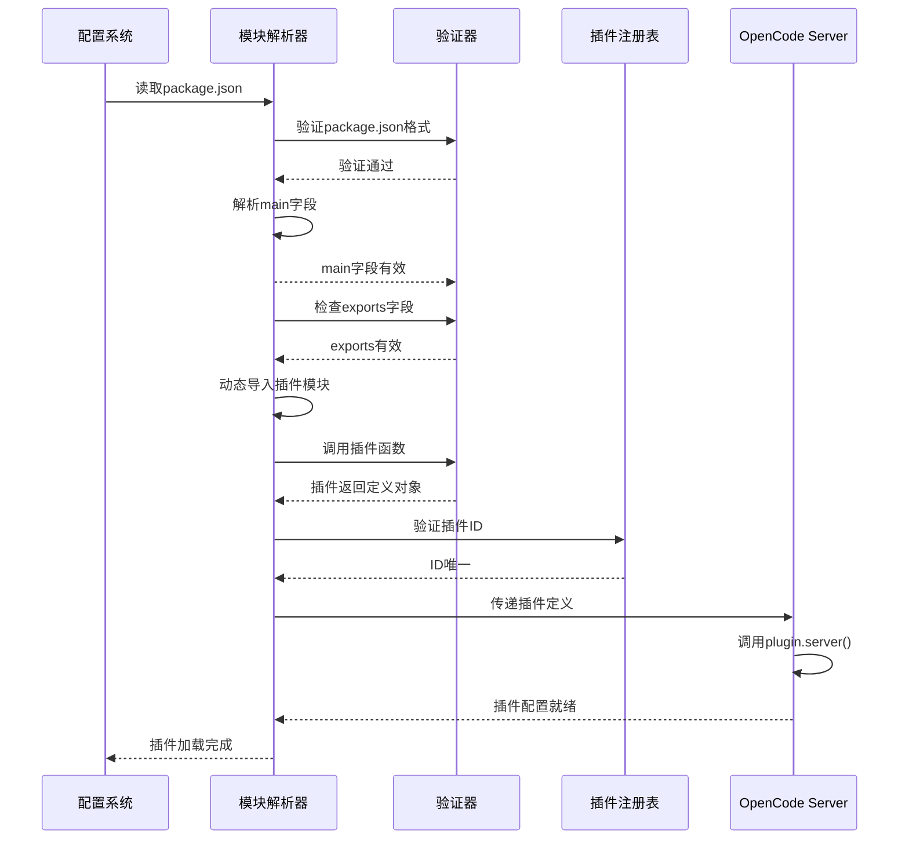

# 第1章：OpenCode插件Hello World

## 学习目标

通过本章学习，您将：
- 理解OpenCode插件系统的基本概念
- 掌握插件的基本结构和文件组织
- 创建您的第一个OpenCode插件
- 学习插件的加载和调试方法

## 1.1 OpenCode插件系统概述

### 什么是OpenCode插件？

OpenCode是一个AI编码助手平台，允许通过插件系统扩展其功能。插件可以：
- 注册自定义的AI Agents（智能体）
- 提供专门的工具和命令
- 拦截和增强系统行为
- 实现复杂的多Agent协作工作流

### 插件 vs 传统扩展



**关键区别**：
- **独立性**：插件作为独立模块开发，不修改核心代码
- **安全性**：插件在沙箱环境中执行，访问受控
- **灵活性**：支持动态加载和卸载
- **可维护性**：版本隔离，便于管理和升级

## 1.2 插件的基本结构和文件组织

### 最小插件结构

```
my-opencode-plugin/
├── package.json          # 项目配置文件
├── src/
│   └── index.ts         # 插件入口文件
├── tsconfig.json          # TypeScript配置
└── dist/                 # 编译输出目录（自动生成）
```

### package.json配置详解

```json
{
  "name": "my-hello-plugin",
  "version": "1.0.0",
  "type": "module",
  "main": "dist/index.js",
  "types": "dist/index.d.ts",
  "exports": {
    ".": {
      "types": "./dist/index.d.ts",
      "default": "./dist/index.js"
    }
  },
  "engines": {
    "bun": ">=1.3.13"
  },
  "peerDependencies": {
    "@opencode-ai/sdk": "^1.1.53"
  },
  "devDependencies": {
    "bun-types": "1.3.8",
    "typescript": "^5.7.3"
  }
}
```

**关键字段说明**：
- `type: "module"`：使用ES模块系统
- `main`：入口点文件路径
- `exports`：模块导出配置
- `engines`：运行时要求
- `peerDependencies`：对OpenCode SDK的依赖

### 插件入口文件结构

```typescript
import type { Plugin } from '@opencode-ai/plugin';

// 插件定义函数
const MyPlugin: Plugin = async (ctx) => {
  const { directory } = ctx;
  
  return {
    id: 'my-hello-plugin',
    name: 'My Hello Plugin',
    version: '1.0.0',
    
    // 服务器配置
    server: async () => {
      return {
        // 注册agents
        agents: {},
        
        // 注册hooks
        hooks: {},
        
        // 注册工具
        tools: {},
        
        // 注册命令
        commands: {},
      };
    },
  };
};

export default MyPlugin;
```

**插件定义的关键组成部分**：

1. **插件元数据**：
   - `id`：插件唯一标识符
   - `name`：显示名称
   - `version`：版本号

2. **server函数**：返回插件配置对象
   - `agents`：Agent注册表
   - `hooks`：Hook注册表
   - `tools`：工具注册表
   - `commands`：命令注册表

## 1.3 第一个插件：Hello World

### 创建Hello World插件

让我们创建最简单的插件，返回固定文本：

```typescript
import type { Plugin } from '@opencode-ai/plugin';

const HelloWorldPlugin: Plugin = async (ctx) => {
  console.log('[Hello World] Plugin loading...');
  
  return {
    id: 'hello-world-plugin',
    name: 'Hello World Plugin',
    version: '1.0.0',
    
    server: async () => {
      console.log('[Hello World] Server starting...');
      
      return {
        agents: {},
        hooks: {},
        tools: {},
        commands: {},
      };
    },
  };
};

export default HelloWorldPlugin;
```

### 插件加载流程



### 完整的Hello World插件实现

创建文件 `src/index.ts`：

```typescript
import type { Plugin } from '@opencode-ai/plugin';

/**
 * Hello World插件
 * 
 * 这是最简单的OpenCode插件示例，用于演示：
 * 1. 插件的基本结构
 * 2. 插件加载流程
 * 3. 插件服务器配置
 */
const HelloWorldPlugin: Plugin = async (ctx) => {
  const { directory } = ctx;
  
  console.log('[Hello World Plugin] Loading plugin...');
  console.log('[Hello World Plugin] Working directory:', directory);
  
  return {
    // 插件唯一标识符
    id: 'hello-world-plugin',
    
    // 插件显示名称
    name: 'Hello World Plugin',
    
    // 插件版本
    version: '1.0.0',
    
    // 服务器配置函数
    server: async () => {
      console.log('[Hello World Plugin] Initializing server...');
      
      // 返回插件配置对象
      return {
        // Agent注册表（目前为空）
        agents: {},
        
        // Hook注册表（目前为空）
        hooks: {},
        
        // 工具注册表（目前为空）
        tools: {},
        
        // 命令注册表（目前为空）
        commands: {},
      };
    },
  };
};

// 导出插件定义
export default HelloWorldPlugin;
```

## 1.4 插件编译和加载

### 编译插件

```bash
# 编译TypeScript插件
bun run build

# 或使用npm（如果配置了）
npm run build
```

编译后会在 `dist/` 目录生成：
- `index.js`：编译后的JavaScript代码
- `index.d.ts`：TypeScript类型定义文件

### 插件加载方式

OpenCode通过以下方式加载插件：

1. **本地开发模式**：
```bash
# 在插件目录下
bun run dev
```

2. **全局安装**：
```bash
bun install -g your-plugin
```

3. **OpenCode配置**：
```json
{
  "plugins": ["your-plugin-name"]
}
```

### 插件加载时序图



## 1.5 插件调试技巧

### 添加调试日志

在插件中添加日志来跟踪加载过程：

```typescript
const HelloWorldPlugin: Plugin = async (ctx) => {
  const startTime = Date.now();
  
  console.log('[Hello World] =====================');
  console.log('[Hello World] Plugin Loading Started');
  console.log('[Hello World] Working Directory:', ctx.directory);
  console.log('[Hello World] Process ID:', process.pid);
  console.log('[Hello World] Node Version:', process.version);
  
  try {
    const result = {
      id: 'hello-world-plugin',
      name: 'Hello World Plugin',
      version: '1.0.0',
      server: async () => {
        const serverStartTime = Date.now();
        console.log('[Hello World] Server Starting...');
        console.log('[Hello World] Init Time:', serverStartTime - startTime, 'ms');
        
        return {
          agents: {},
          hooks: {},
          tools: {},
          commands: {},
        };
      },
    };
    
    console.log('[Hello World] Plugin Loaded Successfully');
    console.log('[Hello World] Total Load Time:', Date.now() - startTime, 'ms');
    console.log('[Hello World] =====================');
    
    return result;
  } catch (error) {
    console.error('[Hello World] Plugin Load Failed:', error);
    throw error;
  }
};
```

### 常见加载问题排查

**问题1：插件不显示在插件列表中**
- 检查package.json的main字段是否正确
- 确认dist/目录存在并包含编译后的文件
- 验证插件ID是否唯一

**问题2：插件加载报错**
- 检查TypeScript编译错误
- 验证peerDependencies版本兼容性
- 确认所有导入的模块路径正确

**问题3：插件功能异常**
- 检查server()函数是否正确返回配置对象
- 验证agents/hooks/tools/commands格式是否正确
- 确认导出语句存在

## 1.6 实践练习

### 练习1：创建个性化Hello World插件

创建一个个性化的Hello World插件，要求：
1. 显示您的名字和当前时间
2. 在server函数中记录启动时间
3. 添加错误处理机制

### 练习2：插件信息展示

创建一个插件，通过OpenCode的插件信息界面展示：
- 插件名称和版本
- 作者信息
- 简短的功能描述
- 加载时间统计

### 练习3：调试技巧实践

在您的Hello World插件中实现：
- 分阶段的加载日志
- 关键点的性能计时
- 错误捕获和友好提示

## 1.7 本章小结

### 核心概念回顾

✅ **OpenCode插件系统**：
- 基于模块的热插拔架构
- 沙箱化执行环境
- 通过SDK提供的接口扩展功能

✅ **插件基本结构**：
- package.json：项目配置
- src/index.ts：入口文件
- dist/：编译输出

✅ **插件定义函数**：
- 返回插件元数据和server函数
- server()返回agents/hooks/tools/commands配置

✅ **插件加载流程**：
- 配置验证 → 模块解析 → 插件调用 → 服务启动

### 下一步学习

在第2章中，我们将深入理解：
- Agent的核心概念和组成
- 第一个简单Agent的实现
- Agent与普通程序的区别

### 技术要点检查表

- [ ] 理解插件与扩展的区别
- [ ] 掌握package.json关键字段的含义
- [ ] 能够创建最小化的插件结构
- [ ] 理解插件加载的时序流程
- [ ] 掌握基本的插件调试技巧

---

**下一步**：继续学习第2章 - 理解Agent概念并创建您的第一个Agent！