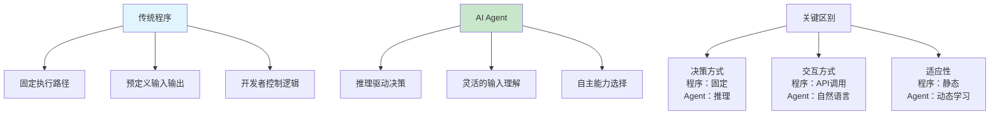
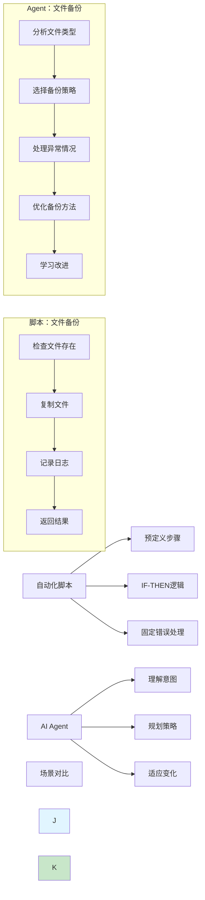
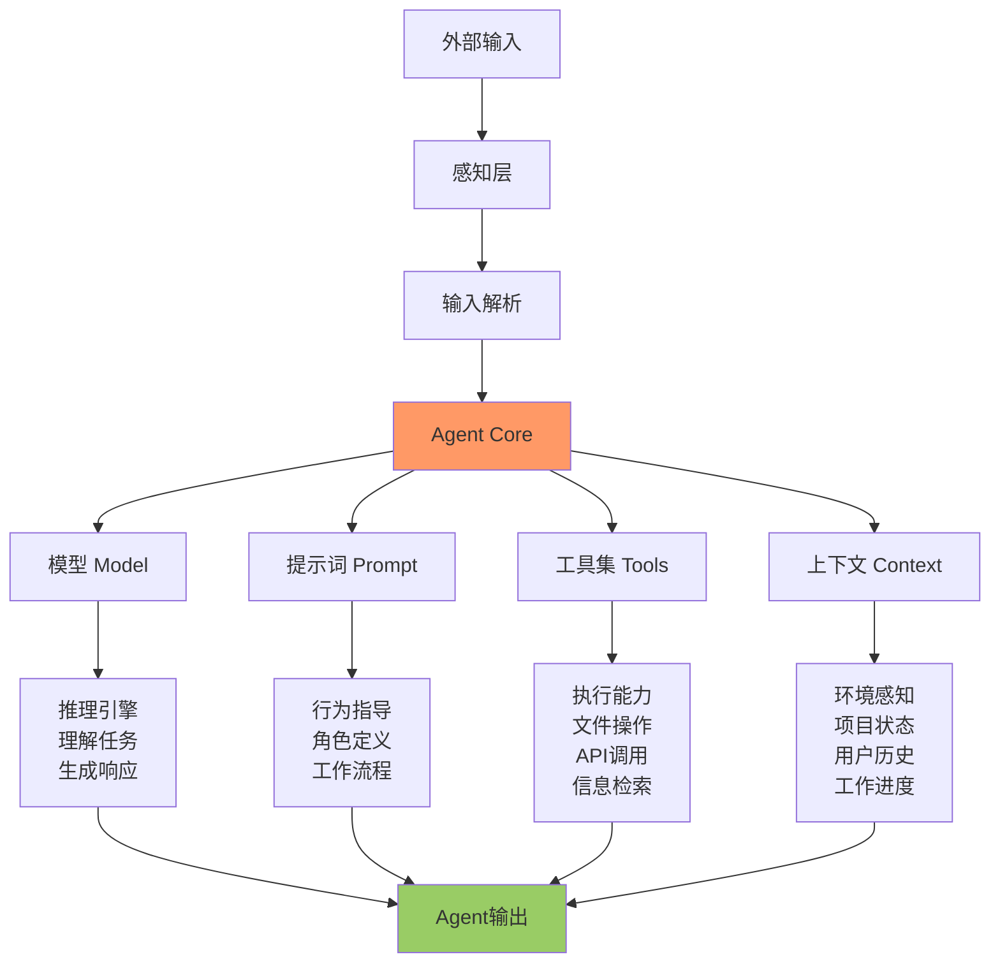
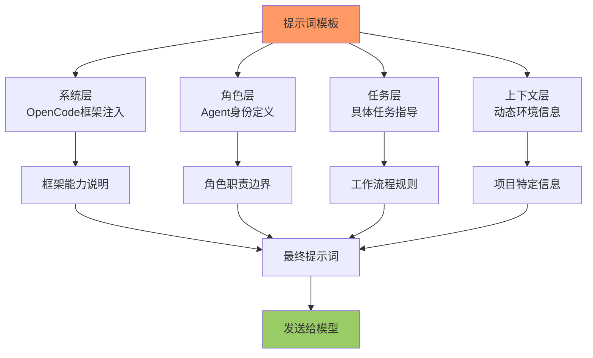
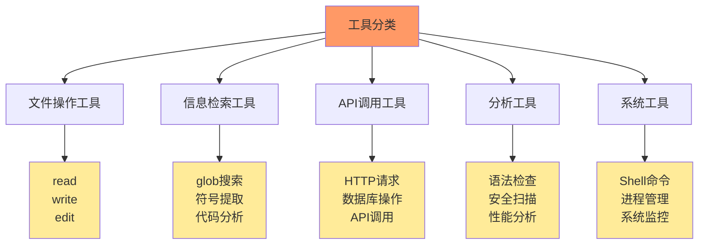
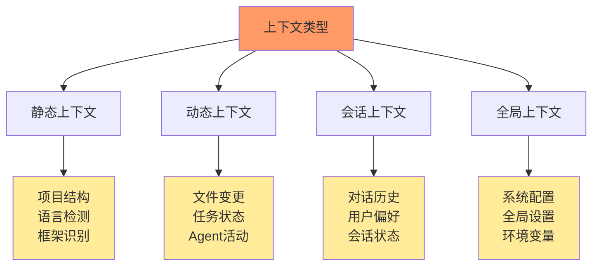
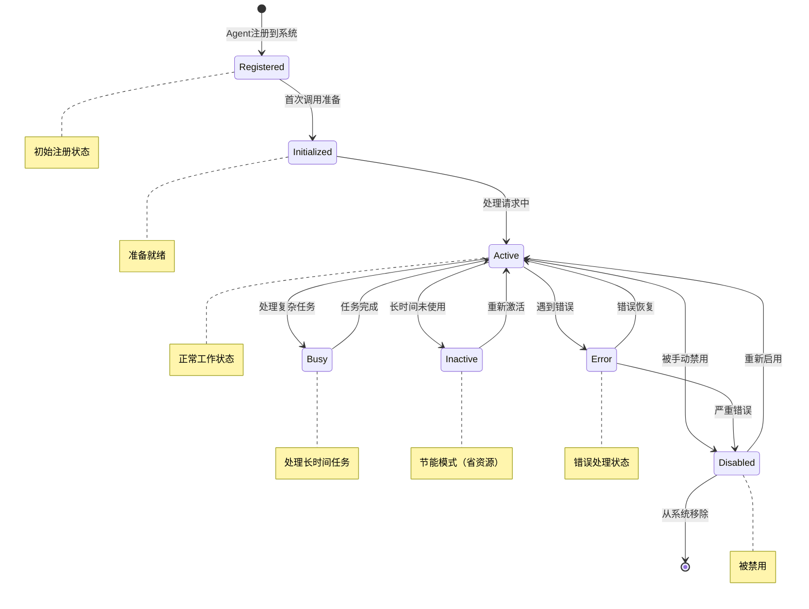
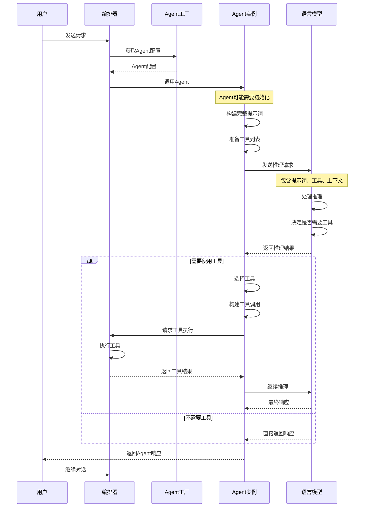
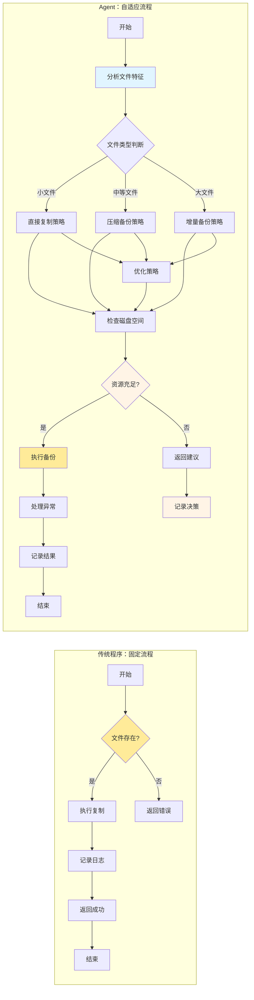

# 第2章：理解Agent概念

## 学习目标

通过本章学习，您将：
- 深入理解Agent vs 传统程序的本质区别
- 掌握Agent的核心组成部分
- 创建您的第一个简单Agent
- 理解Agent的生命周期管理

## 2.1 什么是Agent？

### Agent vs 传统程序的对比



### Agent的定义特征

**AI Agent具备以下核心特征**：

1. **感知能力**：理解环境和输入信息
2. **推理能力**：基于输入进行决策和规划
3. **行动能力**：执行具体操作或调用工具
4. **学习能力**：从经验中改进
5. **自主性**：在一定范围内自主决策

### Agent vs 自动化脚本



## 2.2 Agent的核心组成

### Agent架构分解



### 1. 模型（Model）

**作用**：提供推理能力和知识基础

**类型**：
- **大语言模型**：GPT、Claude、Gemini等
- **专用模型**：代码模型、审查模型、测试模型
- **混合模型架构**：不同任务使用不同模型

**关键参数**：
```typescript
interface ModelConfig {
  model: string;              // 模型标识符
  temperature?: number;       // 创造性控制（0-1）
  maxTokens?: number;         // 响应长度限制
  topP?: number;             // 核采样参数
  stopSequences?: string[];   // 停止序列
  fallbackModels?: string[];  // 回退模型链
}
```

### 2. 提示词（Prompt）

**作用**：定义Agent的角色、行为和约束

**提示词组成层次**：



**提示词模板示例**：

```typescript
const AGENT_PROMPT = `
你是一个${AGENT_ROLE}，专门负责${TASK_DESCRIPTION}。

## 系统信息
- 工作目录：${WORKING_DIRECTORY}
- 编程语言：${PROGRAMMING_LANGUAGE}
- 构建系统：${BUILD_SYSTEM}

## 角色定义
你的职责是：
1. ${DUTY_1}
2. ${DUTY_2}
3. ${DUTY_3}

## 工作流程
当收到用户请求时：
- 第一步：${STEP_1}
- 第二步：${STEP_2}

## 约束条件
- ${CONSTRAINT_1}
- ${CONSTRAINT_2}

## 可用工具
${AVAILABLE_TOOLS}

## 当前任务
${CURRENT_TASK}
`;
```

### 3. 工具集（Tools）

**作用**：扩展Agent的执行能力

**工具类型**：



**工具定义结构**：

```typescript
interface ToolDefinition {
  name: string;              // 工具名称
  description: string;       // 工具描述
  parameters: ZodSchema;    // 参数schema定义
  handler: Function;         // 执行函数
  permission: 'read' | 'write' | 'admin';  // 权限级别
}
```

### 4. 上下文（Context）

**作用**：提供环境感知能力

**上下文类型**：



## 2.3 第一个简单Agent

### HelloAgent设计

让我们创建一个最简单的Agent - 回答Hello的Agent：

```typescript
import type { AgentConfig } from '@opencode-ai/sdk';

/**
 * Hello Agent - 最简单的Agent示例
 * 
 * 功能：回应用户的问候，并自我介绍
 */
export const helloAgent: AgentConfig = {
  name: 'hello',
  description: '一个简单的问候Agent',
  
  // 模型配置
  model: 'anthropic/claude-sonnet-4-20250514',
  
  // Agent提示词
  prompt: `你是一个友好的AI助手。

你的名字叫HelloAgent，专门负责：
1. 热情回应用户的问候
2. 简短介绍你的能力
3. 友好地询问是否需要帮助

当用户说"你好"、"嗨"、"hello"等问候时：
- 热情回应："你好！我是HelloAgent，很高兴为您服务！"
- 简要介绍："我可以帮助您进行简单的对话和问答。"
- 询问："今天有什么可以帮您的吗？"

当用户问其他问题时：
- 礼貌地说明："我是HelloAgent，目前只能处理简单问候。复杂问题请使用更强大的Agent。"
- 建议用户："您可以尝试使用architect等主要Agent来处理复杂任务。"
`,
  
  // 工具配置（目前为空）
  tools: {},
  
  // 系统提示增强
  systemEnhancer: {
    includeProjectContext: true,
    includeRecentActivity: false,
  },
};
```

### Agent配置结构解析

**AgentConfig接口详解**：

```typescript
interface AgentConfig {
  // 基本信息
  name: string;              // Agent唯一名称
  description: string;       // Agent功能描述
  
  // 模型配置
  model: string;              // 使用的模型标识符
  temperature?: number;       // 可选：温度参数
  maxTokens?: number;         // 可选：最大token数
  
  // 提示词配置
  prompt: string;             // Agent提示词模板
  systemEnhancer?: {        // 可选：系统提示增强
    includeProjectContext?: boolean;
    includeRecentActivity?: boolean;
  };
  
  // 工具配置
  tools?: Record<string, ToolConfig>;  // 工具权限配置
  
  // 其他配置
  disabled?: boolean;         // 可选：禁用开关
  fallbackModels?: string[];  // 可选：回退模型链
}
```

## 2.4 Agent生命周期管理

### Agent生命周期状态机



### Agent调用流程



## 2.5 实践：创建对话Agent

### TaskAgent设计

创建一个能够理解任务的对话Agent：

```typescript
import type { AgentConfig } from '@opencode-ai/sdk';

/**
 * TaskAgent - 任务理解Agent
 * 
 * 功能：理解用户意图，提供任务建议
 */
export const taskAgent: AgentConfig = {
  name: 'task',
  description: '任务理解和建议Agent',
  
  model: 'anthropic/claude-sonnet-4-20250514',
  
  prompt: `你是一个任务分析专家，擅长理解用户需求并提供建议。

## 你的职责
1. 理解用户的真实需求
2. 将复杂需求分解为可执行的任务
3. 提供实现建议和技术选型
4. 识别潜在的技术风险

## 工作流程
当用户描述需求时：
- 第一步：需求分析和确认
- 第二步：任务分解
- 第三步：技术建议
- 第四步：风险评估

## 回答格式
使用以下结构化格式回答：

### 需求理解
- 核心需求：[提取的核心目标]
- 隐含需求：[推断的潜在要求]
- 不明确之处：[需要澄清的问题]

### 任务建议
- 主要任务：[2-4个主要任务]
- 次要任务：[2-4个辅助任务]
- 优先级建议：[按重要性排序]

### 技术建议
- 推荐技术栈：[具体技术建议]
- 架构建议：[架构设计思路]
- 潜在风险：[可能的技术挑战]

### 后续步骤
- 立即行动：[现在可以做的事情]
- 规划阶段：[需要详细规划的事项]
- 学习资源：[相关学习材料]

## 约束条件
- 只提供建议，不直接实现代码
- 建议基于常见最佳实践
- 考虑实际可行性和成本
- 如果需求过于复杂，建议使用专业Agent（如architect）`,
`,
};
```

### Agent测试方法

```bash
# 1. 编译Agent
bun run build

# 2. 在OpenCode中测试Agent
# 启动OpenCode
opencode

# 3. 选择taskAgent进行对话
# 在对话中输入测试用例
```

**测试用例**：

```
测试1：简单需求
用户输入：我想做一个个人博客
预期输出：结构化的需求理解和任务建议

测试2：复杂需求
用户输入：我需要做一个企业级电商系统，包含商品管理、订单处理、支付集成、用户管理、后台管理系统
预期输出：详细的需求分析、10+个任务、技术建议

测试3：技术咨询
用户输入：Python和Go哪个更适合做微服务？
预期输出：技术对比分析、使用建议、场景推荐
```

## 2.6 Agent vs 传统程序对比实例

### 场景：文件备份

**传统程序实现**：

```python
import os
import shutil
from datetime import datetime

def backup_file(source_path: str) -> bool:
    """传统文件备份程序"""
    try:
        if not os.path.exists(source_path):
            print(f"文件不存在: {source_path}")
            return False
        
        # 固定备份逻辑
        timestamp = datetime.now().strftime("%Y%m%d_%H%M%S")
        backup_path = f"{source_path}.backup_{timestamp}"
        
        shutil.copy2(source_path, backup_path)
        print(f"备份完成: {backup_path}")
        return True
        
    except Exception as e:
        print(f"备份失败: {e}")
        return False
```

**Agent实现思路**：

```typescript
const backupAgent: AgentConfig = {
  name: 'backup',
  description: '智能文件备份Agent',
  
  model: 'anthropic/claude-sonnet-4',
  
  prompt: `你是一个智能文件备份专家。

## 核心能力
- 理解文件类型和重要性
- 根据文件大小选择备份策略
- 处理备份过程中的异常
- 优化存储空间

## 工作流程
1. 分析文件：检查文件类型、大小、修改频率
2. 策略选择：
   - 小文件（<10MB）：直接复制
   - 中等文件（10MB-1GB）：压缩备份
   - 大文件（>1GB）：增量备份
3. 异常处理：处理权限错误、磁盘空间不足等
4. 记录日志：备份元数据、耗时、结果

## 决策过程
对每个文件，你需要：
1. 评估文件特征
2. 选择最优备份策略
3. 考虑系统资源状况
4. 提供备份建议并等待确认

## 工具能力
- 检查文件：检查文件是否存在、大小、修改时间
- 复制文件：执行文件复制操作
- 压缩文件：压缩文件以节省空间
- 记录日志：记录操作日志
`,
  
  tools: {
    'check_file': {
      description: '检查文件信息',
      permission: 'read',
    },
    'copy_file': {
      description: '复制文件',
      permission: 'write',
    },
    'compress_file': {
      description: '压缩文件',
      permission: 'write',
    },
  },
};
```

### 对比分析



**关键区别**：

| 维度 | 传统程序 | Agent |
|------|----------|-------|
| 决策方式 | 固定if-else | 推理判断 |
| 适应性 | 静态逻辑 | 动态调整 |
| 错误处理 | 预定义异常 | 理解并适应 |
| 可扩展性 | 需要修改代码 | 更新提示词 |
| 学习能力 | 无 | 从经验改进 |

## 2.7 实践练习

### 练习1：创建专业领域Agent

选择您熟悉的领域（如：代码审查、测试生成、文档编写），创建一个专业Agent：

要求：
1. 明确定义Agent角色和边界
2. 设计专业的提示词模板
3. 配置合适的模型
4. 说明工具需求（即使暂时不实现）

### 练习2：Agent对话测试

为您创建的Agent设计5个测试对话，验证：
- Agent是否按预期工作
- 边界情况处理是否合理
- 是否超出Agent能力范围
- 响应格式是否正确

### 练习3：Agent性能对比

对比您的Agent与传统程序在相同场景下的表现：
- 处理速度
- 错误处理
- 适应性
- 可维护性

## 2.8 本章小结

### 核心概念掌握

✅ **Agent vs 传统程序**：
- Agent通过推理而非固定逻辑
- Agent具有自主性和适应性
- Agent通过学习不断改进

✅ **Agent核心组成**：
- 模型：提供推理能力
- 提示词：定义行为和约束
- 工具：扩展执行能力
- 上下文：提供环境感知

✅ **Agent生命周期**：
- 注册 → 初始化 → 激活 → 使用 → 销停/禁用
- 每个状态都有明确的进入和退出条件

✅ **Agent设计要点**：
- 明确角色定义和边界
- 设计清晰的决策流程
- 提供结构化的输出格式
- 考虑错误处理和恢复

### 下一步学习

在第3章中，我们将学习：
- 工具系统的深入理解
- 工具权限配置机制
- 第一个带工具的Agent实现
- 工具调用的完整流程

### 技术要点检查表

- [ ] 理解Agent与传统程序的本质区别
- [ ] 掌握Agent的四大核心组成部分
- [ ] 能够创建简单但完整的Agent
- [ ] 理解Agent生命周期的各个阶段
- [ ] 能够设计Agent的决策流程
- [ ] 掌握Agent提示词的设计原则

---

**下一步**：继续学习第3章 - 深入理解工具系统并创建您的第一个带工具的Agent！