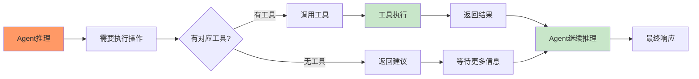
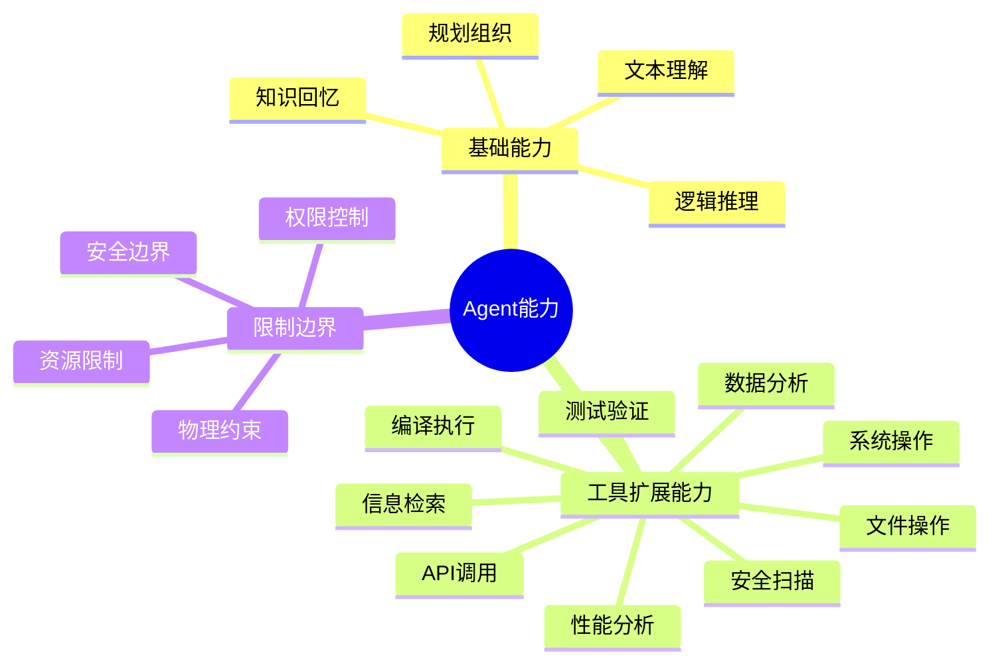
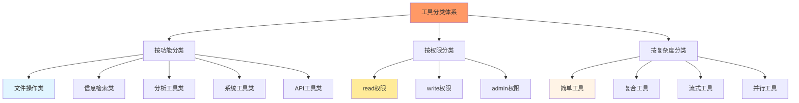
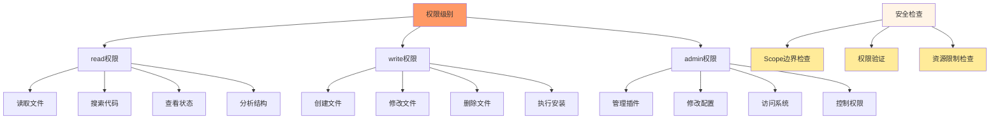
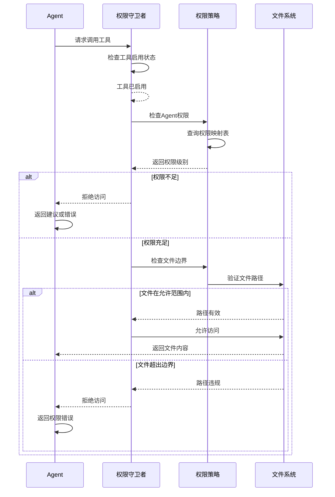
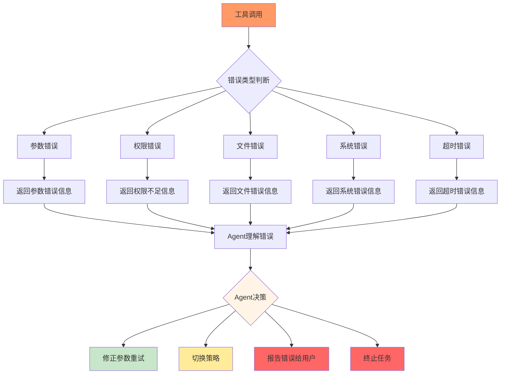

# 第3章：工具系统基础

## 学习目标

通过本章学习，您将：
- 理解工具在Agent系统中的关键作用
- 掌握工具的定义和分类体系
- 创建您的第一个工具
- 理解工具权限配置机制
- 掌握工具调用的完整流程

## 3.1 工具在Agent系统中的作用

### 为什么Agent需要工具？

Agent的推理能力再强大，如果没有工具，也只能"纸上谈兵"。工具将Agent的**决策能力**转化为**执行能力**。



### 工具扩展了Agent的能力边界



## 3.2 工具定义和分类

### 工具定义结构

在OpenCode系统中，工具的定义结构如下：

```typescript
interface ToolDefinition {
  // 基本信息
  name: string;              // 工具唯一标识符
  description: string;       // 工具功能描述（用于Agent理解）
  
  // 参数定义
  parameters: {
    type: "object";        // 参数类型，通常为object
    properties: {          // 参数属性定义
      parameterName: {
        type: string;      // 参数类型：string/number/boolean/array等
        description: string; // 参数描述
        required: boolean; // 是否必需
      }
    },
    required: string[];    // 必需参数列表
  };
  
  // 执行函数
  handler: (params: any, context: ToolContext) => Promise<ToolResult>;
  
  // 权限级别
  permission: 'read' | 'write' | 'admin';
  
  // 可见性配置
  visibility?: 'public' | 'private' | 'internal';
  
  // 元数据
  category?: string;        // 工具分类
  examples?: Array<{     // 使用示例
    description: string;
    parameters: any;
    result: any;
  }>;
}
```

### 工具分类体系



### 工具功能分类详解

#### 1. 文件操作类工具

**read权限工具**：
```typescript
const readFile: ToolDefinition = {
  name: 'read_file',
  description: '读取文件内容',
  permission: 'read',
  parameters: {
    type: 'object',
    properties: {
      path: {
        type: 'string',
        description: '文件路径',
      },
      encoding: {
        type: 'string',
        description: '文件编码',
        default: 'utf-8',
      },
      start_line: {
        type: 'number',
        description: '开始行号（可选）',
      },
      limit: {
        type: 'number',
        description: '读取行数限制（可选）',
      },
    },
    required: ['path'],
  },
  handler: async (params, context) => {
    const { path, encoding, start_line, limit } = params;
    // 读取文件的实现
  },
};
```

**write权限工具**：
```typescript
const writeFile: ToolDefinition = {
  name: 'write_file',
  description: '写入文件内容',
  permission: 'write',
  parameters: {
    type: 'object',
    properties: {
      path: {
        type: 'string',
        description: '文件路径',
      },
      content: {
        type: 'string',
        description: '文件内容',
      },
      create_dirs: {
        type: 'boolean',
        description: '是否创建目录',
        default: false,
      },
    },
    required: ['path', 'content'],
  },
  handler: async (params, context) => {
    const { path, content, create_dirs } = params;
    // 写入文件的实现
  },
};
```

#### 2. 信息检索类工具

```typescript
// 文件搜索工具
const searchFiles: ToolDefinition = {
  name: 'search_files',
  description: '在项目中搜索文件',
  permission: 'read',
  parameters: {
    type: 'object',
    properties: {
      pattern: {
        type: 'string',
        description: '搜索模式（支持glob）',
      },
      fileTypes: {
        type: 'array',
        items: { type: 'string' },
        description: '文件类型过滤',
      },
    },
    required: ['pattern'],
  },
  handler: async (params, context) => {
    const { pattern, fileTypes } = params;
    // 文件搜索实现
  },
};

// 代码符号提取工具
const extractSymbols: ToolDefinition = {
  name: 'extract_symbols',
  description: '提取源文件中的符号定义',
  permission: 'read',
  parameters: {
    type: 'object',
    properties: {
      path: {
        type: 'string',
        description: '文件路径',
      },
      language: {
        type: 'string',
        description: '编程语言',
      },
      symbolType: {
        type: 'string',
        description: '符号类型（function/class/interface）',
      },
    },
    required: ['path', 'language'],
  },
  handler: async (params, context) => {
    const { path, language, symbolType } = params;
    // 符号提取实现
  },
};
```

#### 3. 分析工具类

```typescript
// 代码质量检查工具
const codeQualityCheck: ToolDefinition = {
  name: 'code_quality_check',
  description: '检查代码质量指标',
  permission: 'read',
  parameters: {
    type: 'object',
    properties: {
      targetFiles: {
        type: 'array',
        items: { type: 'string' },
        description: '目标文件列表',
      },
      metrics: {
        type: 'array',
        items: { type: 'string' },
        description: '检查指标（complexity/duplication/coverage等）',
      },
    },
    required: ['targetFiles'],
  },
  handler: async (params, context) => {
    const { targetFiles, metrics } = params;
    // 代码质量检查实现
  },
};
```

#### 4. 系统工具类

```typescript
// Shell命令执行工具
const executeCommand: ToolDefinition = {
  name: 'execute_command',
  description: '执行Shell命令',
  permission: 'admin',
  parameters: {
    type: 'object',
    properties: {
      command: {
        type: 'string',
        description: '要执行的命令',
      },
      workingDirectory: {
        type: 'string',
        description: '工作目录',
      },
      timeout: {
        type: 'number',
        description: '超时时间（毫秒）',
        default: 30000,
      },
    },
    required: ['command'],
  },
  handler: async (params, context) => {
    const { command, workingDirectory, timeout } = params;
    // 命令执行实现
  },
};
```

## 3.3 工具权限配置

### 权限级别的安全模型



### 权限配置机制

```typescript
// 工具权限配置接口
interface ToolPermissionConfig {
  // 工具级别的权限控制
  tools?: Record<string, {
    enabled?: boolean;      // 是否启用
    permission?: 'read' | 'write' | 'admin';
  }>;
  
  // Agent级别的权限映射
  agents?: Record<string, {
    tools?: Record<string, boolean>;  // true=可用, false=禁用
  }>;
  
  // 全局权限策略
  authority?: {
    enabled: boolean;
    rules?: Record<string, {
      allowedPrefix?: string[];    // 允许的前缀
      blockedPrefix?: string[];    // 阻止的前缀
      blockedZones?: string[];    // 阻止的区域
    }};
}
```

### 权限验证流程



## 3.4 第一个工具实现

### 文件读取工具实现

让我们创建一个完整的文件读取工具：

```typescript
import * as fs from 'node:fs/promises';
import * as path from 'node:path';

/**
 * 文件读取工具
 * 
 * 功能：安全地读取文件内容，支持多种编码和部分读取
 */
export const readFileTool = {
  name: 'read_file',
  description: '读取文件内容。支持部分读取和多种编码格式。大文件会自动分页读取。',
  
  permission: 'read',  // 只读权限
  
  parameters: {
    type: 'object',
    properties: {
      path: {
        type: 'string',
        description: '要读取的文件路径（绝对路径或相对于项目根目录）',
      },
      encoding: {
        type: 'string',
        description: '文件编码格式',
        default: 'utf-8',
        enum: ['utf-8', 'utf-16le', 'latin1', 'ascii'],
      },
      start_line: {
        type: 'number',
        description: '开始行号（从1开始，默认读取全文）',
        minimum: 1,
      },
      limit: {
        type: 'number',
        description: '读取的行数限制（默认无限制）',
        minimum: 1,
      },
      include_line_numbers: {
        type: 'boolean',
        description: '是否包含行号（默认false）',
        default: false,
      },
    },
    required: ['path'],
  },
  
  examples: [
    {
      description: '读取完整文件',
      parameters: {
        path: 'src/main.ts',
      },
      result: '文件内容',
    },
    {
      description: '部分读取大文件',
      parameters: {
        path: 'large-file.log',
        start_line: 100,
        limit: 50,
      },
      result: '第100-149行的内容',
    },
    {
      description: '读取特定编码文件',
      parameters: {
        path: 'legacy-file.txt',
        encoding: 'utf-16le',
      },
      result: '使用指定编码读取的文件',
    },
  ],
  
  handler: async (params, context) => {
    const { path, encoding = 'utf-8', start_line = 1, limit, include_line_numbers = false } = params;
    
    try {
      // 安全检查：防止路径遍历攻击
      const resolvedPath = path.resolve(context.directory || process.cwd(), path);
      
      // 检查文件是否存在
      try {
        await fs.access(resolvedPath);
      } catch {
        return {
          success: false,
          error: `文件不存在: ${path}`,
        };
      }
      
      // 读取文件内容
      const content = await fs.readFile(resolvedPath, encoding);
      const lines = content.split('\n');
      
      // 处理部分读取
      let resultLines = lines;
      if (start_line > 1 || limit) {
        const startIndex = start_line - 1;
        const endIndex = limit ? startIndex + limit : undefined;
        resultLines = lines.slice(startIndex, endIndex);
      }
      
      // 添加行号（如果需要）
      if (include_line_numbers) {
        resultLines = resultLines.map((line, index) => 
          `${startIndex + index + 1}: ${line}`
        );
      }
      
      const result = resultLines.join('\n');
      const chars = result.length;
      
      // 处理大文件截断
      const truncated = limit && lines.length > (start_line - 1 + limit);
      
      return {
        success: true,
        content: result,
        stats: {
          totalLines: lines.length,
          returnedLines: resultLines.length,
          startLine: start_line,
          endLine: start_line + resultLines.length - 1,
          totalChars: chars,
          truncated: truncated,
        },
      };
      
    } catch (error) {
      return {
        success: false,
        error: `读取文件失败: ${error instanceof Error ? error.message : String(error)}`,
      };
    }
  },
};
```

### 工具返回值规范

```typescript
interface ToolResult {
  success: boolean;           // 工具是否执行成功
  content?: string;           // 成功时的文本结果
  data?: any;               // 成功时的结构化数据
  error?: string;            // 失败时的错误信息
  metadata?: Record<string, unknown>; // 额外的元数据
}
```

## 3.5 工具调用完整流程

```mermaid
sequenceDiagram
    participant Agent as Agent
    participant Orchestrator as 编排器
    participant Guard as 权限守卫者
    participant Handler as 工具处理器
    participant File as 文件系统
    
    Agent->>Orchestrator: 需要读取文件
    Agent->>Guard: 请求read_file工具调用
    
    Guard->>Guard: 验证工具启用状态
    Guard-->>Guard: 工具可用
    
    Guard->>Guard: 检查Agent权限级别
    Guard-->>Guard: Agent有read权限
    
    Guard->>Guard: 检查文件边界
    Guard->>File: 验证文件路径
    File-->>Guard: 路径在允许范围内
    
    Guard->>Handler: 转发工具处理器
    Handler->>File: 执行文件读取操作
    File-->>Handler: 返回文件内容
    
    Handler->>Handler: 处理和格式化结果
    Handler-->>Guard: 返回工具结果
    
    Guard->>Agent: 返回工具结果给Agent
    Agent->>Agent: 使用文件内容进行推理
    Agent-->>Orchestrator: 继续对话
    
    Note over Guard: 每个工具调用都会经过权限验证
    Note over Handler: 工具执行有超时控制
    Note over Agent: Agent可以继续调用其他工具
    
    style Agent fill:#ff9966
    style Guard fill:#ffcc00
    style File fill:#c8e6c9
```

## 3.6 工具错误处理和恢复

### 常见错误类型



### 错误处理最佳实践

```typescript
// 完整的错误处理工具示例
export const robustFileTool = {
  name: 'robust_file_read',
  description: '带有完善错误处理的文件读取工具',
  permission: 'read',
  
  parameters: {
    type: 'object',
    properties: {
      path: {
        type: 'string',
        description: '文件路径',
      },
      fallback_encodings: {
        type: 'array',
        items: { type: 'string' },
        description: '备用编码尝试列表',
        default: ['utf-8', 'latin1'],
      },
    },
    required: ['path'],
  },
  
  handler: async (params, context) => {
    const { path, fallback_encodings } = params;
    
    // 主编码尝试
    try {
      return await tryReadWithEncoding(path, 'utf-8');
    } catch (error) {
      // 尝试备用编码
      for (const encoding of fallback_encodings) {
        try {
          return await tryReadWithEncoding(path, encoding);
        } catch {
          continue;
        }
      }
      
      // 所有编码都失败
      return {
        success: false,
        error: `文件读取失败，尝试了${fallback_encodings.length}种编码`,
        suggestions: [
          '检查文件编码是否支持',
          '尝试使用二进制模式读取',
          '检查文件路径是否正确',
        ],
      };
    }
  },
};

async function tryReadWithEncoding(filePath: string, encoding: string) {
  const content = await fs.readFile(filePath, encoding);
  return {
    success: true,
    content: content,
    encoding,
  };
}
```

## 3.7 实践练习

### 练习1：创建代码搜索工具

创建一个代码搜索工具，要求：
1. 支持glob模式匹配
2. 支持文件类型过滤
3. 返回匹配的文件路径和行号
4. 处理搜索结果为空的情况

### 练习2：创建文件分析工具

创建一个文件分析工具，要求：
1. 检测文件类型（基于扩展名）
2. 统计代码行数（空行、注释、代码）
3. 检测潜在的安全问题
4. 提供结构化的分析报告

### 练习3：工具权限配置练习

配置不同权限级别的工具：
1. 只读工具配置
2. 写工具配置
3. 管理员工具配置
4. 测试权限验证机制

## 3.8 本章小结

### 核心概念掌握

✅ **工具的作用**：
- 扩展Agent的执行能力
- 将推理转化为实际操作
- 提供系统交互能力

✅ **工具分类体系**：
- 文件操作类、信息检索类、分析工具类、系统工具类、API工具类
- 按权限分为：read、write、admin三级

✅ **权限配置机制**：
- 基于权限级别的访问控制
- Scope边界检查
- 资源限制验证

✅ **工具调用流程**：
- 权限验证 → 边界检查 → 工具执行 → 结果处理
- 完整的错误处理和恢复机制

### 下一步学习

在第4章中，我们将学习：
- Agent工厂模式和设计
- 多Agent配置管理
- 模型选择和回退机制
- createAgents函数实现

### 技术要点检查表

- [ ] 理解工具在Agent系统中的关键作用
- [ ] 掌握工具定义的完整结构
- [ ] 了解工具分类体系和使用场景
- [ ] 理解工具权限配置的安全模型
- [ ] 能够创建完整的工具实现
- [ ] 掌握工具调用的完整流程
- [ ] 理解工具错误处理最佳实践

---

**下一步**：继续学习第4章 - Agent工厂模式和设计模式！