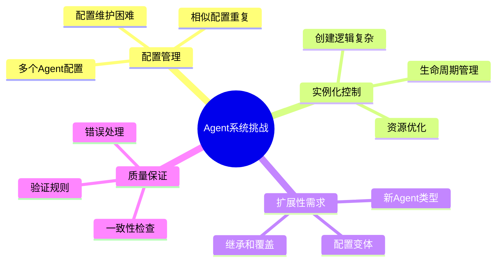
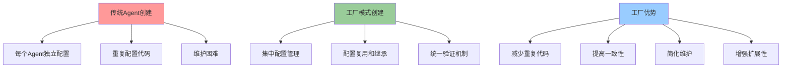
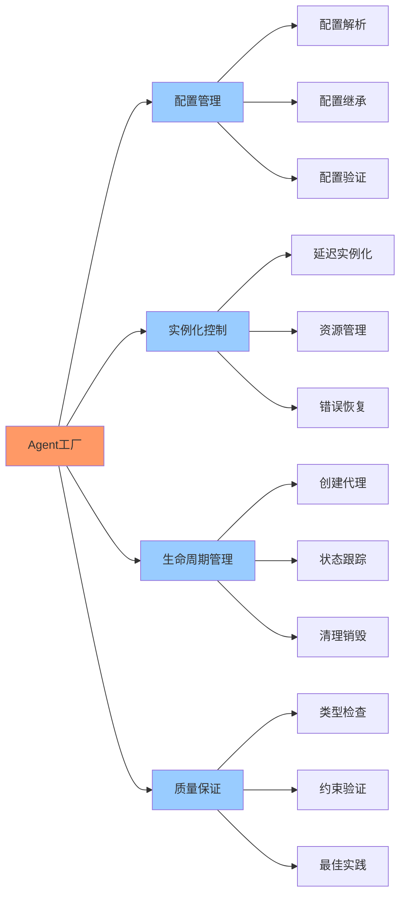
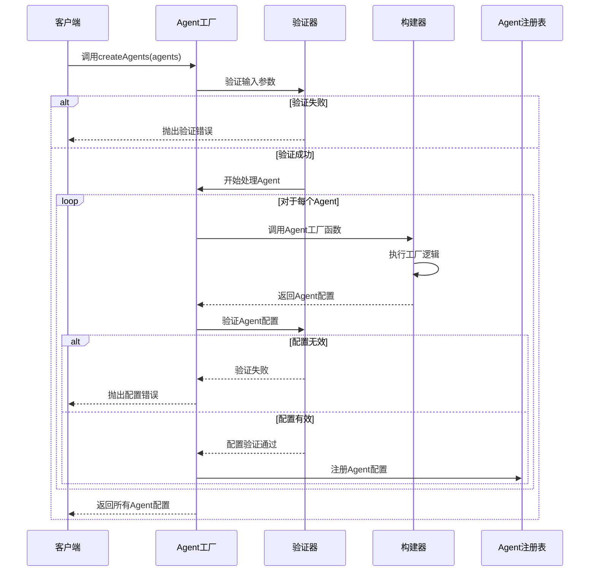
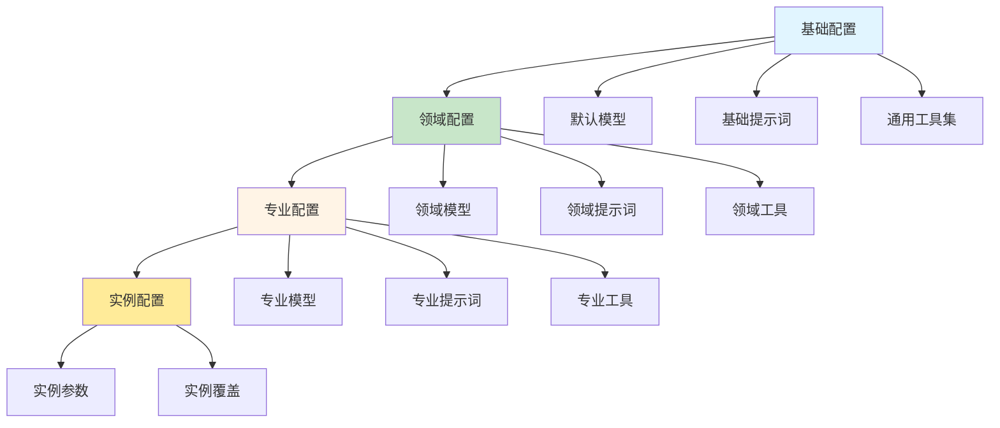
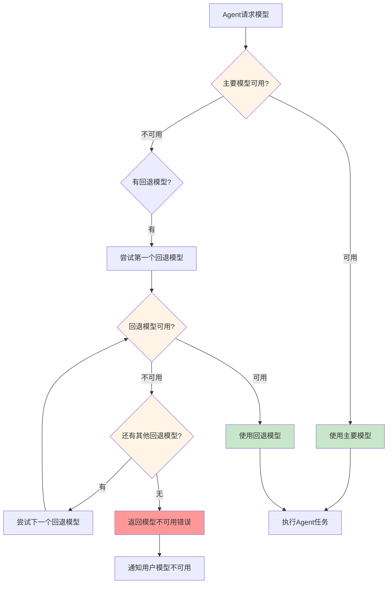
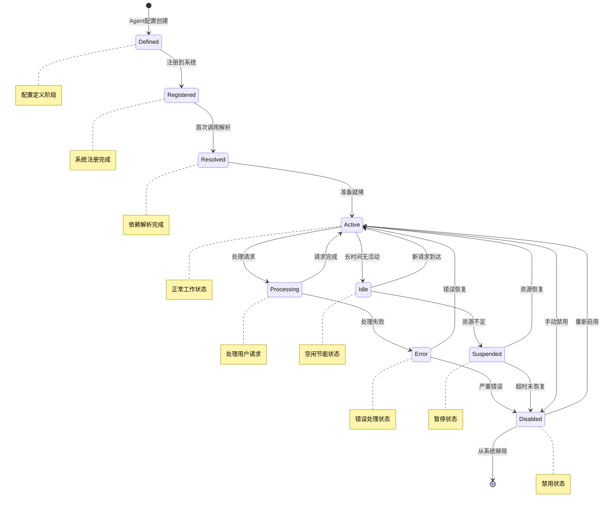

# 第4章：Agent工厂和设计模式

## 学习目标

通过本章学习，您将：
- 理解Agent工厂模式的概念和价值
- 掌握createAgents函数的实现原理
- 学习Agent配置管理和继承机制
- 理解模型选择和回退策略
- 掌握Agent实例化流程
- 能够创建可配置的Agent工厂系统

## 4.1 Agent工厂模式概念

### 为什么需要工厂模式？

在开发复杂的Agent系统时，我们面临以下挑战：



**工厂模式解决方案**：



### Agent工厂的核心职责



## 4.2 createAgents函数实现原理

### 函数签名和基本结构

在OpenCode系统中，`createAgents`是Agent工厂的核心函数：

```typescript
interface AgentFactoryConfig {
  // 模型配置
  model?: string;
  temperature?: number;
  maxTokens?: number;
  
  // 提示词配置
  prompt?: string;
  systemEnhancer?: SystemEnhancerConfig;
  
  // 工具配置
  tools?: Record<string, ToolConfig>;
  
  // 权限配置
  disabled?: boolean;
}

type AgentFactory = (
  config: AgentFactoryConfig
) => AgentConfig;

interface CreateAgentsParams {
  agents: Record<string, AgentFactory>;
}
```

### createAgents函数的完整实现

让我们深入研究createAgents函数的实际实现：

```typescript
/**
 * Agent工厂函数
 * 
 * 创建和管理Agent配置的核心工厂
 */
export function createAgents(
  params: CreateAgentsParams
): Record<string, AgentConfig> {
  const { agents } = params;
  
  // 验证输入
  if (!agents || typeof agents !== 'object') {
    throw new Error('agents must be an object');
  }
  
  // 存储创建的Agent配置
  const createdAgents: Record<string, AgentConfig> = {};
  
  // 处理每个Agent工厂
  for (const [agentName, agentFactory] of Object.entries(agents)) {
    try {
      // 验证Agent名称
      if (!agentName || typeof agentName !== 'string') {
        throw new Error(`Invalid agent name: ${agentName}`);
      }
      
      // 验证Agent工厂
      if (typeof agentFactory !== 'function') {
        throw new Error(`Agent factory for ${agentName} must be a function`);
      }
      
      // 调用Agent工厂创建配置
      const agentConfig = agentFactory({});
      
      // 验证返回的配置
      if (!agentConfig || typeof agentConfig !== 'object') {
        throw new Error(`Agent factory for ${agentName} must return an object`);
      }
      
      // 设置Agent名称（如果未设置）
      if (!agentConfig.name) {
        agentConfig.name = agentName;
      }
      
      // 存储创建的Agent配置
      createdAgents[agentName] = agentConfig;
      
    } catch (error) {
      console.error(`Failed to create agent ${agentName}:`, error);
      throw new Error(`Agent creation failed for ${agentName}: ${error}`);
    }
  }
  
  return createdAgents;
}
```

### createAgents执行流程



## 4.3 Agent配置管理和继承机制

### 配置继承层次结构

Agent配置支持多层继承，允许创建配置层次：



### 配置继承实现

让我们实现一个支持继承的配置系统：

```typescript
/**
 * Agent配置基类
 * 提供配置继承的基础功能
 */
class AgentConfigBase {
  protected parent?: AgentConfigBase;
  protected config: Partial<AgentConfig>;
  
  constructor(config: Partial<AgentConfig>, parent?: AgentConfigBase) {
    this.config = { ...config };
    this.parent = parent;
  }
  
  /**
   * 获取配置值（支持继承）
   */
  protected get<K extends keyof AgentConfig>(
    key: K
  ): AgentConfig[K] | undefined {
    // 首先检查当前配置
    if (this.config[key] !== undefined) {
      return this.config[key];
    }
    
    // 然后检查父配置
    if (this.parent) {
      return this.parent.get(key);
    }
    
    return undefined;
  }
  
  /**
   * 设置配置值
   */
  protected set<K extends keyof AgentConfig>(
    key: K,
    value: AgentConfig[K]
  ): void {
    this.config[key] = value;
  }
  
  /**
   * 构建最终配置
   */
  public build(): AgentConfig {
    return {
      name: this.get('name') || 'unnamed',
      description: this.get('description') || '',
      model: this.get('model') || 'default-model',
      prompt: this.get('prompt') || '',
      tools: this.get('tools') || {},
      systemEnhancer: this.get('systemEnhancer'),
      disabled: this.get('disabled') || false,
    };
  }
}

/**
 * Agent配置构建器
 */
export class AgentConfigBuilder extends AgentConfigBase {
  /**
   * 设置名称
   */
  public setName(name: string): this {
    this.set('name', name);
    return this;
  }
  
  /**
   * 设置描述
   */
  public setDescription(description: string): this {
    this.set('description', description);
    return this;
  }
  
  /**
   * 设置模型
   */
  public setModel(model: string): this {
    this.set('model', model);
    return this;
  }
  
  /**
   * 设置提示词
   */
  public setPrompt(prompt: string): this {
    this.set('prompt', prompt);
    return this;
  }
  
  /**
   * 添加工具
   */
  public addTool(name: string, config: ToolConfig): this {
    const tools = this.get('tools') || {};
    tools[name] = config;
    this.set('tools', tools);
    return this;
  }
  
  /**
   * 创建子配置
   */
  public createChild(): AgentConfigBuilder {
    return new AgentConfigBuilder({}, this);
  }
}
```

### 配置继承示例

```typescript
// 创建基础配置
const baseConfig = new AgentConfigBuilder({
  model: 'claude-sonnet-4',
  temperature: 0.7,
  tools: {
    'read_file': { permission: 'read' },
    'write_file': { permission: 'write' },
  },
});

// 创建代码审查配置（继承基础配置）
const codeReviewerConfig = baseConfig.createChild()
  .setName('code-reviewer')
  .setDescription('代码审查专家')
  .setPrompt(`你是一个代码审查专家...`)
  .addTool('syntax_check', { permission: 'read' })
  .build();

// 创建安全审查配置（继承代码审查配置）
const securityReviewerConfig = new AgentConfigBuilder(
  codeReviewerConfig,
  baseConfig
)
  .setName('security-reviewer')
  .setDescription('安全审查专家')
  .setPrompt(`你是一个安全审查专家...`)
  .addTool('security_scan', { permission: 'read' })
  .build();
```

## 4.4 模型选择和回退策略

### 模型回退机制

在实际应用中，模型可能因为各种原因不可用。我们需要实现回退机制：



### 模型选择策略实现

```typescript
/**
 * 模型选择器
 * 处理模型选择和回退逻辑
 */
class ModelSelector {
  private modelAvailability: Map<string, boolean> = new Map();
  
  /**
   * 检查模型是否可用
   */
  private async isModelAvailable(model: string): Promise<boolean> {
    // 检查缓存
    if (this.modelAvailability.has(model)) {
      return this.modelAvailability.get(model)!;
    }
    
    try {
      // 实际检查模型可用性（这里简化为总是返回true）
      const available = await this.checkModelAvailability(model);
      this.modelAvailability.set(model, available);
      return available;
    } catch (error) {
      console.error(`Error checking model ${model}:`, error);
      return false;
    }
  }
  
  /**
   * 检查模型可用性（实际实现）
   */
  private async checkModelAvailability(model: string): Promise<boolean> {
    // 这里应该实现实际的模型可用性检查
    // 可以调用模型API进行健康检查
    return true;
  }
  
  /**
   * 选择可用模型
   */
  public async selectModel(
    preferredModel: string,
    fallbackModels?: string[]
  ): Promise<string> {
    // 首先尝试首选模型
    if (await this.isModelAvailable(preferredModel)) {
      return preferredModel;
    }
    
    // 如果首选模型不可用，尝试回退模型
    if (fallbackModels && fallbackModels.length > 0) {
      for (const fallbackModel of fallbackModels) {
        if (await this.isModelAvailable(fallbackModel)) {
          console.warn(`Primary model ${preferredModel} unavailable, using ${fallbackModel}`);
          return fallbackModel;
        }
      }
    }
    
    // 所有模型都不可用
    throw new Error(`No available models. Tried: ${preferredModel}, ${fallbackModels?.join(', ')}`);
  }
  
  /**
   * 重置模型可用性缓存
   */
  public resetAvailabilityCache(): void {
    this.modelAvailability.clear();
  }
}

/**
 * 带模型选择的Agent工厂
 */
export function createAgentWithModelSelection(
  config: AgentConfig & { fallbackModels?: string[] }
): AgentFactory {
  const modelSelector = new ModelSelector();
  
  return async (context: any) => {
    // 选择可用模型
    const selectedModel = await modelSelector.selectModel(
      config.model,
      config.fallbackModels
    );
    
    // 返回Agent配置，使用选定的模型
    return {
      ...config,
      model: selectedModel,
    };
  };
}
```

### 模型回退配置示例

```typescript
// 创建带模型回退的Agent
const resilientAgent = createAgentWithModelSelection({
  name: 'resilient-agent',
  description: '具有模型回退能力的Agent',
  
  // 首选模型
  model: 'anthropic/claude-opus-4-20250514',
  
  // 回退模型链
  fallbackModels: [
    'anthropic/claude-sonnet-4-20250514',  // 回退到Sonnet
    'anthropic/claude-haiku-4-20250514',   // 回退到Haiku
  ],
  
  prompt: `你是一个强大的AI助手...`,
  
  tools: {
    'read_file': { permission: 'read' },
    'write_file': { permission: 'write' },
  },
});
```

## 4.5 Agent实例化和生命周期

### Agent生命周期状态机



### Agent实例管理器

```typescript
/**
 * Agent实例管理器
 * 管理Agent的生命周期和状态
 */
class AgentInstanceManager {
  private instances: Map<string, AgentInstance> = new Map();
  private lifecycleListeners: Map<string, LifecycleListener[]> = new Map();
  
  /**
   * 创建Agent实例
   */
  public async createInstance(
    agentConfig: AgentConfig
  ): Promise<AgentInstance> {
    const instanceId = this.generateInstanceId();
    
    // 创建实例
    const instance: AgentInstance = {
      id: instanceId,
      config: agentConfig,
      status: 'defined',
      createdAt: Date.now(),
      lastActivity: Date.now(),
      metrics: {
        requestsProcessed: 0,
        errorsEncountered: 0,
        averageResponseTime: 0,
      },
    };
    
    // 存储实例
    this.instances.set(instanceId, instance);
    
    // 通知监听器
    await this.notifyLifecycleListeners(instanceId, 'created');
    
    return instance;
  }
  
  /**
   * 注册Agent实例
   */
  public async registerInstance(instanceId: string): Promise<void> {
    const instance = this.instances.get(instanceId);
    if (!instance) {
      throw new Error(`Instance ${instanceId} not found`);
    }
    
    instance.status = 'registered';
    instance.lastActivity = Date.now();
    
    await this.notifyLifecycleListeners(instanceId, 'registered');
  }
  
  /**
   * 激活Agent实例
   */
  public async activateInstance(instanceId: string): Promise<void> {
    const instance = this.instances.get(instanceId);
    if (!instance) {
      throw new Error(`Instance ${instanceId} not found`);
    }
    
    instance.status = 'active';
    instance.lastActivity = Date.now();
    
    await this.notifyLifecycleListeners(instanceId, 'activated');
  }
  
  /**
   * 处理请求
   */
  public async processRequest(
    instanceId: string,
    request: any
  ): Promise<any> {
    const instance = this.instances.get(instanceId);
    if (!instance) {
      throw new Error(`Instance ${instanceId} not found`);
    }
    
    const startTime = Date.now();
    instance.status = 'processing';
    
    try {
      // 处理请求（这里简化处理）
      const result = await this.handleRequest(instance, request);
      
      // 更新指标
      const responseTime = Date.now() - startTime;
      instance.metrics.requestsProcessed++;
      instance.metrics.averageResponseTime = 
        (instance.metrics.averageResponseTime * (instance.metrics.requestsProcessed - 1) + responseTime) / 
        instance.metrics.requestsProcessed;
      
      instance.status = 'active';
      instance.lastActivity = Date.now();
      
      return result;
    } catch (error) {
      instance.metrics.errorsEncountered++;
      instance.status = 'error';
      instance.lastActivity = Date.now();
      
      await this.notifyLifecycleListeners(instanceId, 'error', error);
      
      throw error;
    }
  }
  
  /**
   * 禁用实例
   */
  public async disableInstance(instanceId: string): Promise<void> {
    const instance = this.instances.get(instanceId);
    if (!instance) {
      throw new Error(`Instance ${instanceId} not found`);
    }
    
    instance.status = 'disabled';
    await this.notifyLifecycleListeners(instanceId, 'disabled');
  }
  
  /**
   * 添加生命周期监听器
   */
  public addLifecycleListener(
    instanceId: string,
    listener: LifecycleListener
  ): void {
    if (!this.lifecycleListeners.has(instanceId)) {
      this.lifecycleListeners.set(instanceId, []);
    }
    this.lifecycleListeners.get(instanceId)!.push(listener);
  }
  
  /**
   * 通知生命周期监听器
   */
  private async notifyLifecycleListeners(
    instanceId: string,
    event: string,
    data?: any
  ): Promise<void> {
    const listeners = this.lifecycleListeners.get(instanceId) || [];
    for (const listener of listeners) {
      try {
        await listener(event, data);
      } catch (error) {
        console.error(`Lifecycle listener error:`, error);
      }
    }
  }
  
  /**
   * 生成实例ID
   */
  private generateInstanceId(): string {
    return `agent-${Date.now()}-${Math.random().toString(36).slice(2, 11)}`;
  }
  
  /**
   * 处理请求（实际实现）
   */
  private async handleRequest(instance: AgentInstance, request: any): Promise<any> {
    // 这里应该实现实际的请求处理逻辑
    return { response: 'Request processed' };
  }
}

// 类型定义
interface AgentInstance {
  id: string;
  config: AgentConfig;
  status: 'defined' | 'registered' | 'active' | 'processing' | 'error' | 'idle' | 'suspended' | 'disabled';
  createdAt: number;
  lastActivity: number;
  metrics: {
    requestsProcessed: number;
    errorsEncountered: number;
    averageResponseTime: number;
  };
}

type LifecycleListener = (event: string, data?: any) => Promise<void>;
```

## 4.6 实践：创建可配置的Agent工厂

### 完整的Agent工厂实现

让我们创建一个完整的、可配置的Agent工厂系统：

```typescript
/**
 * 完整的Agent工厂系统
 * 
 * 提供Agent创建、配置管理、生命周期管理等完整功能
 */

// 基础配置接口
interface BaseAgentConfig {
  name?: string;
  description?: string;
  model?: string;
  temperature?: number;
  maxTokens?: number;
  prompt?: string;
  tools?: Record<string, ToolConfig>;
  systemEnhancer?: SystemEnhancerConfig;
  disabled?: boolean;
  fallbackModels?: string[];
}

// Agent工厂函数类型
type AgentFactory<T extends BaseAgentConfig = BaseAgentConfig> = (
  context?: any
) => T;

/**
 * 高级Agent工厂类
 */
export class AdvancedAgentFactory {
  private configs: Map<string, BaseAgentConfig> = new Map();
  private instances: Map<string, any> = new Map();
  private modelSelector: ModelSelector;
  private instanceManager: AgentInstanceManager;
  
  constructor() {
    this.modelSelector = new ModelSelector();
    this.instanceManager = new AgentInstanceManager();
  }
  
  /**
   * 注册Agent配置
   */
  public registerAgent(
    name: string,
    factory: AgentFactory
  ): void {
    try {
      // 创建配置
      const config = factory({});
      
      // 设置名称
      if (!config.name) {
        config.name = name;
      }
      
      // 存储配置
      this.configs.set(name, config);
      
      console.log(`Agent '${name}' registered successfully`);
    } catch (error) {
      console.error(`Failed to register agent '${name}':`, error);
      throw error;
    }
  }
  
  /**
   * 批量注册Agent
   */
  public registerAgents(agents: Record<string, AgentFactory>): void {
    for (const [name, factory] of Object.entries(agents)) {
      this.registerAgent(name, factory);
    }
  }
  
  /**
   * 获取Agent配置
   */
  public getAgentConfig(name: string): BaseAgentConfig | undefined {
    return this.configs.get(name);
  }
  
  /**
   * 创建Agent实例
   */
  public async createAgentInstance(name: string): Promise<any> {
    const config = this.getAgentConfig(name);
    if (!config) {
      throw new Error(`Agent '${name}' not found`);
    }
    
    // 选择模型
    const selectedModel = await this.modelSelector.selectModel(
      config.model || 'default-model',
      config.fallbackModels
    );
    
    // 创建实例
    const instance = await this.instanceManager.createInstance({
      ...config,
      model: selectedModel,
    });
    
    // 存储实例
    this.instances.set(name, instance);
    
    return instance;
  }
  
  /**
   * 启用Agent
   */
  public enableAgent(name: string): void {
    const config = this.getAgentConfig(name);
    if (config) {
      config.disabled = false;
      console.log(`Agent '${name}' enabled`);
    }
  }
  
  /**
   * 禁用Agent
   */
  public disableAgent(name: string): void {
    const config = this.getAgentConfig(name);
    if (config) {
      config.disabled = true;
      console.log(`Agent '${name}' disabled`);
    }
  }
  
  /**
   * 列出所有Agent
   */
  public listAgents(): Array<{ name: string; config: BaseAgentConfig }> {
    return Array.from(this.configs.entries()).map(([name, config]) => ({
      name,
      config,
    }));
  }
  
  /**
   * 获取统计信息
   */
  public getStats(): {
    totalAgents: number;
    activeAgents: number;
    disabledAgents: number;
    totalInstances: number;
  } {
    const agents = Array.from(this.configs.values());
    return {
      totalAgents: agents.length,
      activeAgents: agents.filter(a => !a.disabled).length,
      disabledAgents: agents.filter(a => a.disabled).length,
      totalInstances: this.instances.size,
    };
  }
}
```

### 使用Agent工厂

```typescript
/**
 * 使用Agent工厂的示例
 */

// 创建工厂实例
const factory = new AdvancedAgentFactory();

// 定义Agent工厂
const codeReviewer: AgentFactory = () => ({
  name: 'code-reviewer',
  description: '代码审查专家',
  model: 'anthropic/claude-sonnet-4-20250514',
  fallbackModels: ['anthropic/claude-haiku-4-20250514'],
  temperature: 0.3,
  prompt: `你是一个代码审查专家...`,
  tools: {
    'read_file': { permission: 'read' },
    'search_code': { permission: 'read' },
  },
});

const securityExpert: AgentFactory = () => ({
  name: 'security-expert',
  description: '安全专家',
  model: 'anthropic/claude-sonnet-4-20250514',
  prompt: `你是一个安全专家...`,
  tools: {
    'read_file': { permission: 'read' },
    'security_scan': { permission: 'read' },
  },
});

// 注册Agent
factory.registerAgents({
  'code-reviewer': codeReviewer,
  'security-expert': securityExpert,
});

// 列出所有Agent
console.log('Registered agents:', factory.listAgents());

// 获取统计信息
console.log('Factory stats:', factory.getStats());

// 创建Agent实例
const reviewerInstance = await factory.createAgentInstance('code-reviewer');
console.log('Created instance:', reviewerInstance);

// 禁用Agent
factory.disableAgent('security-expert');
```

## 4.7 实践练习

### 练习1：创建基础Agent工厂

创建一个基础的Agent工厂，要求：
1. 支持Agent注册和创建
2. 实现基本的配置验证
3. 提供Agent列表功能

```typescript
// 练习1模板
export class BasicAgentFactory {
  // 实现以下功能：
  // - registerAgent(name, factory)
  // - createAgent(name)
  // - listAgents()
  // - validateConfig(config)
}
```

### 练习2：实现Agent继承链

实现一个支持继承的Agent配置系统：
1. 创建基类Agent配置
2. 支持多层继承
3. 实现配置覆盖机制
4. 提供配置合并功能

```typescript
// 练习2模板
export class InheritableAgentConfig {
  // 实现以下功能：
  // - extend(parentConfig)
  // - override(settings)
  // - merge(otherConfig)
  // - build()
}
```

### 练习3：配置模型回退策略

为Agent配置实现模型回退策略：
1. 定义模型可用性检查
2. 实现自动回退逻辑
3. 记录回退事件
4. 提供回退统计

```typescript
// 练习3模板
export class ModelFallbackStrategy {
  // 实现以下功能：
  // - checkAvailability(model)
  // - selectWithFallback(primary, fallbacks)
  // - recordFallback(event)
  // - getFallbackStats()
}
```

## 4.8 本章小结

### 核心概念掌握

✅ **Agent工厂模式**：
- 集中管理Agent配置
- 支持配置复用和继承
- 提供统一的验证机制
- 简化Agent创建过程

✅ **createAgents函数**：
- 验证输入参数
- 调用Agent工厂函数
- 验证返回配置
- 管理Agent生命周期

✅ **配置继承机制**：
- 支持多层配置继承
- 实现配置覆盖和合并
- 提供配置构建器模式
- 简化配置管理

✅ **模型选择策略**：
- 检查模型可用性
- 实现自动回退机制
- 记录回退事件
- 提供统计信息

✅ **Agent生命周期**：
- 定义 → 注册 → 解析 → 激活 → 处理 → 销停
- 每个状态都有明确的转换条件
- 支持状态监听和事件通知

### 下一步学习

在第5章中，我们将学习：
- 系统提示增强机制
- 上下文注入策略
- Agent间依赖关系配置
- Agent启用/禁用控制
- Agent权限分组管理

### 技术要点检查表

- [ ] 理解Agent工厂模式的概念和价值
- [ ] 掌握createAgents函数的实现原理
- [ ] 能够创建可配置的Agent工厂
- [ ] 理解配置继承和覆盖机制
- [ ] 掌握模型选择和回退策略
- [ ] 理解Agent生命周期管理
- [ ] 能够实现完整的Agent工厂系统

---

**下一步**：继续学习第5章 - 高级Agent配置并掌握更复杂的配置管理技术！