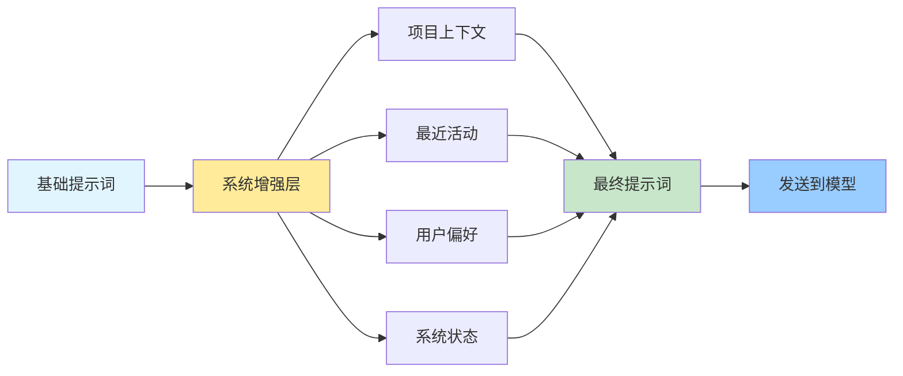
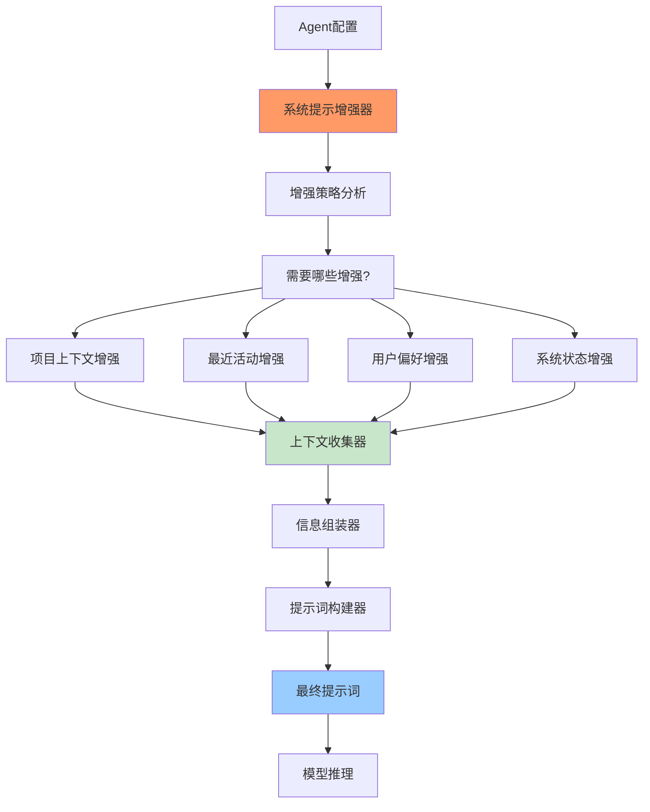
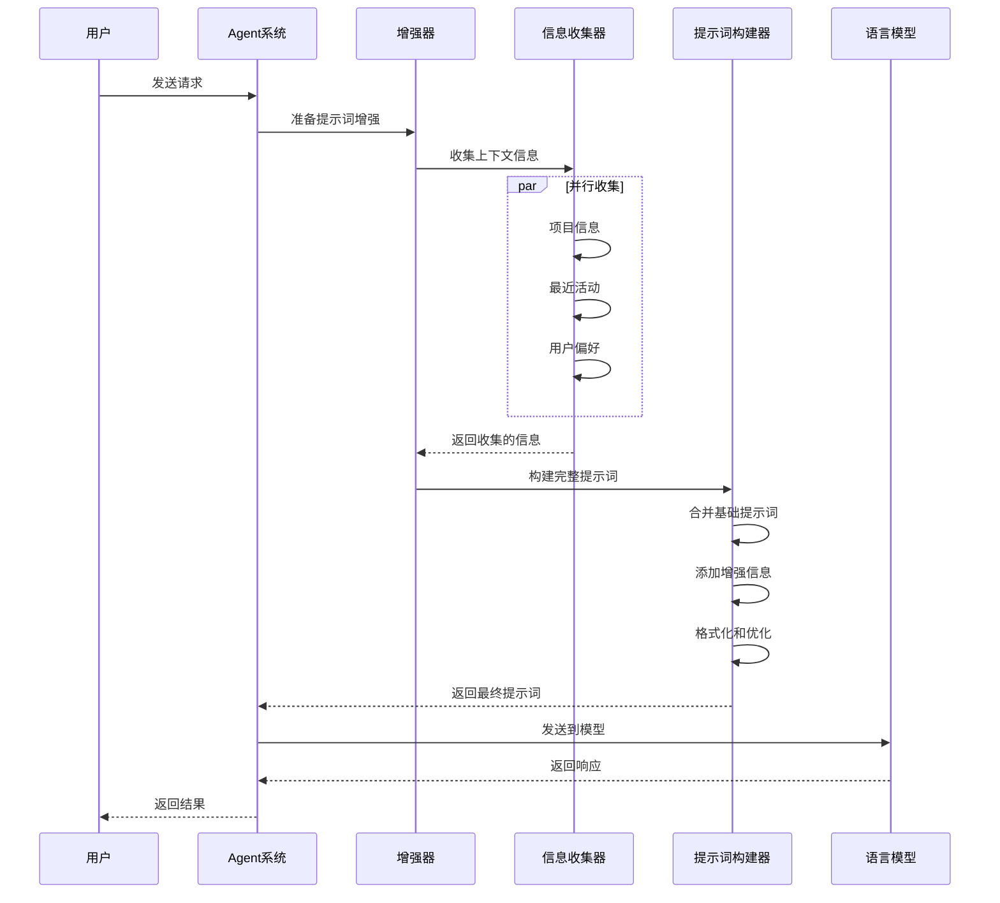
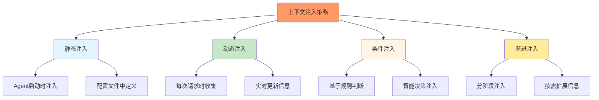
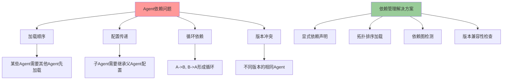
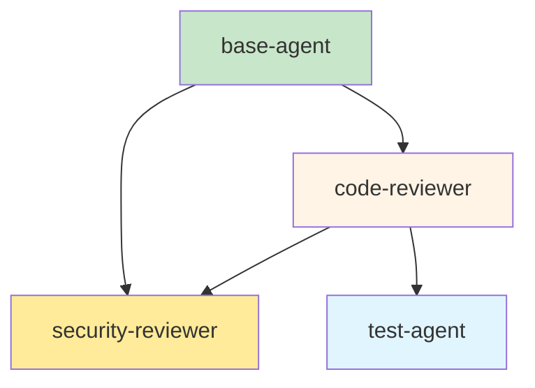
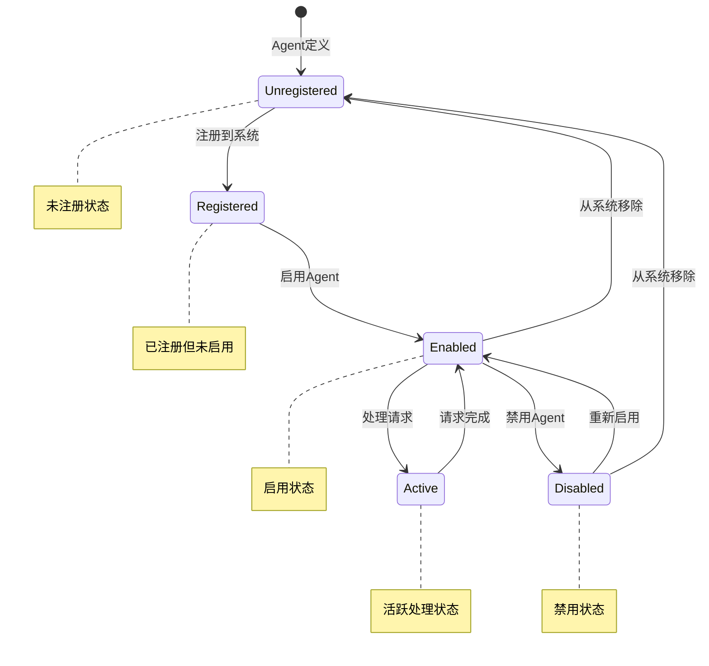
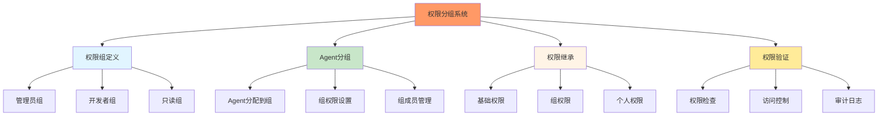

# 第5章：高级Agent配置

## 学习目标

通过本章学习，您将：
- 掌握系统提示增强机制的工作原理
- 学习上下文注入的各种策略
- 理解Agent间依赖关系的配置方法
- 掌握Agent启用/禁用的控制机制
- 学习Agent权限分组管理的最佳实践
- 能够创建分层的Agent架构

## 5.1 系统提示增强机制

### 什么是系统提示增强？

系统提示增强（System Prompt Enhancement）是指在Agent的基础提示词之上，动态添加额外的上下文信息和指导，以提升Agent的性能和准确性。



### 系统提示增强的架构



### SystemEnhancerConfig接口

```typescript
/**
 * 系统提示增强配置
 */
interface SystemEnhancerConfig {
  /**
   * 是否包含项目上下文
   * 包括：项目结构、主要文件、技术栈等
   */
  includeProjectContext?: boolean;
  
  /**
   * 是否包含最近活动
   * 包括：最近的修改、Agent调用、错误信息等
   */
  includeRecentActivity?: boolean;
  
  /**
   * 是否包含用户偏好
   * 包括：用户的编码风格、常用工具等
   */
  includeUserPreferences?: boolean;
  
  /**
   * 是否包含系统状态
   * 包括：系统负载、资源使用等
   */
  includeSystemStatus?: boolean;
  
  /**
   * 自定义增强函数
   * 允许提供自定义的增强逻辑
   */
  customEnhancers?: Array<
    (context: EnhancementContext) => Promise<EnhancementResult>
  >;
  
  /**
   * 增强优先级
   * 控制不同增强信息的显示顺序
   */
  priority?: string[];
}

interface EnhancementContext {
  agentName: string;
  workingDirectory: string;
  request: any;
  session: any;
}

interface EnhancementResult {
  content: string;
  priority: number;
  metadata?: Record<string, any>;
}
```

### 项目上下文增强

```typescript
/**
 * 项目上下文增强器
 */
class ProjectContextEnhancer {
  /**
   * 收集项目上下文信息
   */
  public async enhance(
    context: EnhancementContext
  ): Promise<EnhancementResult> {
    const { workingDirectory } = context;
    
    // 收集项目信息
    const projectInfo = await this.collectProjectInfo(workingDirectory);
    
    // 构建增强内容
    const content = this.buildProjectContext(projectInfo);
    
    return {
      content,
      priority: 100, // 高优先级
      metadata: {
        type: 'project-context',
        ...projectInfo,
      },
    };
  }
  
  /**
   * 收集项目信息
   */
  private async collectProjectInfo(
    directory: string
  ): Promise<ProjectInfo> {
    return {
      structure: await this.getProjectStructure(directory),
      languages: await this.detectLanguages(directory),
      frameworks: await this.detectFrameworks(directory),
      dependencies: await this.getDependencies(directory),
      importantFiles: await this.getImportantFiles(directory),
    };
  }
  
  /**
   * 获取项目结构
   */
  private async getProjectStructure(
    directory: string
  ): Promise<string[]> {
    // 实现项目结构分析
    return ['src/', 'test/', 'docs/', 'package.json'];
  }
  
  /**
   * 检测编程语言
   */
  private async detectLanguages(
    directory: string
  ): Promise<string[]> {
    // 实现语言检测
    return ['TypeScript', 'JavaScript', 'Python'];
  }
  
  /**
   * 检测框架
   */
  private async detectFrameworks(
    directory: string
  ): Promise<string[]> {
    // 实现框架检测
    return ['React', 'Express', 'Jest'];
  }
  
  /**
   * 获取依赖信息
   */
  private async getDependencies(
    directory: string
  ): Promise<string[]> {
    // 实现依赖分析
    return ['react', 'express', 'jest'];
  }
  
  /**
   * 获取重要文件
   */
  private async getImportantFiles(
    directory: string
  ): Promise<string[]> {
    // 实现重要文件识别
    return ['package.json', 'README.md', 'tsconfig.json'];
  }
  
  /**
   * 构建项目上下文
   */
  private buildProjectContext(info: ProjectInfo): string {
    return `
## 项目上下文

### 项目结构
${info.structure.map(s => `- ${s}`).join('\n')}

### 编程语言
${info.languages.join(', ')}

### 使用框架
${info.frameworks.join(', ')}

### 主要依赖
${info.dependencies.map(d => `- ${d}`).join('\n')}

### 重要文件
${info.importantFiles.map(f => `- ${f}`).join('\n')}
`;
  }
}

interface ProjectInfo {
  structure: string[];
  languages: string[];
  frameworks: string[];
  dependencies: string[];
  importantFiles: string[];
}
```

### 最近活动增强

```typescript
/**
 * 最近活动增强器
 */
class RecentActivityEnhancer {
  private activityHistory: ActivityEntry[] = [];
  
  /**
   * 记录活动
   */
  public recordActivity(activity: ActivityEntry): void {
    this.activityHistory.push({
      ...activity,
      timestamp: Date.now(),
    });
    
    // 保持历史记录在合理范围内
    if (this.activityHistory.length > 100) {
      this.activityHistory = this.activityHistory.slice(-50);
    }
  }
  
  /**
   * 增强最近活动
   */
  public async enhance(
    context: EnhancementContext
  ): Promise<EnhancementResult> {
    // 获取最近的活动
    const recentActivities = this.getRecentActivities(10); // 最近10个活动
    
    // 按类型分组
    const groupedActivities = this.groupByType(recentActivities);
    
    // 构建增强内容
    const content = this.buildActivityContext(groupedActivities);
    
    return {
      content,
      priority: 90,
      metadata: {
        type: 'recent-activity',
        activities: recentActivities,
      },
    };
  }
  
  /**
   * 获取最近活动
   */
  private getRecentActivities(count: number): ActivityEntry[] {
    return this.activityHistory.slice(-count);
  }
  
  /**
   * 按类型分组
   */
  private groupByType(
    activities: ActivityEntry[]
  ): Record<string, ActivityEntry[]> {
    return activities.reduce((groups, activity) => {
      const type = activity.type || 'other';
      if (!groups[type]) {
        groups[type] = [];
      }
      groups[type].push(activity);
      return groups;
    }, {} as Record<string, ActivityEntry[]>);
  }
  
  /**
   * 构建活动上下文
   */
  private buildActivityContext(
    groupedActivities: Record<string, ActivityEntry[]>
  ): string {
    let content = '## 最近活动\n\n';
    
    for (const [type, activities] of Object.entries(groupedActivities)) {
      content += `### ${this.formatType(type)}\n`;
      for (const activity of activities.slice(0, 5)) {
        content += `- ${this.formatActivity(activity)}\n`;
      }
      content += '\n';
    }
    
    return content;
  }
  
  /**
   * 格式化活动类型
   */
  private formatType(type: string): string {
    const typeMap: Record<string, string> = {
      'file-modification': '文件修改',
      'agent-call': 'Agent调用',
      'error': '错误',
      'user-request': '用户请求',
      'other': '其他',
    };
    return typeMap[type] || type;
  }
  
  /**
   * 格式化活动
   */
  private formatActivity(activity: ActivityEntry): string {
    const time = new Date(activity.timestamp).toLocaleTimeString();
    return `[${time}] ${activity.description}`;
  }
}

interface ActivityEntry {
  type?: string;
  description: string;
  timestamp: number;
  metadata?: Record<string, any>;
}
```

## 5.2 上下文注入策略

### 上下文注入的时机



### 上下文注入策略类型



### 静态上下文注入

```typescript
/**
 * 静态上下文注入器
 */
class StaticContextInjector {
  private staticContext: Map<string, string> = new Map();
  
  /**
   * 配置静态上下文
   */
  public configureStaticContext(config: {
    projectInfo?: string;
    codingGuidelines?: string;
    architectureDoc?: string;
    customContext?: string;
  }): void {
    if (config.projectInfo) {
      this.staticContext.set('project-info', config.projectInfo);
    }
    if (config.codingGuidelines) {
      this.staticContext.set('coding-guidelines', config.codingGuidelines);
    }
    if (config.architectureDoc) {
      this.staticContext.set('architecture-doc', config.architectureDoc);
    }
    if (config.customContext) {
      this.staticContext.set('custom', config.customContext);
    }
  }
  
  /**
   * 注入静态上下文
   */
  public inject(basePrompt: string): string {
    let enhancedPrompt = basePrompt;
    
    // 按优先级注入静态上下文
    const contextOrder = ['project-info', 'coding-guidelines', 'architecture-doc', 'custom'];
    
    for (const contextKey of contextOrder) {
      const context = this.staticContext.get(contextKey);
      if (context) {
        enhancedPrompt = this.injectContext(enhancedPrompt, context, contextKey);
      }
    }
    
    return enhancedPrompt;
  }
  
  /**
   * 注入单个上下文
   */
  private injectContext(
    prompt: string,
    context: string,
    contextName: string
  ): string {
    // 在提示词末尾添加上下文
    return `${prompt}\n\n## ${this.formatContextName(contextName)}\n\n${context}`;
  }
  
  /**
   * 格式化上下文名称
   */
  private formatContextName(name: string): string {
    const nameMap: Record<string, string> = {
      'project-info': '项目信息',
      'coding-guidelines': '编码指南',
      'architecture-doc': '架构文档',
      'custom': '自定义上下文',
    };
    return nameMap[name] || name;
  }
}
```

### 动态上下文注入

```typescript
/**
 * 动态上下文注入器
 */
class DynamicContextInjector {
  private collectors: Map<string, ContextCollector> = new Map();
  
  /**
   * 注册上下文收集器
   */
  public registerCollector(
    name: string,
    collector: ContextCollector
  ): void {
    this.collectors.set(name, collector);
  }
  
  /**
   * 注入动态上下文
   */
  public async inject(
    basePrompt: string,
    context: InjectionContext
  ): Promise<string> {
    let enhancedPrompt = basePrompt;
    
    // 并行收集所有动态上下文
    const collectionPromises = Array.from(this.collectors.entries()).map(
      async ([name, collector]) => {
        try {
          const collectedContext = await collector.collect(context);
          return { name, content: collectedContext };
        } catch (error) {
          console.error(`Context collector '${name}' failed:`, error);
          return null;
        }
      }
    );
    
    const results = await Promise.all(collectionPromises);
    
    // 按优先级排序并注入
    const validResults = results.filter(r => r !== null);
    validResults.sort((a, b) => {
      const priorityA = this.collectors.get(a!.name)!.priority || 0;
      const priorityB = this.collectors.get(b!.name)!.priority || 0;
      return priorityB - priorityA;
    });
    
    // 注入收集的上下文
    for (const result of validResults) {
      enhancedPrompt = this.injectContext(
        enhancedPrompt,
        result!.content,
        result!.name
      );
    }
    
    return enhancedPrompt;
  }
  
  /**
   * 注入单个上下文
   */
  private injectContext(
    prompt: string,
    context: string,
    contextName: string
  ): string {
    return `${prompt}\n\n## ${contextName}\n\n${context}`;
  }
}

/**
 * 上下文收集器接口
 */
interface ContextCollector {
  priority?: number;
  collect(context: InjectionContext): Promise<string>;
}

/**
 * 注入上下文接口
 */
interface InjectionContext {
  agentName: string;
  workingDirectory: string;
  request: any;
  session: any;
}

/**
 * 示例：文件修改历史收集器
 */
class FileModificationCollector implements ContextCollector {
  priority = 80;
  
  async collect(context: InjectionContext): Promise<string> {
    // 获取最近的文件修改历史
    const modifications = await this.getRecentModifications(
      context.workingDirectory,
      10
    );
    
    // 构建上下文
    return modifications
      .map(m => `- ${m.file}: ${m.action} (${this.formatTime(m.timestamp)})`)
      .join('\n');
  }
  
  private async getRecentModifications(
    directory: string,
    count: number
  ): Promise<Array<{ file: string; action: string; timestamp: number }>> {
    // 实现文件修改历史收集
    return [];
  }
  
  private formatTime(timestamp: number): string {
    return new Date(timestamp).toLocaleTimeString();
  }
}
```

### 条件上下文注入

```typescript
/**
 * 条件上下文注入器
 */
class ConditionalContextInjector {
  private rules: ConditionalRule[] = [];
  
  /**
   * 添加注入规则
   */
  public addRule(rule: ConditionalRule): void {
    this.rules.push(rule);
  }
  
  /**
   * 条件性注入上下文
   */
  public async inject(
    basePrompt: string,
    context: InjectionContext
  ): Promise<string> {
    let enhancedPrompt = basePrompt;
    
    // 评估所有规则
    for (const rule of this.rules) {
      const shouldInject = await rule.condition(context);
      
      if (shouldInject) {
        const contextContent = await rule.provider(context);
        enhancedPrompt = this.injectContext(enhancedPrompt, contextContent, rule.name);
      }
    }
    
    return enhancedPrompt;
  }
  
  /**
   * 注入上下文
   */
  private injectContext(
    prompt: string,
    context: string,
    contextName: string
  ): string {
    return `${prompt}\n\n## ${contextName}\n\n${context}`;
  }
}

/**
 * 条件规则接口
 */
interface ConditionalRule {
  name: string;
  condition: (context: InjectionContext) => Promise<boolean>;
  provider: (context: InjectionContext) => Promise<string>;
}

/**
 * 示例：错误上下文规则
 */
const errorContextRule: ConditionalRule = {
  name: '错误上下文',
  condition: async (context) => {
    // 如果最近有错误发生，则注入错误上下文
    return context.session?.recentErrors?.length > 0;
  },
  provider: async (context) => {
    const errors = context.session?.recentErrors || [];
    return errors
      .map(e => `- ${e.error} at ${e.location}`)
      .join('\n');
  },
};
```

## 5.3 Agent间依赖关系配置

### 为什么需要Agent依赖管理？



### Agent依赖关系建模

```typescript
/**
 * Agent依赖关系图
 */
class AgentDependencyGraph {
  private graph: Map<string, AgentNode> = new Map();
  
  /**
   * 添加Agent节点
   */
  public addAgent(
    name: string,
    config: AgentConfig,
    dependencies: string[] = []
  ): void {
    this.graph.set(name, {
      name,
      config,
      dependencies,
      status: 'pending',
    });
  }
  
  /**
   * 构建依赖关系
   */
  public buildDependencies(): string[] {
    // 拓扑排序
    const sorted = this.topologicalSort();
    
    // 检测循环依赖
    this.detectCircularDependencies(sorted);
    
    return sorted;
  }
  
  /**
   * 拓扑排序
   */
  private topologicalSort(): string[] {
    const sorted: string[] = [];
    const visiting = new Set<string>();
    const visited = new Set<string>();
    
    const visit = (nodeName: string) => {
      if (visited.has(nodeName)) {
        return;
      }
      
      if (visiting.has(nodeName)) {
        throw new Error(`Circular dependency detected involving '${nodeName}'`);
      }
      
      visiting.add(nodeName);
      
      const node = this.graph.get(nodeName);
      if (node) {
        for (const dep of node.dependencies) {
          visit(dep);
        }
      }
      
      visiting.delete(nodeName);
      visited.add(nodeName);
      sorted.push(nodeName);
    };
    
    for (const nodeName of this.graph.keys()) {
      visit(nodeName);
    }
    
    return sorted;
  }
  
  /**
   * 检测循环依赖
   */
  private detectCircularDependencies(sortedOrder: string[]): void {
    // 拓扑排序会抛出循环依赖错误，这里是双重检查
    const visited = new Set<string>();
    const recursionStack = new Set<string>();
    
    const hasCycle = (nodeName: string): boolean => {
      visited.add(nodeName);
      recursionStack.add(nodeName);
      
      const node = this.graph.get(nodeName);
      if (node) {
        for (const dep of node.dependencies) {
          if (!visited.has(dep) && hasCycle(dep)) {
            return true;
          } else if (recursionStack.has(dep)) {
            return true;
          }
        }
      }
      
      recursionStack.delete(nodeName);
      return false;
    };
    
    for (const nodeName of this.graph.keys()) {
      if (!visited.has(nodeName)) {
        if (hasCycle(nodeName)) {
          throw new Error(`Circular dependency detected in agent dependencies`);
        }
      }
    }
  }
  
  /**
   * 获取加载顺序
   */
  public getLoadOrder(): string[] {
    return this.buildDependencies();
  }
  
  /**
   * 验证依赖关系
   */
  public validateDependencies(): {
    valid: boolean;
    errors: string[];
  } {
    const errors: string[] = [];
    
    try {
      this.buildDependencies();
    } catch (error) {
      errors.push(error instanceof Error ? error.message : String(error));
    }
    
    // 检查缺失的依赖
    for (const [name, node] of this.graph) {
      for (const dep of node.dependencies) {
        if (!this.graph.has(dep)) {
          errors.push(`Agent '${name}' depends on missing agent '${dep}'`);
        }
      }
    }
    
    return {
      valid: errors.length === 0,
      errors,
    };
  }
}

/**
 * Agent节点接口
 */
interface AgentNode {
  name: string;
  config: AgentConfig;
  dependencies: string[];
  status: 'pending' | 'loading' | 'loaded' | 'error';
}
```

### Agent依赖配置示例

```typescript
/**
 * Agent依赖配置示例
 */
const dependencyConfig = {
  agents: {
    // 基础Agent（无依赖）
    'base-agent': {
      config: {
        name: 'base-agent',
        description: '基础Agent',
        model: 'claude-sonnet-4',
        prompt: '基础提示词...',
      },
      dependencies: [],
    },
    
    // 代码审查Agent（依赖基础Agent）
    'code-reviewer': {
      config: {
        name: 'code-reviewer',
        description: '代码审查Agent',
        model: 'claude-sonnet-4',
        prompt: '代码审查提示词...',
      },
      dependencies: ['base-agent'],
    },
    
    // 安全审查Agent（依赖基础Agent和代码审查Agent）
    'security-reviewer': {
      config: {
        name: 'security-reviewer',
        description: '安全审查Agent',
        model: 'claude-sonnet-4',
        prompt: '安全审查提示词...',
      },
      dependencies: ['base-agent', 'code-reviewer'],
    },
    
    // 测试Agent（依赖代码审查Agent）
    'test-agent': {
      config: {
        name: 'test-agent',
        description: '测试Agent',
        model: 'claude-sonnet-4',
        prompt: '测试提示词...',
      },
      dependencies: ['code-reviewer'],
    },
  },
};

// 构建依赖图并获取加载顺序
const dependencyGraph = new AgentDependencyGraph();

for (const [name, agentConfig] of Object.entries(dependencyConfig.agents)) {
  dependencyGraph.addAgent(
    name,
    agentConfig.config,
    agentConfig.dependencies
  );
}

// 验证依赖关系
const validation = dependencyGraph.validateDependencies();
if (!validation.valid) {
  console.error('Dependency validation failed:', validation.errors);
} else {
  // 获取正确的加载顺序
  const loadOrder = dependencyGraph.getLoadOrder();
  console.log('Agent load order:', loadOrder);
  // 输出: ['base-agent', 'code-reviewer', 'security-reviewer', 'test-agent']
}
```

### 依赖关系可视化



## 5.4 Agent启用/禁用控制

### Agent状态管理



### Agent状态控制器

```typescript
/**
 * Agent状态控制器
 */
class AgentStatusController {
  private agentStatus: Map<string, AgentStatus> = new Map();
  private statusListeners: Map<string, StatusListener[]> = new Map();
  
  /**
   * 注册Agent
   */
  public registerAgent(name: string, config: AgentConfig): void {
    this.agentStatus.set(name, {
      name,
      enabled: config.disabled !== true,
      config,
      status: 'registered',
      lastModified: Date.now(),
    });
    
    this.notifyListeners(name, 'registered', { enabled: !config.disabled });
  }
  
  /**
   * 启用Agent
   */
  public enableAgent(name: string): void {
    const status = this.agentStatus.get(name);
    if (!status) {
      throw new Error(`Agent '${name}' not found`);
    }
    
    if (!status.enabled) {
      status.enabled = true;
      status.status = 'enabled';
      status.lastModified = Date.now();
      
      this.notifyListeners(name, 'enabled', null);
    }
  }
  
  /**
   * 禁用Agent
   */
  public disableAgent(name: string): void {
    const status = this.agentStatus.get(name);
    if (!status) {
      throw new Error(`Agent '${name}' not found`);
    }
    
    if (status.enabled) {
      status.enabled = false;
      status.status = 'disabled';
      status.lastModified = Date.now();
      
      this.notifyListeners(name, 'disabled', null);
    }
  }
  
  /**
   * 检查Agent是否启用
   */
  public isAgentEnabled(name: string): boolean {
    const status = this.agentStatus.get(name);
    return status ? status.enabled : false;
  }
  
  /**
   * 获取Agent状态
   */
  public getAgentStatus(name: string): AgentStatus | undefined {
    return this.agentStatus.get(name);
  }
  
  /**
   * 获取所有启用的Agent
   */
  public getEnabledAgents(): string[] {
    return Array.from(this.agentStatus.values())
      .filter(status => status.enabled)
      .map(status => status.name);
  }
  
  /**
   * 获取所有禁用的Agent
   */
  public getDisabledAgents(): string[] {
    return Array.from(this.agentStatus.values())
      .filter(status => !status.enabled)
      .map(status => status.name);
  }
  
  /**
   * 批量启用Agent
   */
  public enableAgents(names: string[]): void {
    for (const name of names) {
      try {
        this.enableAgent(name);
      } catch (error) {
        console.error(`Failed to enable agent '${name}':`, error);
      }
    }
  }
  
  /**
   * 批量禁用Agent
   */
  public disableAgents(names: string[]): void {
    for (const name of names) {
      try {
        this.disableAgent(name);
      } catch (error) {
        console.error(`Failed to disable agent '${name}':`, error);
      }
    }
  }
  
  /**
   * 添加状态监听器
   */
  public addStatusListener(
    agentName: string,
    listener: StatusListener
  ): void {
    if (!this.statusListeners.has(agentName)) {
      this.statusListeners.set(agentName, []);
    }
    this.statusListeners.get(agentName)!.push(listener);
  }
  
  /**
   * 通知监听器
   */
  private notifyListeners(
    agentName: string,
    event: string,
    data: any
  ): void {
    const listeners = this.statusListeners.get(agentName) || [];
    for (const listener of listeners) {
      try {
        listener(event, data);
      } catch (error) {
        console.error(`Status listener error for agent '${agentName}':`, error);
      }
    }
  }
  
  /**
   * 获取统计信息
   */
  public getStatistics(): {
    total: number;
    enabled: number;
    disabled: number;
  } {
    const statuses = Array.from(this.agentStatus.values());
    return {
      total: statuses.length,
      enabled: statuses.filter(s => s.enabled).length,
      disabled: statuses.filter(s => !s.enabled).length,
    };
  }
}

/**
 * Agent状态接口
 */
interface AgentStatus {
  name: string;
  enabled: boolean;
  config: AgentConfig;
  status: 'registered' | 'enabled' | 'disabled' | 'active';
  lastModified: number;
}

/**
 * 状态监听器类型
 */
type StatusListener = (event: string, data: any) => void;
```

### Agent状态配置示例

```typescript
// 创建状态控制器
const statusController = new AgentStatusController();

// 注册Agent
statusController.registerAgent('code-reviewer', {
  name: 'code-reviewer',
  description: '代码审查Agent',
  model: 'claude-sonnet-4',
  prompt: '代码审查提示词...',
  disabled: false, // 初始启用
});

statusController.registerAgent('security-expert', {
  name: 'security-expert',
  description: '安全专家Agent',
  model: 'claude-sonnet-4',
  prompt: '安全审查提示词...',
  disabled: true, // 初始禁用
});

// 检查Agent状态
console.log('code-reviewer enabled:', statusController.isAgentEnabled('code-reviewer')); // true
console.log('security-expert enabled:', statusController.isAgentEnabled('security-expert')); // false

// 启用安全专家Agent
statusController.enableAgent('security-expert');

// 禁用代码审查Agent
statusController.disableAgent('code-reviewer');

// 获取统计信息
const stats = statusController.getStatistics();
console.log('Agent statistics:', stats);
// { total: 2, enabled: 1, disabled: 1 }

// 添加状态监听器
statusController.addStatusListener('code-reviewer', (event, data) => {
  console.log(`code-reviewer status changed: ${event}`, data);
});
```

## 5.5 Agent权限分组管理

### 权限分组概念



### 权限分组系统实现

```typescript
/**
 * Agent权限分组系统
 */
class AgentPermissionGroups {
  private groups: Map<string, PermissionGroup> = new Map();
  private agentGroupMembership: Map<string, string[]> = new Map();
  private permissionCache: Map<string, Set<string>> = new Map();
  
  /**
   * 创建权限组
   */
  public createGroup(
    groupName: string,
    permissions: string[],
    metadata?: GroupMetadata
  ): void {
    this.groups.set(groupName, {
      name: groupName,
      permissions: new Set(permissions),
      metadata: metadata || {},
      createdAt: Date.now(),
    });
    
    // 清除缓存
    this.clearCache();
  }
  
  /**
   * 将Agent添加到组
   */
  public addAgentToGroup(agentName: string, groupName: string): void {
    if (!this.groups.has(groupName)) {
      throw new Error(`Group '${groupName}' does not exist`);
    }
    
    if (!this.agentGroupMembership.has(agentName)) {
      this.agentGroupMembership.set(agentName, []);
    }
    
    const memberships = this.agentGroupMembership.get(agentName)!;
    if (!memberships.includes(groupName)) {
      memberships.push(groupName);
    }
    
    // 清除缓存
    this.clearAgentCache(agentName);
  }
  
  /**
   * 从组中移除Agent
   */
  public removeAgentFromGroup(agentName: string, groupName: string): void {
    const memberships = this.agentGroupMembership.get(agentName);
    if (memberships) {
      const index = memberships.indexOf(groupName);
      if (index !== -1) {
        memberships.splice(index, 1);
      }
    }
    
    // 清除缓存
    this.clearAgentCache(agentName);
  }
  
  /**
   * 检查Agent权限
   */
  public hasPermission(
    agentName: string,
    permission: string
  ): boolean {
    // 检查缓存
    const cacheKey = `${agentName}:${permission}`;
    if (this.permissionCache.has(cacheKey)) {
      return this.permissionCache.get(cacheKey)!;
    }
    
    // 获取Agent的所有权限
    const permissions = this.getAgentPermissions(agentName);
    const hasPermission = permissions.has(permission);
    
    // 缓存结果
    this.permissionCache.set(cacheKey, hasPermission);
    
    return hasPermission;
  }
  
  /**
   * 获取Agent的所有权限
   */
  public getAgentPermissions(agentName: string): Set<string> {
    const allPermissions = new Set<string>();
    
    // 获取Agent所属的所有组
    const memberships = this.agentGroupMembership.get(agentName) || [];
    
    // 收集所有组的权限
    for (const groupName of memberships) {
      const group = this.groups.get(groupName);
      if (group) {
        for (const permission of group.permissions) {
          allPermissions.add(permission);
        }
      }
    }
    
    return allPermissions;
  }
  
  /**
   * 获取组的所有Agent
   */
  public getAgentsInGroup(groupName: string): string[] {
    const agents: string[] = [];
    
    for (const [agentName, memberships] of this.agentGroupMembership) {
      if (memberships.includes(groupName)) {
        agents.push(agentName);
      }
    }
    
    return agents;
  }
  
  /**
   * 获取Agent所属的所有组
   */
  public getAgentGroups(agentName: string): string[] {
    return this.agentGroupMembership.get(agentName) || [];
  }
  
  /**
   * 添加权限到组
   */
  public addPermissionToGroup(groupName: string, permission: string): void {
    const group = this.groups.get(groupName);
    if (!group) {
      throw new Error(`Group '${groupName}' does not exist`);
    }
    
    group.permissions.add(permission);
    
    // 清除相关缓存
    this.clearGroupCache(groupName);
  }
  
  /**
   * 从组中移除权限
   */
  public removePermissionFromGroup(groupName: string, permission: string): void {
    const group = this.groups.get(groupName);
    if (!group) {
      throw new Error(`Group '${groupName}' does not exist`);
    }
    
    group.permissions.delete(permission);
    
    // 清除相关缓存
    this.clearGroupCache(groupName);
  }
  
  /**
   * 清除Agent缓存
   */
  private clearAgentCache(agentName: string): void {
    const keysToDelete: string[] = [];
    
    for (const key of this.permissionCache.keys()) {
      if (key.startsWith(`${agentName}:`)) {
        keysToDelete.push(key);
      }
    }
    
    for (const key of keysToDelete) {
      this.permissionCache.delete(key);
    }
  }
  
  /**
   * 清除组缓存
   */
  private clearGroupCache(groupName: string): void {
    const agents = this.getAgentsInGroup(groupName);
    
    for (const agentName of agents) {
      this.clearAgentCache(agentName);
    }
  }
  
  /**
   * 清除所有缓存
   */
  private clearCache(): void {
    this.permissionCache.clear();
  }
  
  /**
   * 获取统计信息
   */
  public getStatistics(): {
    totalGroups: number;
    totalMemberships: number;
    cacheSize: number;
  } {
    let totalMemberships = 0;
    
    for (const memberships of this.agentGroupMembership.values()) {
      totalMemberships += memberships.length;
    }
    
    return {
      totalGroups: this.groups.size,
      totalMemberships,
      cacheSize: this.permissionCache.size,
    };
  }
}

/**
 * 权限组接口
 */
interface PermissionGroup {
  name: string;
  permissions: Set<string>;
  metadata: GroupMetadata;
  createdAt: number;
}

/**
 * 组元数据接口
 */
interface GroupMetadata {
  description?: string;
  owner?: string;
  [key: string]: any;
}
```

### 权限分组配置示例

```typescript
// 创建权限分组系统
const permissionGroups = new AgentPermissionGroups();

// 定义权限组
permissionGroups.createGroup('admin', [
  'all:read',
  'all:write',
  'all:delete',
  'system:configure',
  'user:manage',
], {
  description: '管理员组 - 完全系统访问权限',
  owner: 'system',
});

permissionGroups.createGroup('developer', [
  'file:read',
  'file:write',
  'code:analyze',
  'agent:use',
  'tool:use',
], {
  description: '开发者组 - 开发相关权限',
  owner: 'development-team',
});

permissionGroups.createGroup('reviewer', [
  'file:read',
  'code:analyze',
  'agent:use',
], {
  description: '审查者组 - 只读和审查权限',
  owner: 'review-team',
});

// 将Agent分配到组
permissionGroups.addAgentToGroup('architect', 'admin');
permissionGroups.addAgentToGroup('code-reviewer', 'developer');
permissionGroups.addAgentToGroup('security-reviewer', 'reviewer');

// 检查权限
console.log('architect has all:write:', 
  permissionGroups.hasPermission('architect', 'all:write')); // true

console.log('code-reviewer has file:write:', 
  permissionGroups.hasPermission('code-reviewer', 'file:write')); // true

console.log('security-reviewer has file:write:', 
  permissionGroups.hasPermission('security-reviewer', 'file:write')); // false

// 获取Agent权限
const reviewerPermissions = permissionGroups.getAgentPermissions('code-reviewer');
console.log('code-reviewer permissions:', Array.from(reviewerPermissions));

// 获取统计信息
const stats = permissionGroups.getStatistics();
console.log('Permission group statistics:', stats);
```

## 5.6 实践：创建分层Agent架构

### 完整的分层Agent系统

让我们创建一个完整的分层Agent架构系统：

```typescript
/**
 * 分层Agent架构系统
 */
class LayeredAgentArchitecture {
  private statusController: AgentStatusController;
  private permissionGroups: AgentPermissionGroups;
  private dependencyGraph: AgentDependencyGraph;
  private contextInjector: DynamicContextInjector;
  
  constructor() {
    this.statusController = new AgentStatusController();
    this.permissionGroups = new AgentPermissionGroups();
    this.dependencyGraph = new AgentDependencyGraph();
    this.contextInjector = new DynamicContextInjector();
  }
  
  /**
   * 配置权限组
   */
  public setupPermissionGroups(): void {
    // 管理员组
    this.permissionGroups.createGroup('admin', [
      'system:configure', 'agent:manage', 'all:read', 'all:write'
    ], { description: '系统管理员' });
    
    // 高级开发者组
    this.permissionGroups.createGroup('senior-developer', [
      'file:read', 'file:write', 'agent:use', 'tool:use', 'workflow:execute'
    ], { description: '高级开发者' });
    
    // 开发者组
    this.permissionGroups.createGroup('developer', [
      'file:read', 'agent:use', 'tool:read'
    ], { description: '开发者' });
    
    // 审查者组
    this.permissionGroups.createGroup('reviewer', [
      'file:read', 'agent:use'
    ], { description: '代码审查者' });
  }
  
  /**
   * 注册基础Agent层
   */
  public registerBaseLayer(): void {
    // 基础Agent - 提供核心功能
    this.statusController.registerAgent({
      name: 'base-agent',
      description: '基础Agent - 提供核心功能',
      model: 'claude-sonnet-4',
      prompt: '你是基础Agent，提供核心功能...',
      tools: {
        'read_file': { permission: 'read' },
      },
    });
    
    this.permissionGroups.addAgentToGroup('base-agent', 'developer');
    this.dependencyGraph.addAgent('base-agent', {}, []);
  }
  
  /**
   * 注册专业Agent层
   */
  public registerProfessionalLayer(): void {
    // 代码审查Agent
    this.statusController.registerAgent({
      name: 'code-reviewer',
      description: '代码审查专家',
      model: 'claude-sonnet-4',
      prompt: '你是代码审查专家...',
      tools: {
        'read_file': { permission: 'read' },
        'search_code': { permission: 'read' },
        'analyze_syntax': { permission: 'read' },
      },
    });
    
    this.permissionGroups.addAgentToGroup('code-reviewer', 'reviewer');
    this.dependencyGraph.addAgent('code-reviewer', {}, ['base-agent']);
    
    // 安全审查Agent
    this.statusController.registerAgent({
      name: 'security-reviewer',
      description: '安全审查专家',
      model: 'claude-sonnet-4',
      prompt: '你是安全审查专家...',
      tools: {
        'read_file': { permission: 'read' },
        'security_scan': { permission: 'read' },
        'vulnerability_check': { permission: 'read' },
      },
    });
    
    this.permissionGroups.addAgentToGroup('security-reviewer', 'senior-developer');
    this.dependencyGraph.addAgent('security-reviewer', {}, ['code-reviewer']);
  }
  
  /**
   * 注册高级Agent层
   */
  public registerAdvancedLayer(): void {
    // 架构师Agent
    this.statusController.registerAgent({
      name: 'architect',
      description: '软件架构师',
      model: 'claude-opus-4',
      prompt: '你是软件架构师...',
      tools: {
        'all': { permission: 'admin' },
      },
    });
    
    this.permissionGroups.addAgentToGroup('architect', 'admin');
    this.dependencyGraph.addAgent('architect', {}, ['security-reviewer']);
    
    // 项目经理Agent
    this.statusController.registerAgent({
      name: 'project-manager',
      description: 'AI项目经理',
      model: 'claude-sonnet-4',
      prompt: '你是AI项目经理...',
      tools: {
        'read_file': { permission: 'read' },
        'coordinate_agents': { permission: 'admin' },
      },
    });
    
    this.permissionGroups.addAgentToGroup('project-manager', 'senior-developer');
    this.dependencyGraph.addAgent('project-manager', {}, ['architect']);
  }
  
  /**
   * 初始化整个架构
   */
  public async initialize(): Promise<void> {
    console.log('初始化分层Agent架构...');
    
    // 1. 设置权限组
    this.setupPermissionGroups();
    console.log('✓ 权限组设置完成');
    
    // 2. 注册基础层
    this.registerBaseLayer();
    console.log('✓ 基础层Agent注册完成');
    
    // 3. 注册专业层
    this.registerProfessionalLayer();
    console.log('✓ 专业层Agent注册完成');
    
    // 4. 注册高级层
    this.registerAdvancedLayer();
    console.log('✓ 高级层Agent注册完成');
    
    // 5. 验证依赖关系
    const validation = this.dependencyGraph.validateDependencies();
    if (!validation.valid) {
      console.error('✗ 依赖验证失败:', validation.errors);
      throw new Error('Agent dependency validation failed');
    }
    console.log('✓ 依赖关系验证通过');
    
    // 6. 获取加载顺序
    const loadOrder = this.dependencyGraph.getLoadOrder();
    console.log('✓ Agent加载顺序:', loadOrder);
    
    // 7. 按顺序启用Agent
    for (const agentName of loadOrder) {
      this.statusController.enableAgent(agentName);
      console.log(`✓ Agent '${agentName}' 已启用`);
    }
    
    console.log('分层Agent架构初始化完成！');
    
    // 8. 输出统计信息
    this.printStatistics();
  }
  
  /**
   * 输出统计信息
   */
  public printStatistics(): void {
    const statusStats = this.statusController.getStatistics();
    const permissionStats = this.permissionGroups.getStatistics();
    
    console.log('\n=== 系统统计 ===');
    console.log('Agent状态统计:');
    console.log(`  总计: ${statusStats.total}`);
    console.log(`  启用: ${statusStats.enabled}`);
    console.log(`  禁用: ${statusStats.disabled}`);
    
    console.log('\n权限组统计:');
    console.log(`  总组数: ${permissionStats.totalGroups}`);
    console.log(`  总成员数: ${permissionStats.totalMemberships}`);
    console.log(`  缓存大小: ${permissionStats.cacheSize}`);
  }
  
  /**
   * 获取系统状态
   */
  public getSystemStatus(): {
    agents: Array<{ name: string; enabled: boolean; groups: string[] }>;
    statistics: any;
  } {
    const agents = Array.from(this.permissionGroups.getAgentGroups('architect')); // 示例
    
    return {
      agents: agents.map(name => ({
        name,
        enabled: this.statusController.isAgentEnabled(name),
        groups: this.permissionGroups.getAgentGroups(name),
      })),
      statistics: {
        status: this.statusController.getStatistics(),
        permissions: this.permissionGroups.getStatistics(),
      },
    };
  }
}

// 使用示例
async function demonstrateLayeredArchitecture() {
  // 创建分层架构
  const architecture = new LayeredAgentArchitecture();
  
  // 初始化架构
  await architecture.initialize();
  
  // 获取系统状态
  const status = architecture.getSystemStatus();
  console.log('\n系统状态:', JSON.stringify(status, null, 2));
}
```

## 5.7 实践练习

### 练习1：配置系统提示增强

实现一个完整的系统提示增强系统：
1. 创建项目上下文增强器
2. 实现最近活动增强器
3. 添加用户偏好增强器
4. 组合所有增强器

```typescript
// 练习1模板
export class SystemPromptEnhancer {
  // 实现以下功能：
  // - addEnhancer(enhancer)
  // - enhance(basePrompt, context)
  // - getEnhancementStats()
}
```

### 练习2：实现Agent依赖管理

创建Agent依赖管理系统：
1. 定义Agent依赖关系
2. 实现拓扑排序
3. 检测循环依赖
4. 提供依赖可视化

```typescript
// 练习2模板
export class AgentDependencyManager {
  // 实现以下功能：
  // - addDependency(agent, dependencies)
  // - resolveLoadOrder()
  // - detectCircularDependencies()
  // - visualizeDependencies()
}
```

### 练习3：构建权限分组系统

实现完整的权限分组系统：
1. 创建权限组
2. 管理组成员
3. 检查权限
4. 提供审计功能

```typescript
// 练习3模板
export class PermissionGroupSystem {
  // 实现以下功能：
  // - createGroup(name, permissions)
  // - addAgentToGroup(agent, group)
  // - checkPermission(agent, permission)
  // - auditAccess(agent, permission, result)
}
```

## 5.8 本章小结

### 核心概念掌握

✅ **系统提示增强机制**：
- 动态添加上下文信息
- 提升Agent性能和准确性
- 支持多种增强策略
- 可配置和扩展

✅ **上下文注入策略**：
- 静态注入：Agent启动时注入
- 动态注入：每次请求时收集
- 条件注入：基于规则判断
- 渐进注入：分阶段扩展

✅ **Agent依赖关系**：
- 显式依赖声明
- 拓扑排序加载
- 循环依赖检测
- 版本兼容性检查

✅ **Agent状态控制**：
- 启用/禁用管理
- 状态监听机制
- 批量操作支持
- 统计信息提供

✅ **权限分组管理**：
- 基于组的权限控制
- Agent组成员管理
- 权限继承和验证
- 性能优化缓存

### 下一步学习

在第6章中，我们将学习：
- 子Agent概念和应用场景
- 父子Agent关系建模
- Agent嵌套调用机制
- 子Agent继承和覆盖规则
- 子Agent生命周期管理

### 技术要点检查表

- [ ] 理解系统提示增强的工作原理
- [ ] 掌握上下文注入的各种策略
- [ ] 理解Agent间依赖关系的配置
- [ ] 掌握Agent启用/禁用的控制
- [ ] 理解权限分组管理机制
- [ ] 能够创建分层的Agent架构
- [ ] 掌握Agent配置的高级特性

---

**下一步**：继续学习第6章 - 子Agent系统（上）并掌握Agent继承和嵌套技术！