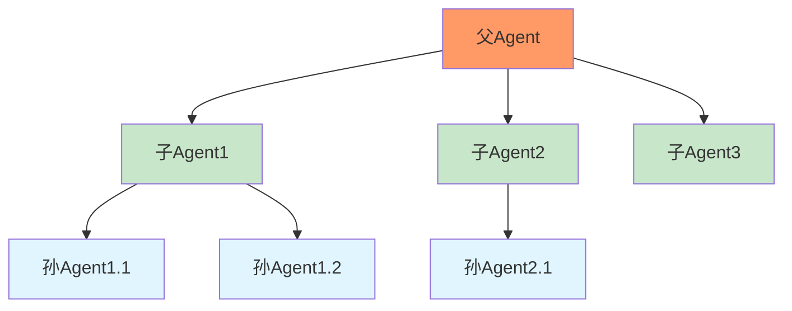
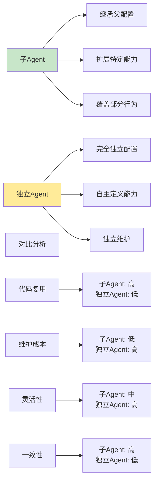
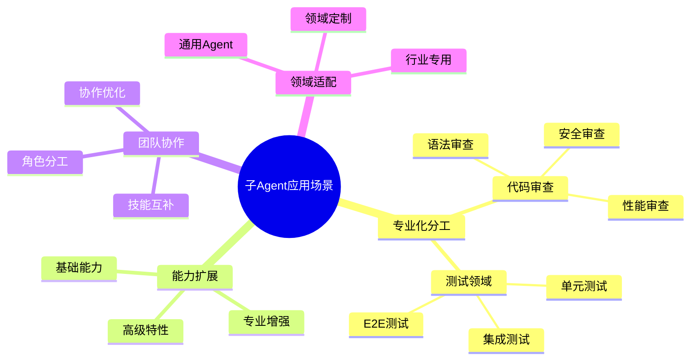
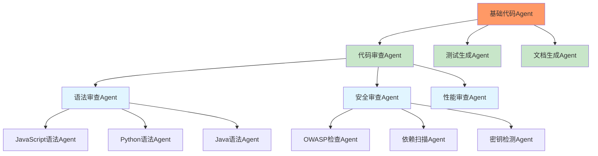
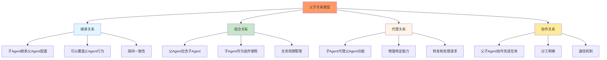
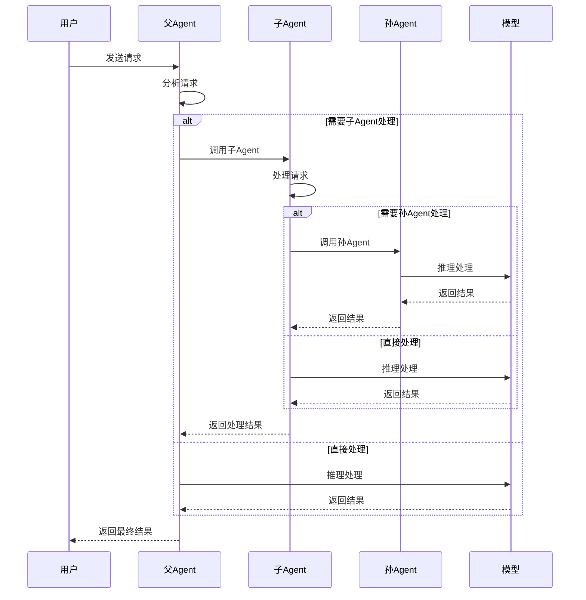
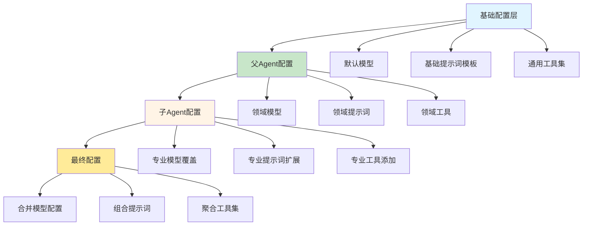

# 第6章：子Agent系统（上）

## 学习目标

通过本章学习，您将：
- 理解子Agent的概念和应用场景
- 掌握父子Agent关系建模方法
- 学习Agent嵌套调用机制
- 理解子Agent继承和覆盖规则
- 掌握子Agent生命周期管理
- 能够创建专业化的子Agent系统

## 6.1 子Agent概念和应用场景

### 什么是子Agent？

子Agent（SubAgent）是一种特殊的Agent，它继承自父Agent（Parent Agent）的配置和能力，同时可以扩展或覆盖特定的功能和行为。



### 子Agent vs 独立Agent



### 子Agent的应用场景



### 典型的子Agent层次结构



## 6.2 父子Agent关系建模

### 父子Agent关系类型



### 父子Agent关系定义

```typescript
/**
 * 父子Agent关系接口
 */
interface ParentChildRelation {
  // 父Agent名称
  parent: string;
  
  // 子Agent名称
  child: string;
  
  // 关系类型
  relationType: 'inheritance' | 'composition' | 'proxy' | 'collaboration';
  
  // 继承配置
  inheritanceConfig?: {
    // 继承提示词
    inheritPrompt?: boolean;
    
    // 继承工具
    inheritTools?: boolean;
    
    // 继承模型配置
    inheritModel?: boolean;
    
    // 继承权限
    inheritPermissions?: boolean;
  };
  
  // 覆盖配置
  overrideConfig?: {
    // 覆盖的提示词部分
    promptOverride?: string;
    
    // 额外的工具
    additionalTools?: string[];
    
    // 排除的工具
    excludedTools?: string[];
    
    // 模型覆盖
    modelOverride?: string;
  };
  
  // 关系元数据
  metadata?: {
    createdAt?: number;
    createdBy?: string;
    description?: string;
    [key: string]: any;
  };
}

/**
 * 子Agent定义接口
 */
interface SubAgentDefinition {
  // Agent名称
  name: string;
  
  // 父Agent名称
  parentAgent: string;
  
  // 关系类型
  relationType: 'inheritance' | 'composition' | 'proxy' | 'collaboration';
  
  // Agent配置
  config: Partial<AgentConfig>;
  
  // 继承配置
  inheritance?: {
    prompt?: boolean;
    tools?: boolean;
    model?: boolean;
    permissions?: boolean;
  };
  
  // 覆盖配置
  overrides?: {
    prompt?: string;
    additionalTools?: Record<string, ToolConfig>;
    excludedTools?: string[];
    model?: string;
  };
}
```

### 父子Agent关系管理器

```typescript
/**
 * 父子Agent关系管理器
 */
class ParentChildRelationManager {
  private relations: Map<string, ParentChildRelation> = new Map();
  private childrenIndex: Map<string, string[]> = new Map();
  private parentIndex: Map<string, string> = new Map();
  
  /**
   * 创建父子关系
   */
  public createRelation(relation: ParentChildRelation): void {
    const relationId = this.generateRelationId(relation.parent, relation.child);
    
    // 验证关系
    this.validateRelation(relation);
    
    // 存储关系
    this.relations.set(relationId, relation);
    
    // 更新索引
    if (!this.childrenIndex.has(relation.parent)) {
      this.childrenIndex.set(relation.parent, []);
    }
    this.childrenIndex.get(relation.parent)!.push(relation.child);
    
    this.parentIndex.set(relation.child, relation.parent);
  }
  
  /**
   * 获取父Agent的所有子Agent
   */
  public getChildren(parentName: string): string[] {
    return this.childrenIndex.get(parentName) || [];
  }
  
  /**
   * 获取子Agent的父Agent
   */
  public getParent(childName: string): string | undefined {
    return this.parentIndex.get(childName);
  }
  
  /**
   * 获取关系
   */
  public getRelation(parentName: string, childName: string): ParentChildRelation | undefined {
    const relationId = this.generateRelationId(parentName, childName);
    return this.relations.get(relationId);
  }
  
  /**
   * 删除关系
   */
  public deleteRelation(parentName: string, childName: string): boolean {
    const relationId = this.generateRelationId(parentName, childName);
    
    // 从关系中删除
    const deleted = this.relations.delete(relationId);
    
    if (deleted) {
      // 从索引中删除
      const siblings = this.childrenIndex.get(parentName);
      if (siblings) {
        const index = siblings.indexOf(childName);
        if (index !== -1) {
          siblings.splice(index, 1);
        }
      }
      
      this.parentIndex.delete(childName);
    }
    
    return deleted;
  }
  
  /**
   * 获取所有后代
   */
  public getDescendants(agentName: string): string[] {
    const descendants: string[] = [];
    const queue = [agentName];
    
    while (queue.length > 0) {
      const current = queue.shift()!;
      const children = this.getChildren(current);
      
      for (const child of children) {
        descendants.push(child);
        queue.push(child);
      }
    }
    
    return descendants;
  }
  
  /**
   * 获取所有祖先
   */
  public getAncestors(agentName: string): string[] {
    const ancestors: string[] = [];
    let current = agentName;
    
    while (true) {
      const parent = this.getParent(current);
      if (!parent) {
        break;
      }
      
      ancestors.push(parent);
      current = parent;
    }
    
    return ancestors;
  }
  
  /**
   * 验证关系
   */
  private validateRelation(relation: ParentChildRelation): void {
    // 检查循环依赖
    const ancestors = this.getAncestors(relation.parent);
    if (ancestors.includes(relation.child)) {
      throw new Error(`Circular dependency: ${relation.child} is already an ancestor of ${relation.parent}`);
    }
    
    // 检查关系是否已存在
    const existingRelation = this.getRelation(relation.parent, relation.child);
    if (existingRelation) {
      throw new Error(`Relation already exists: ${relation.parent} -> ${relation.child}`);
    }
  }
  
  /**
   * 生成关系ID
   */
  private generateRelationId(parent: string, child: string): string {
    return `${parent}->${child}`;
  }
  
  /**
   * 获取关系树
   */
  public getRelationTree(rootAgent: string): RelationTree {
    const buildTree = (agentName: string): RelationTreeNode => {
      const children = this.getChildren(agentName);
      
      return {
        name: agentName,
        children: children.map(buildTree),
      };
    };
    
    return {
      root: buildTree(rootAgent),
    };
  }
}

/**
 * 关系树接口
 */
interface RelationTree {
  root: RelationTreeNode;
}

interface RelationTreeNode {
  name: string;
  children: RelationTreeNode[];
}
```

## 6.3 Agent嵌套调用机制

### 嵌套调用流程



### 嵌套调用处理器

```typescript
/**
 * Agent嵌套调用处理器
 */
class AgentNestedCallHandler {
  private relationManager: ParentChildRelationManager;
  private callStack: Map<string, CallStackEntry> = new Map();
  
  constructor(relationManager: ParentChildRelationManager) {
    this.relationManager = relationManager;
  }
  
  /**
   * 处理嵌套调用
   */
  public async handleNestedCall(
    agentName: string,
    request: any,
    context: CallContext
  ): Promise<any> {
    // 创建调用栈入口
    const stackEntry: CallStackEntry = {
      agentName,
      startTime: Date.now(),
      request,
      depth: context.depth || 0,
    };
    
    // 检查递归深度
    if (stackEntry.depth > this.getMaxDepth()) {
      throw new Error(`Maximum call depth exceeded for agent ${agentName}`);
    }
    
    // 记录调用栈
    this.callStack.set(this.generateCallId(agentName, stackEntry.depth), stackEntry);
    
    try {
      // 处理请求
      const result = await this.processRequest(agentName, request, context);
      
      // 记录成功
      stackEntry.endTime = Date.now();
      stackEntry.result = result;
      stackEntry.status = 'completed';
      
      return result;
    } catch (error) {
      // 记录失败
      stackEntry.endTime = Date.now();
      stackEntry.error = error;
      stackEntry.status = 'failed';
      
      throw error;
    }
  }
  
  /**
   * 处理请求
   */
  private async processRequest(
    agentName: string,
    request: any,
    context: CallContext
  ): Promise<any> {
    // 检查是否需要委托给子Agent
    if (await this.shouldDelegate(agentName, request)) {
      const childAgent = await this.selectChildAgent(agentName, request);
      
      // 递归调用子Agent
      return await this.handleNestedCall(
        childAgent,
        request,
        {
          ...context,
          depth: (context.depth || 0) + 1,
          parentAgent: agentName,
        }
      );
    }
    
    // 直接处理请求
    return await this.processDirectly(agentName, request, context);
  }
  
  /**
   * 判断是否应该委托给子Agent
   */
  private async shouldDelegate(agentName: string, request: any): Promise<boolean> {
    // 获取子Agent
    const children = this.relationManager.getChildren(agentName);
    
    if (children.length === 0) {
      return false;
    }
    
    // 简化逻辑：如果请求匹配子Agent的专业领域，则委托
    // 实际实现中应该有更复杂的决策逻辑
    for (const child of children) {
      if (this.isChildSpecialized(child, request)) {
        return true;
      }
    }
    
    return false;
  }
  
  /**
   * 选择子Agent
   */
  private async selectChildAgent(parentName: string, request: any): Promise<string> {
    const children = this.relationManager.getChildren(parentName);
    
    // 选择最匹配的子Agent
    let bestMatch = children[0];
    let bestScore = 0;
    
    for (const child of children) {
      const score = this.calculateMatchScore(child, request);
      if (score > bestScore) {
        bestScore = score;
        bestMatch = child;
      }
    }
    
    return bestMatch;
  }
  
  /**
   * 计算匹配分数
   */
  private calculateMatchScore(agentName: string, request: any): number {
    // 简化实现：基于Agent名称和请求关键词的匹配
    // 实际实现中应该有更复杂的匹配算法
    const agentSpecialization = this.getAgentSpecialization(agentName);
    const requestKeywords = this.extractKeywords(request);
    
    let score = 0;
    for (const keyword of requestKeywords) {
      if (agentSpecialization.includes(keyword)) {
        score += 1;
      }
    }
    
    return score;
  }
  
  /**
   * 直接处理请求
   */
  private async processDirectly(
    agentName: string,
    request: any,
    context: CallContext
  ): Promise<any> {
    // 这里应该调用实际的Agent处理逻辑
    // 简化实现：返回处理结果
    return {
      agent: agentName,
      result: `Request processed by ${agentName}`,
      timestamp: Date.now(),
    };
  }
  
  /**
   * 检查子Agent是否专业处理该请求
   */
  private isChildSpecialized(childName: string, request: any): boolean {
    const score = this.calculateMatchScore(childName, request);
    return score > 0;
  }
  
  /**
   * 获取Agent专业领域
   */
  private getAgentSpecialization(agentName: string): string[] {
    // 简化实现：基于Agent名称返回关键词
    const specializationMap: Record<string, string[]> = {
      'syntax-reviewer': ['syntax', 'grammar', 'structure'],
      'security-reviewer': ['security', 'vulnerability', 'safe'],
      'performance-reviewer': ['performance', 'optimization', 'speed'],
      'code-reviewer': ['code', 'quality', 'best-practices'],
    };
    
    return specializationMap[agentName] || [];
  }
  
  /**
   * 提取请求关键词
   */
  private extractKeywords(request: any): string[] {
    // 简化实现：从请求中提取关键词
    const text = JSON.stringify(request).toLowerCase();
    const keywords = ['syntax', 'security', 'performance', 'code', 'quality'];
    
    return keywords.filter(keyword => text.includes(keyword));
  }
  
  /**
   * 获取最大调用深度
   */
  private getMaxDepth(): number {
    return 10; // 防止无限递归
  }
  
  /**
   * 生成调用ID
   */
  private generateCallId(agentName: string, depth: number): string {
    return `${agentName}-${depth}`;
  }
  
  /**
   * 获取调用栈
   */
  public getCallStack(): CallStackEntry[] {
    return Array.from(this.callStack.values());
  }
  
  /**
   * 清除调用栈
   */
  public clearCallStack(): void {
    this.callStack.clear();
  }
}

/**
 * 调用栈入口接口
 */
interface CallStackEntry {
  agentName: string;
  startTime: number;
  endTime?: number;
  request: any;
  result?: any;
  error?: any;
  status: 'pending' | 'completed' | 'failed';
  depth: number;
}

/**
 * 调用上下文接口
 */
interface CallContext {
  depth?: number;
  parentAgent?: string;
  sessionId?: string;
  userId?: string;
  [key: string]: any;
}
```

## 6.4 子Agent继承和覆盖规则

### 继承层次结构



### 配置继承和覆盖引擎

```typescript
/**
 * 子Agent配置继承引擎
 */
class SubAgentInheritanceEngine {
  private relationManager: ParentChildRelationManager;
  private agentConfigs: Map<string, AgentConfig> = new Map();
  
  constructor(relationManager: ParentChildRelationManager) {
    this.relationManager = relationManager;
  }
  
  /**
   * 注册Agent配置
   */
  public registerAgentConfig(config: AgentConfig): void {
    this.agentConfigs.set(config.name, config);
  }
  
  /**
   * 构建子Agent完整配置
   */
  public buildSubAgentConfig(subAgentDef: SubAgentDefinition): AgentConfig {
    // 获取父Agent配置
    const parentConfig = this.agentConfigs.get(subAgentDef.parentAgent);
    if (!parentConfig) {
      throw new Error(`Parent agent '${subAgentDef.parentAgent}' not found`);
    }
    
    // 获取关系信息
    const relation = this.relationManager.getRelation(
      subAgentDef.parentAgent,
      subAgentDef.name
    );
    
    // 构建继承配置
    const inheritanceConfig = relation?.inheritanceConfig || subAgentDef.inheritance;
    
    // 构建最终配置
    const finalConfig: AgentConfig = {
      name: subAgentDef.name,
      description: subAgentDef.config.description || parentConfig.description,
      
      // 模型配置继承和覆盖
      model: this.resolveModel(parentConfig, subAgentDef, inheritanceConfig),
      
      // 提示词继承和覆盖
      prompt: this.resolvePrompt(parentConfig, subAgentDef, inheritanceConfig),
      
      // 工具继承和覆盖
      tools: this.resolveTools(parentConfig, subAgentDef, inheritanceConfig),
      
      // 系统增强继承
      systemEnhancer: subAgentDef.config.systemEnhancer || parentConfig.systemEnhancer,
      
      // 启用状态
      disabled: subAgentDef.config.disabled !== undefined 
        ? subAgentDef.config.disabled 
        : parentConfig.disabled,
    };
    
    return finalConfig;
  }
  
  /**
   * 解析模型配置
   */
  private resolveModel(
    parentConfig: AgentConfig,
    subAgentDef: SubAgentDefinition,
    inheritanceConfig?: any
  ): string {
    // 如果子Agent定义了模型覆盖，使用覆盖的模型
    if (subAgentDef.overrides?.model) {
      return subAgentDef.overrides.model;
    }
    
    // 如果配置了继承模型，使用父Agent的模型
    if (inheritanceConfig?.inheritModel !== false) {
      return parentConfig.model;
    }
    
    // 否则使用默认模型
    return subAgentDef.config.model || parentConfig.model;
  }
  
  /**
   * 解析提示词配置
   */
  private resolvePrompt(
    parentConfig: AgentConfig,
    subAgentDef: SubAgentDefinition,
    inheritanceConfig?: any
  ): string {
    let finalPrompt = '';
    
    // 如果配置了继承提示词，添加父Agent的提示词
    if (inheritanceConfig?.inheritPrompt !== false) {
      finalPrompt += `## 父Agent指导\n${parentConfig.prompt}\n\n`;
    }
    
    // 添加子Agent的提示词覆盖或扩展
    if (subAgentDef.overrides?.prompt) {
      finalPrompt += `## 专业指导\n${subAgentDef.overrides.prompt}\n\n`;
    } else if (subAgentDef.config.prompt) {
      finalPrompt += `## 专业指导\n${subAgentDef.config.prompt}\n\n`;
    }
    
    return finalPrompt.trim();
  }
  
  /**
   * 解析工具配置
   */
  private resolveTools(
    parentConfig: AgentConfig,
    subAgentDef: SubAgentDefinition,
    inheritanceConfig?: any
  ): Record<string, ToolConfig> {
    const finalTools: Record<string, ToolConfig> = {};
    
    // 如果配置了继承工具，首先继承父Agent的工具
    if (inheritanceConfig?.inheritTools !== false) {
      // 复制父Agent的工具
      Object.assign(finalTools, parentConfig.tools);
      
      // 移除被排除的工具
      if (subAgentDef.overrides?.excludedTools) {
        for (const excludedTool of subAgentDef.overrides.excludedTools) {
          delete finalTools[excludedTool];
        }
      }
    }
    
    // 添加子Agent的额外工具
    if (subAgentDef.overrides?.additionalTools) {
      Object.assign(finalTools, subAgentDef.overrides.additionalTools);
    }
    
    // 添加子Agent配置中的工具
    if (subAgentDef.config.tools) {
      Object.assign(finalTools, subAgentDef.config.tools);
    }
    
    return finalTools;
  }
  
  /**
   * 批量构建子Agent配置
   */
  public buildSubAgentConfigs(subAgentDefs: SubAgentDefinition[]): AgentConfig[] {
    return subAgentDefs.map(def => this.buildSubAgentConfig(def));
  }
  
  /**
   * 验证子Agent配置
   */
  public validateSubAgentConfig(config: AgentConfig): {
    valid: boolean;
    errors: string[];
  } {
    const errors: string[] = [];
    
    // 验证必需字段
    if (!config.name) {
      errors.push('Agent name is required');
    }
    
    if (!config.model) {
      errors.push('Agent model is required');
    }
    
    if (!config.prompt) {
      errors.push('Agent prompt is required');
    }
    
    // 验证工具配置
    if (config.tools) {
      for (const [toolName, toolConfig] of Object.entries(config.tools)) {
        if (!toolConfig.permission) {
          errors.push(`Tool '${toolName}' missing permission`);
        }
      }
    }
    
    return {
      valid: errors.length === 0,
      errors,
    };
  }
}
```

### 配置继承示例

```typescript
/**
 * 子Agent配置继承示例
 */

// 创建关系管理器
const relationManager = new ParentChildRelationManager();

// 创建继承引擎
const inheritanceEngine = new SubAgentInheritanceEngine(relationManager);

// 注册父Agent配置
inheritanceEngine.registerAgentConfig({
  name: 'code-reviewer',
  description: '代码审查专家',
  model: 'claude-sonnet-4',
  prompt: `你是一个代码审查专家，负责检查代码质量、最佳实践和潜在问题。`,
  tools: {
    'read_file': { permission: 'read' },
    'search_code': { permission: 'read' },
    'analyze_structure': { permission: 'read' },
  },
});

// 创建父子关系
relationManager.createRelation({
  parent: 'code-reviewer',
  child: 'syntax-reviewer',
  relationType: 'inheritance',
  inheritanceConfig: {
    inheritPrompt: true,
    inheritTools: true,
    inheritModel: true,
  },
});

// 构建子Agent配置
const syntaxReviewerConfig = inheritanceEngine.buildSubAgentConfig({
  name: 'syntax-reviewer',
  parentAgent: 'code-reviewer',
  relationType: 'inheritance',
  config: {
    description: '语法审查专家',
  },
  inheritance: {
    prompt: true,
    tools: true,
    model: true,
  },
  overrides: {
    prompt: `专注于代码语法和结构问题：
1. 检查语法错误
2. 分析代码结构
3. 识别代码异味
4. 建议结构改进`,
    additionalTools: {
      'syntax_check': { permission: 'read' },
      'parse_ast': { permission: 'read' },
    },
  },
});

console.log('子Agent配置:', syntaxReviewerConfig);
// 输出包含继承的提示词和工具的完整配置

// 验证配置
const validation = inheritanceEngine.validateSubAgentConfig(syntaxReviewerConfig);
console.log('配置验证:', validation);
```

## 6.5 子Agent生命周期管理

### 子Agent生命周期状态

```mermaid
stateDiagram-v2
    [*] --> Defined: 子Agent定义
    Defined --> Registered: 注册到系统
    Registered -> Inherited: 配置继承完成
    Inherited --> Validated: 配置验证通过
    Validated --> Active: 激活使用
    
    Active --> Processing: 处理请求
    Processing --> Active: 请求完成
    Processing --> Error: 处理失败
    
    Error --> Active: 错误恢复
    Error --> Disabled: 严重错误
    Active --> Disabled: 父Agent禁用
    Disabled --> Active: 父Agent重新启用
    
    Validated --> Updating: 配置更新
    Updating --> Validated: 更新完成
    Updating --> Error: 更新失败
    
    Active --> Deprecated: 父Agent更新
    Deprecated --> Active: 重新继承
    Deprecated --> Disabled: 无法重新继承
    
    Disabled --> [*]: 从系统移除
    
    note right of Defined: 定义阶段
    note right of Inherited: 继承配置
    note right of Validated: 验证通过
    note right of Active: 正常使用
    note right of Deprecated: 配置过时
    note right of Disabled: 已禁用
```

### 子Agent生命周期管理器

```typescript
/**
 * 子Agent生命周期管理器
 */
class SubAgentLifecycleManager {
  private subAgents: Map<string, SubAgentInstance> = new Map();
  private relationManager: ParentChildRelationManager;
  private inheritanceEngine: SubAgentInheritanceEngine;
  private lifecycleListeners: Map<string, LifecycleListener[]> = new Map();
  
  constructor(
    relationManager: ParentChildRelationManager,
    inheritanceEngine: SubAgentInheritanceEngine
  ) {
    this.relationManager = relationManager;
    this.inheritanceEngine = inheritanceEngine;
  }
  
  /**
   * 创建子Agent
   */
  public async createSubAgent(subAgentDef: SubAgentDefinition): Promise<SubAgentInstance> {
    // 创建关系
    this.relationManager.createRelation({
      parent: subAgentDef.parentAgent,
      child: subAgentDef.name,
      relationType: subAgentDef.relationType,
      inheritanceConfig: subAgentDef.inheritance,
    });
    
    // 构建配置
    const config = this.inheritanceEngine.buildSubAgentConfig(subAgentDef);
    
    // 验证配置
    const validation = this.inheritanceEngine.validateSubAgentConfig(config);
    if (!validation.valid) {
      throw new Error(`Invalid subAgent configuration: ${validation.errors.join(', ')}`);
    }
    
    // 创建实例
    const instance: SubAgentInstance = {
      name: subAgentDef.name,
      parentAgent: subAgentDef.parentAgent,
      config,
      status: 'inherited',
      createdAt: Date.now(),
      lastModified: Date.now(),
    };
    
    // 存储实例
    this.subAgents.set(subAgentDef.name, instance);
    
    // 通知监听器
    await this.notifyListeners(subAgentDef.name, 'created', instance);
    
    return instance;
  }
  
  /**
   * 激活子Agent
   */
  public async activateSubAgent(agentName: string): Promise<void> {
    const instance = this.subAgents.get(agentName);
    if (!instance) {
      throw new Error(`SubAgent '${agentName}' not found`);
    }
    
    // 检查父Agent状态
    const parentInstance = this.subAgents.get(instance.parentAgent);
    if (parentInstance && parentInstance.status === 'disabled') {
      throw new Error(`Cannot activate subAgent when parent is disabled`);
    }
    
    instance.status = 'active';
    instance.lastModified = Date.now();
    
    await this.notifyListeners(agentName, 'activated', instance);
  }
  
  /**
   * 禁用子Agent
   */
  public async deactivateSubAgent(agentName: string): Promise<void> {
    const instance = this.subAgents.get(agentName);
    if (!instance) {
      throw new Error(`SubAgent '${agentName}' not found`);
    }
    
    // 级联禁用所有子Agent
    const descendants = this.relationManager.getDescendants(agentName);
    for (const descendant of descendants) {
      await this.deactivateSubAgent(descendant);
    }
    
    instance.status = 'disabled';
    instance.lastModified = Date.now();
    
    await this.notifyListeners(agentName, 'deactivated', instance);
  }
  
  /**
   * 更新子Agent配置
   */
  public async updateSubAgent(
    agentName: string,
    updates: Partial<SubAgentDefinition>
  ): Promise<void> {
    const instance = this.subAgents.get(agentName);
    if (!instance) {
      throw new Error(`SubAgent '${agentName}' not found`);
    }
    
    const oldStatus = instance.status;
    instance.status = 'updating';
    
    try {
      // 重新构建配置
      const updatedDef: SubAgentDefinition = {
        name: agentName,
        parentAgent: instance.parentAgent,
        relationType: instance.config.relationType || 'inheritance',
        config: { ...instance.config, ...updates.config },
        inheritance: updates.inheritance,
        overrides: updates.overrides,
      };
      
      const newConfig = this.inheritanceEngine.buildSubAgentConfig(updatedDef);
      const validation = this.inheritanceEngine.validateSubAgentConfig(newConfig);
      
      if (!validation.valid) {
        throw new Error(`Invalid updated configuration: ${validation.errors.join(', ')}`);
      }
      
      // 更新配置
      instance.config = newConfig;
      instance.status = oldStatus;
      instance.lastModified = Date.now();
      
      await this.notifyListeners(agentName, 'updated', instance);
    } catch (error) {
      instance.status = 'error';
      await this.notifyListeners(agentName, 'error', { error });
      throw error;
    }
  }
  
  /**
   * 父Agent配置变更时的级联更新
   */
  public async handleParentConfigChange(
    parentAgentName: string
  ): Promise<void> {
    // 获取所有子Agent
    const children = this.relationManager.getChildren(parentAgentName);
    
    for (const childName of children) {
      const instance = this.subAgents.get(childName);
      if (!instance) continue;
      
      // 标记为过时
      instance.status = 'deprecated';
      
      // 重新继承配置
      await this.reinstateConfig(childName);
      
      // 递归处理孙Agent
      await this.handleParentConfigChange(childName);
    }
  }
  
  /**
   * 重新继承配置
   */
  private async reinstateConfig(agentName: string): Promise<void> {
    const instance = this.subAgents.get(agentName);
    if (!instance) return;
    
    try {
      // 重新构建配置
      const subAgentDef: SubAgentDefinition = {
        name: agentName,
        parentAgent: instance.parentAgent,
        relationType: 'inheritance',
        config: instance.config,
      };
      
      const newConfig = this.inheritanceEngine.buildSubAgentConfig(subAgentDef);
      
      // 更新配置
      instance.config = newConfig;
      instance.status = 'active';
      instance.lastModified = Date.now();
      
      await this.notifyListeners(agentName, 'reinstated', instance);
    } catch (error) {
      instance.status = 'error';
      await this.notifyListeners(agentName, 'error', { error });
    }
  }
  
  /**
   * 添加生命周期监听器
   */
  public addLifecycleListener(
    agentName: string,
    listener: LifecycleListener
  ): void {
    if (!this.lifecycleListeners.has(agentName)) {
      this.lifecycleListeners.set(agentName, []);
    }
    this.lifecycleListeners.get(agentName)!.push(listener);
  }
  
  /**
   * 通知监听器
   */
  private async notifyListeners(
    agentName: string,
    event: string,
    data: any
  ): Promise<void> {
    const listeners = this.lifecycleListeners.get(agentName) || [];
    for (const listener of listeners) {
      try {
        await listener(event, data);
      } catch (error) {
        console.error(`Lifecycle listener error for '${agentName}':`, error);
      }
    }
  }
  
  /**
   * 获取子Agent实例
   */
  public getSubAgent(agentName: string): SubAgentInstance | undefined {
    return this.subAgents.get(agentName);
  }
  
  /**
   * 获取所有子Agent
   */
  public getAllSubAgents(): SubAgentInstance[] {
    return Array.from(this.subAgents.values());
  }
  
  /**
   * 获取统计信息
   */
  public getStatistics(): {
    total: number;
    active: number;
    disabled: number;
    updating: number;
    deprecated: number;
    error: number;
  } {
    const instances = Array.from(this.subAgents.values());
    
    return {
      total: instances.length,
      active: instances.filter(i => i.status === 'active').length,
      disabled: instances.filter(i => i.status === 'disabled').length,
      updating: instances.filter(i => i.status === 'updating').length,
      deprecated: instances.filter(i => i.status === 'deprecated').length,
      error: instances.filter(i => i.status === 'error').length,
    };
  }
}

/**
 * 子Agent实例接口
 */
interface SubAgentInstance {
  name: string;
  parentAgent: string;
  config: AgentConfig & { relationType?: string };
  status: 'inherited' | 'validated' | 'active' | 'processing' | 'disabled' | 'updating' | 'deprecated' | 'error';
  createdAt: number;
  lastModified: number;
}

/**
 * 生命周期监听器类型
 */
type LifecycleListener = (event: string, data: any) => Promise<void>;
```

## 6.6 实践：创建审查子Agent

### 完整的审查Agent家族

让我们创建一个完整的代码审查Agent家族：

```typescript
/**
 * 代码审查Agent家族系统
 */
class CodeReviewerFamily {
  private relationManager: ParentChildRelationManager;
  private inheritanceEngine: SubAgentInheritanceEngine;
  private lifecycleManager: SubAgentLifecycleManager;
  
  constructor() {
    this.relationManager = new ParentChildRelationManager();
    this.inheritanceEngine = new SubAgentInheritanceEngine(this.relationManager);
    this.lifecycleManager = new SubAgentLifecycleManager(
      this.relationManager,
      this.inheritanceEngine
    );
  }
  
  /**
   * 初始化审查Agent家族
   */
  public async initialize(): Promise<void> {
    console.log('初始化代码审查Agent家族...');
    
    // 1. 注册基础审查Agent
    await this.createBaseReviewer();
    
    // 2. 创建专业化子Agent
    await this.createSpecializedReviewers();
    
    // 3. 创建语言特定子Agent
    await this.createLanguageSpecificReviewers();
    
    // 4. 输出家族结构
    this.printFamilyTree();
    
    console.log('✓ 代码审查Agent家族初始化完成');
  }
  
  /**
   * 创建基础审查Agent
   */
  private async createBaseReviewer(): Promise<void> {
    const baseReviewerConfig: AgentConfig = {
      name: 'code-reviewer',
      description: '基础代码审查Agent',
      model: 'claude-sonnet-4',
      prompt: `你是一个代码审查专家。

## 核心职责
1. 检查代码质量和可读性
2. 识别潜在的bug和问题
3. 建议最佳实践和改进
4. 确保代码符合团队标准

## 审查原则
- 优先考虑正确性和安全性
- 关注可维护性和可扩展性
- 尊重现有的代码风格
- 提供建设性的反馈

## 输出格式
使用清晰的markdown格式，包括：
- 问题概述
- 具体位置
- 严重程度
- 修复建议`,
      tools: {
        'read_file': { permission: 'read' },
        'search_code': { permission: 'read' },
        'analyze_structure': { permission: 'read' },
      },
    };
    
    this.inheritanceEngine.registerAgentConfig(baseReviewerConfig);
    console.log('✓ 基础审查Agent已注册');
  }
  
  /**
   * 创建专业化审查Agent
   */
  private async createSpecializedReviewers(): Promise<void> {
    // 语法审查Agent
    const syntaxReviewer = await this.lifecycleManager.createSubAgent({
      name: 'syntax-reviewer',
      parentAgent: 'code-reviewer',
      relationType: 'inheritance',
      config: {
        description: '语法和结构审查专家',
      },
      inheritance: {
        prompt: true,
        tools: true,
        model: true,
      },
      overrides: {
        prompt: `专注于代码语法和结构问题：

## 专业领域
1. 语法错误检查
2. 代码结构分析
3. 命名规范检查
4. 代码格式验证

## 审查重点
- 语法正确性
- 代码组织结构
- 变量和函数命名
- 缩进和格式规范`,
        additionalTools: {
          'syntax_check': { permission: 'read' },
          'parse_ast': { permission: 'read' },
          'format_check': { permission: 'read' },
        },
      },
    });
    
    await this.lifecycleManager.activateSubAgent('syntax-reviewer');
    console.log('✓ 语法审查Agent已创建并激活');
    
    // 安全审查Agent
    const securityReviewer = await this.lifecycleManager.createSubAgent({
      name: 'security-reviewer',
      parentAgent: 'code-reviewer',
      relationType: 'inheritance',
      config: {
        description: '安全漏洞审查专家',
      },
      inheritance: {
        prompt: true,
        tools: true,
        model: true,
      },
      overrides: {
        prompt: `专注于代码安全问题：

## 安全检查项
1. SQL注入和XSS漏洞
2. 敏感信息泄露
3. 认证和授权问题
4. 依赖安全风险

## 严重程度分级
- 严重: 立即修复的安全漏洞
- 高: 需要尽快处理的安全问题
- 中: 应该修复的安全隐患
- 低: 建议改进的安全实践`,
        additionalTools: {
          'security_scan': { permission: 'read' },
          'vulnerability_check': { permission: 'read' },
          'secret_detection': { permission: 'read' },
        },
      },
    });
    
    await this.lifecycleManager.activateSubAgent('security-reviewer');
    console.log('✓ 安全审查Agent已创建并激活');
    
    // 性能审查Agent
    const performanceReviewer = await this.lifecycleManager.createSubAgent({
      name: 'performance-reviewer',
      parentAgent: 'code-reviewer',
      relationType: 'inheritance',
      config: {
        description: '性能优化审查专家',
      },
      inheritance: {
        prompt: true,
        tools: true,
        model: true,
      },
      overrides: {
        prompt: `专注于代码性能问题：

## 性能检查项
1. 算法复杂度分析
2. 资源使用优化
3. 缓存策略建议
4. 并发性能评估

## 优化建议
- 时间复杂度优化
- 空间复杂度优化
- I/O操作优化
- 并行处理机会`,
        additionalTools: {
          'performance_analyze': { permission: 'read' },
          'complexity_calculate': { permission: 'read' },
          'bottleneck_detect': { permission: 'read' },
        },
      },
    });
    
    await this.lifecycleManager.activateSubAgent('performance-reviewer');
    console.log('✓ 性能审查Agent已创建并激活');
  }
  
  /**
   * 创建语言特定审查Agent
   */
  private async createLanguageSpecificReviewers(): Promise<void> {
    // JavaScript审查Agent
    const jsReviewer = await this.lifecycleManager.createSubAgent({
      name: 'javascript-reviewer',
      parentAgent: 'syntax-reviewer',
      relationType: 'inheritance',
      config: {
        description: 'JavaScript代码审查专家',
      },
      inheritance: {
        prompt: true,
        tools: true,
        model: true,
      },
      overrides: {
        prompt: `JavaScript特定的代码审查：

## JavaScript检查项
1. ES6+语法使用
2. 异步处理最佳实践
3. 内存泄漏风险
4. 浏览器兼容性

## 框架特定检查
- React最佳实践
- Node.js性能优化
- TypeScript类型安全`,
        additionalTools: {
          'eslint_check': { permission: 'read' },
          'typescript_check': { permission: 'read' },
          'package_analyze': { permission: 'read' },
        },
      },
    });
    
    await this.lifecycleManager.activateSubAgent('javascript-reviewer');
    console.log('✓ JavaScript审查Agent已创建并激活');
    
    // Python审查Agent
    const pythonReviewer = await this.lifecycleManager.createSubAgent({
      name: 'python-reviewer',
      parentAgent: 'syntax-reviewer',
      relationType: 'inheritance',
      config: {
        description: 'Python代码审查专家',
      },
      inheritance: {
        prompt: true,
        tools: true,
        model: true,
      },
      overrides: {
        prompt: `Python特定的代码审查：

## Python检查项
1. PEP 8编码规范
2. 类型提示使用
3. 装饰器和生成器
4. 异步编程模式

## Python最佳实践
- 遵循Zen of Python
- 适当使用列表推导
- 上下文管理器使用
- 异常处理最佳实践`,
        additionalTools: {
          'pylint_check': { permission: 'read' },
          'mypy_check': { permission: 'read' },
          'black_format': { permission: 'read' },
        },
      },
    });
    
    await this.lifecycleManager.activateSubAgent('python-reviewer');
    console.log('✓ Python审查Agent已创建并激活');
  }
  
  /**
   * 打印家族树
   */
  public printFamilyTree(): void {
    console.log('\n=== 审查Agent家族树 ===');
    const tree = this.relationManager.getRelationTree('code-reviewer');
    this.printTreeNode(tree.root, 0);
    console.log('=====================\n');
  }
  
  /**
   * 打印树节点
   */
  private printTreeNode(node: any, indent: number): void {
    const indentStr = '  '.repeat(indent);
    console.log(`${indentStr}├─ ${node.name}`);
    
    for (const child of node.children) {
      this.printTreeNode(child, indent + 1);
    }
  }
  
  /**
   * 获取家族统计
   */
  public getFamilyStatistics(): any {
    const stats = this.lifecycleManager.getStatistics();
    const tree = this.relationManager.getRelationTree('code-reviewer');
    
    return {
      ...stats,
      treeDepth: this.calculateTreeDepth(tree.root),
      totalNodes: this.countTreeNodes(tree.root),
    };
  }
  
  /**
   * 计算树深度
   */
  private calculateTreeDepth(node: any): number {
    if (node.children.length === 0) {
      return 1;
    }
    
    const childDepths = node.children.map(child => this.calculateTreeDepth(child));
    return 1 + Math.max(...childDepths);
  }
  
  /**
   * 计算树节点数
   */
  private countTreeNodes(node: any): number {
    let count = 1;
    for (const child of node.children) {
      count += this.countTreeNodes(child);
    }
    return count;
  }
}

// 使用示例
async function demonstrateCodeReviewerFamily() {
  const family = new CodeReviewerFamily();
  await family.initialize();
  
  // 获取统计信息
  const stats = family.getFamilyStatistics();
  console.log('家族统计:', stats);
}
```

## 6.7 实践练习

### 练习1：创建测试Agent家族

创建一个完整的测试Agent家族：
1. 基础测试Agent
2. 单元测试Agent
3. 集成测试Agent
4. E2E测试Agent

```typescript
// 练习1模板
export class TestAgentFamily {
  // 实现以下功能：
  // - createBaseTester()
  // - createSpecializedTesters()
  // - createFrameworkTesters()
  // - printFamilyTree()
}
```

### 练习2：实现子Agent配置继承

实现一个完整的子Agent配置继承系统：
1. 支持多级继承
2. 配置合并和覆盖
3. 循环依赖检测
4. 配置验证

```typescript
// 练习2模板
export class SubAgentInheritanceSystem {
  // 实现以下功能：
  // - inheritConfig(parent, child)
  // - mergeConfigs(baseConfig, overrideConfig)
  // - validateInheritance(agent)
  // - detectCircularInheritance()
}
```

### 练习3：构建子Agent通信系统

实现子Agent间的通信机制：
1. 消息传递
2. 结果汇总
3. 错误处理
4. 性能监控

```typescript
// 练习3模板
export class SubAgentCommunicationSystem {
  // 实现以下功能：
  // - sendMessage(from, to, message)
  // - aggregateResults(results)
  // - handleErrors(errors)
  // - monitorPerformance()
}
```

## 6.8 本章小结

### 核心概念掌握

✅ **子Agent概念**：
- 继承父Agent配置和能力
- 扩展特定功能和行为
- 支持专业化和领域定制
- 保持一致性和可维护性

✅ **父子Agent关系**：
- 继承关系：配置继承和覆盖
- 组合关系：组件化使用
- 代理关系：功能转发
- 协作关系：分工合作

✅ **嵌套调用机制**：
- 递归调用处理
- 委托决策逻辑
- 调用栈管理
- 深度限制保护

✅ **继承和覆盖规则**：
- 模型配置继承
- 提示词组合
- 工具集聚合
- 权限传递

✅ **生命周期管理**：
- 定义 → 继承 → 验证 → 激活
- 配置更新和重新继承
- 级联状态变更
- 生命周期监听

### 下一步学习

在第7章中，我们将学习：
- 子Agent通信机制
- 结果传递和转换
- 错误传播和处理
- 子Agent性能优化
- 子Agent调试技巧

### 技术要点检查表

- [ ] 理解子Agent的概念和价值
- [ ] 掌握父子Agent关系建模
- [ ] 理解Agent嵌套调用机制
- [ ] 掌握配置继承和覆盖规则
- [ ] 理解子Agent生命周期管理
- [ ] 能够创建专业化的子Agent系统
- [ ] 掌握子Agent家族的组织和管理

---

**下一步**：继续学习第7章 - 子Agent系统（下）并掌握Agent间的协作和通信机制！