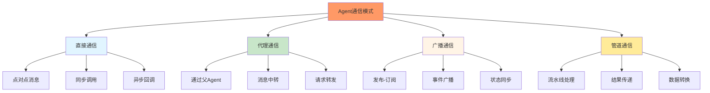
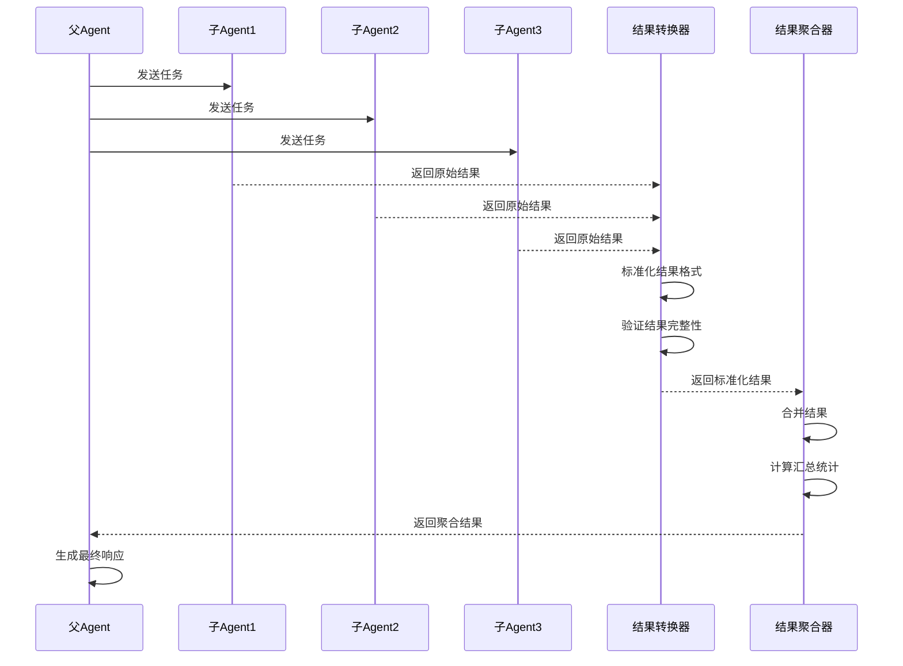
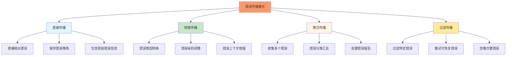
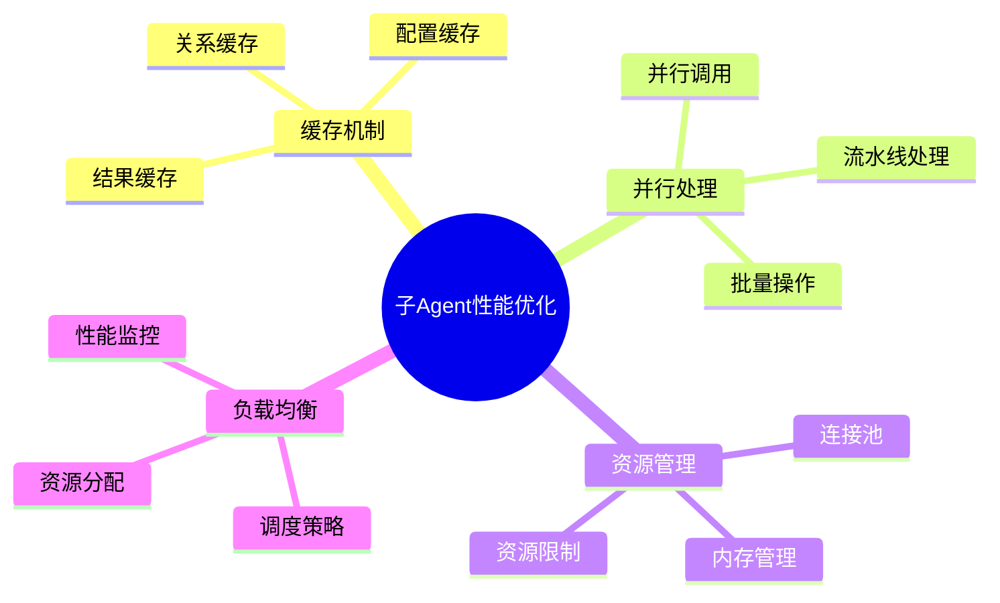

# 第7章：子Agent系统（下）

## 学习目标

通过本章学习，您将：
- 掌握子Agent间的通信机制
- 学习结果传递和转换的方法
- 理解错误传播和处理策略
- 掌握子Agent性能优化技巧
- 学习子Agent调试的最佳实践
- 能够构建高效的子Agent协作链

## 7.1 子Agent通信机制

### Agent通信模式



### 直接通信实现

```typescript
/**
 * Agent直接通信接口
 */
interface DirectMessage {
  from: string;
  to: string;
  type: string;
  payload: any;
  timestamp: number;
  messageId: string;
}

/**
 * Agent直接通信处理器
 */
class AgentDirectCommunication {
  private messageHandlers: Map<string, MessageHandler> = new Map();
  private messageQueue: Map<string, DirectMessage[]> = new Map();
  private messageHistory: DirectMessage[] = [];
  
  /**
   * 注册消息处理器
   */
  public registerHandler(agentName: string, handler: MessageHandler): void {
    this.messageHandlers.set(agentName, handler);
  }
  
  /**
   * 发送直接消息
   */
  public async sendMessage(
    from: string,
    to: string,
    type: string,
    payload: any
  ): Promise<any> {
    // 创建消息
    const message: DirectMessage = {
      from,
      to,
      type,
      payload,
      timestamp: Date.now(),
      messageId: this.generateMessageId(from, to),
    };
    
    // 记录消息历史
    this.messageHistory.push(message);
    
    // 检查目标Agent是否有处理器
    const handler = this.messageHandlers.get(to);
    if (!handler) {
      throw new Error(`No message handler registered for agent '${to}'`);
    }
    
    // 处理消息
    try {
      const response = await handler(message);
      return response;
    } catch (error) {
      console.error(`Message handling error for '${to}':`, error);
      throw error;
    }
  }
  
  /**
   * 批量发送消息
   */
  public async broadcastMessage(
    from: string,
    targets: string[],
    type: string,
    payload: any
  ): Promise<any[]> {
    const promises = targets.map(target =>
      this.sendMessage(from, target, type, payload)
    );
    
    return Promise.all(promises);
  }
  
  /**
   * 获取消息历史
   */
  public getMessageHistory(filter?: {
    from?: string;
    to?: string;
    type?: string;
    startTime?: number;
    endTime?: number;
  }): DirectMessage[] {
    let history = [...this.messageHistory];
    
    if (filter) {
      if (filter.from) {
        history = history.filter(msg => msg.from === filter.from);
      }
      if (filter.to) {
        history = history.filter(msg => msg.to === filter.to);
      }
      if (filter.type) {
        history = history.filter(msg => msg.type === filter.type);
      }
      if (filter.startTime) {
        history = history.filter(msg => msg.timestamp >= filter.startTime!);
      }
      if (filter.endTime) {
        history = history.filter(msg => msg.timestamp <= filter.endTime!);
      }
    }
    
    return history;
  }
  
  /**
   * 生成消息ID
   */
  private generateMessageId(from: string, to: string): string {
    return `${from}->${to}-${Date.now()}-${Math.random().toString(36).slice(2, 11)}`;
  }
}

/**
 * 消息处理器类型
 */
type MessageHandler = (message: DirectMessage) => Promise<any>;
```

### 代理通信实现

```typescript
/**
 * Agent代理通信处理器
 */
class AgentProxyCommunication {
  private relationManager: ParentChildRelationManager;
  private messageRouters: Map<string, MessageRouter> = new Map();
  
  constructor(relationManager: ParentChildRelationManager) {
    this.relationManager = relationManager;
  }
  
  /**
   * 注册消息路由器
   */
  public registerRouter(agentName: string, router: MessageRouter): void {
    this.messageRouters.set(agentName, router);
  }
  
  /**
   * 通过父Agent代理发送消息
   */
  public async sendViaParent(
    from: string,
    to: string,
    type: string,
    payload: any
  ): Promise<any> {
    // 查找公共父Agent
    const commonParent = this.findCommonParent(from, to);
    
    if (!commonParent) {
      throw new Error(`No common parent found between '${from}' and '${to}'`);
    }
    
    // 构建代理路径
    const path = this.buildProxyPath(from, to, commonParent);
    
    // 通过路径发送消息
    return await this.routeViaPath(from, to, type, payload, path);
  }
  
  /**
   * 查找公共父Agent
   */
  private findCommonParent(agent1: string, agent2: string): string | null {
    const ancestors1 = this.relationManager.getAncestors(agent1);
    const ancestors2 = this.relationManager.getAncestors(agent2);
    
    // 查找最近的公共祖先
    for (const ancestor1 of ancestors1) {
      if (ancestors2.includes(ancestor1)) {
        return ancestor1;
      }
    }
    
    return null;
  }
  
  /**
   * 构建代理路径
   */
  private buildProxyPath(
    from: string,
    to: string,
    commonParent: string
  ): string[] {
    const path: string[] = [];
    
    // 从from到commonParent的路径
    let current = from;
    while (current !== commonParent) {
      path.push(current);
      const parent = this.relationManager.getParent(current);
      if (!parent) break;
      current = parent;
    }
    path.push(commonParent);
    
    // 从commonParent到to的路径
    const toPath: string[] = [];
    current = to;
    while (current !== commonParent) {
      toPath.unshift(current);
      const parent = this.relationManager.getParent(current);
      if (!parent) break;
      current = parent;
    }
    
    // 合并路径
    return [...path, ...toPath.slice(1)];
  }
  
  /**
   * 通过路径路由消息
   */
  private async routeViaPath(
    from: string,
    to: string,
    type: string,
    payload: any,
    path: string[]
  ): Promise<any> {
    let currentPayload = payload;
    let currentFrom = from;
    
    // 沿路径传递消息
    for (let i = 0; i < path.length - 1; i++) {
      const currentAgent = path[i];
      const nextAgent = path[i + 1];
      
      const router = this.messageRouters.get(currentAgent);
      if (router) {
        currentPayload = await router({
          from: currentFrom,
          to: nextAgent,
          type,
          payload: currentPayload,
        });
        currentFrom = currentAgent;
      }
    }
    
    return currentPayload;
  }
}

/**
 * 消息路由器类型
 */
type MessageRouter = (message: {
  from: string;
  to: string;
  type: string;
  payload: any;
}) => Promise<any>;
```

### 发布-订阅通信实现

```typescript
/**
 * Agent发布-订阅通信系统
 */
class AgentPubSubCommunication {
  private topics: Map<string, Set<string>> = new Map();
  private subscribers: Map<string, MessageHandler> = new Map();
  private messageQueue: Map<string, PubSubMessage[]> = new Map();
  
  /**
   * 订阅主题
   */
  public subscribe(agentName: string, topic: string, handler: MessageHandler): void {
    // 添加主题订阅
    if (!this.topics.has(topic)) {
      this.topics.set(topic, new Set());
    }
    this.topics.get(topic)!.add(agentName);
    
    // 注册处理器
    this.subscribers.set(`${agentName}:${topic}`, handler);
    
    // 处理队列中的消息
    this.processQueue(agentName, topic);
  }
  
  /**
   * 取消订阅
   */
  public unsubscribe(agentName: string, topic: string): void {
    // 从主题中移除
    const subscribers = this.topics.get(topic);
    if (subscribers) {
      subscribers.delete(agentName);
    }
    
    // 移除处理器
    this.subscribers.delete(`${agentName}:${topic}`);
  }
  
  /**
   * 发布消息
   */
  public async publish(
    publisher: string,
    topic: string,
    message: any
  ): Promise<void> {
    const subscribers = this.topics.get(topic);
    if (!subscribers || subscribers.size === 0) {
      console.log(`No subscribers for topic '${topic}'`);
      return;
    }
    
    // 创建发布消息
    const pubSubMessage: PubSubMessage = {
      publisher,
      topic,
      message,
      timestamp: Date.now(),
    };
    
    // 通知所有订阅者
    const promises = Array.from(subscribers).map(async subscriber => {
      const handler = this.subscribers.get(`${subscriber}:${topic}`);
      if (handler) {
        try {
          await handler({
            from: publisher,
            to: subscriber,
            type: topic,
            payload: pubSubMessage,
            timestamp: pubSubMessage.timestamp,
            messageId: this.generateMessageId(),
          });
        } catch (error) {
          console.error(`Error delivering message to '${subscriber}':`, error);
        }
      }
    });
    
    await Promise.all(promises);
  }
  
  /**
   * 处理队列中的消息
   */
  private async processQueue(agentName: string, topic: string): Promise<void> {
    const queueKey = `${agentName}:${topic}`;
    const queue = this.messageQueue.get(queueKey);
    
    if (!queue || queue.length === 0) {
      return;
    }
    
    const handler = this.subscribers.get(queueKey);
    if (!handler) {
      return;
    }
    
    // 处理队列中的所有消息
    for (const message of queue) {
      try {
        await handler({
          from: message.publisher,
          to: agentName,
          type: topic,
          payload: message,
          timestamp: message.timestamp,
          messageId: this.generateMessageId(),
        });
      } catch (error) {
        console.error(`Error processing queued message:`, error);
      }
    }
    
    // 清空队列
    this.messageQueue.delete(queueKey);
  }
  
  /**
   * 获取主题信息
   */
  public getTopicInfo(topic: string): {
    subscriberCount: number;
    subscribers: string[];
  } {
    const subscribers = this.topics.get(topic);
    return {
      subscriberCount: subscribers?.size || 0,
      subscribers: Array.from(subscribers || []),
    };
  }
  
  /**
   * 获取所有主题
   */
  public getAllTopics(): string[] {
    return Array.from(this.topics.keys());
  }
  
  /**
   * 生成消息ID
   */
  private generateMessageId(): string {
    return `msg-${Date.now()}-${Math.random().toString(36).slice(2, 11)}`;
  }
}

/**
 * 发布-订阅消息接口
 */
interface PubSubMessage {
  publisher: string;
  topic: string;
  message: any;
  timestamp: number;
}
```

## 7.2 结果传递和转换

### 结果传递流程



### 结果转换器

```typescript
/**
 * Agent结果转换器
 */
class AgentResultTransformer {
  private transformers: Map<string, ResultTransformer> = new Map();
  private transformationRules: TransformationRule[] = [];
  
  /**
   * 注册结果转换器
   */
  public registerTransformer(agentName: string, transformer: ResultTransformer): void {
    this.transformers.set(agentName, transformer);
  }
  
  /**
   * 添加转换规则
   */
  public addTransformationRule(rule: TransformationRule): void {
    this.transformationRules.push(rule);
  }
  
  /**
   * 转换结果
   */
  public async transformResult(
    agentName: string,
    result: any,
    context: TransformationContext
  ): Promise<any> {
    // 应用Agent特定的转换器
    const transformer = this.transformers.get(agentName);
    if (transformer) {
      result = await transformer(result, context);
    }
    
    // 应用转换规则
    for (const rule of this.transformationRules) {
      if (this.matchesRule(result, rule)) {
        result = await this.applyRule(result, rule, context);
      }
    }
    
    return result;
  }
  
  /**
   * 批量转换结果
   */
  public async transformResults(
    results: Map<string, any>,
    context: TransformationContext
  ): Promise<Map<string, any>> {
    const transformedResults = new Map<string, any>();
    
    for (const [agentName, result] of results) {
      const transformed = await this.transformResult(agentName, result, context);
      transformedResults.set(agentName, transformed);
    }
    
    return transformedResults;
  }
  
  /**
   * 匹配转换规则
   */
  private matchesRule(result: any, rule: TransformationRule): boolean {
    if (rule.agentFilter && !rule.agentFilter.test(rule.agentName || '')) {
      return false;
    }
    
    if (rule.resultType && typeof result !== rule.resultType) {
      return false;
    }
    
    if (rule.condition && !rule.condition(result)) {
      return false;
    }
    
    return true;
  }
  
  /**
   * 应用转换规则
   */
  private async applyRule(
    result: any,
    rule: TransformationRule,
    context: TransformationContext
  ): Promise<any> {
    return rule.transform(result, context);
  }
}

/**
 * 结果转换器类型
 */
type ResultTransformer = (result: any, context: TransformationContext) => Promise<any>;

/**
 * 转换规则接口
 */
interface TransformationRule {
  agentName?: string;
  agentFilter?: RegExp;
  resultType?: string;
  condition?: (result: any) => boolean;
  transform: (result: any, context: TransformationContext) => Promise<any>;
}

/**
 * 转换上下文接口
 */
interface TransformationContext {
  sourceAgent: string;
  targetAgent?: string;
  timestamp: number;
  metadata?: Record<string, any>;
}
```

### 结果聚合器

```typescript
/**
 * Agent结果聚合器
 */
class AgentResultAggregator {
  private aggregators: Map<string, ResultAggregator> = new Map();
  private aggregationStrategies: Map<string, AggregationStrategy> = new Map();
  
  constructor() {
    // 注册默认聚合策略
    this.registerDefaultStrategies();
  }
  
  /**
   * 注册聚合器
   */
  public registerAggregator(name: string, aggregator: ResultAggregator): void {
    this.aggregators.set(name, aggregator);
  }
  
  /**
   * 注册聚合策略
   */
  public registerStrategy(name: string, strategy: AggregationStrategy): void {
    this.aggregationStrategies.set(name, strategy);
  }
  
  /**
   * 聚合结果
   */
  public async aggregate(
    results: Map<string, any>,
    strategy: string = 'default'
  ): Promise<AggregatedResult> {
    const aggregationStrategy = this.aggregationStrategies.get(strategy);
    if (!aggregationStrategy) {
      throw new Error(`Aggregation strategy '${strategy}' not found`);
    }
    
    // 应用聚合策略
    const aggregated = await aggregationStrategy.aggregate(results);
    
    // 生成统计信息
    const statistics = this.generateStatistics(results);
    
    return {
      results: aggregated,
      statistics,
      timestamp: Date.now(),
      sourceCount: results.size,
    };
  }
  
  /**
   * 合并结果
   */
  public async merge(
    results: Map<string, any>,
    merger: (results: any[]) => any
  ): Promise<any> {
    const resultsArray = Array.from(results.values());
    return await merger(resultsArray);
  }
  
  /**
   * 生成统计信息
   */
  private generateStatistics(results: Map<string, any>): ResultStatistics {
    const resultsArray = Array.from(results.values());
    
    return {
      totalResults: resultsArray.length,
      successCount: resultsArray.filter(r => r.success !== false).length,
      failureCount: resultsArray.filter(r => r.success === false).length,
      averageTime: this.calculateAverageTime(resultsArray),
      agents: Array.from(results.keys()),
    };
  }
  
  /**
   * 计算平均时间
   */
  private calculateAverageTime(results: any[]): number {
    const times = results
      .filter(r => r.processingTime)
      .map(r => r.processingTime);
    
    if (times.length === 0) return 0;
    
    return times.reduce((sum, time) => sum + time, 0) / times.length;
  }
  
  /**
   * 注册默认聚合策略
   */
  private registerDefaultStrategies(): void {
    // 默认聚合策略
    this.registerStrategy('default', {
      aggregate: async (results) => {
        return Array.from(results.entries()).map(([agent, result]) => ({
          agent,
          result,
        }));
      },
    });
    
    // 成功优先聚合策略
    this.registerStrategy('success-first', {
      aggregate: async (results) => {
        const entries = Array.from(results.entries());
        const successful = entries.filter(([_, r]) => r.success !== false);
        const failed = entries.filter(([_, r]) => r.success === false);
        
        return {
          successful: Object.fromEntries(successful),
          failed: Object.fromEntries(failed),
        };
      },
    });
    
    // 时间优先聚合策略
    this.registerStrategy('fastest-first', {
      aggregate: async (results) => {
        const entries = Array.from(results.entries());
        entries.sort((a, b) => {
          const timeA = a[1].processingTime || 0;
          const timeB = b[1].processingTime || 0;
          return timeA - timeB;
        });
        
        return entries.map(([agent, result]) => ({
          agent,
          result,
          processingTime: result.processingTime,
        }));
      },
    });
  }
}

/**
 * 结果聚合器类型
 */
type ResultAggregator = (results: any[]) => Promise<any>;

/**
 * 聚合策略接口
 */
interface AggregationStrategy {
  aggregate: (results: Map<string, any>) => Promise<any>;
}

/**
 * 聚合结果接口
 */
interface AggregatedResult {
  results: any;
  statistics: ResultStatistics;
  timestamp: number;
  sourceCount: number;
}

/**
 * 结果统计接口
 */
interface ResultStatistics {
  totalResults: number;
  successCount: number;
  failureCount: number;
  averageTime: number;
  agents: string[];
}
```

## 7.3 错误传播和处理

### 错误传播模式



### 错误传播处理器

```typescript
/**
 * Agent错误传播处理器
 */
class AgentErrorPropagation {
  private errorHandlers: Map<string, ErrorHandler> = new Map();
  private propagationRules: PropagationRule[] = [];
  
  /**
   * 注册错误处理器
   */
  public registerErrorHandler(agentName: string, handler: ErrorHandler): void {
    this.errorHandlers.set(agentName, handler);
  }
  
  /**
   * 添加传播规则
   */
  public addPropagationRule(rule: PropagationRule): void {
    this.propagationRules.push(rule);
  }
  
  /**
   * 传播错误
   */
  public async propagateError(
    sourceAgent: string,
    error: Error,
    context: ErrorContext
  ): Promise<PropagatedError> {
    // 应用传播规则
    let propagatedError = this.createPropagatedError(sourceAgent, error, context);
    
    for (const rule of this.propagationRules) {
      if (this.matchesRule(propagatedError, rule)) {
        propagatedError = await this.applyRule(propagatedError, rule, context);
      }
    }
    
    return propagatedError;
  }
  
  /**
   * 处理错误
   */
  public async handleError(
    agentName: string,
    error: Error,
    context: ErrorContext
  ): Promise<ErrorHandlingResult> {
    const handler = this.errorHandlers.get(agentName);
    
    if (handler) {
      try {
        return await handler(error, context);
      } catch (handlingError) {
        console.error(`Error handler failed for '${agentName}':`, handlingError);
        return {
          handled: false,
          action: 'propagate',
          error: handlingError,
        };
      }
    }
    
    // 默认处理：传播错误
    return {
      handled: false,
      action: 'propagate',
      error,
    };
  }
  
  /**
   * 匹配传播规则
   */
  private matchesRule(error: PropagatedError, rule: PropagationRule): boolean {
    if (rule.agentFilter && !rule.agentFilter.test(error.sourceAgent)) {
      return false;
    }
    
    if (rule.errorTypeFilter && !(error.originalError instanceof rule.errorTypeFilter)) {
      return false;
    }
    
    if (rule.severityFilter && error.severity !== rule.severityFilter) {
      return false;
    }
    
    return true;
  }
  
  /**
   * 应用传播规则
   */
  private async applyRule(
    error: PropagatedError,
    rule: PropagationRule,
    context: ErrorContext
  ): Promise<PropagatedError> {
    const modifiedError = await rule.transform(error, context);
    
    return {
      ...modifiedError,
      propagationPath: [...error.propagationPath, rule.agentName || 'system'],
    };
  }
  
  /**
   * 创建传播错误
   */
  private createPropagatedError(
    sourceAgent: string,
    originalError: Error,
    context: ErrorContext
  ): PropagatedError {
    return {
      sourceAgent,
      originalError,
      severity: this.classifySeverity(originalError),
      timestamp: Date.now(),
      context,
      propagationPath: [sourceAgent],
      message: `Error in ${sourceAgent}: ${originalError.message}`,
    };
  }
  
  /**
   * 分类错误严重程度
   */
  private classifySeverity(error: Error): 'low' | 'medium' | 'high' | 'critical' {
    // 根据错误类型或消息内容分类
    const errorMessage = error.message.toLowerCase();
    
    if (errorMessage.includes('critical') || errorMessage.includes('fatal')) {
      return 'critical';
    }
    
    if (errorMessage.includes('high') || errorMessage.includes('important')) {
      return 'high';
    }
    
    if (errorMessage.includes('low') || errorMessage.includes('minor')) {
      return 'low';
    }
    
    return 'medium';
  }
}

/**
 * 错误处理器类型
 */
type ErrorHandler = (
  error: Error,
  context: ErrorContext
) => Promise<ErrorHandlingResult>;

/**
 * 传播规则接口
 */
interface PropagationRule {
  agentName?: string;
  agentFilter?: RegExp;
  errorTypeFilter?: new (...args: any[]) => Error;
  severityFilter?: 'low' | 'medium' | 'high' | 'critical';
  transform: (error: PropagatedError, context: ErrorContext) => Promise<PropagatedError>;
}

/**
 * 传播错误接口
 */
interface PropagatedError {
  sourceAgent: string;
  originalError: Error;
  severity: 'low' | 'medium' | 'high' | 'critical';
  timestamp: number;
  context: ErrorContext;
  propagationPath: string[];
  message: string;
}

/**
 * 错误上下文接口
 */
interface ErrorContext {
  operation?: string;
  request?: any;
  stackTrace?: string;
  metadata?: Record<string, any>;
}

/**
 * 错误处理结果接口
 */
interface ErrorHandlingResult {
  handled: boolean;
  action: 'retry' | 'recover' | 'propagate' | 'ignore';
  error?: Error;
  recovery?: any;
}
```

### 错误恢复策略

```typescript
/**
 * Agent错误恢复管理器
 */
class AgentErrorRecoveryManager {
  private recoveryStrategies: Map<string, RecoveryStrategy> = new Map();
  private errorHistory: Map<string, PropagatedError[]> = new Map();
  
  /**
   * 注册恢复策略
   */
  public registerRecoveryStrategy(
    errorType: string,
    strategy: RecoveryStrategy
  ): void {
    this.recoveryStrategies.set(errorType, strategy);
  }
  
  /**
   * 尝试恢复
   */
  public async attemptRecovery(
    error: PropagatedError,
    context: RecoveryContext
  ): Promise<RecoveryResult> {
    // 记录错误历史
    this.recordError(error);
    
    // 检查是否超过重试限制
    if (this.exceedsRetryLimit(error.sourceAgent)) {
      return {
        success: false,
        action: 'abort',
        reason: 'Exceeded retry limit',
      };
    }
    
    // 查找合适的恢复策略
    const strategy = this.findRecoveryStrategy(error);
    
    if (!strategy) {
      return {
        success: false,
        action: 'propagate',
        reason: 'No recovery strategy found',
      };
    }
    
    // 尝试恢复
    try {
      const recovery = await strategy.recover(error, context);
      
      return {
        success: true,
        action: 'recovered',
        recovery,
      };
    } catch (recoveryError) {
      return {
        success: false,
        action: 'retry',
        reason: `Recovery failed: ${recoveryError}`,
      };
    }
  }
  
  /**
   * 记录错误
   */
  private recordError(error: PropagatedError): void {
    if (!this.errorHistory.has(error.sourceAgent)) {
      this.errorHistory.set(error.sourceAgent, []);
    }
    
    const history = this.errorHistory.get(error.sourceAgent)!;
    history.push(error);
    
    // 保持历史记录在合理范围内
    if (history.length > 100) {
      history.splice(0, 50);
    }
  }
  
  /**
   * 检查是否超过重试限制
   */
  private exceedsRetryLimit(agentName: string): boolean {
    const history = this.errorHistory.get(agentName);
    if (!history) return false;
    
    // 检查最近5分钟内的错误次数
    const recentErrors = history.filter(
      e => Date.now() - e.timestamp < 5 * 60 * 1000
    );
    
    return recentErrors.length > 10;
  }
  
  /**
   * 查找恢复策略
   */
  private findRecoveryStrategy(error: PropagatedError): RecoveryStrategy | undefined {
    // 按严重程度查找策略
    const strategies = [
      this.recoveryStrategies.get(`${error.sourceAgent}:${error.severity}`),
      this.recoveryStrategies.get(error.severity),
      this.recoveryStrategies.get('default'),
    ];
    
    return strategies.find(s => s !== undefined);
  }
  
  /**
   * 获取错误统计
   */
  public getErrorStatistics(agentName: string): {
    totalErrors: number;
    errorsBySeverity: Record<string, number>;
    recentErrors: number;
  } {
    const history = this.errorHistory.get(agentName) || [];
    
    const errorsBySeverity: Record<string, number> = {};
    for (const error of history) {
      errorsBySeverity[error.severity] = (errorsBySeverity[error.severity] || 0) + 1;
    }
    
    const recentErrors = history.filter(
      e => Date.now() - e.timestamp < 60 * 1000
    ).length;
    
    return {
      totalErrors: history.length,
      errorsBySeverity,
      recentErrors,
    };
  }
}

/**
 * 恢复策略接口
 */
interface RecoveryStrategy {
  recover: (
    error: PropagatedError,
    context: RecoveryContext
  ) => Promise<any>;
}

/**
 * 恢复上下文接口
 */
interface RecoveryContext {
  operation?: string;
  retryCount?: number;
  metadata?: Record<string, any>;
}

/**
 * 恢复结果接口
 */
interface RecoveryResult {
  success: boolean;
  action: 'recovered' | 'retry' | 'propagate' | 'abort';
  reason?: string;
  recovery?: any;
}
```

## 7.4 子Agent性能优化

### 性能优化策略



### 缓存管理器

```typescript
/**
 * 子Agent缓存管理器
 */
class SubAgentCacheManager {
  private resultCache: Map<string, CachedResult> = new Map();
  private configCache: Map<string, AgentConfig> = new Map();
  private cacheStats: CacheStatistics = {
    hits: 0,
    misses: 0,
    evictions: 0,
  };
  
  /**
   * 缓存结果
   */
  public cacheResult(
    agentName: string,
    request: any,
    result: any,
    ttl: number = 60000
  ): void {
    const cacheKey = this.generateCacheKey(agentName, request);
    
    this.resultCache.set(cacheKey, {
      agentName,
      request,
      result,
      cachedAt: Date.now(),
      ttl,
      expiresAt: Date.now() + ttl,
    });
    
    // 检查缓存大小限制
    this.checkCacheSize();
  }
  
  /**
   * 获取缓存结果
   */
  public getCachedResult(agentName: string, request: any): any | null {
    const cacheKey = this.generateCacheKey(agentName, request);
    const cached = this.resultCache.get(cacheKey);
    
    if (!cached) {
      this.cacheStats.misses++;
      return null;
    }
    
    // 检查是否过期
    if (Date.now() > cached.expiresAt) {
      this.resultCache.delete(cacheKey);
      this.cacheStats.misses++;
      this.cacheStats.evictions++;
      return null;
    }
    
    this.cacheStats.hits++;
    return cached.result;
  }
  
  /**
   * 缓存配置
   */
  public cacheConfig(agentName: string, config: AgentConfig): void {
    this.configCache.set(agentName, config);
  }
  
  /**
   * 获取缓存配置
   */
  public getCachedConfig(agentName: string): AgentConfig | null {
    return this.configCache.get(agentName) || null;
  }
  
  /**
   * 清除缓存
   */
  public clearCache(pattern?: string): void {
    if (!pattern) {
      this.resultCache.clear();
      this.configCache.clear();
      return;
    }
    
    // 清除匹配模式的缓存
    const regex = new RegExp(pattern);
    
    for (const key of this.resultCache.keys()) {
      if (regex.test(key)) {
        this.resultCache.delete(key);
      }
    }
    
    for (const key of this.configCache.keys()) {
      if (regex.test(key)) {
        this.configCache.delete(key);
      }
    }
  }
  
  /**
   * 检查缓存大小
   */
  private checkCacheSize(): void {
    const maxSize = 1000; // 最大缓存条目数
    
    if (this.resultCache.size > maxSize) {
      // 删除最旧的条目
      const entries = Array.from(this.resultCache.entries());
      entries.sort((a, b) => a[1].cachedAt - b[1].cachedAt);
      
      const toDelete = entries.slice(0, entries.length - maxSize);
      for (const [key] of toDelete) {
        this.resultCache.delete(key);
        this.cacheStats.evictions++;
      }
    }
  }
  
  /**
   * 生成缓存键
   */
  private generateCacheKey(agentName: string, request: any): string {
    const requestHash = this.hashRequest(request);
    return `${agentName}:${requestHash}`;
  }
  
  /**
   * 哈希请求
   */
  private hashRequest(request: any): string {
    const str = JSON.stringify(request);
    let hash = 0;
    
    for (let i = 0; i < str.length; i++) {
      const char = str.charCodeAt(i);
      hash = ((hash << 5) - hash) + char;
      hash = hash & hash; // 转换为32位整数
    }
    
    return Math.abs(hash).toString(36);
  }
  
  /**
   * 获取缓存统计
   */
  public getCacheStatistics(): CacheStatistics {
    const hitRate = this.cacheStats.hits / (this.cacheStats.hits + this.cacheStats.misses);
    
    return {
      ...this.cacheStats,
      hitRate,
      size: this.resultCache.size,
      configSize: this.configCache.size,
    };
  }
}

/**
 * 缓存结果接口
 */
interface CachedResult {
  agentName: string;
  request: any;
  result: any;
  cachedAt: number;
  ttl: number;
  expiresAt: number;
}

/**
 * 缓存统计接口
 */
interface CacheStatistics {
  hits: number;
  misses: number;
  evictions: number;
  hitRate?: number;
  size?: number;
  configSize?: number;
}
```

### 并行执行管理器

```typescript
/**
 * 子Agent并行执行管理器
 */
class SubAgentParallelExecutor {
  private executionPool: Map<string, ExecutionQueue> = new Map();
  private maxConcurrent: number = 10;
  
  /**
   * 并行执行多个Agent
   */
  public async executeParallel(
    tasks: AgentTask[]
  ): Promise<Map<string, any>> {
    const results = new Map<string, any>();
    const errors = new Map<string, Error>();
    
    // 创建执行队列
    const queue = this.createExecutionQueue(tasks);
    
    // 执行任务
    await this.processQueue(queue, results, errors);
    
    // 处理错误
    if (errors.size > 0) {
      console.warn('Some tasks failed:', errors);
    }
    
    return results;
  }
  
  /**
   * 流水线执行
   */
  public async executePipeline(
    stages: PipelineStage[]
  ): Promise<any> {
    let currentResult: any = null;
    
    for (const stage of stages) {
      const stageResults = await this.executeStage(stage, currentResult);
      
      // 合并阶段结果
      currentResult = this.mergeStageResults(stageResults);
    }
    
    return currentResult;
  }
  
  /**
   * 执行阶段
   */
  private async executeStage(
    stage: PipelineStage,
    previousResult: any
  ): Promise<any[]> {
    const tasks = stage.agents.map(agent => ({
      agent,
      input: previousResult,
      config: stage.config,
    }));
    
    const results = await this.executeParallel(tasks);
    return Array.from(results.values());
  }
  
  /**
   * 合并阶段结果
   */
  private mergeStageResults(results: any[]): any {
    // 简化实现：返回结果数组
    return results;
  }
  
  /**
   * 创建执行队列
   */
  private createExecutionQueue(tasks: AgentTask[]): ExecutionQueue {
    return {
      tasks: tasks.map(task => ({
        ...task,
        status: 'pending',
        createdAt: Date.now(),
      })),
      status: 'ready',
    };
  }
  
  /**
   * 处理队列
   */
  private async processQueue(
    queue: ExecutionQueue,
    results: Map<string, any>,
    errors: Map<string, Error>
  ): Promise<void> {
    queue.status = 'running';
    
    // 创建执行槽位
    const slots = Math.min(this.maxConcurrent, queue.tasks.length);
    const executing = new Set<string>();
    
    // 处理所有任务
    while (queue.tasks.some(task => task.status === 'pending')) {
      // 填充空闲槽位
      while (executing.size < slots) {
        const pendingTask = queue.tasks.find(t => t.status === 'pending');
        if (!pendingTask) break;
        
        pendingTask.status = 'running';
        executing.add(pendingTask.agent);
        
        // 执行任务
        this.executeTask(pendingTask)
          .then(result => {
            results.set(pendingTask.agent, result);
            pendingTask.status = 'completed';
          })
          .catch(error => {
            errors.set(pendingTask.agent, error);
            pendingTask.status = 'failed';
          })
          .finally(() => {
            executing.delete(pendingTask.agent);
          });
      }
      
      // 等待至少一个任务完成
      if (executing.size > 0) {
        await this.waitForCompletion(executing);
      }
    }
    
    queue.status = 'completed';
  }
  
  /**
   * 执行任务
   */
  private async executeTask(task: AgentTaskWithStatus): Promise<any> {
    // 这里应该调用实际的Agent执行逻辑
    // 简化实现：返回模拟结果
    await this.simulateExecution(task.config?.duration || 100);
    
    return {
      agent: task.agent,
      result: `Result from ${task.agent}`,
      timestamp: Date.now(),
    };
  }
  
  /**
   * 等待完成
   */
  private async waitForCompletion(executing: Set<string>): Promise<void> {
    return new Promise(resolve => {
      const checkInterval = setInterval(() => {
        if (executing.size === 0) {
          clearInterval(checkInterval);
          resolve();
        }
      }, 100);
    });
  }
  
  /**
   * 模拟执行
   */
  private async simulateExecution(duration: number): Promise<void> {
    return new Promise(resolve => setTimeout(resolve, duration));
  }
  
  /**
   * 设置最大并发数
   */
  public setMaxConcurrent(max: number): void {
    this.maxConcurrent = max;
  }
}

/**
 * Agent任务接口
 */
interface AgentTask {
  agent: string;
  input?: any;
  config?: {
    duration?: number;
    priority?: number;
    [key: string]: any;
  };
}

/**
 * Agent任务状态接口
 */
interface AgentTaskWithStatus extends AgentTask {
  status: 'pending' | 'running' | 'completed' | 'failed';
  createdAt: number;
}

/**
 * 执行队列接口
 */
interface ExecutionQueue {
  tasks: AgentTaskWithStatus[];
  status: 'ready' | 'running' | 'completed';
}

/**
 * 流水线阶段接口
 */
interface PipelineStage {
  name: string;
  agents: string[];
  config?: {
    duration?: number;
    priority?: number;
    [key: string]: any;
  };
}
```

## 7.5 子Agent调试技巧

### 调试工具集

```typescript
/**
 * 子Agent调试管理器
 */
class SubAgentDebugManager {
  private debugSessions: Map<string, DebugSession> = new Map();
  private breakpoints: Map<string, Breakpoint[]> = new Map();
  private debugLog: DebugEntry[] = [];
  
  /**
   * 创建调试会话
   */
  public createDebugSession(agentName: string): DebugSession {
    const session: DebugSession = {
      sessionId: this.generateSessionId(),
      agentName,
      startTime: Date.now(),
      status: 'active',
      callStack: [],
      variables: new Map(),
      breakpoints: [],
    };
    
    this.debugSessions.set(session.sessionId, session);
    return session;
  }
  
  /**
   * 记录调试信息
   */
  public logDebug(
    sessionId: string,
    level: 'info' | 'warn' | 'error' | 'debug',
    message: string,
    data?: any
  ): void {
    const session = this.debugSessions.get(sessionId);
    if (!session) return;
    
    const entry: DebugEntry = {
      sessionId,
      timestamp: Date.now(),
      level,
      message,
      data,
    };
    
    this.debugLog.push(entry);
    session.callStack.push(entry);
  }
  
  /**
   * 设置断点
   */
  public setBreakpoint(
    agentName: string,
    location: string,
    condition?: string
  ): void {
    const breakpoint: Breakpoint = {
      id: this.generateBreakpointId(),
      agentName,
      location,
      condition,
      enabled: true,
      hitCount: 0,
    };
    
    if (!this.breakpoints.has(agentName)) {
      this.breakpoints.set(agentName, []);
    }
    
    this.breakpoints.get(agentName)!.push(breakpoint);
  }
  
  /**
   * 检查断点
   */
  public checkBreakpoints(
    agentName: string,
    location: string,
    context?: any
  ): Breakpoint | null {
    const agentBreakpoints = this.breakpoints.get(agentName);
    if (!agentBreakpoints) return null;
    
    for (const breakpoint of agentBreakpoints) {
      if (!breakpoint.enabled) continue;
      if (breakpoint.location !== location) continue;
      
      // 检查条件
      if (breakpoint.condition) {
        try {
          const conditionMet = this.evaluateCondition(breakpoint.condition, context);
          if (!conditionMet) continue;
        } catch (error) {
          console.error('Breakpoint condition evaluation error:', error);
          continue;
        }
      }
      
      breakpoint.hitCount++;
      return breakpoint;
    }
    
    return null;
  }
  
  /**
   * 获取调试信息
   */
  public getDebugInfo(sessionId: string): {
    session: DebugSession | undefined;
    log: DebugEntry[];
  } {
    return {
      session: this.debugSessions.get(sessionId),
      log: this.debugLog.filter(entry => entry.sessionId === sessionId),
    };
  }
  
  /**
   * 生成调用图
   */
  public generateCallGraph(sessionId: string): CallGraphNode {
    const session = this.debugSessions.get(sessionId);
    if (!session) {
      throw new Error(`Session '${sessionId}' not found`);
    }
    
    const rootNode: CallGraphNode = {
      agent: session.agentName,
      calls: [],
      metrics: {
        totalCalls: session.callStack.length,
        errors: session.callStack.filter(e => e.level === 'error').length,
      },
    };
    
    // 简化实现：直接从调用栈构建
    for (const entry of session.callStack) {
      if (entry.data?.fromAgent && entry.data?.toAgent) {
        rootNode.calls.push({
          from: entry.data.fromAgent,
          to: entry.data.toAgent,
          timestamp: entry.timestamp,
        });
      }
    }
    
    return rootNode;
  }
  
  /**
   * 性能分析
   */
  public analyzePerformance(sessionId: string): PerformanceReport {
    const session = this.debugSessions.get(sessionId);
    if (!session) {
      throw new Error(`Session '${sessionId}' not found`);
    }
    
    const callTimes = session.callStack.map(entry => ({
      timestamp: entry.timestamp,
      duration: entry.data?.duration || 0,
    }));
    
    const totalTime = callTimes.reduce((sum, call) => sum + call.duration, 0);
    const averageTime = callTimes.length > 0 ? totalTime / callTimes.length : 0;
    const maxTime = Math.max(...callTimes.map(c => c.duration));
    
    return {
      totalCalls: callTimes.length,
      totalTime,
      averageTime,
      maxTime,
      slowestCalls: callTimes
        .sort((a, b) => b.duration - a.duration)
        .slice(0, 5),
    };
  }
  
  /**
   * 评估条件
   */
  private evaluateCondition(condition: string, context?: any): boolean {
    // 简化实现：使用Function构造器评估条件
    try {
      const func = new Function('context', `return ${condition}`);
      return func(context);
    } catch (error) {
      console.error('Condition evaluation error:', error);
      return false;
    }
  }
  
  /**
   * 生成会话ID
   */
  private generateSessionId(): string {
    return `session-${Date.now()}-${Math.random().toString(36).substr(2, 9)}`;
  }
  
  /**
   * 生成断点ID
   */
  private generateBreakpointId(): string {
    return `bp-${Date.now()}-${Math.random().toString(36).slice(2, 11)}`;
  }
}

/**
 * 调试会话接口
 */
interface DebugSession {
  sessionId: string;
  agentName: string;
  startTime: number;
  status: 'active' | 'paused' | 'completed';
  callStack: DebugEntry[];
  variables: Map<string, any>;
  breakpoints: Breakpoint[];
}

/**
 * 调试日志条目接口
 */
interface DebugEntry {
  sessionId: string;
  timestamp: number;
  level: 'info' | 'warn' | 'error' | 'debug';
  message: string;
  data?: any;
}

/**
 * 断点接口
 */
interface Breakpoint {
  id: string;
  agentName: string;
  location: string;
  condition?: string;
  enabled: boolean;
  hitCount: number;
}

/**
 * 调用图节点接口
 */
interface CallGraphNode {
  agent: string;
  calls: Array<{
    from: string;
    to: string;
    timestamp: number;
  }>;
  metrics: {
    totalCalls: number;
    errors: number;
  };
}

/**
 * 性能报告接口
 */
interface PerformanceReport {
  totalCalls: number;
  totalTime: number;
  averageTime: number;
  maxTime: number;
  slowestCalls: Array<{
    timestamp: number;
    duration: number;
  }>;
}
```

## 7.6 实践：构建子Agent协作链

### 完整的协作链系统

```typescript
/**
 * 子Agent协作链系统
 */
class SubAgentCollaborationChain {
  private communication: AgentDirectCommunication;
  private pubSub: AgentPubSubCommunication;
  private transformer: AgentResultTransformer;
  private aggregator: AgentResultAggregator;
  private executor: SubAgentParallelExecutor;
  private debugManager: SubAgentDebugManager;
  
  constructor() {
    this.communication = new AgentDirectCommunication();
    this.pubSub = new AgentPubSubCommunication();
    this.transformer = new AgentResultTransformer();
    this.aggregator = new AgentResultAggregator();
    this.executor = new SubAgentParallelExecutor();
    this.debugManager = new SubAgentDebugManager();
  }
  
  /**
   * 创建审查协作链
   */
  public async createReviewChain(): Promise<void> {
    console.log('创建代码审查协作链...');
    
    // 1. 设置通信处理器
    this.setupCommunicationHandlers();
    
    // 2. 配置转换和聚合
    this.setupTransformationAndAggregation();
    
    // 3. 创建并行执行配置
    this.setupParallelExecution();
    
    console.log('✓ 代码审查协作链创建完成');
  }
  
  /**
   * 设置通信处理器
   */
  private setupCommunicationHandlers(): void {
    // 语法审查Agent处理器
    this.communication.registerHandler('syntax-reviewer', async (message) => {
      console.log(`[Syntax Reviewer] Processing message from ${message.from}`);
      
      return {
        agent: 'syntax-reviewer',
        result: {
          syntaxIssues: ['Use const instead of var', 'Missing semicolon'],
          suggestions: ['Consider using modern ES6+ syntax'],
        },
        timestamp: Date.now(),
      };
    });
    
    // 安全审查Agent处理器
    this.communication.registerHandler('security-reviewer', async (message) => {
      console.log(`[Security Reviewer] Processing message from ${message.from}`);
      
      return {
        agent: 'security-reviewer',
        result: {
          securityIssues: ['Potential SQL injection', 'Hardcoded credentials'],
          severity: 'high',
          recommendations: ['Use parameterized queries', 'Move secrets to environment variables'],
        },
        timestamp: Date.now(),
      };
    });
    
    // 性能审查Agent处理器
    this.communication.registerHandler('performance-reviewer', async (message) => {
      console.log(`[Performance Reviewer] Processing message from ${message.from}`);
      
      return {
        agent: 'performance-reviewer',
        result: {
          performanceIssues: ['Inefficient loop', 'Missing caching'],
          optimizationSuggestions: ['Use array methods', 'Implement result caching'],
          estimatedImpact: '30-40% improvement',
        },
        timestamp: Date.now(),
      };
    });
  }
  
  /**
   * 设置转换和聚合
   */
  private setupTransformationAndAggregation(): void {
    // 添加转换规则
    this.transformer.addTransformationRule({
      agentFilter: /reviewer$/,
      resultType: 'object',
      condition: (result) => result.result !== undefined,
      transform: async (result) => {
        return {
          ...result,
          normalized: true,
          processedAt: Date.now(),
        };
      },
    });
    
    // 自定义聚合策略
    this.aggregator.registerStrategy('review-aggregation', {
      aggregate: async (results) => {
        const aggregated = {
          syntax: [],
          security: [],
          performance: [],
          summary: {
            totalIssues: 0,
            criticalIssues: 0,
            suggestions: [],
          },
        };
        
        for (const [agent, result] of results) {
          if (agent.includes('syntax')) {
            aggregated.syntax.push(result);
          } else if (agent.includes('security')) {
            aggregated.security.push(result);
          } else if (agent.includes('performance')) {
            aggregated.performance.push(result);
          }
          
          aggregated.summary.totalIssues++;
          if (result.severity === 'high') {
            aggregated.summary.criticalIssues++;
          }
          
          if (result.suggestions) {
            aggregated.summary.suggestions.push(...result.suggestions);
          }
        }
        
        return aggregated;
      },
    });
  }
  
  /**
   * 设置并行执行
   */
  private setupParallelExecution(): void {
    this.executor.setMaxConcurrent(5);
  }
  
  /**
   * 执行协作审查
   */
  public async executeCollaborativeReview(
    code: string,
    options: {
      enableDebug?: boolean;
      parallelExecution?: boolean;
    } = {}
  ): Promise<any> {
    const { enableDebug = false, parallelExecution = true } = options;
    
    console.log('开始协作代码审查...');
    
    // 创建调试会话
    let debugSession;
    if (enableDebug) {
      debugSession = this.debugManager.createDebugSession('collaborative-review');
      this.debugManager.logDebug(debugSession.sessionId, 'info', 'Starting collaborative review');
    }
    
    try {
      const startTime = Date.now();
      
      // 准备审查任务
      const tasks = [
        {
          agent: 'syntax-reviewer',
          input: { code },
          config: { duration: 100 },
        },
        {
          agent: 'security-reviewer',
          input: { code },
          config: { duration: 150 },
        },
        {
          agent: 'performance-reviewer',
          input: { code },
          config: { duration: 120 },
        },
      ];
      
      let results;
      
      if (parallelExecution) {
        // 并行执行
        results = await this.executor.executeParallel(tasks);
        
        if (enableDebug && debugSession) {
          this.debugManager.logDebug(debugSession.sessionId, 'info', 'Parallel execution completed');
        }
      } else {
        // 顺序执行
        results = new Map();
        for (const task of tasks) {
          const result = await this.communication.sendMessage(
            'coordinator',
            task.agent,
            'review',
            task.input
          );
          results.set(task.agent, result);
        }
      }
      
      // 转换结果
      const transformedResults = await this.transformer.transformResults(
        results,
        { sourceAgent: 'collaborative-review', timestamp: Date.now() }
      );
      
      // 聚合结果
      const aggregated = await this.aggregator.aggregate(transformedResults, 'review-aggregation');
      
      const endTime = Date.now();
      const duration = endTime - startTime;
      
      // 调试信息
      if (enableDebug && debugSession) {
        this.debugManager.logDebug(debugSession.sessionId, 'info', `Review completed in ${duration}ms`);
        
        const perfReport = this.debugManager.analyzePerformance(debugSession.sessionId);
        console.log('Performance Report:', perfReport);
      }
      
      return {
        success: true,
        aggregated,
        duration,
        timestamp: endTime,
      };
      
    } catch (error) {
      if (enableDebug && debugSession) {
        this.debugManager.logDebug(debugSession.sessionId, 'error', `Review failed: ${error}`);
      }
      throw error;
    }
  }
  
  /**
   * 获取协作统计
   */
  public getCollaborationStatistics(): {
    communication: any;
    cache: any;
    performance: any;
  } {
    return {
      communication: {
        totalMessages: this.communication['messageHistory']?.length || 0,
      },
      cache: {}, // 缓存统计
      performance: {}, // 性能统计
    };
  }
}

// 使用示例
async function demonstrateCollaborationChain() {
  const collaborationChain = new SubAgentCollaborationChain();
  
  // 创建协作链
  await collaborationChain.createReviewChain();
  
  // 执行协作审查
  const sampleCode = `
function example() {
  var x = "test";
  return x;
}
  `;
  
  const result = await collaborationChain.executeCollaborativeReview(sampleCode, {
    enableDebug: true,
    parallelExecution: true,
  });
  
  console.log('Collaborative Review Result:', result);
}
```

## 7.7 实践练习

### 练习1：实现Agent通信协议

创建一个完整的Agent通信协议：
1. 定义消息格式
2. 实现消息路由
3. 处理通信错误
4. 提供通信监控

```typescript
// 练习1模板
export class AgentCommunicationProtocol {
  // 实现以下功能：
  // - defineMessageFormat(format)
  // - routeMessage(message)
  // - handleCommunicationError(error)
  // - monitorCommunication()
}
```

### 练习2：构建结果处理流水线

实现一个完整的结果处理系统：
1. 结果收集和验证
2. 转换和标准化
3. 聚合和汇总
4. 性能优化

```typescript
// 练习2模板
export class ResultProcessingPipeline {
  // 实现以下功能：
  // - collectResults(agentResults)
  // - validateResults(results)
  // - transformResults(results)
  // - aggregateResults(results)
  // - optimizePerformance()
}
```

### 练习3：创建调试和监控系统

实现一个完整的调试监控系统：
1. 实时监控Agent状态
2. 性能指标收集
3. 错误跟踪和分析
4. 可视化界面

```typescript
// 练习3模板
export class AgentMonitoringSystem {
  // 实现以下功能：
  // - monitorAgent(agentName)
  // - collectMetrics(agent)
  // - trackErrors(error)
  // - visualizeData()
}
```

## 7.8 本章小结

### 核心概念掌握

✅ **子Agent通信机制**：
- 直接通信：点对点消息传递
- 代理通信：通过父Agent中转
- 发布-订阅：基于主题的广播
- 管道通信：流水线式处理

✅ **结果传递和转换**：
- 标准化结果格式
- 灵活的转换规则
- 智能结果聚合
- 完整性验证

✅ **错误传播和处理**：
- 多种传播模式
- 智能错误分类
- 自动恢复机制
- 详细的错误追踪

✅ **性能优化策略**：
- 多层缓存机制
- 并行执行优化
- 资源管理策略
- 负载均衡调度

✅ **调试技术**：
- 完整的调试会话
- 断点和条件断点
- 性能分析工具
- 调用图生成

### 下一步学习

在第8章中，我们将学习：
- 同步vs异步Agent的区别
- 后台Agent执行模型
- 异步任务队列管理
- 进度跟踪和状态同步
- 异步Agent错误处理

### 技术要点检查表

- [ ] 掌握子Agent间的通信机制
- [ ] 理解结果传递和转换方法
- [ ] 掌握错误传播和处理策略
- [ ] 理解性能优化的重要性
- [ ] 掌握调试技术和工具
- [ ] 能够构建高效的协作链
- [ ] 理解子Agent系统的完整架构

---

**下一步**：继续学习第8章 - 异步Agent系统并掌握后台执行和异步编程技术！