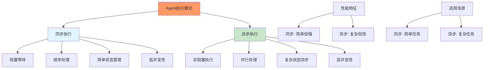
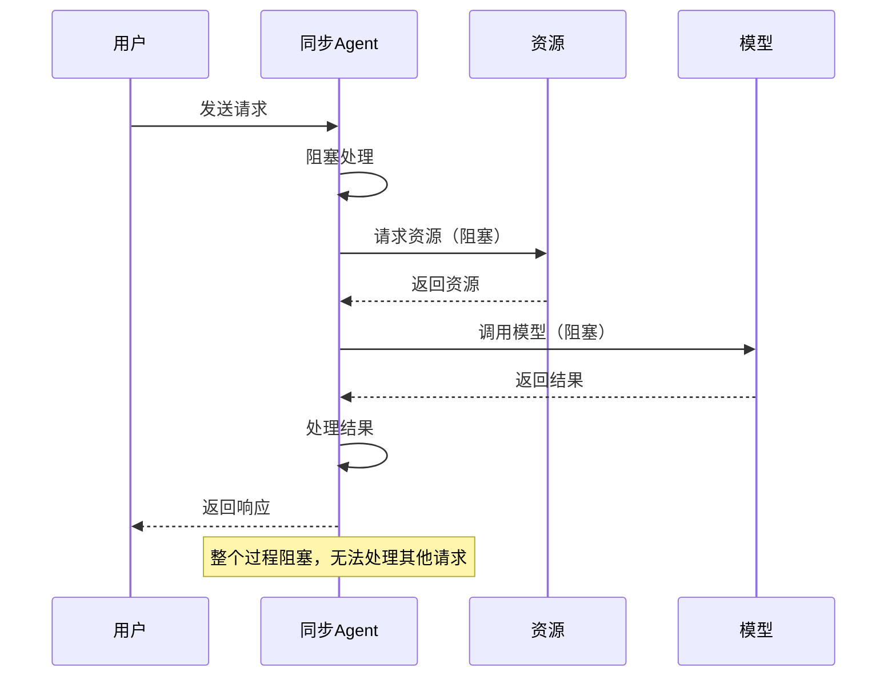
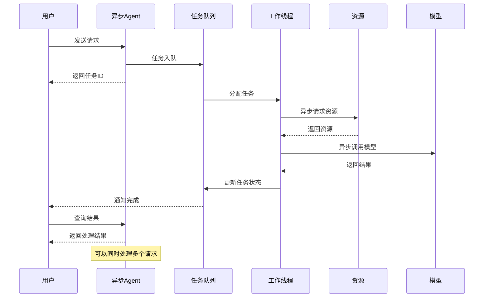
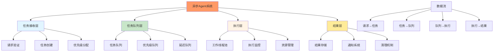
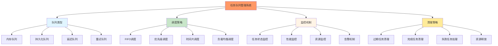
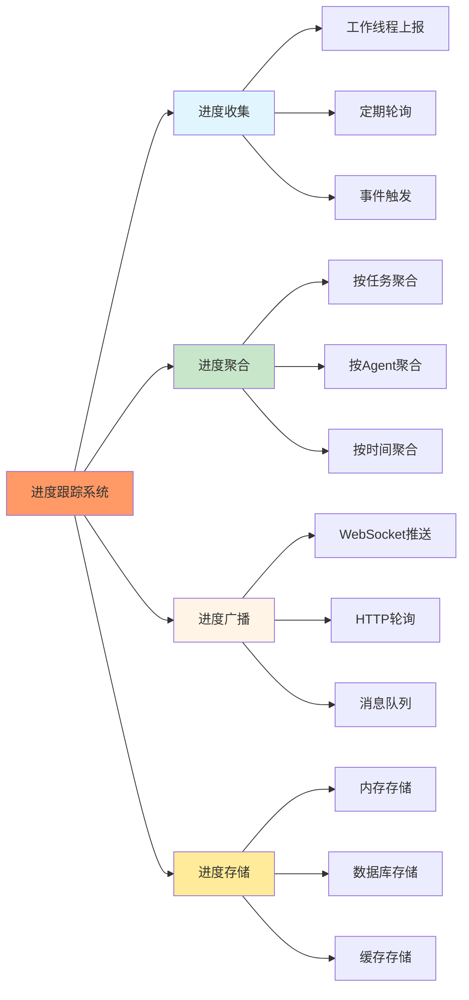
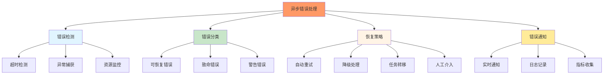

# 第8章：异步Agent系统

## 学习目标

通过本章学习，您将：
- 理解同步vs异步Agent的本质区别
- 掌握后台Agent执行模型的实现
- 学习异步任务队列的管理策略
- 理解进度跟踪和状态同步机制
- 掌握异步Agent的错误处理方法
- 能够创建高效的异步分析Agent

## 8.1 同步vs异步Agent对比

### 执行模式对比



### 同步Agent执行流程



### 异步Agent执行流程



### 同步vs异步特性对比

```typescript
/**
 * Agent执行特性对比
 */
interface ExecutionCharacteristics {
  // 阻塞特性
  blocking: boolean;
  
  // 并发处理能力
  concurrency: number;
  
  // 资源利用率
  resourceUtilization: 'low' | 'medium' | 'high';
  
  // 状态管理复杂度
  stateComplexity: 'simple' | 'medium' | 'complex';
  
  // 错误处理难度
  errorHandling: 'easy' | 'medium' | 'hard';
  
  // 性能特征
  performance: {
    throughput: 'low' | 'medium' | 'high';
    latency: 'low' | 'medium' | 'high';
    scalability: 'poor' | 'good' | 'excellent';
  };
}

/**
 * 同步Agent特性
 */
const SYNC_AGENT_CHARACTERISTICS: ExecutionCharacteristics = {
  blocking: true,
  concurrency: 1,
  resourceUtilization: 'low',
  stateComplexity: 'simple',
  errorHandling: 'easy',
  performance: {
    throughput: 'low',
    latency: 'low',
    scalability: 'poor',
  },
};

/**
 * 异步Agent特性
 */
const ASYNC_AGENT_CHARACTERISTICS: ExecutionCharacteristics = {
  blocking: false,
  concurrency: 100, // 可配置
  resourceUtilization: 'high',
  stateComplexity: 'complex',
  errorHandling: 'hard',
  performance: {
    throughput: 'high',
    latency: 'medium',
    scalability: 'excellent',
  },
};
```

## 8.2 后台Agent执行模型

### 执行模型架构



### 后台执行管理器

```typescript
/**
 * 后台Agent执行管理器
 */
class BackgroundAgentExecutor {
  private taskQueue: PriorityQueue<AgentTask>;
  private workerPool: WorkerPool;
  private taskMonitor: TaskMonitor;
  private resultManager: ResultManager;
  private executionConfig: ExecutionConfig;
  
  constructor(config: ExecutionConfig = {}) {
    this.executionConfig = {
      maxConcurrent: config.maxConcurrent || 10,
      maxQueueSize: config.maxQueueSize || 1000,
      taskTimeout: config.taskTimeout || 300000, // 5分钟
      workerIdleTimeout: config.workerIdleTimeout || 60000, // 1分钟
      ...config,
    };
    
    this.taskQueue = new PriorityQueue(this.executionConfig.maxQueueSize);
    this.workerPool = new WorkerPool(this.executionConfig);
    this.taskMonitor = new TaskMonitor();
    this.resultManager = new ResultManager();
    
    this.initialize();
  }
  
  /**
   * 初始化执行器
   */
  private async initialize(): Promise<void> {
    console.log('初始化后台Agent执行器...');
    
    // 启动工作线程池
    await this.workerPool.start();
    
    // 启动任务监控
    this.taskMonitor.start();
    
    // 启动任务处理循环
    this.startTaskProcessingLoop();
    
    console.log('✓ 后台Agent执行器初始化完成');
  }
  
  /**
   * 提交异步任务
   */
  public async submitTask(
    agentName: string,
    request: any,
    options: TaskOptions = {}
  ): Promise<string> {
    // 创建任务
    const task: AgentTask = {
      taskId: this.generateTaskId(),
      agentName,
      request,
      status: 'pending',
      priority: options.priority || 'normal',
      createdAt: Date.now(),
      timeout: options.timeout || this.executionConfig.taskTimeout,
      metadata: options.metadata || {},
    };
    
    // 添加到队列
    try {
      await this.taskQueue.enqueue(task);
      
      // 注册任务监控
      this.taskMonitor.registerTask(task);
      
      console.log(`任务 ${task.taskId} 已提交到队列`);
      return task.taskId;
      
    } catch (error) {
      console.error(`任务提交失败:`, error);
      throw new Error(`Failed to submit task: ${error}`);
    }
  }
  
  /**
   * 获取任务状态
   */
  public async getTaskStatus(taskId: string): Promise<TaskStatus> {
    const task = this.taskMonitor.getTask(taskId);
    
    if (!task) {
      throw new Error(`Task ${taskId} not found`);
    }
    
    return {
      taskId: task.taskId,
      status: task.status,
      progress: task.progress,
      result: task.result,
      error: task.error,
      createdAt: task.createdAt,
      startedAt: task.startedAt,
      completedAt: task.completedAt,
    };
  }
  
  /**
   * 等待任务完成
   */
  public async waitForTask(
    taskId: string,
    options: {
      timeout?: number;
      pollInterval?: number;
    } = {}
  ): Promise<any> {
    const { timeout = 300000, pollInterval = 1000 } = options;
    const startTime = Date.now();
    
    while (Date.now() - startTime < timeout) {
      const status = await this.getTaskStatus(taskId);
      
      if (status.status === 'completed') {
        return status.result;
      }
      
      if (status.status === 'failed') {
        throw new Error(`Task failed: ${status.error}`);
      }
      
      if (status.status === 'cancelled') {
        throw new Error('Task was cancelled');
      }
      
      // 等待一段时间再检查
      await this.sleep(pollInterval);
    }
    
    throw new Error(`Task timeout after ${timeout}ms`);
  }
  
  /**
   * 取消任务
   */
  public async cancelTask(taskId: string): Promise<boolean> {
    const task = this.taskMonitor.getTask(taskId);
    
    if (!task) {
      return false;
    }
    
    if (task.status === 'completed' || task.status === 'failed') {
      return false; // 已完成的任务无法取消
    }
    
    // 如果任务正在执行，通知工作线程取消
    if (task.status === 'running') {
      await this.workerPool.cancelTask(taskId);
    }
    
    // 更新任务状态
    task.status = 'cancelled';
    task.completedAt = Date.now();
    
    return true;
  }
  
  /**
   * 启动任务处理循环
   */
  private startTaskProcessingLoop(): void {
    const processNextTask = async () => {
      try {
        // 检查是否有空闲工作线程
        if (this.workerPool.hasAvailableWorker()) {
          // 从队列获取下一个任务
          const task = await this.taskQueue.dequeue();
          
          if (task) {
            // 分配给工作线程执行
            await this.workerPool.executeTask(task, this);
          }
        }
      } catch (error) {
        console.error('任务处理循环错误:', error);
      }
      
      // 继续下一个循环
      setImmediate(processNextTask);
    };
    
    // 启动处理循环
    processNextTask();
  }
  
  /**
   * 处理任务完成
   */
  public async handleTaskComplete(
    taskId: string,
    result: any
  ): Promise<void> {
    const task = this.taskMonitor.getTask(taskId);
    
    if (task) {
      task.status = 'completed';
      task.result = result;
      task.completedAt = Date.now();
      task.progress = 100;
      
      // 存储结果
      await this.resultManager.store(taskId, result);
      
      console.log(`任务 ${taskId} 完成`);
    }
  }
  
  /**
   * 处理任务失败
   */
  public async handleTaskFailure(
    taskId: string,
    error: Error
  ): Promise<void> {
    const task = this.taskMonitor.getTask(taskId);
    
    if (task) {
      task.status = 'failed';
      task.error = error.message;
      task.completedAt = Date.now();
      
      console.error(`任务 ${taskId} 失败:`, error);
    }
  }
  
  /**
   * 更新任务进度
   */
  public async updateTaskProgress(
    taskId: string,
    progress: number,
    message?: string
  ): Promise<void> {
    const task = this.taskMonitor.getTask(taskId);
    
    if (task) {
      task.progress = Math.min(100, Math.max(0, progress));
      if (message) {
        task.progressMessage = message;
      }
    }
  }
  
  /**
   * 获取执行统计
   */
  public getExecutionStatistics(): ExecutionStatistics {
    return {
      ...this.workerPool.getStatistics(),
      ...this.taskQueue.getStatistics(),
      ...this.taskMonitor.getStatistics(),
    };
  }
  
  /**
   * 生成任务ID
   */
  private generateTaskId(): string {
    return `task-${Date.now()}-${Math.random().toString(36).slice(2, 11)}`;
  }
  
  /**
   * 睡眠函数
   */
  private sleep(ms: number): Promise<void> {
    return new Promise(resolve => setTimeout(resolve, ms));
  }
}

/**
 * 执行配置接口
 */
interface ExecutionConfig {
  maxConcurrent?: number;
  maxQueueSize?: number;
  taskTimeout?: number;
  workerIdleTimeout?: number;
}

/**
 * 任务选项接口
 */
interface TaskOptions {
  priority?: 'low' | 'normal' | 'high';
  timeout?: number;
  metadata?: Record<string, any>;
}

/**
 * Agent任务接口
 */
interface AgentTask {
  taskId: string;
  agentName: string;
  request: any;
  status: 'pending' | 'running' | 'completed' | 'failed' | 'cancelled';
  priority: 'low' | 'normal' | 'high';
  progress: number;
  progressMessage?: string;
  result?: any;
  error?: string;
  createdAt: number;
  startedAt?: number;
  completedAt?: number;
  timeout: number;
  metadata: Record<string, any>;
}

/**
 * 任务状态接口
 */
interface TaskStatus {
  taskId: string;
  status: string;
  progress: number;
  result?: any;
  error?: string;
  createdAt: number;
  startedAt?: number;
  completedAt?: number;
}

/**
 * 执行统计接口
 */
interface ExecutionStatistics {
  activeWorkers: number;
  queuedTasks: number;
  completedTasks: number;
  failedTasks: number;
  averageExecutionTime: number;
}
```

### 优先级队列实现

```typescript
/**
 * 任务优先级队列
 */
class PriorityQueue<T> {
  private queues: Map<string, T[]> = new Map();
  private maxSize: number;
  private priorityOrder: string[] = ['high', 'normal', 'low'];
  
  constructor(maxSize: number = 1000) {
    this.maxSize = maxSize;
    
    // 初始化各优先级队列
    for (const priority of this.priorityOrder) {
      this.queues.set(priority, []);
    }
  }
  
  /**
   * 入队
   */
  public async enqueue(item: any & { priority: string }): Promise<void> {
    const priority = item.priority || 'normal';
    const queue = this.queues.get(priority);
    
    if (!queue) {
      throw new Error(`Invalid priority: ${priority}`);
    }
    
    // 检查队列大小限制
    const totalSize = this.getTotalSize();
    if (totalSize >= this.maxSize) {
      throw new Error('Queue is full');
    }
    
    queue.push(item);
  }
  
  /**
   * 出队
   */
  public async dequeue(): Promise<T | null> {
    // 按优先级顺序查找任务
    for (const priority of this.priorityOrder) {
      const queue = this.queues.get(priority);
      if (queue && queue.length > 0) {
        return queue.shift() as T;
      }
    }
    
    return null; // 队列为空
  }
  
  /**
   * 获取队列大小
   */
  public size(): number {
    return this.getTotalSize();
  }
  
  /**
   * 获取统计信息
   */
  public getStatistics(): {
    totalSize: number;
    byPriority: Record<string, number>;
  } {
    const byPriority: Record<string, number> = {};
    
    for (const [priority, queue] of this.queues) {
      byPriority[priority] = queue.length;
    }
    
    return {
      totalSize: this.getTotalSize(),
      byPriority,
    };
  }
  
  /**
   * 获取总大小
   */
  private getTotalSize(): number {
    let total = 0;
    for (const queue of this.queues.values()) {
      total += queue.length;
    }
    return total;
  }
}
```

## 8.3 异步任务队列管理

### 任务队列架构



### 任务队列管理器

```typescript
/**
 * 异步任务队列管理器
 */
class AsyncTaskQueueManager {
  private queues: Map<string, TaskQueue> = new Map();
  private schedulers: Map<string, TaskScheduler> = new Map();
  private monitors: Map<string, QueueMonitor> = new Map();
  private cleaningService: QueueCleaningService;
  
  constructor() {
    this.cleaningService = new QueueCleaningService();
    this.initialize();
  }
  
  /**
   * 初始化队列管理器
   */
  private async initialize(): Promise<void> {
    console.log('初始化任务队列管理器...');
    
    // 创建默认队列
    await this.createQueue('default', {
      type: 'memory',
      maxSize: 1000,
    });
    
    await this.createQueue('high-priority', {
      type: 'memory',
      maxSize: 100,
    });
    
    await this.createQueue('delayed', {
      type: 'delayed',
      maxSize: 500,
    });
    
    // 启动清理服务
    this.cleaningService.start();
    
    console.log('✓ 任务队列管理器初始化完成');
  }
  
  /**
   * 创建队列
   */
  public async createQueue(
    name: string,
    config: QueueConfig
  ): Promise<TaskQueue> {
    if (this.queues.has(name)) {
      throw new Error(`Queue '${name}' already exists`);
    }
    
    let queue: TaskQueue;
    
    switch (config.type) {
      case 'memory':
        queue = new MemoryTaskQueue(config);
        break;
      case 'persistent':
        queue = new PersistentTaskQueue(config);
        break;
      case 'delayed':
        queue = new DelayedTaskQueue(config);
        break;
      default:
        throw new Error(`Unknown queue type: ${config.type}`);
    }
    
    this.queues.set(name, queue);
    
    // 创建调度器
    const scheduler = new TaskScheduler(queue, config);
    this.schedulers.set(name, scheduler);
    
    // 创建监控器
    const monitor = new QueueMonitor(queue);
    this.monitors.set(name, monitor);
    
    console.log(`队列 '${name}' 创建完成`);
    return queue;
  }
  
  /**
   * 添加任务到队列
   */
  public async addTask(
    queueName: string,
    task: AgentTask,
    options?: {
      delay?: number;
      retry?: number;
    }
  ): Promise<void> {
    const queue = this.queues.get(queueName);
    
    if (!queue) {
      throw new Error(`Queue '${queueName}' not found`);
    }
    
    // 处理延迟任务
    if (options?.delay) {
      task.delayedUntil = Date.now() + options.delay;
      const delayedQueue = this.queues.get('delayed');
      if (delayedQueue) {
        await delayedQueue.enqueue(task);
        return;
      }
    }
    
    // 处理重试配置
    if (options?.retry) {
      task.maxRetries = options.retry;
      task.currentRetry = 0;
    }
    
    await queue.enqueue(task);
  }
  
  /**
   * 获取队列统计
   */
  public getQueueStatistics(queueName: string): QueueStatistics {
    const queue = this.queues.get(queueName);
    const scheduler = this.schedulers.get(queueName);
    const monitor = this.monitors.get(queueName);
    
    if (!queue) {
      throw new Error(`Queue '${queueName}' not found`);
    }
    
    return {
      name: queueName,
      size: queue.size(),
      type: queue.getType(),
      scheduler: scheduler?.getStatistics(),
      monitor: monitor?.getStatistics(),
    };
  }
  
  /**
   * 获取所有队列统计
   */
  public getAllQueueStatistics(): Map<string, QueueStatistics> {
    const statistics = new Map<string, QueueStatistics>();
    
    for (const queueName of this.queues.keys()) {
      try {
        statistics.set(queueName, this.getQueueStatistics(queueName));
      } catch (error) {
        console.error(`Failed to get statistics for queue '${queueName}':`, error);
      }
    }
    
    return statistics;
  }
  
  /**
   * 暂停队列
   */
  public async pauseQueue(queueName: string): Promise<void> {
    const scheduler = this.schedulers.get(queueName);
    
    if (scheduler) {
      await scheduler.pause();
      console.log(`队列 '${queueName}' 已暂停`);
    }
  }
  
  /**
   * 恢复队列
   */
  public async resumeQueue(queueName: string): Promise<void> {
    const scheduler = this.schedulers.get(queueName);
    
    if (scheduler) {
      await scheduler.resume();
      console.log(`队列 '${queueName}' 已恢复`);
    }
  }
  
  /**
   * 清空队列
   */
  public async clearQueue(queueName: string): Promise<void> {
    const queue = this.queues.get(queueName);
    
    if (queue) {
      await queue.clear();
      console.log(`队列 '${queueName}' 已清空`);
    }
  }
}

/**
 * 队列配置接口
 */
interface QueueConfig {
  type: 'memory' | 'persistent' | 'delayed';
  maxSize?: number;
  retentionTime?: number;
  scheduler?: SchedulerConfig;
}

/**
 * 调度器配置接口
 */
interface SchedulerConfig {
  type?: 'fifo' | 'priority' | 'round-robin';
  workers?: number;
  interval?: number;
}

/**
 * 队列统计接口
 */
interface QueueStatistics {
  name: string;
  size: number;
  type: string;
  scheduler?: any;
  monitor?: any;
}
```

### 内存任务队列实现

```typescript
/**
 * 内存任务队列
 */
class MemoryTaskQueue implements TaskQueue {
  private tasks: AgentTask[] = [];
  private maxSize: number;
  
  constructor(config: QueueConfig) {
    this.maxSize = config.maxSize || 1000;
  }
  
  /**
   * 入队
   */
  public async enqueue(task: AgentTask): Promise<void> {
    if (this.tasks.length >= this.maxSize) {
      throw new Error('Queue is full');
    }
    
    this.tasks.push(task);
  }
  
  /**
   * 出队
   */
  public async dequeue(): Promise<AgentTask | null> {
    return this.tasks.shift() || null;
  }
  
  /**
   * 获取队列大小
   */
  public size(): number {
    return this.tasks.length;
  }
  
  /**
   * 清空队列
   */
  public async clear(): Promise<void> {
    this.tasks = [];
  }
  
  /**
   * 获取队列类型
   */
  public getType(): string {
    return 'memory';
  }
  
  /**
   * 获取所有任务
   */
  public getTasks(): AgentTask[] {
    return [...this.tasks];
  }
}

/**
 * 任务队列接口
 */
interface TaskQueue {
  enqueue(task: AgentTask): Promise<void>;
  dequeue(): Promise<AgentTask | null>;
  size(): number;
  clear(): Promise<void>;
  getType(): string;
}
```

### 延迟任务队列实现

```typescript
/**
 * 延迟任务队列
 */
class DelayedTaskQueue implements TaskQueue {
  private delayedTasks: Map<string, DelayedTask> = new Map();
  private processingInterval: NodeJS.Timeout | null = null;
  
  constructor(config: QueueConfig) {
    this.startProcessing();
  }
  
  /**
   * 入队
   */
  public async enqueue(task: AgentTask): Promise<void> {
    if (!task.delayedUntil) {
      throw new Error('Delayed task must have delayedUntil field');
    }
    
    const delayedTask: DelayedTask = {
      ...task,
      enqueuedAt: Date.now(),
    };
    
    this.delayedTasks.set(task.taskId, delayedTask);
  }
  
  /**
   * 出队
   */
  public async dequeue(): Promise<AgentTask | null> {
    const now = Date.now();
    
    // 查找到期的任务
    for (const [taskId, delayedTask] of this.delayedTasks) {
      if (delayedTask.delayedUntil && delayedTask.delayedUntil <= now) {
        this.delayedTasks.delete(taskId);
        
        // 转换为普通任务
        const task: AgentTask = {
          ...delayedTask,
          status: 'pending',
        };
        
        return task;
      }
    }
    
    return null;
  }
  
  /**
   * 获取队列大小
   */
  public size(): number {
    return this.delayedTasks.size;
  }
  
  /**
   * 清空队列
   */
  public async clear(): Promise<void> {
    this.delayedTasks.clear();
  }
  
  /**
   * 获取队列类型
   */
  public getType(): string {
    return 'delayed';
  }
  
  /**
   * 启动处理循环
   */
  private startProcessing(): void {
    this.processingInterval = setInterval(() => {
      // 定期清理过期任务
      this.cleanupExpiredTasks();
    }, 1000); // 每秒检查一次
  }
  
  /**
   * 清理过期任务
   */
  private cleanupExpiredTasks(): void {
    const now = Date.now();
    
    for (const [taskId, delayedTask] of this.delayedTasks) {
      // 删除超过1天未处理的任务
      const maxAge = 24 * 60 * 60 * 1000; // 1天
      if (delayedTask.enqueuedAt && (now - delayedTask.enqueuedAt) > maxAge) {
        this.delayedTasks.delete(taskId);
        console.log(`删除过期的延迟任务: ${taskId}`);
      }
    }
  }
  
  /**
   * 销毁队列
   */
  public destroy(): void {
    if (this.processingInterval) {
      clearInterval(this.processingInterval);
      this.processingInterval = null;
    }
  }
}

/**
 * 延迟任务接口
 */
interface DelayedTask extends AgentTask {
  delayedUntil: number;
  enqueuedAt: number;
}
```

## 8.4 进度跟踪和状态同步

### 进度跟踪系统



### 进度跟踪管理器

```typescript
/**
 * 进度跟踪管理器
 */
class ProgressTrackingManager {
  private progressStore: Map<string, TaskProgress> = new Map();
  private listeners: Map<string, ProgressListener[]> = new Map();
  private broadcastService: ProgressBroadcastService;
  
  constructor() {
    this.broadcastService = new ProgressBroadcastService();
  }
  
  /**
   * 开始跟踪任务
   */
  public async startTracking(taskId: string): Promise<void> {
    const progress: TaskProgress = {
      taskId,
      status: 'pending',
      progress: 0,
      stages: [],
      currentStage: null,
      startTime: Date.now(),
      updateTime: Date.now(),
    };
    
    this.progressStore.set(taskId, progress);
    
    // 通知监听器
    await this.notifyListeners(taskId, 'started', progress);
    
    console.log(`开始跟踪任务 ${taskId}`);
  }
  
  /**
   * 更新任务进度
   */
  public async updateProgress(
    taskId: string,
    update: ProgressUpdate
  ): Promise<void> {
    const progress = this.progressStore.get(taskId);
    
    if (!progress) {
      console.warn(`任务 ${taskId} 未找到进度信息`);
      return;
    }
    
    // 更新进度
    if (update.progress !== undefined) {
      progress.progress = Math.min(100, Math.max(0, update.progress));
    }
    
    if (update.status) {
      progress.status = update.status;
    }
    
    if (update.message) {
      progress.message = update.message;
    }
    
    if (update.currentStage !== undefined) {
      progress.currentStage = update.currentStage;
    }
    
    if (update.stageCompleted !== undefined) {
      const stage = progress.stages[update.stageCompleted];
      if (stage) {
        stage.completedAt = Date.now();
        stage.status = 'completed';
      }
    }
    
    progress.updateTime = Date.now();
    
    // 通知监听器
    await this.notifyListeners(taskId, 'progress', progress);
    
    // 广播进度更新
    await this.broadcastService.broadcast(taskId, progress);
  }
  
  /**
   * 添加阶段
   */
  public async addStage(
    taskId: string,
    stage: ProgressStage
  ): Promise<void> {
    const progress = this.progressStore.get(taskId);
    
    if (!progress) {
      console.warn(`任务 ${taskId} 未找到进度信息`);
      return;
    }
    
    progress.stages.push({
      ...stage,
      status: 'pending',
      startedAt: null,
      completedAt: null,
    });
    
    console.log(`任务 ${taskId} 添加阶段: ${stage.name}`);
  }
  
  /**
   * 开始阶段
   */
  public async startStage(
    taskId: string,
    stageIndex: number
  ): Promise<void> {
    const progress = this.progressStore.get(taskId);
    
    if (!progress || !progress.stages[stageIndex]) {
      console.warn(`任务 ${taskId} 或阶段 ${stageIndex} 未找到`);
      return;
    }
    
    const stage = progress.stages[stageIndex];
    stage.status = 'running';
    stage.startedAt = Date.now();
    progress.currentStage = stageIndex;
    
    await this.updateProgress(taskId, {
      currentStage: stageIndex,
      message: `开始执行阶段: ${stage.name}`,
    });
  }
  
  /**
   * 完成阶段
   */
  public async completeStage(
    taskId: string,
    stageIndex: number,
    result?: any
  ): Promise<void> {
    const progress = this.progressStore.get(taskId);
    
    if (!progress || !progress.stages[stageIndex]) {
      console.warn(`任务 ${taskId} 或阶段 ${stageIndex} 未找到`);
      return;
    }
    
    const stage = progress.stages[stageIndex];
    stage.status = 'completed';
    stage.completedAt = Date.now();
    stage.result = result;
    
    // 计算总体进度
    const completedStages = progress.stages.filter(s => s.status === 'completed').length;
    const totalProgress = Math.round((completedStages / progress.stages.length) * 100);
    
    await this.updateProgress(taskId, {
      progress: totalProgress,
      stageCompleted: stageIndex,
      message: `完成阶段: ${stage.name}`,
    });
  }
  
  /**
   * 完成任务
   */
  public async completeTask(
    taskId: string,
    result?: any
  ): Promise<void> {
    const progress = this.progressStore.get(taskId);
    
    if (!progress) {
      console.warn(`任务 ${taskId} 未找到进度信息`);
      return;
    }
    
    progress.status = 'completed';
    progress.progress = 100;
    progress.completedAt = Date.now();
    progress.result = result;
    
    await this.notifyListeners(taskId, 'completed', progress);
    await this.broadcastService.broadcast(taskId, progress);
    
    console.log(`任务 ${taskId} 完成`);
  }
  
  /**
   * 失败任务
   */
  public async failTask(
    taskId: string,
    error: Error
  ): Promise<void> {
    const progress = this.progressStore.get(taskId);
    
    if (!progress) {
      console.warn(`任务 ${taskId} 未找到进度信息`);
      return;
    }
    
    progress.status = 'failed';
    progress.error = error.message;
    progress.failedAt = Date.now();
    
    await this.notifyListeners(taskId, 'failed', progress);
    await this.broadcastService.broadcast(taskId, progress);
    
    console.error(`任务 ${taskId} 失败:`, error);
  }
  
  /**
   * 获取任务进度
   */
  public getProgress(taskId: string): TaskProgress | undefined {
    return this.progressStore.get(taskId);
  }
  
  /**
   * 添加进度监听器
   */
  public addProgressListener(
    taskId: string,
    listener: ProgressListener
  ): void {
    if (!this.listeners.has(taskId)) {
      this.listeners.set(taskId, []);
    }
    
    this.listeners.get(taskId)!.push(listener);
  }
  
  /**
   * 移除进度监听器
   */
  public removeProgressListener(
    taskId: string,
    listener: ProgressListener
  ): void {
    const listeners = this.listeners.get(taskId);
    
    if (listeners) {
      const index = listeners.indexOf(listener);
      if (index !== -1) {
        listeners.splice(index, 1);
      }
    }
  }
  
  /**
   * 通知监听器
   */
  private async notifyListeners(
    taskId: string,
    event: string,
    progress: TaskProgress
  ): Promise<void> {
    const listeners = this.listeners.get(taskId) || [];
    
    for (const listener of listeners) {
      try {
        await listener(event, progress);
      } catch (error) {
        console.error(`进度监听器错误:`, error);
      }
    }
  }
  
  /**
   * 获取所有进度
   */
  public getAllProgress(): Map<string, TaskProgress> {
    return new Map(this.progressStore);
  }
  
  /**
   * 清理已完成的进度
   */
  public cleanupCompletedProgress(olderThan: number = 3600000): void {
    const now = Date.now();
    
    for (const [taskId, progress] of this.progressStore) {
      if (
        (progress.status === 'completed' && progress.completedAt && (now - progress.completedAt) > olderThan) ||
        (progress.status === 'failed' && progress.failedAt && (now - progress.failedAt) > olderThan)
      ) {
        this.progressStore.delete(taskId);
        console.log(`清理已完成任务进度: ${taskId}`);
      }
    }
  }
}

/**
 * 任务进度接口
 */
interface TaskProgress {
  taskId: string;
  status: 'pending' | 'running' | 'completed' | 'failed';
  progress: number;
  message?: string;
  stages: ProgressStage[];
  currentStage: number | null;
  startTime: number;
  updateTime: number;
  completedAt?: number;
  failedAt?: number;
  result?: any;
  error?: string;
}

/**
 * 进度更新接口
 */
interface ProgressUpdate {
  progress?: number;
  status?: string;
  message?: string;
  currentStage?: number;
  stageCompleted?: number;
}

/**
 * 进度阶段接口
 */
interface ProgressStage {
  name: string;
  description?: string;
  status: 'pending' | 'running' | 'completed' | 'failed';
  startedAt?: number;
  completedAt?: number;
  result?: any;
}

/**
 * 进度监听器类型
 */
type ProgressListener = (
  event: string,
  progress: TaskProgress
) => void | Promise<void>;

/**
 * 进度广播服务
 */
class ProgressBroadcastService {
  private channels: Map<string, BroadcastChannel> = new Map();
  
  /**
   * 广播进度更新
   */
  public async broadcast(taskId: string, progress: TaskProgress): Promise<void> {
    // 简化实现：这里可以实现WebSocket、HTTP轮询等广播机制
    console.log(`广播任务 ${taskId} 进度: ${progress.progress}%`);
  }
}
```

## 8.5 异步Agent错误处理

### 错误处理策略



### 异步错误处理器

```typescript
/**
 * 异步Agent错误处理器
 */
class AsyncAgentErrorHandler {
  private errorDetectors: ErrorDetector[] = [];
  private recoveryStrategies: Map<string, RecoveryStrategy> = new Map();
  private notificationService: ErrorNotificationService;
  private errorLogger: ErrorLogger;
  
  constructor() {
    this.notificationService = new ErrorNotificationService();
    this.errorLogger = new ErrorLogger();
    this.initializeDefaultDetectors();
    this.initializeDefaultStrategies();
  }
  
  /**
   * 初始化默认错误检测器
   */
  private initializeDefaultDetectors(): void {
    // 超时检测器
    this.addErrorDetector({
      name: 'timeout-detector',
      detect: async (context) => {
        const { task, startTime } = context;
        if (task.timeout && (Date.now() - startTime) > task.timeout) {
          return {
            type: 'timeout',
            severity: 'high',
            message: `Task ${task.taskId} timed out after ${task.timeout}ms`,
            recoverable: true,
          };
        }
        return null;
      },
    });
    
    // 资源泄漏检测器
    this.addErrorDetector({
      name: 'resource-leak-detector',
      detect: async (context) => {
        const memoryUsage = process.memoryUsage();
        if (memoryUsage.heapUsed > 1024 * 1024 * 1024) { // 1GB
          return {
            type: 'resource-leak',
            severity: 'medium',
            message: `High memory usage detected: ${Math.round(memoryUsage.heapUsed / 1024 / 1024)}MB`,
            recoverable: true,
          };
        }
        return null;
      },
    });
  }
  
  /**
   * 初始化默认恢复策略
   */
  private initializeDefaultStrategies(): void {
    // 超时恢复策略
    this.addRecoveryStrategy('timeout', {
      canRecover: (error) => error.recoverable === true,
      recover: async (context) => {
        const { task, executor } = context;
        
        // 取消当前任务
        await executor.cancelTask(task.taskId);
        
        // 重新提交任务
        const newTaskId = await executor.submitTask(
          task.agentName,
          task.request,
          {
            priority: task.priority,
            timeout: task.timeout * 2, // 双倍超时时间
            metadata: { retry: true, originalTaskId: task.taskId },
          }
        );
        
        return {
          success: true,
          action: 'retry',
          newTaskId,
          message: `Task re-submitted with extended timeout`,
        };
      },
    });
    
    // 资源泄漏恢复策略
    this.addRecoveryStrategy('resource-leak', {
      canRecover: (error) => error.severity === 'medium',
      recover: async (context) => {
        // 触发垃圾回收（如果可用）
        if (global.gc) {
          global.gc();
        }
        
        return {
          success: true,
          action: 'cleanup',
          message: 'Memory cleanup performed',
        };
      },
    });
  }
  
  /**
   * 添加错误检测器
   */
  public addErrorDetector(detector: ErrorDetector): void {
    this.errorDetectors.push(detector);
  }
  
  /**
   * 添加恢复策略
   */
  public addRecoveryStrategy(errorType: string, strategy: RecoveryStrategy): void {
    this.recoveryStrategies.set(errorType, strategy);
  }
  
  /**
   * 处理错误
   */
  public async handleError(
    error: Error,
    context: ErrorContext
  ): Promise<ErrorHandlingResult> {
    console.error(`处理异步Agent错误:`, error);
    
    // 记录错误
    await this.errorLogger.log(error, context);
    
    // 检测错误类型
    const detectedError = await this.detectError(error, context);
    
    if (!detectedError) {
      // 未知错误类型
      await this.notificationService.notifyUnknownError(error, context);
      return {
        handled: false,
        action: 'abort',
        reason: 'Unknown error type',
      };
    }
    
    // 查找恢复策略
    const strategy = this.recoveryStrategies.get(detectedError.type);
    
    if (!strategy || !strategy.canRecover(detectedError)) {
      // 无法恢复
      await this.notificationService.notifyUnrecoverableError(detectedError, context);
      return {
        handled: false,
        action: 'abort',
        reason: 'No recovery strategy available',
      };
    }
    
    // 尝试恢复
    try {
      const recovery = await strategy.recover({
        ...context,
        detectedError,
      });
      
      if (recovery.success) {
        await this.notificationService.notifyRecoverySuccess(detectedError, recovery);
        return {
          handled: true,
          action: recovery.action,
          recovery,
        };
      } else {
        await this.notificationService.notifyRecoveryFailed(detectedError, recovery);
        return {
          handled: false,
          action: 'abort',
          reason: 'Recovery failed',
        };
      }
    } catch (recoveryError) {
      await this.notificationService.notifyRecoveryError(detectedError, recoveryError);
      return {
        handled: false,
        action: 'abort',
        reason: 'Recovery threw error',
      };
    }
  }
  
  /**
   * 检测错误类型
   */
  private async detectError(
    error: Error,
    context: ErrorContext
  ): Promise<DetectedError | null> {
    for (const detector of this.errorDetectors) {
      try {
        const detected = await detector.detect(context);
        if (detected) {
          return detected;
        }
      } catch (detectorError) {
        console.error(`错误检测器 ${detector.name} 失败:`, detectorError);
      }
    }
    
    return null;
  }
}

/**
 * 错误检测器接口
 */
interface ErrorDetector {
  name: string;
  detect: (context: ErrorContext) => Promise<DetectedError | null>;
}

/**
 * 检测到的错误接口
 */
interface DetectedError {
  type: string;
  severity: 'low' | 'medium' | 'high';
  message: string;
  recoverable: boolean;
}

/**
 * 恢复策略接口
 */
interface RecoveryStrategy {
  canRecover: (error: DetectedError) => boolean;
  recover: (context: any) => Promise<RecoveryResult>;
}

/**
 * 恢复结果接口
 */
interface RecoveryResult {
  success: boolean;
  action: string;
  newTaskId?: string;
  message?: string;
}

/**
 * 错误上下文接口
 */
interface ErrorContext {
  task: AgentTask;
  executor: any;
  startTime: number;
  metadata?: Record<string, any>;
}

/**
 * 错误处理结果接口
 */
interface ErrorHandlingResult {
  handled: boolean;
  action: string;
  recovery?: any;
  reason?: string;
}

/**
 * 错误通知服务
 */
class ErrorNotificationService {
  /**
   * 通知未知错误
   */
  public async notifyUnknownError(error: Error, context: ErrorContext): Promise<void> {
    console.error('未知错误:', error);
  }
  
  /**
   * 通知不可恢复错误
   */
  public async notifyUnrecoverableError(
    detectedError: DetectedError,
    context: ErrorContext
  ): Promise<void> {
    console.error('不可恢复错误:', detectedError);
  }
  
  /**
   * 通知恢复成功
   */
  public async notifyRecoverySuccess(
    detectedError: DetectedError,
    recovery: RecoveryResult
  ): Promise<void> {
    console.log('恢复成功:', recovery);
  }
  
  /**
   * 通知恢复失败
   */
  public async notifyRecoveryFailed(
    detectedError: DetectedError,
    recovery: RecoveryResult
  ): Promise<void> {
    console.error('恢复失败:', recovery);
  }
  
  /**
   * 通知恢复错误
   */
  public async notifyRecoveryError(
    detectedError: DetectedError,
    recoveryError: any
  ): Promise<void> {
    console.error('恢复过程出错:', recoveryError);
  }
}

/**
 * 错误日志记录器
 */
class ErrorLogger {
  /**
   * 记录错误
   */
  public async log(error: Error, context: ErrorContext): Promise<void> {
    console.error('错误日志:', {
      error: error.message,
      stack: error.stack,
      context: {
        taskId: context.task.taskId,
        agent: context.task.agentName,
        timestamp: Date.now(),
      },
    });
  }
}
```

## 8.6 实践：创建异步分析Agent

### 完整的异步分析Agent实现

```typescript
/**
 * 异步代码分析Agent
 */
class AsyncCodeAnalysisAgent {
  private executor: BackgroundAgentExecutor;
  private progressManager: ProgressTrackingManager;
  private errorHandler: AsyncAgentErrorHandler;
  
  constructor() {
    this.executor = new BackgroundAgentExecutor({
      maxConcurrent: 5,
      maxQueueSize: 100,
    });
    
    this.progressManager = new ProgressTrackingManager();
    this.errorHandler = new AsyncAgentErrorHandler();
  }
  
  /**
   * 分析代码仓库
   */
  public async analyzeRepository(
    repository: string,
    options: AnalysisOptions = {}
  ): Promise<string> {
    console.log(`开始分析代码仓库: ${repository}`);
    
    // 创建任务
    const taskId = await this.executor.submitTask('code-analyzer', {
      repository,
      options,
    }, {
      priority: 'normal',
      timeout: 600000, // 10分钟
    });
    
    // 开始跟踪进度
    await this.progressManager.startTracking(taskId);
    
    // 添加分析阶段
    await this.progressManager.addStage(taskId, {
      name: 'clone',
      description: '克隆代码仓库',
    });
    
    await this.progressManager.addStage(taskId, {
      name: 'parse',
      description: '解析代码结构',
    });
    
    await this.progressManager.addStage(taskId, {
      name: 'analyze',
      description: '执行代码分析',
    });
    
    await this.progressManager.addStage(taskId, {
      name: 'report',
      description: '生成分析报告',
    });
    
    // 启动分析流程
    this.executeAnalysis(taskId, repository, options);
    
    return taskId;
  }
  
  /**
   * 执行分析流程
   */
  private async executeAnalysis(
    taskId: string,
    repository: string,
    options: AnalysisOptions
  ): Promise<void> {
    try {
      // 阶段1: 克隆仓库
      await this.progressManager.startStage(taskId, 0);
      await this.progressManager.updateProgress(taskId, {
        message: '正在克隆代码仓库...',
      });
      
      await this.cloneRepository(repository);
      await this.progressManager.completeStage(taskId, 0);
      
      // 阶段2: 解析代码
      await this.progressManager.startStage(taskId, 1);
      await this.progressManager.updateProgress(taskId, {
        message: '正在解析代码结构...',
      });
      
      const codeStructure = await this.parseCodeStructure(repository);
      await this.progressManager.completeStage(taskId, 1, codeStructure);
      
      // 阶段3: 分析代码
      await this.progressManager.startStage(taskId, 2);
      await this.progressManager.updateProgress(taskId, {
        message: '正在执行代码分析...',
      });
      
      const analysisResults = await this.analyzeCode(codeStructure);
      await this.progressManager.completeStage(taskId, 2, analysisResults);
      
      // 阶段4: 生成报告
      await this.progressManager.startStage(taskId, 3);
      await this.progressManager.updateProgress(taskId, {
        message: '正在生成分析报告...',
      });
      
      const report = await this.generateReport(analysisResults);
      await this.progressManager.completeStage(taskId, 3, report);
      
      // 完成任务
      await this.progressManager.completeTask(taskId, report);
      await this.executor.handleTaskComplete(taskId, report);
      
    } catch (error) {
      const handlingResult = await this.errorHandler.handleError(error as Error, {
        task: { taskId, agentName: 'code-analyzer' } as any,
        executor: this.executor,
        startTime: Date.now(),
      });
      
      if (!handlingResult.handled) {
        await this.progressManager.failTask(taskId, error as Error);
        await this.executor.handleTaskFailure(taskId, error as Error);
      }
    }
  }
  
  /**
   * 克隆仓库
   */
  private async cloneRepository(repository: string): Promise<void> {
    // 模拟克隆操作
    await this.sleep(2000);
  }
  
  /**
   * 解析代码结构
   */
  private async parseCodeStructure(repository: string): Promise<any> {
    // 模拟解析操作
    await this.sleep(3000);
    
    return {
      files: ['file1.ts', 'file2.ts', 'file3.ts'],
      structure: {
        src: ['index.ts', 'utils.ts'],
        test: ['index.test.ts'],
      },
    };
  }
  
  /**
   * 分析代码
   */
  private async analyzeCode(codeStructure: any): Promise<any> {
    // 模拟分析操作
    await this.sleep(4000);
    
    return {
      issues: [
        { file: 'file1.ts', line: 10, severity: 'high', message: 'Potential bug' },
        { file: 'file2.ts', line: 20, severity: 'medium', message: 'Code smell' },
      ],
      metrics: {
        totalLines: 1000,
        complexity: 50,
        coverage: 80,
      },
    };
  }
  
  /**
   * 生成报告
   */
  private async generateReport(analysisResults: any): Promise<any> {
    // 模拟报告生成
    await this.sleep(1000);
    
    return {
      summary: {
        totalFiles: 3,
        totalIssues: 2,
        highSeverityIssues: 1,
      },
      issues: analysisResults.issues,
      metrics: analysisResults.metrics,
      recommendations: [
        'Fix high severity issues first',
        'Improve code coverage',
      ],
    };
  }
  
  /**
   * 获取分析进度
   */
  public getAnalysisProgress(taskId: string): TaskProgress | undefined {
    return this.progressManager.getProgress(taskId);
  }
  
  /**
   * 等待分析完成
   */
  public async waitForAnalysis(taskId: string): Promise<any> {
    const progress = await this.progressManager.getProgress(taskId);
    
    if (!progress) {
      throw new Error(`Task ${taskId} not found`);
    }
    
    if (progress.status === 'completed') {
      return progress.result;
    }
    
    if (progress.status === 'failed') {
      throw new Error(progress.error || 'Task failed');
    }
    
    // 等待任务完成
    return await this.executor.waitForTask(taskId);
  }
  
  /**
   * 睡眠函数
   */
  private sleep(ms: number): Promise<void> {
    return new Promise(resolve => setTimeout(resolve, ms));
  }
}

/**
 * 分析选项接口
 */
interface AnalysisOptions {
  includeTests?: boolean;
  maxFileSize?: number;
  excludePatterns?: string[];
  depth?: number;
}

// 使用示例
async function demonstrateAsyncAnalysisAgent() {
  const agent = new AsyncCodeAnalysisAgent();
  
  // 开始异步分析
  const taskId = await agent.analyzeRepository('https://github.com/user/repo', {
    includeTests: true,
    depth: 3,
  });
  
  console.log(`分析任务已提交: ${taskId}`);
  
  // 轮询进度
  const checkProgress = setInterval(() => {
    const progress = agent.getAnalysisProgress(taskId);
    if (progress) {
      console.log(`分析进度: ${progress.progress}% - ${progress.message || 'Processing...'}`);
    }
  }, 2000);
  
  // 等待完成
  try {
    const result = await agent.waitForAnalysis(taskId);
    clearInterval(checkProgress);
    
    console.log('分析完成:', result);
  } catch (error) {
    clearInterval(checkProgress);
    console.error('分析失败:', error);
  }
}
```

## 8.7 实践练习

### 练习1：实现异步任务调度器

创建一个完整的异步任务调度器：
1. 支持多种调度策略
2. 实现任务优先级管理
3. 提供负载均衡机制
4. 监控和统计功能

```typescript
// 练习1模板
export class AsyncTaskScheduler {
  // 实现以下功能：
  // - schedule(task)
  // - getScheduledTasks()
  // - balanceLoad()
  // - getStatistics()
}
```

### 练习2：构建进度监控系统

实现一个完整的进度监控系统：
1. 实时进度更新
2. 可视化进度展示
3. 性能指标收集
4. 告警机制

```typescript
// 练习2模板
export class ProgressMonitoringSystem {
  // 实现以下功能：
  // - monitorProgress(taskId)
  // - visualizeProgress()
  // - collectMetrics()
  // - setupAlerts()
}
```

### 练习3：创建错误恢复系统

实现一个完整的错误恢复系统：
1. 多种错误检测机制
2. 自动恢复策略
3. 人工介入流程
4. 恢复效果评估

```typescript
// 练习3模板
export class ErrorRecoverySystem {
  // 实现以下功能：
  // - detectErrors(context)
  // - selectRecovery(error)
  // - executeRecovery(strategy)
  // - evaluateRecovery(result)
}
```

## 8.8 本章小结

### 核心概念掌握

✅ **同步vs异步Agent**：
- 同步：简单但低效，适合简单任务
- 异步：复杂但高效，适合复杂任务
- 选择取决于应用场景和性能需求

✅ **后台执行模型**：
- 任务接收 → 队列 → 执行 → 结果
- 工作线程池管理
- 资源利用率优化
- 可扩展性设计

✅ **异步任务队列**：
- 多种队列类型（内存、持久化、延迟）
- 优先级管理
- 调度策略
- 监控和清理

✅ **进度跟踪**：
- 实时进度更新
- 阶段化管理
- 广播通知
- 状态持久化

✅ **错误处理**：
- 多种错误检测机制
- 自动恢复策略
- 错误通知系统
- 完整的错误日志

### 下一步学习

在第9章中，我们将学习：
- Agent通信模式分类
- SendMessage机制深入
- 请求-响应模式
- 发布-订阅模式
- 代理模式和消息转发

### 技术要点检查表

- [ ] 理解同步vs异步Agent的区别
- [ ] 掌握后台Agent执行模型
- [ ] 理解异步任务队列管理
- [ ] 掌握进度跟踪机制
- [ ] 理解异步错误处理
- [ ] 能够创建异步分析Agent
- [ ] 掌握异步Agent系统的完整架构

---

**下一步**：继续学习第9章 - Agent间通信机制并掌握Agent协作的核心技术！