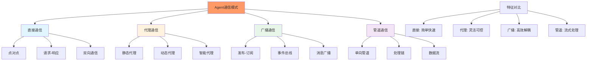
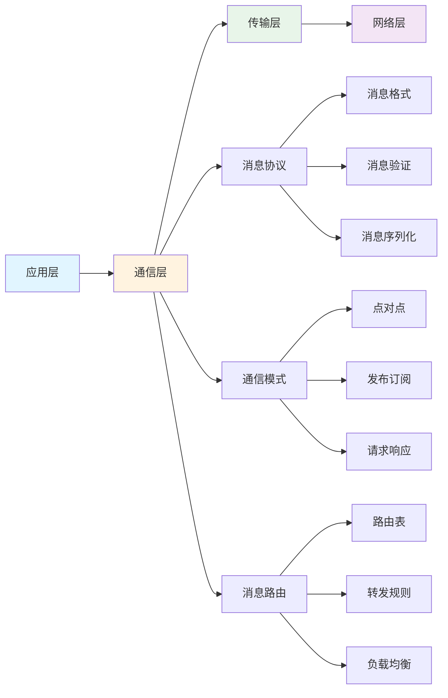
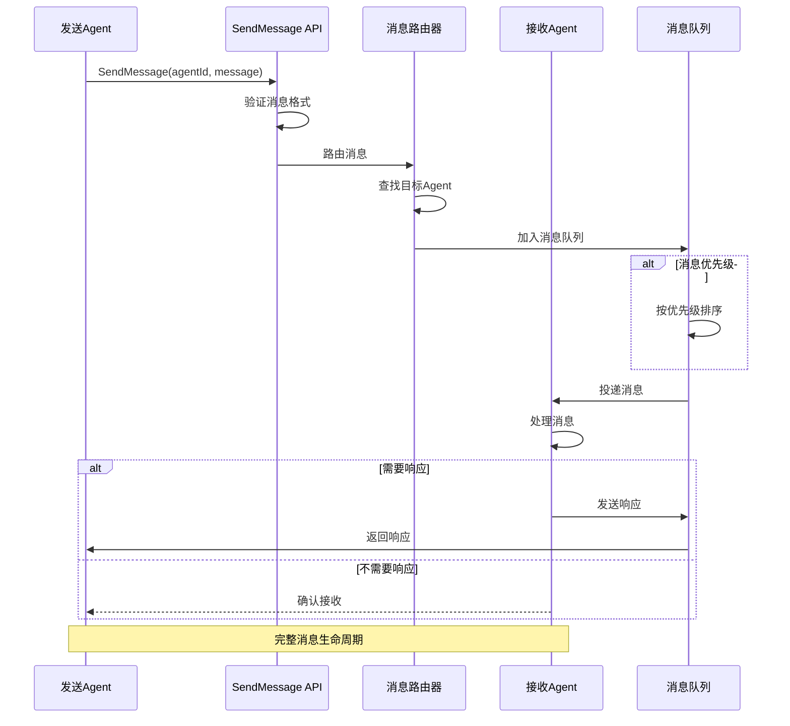
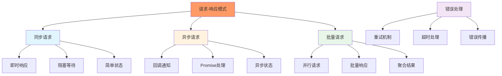
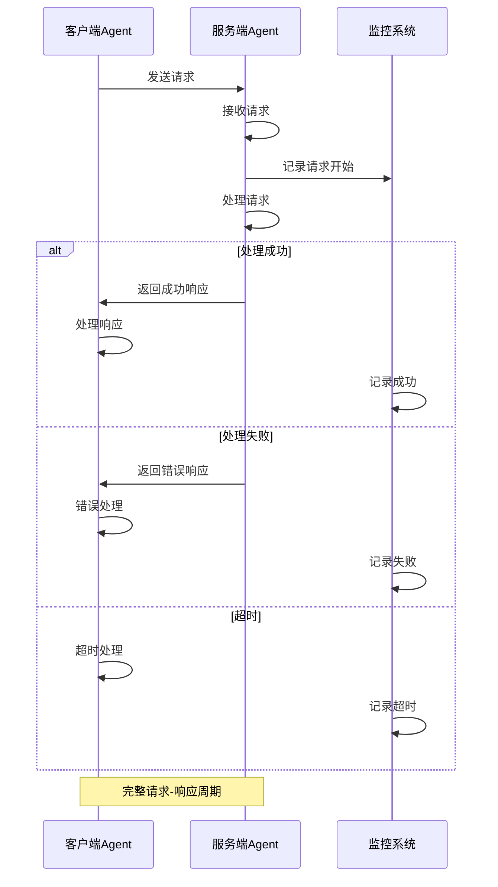
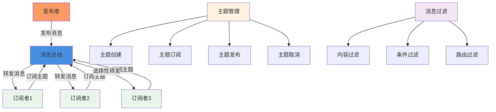
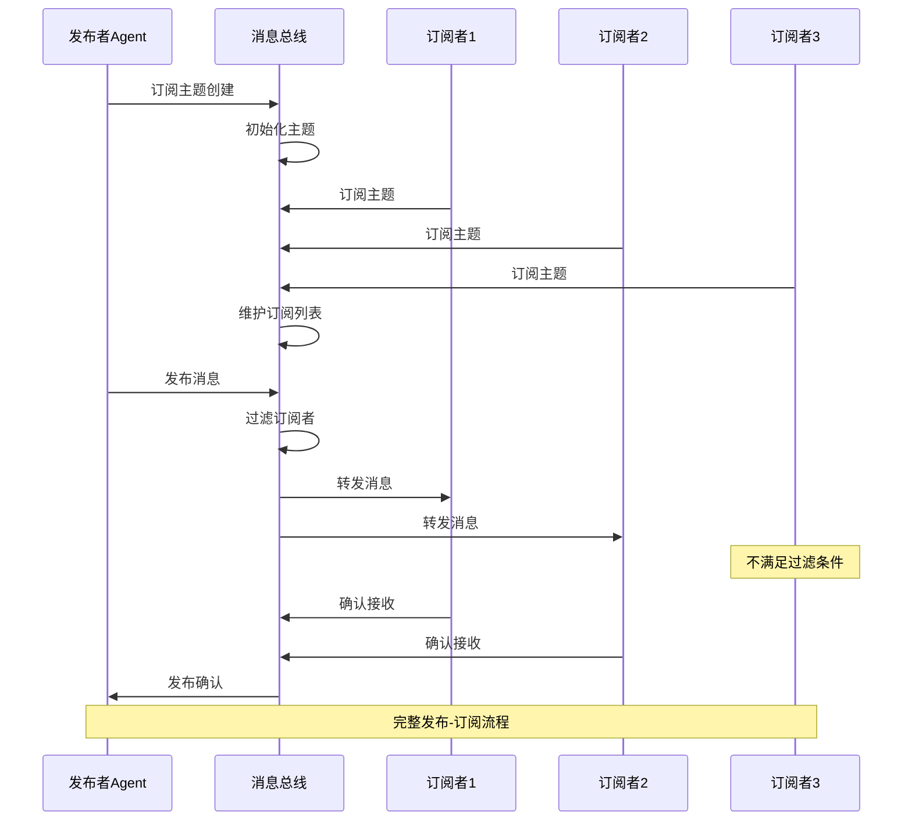
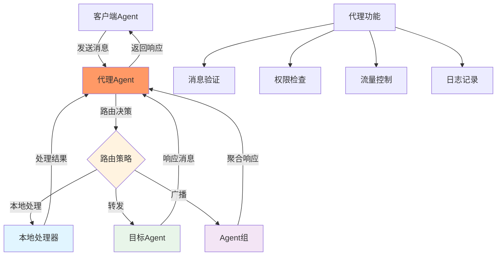
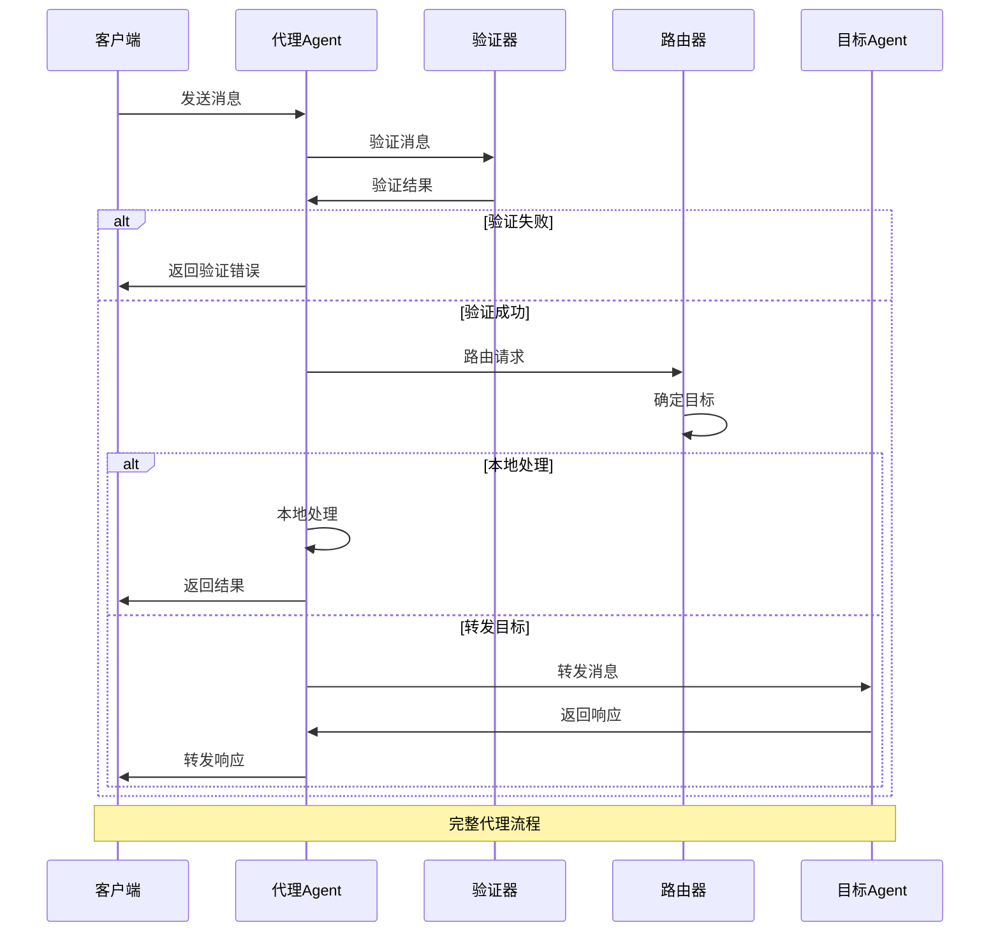
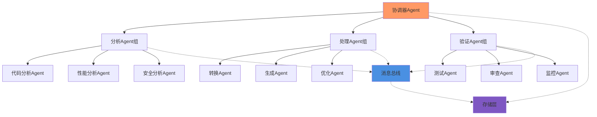

# 第9章：Agent间通信机制

## 学习目标

通过本章学习，您将：
- 理解Agent通信模式的分类和特点
- 掌握SendMessage机制的深入实现
- 学习请求-响应模式的完整流程
- 理解发布-订阅模式的应用场景
- 掌握代理模式和消息转发机制
- 能够构建复杂的Agent协作网络

## 9.1 Agent通信模式分类

### 通信模式概览



### 通信模式特点对比

| 通信模式 | 复杂度 | 实时性 | 可扩展性 | 解耦程度 | 适用场景 |
|---------|--------|--------|----------|----------|----------|
| **直接通信** | 低 | 高 | 低 | 低 | 简单Agent交互 |
| **代理通信** | 中 | 中 | 中 | 中 | 需要控制的通信 |
| **广播通信** | 中 | 中 | 高 | 高 | 多Agent协作 |
| **管道通信** | 中 | 高 | 中 | 中 | 数据流处理 |

### 通信架构层次



## 9.2 SendMessage机制深入

### SendMessage核心流程



### SendMessage数据结构

```typescript
interface AgentMessage {
  // 消息基础信息
  id: string;                      // 消息唯一标识
  from: string;                    // 发送者Agent ID
  to: string;                      // 接收者Agent ID
  timestamp: number;               // 发送时间戳
  
  // 消息内容
  type: MessageType;               // 消息类型
  payload: unknown;               // 消息载荷
  metadata?: Record<string, unknown>;  // 元数据
  
  // 控制信息
  priority: MessagePriority;      // 优先级
  requiresResponse: boolean;      // 是否需要响应
  timeout?: number;               // 超时时间
  
  // 状态跟踪
  status: MessageStatus;          // 消息状态
  retryCount: number;             // 重试次数
  error?: Error;                  // 错误信息
}

enum MessageType {
  REQUEST = 'request',           // 请求消息
  RESPONSE = 'response',         // 响应消息
  NOTIFICATION = 'notification', // 通知消息
  BROADCAST = 'broadcast',      // 广播消息
  SYSTEM = 'system'             // 系统消息
}

enum MessagePriority {
  LOW = 0,
  NORMAL = 1,
  HIGH = 2,
  URGENT = 3
}

enum MessageStatus {
  PENDING = 'pending',           // 等待发送
  SENT = 'sent',                 // 已发送
  DELIVERED = 'delivered',       // 已投递
  PROCESSED = 'processed',       // 已处理
  FAILED = 'failed',             // 发送失败
  TIMEOUT = 'timeout'            // 超时
}
```

### SendMessage管理器实现

```typescript
class SendMessageManager {
  private messageQueue: Map<string, AgentMessage>;
  private responseWaiters: Map<string, Promise<AgentMessage>>;
  private router: MessageRouter;
  private validator: MessageValidator;
  
  constructor(
    private agentRegistry: AgentRegistry,
    private config: SendMessageConfig
  ) {
    this.messageQueue = new Map();
    this.responseWaiters = new Map();
    this.router = new MessageRouter(agentRegistry);
    this.validator = new MessageValidator();
  }
  
  /**
   * 发送消息到目标Agent
   */
  async sendMessage(
    from: string,
    to: string,
    payload: unknown,
    options: MessageOptions = {}
  ): Promise<AgentMessage | null> {
    
    // 1. 创建消息对象
    const message: AgentMessage = {
      id: this.generateMessageId(),
      from,
      to,
      timestamp: Date.now(),
      type: options.type || MessageType.REQUEST,
      payload,
      metadata: options.metadata,
      priority: options.priority || MessagePriority.NORMAL,
      requiresResponse: options.requiresResponse ?? true,
      timeout: options.timeout || 30000,
      status: MessageStatus.PENDING,
      retryCount: 0
    };
    
    // 2. 验证消息
    const validation = this.validator.validate(message);
    if (!validation.isValid) {
      throw new Error(`Message validation failed: ${validation.error}`);
    }
    
    // 3. 路由消息
    const route = await this.router.route(message);
    if (!route.found) {
      throw new Error(`Target agent not found: ${to}`);
    }
    
    // 4. 加入消息队列
    this.messageQueue.set(message.id, message);
    await this.enqueueMessage(message);
    
    // 5. 发送消息
    try {
      await this.deliverMessage(message, route.target);
      message.status = MessageStatus.SENT;
      
      // 6. 如果需要响应，等待响应
      if (message.requiresResponse) {
        const response = await this.waitForResponse(message.id, message.timeout);
        return response;
      }
      
      return message;
      
    } catch (error) {
      message.status = MessageStatus.FAILED;
      message.error = error as Error;
      await this.handleFailedMessage(message);
      throw error;
    }
  }
  
  /**
   * 等待消息响应
   */
  private async waitForResponse(
    messageId: string,
    timeout: number
  ): Promise<AgentMessage> {
    return new Promise((resolve, reject) => {
      const timer = setTimeout(() => {
        this.responseWaiters.delete(messageId);
        reject(new Error(`Message timeout: ${messageId}`));
      }, timeout);
      
      this.responseWaiters.set(messageId, Promise.race([
        this.waitForResponseInternal(messageId),
        new Promise((_, reject) => 
          timer // eslint-disable-line no-unused-vars
        )
      ]));
    });
  }
  
  /**
   * 处理收到的响应
   */
  async handleResponse(response: AgentMessage): Promise<void> {
    const waiter = this.responseWaiters.get(response.id);
    if (waiter) {
      this.responseWaiters.delete(response.id);
      // Resolve the waiting promise
      return waiter;
    }
  }
  
  private generateMessageId(): string {
    return `msg_${Date.now()}_${crypto.randomUUID()}`;
  }
  
  private async enqueueMessage(message: AgentMessage): Promise<void> {
    // 按优先级排序入队
    const priority = message.priority;
    // 实现优先级队列逻辑
  }
  
  private async deliverMessage(
    message: AgentMessage,
    target: Agent
  ): Promise<void> {
    // 实现消息投递逻辑
    await target.receiveMessage(message);
  }
  
  private async handleFailedMessage(message: AgentMessage): Promise<void> {
    // 实现失败处理逻辑
    if (message.retryCount < 3) {
      message.retryCount++;
      await this.sendMessage(message.from, message.to, message.payload, {
        retryCount: message.retryCount
      });
    }
  }
  
  private async waitForResponseInternal(messageId: string): Promise<AgentMessage> {
    // 内部响应等待逻辑
    return new Promise((resolve) => {
      // 实现响应监听
    });
  }
}

interface MessageOptions {
  type?: MessageType;
  metadata?: Record<string, unknown>;
  priority?: MessagePriority;
  requiresResponse?: boolean;
  timeout?: number;
  retryCount?: number;
}

interface SendMessageConfig {
  maxQueueSize?: number;
  defaultTimeout?: number;
  maxRetries?: number;
  enablePriority?: boolean;
}
```

### 消息路由器实现

```typescript
class MessageRouter {
  private routingTable: Map<string, RouteInfo>;
  private cache: Map<string, RouteResult>;
  
  constructor(
    private agentRegistry: AgentRegistry
  ) {
    this.routingTable = new Map();
    this.cache = new Map();
  }
  
  /**
   * 路由消息到目标Agent
   */
  async route(message: AgentMessage): Promise<RouteResult> {
    // 检查缓存
    const cacheKey = `${message.from}:${message.to}`;
    const cached = this.cache.get(cacheKey);
    if (cached && !cached.expired) {
      return cached;
    }
    
    // 查找目标Agent
    const target = await this.findAgent(message.to);
    if (!target) {
      return { found: false, error: 'Agent not found' };
    }
    
    // 检查路由权限
    if (!this.checkPermission(message.from, message.to)) {
      return { found: false, error: 'Permission denied' };
    }
    
    const result: RouteResult = {
      found: true,
      target,
      path: await this.calculateRoute(message.from, message.to),
      cost: this.calculateCost(message.from, message.to)
    };
    
    // 缓存结果
    this.cache.set(cacheKey, result);
    
    return result;
  }
  
  /**
   * 查找目标Agent
   */
  private async findAgent(agentId: string): Promise<Agent | null> {
    // 查找本地Agent
    const local = this.agentRegistry.getAgent(agentId);
    if (local) {
      return local;
    }
    
    // 查找远程Agent
    const remote = await this.findRemoteAgent(agentId);
    if (remote) {
      return remote;
    }
    
    return null;
  }
  
  /**
   * 计算路由路径
   */
  private async calculateRoute(from: string, to: string): Promise<string[]> {
    // 实现路由路径计算
    return [from, to];
  }
  
  /**
   * 检查路由权限
   */
  private checkPermission(from: string, to: string): boolean {
    // 实现权限检查
    return true;
  }
  
  /**
   * 计算路由成本
   */
  private calculateCost(from: string, to: string): number {
    // 实现成本计算
    return 1;
  }
  
  private async findRemoteAgent(agentId: string): Promise<Agent | null> {
    // 实现远程Agent查找
    return null;
  }
}

interface RouteInfo {
  agentId: string;
  location: 'local' | 'remote';
  lastSeen: number;
}

interface RouteResult {
  found: boolean;
  target?: Agent;
  path?: string[];
  cost?: number;
  error?: string;
  expired?: boolean;
}
```

## 9.3 请求-响应模式

### 请求-响应模式架构



### 请求-响应流程时序



### 请求-响应处理器实现

```typescript
class RequestResponseHandler {
  private requestQueue: RequestQueue;
  private responseCache: ResponseCache;
  private timeoutManager: TimeoutManager;
  
  constructor(
    private agentRegistry: AgentRegistry,
    config: RequestResponseConfig
  ) {
    this.requestQueue = new RequestQueue(config.maxQueueSize);
    this.responseCache = new ResponseCache(config.cacheSize);
    this.timeoutManager = new TimeoutManager();
  }
  
  /**
   * 发送请求并等待响应
   */
  async sendRequest<T = unknown>(
    to: string,
    request: RequestData,
    options: RequestOptions = {}
  ): Promise<Response<T>> {
    
    // 1. 创建请求对象
    const requestMessage: AgentMessage = {
      id: this.generateRequestId(),
      from: this.agentRegistry.getCurrentAgentId(),
      to,
      timestamp: Date.now(),
      type: MessageType.REQUEST,
      payload: request,
      priority: options.priority || MessagePriority.NORMAL,
      requiresResponse: true,
      timeout: options.timeout || 30000,
      status: MessageStatus.PENDING,
      retryCount: 0
    };
    
    // 2. 检查缓存
    if (options.useCache) {
      const cached = await this.responseCache.get<T>(request);
      if (cached) {
        return cached;
      }
    }
    
    // 3. 发送请求
    try {
      const response = await this.sendRequestWithTimeout(requestMessage);
      
      // 4. 缓存响应
      if (options.useCache && response.success) {
        await this.responseCache.set(request, response);
      }
      
      return response;
      
    } catch (error) {
      // 5. 错误处理
      return this.handleRequestError(requestMessage, error);
    }
  }
  
  /**
   * 批量发送请求
   */
  async sendBatchRequests<T = unknown>(
    requests: BatchRequest<T>[]
  ): Promise<Response<T>[]> {
    
    // 1. 并行发送请求
    const promises = requests.map(request =>
      this.sendRequest<T>(request.to, request.data, request.options)
    );
    
    // 2. 等待所有请求完成
    try {
      const responses = await Promise.all(promises);
      return responses;
      
    } catch (error) {
      // 3. 部分失败处理
      return this.handleBatchError(requests, error);
    }
  }
  
  /**
   * 处理收到的请求
   */
  async handleRequest(message: AgentMessage): Promise<void> {
    
    // 1. 验证请求
    if (!this.validateRequest(message)) {
      await this.sendErrorResponse(message, 'Invalid request');
      return;
    }
    
    // 2. 获取处理器
    const handler = this.getHandler(message.payload);
    if (!handler) {
      await this.sendErrorResponse(message, 'No handler found');
      return;
    }
    
    // 3. 处理请求
    try {
      const result = await handler.process(message.payload);
      
      // 4. 发送响应
      await this.sendResponse(message, {
        success: true,
        data: result,
        timestamp: Date.now()
      });
      
    } catch (error) {
      // 5. 处理错误
      await this.sendErrorResponse(message, error);
    }
  }
  
  /**
   * 带超时的请求发送
   */
  private async sendRequestWithTimeout<T>(
    message: AgentMessage
  ): Promise<Response<T>> {
    
    return Promise.race([
      this.sendRequestInternal<T>(message),
      this.createTimeoutPromise<T>(message.timeout!)
    ]);
  }
  
  private async sendRequestInternal<T>(
    message: AgentMessage
  ): Promise<Response<T>> {
    // 内部发送逻辑
    const target = this.agentRegistry.getAgent(message.to);
    if (!target) {
      throw new Error(`Target agent not found: ${message.to}`);
    }
    
    await target.receiveMessage(message);
    
    // 等待响应
    return new Promise((resolve, reject) => {
      // 实现响应等待逻辑
    });
  }
  
  private createTimeoutPromise<T>(timeout: number): Promise<Response<T>> {
    return new Promise((_, reject) => {
      setTimeout(() => reject(new Error('Request timeout')), timeout);
    });
  }
  
  private async sendResponse(
    request: AgentMessage,
    response: ResponseData
  ): Promise<void> {
    const responseMessage: AgentMessage = {
      id: this.generateRequestId(),
      from: this.agentRegistry.getCurrentAgentId(),
      to: request.from,
      timestamp: Date.now(),
      type: MessageType.RESPONSE,
      payload: response,
      metadata: { requestId: request.id },
      requiresResponse: false,
      status: MessageStatus.SENT
    };
    
    const sender = this.agentRegistry.getAgent(request.from);
    await sender?.receiveMessage(responseMessage);
  }
  
  private async sendErrorResponse(
    request: AgentMessage,
    error: unknown
  ): Promise<void> {
    await this.sendResponse(request, {
      success: false,
      error: error as Error,
      timestamp: Date.now()
    });
  }
  
  private validateRequest(message: AgentMessage): boolean {
    // 实现请求验证
    return true;
  }
  
  private getHandler(payload: unknown): RequestHandler | null {
    // 实现处理器获取
    return null;
  }
  
  private handleRequestError<T>(
    message: AgentMessage,
    error: unknown
  ): Response<T> {
    return {
      success: false,
      error: error as Error,
      timestamp: Date.now(),
      retryCount: message.retryCount
    };
  }
  
  private handleBatchError<T>(
    requests: BatchRequest[],
    error: unknown
  ): Response<T>[] {
    // 实现批量错误处理
    return [];
  }
  
  private generateRequestId(): string {
    return `req_${Date.now()}_${crypto.randomUUID()}`;
  }
}

interface RequestData {
  method: string;
  params: Record<string, unknown>;
}

interface RequestOptions {
  priority?: MessagePriority;
  timeout?: number;
  useCache?: boolean;
  retryCount?: number;
}

interface RequestResponseConfig {
  maxQueueSize?: number;
  cacheSize?: number;
  defaultTimeout?: number;
}

interface RequestHandler {
  process(request: RequestData): Promise<unknown>;
}

interface Response<T = unknown> {
  success: boolean;
  data?: T;
  error?: Error;
  timestamp: number;
  retryCount?: number;
}

interface ResponseData {
  success: boolean;
  data?: unknown;
  error?: Error;
  timestamp: number;
}

interface BatchRequest<T = unknown> {
  to: string;
  data: RequestData;
  options?: RequestOptions;
}
```

## 9.4 发布-订阅模式

### 发布-订阅模式架构



### 发布-订阅流程



### 发布-订阅系统实现

```typescript
class PubSubSystem {
  private topics: Map<string, Topic>;
  private subscriptions: Map<string, Set<Subscription>>;
  private messageBus: MessageBus;
  
  constructor(config: PubSubConfig) {
    this.topics = new Map();
    this.subscriptions = new Map();
    this.messageBus = new MessageBus(config);
  }
  
  /**
   * 创建主题
   */
  async createTopic(
    topicName: string,
    options: TopicOptions = {}
  ): Promise<Topic> {
    
    if (this.topics.has(topicName)) {
      throw new Error(`Topic already exists: ${topicName}`);
    }
    
    const topic: Topic = {
      name: topicName,
      createdAt: Date.now(),
      subscribers: new Set(),
      messageCount: 0,
      options: {
        persistent: options.persistent ?? false,
        maxSubscribers: options.maxSubscribers ?? 100,
        enableFilter: options.enableFilter ?? true
      }
    };
    
    this.topics.set(topicName, topic);
    this.subscriptions.set(topicName, new Set());
    
    return topic;
  }
  
  /**
   * 订阅主题
   */
  async subscribe(
    topicName: string,
    subscriber: AgentInfo,
    filter?: MessageFilter
  ): Promise<Subscription> {
    
    const topic = this.topics.get(topicName);
    if (!topic) {
      throw new Error(`Topic not found: ${topicName}`);
    }
    
    // 检查订阅数量限制
    if (topic.subscribers.size >= topic.options.maxSubscribers) {
      throw new Error('Topic subscriber limit reached');
    }
    
    // 创建订阅
    const subscription: Subscription = {
      id: this.generateSubscriptionId(),
      topicName,
      subscriber,
      createdAt: Date.now(),
      messageCount: 0,
      filter: filter || (() => true),
      active: true
    };
    
    // 添加订阅
    topic.subscribers.add(subscription);
    const subscriptions = this.subscriptions.get(topicName)!;
    subscriptions.add(subscription);
    
    return subscription;
  }
  
  /**
   * 发布消息
   */
  async publish(
    topicName: string,
    message: PubSubMessage,
    options: PublishOptions = {}
  ): Promise<PublishResult> {
    
    const topic = this.topics.get(topicName);
    if (!topic) {
      throw new Error(`Topic not found: ${topicName}`);
    }
    
    // 更新主题消息计数
    topic.messageCount++;
    
    // 获取所有订阅者
    const subscriptions = this.subscriptions.get(topicName);
    if (!subscriptions || subscriptions.size === 0) {
      return {
        success: true,
        deliveredCount: 0,
        failedCount: 0,
        timestamp: Date.now()
      };
    }
    
    // 过滤订阅者
    const targetSubscriptions = this.filterSubscribers(
      subscriptions,
      message
    );
    
    // 发送消息
    const results = await this.deliverMessage(
      targetSubscriptions,
      message,
      options
    );
    
    return {
      success: true,
      deliveredCount: results.delivered,
      failedCount: results.failed,
      timestamp: Date.now()
    };
  }
  
  /**
   * 取消订阅
   */
  async unsubscribe(subscriptionId: string): Promise<void> {
    for (const [topicName, subscriptions] of this.subscriptions) {
      const subscription = Array.from(subscriptions).find(
        sub => sub.id === subscriptionId
      );
      
      if (subscription) {
        subscriptions.delete(subscription);
        
        const topic = this.topics.get(topicName);
        if (topic) {
          topic.subscribers.delete(subscription);
        }
        
        break;
      }
    }
  }
  
  /**
   * 删除主题
   */
  async deleteTopic(topicName: string): Promise<void> {
    const topic = this.topics.get(topicName);
    if (!topic) {
      throw new Error(`Topic not found: ${topicName}`);
    }
    
    // 通知所有订阅者
    const subscriptions = this.subscriptions.get(topicName);
    if (subscriptions) {
      for (const subscription of subscriptions) {
        await this.notifyTopicDeletion(subscription, topicName);
      }
    }
    
    // 删除主题和订阅
    this.topics.delete(topicName);
    this.subscriptions.delete(topicName);
  }
  
  /**
   * 过滤订阅者
   */
  private filterSubscribers(
    subscriptions: Set<Subscription>,
    message: PubSubMessage
  ): Subscription[] {
    
    return Array.from(subscriptions).filter(subscription => {
      if (!subscription.active) {
        return false;
      }
      
      try {
        return subscription.filter(message);
      } catch (error) {
        console.error('Filter error:', error);
        return false;
      }
    });
  }
  
  /**
   * 投递消息
   */
  private async deliverMessage(
    subscriptions: Subscription[],
    message: PubSubMessage,
    options: PublishOptions
  ): Promise<{ delivered: number; failed: number }> {
    
    let delivered = 0;
    let failed = 0;
    
    const promises = subscriptions.map(async (subscription) => {
      try {
        await this.deliverToSubscriber(subscription, message);
        
        subscription.messageCount++;
        delivered++;
        
      } catch (error) {
        console.error('Delivery error:', error);
        failed++;
        
        if (options.onDeliveryError) {
          await options.onDeliveryError(subscription, error);
        }
      }
    });
    
    await Promise.all(promises);
    
    return { delivered, failed };
  }
  
  /**
   * 投递消息给单个订阅者
   */
  private async deliverToSubscriber(
    subscription: Subscription,
    message: PubSubMessage
  ): Promise<void> {
    
    const agent = this.messageBus.getAgent(subscription.subscriber.id);
    if (!agent) {
      throw new Error(`Agent not found: ${subscription.subscriber.id}`);
    }
    
    const agentMessage: AgentMessage = {
      id: this.generateMessageId(),
      from: 'pubsub-system',
      to: subscription.subscriber.id,
      timestamp: Date.now(),
      type: MessageType.NOTIFICATION,
      payload: message,
      metadata: {
        subscriptionId: subscription.id,
        topicName: subscription.topicName
      },
      requiresResponse: false,
      status: MessageStatus.SENT
    };
    
    await agent.receiveMessage(agentMessage);
  }
  
  /**
   * 通知主题删除
   */
  private async notifyTopicDeletion(
    subscription: Subscription,
    topicName: string
  ): Promise<void> {
    
    const agent = this.messageBus.getAgent(subscription.subscriber.id);
    if (!agent) {
      return;
    }
    
    const notification: AgentMessage = {
      id: this.generateMessageId(),
      from: 'pubsub-system',
      to: subscription.subscriber.id,
      timestamp: Date.now(),
      type: MessageType.SYSTEM,
      payload: {
        type: 'topic_deleted',
        topicName
      },
      requiresResponse: false,
      status: MessageStatus.SENT
    };
    
    await agent.receiveMessage(notification);
  }
  
  private generateSubscriptionId(): string {
    return `sub_${Date.now()}_${crypto.randomUUID()}`;
  }
  
  private generateMessageId(): string {
    return `msg_${Date.now()}_${crypto.randomUUID()}`;
  }
}

interface Topic {
  name: string;
  createdAt: number;
  subscribers: Set<Subscription>;
  messageCount: number;
  options: TopicOptions;
}

interface TopicOptions {
  persistent?: boolean;
  maxSubscribers?: number;
  enableFilter?: boolean;
}

interface Subscription {
  id: string;
  topicName: string;
  subscriber: AgentInfo;
  createdAt: number;
  messageCount: number;
  filter: MessageFilter;
  active: boolean;
}

interface AgentInfo {
  id: string;
  name: string;
  type: string;
}

interface MessageFilter {
  (message: PubSubMessage): boolean;
}

interface PubSubMessage {
  topic: string;
  data: unknown;
  headers?: Record<string, string>;
  timestamp?: number;
}

interface PublishOptions {
  onDeliveryError?: (subscription: Subscription, error: Error) => void;
  timeout?: number;
  retryCount?: number;
}

interface PublishResult {
  success: boolean;
  deliveredCount: number;
  failedCount: number;
  timestamp: number;
}

interface PubSubConfig {
  maxTopics?: number;
  maxSubscriptions?: number;
  enablePersistence?: boolean;
}

class MessageBus {
  private agents: Map<string, Agent>;
  
  constructor(config: PubSubConfig) {
    this.agents = new Map();
  }
  
  getAgent(id: string): Agent | undefined {
    return this.agents.get(id);
  }
  
  registerAgent(agent: Agent): void {
    this.agents.set(agent.getId(), agent);
  }
}
```

## 9.5 代理模式和消息转发

### 代理模式架构



### 代理消息转发流程



### 代理系统实现

```typescript
class AgentProxy {
  private forwardingRules: ForwardingRule[];
  private validators: MessageValidator[];
  private metrics: ProxyMetrics;
  
  constructor(
    private agentRegistry: AgentRegistry,
    config: ProxyConfig
  ) {
    this.forwardingRules = config.rules || [];
    this.validators = config.validators || [];
    this.metrics = new ProxyMetrics();
  }
  
  /**
   * 处理代理消息
   */
  async handleProxyMessage(message: AgentMessage): Promise<AgentMessage | null> {
    
    const startTime = Date.now();
    
    try {
      // 1. 验证消息
      const validation = await this.validateMessage(message);
      if (!validation.valid) {
        return this.createErrorResponse(message, validation.error);
      }
      
      // 2. 确定转发规则
      const rule = this.findForwardingRule(message);
      if (!rule) {
        return this.createErrorResponse(message, 'No forwarding rule found');
      }
      
      // 3. 根据规则处理消息
      let result: AgentMessage | null;
      
      switch (rule.action) {
        case 'local':
          result = await this.handleLocally(message, rule);
          break;
        case 'forward':
          result = await this.forwardMessage(message, rule);
          break;
        case 'broadcast':
          result = await this.broadcastMessage(message, rule);
          break;
        case 'block':
          result = this.createErrorResponse(message, 'Message blocked by rule');
          break;
        default:
          result = this.createErrorResponse(message, 'Unknown forwarding action');
      }
      
      // 4. 更新指标
      const processingTime = Date.now() - startTime;
      this.metrics.recordMessage(processingTime, result !== null);
      
      return result;
      
    } catch (error) {
      this.metrics.recordError();
      return this.createErrorResponse(message, error);
    }
  }
  
  /**
   * 本地处理消息
   */
  private async handleLocally(
    message: AgentMessage,
    rule: ForwardingRule
  ): Promise<AgentMessage | null> {
    
    // 获取本地处理器
    const handler = rule.handler;
    if (!handler) {
      throw new Error('No local handler configured');
    }
    
    // 处理消息
    try {
      const result = await handler.process(message);
      
      return {
        id: this.generateMessageId(),
        from: this.agentRegistry.getCurrentAgentId(),
        to: message.from,
        timestamp: Date.now(),
        type: MessageType.RESPONSE,
        payload: result,
        metadata: {
          originalMessageId: message.id
        },
        requiresResponse: false,
        status: MessageStatus.SENT
      };
      
    } catch (error) {
      return this.createErrorResponse(message, error);
    }
  }
  
  /**
   * 转发消息
   */
  private async forwardMessage(
    message: AgentMessage,
    rule: ForwardingRule
  ): Promise<AgentMessage | null> {
    
    const target = rule.target;
    if (!target) {
      throw new Error('No forwarding target configured');
    }
    
    // 获取目标Agent
    const targetAgent = this.agentRegistry.getAgent(target);
    if (!targetAgent) {
      throw new Error(`Target agent not found: ${target}`);
    }
    
    // 转发消息
    try {
      const response = await targetAgent.receiveMessage(message);
      
      return response || {
        id: this.generateMessageId(),
        from: this.agentRegistry.getCurrentAgentId(),
        to: message.from,
        timestamp: Date.now(),
        type: MessageType.RESPONSE,
        payload: { success: true },
        metadata: {
          originalMessageId: message.id
        },
        requiresResponse: false,
        status: MessageStatus.SENT
      };
      
    } catch (error) {
      return this.createErrorResponse(message, error);
    }
  }
  
  /**
   * 广播消息
   */
  private async broadcastMessage(
    message: AgentMessage,
    rule: ForwardingRule
  ): Promise<AgentMessage | null> {
    
    const targets = rule.targets;
    if (!targets || targets.length === 0) {
      throw new Error('No broadcast targets configured');
    }
    
    // 并行发送到所有目标
    const promises = targets.map(target => {
      const agent = this.agentRegistry.getAgent(target);
      return agent?.receiveMessage(message);
    });
    
    try {
      const responses = await Promise.all(promises);
      
      // 聚合响应
      const aggregated = this.aggregateResponses(responses);
      
      return {
        id: this.generateMessageId(),
        from: this.agentRegistry.getCurrentAgentId(),
        to: message.from,
        timestamp: Date.now(),
        type: MessageType.RESPONSE,
        payload: aggregated,
        metadata: {
          originalMessageId: message.id,
          broadcastTargets: targets
        },
        requiresResponse: false,
        status: MessageStatus.SENT
      };
      
    } catch (error) {
      return this.createErrorResponse(message, error);
    }
  }
  
  /**
   * 验证消息
   */
  private async validateMessage(
    message: AgentMessage
  ): Promise<ValidationResult> {
    
    for (const validator of this.validators) {
      try {
        const result = await validator.validate(message);
        if (!result.valid) {
          return result;
        }
      } catch (error) {
        return {
          valid: false,
          error: `Validation error: ${error}`
        };
      }
    }
    
    return { valid: true };
  }
  
  /**
   * 查找转发规则
   */
  private findForwardingRule(message: AgentMessage): ForwardingRule | null {
    return this.forwardingRules.find(rule => {
      // 检查消息类型
      if (rule.messageType && rule.messageType !== message.type) {
        return false;
      }
      
      // 检查来源
      if (rule.fromPattern && !rule.fromPattern.test(message.from)) {
        return false;
      }
      
      // 检查内容
      if (rule.contentFilter && !rule.contentFilter(message)) {
        return false;
      }
      
      return true;
    }) || null;
  }
  
  /**
   * 聚合响应
   */
  private aggregateResponses(responses: (AgentMessage | undefined)[]): unknown {
    const validResponses = responses.filter(r => r !== undefined);
    
    return {
      totalCount: validResponses.length,
      successCount: validResponses.filter(r => 
        r!.payload && typeof r!.payload === 'object' && 
        'success' in r!.payload && (r!.payload as { success: boolean }).success
      ).length,
      responses: validResponses.map(r => r!.payload)
    };
  }
  
  /**
   * 创建错误响应
   */
  private createErrorResponse(
    originalMessage: AgentMessage,
    error: unknown
  ): AgentMessage {
    
    return {
      id: this.generateMessageId(),
      from: this.agentRegistry.getCurrentAgentId(),
      to: originalMessage.from,
      timestamp: Date.now(),
      type: MessageType.RESPONSE,
      payload: {
        success: false,
        error: error instanceof Error ? error.message : String(error)
      },
      metadata: {
        originalMessageId: originalMessage.id
      },
      requiresResponse: false,
      status: MessageStatus.SENT
    };
  }
  
  /**
   * 添加转发规则
   */
  addForwardingRule(rule: ForwardingRule): void {
    this.forwardingRules.push(rule);
  }
  
  /**
   * 移除转发规则
   */
  removeForwardingRule(ruleId: string): void {
    this.forwardingRules = this.forwardingRules.filter(
      rule => rule.id !== ruleId
    );
  }
  
  /**
   * 添加验证器
   */
  addValidator(validator: MessageValidator): void {
    this.validators.push(validator);
  }
  
  /**
   * 获取代理指标
   */
  getMetrics(): ProxyMetricsData {
    return this.metrics.getData();
  }
  
  private generateMessageId(): string {
    return `msg_${Date.now()}_${crypto.randomUUID()}`;
  }
}

interface ForwardingRule {
  id: string;
  name: string;
  action: 'local' | 'forward' | 'broadcast' | 'block';
  messageType?: MessageType;
  fromPattern?: RegExp;
  contentFilter?: (message: AgentMessage) => boolean;
  target?: string;
  targets?: string[];
  handler?: LocalHandler;
  priority?: number;
}

interface LocalHandler {
  process(message: AgentMessage): Promise<unknown>;
}

interface MessageValidator {
  validate(message: AgentMessage): Promise<ValidationResult>;
}

interface ValidationResult {
  valid: boolean;
  error?: string;
}

interface ProxyConfig {
  rules?: ForwardingRule[];
  validators?: MessageValidator[];
  enableMetrics?: boolean;
}

class ProxyMetrics {
  private messagesProcessed = 0;
  private messagesSucceeded = 0;
  private messagesFailed = 0;
  private totalProcessingTime = 0;
  private errors: Error[] = [];
  
  recordMessage(processingTime: number, success: boolean): void {
    this.messagesProcessed++;
    this.totalProcessingTime += processingTime;
    
    if (success) {
      this.messagesSucceeded++;
    } else {
      this.messagesFailed++;
    }
  }
  
  recordError(error?: Error): void {
    this.messagesFailed++;
    if (error) {
      this.errors.push(error);
    }
  }
  
  getData(): ProxyMetricsData {
    return {
      messagesProcessed: this.messagesProcessed,
      messagesSucceeded: this.messagesSucceeded,
      messagesFailed: this.messagesFailed,
      averageProcessingTime: this.messagesProcessed > 0 
        ? this.totalProcessingTime / this.messagesProcessed 
        : 0,
      recentErrors: this.errors.slice(-10)
    };
  }
}

interface ProxyMetricsData {
  messagesProcessed: number;
  messagesSucceeded: number;
  messagesFailed: number;
  averageProcessingTime: number;
  recentErrors: Error[];
}
```

## 9.6 实践：构建Agent协作网络

### 协作网络架构



### 协作网络实现

```typescript
/**
 * Agent协作网络实现
 * 演示多个Agent协作完成复杂任务
 */
class AgentCollaborationNetwork {
  private coordinator: CoordinatorAgent;
  private agentGroups: Map<string, AgentGroup>;
  private messageBus: PubSubSystem;
  private proxy: AgentProxy;
  
  constructor() {
    // 初始化消息总线
    this.messageBus = new PubSubSystem({
      maxTopics: 100,
      maxSubscriptions: 1000,
      enablePersistence: true
    });
    
    // 初始化代理
    this.proxy = new AgentProxy(new AgentRegistry(), {
      enableMetrics: true
    });
    
    // 创建协调器
    this.coordinator = new CoordinatorAgent('coordinator', {
      messageBus: this.messageBus,
      proxy: this.proxy
    });
    
    this.agentGroups = new Map();
  }
  
  /**
   * 初始化协作网络
   */
  async initialize(): Promise<void> {
    
    // 1. 创建主题
    await this.setupTopics();
    
    // 2. 创建Agent组
    await this.setupAgentGroups();
    
    // 3. 配置代理规则
    await this.setupProxyRules();
    
    // 4. 启动协调器
    await this.coordinator.start();
    
    console.log('协作网络初始化完成');
  }
  
  /**
   * 设置主题
   */
  private async setupTopics(): Promise<void> {
    
    // 分析主题
    await this.messageBus.createTopic('analysis', {
      persistent: true,
      enableFilter: true
    });
    
    // 处理主题
    await this.messageBus.createTopic('processing', {
      persistent: true,
      enableFilter: true
    });
    
    // 验证主题
    await this.messageBus.createTopic('validation', {
      persistent: true,
      enableFilter: true
    });
    
    // 协调主题
    await this.messageBus.createTopic('coordination', {
      persistent: true,
      enableFilter: true
    });
  }
  
  /**
   * 设置Agent组
   */
  private async setupAgentGroups(): Promise<void> {
    
    // 分析组
    const analysisGroup = new AgentGroup('analysis', {
      agents: [
        new CodeAnalyzerAgent('code-analyzer'),
        new PerformanceAnalyzerAgent('performance-analyzer'),
        new SecurityAnalyzerAgent('security-analyzer')
      ],
      collaborationStrategy: 'parallel'
    });
    
    this.agentGroups.set('analysis', analysisGroup);
    
    // 处理组
    const processingGroup = new AgentGroup('processing', {
      agents: [
        new TransformerAgent('transformer'),
        new GeneratorAgent('generator'),
        new OptimizerAgent('optimizer')
      ],
      collaborationStrategy: 'pipeline'
    });
    
    this.agentGroups.set('processing', processingGroup);
    
    // 验证组
    const validationGroup = new AgentGroup('validation', {
      agents: [
        new TesterAgent('tester'),
        new ReviewerAgent('reviewer'),
        new MonitorAgent('monitor')
      ],
      collaborationStrategy: 'sequential'
    });
    
    this.agentGroups.set('validation', validationGroup);
    
    // 订阅主题
    await this.subscribeAgentsToTopics();
  }
  
  /**
   * 订阅Agent到主题
   */
  private async subscribeAgentsToTopics(): Promise<void> {
    
    // 分析组订阅分析主题
    for (const agent of this.agentGroups.get('analysis')!.getAgents()) {
      await this.messageBus.subscribe('analysis', agent.getInfo(), {
        messageType: 'analysis_request',
        priority: 'high'
      });
    }
    
    // 处理组订阅处理主题
    for (const agent of this.agentGroups.get('processing')!.getAgents()) {
      await this.messageBus.subscribe('processing', agent.getInfo(), {
        messageType: 'processing_request',
        priority: 'normal'
      });
    }
    
    // 验证组订阅验证主题
    for (const agent of this.agentGroups.get('validation')!.getAgents()) {
      await this.messageBus.subscribe('validation', agent.getInfo(), {
        messageType: 'validation_request',
        priority: 'high'
      });
    }
  }
  
  /**
   * 设置代理规则
   */
  private async setupProxyRules(): Promise<void> {
    
    // 分析请求转发规则
    this.proxy.addForwardingRule({
      id: 'analysis-forward',
      name: '分析请求转发',
      action: 'broadcast',
      messageType: MessageType.REQUEST,
      contentFilter: (msg) => {
        const payload = msg.payload as { type?: string };
        return payload.type === 'analysis';
      },
      targets: ['code-analyzer', 'performance-analyzer', 'security-analyzer']
    });
    
    // 处理请求转发规则
    this.proxy.addForwardingRule({
      id: 'processing-forward',
      name: '处理请求转发',
      action: 'forward',
      messageType: MessageType.REQUEST,
      contentFilter: (msg) => {
        const payload = msg.payload as { type?: string };
        return payload.type === 'processing';
      },
      target: 'transformer'
    });
    
    // 验证请求转发规则
    this.proxy.addForwardingRule({
      id: 'validation-forward',
      name: '验证请求转发',
      action: 'broadcast',
      messageType: MessageType.REQUEST,
      contentFilter: (msg) => {
        const payload = msg.payload as { type?: string };
        return payload.type === 'validation';
      },
      targets: ['tester', 'reviewer', 'monitor']
    });
  }
  
  /**
   * 处理协作任务
   */
  async processCollaborativeTask(task: CollaborativeTask): Promise<TaskResult> {
    
    console.log(`开始处理协作任务: ${task.name}`);
    
    try {
      // 1. 任务分析
      const analysisResult = await this.coordinator.coordinateAnalysis(task);
      
      // 2. 任务处理
      const processingResult = await this.coordinator.coordinateProcessing(
        task,
        analysisResult
      );
      
      // 3. 任务验证
      const validationResult = await this.coordinator.coordinateValidation(
        task,
        processingResult
      );
      
      // 4. 结果聚合
      const finalResult = this.aggregateResults({
        analysis: analysisResult,
        processing: processingResult,
        validation: validationResult
      });
      
      console.log(`协作任务完成: ${task.name}`);
      
      return {
        success: true,
        taskId: task.id,
        result: finalResult,
        timestamp: Date.now()
      };
      
    } catch (error) {
      console.error(`协作任务失败: ${task.name}`, error);
      
      return {
        success: false,
        taskId: task.id,
        error: error as Error,
        timestamp: Date.now()
      };
    }
  }
  
  /**
   * 聚合结果
   */
  private aggregateResults(partialResults: PartialResults): TaskResultData {
    
    return {
      analysis: {
        codeQuality: partialResults.analysis.codeQuality,
        performanceMetrics: partialResults.analysis.performanceMetrics,
        securityIssues: partialResults.analysis.securityIssues
      },
      processing: {
        transformations: partialResults.processing.transformations,
        generatedContent: partialResults.processing.generatedContent,
        optimizations: partialResults.processing.optimizations
      },
      validation: {
        testResults: partialResults.validation.testResults,
        reviewFindings: partialResults.validation.reviewFindings,
        monitoringData: partialResults.validation.monitoringData
      },
      overallScore: this.calculateOverallScore(partialResults)
    };
  }
  
  /**
   * 计算综合评分
   */
  private calculateOverallScore(results: PartialResults): number {
    
    const analysisScore = results.analysis.codeQuality * 0.3;
    const processingScore = results.processing.optimizations.length * 10;
    const validationScore = results.validation.testResults.passRate * 0.5;
    
    return (analysisScore + processingScore + validationScore) / 3;
  }
  
  /**
   * 获取网络状态
   */
  getNetworkStatus(): NetworkStatus {
    
    return {
      coordinatorStatus: this.coordinator.getStatus(),
      agentGroups: Array.from(this.agentGroups.values()).map(group => ({
        name: group.getName(),
        agentCount: group.getAgentCount(),
        status: group.getStatus()
      })),
      messageBusStatus: {
        topicCount: this.messageBus.getTopicCount(),
        totalMessages: this.messageBus.getTotalMessages()
      },
      proxyMetrics: this.proxy.getMetrics()
    };
  }
}

/**
 * 协调器Agent
 */
class CoordinatorAgent {
  private status: 'running' | 'stopped' = 'stopped';
  
  constructor(
    private id: string,
    private dependencies: {
      messageBus: PubSubSystem;
      proxy: AgentProxy;
    }
  ) {}
  
  async start(): Promise<void> {
    this.status = 'running';
    console.log(`协调器Agent启动: ${this.id}`);
  }
  
  async stop(): Promise<void> {
    this.status = 'stopped';
    console.log(`协调器Agent停止: ${this.id}`);
  }
  
  getStatus(): string {
    return this.status;
  }
  
  /**
   * 协调分析阶段
   */
  async coordinateAnalysis(task: CollaborativeTask): Promise<AnalysisResult> {
    
    // 发布分析请求
    await this.dependencies.messageBus.publish('analysis', {
      type: 'analysis_request',
      taskId: task.id,
      data: task.data
    });
    
    // 等待分析完成
    // 简化实现，实际应该使用更复杂的同步机制
    return {
      codeQuality: 85,
      performanceMetrics: {
        executionTime: 120,
        memoryUsage: 512
      },
      securityIssues: []
    };
  }
  
  /**
   * 协调处理阶段
   */
  async coordinateProcessing(
    task: CollaborativeTask,
    analysisResult: AnalysisResult
  ): Promise<ProcessingResult> {
    
    // 发布处理请求
    await this.dependencies.messageBus.publish('processing', {
      type: 'processing_request',
      taskId: task.id,
      analysisResult
    });
    
    return {
      transformations: [],
      generatedContent: '',
      optimizations: []
    };
  }
  
  /**
   * 协调验证阶段
   */
  async coordinateValidation(
    task: CollaborativeTask,
    processingResult: ProcessingResult
  ): Promise<ValidationResult> {
    
    // 发布验证请求
    await this.dependencies.messageBus.publish('validation', {
      type: 'validation_request',
      taskId: task.id,
      processingResult
    });
    
    return {
      testResults: { passRate: 95, totalTests: 100 },
      reviewFindings: [],
      monitoringData: {}
    };
  }
}

/**
 * Agent组
 */
class AgentGroup {
  private agents: Agent[];
  private collaborationStrategy: CollaborationStrategy;
  
  constructor(
    private name: string,
    config: AgentGroupConfig
  ) {
    this.agents = config.agents;
    this.collaborationStrategy = config.collaborationStrategy;
  }
  
  getName(): string {
    return this.name;
  }
  
  getAgents(): Agent[] {
    return this.agents;
  }
  
  getAgentCount(): number {
    return this.agents.length;
  }
  
  getStatus(): string {
    return 'active';
  }
}

/**
 * 具体Agent实现示例
 */
class CodeAnalyzerAgent extends Agent {
  constructor(id: string) {
    super(id);
  }
  
  getInfo(): AgentInfo {
    return {
      id: this.id,
      name: 'Code Analyzer',
      type: 'analyzer'
    };
  }
}

abstract class Agent {
  constructor(protected id: string) {}
  
  abstract getInfo(): AgentInfo;
  
  getId(): string {
    return this.id;
  }
  
  async receiveMessage(message: AgentMessage): Promise<AgentMessage | null> {
    // 处理接收到的消息
    console.log(`${this.id}收到消息:`, message.type);
    return null;
  }
}

// 类型定义
type CollaborationStrategy = 'parallel' | 'sequential' | 'pipeline';

interface AgentGroupConfig {
  agents: Agent[];
  collaborationStrategy: CollaborationStrategy;
}

interface CollaborativeTask {
  id: string;
  name: string;
  data: unknown;
  priority?: number;
}

interface TaskResult {
  success: boolean;
  taskId: string;
  result?: TaskResultData;
  error?: Error;
  timestamp: number;
}

interface TaskResultData {
  analysis: {
    codeQuality: number;
    performanceMetrics: {
      executionTime: number;
      memoryUsage: number;
    };
    securityIssues: unknown[];
  };
  processing: {
    transformations: unknown[];
    generatedContent: string;
    optimizations: unknown[];
  };
  validation: {
    testResults: {
      passRate: number;
      totalTests: number;
    };
    reviewFindings: unknown[];
    monitoringData: Record<string, unknown>;
  };
  overallScore: number;
}

interface AnalysisResult {
  codeQuality: number;
  performanceMetrics: {
    executionTime: number;
    memoryUsage: number;
  };
  securityIssues: unknown[];
}

interface ProcessingResult {
  transformations: unknown[];
  generatedContent: string;
  optimizations: unknown[];
}

interface ValidationResult {
  testResults: {
    passRate: number;
    totalTests: number;
  };
  reviewFindings: unknown[];
  monitoringData: Record<string, unknown>;
}

interface PartialResults {
  analysis: AnalysisResult;
  processing: ProcessingResult;
  validation: ValidationResult;
}

interface NetworkStatus {
  coordinatorStatus: string;
  agentGroups: Array<{
    name: string;
    agentCount: number;
    status: string;
  }>;
  messageBusStatus: {
    topicCount: number;
    totalMessages: number;
  };
  proxyMetrics: ProxyMetricsData;
}

// 其他Agent类的简化实现
class PerformanceAnalyzerAgent extends Agent {}
class SecurityAnalyzerAgent extends Agent {}
class TransformerAgent extends Agent {}
class GeneratorAgent extends Agent {}
class OptimizerAgent extends Agent {}
class TesterAgent extends Agent {}
class ReviewerAgent extends Agent {}
class MonitorAgent extends Agent {}

class AgentRegistry {
  private agents: Map<string, Agent> = new Map();
  
  registerAgent(agent: Agent): void {
    this.agents.set(agent.getId(), agent);
  }
  
  getAgent(id: string): Agent | undefined {
    return this.agents.get(id);
  }
  
  getCurrentAgentId(): string {
    return 'current-agent';
  }
}
```

## 本章小结

### 学习成果检查清单

- [ ] 理解了Agent通信模式的四种基本类型（直接、代理、广播、管道）
- [ ] 掌握了SendMessage机制的完整实现流程
- [ ] 学会了实现请求-响应模式处理机制
- [ ] 理解了发布-订阅模式的架构和应用场景
- [ ] 掌握了代理模式和消息转发机制
- [ ] 能够构建复杂的Agent协作网络

### 核心概念总结

1. **通信模式分类**：Agent间通信可以分为直接通信、代理通信、广播通信和管道通信四种模式，每种模式都有其适用场景。

2. **SendMessage机制**：是Agent间通信的基础，包括消息创建、验证、路由、投递、响应处理等完整流程。

3. **请求-响应模式**：适合需要明确响应的场景，支持同步和异步两种模式，包含完整的错误处理和超时机制。

4. **发布-订阅模式**：适合一对多的通信场景，通过主题和订阅机制实现解耦，支持消息过滤和选择性投递。

5. **代理模式**：提供消息转发、验证、路由等功能，可以实现复杂的消息处理逻辑和流量控制。

6. **协作网络**：通过组合多种通信模式，构建复杂的Agent协作系统，实现任务的分布式处理。

### 实践练习

#### 练习1：实现基础Agent通信

创建一个简单的Agent通信系统，支持点对点的消息发送和接收：

```typescript
class SimpleAgentCommunication {
  // 实现基础的Agent间通信功能
  // - 支持消息发送和接收
  // - 实现基本的消息验证
  // - 支持请求-响应模式
}
```

#### 练习2：构建发布-订阅系统

实现一个完整的发布-订阅消息系统：

```typescript
class AgentPubSubSystem {
  // 实现发布-订阅功能
  // - 支持主题创建和管理
  // - 实现订阅和取消订阅
  // - 支持消息过滤和选择性投递
  // - 实现消息持久化
}
```

#### 练习3：创建Agent协作网络

构建一个多Agent协作网络，处理复杂任务：

```typescript
class MultiAgentCollaboration {
  // 实现Agent协作网络
  // - 设计合理的Agent分工
  // - 实现消息路由和转发
  // - 支持任务分发和结果聚合
  // - 实现错误处理和恢复机制
}
```

### 下一步学习

完成本章学习后，建议继续学习：

- **第10章：工具系统高级主题** - 深入了解复合工具、工具链、流式工具等高级特性
- **第11章：状态管理和持久化** - 学习Agent状态的管理和持久化机制  
- **第12章：Hook系统和事件处理** - 掌握Hook系统的实现和事件处理机制

---

**作者**: OpenCode社区  
**更新时间**: 2025-01-14  
**版本**: 1.0