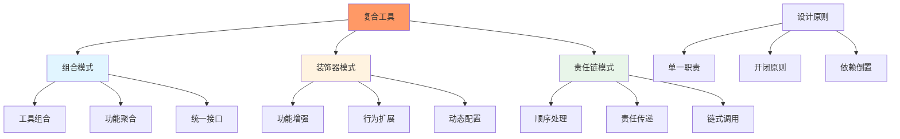
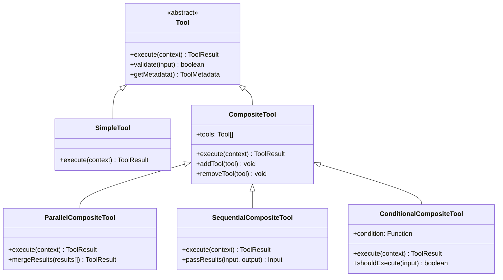
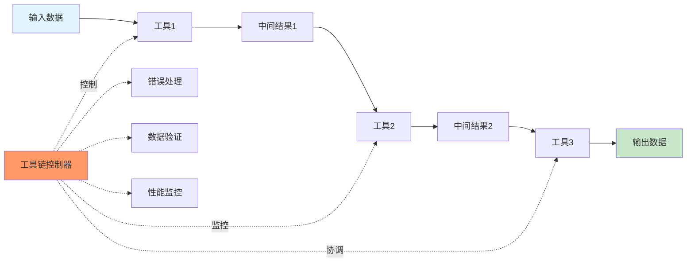
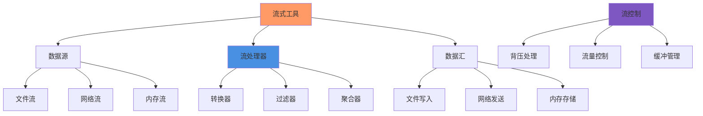
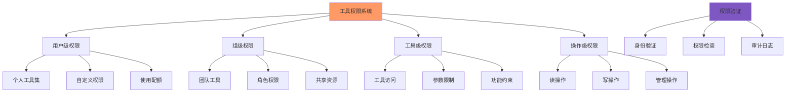
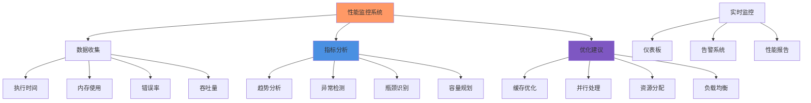
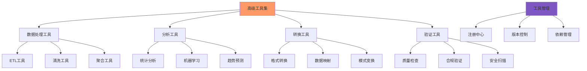

# 第10章：工具系统高级主题

## 学习目标

通过本章学习，您将：
- 掌握复合工具的设计模式和实现原理
- 学习工具链和工具管道的构建方法
- 理解流式工具的实现机制
- 掌握工具权限的细粒度控制
- 学习工具性能监控和优化技巧
- 能够构建高级工具集和工具生态系统

## 10.1 复合工具设计模式

### 复合工具概念架构



### 复合工具类型层次



### 复合工具基础实现

```typescript
/**
 * 复合工具基础类
 */
abstract class CompositeTool implements Tool {
  protected tools: Map<string, Tool>;
  protected executionStrategy: ExecutionStrategy;
  
  constructor(
    protected id: string,
    protected metadata: ToolMetadata,
    config: CompositeToolConfig = {}
  ) {
    this.tools = new Map();
    this.executionStrategy = config.strategy || ExecutionStrategy.SEQUENTIAL;
  }
  
  /**
   * 添加子工具
   */
  addTool(tool: Tool, alias?: string): void {
    const toolId = alias || tool.getId();
    this.tools.set(toolId, tool);
  }
  
  /**
   * 移除子工具
   */
  removeTool(toolId: string): boolean {
    return this.tools.delete(toolId);
  }
  
  /**
   * 获取子工具
   */
  getTool(toolId: string): Tool | undefined {
    return this.tools.get(toolId);
  }
  
  /**
   * 获取所有工具
   */
  getTools(): Tool[] {
    return Array.from(this.tools.values());
  }
  
  /**
   * 执行工具
   */
  async execute(context: ToolExecutionContext): Promise<ToolResult> {
    
    switch (this.executionStrategy) {
      case ExecutionStrategy.SEQUENTIAL:
        return this.executeSequential(context);
      
      case ExecutionStrategy.PARALLEL:
        return this.executeParallel(context);
      
      case ExecutionStrategy.CONDITIONAL:
        return this.executeConditional(context);
      
      case ExecutionStrategy.PIPELINE:
        return this.executePipeline(context);
      
      default:
        throw new Error(`Unknown execution strategy: ${this.executionStrategy}`);
    }
  }
  
  /**
   * 顺序执行
   */
  protected async executeSequential(
    context: ToolExecutionContext
  ): Promise<ToolResult> {
    
    const results: ToolResult[] = [];
    let currentInput = context.input;
    
    for (const [toolId, tool] of this.tools) {
      const toolContext: ToolExecutionContext = {
        ...context,
        input: currentInput,
        metadata: {
          ...context.metadata,
          parentTool: this.id,
          currentTool: toolId
        }
      };
      
      const result = await tool.execute(toolContext);
      results.push(result);
      
      if (!result.success) {
        return this.createFailureResult(results, result);
      }
      
      currentInput = this.passInput(currentInput, result);
    }
    
    return this.mergeResults(results);
  }
  
  /**
   * 并行执行
   */
  protected async executeParallel(
    context: ToolExecutionContext
  ): Promise<ToolResult> {
    
    const promises = Array.from(this.tools.entries()).map(
      async ([toolId, tool]) => {
        const toolContext: ToolExecutionContext = {
          ...context,
          metadata: {
            ...context.metadata,
            parentTool: this.id,
            currentTool: toolId
          }
        };
        
        return tool.execute(toolContext);
      }
    );
    
    const results = await Promise.all(promises);
    
    return this.mergeResults(results);
  }
  
  /**
   * 条件执行
   */
  protected async executeConditional(
    context: ToolExecutionContext
  ): Promise<ToolResult> {
    
    for (const [toolId, tool] of this.tools) {
      if (await this.shouldExecute(toolId, context)) {
        const result = await tool.execute(context);
        
        if (!result.success) {
          return result;
        }
        
        return result;
      }
    }
    
    return {
      success: false,
      error: new Error('No tool condition was met')
    };
  }
  
  /**
   * 管道执行
   */
  protected async executePipeline(
    context: ToolExecutionContext
  ): Promise<ToolResult> {
    
    let data = context.input;
    const pipelineResults: ToolResult[] = [];
    
    for (const [toolId, tool] of this.tools) {
      const result = await tool.execute({
        ...context,
        input: data,
        metadata: {
          ...context.metadata,
          parentTool: this.id,
          currentTool: toolId,
          pipelineStage: Array.from(this.tools.keys()).indexOf(toolId)
        }
      });
      
      pipelineResults.push(result);
      
      if (!result.success) {
        return this.createPipelineFailureResult(pipelineResults, result);
      }
      
      data = this.extractPipelineData(result);
    }
    
    return {
      success: true,
      data,
      metadata: {
        pipelineResults,
        stagesExecuted: pipelineResults.length
      }
    };
  }
  
  /**
   * 判断是否应该执行工具
   */
  protected async shouldExecute(
    toolId: string,
    context: ToolExecutionContext
  ): Promise<boolean> {
    // 子类可以实现具体的条件逻辑
    return true;
  }
  
  /**
   * 合并结果
   */
  protected mergeResults(results: ToolResult[]): ToolResult {
    
    const allSuccessful = results.every(r => r.success);
    
    if (!allSuccessful) {
      const failures = results.filter(r => !r.success);
      return {
        success: false,
        error: new Error(`Some tools failed: ${failures.map(f => f.error?.message).join(', ')}`),
        metadata: { failures }
      };
    }
    
    return {
      success: true,
      data: this.aggregateData(results),
      metadata: {
        toolResults: results,
        toolsExecuted: results.length
      }
    };
  }
  
  /**
   * 创建失败结果
   */
  protected createFailureResult(
    results: ToolResult[],
    failure: ToolResult
  ): ToolResult {
    
    return {
      success: false,
      error: failure.error,
      metadata: {
        partialResults: results,
        failedAt: results.length
      }
    };
  }
  
  /**
   * 创建管道失败结果
   */
  protected createPipelineFailureResult(
    results: ToolResult[],
    failure: ToolResult
  ): ToolResult {
    
    return {
      success: false,
      error: new Error(`Pipeline failed at stage ${results.length}: ${failure.error?.message}`),
      metadata: {
        pipelineResults: results,
        failedStage: results.length
      }
    };
  }
  
  /**
   * 传递输入到下一个工具
   */
  protected passInput(previousInput: unknown, result: ToolResult): unknown {
    // 默认传递上一个工具的输出
    return result.data;
  }
  
  /**
   * 提取管道数据
   */
  protected extractPipelineData(result: ToolResult): unknown {
    return result.data;
  }
  
  /**
   * 聚合数据
   */
  protected aggregateData(results: ToolResult[]): unknown {
    // 默认聚合所有工具的数据
    return {
      items: results.map(r => r.data)
    };
  }
  
  /**
   * 验证输入
   */
  validate(input: unknown): boolean {
    // 基础验证逻辑
    return input !== undefined && input !== null;
  }
  
  /**
   * 获取元数据
   */
  getMetadata(): ToolMetadata {
    return this.metadata;
  }
  
  /**
   * 获取工具ID
   */
  getId(): string {
    return this.id;
  }
}

/**
 * 执行策略枚举
 */
enum ExecutionStrategy {
  SEQUENTIAL = 'sequential',     // 顺序执行
  PARALLEL = 'parallel',        // 并行执行
  CONDITIONAL = 'conditional',   // 条件执行
  PIPELINE = 'pipeline'        // 管道执行
}

/**
 * 复合工具配置
 */
interface CompositeToolConfig {
  strategy?: ExecutionStrategy;
  timeout?: number;
  retryPolicy?: RetryPolicy;
}

/**
 * 重试策略
 */
interface RetryPolicy {
  maxAttempts: number;
  backoffMs: number;
  retryableErrors: string[];
}

/**
 * 工具执行上下文
 */
interface ToolExecutionContext {
  input: unknown;
  metadata: {
    parentTool?: string;
    currentTool?: string;
    pipelineStage?: number;
    [key: string]: unknown;
  };
  config?: Record<string, unknown>;
}

/**
 * 工具结果
 */
interface ToolResult {
  success: boolean;
  data?: unknown;
  error?: Error;
  metadata?: {
    [key: string]: unknown;
  };
}

/**
 * 工具元数据
 */
interface ToolMetadata {
  name: string;
  description: string;
  version: string;
  author: string;
  capabilities: string[];
  dependencies?: string[];
  parameters?: ToolParameter[];
}

/**
 * 工具参数
 */
interface ToolParameter {
  name: string;
  type: string;
  required: boolean;
  description: string;
  default?: unknown;
}

/**
 * 基础工具接口
 */
interface Tool {
  execute(context: ToolExecutionContext): Promise<ToolResult>;
  validate(input: unknown): boolean;
  getMetadata(): ToolMetadata;
  getId(): string;
}
```

## 10.2 工具链和工具管道

### 工具链架构



### 工具链实现

```typescript
/**
 * 工具链实现
 */
class ToolChain {
  private tools: ToolLink[];
  private validators: DataValidator[];
  private errorHandlers: ErrorHandler[];
  private performanceMonitor: PerformanceMonitor;
  
  constructor(config: ToolChainConfig) {
    this.tools = [];
    this.validators = config.validators || [];
    this.errorHandlers = config.errorHandlers || [];
    this.performanceMonitor = new PerformanceMonitor();
  }
  
  /**
   * 添加工具到链中
   */
  addTool(tool: Tool, config: ToolLinkConfig = {}): void {
    
    const link: ToolLink = {
      tool,
      config: {
        timeout: config.timeout || 30000,
        retryPolicy: config.retryPolicy,
        condition: config.condition,
        transformer: config.transformer
      }
    };
    
    this.tools.push(link);
  }
  
  /**
   * 执行工具链
   */
  async execute(input: unknown): Promise<ToolChainResult> {
    
    const startTime = Date.now();
    const chainContext = this.createChainContext();
    
    try {
      // 1. 验证输入
      await this.validateInput(input);
      
      // 2. 执行工具链
      let currentData = input;
      const linkResults: ToolLinkResult[] = [];
      
      for (let i = 0; i < this.tools.length; i++) {
        const link = this.tools[i];
        
        // 检查执行条件
        if (link.config.condition && !link.config.condition(currentData, chainContext)) {
          continue;
        }
        
        // 执行工具
        const linkResult = await this.executeLink(link, currentData, chainContext);
        linkResults.push(linkResult);
        
        if (!linkResult.success) {
          return this.handleChainFailure(input, linkResults, linkResult.error);
        }
        
        // 转换数据
        currentData = this.transformData(
          currentData,
          linkResult.data,
          link.config.transformer
        );
        
        // 更新链上下文
        chainContext.completedLinks++;
        chainContext.lastOutput = currentData;
      }
      
      // 3. 验证输出
      await this.validateOutput(currentData);
      
      // 4. 返回结果
      return {
        success: true,
        input,
        output: currentData,
        linkResults,
        metrics: {
          executionTime: Date.now() - startTime,
          linksExecuted: linkResults.length,
          dataTransformations: this.countTransformations(this.tools)
        }
      };
      
    } catch (error) {
      return this.handleChainError(input, chainContext, error);
    }
  }
  
  /**
   * 执行单个工具链接
   */
  private async executeLink(
    link: ToolLink,
    input: unknown,
    context: ToolChainContext
  ): Promise<ToolLinkResult> {
    
    const startTime = Date.now();
    
    try {
      // 执行工具
      const result = await this.executeWithRetry(
        link.tool,
        input,
        link.config
      );
      
      // 记录性能指标
      const executionTime = Date.now() - startTime;
      this.performanceMonitor.recordExecution(
        link.tool.getId(),
        executionTime,
        result.success
      );
      
      return {
        success: result.success,
        toolId: link.tool.getId(),
        data: result.data,
        error: result.error,
        metrics: {
          executionTime,
          retryCount: 0,
          dataSize: this.calculateDataSize(result.data)
        }
      };
      
    } catch (error) {
      return {
        success: false,
        toolId: link.tool.getId(),
        error: error as Error,
        metrics: {
          executionTime: Date.now() - startTime,
          retryCount: 0,
          dataSize: 0
        }
      };
    }
  }
  
  /**
   * 执行工具并重试
   */
  private async executeWithRetry(
    tool: Tool,
    input: unknown,
    config: ToolLinkConfig
  ): Promise<ToolResult> {
    
    const retryPolicy = config.retryPolicy || {
      maxAttempts: 1,
      backoffMs: 0,
      retryableErrors: []
    };
    
    let lastError: Error | undefined;
    
    for (let attempt = 1; attempt <= retryPolicy.maxAttempts; attempt++) {
      try {
        return await tool.execute({
          input,
          metadata: {
            attempt,
            maxAttempts: retryPolicy.maxAttempts
          }
        });
        
      } catch (error) {
        lastError = error as Error;
        
        if (attempt < retryPolicy.maxAttempts && this.isRetryable(error, retryPolicy)) {
          await this.backoff(retryPolicy.backoffMs, attempt);
        } else {
          break;
        }
      }
    }
    
    return {
      success: false,
      error: lastError
    };
  }
  
  /**
   * 判断错误是否可重试
   */
  private isRetryable(
    error: unknown,
    retryPolicy: RetryPolicy
  ): boolean {
    
    if (retryPolicy.retryableErrors.length === 0) {
      return true;
    }
    
    const errorMessage = error instanceof Error ? error.message : String(error);
    return retryPolicy.retryableErrors.some(pattern => 
      errorMessage.includes(pattern)
    );
  }
  
  /**
   * 退避等待
   */
  private async backoff(baseMs: number, attempt: number): Promise<void> {
    const delay = baseMs * Math.pow(2, attempt - 1);
    await new Promise(resolve => setTimeout(resolve, delay));
  }
  
  /**
   * 转换数据
   */
  private transformData(
    input: unknown,
    output: unknown,
    transformer?: DataTransformer
  ): unknown {
    
    if (!transformer) {
      return output;
    }
    
    try {
      return transformer(input, output);
    } catch (error) {
      console.error('Data transformation error:', error);
      return output;
    }
  }
  
  /**
   * 验证输入
   */
  private async validateInput(input: unknown): Promise<void> {
    
    for (const validator of this.validators) {
      const result = await validator.validate(input);
      if (!result.valid) {
        throw new Error(`Input validation failed: ${result.error}`);
      }
    }
  }
  
  /**
   * 验证输出
   */
  private async validateOutput(output: unknown): Promise<void> {
    
    for (const validator of this.validators) {
      const result = await validator.validate(output);
      if (!result.valid) {
        throw new Error(`Output validation failed: ${result.error}`);
      }
    }
  }
  
  /**
   * 处理链失败
   */
  private handleChainFailure(
    input: unknown,
    linkResults: ToolLinkResult[],
    error?: Error
  ): ToolChainResult {
    
    return {
      success: false,
      input,
      output: null,
      linkResults,
      error: error || new Error('Tool chain execution failed'),
      metrics: {
        executionTime: 0,
        linksExecuted: linkResults.length,
        failedAtLink: linkResults.length
      }
    };
  }
  
  /**
   * 处理链错误
   */
  private handleChainError(
    input: unknown,
    context: ToolChainContext,
    error: unknown
  ): ToolChainResult {
    
    // 尝试错误处理器
    for (const handler of this.errorHandlers) {
      try {
        const handled = await handler.handle(error, input, context);
        if (handled) {
          return handled;
        }
      } catch (handlerError) {
        console.error('Error handler failed:', handlerError);
      }
    }
    
    return {
      success: false,
      input,
      output: null,
      linkResults: [],
      error: error as Error,
      metrics: {
        executionTime: 0,
        linksExecuted: 0,
        error: 'Unhandled exception'
      }
    };
  }
  
  /**
   * 创建链上下文
   */
  private createChainContext(): ToolChainContext {
    
    return {
      chainId: this.generateChainId(),
      startTime: Date.now(),
      completedLinks: 0,
      totalLinks: this.tools.length,
      metadata: {}
    };
  }
  
  /**
   * 计算数据大小
   */
  private calculateDataSize(data: unknown): number {
    
    if (typeof data === 'string') {
      return data.length;
    }
    
    if (data && typeof data === 'object') {
      return JSON.stringify(data).length;
    }
    
    return 0;
  }
  
  /**
   * 计算转换数量
   */
  private countTransformations(tools: ToolLink[]): number {
    
    return tools.filter(link => link.config.transformer).length;
  }
  
  /**
   * 生成链ID
   */
  private generateChainId(): string {
    return `chain_${Date.now()}_${crypto.randomUUID()}`;
  }
  
  /**
   * 获取性能指标
   */
  getPerformanceMetrics(): PerformanceMetrics {
    return this.performanceMonitor.getMetrics();
  }
}

/**
 * 工具链接
 */
interface ToolLink {
  tool: Tool;
  config: ToolLinkConfig;
}

/**
 * 工具链接配置
 */
interface ToolLinkConfig {
  timeout?: number;
  retryPolicy?: RetryPolicy;
  condition?: (input: unknown, context: ToolChainContext) => boolean;
  transformer?: DataTransformer;
}

/**
 * 数据转换器
 */
type DataTransformer = (input: unknown, output: unknown) => unknown;

/**
 * 工具链配置
 */
interface ToolChainConfig {
  validators?: DataValidator[];
  errorHandlers?: ErrorHandler[];
  enableMonitoring?: boolean;
}

/**
 * 工具链上下文
 */
interface ToolChainContext {
  chainId: string;
  startTime: number;
  completedLinks: number;
  totalLinks: number;
  lastOutput?: unknown;
  metadata: Record<string, unknown>;
}

/**
 * 工具链结果
 */
interface ToolChainResult {
  success: boolean;
  input: unknown;
  output: unknown;
  linkResults: ToolLinkResult[];
  error?: Error;
  metrics: {
    executionTime: number;
    linksExecuted: number;
    failedAtLink?: number;
    dataTransformations?: number;
    error?: string;
  };
}

/**
 * 工具链接结果
 */
interface ToolLinkResult {
  success: boolean;
  toolId: string;
  data?: unknown;
  error?: Error;
  metrics: {
    executionTime: number;
    retryCount: number;
    dataSize: number;
  };
}

/**
 * 数据验证器
 */
interface DataValidator {
  validate(data: unknown): Promise<ValidationResult>;
}

/**
 * 验证结果
 */
interface ValidationResult {
  valid: boolean;
  error?: string;
}

/**
 * 错误处理器
 */
interface ErrorHandler {
  handle(
    error: unknown,
    input: unknown,
    context: ToolChainContext
  ): Promise<ToolChainResult | null>;
}

/**
 * 性能监控器
 */
class PerformanceMonitor {
  private executions: Map<string, ExecutionRecord[]>;
  
  constructor() {
    this.executions = new Map();
  }
  
  recordExecution(toolId: string, executionTime: number, success: boolean): void {
    
    const records = this.executions.get(toolId) || [];
    records.push({
      executionTime,
      success,
      timestamp: Date.now()
    });
    
    this.executions.set(toolId, records);
  }
  
  getMetrics(): PerformanceMetrics {
    
    const toolMetrics: Record<string, ToolMetrics> = {};
    
    for (const [toolId, records] of this.executions) {
      const successfulRecords = records.filter(r => r.success);
      const totalRecords = records.length;
      
      toolMetrics[toolId] = {
        totalExecutions: totalRecords,
        successfulExecutions: successfulRecords.length,
        failedExecutions: totalRecords - successfulRecords.length,
        averageExecutionTime: successfulRecords.length > 0
          ? successfulRecords.reduce((sum, r) => sum + r.executionTime, 0) / successfulRecords.length
          : 0,
        lastExecution: records[records.length - 1]
      };
    }
    
    return {
      toolMetrics,
      overallMetrics: this.calculateOverallMetrics()
    };
  }
  
  private calculateOverallMetrics() {
    const allRecords = Array.from(this.executions.values()).flat();
    const successfulRecords = allRecords.filter(r => r.success);
    
    return {
      totalExecutions: allRecords.length,
      successfulExecutions: successfulRecords.length,
      averageExecutionTime: successfulRecords.length > 0
        ? successfulRecords.reduce((sum, r) => sum + r.executionTime, 0) / successfulRecords.length
        : 0
    };
  }
}

/**
 * 执行记录
 */
interface ExecutionRecord {
  executionTime: number;
  success: boolean;
  timestamp: number;
}

/**
 * 性能指标
 */
interface PerformanceMetrics {
  toolMetrics: Record<string, ToolMetrics>;
  overallMetrics: {
    totalExecutions: number;
    successfulExecutions: number;
    averageExecutionTime: number;
  };
}

/**
 * 工具指标
 */
interface ToolMetrics {
  totalExecutions: number;
  successfulExecutions: number;
  failedExecutions: number;
  averageExecutionTime: number;
  lastExecution: ExecutionRecord;
}
```

## 10.3 流式工具实现

### 流式工具架构



### 流式工具实现

```typescript
/**
 * 流式工具实现
 */
class StreamingTool implements Tool {
  private processors: StreamProcessor[];
  private bufferManager: BufferManager;
  private backpressureHandler: BackpressureHandler;
  
  constructor(
    private id: string,
    private metadata: ToolMetadata,
    config: StreamingToolConfig = {}
  ) {
    this.processors = config.processors || [];
    this.bufferManager = new BufferManager(config.bufferConfig);
    this.backpressureHandler = new BackpressureHandler(config.backpressureConfig);
  }
  
  /**
   * 执行流式处理
   */
  async execute(context: ToolExecutionContext): Promise<ToolResult> {
    
    const inputStream = context.input as ReadableStream;
    const outputStream = new TransformStream();
    
    try {
      // 1. 创建处理管道
      const pipeline = this.createPipeline();
      
      // 2. 设置背压处理
      await this.setupBackpressure(inputStream, pipeline);
      
      // 3. 处理流
      const result = await this.processStream(inputStream, pipeline);
      
      return {
        success: true,
        data: result,
        metadata: {
          streamMetrics: this.getStreamMetrics(),
          bufferUsage: this.bufferManager.getUsage()
        }
      };
      
    } catch (error) {
      return {
        success: false,
        error: error as Error,
        metadata: {
          streamMetrics: this.getStreamMetrics(),
          errorDetails: error instanceof Error ? error.message : String(error)
        }
      };
    }
  }
  
  /**
   * 创建处理管道
   */
  private createPipeline(): StreamPipeline {
    
    const pipeline = new StreamPipeline();
    
    // 添加处理器
    for (const processor of this.processors) {
      pipeline.addProcessor(processor);
    }
    
    return pipeline;
  }
  
  /**
   * 设置背压处理
   */
  private async setupBackpressure(
    inputStream: ReadableStream,
    pipeline: StreamPipeline
  ): Promise<void> {
    
    // 监控流速度
    const reader = inputStream.getReader();
    let processedBytes = 0;
    
    while (true) {
      const { done, value } = await reader.read();
      
      if (done) break;
      
      processedBytes += value.length;
      
      // 检查背压
      if (this.backpressureHandler.shouldThrottle(processedBytes)) {
        await this.backpressureHandler.throttle();
      }
      
      // 处理数据
      await pipeline.process(value);
    }
  }
  
  /**
   * 处理流
   */
  private async processStream(
    inputStream: ReadableStream,
    pipeline: StreamPipeline
  ): Promise<StreamResult> {
    
    const reader = inputStream.getReader();
    const chunks: Uint8Array[] = [];
    let totalBytes = 0;
    let processingStartTime = Date.now();
    
    try {
      while (true) {
        const { done, value } = await reader.read();
        
        if (done) break;
        
        // 处理数据块
        const processed = await pipeline.process(value);
        chunks.push(processed);
        totalBytes += processed.length;
        
        // 更新缓冲区
        this.bufferManager.update(totalBytes);
      }
      
      // 合并所有块
      const combined = this.combineChunks(chunks);
      
      return {
        data: combined,
        bytesProcessed: totalBytes,
        processingTime: Date.now() - processingStartTime,
        metrics: {
          chunksProcessed: chunks.length,
          averageChunkSize: totalBytes / chunks.length,
          peakMemoryUsage: this.bufferManager.getPeakUsage()
        }
      };
      
    } finally {
      reader.releaseLock();
    }
  }
  
  /**
   * 合并数据块
   */
  private combineChunks(chunks: Uint8Array[]): Uint8Array {
    
    const totalLength = chunks.reduce((sum, chunk) => sum + chunk.length, 0);
    const combined = new Uint8Array(totalLength);
    
    let offset = 0;
    for (const chunk of chunks) {
      combined.set(chunk, offset);
      offset += chunk.length;
    }
    
    return combined;
  }
  
  /**
   * 添加流处理器
   */
  addProcessor(processor: StreamProcessor): void {
    this.processors.push(processor);
  }
  
  /**
   * 获取流指标
   */
  private getStreamMetrics(): StreamMetrics {
    return {
      totalBytesProcessed: this.bufferManager.getTotalBytesProcessed(),
      currentBufferSize: this.bufferManager.getCurrentSize(),
      processingRate: this.backpressureHandler.getProcessingRate(),
      backpressureEvents: this.backpressureHandler.getBackpressureCount()
    };
  }
  
  /**
   * 验证输入
   */
  validate(input: unknown): boolean {
    return input instanceof ReadableStream;
  }
  
  /**
   * 获取元数据
   */
  getMetadata(): ToolMetadata {
    return this.metadata;
  }
  
  /**
   * 获取工具ID
   */
  getId(): string {
    return this.id;
  }
}

/**
 * 流处理管道
 */
class StreamPipeline {
  private processors: StreamProcessor[];
  
  constructor() {
    this.processors = [];
  }
  
  /**
   * 添加处理器
   */
  addProcessor(processor: StreamProcessor): void {
    this.processors.push(processor);
  }
  
  /**
   * 处理数据
   */
  async process(data: Uint8Array): Promise<Uint8Array> {
    
    let currentData = data;
    
    for (const processor of this.processors) {
      currentData = await processor.process(currentData);
    }
    
    return currentData;
  }
}

/**
 * 流处理器接口
 */
interface StreamProcessor {
  process(data: Uint8Array): Promise<Uint8Array>;
}

/**
 * 缓冲管理器
 */
class BufferManager {
  private currentSize: number;
  private peakUsage: number;
  private totalBytesProcessed: number;
  
  constructor(config: BufferConfig = {}) {
    this.currentSize = 0;
    this.peakUsage = 0;
    this.totalBytesProcessed = 0;
  }
  
  /**
   * 更新缓冲区大小
   */
  update(size: number): void {
    this.currentSize = size;
    this.peakUsage = Math.max(this.peakUsage, size);
    this.totalBytesProcessed = size;
  }
  
  /**
   * 获取当前大小
   */
  getCurrentSize(): number {
    return this.currentSize;
  }
  
  /**
   * 获取峰值使用量
   */
  getPeakUsage(): number {
    return this.peakUsage;
  }
  
  /**
   * 获取使用率
   */
  getUsage(): number {
    return this.currentSize;
  }
  
  /**
   * 获取总处理字节数
   */
  getTotalBytesProcessed(): number {
    return this.totalBytesProcessed;
  }
}

/**
 * 背压处理器
 */
class BackpressureHandler {
  private processingRate: number;
  private backpressureCount: number;
  private thresholdBytes: number;
  
  constructor(config: BackpressureConfig = {}) {
    this.processingRate = 1000; // bytes per second
    this.backpressureCount = 0;
    this.thresholdBytes = config.thresholdBytes || 1024 * 1024; // 1MB
  }
  
  /**
   * 判断是否需要限流
   */
  shouldThrottle(processedBytes: number): boolean {
    return processedBytes > this.thresholdBytes;
  }
  
  /**
   * 执行限流
   */
  async throttle(): Promise<void> {
    this.backpressureCount++;
    const delay = Math.ceil(1000 / this.processingRate);
    await new Promise(resolve => setTimeout(resolve, delay));
  }
  
  /**
   * 获取处理速率
   */
  getProcessingRate(): number {
    return this.processingRate;
  }
  
  /**
   * 获取背压事件数量
   */
  getBackpressureCount(): number {
    return this.backpressureCount;
  }
}

/**
 * 流式工具配置
 */
interface StreamingToolConfig {
  processors?: StreamProcessor[];
  bufferConfig?: BufferConfig;
  backpressureConfig?: BackpressureConfig;
}

/**
 * 缓冲配置
 */
interface BufferConfig {
  maxSize?: number;
  initialSize?: number;
  growthFactor?: number;
}

/**
 * 背压配置
 */
interface BackpressureConfig {
  thresholdBytes?: number;
  maxDelay?: number;
  adaptiveRate?: boolean;
}

/**
 * 流结果
 */
interface StreamResult {
  data: Uint8Array;
  bytesProcessed: number;
  processingTime: number;
  metrics: {
    chunksProcessed: number;
    averageChunkSize: number;
    peakMemoryUsage: number;
  };
}

/**
 * 流指标
 */
interface StreamMetrics {
  totalBytesProcessed: number;
  currentBufferSize: number;
  processingRate: number;
  backpressureEvents: number;
}
```

## 10.4 工具权限细粒度控制

### 权限控制层次



### 权限控制系统实现

```typescript
/**
 * 工具权限控制系统
 */
class ToolPermissionSystem {
  private permissions: PermissionStorage;
  private validators: PermissionValidator[];
  private auditLogger: AuditLogger;
  
  constructor(config: PermissionSystemConfig) {
    this.permissions = new PermissionStorage(config.storageBackend);
    this.validators = config.validators || [];
    this.auditLogger = new AuditLogger(config.auditConfig);
  }
  
  /**
   * 检查工具使用权限
   */
  async checkPermission(
    user: User,
    tool: Tool,
    operation: ToolOperation,
    context: PermissionContext = {}
  ): Promise<PermissionResult> {
    
    const startTime = Date.now();
    
    try {
      // 1. 身份验证
      const identityValid = await this.validateIdentity(user);
      if (!identityValid) {
        return this.createDenialResult('identity_validation_failed');
      }
      
      // 2. 权限检查
      const permission = await this.permissions.getPermission(user.id, tool.getId());
      if (!permission) {
        return this.createDenialResult('no_permission_found');
      }
      
      // 3. 操作权限检查
      if (!this.hasOperationPermission(permission, operation)) {
        return this.createDenialResult('operation_not_allowed');
      }
      
      // 4. 约束条件检查
      const constraints = await this.checkConstraints(permission, operation, context);
      if (!constraints.satisfied) {
        return this.createDenialResult('constraints_not_satisfied', constraints);
      }
      
      // 5. 额外验证器检查
      for (const validator of this.validators) {
        const result = await validator.validate(user, tool, operation, context);
        if (!result.allowed) {
          return this.createDenialResult('validator_failed', { validator: validator.name, reason: result.reason });
        }
      }
      
      // 6. 记录审计日志
      await this.auditLogger.logPermissionCheck({
        user,
        tool,
        operation,
        result: 'allowed',
        timestamp: new Date(),
        duration: Date.now() - startTime
      });
      
      return {
        allowed: true,
        permission,
        constraints,
        timestamp: Date.now()
      };
      
    } catch (error) {
      // 记录错误审计日志
      await this.auditLogger.logPermissionCheck({
        user,
        tool,
        operation,
        result: 'error',
        error: error instanceof Error ? error.message : String(error),
        timestamp: new Date(),
        duration: Date.now() - startTime
      });
      
      return this.createDenialResult('system_error', { error });
    }
  }
  
  /**
   * 授予权限
   */
  async grantPermission(
    granter: User,
    grantee: User,
    toolId: string,
    permissionSpec: PermissionSpec
  ): Promise<GrantResult> {
    
    // 1. 检查授予者权限
    const grantPermission = await this.checkPermission(
      granter,
      { getId: () => toolId } as Tool,
      'grant',
      { granteeId: grantee.id }
    );
    
    if (!grantPermission.allowed) {
      return {
        success: false,
        error: 'Insufficient permissions to grant'
      };
    }
    
    // 2. 创建权限
    const permission: Permission = {
      id: this.generatePermissionId(),
      userId: grantee.id,
      toolId,
      operations: permissionSpec.operations,
      constraints: permissionSpec.constraints || [],
      grantedBy: granter.id,
      grantedAt: Date.now(),
      expiresAt: permissionSpec.expiresAt,
      metadata: permissionSpec.metadata || {}
    };
    
    // 3. 保存权限
    await this.permissions.savePermission(permission);
    
    // 4. 记录审计日志
    await this.auditLogger.logGrant({
      granter,
      grantee,
      toolId,
      permission,
      timestamp: new Date()
    });
    
    return {
      success: true,
      permission
    };
  }
  
  /**
   * 撤销权限
   */
  async revokePermission(
    revoker: User,
    permissionId: string,
    reason?: string
  ): Promise<RevokeResult> {
    
    // 1. 获取权限
    const permission = await this.permissions.getPermissionById(permissionId);
    if (!permission) {
      return {
        success: false,
        error: 'Permission not found'
      };
    }
    
    // 2. 检查撤销权限
    const revokePermission = await this.checkPermission(
      revoker,
      { getId: () => permission.toolId } as Tool,
      'revoke',
      { permissionId }
    );
    
    if (!revokePermission.allowed) {
      return {
        success: false,
        error: 'Insufficient permissions to revoke'
      };
    }
    
    // 3. 撤销权限
    await this.permissions.revokePermission(permissionId);
    
    // 4. 记录审计日志
    await this.auditLogger.logRevoke({
      revoker,
      permission,
      reason,
      timestamp: new Date()
    });
    
    return {
      success: true,
      revokedPermission: permission
    };
  }
  
  /**
   * 获取用户权限
   */
  async getUserPermissions(userId: string): Promise<Permission[]> {
    return this.permissions.getUserPermissions(userId);
  }
  
  /**
   * 获取工具权限
   */
  async getToolPermissions(toolId: string): Promise<Permission[]> {
    return this.permissions.getToolPermissions(toolId);
  }
  
  /**
   * 验证身份
   */
  private async validateIdentity(user: User): Promise<boolean> {
    // 实现身份验证逻辑
    return user.id !== undefined && user.id !== null;
  }
  
  /**
   * 检查操作权限
   */
  private hasOperationPermission(
    permission: Permission,
    operation: ToolOperation
  ): boolean {
    return permission.operations.includes(operation);
  }
  
  /**
   * 检查约束条件
   */
  private async checkConstraints(
    permission: Permission,
    operation: ToolOperation,
    context: PermissionContext
  ): Promise<ConstraintCheckResult> {
    
    const constraints = permission.constraints.filter(c => 
      c.operations.includes(operation)
    );
    
    for (const constraint of constraints) {
      const result = await this.evaluateConstraint(constraint, context);
      if (!result.satisfied) {
        return {
          satisfied: false,
          violatingConstraint: constraint,
          reason: result.reason
        };
      }
    }
    
    return {
      satisfied: true
    };
  }
  
  /**
   * 评估约束条件
   */
  private async evaluateConstraint(
    constraint: PermissionConstraint,
    context: PermissionContext
  ): Promise<ConstraintEvaluationResult> {
    
    switch (constraint.type) {
      case 'time_range':
        return this.evaluateTimeRangeConstraint(constraint, context);
      
      case 'rate_limit':
        return this.evaluateRateLimitConstraint(constraint, context);
      
      case 'resource_quota':
        return this.evaluateResourceQuotaConstraint(constraint, context);
      
      case 'ip_range':
        return this.evaluateIpRangeConstraint(constraint, context);
      
      case 'custom':
        return constraint.evaluate ? constraint.evaluate(context) : { satisfied: true };
      
      default:
        return { satisfied: true };
    }
  }
  
  /**
   * 评估时间范围约束
   */
  private evaluateTimeRangeConstraint(
    constraint: PermissionConstraint,
    context: PermissionContext
  ): ConstraintEvaluationResult {
    
    const now = new Date();
    const currentTime = now.getHours() * 60 + now.getMinutes();
    
    if (constraint.startTime !== undefined && currentTime < constraint.startTime) {
      return {
        satisfied: false,
        reason: `Before allowed time range (starts at ${constraint.startTime})`
      };
    }
    
    if (constraint.endTime !== undefined && currentTime > constraint.endTime) {
      return {
        satisfied: false,
        reason: `After allowed time range (ends at ${constraint.endTime})`
      };
    }
    
    return { satisfied: true };
  }
  
  /**
   * 评估速率限制约束
   */
  private evaluateRateLimitConstraint(
    constraint: PermissionConstraint,
    context: PermissionContext
  ): ConstraintEvaluationResult {
    
    // 简化实现，实际需要跟踪使用情况
    return { satisfied: true };
  }
  
  /**
   * 评估资源配额约束
   */
  private evaluateResourceQuotaConstraint(
    constraint: PermissionConstraint,
    context: PermissionContext
  ): ConstraintEvaluationResult {
    
    // 简化实现，实际需要跟踪资源使用
    return { satisfied: true };
  }
  
  /**
   * 评估IP范围约束
   */
  private evaluateIpRangeConstraint(
    constraint: PermissionConstraint,
    context: PermissionContext
  ): ConstraintEvaluationResult {
    
    const clientIp = context.clientIp;
    if (!clientIp) {
      return {
        satisfied: false,
        reason: 'Client IP not available'
      };
    }
    
    // 简化实现，实际需要检查IP范围
    return { satisfied: true };
  }
  
  /**
   * 创建拒绝结果
   */
  private createDenialResult(
    reason: string,
    details?: Record<string, unknown>
  ): PermissionResult {
    return {
      allowed: false,
      reason,
      details,
      timestamp: Date.now()
    };
  }
  
  /**
   * 生成权限ID
   */
  private generatePermissionId(): string {
    return `perm_${Date.now()}_${crypto.randomUUID()}`;
  }
}

/**
 * 权限存储
 */
class PermissionStorage {
  private permissions: Map<string, Permission>;
  private userPermissions: Map<string, Set<string>>;
  private toolPermissions: Map<string, Set<string>>;
  
  constructor(backend: StorageBackend) {
    this.permissions = new Map();
    this.userPermissions = new Map();
    this.toolPermissions = new Map();
  }
  
  async getPermission(userId: string, toolId: string): Promise<Permission | null> {
    
    const userPerms = this.userPermissions.get(userId);
    if (!userPerms) return null;
    
    const toolPerms = this.toolPermissions.get(toolId);
    if (!toolPerms) return null;
    
    // 找到交集
    const intersection = Array.from(userPerms).filter(id => toolPerms.has(id));
    if (intersection.length === 0) return null;
    
    return this.permissions.get(intersection[0]) || null;
  }
  
  async savePermission(permission: Permission): Promise<void> {
    this.permissions.set(permission.id, permission);
    
    // 更新用户权限索引
    const userPerms = this.userPermissions.get(permission.userId) || new Set();
    userPerms.add(permission.id);
    this.userPermissions.set(permission.userId, userPerms);
    
    // 更新工具权限索引
    const toolPerms = this.toolPermissions.get(permission.toolId) || new Set();
    toolPerms.add(permission.id);
    this.toolPermissions.set(permission.toolId, toolPerms);
  }
  
  async revokePermission(permissionId: string): Promise<void> {
    const permission = this.permissions.get(permissionId);
    if (!permission) return;
    
    this.permissions.delete(permissionId);
    
    // 更新索引
    const userPerms = this.userPermissions.get(permission.userId);
    if (userPerms) {
      userPerms.delete(permissionId);
    }
    
    const toolPerms = this.toolPermissions.get(permission.toolId);
    if (toolPerms) {
      toolPerms.delete(permissionId);
    }
  }
  
  async getUserPermissions(userId: string): Promise<Permission[]> {
    
    const userPerms = this.userPermissions.get(userId);
    if (!userPerms) return [];
    
    return Array.from(userPerms)
      .map(id => this.permissions.get(id))
      .filter((p): p is Permission => p !== undefined);
  }
  
  async getToolPermissions(toolId: string): Promise<Permission[]> {
    
    const toolPerms = this.toolPermissions.get(toolId);
    if (!toolPerms) return [];
    
    return Array.from(toolPerms)
      .map(id => this.permissions.get(id))
      .filter((p): p is Permission => p !== undefined);
  }
  
  async getPermissionById(permissionId: string): Promise<Permission | undefined> {
    return this.permissions.get(permissionId);
  }
}

/**
 * 审计日志记录器
 */
class AuditLogger {
  private logs: AuditLog[];
  
  constructor(config: AuditConfig = {}) {
    this.logs = [];
  }
  
  async logPermissionCheck(event: PermissionCheckEvent): Promise<void> {
    this.logs.push({
      type: 'permission_check',
      ...event
    });
  }
  
  async logGrant(event: GrantEvent): Promise<void> {
    this.logs.push({
      type: 'permission_grant',
      ...event
    });
  }
  
  async logRevoke(event: RevokeEvent): Promise<void> {
    this.logs.push({
      type: 'permission_revoke',
      ...event
    });
  }
  
  getLogs(): AuditLog[] {
    return [...this.logs];
  }
}

// 类型定义
type ToolOperation = 'read' | 'write' | 'execute' | 'grant' | 'revoke' | 'admin';

interface PermissionSystemConfig {
  storageBackend: StorageBackend;
  validators?: PermissionValidator[];
  auditConfig?: AuditConfig;
}

interface StorageBackend {
  savePermission(permission: Permission): Promise<void>;
  getPermission(userId: string, toolId: string): Promise<Permission | null>;
  revokePermission(permissionId: string): Promise<void>;
}

interface AuditConfig {
  enableLogging?: boolean;
  retentionDays?: number;
}

interface PermissionResult {
  allowed: boolean;
  permission?: Permission;
  constraints?: ConstraintCheckResult;
  reason?: string;
  details?: Record<string, unknown>;
  timestamp: number;
}

interface ConstraintCheckResult {
  satisfied: boolean;
  violatingConstraint?: PermissionConstraint;
  reason?: string;
}

interface ConstraintEvaluationResult {
  satisfied: boolean;
  reason?: string;
}

interface PermissionContext {
  granteeId?: string;
  permissionId?: string;
  clientIp?: string;
  userAgent?: string;
  [key: string]: unknown;
}

interface User {
  id: string;
  name: string;
  roles: string[];
}

interface GrantResult {
  success: boolean;
  permission?: Permission;
  error?: string;
}

interface RevokeResult {
  success: boolean;
  revokedPermission?: Permission;
  error?: string;
}

interface PermissionSpec {
  operations: ToolOperation[];
  constraints?: PermissionConstraint[];
  expiresAt?: number;
  metadata?: Record<string, unknown>;
}

interface Permission {
  id: string;
  userId: string;
  toolId: string;
  operations: ToolOperation[];
  constraints: PermissionConstraint[];
  grantedBy: string;
  grantedAt: number;
  expiresAt?: number;
  metadata: Record<string, unknown>;
}

interface PermissionConstraint {
  type: 'time_range' | 'rate_limit' | 'resource_quota' | 'ip_range' | 'custom';
  operations: ToolOperation[];
  startTime?: number;
  endTime?: number;
  maxRequests?: number;
  maxQuota?: number;
  allowedIps?: string[];
  evaluate?: (context: PermissionContext) => ConstraintEvaluationResult;
}

interface PermissionValidator {
  name: string;
  validate(
    user: User,
    tool: Tool,
    operation: ToolOperation,
    context: PermissionContext
  ): Promise<{ allowed: boolean; reason?: string }>;
}

type AuditLog = PermissionCheckEvent | GrantEvent | RevokeEvent;

interface PermissionCheckEvent {
  type: 'permission_check';
  user: User;
  tool: Tool;
  operation: ToolOperation;
  result: 'allowed' | 'denied' | 'error';
  error?: string;
  timestamp: Date;
  duration: number;
}

interface GrantEvent {
  type: 'permission_grant';
  granter: User;
  grantee: User;
  toolId: string;
  permission: Permission;
  timestamp: Date;
}

interface RevokeEvent {
  type: 'permission_revoke';
  revoker: User;
  permission: Permission;
  reason?: string;
  timestamp: Date;
}
```

## 10.5 工具性能监控和优化

### 性能监控架构



### 性能监控系统实现

```typescript
/**
 * 工具性能监控系统
 */
class ToolPerformanceMonitor {
  private metrics: MetricsStorage;
  private analyzers: PerformanceAnalyzer[];
  private optimizers: PerformanceOptimizer[];
  private alertManager: AlertManager;
  
  constructor(config: MonitorConfig) {
    this.metrics = new MetricsStorage(config.retentionDays);
    this.analyzers = config.analyzers || [];
    this.optimizers = config.optimizers || [];
    this.alertManager = new AlertManager(config.alertConfig);
  }
  
  /**
   * 记录工具执行
   */
  async recordExecution(record: ExecutionRecord): Promise<void> {
    
    // 1. 存储原始指标
    await this.metrics.storeExecution(record);
    
    // 2. 更新实时指标
    await this.updateRealTimeMetrics(record);
    
    // 3. 检查告警条件
    await this.checkAlerts(record);
    
    // 4. 运行分析器
    for (const analyzer of this.analyzers) {
      await analyzer.analyze(record, this.metrics);
    }
  }
  
  /**
   * 获取工具性能指标
   */
  async getToolMetrics(
    toolId: string,
    timeRange?: TimeRange
  ): Promise<ToolPerformanceMetrics> {
    
    const records = await this.metrics.getToolRecords(toolId, timeRange);
    
    return this.calculateMetrics(records);
  }
  
  /**
   * 获取系统性能概览
   */
  async getSystemOverview(timeRange?: TimeRange): Promise<SystemPerformanceOverview> {
    
    const allRecords = await this.metrics.getAllRecords(timeRange);
    
    return {
      totalExecutions: allRecords.length,
      successRate: this.calculateSuccessRate(allRecords),
      averageExecutionTime: this.calculateAverageExecutionTime(allRecords),
      toolBreakdown: this.getToolBreakdown(allRecords),
      timeSeriesData: this.generateTimeSeriesData(allRecords),
      performanceTrends: await this.analyzeTrends(allRecords)
    };
  }
  
  /**
   * 识别性能瓶颈
   */
  async identifyBottlenecks(): Promise<BottleneckReport[]> {
    
    const reports: BottleneckReport[] = [];
    
    for (const analyzer of this.analyzers) {
      const bottlenecks = await analyzer.identifyBottlenecks(this.metrics);
      reports.push(...bottlenecks);
    }
    
    return reports.sort((a, b) => b.impact - a.impact);
  }
  
  /**
   * 生成优化建议
   */
  async generateOptimizationSuggestions(): Promise<OptimizationSuggestion[]> {
    
    const suggestions: OptimizationSuggestion[] = [];
    
    // 1. 分析性能瓶颈
    const bottlenecks = await this.identifyBottlenecks();
    
    // 2. 为每个瓶颈生成建议
    for (const bottleneck of bottlenecks) {
      const optimizer = this.findOptimizerForBottleneck(bottleneck);
      if (optimizer) {
        const suggestion = await optimizer.generateSuggestion(bottleneck);
        suggestions.push(suggestion);
      }
    }
    
    // 3. 排序建议
    return suggestions.sort((a, b) => b.priority - a.priority);
  }
  
  /**
   * 应用优化建议
   */
  async applyOptimization(
    suggestion: OptimizationSuggestion
  ): Promise<OptimizationResult> {
    
    const optimizer = this.findOptimizerForSuggestion(suggestion);
    if (!optimizer) {
      return {
        success: false,
        error: 'No suitable optimizer found'
      };
    }
    
    try {
      const result = await optimizer.apply(suggestion);
      
      // 记录优化结果
      await this.metrics.storeOptimization({
        suggestion,
        result,
        appliedAt: Date.now()
      });
      
      return result;
      
    } catch (error) {
      return {
        success: false,
        error: error instanceof Error ? error.message : String(error)
      };
    }
  }
  
  /**
   * 更新实时指标
   */
  private async updateRealTimeMetrics(record: ExecutionRecord): Promise<void> {
    
    const toolId = record.toolId;
    const now = Date.now();
    
    // 更新工具实时统计
    const currentStats = await this.metrics.getRealTimeStats(toolId);
    
    const updatedStats: RealTimeStats = {
      executionCount: (currentStats?.executionCount || 0) + 1,
      successCount: (currentStats?.successCount || 0) + (record.success ? 1 : 0),
      totalExecutionTime: (currentStats?.totalExecutionTime || 0) + record.executionTime,
      lastExecutionTime: record.executionTime,
      lastExecutionTimestamp: now,
      averageExecutionTime: 0, // 会在下面计算
      errorRate: 0 // 会在下面计算
    };
    
    // 计算平均值和错误率
    updatedStats.averageExecutionTime = 
      updatedStats.totalExecutionTime / updatedStats.executionCount;
    updatedStats.errorRate = 
      1 - (updatedStats.successCount / updatedStats.executionCount);
    
    await this.metrics.updateRealTimeStats(toolId, updatedStats);
  }
  
  /**
   * 检查告警
   */
  private async checkAlerts(record: ExecutionRecord): Promise<void> {
    
    const alerts = await this.alertManager.checkRecord(record);
    
    for (const alert of alerts) {
      await this.alertManager.triggerAlert(alert);
    }
  }
  
  /**
   * 计算指标
   */
  private calculateMetrics(records: ExecutionRecord[]): ToolPerformanceMetrics {
    
    if (records.length === 0) {
      return this.getEmptyMetrics();
    }
    
    const successfulRecords = records.filter(r => r.success);
    const failedRecords = records.filter(r => !r.success);
    
    return {
      executionCount: records.length,
      successCount: successfulRecords.length,
      failureCount: failedRecords.length,
      successRate: successfulRecords.length / records.length,
      averageExecutionTime: this.calculateAverage(successfulRecords.map(r => r.executionTime)),
      minExecutionTime: Math.min(...successfulRecords.map(r => r.executionTime)),
      maxExecutionTime: Math.max(...successfulRecords.map(r => r.executionTime)),
      percentiles: this.calculatePercentiles(successfulRecords.map(r => r.executionTime)),
      errorTypes: this.groupErrorsByType(failedRecords),
      timeSeries: this.generateTimeSeries(records)
    };
  }
  
  /**
   * 计算成功率
   */
  private calculateSuccessRate(records: ExecutionRecord[]): number {
    
    if (records.length === 0) return 0;
    
    const successful = records.filter(r => r.success).length;
    return successful / records.length;
  }
  
  /**
   * 计算平均执行时间
   */
  private calculateAverageExecutionTime(records: ExecutionRecord[]): number {
    
    const successfulRecords = records.filter(r => r.success);
    if (successfulRecords.length === 0) return 0;
    
    return this.calculateAverage(successfulRecords.map(r => r.executionTime));
  }
  
  /**
   * 计算平均值
   */
  private calculateAverage(values: number[]): number {
    
    if (values.length === 0) return 0;
    
    const sum = values.reduce((acc, val) => acc + val, 0);
    return sum / values.length;
  }
  
  /**
   * 计算百分位数
   */
  private calculatePercentiles(values: number[]): PercentileMetrics {
    
    const sorted = [...values].sort((a, b) => a - b);
    
    return {
      p50: this.getPercentile(sorted, 50),
      p90: this.getPercentile(sorted, 90),
      p95: this.getPercentile(sorted, 95),
      p99: this.getPercentile(sorted, 99)
    };
  }
  
  /**
   * 获取百分位数
   */
  private getPercentile(sortedValues: number[], percentile: number): number {
    
    const index = Math.ceil((percentile / 100) * sortedValues.length) - 1;
    return sortedValues[Math.max(0, index)];
  }
  
  /**
   * 按类型分组错误
   */
  private groupErrorsByType(records: ExecutionRecord[]): Record<string, number> {
    
    const errorTypes: Record<string, number> = {};
    
    for (const record of records) {
      if (record.error) {
        const errorType = record.error.name || 'Unknown';
        errorTypes[errorType] = (errorTypes[errorType] || 0) + 1;
      }
    }
    
    return errorTypes;
  }
  
  /**
   * 生成时间序列数据
   */
  private generateTimeSeries(records: ExecutionRecord[]): TimeSeriesPoint[] {
    
    const timeMap = new Map<number, TimeSeriesPoint>();
    
    for (const record of records) {
      const timestamp = this.roundToMinute(record.timestamp);
      
      if (!timeMap.has(timestamp)) {
        timeMap.set(timestamp, {
          timestamp,
          executionCount: 0,
          successCount: 0,
          totalExecutionTime: 0,
          averageExecutionTime: 0
        });
      }
      
      const point = timeMap.get(timestamp)!;
      point.executionCount++;
      if (record.success) {
        point.successCount++;
        point.totalExecutionTime += record.executionTime;
      }
      point.averageExecutionTime = point.totalExecutionTime / point.successCount;
    }
    
    return Array.from(timeMap.values()).sort((a, b) => a.timestamp - b.timestamp);
  }
  
  /**
   * 获取工具分解
   */
  private getToolBreakdown(records: ExecutionRecord[]): ToolBreakdown[] {
    
    const toolMap = new Map<string, ToolBreakdown>();
    
    for (const record of records) {
      const existing = toolMap.get(record.toolId);
      
      if (existing) {
        existing.executionCount++;
        if (record.success) {
          existing.successCount++;
        }
      } else {
        toolMap.set(record.toolId, {
          toolId: record.toolId,
          executionCount: 1,
          successCount: record.success ? 1 : 0,
          averageExecutionTime: record.success ? record.executionTime : 0
        });
      }
    }
    
    return Array.from(toolMap.values());
  }
  
  /**
   * 分析趋势
   */
  private async analyzeTrends(records: ExecutionRecord[]): Promise<PerformanceTrend[]> {
    
    const trends: PerformanceTrend[] = [];
    
    for (const analyzer of this.analyzers) {
      const analyzerTrends = await analyzer.analyzeTrends(records);
      trends.push(...analyzerTrends);
    }
    
    return trends;
  }
  
  /**
   * 查找优化器
   */
  private findOptimizerForBottleneck(bottleneck: BottleneckReport): PerformanceOptimizer | undefined {
    return this.optimizers.find(optimizer => 
      optimizer.canHandle(bottleneck.type)
    );
  }
  
  /**
   * 查找建议的优化器
   */
  private findOptimizerForSuggestion(suggestion: OptimizationSuggestion): PerformanceOptimizer | undefined {
    return this.optimizers.find(optimizer => 
      optimizer.canHandle(suggestion.bottleneckType)
    );
  }
  
  /**
   * 舍入到分钟
   */
  private roundToMinute(timestamp: number): number {
    return Math.floor(timestamp / 60000) * 60000;
  }
  
  /**
   * 获取空指标
   */
  private getEmptyMetrics(): ToolPerformanceMetrics {
    return {
      executionCount: 0,
      successCount: 0,
      failureCount: 0,
      successRate: 0,
      averageExecutionTime: 0,
      minExecutionTime: 0,
      maxExecutionTime: 0,
      percentiles: { p50: 0, p90: 0, p95: 0, p99: 0 },
      errorTypes: {},
      timeSeries: []
    };
  }
}

/**
 * 指标存储
 */
class MetricsStorage {
  private executions: ExecutionRecord[];
  private realTimeStats: Map<string, RealTimeStats>;
  private retentionMs: number;
  
  constructor(retentionDays: number = 30) {
    this.executions = [];
    this.realTimeStats = new Map();
    this.retentionMs = retentionDays * 24 * 60 * 60 * 1000;
  }
  
  async storeExecution(record: ExecutionRecord): Promise<void> {
    this.executions.push(record);
    await this.cleanupOldRecords();
  }
  
  async getToolRecords(
    toolId: string,
    timeRange?: TimeRange
  ): Promise<ExecutionRecord[]> {
    
    let records = this.executions.filter(r => r.toolId === toolId);
    
    if (timeRange) {
      records = records.filter(r => 
        r.timestamp >= timeRange.start && r.timestamp <= timeRange.end
      );
    }
    
    return records;
  }
  
  async getAllRecords(timeRange?: TimeRange): Promise<ExecutionRecord[]> {
    
    let records = [...this.executions];
    
    if (timeRange) {
      records = records.filter(r => 
        r.timestamp >= timeRange.start && r.timestamp <= timeRange.end
      );
    }
    
    return records;
  }
  
  async getRealTimeStats(toolId: string): Promise<RealTimeStats | undefined> {
    return this.realTimeStats.get(toolId);
  }
  
  async updateRealTimeStats(toolId: string, stats: RealTimeStats): Promise<void> {
    this.realTimeStats.set(toolId, stats);
  }
  
  async storeOptimization(optimization: OptimizationRecord): Promise<void> {
    // 存储优化记录
  }
  
  private async cleanupOldRecords(): Promise<void> {
    
    const cutoff = Date.now() - this.retentionMs;
    this.executions = this.executions.filter(r => r.timestamp >= cutoff);
  }
}

/**
 * 告警管理器
 */
class AlertManager {
  private alertRules: AlertRule[];
  
  constructor(config: AlertConfig = {}) {
    this.alertRules = config.rules || [];
  }
  
  async checkRecord(record: ExecutionRecord): Promise<Alert[]> {
    
    const alerts: Alert[] = [];
    
    for (const rule of this.alertRules) {
      if (await this.evaluateRule(rule, record)) {
        alerts.push({
          ruleId: rule.id,
          severity: rule.severity,
          message: rule.message,
          triggeredBy: record,
          timestamp: Date.now()
        });
      }
    }
    
    return alerts;
  }
  
  async triggerAlert(alert: Alert): Promise<void> {
    // 实现告警触发逻辑
    console.log('Alert triggered:', alert);
  }
  
  private async evaluateRule(rule: AlertRule, record: ExecutionRecord): Promise<boolean> {
    // 实现规则评估逻辑
    return rule.condition(record);
  }
}

// 类型定义
interface MonitorConfig {
  retentionDays?: number;
  analyzers?: PerformanceAnalyzer[];
  optimizers?: PerformanceOptimizer[];
  alertConfig?: AlertConfig;
}

interface AlertConfig {
  rules?: AlertRule[];
  enableNotifications?: boolean;
}

interface TimeRange {
  start: number;
  end: number;
}

interface ToolPerformanceMetrics {
  executionCount: number;
  successCount: number;
  failureCount: number;
  successRate: number;
  averageExecutionTime: number;
  minExecutionTime: number;
  maxExecutionTime: number;
  percentiles: PercentileMetrics;
  errorTypes: Record<string, number>;
  timeSeries: TimeSeriesPoint[];
}

interface PercentileMetrics {
  p50: number;
  p90: number;
  p95: number;
  p99: number;
}

interface TimeSeriesPoint {
  timestamp: number;
  executionCount: number;
  successCount: number;
  totalExecutionTime: number;
  averageExecutionTime: number;
}

interface SystemPerformanceOverview {
  totalExecutions: number;
  successRate: number;
  averageExecutionTime: number;
  toolBreakdown: ToolBreakdown[];
  timeSeriesData: TimeSeriesPoint[];
  performanceTrends: PerformanceTrend[];
}

interface ToolBreakdown {
  toolId: string;
  executionCount: number;
  successCount: number;
  averageExecutionTime: number;
}

interface PerformanceTrend {
  type: 'improving' | 'degrading' | 'stable';
  metric: string;
  changePercent: number;
  confidence: number;
}

interface BottleneckReport {
  type: string;
  description: string;
  impact: number;
  affectedTools: string[];
  suggestedActions: string[];
}

interface OptimizationSuggestion {
  id: string;
  bottleneckType: string;
  description: string;
  expectedImprovement: number;
  implementationComplexity: 'low' | 'medium' | 'high';
  priority: number;
  steps: string[];
}

interface OptimizationResult {
  success: boolean;
  improvement?: number;
  error?: string;
}

interface RealTimeStats {
  executionCount: number;
  successCount: number;
  totalExecutionTime: number;
  averageExecutionTime: number;
  lastExecutionTime: number;
  lastExecutionTimestamp: number;
  errorRate: number;
}

interface ExecutionRecord {
  toolId: string;
  timestamp: number;
  executionTime: number;
  success: boolean;
  error?: Error;
  memoryUsage?: number;
  cpuUsage?: number;
}

interface OptimizationRecord {
  suggestion: OptimizationSuggestion;
  result: OptimizationResult;
  appliedAt: number;
}

interface AlertRule {
  id: string;
  severity: 'low' | 'medium' | 'high' | 'critical';
  message: string;
  condition: (record: ExecutionRecord) => boolean | Promise<boolean>;
}

interface Alert {
  ruleId: string;
  severity: string;
  message: string;
  triggeredBy: ExecutionRecord;
  timestamp: number;
}

interface PerformanceAnalyzer {
  analyze(record: ExecutionRecord, metrics: MetricsStorage): Promise<void>;
  identifyBottlenecks(metrics: MetricsStorage): Promise<BottleneckReport[]>;
  analyzeTrends(records: ExecutionRecord[]): Promise<PerformanceTrend[]>;
}

interface PerformanceOptimizer {
  canHandle(bottleneckType: string): boolean;
  generateSuggestion(bottleneck: BottleneckReport): Promise<OptimizationSuggestion>;
  apply(suggestion: OptimizationSuggestion): Promise<OptimizationResult>;
}
```

## 10.6 实践：构建高级工具集

### 高级工具集架构



### 高级工具集实现

```typescript
/**
 * 高级工具集实现
 * 演示如何构建一个完整的企业级工具生态系统
 */
class AdvancedToolset {
  private tools: Map<string, Tool>;
  private categories: Map<string, ToolCategory>;
  private registry: ToolRegistry;
  private manager: ToolManager;
  
  constructor() {
    this.tools = new Map();
    this.categories = new Map();
    this.registry = new ToolRegistry();
    this.manager = new ToolManager(this.registry);
  }
  
  /**
   * 初始化工具集
   */
  async initialize(): Promise<void> {
    
    // 1. 创建工具分类
    await this.setupCategories();
    
    // 2. 注册核心工具
    await this.registerCoreTools();
    
    // 3. 设置工具关系
    await this.setupToolRelationships();
    
    // 4. 初始化工具管理器
    await this.manager.initialize();
    
    console.log('高级工具集初始化完成');
  }
  
  /**
   * 设置工具分类
   */
  private async setupCategories(): Promise<void> {
    
    // 数据处理类
    const dataProcessing = new ToolCategory('data-processing', {
      name: '数据处理',
      description: '数据转换、清洗和聚合工具',
      icon: '🔄'
    });
    
    // 分析类
    const analysis = new ToolCategory('analysis', {
      name: '数据分析',
      description: '统计分析和机器学习工具',
      icon: '📊'
    });
    
    // 转换类
    const transformation = new ToolCategory('transformation', {
      name: '数据转换',
      description: '格式转换和数据映射工具',
      icon: '🔧'
    });
    
    // 验证类
    const validation = new ToolCategory('validation', {
      name: '数据验证',
      description: '质量检查和合规验证工具',
      icon: '✓'
    });
    
    this.categories.set('data-processing', dataProcessing);
    this.categories.set('analysis', analysis);
    this.categories.set('transformation', transformation);
    this.categories.set('validation', validation);
  }
  
  /**
   * 注册核心工具
   */
  private async registerCoreTools(): Promise<void> {
    
    // 数据处理工具
    await this.registerDataProcessingTools();
    
    // 分析工具
    await this.registerAnalysisTools();
    
    // 转换工具
    await this.registerTransformationTools();
    
    // 验证工具
    await this.registerValidationTools();
  }
  
  /**
   * 注册数据处理工具
   */
  private async registerDataProcessingTools(): Promise<void> {
    
    // ETL工具
    const etlTool = new ETLTool('etl-processor', {
      name: 'ETL处理器',
      description: '数据抽取、转换和加载',
      version: '1.0.0',
      author: 'Toolset Team',
      capabilities: ['extract', 'transform', 'load'],
      parameters: [
        {
          name: 'source',
          type: 'datasource',
          required: true,
          description: '数据源配置'
        },
        {
          name: 'transformations',
          type: 'array',
          required: true,
          description: '转换规则列表'
        },
        {
          name: 'destination',
          type: 'datasource',
          required: true,
          description: '目标数据源'
        }
      ]
    });
    
    // 数据清洗工具
    const cleaningTool = new DataCleaningTool('data-cleaner', {
      name: '数据清洗器',
      description: '数据质量清洗和标准化',
      version: '1.0.0',
      author: 'Toolset Team',
      capabilities: ['deduplication', 'normalization', 'validation'],
      parameters: [
        {
          name: 'rules',
          type: 'object',
          required: true,
          description: '清洗规则配置'
        }
      ]
    });
    
    // 数据聚合工具
    const aggregationTool = new DataAggregationTool('data-aggregator', {
      name: '数据聚合器',
      description: '数据分组和聚合计算',
      version: '1.0.0',
      author: 'Toolset Team',
      capabilities: ['group', 'aggregate', 'calculate'],
      parameters: [
        {
          name: 'groupBy',
          type: 'array',
          required: true,
          description: '分组字段'
        },
        {
          name: 'aggregations',
          type: 'array',
          required: true,
          description: '聚合函数配置'
        }
      ]
    });
    
    await this.registry.register(etlTool, 'data-processing');
    await this.registry.register(cleaningTool, 'data-processing');
    await this.registry.register(aggregationTool, 'data-processing');
    
    this.tools.set(etlTool.getId(), etlTool);
    this.tools.set(cleaningTool.getId(), cleaningTool);
    this.tools.set(aggregationTool.getId(), aggregationTool);
  }
  
  /**
   * 注册分析工具
   */
  private async registerAnalysisTools(): Promise<void> {
    
    // 统计分析工具
    const statsTool = new StatisticalAnalysisTool('stats-analyzer', {
      name: '统计分析器',
      description: '描述性统计和假设检验',
      version: '1.0.0',
      author: 'Toolset Team',
      capabilities: ['descriptive', 'inferential', 'regression'],
      parameters: [
        {
          name: 'data',
          type: 'dataset',
          required: true,
          description: '待分析数据集'
        },
        {
          name: 'tests',
          type: 'array',
          required: true,
          description: '统计检验列表'
        }
      ]
    });
    
    // 机器学习工具
    const mlTool = new MachineLearningTool('ml-processor', {
      name: '机器学习处理器',
      description: '模型训练和预测',
      version: '1.0.0',
      author: 'Toolset Team',
      capabilities: ['train', 'predict', 'evaluate'],
      parameters: [
        {
          name: 'algorithm',
          type: 'string',
          required: true,
          description: '机器学习算法'
        },
        {
          name: 'hyperparameters',
          type: 'object',
          required: false,
          description: '超参数配置'
        }
      ]
    });
    
    // 趋势预测工具
    const forecastTool = new TrendForecastingTool('trend-forecaster', {
      name: '趋势预测器',
      description: '时间序列预测和趋势分析',
      version: '1.0.0',
      author: 'Toolset Team',
      capabilities: ['forecast', 'detect_anomaly', 'trend_analysis'],
      parameters: [
        {
          name: 'timeSeries',
          type: 'timeseries',
          required: true,
          description: '时间序列数据'
        },
        {
          name: 'horizon',
          type: 'integer',
          required: true,
          description: '预测时间范围'
        }
      ]
    });
    
    await this.registry.register(statsTool, 'analysis');
    await this.registry.register(mlTool, 'analysis');
    await this.registry.register(forecastTool, 'analysis');
    
    this.tools.set(statsTool.getId(), statsTool);
    this.tools.set(mlTool.getId(), mlTool);
    this.tools.set(forecastTool.getId(), forecastTool);
  }
  
  /**
   * 注册转换工具
   */
  private async registerTransformationTools(): Promise<void> {
    
    // 格式转换工具
    const formatConverter = new FormatConverterTool('format-converter', {
      name: '格式转换器',
      description: '不同数据格式之间的转换',
      version: '1.0.0',
      author: 'Toolset Team',
      capabilities: ['convert', 'parse', 'serialize'],
      parameters: [
        {
          name: 'sourceFormat',
          type: 'string',
          required: true,
          description: '源格式'
        },
        {
          name: 'targetFormat',
          type: 'string',
          required: true,
          description: '目标格式'
        }
      ]
    });
    
    // 数据映射工具
    const mapper = new DataMappingTool('data-mapper', {
      name: '数据映射器',
      description: '数据字段映射和转换',
      version: '1.0.0',
      author: 'Toolset Team',
      capabilities: ['map', 'transform', 'enrich'],
      parameters: [
        {
          name: 'mappingRules',
          type: 'object',
          required: true,
          description: '映射规则'
        }
      ]
    });
    
    await this.registry.register(formatConverter, 'transformation');
    await this.registry.register(mapper, 'transformation');
    
    this.tools.set(formatConverter.getId(), formatConverter);
    this.tools.set(mapper.getId(), mapper);
  }
  
  /**
   * 注册验证工具
   */
  private async registerValidationTools(): Promise<void> {
    
    // 质量检查工具
    const qualityChecker = new DataQualityCheckerTool('quality-checker', {
      name: '数据质量检查器',
      description: '数据完整性、准确性和一致性检查',
      version: '1.0.0',
      author: 'Toolset Team',
      capabilities: ['completeness', 'accuracy', 'consistency'],
      parameters: [
        {
          name: 'qualityRules',
          type: 'object',
          required: true,
          description: '质量检查规则'
        }
      ]
    });
    
    // 合规验证工具
    const complianceValidator = new ComplianceValidatorTool('compliance-validator', {
      name: '合规验证器',
      description: '数据合规性和隐私保护检查',
      version: '1.0.0',
      author: 'Toolset Team',
      capabilities: ['gdpr', 'hipaa', 'pci_dss'],
      parameters: [
        {
          name: 'complianceStandards',
          type: 'array',
          required: true,
          description: '合规标准列表'
        }
      ]
    });
    
    await this.registry.register(qualityChecker, 'validation');
    await this.registry.register(complianceValidator, 'validation');
    
    this.tools.set(qualityChecker.getId(), qualityChecker);
    this.tools.set(complianceValidator.getId(), complianceValidator);
  }
  
  /**
   * 设置工具关系
   */
  private async setupToolRelationships(): Promise<void> {
    
    // ETL工具的依赖关系
    await this.registry.addDependency('etl-processor', 'data-cleaner');
    await this.registry.addDependency('etl-processor', 'format-converter');
    
    // 分析工具的依赖关系
    await this.registry.addDependency('stats-analyzer', 'quality-checker');
    await this.registry.addDependency('ml-processor', 'data-cleaner');
    
    // 建议的工具组合
    await this.registry.addSuggestion('etl-pipeline', [
      'etl-processor',
      'data-cleaner',
      'quality-checker',
      'format-converter'
    ]);
    
    await this.registry.addSuggestion('ml-pipeline', [
      'data-cleaner',
      'quality-checker',
      'ml-processor',
      'stats-analyzer'
    ]);
  }
  
  /**
   * 执行工具链
   */
  async executeToolChain(
    chainId: string,
    input: unknown
  ): Promise<ToolChainResult> {
    
    const suggestion = this.registry.getSuggestion(chainId);
    if (!suggestion) {
      throw new Error(`Tool chain not found: ${chainId}`);
    }
    
    const chain = new ToolChain({
      validators: [],
      errorHandlers: []
    });
    
    // 添加工具到链
    for (const toolId of suggestion.tools) {
      const tool = this.tools.get(toolId);
      if (tool) {
        chain.addTool(tool);
      }
    }
    
    // 执行工具链
    return await chain.execute(input);
  }
  
  /**
   * 获取工具集状态
   */
  getToolsetStatus(): ToolsetStatus {
    
    return {
      totalTools: this.tools.size,
      categories: Array.from(this.categories.entries()).map(([id, cat]) => ({
        id,
        name: cat.name,
        toolCount: this.registry.getToolsByCategory(id).length
      })),
      registryStatus: this.manager.getStatus(),
      performanceMetrics: this.manager.getMetrics()
    };
  }
}

/**
 * 工具分类
 */
class ToolCategory {
  constructor(
    public id: string,
    public name: string,
    public description: string,
    public icon: string
  ) {}
}

/**
 * 工具注册中心
 */
class ToolRegistry {
  private tools: Map<string, ToolRegistration>;
  private categories: Map<string, Set<string>>;
  private dependencies: Map<string, Set<string>>;
  private suggestions: Map<string, ToolSuggestion>;
  
  constructor() {
    this.tools = new Map();
    this.categories = new Map();
    this.dependencies = new Map();
    this.suggestions = new Map();
  }
  
  async register(tool: Tool, categoryId: string): Promise<void> {
    
    const registration: ToolRegistration = {
      tool,
      categoryId,
      registeredAt: Date.now(),
      version: tool.getMetadata().version
    };
    
    this.tools.set(tool.getId(), registration);
    
    // 添加到分类
    if (!this.categories.has(categoryId)) {
      this.categories.set(categoryId, new Set());
    }
    this.categories.get(categoryId)!.add(tool.getId());
  }
  
  async addDependency(toolId: string, dependencyId: string): Promise<void> {
    
    if (!this.dependencies.has(toolId)) {
      this.dependencies.set(toolId, new Set());
    }
    this.dependencies.get(toolId)!.add(dependencyId);
  }
  
  async addSuggestion(suggestionId: string, toolIds: string[]): Promise<void> {
    
    this.suggestions.set(suggestionId, {
      id: suggestionId,
      tools: toolIds,
      createdAt: Date.now()
    });
  }
  
  getToolsByCategory(categoryId: string): Tool[] {
    
    const toolIds = this.categories.get(categoryId);
    if (!toolIds) return [];
    
    return Array.from(toolIds)
      .map(id => this.tools.get(id)?.tool)
      .filter((tool): tool is Tool => tool !== undefined);
  }
  
  getSuggestion(suggestionId: string): ToolSuggestion | undefined {
    return this.suggestions.get(suggestionId);
  }
}

/**
 * 工具管理器
 */
class ToolManager {
  private monitor: ToolPerformanceMonitor;
  
  constructor(private registry: ToolRegistry) {
    this.monitor = new ToolPerformanceMonitor({
      retentionDays: 30,
      alertConfig: {}
    });
  }
  
  async initialize(): Promise<void> {
    // 初始化逻辑
  }
  
  getStatus(): string {
    return 'active';
  }
  
  getMetrics(): unknown {
    return this.monitor.getSystemOverview();
  }
}

// 简化的具体工具实现
class ETLTool extends Tool {}
class DataCleaningTool extends Tool {}
class DataAggregationTool extends Tool {}
class StatisticalAnalysisTool extends Tool {}
class MachineLearningTool extends Tool {}
class TrendForecastingTool extends Tool {}
class FormatConverterTool extends Tool {}
class DataMappingTool extends Tool {}
class DataQualityCheckerTool extends Tool {}
class ComplianceValidatorTool extends Tool {}

// 工具注册信息
interface ToolRegistration {
  tool: Tool;
  categoryId: string;
  registeredAt: number;
  version: string;
}

// 工具建议
interface ToolSuggestion {
  id: string;
  tools: string[];
  createdAt: number;
}

// 工具集状态
interface ToolsetStatus {
  totalTools: number;
  categories: Array<{
    id: string;
    name: string;
    toolCount: number;
  }>;
  registryStatus: string;
  performanceMetrics: unknown;
}
```

## 本章小结

### 学习成果检查清单

- [ ] 理解了复合工具的设计模式和实现原理
- [ ] 掌握了工具链和工具管道的构建方法
- [ ] 学会了流式工具的实现机制
- [ ] 掌握了工具权限的细粒度控制
- [ ] 学习了工具性能监控和优化技巧
- [ ] 能够构建高级工具集和工具生态系统

### 核心概念总结

1. **复合工具模式**：通过组合、装饰器、责任链等设计模式，构建功能强大的复合工具，支持顺序、并行、条件、管道等执行策略。

2. **工具链系统**：实现工具的顺序组合和管道处理，支持数据转换、错误处理、重试机制和性能监控。

3. **流式工具**：处理大数据量的流式数据处理，包含缓冲管理、背压处理和流处理器管道。

4. **权限控制**：实现多层次的权限管理系统，支持用户级、组级、工具级和操作级的细粒度权限控制。

5. **性能监控**：全面的工具性能监控系统，包含指标收集、分析识别、优化建议和告警机制。

6. **高级工具集**：构建完整的工具生态系统，包含工具分类、注册中心、依赖管理和工具建议。

### 实践练习

#### 练习1：创建复合工具

实现一个复合工具，支持多种执行策略：

```typescript
class DataProcessingCompositeTool extends CompositeTool {
  // 实现数据处理复合工具
  // - 支持ETL、清洗、聚合等功能
  // - 实现管道执行策略
  // - 支持错误处理和重试
}
```

#### 练习2：构建工具链

创建一个数据处理工具链：

```typescript
class DataProcessingPipeline extends ToolChain {
  // 实现数据处理管道
  // - 集成多个数据处理工具
  // - 实现数据转换和验证
  // - 支持并行处理和性能优化
}
```

#### 练习3：实现流式处理工具

开发一个流式数据处理工具：

```typescript
class StreamDataProcessor extends StreamingTool {
  // 实现流式数据处理
  // - 支持大数据量处理
  // - 实现背压处理和缓冲管理
  // - 支持实时数据分析和转换
}
```

### 下一步学习

完成本章学习后，建议继续学习：

- **第11章：状态管理和持久化** - 学习Agent状态的管理和持久化机制
- **第12章：Hook系统和事件处理** - 掌握Hook系统的实现和事件处理机制
- **第13章：技能系统** - 深入了解技能系统的工作原理和实现

---

**作者**: OpenCode社区  
**更新时间**: 2025-01-14  
**版本**: 1.0