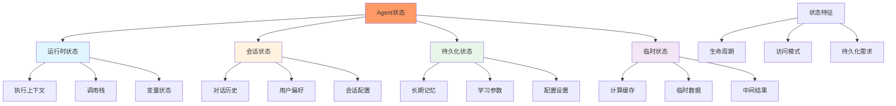
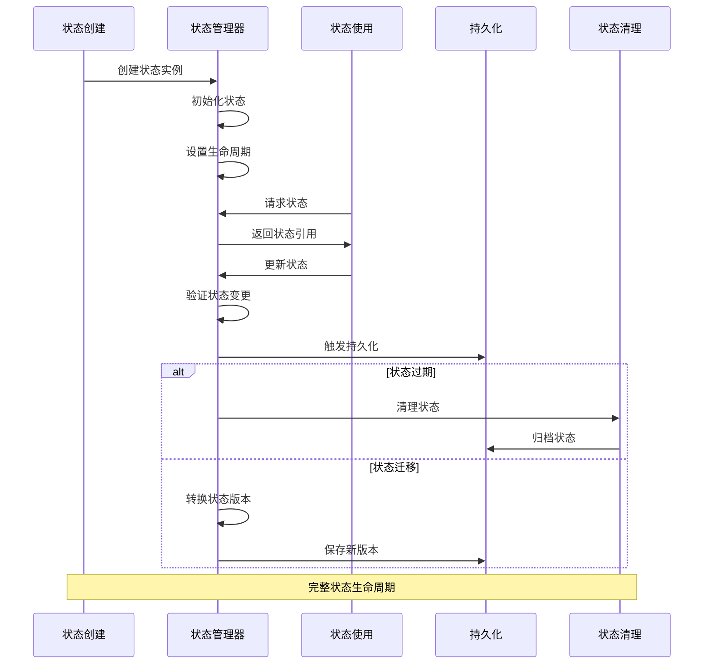
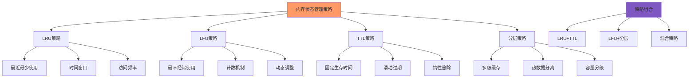
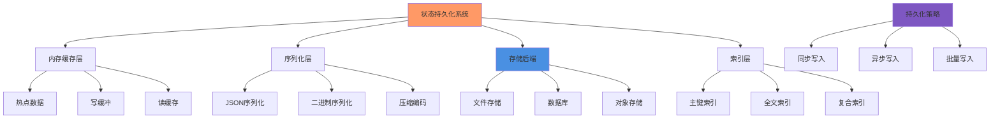
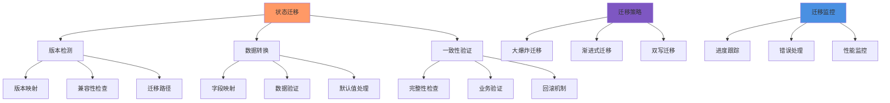
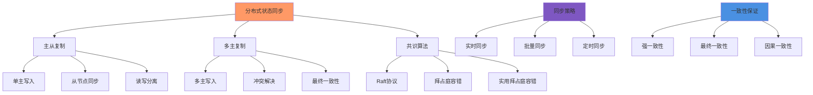
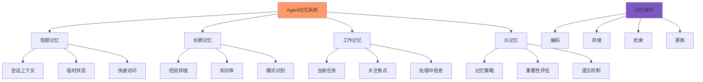

# 第11章：状态管理和持久化

## 学习目标

通过本章学习，您将：
- 理解Agent状态的类型和生命周期管理
- 掌握内存状态管理的各种策略
- 学习状态持久化的实现机制
- 理解状态恢复和迁移的方法
- 掌握分布式状态同步的技术
- 能够实现完整的Agent记忆系统

## 11.1 Agent状态类型和生命周期

### 状态类型层次结构



### 状态生命周期管理



### 状态类型系统实现

```typescript
/**
 * Agent状态类型系统
 */
class AgentStateSystem {
  private stateManagers: Map<string, StateManager>;
  private lifecycleManager: StateLifecycleManager;
  private transitionManager: StateTransitionManager;
  
  constructor() {
    this.stateManagers = new Map();
    this.lifecycleManager = new StateLifecycleManager();
    this.transitionManager = new StateTransitionManager();
  }
  
  /**
   * 创建状态管理器
   */
  createStateManager(
    agentId: string,
    config: StateManagerConfig
  ): StateManager {
    
    const manager = new StateManager(agentId, config);
    this.stateManagers.set(agentId, manager);
    
    // 注册生命周期钩子
    this.lifecycleManager.register(agentId, {
      onCreate: config.hooks?.onCreate,
      onUpdate: config.hooks?.onUpdate,
      onDelete: config.hooks?.onDelete,
      onExpire: config.hooks?.onExpire
    });
    
    return manager;
  }
  
  /**
   * 获取状态管理器
   */
  getStateManager(agentId: string): StateManager | undefined {
    return this.stateManagers.get(agentId);
  }
  
  /**
   * 创建状态实例
   */
  async createState(
    agentId: string,
    stateType: StateType,
    initialData: Record<string, unknown>,
    options: StateOptions = {}
  ): Promise<StateHandle> {
    
    const manager = this.stateManagers.get(agentId);
    if (!manager) {
      throw new Error(`State manager not found for agent: ${agentId}`);
    }
    
    // 1. 创建状态实例
    const state = await manager.createState(stateType, {
      data: initialData,
      ttl: options.ttl,
      priority: options.priority,
      metadata: options.metadata
    });
    
    // 2. 触发创建钩子
    await this.lifecycleManager.trigger(agentId, 'onCreate', state);
    
    // 3. 设置过期时间
    if (options.ttl) {
      this.lifecycleManager.setExpiration(agentId, state.id, options.ttl);
    }
    
    return state;
  }
  
  /**
   * 获取状态
   */
  async getState(
    agentId: string,
    stateId: string
  ): Promise<StateSnapshot | null> {
    
    const manager = this.stateManagers.get(agentId);
    if (!manager) {
      return null;
    }
    
    return await manager.getState(stateId);
  }
  
  /**
   * 更新状态
   */
  async updateState(
    agentId: string,
    stateId: string,
    updates: Partial<StateData>,
    options: UpdateOptions = {}
  ): Promise<StateSnapshot> {
    
    const manager = this.stateManagers.get(agentId);
    if (!manager) {
      throw new Error(`State manager not found for agent: ${agentId}`);
    }
    
    // 1. 获取当前状态
    const currentState = await manager.getState(stateId);
    if (!currentState) {
      throw new Error(`State not found: ${stateId}`);
    }
    
    // 2. 应用更新
    const updatedState = await manager.updateState(stateId, updates, options);
    
    // 3. 触发更新钩子
    await this.lifecycleManager.trigger(agentId, 'onUpdate', updatedState);
    
    // 4. 处理状态转换
    if (options.transition) {
      await this.transitionManager.transition(agentId, stateId, currentState, updatedState);
    }
    
    return updatedState;
  }
  
  /**
   * 删除状态
   */
  async deleteState(
    agentId: string,
    stateId: string,
    options: DeleteOptions = {}
  ): Promise<void> {
    
    const manager = this.stateManagers.get(agentId);
    if (!manager) {
      throw new Error(`State manager not found for agent: ${agentId}`);
    }
    
    // 1. 获取状态
    const state = await manager.getState(stateId);
    if (!state) {
      return;
    }
    
    // 2. 触发删除钩子
    await this.lifecycleManager.trigger(agentId, 'onDelete', state);
    
    // 3. 删除状态
    await manager.deleteState(stateId);
    
    // 4. 可选：归档状态
    if (options.archive) {
      await this.archiveState(agentId, state);
    }
  }
  
  /**
   * 归档状态
   */
  private async archiveState(
    agentId: string,
    state: StateSnapshot
  ): Promise<void> {
    
    // 实现状态归档逻辑
    console.log(`Archiving state ${state.id} for agent ${agentId}`);
  }
}

/**
 * 状态管理器
 */
class StateManager {
  private states: Map<string, StateInstance>;
  private indexes: Map<string, Set<string>>;
  private persistence: StatePersistence;
  
  constructor(
    private agentId: string,
    private config: StateManagerConfig
  ) {
    this.states = new Map();
    this.indexes = new Map();
    this.persistence = new StatePersistence(config.persistence);
  }
  
  /**
   * 创建状态
   */
  async createState(
    stateType: StateType,
    options: StateCreationOptions
  ): Promise<StateHandle> {
    
    const stateId = this.generateStateId();
    const now = Date.now();
    
    const state: StateInstance = {
      id: stateId,
      type: stateType,
      data: options.data || {},
      metadata: options.metadata || {},
      createdAt: now,
      updatedAt: now,
      accessedAt: now,
      version: 1,
      ttl: options.ttl,
      priority: options.priority || 'normal',
      status: 'active'
    };
    
    // 存储状态
    this.states.set(stateId, state);
    
    // 更新索引
    this.updateIndexes(state);
    
    // 持久化
    if (this.config.persistence?.enabled) {
      await this.persistence.save(state);
    }
    
    return this.toStateHandle(state);
  }
  
  /**
   * 获取状态
   */
  async getState(stateId: string): Promise<StateSnapshot | null> {
    
    const state = this.states.get(stateId);
    if (!state) {
      // 尝试从持久化存储加载
      if (this.config.persistence?.enabled) {
        const loaded = await this.persistence.load(stateId);
        if (loaded) {
          this.states.set(stateId, loaded);
          return this.toStateSnapshot(loaded);
        }
      }
      return null;
    }
    
    // 更新访问时间
    state.accessedAt = Date.now();
    
    return this.toStateSnapshot(state);
  }
  
  /**
   * 更新状态
   */
  async updateState(
    stateId: string,
    updates: Partial<StateData>,
    options: UpdateOptions = {}
  ): Promise<StateSnapshot> {
    
    const state = this.states.get(stateId);
    if (!state) {
      throw new Error(`State not found: ${stateId}`);
    }
    
    // 应用更新
    const mergedData = this.mergeData(state.data, updates);
    
    // 更新状态
    state.data = mergedData;
    state.updatedAt = Date.now();
    state.version++;
    
    if (options.metadata) {
      state.metadata = { ...state.metadata, ...options.metadata };
    }
    
    // 持久化更新
    if (this.config.persistence?.enabled) {
      await this.persistence.update(state);
    }
    
    return this.toStateSnapshot(state);
  }
  
  /**
   * 删除状态
   */
  async deleteState(stateId: string): Promise<void> {
    
    const state = this.states.get(stateId);
    if (!state) {
      return;
    }
    
    // 从索引中移除
    this.removeFromIndexes(state);
    
    // 删除状态
    this.states.delete(stateId);
    
    // 持久化删除
    if (this.config.persistence?.enabled) {
      await this.persistence.delete(stateId);
    }
  }
  
  /**
   * 查询状态
   */
  async queryStates(query: StateQuery): Promise<StateSnapshot[]> {
    
    let results = Array.from(this.states.values());
    
    // 按类型过滤
    if (query.type) {
      results = results.filter(s => s.type === query.type);
    }
    
    // 按状态过滤
    if (query.status) {
      results = results.filter(s => s.status === query.status);
    }
    
    // 按时间范围过滤
    if (query.timeRange) {
      results = results.filter(s => 
        s.createdAt >= query.timeRange!.start &&
        s.createdAt <= query.timeRange!.end
      );
    }
    
    // 按元数据过滤
    if (query.metadataFilter) {
      results = results.filter(s => 
        this.matchesMetadata(s.metadata, query.metadataFilter!)
      );
    }
    
    // 排序
    if (query.sortBy) {
      results.sort((a, b) => {
        const aValue = a[query.sortBy!];
        const bValue = b[query.sortBy!];
        return query.order === 'desc' 
          ? (bValue as number) - (aValue as number)
          : (aValue as number) - (bValue as number);
      });
    }
    
    // 分页
    if (query.limit) {
      const offset = query.offset || 0;
      results = results.slice(offset, offset + query.limit);
    }
    
    return results.map(s => this.toStateSnapshot(s));
  }
  
  /**
   * 合并数据
   */
  private mergeData(
    original: StateData,
    updates: Partial<StateData>
  ): StateData {
    
    return {
      ...original,
      ...updates,
      // 深度合并嵌套对象
      ...(this.deepMergeObjects(original, updates))
    };
  }
  
  /**
   * 深度合并对象
   */
  private deepMergeObjects(
    original: Record<string, unknown>,
    updates: Record<string, unknown>
  ): Record<string, unknown> {
    
    const result: Record<string, unknown> = {};
    
    for (const key in updates) {
      if (
        typeof updates[key] === 'object' &&
        !Array.isArray(updates[key]) &&
        updates[key] !== null
      ) {
        result[key] = this.deepMergeObjects(
          original[key] as Record<string, unknown> || {},
          updates[key] as Record<string, unknown>
        );
      } else {
        result[key] = updates[key];
      }
    }
    
    return result;
  }
  
  /**
   * 更新索引
   */
  private updateIndexes(state: StateInstance): void {
    
    // 按类型索引
    if (!this.indexes.has(`type:${state.type}`)) {
      this.indexes.set(`type:${state.type}`, new Set());
    }
    this.indexes.get(`type:${state.type}`)!.add(state.id);
    
    // 按状态索引
    if (!this.indexes.has(`status:${state.status}`)) {
      this.indexes.set(`status:${state.status}`, new Set());
    }
    this.indexes.get(`status:${state.status}`)!.add(state.id);
  }
  
  /**
   * 从索引中移除
   */
  private removeFromIndexes(state: StateInstance): void {
    
    this.indexes.get(`type:${state.type}`)?.delete(state.id);
    this.indexes.get(`status:${state.status}`)?.delete(state.id);
  }
  
  /**
   * 匹配元数据
   */
  private matchesMetadata(
    metadata: Record<string, unknown>,
    filter: Record<string, unknown>
  ): boolean {
    
    for (const key in filter) {
      if (metadata[key] !== filter[key]) {
        return false;
      }
    }
    
    return true;
  }
  
  /**
   * 转换为状态句柄
   */
  private toStateHandle(state: StateInstance): StateHandle {
    
    return {
      id: state.id,
      type: state.type,
      agentId: this.agentId,
      createdAt: state.createdAt,
      expiresAt: state.ttl ? state.createdAt + state.ttl : undefined
    };
  }
  
  /**
   * 转换为状态快照
   */
  private toStateSnapshot(state: StateInstance): StateSnapshot {
    
    return {
      id: state.id,
      type: state.type,
      data: { ...state.data },
      metadata: { ...state.metadata },
      version: state.version,
      createdAt: state.createdAt,
      updatedAt: state.updatedAt,
      accessedAt: state.accessedAt,
      ttl: state.ttl,
      priority: state.priority,
      status: state.status
    };
  }
  
  /**
   * 生成状态ID
   */
  private generateStateId(): string {
    return `state_${Date.now()}_${crypto.randomUUID()}`;
  }
}

/**
 * 状态生命周期管理器
 */
class StateLifecycleManager {
  private hooks: Map<string, LifecycleHooks>;
  private expirations: Map<string, Map<string, number>>;
  
  constructor() {
    this.hooks = new Map();
    this.expirations = new Map();
  }
  
  /**
   * 注册生命周期钩子
   */
  register(agentId: string, hooks: LifecycleHooks): void {
    this.hooks.set(agentId, hooks);
  }
  
  /**
   * 设置过期时间
   */
  setExpiration(agentId: string, stateId: string, ttl: number): void {
    
    if (!this.expirations.has(agentId)) {
      this.expirations.set(agentId, new Map());
    }
    
    const expiresAt = Date.now() + ttl;
    this.expirations.get(agentId)!.set(stateId, expiresAt);
    
    // 设置定时器
    setTimeout(() => {
      this.handleExpiration(agentId, stateId);
    }, ttl);
  }
  
  /**
   * 触发生命周期钩子
   */
  async trigger(
    agentId: string,
    event: keyof LifecycleHooks,
    state: StateSnapshot
  ): Promise<void> {
    
    const hooks = this.hooks.get(agentId);
    if (!hooks) {
      return;
    }
    
    const handler = hooks[event];
    if (handler) {
      await handler(state);
    }
  }
  
  /**
   * 处理过期
   */
  private async handleExpiration(agentId: string, stateId: string): Promise<void> {
    
    const hooks = this.hooks.get(agentId);
    if (hooks?.onExpire) {
      await hooks.onExpire(stateId);
    }
    
    // 清理过期记录
    this.expirations.get(agentId)?.delete(stateId);
  }
}

/**
 * 状态转换管理器
 */
class StateTransitionManager {
  private transitions: Map<string, StateTransitionRule[]>;
  
  constructor() {
    this.transitions = new Map();
  }
  
  /**
   * 注册转换规则
   */
  registerTransition(agentId: string, rule: StateTransitionRule): void {
    
    if (!this.transitions.has(agentId)) {
      this.transitions.set(agentId, []);
    }
    
    this.transitions.get(agentId)!.push(rule);
  }
  
  /**
   * 执行状态转换
   */
  async transition(
    agentId: string,
    stateId: string,
    fromState: StateSnapshot,
    toState: StateSnapshot
  ): Promise<void> {
    
    const rules = this.transitions.get(agentId);
    if (!rules) {
      return;
    }
    
    for (const rule of rules) {
      if (rule.condition(fromState, toState)) {
        await rule.action(fromState, toState);
      }
    }
  }
}

// 类型定义
type StateType = 'runtime' | 'session' | 'persistent' | 'temporary';

interface StateManagerConfig {
  persistence?: PersistenceConfig;
  hooks?: LifecycleHooks;
  maxStates?: number;
  cleanupInterval?: number;
}

interface PersistenceConfig {
  enabled: boolean;
  backend: StorageBackend;
  syncInterval?: number;
}

interface LifecycleHooks {
  onCreate?: (state: StateSnapshot) => void | Promise<void>;
  onUpdate?: (state: StateSnapshot) => void | Promise<void>;
  onDelete?: (state: StateSnapshot) => void | Promise<void>;
  onExpire?: (stateId: string) => void | Promise<void>;
}

interface StateOptions {
  ttl?: number;
  priority?: 'low' | 'normal' | 'high';
  metadata?: Record<string, unknown>;
}

interface StateCreationOptions {
  data?: Record<string, unknown>;
  ttl?: number;
  priority?: 'low' | 'normal' | 'high';
  metadata?: Record<string, unknown>;
}

interface UpdateOptions {
  transition?: boolean;
  metadata?: Record<string, unknown>;
}

interface DeleteOptions {
  archive?: boolean;
}

interface StateData {
  [key: string]: unknown;
}

interface StateHandle {
  id: string;
  type: StateType;
  agentId: string;
  createdAt: number;
  expiresAt?: number;
}

interface StateSnapshot {
  id: string;
  type: StateType;
  data: StateData;
  metadata: Record<string, unknown>;
  version: number;
  createdAt: number;
  updatedAt: number;
  accessedAt: number;
  ttl?: number;
  priority: 'low' | 'normal' | 'high';
  status: 'active' | 'archived' | 'deleted';
}

interface StateInstance extends StateSnapshot {
  status: 'active' | 'archived' | 'deleted';
}

interface StateQuery {
  type?: StateType;
  status?: 'active' | 'archived' | 'deleted';
  timeRange?: { start: number; end: number };
  metadataFilter?: Record<string, unknown>;
  sortBy?: keyof StateSnapshot;
  order?: 'asc' | 'desc';
  limit?: number;
  offset?: number;
}

interface StateTransitionRule {
  condition: (from: StateSnapshot, to: StateSnapshot) => boolean;
  action: (from: StateSnapshot, to: StateSnapshot) => void | Promise<void>;
}

class StatePersistence {
  constructor(config: PersistenceConfig) {}
  
  async save(state: StateInstance): Promise<void> {
    // 实现持久化保存
  }
  
  async load(stateId: string): Promise<StateInstance | null> {
    // 实现持久化加载
    return null;
  }
  
  async update(state: StateInstance): Promise<void> {
    // 实现持久化更新
  }
  
  async delete(stateId: string): Promise<void> {
    // 实现持久化删除
  }
}
```

## 11.2 内存状态管理策略

### 状态管理策略分类



### LRU缓存策略实现

```typescript
/**
 * LRU缓存策略
 */
class LRUCacheStrategy implements CacheStrategy {
  private capacity: number;
  private cache: Map<string, CacheEntry>;
  private accessOrder: string[];
  
  constructor(config: LRUConfig) {
    this.capacity = config.capacity;
    this.cache = new Map();
    this.accessOrder = [];
  }
  
  /**
   * 获取缓存项
   */
  get(key: string): unknown | undefined {
    
    const entry = this.cache.get(key);
    if (!entry) {
      return undefined;
    }
    
    // 检查是否过期
    if (entry.expiresAt && entry.expiresAt < Date.now()) {
      this.remove(key);
      return undefined;
    }
    
    // 更新访问顺序
    this.updateAccessOrder(key);
    
    return entry.value;
  }
  
  /**
   * 设置缓存项
   */
  set(key: string, value: unknown, ttl?: number): void {
    
    // 检查容量
    if (this.cache.size >= this.capacity && !this.cache.has(key)) {
      this.evictLRU();
    }
    
    const expiresAt = ttl ? Date.now() + ttl : undefined;
    
    // 添加或更新缓存项
    this.cache.set(key, {
      key,
      value,
      createdAt: Date.now(),
      accessedAt: Date.now(),
      expiresAt,
      accessCount: 1
    });
    
    // 更新访问顺序
    this.updateAccessOrder(key);
  }
  
  /**
   * 删除缓存项
   */
  remove(key: string): boolean {
    
    const removed = this.cache.delete(key);
    if (removed) {
      const index = this.accessOrder.indexOf(key);
      if (index > -1) {
        this.accessOrder.splice(index, 1);
      }
    }
    
    return removed;
  }
  
  /**
   * 清空缓存
   */
  clear(): void {
    this.cache.clear();
    this.accessOrder = [];
  }
  
  /**
   * 获取缓存大小
   */
  size(): number {
    return this.cache.size;
  }
  
  /**
   * 获取缓存统计
   */
  getStats(): CacheStats {
    
    return {
      size: this.cache.size,
      capacity: this.capacity,
      hitRate: this.calculateHitRate(),
      missCount: 0, // 需要在实际使用中跟踪
      evictionCount: 0
    };
  }
  
  /**
   * 淘汰最近最少使用的项
   */
  private evictLRU(): void {
    
    if (this.accessOrder.length === 0) {
      return;
    }
    
    // 获取最少访问的key
    const lruKey = this.accessOrder[0];
    this.remove(lruKey);
  }
  
  /**
   * 更新访问顺序
   */
  private updateAccessOrder(key: string): void {
    
    // 移除旧位置
    const index = this.accessOrder.indexOf(key);
    if (index > -1) {
      this.accessOrder.splice(index, 1);
    }
    
    // 添加到末尾
    this.accessOrder.push(key);
    
    // 更新访问计数
    const entry = this.cache.get(key);
    if (entry) {
      entry.accessedAt = Date.now();
      entry.accessCount++;
    }
  }
  
  /**
   * 计算命中率
   */
  private calculateHitRate(): number {
    
    const entries = Array.from(this.cache.values());
    if (entries.length === 0) {
      return 0;
    }
    
    const totalAccesses = entries.reduce((sum, entry) => sum + entry.accessCount, 0);
    const hits = entries.filter(entry => entry.accessCount > 0).length;
    
    return hits / totalAccesses;
  }
}

/**
 * 分层缓存策略
 */
class TieredCacheStrategy implements CacheStrategy {
  private tiers: CacheTier[];
  private promotionPolicy: PromotionPolicy;
  
  constructor(config: TieredCacheConfig) {
    this.tiers = config.tiers.map(tierConfig => 
      new CacheTier(tierConfig)
    );
    this.promotionPolicy = config.promotionPolicy || 'frequency';
  }
  
  /**
   * 获取缓存项
   */
  get(key: string): unknown | undefined {
    
    // 从高层到底层查找
    for (let i = this.tiers.length - 1; i >= 0; i--) {
      const tier = this.tiers[i];
      const value = tier.get(key);
      
      if (value !== undefined) {
        // 命中后考虑提升层级
        this.considerPromotion(key, value, i);
        return value;
      }
    }
    
    return undefined;
  }
  
  /**
   * 设置缓存项
   */
  set(key: string, value: unknown, ttl?: number): void {
    
    // 从底层开始设置
    for (const tier of this.tiers) {
      if (!tier.isFull()) {
        tier.set(key, value, ttl);
        return;
      }
    }
    
    // 如果所有层都满了，从最底层开始淘汰
    this.tiers[0].evict();
    this.tiers[0].set(key, value, ttl);
  }
  
  /**
   * 删除缓存项
   */
  remove(key: string): boolean {
    
    let removed = false;
    for (const tier of this.tiers) {
      if (tier.remove(key)) {
        removed = true;
      }
    }
    
    return removed;
  }
  
  /**
   * 清空缓存
   */
  clear(): void {
    for (const tier of this.tiers) {
      tier.clear();
    }
  }
  
  /**
   * 获取缓存大小
   */
  size(): number {
    
    return this.tiers.reduce((total, tier) => total + tier.size(), 0);
  }
  
  /**
   * 获取缓存统计
   */
  getStats(): TieredCacheStats {
    
    return {
      totalSize: this.size(),
      tierStats: this.tiers.map((tier, index) => ({
        tier: index,
        ...tier.getStats()
      })),
      promotionCount: 0, // 需要在实际使用中跟踪
      evictionCount: 0
    };
  }
  
  /**
   * 考虑层级提升
   */
  private considerPromotion(
    key: string,
    value: unknown,
    currentTier: number
  ): void {
    
    if (currentTier >= this.tiers.length - 1) {
      return; // 已经在最高层
    }
    
    const nextTier = this.tiers[currentTier + 1];
    
    // 检查是否满足提升条件
    if (this.shouldPromote(key, currentTier)) {
      // 从当前层移除
      this.tiers[currentTier].remove(key);
      
      // 添加到下一层
      if (!nextTier.isFull()) {
        nextTier.set(key, value);
      } else {
        // 如果下一层满了，先淘汰
        nextTier.evict();
        nextTier.set(key, value);
      }
    }
  }
  
  /**
   * 判断是否应该提升
   */
  private shouldPromote(key: string, currentTier: number): boolean {
    
    const currentTierObj = this.tiers[currentTier];
    const entry = currentTierObj.getEntry(key);
    
    if (!entry) {
      return false;
    }
    
    switch (this.promotionPolicy) {
      case 'frequency':
        return entry.accessCount > 5; // 访问次数超过5次
      
      case 'recency':
        return Date.now() - entry.accessedAt < 60000; // 最近1分钟内访问
      
      case 'size':
        return currentTierObj.size() > currentTierObj.getCapacity() * 0.8; // 当前层超过80%容量
      
      default:
        return false;
    }
  }
}

/**
 * 缓存层级
 */
class CacheTier {
  private capacity: number;
  private strategy: CacheStrategy;
  
  constructor(config: CacheTierConfig) {
    this.capacity = config.capacity;
    this.strategy = this.createStrategy(config.strategy);
  }
  
  /**
   * 获取缓存项
   */
  get(key: string): unknown | undefined {
    return this.strategy.get(key);
  }
  
  /**
   * 设置缓存项
   */
  set(key: string, value: unknown, ttl?: number): void {
    this.strategy.set(key, value, ttl);
  }
  
  /**
   * 删除缓存项
   */
  remove(key: string): boolean {
    return this.strategy.remove(key);
  }
  
  /**
   * 清空缓存
   */
  clear(): void {
    this.strategy.clear();
  }
  
  /**
   * 获取缓存大小
   */
  size(): number {
    return this.strategy.size();
  }
  
  /**
   * 判断是否已满
   */
  isFull(): boolean {
    return this.strategy.size() >= this.capacity;
  }
  
  /**
   * 淘汰缓存项
   */
  evict(): void {
    // 默认淘汰策略
    if (this.strategy instanceof LRUCacheStrategy) {
      // LRU会自动淘汰
    }
  }
  
  /**
   * 获取容量
   */
  getCapacity(): number {
    return this.capacity;
  }
  
  /**
   * 获取缓存项
   */
  getEntry(key: string): CacheEntry | undefined {
    
    if (this.strategy instanceof LRUCacheStrategy) {
      // 需要暴露内部方法
      return undefined;
    }
    
    return undefined;
  }
  
  /**
   * 获取统计信息
   */
  getStats(): CacheStats {
    return this.strategy.getStats();
  }
  
  /**
   * 创建缓存策略
   */
  private createStrategy(strategyType: string): CacheStrategy {
    
    switch (strategyType) {
      case 'lru':
        return new LRUCacheStrategy({ capacity: this.capacity });
      
      default:
        return new LRUCacheStrategy({ capacity: this.capacity });
    }
  }
}

// 类型定义
interface CacheStrategy {
  get(key: string): unknown | undefined;
  set(key: string, value: unknown, ttl?: number): void;
  remove(key: string): boolean;
  clear(): void;
  size(): number;
  getStats(): CacheStats;
}

interface CacheEntry {
  key: string;
  value: unknown;
  createdAt: number;
  accessedAt: number;
  expiresAt?: number;
  accessCount: number;
}

interface CacheStats {
  size: number;
  capacity: number;
  hitRate: number;
  missCount: number;
  evictionCount: number;
}

interface TieredCacheStats {
  totalSize: number;
  tierStats: Array<{
    tier: number;
  } & CacheStats>;
  promotionCount: number;
  evictionCount: number;
}

interface LRUConfig {
  capacity: number;
  defaultTTL?: number;
}

interface TieredCacheConfig {
  tiers: CacheTierConfig[];
  promotionPolicy?: PromotionPolicy;
}

interface CacheTierConfig {
  capacity: number;
  strategy: string;
}

type PromotionPolicy = 'frequency' | 'recency' | 'size';
```

## 11.3 状态持久化机制

### 持久化架构



### 持久化管理器实现

```typescript
/**
 * 状态持久化管理器
 */
class StatePersistenceManager {
  private cache: StateCache;
  private serializer: StateSerializer;
  private storage: StorageBackend;
  private indexer: StateIndexer;
  private writeQueue: AsyncQueue;
  
  constructor(config: PersistenceManagerConfig) {
    this.cache = new StateCache(config.cacheConfig);
    this.serializer = new StateSerializer(config.serializerConfig);
    this.storage = this.createStorageBackend(config.storageConfig);
    this.indexer = new StateIndexer(config.indexConfig);
    this.writeQueue = new AsyncQueue(config.queueConfig);
  }
  
  /**
   * 保存状态
   */
  async save(state: StateInstance): Promise<void> {
    
    try {
      // 1. 序列化状态
      const serialized = await this.serializer.serialize(state);
      
      // 2. 添加到写入队列
      await this.writeQueue.enqueue({
        type: 'save',
        stateId: state.id,
        data: serialized
      });
      
      // 3. 更新缓存
      await this.cache.set(state.id, state);
      
      // 4. 更新索引
      await this.indexer.index(state);
      
    } catch (error) {
      console.error('Failed to save state:', error);
      throw error;
    }
  }
  
  /**
   * 加载状态
   */
  async load(stateId: string): Promise<StateInstance | null> {
    
    try {
      // 1. 首先检查缓存
      const cached = await this.cache.get(stateId);
      if (cached) {
        return cached;
      }
      
      // 2. 从存储加载
      const data = await this.storage.read(stateId);
      if (!data) {
        return null;
      }
      
      // 3. 反序列化
      const state = await this.serializer.deserialize(data);
      
      // 4. 更新缓存
      await this.cache.set(stateId, state);
      
      return state;
      
    } catch (error) {
      console.error('Failed to load state:', error);
      return null;
    }
  }
  
  /**
   * 更新状态
   */
  async update(state: StateInstance): Promise<void> {
    
    try {
      // 1. 序列化状态
      const serialized = await this.serializer.serialize(state);
      
      // 2. 添加到写入队列
      await this.writeQueue.enqueue({
        type: 'update',
        stateId: state.id,
        data: serialized
      });
      
      // 3. 更新缓存
      await this.cache.set(state.id, state);
      
      // 4. 更新索引
      await this.indexer.reindex(state);
      
    } catch (error) {
      console.error('Failed to update state:', error);
      throw error;
    }
  }
  
  /**
   * 删除状态
   */
  async delete(stateId: string): Promise<void> {
    
    try {
      // 1. 从存储删除
      await this.storage.delete(stateId);
      
      // 2. 从缓存删除
      await this.cache.remove(stateId);
      
      // 3. 从索引删除
      await this.indexer.remove(stateId);
      
    } catch (error) {
      console.error('Failed to delete state:', error);
      throw error;
    }
  }
  
  /**
   * 批量保存
   */
  async saveBatch(states: StateInstance[]): Promise<void> {
    
    try {
      // 1. 批量序列化
      const serialized = await Promise.all(
        states.map(state => this.serializer.serialize(state))
      );
      
      // 2. 批量写入
      await this.storage.writeBatch(
        states.map((state, index) => ({
          key: state.id,
          data: serialized[index]
        }))
      );
      
      // 3. 批量更新缓存
      await Promise.all(
        states.map(state => this.cache.set(state.id, state))
      );
      
      // 4. 批量更新索引
      await Promise.all(
        states.map(state => this.indexer.index(state))
      );
      
    } catch (error) {
      console.error('Failed to save batch:', error);
      throw error;
    }
  }
  
  /**
   * 查询状态
   */
  async query(query: StateQuery): Promise<StateInstance[]> {
    
    try {
      // 1. 使用索引查找
      const stateIds = await this.indexer.query(query);
      
      // 2. 批量加载
      const states = await Promise.all(
        stateIds.map(id => this.load(id))
      );
      
      // 3. 过滤掉null值
      return states.filter((state): state is StateInstance => state !== null);
      
    } catch (error) {
      console.error('Failed to query states:', error);
      return [];
    }
  }
  
  /**
   * 创建存储后端
   */
  private createStorageBackend(config: StorageConfig): StorageBackend {
    
    switch (config.type) {
      case 'file':
        return new FileStorageBackend(config);
      
      case 'database':
        return new DatabaseStorageBackend(config);
      
      case 'object-store':
        return new ObjectStoreBackend(config);
      
      default:
        throw new Error(`Unknown storage type: ${config.type}`);
    }
  }
}

/**
 * 状态序列化器
 */
class StateSerializer {
  private format: SerializationFormat;
  private compression?: CompressionStrategy;
  
  constructor(config: SerializerConfig) {
    this.format = config.format || 'json';
    this.compression = config.compression;
  }
  
  /**
   * 序列化状态
   */
  async serialize(state: StateInstance): Promise<Buffer> {
    
    let data: string;
    
    switch (this.format) {
      case 'json':
        data = JSON.stringify(state);
        break;
      
      case 'binary':
        data = this.serializeToBinary(state);
        break;
      
      default:
        throw new Error(`Unknown format: ${this.format}`);
    }
    
    let buffer = Buffer.from(data, 'utf-8');
    
    // 应用压缩
    if (this.compression) {
      buffer = await this.compression.compress(buffer);
    }
    
    return buffer;
  }
  
  /**
   * 反序列化状态
   */
  async deserialize(data: Buffer): Promise<StateInstance> {
    
    let buffer = data;
    
    // 解压缩
    if (this.compression) {
      buffer = await this.compression.decompress(buffer);
    }
    
    const text = buffer.toString('utf-8');
    
    switch (this.format) {
      case 'json':
        return JSON.parse(text) as StateInstance;
      
      case 'binary':
        return this.deserializeFromBinary(text);
      
      default:
        throw new Error(`Unknown format: ${this.format}`);
    }
  }
  
  /**
   * 二进制序列化
   */
  private serializeToBinary(state: StateInstance): string {
    
    // 简化的二进制序列化实现
    const binary = {
      id: state.id,
      type: state.type,
      data: state.data,
      metadata: state.metadata,
      version: state.version,
      timestamps: {
        created: state.createdAt,
        updated: state.updatedAt,
        accessed: state.accessedAt
      },
      ttl: state.ttl,
      priority: state.priority
    };
    
    return JSON.stringify(binary);
  }
  
  /**
   * 二进制反序列化
   */
  private deserializeFromBinary(data: string): StateInstance {
    
    const binary = JSON.parse(data);
    
    return {
      id: binary.id,
      type: binary.type,
      data: binary.data,
      metadata: binary.metadata,
      version: binary.version,
      createdAt: binary.timestamps.created,
      updatedAt: binary.timestamps.updated,
      accessedAt: binary.timestamps.accessed,
      ttl: binary.ttl,
      priority: binary.priority,
      status: 'active'
    };
  }
}

/**
 * 状态索引器
 */
class StateIndexer {
  private indexes: Map<string, StateIndex>;
  
  constructor(config: IndexConfig) {
    this.indexes = new Map();
    this.initializeIndexes(config);
  }
  
  /**
   * 索引状态
   */
  async index(state: StateInstance): Promise<void> {
    
    for (const [name, index] of this.indexes) {
      await index.add(state);
    }
  }
  
  /**
   * 重新索引
   */
  async reindex(state: StateInstance): Promise<void> {
    
    for (const [name, index] of this.indexes) {
      await index.remove(state.id);
      await index.add(state);
    }
  }
  
  /**
   * 移除索引
   */
  async remove(stateId: string): Promise<void> {
    
    for (const [name, index] of this.indexes) {
      await index.remove(stateId);
    }
  }
  
  /**
   * 查询索引
   */
  async query(query: StateQuery): Promise<string[]> {
    
    let results: Set<string> = new Set();
    
    // 根据查询条件使用相应的索引
    if (query.type) {
      const typeIndex = this.indexes.get('type');
      if (typeIndex) {
        const typeResults = await typeIndex.find(query.type);
        results = new Set([...results, ...typeResults]);
      }
    }
    
    if (query.status) {
      const statusIndex = this.indexes.get('status');
      if (statusIndex) {
        const statusResults = await statusIndex.find(query.status);
        results = new Set([...results, ...statusResults]);
      }
    }
    
    return Array.from(results);
  }
  
  /**
   * 初始化索引
   */
  private initializeIndexes(config: IndexConfig): void {
    
    // 类型索引
    this.indexes.set('type', new StateIndex('type', {
      keySelector: state => state.type
    }));
    
    // 状态索引
    this.indexes.set('status', new StateIndex('status', {
      keySelector: state => state.status
    }));
    
    // 创建时间索引
    this.indexes.set('createdAt', new StateIndex('createdAt', {
      keySelector: state => state.createdAt
    }));
    
    // 优先级索引
    this.indexes.set('priority', new StateIndex('priority', {
      keySelector: state => state.priority
    }));
  }
}

/**
 * 状态索引
 */
class StateIndex {
  private keySelector: (state: StateInstance) => unknown;
  private index: Map<unknown, Set<string>>;
  
  constructor(
    private name: string,
    config: IndexDefinition
  ) {
    this.keySelector = config.keySelector;
    this.index = new Map();
  }
  
  /**
   * 添加到索引
   */
  async add(state: StateInstance): Promise<void> {
    
    const key = this.keySelector(state);
    
    if (!this.index.has(key)) {
      this.index.set(key, new Set());
    }
    
    this.index.get(key)!.add(state.id);
  }
  
  /**
   * 从索引移除
   */
  async remove(stateId: string): Promise<void> {
    
    for (const [key, stateIds] of this.index) {
      if (stateIds.has(stateId)) {
        stateIds.delete(stateId);
        
        if (stateIds.size === 0) {
          this.index.delete(key);
        }
      }
    }
  }
  
  /**
   * 查找索引
   */
  async find(value: unknown): Promise<string[]> {
    
    const stateIds = this.index.get(value);
    return stateIds ? Array.from(stateIds) : [];
  }
}

/**
 * 异步队列
 */
class AsyncQueue {
  private queue: QueueItem[];
  private processing: boolean;
  
  constructor(config: QueueConfig) {
    this.queue = [];
    this.processing = false;
    this.startProcessing(config);
  }
  
  /**
   * 入队
   */
  async enqueue(item: QueueItem): Promise<void> {
    this.queue.push(item);
  }
  
  /**
   * 开始处理
   */
  private startProcessing(config: QueueConfig): void {
    
    setInterval(() => {
      this.processBatch(config.batchSize || 10);
    }, config.interval || 100);
  }
  
  /**
   * 处理批次
   */
  private async processBatch(batchSize: number): Promise<void> {
    
    if (this.processing || this.queue.length === 0) {
      return;
    }
    
    this.processing = true;
    
    const batch = this.queue.splice(0, batchSize);
    
    try {
      // 处理批次
      await Promise.all(batch.map(item => this.processItem(item)));
    } finally {
      this.processing = false;
    }
  }
  
  /**
   * 处理单个项目
   */
  private async processItem(item: QueueItem): Promise<void> {
    
    // 实现具体的处理逻辑
    switch (item.type) {
      case 'save':
        // 保存逻辑
        break;
      case 'update':
        // 更新逻辑
        break;
      case 'delete':
        // 删除逻辑
        break;
    }
  }
}

// 存储后端接口
interface StorageBackend {
  read(key: string): Promise<Buffer | null>;
  write(key: string, data: Buffer): Promise<void>;
  delete(key: string): Promise<void>;
  writeBatch(items: Array<{ key: string; data: Buffer }>): Promise<void>;
}

/**
 * 文件存储后端
 */
class FileStorageBackend implements StorageBackend {
  
  constructor(config: FileStorageConfig) {
    // 初始化文件存储
  }
  
  async read(key: string): Promise<Buffer | null> {
    // 实现文件读取
    return null;
  }
  
  async write(key: string, data: Buffer): Promise<void> {
    // 实现文件写入
  }
  
  async delete(key: string): Promise<void> {
    // 实现文件删除
  }
  
  async writeBatch(items: Array<{ key: string; data: Buffer }>): Promise<void> {
    // 实现批量写入
  }
}

/**
 * 数据库存储后端
 */
class DatabaseStorageBackend implements StorageBackend {
  
  constructor(config: DatabaseStorageConfig) {
    // 初始化数据库连接
  }
  
  async read(key: string): Promise<Buffer | null> {
    // 实现数据库读取
    return null;
  }
  
  async write(key: string, data: Buffer): Promise<void> {
    // 实现数据库写入
  }
  
  async delete(key: string): Promise<void> {
    // 实现数据库删除
  }
  
  async writeBatch(items: Array<{ key: string; data: Buffer }>): Promise<void> {
    // 实现批量写入
  }
}

/**
 * 对象存储后端
 */
class ObjectStoreBackend implements StorageBackend {
  
  constructor(config: ObjectStoreConfig) {
    // 初始化对象存储
  }
  
  async read(key: string): Promise<Buffer | null> {
    // 实现对象读取
    return null;
  }
  
  async write(key: string, data: Buffer): Promise<void> {
    // 实现对象写入
  }
  
  async delete(key: string): Promise<void> {
    // 实现对象删除
  }
  
  async writeBatch(items: Array<{ key: string; data: Buffer }>): Promise<void> {
    // 实现批量写入
  }
}

// 类型定义
type SerializationFormat = 'json' | 'binary';
type StorageType = 'file' | 'database' | 'object-store';

interface PersistenceManagerConfig {
  cacheConfig: CacheConfig;
  serializerConfig: SerializerConfig;
  storageConfig: StorageConfig;
  indexConfig: IndexConfig;
  queueConfig: QueueConfig;
}

interface CacheConfig {
  maxSize: number;
  ttl: number;
}

interface SerializerConfig {
  format?: SerializationFormat;
  compression?: CompressionStrategy;
}

interface StorageConfig {
  type: StorageType;
  [key: string]: unknown;
}

interface IndexConfig {
  enabled: boolean;
  indexes?: string[];
}

interface QueueConfig {
  interval: number;
  batchSize: number;
}

interface FileStorageConfig {
  path: string;
  compression?: boolean;
}

interface DatabaseStorageConfig {
  connectionString: string;
  tableName: string;
}

interface ObjectStoreConfig {
  bucket: string;
  region: string;
  credentials: {
    accessKeyId: string;
    secretAccessKey: string;
  };
}

interface CompressionStrategy {
  compress(data: Buffer): Promise<Buffer>;
  decompress(data: Buffer): Promise<Buffer>;
}

interface IndexDefinition {
  keySelector: (state: StateInstance) => unknown;
  unique?: boolean;
}

interface QueueItem {
  type: 'save' | 'update' | 'delete';
  stateId: string;
  data: Buffer;
}

interface StateCache {
  get(stateId: string): Promise<StateInstance | undefined>;
  set(stateId: string, state: StateInstance): Promise<void>;
  remove(stateId: string): Promise<void>;
}
```

## 11.4 状态恢复和迁移

### 状态迁移流程



### 状态迁移管理器实现

```typescript
/**
 * 状态迁移管理器
 */
class StateMigrationManager {
  private migrations: Map<string, StateMigration>;
  private versionRegistry: VersionRegistry;
  private rollbackStack: RollbackStack;
  
  constructor(config: MigrationManagerConfig) {
    this.migrations = new Map();
    this.versionRegistry = new VersionRegistry(config.versionConfig);
    this.rollbackStack = new RollbackStack(config.rollbackConfig);
  }
  
  /**
   * 注册迁移
   */
  registerMigration(migration: StateMigration): void {
    
    this.migrations.set(migration.fromVersion + '->' + migration.toVersion, migration);
  }
  
  /**
   * 执行迁移
   */
  async migrate(
    state: StateInstance,
    targetVersion: string
  ): Promise<StateInstance> {
    
    const currentVersion = state.metadata.version as string || '1.0.0';
    
    if (currentVersion === targetVersion) {
      return state; // 已经是目标版本
    }
    
    // 1. 查找迁移路径
    const migrationPath = this.findMigrationPath(currentVersion, targetVersion);
    
    if (!migrationPath) {
      throw new Error(`No migration path found from ${currentVersion} to ${targetVersion}`);
    }
    
    // 2. 创建备份用于回滚
    await this.rollbackStack.push(state);
    
    try {
      // 3. 执行迁移路径
      let migratedState = state;
      
      for (const migration of migrationPath) {
        migratedState = await this.executeMigration(migratedState, migration);
      }
      
      // 4. 更新版本号
      migratedState.metadata.version = targetVersion;
      
      // 5. 验证迁移结果
      await this.validateMigration(migratedState, targetVersion);
      
      return migratedState;
      
    } catch (error) {
      // 迁移失败，执行回滚
      console.error('Migration failed, rolling back:', error);
      return await this.rollback();
    }
  }
  
  /**
   * 批量迁移
   */
  async migrateBatch(
    states: StateInstance[],
    targetVersion: string,
    options: BatchMigrationOptions = {}
  ): Promise<BatchMigrationResult> {
    
    const results: BatchMigrationResult = {
      total: states.length,
      successful: 0,
      failed: 0,
      errors: []
    };
    
    // 分批处理
    const batchSize = options.batchSize || 100;
    
    for (let i = 0; i < states.length; i += batchSize) {
      const batch = states.slice(i, i + batchSize);
      
      const batchResults = await Promise.allSettled(
        batch.map(state => this.migrate(state, targetVersion))
      );
      
      for (let j = 0; j < batchResults.length; j++) {
        const result = batchResults[j];
        
        if (result.status === 'fulfilled') {
          results.successful++;
        } else {
          results.failed++;
          results.errors.push({
            stateId: batch[j].id,
            error: result.reason
          });
        }
      }
      
      // 可选：批次间延迟
      if (options.batchDelay) {
        await new Promise(resolve => setTimeout(resolve, options.batchDelay));
      }
    }
    
    return results;
  }
  
  /**
   * 查找迁移路径
   */
  private findMigrationPath(
    fromVersion: string,
    toVersion: string
  ): StateMigration[] | null {
    
    // 使用BFS查找最短路径
    const queue: Array<{ version: string; path: StateMigration[] }> = [
      { version: fromVersion, path: [] }
    ];
    
    const visited = new Set<string>([fromVersion]);
    
    while (queue.length > 0) {
      const { version, path } = queue.shift()!;
      
      if (version === toVersion) {
        return path;
      }
      
      // 查找从当前版本出发的所有迁移
      const outgoingMigrations = this.findOutgoingMigrations(version);
      
      for (const migration of outgoingMigrations) {
        if (!visited.has(migration.toVersion)) {
          visited.add(migration.toVersion);
          queue.push({
            version: migration.toVersion,
            path: [...path, migration]
          });
        }
      }
    }
    
    return null; // 没有找到路径
  }
  
  /**
   * 查找出发迁移
   */
  private findOutgoingMigrations(version: string): StateMigration[] {
    
    return Array.from(this.migrations.values()).filter(
      migration => migration.fromVersion === version
    );
  }
  
  /**
   * 执行单个迁移
   */
  private async executeMigration(
    state: StateInstance,
    migration: StateMigration
  ): Promise<StateInstance> {
    
    console.log(`Executing migration: ${migration.fromVersion} -> ${migration.toVersion}`);
    
    // 1. 前置检查
    if (migration.preCheck) {
      const canProceed = await migration.preCheck(state);
      if (!canProceed) {
        throw new Error(`Pre-check failed for migration ${migration.fromVersion} -> ${migration.toVersion}`);
      }
    }
    
    // 2. 数据转换
    const transformedData = await migration.transform(state.data);
    
    // 3. 创建新状态
    const newState: StateInstance = {
      ...state,
      data: transformedData,
      version: state.version + 1,
      updatedAt: Date.now()
    };
    
    // 4. 后置处理
    if (migration.postProcess) {
      await migration.postProcess(newState);
    }
    
    return newState;
  }
  
  /**
   * 验证迁移结果
   */
  private async validateMigration(
    state: StateInstance,
    expectedVersion: string
  ): Promise<void> {
    
    const actualVersion = state.metadata.version as string;
    
    if (actualVersion !== expectedVersion) {
      throw new Error(`Version mismatch: expected ${expectedVersion}, got ${actualVersion}`);
    }
    
    // 执行数据完整性验证
    await this.validateDataIntegrity(state);
  }
  
  /**
   * 验证数据完整性
   */
  private async validateDataIntegrity(state: StateInstance): Promise<void> {
    
    // 检查必需字段
    if (!state.id || !state.type || !state.data) {
      throw new Error('Missing required fields in migrated state');
    }
    
    // 检查时间戳
    if (state.createdAt > state.updatedAt) {
      throw new Error('Invalid timestamps in migrated state');
    }
  }
  
  /**
   * 回滚
   */
  private async rollback(): Promise<StateInstance> {
    
    const previousState = await this.rollbackStack.pop();
    
    if (!previousState) {
      throw new Error('No state to rollback to');
    }
    
    return previousState;
  }
}

/**
 * 版本注册表
 */
class VersionRegistry {
  private versions: Map<string, VersionInfo>;
  
  constructor(config: VersionRegistryConfig) {
    this.versions = new Map();
    this.initializeVersions(config);
  }
  
  /**
   * 注册版本
   */
  registerVersion(version: string, info: VersionInfo): void {
    this.versions.set(version, info);
  }
  
  /**
   * 获取版本信息
   */
  getVersionInfo(version: string): VersionInfo | undefined {
    return this.versions.get(version);
  }
  
  /**
   * 检查版本兼容性
   */
  areCompatible(version1: string, version2: string): boolean {
    
    const info1 = this.versions.get(version1);
    const info2 = this.versions.get(version2);
    
    if (!info1 || !info2) {
      return false;
    }
    
    // 简化的兼容性检查
    return info1.schemaVersion === info2.schemaVersion;
  }
  
  /**
   * 初始化版本
   */
  private initializeVersions(config: VersionRegistryConfig): void {
    
    // 注册初始版本
    this.registerVersion('1.0.0', {
      schemaVersion: 1,
      releasedAt: Date.now(),
      deprecated: false,
      migrations: []
    });
  }
}

/**
 * 回滚栈
 */
class RollbackStack {
  private stack: StateInstance[];
  private maxSize: number;
  
  constructor(config: RollbackStackConfig) {
    this.stack = [];
    this.maxSize = config.maxSize || 10;
  }
  
  /**
   * 推入状态
   */
  async push(state: StateInstance): Promise<void> {
    
    // 深拷贝状态
    const backup = JSON.parse(JSON.stringify(state));
    
    this.stack.push(backup);
    
    // 限制栈大小
    if (this.stack.length > this.maxSize) {
      this.stack.shift();
    }
  }
  
  /**
   * 弹出状态
   */
  async pop(): Promise<StateInstance | undefined> {
    return this.stack.pop();
  }
  
  /**
   * 查看栈顶
   */
  peek(): StateInstance | undefined {
    return this.stack[this.stack.length - 1];
  }
  
  /**
   * 清空栈
   */
  clear(): void {
    this.stack = [];
  }
}

/**
 * 状态恢复管理器
 */
class StateRecoveryManager {
  private backupManager: BackupManager;
  private checkpointManager: CheckpointManager;
  
  constructor(config: RecoveryManagerConfig) {
    this.backupManager = new BackupManager(config.backupConfig);
    this.checkpointManager = new CheckpointManager(config.checkpointConfig);
  }
  
  /**
   * 创建恢复点
   */
  async createRestorePoint(state: StateInstance): Promise<string> {
    
    // 1. 创建备份
    const backupId = await this.backupManager.createBackup(state);
    
    // 2. 创建检查点
    await this.checkpointManager.createCheckpoint(state, backupId);
    
    return backupId;
  }
  
  /**
   * 恢复到检查点
   */
  async restoreToCheckpoint(checkpointId: string): Promise<StateInstance> {
    
    // 1. 获取检查点
    const checkpoint = await this.checkpointManager.getCheckpoint(checkpointId);
    
    if (!checkpoint) {
      throw new Error(`Checkpoint not found: ${checkpointId}`);
    }
    
    // 2. 从备份恢复
    const restoredState = await this.backupManager.restoreBackup(checkpoint.backupId);
    
    if (!restoredState) {
      throw new Error(`Failed to restore from backup: ${checkpoint.backupId}`);
    }
    
    return restoredState;
  }
  
  /**
   * 列出可用的恢复点
   */
  async listRestorePoints(): Promise<RestorePoint[]> {
    
    const checkpoints = await this.checkpointManager.listCheckpoints();
    
    return checkpoints.map(checkpoint => ({
      id: checkpoint.id,
      timestamp: checkpoint.timestamp,
      version: checkpoint.stateVersion,
      description: checkpoint.description
    }));
  }
}

/**
 * 备份管理器
 */
class BackupManager {
  private backups: Map<string, StateBackup>;
  
  constructor(config: BackupManagerConfig) {
    this.backups = new Map();
  }
  
  /**
   * 创建备份
   */
  async createBackup(state: StateInstance): Promise<string> {
    
    const backupId = this.generateBackupId();
    
    const backup: StateBackup = {
      id: backupId,
      state: JSON.parse(JSON.stringify(state)),
      createdAt: Date.now(),
      size: JSON.stringify(state).length
    };
    
    this.backups.set(backupId, backup);
    
    return backupId;
  }
  
  /**
   * 恢复备份
   */
  async restoreBackup(backupId: string): Promise<StateInstance | null> {
    
    const backup = this.backups.get(backupId);
    
    if (!backup) {
      return null;
    }
    
    return JSON.parse(JSON.stringify(backup.state));
  }
  
  /**
   * 删除备份
   */
  async deleteBackup(backupId: string): Promise<void> {
    this.backups.delete(backupId);
  }
  
  /**
   * 生成备份ID
   */
  private generateBackupId(): string {
    return `backup_${Date.now()}_${crypto.randomUUID()}`;
  }
}

/**
 * 检查点管理器
 */
class CheckpointManager {
  private checkpoints: Map<string, Checkpoint>;
  
  constructor(config: CheckpointManagerConfig) {
    this.checkpoints = new Map();
  }
  
  /**
   * 创建检查点
   */
  async createCheckpoint(
    state: StateInstance,
    backupId: string,
    description?: string
  ): Promise<string> {
    
    const checkpointId = this.generateCheckpointId();
    
    const checkpoint: Checkpoint = {
      id: checkpointId,
      backupId,
      stateVersion: state.metadata.version as string,
      timestamp: Date.now(),
      description
    };
    
    this.checkpoints.set(checkpointId, checkpoint);
    
    return checkpointId;
  }
  
  /**
   * 获取检查点
   */
  async getCheckpoint(checkpointId: string): Promise<Checkpoint | undefined> {
    return this.checkpoints.get(checkpointId);
  }
  
  /**
   * 列出检查点
   */
  async listCheckpoints(): Promise<Checkpoint[]> {
    return Array.from(this.checkpoints.values());
  }
  
  /**
   * 删除检查点
   */
  async deleteCheckpoint(checkpointId: string): Promise<void> {
    this.checkpoints.delete(checkpointId);
  }
  
  /**
   * 生成检查点ID
   */
  private generateCheckpointId(): string {
    return `checkpoint_${Date.now()}_${crypto.randomUUID()}`;
  }
}

// 类型定义
interface StateMigration {
  fromVersion: string;
  toVersion: string;
  transform: (data: Record<string, unknown>) => Promise<Record<string, unknown>>;
  preCheck?: (state: StateInstance) => Promise<boolean>;
  postProcess?: (state: StateInstance) => Promise<void>;
}

interface VersionInfo {
  schemaVersion: number;
  releasedAt: number;
  deprecated: boolean;
  migrations: string[];
}

interface StateBackup {
  id: string;
  state: StateInstance;
  createdAt: number;
  size: number;
}

interface Checkpoint {
  id: string;
  backupId: string;
  stateVersion: string;
  timestamp: number;
  description?: string;
}

interface RestorePoint {
  id: string;
  timestamp: number;
  version: string;
  description?: string;
}

interface MigrationManagerConfig {
  versionConfig: VersionRegistryConfig;
  rollbackConfig: RollbackStackConfig;
}

interface VersionRegistryConfig {
  initialVersion: string;
  schemaVersions: Record<string, number>;
}

interface RollbackStackConfig {
  maxSize?: number;
}

interface RecoveryManagerConfig {
  backupConfig: BackupManagerConfig;
  checkpointConfig: CheckpointManagerConfig;
}

interface BackupManagerConfig {
  maxBackups?: number;
  retentionDays?: number;
}

interface CheckpointManagerConfig {
  maxCheckpoints?: number;
  autoCleanup?: boolean;
}

interface BatchMigrationOptions {
  batchSize?: number;
  batchDelay?: number;
  continueOnError?: boolean;
}

interface BatchMigrationResult {
  total: number;
  successful: number;
  failed: number;
  errors: Array<{
    stateId: string;
    error: unknown;
  }>;
}
```

## 11.5 分布式状态同步

### 分布式状态同步架构



### 分布式状态同步管理器

```typescript
/**
 * 分布式状态同步管理器
 */
class DistributedStateSyncManager {
  private localNode: ClusterNode;
  private cluster: ClusterManager;
  private replicator: StateReplicator;
  private conflictResolver: ConflictResolver;
  private consistencyChecker: ConsistencyChecker;
  
  constructor(config: DistributedSyncConfig) {
    this.localNode = new ClusterNode(config.nodeConfig);
    this.cluster = new ClusterManager(config.clusterConfig);
    this.replicator = new StateReplicator(config.replicatorConfig);
    this.conflictResolver = new ConflictResolver(config.conflictConfig);
    this.consistencyChecker = new ConsistencyChecker(config.consistencyConfig);
  }
  
  /**
   * 同步状态到集群
   */
  async syncState(state: StateInstance): Promise<SyncResult> {
    
    // 1. 验证状态
    await this.validateState(state);
    
    // 2. 获取集群状态
    const clusterState = await this.cluster.getClusterState();
    
    // 3. 根据复制模式处理
    switch (clusterState.replicationMode) {
      case 'master-slave':
        return await this.syncMasterSlave(state, clusterState);
      
      case 'multi-master':
        return await this.syncMultiMaster(state, clusterState);
      
      case 'consensus':
        return await this.syncWithConsensus(state, clusterState);
      
      default:
        throw new Error(`Unknown replication mode: ${clusterState.replicationMode}`);
    }
  }
  
  /**
   * 主从同步
   */
  private async syncMasterSlave(
    state: StateInstance,
    clusterState: ClusterState
  ): Promise<SyncResult> {
    
    // 1. 检查是否为主节点
    if (!this.localNode.isMaster()) {
      return {
        success: false,
        error: 'Local node is not master',
        syncedNodes: []
      };
    }
    
    // 2. 复制到从节点
    const slaves = await this.cluster.getSlaveNodes();
    const syncResults = await Promise.allSettled(
      slaves.map(slave => this.replicator.replicateTo(state, slave))
    );
    
    // 3. 处理结果
    const successful = syncResults.filter(
      result => result.status === 'fulfilled'
    ).length;
    
    return {
      success: true,
      syncedNodes: await this.getSuccessfulNodes(syncResults),
      summary: {
        totalNodes: slaves.length,
        successfulNodes: successful,
        failedNodes: slaves.length - successful
      }
    };
  }
  
  /**
   * 多主同步
   */
  private async syncMultiMaster(
    state: StateInstance,
    clusterState: ClusterState
  ): Promise<SyncResult> {
    
    // 1. 添加向量时钟
    const vectorClock = await this.generateVectorClock(state);
    const stateWithClock = {
      ...state,
      metadata: {
        ...state.metadata,
        vectorClock
      }
    };
    
    // 2. 广播到所有节点
    const allNodes = await this.cluster.getAllNodes();
    const syncResults = await Promise.allSettled(
      allNodes.map(node => this.replicator.replicateTo(stateWithClock, node))
    );
    
    // 3. 检测冲突
    const conflicts = await this.detectConflicts(stateWithClock, allNodes);
    
    if (conflicts.length > 0) {
      // 解决冲突
      const resolvedState = await this.conflictResolver.resolve(stateWithClock, conflicts);
      
      // 重新同步解决后的状态
      return await this.syncState(resolvedState);
    }
    
    return {
      success: true,
      syncedNodes: await this.getSuccessfulNodes(syncResults),
      conflictsDetected: conflicts.length
    };
  }
  
  /**
   * 共识同步
   */
  private async syncWithConsensus(
    state: StateInstance,
    clusterState: ClusterState
  ): Promise<SyncResult> {
    
    // 1. 提交状态变更提案
    const proposal = await this.createConsensusProposal(state);
    
    // 2. 获取集群共识
    const consensus = await this.clusterAchieveConsensus(proposal);
    
    if (!consensus.agreed) {
      return {
        success: false,
        error: 'Consensus not reached',
        consensusResults: consensus.votes
      };
    }
  
  }
  
  /**
   * 处理远程同步
   */
  async handleRemoteSync(request: SyncRequest): Promise<SyncResponse> {
    
    try {
      // 1. 验证请求
      if (!this.validateSyncRequest(request)) {
        return {
          success: false,
          error: 'Invalid sync request'
        };
      }
      
      // 2. 检查冲突
      const localState = await this.getLocalState(request.stateId);
      
      if (localState) {
        const conflict = await this.checkConflict(localState, request.state);
        
        if (conflict) {
          return {
            success: false,
            error: 'Conflict detected',
            conflict
          };
        }
      }
      
      // 3. 应用远程状态
      await this.applyRemoteState(request.state);
      
      return {
        success: true,
        appliedAt: Date.now()
      };
      
    } catch (error) {
      return {
        success: false,
        error: error instanceof Error ? error.message : String(error)
      };
    }
  }
  
  /**
   * 验证状态
   */
  private async validateState(state: StateInstance): Promise<void> {
    
    if (!state.id || !state.type || !state.data) {
      throw new Error('Invalid state: missing required fields');
    }
    
    // 验证向量时钟
    if (state.metadata.vectorClock) {
      await this.validateVectorClock(state.metadata.vectorClock as VectorClock);
    }
  }
  
  /**
   * 生成向量时钟
   */
  private async generateVectorClock(state: StateInstance): Promise<VectorClock> {
    
    const existingClock = state.metadata.vectorClock as VectorClock | undefined;
    
    if (existingClock) {
      // 更新现有向量时钟
      return {
        ...existingClock,
        [this.localNode.getId()]: (existingClock[this.localNode.getId()] || 0) + 1
      };
    }
    
    // 创建新的向量时钟
    return {
      [this.localNode.getId()]: 1
    };
  }
  
  /**
   * 验证向量时钟
   */
  private async validateVectorClock(clock: VectorClock): Promise<void> {
    
    if (typeof clock !== 'object') {
      throw new Error('Invalid vector clock: not an object');
    }
    
    // 验证向量时钟的结构
    for (const [nodeId, version] of Object.entries(clock)) {
      if (typeof version !== 'number' || version < 0) {
        throw new Error(`Invalid vector clock: invalid version for node ${nodeId}`);
      }
    }
  }
  
  /**
   * 检测冲突
   */
  private async detectConflicts(
    state: StateInstance,
    nodes: ClusterNode[]
  ): Promise<ConflictInfo[]> {
    
    const conflicts: ConflictInfo[] = [];
    
    for (const node of nodes) {
      const remoteState = await this.replicator.fetchStateFrom(node, state.id);
      
      if (remoteState) {
        const conflict = await this.compareStates(state, remoteState);
        
        if (conflict) {
          conflicts.push({
            nodeId: node.getId(),
            localState: state,
            remoteState,
            conflictType: conflict.type,
            conflictDetails: conflict.details
          });
        }
      }
    }
    
    return conflicts;
  }
  
  /**
   * 比较状态
   */
  private async compareStates(
    state1: StateInstance,
    state2: StateInstance
  ): Promise<ConflictComparison | null> {
    
    const clock1 = state1.metadata.vectorClock as VectorClock | undefined;
    const clock2 = state2.metadata.vectorClock as VectorClock | undefined;
    
    if (!clock1 || !clock2) {
      // 没有向量时钟，使用简单的时间戳比较
      if (state1.updatedAt !== state2.updatedAt) {
        return {
          type: 'concurrent',
          details: 'Different update timestamps without vector clocks'
        };
      }
      
      return null;
    }
    
    // 比较向量时钟
    const comparison = this.compareVectorClocks(clock1, clock2);
    
    switch (comparison) {
      case 'concurrent':
        return {
          type: 'concurrent',
          details: 'Concurrent updates detected'
        };
      
      case 'conflict':
        return {
          type: 'data',
          details: 'Data conflict detected'
        };
      
      default:
        return null;
    }
  }
  
  /**
   * 比较向量时钟
   */
  private compareVectorClocks(
    clock1: VectorClock,
    clock2: VectorClock
  ): 'concurrent' | 'conflict' | 'ordered' {
    
    let clock1Greater = false;
    let clock2Greater = false;
    
    // 比较所有节点的版本
    const allNodes = new Set([
      ...Object.keys(clock1),
      ...Object.keys(clock2)
    ]);
    
    for (const node of allNodes) {
      const version1 = clock1[node] || 0;
      const version2 = clock2[node] || 0;
      
      if (version1 > version2) {
        clock1Greater = true;
      } else if (version2 > version1) {
        clock2Greater = true;
      }
    }
    
    // 判断关系
    if (clock1Greater && clock2Greater) {
      return 'concurrent';
    }
    
    if (clock1Greater) {
      return 'ordered';
    }
    
    if (clock2Greater) {
      return 'ordered';
    }
    
    // 向量时钟相同，检查数据
    return 'conflict';
  }
  
  /**
   * 检查冲突
   */
  private async checkConflict(
    localState: StateInstance,
    remoteState: StateInstance
  ): Promise<ConflictInfo | null> {
    
    const comparison = await this.compareStates(localState, remoteState);
    
    if (!comparison) {
      return null;
    }
    
    return {
      nodeId: 'remote',
      localState,
      remoteState,
      conflictType: comparison.type,
      conflictDetails: comparison.details
    };
  }
  
  /**
   * 应用远程状态
   */
  private async applyRemoteState(state: StateInstance): Promise<void> {
    
    // 存储到本地状态管理器
    // 这里需要与状态管理器集成
    console.log('Applying remote state:', state.id);
  }
  
  /**
   * 获取本地状态
   */
  private async getLocalState(stateId: string): Promise<StateInstance | null> {
    
    // 从本地状态管理器获取
    // 这里需要与状态管理器集成
    return null;
  }
  
  /**
   * 验证同步请求
   */
  private validateSyncRequest(request: SyncRequest): boolean {
    
    return !!(request.stateId && request.state && request.timestamp);
  }
  
  /**
   * 获取成功节点
   */
  private async getSuccessfulNodes(
    results: PromiseSettledResult<void>[]
  ): Promise<string[]> {
    
    const successful: string[] = [];
    
    for (let i = 0; i < results.length; i++) {
      if (results[i].status === 'fulfilled') {
        const nodes = await this.cluster.getAllNodes();
        successful.push(nodes[i].getId());
      }
    }
    
    return successful;
  }
  
  /**
   * 创建共识提案
   */
  private async createConsensusProposal(state: StateInstance): Promise<ConsensusProposal> {
    
    return {
      id: this.generateProposalId(),
      stateId: state.id,
      stateData: state.data,
      proposedBy: this.localNode.getId(),
      proposedAt: Date.now(),
      ttl: 30000 // 30秒超时
    };
  }
  
  /**
   * 达成集群共识
   */
  private async clusterAchieveConsensus(
    proposal: ConsensusProposal
  ): Promise<ConsensusResult> {
    
    // 1. 获取集群节点
    const nodes = await this.cluster.getAllNodes();
    
    // 2. 收集投票
    const votes = await Promise.all(
      nodes.map(node => this.requestVote(node, proposal))
    );
    
    // 3. 计算共识
    const agreed = votes.filter(vote => vote.agreed).length >= Math.ceil(nodes.length / 2);
    
    return {
      agreed,
      votes,
     达成时间: Date.now()
    };
  }
  
  /**
   * 请求投票
   */
  private async requestVote(
    node: ClusterNode,
    proposal: ConsensusProposal
  ): Promise<Vote> {
    
    try {
      // 发送投票请求
      const response = await node.sendRequest('vote', proposal);
      
      return {
        nodeId: node.getId(),
        agreed: response.agreed,
        reason: response.reason
      };
      
    } catch (error) {
      return {
        nodeId: node.getId(),
        agreed: false,
        reason: error instanceof Error ? error.message : String(error)
      };
    }
  }
  
  /**
   * 生成提案ID
   */
  private generateProposalId(): string {
    return `proposal_${Date.now()}_${crypto.randomUUID()}`;
  }
}

/**
 * 集群节点
 */
class ClusterNode {
  private id: string;
  private role: NodeRole;
  private connections: Map<string, NodeConnection>;
  
  constructor(config: NodeConfig) {
    this.id = config.id;
    this.role = config.role;
    this.connections = new Map();
  }
  
  /**
   * 获取节点ID
   */
  getId(): string {
    return this.id;
  }
  
  /**
   * 判断是否为主节点
   */
  isMaster(): boolean {
    return this.role === 'master';
  }
  
  /**
   * 发送请求
   */
  async sendRequest(type: string, data: unknown): Promise<unknown> {
    
    // 实现节点间通信
    return { agreed: true };
  }
}

/**
 * 集群管理器
 */
class ClusterManager {
  private nodes: Map<string, ClusterNode>;
  private replicationMode: ReplicationMode;
  
  constructor(config: ClusterManagerConfig) {
    this.nodes = new Map();
    this.replicationMode = config.replicationMode;
    this.initializeCluster(config);
  }
  
  /**
   * 获取集群状态
   */
  async getClusterState(): Promise<ClusterState> {
    
    return {
      replicationMode: this.replicationMode,
      totalNodes: this.nodes.size,
      activeNodes: Array.from(this.nodes.values()).filter(node => this.isNodeActive(node)).length
    };
  }
  
  /**
   * 获取所有节点
   */
  async getAllNodes(): Promise<ClusterNode[]> {
    return Array.from(this.nodes.values());
  }
  
  /**
   * 获取从节点
   */
  async getSlaveNodes(): Promise<ClusterNode[]> {
    return Array.from(this.nodes.values()).filter(node => !node.isMaster());
  }
  
  /**
   * 判断节点是否活跃
   */
  private isNodeActive(node: ClusterNode): boolean {
    // 实现节点活跃检查
    return true;
  }
  
  /**
   * 初始化集群
   */
  private initializeCluster(config: ClusterManagerConfig): void {
    
    // 根据配置初始化节点
    for (const nodeConfig of config.nodes) {
      const node = new ClusterNode(nodeConfig);
      this.nodes.set(nodeConfig.id, node);
    }
  }
}

/**
 * 状态复制器
 */
class StateReplicator {
  
  constructor(config: ReplicatorConfig) {}
  
  /**
   * 复制到节点
   */
  async replicateTo(state: StateInstance, node: ClusterNode): Promise<void> {
    
    const request: SyncRequest = {
      stateId: state.id,
      state,
      timestamp: Date.now()
    };
    
    await node.sendRequest('sync', request);
  }
  
  /**
   * 从节点获取状态
   */
  async fetchStateFrom(node: ClusterNode, stateId: string): Promise<StateInstance | null> {
    
    const response = await node.sendRequest('fetch', { stateId });
    
    return response as StateInstance || null;
  }
}

/**
 * 冲突解决器
 */
class ConflictResolver {
  
  constructor(config: ConflictResolverConfig) {}
  
  /**
   * 解决冲突
   */
  async resolve(
    localState: StateInstance,
    conflicts: ConflictInfo[]
  ): Promise<StateInstance> {
    
    // 简化的冲突解决策略：选择最新的版本
    let latestState = localState;
    
    for (const conflict of conflicts) {
      if (conflict.remoteState.updatedAt > latestState.updatedAt) {
        latestState = conflict.remoteState;
      }
    }
    
    return latestState;
  }
}

/**
 * 一致性检查器
 */
class ConsistencyChecker {
  
  constructor(config: ConsistencyCheckerConfig) {}
  
  /**
   * 检查一致性
   */
  async checkConsistency(stateId: string): Promise<ConsistencyReport> {
    
    // 实现一致性检查逻辑
    return {
      consistent: true,
      checkedNodes: [],
      inconsistentNodes: []
    };
  }
}

// 类型定义
interface DistributedSyncConfig {
  nodeConfig: NodeConfig;
  clusterConfig: ClusterManagerConfig;
  replicatorConfig: ReplicatorConfig;
  conflictConfig: ConflictResolverConfig;
  consistencyConfig: ConsistencyCheckerConfig;
}

interface NodeConfig {
  id: string;
  role: NodeRole;
  address: string;
  port: number;
}

interface ClusterManagerConfig {
  replicationMode: ReplicationMode;
  nodes: NodeConfig[];
}

interface ReplicatorConfig {
  timeout?: number;
  retryAttempts?: number;
}

interface ConflictResolverConfig {
  strategy: 'latest-write' | 'merge' | 'custom';
}

interface ConsistencyCheckerConfig {
  checkInterval?: number;
  tolerance?: number;
}

type NodeRole = 'master' | 'slave' | 'arbitrator';
type ReplicationMode = 'master-slave' | 'multi-master' | 'consensus';

interface ClusterState {
  replicationMode: ReplicationMode;
  totalNodes: number;
  activeNodes: number;
}

interface SyncResult {
  success: boolean;
  error?: string;
  syncedNodes?: string[];
  summary?: {
    totalNodes: number;
    successfulNodes: number;
    failedNodes: number;
  };
  conflictsDetected?: number;
  consensusResults?: Vote[];
}

interface SyncRequest {
  stateId: string;
  state: StateInstance;
  timestamp: number;
}

interface SyncResponse {
  success: boolean;
  error?: string;
  conflict?: ConflictInfo;
  appliedAt?: number;
}

interface VectorClock {
  [nodeId: string]: number;
}

interface ConflictInfo {
  nodeId: string;
  localState: StateInstance;
  remoteState: StateInstance;
  conflictType: 'concurrent' | 'data';
  conflictDetails: string;
}

interface ConflictComparison {
  type: 'concurrent' | 'data';
  details: string;
}

interface ConsensusProposal {
  id: string;
  stateId: string;
  stateData: Record<string, unknown>;
  proposedBy: string;
  proposedAt: number;
  ttl: number;
}

interface ConsensusResult {
  agreed: boolean;
  votes: Vote[];
  达成时间: number;
}

interface Vote {
  nodeId: string;
  agreed: boolean;
  reason?: string;
}

interface ConsistencyReport {
  consistent: boolean;
  checkedNodes: string[];
  inconsistentNodes: string[];
}

interface NodeConnection {
  established: number;
  lastUsed: number;
  status: 'active' | 'inactive' | 'error';
}
```

## 11.6 实践：实现Agent记忆系统

### 记忆系统架构



### 记忆系统实现

```typescript
/**
 * Agent记忆系统实现
 */
class AgentMemorySystem {
  private shortTermMemory: ShortTermMemory;
  private longTermMemory: LongTermMemory;
  private workingMemory: WorkingMemory;
  private metaMemory: MetaMemory;
  private memoryConsolidator: MemoryConsolidator;
  
  constructor(config: MemorySystemConfig) {
    this.shortTermMemory = new ShortTermMemory(config.shortTermConfig);
    this.longTermMemory = new LongTermMemory(config.longTermConfig);
    this.workingMemory = new WorkingMemory(config.workingConfig);
    this.metaMemory = new MetaMemory(config.metaConfig);
    this.memoryConsolidator = new MemoryConsolidator(config.consolidationConfig);
  }
  
  /**
   * 存储记忆
   */
  async storeMemory(
    agentId: string,
    memory: MemoryItem,
    options: MemoryStorageOptions = {}
  ): Promise<MemoryHandle> {
    
    // 1. 评估记忆重要性
    const importance = await this.metaMemory.assessImportance(memory);
    
    // 2. 编码记忆
    const encodedMemory = await this.encodeMemory(memory, importance);
    
    // 3. 根据重要性决定存储策略
    if (importance >= options.longTermThreshold || importance >= 0.7) {
      // 存储到长期记忆
      await this.longTermMemory.store(agentId, encodedMemory);
      
      // 同时存储到短期记忆作为缓存
      await this.shortTermMemory.store(agentId, encodedMemory);
    } else {
      // 只存储到短期记忆
      await this.shortTermMemory.store(agentId, encodedMemory);
    }
    
    // 4. 如果与当前任务相关，添加到工作记忆
    if (await this.isRelevantToCurrentTask(memory)) {
      await this.workingMemory.add(agentId, encodedMemory);
    }
    
    return {
      id: encodedMemory.id,
      agentId,
      importance,
      storedAt: Date.now(),
      memoryType: encodedMemory.type
    };
  }
  
  /**
   * 检索记忆
   */
  async retrieveMemory(
    agentId: string,
    query: MemoryQuery,
    options: RetrievalOptions = {}
  ): Promise<MemoryItem[]> {
    
    const results: MemoryItem[] = [];
    
    // 1. 首先从工作记忆检索
    if (!options.skipWorkingMemory) {
      const workingResults = await this.workingMemory.search(agentId, query);
      results.push(...workingResults);
    }
    
    // 2. 从短期记忆检索
    const shortTermResults = await this.shortTermMemory.search(agentId, query);
    results.push(...shortTermResults);
    
    // 3. 如果需要，从长期记忆检索
    if (options.includeLongTerm || results.length < options.minResults) {
      const longTermResults = await this.longTermMemory.search(agentId, query);
      results.push(...longTermResults);
    }
    
    // 4. 去重和排序
    const uniqueResults = this.deduplicateMemories(results);
    const sortedResults = this.rankMemories(uniqueResults, query);
    
    // 5. 应用结果限制
    return sortedResults.slice(0, options.maxResults || 10);
  }
  
  /**
   * 更新记忆
   */
  async updateMemory(
    agentId: string,
    memoryId: string,
    updates: Partial<MemoryItem>
  ): Promise<void> {
    
    // 1. 检查记忆是否存在
    const existingMemory = await this.findMemory(agentId, memoryId);
    
    if (!existingMemory) {
      throw new Error(`Memory not found: ${memoryId}`);
    }
    
    // 2. 应用更新
    const updatedMemory = {
      ...existingMemory,
      ...updates,
      updatedAt: Date.now()
    };
    
    // 3. 重新评估重要性
    const newImportance = await this.metaMemory.assessImportance(updatedMemory);
    
    // 4. 根据重要性决定存储位置
    if (newImportance >= 0.7) {
      await this.longTermMemory.update(agentId, memoryId, updatedMemory);
    } else {
      await this.shortTermMemory.update(agentId, memoryId, updatedMemory);
    }
  }
  
  /**
   * 删除记忆
   */
  async deleteMemory(agentId: string, memoryId: string): Promise<void> {
    
    // 从所有存储中删除
    await this.shortTermMemory.delete(agentId, memoryId);
    await this.longTermMemory.delete(agentId, memoryId);
    await this.workingMemory.remove(agentId, memoryId);
  }
  
  /**
   * 巩固记忆
   */
  async consolidateMemories(agentId: string): Promise<ConsolidationReport> {
    
    const startTime = Date.now();
    
    // 1. 获取需要巩固的短期记忆
    const candidateMemories = await this.shortTermMemory.getConsolidationCandidates(agentId);
    
    let consolidatedCount = 0;
    let discardedCount = 0;
    
    for (const memory of candidateMemories) {
      // 2. 重新评估重要性
      const importance = await this.metaMemory.assessImportance(memory);
      
      if (importance >= 0.5) {
        // 3. 巩固到长期记忆
        await this.longTermMemory.store(agentId, memory);
        consolidatedCount++;
      } else {
        // 4. 丢弃不重要的记忆
        await this.shortTermMemory.delete(agentId, memory.id);
        discardedCount++;
      }
    }
    
    return {
      agentId,
      processedCount: candidateMemories.length,
      consolidatedCount,
      discardedCount,
      duration: Date.now() - startTime
    };
  }
  
  /**
   * 获取记忆统计
   */
  async getMemoryStats(agentId: string): Promise<MemoryStats> {
    
    const [
      shortTermStats,
      longTermStats,
      workingStats
    ] = await Promise.all([
      this.shortTermMemory.getStats(agentId),
      this.longTermMemory.getStats(agentId),
      this.workingMemory.getStats(agentId)
    ]);
    
    return {
      agentId,
      shortTerm: shortTermStats,
      longTerm: longTermStats,
      working: workingStats,
      totalMemories: shortTermStats.totalCount + longTermStats.totalCount,
      lastConsolidatedAt: await this.longTermMemory.getLastConsolidationTime(agentId)
    };
  }
  
  /**
   * 编码记忆
   */
  private async encodeMemory(
    memory: MemoryItem,
    importance: number
  ): Promise<EncodedMemory> {
    
    return {
      id: memory.id || this.generateMemoryId(),
      type: memory.type,
      content: memory.content,
      metadata: {
        ...memory.metadata,
        importance,
        encodedAt: Date.now(),
        accessCount: 0,
        lastAccessedAt: Date.now()
      },
      associations: await this.generateAssociations(memory),
      tags: memory.tags || [],
      createdAt: Date.now(),
      updatedAt: Date.now()
    };
  }
  
  /**
   * 生成关联
   */
  private async generateAssociations(memory: MemoryItem): Promise<MemoryAssociation[]> {
    
    // 简化的关联生成逻辑
    const associations: MemoryAssociation[] = [];
    
    if (memory.context) {
      associations.push({
        type: 'context',
        strength: 0.8,
        targetId: memory.context
      });
    }
    
    if (memory.relatedEntities) {
      for (const entity of memory.relatedEntities) {
        associations.push({
          type: 'entity',
          strength: 0.6,
          targetId: entity
        });
      }
    }
    
    return associations;
  }
  
  /**
   * 检查是否与当前任务相关
   */
  private async isRelevantToCurrentTask(memory: MemoryItem): Promise<boolean> {
    
    // 简化的相关性检查
    const currentTask = await this.workingMemory.getCurrentTask();
    
    if (!currentTask) {
      return false;
    }
    
    // 检查记忆内容是否包含任务关键词
    const memoryContent = JSON.stringify(memory.content);
    const taskKeywords = currentTask.keywords || [];
    
    return taskKeywords.some(keyword => 
      memoryContent.includes(keyword)
    );
  }
  
  /**
   * 查找记忆
   */
  private async findMemory(agentId: string, memoryId: string): Promise<MemoryItem | null> {
    
    // 首先从工作记忆查找
    const workingMemory = await this.workingMemory.get(agentId, memoryId);
    if (workingMemory) {
      return workingMemory;
    }
    
    // 从短期记忆查找
    const shortTermMemory = await this.shortTermMemory.get(agentId, memoryId);
    if (shortTermMemory) {
      return shortTermMemory;
    }
    
    // 从长期记忆查找
    const longTermMemory = await this.longTermMemory.get(agentId, memoryId);
    if (longTermMemory) {
      return longTermMemory;
    }
    
    return null;
  }
  
  /**
   * 去重记忆
   */
  private deduplicateMemories(memories: MemoryItem[]): MemoryItem[] {
    
    const seen = new Set<string>();
    const unique: MemoryItem[] = [];
    
    for (const memory of memories) {
      if (!seen.has(memory.id)) {
        seen.add(memory.id);
        unique.push(memory);
      }
    }
    
    return unique;
  }
  
  /**
   * 排序记忆
   */
  private rankMemories(memories: MemoryItem[], query: MemoryQuery): MemoryItem[] {
    
    return memories.sort((a, b) => {
      // 按相关性排序
      const relevanceA = this.calculateRelevance(a, query);
      const relevanceB = this.calculateRelevance(b, query);
      
      if (relevanceA !== relevanceB) {
        return relevanceB - relevanceA; // 降序
      }
      
      // 相关性相同时，按重要性排序
      const importanceA = (a.metadata as { importance?: number })?.importance || 0;
      const importanceB = (b.metadata as { importance?: number })?.importance || 0;
      
      return importanceB - importanceA;
    });
  }
  
  /**
   * 计算相关性
   */
  private calculateRelevance(memory: MemoryItem, query: MemoryQuery): number {
    
    let relevance = 0;
    
    // 检查内容匹配
    if (query.content) {
      const memoryContent = JSON.stringify(memory.content);
      const queryContent = query.content.toLowerCase();
      
      if (memoryContent.toLowerCase().includes(queryContent)) {
        relevance += 0.5;
      }
    }
    
    // 检查标签匹配
    if (query.tags && memory.tags) {
      const matchingTags = query.tags.filter(tag => 
        memory.tags!.includes(tag)
      );
      relevance += matchingTags.length * 0.2;
    }
    
    // 检查类型匹配
    if (query.type && memory.type === query.type) {
      relevance += 0.3;
    }
    
    return Math.min(relevance, 1.0);
  }
  
  /**
   * 生成记忆ID
   */
  private generateMemoryId(): string {
    return `memory_${Date.now()}_${crypto.randomUUID()}`;
  }
}

/**
 * 短期记忆
 */
class ShortTermMemory {
  private memories: Map<string, Map<string, EncodedMemory>>;
  private ttl: number;
  
  constructor(config: ShortTermMemoryConfig) {
    this.memories = new Map();
    this.ttl = config.ttl || 3600000; // 默认1小时
  }
  
  async store(agentId: string, memory: EncodedMemory): Promise<void> {
    
    if (!this.memories.has(agentId)) {
      this.memories.set(agentId, new Map());
    }
    
    const agentMemories = this.memories.get(agentId)!;
    agentMemories.set(memory.id, {
      ...memory,
      expiresAt: Date.now() + this.ttl
    });
  }
  
  async search(agentId: string, query: MemoryQuery): Promise<MemoryItem[]> {
    
    const agentMemories = this.memories.get(agentId);
    if (!agentMemories) {
      return [];
    }
    
    return Array.from(agentMemories.values()).filter(memory => 
      this.matchesQuery(memory, query)
    );
  }
  
  async get(agentId: string, memoryId: string): Promise<MemoryItem | null> {
    
    const agentMemories = this.memories.get(agentId);
    if (!agentMemories) {
      return null;
    }
    
    return agentMemories.get(memoryId) || null;
  }
  
  async update(agentId: string, memoryId: string, updates: Partial<MemoryItem>): Promise<void> {
    
    const agentMemories = this.memories.get(agentId);
    if (!agentMemories) {
      return;
    }
    
    const existing = agentMemories.get(memoryId);
    if (existing) {
      agentMemories.set(memoryId, {
        ...existing,
        ...updates,
        updatedAt: Date.now()
      });
    }
  }
  
  async delete(agentId: string, memoryId: string): Promise<void> {
    
    const agentMemories = this.memories.get(agentId);
    if (agentMemories) {
      agentMemories.delete(memoryId);
    }
  }
  
  async getConsolidationCandidates(agentId: string): Promise<EncodedMemory[]> {
    
    const agentMemories = this.memories.get(agentId);
    if (!agentMemories) {
      return [];
    }
    
    const now = Date.now();
    return Array.from(agentMemories.values()).filter(memory => 
      (memory.expiresAt || 0) < now || 
      ((memory.metadata as { importance?: number })?.importance || 0) < 0.5
    );
  }
  
  async getStats(agentId: string): Promise<MemoryStats> {
    
    const agentMemories = this.memories.get(agentId);
    
    return {
      agentId,
      totalCount: agentMemories?.size || 0,
      typeBreakdown: {},
      averageImportance: 0,
      lastAccessedAt: Date.now()
    };
  }
  
  private matchesQuery(memory: EncodedMemory, query: MemoryQuery): boolean {
    
    if (query.type && memory.type !== query.type) {
      return false;
    }
    
    if (query.tags) {
      const hasMatchingTag = query.tags.some(tag => 
        memory.tags.includes(tag)
      );
      if (!hasMatchingTag) {
        return false;
      }
    }
    
    return true;
  }
}

/**
 * 长期记忆
 */
class LongTermMemory {
  private storage: PersistentStorage;
  
  constructor(config: LongTermMemoryConfig) {
    this.storage = new PersistentStorage(config.storage);
  }
  
  async store(agentId: string, memory: EncodedMemory): Promise<void> {
    await this.storage.save(agentId, memory.id, memory);
  }
  
  async search(agentId: string, query: MemoryQuery): Promise<MemoryItem[]> {
    
    const memories = await this.storage.query(agentId, query);
    return memories;
  }
  
  async get(agentId: string, memoryId: string): Promise<MemoryItem | null> {
    return await this.storage.load(agentId, memoryId);
  }
  
  async update(agentId: string, memoryId: string, updates: Partial<MemoryItem>): Promise<void> {
    const existing = await this.storage.load(agentId, memoryId);
    if (existing) {
      await this.storage.save(agentId, memoryId, {
        ...existing,
        ...updates,
        updatedAt: Date.now()
      });
    }
  }
  
  async delete(agentId: string, memoryId: string): Promise<void> {
    await this.storage.delete(agentId, memoryId);
  }
  
  async getStats(agentId: string): Promise<MemoryStats> {
    
    const memories = await this.storage.getAll(agentId);
    
    return {
      agentId,
      totalCount: memories.length,
      typeBreakdown: {},
      averageImportance: 0,
      lastAccessedAt: Date.now()
    };
  }
  
  async getLastConsolidationTime(agentId: string): Promise<number> {
    
    // 简化实现，返回当前时间
    return Date.now();
  }
}

/**
 * 工作记忆
 */
class WorkingMemory {
  private currentTasks: Map<string, WorkingTask>;
  private activeMemories: Map<string, Set<string>>;
  
  constructor(config: WorkingMemoryConfig) {
    this.currentTasks = new Map();
    this.activeMemories = new Map();
  }
  
  async add(agentId: string, memory: EncodedMemory): Promise<void> {
    
    if (!this.activeMemories.has(agentId)) {
      this.activeMemories.set(agentId, new Set());
    }
    
    this.activeMemories.get(agentId)!.add(memory.id);
  }
  
  async remove(agentId: string, memoryId: string): Promise<void> {
    
    const activeMemories = this.activeMemories.get(agentId);
    if (activeMemories) {
      activeMemories.delete(memoryId);
    }
  }
  
  async search(agentId: string, query: MemoryQuery): Promise<MemoryItem[]> {
    
    // 简化实现，返回空数组
    return [];
  }
  
  async get(agentId: string, memoryId: string): Promise<MemoryItem | null> {
    
    // 简化实现，返回null
    return null;
  }
  
  async getCurrentTask(): Promise<WorkingTask | null> {
    
    const tasks = Array.from(this.currentTasks.values());
    return tasks.find(task => task.active) || null;
  }
  
  async getStats(agentId: string): Promise<MemoryStats> {
    
    const activeMemories = this.activeMemories.get(agentId);
    
    return {
      agentId,
      totalCount: activeMemories?.size || 0,
      typeBreakdown: {},
      averageImportance: 0,
      lastAccessedAt: Date.now()
    };
  }
}

/**
 * 元记忆
 */
class MetaMemory {
  private importanceFactors: ImportanceFactor[];
  
  constructor(config: MetaMemoryConfig) {
    this.importanceFactors = config.importanceFactors || [];
  }
  
  async assessImportance(memory: MemoryItem): Promise<number> {
    
    let importance = 0.5; // 基础重要性
    
    for (const factor of this.importanceFactors) {
      const factorScore = await this.evaluateFactor(factor, memory);
      importance += factorScore * factor.weight;
    }
    
    return Math.min(Math.max(importance, 0), 1);
  }
  
  private async evaluateFactor(factor: ImportanceFactor, memory: MemoryItem): Promise<number> {
    
    switch (factor.type) {
      case 'recency':
        return this.evaluateRecency(memory);
      
      case 'frequency':
        return this.evaluateFrequency(memory);
      
      case 'emotional':
        return this.evaluateEmotional(memory);
      
      case 'contextual':
        return this.evaluateContextual(memory);
      
      default:
        return 0;
    }
  }
  
  private evaluateRecency(memory: MemoryItem): number {
    
    const age = Date.now() - (memory.timestamp || Date.now());
    const maxAge = 30 * 24 * 60 * 60 * 1000; // 30天
    
    return 1 - (age / maxAge);
  }
  
  private evaluateFrequency(memory: MemoryItem): number {
    
    const accessCount = (memory.metadata as { accessCount?: number })?.accessCount || 0;
    return Math.min(accessCount / 10, 1);
  }
  
  private evaluateEmotional(memory: MemoryItem): number {
    
    const emotionalValue = (memory.metadata as { emotional?: number })?.emotional || 0;
    return emotionalValue;
  }
  
  private evaluateContextual(memory: MemoryItem): number {
    
    // 简化的上下文相关性评估
    return 0.5;
  }
}

/**
 * 记忆巩固器
 */
class MemoryConsolidator {
  
  constructor(config: ConsolidationConfig) {}
  
  async consolidate(agentId: string): Promise<void> {
    
    // 实现记忆巩固逻辑
    console.log(`Consolidating memories for agent: ${agentId}`);
  }
}

/**
 * 持久化存储
 */
class PersistentStorage {
  
  constructor(config: StorageConfig) {}
  
  async save(agentId: string, memoryId: string, memory: EncodedMemory): Promise<void> {
    // 实现持久化保存
  }
  
  async load(agentId: string, memoryId: string): Promise<MemoryItem | null> {
    // 实现持久化加载
    return null;
  }
  
  async delete(agentId: string, memoryId: string): Promise<void> {
    // 实现持久化删除
  }
  
  async query(agentId: string, query: MemoryQuery): Promise<MemoryItem[]> {
    // 实现查询
    return [];
  }
  
  async getAll(agentId: string): Promise<MemoryItem[]> {
    // 实现获取所有记忆
    return [];
  }
}

// 类型定义
interface MemorySystemConfig {
  shortTermConfig: ShortTermMemoryConfig;
  longTermConfig: LongTermMemoryConfig;
  workingConfig: WorkingMemoryConfig;
  metaConfig: MetaMemoryConfig;
  consolidationConfig: ConsolidationConfig;
}

interface ShortTermMemoryConfig {
  ttl?: number;
  maxSize?: number;
}

interface LongTermMemoryConfig {
  storage: StorageConfig;
}

interface WorkingMemoryConfig {
  capacity?: number;
}

interface MetaMemoryConfig {
  importanceFactors?: ImportanceFactor[];
}

interface ConsolidationConfig {
  interval?: number;
  threshold?: number;
}

interface StorageConfig {
  type: 'file' | 'database' | 'object-store';
  connectionString?: string;
}

interface ImportanceFactor {
  type: 'recency' | 'frequency' | 'emotional' | 'contextual';
  weight: number;
}

interface MemoryItem {
  id: string;
  type: string;
  content: Record<string, unknown>;
  metadata: Record<string, unknown>;
  timestamp?: number;
  tags?: string[];
  context?: string;
  relatedEntities?: string[];
}

interface EncodedMemory extends MemoryItem {
  associations: MemoryAssociation[];
  createdAt: number;
  updatedAt: number;
  expiresAt?: number;
}

interface MemoryAssociation {
  type: string;
  strength: number;
  targetId: string;
}

interface MemoryHandle {
  id: string;
  agentId: string;
  importance: number;
  storedAt: number;
  memoryType: string;
}

interface MemoryStorageOptions {
  longTermThreshold?: number;
}

interface RetrievalOptions {
  skipWorkingMemory?: boolean;
  includeLongTerm?: boolean;
  maxResults?: number;
  minResults?: number;
}

interface MemoryQuery {
  type?: string;
  content?: string;
  tags?: string[];
  timeRange?: { start: number; end: number };
}

interface ConsolidationReport {
  agentId: string;
  processedCount: number;
  consolidatedCount: number;
  discardedCount: number;
  duration: number;
}

interface MemoryStats {
  agentId: string;
  shortTerm?: {
    totalCount: number;
    typeBreakdown: Record<string, number>;
    averageImportance: number;
    lastAccessedAt: number;
  };
  longTerm?: {
    totalCount: number;
    typeBreakdown: Record<string, number>;
    averageImportance: number;
    lastAccessedAt: number;
  };
  working?: {
    totalCount: number;
    typeBreakdown: Record<string, number>;
    averageImportance: number;
    lastAccessedAt: number;
  };
  totalMemories: number;
  lastConsolidatedAt?: number;
}

interface WorkingTask {
  id: string;
  keywords: string[];
  active: boolean;
}
```

## 本章小结

### 学习成果检查清单

- [ ] 理解了Agent状态的类型和生命周期管理
- [ ] 掌握了内存状态管理的各种策略（LRU、LFU、TTL、分层）
- [ ] 学会了状态持久化的实现机制（序列化、存储、索引）
- [ ] 理解了状态恢复和迁移的方法（备份、检查点、回滚）
- [ ] 掌握了分布式状态同步的技术（主从、多主、共识）
- [ ] 能够实现完整的Agent记忆系统

### 核心概念总结

1. **状态类型系统**：Agent状态分为运行时状态、会话状态、持久化状态和临时状态，每种状态都有不同的生命周期和管理需求。

2. **内存管理策略**：LRU、LFU、TTL和分层缓存等策略可以有效管理内存中的状态，平衡性能和资源使用。

3. **持久化机制**：通过序列化、存储后端、索引和异步队列等组件，实现高效的状态持久化和检索。

4. **状态迁移**：支持版本化的状态迁移，包含路径查找、数据转换、一致性验证和回滚机制。

5. **分布式同步**：实现主从复制、多主复制和共识算法等分布式状态同步模式，处理冲突和保证一致性。

6. **记忆系统**：模拟人类记忆机制，实现短期记忆、长期记忆、工作记忆和元记忆的完整系统。

### 实践练习

#### 练习1：实现状态管理器

创建一个支持多种策略的状态管理器：

```typescript
class AdvancedStateManager extends StateManager {
  // 实现高级状态管理功能
  // - 支持LRU和分层缓存策略
  // - 实现状态生命周期管理
  // - 支持状态监控和统计
}
```

#### 练习2：构建持久化系统

开发一个完整的状态持久化系统：

```typescript
class StatePersistenceSystem extends StatePersistenceManager {
  // 实现状态持久化系统
  // - 支持多种存储后端
  // - 实现数据压缩和加密
  // - 支持批量操作和事务
}
```

#### 练习3：实现Agent记忆系统

构建一个智能的Agent记忆系统：

```typescript
class IntelligentMemorySystem extends AgentMemorySystem {
  // 实现智能记忆系统
  // - 实现重要性评估算法
  // - 支持记忆关联和检索
  // - 实现记忆巩固和遗忘机制
}
```

### 下一步学习

完成本章学习后，建议继续学习：

- **第12章：Hook系统和事件处理** - 掌握Hook系统的实现和事件处理机制
- **第13章：技能系统** - 深入了解技能系统的工作原理和实现
- **第14章：工作流编排** - 学习复杂工作流的编排和管理

---

**作者**: OpenCode社区  
**更新时间**: 2025-01-14  
**版本**: 1.0