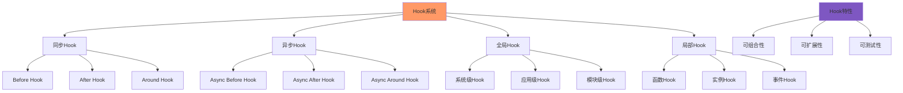
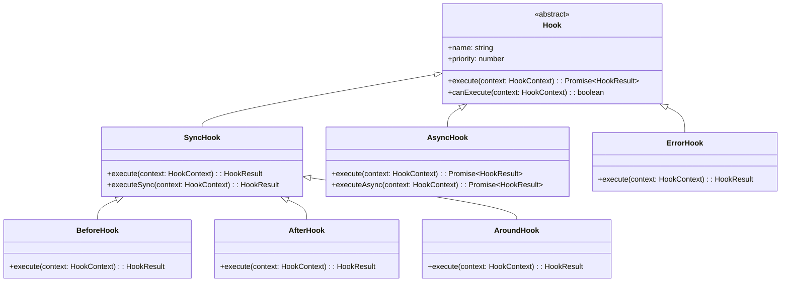
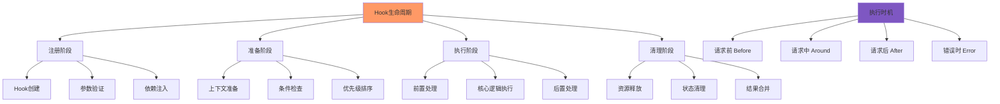
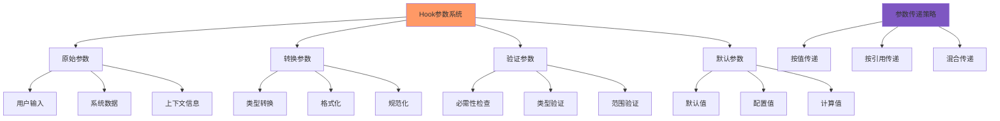
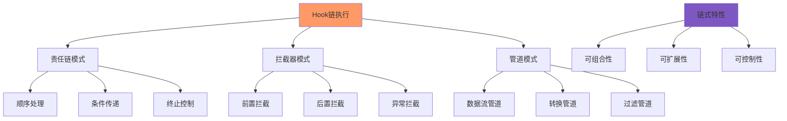
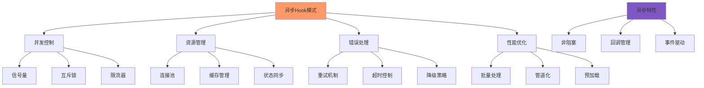
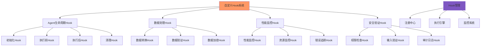

# 第12章：Hook系统和事件处理

## 学习目标

通过本章学习，您将：
- 理解Hook的概念、分类和作用
- 掌握Hook的生命周期和执行时机
- 学习Hook参数和返回值的处理机制
- 理解Hook链式调用的实现原理
- 掌握异步Hook模式的开发技巧
- 能够构建完整的自定义Hook系统

## 12.1 Hook概念和分类

### Hook系统概述



### Hook类型层次结构



### Hook系统基础实现

```typescript
/**
 * Hook系统基础实现
 */
class HookSystem {
  private hooks: Map<string, HookRegistry>;
  private middleware: HookMiddleware[];
  private executionStrategy: ExecutionStrategy;
  
  constructor(config: HookSystemConfig = {}) {
    this.hooks = new Map();
    this.middleware = config.middleware || [];
    this.executionStrategy = config.executionStrategy || ExecutionStrategy.PARALLEL;
  }
  
  /**
   * 注册Hook
   */
  registerHook(hook: Hook): void {
    
    const hookName = hook.name;
    
    if (!this.hooks.has(hookName)) {
      this.hooks.set(hookName, new HookRegistry(hookName));
    }
    
    const registry = this.hooks.get(hookName)!;
    registry.addHook(hook);
  }
  
  /**
   * 注销Hook
   */
  unregisterHook(hookName: string, hookId: string): boolean {
    
    const registry = this.hooks.get(hookName);
    if (!registry) {
      return false;
    }
    
    return registry.removeHook(hookId);
  }
  
  /**
   * 执行Hook
   */
  async executeHook(
    hookName: string,
    context: HookContext
  ): Promise<HookResult> {
    
    const registry = this.hooks.get(hookName);
    if (!registry || registry.getHookCount() === 0) {
      return {
        success: true,
        data: context.data,
        metadata: { hooksExecuted: 0 }
      };
    }
    
    // 1. 获取已排序的Hook
    const hooks = registry.getSortedHooks();
    
    // 2. 执行前置中间件
    for (const middleware of this.middleware) {
      context = await middleware.before(hookName, context);
    }
    
    // 3. 执行Hook
    const result = await this.executeHooks(hooks, context);
    
    // 4. 执行后置中间件
    for (const middleware of this.middleware) {
      await middleware.after(hookName, result, context);
    }
    
    return result;
  }
  
  /**
   * 执行Hook链
   */
  private async executeHooks(
    hooks: Hook[],
    context: HookContext
  ): Promise<HookResult> {
    
    switch (this.executionStrategy) {
      case ExecutionStrategy.SEQUENTIAL:
        return await this.executeSequential(hooks, context);
      
      case ExecutionStrategy.PARALLEL:
        return await this.executeParallel(hooks, context);
      
      case ExecutionStrategy.WATERFALL:
        return await this.executeWaterfall(hooks, context);
      
      default:
        return await this.executeSequential(hooks, context);
    }
  }
  
  /**
   * 顺序执行Hook
   */
  private async executeSequential(
    hooks: Hook[],
    context: HookContext
  ): Promise<HookResult> {
    
    const results: HookResult[] = [];
    let currentContext = context;
    
    for (const hook of hooks) {
      // 检查是否可以执行
      if (!hook.canExecute(currentContext)) {
        continue;
      }
      
      try {
        const result = await hook.execute(currentContext);
        results.push(result);
        
        // 如果Hook要求停止执行
        if (result.stopExecution) {
          break;
        }
        
        // 更新上下文
        currentContext = this.updateContext(currentContext, result);
        
      } catch (error) {
        return {
          success: false,
          error: error as Error,
          metadata: {
            hooksExecuted: results.length,
            failedAt: hook.name
          }
        };
      }
    }
    
    return this.mergeResults(results, currentContext);
  }
  
  /**
   * 并行执行Hook
   */
  private async executeParallel(
    hooks: Hook[],
    context: HookContext
  ): Promise<HookResult> {
    
    const promises = hooks.map(hook => {
      if (!hook.canExecute(context)) {
        return Promise.resolve({ success: true, skipped: true } as HookResult);
      }
      
      return hook.execute(context);
    });
    
    const results = await Promise.all(promises);
    
    return this.mergeResults(results, context);
  }
  
  /**
   * 瀑布式执行Hook
   */
  private async executeWaterfall(
    hooks: Hook[],
    context: HookContext
  ): Promise<HookResult> {
    
    let result: HookResult = {
      success: true,
      data: context.data
    };
    
    for (const hook of hooks) {
      if (!hook.canExecute(context)) {
        continue;
      }
      
      try {
        const hookResult = await hook.execute({
          ...context,
          data: result.data,
          previousResult: result
        });
        
        result = hookResult;
        
        if (result.stopExecution) {
          break;
        }
        
      } catch (error) {
        return {
          success: false,
          error: error as Error,
          previousResults: [result]
        };
      }
    }
    
    return result;
  }
  
  /**
   * 合并结果
   */
  private mergeResults(
    results: HookResult[],
    context: HookContext
  ): HookResult {
    
    const successful = results.filter(r => r.success);
    const failed = results.filter(r => !r.success);
    
    if (failed.length > 0) {
      return {
        success: false,
        error: failed[0].error,
        metadata: {
          hooksExecuted: results.length,
          successfulHooks: successful.length,
          failedHooks: failed.length
        }
      };
    }
    
    return {
      success: true,
      data: this.mergeData(results),
      metadata: {
        hooksExecuted: results.length,
        allSuccessful: true
      }
    };
  }
  
  /**
   * 合并数据
   */
  private mergeData(results: HookResult[]): unknown {
    
    const dataItems = results
      .map(r => r.data)
      .filter(data => data !== undefined);
    
    if (dataItems.length === 0) {
      return undefined;
    }
    
    if (dataItems.length === 1) {
      return dataItems[0];
    }
    
    // 合并多个数据项
    return {
      merged: true,
      items: dataItems
    };
  }
  
  /**
   * 更新上下文
   */
  private updateContext(
    context: HookContext,
    result: HookResult
  ): HookContext {
    
    return {
      ...context,
      data: result.data !== undefined ? result.data : context.data,
      metadata: {
        ...context.metadata,
        lastResult: result
      }
    };
  }
  
  /**
   * 获取Hook统计信息
   */
  getHookStats(): HookStats {
    
    const stats: HookStats = {
      totalHooks: 0,
      hooksByName: {},
      executionStrategy: this.executionStrategy
    };
    
    for (const [name, registry] of this.hooks) {
      const hookCount = registry.getHookCount();
      stats.totalHooks += hookCount;
      stats.hooksByName[name] = hookCount;
    }
    
    return stats;
  }
}

/**
 * Hook注册表
 */
class HookRegistry {
  private hooks: Map<string, Hook>;
  
  constructor(private name: string) {
    this.hooks = new Map();
  }
  
  /**
   * 添加Hook
   */
  addHook(hook: Hook): void {
    this.hooks.set(hook.id, hook);
  }
  
  /**
   * 移除Hook
   */
  removeHook(hookId: string): boolean {
    return this.hooks.delete(hookId);
  }
  
  /**
   * 获取已排序的Hook
   */
  getSortedHooks(): Hook[] {
    
    return Array.from(this.hooks.values())
      .sort((a, b) => b.priority - a.priority);
  }
  
  /**
   * 获取Hook数量
   */
  getHookCount(): number {
    return this.hooks.size;
  }
  
  /**
   * 获取Hook名称
   */
  getName(): string {
    return this.name;
  }
}

/**
 * Hook基类
 */
abstract class Hook {
  abstract name: string;
  abstract priority: number;
  abstract id: string;
  
  /**
   * 执行Hook
   */
  abstract execute(context: HookContext): Promise<HookResult>;
  
  /**
   * 判断是否可以执行
   */
  canExecute(context: HookContext): boolean {
    
    // 默认执行条件：总是可以执行
    return true;
  }
  
  /**
   * 获取Hook信息
   */
  getInfo(): HookInfo {
    
    return {
      id: this.id,
      name: this.name,
      priority: this.priority,
      type: this.constructor.name
    };
  }
}

/**
 * Before Hook
 */
class BeforeHook extends Hook {
  
  constructor(
    public id: string,
    public name: string,
    public priority: number,
    private handler: BeforeHookHandler
  ) {
    super();
  }
  
  async execute(context: HookContext): Promise<HookResult> {
    
    try {
      const result = await this.handler(context);
      
      return {
        success: true,
        data: result,
        metadata: {
          hookType: 'before',
          executedAt: Date.now()
        }
      };
      
    } catch (error) {
      return {
        success: false,
        error: error as Error,
        metadata: {
          hookType: 'before',
          failedAt: Date.now()
        }
      };
    }
  }
}

/**
 * After Hook
 */
class AfterHook extends Hook {
  
  constructor(
    public id: string,
    public name: string,
    public priority: number,
    private handler: AfterHookHandler
  ) {
    super();
  }
  
  async execute(context: HookContext): Promise<HookResult> {
    
    try {
      const result = await this.handler(context);
      
      return {
        success: true,
        data: result,
        metadata: {
          hookType: 'after',
          executedAt: Date.now()
        }
      };
      
    } catch (error) {
      return {
        success: false,
        error: error as Error,
        metadata: {
          hookType: 'after',
          failedAt: Date.now()
        }
      };
    }
  }
}

/**
 * Around Hook
 */
class AroundHook extends Hook {
  
  constructor(
    public id: string,
    public name: string,
    public priority: number,
    private handler: AroundHookHandler
  ) {
    super();
  }
  
  async execute(context: HookContext): Promise<HookResult> {
    
    try {
      // 执行前置逻辑
      const beforeResult = await this.handler.before(context);
      
      // 执行原始操作
      const originalResult = context.originalOperation 
        ? await context.originalOperation(context)
        : beforeResult;
      
      // 执行后置逻辑
      const afterResult = await this.handler.after(context, originalResult);
      
      return {
        success: true,
        data: afterResult,
        metadata: {
          hookType: 'around',
          executedAt: Date.now(),
          originalPreserved: true
        }
      };
      
    } catch (error) {
      return {
        success: false,
        error: error as Error,
        metadata: {
          hookType: 'around',
          failedAt: Date.now()
        }
      };
    }
  }
}

/**
 * Error Hook
 */
class ErrorHook extends Hook {
  
  constructor(
    public id: string,
    public name: string,
    public priority: number,
    private handler: ErrorHookHandler
  ) {
    super();
  }
  
  async execute(context: HookContext): Promise<HookResult> {
    
    // 只有在存在错误时才执行
    if (!context.error) {
      return {
        success: true,
        skipped: true,
        metadata: { hookType: 'error', reason: 'No error to handle' }
      };
    }
    
    try {
      const result = await this.handler(context, context.error);
      
      return {
        success: true,
        data: result,
        error: context.error, // 保留原始错误信息
        metadata: {
          hookType: 'error',
          handledAt: Date.now()
        }
      };
      
    } catch (error) {
      return {
        success: false,
        error: error as Error,
        metadata: {
          hookType: 'error',
          failedAt: Date.now()
        }
      };
    }
  }
  
  canExecute(context: HookContext): boolean {
    return !!context.error;
  }
}

// 执行策略枚举
enum ExecutionStrategy {
  SEQUENTIAL = 'sequential',   // 顺序执行
  PARALLEL = 'parallel',      // 并行执行
  WATERFALL = 'waterfall'     // 瀑布式执行
}

// 类型定义
interface HookSystemConfig {
  middleware?: HookMiddleware[];
  executionStrategy?: ExecutionStrategy;
}

interface HookContext {
  data: unknown;
  metadata?: Record<string, unknown>;
  error?: Error;
  originalOperation?: (context: HookContext) => Promise<unknown>;
  previousResult?: HookResult;
}

interface HookResult {
  success: boolean;
  data?: unknown;
  error?: Error;
  stopExecution?: boolean;
  skipped?: boolean;
  metadata?: Record<string, unknown>;
  previousResults?: HookResult[];
}

interface HookInfo {
  id: string;
  name: string;
  priority: number;
  type: string;
}

interface HookStats {
  totalHooks: number;
  hooksByName: Record<string, number>;
  executionStrategy: ExecutionStrategy;
}

interface HookMiddleware {
  before(hookName: string, context: HookContext): Promise<HookContext>;
  after(hookName: string, result: HookResult, context: HookContext): Promise<void>;
}

type BeforeHookHandler = (context: HookContext) => Promise<unknown>;
type AfterHookHandler = (context: HookContext) => Promise<unknown>;
type AroundHookHandler = {
  before: (context: HookContext) => Promise<unknown>;
  after: (context: HookContext, originalResult: unknown) => Promise<unknown>;
};
type ErrorHookHandler = (context: HookContext, error: Error) => Promise<unknown>;
```

## 12.2 Hook生命周期和执行时机

### Hook生命周期阶段



### Hook生命周期管理器

```typescript
/**
 * Hook生命周期管理器
 */
class HookLifecycleManager {
  private lifecycleHooks: Map<string, LifecycleHook[]>;
  private executionTracker: ExecutionTracker;
  
  constructor() {
    this.lifecycleHooks = new Map();
    this.executionTracker = new ExecutionTracker();
  }
  
  /**
   * 注册生命周期Hook
   */
  registerLifecycleHook(stage: LifecycleStage, hook: LifecycleHook): void {
    
    if (!this.lifecycleHooks.has(stage)) {
      this.lifecycleHooks.set(stage, []);
    }
    
    this.lifecycleHooks.get(stage)!.push(hook);
  }
  
  /**
   * 执行生命周期阶段
   */
  async executeStage(
    stage: LifecycleStage,
    context: LifecycleContext
  ): Promise<LifecycleResult> {
    
    const hooks = this.lifecycleHooks.get(stage) || [];
    const startTime = Date.now();
    
    try {
      // 1. 开始追踪
      const executionId = this.executionTracker.startExecution(stage, context);
      
      // 2. 执行阶段前Hook
      await this.executeBeforeStageHooks(stage, context);
      
      // 3. 执行主要Hook
      const results = await this.executeMainHooks(hooks, context);
      
      // 4. 执行阶段后Hook
      await this.executeAfterStageHooks(stage, context, results);
      
      // 5. 结束追踪
      this.executionTracker.endExecution(executionId);
      
      return {
        success: true,
        stage,
        results,
        executionTime: Date.now() - startTime
      };
      
    } catch (error) {
      return {
        success: false,
        stage,
        error: error as Error,
        executionTime: Date.now() - startTime
      };
    }
  }
  
  /**
   * 完整的Hook生命周期执行
   */
  async executeFullLifecycle(
    hooks: Hook[],
    context: HookContext
  ): Promise<HookResult> {
    
    const lifecycleContext: LifecycleContext = {
      ...context,
      hooks,
      startTime: Date.now()
    };
    
    // 1. 注册阶段
    await this.executeStage('register', lifecycleContext);
    
    // 2. 准备阶段
    await this.executeStage('prepare', lifecycleContext);
    
    // 3. 执行阶段
    const executionResult = await this.executeStage('execute', lifecycleContext);
    
    if (!executionResult.success) {
      // 4. 错误处理阶段
      await this.executeStage('error', {
        ...lifecycleContext,
        error: executionResult.error
      });
      
      return executionResult;
    }
    
    // 5. 清理阶段
    await this.executeStage('cleanup', lifecycleContext);
    
    return {
      success: true,
      data: executionResult.results?.[0]?.data,
      metadata: {
        lifecycleStages: ['register', 'prepare', 'execute', 'cleanup'],
        totalExecutionTime: Date.now() - lifecycleContext.startTime
      }
    };
  }
  
  /**
   * 执行阶段前Hook
   */
  private async executeBeforeStageHooks(
    stage: LifecycleStage,
    context: LifecycleContext
  ): Promise<void> {
    
    const beforeHooks = this.lifecycleHooks.get(`before-${stage}`) || [];
    
    for (const hook of beforeHooks) {
      await hook.execute(context);
    }
  }
  
  /**
   * 执行主要Hook
   */
  private async executeMainHooks(
    hooks: LifecycleHook[],
    context: LifecycleContext
  ): Promise<HookResult[]> {
    
    const results: HookResult[] = [];
    
    for (const hook of hooks) {
      try {
        const result = await hook.execute(context);
        results.push(result);
        
        if (result.stopExecution) {
          break;
        }
        
      } catch (error) {
        results.push({
          success: false,
          error: error as Error
        });
      }
    }
    
    return results;
  }
  
  /**
   * 执行阶段后Hook
   */
  private async executeAfterStageHooks(
    stage: LifecycleStage,
    context: LifecycleContext,
    results: HookResult[]
  ): Promise<void> {
    
    const afterHooks = this.lifecycleHooks.get(`after-${stage}`) || [];
    
    for (const hook of afterHooks) {
      await hook.execute({
        ...context,
        results
      });
    }
  }
}

/**
 * 执行追踪器
 */
class ExecutionTracker {
  private executions: Map<string, ExecutionRecord>;
  
  constructor() {
    this.executions = new Map();
  }
  
  /**
   * 开始执行追踪
   */
  startExecution(stage: LifecycleStage, context: LifecycleContext): string {
    
    const executionId = this.generateExecutionId();
    
    const record: ExecutionRecord = {
      id: executionId,
      stage,
      startTime: Date.now(),
      context,
      status: 'running'
    };
    
    this.executions.set(executionId, record);
    
    return executionId;
  }
  
  /**
   * 结束执行追踪
   */
  endExecution(executionId: string): void {
    
    const record = this.executions.get(executionId);
    if (record) {
      record.endTime = Date.now();
      record.status = 'completed';
      record.executionTime = record.endTime - record.startTime;
    }
  }
  
  /**
   * 获取执行记录
   */
  getExecution(executionId: string): ExecutionRecord | undefined {
    return this.executions.get(executionId);
  }
  
  /**
   * 获取所有执行记录
   */
  getAllExecutions(): ExecutionRecord[] {
    return Array.from(this.executions.values());
  }
  
  /**
   * 生成执行ID
   */
  private generateExecutionId(): string {
    return `exec_${Date.now()}_${crypto.randomUUID()}`;
  }
}

// 类型定义
type LifecycleStage = 'register' | 'prepare' | 'execute' | 'cleanup' | 'error' | 
  'before-register' | 'after-register' | 
  'before-prepare' | 'after-prepare' | 
  'before-execute' | 'after-execute' | 
  'before-cleanup' | 'after-cleanup' | 
  'before-error' | 'after-error';

interface LifecycleContext extends HookContext {
  hooks: Hook[];
  startTime: number;
  results?: HookResult[];
}

interface LifecycleResult {
  success: boolean;
  stage: LifecycleStage;
  results?: HookResult[];
  error?: Error;
  executionTime: number;
}

interface LifecycleHook {
  execute(context: LifecycleContext): Promise<void>;
}

interface ExecutionRecord {
  id: string;
  stage: LifecycleStage;
  startTime: number;
  endTime?: number;
  executionTime?: number;
  context: LifecycleContext;
  status: 'running' | 'completed' | 'failed';
}
```

## 12.3 Hook参数和返回值处理

### 参数传递机制



### Hook参数处理器实现

```typescript
/**
 * Hook参数处理器
 */
class HookParameterProcessor {
  private transformers: ParameterTransformer[];
  private validators: ParameterValidator[];
  private defaults: ParameterDefaults;
  
  constructor(config: ParameterProcessorConfig = {}) {
    this.transformers = config.transformers || [];
    this.validators = config.validators || [];
    this.defaults = config.defaults || {};
  }
  
  /**
   * 处理输入参数
   */
  async processInput(
    parameters: HookParameters,
    schema: ParameterSchema
  ): Promise<ProcessedParameters> {
    
    let processed = { ...parameters };
    
    // 1. 应用默认值
    processed = this.applyDefaults(processed, schema);
    
    // 2. 验证参数
    await this.validateParameters(processed, schema);
    
    // 3. 转换参数
    processed = await this.transformParameters(processed, schema);
    
    // 4. 规范化参数
    processed = this.normalizeParameters(processed, schema);
    
    return {
      original: parameters,
      processed,
      schema,
      transformations: this.trackTransformations(parameters, processed)
    };
  }
  
  /**
   * 处理返回值
   */
  async processResult(
    result: HookResult,
    schema: ResultSchema
  ): Promise<ProcessedResult> {
    
    let processed = { ...result };
    
    // 1. 验证结果
    await this.validateResult(processed, schema);
    
    // 2. 转换结果
    processed = await this.transformResult(processed, schema);
    
    // 3. 应用过滤器
    processed = this.filterResult(processed, schema);
    
    return {
      original: result,
      processed,
      schema,
      transformations: this.trackTransformations(result, processed)
    };
  }
  
  /**
   * 应用默认值
   */
  private applyDefaults(
    parameters: HookParameters,
    schema: ParameterSchema
  ): HookParameters {
    
    const result = { ...parameters };
    
    for (const [key, def] of Object.entries(this.defaults)) {
      if (result[key as keyof HookParameters] === undefined) {
        (result as Record<string, unknown>)[key] = def;
      }
    }
    
    // 应用schema中的默认值
    for (const [key, fieldSchema] of Object.entries(schema)) {
      if (
        result[key as keyof HookParameters] === undefined && 
        fieldSchema.default !== undefined
      ) {
        (result as Record<string, unknown>)[key] = fieldSchema.default;
      }
    }
    
    return result;
  }
  
  /**
   * 验证参数
   */
  private async validateParameters(
    parameters: HookParameters,
    schema: ParameterSchema
  ): Promise<void> {
    
    // 1. 检查必需参数
    for (const [key, fieldSchema] of Object.entries(schema)) {
      if (fieldSchema.required && parameters[key as keyof HookParameters] === undefined) {
        throw new Error(`Required parameter missing: ${key}`);
      }
    }
    
    // 2. 执行自定义验证器
    for (const validator of this.validators) {
      const result = await validator.validate(parameters, schema);
      if (!result.valid) {
        throw new Error(`Parameter validation failed: ${result.error}`);
      }
    }
    
    // 3. 类型验证
    this.validateTypes(parameters, schema);
  }
  
  /**
   * 验证类型
   */
  private validateTypes(parameters: HookParameters, schema: ParameterSchema): void {
    
    for (const [key, value] of Object.entries(parameters)) {
      const fieldSchema = schema[key];
      
      if (fieldSchema && value !== undefined) {
        const actualType = typeof value;
        const expectedType = fieldSchema.type;
        
        if (actualType !== expectedType) {
          throw new Error(
            `Type mismatch for ${key}: expected ${expectedType}, got ${actualType}`
          );
        }
      }
    }
  }
  
  /**
   * 转换参数
   */
  private async transformParameters(
    parameters: HookParameters,
    schema: ParameterSchema
  ): Promise<HookParameters> {
    
    let result = { ...parameters };
    
    for (const transformer of this.transformers) {
      result = await transformer.transform(result, schema);
    }
    
    return result;
  }
  
  /**
   * 规范化参数
   */
  private normalizeParameters(
    parameters: HookParameters,
    schema: ParameterSchema
  ): HookParameters {
    
    const result: HookParameters = {} as HookParameters;
    
    for (const [key, value] of Object.entries(parameters)) {
      const fieldSchema = schema[key];
      
      if (fieldSchema) {
        // 应用规范化函数
        if (fieldSchema.normalizer) {
          result[key as keyof HookParameters] = fieldSchema.normalizer(value);
        } else {
          result[key as keyof HookParameters] = value;
        }
      } else {
        result[key as keyof HookParameters] = value;
      }
    }
    
    return result;
  }
  
  /**
   * 验证结果
   */
  private async validateResult(result: HookResult, schema: ResultSchema): Promise<void> {
    
    if (schema.required && result.data === undefined) {
      throw new Error('Result data is required but undefined');
    }
    
    if (schema.type && result.data !== undefined) {
      const actualType = typeof result.data;
      if (actualType !== schema.type) {
        throw new Error(`Result type mismatch: expected ${schema.type}, got ${actualType}`);
      }
    }
  }
  
  /**
   * 转换结果
   */
  private async transformResult(
    result: HookResult,
    schema: ResultSchema
  ): Promise<HookResult> {
    
    if (schema.transformer && result.data !== undefined) {
      return {
        ...result,
        data: await schema.transformer(result.data)
      };
    }
    
    return result;
  }
  
  /**
   * 过滤结果
   */
  private filterResult(result: HookResult, schema: ResultSchema): HookResult {
    
    if (schema.filter && result.data !== undefined) {
      return {
        ...result,
        data: schema.filter(result.data)
      };
    }
    
    return result;
  }
  
  /**
   * 跟踪转换过程
   */
  private trackTransformations(
    original: HookParameters | HookResult,
    processed: HookParameters | HookResult
  ): TransformationRecord[] {
    
    const transformations: TransformationRecord[] = [];
    
    // 简化的转换跟踪
    for (const key in processed) {
      if (original[key as keyof typeof original] !== processed[key as keyof typeof processed]) {
        transformations.push({
          key,
          from: original[key as keyof typeof original],
          to: processed[key as keyof typeof processed],
          timestamp: Date.now()
        });
      }
    }
    
    return transformations;
  }
}

/**
 * 参数转换器
 */
class ParameterTransformer {
  
  constructor(
    private name: string,
    private transformFn: (params: HookParameters, schema: ParameterSchema) => Promise<HookParameters>
  ) {}
  
  async transform(parameters: HookParameters, schema: ParameterSchema): Promise<HookParameters> {
    return await this.transformFn(parameters, schema);
  }
}

/**
 * 参数验证器
 */
class ParameterValidator {
  
  constructor(
    private name: string,
    private validateFn: (params: HookParameters, schema: ParameterSchema) => Promise<ValidationResult>
  ) {}
  
  async validate(parameters: HookParameters, schema: ParameterSchema): Promise<ValidationResult> {
    return await this.validateFn(parameters, schema);
  }
}

// 类型定义
interface ParameterProcessorConfig {
  transformers?: ParameterTransformer[];
  validators?: ParameterValidator[];
  defaults?: ParameterDefaults;
}

type ParameterDefaults = Record<string, unknown>;

interface ParameterSchema {
  [key: string]: {
    type: string;
    required?: boolean;
    default?: unknown;
    normalizer?: (value: unknown) => unknown;
  };
}

interface ResultSchema {
  required?: boolean;
  type?: string;
  transformer?: (data: unknown) => Promise<unknown>;
  filter?: (data: unknown) => unknown;
}

interface ProcessedParameters {
  original: HookParameters;
  processed: HookParameters;
  schema: ParameterSchema;
  transformations: TransformationRecord[];
}

interface ProcessedResult {
  original: HookResult;
  processed: HookResult;
  schema: ResultSchema;
  transformations: TransformationRecord[];
}

interface TransformationRecord {
  key: string;
  from: unknown;
  to: unknown;
  timestamp: number;
}

interface ValidationResult {
  valid: boolean;
  error?: string;
}

interface HookParameters {
  [key: string]: unknown;
}
```

## 12.4 Hook链式调用

### Hook链执行模式



### Hook链管理器实现

```typescript
/**
 * Hook链管理器
 */
class HookChainManager {
  private chains: Map<string, HookChain>;
  private chainBuilder: ChainBuilder;
  
  constructor() {
    this.chains = new Map();
    this.chainBuilder = new ChainBuilder();
  }
  
  /**
   * 创建Hook链
   */
  createChain(chainName: string, config: ChainConfig): HookChain {
    
    const chain = this.chainBuilder
      .setName(chainName)
      .setStrategy(config.strategy || ChainStrategy.SEQUENTIAL)
      .setErrorHandling(config.errorHandling || ErrorHandling.CONTINUE)
      .build();
    
    this.chains.set(chainName, chain);
    
    return chain;
  }
  
  /**
   * 获取Hook链
   */
  getChain(chainName: string): HookChain | undefined {
    return this.chains.get(chainName);
  }
  
  /**
   * 执行Hook链
   */
  async executeChain(
    chainName: string,
    context: ChainContext
  ): Promise<ChainResult> {
    
    const chain = this.chains.get(chainName);
    if (!chain) {
      throw new Error(`Chain not found: ${chainName}`);
    }
    
    return await chain.execute(context);
  }
  
  /**
   * 构建动态链
   */
  buildDynamicChain(hooks: Hook[], config: ChainConfig): HookChain {
    
    return this.chainBuilder
      .setHooks(hooks)
      .setStrategy(config.strategy || ChainStrategy.SEQUENTIAL)
      .setErrorHandling(config.errorHandling || ErrorHandling.CONTINUE)
      .build();
  }
}

/**
 * Hook链
 */
class HookChain {
  private hooks: Hook[];
  private strategy: ChainStrategy;
  private errorHandling: ErrorHandling;
  private interceptors: ChainInterceptor[];
  
  constructor(config: ChainConfig) {
    this.hooks = config.hooks || [];
    this.strategy = config.strategy || ChainStrategy.SEQUENTIAL;
    this.errorHandling = config.errorHandling || ErrorHandling.CONTINUE;
    this.interceptors = config.interceptors || [];
  }
  
  /**
   * 执行链
   */
  async execute(context: ChainContext): Promise<ChainResult> {
    
    const startTime = Date.now();
    const results: HookResult[] = [];
    
    try {
      // 1. 执行前置拦截器
      for (const interceptor of this.interceptors) {
        if (interceptor.before) {
          await interceptor.before(context);
        }
      }
      
      // 2. 根据策略执行Hook
      switch (this.strategy) {
        case ChainStrategy.SEQUENTIAL:
          await this.executeSequential(context, results);
          break;
        
        case ChainStrategy.PARALLEL:
          await this.executeParallel(context, results);
          break;
        
        case ChainStrategy.WATERFALL:
          await this.executeWaterfall(context, results);
          break;
      }
      
      // 3. 执行后置拦截器
      for (const interceptor of this.interceptors) {
        if (interceptor.after) {
          await interceptor.after(context, results);
        }
      }
      
      return {
        success: true,
        results,
        executionTime: Date.now() - startTime,
        hooksExecuted: results.length
      };
      
    } catch (error) {
      return {
        success: false,
        error: error as Error,
        results,
        executionTime: Date.now() - startTime,
        hooksExecuted: results.length
      };
    }
  }
  
  /**
   * 顺序执行
   */
  private async executeSequential(
    context: ChainContext,
    results: HookResult[]
  ): Promise<void> {
    
    let currentContext = context;
    
    for (const hook of this.hooks) {
      const result = await this.executeHook(hook, currentContext);
      results.push(result);
      
      // 检查是否需要停止
      if (result.stopExecution) {
        break;
      }
      
      // 更新上下文
      currentContext = this.updateContext(currentContext, result);
      
      // 检查错误处理
      if (!result.success && this.errorHandling === ErrorHandling.STOP) {
        break;
      }
    }
  }
  
  /**
   * 并行执行
   */
  private async executeParallel(
    context: ChainContext,
    results: HookResult[]
  ): Promise<void> {
    
    const promises = this.hooks.map(hook => 
      this.executeHook(hook, context)
    );
    
    const hookResults = await Promise.all(promises);
    results.push(...hookResults);
  }
  
  /**
   * 瀑布式执行
   */
  private async executeWaterfall(
    context: ChainContext,
    results: HookResult[]
  ): Promise<void> {
    
    let currentData = context.data;
    
    for (const hook of this.hooks) {
      const hookContext: ChainContext = {
        ...context,
        data: currentData
      };
      
      const result = await this.executeHook(hook, hookContext);
      results.push(result);
      
      if (!result.success && this.errorHandling === ErrorHandling.STOP) {
        break;
      }
      
      currentData = result.data !== undefined ? result.data : currentData;
      
      if (result.stopExecution) {
        break;
      }
    }
  }
  
  /**
   * 执行单个Hook
   */
  private async executeHook(hook: Hook, context: ChainContext): Promise<HookResult> {
    
    try {
      return await hook.execute(context);
      
    } catch (error) {
      if (this.errorHandling === ErrorHandling.THROW) {
        throw error;
      }
      
      return {
        success: false,
        error: error as Error,
        metadata: { hookName: hook.name }
      };
    }
  }
  
  /**
   * 更新上下文
   */
  private updateContext(context: ChainContext, result: HookResult): ChainContext {
    
    return {
      ...context,
      data: result.data !== undefined ? result.data : context.data,
      lastResult: result
    };
  }
  
  /**
   * 添加Hook
   */
  addHook(hook: Hook): void {
    this.hooks.push(hook);
  }
  
  /**
   * 移除Hook
   */
  removeHook(hookId: string): boolean {
    const index = this.hooks.findIndex(h => h.id === hookId);
    if (index > -1) {
      this.hooks.splice(index, 1);
      return true;
    }
    return false;
  }
  
  /**
   * 获取Hook数量
   */
  getHookCount(): number {
    return this.hooks.length;
  }
}

/**
 * 链构建器
 */
class ChainBuilder {
  private config: ChainConfig;
  
  constructor() {
    this.config = {
      hooks: [],
      strategy: ChainStrategy.SEQUENTIAL,
      errorHandling: ErrorHandling.CONTINUE,
      interceptors: []
    };
  }
  
  setName(name: string): ChainBuilder {
    this.config.name = name;
    return this;
  }
  
  setHooks(hooks: Hook[]): ChainBuilder {
    this.config.hooks = hooks;
    return this;
  }
  
  setStrategy(strategy: ChainStrategy): ChainBuilder {
    this.config.strategy = strategy;
    return this;
  }
  
  setErrorHandling(handling: ErrorHandling): ChainBuilder {
    this.config.errorHandling = handling;
    return this;
  }
  
  addInterceptor(interceptor: ChainInterceptor): ChainBuilder {
    if (!this.config.interceptors) {
      this.config.interceptors = [];
    }
    this.config.interceptors.push(interceptor);
    return this;
  }
  
  build(): HookChain {
    return new HookChain(this.config);
  }
}

/**
 * 链式拦截器
 */
class ChainInterceptor {
  
  constructor(
    public name: string,
    public before?: (context: ChainContext) => Promise<void>,
    public after?: (context: ChainContext, results: HookResult[]) => Promise<void>
  ) {}
}

// 类型定义
interface ChainConfig {
  name?: string;
  hooks?: Hook[];
  strategy?: ChainStrategy;
  errorHandling?: ErrorHandling;
  interceptors?: ChainInterceptor[];
}

interface ChainContext extends HookContext {
  lastResult?: HookResult;
}

interface ChainResult {
  success: boolean;
  results: HookResult[];
  error?: Error;
  executionTime: number;
  hooksExecuted: number;
}

enum ChainStrategy {
  SEQUENTIAL = 'sequential',  // 顺序执行
  PARALLEL = 'parallel',      // 并行执行
  WATERFALL = 'waterfall'    // 瀑布式执行
}

enum ErrorHandling {
  CONTINUE = 'continue',  // 继续执行
  STOP = 'stop',         // 停止执行
  THROW = 'throw'        // 抛出异常
}
```

## 12.5 异步Hook模式

### 异步Hook执行模型



### 异步Hook执行器实现

```typescript
/**
 * 异步Hook执行器
 */
class AsyncHookExecutor {
  private semaphore: Semaphore;
  private timeoutManager: TimeoutManager;
  private retryManager: RetryManager;
  private circuitBreaker: CircuitBreaker;
  
  constructor(config: AsyncExecutorConfig) {
    this.semaphore = new Semaphore(config.concurrency || 10);
    this.timeoutManager = new TimeoutManager(config.defaultTimeout || 30000);
    this.retryManager = new RetryManager(config.retryPolicy || {});
    this.circuitBreaker = new CircuitBreaker(config.circuitBreaker || {});
  }
  
  /**
   * 执行异步Hook
   */
  async executeAsync(
    hook: Hook,
    context: HookContext,
    options: AsyncExecutionOptions = {}
  ): Promise<HookResult> {
    
    // 1. 检查断路器
    if (this.circuitBreaker.isOpen(hook.name)) {
      return {
        success: false,
        error: new Error('Circuit breaker is open'),
        skipped: true,
        metadata: { reason: 'circuit_breaker' }
      };
    }
    
    // 2. 获取信号量
    const release = await this.semaphore.acquire();
    
    try {
      // 3. 执行带超时的Hook
      const result = await this.executeWithTimeout(
        hook,
        context,
        options.timeout || this.timeoutManager.getDefaultTimeout()
      );
      
      // 4. 记录成功
      this.circuitBreaker.recordSuccess(hook.name);
      
      return result;
      
    } catch (error) {
      // 5. 记录失败
      this.circuitBreaker.recordFailure(hook.name);
      
      // 6. 判断是否需要重试
      if (options.retry !== false && this.shouldRetry(error, options)) {
        return await this.retryExecution(hook, context, options);
      }
      
      return {
        success: false,
        error: error as Error,
        metadata: { executionType: 'async' }
      };
      
    } finally {
      // 7. 释放信号量
      release();
    }
  }
  
  /**
   * 批量执行Hook
   */
  async executeBatch(
    hooks: Hook[],
    context: HookContext,
    options: BatchExecutionOptions = {}
  ): Promise<BatchResult> {
    
    const results: HookResult[] = [];
    const batchSize = options.batchSize || hooks.length;
    
    // 分批处理
    for (let i = 0; i < hooks.length; i += batchSize) {
      const batch = hooks.slice(i, i + batchSize);
      
      // 并行执行批次中的Hook
      const batchResults = await Promise.all(
        batch.map(hook => this.executeAsync(hook, context, options))
      );
      
      results.push(...batchResults);
      
      // 批次间延迟
      if (options.batchDelay && i + batchSize < hooks.length) {
        await this.delay(options.batchDelay);
      }
    }
    
    return {
      totalHooks: hooks.length,
      successfulHooks: results.filter(r => r.success).length,
      failedHooks: results.filter(r => !r.success).length,
      results,
      executionTime: 0
    };
  }
  
  /**
   * 带超时的执行
   */
  private async executeWithTimeout(
    hook: Hook,
    context: HookContext,
    timeout: number
  ): Promise<HookResult> {
    
    return await Promise.race([
      hook.execute(context),
      this.createTimeoutPromise(timeout)
    ]);
  }
  
  /**
   * 创建超时Promise
   */
  private createTimeoutPromise(timeout: number): Promise<HookResult> {
    
    return new Promise((_, reject) => {
      setTimeout(() => {
        reject(new Error(`Hook execution timeout after ${timeout}ms`));
      }, timeout);
    });
  }
  
  /**
   * 判断是否应该重试
   */
  private shouldRetry(error: unknown, options: AsyncExecutionOptions): boolean {
    
    if (options.maxRetries === 0) {
      return false;
    }
    
    const errorMessage = error instanceof Error ? error.message : String(error);
    
    // 检查是否为可重试的错误
    const retryableErrors = options.retryableErrors || [
      'timeout',
      'network',
      'temporary'
    ];
    
    return retryableErrors.some(pattern => 
      errorMessage.toLowerCase().includes(pattern.toLowerCase())
    );
  }
  
  /**
   * 重试执行
   */
  private async retryExecution(
    hook: Hook,
    context: HookContext,
    options: AsyncExecutionOptions
  ): Promise<HookResult> {
    
    const maxRetries = options.maxRetries || 3;
    const retryDelay = options.retryDelay || 1000;
    
    for (let attempt = 1; attempt <= maxRetries; attempt++) {
      // 重试延迟
      if (attempt > 1) {
        await this.delay(retryDelay * attempt); // 指数退避
      }
      
      try {
        const result = await this.executeWithTimeout(
          hook,
          context,
          options.timeout || this.timeoutManager.getDefaultTimeout()
        );
        
        return {
          ...result,
          metadata: {
            ...result.metadata,
            retryAttempt: attempt,
            retried: true
          }
        };
        
      } catch (error) {
        if (attempt === maxRetries) {
          return {
            success: false,
            error: error as Error,
            metadata: {
              retryAttempts: maxRetries,
              finalFailure: true
            }
          };
        }
      }
    }
    
    return {
      success: false,
      error: new Error('Max retries exceeded'),
      metadata: { retryAttempts: maxRetries }
    };
  }
  
  /**
   * 延迟执行
   */
  private delay(ms: number): Promise<void> {
    return new Promise(resolve => setTimeout(resolve, ms));
  }
  
  /**
   * 获取执行统计
   */
  getStats(): ExecutorStats {
    
    return {
      activeExecutions: this.semaphore.getActiveCount(),
      availablePermits: this.semaphore.getAvailablePermits(),
      circuitBreakerStates: this.circuitBreaker.getAllStates()
    };
  }
}

/**
 * 信号量
 */
class Semaphore {
  private permits: number;
  private waitQueue: Array<(release: () => void) => void>;
  
  constructor(permits: number) {
    this.permits = permits;
    this.waitQueue = [];
  }
  
  /**
   * 获取信号量
   */
  async acquire(): Promise<() => void> {
    
    return new Promise<(release: () => void)>(resolve => {
      if (this.permits > 0) {
        this.permits--;
        resolve(() => this.release());
      } else {
        this.waitQueue.push(() => {
          this.permits--;
          resolve(() => this.release());
        });
      }
    });
  }
  
  /**
   * 释放信号量
   */
  release(): void {
    
    if (this.waitQueue.length > 0) {
      const nextResolve = this.waitQueue.shift()!;
      nextResolve();
    } else {
      this.permits++;
    }
  }
  
  /**
   * 获取活跃执行数
   */
  getActiveCount(): number {
    const totalPermits = this.permits + this.waitQueue.length;
    return totalPermits - this.permits;
  }
  
  /**
   * 获取可用信号量
   */
  getAvailablePermits(): number {
    return this.permits;
  }
}

/**
 * 超时管理器
 */
class TimeoutManager {
  private defaultTimeout: number;
  private hookTimeouts: Map<string, number>;
  
  constructor(defaultTimeout: number) {
    this.defaultTimeout = defaultTimeout;
    this.hookTimeouts = new Map();
  }
  
  /**
   * 获取默认超时时间
   */
  getDefaultTimeout(): number {
    return this.defaultTimeout;
  }
  
  /**
   * 设置Hook超时时间
   */
  setHookTimeout(hookName: string, timeout: number): void {
    this.hookTimeouts.set(hookName, timeout);
  }
  
  /**
   * 获取Hook超时时间
   */
  getHookTimeout(hookName: string): number | undefined {
    return this.hookTimeouts.get(hookName);
  }
}

/**
 * 重试管理器
 */
class RetryManager {
  private retryPolicy: RetryPolicy;
  
  constructor(retryPolicy: RetryPolicy) {
    this.retryPolicy = retryPolicy;
  }
  
  /**
   * 计算重试延迟
   */
  calculateRetryDelay(attempt: number): number {
    
    switch (this.retryPolicy.backoff) {
      case 'fixed':
        return this.retryPolicy.delay || 1000;
      
      case 'exponential':
        return (this.retryPolicy.delay || 1000) * Math.pow(2, attempt - 1);
      
      case 'linear':
        return (this.retryPolicy.delay || 1000) * attempt;
      
      default:
        return 1000;
    }
  }
}

/**
 * 断路器
 */
class CircuitBreaker {
  private states: Map<string, CircuitState>;
  private config: CircuitBreakerConfig;
  
  constructor(config: CircuitBreakerConfig) {
    this.states = new Map();
    this.config = config;
  }
  
  /**
   * 判断断路器是否打开
   */
  isOpen(hookName: string): boolean {
    
    const state = this.getState(hookName);
    
    if (state.state === 'open') {
      // 检查是否应该半开
      if (Date.now() - state.openedAt >= (this.config.resetTimeout || 60000)) {
        this.transitionTo(hookName, 'half-open');
        return false;
      }
      return true;
    }
    
    return false.state === 'open';
  }
  
  /**
   * 记录成功
   */
  recordSuccess(hookName: string): void {
    
    const state = this.getState(hookName);
    
    if (state.state === 'half-open') {
      this.transitionTo(hookName, 'closed');
    } else if (state.state === 'closed') {
      state.successCount++;
      state.consecutiveFailures = 0;
      
      // 检查是否应该打开断路器
      if (this.shouldOpen(state)) {
        this.transitionTo(hookName, 'open');
      }
    }
  }
  
  /**
   * 记录失败
   */
  recordFailure(hookName: string): void {
    
    const state = this.getState(hookName);
    
    state.consecutiveFailures++;
    state.failureCount++;
    
    if (state.state === 'half-open' || this.shouldOpen(state)) {
      this.transitionTo(hookName, 'open');
    }
  }
  
  /**
   * 获取状态
   */
  private getState(hookName: string): CircuitState {
    
    if (!this.states.has(hookName)) {
      this.states.set(hookName, {
        state: 'closed',
        successCount: 0,
        failureCount: 0,
        consecutiveFailures: 0,
        lastStateChange: Date.now()
      });
    }
    
    return this.states.get(hookName)!;
  }
  
  /**
   * 转换状态
   */
  private transitionTo(hookName: string, newState: 'open' | 'closed' | 'half-open'): void {
    
    const state = this.getState(hookName);
    
    state.state = newState;
    state.lastStateChange = Date.now();
    
    if (newState === 'open') {
      state.openedAt = Date.now();
    }
  }
  
  /**
   * 判断是否应该打开断路器
   */
  private shouldOpen(state: CircuitState): boolean {
    
    const failureThreshold = this.config.failureThreshold || 5;
    const failureRatio = this.config.failureRatio || 0.5;
    
    // 检查连续失败次数
    if (state.consecutiveFailures >= failureThreshold) {
      return true;
    }
    
    // 检查失败比例
    const totalRequests = state.successCount + state.failureCount;
    if (totalRequests >= 10) { // 最小请求数
      const currentFailureRatio = state.failureCount / totalRequests;
      if (currentFailureRatio >= failureRatio) {
        return true;
      }
    }
    
    return false;
  }
  
  /**
   * 获取所有状态
   */
  getAllStates(): Map<string, CircuitState> {
    return new Map(this.states);
  }
}

// 类型定义
interface AsyncExecutorConfig {
  concurrency?: number;
  defaultTimeout?: number;
  retryPolicy?: RetryPolicy;
  circuitBreaker?: CircuitBreakerConfig;
}

interface AsyncExecutionOptions {
  timeout?: number;
  maxRetries?: number;
  retryDelay?: number;
  retryableErrors?: string[];
  retry?: boolean;
}

interface BatchExecutionOptions extends AsyncExecutionOptions {
  batchSize?: number;
  batchDelay?: number;
}

interface RetryPolicy {
  maxRetries?: number;
  delay?: number;
  backoff?: 'fixed' | 'exponential' | 'linear';
  retryableErrors?: string[];
}

interface CircuitBreakerConfig {
  failureThreshold?: number;
  failureRatio?: number;
  resetTimeout?: number;
}

interface ExecutorStats {
  activeExecutions: number;
  availablePermits: number;
  circuitBreakerStates: Map<string, CircuitState>;
}

interface CircuitState {
  state: 'closed' | 'open' | 'half-open';
  successCount: number;
  failureCount: number;
  consecutiveFailures: number;
  lastStateChange: number;
  openedAt?: number;
}

interface BatchResult {
  totalHooks: number;
  successfulHooks: number;
  failedHooks: number;
  results: HookResult[];
  executionTime: number;
}
```

## 12.6 实践：构建自定义Hook系统

### 自定义Hook系统架构



### 自定义Hook系统实现

```typescript
/**
 * 自定义Hook系统实现
 * 演示如何构建一个完整的Agent Hook系统
 */
class AgentHookSystem {
  private hookSystem: HookSystem;
  private lifecycleManager: HookLifecycleManager;
  private asyncExecutor: AsyncHookExecutor;
  private chainManager: HookChainManager;
  private parameterProcessor: HookParameterProcessor;
  
  constructor(config: AgentHookSystemConfig) {
    this.hookSystem = new HookSystem(config.systemConfig);
    this.lifecycleManager = new HookLifecycleManager();
    this.asyncExecutor = new AsyncHookExecutor(config.asyncConfig);
    this.chainManager = new HookChainManager();
    this.parameterProcessor = new HookParameterProcessor(config.parameterConfig);
  }
  
  /**
   * 初始化Hook系统
   */
  async initialize(): Promise<void> {
    
    // 1. 注册系统Hook
    await this.registerSystemHooks();
    
    // 2. 设置Hook链
    await this.setupHookChains();
    
    // 3. 配置生命周期Hook
    await this.configureLifecycleHooks();
    
    console.log('Agent Hook System initialized');
  }
  
  /**
   * 注册系统Hook
   */
  private async registerSystemHooks(): Promise<void> {
    
    // Agent生命周期Hook
    this.registerAgentLifecycleHooks();
    
    // 数据处理Hook
    this.registerDataProcessingHooks();
    
    // 性能监控Hook
    this.registerPerformanceHooks();
    
    // 安全验证Hook
    this.registerSecurityHooks();
  }
  
  /**
   * 注册Agent生命周期Hook
   */
  private registerAgentLifecycleHooks(): void {
    
    // 初始化Hook
    this.hookSystem.registerHook(new BeforeHook(
      'hook-init-1',
      'agent.initialize',
      100,
      async (context) => {
        console.log('Before agent initialization:', context);
        return { initialized: true };
      }
    ));
    
    this.hookSystem.registerHook(new AfterHook(
      'hook-init-2',
      'agent.initialize',
      100,
      async (context) => {
        console.log('After agent initialization:', context);
        return { initializationComplete: true };
      }
    ));
    
    // 执行前Hook
    this.hookSystem.registerHook(new BeforeHook(
      'hook-before-exec-1',
      'agent.beforeExecution',
      100,
      async (context) => {
        console.log('Before agent execution:', context);
        return { executionPrepared: true };
      }
    ));
    
    // 执行后Hook
    this.hookSystem.registerHook(new AfterHook(
      'hook-after-exec-1',
      'agent.afterExecution',
      100,
      async (context) => {
        console.log('After agent execution:', context);
        return { executionComplete: true };
      }
    ));
    
    // 错误处理Hook
    this.hookSystem.registerHook(new ErrorHook(
      'hook-error-1',
      'agent.error',
      100,
      async (context, error) => {
        console.error('Agent error occurred:', error);
        return { errorHandled: true, errorMessage: error.message };
      }
    ));
  }
  
  /**
   * 注册数据处理Hook
   */
  private registerDataProcessingHooks(): void {
    
    // 数据转换Hook
    this.hookSystem.registerHook(new BeforeHook(
      'hook-data-transform-1',
      'data.transform',
      100,
      async (context) => {
        const data = context.data as Record<string, unknown>;
        
        // 数据标准化
        const transformed = {
          ...data,
          timestamp: Date.now(),
          processed: true
        };
        
        return { original: data, transformed };
      }
    ));
    
    // 数据验证Hook
    this.hookSystem.registerHook(new BeforeHook(
      'hook-data-validate-1',
      'data.validate',
      100,
      async (context) => {
        const data = context.data as Record<string, unknown>;
        
        // 基本验证
        if (!data || typeof data !== 'object') {
          throw new Error('Invalid data format');
        }
        
        return { valid: true, validated: true };
      }
    ));
    
    // 数据加密Hook
    this.hookSystem.registerHook(new BeforeHook(
      'hook-data-encrypt-1',
      'data.encrypt',
      50,
      async (context) => {
        const data = context.data;
        
        // 简化的加密
        const encrypted = Buffer.from(JSON.stringify(data)).toString('base64');
        
        return { original: data, encrypted };
      }
    ));
  }
  
  /**
   * 注册性能监控Hook
   */
  private registerPerformanceHooks(): void {
    
    // 性能监控Hook
    this.hookSystem.registerHook(new AroundHook(
      'hook-perf-monitor-1',
      'performance.monitor',
      100,
      {
        before: async (context) => {
          const startTime = Date.now();
          return { startTime, monitoring: true };
        },
        after: async (context, originalResult) => {
          const executionTime = Date.now() - (context.data as { startTime: number }).startTime;
          
          return {
            ...originalResult,
            performanceMetrics: {
              executionTime,
              memoryUsage: process.memoryUsage(),
              cpuUsage: process.cpuUsage()
            }
          };
        }
      }
    ));
    
    // 资源监控Hook
    this.hookSystem.registerHook(new BeforeHook(
      'hook-resource-monitor-1',
      'resource.monitor',
      100,
      async (context) => {
        return {
          resources: {
            memory: process.memoryUsage(),
            cpu: process.cpuUsage(),
            uptime: process.uptime()
          }
        };
      }
    ));
  }
  
  /**
   * 注册安全验证Hook
   */
  private registerSecurityHooks(): void {
    
    // 权限检查Hook
    this.hookSystem.registerHook(new BeforeHook(
      'hook-security-perm-1',
      'security.permission',
      100,
      async (context) => {
        const user = (context.data as { user?: string }).user;
        
        if (!user) {
          throw new Error('User not authenticated');
        }
        
        return { authorized: true, user };
      }
    ));
    
    // 输入验证Hook
    this.hookSystem.registerHook(new BeforeHook(
      'hook-security-input-1',
      'security.inputValidation',
      100,
      async (context) => {
        const data = context.data as Record<string, unknown>;
        
        // 检查恶意输入
        const maliciousPatterns = [
          /<script>/i,
          /javascript:/i,
          /onerror=/i
        ];
        
        for (const [key, value] of Object.entries(data)) {
          if (typeof value === 'string') {
            for (const pattern of maliciousPatterns) {
              if (pattern.test(value)) {
                throw new Error(`Malicious input detected in field: ${key}`);
              }
            }
          }
        }
        
        return { sanitized: true, safe: true };
      }
    ));
    
    // 审计日志Hook
    this.hookSystem.registerHook(new AfterHook(
      'hook-security-audit-1',
      'security.audit',
      100,
      async (context) => {
        const auditLog = {
          timestamp: Date.now(),
          action: 'agent_execution',
          user: (context.data as { user?: string }).user,
          result: 'success',
          metadata: context.metadata
        };
        
        console.log('Audit log:', auditLog);
        
        return { audited: true, auditLog };
      }
    ));
  }
  
  /**
   * 设置Hook链
   */
  private async setupHookChains(): Promise<void> {
    
    // 创建数据处理链
    const dataProcessingChain = this.chainManager.createChain('dataProcessing', {
      strategy: ChainStrategy.SEQUENTIAL,
      errorHandling: ErrorHandling.CONTINUE
    });
    
    // 添加Hook到链
    dataProcessingChain.addHook(new BeforeHook(
      'hook-chain-data-1',
      'data.transform',
      100,
      async (context) => ({ transformed: true })
    ));
    
    dataProcessingChain.addHook(new BeforeHook(
      'hook-chain-data-2',
      'data.validate',
      90,
      async (context) => ({ validated: true })
    ));
    
    // 创建安全检查链
    const securityChain = this.chainManager.createChain('security', {
      strategy: ChainStrategy.SEQUENTIAL,
      errorHandling: ErrorHandling.STOP
    });
    
    securityChain.addHook(new BeforeHook(
      'hook-chain-security-1',
      'security.permission',
      100,
      async (context) => ({ authorized: true })
    ));
    
    securityChain.addHook(new BeforeHook(
      'hook-chain-security-2',
      'security.inputValidation',
      90,
      async (context) => ({ sanitized: true })
    ));
  }
  
  /**
   * 配置生命周期Hook
   */
  private async configureLifecycleHooks(): Promise<void> {
    
    // 注册阶段Hook
    this.lifecycleManager.registerLifecycleHook('register', {
      execute: async (context) => {
        console.log('Register stage:', context);
      }
    });
    
    this.lifecycleManager.registerLifecycleHook('prepare', {
      execute: async (context) => {
        console.log('Prepare stage:', context);
      }
    });
    
    this.lifecycleManager.registerLifecycleHook('cleanup', {
      execute: async (context) => {
        console.log('Cleanup stage:', context);
      }
    });
  }
  
  /**
   * 执行Agent生命周期Hook
   */
  async executeAgentLifecycle(
    stage: 'initialize' | 'beforeExecution' | 'afterExecution' | 'error',
    context: HookContext
  ): Promise<HookResult> {
    
    const hookName = `agent.${stage}`;
    return await this.hookSystem.executeHook(hookName, context);
  }
  
  /**
   * 执行数据处理链
   */
  async executeDataProcessing(data: unknown): Promise<ChainResult> {
    
    const context: ChainContext = {
      data,
      metadata: { chain: 'dataProcessing' }
    };
    
    return await this.chainManager.executeChain('dataProcessing', context);
  }
  
  /**
   * 执行安全检查链
   */
  async executeSecurityCheck(data: unknown): Promise<ChainResult> {
    
    const context: ChainContext = {
      data,
      metadata: { chain: 'security' }
    };
    
    return await this.chainManager.executeChain('security', context);
  }
  
  /**
   * 获取Hook系统统计信息
   */
  getSystemStats(): HookSystemStats {
    
    return {
      hookStats: this.hookSystem.getHookStats(),
      asyncStats: this.asyncExecutor.getStats(),
      registeredChains: Array.from(this.chainManager.getAllChains?.keys() || []),
      systemLoad: {
        memory: process.memoryUsage(),
        cpu: process.cpuUsage(),
        uptime: process.uptime()
      }
    };
  }
}

/**
 * Hook系统管理器
 */
class HookSystemManager {
  private systems: Map<string, AgentHookSystem>;
  
  constructor() {
    this.systems = new Map();
  }
  
  /**
   * 创建Hook系统
   */
  createSystem(systemId: string, config: AgentHookSystemConfig): AgentHookSystem {
    
    const system = new AgentHookSystem(config);
    this.systems.set(systemId, system);
    
    return system;
  }
  
  /**
   * 获取Hook系统
   */
  getSystem(systemId: string): AgentHookSystem | undefined {
    return this.systems.get(systemId);
  }
  
  /**
   * 删除Hook系统
   */
  deleteSystem(systemId: string): boolean {
    return this.systems.delete(systemId);
  }
  
  /**
   * 获取所有系统统计
   */
  getAllSystemStats(): Record<string, HookSystemStats> {
    
    const stats: Record<string, HookSystemStats> = {};
    
    for (const [systemId, system] of this.systems) {
      stats[systemId] = system.getSystemStats();
    }
    
    return stats;
  }
}

// 类型定义
interface AgentHookSystemConfig {
  systemConfig?: HookSystemConfig;
  asyncConfig?: AsyncExecutorConfig;
  parameterConfig?: ParameterProcessorConfig;
}

interface HookSystemStats {
  hookStats: HookStats;
  asyncStats: ExecutorStats;
  registeredChains: string[];
  systemLoad: {
    memory: NodeJS.MemoryUsage;
    cpu: NodeJS.CpuUsage;
    uptime: number;
  };
}

// 扩展HookChainManager类
class HookChainManager extends ChainManager {
  getAllChains?: Map<string, HookChain>;
}
```

## 本章小结

### 学习成果检查清单

- [ ] 理解了Hook的概念、分类和核心价值
- [ ] 掌握了Hook生命周期的各个阶段和执行时机
- [ ] 学会了Hook参数和返回值的处理机制
- [ ] 理解了Hook链式调用的实现原理
- [ ] 掌握了异步Hook模式的开发技巧
- [ ] 能够构建完整的自定义Hook系统

### 核心概念总结

1. **Hook分类体系**：Hook分为同步Hook、异步Hook、全局Hook和局部Hook，按执行时机可分为Before、After、Around和Error Hook。

2. **生命周期管理**：Hook经历注册、准备、执行、清理等阶段，每个阶段都有相应的Hook进行控制和监控。

3. **参数处理机制**：通过参数转换器、验证器和默认值设置，实现灵活的参数处理和验证。

4. **链式调用模式**：支持顺序执行、并行执行和瀑布式执行等策略，实现Hook的组合和复用。

5. **异步执行控制**：通过信号量、超时管理、重试机制和断路器等组件，实现可靠的异步Hook执行。

6. **自定义系统**：构建完整的Agent Hook系统，包含生命周期Hook、数据处理Hook、性能监控Hook和安全验证Hook。

### 实践练习

#### 练习1：实现自定义Hook

创建一个自定义的Hook类型：

```typescript
class CustomHook extends Hook {
  // 实现自定义Hook功能
  // - 定义Hook执行逻辑
  // - 实现参数验证
  // - 支持异步执行
}
```

#### 练习2：构建Hook链

开发一个复杂的Hook链系统：

```typescript
class AdvancedHookChain extends HookChain {
  // 实现高级Hook链功能
  // - 支持动态Hook添加
  // - 实现条件执行
  // - 支持错误恢复
}
```

#### 练习3：实现异步Hook系统

构建一个完整的异步Hook执行系统：

```typescript
class AsyncHookSystem extends AsyncHookExecutor {
  // 实现异步Hook系统
  // - 支持并发控制
  // - 实现重试和超时机制
  // - 支持性能监控
}
```

### 下一步学习

完成本章学习后，建议继续学习：

- **第13章：技能系统** - 深入了解技能系统的工作原理和实现
- **第14章：工作流编排** - 学习复杂工作流的编排和管理
- **第15章：多Agent协作模式** - 掌握多Agent协作的设计和实现

---

**作者**: OpenCode社区  
**更新时间**: 2025-01-14  
**版本**: 1.0