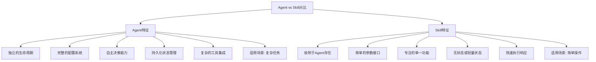
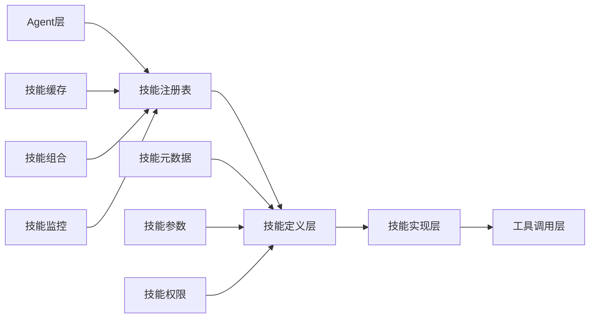
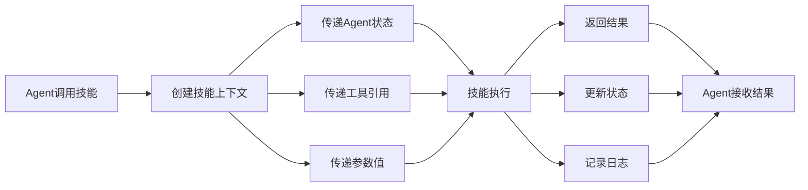
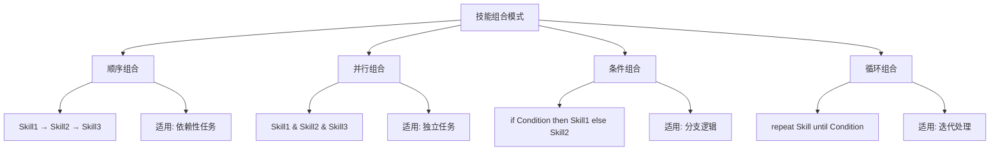
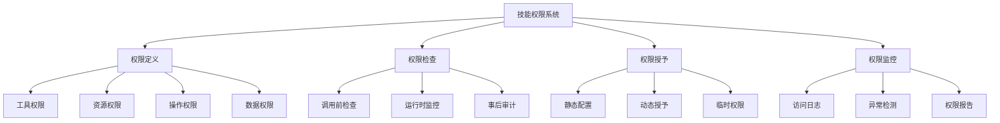

# 第13章：技能系统

> **本章学习目标**
> - 理解技能概念和与Agent的区别
> - 掌握技能定义和注册机制
> - 学习技能参数传递和处理
> - 理解技能组合和嵌套技术
> - 掌握技能权限控制方法

---

## 13.1 技能概念和与Agent的区别

### 13.1.1 什么是技能

技能（Skill）是Agent系统中的可重用行为单元，类似于传统编程中的函数或方法，但具有更强的语义表达和智能处理能力。技能与Agent的主要区别包括：



### 13.1.2 技能系统架构

技能系统采用分层架构设计：



### 13.1.3 技能的核心价值

```typescript
// 技能核心价值示例
interface SkillCoreValue {
  // 1. 重用性：一次定义，多次使用
  reusability: 'code-reuse' | 'logic-reuse' | 'behavior-reuse';
  
  // 2. 组合性：小技能组合成复杂功能
  composability: 'linear' | 'branching' | 'recursive';
  
  // 3. 语义化：自描述的行为意图
  semantics: 'self-documenting' | 'intent-clear' | 'context-aware';
  
  // 4. 标准化：统一的接口和调用方式
  standardization: 'unified-interface' | 'consistent-behavior';
}
```

---

## 13.2 技能定义和注册机制

### 13.2.1 基础技能定义

技能定义包含元数据、参数定义、处理逻辑和返回值规范：

```typescript
// 技能定义结构
interface SkillDefinition {
  // 技能标识
  id: string;
  
  // 技能元数据
  metadata: {
    name: string;              // 技能名称
    description: string;       // 功能描述
    category: string;          // 分类标签
    version: string;          // 版本号
    author: string;           // 作者
  };
  
  // 参数定义
  parameters: SkillParameter[];
  
  // 执行逻辑
  handler: SkillHandler;
  
  // 权限配置
  permissions?: Permission[];
  
  // 配置选项
  options?: SkillOptions;
}

// 参数定义
interface SkillParameter {
  name: string;
  type: 'string' | 'number' | 'boolean' | 'object' | 'array';
  required: boolean;
  description: string;
  default?: any;
  validation?: (value: any) => boolean | string;
}

// 技能处理器
interface SkillHandler {
  (context: SkillContext): Promise<SkillResult>;
}

// 技能上下文
interface SkillContext {
  agent: Agent;              // 执行Agent
  parameters: Record<string, any>;  // 参数值
  tools: ToolRegistry;       // 工具注册表
  state: StateManager;       // 状态管理器
  logger: Logger;           // 日志记录器
}

// 技能结果
interface SkillResult {
  success: boolean;
  data?: any;
  error?: Error;
  metadata?: {
    executionTime: number;
    tokensUsed?: number;
    steps?: string[];
  };
}
```

### 13.2.2 技能注册系统

```typescript
// 技能注册表实现
class SkillRegistry {
  private skills = new Map<string, SkillDefinition>();
  private categories = new Map<string, Set<string>>();
  private cache = new Map<string, CachedSkill>();
  
  // 注册技能
  register(skill: SkillDefinition): void {
    // 验证技能定义
    this.validateSkill(skill);
    
    // 检查重复
    if (this.skills.has(skill.id)) {
      throw new Error(`Skill ${skill.id} already registered`);
    }
    
    // 存储技能
    this.skills.set(skill.id, skill);
    
    // 更新分类索引
    const categorySet = this.categories.get(skill.metadata.category) 
                      || new Set<string>();
    categorySet.add(skill.id);
    this.categories.set(skill.metadata.category, categorySet);
    
    logger.info(`Skill registered: ${skill.id}`);
  }
  
  // 批量注册
  registerBatch(skills: SkillDefinition[]): void {
    skills.forEach(skill => this.register(skill));
  }
  
  // 获取技能
  get(id: string): SkillDefinition | undefined {
    return this.skills.get(id);
  }
  
  // 按分类查询
  getByCategory(category: string): SkillDefinition[] {
    const skillIds = this.categories.get(category);
    if (!skillIds) return [];
    
    return Array.from(skillIds)
      .map(id => this.skills.get(id))
      .filter(Boolean) as SkillDefinition[];
  }
  
  // 搜索技能
  search(query: string): SkillDefinition[] {
    const results: SkillDefinition[] = [];
    
    for (const skill of this.skills.values()) {
      // 在名称和描述中搜索
      if (skill.metadata.name.includes(query) || 
          skill.metadata.description.includes(query)) {
        results.push(skill);
      }
    }
    
    return results;
  }
  
  // 验证技能定义
  private validateSkill(skill: SkillDefinition): void {
    if (!skill.id || !skill.metadata?.name) {
      throw new Error('Invalid skill definition: missing required fields');
    }
    
    // 验证参数定义
    skill.parameters.forEach(param => {
      if (!param.name || !param.type) {
        throw new Error(`Invalid parameter: ${param.name}`);
      }
    });
    
    // 验证处理器
    if (typeof skill.handler !== 'function') {
      throw new Error('Invalid skill handler');
    }
  }
  
  // 清除缓存
  clearCache(): void {
    this.cache.clear();
  }
}

// 缓存技能
interface CachedSkill {
  definition: SkillDefinition;
  timestamp: number;
  hitCount: number;
}
```

### 13.2.3 技能工厂模式

```typescript
// 技能工厂
class SkillFactory {
  private registry: SkillRegistry;
  
  constructor(registry: SkillRegistry) {
    this.registry = registry;
  }
  
  // 创建技能实例
  createInstance(skillId: string, config?: SkillConfig): SkillInstance {
    const definition = this.registry.get(skillId);
    if (!definition) {
      throw new Error(`Skill not found: ${skillId}`);
    }
    
    // 创建技能实例
    return new SkillInstance(definition, config);
  }
  
  // 批量创建
  createBatch(skillConfigs: Array<{id: string; config?: SkillConfig}>): SkillInstance[] {
    return skillConfigs.map(({id, config}) => this.createInstance(id, config));
  }
  
  // 创建技能链
  createChain(skillIds: string[]): SkillChain {
    const skills = skillIds.map(id => {
      const definition = this.registry.get(id);
      if (!definition) {
        throw new Error(`Skill not found: ${id}`);
      }
      return definition;
    });
    
    return new SkillChain(skills);
  }
}

// 技能实例
class SkillInstance {
  private definition: SkillDefinition;
  private config: SkillConfig;
  
  constructor(definition: SkillDefinition, config: SkillConfig = {}) {
    this.definition = definition;
    this.config = config;
  }
  
  // 执行技能
  async execute(context: SkillContext): Promise<SkillResult> {
    const startTime = Date.now();
    
    try {
      // 参数验证
      this.validateParameters(context.parameters);
      
      // 执行技能逻辑
      const result = await this.definition.handler(context);
      
      // 添加元数据
      result.metadata = {
        executionTime: Date.now() - startTime,
        ...result.metadata
      };
      
      return result;
    } catch (error) {
      return {
        success: false,
        error: error as Error,
        metadata: { executionTime: Date.now() - startTime }
      };
    }
  }
  
  // 参数验证
  private validateParameters(parameters: Record<string, any>): void {
    for (const param of this.definition.parameters) {
      // 检查必填参数
      if (param.required && !(param.name in parameters)) {
        throw new Error(`Missing required parameter: ${param.name}`);
      }
      
      // 类型检查
      if (param.name in parameters) {
        const value = parameters[param.name];
        if (!this.checkType(value, param.type)) {
          throw new Error(`Invalid type for ${param.name}: expected ${param.type}`);
        }
      }
      
      // 自定义验证
      if (param.validation && param.name in parameters) {
        const result = param.validation(parameters[param.name]);
        if (result === false || typeof result === 'string') {
          throw new Error(`Validation failed for ${param.name}: ${result}`);
        }
      }
    }
  }
  
  // 类型检查
  private checkType(value: any, expectedType: string): boolean {
    switch (expectedType) {
      case 'string':
        return typeof value === 'string';
      case 'number':
        return typeof value === 'number';
      case 'boolean':
        return typeof value === 'boolean';
      case 'object':
        return typeof value === 'object' && value !== null;
      case 'array':
        return Array.isArray(value);
      default:
        return true;
    }
  }
}

// 技能链
class SkillChain {
  private skills: SkillDefinition[];
  
  constructor(skills: SkillDefinition[]) {
    this.skills = skills;
  }
  
  // 顺序执行
  async executeSequential(context: SkillContext): Promise<SkillResult[]> {
    const results: SkillResult[] = [];
    
    for (const skill of this.skills) {
      const instance = new SkillInstance(skill);
      const result = await instance.execute(context);
      results.push(result);
      
      // 如果失败，停止执行
      if (!result.success) {
        break;
      }
      
      // 将结果传递给下一个技能
      context.parameters = {
        ...context.parameters,
        previousResult: result.data
      };
    }
    
    return results;
  }
}
```

---

## 13.3 技能参数传递

### 13.3.1 参数传递机制

```typescript
// 参数传递系统
class SkillParameterSystem {
  // 参数解析
  static parseParameters(
    definition: SkillDefinition,
    input: any
  ): Record<string, any> {
    const parameters: Record<string, any> = {};
    
    for (const param of definition.parameters) {
      // 从输入中提取参数
      const value = this.extractParameter(param, input);
      
      // 应用默认值
      if (value === undefined && param.default !== undefined) {
        parameters[param.name] = param.default;
        continue;
      }
      
      // 验证参数
      if (value !== undefined) {
        const validated = this.validateParameter(param, value);
        parameters[param.name] = validated;
      }
    }
    
    return parameters;
  }
  
  // 提取参数
  private static extractParameter(param: SkillParameter, input: any): any {
    // 支持多种输入格式
    if (typeof input === 'object' && input !== null) {
      return input[param.name];
    }
    return undefined;
  }
  
  // 验证参数
  private static validateParameter(param: SkillParameter, value: any): any {
    // 类型验证
    if (!this.checkType(value, param.type)) {
      throw new Error(`Invalid type for ${param.name}`);
    }
    
    // 自定义验证
    if (param.validation) {
      const result = param.validation(value);
      if (result === false) {
        throw new Error(`Validation failed for ${param.name}`);
      }
      if (typeof result === 'string') {
        throw new Error(`Validation failed for ${param.name}: ${result}`);
      }
    }
    
    return value;
  }
  
  // 类型检查
  private static checkType(value: any, type: string): boolean {
    switch (type) {
      case 'string':
        return typeof value === 'string';
      case 'number':
        return typeof value === 'number';
      case 'boolean':
        return typeof value === 'boolean';
      case 'object':
        return typeof value === 'object' && value !== null && !Array.isArray(value);
      case 'array':
        return Array.isArray(value);
      default:
        return true;
    }
  }
  
  // 参数转换
  static transformParameters(
    parameters: Record<string, any>,
    transforms: Record<string, (value: any) => any>
  ): Record<string, any> {
    const transformed = { ...parameters };
    
    for (const [name, transform] of Object.entries(transforms)) {
      if (name in transformed) {
        transformed[name] = transform(transformed[name]);
      }
    }
    
    return transformed;
  }
}
```

### 13.3.2 上下文传递



### 13.3.3 参数传递示例

```typescript
// 参数传递示例
class ParameterPassingExamples {
  // 简单参数传递
  static async simpleParameterPass() {
    const skillDefinition: SkillDefinition = {
      id: 'text-analysis',
      metadata: {
        name: '文本分析',
        description: '分析文本内容',
        category: 'analysis',
        version: '1.0.0',
        author: 'System'
      },
      parameters: [
        {
          name: 'text',
          type: 'string',
          required: true,
          description: '待分析的文本'
        },
        {
          name: 'options',
          type: 'object',
          required: false,
          description: '分析选项',
          default: { sentiment: true, keywords: true }
        }
      ],
      handler: async (context) => {
        const { text, options } = context.parameters;
        
        // 执行分析
        const result = {
          sentiment: options.sentiment ? analyzeSentiment(text) : null,
          keywords: options.keywords ? extractKeywords(text) : []
        };
        
        return { success: true, data: result };
      }
    };
    
    // 使用技能
    const context: SkillContext = {
      agent: currentAgent,
      parameters: {
        text: '这是一段示例文本',
        options: { sentiment: true, keywords: false }
      },
      tools: toolRegistry,
      state: stateManager,
      logger: logger
    };
    
    const instance = new SkillInstance(skillDefinition);
    const result = await instance.execute(context);
    
    return result;
  }
  
  // 复杂参数传递
  static async complexParameterPass() {
    const skillDefinition: SkillDefinition = {
      id: 'data-processing',
      metadata: {
        name: '数据处理',
        description: '处理复杂数据结构',
        category: 'processing',
        version: '1.0.0',
        author: 'System'
      },
      parameters: [
        {
          name: 'dataset',
          type: 'array',
          required: true,
          description: '数据集'
        },
        {
          name: 'config',
          type: 'object',
          required: false,
          description: '处理配置',
          default: {}
        },
        {
          name: 'callbacks',
          type: 'object',
          required: false,
          description: '回调函数'
        }
      ],
      handler: async (context) => {
        const { dataset, config, callbacks } = context.parameters;
        
        // 数据处理
        const processed = dataset.map((item: any, index: number) => {
          // 调用进度回调
          callbacks?.onProgress?.(index, dataset.length);
          
          // 处理数据项
          return processData(item, config);
        });
        
        // 调用完成回调
        callbacks?.onComplete?.(processed);
        
        return { success: true, data: processed };
      }
    };
    
    // 使用复杂参数
    const context: SkillContext = {
      agent: currentAgent,
      parameters: {
        dataset: [1, 2, 3, 4, 5],
        config: { normalize: true },
        callbacks: {
          onProgress: (current: number, total: number) => {
            console.log(`Progress: ${current}/${total}`);
          },
          onComplete: (result: any) => {
            console.log('Processing complete:', result);
          }
        }
      },
      tools: toolRegistry,
      state: stateManager,
      logger: logger
    };
    
    const instance = new SkillInstance(skillDefinition);
    const result = await instance.execute(context);
    
    return result;
  }
}
```

---

## 13.4 技能组合和嵌套

### 13.4.1 技能组合模式



### 13.4.2 技能组合实现

```typescript
// 技能组合器
class SkillComposer {
  // 顺序组合
  static sequence(...skillIds: string[]): ComposedSkill {
    return new ComposedSkill({
      type: 'sequence',
      skills: skillIds
    });
  }
  
  // 并行组合
  static parallel(...skillIds: string[]): ComposedSkill {
    return new ComposedSkill({
      type: 'parallel',
      skills: skillIds
    });
  }
  
  // 条件组合
  static conditional(
    condition: (context: SkillContext) => boolean,
    trueSkill: string,
    falseSkill?: string
  ): ComposedSkill {
    return new ComposedSkill({
      type: 'conditional',
      condition,
      trueSkill,
      falseSkill
    });
  }
  
  // 循环组合
  static loop(
    skillId: string,
    condition: (context: SkillContext, result: SkillResult) => boolean
  ): ComposedSkill {
    return new ComposedSkill({
      type: 'loop',
      skill: skillId,
      condition
    });
  }
  
  // 管道组合
  static pipeline(...skillIds: string[]): ComposedSkill {
    return new ComposedSkill({
      type: 'pipeline',
      skills: skillIds
    });
  }
}

// 组合技能
class ComposedSkill {
  private composition: SkillComposition;
  private registry: SkillRegistry;
  
  constructor(composition: SkillComposition) {
    this.composition = composition;
    this.registry = SkillRegistry.getInstance();
  }
  
  // 执行组合技能
  async execute(context: SkillContext): Promise<SkillResult> {
    switch (this.composition.type) {
      case 'sequence':
        return this.executeSequence(context);
      case 'parallel':
        return this.executeParallel(context);
      case 'conditional':
        return this.executeConditional(context);
      case 'loop':
        return this.executeLoop(context);
      case 'pipeline':
        return this.executePipeline(context);
      default:
        throw new Error(`Unknown composition type: ${this.composition.type}`);
    }
  }
  
  // 执行顺序组合
  private async executeSequence(context: SkillContext): Promise<SkillResult> {
    const skills = this.composition.skills.map(id => this.registry.get(id));
    let finalResult: SkillResult = { success: true };
    
    for (const skill of skills) {
      if (!skill) continue;
      
      const instance = new SkillInstance(skill);
      const result = await instance.execute(context);
      
      // 传递结果到下一个技能
      context.parameters = {
        ...context.parameters,
        previousResult: result.data
      };
      
      finalResult = result;
      
      // 如果失败，停止执行
      if (!result.success) {
        break;
      }
    }
    
    return finalResult;
  }
  
  // 执行并行组合
  private async executeParallel(context: SkillContext): Promise<SkillResult> {
    const skills = this.composition.skills.map(id => this.registry.get(id));
    
    // 并行执行所有技能
    const promises = skills.map(skill => {
      if (!skill) return Promise.resolve({ success: false });
      
      const instance = new SkillInstance(skill);
      return instance.execute({ ...context }); // 创建独立的上下文副本
    });
    
    const results = await Promise.all(promises);
    
    // 合并结果
    const success = results.every(r => r.success);
    const data = results.map(r => r.data);
    
    return {
      success,
      data,
      metadata: {
        individualResults: results
      }
    };
  }
  
  // 执行条件组合
  private async executeConditional(context: SkillContext): Promise<SkillResult> {
    const condition = this.composition.condition;
    const trueSkill = this.registry.get(this.composition.trueSkill);
    const falseSkill = this.composition.falseSkill 
                     ? this.registry.get(this.composition.falseSkill)
                     : null;
    
    // 评估条件
    const useTrue = condition(context);
    const selectedSkill = useTrue ? trueSkill : falseSkill;
    
    if (!selectedSkill) {
      return { success: true, data: null };
    }
    
    const instance = new SkillInstance(selectedSkill);
    return instance.execute(context);
  }
  
  // 执行循环组合
  private async executeLoop(context: SkillContext): Promise<SkillResult> {
    const skill = this.registry.get(this.composition.skill);
    if (!skill) {
      return { success: false, error: new Error('Skill not found') };
    }
    
    const results: SkillResult[] = [];
    let iteration = 0;
    const maxIterations = 100; // 防止无限循环
    
    while (iteration < maxIterations) {
      const instance = new SkillInstance(skill);
      const result = await instance.execute(context);
      results.push(result);
      
      // 检查循环条件
      if (!this.composition.condition(context, result)) {
        break;
      }
      
      // 更新上下文
      context.parameters = {
        ...context.parameters,
        previousResult: result.data,
        iteration: iteration + 1
      };
      
      iteration++;
    }
    
    return {
      success: true,
      data: results.map(r => r.data),
      metadata: { iterations: iteration }
    };
  }
  
  // 执行管道组合
  private async executePipeline(context: SkillContext): Promise<SkillResult> {
    const skills = this.composition.skills.map(id => this.registry.get(id));
    let data = context.parameters.input;
    
    for (const skill of skills) {
      if (!skill) continue;
      
      // 创建处理上下文
      const pipelineContext: SkillContext = {
        ...context,
        parameters: { input: data }
      };
      
      const instance = new SkillInstance(skill);
      const result = await instance.execute(pipelineContext);
      
      // 传递输出到下一个阶段
      data = result.data;
      
      if (!result.success) {
        return result;
      }
    }
    
    return { success: true, data };
  }
}

// 组合定义接口
interface SkillComposition {
  type: 'sequence' | 'parallel' | 'conditional' | 'loop' | 'pipeline';
  skills?: string[];
  skill?: string;
  condition?: (context: SkillContext, result?: SkillResult) => boolean;
  trueSkill?: string;
  falseSkill?: string;
}
```

### 13.4.3 技能嵌套示例

```typescript
// 技能嵌套示例
class SkillNestingExamples {
  // 创建嵌套技能结构
  static createNestedSkills() {
    // 基础技能
    const textValidation: SkillDefinition = {
      id: 'text-validation',
      metadata: {
        name: '文本验证',
        description: '验证文本输入',
        category: 'validation',
        version: '1.0.0',
        author: 'System'
      },
      parameters: [
        { name: 'text', type: 'string', required: true, description: '待验证文本' }
      ],
      handler: async (context) => {
        const { text } = context.parameters;
        const isValid = text && text.length > 0 && text.length < 1000;
        return { success: true, data: { isValid, text } };
      }
    };
    
    const sentimentAnalysis: SkillDefinition = {
      id: 'sentiment-analysis',
      metadata: {
        name: '情感分析',
        description: '分析文本情感倾向',
        category: 'analysis',
        version: '1.0.0',
        author: 'System'
      },
      parameters: [
        { name: 'text', type: 'string', required: true, description: '待分析文本' }
      ],
      handler: async (context) => {
        const { text } = context.parameters;
        // 模拟情感分析
        const sentiment = Math.random() > 0.5 ? 'positive' : 'negative';
        return { success: true, data: { sentiment, confidence: 0.8 } };
      }
    };
    
    const keywordExtraction: SkillDefinition = {
      id: 'keyword-extraction',
      metadata: {
        name: '关键词提取',
        description: '提取文本关键词',
        category: 'analysis',
        version: '1.0.0',
        author: 'System'
      },
      parameters: [
        { name: 'text', type: 'string', required: true, description: '待处理文本' }
      ],
      handler: async (context) => {
        const { text } = context.parameters;
        // 模拟关键词提取
        const keywords = text.split(' ').slice(0, 5);
        return { success: true, data: { keywords } };
      }
    };
    
    const reportGeneration: SkillDefinition = {
      id: 'report-generation',
      metadata: {
        name: '报告生成',
        description: '生成分析报告',
        category: 'reporting',
        version: '1.0.0',
        author: 'System'
      },
      parameters: [
        { name: 'sentiment', type: 'string', required: false },
        { name: 'keywords', type: 'array', required: false },
        { name: 'validation', type: 'object', required: false }
      ],
      handler: async (context) => {
        const { sentiment, keywords, validation } = context.parameters;
        const report = {
          summary: `文本分析完成，情感倾向: ${sentiment}`,
          keywords: keywords,
          validation: validation
        };
        return { success: true, data: report };
      }
    };
    
    // 创建组合技能
    const textProcessing = SkillComposer.sequence(
      'text-validation',
      'sentiment-analysis',
      'keyword-extraction'
    );
    
    // 或者使用并行组合
    const parallelAnalysis = SkillComposer.parallel(
      'sentiment-analysis',
      'keyword-extraction'
    );
    
    return {
      baseSkills: [textValidation, sentimentAnalysis, keywordExtraction, reportGeneration],
      composedSkills: [textProcessing, parallelAnalysis]
    };
  }
  
  // 使用嵌套技能
  static async useNestedSkills() {
    const { baseSkills, composedSkills } = this.createNestedSkills();
    
    // 注册基础技能
    const registry = new SkillRegistry();
    baseSkills.forEach(skill => registry.register(skill));
    
    // 创建组合技能
    const pipeline = SkillComposer.pipeline(
      'text-validation',
      'sentiment-analysis',
      'keyword-extraction',
      'report-generation'
    );
    
    // 执行组合技能
    const context: SkillContext = {
      agent: currentAgent,
      parameters: {
        input: '这是一段需要分析的文本内容'
      },
      tools: toolRegistry,
      state: stateManager,
      logger: logger
    };
    
    const result = await pipeline.execute(context);
    
    return result;
  }
}
```

---

## 13.5 技能权限控制

### 13.5.1 权限系统架构



### 13.5.2 权限控制系统实现

```typescript
// 权限定义
interface SkillPermission {
  id: string;
  type: 'tool' | 'resource' | 'operation' | 'data';
  scope: string;
  conditions?: PermissionCondition[];
}

interface PermissionCondition {
  field: string;
  operator: 'equals' | 'contains' | 'matches' | 'in';
  value: any;
}

// 权限管理器
class SkillPermissionManager {
  private permissions = new Map<string, Set<SkillPermission>>();
  private auditLog: AuditLog[] = [];
  
  // 授予技能权限
  grantPermissions(skillId: string, permissions: SkillPermission[]): void {
    const skillPerms = this.permissions.get(skillId) || new Set<SkillPermission>();
    permissions.forEach(perm => skillPerms.add(perm));
    this.permissions.set(skillId, skillPerms);
    
    logger.info(`Granted ${permissions.length} permissions to skill: ${skillId}`);
  }
  
  // 检查权限
  async checkPermission(
    skillId: string,
    permissionType: string,
    context: SkillContext
  ): Promise<boolean> {
    const skillPerms = this.permissions.get(skillId);
    if (!skillPerms || skillPerms.size === 0) {
      // 无权限配置，拒绝访问
      this.logAudit(skillId, permissionType, false, 'No permissions configured');
      return false;
    }
    
    // 检查相关权限
    for (const perm of skillPerms) {
      if (perm.type === permissionType) {
        const hasPermission = await this.evaluatePermission(perm, context);
        
        this.logAudit(skillId, permissionType, hasPermission);
        
        return hasPermission;
      }
    }
    
    return false;
  }
  
  // 评估权限条件
  private async evaluatePermission(
    permission: SkillPermission,
    context: SkillContext
  ): Promise<boolean> {
    if (!permission.conditions || permission.conditions.length === 0) {
      return true;
    }
    
    // 评估所有条件
    for (const condition of permission.conditions) {
      const satisfied = await this.evaluateCondition(condition, context);
      if (!satisfied) {
        return false;
      }
    }
    
    return true;
  }
  
  // 评估单个条件
  private async evaluateCondition(
    condition: PermissionCondition,
    context: SkillContext
  ): Promise<boolean> {
    const value = this.getFieldValue(context, condition.field);
    
    switch (condition.operator) {
      case 'equals':
        return value === condition.value;
      case 'contains':
        return typeof value === 'string' && value.includes(condition.value);
      case 'matches':
        return new RegExp(condition.value).test(String(value));
      case 'in':
        return Array.isArray(condition.value) && condition.value.includes(value);
      default:
        return false;
    }
  }
  
  // 获取字段值
  private getFieldValue(context: SkillContext, field: string): any {
    const fields = field.split('.');
    let value: any = context;
    
    for (const f of fields) {
      value = value?.[f];
    }
    
    return value;
  }
  
  // 记录审计日志
  private logAudit(
    skillId: string,
    permissionType: string,
    granted: boolean,
    reason?: string
  ): void {
    this.auditLog.push({
      timestamp: new Date(),
      skillId,
      permissionType,
      granted,
      reason
    });
  }
  
  // 获取审计日志
  getAuditLog(skillId?: string): AuditLog[] {
    if (skillId) {
      return this.auditLog.filter(log => log.skillId === skillId);
    }
    return [...this.auditLog];
  }
}

// 审计日志接口
interface AuditLog {
  timestamp: Date;
  skillId: string;
  permissionType: string;
  granted: boolean;
  reason?: string;
}

// 权限装饰器
class SkillPermissionDecorator {
  constructor(
    private skill: SkillInstance,
    private permissionManager: SkillPermissionManager
  ) {}
  
  // 执行技能（带权限检查）
  async execute(context: SkillContext): Promise<SkillResult> {
    // 检查工具权限
    const hasToolPermission = await this.permissionManager.checkPermission(
      this.skill.getId(),
      'tool',
      context
    );
    
    if (!hasToolPermission) {
      return {
        success: false,
        error: new Error('Permission denied: tool access not granted')
      };
    }
    
    // 检查资源权限
    const hasResourcePermission = await this.permissionManager.checkPermission(
      this.skill.getId(),
      'resource',
      context
    );
    
    if (!hasResourcePermission) {
      return {
        success: false,
        error: new Error('Permission denied: resource access not granted')
      };
    }
    
    // 执行原技能
    return this.skill.execute(context);
  }
}
```

### 13.5.3 权限控制示例

```typescript
// 权限控制示例
class PermissionControlExamples {
  // 设置技能权限
  static setupSkillPermissions() {
    const permissionManager = new SkillPermissionManager();
    
    // 为数据分析技能设置权限
    permissionManager.grantPermissions('data-analysis', [
      {
        id: 'read-database',
        type: 'resource',
        scope: 'database:read',
        conditions: [
          { field: 'agent.role', operator: 'equals', value: 'analyst' }
        ]
      },
      {
        id: 'use-calculator',
        type: 'tool',
        scope: 'tool:calculator',
        conditions: []
      }
    ]);
    
    // 为文件操作技能设置权限
    permissionManager.grantPermissions('file-operation', [
      {
        id: 'read-files',
        type: 'resource',
        scope: 'file:read',
        conditions: [
          { field: 'parameters.path', operator: 'matches', value: '^/safe/.*' }
        ]
      },
      {
        id: 'write-files',
        type: 'resource',
        scope: 'file:write',
        conditions: [
          { field: 'agent.role', operator: 'in', value: ['admin', 'editor'] }
        ]
      }
    ]);
    
    return permissionManager;
  }
  
  // 使用权限控制
  static async usePermissionControl() {
    const permissionManager = this.setupSkillPermissions();
    
    // 创建技能上下文
    const context: SkillContext = {
      agent: {
        id: 'analyst-agent',
        role: 'analyst',
        // ...其他属性
      } as any,
      parameters: {
        path: '/safe/data.txt'
      },
      tools: toolRegistry,
      state: stateManager,
      logger: logger
    };
    
    // 检查权限
    const hasPermission = await permissionManager.checkPermission(
      'file-operation',
      'resource',
      context
    );
    
    if (hasPermission) {
      // 执行技能
      console.log('权限检查通过，执行技能');
    } else {
      console.log('权限不足，拒绝执行');
    }
    
    // 查看审计日志
    const auditLog = permissionManager.getAuditLog('file-operation');
    console.log('审计日志:', auditLog);
  }
}
```

---

## 13.6 实践：创建专业领域技能集

### 13.6.1 代码分析技能集

```typescript
// 代码分析技能集
class CodeAnalysisSkillSet {
  // 创建所有技能
  static createSkills(): SkillDefinition[] {
    return [
      // 语法分析技能
      {
        id: 'syntax-analysis',
        metadata: {
          name: '语法分析',
          description: '分析代码语法错误',
          category: 'code-analysis',
          version: '1.0.0',
          author: 'System'
        },
        parameters: [
          { name: 'code', type: 'string', required: true, description: '待分析代码' },
          { name: 'language', type: 'string', required: true, description: '编程语言' }
        ],
        handler: async (context) => {
          const { code, language } = context.parameters;
          // 模拟语法分析
          const errors = analyzeSyntax(code, language);
          return {
            success: true,
            data: { errors, warnings: [] }
          };
        }
      },
      
      // 复杂度分析技能
      {
        id: 'complexity-analysis',
        metadata: {
          name: '复杂度分析',
          description: '分析代码复杂度',
          category: 'code-analysis',
          version: '1.0.0',
          author: 'System'
        },
        parameters: [
          { name: 'code', type: 'string', required: true, description: '待分析代码' }
        ],
        handler: async (context) => {
          const { code } = context.parameters;
          // 模拟复杂度计算
          const complexity = calculateComplexity(code);
          return {
            success: true,
            data: { cyclomaticComplexity: complexity, cognitiveComplexity: complexity * 1.5 }
          };
        }
      },
      
      // 代码质量评估技能
      {
        id: 'quality-assessment',
        metadata: {
          name: '代码质量评估',
          description: '评估代码质量',
          category: 'code-analysis',
          version: '1.0.0',
          author: 'System'
        },
        parameters: [
          { name: 'code', type: 'string', required: true, description: '待评估代码' },
          { name: 'standards', type: 'array', required: false, description: '评估标准' }
        ],
        handler: async (context) => {
          const { code, standards } = context.parameters;
          // 模拟质量评估
          const quality = assessQuality(code, standards);
          return {
            success: true,
            data: quality
          };
        }
      }
    ];
  }
  
  // 创建组合技能
  static createComposedSkills() {
    // 完整代码分析流程
    const fullAnalysis = SkillComposer.sequence(
      'syntax-analysis',
      'complexity-analysis',
      'quality-assessment'
    );
    
    // 并行分析
    const parallelAnalysis = SkillComposer.parallel(
      'syntax-analysis',
      'complexity-analysis'
    );
    
    return { fullAnalysis, parallelAnalysis };
  }
}
```

### 13.6.2 文档处理技能集

```typescript
// 文档处理技能集
class DocumentProcessingSkillSet {
  // 创建文档处理技能
  static createSkills(): SkillDefinition[] {
    return [
      // 文档解析技能
      {
        id: 'document-parse',
        metadata: {
          name: '文档解析',
          description: '解析文档内容',
          category: 'document',
          version: '1.0.0',
          author: 'System'
        },
        parameters: [
          { name: 'content', type: 'string', required: true, description: '文档内容' },
          { name: 'format', type: 'string', required: true, description: '文档格式' }
        ],
        handler: async (context) => {
          const { content, format } = context.parameters;
          const parsed = parseDocument(content, format);
          return { success: true, data: parsed };
        }
      },
      
      // 文档转换技能
      {
        id: 'document-convert',
        metadata: {
          name: '文档转换',
          description: '转换文档格式',
          category: 'document',
          version: '1.0.0',
          author: 'System'
        },
        parameters: [
          { name: 'content', type: 'string', required: true, description: '文档内容' },
          { name: 'fromFormat', type: 'string', required: true, description: '源格式' },
          { name: 'toFormat', type: 'string', required: true, description: '目标格式' }
        ],
        handler: async (context) => {
          const { content, fromFormat, toFormat } = context.parameters;
          const converted = convertDocument(content, fromFormat, toFormat);
          return { success: true, data: { content: converted, format: toFormat } };
        }
      },
      
      // 文档摘要技能
      {
        id: 'document-summarize',
        metadata: {
          name: '文档摘要',
          description: '生成文档摘要',
          category: 'document',
          version: '1.0.0',
          author: 'System'
        },
        parameters: [
          { name: 'content', type: 'string', required: true, description: '文档内容' },
          { name: 'maxLength', type: 'number', required: false, description: '最大长度', default: 200 }
        ],
        handler: async (context) => {
          const { content, maxLength } = context.parameters;
          const summary = generateSummary(content, maxLength);
          return { success: true, data: { summary, originalLength: content.length } };
        }
      }
    ];
  }
}
```

### 13.6.3 完整技能系统示例

```typescript
// 完整技能系统使用示例
class CompleteSkillSystemExample {
  static async run() {
    // 1. 创建技能注册表
    const registry = new SkillRegistry();
    
    // 2. 注册技能集
    const codeSkills = CodeAnalysisSkillSet.createSkills();
    const documentSkills = DocumentProcessingSkillSet.createSkills();
    
    registry.registerBatch([...codeSkills, ...documentSkills]);
    
    // 3. 设置权限
    const permissionManager = new SkillPermissionManager();
    permissionManager.grantPermissions('syntax-analysis', [
      { id: 'read-code', type: 'resource', scope: 'code:read' }
    ]);
    
    // 4. 创建技能工厂
    const factory = new SkillFactory(registry);
    
    // 5. 使用技能
    const context: SkillContext = {
      agent: currentAgent,
      parameters: {
        code: 'function example() { return 42; }',
        language: 'javascript'
      },
      tools: toolRegistry,
      state: stateManager,
      logger: logger
    };
    
    // 执行单个技能
    const syntaxSkill = factory.createInstance('syntax-analysis');
    const syntaxResult = await syntaxSkill.execute(context);
    console.log('语法分析结果:', syntaxResult);
    
    // 执行组合技能
    const fullAnalysis = SkillComposer.sequence(
      'syntax-analysis',
      'complexity-analysis',
      'quality-assessment'
    );
    
    const analysisResult = await fullAnalysis.execute(context);
    console.log('完整分析结果:', analysisResult);
    
    // 6. 查看技能统计
    const allSkills = registry.search('');
    console.log('已注册技能数量:', allSkills.length);
    
    // 7. 查看权限日志
    const auditLog = permissionManager.getAuditLog();
    console.log('权限检查次数:', auditLog.length);
  }
}
```

---

## 13.7 本章小结

### 13.7.1 关键概念回顾

1. **技能vs Agent**
   - 技能是轻量级的行为单元，Agent是完整的智能体
   - 技能专注单一功能，Agent具有复杂决策能力
   - 技能无状态或轻量状态，Agent具有持久化状态管理

2. **技能定义和注册**
   - 技能定义包含元数据、参数、处理器和权限
   - 技能注册表提供技能管理和查询功能
   - 技能工厂支持技能实例化和组合

3. **参数传递机制**
   - 支持复杂的参数类型和验证
   - 上下文传递保持状态和工具引用
   - 参数转换和预处理增强灵活性

4. **技能组合模式**
   - 顺序组合：依赖性任务的顺序执行
   - 并行组合：独立任务的同时执行
   - 条件组合：基于逻辑的分支选择
   - 循环组合：迭代处理数据集合

### 13.7.2 实践练习

**练习1：创建数据处理技能集**
```typescript
// 创建包含数据验证、转换、分析的技能集
// 实现技能注册和组合使用
```

**练习2：实现技能权限控制**
```typescript
// 为不同技能设置适当的权限
// 实现权限检查和审计日志
```

**练习3：构建复合技能系统**
```typescript
// 创建多个技能集
// 实现跨技能集的技能组合
```

### 13.7.3 下一步学习

本章介绍了技能系统的核心概念和实现技术。下一章将学习工作流编排，了解如何将技能和Agent组合成复杂的工作流程，实现更强大的自动化处理能力。

技能系统是Agent系统的重要组成部分，通过合理的技能设计和组合，可以大大提高Agent的能力和可维护性。掌握技能系统的设计和实现，对于构建复杂的Agent应用至关重要。