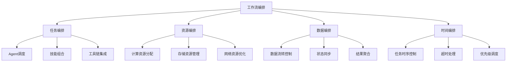
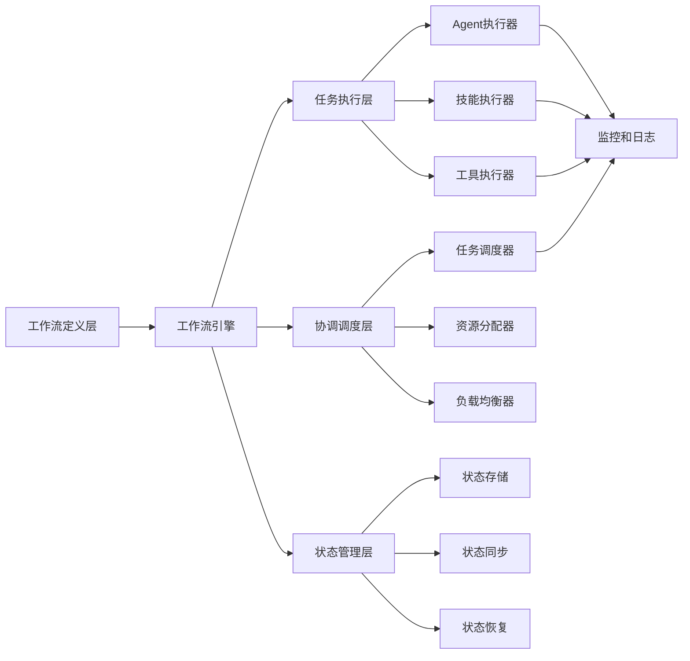
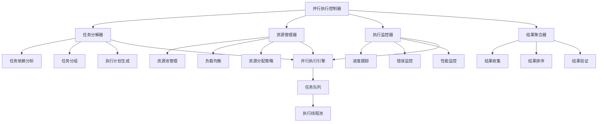
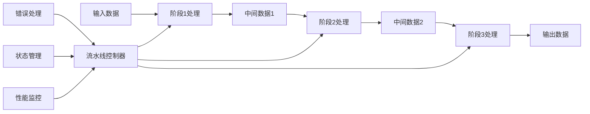
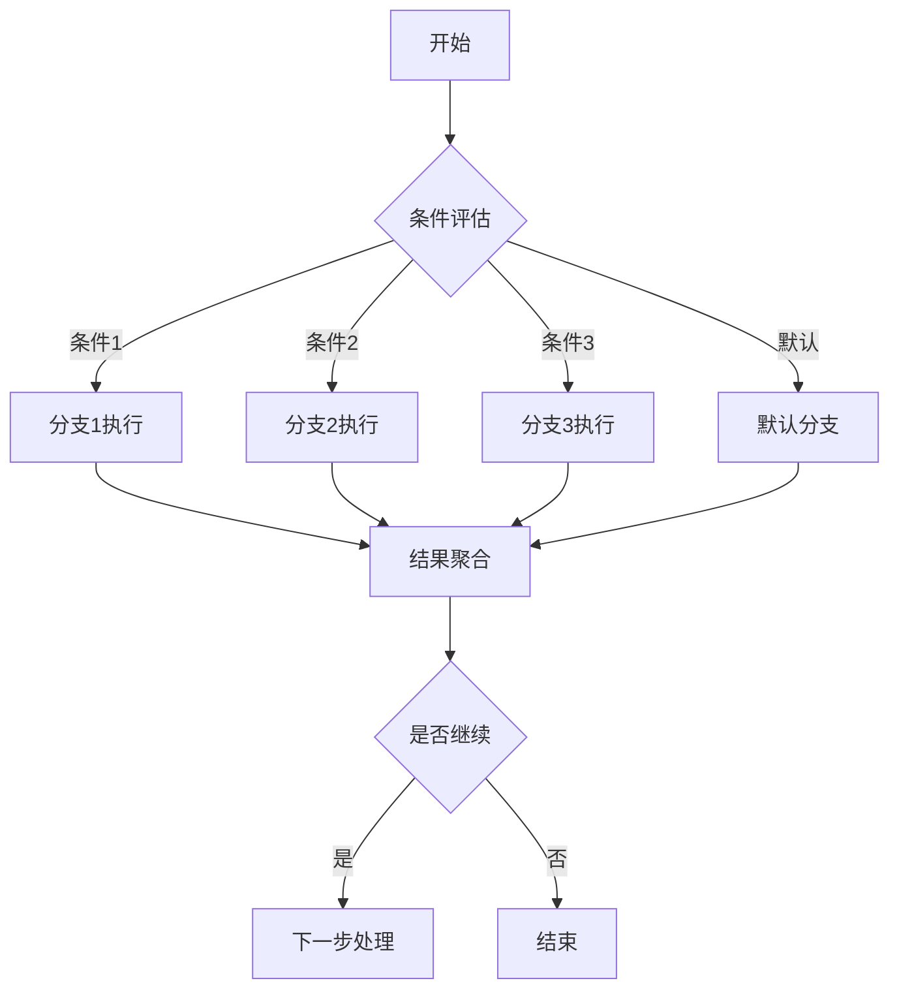

# 第14章：工作流编排

> **本章学习目标**
> - 理解工作流概念和架构设计
> - 掌握Workflow函数的深入分析
> - 学习并行执行模式和优化
> - 理解流水线模式和数据处理
> - 掌握条件分支和循环控制

---

## 14.1 工作流概念和架构

### 14.1.1 什么是工作流编排

工作流编排是指将多个任务、Agent、技能按照特定的业务逻辑组织起来，协同完成复杂业务目标的过程。在Agent系统中，工作流编排是实现复杂自动化任务的核心技术。



### 14.1.2 工作流vs 传统编程

```typescript
// 传统编程vs 工作流编排对比
interface ProgrammingComparison {
  // 传统编程特点
  traditional: {
    control: '显式控制流';
    execution: '顺序执行为主';
    error: '异常处理机制';
    state: '内存状态管理';
    complexity: '复杂逻辑难以维护';
  };
  
  // 工作流编排特点
  orchestration: {
    control: '声明式定义';
    execution: '并行/分布式执行';
    error: '结构化错误处理';
    state: '持久化状态管理';
    complexity: '可视化流程管理';
  };
}
```

### 14.1.3 工作流架构设计



---

## 14.2 Workflow函数深入分析

### 14.2.1 Workflow函数结构

```typescript
// Workflow函数核心结构
interface WorkflowFunction {
  // 元数据定义
  meta: {
    name: string;           // 工作流名称
    description: string;    // 功能描述
    version?: string;       // 版本号
    author?: string;        // 作者
    phases?: WorkflowPhase[]; // 阶段定义
  };
  
  // 执行逻辑
  execute: WorkflowExecutor;
  
  // 配置选项
  options?: {
    timeout?: number;           // 超时时间
    retryPolicy?: RetryPolicy;  // 重试策略
    errorHandling?: ErrorHandling; // 错误处理
  };
}

// 工作流阶段
interface WorkflowPhase {
  title: string;        // 阶段标题
  detail?: string;      // 详细描述
  agentType?: string;   // Agent类型
}

// 工作流执行器
interface WorkflowExecutor {
  (context: WorkflowContext): Promise<WorkflowResult>;
}

// 工作流上下文
interface WorkflowContext {
  // 全局变量
  globals: Record<string, any>;
  
  // 执行环境
  environment: {
    agents: AgentRegistry;
    skills: SkillRegistry;
    tools: ToolRegistry;
  };
  
  // 执行状态
  state: WorkflowState;
  
  // 配置参数
  config: WorkflowConfig;
  
  // 事件系统
  events: EventEmitter;
}

// 工作流结果
interface WorkflowResult {
  success: boolean;
  data?: any;
  error?: Error;
  metadata: {
    executionTime: number;
    phases: PhaseResult[];
    resources: ResourceUsage;
  };
}
```

### 14.2.2 基础Workflow实现

```typescript
// 基础工作流引擎
class WorkflowEngine {
  private workflows = new Map<string, WorkflowFunction>();
  private runningWorkflows = new Map<string, WorkflowExecution>();
  
  // 注册工作流
  register(workflow: WorkflowFunction): void {
    const { name } = workflow.meta;
    if (this.workflows.has(name)) {
      throw new Error(`Workflow already registered: ${name}`);
    }
    
    this.workflows.set(name, workflow);
    logger.info(`Workflow registered: ${name}`);
  }
  
  // 执行工作流
  async execute(
    name: string,
    input: any,
    options?: ExecutionOptions
  ): Promise<WorkflowResult> {
    const workflow = this.workflows.get(name);
    if (!workflow) {
      throw new Error(`Workflow not found: ${name}`);
    }
    
    // 创建执行上下文
    const context = this.createContext(workflow, input, options);
    
    // 创建执行实例
    const execution = new WorkflowExecution(workflow, context);
    this.runningWorkflows.set(execution.id, execution);
    
    try {
      // 执行工作流
      const result = await execution.run();
      
      return result;
    } finally {
      this.runningWorkflows.delete(execution.id);
    }
  }
  
  // 创建执行上下文
  private createContext(
    workflow: WorkflowFunction,
    input: any,
    options?: ExecutionOptions
  ): WorkflowContext {
    return {
      globals: { input },
      environment: {
        agents: agentRegistry,
        skills: skillRegistry,
        tools: toolRegistry
      },
      state: {
        status: 'pending',
        currentPhase: 0,
        data: {}
      },
      config: {
        timeout: options?.timeout || workflow.options?.timeout || 30000,
        retryPolicy: workflow.options?.retryPolicy || { maxRetries: 3 },
        errorHandling: workflow.options?.errorHandling || 'stop-on-error'
      },
      events: new EventEmitter()
    };
  }
  
  // 获取运行中的工作流
  getRunningWorkflows(): WorkflowExecution[] {
    return Array.from(this.runningWorkflows.values());
  }
  
  // 停止工作流
  async stop(executionId: string): Promise<boolean> {
    const execution = this.runningWorkflows.get(executionId);
    if (!execution) {
      return false;
    }
    
    await execution.stop();
    return true;
  }
}

// 工作流执行实例
class WorkflowExecution {
  id: string;
  private workflow: WorkflowFunction;
  private context: WorkflowContext;
  private startTime: number = 0;
  private stopped: boolean = false;
  
  constructor(workflow: WorkflowFunction, context: WorkflowContext) {
    this.id = generateUniqueId();
    this.workflow = workflow;
    this.context = context;
  }
  
  // 执行工作流
  async run(): Promise<WorkflowResult> {
    this.startTime = Date.now();
    this.context.state.status = 'running';
    
    try {
      // 执行工作流逻辑
      const data = await this.workflow.execute(this.context);
      
      return {
        success: true,
        data,
        metadata: this.createMetadata()
      };
    } catch (error) {
      return {
        success: false,
        error: error as Error,
        metadata: this.createMetadata()
      };
    } finally {
      this.context.state.status = 'completed';
    }
  }
  
  // 停止执行
  async stop(): Promise<void> {
    this.stopped = true;
    this.context.state.status = 'stopped';
  }
  
  // 创建元数据
  private createMetadata() {
    return {
      executionTime: Date.now() - this.startTime,
      phases: [],
      resources: {
        memory: process.memoryUsage(),
        cpu: process.cpuUsage()
      }
    };
  }
}
```

### 14.2.3 高级Workflow特性

```typescript
// 高级工作流特性
class AdvancedWorkflowFeatures {
  // 条件分支
  static async conditionalWorkflow(context: WorkflowContext) {
    const condition = await evaluateCondition(context);
    
    if (condition) {
      return executeBranch(context, 'true');
    } else {
      return executeBranch(context, 'false');
    }
  }
  
  // 循环执行
  static async loopWorkflow(context: WorkflowContext) {
    const results: any[] = [];
    let iteration = 0;
    const maxIterations = context.config.maxIterations || 100;
    
    while (iteration < maxIterations && !shouldStop(context, iteration)) {
      const result = await executeIteration(context, iteration);
      results.push(result);
      iteration++;
    }
    
    return results;
  }
  
  // 错误处理
  static async withErrorHandling(
    context: WorkflowContext,
    handler: () => Promise<any>
  ): Promise<any> {
    try {
      return await handler();
    } catch (error) {
      switch (context.config.errorHandling) {
        case 'stop-on-error':
          throw error;
        case 'continue-on-error':
          logger.error('Error in workflow, continuing:', error);
          return null;
        case 'retry':
          return await this.retryWithBackoff(context, handler, error);
        default:
          throw error;
      }
    }
  }
  
  // 重试机制
  private static async retryWithBackoff(
    context: WorkflowContext,
    handler: () => Promise<any>,
    error: Error
  ): Promise<any> {
    const retryPolicy = context.config.retryPolicy;
    let attempt = 0;
    
    while (attempt < retryPolicy.maxRetries) {
      await this.delay(calculateBackoff(attempt, retryPolicy));
      
      try {
        return await handler();
      } catch (retryError) {
        attempt++;
        if (attempt >= retryPolicy.maxRetries) {
          throw retryError;
        }
      }
    }
    
    throw error;
  }
  
  // 延迟函数
  private static delay(ms: number): Promise<void> {
    return new Promise(resolve => setTimeout(resolve, ms));
  }
}
```

---

## 14.3 并行执行模式

### 14.3.1 并行执行架构



### 14.3.2 并行执行实现

```typescript
// 并行执行引擎
class ParallelExecutionEngine {
  private maxConcurrency: number;
  private taskQueue: Task[] = [];
  private runningTasks = new Set<Task>();
  
  constructor(maxConcurrency: number = 10) {
    this.maxConcurrency = maxConcurrency;
  }
  
  // 并行执行任务
  async executeParallel(tasks: Task[]): Promise<TaskResult[]> {
    this.taskQueue = [...tasks];
    const results: TaskResult[] = [];
    
    // 创建执行槽位
    const slots = this.createExecutionSlots();
    
    // 并行执行
    await Promise.all(
      slots.map(slot => this.processSlot(slot, results))
    );
    
    return results;
  }
  
  // 创建执行槽位
  private createExecutionSlots(): ExecutionSlot[] {
    return Array.from({ length: this.maxConcurrency }, (_, i) => ({
      id: `slot-${i}`,
      available: true
    }));
  }
  
  // 处理执行槽位
  private async processSlot(
    slot: ExecutionSlot,
    results: TaskResult[]
  ): Promise<void> {
    while (this.taskQueue.length > 0 || this.runningTasks.size > 0) {
      // 获取下一个任务
      const task = this.getNextTask();
      if (task) {
        // 执行任务
        this.runningTasks.add(task);
        const result = await this.executeTask(task);
        this.runningTasks.delete(task);
        results.push(result);
      } else {
        // 等待任务完成
        await this.delay(100);
      }
    }
  }
  
  // 获取下一个任务
  private getNextTask(): Task | null {
    if (this.taskQueue.length === 0) {
      return null;
    }
    
    // 检查依赖关系
    for (let i = 0; i < this.taskQueue.length; i++) {
      const task = this.taskQueue[i];
      if (this.canExecute(task)) {
        this.taskQueue.splice(i, 1);
        return task;
      }
    }
    
    return null;
  }
  
  // 检查任务是否可执行
  private canExecute(task: Task): boolean {
    if (!task.dependencies || task.dependencies.length === 0) {
      return true;
    }
    
    // 检查依赖任务是否完成
    return task.dependencies.every(dep => 
      this.isTaskCompleted(dep)
    );
  }
  
  // 执行任务
  private async executeTask(task: Task): Promise<TaskResult> {
    const startTime = Date.now();
    
    try {
      const data = await task.handler();
      
      return {
        taskId: task.id,
        success: true,
        data,
        executionTime: Date.now() - startTime
      };
    } catch (error) {
      return {
        taskId: task.id,
        success: false,
        error: error as Error,
        executionTime: Date.now() - startTime
      };
    }
  }
  
  // 延迟函数
  private delay(ms: number): Promise<void> {
    return new Promise(resolve => setTimeout(resolve, ms));
  }
  
  // 检查任务是否完成
  private isTaskCompleted(taskId: string): boolean {
    // 实现任务完成状态检查
    return true;
  }
}

// 任务定义
interface Task {
  id: string;
  handler: () => Promise<any>;
  dependencies?: string[];
  priority?: number;
  timeout?: number;
}

// 执行槽位
interface ExecutionSlot {
  id: string;
  available: boolean;
}

// 任务结果
interface TaskResult {
  taskId: string;
  success: boolean;
  data?: any;
  error?: Error;
  executionTime: number;
}
```

### 14.3.3 并行执行优化

```typescript
// 并行执行优化器
class ParallelExecutionOptimizer {
  // 任务依赖分析
  static analyzeDependencies(tasks: Task[]): DependencyGraph {
    const graph = new DependencyGraph();
    
    // 构建依赖图
    for (const task of tasks) {
      graph.addNode(task.id, task);
      
      if (task.dependencies) {
        for (const dep of task.dependencies) {
          graph.addEdge(dep, task.id);
        }
      }
    }
    
    return graph;
  }
  
  // 任务调度优化
  static optimizeSchedule(
    tasks: Task[],
    maxConcurrency: number
  ): OptimizedSchedule {
    const graph = this.analyzeDependencies(tasks);
    const levels = this.calculateExecutionLevels(graph);
    const schedule: ScheduleLayer[] = [];
    
    // 按层级调度
    for (const level of levels) {
      const layer = this.createScheduleLayer(level, maxConcurrency);
      schedule.push(layer);
    }
    
    return { schedule, totalLayers: schedule.length };
  }
  
  // 计算执行层级
  private static calculateExecutionLevels(graph: DependencyGraph): Task[][] {
    const levels: Task[][] = [];
    const processed = new Set<string>();
    let currentLevel: Task[] = [];
    
    while (processed.size < graph.nodeCount) {
      currentLevel = [];
      
      // 找出所有可执行的任务
      for (const [id, task] of graph.nodes) {
        if (processed.has(id)) continue;
        
        // 检查依赖是否都已完成
        const dependencies = graph.getDependencies(id);
        if (dependencies.every(dep => processed.has(dep))) {
          currentLevel.push(task);
        }
      }
      
      // 标记为已处理
      currentLevel.forEach(task => processed.add(task.id));
      
      if (currentLevel.length > 0) {
        levels.push(currentLevel);
      } else {
        // 检测循环依赖
        throw new Error('Circular dependency detected');
      }
    }
    
    return levels;
  }
  
  // 创建调度层
  private static createScheduleLayer(
    tasks: Task[],
    maxConcurrency: number
  ): ScheduleLayer {
    const batches: Task[][] = [];
    let currentBatch: Task[] = [];
    
    // 按并发度分批
    for (const task of tasks) {
      if (currentBatch.length < maxConcurrency) {
        currentBatch.push(task);
      } else {
        batches.push(currentBatch);
        currentBatch = [task];
      }
    }
    
    if (currentBatch.length > 0) {
      batches.push(currentBatch);
    }
    
    return { tasks, batches };
  }
}

// 依赖图
class DependencyGraph {
  nodes = new Map<string, Task>();
  edges = new Map<string, Set<string>>();
  reverseEdges = new Map<string, Set<string>>();
  
  addNode(id: string, task: Task): void {
    this.nodes.set(id, task);
  }
  
  addEdge(from: string, to: string): void {
    if (!this.edges.has(from)) {
      this.edges.set(from, new Set());
    }
    this.edges.get(from)!.add(to);
    
    if (!this.reverseEdges.has(to)) {
      this.reverseEdges.set(to, new Set());
    }
    this.reverseEdges.get(to)!.add(from);
  }
  
  getDependencies(nodeId: string): string[] {
    const deps = this.reverseEdges.get(nodeId);
    return deps ? Array.from(deps) : [];
  }
  
  get nodeCount(): number {
    return this.nodes.size;
  }
}

// 调度结果
interface OptimizedSchedule {
  schedule: ScheduleLayer[];
  totalLayers: number;
}

interface ScheduleLayer {
  tasks: Task[];
  batches: Task[][];
}
```

---

## 14.4 流水线模式

### 14.4.1 流水线概念



### 14.4.2 流水线实现

```typescript
// 流水线处理器
class PipelineProcessor {
  private stages: PipelineStage[] = [];
  private errorHandler?: ErrorHandler;
  private stateManager: StateManager;
  
  constructor() {
    this.stateManager = new StateManager();
  }
  
  // 添加处理阶段
  addStage(stage: PipelineStage): this {
    this.stages.push(stage);
    return this;
  }
  
  // 设置错误处理器
  setErrorHandler(handler: ErrorHandler): this {
    this.errorHandler = handler;
    return this;
  }
  
  // 执行流水线
  async process(input: any): Promise<PipelineResult> {
    let currentData = input;
    const stageResults: StageResult[] = [];
    
    for (const stage of this.stages) {
      const startTime = Date.now();
      
      try {
        // 执行阶段处理
        const result = await this.executeStage(stage, currentData);
        
        // 记录阶段结果
        stageResults.push({
          stageName: stage.name,
          success: true,
          data: result,
          executionTime: Date.now() - startTime
        });
        
        // 传递数据到下一阶段
        currentData = result;
        
        // 保存状态
        this.stateManager.setState(stage.name, currentData);
        
      } catch (error) {
        const stageError = {
          stageName: stage.name,
          success: false,
          error: error as Error,
          executionTime: Date.now() - startTime
        };
        
        stageResults.push(stageError);
        
        // 错误处理
        if (this.errorHandler) {
          const handled = await this.errorHandler.handle(
            error as Error,
            currentData,
            stage
          );
          
          if (handled.shouldStop) {
            return {
              success: false,
              error: error as Error,
              stageResults,
              finalData: currentData
            };
          }
          
          currentData = handled.recoveryData || currentData;
        } else {
          return {
            success: false,
            error: error as Error,
            stageResults,
            finalData: currentData
          };
        }
      }
    }
    
    return {
      success: true,
      stageResults,
      finalData: currentData
    };
  }
  
  // 执行单个阶段
  private async executeStage(
    stage: PipelineStage,
    input: any
  ): Promise<any> {
    // 数据验证
    if (stage.validator) {
      const isValid = await stage.validator(input);
      if (!isValid) {
        throw new Error(`Data validation failed for stage: ${stage.name}`);
      }
    }
    
    // 数据转换
    const transformed = stage.transformer 
      ? await stage.transformer(input) 
      : input;
    
    // 执行处理
    return await stage.handler(transformed);
  }
  
  // 获取流水线状态
  getState(): any {
    return this.stateManager.getAllStates();
  }
  
  // 重置流水线
  reset(): void {
    this.stateManager.clear();
  }
}

// 流水线阶段
interface PipelineStage {
  name: string;
  handler: (data: any) => Promise<any>;
  validator?: (data: any) => Promise<boolean>;
  transformer?: (data: any) => Promise<any>;
  config?: StageConfig;
}

// 阶段配置
interface StageConfig {
  timeout?: number;
  retryPolicy?: RetryPolicy;
  cachePolicy?: CachePolicy;
}

// 流水线结果
interface PipelineResult {
  success: boolean;
  stageResults: StageResult[];
  finalData: any;
  error?: Error;
}

// 阶段结果
interface StageResult {
  stageName: string;
  success: boolean;
  data?: any;
  error?: Error;
  executionTime: number;
}

// 错误处理器
interface ErrorHandler {
  handle(
    error: Error,
    data: any,
    stage: PipelineStage
  ): Promise<ErrorHandlingResult>;
}

interface ErrorHandlingResult {
  shouldStop: boolean;
  recoveryData?: any;
}
```

### 14.4.3 流水线模式示例

```typescript
// 流水线模式示例
class PipelineExamples {
  // 数据处理流水线
  static createDataProcessingPipeline(): PipelineProcessor {
    const pipeline = new PipelineProcessor();
    
    // 数据验证阶段
    pipeline.addStage({
      name: 'validation',
      handler: async (data) => {
        console.log('Validating data:', data);
        if (!data || typeof data !== 'object') {
          throw new Error('Invalid data format');
        }
        return data;
      },
      validator: async (data) => {
        return data !== null && data !== undefined;
      }
    });
    
    // 数据清洗阶段
    pipeline.addStage({
      name: 'cleaning',
      handler: async (data) => {
        console.log('Cleaning data');
        const cleaned = this.cleanData(data);
        return cleaned;
      }
    });
    
    // 数据转换阶段
    pipeline.addStage({
      name: 'transformation',
      handler: async (data) => {
        console.log('Transforming data');
        const transformed = this.transformData(data);
        return transformed;
      }
    });
    
    // 数据分析阶段
    pipeline.addStage({
      name: 'analysis',
      handler: async (data) => {
        console.log('Analyzing data');
        const analysis = this.analyzeData(data);
        return analysis;
      }
    });
    
    // 结果格式化阶段
    pipeline.addStage({
      name: 'formatting',
      handler: async (data) => {
        console.log('Formatting results');
        return this.formatResults(data);
      }
    });
    
    return pipeline;
  }
  
  // 使用流水线
  static async usePipeline() {
    const pipeline = this.createDataProcessingPipeline();
    
    const inputData = {
      records: [
        { id: 1, name: 'Record 1', value: 100 },
        { id: 2, name: 'Record 2', value: 200 },
        { id: 3, name: 'Record 3', value: 300 }
      ]
    };
    
    const result = await pipeline.process(inputData);
    
    console.log('Pipeline result:', result);
    
    return result;
  }
  
  // 辅助方法
  private static cleanData(data: any): any {
    // 实现数据清洗逻辑
    return data;
  }
  
  private static transformData(data: any): any {
    // 实现数据转换逻辑
    return data;
  }
  
  private static analyzeData(data: any): any {
    // 实现数据分析逻辑
    return { analysis: 'complete', data };
  }
  
  private static formatResults(data: any): any {
    // 实现结果格式化逻辑
    return { formatted: true, ...data };
  }
}
```

---

## 14.5 条件分支和循环

### 14.5.1 条件分支实现



### 14.5.2 条件分支系统

```typescript
// 条件分支系统
class ConditionalBranchSystem {
  private branches: Map<string, ConditionalBranch> = new Map();
  
  // 添加分支
  addBranch(branch: ConditionalBranch): this {
    this.branches.set(branch.name, branch);
    return this;
  }
  
  // 执行条件分支
  async execute(context: WorkflowContext): Promise<BranchResult> {
    // 评估所有条件
    const evaluations = await this.evaluateConditions(context);
    
    // 选择匹配的分支
    const selectedBranch = this.selectBranch(evaluations);
    
    if (!selectedBranch) {
      throw new Error('No matching branch found');
    }
    
    // 执行选中的分支
    const startTime = Date.now();
    try {
      const result = await selectedBranch.handler(context);
      
      return {
        success: true,
        branchName: selectedBranch.name,
        data: result,
        executionTime: Date.now() - startTime,
        evaluations
      };
    } catch (error) {
      return {
        success: false,
        branchName: selectedBranch.name,
        error: error as Error,
        executionTime: Date.now() - startTime,
        evaluations
      };
    }
  }
  
  // 评估条件
  private async evaluateConditions(
    context: WorkflowContext
  ): Promise<ConditionEvaluation[]> {
    const evaluations: ConditionEvaluation[] = [];
    
    for (const branch of this.branches.values()) {
      const result = await branch.condition(context);
      evaluations.push({
        branchName: branch.name,
        matched: result,
        priority: branch.priority || 0
      });
    }
    
    return evaluations;
  }
  
  // 选择分支
  private selectBranch(evaluations: ConditionEvaluation[]): ConditionalBranch | null {
    // 找出所有匹配的分支
    const matched = evaluations
      .filter(e => e.matched)
      .sort((a, b) => b.priority - a.priority);
    
    if (matched.length === 0) {
      return null;
    }
    
    // 返回优先级最高的分支
    const branchName = matched[0].branchName;
    return this.branches.get(branchName) || null;
  }
}

// 条件分支
interface ConditionalBranch {
  name: string;
  condition: (context: WorkflowContext) => Promise<boolean>;
  handler: (context: WorkflowContext) => Promise<any>;
  priority?: number;
  description?: string;
}

// 条件评估结果
interface ConditionEvaluation {
  branchName: string;
  matched: boolean;
  priority: number;
}

// 分支执行结果
interface BranchResult {
  success: boolean;
  branchName: string;
  data?: any;
  error?: Error;
  executionTime: number;
  evaluations: ConditionEvaluation[];
}
```

### 14.5.3 循环控制系统

```typescript
// 循环控制系统
class LoopControlSystem {
  // 条件循环
  static async whileLoop(
    condition: (context: WorkflowContext) => Promise<boolean>,
    handler: (context: WorkflowContext, iteration: number) => Promise<any>,
    maxIterations: number = 100
  ): Promise<LoopResult> {
    const results: any[] = [];
    let iteration = 0;
    let context: WorkflowContext = {} as any;
    
    while (iteration < maxIterations) {
      // 检查条件
      const shouldContinue = await condition(context);
      if (!shouldContinue) {
        break;
      }
      
      // 执行循环体
      const startTime = Date.now();
      try {
        const result = await handler(context, iteration);
        results.push({
          iteration,
          success: true,
          data: result,
          executionTime: Date.now() - startTime
        });
        
        // 更新上下文
        context = { ...context, lastResult: result };
        
      } catch (error) {
        results.push({
          iteration,
          success: false,
          error: error as Error,
          executionTime: Date.now() - startTime
        });
        break;
      }
      
      iteration++;
    }
    
    return {
      totalIterations: iteration,
      results,
      completed: iteration < maxIterations
    };
  }
  
  // 计数循环
  static async forLoop(
    start: number,
    end: number,
    step: number,
    handler: (context: WorkflowContext, index: number) => Promise<any>
  ): Promise<LoopResult> {
    const results: any[] = [];
    let context: WorkflowContext = {} as any;
    
    for (let i = start; i < end; i += step) {
      const startTime = Date.now();
      try {
        const result = await handler(context, i);
        results.push({
          iteration: i,
          success: true,
          data: result,
          executionTime: Date.now() - startTime
        });
        
        context = { ...context, lastResult: result };
        
      } catch (error) {
        results.push({
          iteration: i,
          success: false,
          error: error as Error,
          executionTime: Date.now() - startTime
        });
        break;
      }
    }
    
    return {
      totalIterations: results.length,
      results,
      completed: true
    };
  }
  
  // 迭代循环
  static async forEachLoop<T>(
    items: T[],
    handler: (context: WorkflowContext, item: T, index: number) => Promise<any>
  ): Promise<LoopResult> {
    const results: any[] = [];
    let context: WorkflowContext = {} as any;
    
    for (let i = 0; i < items.length; i++) {
      const startTime = Date.now();
      try {
        const result = await handler(context, items[i], i);
        results.push({
          iteration: i,
          success: true,
          data: result,
          executionTime: Date.now() - startTime
        });
        
        context = { ...context, lastResult: result };
        
      } catch (error) {
        results.push({
          iteration: i,
          success: false,
          error: error as Error,
          executionTime: Date.now() - startTime
        });
      }
    }
    
    return {
      totalIterations: items.length,
      results,
      completed: true
    };
  }
}

// 循环结果
interface LoopResult {
  totalIterations: number;
  results: Array<{
    iteration: number;
    success: boolean;
    data?: any;
    error?: Error;
    executionTime: number;
  }>;
  completed: boolean;
}
```

### 14.5.4 复杂工作流示例

```typescript
// 复杂工作流示例
class ComplexWorkflowExamples {
  // 创建复杂工作流
  static createComplexWorkflow(): WorkflowFunction {
    return {
      meta: {
        name: 'data-processing-workflow',
        description: '复杂数据处理工作流',
        version: '1.0.0',
        phases: [
          { title: '数据准备', detail: '获取和验证数据' },
          { title: '并行处理', detail: '并行执行分析任务' },
          { title: '结果聚合', detail: '合并处理结果' },
          { title: '报告生成', detail: '生成分析报告' }
        ]
      },
      execute: async (context: WorkflowContext) => {
        // 阶段1：数据准备
        context.events.emit('phase-start', { title: '数据准备' });
        const rawData = await prepareData(context);
        
        // 阶段2：并行处理
        context.events.emit('phase-start', { title: '并行处理' });
        const parallelTasks = [
          analyzeSentiment(rawData),
          extractKeywords(rawData),
          classifyContent(rawData)
        ];
        
        const parallelResults = await Promise.all(parallelTasks);
        
        // 阶段3：结果聚合
        context.events.emit('phase-start', { title: '结果聚合' });
        const aggregated = aggregateResults(parallelResults);
        
        // 阶段4：报告生成
        context.events.emit('phase-start', { title: '报告生成' });
        const report = await generateReport(aggregated);
        
        return report;
      }
    };
  }
  
  // 条件工作流
  static createConditionalWorkflow(): WorkflowFunction {
    return {
      meta: {
        name: 'conditional-workflow',
        description: '条件分支工作流',
        version: '1.0.0'
      },
      execute: async (context: WorkflowContext) => {
        // 创建条件分支系统
        const branching = new ConditionalBranchSystem();
        
        // 添加分支
        branching.addBranch({
          name: 'high-priority',
          condition: async (ctx) => ctx.globals.input.priority === 'high',
          handler: async (ctx) => {
            return await handleHighPriority(ctx.globals.input);
          },
          priority: 3
        });
        
        branching.addBranch({
          name: 'medium-priority',
          condition: async (ctx) => ctx.globals.input.priority === 'medium',
          handler: async (ctx) => {
            return await handleMediumPriority(ctx.globals.input);
          },
          priority: 2
        });
        
        branching.addBranch({
          name: 'low-priority',
          condition: async (ctx) => ctx.globals.input.priority === 'low',
          handler: async (ctx) => {
            return await handleLowPriority(ctx.globals.input);
          },
          priority: 1
        });
        
        // 执行分支
        return await branching.execute(context);
      }
    };
  }
  
  // 循环工作流
  static createLoopWorkflow(): WorkflowFunction {
    return {
      meta: {
        name: 'loop-workflow',
        description: '循环处理工作流',
        version: '1.0.0'
      },
      execute: async (context: WorkflowContext) => {
        const items = context.globals.input.items;
        
        // 使用迭代循环
        const loopResult = await LoopControlSystem.forEachLoop(
          items,
          async (ctx, item, index) => {
            // 处理每个项目
            const processed = await processItem(item);
            
            // 更新上下文
            ctx.processedItems = ctx.processedItems || [];
            ctx.processedItems.push(processed);
            
            return processed;
          }
        );
        
        return {
          totalProcessed: loopResult.totalIterations,
          successfulItems: loopResult.results.filter(r => r.success).length,
          processedItems: context.processedItems
        };
      }
    };
  }
}

// 辅助函数
async function prepareData(context: WorkflowContext): Promise<any> {
  return context.globals.input;
}

async function analyzeSentiment(data: any): Promise<any> {
  return { sentiment: 'positive' };
}

async function extractKeywords(data: any): Promise<any> {
  return { keywords: ['example', 'data'] };
}

async function classifyContent(data: any): Promise<any> {
  return { category: 'technology' };
}

function aggregateResults(results: any[]): any {
  return { results };
}

async function generateReport(data: any): Promise<any> {
  return { report: 'generated', data };
}

async function handleHighPriority(input: any): Promise<any> {
  return { handled: 'high-priority', input };
}

async function handleMediumPriority(input: any): Promise<any> {
  return { handled: 'medium-priority', input };
}

async function handleLowPriority(input: any): Promise<any> {
  return { handled: 'low-priority', input };
}

async function processItem(item: any): Promise<any> {
  return { processed: true, item };
}
```

---

## 14.6 实践：构建复杂工作流

### 14.6.1 数据分析工作流

```typescript
// 数据分析工作流实现
class DataAnalysisWorkflow {
  // 创建完整的数据分析工作流
  static createWorkflow(): WorkflowFunction {
    return {
      meta: {
        name: 'data-analysis-workflow',
        description: '综合数据分析工作流',
        version: '1.0.0',
        phases: [
          { title: '数据收集' },
          { title: '数据清洗' },
          { title: '并行分析' },
          { title: '结果整合' },
          { title: '可视化生成' }
        ]
      },
      execute: async (context: WorkflowContext) => {
        const engine = new WorkflowExecutionHelper(context);
        
        // 阶段1：数据收集
        const rawData = await engine.executePhase('data-collection', async () => {
          return await collectData(context.globals.input);
        });
        
        // 阶段2：数据清洗
        const cleanedData = await engine.executePhase('data-cleaning', async () => {
          const pipeline = DataAnalysisWorkflow.createCleaningPipeline();
          return await pipeline.process(rawData);
        });
        
        // 阶段3：并行分析
        const analysisResults = await engine.executePhase('parallel-analysis', async () => {
          return await DataAnalysisWorkflow.executeParallelAnalysis(cleanedData);
        });
        
        // 阶段4：结果整合
        const integratedResults = await engine.executePhase('result-integration', async () => {
          return await integrateResults(analysisResults);
        });
        
        // 阶段5：可视化生成
        const visualizations = await engine.executePhase('visualization', async () => {
          return await generateVisualizations(integratedResults);
        });
        
        return {
          summary: integratedResults.summary,
          visualizations,
          metadata: {
            totalRecords: cleanedData.length,
            analysisTypes: Object.keys(analysisResults),
            executionPhases: engine.getCompletedPhases()
          }
        };
      }
    };
  }
  
  // 创建清洗流水线
  private static createCleaningPipeline(): PipelineProcessor {
    const pipeline = new PipelineProcessor();
    
    pipeline.addStage({
      name: 'validation',
      handler: async (data) => validateData(data)
    });
    
    pipeline.addStage({
      name: 'normalization',
      handler: async (data) => normalizeData(data)
    });
    
    pipeline.addStage({
      name: 'deduplication',
      handler: async (data) => removeDuplicates(data)
    });
    
    return pipeline;
  }
  
  // 执行并行分析
  private static async executeParallelAnalysis(data: any): Promise<any> {
    const analysisTasks = [
      { name: 'statistical-analysis', handler: () => statisticalAnalysis(data) },
      { name: 'trend-analysis', handler: () => trendAnalysis(data) },
      { name: 'correlation-analysis', handler: () => correlationAnalysis(data) },
      { name: 'anomaly-detection', handler: () => anomalyDetection(data) }
    ];
    
    const results = await Promise.allSettled(
      analysisTasks.map(task => task.handler())
    );
    
    return analysisTasks.reduce((acc, task, index) => {
      acc[task.name] = results[index].status === 'fulfilled' 
        ? results[index].value 
        : { error: results[index].reason };
      return acc;
    }, {} as Record<string, any>);
  }
}

// 工作流执行辅助器
class WorkflowExecutionHelper {
  private completedPhases: string[] = [];
  private phaseExecutionTimes: Map<string, number> = new Map();
  
  constructor(private context: WorkflowContext) {}
  
  async executePhase<T>(
    phaseName: string,
    handler: () => Promise<T>
  ): Promise<T> {
    const startTime = Date.now();
    
    try {
      this.context.events.emit('phase-start', { phase: phaseName });
      
      const result = await handler();
      
      this.completedPhases.push(phaseName);
      this.phaseExecutionTimes.set(phaseName, Date.now() - startTime);
      
      this.context.events.emit('phase-complete', { 
        phase: phaseName, 
        duration: this.phaseExecutionTimes.get(phaseName) 
      });
      
      return result;
    } catch (error) {
      this.context.events.emit('phase-error', { 
        phase: phaseName, 
        error 
      });
      throw error;
    }
  }
  
  getCompletedPhases(): string[] {
    return [...this.completedPhases];
  }
  
  getPhaseExecutionTimes(): Map<string, number> {
    return new Map(this.phaseExecutionTimes);
  }
}
```

### 14.6.2 智能客服工作流

```typescript
// 智能客服工作流
class IntelligentCustomerServiceWorkflow {
  static createWorkflow(): WorkflowFunction {
    return {
      meta: {
        name: 'customer-service-workflow',
        description: '智能客服处理工作流',
        version: '1.0.0'
      },
      execute: async (context: WorkflowContext) => {
        const input = context.globals.input;
        
        // 意图识别
        const intent = await this.recognizeIntent(input.message);
        
        // 条件分支处理
        const branching = new ConditionalBranchSystem();
        
        // 添加不同意图的处理分支
        branching.addBranch({
          name: 'product-inquiry',
          condition: async () => intent === 'product_inquiry',
          handler: async () => await this.handleProductInquiry(input)
        });
        
        branching.addBranch({
          name: 'technical-support',
          condition: async () => intent === 'technical_support',
          handler: async () => await this.handleTechnicalSupport(input)
        });
        
        branching.addBranch({
          name: 'order-status',
          condition: async () => intent === 'order_status',
          handler: async () => await this.handleOrderStatus(input)
        });
        
        branching.addBranch({
          name: 'general-inquiry',
          condition: async () => true, // 默认分支
          handler: async () => await this.handleGeneralInquiry(input)
        });
        
        return await branching.execute(context);
      }
    };
  }
  
  private static async recognizeIntent(message: string): Promise<string> {
    // 实现意图识别逻辑
    return 'general_inquiry';
  }
  
  private static async handleProductInquiry(input: any): Promise<any> {
    return { response: '产品信息回复' };
  }
  
  private static async handleTechnicalSupport(input: any): Promise<any> {
    return { response: '技术支持回复' };
  }
  
  private static async handleOrderStatus(input: any): Promise<any> {
    return { response: '订单状态查询' };
  }
  
  private static async handleGeneralInquiry(input: any): Promise<any> {
    return { response: '一般咨询回复' };
  }
}
```

---

## 14.7 本章小结

### 14.7.1 关键概念回顾

1. **工作流编排基础**
   - 工作流是将多个任务组织成完整业务流程的技术
   - 支持任务编排、资源编排、数据编排、时间编排
   - 提供声明式流程定义和自动化执行

2. **Workflow函数深入**
   - Workflow函数包含元数据、执行逻辑和配置选项
   - 工作流引擎负责注册、执行和监控工作流
   - 支持条件分支、循环执行、错误处理等高级特性

3. **并行执行模式**
   - 并行执行引擎支持任务依赖分析和资源调度
   - 通过依赖图实现任务层级划分和优化调度
   - 提供执行槽位管理和负载均衡

4. **流水线模式**
   - 流水线处理将复杂操作分解为多个阶段
   - 每个阶段负责特定的数据处理任务
   - 支持错误处理、状态管理和性能监控

### 14.7.2 实践练习

**练习1：创建文档处理工作流**
```typescript
// 实现文档收集、解析、分析、报告生成的完整流程
// 使用流水线模式组织各个处理阶段
```

**练习2：实现并行数据处理**
```typescript
// 创建并行数据处理工作流
// 实现任务依赖分析和优化调度
```

**练习3：构建条件分支系统**
```typescript
// 创建智能决策工作流
// 实现多分支条件判断和处理
```

### 14.7.3 下一步学习

本章深入介绍了工作流编排的核心概念和实现技术。下一章将学习多Agent协作模式，了解如何构建Agent团队，实现Agent间的分工协作和通信协调。

工作流编排是构建复杂Agent系统的关键技术，通过合理的工作流设计，可以实现复杂的业务自动化和智能化处理。掌握工作流编排技术，对于构建企业级Agent应用至关重要。