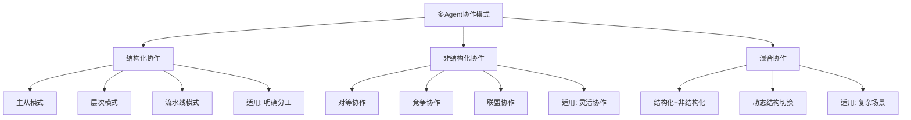
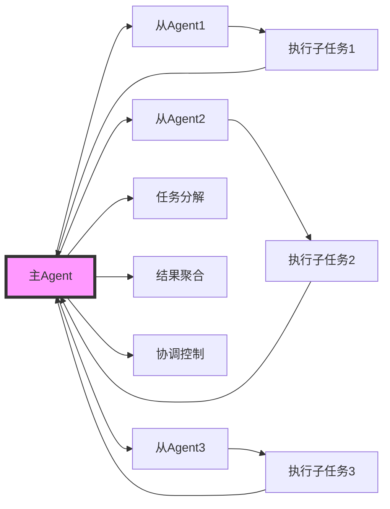
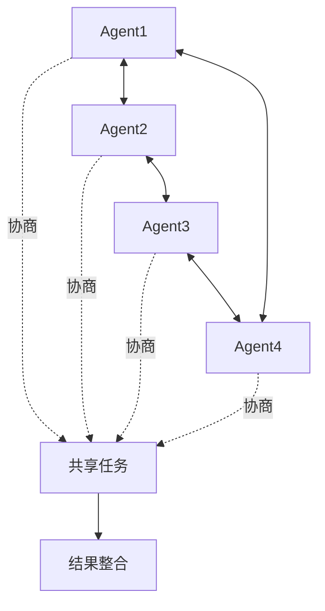
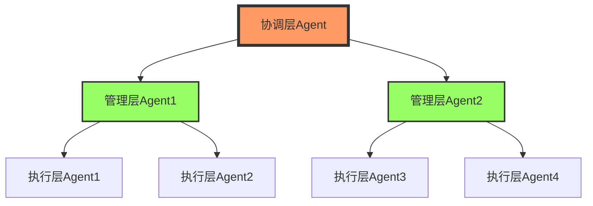
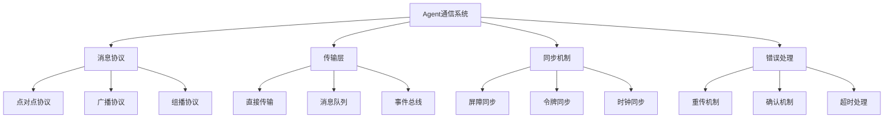
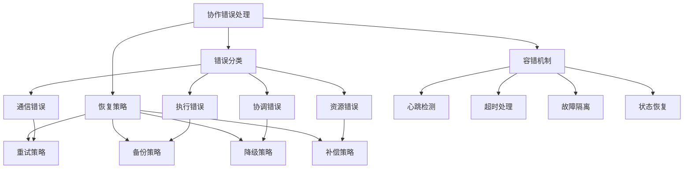
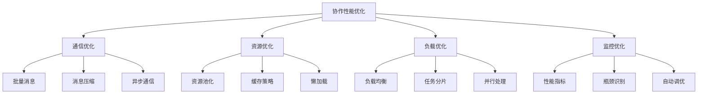

# 第15章：多Agent协作模式

> **本章学习目标**
> - 理解协作模式的分类和特点
> - 掌握Agent团队构建和分工机制
> - 学习协作通信和同步技术
> - 理解协作错误处理和恢复
> - 掌握协作性能优化方法

---

## 15.1 协作模式分类

### 15.1.1 协作模式概述



### 15.1.2 主从协作模式



### 15.1.3 对等协作模式



### 15.1.4 层次协作模式



---

## 15.2 Agent团队和分工

### 15.2.1 Agent团队结构

```typescript
// Agent团队定义
interface AgentTeam {
  id: string;
  name: string;
  description: string;
  
  // 团队成员
  members: TeamMember[];
  
  // 组织结构
  structure: TeamStructure;
  
  // 协作协议
  protocols: CollaborationProtocol[];
  
  // 团队配置
  config: TeamConfig;
}

// 团队成员
interface TeamMember {
  agentId: string;
  role: string;
  capabilities: string[];
  responsibilities: string[];
  authority: AuthorityLevel;
  status: MemberStatus;
}

// 团队结构
interface TeamStructure {
  type: 'hierarchical' | 'flat' | 'hybrid' | 'dynamic';
  hierarchy?: HierarchyLevel[];
  relationships?: AgentRelationship[];
}

// 权威级别
type AuthorityLevel = 'coordinator' | 'manager' | 'worker' | 'observer';

// 成员状态
type MemberStatus = 'active' | 'busy' | 'idle' | 'offline';

// 协作协议
interface CollaborationProtocol {
  name: string;
  type: 'communication' | 'coordination' | 'negotiation' | 'decision';
  rules: ProtocolRule[];
}

// 团队配置
interface TeamConfig {
  maxMembers?: number;
  decisionMaking: 'consensus' | 'majority' | 'coordinator' | 'weighted';
  loadBalancing: 'round-robin' | 'capability-based' | 'load-aware';
  errorHandling: 'continue' | 'retry' | 'failover';
}
```

### 15.2.2 Agent团队管理器

```typescript
// Agent团队管理器
class AgentTeamManager {
  private teams = new Map<string, AgentTeam>();
  private memberIndex = new Map<string, Set<string>>(); // agentId -> teamIds
  
  // 创建团队
  createTeam(config: TeamConfig): AgentTeam {
    const team: AgentTeam = {
      id: generateTeamId(),
      name: config.name || `Team-${this.teams.size + 1}`,
      description: config.description || '',
      members: [],
      structure: config.structure || { type: 'flat' },
      protocols: config.protocols || [],
      config: config
    };
    
    this.teams.set(team.id, team);
    logger.info(`Team created: ${team.id}`);
    
    return team;
  }
  
  // 添加成员
  addMember(teamId: string, member: TeamMember): void {
    const team = this.teams.get(teamId);
    if (!team) {
      throw new Error(`Team not found: ${teamId}`);
    }
    
    // 检查成员限制
    if (team.config.maxMembers && team.members.length >= team.config.maxMembers) {
      throw new Error('Team member limit reached');
    }
    
    // 添加成员
    team.members.push(member);
    
    // 更新索引
    const memberTeams = this.memberIndex.get(member.agentId) || new Set();
    memberTeams.add(teamId);
    this.memberIndex.set(member.agentId, memberTeams);
    
    logger.info(`Member added to team: ${member.agentId} -> ${teamId}`);
  }
  
  // 移除成员
  removeMember(teamId: string, agentId: string): void {
    const team = this.teams.get(teamId);
    if (!team) {
      throw new Error(`Team not found: ${teamId}`);
    }
    
    // 移除成员
    team.members = team.members.filter(m => m.agentId !== agentId);
    
    // 更新索引
    const memberTeams = this.memberIndex.get(agentId);
    if (memberTeams) {
      memberTeams.delete(teamId);
    }
    
    logger.info(`Member removed from team: ${agentId} <- ${teamId}`);
  }
  
  // 获取团队
  getTeam(teamId: string): AgentTeam | undefined {
    return this.teams.get(teamId);
  }
  
  // 获取成员的所有团队
  getMemberTeams(agentId: string): AgentTeam[] {
    const teamIds = this.memberIndex.get(agentId);
    if (!teamIds) return [];
    
    return Array.from(teamIds)
      .map(id => this.teams.get(id))
      .filter(Boolean) as AgentTeam[];
  }
  
  // 查找合适的成员
  findCapableMembers(teamId: string, capability: string): TeamMember[] {
    const team = this.teams.get(teamId);
    if (!team) return [];
    
    return team.members.filter(member => 
      member.capabilities.includes(capability) && 
      member.status === 'active'
    );
  }
  
  // 更新成员状态
  updateMemberStatus(agentId: string, status: MemberStatus): void {
    const teams = this.getMemberTeams(agentId);
    
    for (const team of teams) {
      const member = team.members.find(m => m.agentId === agentId);
      if (member) {
        member.status = status;
      }
    }
  }
}
```

### 15.2.3 任务分工系统

```typescript
// 任务分工系统
class TaskDivisionSystem {
  // 任务分解
  async decomposeTask(
    task: Task,
    team: AgentTeam
  ): Promise<SubTask[]> {
    const subTasks: SubTask[] = [];
    
    switch (team.structure.type) {
      case 'hierarchical':
        return await this.hierarchicalDecompose(task, team);
      
      case 'flat':
        return await this.flatDecompose(task, team);
      
      case 'hybrid':
        return await this.hybridDecompose(task, team);
      
      default:
        throw new Error(`Unknown structure type: ${team.structure.type}`);
    }
  }
  
  // 层次化分解
  private async hierarchicalDecompose(
    task: Task,
    team: AgentTeam
  ): Promise<SubTask[]> {
    const subTasks: SubTask[] = [];
    const hierarchy = team.structure.hierarchy || [];
    
    // 从顶层开始分解
    for (const level of hierarchy) {
      const levelTasks = await this.createLevelTasks(task, level, team);
      subTasks.push(...levelTasks);
    }
    
    return subTasks;
  }
  
  // 平面分解
  private async flatDecompose(
    task: Task,
    team: AgentTeam
  ): Promise<SubTask[]> {
    const subTasks: SubTask[] = [];
    
    // 基于能力分解任务
    const activeMembers = team.members.filter(m => m.status === 'active');
    
    for (const member of activeMembers) {
      const memberTasks = await this.createMemberTasks(task, member);
      subTasks.push(...memberTasks);
    }
    
    return subTasks;
  }
  
  // 混合分解
  private async hybridDecompose(
    task: Task,
    team: AgentTeam
  ): Promise<SubTask[]> {
    // 结合层次化和平面分解的优点
    const coreTasks = await this.hierarchicalDecompose(task, team);
    const supportTasks = await this.flatDecompose(task, team);
    
    return [...coreTasks, ...supportTasks];
  }
  
  // 分配任务
  async assignTasks(
    subTasks: SubTask[],
    team: AgentTeam
  ): Promise<TaskAssignment[]> {
    const assignments: TaskAssignment[] = [];
    
    switch (team.config.loadBalancing) {
      case 'round-robin':
        return this.roundRobinAssign(subTasks, team);
      
      case 'capability-based':
        return this.capabilityBasedAssign(subTasks, team);
      
      case 'load-aware':
        return await this.loadAwareAssign(subTasks, team);
      
      default:
        throw new Error(`Unknown load balancing strategy`);
    }
  }
  
  // 轮询分配
  private roundRobinAssign(
    subTasks: SubTask[],
    team: AgentTeam
  ): TaskAssignment[] {
    const assignments: TaskAssignment[] = [];
    const activeMembers = team.members.filter(m => m.status === 'active');
    
    subTasks.forEach((subTask, index) => {
      const member = activeMembers[index % activeMembers.length];
      assignments.push({
        subTask,
        assignee: member.agentId,
        assignedAt: new Date(),
        status: 'pending'
      });
    });
    
    return assignments;
  }
  
  // 基于能力分配
  private capabilityBasedAssign(
    subTasks: SubTask[],
    team: AgentTeam
  ): TaskAssignment[] {
    const assignments: TaskAssignment[] = [];
    
    for (const subTask of subTasks) {
      // 找到最适合的成员
      const capableMembers = team.members.filter(member =>
        member.status === 'active' &&
        this.isMemberCapable(member, subTask)
      );
      
      if (capableMembers.length > 0) {
        // 选择负载最轻的成员
        const member = this.selectLeastLoadedMember(capableMembers, assignments);
        
        assignments.push({
          subTask,
          assignee: member.agentId,
          assignedAt: new Date(),
          status: 'pending'
        });
      }
    }
    
    return assignments;
  }
  
  // 负载感知分配
  private async loadAwareAssign(
    subTasks: SubTask[],
    team: AgentTeam
  ): Promise<TaskAssignment[]> {
    const assignments: TaskAssignment[] = [];
    const memberLoads = await this.calculateMemberLoads(team);
    
    for (const subTask of subTasks) {
      // 找到负载最低的合适成员
      const capableMembers = team.members.filter(member =>
        member.status === 'active' &&
        this.isMemberCapable(member, subTask)
      );
      
      if (capableMembers.length > 0) {
        // 选择负载最低的成员
        const member = this.selectLowestLoadMember(capableMembers, memberLoads);
        
        assignments.push({
          subTask,
          assignee: member.agentId,
          assignedAt: new Date(),
          status: 'pending'
        });
        
        // 更新负载
        memberLoads.set(member.agentId, (memberLoads.get(member.agentId) || 0) + 1);
      }
    }
    
    return assignments;
  }
  
  // 检查成员能力
  private isMemberCapable(member: TeamMember, subTask: SubTask): boolean {
    return subTask.requiredCapabilities.some(capability =>
      member.capabilities.includes(capability)
    );
  }
  
  // 选择负载最轻的成员
  private selectLeastLoadedMember(
    members: TeamMember[],
    assignments: TaskAssignment[]
  ): TeamMember {
    const loadCounts = new Map<string, number>();
    
    assignments.forEach(assignment => {
      const currentLoad = loadCounts.get(assignment.assignee) || 0;
      loadCounts.set(assignment.assignee, currentLoad + 1);
    });
    
    return members.reduce((least, current) => {
      const leastLoad = loadCounts.get(least.agentId) || 0;
      const currentLoad = loadCounts.get(current.agentId) || 0;
      return currentLoad < leastLoad ? current : least;
    });
  }
  
  // 选择负载最低的成员
  private selectLowestLoadMember(
    members: TeamMember[],
    memberLoads: Map<string, number>
  ): TeamMember {
    return members.reduce((lowest, current) => {
      const lowestLoad = memberLoads.get(lowest.agentId) || 0;
      const currentLoad = memberLoads.get(current.agentId) || 0;
      return currentLoad < lowestLoad ? current : lowest;
    });
  }
  
  // 计算成员负载
  private async calculateMemberLoads(team: AgentTeam): Promise<Map<string, number>> {
    const loads = new Map<string, number>();
    
    for (const member of team.members) {
      // 获取成员当前负载
      const load = await this.getMemberLoad(member.agentId);
      loads.set(member.agentId, load);
    }
    
    return loads;
  }
  
  // 获取成员负载
  private async getMemberLoad(agentId: string): Promise<number> {
    // 实现获取成员当前负载的逻辑
    return 0;
  }
  
  // 创建层级任务
  private async createLevelTasks(
    task: Task,
    level: HierarchyLevel,
    team: AgentTeam
  ): Promise<SubTask[]> {
    // 实现创建层级任务的逻辑
    return [];
  }
  
  // 创建成员任务
  private async createMemberTasks(
    task: Task,
    member: TeamMember
  ): Promise<SubTask[]> {
    // 实现创建成员任务的逻辑
    return [];
  }
}

// 相关接口定义
interface Task {
  id: string;
  type: string;
  description: string;
  complexity: number;
  requiredCapabilities: string[];
}

interface SubTask extends Task {
  parentTaskId: string;
  priority: number;
  estimatedDuration: number;
}

interface TaskAssignment {
  subTask: SubTask;
  assignee: string;
  assignedAt: Date;
  status: 'pending' | 'in-progress' | 'completed' | 'failed';
}

interface HierarchyLevel {
  level: number;
  name: string;
  responsibilities: string[];
}

interface AgentRelationship {
  from: string;
  to: string;
  type: 'supervision' | 'coordination' | 'support' | 'peer';
}
```

---

## 15.3 协作通信和同步

### 15.3.1 通信协议架构



### 15.3.2 消息传递系统

```typescript
// Agent间消息传递系统
class AgentMessagingSystem {
  private messageQueues = new Map<string, MessageQueue>();
  private messageHandlers = new Map<string, MessageHandler[]>();
  private deliveryConfirmations = new Map<string, DeliveryStatus>();
  
  // 发送消息
  async sendMessage(
    from: string,
    to: string,
    message: AgentMessage
  ): Promise<MessageSendResult> {
    const messageId = this.generateMessageId();
    
    try {
      // 创建消息包装
      const wrappedMessage: MessageWrapper = {
        id: messageId,
        from,
        to,
        message,
        timestamp: new Date(),
        status: 'pending'
      };
      
      // 获取目标队列
      const queue = this.getQueue(to);
      
      // 发送消息
      await queue.enqueue(wrappedMessage);
      
      // 等待确认
      const confirmation = await this.waitForConfirmation(messageId);
      
      return {
        success: confirmation.delivered,
        messageId,
        timestamp: confirmation.timestamp
      };
      
    } catch (error) {
      return {
        success: false,
        messageId,
        error: error as Error
      };
    }
  }
  
  // 广播消息
  async broadcastMessage(
    from: string,
    recipients: string[],
    message: AgentMessage
  ): Promise<MessageSendResult[]> {
    const promises = recipients.map(to => 
      this.sendMessage(from, to, message)
    );
    
    return Promise.all(promises);
  }
  
  // 接收消息
  async receiveMessage(agentId: string): Promise<MessageWrapper | null> {
    const queue = this.getQueue(agentId);
    return await queue.dequeue();
  }
  
  // 注册消息处理器
  registerHandler(agentId: string, handler: MessageHandler): void {
    const handlers = this.messageHandlers.get(agentId) || [];
    handlers.push(handler);
    this.messageHandlers.set(agentId, handlers);
  }
  
  // 确认消息接收
  async confirmReceipt(messageId: string): Promise<void> {
    const status = this.deliveryConfirmations.get(messageId);
    if (status) {
      status.delivered = true;
      status.timestamp = new Date();
    }
  }
  
  // 获取消息队列
  private getQueue(agentId: string): MessageQueue {
    let queue = this.messageQueues.get(agentId);
    
    if (!queue) {
      queue = new MessageQueue(agentId);
      this.messageQueues.set(agentId, queue);
    }
    
    return queue;
  }
  
  // 等待确认
  private async waitForConfirmation(
    messageId: string,
    timeout: number = 5000
  ): Promise<DeliveryStatus> {
    const startTime = Date.now();
    
    return new Promise((resolve) => {
      const checkInterval = setInterval(() => {
        const status = this.deliveryConfirmations.get(messageId);
        
        if (status?.delivered) {
          clearInterval(checkInterval);
          resolve(status);
        } else if (Date.now() - startTime > timeout) {
          clearInterval(checkInterval);
          resolve({ delivered: false, timestamp: new Date() });
        }
      }, 100);
    });
  }
  
  // 生成消息ID
  private generateMessageId(): string {
    return `msg-${Date.now()}-${Math.random().toString(36).slice(2, 11)}`;
  }
}

// 消息队列
class MessageQueue {
  private queue: MessageWrapper[] = [];
  private maxSize: number = 1000;
  
  constructor(private agentId: string) {}
  
  async enqueue(message: MessageWrapper): Promise<void> {
    if (this.queue.length >= this.maxSize) {
      throw new Error(`Queue full for agent: ${this.agentId}`);
    }
    
    this.queue.push(message);
  }
  
  async dequeue(): Promise<MessageWrapper | null> {
    return this.queue.shift() || null;
  }
  
  get size(): number {
    return this.queue.length;
  }
}

// 消息包装器
interface MessageWrapper {
  id: string;
  from: string;
  to: string;
  message: AgentMessage;
  timestamp: Date;
  status: 'pending' | 'delivered' | 'failed';
}

// Agent消息
interface AgentMessage {
  type: MessageType;
  payload: any;
  priority?: number;
  correlationId?: string;
  replyTo?: string;
}

// 消息类型
type MessageType = 
  | 'task-assignment'
  | 'task-result'
  | 'status-update'
  | 'coordination'
  | 'notification'
  | 'error';

// 消息处理器
type MessageHandler = (message: AgentMessage) => Promise<void>;

// 消息发送结果
interface MessageSendResult {
  success: boolean;
  messageId: string;
  timestamp?: Date;
  error?: Error;
}

// 投递状态
interface DeliveryStatus {
  delivered: boolean;
  timestamp: Date;
}
```

### 15.3.3 协作同步机制

```typescript
// 协作同步机制
class CollaborationSyncSystem {
  private barriers = new Map<string, SyncBarrier>();
  private locks = new Map<string, DistributedLock>();
  private stateSync = new Map<string, SharedState>();
  
  // 创建屏障
  createBarrier(barrierId: string, participants: string[]): SyncBarrier {
    const barrier = new SyncBarrier(barrierId, participants);
    this.barriers.set(barrierId, barrier);
    return barrier;
  }
  
  // 等待屏障
  async awaitBarrier(barrierId: string, agentId: string): Promise<void> {
    const barrier = this.barriers.get(barrierId);
    if (!barrier) {
      throw new Error(`Barrier not found: ${barrierId}`);
    }
    
    await barrier.arrive(agentId);
  }
  
  // 获取分布式锁
  async acquireLock(lockId: string, agentId: string, timeout: number = 5000): Promise<boolean> {
    let lock = this.locks.get(lockId);
    
    if (!lock) {
      lock = new DistributedLock(lockId);
      this.locks.set(lockId, lock);
    }
    
    return await lock.acquire(agentId, timeout);
  }
  
  // 释放分布式锁
  releaseLock(lockId: string, agentId: string): void {
    const lock = this.locks.get(lockId);
    if (lock) {
      lock.release(agentId);
    }
  }
  
  // 创建共享状态
  createSharedState(stateId: string, initialState: any): SharedState {
    const state = new SharedState(stateId, initialState);
    this.stateSync.set(stateId, state);
    return state;
  }
  
  // 更新共享状态
  async updateState(stateId: string, updates: any, agentId: string): Promise<void> {
    const state = this.stateSync.get(stateId);
    if (!state) {
      throw new Error(`State not found: ${stateId}`);
    }
    
    await state.update(updates, agentId);
  }
  
  // 获取共享状态
  getState(stateId: string): any {
    const state = this.stateSync.get(stateId);
    return state?.getCurrent();
  }
}

// 同步屏障
class SyncBarrier {
  private arrivals = new Set<string>();
  private completionPromise: Promise<void> | null = null;
  
  constructor(
    public id: string,
    private participants: string[]
  ) {}
  
  async arrive(agentId: string): Promise<void> {
    if (!this.participants.includes(agentId)) {
      throw new Error(`Agent not a participant: ${agentId}`);
    }
    
    this.arrivals.add(agentId);
    
    // 如果所有参与者都到达，触发完成
    if (this.arrivals.size === this.participants.length) {
      if (this.completionPromise) {
        await this.completionPromise;
      }
    } else {
      // 等待其他参与者
      if (!this.completionPromise) {
        this.completionPromise = new Promise<void>(resolve => {
          const checkInterval = setInterval(() => {
            if (this.arrivals.size === this.participants.length) {
              clearInterval(checkInterval);
              resolve();
            }
          }, 100);
        });
      }
      
      await this.completionPromise;
    }
  }
  
  reset(): void {
    this.arrivals.clear();
    this.completionPromise = null;
  }
}

// 分布式锁
class DistributedLock {
  private currentHolder: string | null = null;
  private acquireTime: Date | null = null;
  
  constructor(public id: string) {}
  
  async acquire(agentId: string, timeout: number): Promise<boolean> {
    const startTime = Date.now();
    
    return new Promise<boolean>(resolve => {
      const tryAcquire = () => {
        if (this.currentHolder === null || this.isExpired()) {
          this.currentHolder = agentId;
          this.acquireTime = new Date();
          resolve(true);
        } else if (Date.now() - startTime > timeout) {
          resolve(false);
        } else {
          setTimeout(tryAcquire, 100);
        }
      };
      
      tryAcquire();
    });
  }
  
  release(agentId: string): void {
    if (this.currentHolder === agentId) {
      this.currentHolder = null;
      this.acquireTime = null;
    }
  }
  
  private isExpired(): boolean {
    if (!this.acquireTime) return true;
    
    const lockTimeout = 30000; // 30秒超时
    return Date.now() - this.acquireTime.getTime() > lockTimeout;
  }
}

// 共享状态
class SharedState {
  private version = 0;
  private subscribers = new Set<StateSubscriber>();
  
  constructor(
    public id: string,
    private state: any
  ) {}
  
  async update(updates: any, agentId: string): Promise<void> {
    // 合并更新
    this.state = { ...this.state, ...updates };
    this.version++;
    
    // 通知订阅者
    await this.notifySubscribers(updates, agentId);
  }
  
  getCurrent(): any {
    return { ...this.state, version: this.version };
  }
  
  subscribe(subscriber: StateSubscriber): void {
    this.subscribers.add(subscriber);
  }
  
  unsubscribe(subscriber: StateSubscriber): void {
    this.subscribers.delete(subscriber);
  }
  
  private async notifySubscribers(updates: any, agentId: string): Promise<void> {
    const promises = Array.from(this.subscribers).map(subscriber =>
      subscriber.onStateChange(this.state, updates, agentId)
    );
    
    await Promise.all(promises);
  }
}

// 状态订阅者
interface StateSubscriber {
  onStateChange(newState: any, updates: any, agentId: string): Promise<void>;
}
```

---

## 15.4 协作错误处理

### 15.4.1 错误类型和恢复策略



### 15.4.2 错误处理系统

```typescript
// 协作错误处理系统
class CollaborationErrorSystem {
  private errorHandlers = new Map<string, ErrorHandler>();
  private errorHistory: ErrorRecord[] = [];
  private recoveryStrategies = new Map<string, RecoveryStrategy>();
  
  // 注册错误处理器
  registerHandler(errorType: string, handler: ErrorHandler): void {
    this.errorHandlers.set(errorType, handler);
  }
  
  // 处理错误
  async handleError(
    error: CollaborationError,
    context: CollaborationContext
  ): Promise<ErrorHandlingResult> {
    // 记录错误
    this.recordError(error, context);
    
    // 查找处理器
    const handler = this.errorHandlers.get(error.type);
    if (!handler) {
      return this.defaultErrorHandling(error, context);
    }
    
    try {
      // 执行错误处理
      const result = await handler.handle(error, context);
      
      // 记录处理结果
      this.recordHandlingResult(error, result);
      
      return result;
    } catch (handlingError) {
      return {
        success: false,
        action: 'escalate',
        reason: `Error handling failed: ${handlingError.message}`
      };
    }
  }
  
  // 设置恢复策略
  setRecoveryStrategy(errorType: string, strategy: RecoveryStrategy): void {
    this.recoveryStrategies.set(errorType, strategy);
  }
  
  // 执行恢复
  async recover(
    error: CollaborationError,
    context: CollaborationContext
  ): Promise<RecoveryResult> {
    const strategy = this.recoveryStrategies.get(error.type);
    
    if (!strategy) {
      return {
        success: false,
        reason: 'No recovery strategy found'
      };
    }
    
    try {
      return await strategy.recover(error, context);
    } catch (recoveryError) {
      return {
        success: false,
        reason: `Recovery failed: ${recoveryError.message}`
      };
    }
  }
  
  // 默认错误处理
  private defaultErrorHandling(
    error: CollaborationError,
    context: CollaborationContext
  ): ErrorHandlingResult {
    switch (error.severity) {
      case 'low':
        return {
          success: true,
          action: 'log',
          reason: 'Error logged, continuing operation'
        };
      
      case 'medium':
        return {
          success: true,
          action: 'retry',
          reason: 'Attempting retry operation'
        };
      
      case 'high':
        return {
          success: true,
          action: 'escalate',
          reason: 'Error escalated to human operator'
        };
      
      default:
        return {
          success: false,
          action: 'unknown',
          reason: 'Unknown error severity'
        };
    }
  }
  
  // 记录错误
  private recordError(error: CollaborationError, context: CollaborationContext): void {
    const record: ErrorRecord = {
      timestamp: new Date(),
      error,
      context: {
        agents: context.agents,
        task: context.task,
        phase: context.phase
      }
    };
    
    this.errorHistory.push(record);
    
    // 限制历史记录大小
    if (this.errorHistory.length > 1000) {
      this.errorHistory = this.errorHistory.slice(-500);
    }
  }
  
  // 记录处理结果
  private recordHandlingResult(error: CollaborationError, result: ErrorHandlingResult): void {
    const record = this.errorHistory.find(r => r.error.id === error.id);
    if (record) {
      record.handlingResult = result;
    }
  }
  
  // 获取错误历史
  getErrorHistory(filter?: ErrorFilter): ErrorRecord[] {
    let history = [...this.errorHistory];
    
    if (filter) {
      if (filter.errorType) {
        history = history.filter(r => r.error.type === filter.errorType);
      }
      
      if (filter.timeRange) {
        history = history.filter(r => 
          r.timestamp >= filter.timeRange!.start && 
          r.timestamp <= filter.timeRange!.end
        );
      }
      
      if (filter.severity) {
        history = history.filter(r => r.error.severity === filter.severity);
      }
    }
    
    return history;
  }
}

// 协作错误
interface CollaborationError {
  id: string;
  type: string;
  severity: 'low' | 'medium' | 'high' | 'critical';
  message: string;
  details?: any;
  timestamp: Date;
}

// 协作上下文
interface CollaborationContext {
  agents: string[];
  task: string;
  phase: string;
  state: any;
}

// 错误处理结果
interface ErrorHandlingResult {
  success: boolean;
  action: 'log' | 'retry' | 'recover' | 'escalate' | 'ignore';
  reason: string;
  retryCount?: number;
  recoveredBy?: string;
}

// 错误处理器
interface ErrorHandler {
  handle(error: CollaborationError, context: CollaborationContext): Promise<ErrorHandlingResult>;
}

// 恢复策略
interface RecoveryStrategy {
  recover(error: CollaborationError, context: CollaborationContext): Promise<RecoveryResult>;
}

// 恢复结果
interface RecoveryResult {
  success: boolean;
  reason?: string;
  restoredState?: any;
  alternativeAction?: string;
}

// 错误记录
interface ErrorRecord {
  timestamp: Date;
  error: CollaborationError;
  context: {
    agents: string[];
    task: string;
    phase: string;
  };
  handlingResult?: ErrorHandlingResult;
}

// 错误过滤器
interface ErrorFilter {
  errorType?: string;
  timeRange?: { start: Date; end: Date };
  severity?: string;
}
```

### 15.4.3 故障检测和恢复

```typescript
// 故障检测和恢复系统
class FaultDetectionRecoverySystem {
  private heartbeatMonitors = new Map<string, HeartbeatMonitor>();
  private circuitBreakers = new Map<string, CircuitBreaker>();
  private fallbackHandlers = new Map<string, FallbackHandler>();
  
  // 启动心跳监控
  startHeartbeatMonitoring(agentId: string, config: HeartbeatConfig): void {
    const monitor = new HeartbeatMonitor(agentId, config);
    this.heartbeatMonitors.set(agentId, monitor);
    monitor.start();
  }
  
  // 停止心跳监控
  stopHeartbeatMonitoring(agentId: string): void {
    const monitor = this.heartbeatMonitors.get(agentId);
    if (monitor) {
      monitor.stop();
      this.heartbeatMonitors.delete(agentId);
    }
  }
  
  // 检查Agent健康状态
  async checkHealth(agentId: string): Promise<HealthStatus> {
    const monitor = this.heartbeatMonitors.get(agentId);
    
    if (!monitor) {
      return { status: 'unknown', reason: 'No monitor configured' };
    }
    
    return monitor.getHealthStatus();
  }
  
  // 创建断路器
  createCircuitBreaker(serviceId: string, config: CircuitBreakerConfig): CircuitBreaker {
    const breaker = new CircuitBreaker(serviceId, config);
    this.circuitBreakers.set(serviceId, breaker);
    return breaker;
  }
  
  // 通过断路器执行调用
  async executeThroughBreaker<T>(
    serviceId: string,
    operation: () => Promise<T>
  ): Promise<T> {
    const breaker = this.circuitBreakers.get(serviceId);
    
    if (!breaker) {
      return await operation();
    }
    
    return await breaker.execute(operation);
  }
  
  // 注册降级处理器
  registerFallback(serviceId: string, handler: FallbackHandler): void {
    this.fallbackHandlers.set(serviceId, handler);
  }
  
  // 执行降级处理
  async executeFallback(serviceId: string, context: any): Promise<any> {
    const handler = this.fallbackHandlers.get(serviceId);
    
    if (!handler) {
      throw new Error(`No fallback handler for service: ${serviceId}`);
    }
    
    return await handler.handle(context);
  }
}

// 心跳监控器
class HeartbeatMonitor {
  private lastHeartbeat: Date | null = null;
  private missedBeats = 0;
  private monitoringInterval: NodeJS.Timeout | null = null;
  
  constructor(
    private agentId: string,
    private config: HeartbeatConfig
  ) {}
  
  start(): void {
    this.monitoringInterval = setInterval(() => {
      this.checkHeartbeat();
    }, this.config.interval);
  }
  
  stop(): void {
    if (this.monitoringInterval) {
      clearInterval(this.monitoringInterval);
      this.monitoringInterval = null;
    }
  }
  
  recordHeartbeat(): void {
    this.lastHeartbeat = new Date();
    this.missedBeats = 0;
  }
  
  private checkHeartbeat(): void {
    if (!this.lastHeartbeat) {
      this.missedBeats++;
      return;
    }
    
    const timeSinceLastHeartbeat = Date.now() - this.lastHeartbeat.getTime();
    
    if (timeSinceLastHeartbeat > this.config.timeout) {
      this.missedBeats++;
      
      if (this.missedBeats >= this.config.maxMissedBeats) {
        this.handleFailure();
      }
    } else {
      this.missedBeats = 0;
    }
  }
  
  private handleFailure(): void {
    // 触发失败处理
    console.error(`Agent ${this.agentId} is not responding`);
    
    // 可以在这里触发断路器或降级处理
  }
  
  getHealthStatus(): HealthStatus {
    if (this.missedBeats >= this.config.maxMissedBeats) {
      return { status: 'unhealthy', reason: 'Too many missed heartbeats' };
    }
    
    if (this.missedBeats > 0) {
      return { status: 'degraded', reason: 'Some heartbeats missed' };
    }
    
    return { status: 'healthy' };
  }
}

// 断路器
class CircuitBreaker {
  private state: 'closed' | 'open' | 'half-open' = 'closed';
  private failureCount = 0;
  private lastFailureTime: Date | null = null;
  private successCount = 0;
  
  constructor(
    private serviceId: string,
    private config: CircuitBreakerConfig
  ) {}
  
  async execute<T>(operation: () => Promise<T>): Promise<T> {
    if (this.state === 'open') {
      if (this.shouldAttemptReset()) {
        this.state = 'half-open';
      } else {
        throw new Error('Circuit breaker is OPEN');
      }
    }
    
    try {
      const result = await operation();
      this.onSuccess();
      return result;
    } catch (error) {
      this.onFailure();
      throw error;
    }
  }
  
  private onSuccess(): void {
    this.failureCount = 0;
    
    if (this.state === 'half-open') {
      this.successCount++;
      
      if (this.successCount >= this.config.successThreshold) {
        this.state = 'closed';
        this.successCount = 0;
      }
    }
  }
  
  private onFailure(): void {
    this.failureCount++;
    this.lastFailureTime = new Date();
    
    if (this.failureCount >= this.config.failureThreshold) {
      this.state = 'open';
    }
  }
  
  private shouldAttemptReset(): boolean {
    if (!this.lastFailureTime) return false;
    
    const timeSinceFailure = Date.now() - this.lastFailureTime.getTime();
    return timeSinceFailure > this.config.resetTimeout;
  }
}

// 相关接口定义
interface HeartbeatConfig {
  interval: number;        // 检查间隔
  timeout: number;        // 超时时间
  maxMissedBeats: number; // 最大错过心跳数
}

interface CircuitBreakerConfig {
  failureThreshold: number;    // 失败阈值
  successThreshold: number;    // 成功阈值
  resetTimeout: number;        // 重置超时
}

interface HealthStatus {
  status: 'healthy' | 'degraded' | 'unhealthy' | 'unknown';
  reason?: string;
}

interface FallbackHandler {
  handle(context: any): Promise<any>;
}
```

---

## 15.5 协作性能优化

### 15.5.1 性能优化策略



### 15.5.2 性能监控系统

```typescript
// 协作性能监控系统
class CollaborationPerformanceMonitor {
  private metrics = new Map<string, PerformanceMetrics>();
  private baselines = new Map<string, PerformanceBaseline>();
  private optimizationRules = new OptimizationRuleEngine();
  
  // 记录性能指标
  recordMetrics(agentId: string, operation: string, metrics: OperationMetrics): void {
    const key = `${agentId}:${operation}`;
    const existing = this.metrics.get(key) || this.createEmptyMetrics();
    
    // 更新指标
    existing.count++;
    existing.totalTime += metrics.executionTime;
    existing.minTime = Math.min(existing.minTime, metrics.executionTime);
    existing.maxTime = Math.max(existing.maxTime, metrics.executionTime);
    
    if (metrics.memoryUsage) {
      existing.avgMemory = 
        (existing.avgMemory * (existing.count - 1) + metrics.memoryUsage) / existing.count;
    }
    
    this.metrics.set(key, existing);
    
    // 检查是否需要优化
    this.checkOptimizationNeed(key, existing);
  }
  
  // 获取性能报告
  getPerformanceReport(agentId: string): PerformanceReport {
    const agentMetrics = Array.from(this.metrics.entries())
      .filter(([key]) => key.startsWith(agentId))
      .map(([key, metrics]) => ({ operation: key.split(':')[1], metrics }));
    
    return {
      agentId,
      timestamp: new Date(),
      operations: agentMetrics,
      summary: this.calculateSummary(agentMetrics),
      recommendations: this.generateRecommendations(agentMetrics)
    };
  }
  
  // 设置基线
  setBaseline(operation: string, baseline: PerformanceBaseline): void {
    this.baselines.set(operation, baseline);
  }
  
  // 检查优化需求
  private checkOptimizationNeed(key: string, metrics: PerformanceMetrics): void {
    const baseline = this.baselines.get(key);
    
    if (!baseline) return;
    
    const avgTime = metrics.totalTime / metrics.count;
    
    // 如果性能显著低于基线
    if (avgTime > baseline.maxAcceptableTime) {
      const recommendation = this.optimizationRules.generateRecommendation(
        key,
        metrics,
        baseline
      );
      
      console.warn(`Performance degradation detected for ${key}:`, recommendation);
    }
  }
  
  // 计算摘要
  private calculateSummary(operations: Array<{operation: string; metrics: PerformanceMetrics}>): PerformanceSummary {
    const totalOperations = operations.reduce((sum, op) => sum + op.metrics.count, 0);
    const totalTime = operations.reduce((sum, op) => sum + op.metrics.totalTime, 0);
    
    return {
      totalOperations,
      averageTime: totalTime / totalOperations,
      slowestOperation: operations.reduce((slowest, op) => 
        op.metrics.maxTime > slowest.metrics.maxTime ? op : slowest
      ).operation,
      mostActiveOperation: operations.reduce((most, op) => 
        op.metrics.count > most.metrics.count ? op : most
      ).operation
    };
  }
  
  // 生成优化建议
  private generateRecommendations(
    operations: Array<{operation: string; metrics: PerformanceMetrics}>
  ): OptimizationRecommendation[] {
    const recommendations: OptimizationRecommendation[] = [];
    
    for (const { operation, metrics } of operations) {
      const avgTime = metrics.totalTime / metrics.count;
      
      if (avgTime > 1000) { // 超过1秒
        recommendations.push({
          operation,
          type: 'performance',
          priority: 'high',
          suggestion: 'Consider caching or parallel processing',
          expectedImprovement: '30-50% reduction in execution time'
        });
      }
      
      if (metrics.avgMemory > 100 * 1024 * 1024) { // 超过100MB
        recommendations.push({
          operation,
          type: 'memory',
          priority: 'medium',
          suggestion: 'Consider memory optimization or cleanup',
          expectedImprovement: '20-40% reduction in memory usage'
        });
      }
    }
    
    return recommendations;
  }
  
  // 创建空指标
  private createEmptyMetrics(): PerformanceMetrics {
    return {
      count: 0,
      totalTime: 0,
      minTime: Infinity,
      maxTime: 0,
      avgMemory: 0
    };
  }
}

// 优化规则引擎
class OptimizationRuleEngine {
  private rules: OptimizationRule[] = [
    {
      name: 'slow-operation-rule',
      condition: (metrics) => metrics.totalTime / metrics.count > 5000,
      action: (operation) => ({
        operation: operation,
        type: 'performance',
        priority: 'critical',
        suggestion: 'Operation is too slow, consider refactoring or caching',
        expectedImprovement: '50-70% reduction in execution time'
      })
    },
    {
      name: 'high-memory-usage-rule',
      condition: (metrics) => metrics.avgMemory > 200 * 1024 * 1024,
      action: (operation) => ({
        operation: operation,
        type: 'memory',
        priority: 'high',
        suggestion: 'High memory usage detected, consider optimization',
        expectedImprovement: '30-50% reduction in memory usage'
      })
    }
  ];
  
  generateRecommendation(
    operation: string,
    metrics: PerformanceMetrics,
    baseline: PerformanceBaseline
  ): OptimizationRecommendation | null {
    for (const rule of this.rules) {
      if (rule.condition(metrics)) {
        return rule.action(operation);
      }
    }
    
    return null;
  }
}

// 相关接口定义
interface PerformanceMetrics {
  count: number;
  totalTime: number;
  minTime: number;
  maxTime: number;
  avgMemory: number;
}

interface OperationMetrics {
  executionTime: number;
  memoryUsage?: number;
  cpuUsage?: number;
}

interface PerformanceBaseline {
  maxAcceptableTime: number;
  maxAcceptableMemory: number;
  targetThroughput: number;
}

interface PerformanceReport {
  agentId: string;
  timestamp: Date;
  operations: Array<{operation: string; metrics: PerformanceMetrics}>;
  summary: PerformanceSummary;
  recommendations: OptimizationRecommendation[];
}

interface PerformanceSummary {
  totalOperations: number;
  averageTime: number;
  slowestOperation: string;
  mostActiveOperation: string;
}

interface OptimizationRecommendation {
  operation: string;
  type: 'performance' | 'memory' | 'network' | 'resource';
  priority: 'low' | 'medium' | 'high' | 'critical';
  suggestion: string;
  expectedImprovement: string;
}

interface OptimizationRule {
  name: string;
  condition: (metrics: PerformanceMetrics) => boolean;
  action: (operation: string) => OptimizationRecommendation;
}
```

### 15.5.3 负载均衡优化

```typescript
// 协作负载均衡器
class CollaborationLoadBalancer {
  private strategies = new Map<string, LoadBalancingStrategy>();
  private agentLoads = new Map<string, AgentLoad>();
  
  // 注册策略
  registerStrategy(name: string, strategy: LoadBalancingStrategy): void {
    this.strategies.set(name, strategy);
  }
  
  // 分配任务
  async assignTask(
    task: Task,
    agents: string[],
    strategyName: string
  ): Promise<TaskAssignment> {
    const strategy = this.strategies.get(strategyName);
    
    if (!strategy) {
      throw new Error(`Strategy not found: ${strategyName}`);
    }
    
    // 更新负载信息
    await this.updateAgentLoads();
    
    // 选择Agent
    const selectedAgent = await strategy.selectAgent(task, agents, this.agentLoads);
    
    // 创建任务分配
    const assignment: TaskAssignment = {
      taskId: task.id,
      agentId: selectedAgent,
      assignedAt: new Date(),
      status: 'pending'
    };
    
    // 更新Agent负载
    this.incrementAgentLoad(selectedAgent);
    
    return assignment;
  }
  
  // 更新Agent负载
  private async updateAgentLoads(): Promise<void> {
    for (const [agentId, load] of this.agentLoads) {
      // 获取实时负载数据
      const currentLoad = await this.getAgentCurrentLoad(agentId);
      
      load.currentTasks = currentLoad.tasks;
      load.cpuUsage = currentLoad.cpuUsage;
      load.memoryUsage = currentLoad.memoryUsage;
    }
  }
  
  // 获取Agent当前负载
  private async getAgentCurrentLoad(agentId: string): Promise<CurrentLoad> {
    // 实现获取Agent实时负载的逻辑
    return {
      tasks: 0,
      cpuUsage: 0,
      memoryUsage: 0
    };
  }
  
  // 增加Agent负载
  private incrementAgentLoad(agentId: string): void {
    const load = this.agentLoads.get(agentId);
    if (load) {
      load.currentTasks++;
    }
  }
  
  // 注册Agent
  registerAgent(agentId: string): void {
    this.agentLoads.set(agentId, {
      currentTasks: 0,
      cpuUsage: 0,
      memoryUsage: 0
    });
  }
  
  // 注销Agent
  unregisterAgent(agentId: string): void {
    this.agentLoads.delete(agentId);
  }
}

// 负载均衡策略
interface LoadBalancingStrategy {
  selectAgent(
    task: Task,
    agents: string[],
    loads: Map<string, AgentLoad>
  ): Promise<string>;
}

// 轮询策略
class RoundRobinStrategy implements LoadBalancingStrategy {
  private currentIndex = 0;
  
  async selectAgent(task: Task, agents: string[]): Promise<string> {
    const selected = agents[this.currentIndex % agents.length];
    this.currentIndex++;
    return selected;
  }
}

// 最少连接策略
class LeastConnectionsStrategy implements LoadBalancingStrategy {
  async selectAgent(
    task: Task,
    agents: string[],
    loads: Map<string, AgentLoad>
  ): Promise<string> {
    let selected = agents[0];
    let minLoad = loads.get(selected)?.currentTasks || 0;
    
    for (const agent of agents) {
      const load = loads.get(agent)?.currentTasks || 0;
      if (load < minLoad) {
        minLoad = load;
        selected = agent;
      }
    }
    
    return selected;
  }
}

// 加权轮询策略
class WeightedRoundRobinStrategy implements LoadBalancingStrategy {
  private weights = new Map<string, number>();
  private currentWeights = new Map<string, number>();
  
  setWeight(agentId: string, weight: number): void {
    this.weights.set(agentId, weight);
    this.currentWeights.set(agentId, 0);
  }
  
  async selectAgent(
    task: Task,
    agents: string[],
    loads: Map<string, AgentLoad>
  ): Promise<string> {
    let totalWeight = 0;
    let selectedAgent = agents[0];
    let maxCurrentWeight = -1;
    
    // 计算当前权重
    for (const agent of agents) {
      const weight = this.weights.get(agent) || 1;
      const currentWeight = this.currentWeights.get(agent) || 0;
      
      const newCurrentWeight = currentWeight + weight;
      this.currentWeights.set(agent, newCurrentWeight);
      
      totalWeight += weight;
      
      if (newCurrentWeight > maxCurrentWeight) {
        maxCurrentWeight = newCurrentWeight;
        selectedAgent = agent;
      }
    }
    
    // 减少选中Agent的当前权重
    const selectedWeight = this.weights.get(selectedAgent) || 1;
    this.currentWeights.set(
      selectedAgent,
      maxCurrentWeight - totalWeight
    );
    
    return selectedAgent;
  }
}

// 相关接口定义
interface AgentLoad {
  currentTasks: number;
  cpuUsage: number;
  memoryUsage: number;
}

interface CurrentLoad {
  tasks: number;
  cpuUsage: number;
  memoryUsage: number;
}
```

---

## 15.6 实践：构建Agent开发团队

### 15.6.1 代码审查团队

```typescript
// 代码审查Agent团队
class CodeReviewTeam {
  // 创建代码审查团队
  static createTeam(): AgentTeam {
    const team: AgentTeam = {
      id: 'code-review-team',
      name: 'Code Review Team',
      description: 'Automated code review team',
      
      members: [
        {
          agentId: 'syntax-reviewer',
          role: 'syntax_checker',
          capabilities: ['syntax_validation', 'formatting_check'],
          responsibilities: ['检查代码语法', '验证代码格式'],
          authority: 'worker',
          status: 'active'
        },
        {
          agentId: 'security-reviewer',
          role: 'security_analyst',
          capabilities: ['security_scan', 'vulnerability_detection'],
          responsibilities: ['安全漏洞扫描', '最佳实践检查'],
          authority: 'worker',
          status: 'active'
        },
        {
          agentId: 'performance-reviewer',
          role: 'performance_analyst',
          capabilities: ['performance_analysis', 'bottleneck_detection'],
          responsibilities: ['性能分析', '瓶颈识别'],
          authority: 'worker',
          status: 'active'
        },
        {
          agentId: 'team-coordinator',
          role: 'coordinator',
          capabilities: ['task_distribution', 'result_aggregation'],
          responsibilities: ['任务分发', '结果聚合'],
          authority: 'coordinator',
          status: 'active'
        }
      ],
      
      structure: {
        type: 'hierarchical',
        hierarchy: [
          {
            level: 1,
            name: 'Coordination Level',
            responsibilities: ['任务协调', '结果整合']
          },
          {
            level: 2,
            name: 'Review Level',
            responsibilities: ['代码审查', '问题检测']
          }
        ]
      },
      
      protocols: [
        {
          name: 'task-distribution-protocol',
          type: 'coordination',
          rules: [
            { action: 'assign_task', condition: 'agent_available' },
            { action: 'collect_results', condition: 'all_completed' }
          ]
        }
      ],
      
      config: {
        decisionMaking: 'coordinator',
        loadBalancing: 'capability-based',
        errorHandling: 'continue'
      }
    };
    
    return team;
  }
  
  // 执行代码审查
  static async executeReview(codeContent: string, team: AgentTeam): Promise<ReviewResult> {
    const coordinator = team.members.find(m => m.role === 'coordinator');
    if (!coordinator) {
      throw new Error('Coordinator not found');
    }
    
    // 创建审查任务
    const reviewTasks = [
      {
        type: 'syntax_review',
        code: codeContent,
        requiredCapability: 'syntax_validation'
      },
      {
        type: 'security_review',
        code: codeContent,
        requiredCapability: 'security_scan'
      },
      {
        type: 'performance_review',
        code: codeContent,
        requiredCapability: 'performance_analysis'
      }
    ];
    
    // 分发任务给合适的成员
    const assignments: TaskAssignment[] = [];
    
    for (const task of reviewTasks) {
      const suitableMember = team.members.find(member =>
        member.capabilities.includes(task.requiredCapability) &&
        member.status === 'active'
      );
      
      if (suitableMember) {
        assignments.push({
          subTask: task,
          assignee: suitableMember.agentId,
          assignedAt: new Date(),
          status: 'pending'
        });
      }
    }
    
    // 执行审查任务
    const results = await Promise.all(
      assignments.map(async (assignment) => {
        const result = await this.executeReviewTask(assignment);
        return {
          agentId: assignment.assignee,
          taskType: assignment.subTask.type,
          result
        };
      })
    );
    
    // 聚合结果
    return this.aggregateReviewResults(results);
  }
  
  // 执行单个审查任务
  private static async executeReviewTask(assignment: TaskAssignment): Promise<any> {
    // 模拟执行审查任务
    await new Promise(resolve => setTimeout(resolve, 1000));
    
    return {
      issues: [],
      suggestions: [],
      score: 95
    };
  }
  
  // 聚合审查结果
  private static aggregateReviewResults(results: Array<{
    agentId: string;
    taskType: string;
    result: any;
  }>): ReviewResult {
    return {
      totalScore: 85,
      issues: [],
      suggestions: [],
      detailedResults: results,
      timestamp: new Date()
    };
  }
}

interface ReviewResult {
  totalScore: number;
  issues: any[];
  suggestions: any[];
  detailedResults: Array<{
    agentId: string;
    taskType: string;
    result: any;
  }>;
  timestamp: Date;
}
```

### 15.6.2 数据分析团队

```typescript
// 数据分析Agent团队
class DataAnalysisTeam {
  // 创建数据分析团队
  static createTeam(): AgentTeam {
    const team: AgentTeam = {
      id: 'data-analysis-team',
      name: 'Data Analysis Team',
      description: 'Multi-domain data analysis team',
      
      members: [
        {
          agentId: 'statistical-analyzer',
          role: 'statistical_analyst',
          capabilities: ['statistical_analysis', 'hypothesis_testing'],
          responsibilities: ['统计分析', '假设检验'],
          authority: 'worker',
          status: 'active'
        },
        {
          agentId: 'ml-analyzer',
          role: 'ml_analyst',
          capabilities: ['machine_learning', 'pattern_recognition'],
          responsibilities: ['机器学习分析', '模式识别'],
          authority: 'worker',
          status: 'active'
        },
        {
          agentId: 'visualizer',
          role: 'data_visualizer',
          capabilities: ['visualization', 'report_generation'],
          responsibilities: ['数据可视化', '报告生成'],
          authority: 'worker',
          status: 'active'
        },
        {
          agentId: 'domain-expert',
          role: 'domain_expert',
          capabilities: ['domain_knowledge', 'business_insights'],
          responsibilities: ['领域知识应用', '业务洞察'],
          authority: 'manager',
          status: 'active'
        }
      ],
      
      structure: {
        type: 'flat',
        relationships: [
          {
            from: 'statistical-analyzer',
            to: 'visualizer',
            type: 'support'
          },
          {
            from: 'ml-analyzer',
            to: 'visualizer',
            type: 'support'
          },
          {
            from: 'domain-expert',
            to: 'statistical-analyzer',
            type: 'coordination'
          }
        ]
      },
      
      protocols: [
        {
          name: 'peer-collaboration-protocol',
          type: 'communication',
          rules: [
            { action: 'share_insights', condition: 'analysis_complete' },
            { action: 'request_review', condition: 'uncertain_result' }
          ]
        }
      ],
      
      config: {
        decisionMaking: 'consensus',
        loadBalancing: 'load-aware',
        errorHandling: 'retry'
      }
    };
    
    return team;
  }
  
  // 执行协作数据分析
  static async analyzeData(dataset: any[], team: AgentTeam): Promise<AnalysisResult> {
    // 阶段1：并行分析
    const parallelAnalysis = await this.executeParallelAnalysis(dataset, team);
    
    // 阶段2：结果整合
    const integratedResults = await this.integrateResults(parallelAnalysis, team);
    
    // 阶段3：可视化
    const visualizations = await this.generateVisualizations(integratedResults, team);
    
    // 阶段4：业务洞察
    const insights = await this.generateBusinessInsights(integratedResults, team);
    
    return {
      summary: integratedResults.summary,
      visualizations,
      insights,
      metadata: {
        analyzedBy: parallelResults.map(r => r.analyzer),
        analysisDuration: parallelResults.reduce((sum, r) => sum + r.duration, 0)
      }
    };
  }
  
  // 执行并行分析
  private static async executeParallelAnalysis(
    dataset: any[],
    team: AgentTeam
  ): Promise<ParallelAnalysisResult[]> {
    const analyzers = team.members.filter(m => m.role.includes('analyst'));
    
    const analysisPromises = analyzers.map(async (analyzer) => {
      const startTime = Date.now();
      
      // 模拟分析过程
      await new Promise(resolve => setTimeout(resolve, 2000));
      
      return {
        analyzer: analyzer.agentId,
        result: {
          type: analyzer.capabilities[0],
          findings: [],
          confidence: 0.9
        },
        duration: Date.now() - startTime
      };
    });
    
    return Promise.all(analysisPromises);
  }
  
  // 整合分析结果
  private static async integrateResults(
    parallelResults: ParallelAnalysisResult[],
    team: AgentTeam
  ): Promise<IntegratedResults> {
    return {
      summary: 'Analysis completed successfully',
      combinedFindings: parallelResults.flatMap(r => r.result.findings),
      consensusLevel: 0.85
    };
  }
  
  // 生成可视化
  private static async generateVisualizations(
    results: IntegratedResults,
    team: AgentTeam
  ): Promise<Visualization[]> {
    const visualizer = team.members.find(m => m.role === 'data_visualizer');
    
    if (!visualizer) {
      return [];
    }
    
    // 模拟可视化生成
    return [
      {
        type: 'chart',
        title: 'Analysis Overview',
        data: results
      }
    ];
  }
  
  // 生成业务洞察
  private static async generateBusinessInsights(
    results: IntegratedResults,
    team: AgentTeam
  ): Promise<BusinessInsight[]> {
    const domainExpert = team.members.find(m => m.role === 'domain_expert');
    
    if (!domainExpert) {
      return [];
    }
    
    // 模拟洞察生成
    return [
      {
        category: 'business_opportunity',
        description: 'Significant growth potential identified',
        confidence: 0.8,
        recommendations: ['Focus on high-value segments', 'Optimize resource allocation']
      }
    ];
  }
}

// 相关接口定义
interface ParallelAnalysisResult {
  analyzer: string;
  result: {
    type: string;
    findings: any[];
    confidence: number;
  };
  duration: number;
}

interface IntegratedResults {
  summary: string;
  combinedFindings: any[];
  consensusLevel: number;
}

interface Visualization {
  type: string;
  title: string;
  data: any;
}

interface BusinessInsight {
  category: string;
  description: string;
  confidence: number;
  recommendations: string[];
}

interface AnalysisResult {
  summary: string;
  visualizations: Visualization[];
  insights: BusinessInsight[];
  metadata: {
    analyzedBy: string[];
    analysisDuration: number;
  };
}
```

---

## 15.7 本章小结

### 15.7.1 关键概念回顾

1. **协作模式分类**
   - 结构化协作：主从模式、层次模式、流水线模式
   - 非结构化协作：对等协作、竞争协作、联盟协作
   - 混合协作：结合结构化和非结构化优势

2. **Agent团队管理**
   - 团队结构设计和成员角色定义
   - 任务分解和智能分配算法
   - 负载均衡和资源优化

3. **协作通信机制**
   - 消息传递系统和队列管理
   - 同步机制：屏障、锁、共享状态
   - 通信协议和错误处理

4. **性能优化策略**
   - 负载监控和性能指标收集
   - 故障检测和自动恢复
   - 优化规则引擎和建议系统

### 15.7.2 实践练习

**练习1：构建客服Agent团队**
```typescript
// 创建包含查询、技术支持、问题解决的客服团队
// 实现团队协作和任务分配
```

**练习2：实现研发协作系统**
```typescript
// 构建包含开发、测试、部署的协作团队
// 实现流水线式的协作流程
```

**练习3：优化协作性能**
```typescript
// 实现协作性能监控系统
// 构建负载均衡和优化策略
```

### 15.7.3 下一步学习

本章介绍了多Agent协作模式的核心概念和实现技术。下一章将学习插件系统高级特性，了解如何构建可扩展、可维护的插件架构。

多Agent协作是构建复杂智能系统的关键技术，通过合理的协作设计和优化，可以实现强大的分布式智能处理能力。掌握协作模式的设计和实现，对于构建企业级Agent应用具有重要意义。