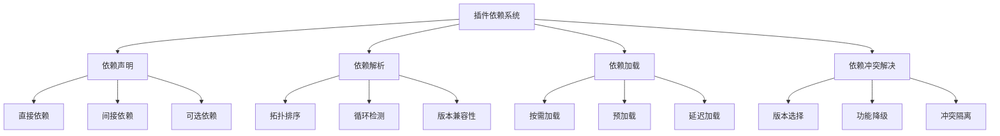
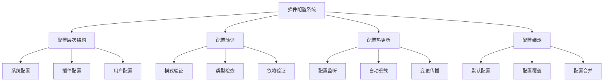
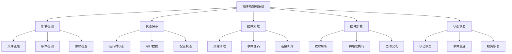
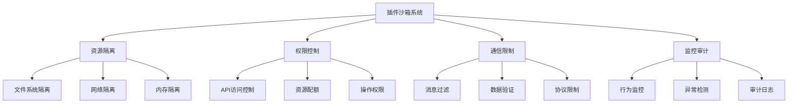
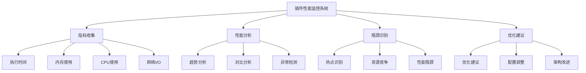

# 第16章：插件系统高级特性

> **本章学习目标**
> - 掌握插件间依赖管理和解决机制
> - 学习插件配置和扩展点设计
> - 理解插件热加载和动态更新
> - 掌握插件沙箱和安全隔离
> - 学习插件性能监控和优化

---

## 16.1 插件间依赖管理

### 16.1.1 依赖关系模型



### 16.1.2 依赖管理系统

```typescript
// 插件依赖管理系统
class PluginDependencyManager {
  private dependencyGraph = new DependencyGraph();
  private loadedPlugins = new Map<string, Plugin>();
  private pendingDependencies = new Map<string, Set<string>>();
  
  // 注册插件依赖
  registerDependencies(pluginId: string, dependencies: PluginDependency[]): void {
    this.dependencyGraph.addNode(pluginId);
    
    for (const dep of dependencies) {
      this.dependencyGraph.addEdge(pluginId, dep.pluginId, dep);
    }
  }
  
  // 解析依赖顺序
  resolveLoadOrder(pluginIds: string[]): string[] {
    const graph = this.buildDependencyGraph(pluginIds);
    
    // 检测循环依赖
    const cycles = this.detectCycles(graph);
    if (cycles.length > 0) {
      throw new Error(`Circular dependencies detected: ${cycles.join(', ')}`);
    }
    
    // 执行拓扑排序
    return this.topologicalSort(graph);
  }
  
  // 构建依赖图
  private buildDependencyGraph(pluginIds: string[]): Map<string, Set<string>> {
    const graph = new Map<string, Set<string>>();
    
    for (const pluginId of pluginIds) {
      graph.set(pluginId, new Set());
      
      const dependencies = this.dependencyGraph.getDependencies(pluginId);
      for (const dep of dependencies) {
        if (pluginIds.includes(dep.pluginId)) {
          graph.get(pluginId)!.add(dep.pluginId);
        }
      }
    }
    
    return graph;
  }
  
  // 检测循环依赖
  private detectCycles(graph: Map<string, Set<string>>): string[] {
    const visited = new Set<string>();
    const recursionStack = new Set<string>();
    const cycles: string[] = [];
    
    const detectCycle = (node: string): boolean => {
      visited.add(node);
      recursionStack.add(node);
      
      const neighbors = graph.get(node) || new Set();
      for (const neighbor of neighbors) {
        if (!visited.has(neighbor)) {
          if (detectCycle(neighbor)) {
            return true;
          }
        } else if (recursionStack.has(neighbor)) {
          cycles.push(`${node} -> ${neighbor}`);
          return true;
        }
      }
      
      recursionStack.delete(node);
      return false;
    };
    
    for (const node of graph.keys()) {
      if (!visited.has(node)) {
        detectCycle(node);
      }
    }
    
    return cycles;
  }
  
  // 拓扑排序
  private topologicalSort(graph: Map<string, Set<string>>): string[] {
    const inDegree = new Map<string, number>();
    const queue: string[] = [];
    const result: string[] = [];
    
    // 计算入度
    for (const [node, neighbors] of graph) {
      inDegree.set(node, 0);
    }
    
    for (const [node, neighbors] of graph) {
      for (const neighbor of neighbors) {
        inDegree.set(neighbor, (inDegree.get(neighbor) || 0) + 1);
      }
    }
    
    // 找出入度为0的节点
    for (const [node, degree] of inDegree) {
      if (degree === 0) {
        queue.push(node);
      }
    }
    
    // 处理节点
    while (queue.length > 0) {
      const node = queue.shift()!;
      result.push(node);
      
      const neighbors = graph.get(node) || new Set();
      for (const neighbor of neighbors) {
        const newDegree = (inDegree.get(neighbor) || 0) - 1;
        inDegree.set(neighbor, newDegree);
        
        if (newDegree === 0) {
          queue.push(neighbor);
        }
      }
    }
    
    return result;
  }
  
  // 解决版本冲突
  resolveVersionConflicts(pluginId: string, dependencies: PluginDependency[]): PluginDependency[] {
    const resolved: PluginDependency[] = [];
    
    for (const dep of dependencies) {
      const existing = this.findExistingDependency(dep.pluginId);
      
      if (existing) {
        // 检查版本兼容性
        const compatible = this.checkVersionCompatibility(existing, dep);
        
        if (compatible) {
          resolved.push(existing);
        } else {
          // 选择兼容版本
          const selected = this.selectCompatibleVersion(existing, dep);
          resolved.push(selected);
        }
      } else {
        resolved.push(dep);
      }
    }
    
    return resolved;
  }
  
  // 查找现有依赖
  private findExistingDependency(pluginId: string): PluginDependency | null {
    for (const [_, plugin] of this.loadedPlugins) {
      for (const dep of plugin.dependencies || []) {
        if (dep.pluginId === pluginId) {
          return dep;
        }
      }
    }
    return null;
  }
  
  // 检查版本兼容性
  private checkVersionCompatibility(
    existing: PluginDependency,
    requested: PluginDependency
  ): boolean {
    if (!requested.versionRange) {
      return true;
    }
    
    return this.satisfiesVersionRange(existing.version, requested.versionRange);
  }
  
  // 选择兼容版本
  private selectCompatibleVersion(
    existing: PluginDependency,
    requested: PluginDependency
  ): PluginDependency {
    // 实现版本选择逻辑
    return existing;
  }
  
  // 检查版本范围
  private satisfiesVersionRange(version: string, range: string): boolean {
    // 简化的版本范围检查
    if (range === '*') return true;
    if (range.startsWith('>=')) {
      return version >= range.substring(2);
    }
    return version === range;
  }
  
  // 获取依赖树
  getDependencyTree(pluginId: string): DependencyTree {
    const visited = new Set<string>();
    
    const buildTree = (id: string, depth: number = 0): DependencyTreeNode => {
      if (visited.has(id)) {
        return { pluginId: id, circular: true };
      }
      
      visited.add(id);
      
      const dependencies = this.dependencyGraph.getDependencies(id);
      const children = dependencies.map(dep => 
        buildTree(dep.pluginId, depth + 1)
      );
      
      return {
        pluginId: id,
        version: this.loadedPlugins.get(id)?.version,
        dependencies: children,
        depth
      };
    };
    
    const root = buildTree(pluginId);
    return { root };
  }
  
  // 验证依赖完整性
  validateDependencies(pluginId: string): ValidationResult {
    const dependencies = this.dependencyGraph.getDependencies(pluginId);
    const missing: string[] = [];
    const incompatible: string[] = [];
    
    for (const dep of dependencies) {
      const plugin = this.loadedPlugins.get(dep.pluginId);
      
      if (!plugin) {
        if (dep.required) {
          missing.push(dep.pluginId);
        }
      } else {
        if (!this.checkVersionCompatibility(plugin, dep)) {
          incompatible.push(dep.pluginId);
        }
      }
    }
    
    return {
      valid: missing.length === 0 && incompatible.length === 0,
      missing,
      incompatible,
      warnings: []
    };
  }
}

// 依赖图
class DependencyGraph {
  private nodes = new Map<string, PluginNode>();
  private edges = new Map<string, Set<DependencyEdge>>();
  
  addNode(pluginId: string): void {
    if (!this.nodes.has(pluginId)) {
      this.nodes.set(pluginId, { pluginId, state: 'unloaded' });
    }
  }
  
  addEdge(from: string, to: string, dependency: PluginDependency): void {
    if (!this.edges.has(from)) {
      this.edges.set(from, new Set());
    }
    this.edges.get(from)!.add({ to, dependency });
  }
  
  getDependencies(pluginId: string): PluginDependency[] {
    const edges = this.edges.get(pluginId);
    if (!edges) return [];
    
    return Array.from(edges).map(edge => edge.dependency);
  }
  
  getNode(pluginId: string): PluginNode | undefined {
    return this.nodes.get(pluginId);
  }
  
  setNodeState(pluginId: string, state: PluginState): void {
    const node = this.nodes.get(pluginId);
    if (node) {
      node.state = state;
    }
  }
}

// 相关接口定义
interface PluginDependency {
  pluginId: string;
  version?: string;
  versionRange?: string;
  required: boolean;
  type?: 'runtime' | 'development' | 'peer';
}

interface PluginNode {
  pluginId: string;
  state: PluginState;
}

interface DependencyEdge {
  to: string;
  dependency: PluginDependency;
}

type PluginState = 'unloaded' | 'loading' | 'loaded' | 'error';

interface DependencyTree {
  root: DependencyTreeNode;
}

interface DependencyTreeNode {
  pluginId: string;
  version?: string;
  dependencies?: DependencyTreeNode[];
  depth?: number;
  circular?: boolean;
}

interface ValidationResult {
  valid: boolean;
  missing: string[];
  incompatible: string[];
  warnings: string[];
}
```

### 16.1.3 依赖冲突解决策略

```typescript
// 依赖冲突解决器
class DependencyConflictResolver {
  // 解决依赖冲突
  resolve(
    pluginId: string,
    conflicts: DependencyConflict[]
  ): ResolutionStrategy {
    const strategy = this.analyzeConflicts(conflicts);
    
    switch (strategy.type) {
      case 'version-selection':
        return this.resolveByVersionSelection(conflicts, strategy.config);
      
      case 'feature-gradation':
        return this.resolveByFeatureGradation(conflicts, strategy.config);
      
      case 'isolation':
        return this.resolveByIsolation(conflicts, strategy.config);
      
      default:
        throw new Error(`Unknown resolution strategy: ${strategy.type}`);
    }
  }
  
  // 分析冲突类型
  private analyzeConflicts(conflicts: DependencyConflict[]): ResolutionStrategy {
    if (this.areVersionConflicts(conflicts)) {
      return {
        type: 'version-selection',
        config: { strategy: 'latest-compatible' }
      };
    }
    
    if (this.areFeatureConflicts(conflicts)) {
      return {
        type: 'feature-gradation',
        config: { strategy: 'minimal-features' }
      };
    }
    
    return {
      type: 'isolation',
      config: { strategy: 'sandbox-isolation' }
    };
  }
  
  // 按版本选择解决
  private resolveByVersionSelection(
    conflicts: DependencyConflict[],
    config: any
  ): ResolutionStrategy {
    const selected = this.selectBestVersion(conflicts);
    
    return {
      type: 'version-selection',
      config: { selected, conflicts: [] }
    };
  }
  
  // 按功能降级解决
  private resolveByFeatureGradation(
    conflicts: DependencyConflict[],
    config: any
  ): ResolutionStrategy {
    const minimalSet = this.identifyMinimalFeatures(conflicts);
    
    return {
      type: 'feature-gradation',
      config: { minimalSet, disabled: [] }
    };
  }
  
  // 按隔离解决
  private resolveByIsolation(
    conflicts: DependencyConflict[],
    config: any
  ): ResolutionStrategy {
    const isolationPlan = this.createIsolationPlan(conflicts);
    
    return {
      type: 'isolation',
      config: { isolationPlan }
    };
  }
  
  // 选择最佳版本
  private selectBestVersion(conflicts: DependencyConflict[]): VersionSelection {
    // 实现版本选择逻辑
    return {
      pluginId: conflicts[0].pluginId,
      version: '1.0.0',
      reason: 'Latest compatible version'
    };
  }
  
  // 识别最小功能集
  private identifyMinimalFeatures(conflicts: DependencyConflict[]): FeatureSet {
    return {
      required: ['core'],
      optional: ['advanced', 'experimental']
    };
  }
  
  // 创建隔离计划
  private createIsolationPlan(conflicts: DependencyConflict[]): IsolationPlan {
    return {
      isolatedPlugins: conflicts.map(c => c.pluginId),
      sandboxed: true,
      sharedResources: []
    };
  }
  
  // 检查是否为版本冲突
  private areVersionConflicts(conflicts: DependencyConflict[]): boolean {
    return conflicts.every(c => c.type === 'version');
  }
  
  // 检查是否为功能冲突
  private areFeatureConflicts(conflicts: DependencyConflict[]): boolean {
    return conflicts.every(c => c.type === 'feature');
  }
}

// 相关接口定义
interface DependencyConflict {
  pluginId: string;
  type: 'version' | 'feature' | 'resource';
  description: string;
  severity: 'low' | 'medium' | 'high';
}

interface ResolutionStrategy {
  type: 'version-selection' | 'feature-gradation' | 'isolation';
  config: any;
}

interface VersionSelection {
  pluginId: string;
  version: string;
  reason: string;
}

interface FeatureSet {
  required: string[];
  optional: string[];
}

interface IsolationPlan {
  isolatedPlugins: string[];
  sandboxed: boolean;
  sharedResources: string[];
}
```

---

## 16.2 插件配置和扩展点

### 16.2.1 插件配置系统



### 16.2.2 配置管理系统

```typescript
// 插件配置管理系统
class PluginConfigurationManager {
  private systemConfig: SystemConfiguration;
  private pluginConfigs = new Map<string, PluginConfiguration>();
  private userConfigs = new Map<string, UserConfiguration>();
  private configWatchers = new Map<string, ConfigWatcher[]>();
  private configValidators = new Map<string, ConfigValidator>();
  
  constructor(systemConfig: SystemConfiguration) {
    this.systemConfig = systemConfig;
  }
  
  // 注册插件配置
  registerPluginConfig(pluginId: string, config: PluginConfiguration): void {
    // 合并系统配置
    const mergedConfig = this.mergeWithSystemConfig(config);
    
    // 应用用户配置
    const finalConfig = this.applyUserConfig(pluginId, mergedConfig);
    
    // 验证配置
    this.validateConfig(pluginId, finalConfig);
    
    // 存储配置
    this.pluginConfigs.set(pluginId, finalConfig);
    
    logger.info(`Configuration registered for plugin: ${pluginId}`);
  }
  
  // 获取插件配置
  getPluginConfig(pluginId: string): PluginConfiguration {
    const config = this.pluginConfigs.get(pluginId);
    
    if (!config) {
      // 返回默认配置
      return this.getDefaultConfig(pluginId);
    }
    
    return config;
  }
  
  // 更新插件配置
  async updatePluginConfig(
    pluginId: string,
    updates: Partial<PluginConfiguration>
  ): Promise<void> {
    const currentConfig = this.getPluginConfig(pluginId);
    const newConfig = this.mergeConfig(currentConfig, updates);
    
    // 验证新配置
    this.validateConfig(pluginId, newConfig);
    
    // 存储更新
    this.pluginConfigs.set(pluginId, newConfig);
    
    // 通知配置变更
    await this.notifyConfigChange(pluginId, currentConfig, newConfig);
  }
  
  // 设置用户配置
  setUserConfig(pluginId: string, userConfig: UserConfiguration): void {
    this.userConfigs.set(pluginId, userConfig);
    
    // 重新应用用户配置
    const pluginConfig = this.pluginConfigs.get(pluginId);
    if (pluginConfig) {
      const updatedConfig = this.applyUserConfig(pluginId, pluginConfig);
      this.pluginConfigs.set(pluginId, updatedConfig);
    }
  }
  
  // 监听配置变更
  watchConfig(
    pluginId: string,
    callback: (newConfig: PluginConfiguration, oldConfig: PluginConfiguration) => void
  ): void {
    const watchers = this.configWatchers.get(pluginId) || [];
    watchers.push({
      id: generateWatcherId(),
      callback
    });
    this.configWatchers.set(pluginId, watchers);
  }
  
  // 取消监听
  unwatchConfig(pluginId: string, watcherId: string): void {
    const watchers = this.configWatchers.get(pluginId);
    if (watchers) {
      const filtered = watchers.filter(w => w.id !== watcherId);
      this.configWatchers.set(pluginId, filtered);
    }
  }
  
  // 注册配置验证器
  registerConfigValidator(pluginId: string, validator: ConfigValidator): void {
    this.configValidators.set(pluginId, validator);
  }
  
  // 合并系统配置
  private mergeWithSystemConfig(config: PluginConfiguration): PluginConfiguration {
    const systemDefaults = this.systemConfig.pluginDefaults || {};
    const pluginDefaults = systemDefaults[config.pluginId] || {};
    
    return this.mergeConfig(pluginDefaults, config);
  }
  
  // 应用用户配置
  private applyUserConfig(
    pluginId: string,
    config: PluginConfiguration
  ): PluginConfiguration {
    const userConfig = this.userConfigs.get(pluginId);
    if (!userConfig) {
      return config;
    }
    
    return this.mergeConfig(config, userConfig.overrides);
  }
  
  // 合并配置
  private mergeConfig(
    base: any,
    updates: any
  ): any {
    const result = { ...base };
    
    for (const key of Object.keys(updates)) {
      if (typeof updates[key] === 'object' && !Array.isArray(updates[key])) {
        result[key] = this.mergeConfig(base[key] || {}, updates[key]);
      } else {
        result[key] = updates[key];
      }
    }
    
    return result;
  }
  
  // 验证配置
  private validateConfig(pluginId: string, config: PluginConfiguration): void {
    const validator = this.configValidators.get(pluginId);
    
    if (validator) {
      const result = validator.validate(config);
      
      if (!result.valid) {
        throw new ConfigValidationError(
          `Configuration validation failed for plugin: ${pluginId}`,
          result.errors
        );
      }
    }
  }
  
  // 通知配置变更
  private async notifyConfigChange(
    pluginId: string,
    oldConfig: PluginConfiguration,
    newConfig: PluginConfiguration
  ): Promise<void> {
    const watchers = this.configWatchers.get(pluginId) || [];
    
    await Promise.all(
      watchers.map(watcher => watcher.callback(newConfig, oldConfig))
    );
  }
  
  // 获取默认配置
  private getDefaultConfig(pluginId: string): PluginConfiguration {
    const systemDefaults = this.systemConfig.pluginDefaults || {};
    return systemDefaults[pluginId] || {};
  }
}

// 配置验证器
interface ConfigValidator {
  validate(config: PluginConfiguration): ValidationResult;
}

// 配置监听器
interface ConfigWatcher {
  id: string;
  callback: (newConfig: PluginConfiguration, oldConfig: PluginConfiguration) => void;
}

// 配置验证错误
class ConfigValidationError extends Error {
  constructor(
    message: string,
    public errors: string[]
  ) {
    super(message);
    this.name = 'ConfigValidationError';
  }
}

// 相关接口定义
interface SystemConfiguration {
  pluginDefaults?: Record<string, Partial<PluginConfiguration>>;
  globalSettings?: Record<string, any>;
}

interface PluginConfiguration {
  pluginId: string;
  version?: string;
  settings?: Record<string, any>;
  features?: Record<string, boolean>;
  dependencies?: PluginDependency[];
}

interface UserConfiguration {
  pluginId: string;
  overrides: Partial<PluginConfiguration>;
  preferences?: Record<string, any>;
}

interface ValidationResult {
  valid: boolean;
  errors: string[];
  warnings: string[];
}
```

### 16.2.3 扩展点系统

```typescript
// 插件扩展点系统
class PluginExtensionSystem {
  private extensionPoints = new Map<string, ExtensionPoint>();
  private extensionProviders = new Map<string, ExtensionProvider[]>();
  
  // 注册扩展点
  registerExtensionPoint(point: ExtensionPoint): void {
    this.extensionPoints.set(point.id, point);
    logger.info(`Extension point registered: ${point.id}`);
  }
  
  // 注册扩展提供者
  registerExtensionProvider(
    extensionPointId: string,
    provider: ExtensionProvider
  ): void {
    const point = this.extensionPoints.get(extensionPointId);
    if (!point) {
      throw new Error(`Extension point not found: ${extensionPointId}`);
    }
    
    // 验证扩展兼容性
    this.validateExtensionCompatibility(point, provider);
    
    // 注册提供者
    let providers = this.extensionProviders.get(extensionPointId);
    if (!providers) {
      providers = [];
      this.extensionProviders.set(extensionPointId, providers);
    }
    providers.push(provider);
    
    logger.info(`Extension provider registered for: ${extensionPointId}`);
  }
  
  // 获取扩展
  getExtensions(extensionPointId: string): Extension[] {
    const providers = this.extensionProviders.get(extensionPointId) || [];
    
    return providers.map(provider => ({
      id: provider.id,
      name: provider.name,
      implementation: provider.implementation,
      metadata: provider.metadata
    }));
  }
  
  // 执行扩展
  async executeExtension(
    extensionPointId: string,
    context: ExtensionContext
  ): Promise<ExtensionResult> {
    const point = this.extensionPoints.get(extensionPointId);
    if (!point) {
      throw new Error(`Extension point not found: ${extensionPointId}`);
    }
    
    const providers = this.extensionProviders.get(extensionPointId) || [];
    const results: ExtensionExecutionResult[] = [];
    
    // 按优先级排序
    const sortedProviders = providers.sort(
      (a, b) => (b.priority || 0) - (a.priority || 0)
    );
    
    // 执行扩展
    for (const provider of sortedProviders) {
      try {
        const result = await provider.implementation(context);
        results.push({
          providerId: provider.id,
          success: true,
          result
        });
        
        // 如果扩展终止了执行链
        if (result?.terminate) {
          break;
        }
      } catch (error) {
        results.push({
          providerId: provider.id,
          success: false,
          error: error as Error
        });
        
        // 根据错误处理策略决定是否继续
        if (point.errorHandling === 'stop-on-error') {
          break;
        }
      }
    }
    
    return this.aggregateResults(results);
  }
  
  // 验证扩展兼容性
  private validateExtensionCompatibility(
    point: ExtensionPoint,
    provider: ExtensionProvider
  ): void {
    // 检查接口兼容性
    if (point.interface && provider.implementation) {
      const requiredMethods = point.interface.methods || [];
      const implMethods = Object.getOwnPropertyNames(provider.implementation);
      
      for (const method of requiredMethods) {
        if (!implMethods.includes(method)) {
          throw new Error(
            `Extension provider ${provider.id} missing required method: ${method}`
          );
        }
      }
    }
    
    // 检查版本兼容性
    if (point.versionRange && provider.version) {
      if (!this.satisfiesVersionRange(provider.version, point.versionRange)) {
        throw new Error(
          `Extension provider ${provider.id} version ${provider.version} ` +
          `not compatible with required version range: ${point.versionRange}`
        );
      }
    }
  }
  
  // 聚合结果
  private aggregateResults(results: ExtensionExecutionResult[]): ExtensionResult {
    const successful = results.filter(r => r.success);
    const failed = results.filter(r => !r.success);
    
    return {
      success: failed.length === 0,
      results: successful.map(r => r.result),
      errors: failed.map(r => r.error),
      executionSummary: {
        totalExecutions: results.length,
        successfulExecutions: successful.length,
        failedExecutions: failed.length
      }
    };
  }
  
  // 检查版本兼容性
  private satisfiesVersionRange(version: string, range: string): boolean {
    // 简化的版本范围检查
    if (range === '*') return true;
    if (range.startsWith('>=')) {
      return version >= range.substring(2);
    }
    return version === range;
  }
  
  // 获取扩展点信息
  getExtensionPointInfo(extensionPointId: string): ExtensionPoint | undefined {
    return this.extensionPoints.get(extensionPointId);
  }
  
  // 列出所有扩展点
  listExtensionPoints(): ExtensionPoint[] {
    return Array.from(this.extensionPoints.values());
  }
}

// 相关接口定义
interface ExtensionPoint {
  id: string;
  name: string;
  description: string;
  interface?: ExtensionInterface;
  versionRange?: string;
  errorHandling?: 'stop-on-error' | 'continue-on-error';
  maxProviders?: number;
}

interface ExtensionInterface {
  methods: string[];
  events?: string[];
}

interface ExtensionProvider {
  id: string;
  name: string;
  version?: string;
  implementation: (context: ExtensionContext) => Promise<ExtensionResult>;
  priority?: number;
  metadata?: Record<string, any>;
}

interface ExtensionContext {
  input: any;
  state?: Map<string, any>;
  config?: Record<string, any>;
}

interface ExtensionResult {
  data?: any;
  terminate?: boolean;
  metadata?: Record<string, any>;
}

interface ExtensionExecutionResult {
  providerId: string;
  success: boolean;
  result?: any;
  error?: Error;
}

interface Extension {
  id: string;
  name: string;
  implementation: (context: ExtensionContext) => Promise<ExtensionResult>;
  metadata?: Record<string, any>;
}
```

---

## 16.3 插件热加载

### 16.3.1 热加载机制



### 16.3.2 热加载实现

```typescript
// 插件热加载系统
class PluginHotReloadSystem {
  private loadedPlugins = new Map<string, HotReloadablePlugin>();
  private fileWatchers = new Map<string, FSWatcher>();
  private stateSnapshots = new Map<string, PluginStateSnapshot>();
  private reloadQueue = new Set<string>();
  private isReloading = new Set<string>();
  
  // 启用热加载
  enableHotReload(pluginId: string, pluginPath: string): void {
    const plugin = this.loadedPlugins.get(pluginId);
    if (!plugin) {
      throw new Error(`Plugin not found: ${pluginId}`);
    }
    
    // 创建文件监控
    const watcher = this.createFileWatcher(pluginPath, pluginId);
    this.fileWatchers.set(pluginId, watcher);
    
    // 标记为可热加载
    plugin.hotReloadEnabled = true;
    
    logger.info(`Hot reload enabled for plugin: ${pluginId}`);
  }
  
  // 创建文件监控器
  private createFileWatcher(pluginPath: string, pluginId: string): FSWatcher {
    // 使用文件系统监控API
    const watcher = new FSWatcher();
    
    watcher.watch(pluginPath).on('change', async (filePath) => {
      await this.handleFileChange(pluginId, filePath);
    });
    
    return watcher;
  }
  
  // 处理文件变更
  private async handleFileChange(pluginId: string, filePath: string): Promise<void> {
    // 检查是否已经在重新加载
    if (this.isReloading.has(pluginId)) {
      logger.debug(`Plugin ${pluginId} is already reloading, queuing...`);
      this.reloadQueue.add(pluginId);
      return;
    }
    
    this.isReloading.add(pluginId);
    
    try {
      // 验证变更文件
      if (!this.isPluginFile(filePath)) {
        return;
      }
      
      logger.info(`Detected changes for plugin: ${pluginId}`);
      
      // 执行热加载
      await this.hotReloadPlugin(pluginId);
      
      // 处理队列中的重新加载请求
      if (this.reloadQueue.has(pluginId)) {
        this.reloadQueue.delete(pluginId);
        await this.handleFileChange(pluginId, filePath);
      }
      
    } catch (error) {
      logger.error(`Hot reload failed for plugin ${pluginId}:`, error);
    } finally {
      this.isReloading.delete(pluginId);
    }
  }
  
  // 热加载插件
  async hotReloadPlugin(pluginId: string): Promise<void> {
    const plugin = this.loadedPlugins.get(pluginId);
    if (!plugin) {
      throw new Error(`Plugin not found: ${pluginId}`);
    }
    
    logger.info(`Starting hot reload for plugin: ${pluginId}`);
    
    // 1. 保存当前状态
    const snapshot = await this.capturePluginState(plugin);
    this.stateSnapshots.set(pluginId, snapshot);
    
    // 2. 卸载插件
    await this.unloadPlugin(plugin);
    
    // 3. 重新加载插件代码
    const reloadedPlugin = await this.reloadPluginCode(plugin);
    
    // 4. 恢复插件状态
    await this.restorePluginState(reloadedPlugin, snapshot);
    
    // 5. 验证重新加载
    await this.validateReloadedPlugin(reloadedPlugin);
    
    // 更新插件实例
    this.loadedPlugins.set(pluginId, reloadedPlugin);
    
    logger.info(`Hot reload completed for plugin: ${pluginId}`);
  }
  
  // 捕获插件状态
  private async capturePluginState(plugin: HotReloadablePlugin): Promise<PluginStateSnapshot> {
    return {
      runtimeState: await plugin.saveState?.() || {},
      configuration: plugin.getCurrentConfig?.() || {},
      activeConnections: plugin.getActiveConnections?.() || [],
      userData: plugin.getUserData?.() || {},
      timestamp: new Date()
    };
  }
  
  // 卸载插件
  private async unloadPlugin(plugin: HotReloadablePlugin): Promise<void> {
    // 调用清理方法
    await plugin.cleanup?.();
    
    // 清除事件监听器
    plugin.removeAllListeners?.();
    
    // 关闭连接
    const connections = plugin.getActiveConnections?.() || [];
    await Promise.all(connections.map(conn => conn.close()));
  }
  
  // 重新加载插件代码
  private async reloadPluginCode(
    plugin: HotReloadablePlugin
  ): Promise<HotReloadablePlugin> {
    // 清除模块缓存
    this.clearModuleCache(plugin.path);
    
    // 重新加载模块
    const reloadedModule = await import(plugin.path);
    
    // 创建新的插件实例
    const reloadedPlugin = new reloadedModule.default();
    
    // 保留热加载配置
    reloadedPlugin.hotReloadEnabled = true;
    reloadedPlugin.path = plugin.path;
    
    return reloadedPlugin;
  }
  
  // 恢复插件状态
  private async restorePluginState(
    plugin: HotReloadablePlugin,
    snapshot: PluginStateSnapshot
  ): Promise<void> {
    // 恢复配置
    if (plugin.restoreConfig && snapshot.configuration) {
      await plugin.restoreConfig(snapshot.configuration);
    }
    
    // 恢复运行时状态
    if (plugin.restoreState && snapshot.runtimeState) {
      await plugin.restoreState(snapshot.runtimeState);
    }
    
    // 恢复用户数据
    if (plugin.restoreUserData && snapshot.userData) {
      await plugin.restoreUserData(snapshot.userData);
    }
    
    // 恢复连接
    if (plugin.restoreConnections && snapshot.activeConnections) {
      await plugin.restoreConnections(snapshot.activeConnections);
    }
  }
  
  // 验证重新加载的插件
  private async validateReloadedPlugin(plugin: HotReloadablePlugin): Promise<void> {
    // 执行插件自检
    if (plugin.validate) {
      const isValid = await plugin.validate();
      if (!isValid) {
        throw new Error('Plugin validation failed after reload');
      }
    }
    
    // 执行健康检查
    if (plugin.healthCheck) {
      const isHealthy = await plugin.healthCheck();
      if (!isHealthy) {
        throw new Error('Plugin health check failed after reload');
      }
    }
  }
  
  // 清除模块缓存
  private clearModuleCache(modulePath: string): void {
    const resolvedPath = require.resolve(modulePath);
    delete require.cache[resolvedPath];
  }
  
  // 禁用热加载
  disableHotReload(pluginId: string): void {
    const watcher = this.fileWatchers.get(pluginId);
    if (watcher) {
      watcher.close();
      this.fileWatchers.delete(pluginId);
    }
    
    const plugin = this.loadedPlugins.get(pluginId);
    if (plugin) {
      plugin.hotReloadEnabled = false;
    }
    
    logger.info(`Hot reload disabled for plugin: ${pluginId}`);
  }
  
  // 获取热加载状态
  getHotReloadStatus(pluginId: string): HotReloadStatus {
    const plugin = this.loadedPlugins.get(pluginId);
    const isWatching = this.fileWatchers.has(pluginId);
    const isReloading = this.isReloading.has(pluginId);
    const isQueued = this.reloadQueue.has(pluginId);
    
    return {
      enabled: plugin?.hotReloadEnabled || false,
      isWatching,
      isReloading,
      isQueued,
      lastReload: plugin?.lastReloadTime
    };
  }
}

// 相关接口定义
interface HotReloadablePlugin {
  path: string;
  hotReloadEnabled: boolean;
  lastReloadTime?: Date;
  
  // 状态管理方法
  saveState?(): Promise<any>;
  restoreState?(state: any): Promise<void>;
  getCurrentConfig?(): any;
  restoreConfig?(config: any): Promise<void>;
  getUserData?(): any;
  restoreUserData?(data: any): Promise<void>;
  
  // 连接管理
  getActiveConnections?(): Connection[];
  restoreConnections?(connections: Connection[]): Promise<void>;
  
  // 生命周期方法
  cleanup?(): Promise<void>;
  validate?(): Promise<boolean>;
  healthCheck?(): Promise<boolean>;
  removeAllListeners?(): void;
}

interface PluginStateSnapshot {
  runtimeState: any;
  configuration: any;
  activeConnections: Connection[];
  userData: any;
  timestamp: Date;
}

interface HotReloadStatus {
  enabled: boolean;
  isWatching: boolean;
  isReloading: boolean;
  isQueued: boolean;
  lastReload?: Date;
}

interface Connection {
  close(): Promise<void>;
}

// 文件监控器
class FSWatcher {
  private callbacks: Array<(filePath: string) => void> = [];
  
  watch(path: string): this {
    // 实现文件监控逻辑
    return this;
  }
  
  on(event: 'change', callback: (filePath: string) => void): this {
    this.callbacks.push(callback);
    return this;
  }
  
  close(): void {
    this.callbacks = [];
  }
}
```

---

## 16.4 插件沙箱和安全隔离

### 16.4.1 沙箱架构



### 16.4.2 沙箱实现

```typescript
// 插件沙箱系统
class PluginSandboxSystem {
  private sandboxes = new Map<string, PluginSandbox>();
  private securityPolicies = new Map<string, SecurityPolicy>();
  private resourceQuotas = new Map<string, ResourceQuota>();
  
  // 创建沙箱
  createSandbox(pluginId: string, config: SandboxConfig): PluginSandbox {
    const sandbox = new PluginSandbox({
      pluginId,
      resourceLimits: config.resourceLimits,
      securityPolicy: config.securityPolicy,
      networkRules: config.networkRules
    });
    
    this.sandboxes.set(pluginId, sandbox);
    
    logger.info(`Sandbox created for plugin: ${pluginId}`);
    
    return sandbox;
  }
  
  // 在沙箱中执行插件代码
  async executeInSandbox<T>(
    pluginId: string,
    code: string,
    context: ExecutionContext
  ): Promise<T> {
    const sandbox = this.sandboxes.get(pluginId);
    if (!sandbox) {
      throw new Error(`Sandbox not found for plugin: ${pluginId}`);
    }
    
    // 设置资源限制
    sandbox.applyResourceLimits();
    
    // 应用安全策略
    sandbox.applySecurityPolicy();
    
    try {
      // 执行代码
      const result = await sandbox.execute<T>(code, context);
      
      // 验证结果
      this.validateResult(result, sandbox.securityPolicy);
      
      return result;
      
    } catch (error) {
      // 记录安全事件
      this.recordSecurityEvent(pluginId, error as Error);
      throw error;
    }
  }
  
  // 设置安全策略
  setSecurityPolicy(pluginId: string, policy: SecurityPolicy): void {
    this.securityPolicies.set(pluginId, policy);
    
    const sandbox = this.sandboxes.get(pluginId);
    if (sandbox) {
      sandbox.securityPolicy = policy;
    }
  }
  
  // 设置资源配额
  setResourceQuota(pluginId: string, quota: ResourceQuota): void {
    this.resourceQuotas.set(pluginId, quota);
    
    const sandbox = this.sandboxes.get(pluginId);
    if (sandbox) {
      sandbox.resourceQuota = quota;
    }
  }
  
  // 验证结果
  private validateResult(result: any, policy: SecurityPolicy): void {
    // 检查数据大小
    if (policy.maxDataSize && this.getDataSize(result) > policy.maxDataSize) {
      throw new Error('Result exceeds maximum allowed data size');
    }
    
    // 检查数据类型
    if (policy.allowedTypes && !this.isAllowedType(result, policy.allowedTypes)) {
      throw new Error('Result contains disallowed data types');
    }
  }
  
  // 记录安全事件
  private recordSecurityEvent(pluginId: string, error: Error): void {
    const event: SecurityEvent = {
      timestamp: new Date(),
      pluginId,
      type: 'sandbox-violation',
      severity: 'high',
      message: error.message,
      stack: error.stack
    };
    
    logger.error('Security event recorded:', event);
    
    // 这里可以添加通知管理员或其他处理逻辑
  }
  
  // 获取数据大小
  private getDataSize(data: any): number {
    return JSON.stringify(data).length;
  }
  
  // 检查数据类型
  private isAllowedType(data: any, allowedTypes: string[]): boolean {
    const dataType = typeof data;
    return allowedTypes.includes(dataType);
  }
  
  // 销毁沙箱
  destroySandbox(pluginId: string): void {
    const sandbox = this.sandboxes.get(pluginId);
    if (sandbox) {
      sandbox.cleanup();
      this.sandboxes.delete(pluginId);
    }
  }
}

// 插件沙箱
class PluginSandbox {
  private isolatedContext: IsolatedContext;
  private resourceMonitor: ResourceMonitor;
  
  constructor(public config: SandboxConfig) {
    this.isolatedContext = this.createIsolatedContext();
    this.resourceMonitor = new ResourceMonitor(config.resourceLimits);
  }
  
  // 应用资源限制
  applyResourceLimits(): void {
    this.resourceMonitor.startMonitoring();
  }
  
  // 应用安全策略
  applySecurityPolicy(): void {
    if (this.config.securityPolicy) {
      this.isolatedContext.applyPolicy(this.config.securityPolicy);
    }
  }
  
  // 执行代码
  async execute<T>(code: string, context: ExecutionContext): Promise<T> {
    // 创建受限的执行环境
    const restrictedContext = this.createRestrictedContext(context);
    
    // 检查资源使用
    this.resourceMonitor.checkLimits();
    
    try {
      // 在沙箱中执行代码
      const result = await this.isolatedContext.execute<T>(code, restrictedContext);
      
      return result;
      
    } catch (error) {
      // 检查是否为资源限制错误
      if (this.resourceMonitor.isLimitExceeded()) {
        throw new Error('Resource limit exceeded during execution');
      }
      throw error;
    }
  }
  
  // 创建隔离上下文
  private createIsolatedContext(): IsolatedContext {
    return new IsolatedContext({
      pluginId: this.config.pluginId,
      isolationLevel: 'strict'
    });
  }
  
  // 创建受限上下文
  private createRestrictedContext(context: ExecutionContext): RestrictedContext {
    const restricted = new RestrictedContext(context);
    
    // 应用网络规则
    if (this.config.networkRules) {
      restricted.applyNetworkRules(this.config.networkRules);
    }
    
    return restricted;
  }
  
  // 清理资源
  cleanup(): void {
    this.resourceMonitor.stopMonitoring();
    this.isolatedContext.cleanup();
  }
  
  // 获取资源使用情况
  getResourceUsage(): ResourceUsage {
    return this.resourceMonitor.getCurrentUsage();
  }
}

// 资源监控器
class ResourceMonitor {
  private startTime: number = 0;
  private memoryUsage: number = 0;
  private cpuTime: number = 0;
  private networkBytes: number = 0;
  
  constructor(private limits: ResourceLimits) {}
  
  startMonitoring(): void {
    this.startTime = Date.now();
    this.memoryUsage = process.memoryUsage().heapUsed;
  }
  
  stopMonitoring(): void {
    // 计算总资源使用
    this.cpuTime = Date.now() - this.startTime;
  }
  
  checkLimits(): void {
    const currentUsage = this.getCurrentUsage();
    
    if (currentUsage.memory > this.limits.maxMemory) {
      throw new Error('Memory limit exceeded');
    }
    
    if (currentUsage.cpuTime > this.limits.maxCpuTime) {
      throw new Error('CPU time limit exceeded');
    }
    
    if (currentUsage.networkBytes > this.limits.maxNetworkBytes) {
      throw new Error('Network limit exceeded');
    }
  }
  
  isLimitExceeded(): boolean {
    try {
      this.checkLimits();
      return false;
    } catch {
      return true;
    }
  }
  
  getCurrentUsage(): ResourceUsage {
    return {
      memory: process.memoryUsage().heapUsed - this.memoryUsage,
      cpuTime: this.cpuTime,
      networkBytes: this.networkBytes
    };
  }
}

// 隔离上下文
class IsolatedContext {
  constructor(private config: IsolationConfig) {}
  
  async execute<T>(code: string, context: RestrictedContext): Promise<T> {
    // 创建隔离的执行环境
    const vm = require('vm');
    const script = new vm.Script(code);
    
    // 创建受限的全局对象
    const restrictedGlobal = this.createRestrictedGlobal(context);
    
    // 在沙箱中执行
    const sandbox = vm.createContext(restrictedGlobal);
    const result = script.runInContext(sandbox);
    
    return result as T;
  }
  
  applyPolicy(policy: SecurityPolicy): void {
    // 应用安全策略到执行环境
  }
  
  private createRestrictedGlobal(context: RestrictedContext): any {
    return {
      // 只暴露必要的API
      console: context.getRestrictedConsole(),
      require: context.getRestrictedRequire(),
      // 其他受限的全局对象
    };
  }
  
  cleanup(): void {
    // 清理资源
  }
}

// 受限上下文
class RestrictedContext {
  constructor(private originalContext: ExecutionContext) {}
  
  applyNetworkRules(rules: NetworkRules): void {
    // 应用网络访问规则
  }
  
  getRestrictedConsole(): any {
    // 返回受限的console对象
    return {
      log: (...args: any[]) => console.log('[SANDBOX]', ...args),
      error: (...args: any[]) => console.error('[SANDBOX]', ...args),
      warn: (...args: any[]) => console.warn('[SANDBOX]', ...args)
    };
  }
  
  getRestrictedRequire(): any {
    // 返回受限的require函数
    return (module: string) => {
      const allowedModules = ['path', 'util']; // 允许的模块列表
      if (!allowedModules.includes(module)) {
        throw new Error(`Module "${module}" is not allowed in sandbox`);
      }
      return require(module);
    };
  }
}

// 相关接口定义
interface SandboxConfig {
  pluginId: string;
  resourceLimits: ResourceLimits;
  securityPolicy?: SecurityPolicy;
  networkRules?: NetworkRules;
}

interface ResourceLimits {
  maxMemory: number;
  maxCpuTime: number;
  maxNetworkBytes: number;
  maxFileSize: number;
}

interface SecurityPolicy {
  maxDataSize?: number;
  allowedTypes?: string[];
  allowedOperations?: string[];
  forbiddenPatterns?: RegExp[];
}

interface NetworkRules {
  allowedDomains?: string[];
  blockedDomains?: string[];
  maxRequests?: number;
  allowedProtocols?: string[];
}

interface ResourceUsage {
  memory: number;
  cpuTime: number;
  networkBytes: number;
}

interface ExecutionContext {
  input: any;
  config: any;
  state: any;
}

interface IsolationConfig {
  pluginId: string;
  isolationLevel: 'strict' | 'moderate' | 'permissive';
}

interface SecurityEvent {
  timestamp: Date;
  pluginId: string;
  type: string;
  severity: 'low' | 'medium' | 'high' | 'critical';
  message: string;
  stack?: string;
}
```

---

## 16.5 插件性能监控

### 16.5.1 监控系统架构



### 16.5.2 性能监控实现

```typescript
// 插件性能监控系统
class PluginPerformanceMonitor {
  private metrics = new Map<string, PluginMetrics>();
  private performanceData = new Map<string, PerformanceDataPoint[]>();
  private alertThresholds = new Map<string, AlertThreshold>();
  private analysisEngine: PerformanceAnalysisEngine;
  
  constructor() {
    this.analysisEngine = new PerformanceAnalysisEngine();
  }
  
  // 开始监控插件
  startMonitoring(pluginId: string): void {
    const metrics: PluginMetrics = {
      pluginId,
      startTime: Date.now(),
      executionCount: 0,
      totalExecutionTime: 0,
      memoryUsage: [],
      cpuUsage: [],
      errorCount: 0
    };
    
    this.metrics.set(pluginId, metrics);
    this.performanceData.set(pluginId, []);
    
    logger.info(`Started monitoring plugin: ${pluginId}`);
  }
  
  // 记录执行指标
  recordExecution(
    pluginId: string,
    executionTime: number,
    memoryUsage: number,
    cpuUsage: number
  ): void {
    const metrics = this.metrics.get(pluginId);
    if (!metrics) return;
    
    // 更新指标
    metrics.executionCount++;
    metrics.totalExecutionTime += executionTime;
    metrics.memoryUsage.push(memoryUsage);
    metrics.cpuUsage.push(cpuUsage);
    
    // 记录数据点
    const dataPoint: PerformanceDataPoint = {
      timestamp: new Date(),
      executionTime,
      memoryUsage,
      cpuUsage
    };
    
    const data = this.performanceData.get(pluginId);
    if (data) {
      data.push(dataPoint);
      
      // 限制数据点数量
      if (data.length > 1000) {
        data.shift();
      }
    }
    
    // 检查告警阈值
    this.checkAlertThresholds(pluginId, dataPoint);
  }
  
  // 记录错误
  recordError(pluginId: string, error: Error): void {
    const metrics = this.metrics.get(pluginId);
    if (!metrics) return;
    
    metrics.errorCount++;
    
    logger.error(`Plugin error recorded: ${pluginId}`, error);
  }
  
  // 获取性能报告
  getPerformanceReport(pluginId: string): PerformanceReport {
    const metrics = this.metrics.get(pluginId);
    const data = this.performanceData.get(pluginId);
    
    if (!metrics || !data) {
      throw new Error(`No performance data for plugin: ${pluginId}`);
    }
    
    // 计算统计数据
    const stats = this.calculateStatistics(metrics, data);
    
    // 性能分析
    const analysis = this.analysisEngine.analyze(data);
    
    // 瓶颈识别
    const bottlenecks = this.identifyBottlenecks(pluginId, analysis);
    
    // 优化建议
    const recommendations = this.generateRecommendations(pluginId, bottlenecks);
    
    return {
      pluginId,
      period: {
        start: new Date(metrics.startTime),
        end: new Date()
      },
      statistics: stats,
      analysis,
      bottlenecks,
      recommendations,
      summary: this.generateSummary(stats, bottlenecks)
    };
  }
  
  // 设置告警阈值
  setAlertThreshold(pluginId: string, threshold: AlertThreshold): void {
    this.alertThresholds.set(pluginId, threshold);
  }
  
  // 检查告警阈值
  private checkAlertThresholds(pluginId: string, dataPoint: PerformanceDataPoint): void {
    const threshold = this.alertThresholds.get(pluginId);
    if (!threshold) return;
    
    const alerts: string[] = [];
    
    if (threshold.maxExecutionTime && dataPoint.executionTime > threshold.maxExecutionTime) {
      alerts.push(`Execution time exceeded: ${dataPoint.executionTime}ms`);
    }
    
    if (threshold.maxMemoryUsage && dataPoint.memoryUsage > threshold.maxMemoryUsage) {
      alerts.push(`Memory usage exceeded: ${dataPoint.memoryUsage}MB`);
    }
    
    if (threshold.maxCpuUsage && dataPoint.cpuUsage > threshold.maxCpuUsage) {
      alerts.push(`CPU usage exceeded: ${dataPoint.cpuUsage}%`);
    }
    
    if (alerts.length > 0) {
      this.triggerAlert(pluginId, alerts);
    }
  }
  
  // 触发告警
  private triggerAlert(pluginId: string, messages: string[]): void {
    logger.warn(`Performance alerts for plugin ${pluginId}:`, messages);
    
    // 这里可以添加告警通知逻辑
  }
  
  // 计算统计数据
  private calculateStatistics(
    metrics: PluginMetrics,
    data: PerformanceDataPoint[]
  ): PerformanceStatistics {
    const executionTimes = data.map(d => d.executionTime);
    const memoryUsages = data.map(d => d.memoryUsage);
    const cpuUsages = data.map(d => d.cpuUsage);
    
    return {
      totalExecutions: metrics.executionCount,
      averageExecutionTime: this.average(executionTimes),
      minExecutionTime: this.min(executionTimes),
      maxExecutionTime: this.max(executionTimes),
      averageMemoryUsage: this.average(memoryUsages),
      maxMemoryUsage: this.max(memoryUsages),
      averageCpuUsage: this.average(cpuUsages),
      maxCpuUsage: this.max(cpuUsages),
      errorRate: metrics.errorCount / metrics.executionCount,
      throughput: metrics.executionCount / ((Date.now() - metrics.startTime) / 1000)
    };
  }
  
  // 识别瓶颈
  private identifyBottlenecks(
    pluginId: string,
    analysis: PerformanceAnalysis
  ): Bottleneck[] {
    const bottlenecks: Bottleneck[] = [];
    
    // 分析执行时间
    if (analysis.trends.executionTime === 'increasing') {
      bottlenecks.push({
        type: 'performance',
        severity: 'high',
        description: 'Execution time is increasing over time',
        impact: 'high',
        suggestion: 'Consider optimizing code or increasing resources'
      });
    }
    
    // 分析内存使用
    if (analysis.trends.memoryUsage === 'increasing') {
      bottlenecks.push({
        type: 'memory',
        severity: 'medium',
        description: 'Memory usage is increasing over time',
        impact: 'medium',
        suggestion: 'Check for memory leaks or optimize memory usage'
      });
    }
    
    // 分析CPU使用
    if (analysis.statistics.averageCpuUsage > 80) {
      bottlenecks.push({
        type: 'cpu',
        severity: 'high',
        description: 'High CPU usage detected',
        impact: 'high',
        suggestion: 'Consider optimizing algorithms or distributing load'
      });
    }
    
    return bottlenecks;
  }
  
  // 生成优化建议
  private generateRecommendations(
    pluginId: string,
    bottlenecks: Bottleneck[]
  ): OptimizationRecommendation[] {
    const recommendations: OptimizationRecommendation[] = [];
    
    for (const bottleneck of bottlenecks) {
      recommendations.push({
        type: bottleneck.type,
        priority: bottleneck.severity,
        recommendation: bottleneck.suggestion,
        expectedImpact: this.estimateImpact(bottleneck),
        implementationComplexity: this.estimateComplexity(bottleneck)
      });
    }
    
    return recommendations;
  }
  
  // 估算影响
  private estimateImpact(bottleneck: Bottleneck): string {
    switch (bottleneck.impact) {
      case 'high':
        return 'High - Could improve performance by 30-50%';
      case 'medium':
        return 'Medium - Could improve performance by 15-30%';
      case 'low':
        return 'Low - Could improve performance by 5-15%';
      default:
        return 'Unknown';
    }
  }
  
  // 估算复杂度
  private estimateComplexity(bottleneck: Bottleneck): string {
    switch (bottleneck.type) {
      case 'performance':
        return 'Medium - May require code refactoring';
      case 'memory':
        return 'Low - May require simple optimizations';
      case 'cpu':
        return 'High - May require algorithm changes';
      default:
        return 'Unknown';
    }
  }
  
  // 生成摘要
  private generateSummary(
    stats: PerformanceStatistics,
    bottlenecks: Bottleneck[]
  ): string {
    const healthScore = this.calculateHealthScore(stats, bottlenecks);
    
    let summary = `Plugin performance health score: ${healthScore}/100. `;
    
    if (bottlenecks.length === 0) {
      summary += 'No significant bottlenecks detected.';
    } else {
      summary += `Found ${bottlenecks.length} bottleneck(s) requiring attention.`;
    }
    
    return summary;
  }
  
  // 计算健康分数
  private calculateHealthScore(
    stats: PerformanceStatistics,
    bottlenecks: Bottleneck[]
  ): number {
    let score = 100;
    
    // 根据错误率扣分
    score -= stats.errorRate * 50;
    
    // 根据瓶颈扣分
    for (const bottleneck of bottlenecks) {
      switch (bottleneck.severity) {
        case 'critical':
          score -= 20;
          break;
        case 'high':
          score -= 10;
          break;
        case 'medium':
          score -= 5;
          break;
        case 'low':
          score -= 2;
          break;
      }
    }
    
    return Math.max(0, Math.min(100, score));
  }
  
  // 停止监控
  stopMonitoring(pluginId: string): void {
    this.metrics.delete(pluginId);
    this.performanceData.delete(pluginId);
    
    logger.info(`Stopped monitoring plugin: ${pluginId}`);
  }
  
  // 辅助方法
  private average(values: number[]): number {
    return values.reduce((sum, val) => sum + val, 0) / values.length;
  }
  
  private min(values: number[]): number {
    return Math.min(...values);
  }
  
  private max(values: number[]): number {
    return Math.max(...values);
  }
}

// 性能分析引擎
class PerformanceAnalysisEngine {
  analyze(data: PerformanceDataPoint[]): PerformanceAnalysis {
    const executionTimes = data.map(d => d.executionTime);
    const memoryUsages = data.map(d => d.memoryUsage);
    const cpuUsages = data.map(d => d.cpuUsage);
    
    return {
      trends: {
        executionTime: this.detectTrend(executionTimes),
        memoryUsage: this.detectTrend(memoryUsages),
        cpuUsage: this.detectTrend(cpuUsages)
      },
      patterns: this.detectPatterns(data),
      anomalies: this.detectAnomalies(data),
      statistics: this.calculateAdvancedStatistics(data)
    };
  }
  
  private detectTrend(values: number[]): 'increasing' | 'decreasing' | 'stable' {
    if (values.length < 2) return 'stable';
    
    const firstHalf = values.slice(0, Math.floor(values.length / 2));
    const secondHalf = values.slice(Math.floor(values.length / 2));
    
    const firstAvg = this.average(firstHalf);
    const secondAvg = this.average(secondHalf);
    
    const changePercent = ((secondAvg - firstAvg) / firstAvg) * 100;
    
    if (changePercent > 10) return 'increasing';
    if (changePercent < -10) return 'decreasing';
    return 'stable';
  }
  
  private detectPatterns(data: PerformanceDataPoint[]): Pattern[] {
    // 实现模式检测逻辑
    return [];
  }
  
  private detectAnomalies(data: PerformanceDataPoint[]): Anomaly[] {
    const anomalies: Anomaly[] = [];
    
    // 使用统计方法检测异常值
    const executionTimes = data.map(d => d.executionTime);
    const mean = this.average(executionTimes);
    const stdDev = this.standardDeviation(executionTimes);
    
    for (let i = 0; i < data.length; i++) {
      const point = data[i];
      const zScore = (point.executionTime - mean) / stdDev;
      
      if (Math.abs(zScore) > 3) {
        anomalies.push({
          timestamp: point.timestamp,
          type: 'execution-time',
          severity: 'high',
          description: `Execution time ${Math.abs(zScore).toFixed(2)} standard deviations from mean`,
          value: point.executionTime
        });
      }
    }
    
    return anomalies;
  }
  
  private calculateAdvancedStatistics(data: PerformanceDataPoint[]): AdvancedStatistics {
    const executionTimes = data.map(d => d.executionTime);
    
    return {
      percentiles: {
        p50: this.percentile(executionTimes, 50),
        p95: this.percentile(executionTimes, 95),
        p99: this.percentile(executionTimes, 99)
      },
      standardDeviation: this.standardDeviation(executionTimes),
      coefficientOfVariation: this.coefficientOfVariation(executionTimes)
    };
  }
  
  private average(values: number[]): number {
    return values.reduce((sum, val) => sum + val, 0) / values.length;
  }
  
  private standardDeviation(values: number[]): number {
    const mean = this.average(values);
    const squaredDiffs = values.map(val => Math.pow(val - mean, 2));
    return Math.sqrt(this.average(squaredDiffs));
  }
  
  private percentile(values: number[], p: number): number {
    const sorted = [...values].sort((a, b) => a - b);
    const index = (p / 100) * (sorted.length - 1);
    const lower = Math.floor(index);
    const upper = Math.ceil(index);
    
    if (lower === upper) {
      return sorted[lower];
    }
    
    return sorted[lower] * (upper - index) + sorted[upper] * (index - lower);
  }
  
  private coefficientOfVariation(values: number[]): number {
    const mean = this.average(values);
    const stdDev = this.standardDeviation(values);
    return (stdDev / mean) * 100;
  }
}

// 相关接口定义
interface PluginMetrics {
  pluginId: string;
  startTime: number;
  executionCount: number;
  totalExecutionTime: number;
  memoryUsage: number[];
  cpuUsage: number[];
  errorCount: number;
}

interface PerformanceDataPoint {
  timestamp: Date;
  executionTime: number;
  memoryUsage: number;
  cpuUsage: number;
}

interface PerformanceReport {
  pluginId: string;
  period: { start: Date; end: Date };
  statistics: PerformanceStatistics;
  analysis: PerformanceAnalysis;
  bottlenecks: Bottleneck[];
  recommendations: OptimizationRecommendation[];
  summary: string;
}

interface PerformanceStatistics {
  totalExecutions: number;
  averageExecutionTime: number;
  minExecutionTime: number;
  maxExecutionTime: number;
  averageMemoryUsage: number;
  maxMemoryUsage: number;
  averageCpuUsage: number;
  maxCpuUsage: number;
  errorRate: number;
  throughput: number;
}

interface PerformanceAnalysis {
  trends: {
    executionTime: 'increasing' | 'decreasing' | 'stable';
    memoryUsage: 'increasing' | 'decreasing' | 'stable';
    cpuUsage: 'increasing' | 'decreasing' | 'stable';
  };
  patterns: Pattern[];
  anomalies: Anomaly[];
  statistics: AdvancedStatistics;
}

interface Pattern {
  type: string;
  description: string;
  frequency: number;
}

interface Anomaly {
  timestamp: Date;
  type: string;
  severity: 'low' | 'medium' | 'high';
  description: string;
  value: number;
}

interface AdvancedStatistics {
  percentiles: { p50: number; p95: number; p99: number };
  standardDeviation: number;
  coefficientOfVariation: number;
}

interface Bottleneck {
  type: string;
  severity: 'low' | 'medium' | 'high' | 'critical';
  description: string;
  impact: 'low' | 'medium' | 'high';
  suggestion: string;
}

interface OptimizationRecommendation {
  type: string;
  priority: string;
  recommendation: string;
  expectedImpact: string;
  implementationComplexity: string;
}

interface AlertThreshold {
  maxExecutionTime?: number;
  maxMemoryUsage?: number;
  maxCpuUsage?: number;
  maxErrorRate?: number;
}
```

---

## 16.6 本章小结

### 16.6.1 关键概念回顾

1. **插件依赖管理**
   - 依赖关系图和拓扑排序
   - 循环依赖检测和冲突解决
   - 版本兼容性检查和选择策略

2. **插件配置系统**
   - 多层次配置管理和合并
   - 配置验证和热更新
   - 配置监听和变更通知

3. **插件热加载**
   - 文件监控和状态保存
   - 插件卸载和重新加载
   - 状态恢复和验证机制

4. **插件沙箱安全**
   - 资源隔离和权限控制
   - 安全策略和网络规则
   - 行为监控和异常检测

### 16.6.2 实践练习

**练习1：实现插件依赖解析器**
```typescript
// 构建依赖图并执行拓扑排序
// 实现循环依赖检测
```

**练习2：创建插件配置管理系统**
```typescript
// 实现多层次配置管理
// 添加配置验证和热更新
```

**练习3：构建插件沙箱**
```typescript
// 实现资源隔离和权限控制
// 添加安全监控和审计
```

### 16.6.3 下一步学习

本章介绍了插件系统的高级特性，包括依赖管理、配置系统、热加载、沙箱安全和性能监控。下一章将学习错误处理和调试技术，了解如何构建可靠的插件系统和有效的调试工具。

插件系统的高级特性对于构建可扩展、安全、高性能的Agent应用至关重要。掌握这些技术可以大大提升系统的可维护性和稳定性。