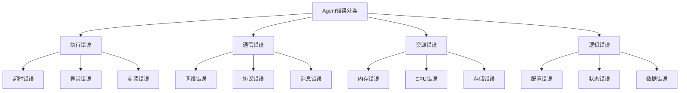
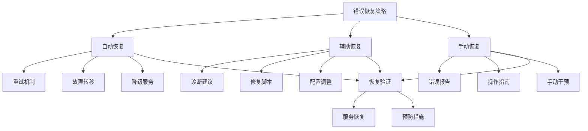
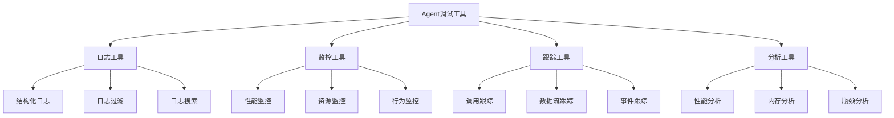
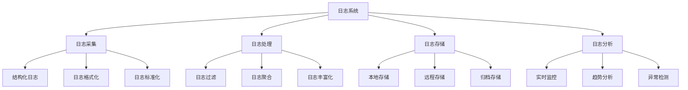

# 第17章：错误处理和调试

> **本章学习目标**
> - 理解Agent错误分类和特征
> - 掌握错误恢复策略和机制
> - 学习调试工具和技巧
> - 理解日志记录最佳实践
> - 掌握性能分析和优化方法

---

## 17.1 Agent错误分类

### 17.1.1 错误类型体系



### 17.1.2 错误分类系统

```typescript
// Agent错误分类系统
class AgentErrorClassifier {
  private errorPatterns = new Map<string, ErrorPattern>();
  private errorHistory = new Map<string, ErrorRecord[]>();
  
  // 分类错误
  classify(error: Error, context: AgentContext): AgentError {
    const errorType = this.determineErrorType(error, context);
    const severity = this.assessSeverity(error, context);
    const category = this.categorizeError(error, context);
    
    return {
      id: this.generateErrorId(),
      type: errorType,
      category,
      severity,
      message: error.message,
      stack: error.stack,
      context: this.extractContext(context),
      timestamp: new Date(),
      originalError: error
    };
  }
  
  // 确定错误类型
  private determineErrorType(error: Error, context: AgentContext): ErrorType {
    // 基于错误消息和堆栈分析
    const message = error.message.toLowerCase();
    const stack = error.stack || '';
    
    // 超时错误
    if (message.includes('timeout') || stack.includes('timeout')) {
      return 'timeout';
    }
    
    // 网络错误
    if (message.includes('network') || message.includes('connection') || 
        stack.includes('net') || stack.includes('http')) {
      return 'network';
    }
    
    // 内存错误
    if (message.includes('memory') || message.includes('heap') ||
        stack.includes('memory')) {
      return 'memory';
    }
    
    // 资源错误
    if (message.includes('resource') || message.includes('limit')) {
      return 'resource';
    }
    
    // 配置错误
    if (message.includes('config') || message.includes('setting')) {
      return 'configuration';
    }
    
    // 默认为执行错误
    return 'execution';
  }
  
  // 评估严重程度
  private assessSeverity(error: Error, context: AgentContext): ErrorSeverity {
    // 关键Agent的错误更严重
    if (context.agent.role === 'critical') {
      return 'critical';
    }
    
    // 系统级错误更严重
    if (error.message.includes('system') || error.message.includes('fatal')) {
      return 'high';
    }
    
    // 可恢复错误为中等严重性
    if (error.message.includes('timeout') || error.message.includes('retry')) {
      return 'medium';
    }
    
    // 默认为低严重性
    return 'low';
  }
  
  // 错误分类
  private categorizeError(error: Error, context: AgentContext): ErrorCategory {
    const errorType = this.determineErrorType(error, context);
    
    switch (errorType) {
      case 'timeout':
      case 'network':
        return 'communication';
      
      case 'memory':
      case 'resource':
        return 'resource';
      
      case 'configuration':
        return 'configuration';
      
      default:
        return 'execution';
    }
  }
  
  // 提取上下文信息
  private extractContext(context: AgentContext): ErrorContext {
    return {
      agentId: context.agent.id,
      agentRole: context.agent.role,
      operation: context.operation,
      phase: context.phase,
      input: this.sanitizeInput(context.input),
      state: this.sanitizeState(context.state),
      environment: {
        nodeVersion: process.version,
        platform: process.platform,
        arch: process.arch,
        memory: process.memoryUsage(),
        uptime: process.uptime()
      }
    };
  }
  
  // 生成错误ID
  private generateErrorId(): string {
    return `error-${Date.now()}-${Math.random().toString(36).slice(2, 11)}`;
  }
  
  // 记录错误
  recordError(agentError: AgentError): void {
    const history = this.errorHistory.get(agentError.context.agentId) || [];
    history.push({
      error: agentError,
      resolved: false,
      resolutionAttempts: 0
    });
    
    // 限制历史记录大小
    if (history.length > 1000) {
      history.shift();
    }
    
    this.errorHistory.set(agentError.context.agentId, history);
  }
  
  // 获取错误历史
  getErrorHistory(agentId: string, filter?: ErrorFilter): ErrorRecord[] {
    let history = this.errorHistory.get(agentId) || [];
    
    if (filter) {
      history = this.filterErrors(history, filter);
    }
    
    return history;
  }
  
  // 过滤错误
  private filterErrors(history: ErrorRecord[], filter: ErrorFilter): ErrorRecord[] {
    return history.filter(record => {
      if (filter.errorType && record.error.type !== filter.errorType) {
        return false;
      }
      
      if (filter.severity && record.error.severity !== filter.severity) {
        return false;
      }
      
      if (filter.timeRange) {
        const errorTime = record.error.timestamp.getTime();
        if (errorTime < filter.timeRange.start.getTime() || 
            errorTime > filter.timeRange.end.getTime()) {
          return false;
        }
      }
      
      return true;
    });
  }
  
  // 分析错误模式
  analyzeErrorPatterns(agentId: string): ErrorPatternAnalysis {
    const history = this.getErrorHistory(agentId);
    
    // 统计错误类型
    const typeCounts = new Map<ErrorType, number>();
    const severityCounts = new Map<ErrorSeverity, number>();
    
    for (const record of history) {
      typeCounts.set(
        record.error.type,
        (typeCounts.get(record.error.type) || 0) + 1
      );
      
      severityCounts.set(
        record.error.severity,
        (severityCounts.get(record.error.severity) || 0) + 1
      );
    }
    
    // 找出最常见的错误
    const mostCommonType = Array.from(typeCounts.entries())
      .sort((a, b) => b[1] - a[1])[0];
    
    const mostCommonSeverity = Array.from(severityCounts.entries())
      .sort((a, b) => b[1] - a[1])[0];
    
    return {
      totalErrors: history.length,
      mostCommonError: mostCommonType?.[0] || 'unknown',
      mostCommonSeverity: mostCommonSeverity?.[0] || 'unknown',
      errorDistribution: Object.fromEntries(typeCounts),
      severityDistribution: Object.fromEntries(severityCounts),
      recommendations: this.generateRecommendations(typeCounts)
    };
  }
  
  // 生成建议
  private generateRecommendations(typeCounts: Map<ErrorType, number>): string[] {
    const recommendations: string[] = [];
    
    // 分析特定错误类型的频率
    for (const [type, count] of typeCounts) {
      if (count > 10) {
        switch (type) {
          case 'timeout':
            recommendations.push('Consider increasing timeout values or optimizing performance');
            break;
          case 'network':
            recommendations.push('Check network connectivity and implement retry mechanisms');
            break;
          case 'memory':
            recommendations.push('Optimize memory usage and implement proper cleanup');
            break;
          case 'resource':
            recommendations.push('Monitor resource usage and implement proper limits');
            break;
        }
      }
    }
    
    return recommendations;
  }
  
  // 输入清理
  private sanitizeInput(input: any): any {
    // 移除敏感信息
    if (typeof input === 'object' && input !== null) {
      const sanitized = { ...input };
      
      // 移除常见的敏感字段
      const sensitiveFields = ['password', 'token', 'secret', 'key'];
      for (const field of sensitiveFields) {
        if (field in sanitized) {
          sanitized[field] = '[REDACTED]';
        }
      }
      
      return sanitized;
    }
    
    return input;
  }
  
  // 状态清理
  private sanitizeState(state: any): any {
    // 实现状态清理逻辑
    return state;
  }
}

// 相关接口定义
interface AgentError {
  id: string;
  type: ErrorType;
  category: ErrorCategory;
  severity: ErrorSeverity;
  message: string;
  stack?: string;
  context: ErrorContext;
  timestamp: Date;
  originalError: Error;
}

type ErrorType = 
  | 'execution'
  | 'timeout'
  | 'network'
  | 'memory'
  | 'resource'
  | 'configuration'
  | 'validation'
  | 'unknown';

type ErrorCategory = 
  | 'execution'
  | 'communication'
  | 'resource'
  | 'configuration'
  | 'logic'
  | 'unknown';

type ErrorSeverity = 
  | 'critical'
  | 'high'
  | 'medium'
  | 'low';

interface ErrorContext {
  agentId: string;
  agentRole: string;
  operation: string;
  phase: string;
  input: any;
  state: any;
  environment: {
    nodeVersion: string;
    platform: string;
    arch: string;
    memory: NodeJS.MemoryUsage;
    uptime: number;
  };
}

interface ErrorRecord {
  error: AgentError;
  resolved: boolean;
  resolutionAttempts: number;
}

interface ErrorFilter {
  errorType?: ErrorType;
  severity?: ErrorSeverity;
  timeRange?: { start: Date; end: Date };
  category?: ErrorCategory;
}

interface ErrorPatternAnalysis {
  totalErrors: number;
  mostCommonError: ErrorType;
  mostCommonSeverity: ErrorSeverity;
  errorDistribution: Record<string, number>;
  severityDistribution: Record<string, number>;
  recommendations: string[];
}

interface ErrorPattern {
  type: ErrorType;
  frequency: number;
  pattern: RegExp;
  suggestedAction: string;
}

interface AgentContext {
  agent: { id: string; role: string };
  operation: string;
  phase: string;
  input: any;
  state: any;
}
```

### 17.1.3 错误特征分析

```typescript
// 错误特征分析器
class ErrorCharacteristicAnalyzer {
  // 分析错误特征
  analyze(error: AgentError): ErrorCharacteristics {
    return {
      recoverability: this.assessRecoverability(error),
      frequency: this.estimateFrequency(error),
      impact: this.assessImpact(error),
      propagation: this.analyzePropagation(error),
      patterns: this.identifyPatterns(error),
      prevention: this.suggestPrevention(error)
    };
  }
  
  // 评估可恢复性
  private assessRecoverability(error: AgentError): RecoveryPotential {
    const recoverableTypes: ErrorType[] = ['timeout', 'network', 'resource'];
    const moderatelyRecoverable: ErrorType[] = ['execution', 'configuration'];
    
    if (recoverableTypes.includes(error.type)) {
      return { canRecover: true, confidence: 0.9, method: 'automatic' };
    }
    
    if (moderatelyRecoverable.includes(error.type)) {
      return { canRecover: true, confidence: 0.6, method: 'assisted' };
    }
    
    return { canRecover: false, confidence: 0.9, method: 'none' };
  }
  
  // 估算频率
  private estimateFrequency(error: AgentError): FrequencyEstimate {
    // 基于错误类型和历史模式
    const frequencyMap: Record<ErrorType, { rate: number; confidence: number }> = {
      'timeout': { rate: 0.3, confidence: 0.7 },
      'network': { rate: 0.2, confidence: 0.6 },
      'memory': { rate: 0.1, confidence: 0.5 },
      'execution': { rate: 0.15, confidence: 0.4 },
      'configuration': { rate: 0.05, confidence: 0.8 },
      'resource': { rate: 0.1, confidence: 0.6 },
      'validation': { rate: 0.05, confidence: 0.7 },
      'unknown': { rate: 0.05, confidence: 0.3 }
    };
    
    const estimate = frequencyMap[error.type] || { rate: 0.1, confidence: 0.5 };
    
    return {
      rate: estimate.rate,
      confidence: estimate.confidence,
      timeWindow: '24h',
      sampleSize: 100
    };
  }
  
  // 评估影响
  private assessImpact(error: AgentError): ImpactAssessment {
    const severityImpactMap: Record<ErrorSeverity, ImpactLevel> = {
      'critical': { level: 'critical', affectedComponents: ['all'], downtime: 'immediate' },
      'high': { level: 'high', affectedComponents: ['core', 'primary'], downtime: 'minutes' },
      'medium': { level: 'medium', affectedComponents: ['primary'], downtime: 'none' },
      'low': { level: 'low', affectedComponents: ['secondary'], downtime: 'none' }
    };
    
    const impact = severityImpactMap[error.severity];
    
    return {
      level: impact.level,
      affectedComponents: impact.affectedComponents,
      downtime: impact.downtime,
      dataLoss: this.assessDataLoss(error),
      userImpact: this.assessUserImpact(error)
    };
  }
  
  // 分析传播
  private analyzePropagation(error: AgentError): PropagationAnalysis {
    return {
      canPropagate: this.checkPropagationPotential(error),
      propagationPath: this.estimatePropagationPath(error),
      containmentStrategy: this.suggestContainment(error),
      affectedSystems: this.identifyAffectedSystems(error)
    };
  }
  
  // 识别模式
  private identifyPatterns(error: AgentError): ErrorPattern[] {
    const patterns: ErrorPattern[] = [];
    
    // 时间模式
    if (this.isTimeRelated(error)) {
      patterns.push({
        type: 'temporal',
        description: 'Error occurs at specific times',
        frequency: 0.3,
        pattern: /time|schedule|cron/i,
        suggestedAction: 'Review timing-related configurations'
      });
    }
    
    // 负载模式
    if (this.isLoadRelated(error)) {
      patterns.push({
        type: 'load',
        description: 'Error occurs under high load',
        frequency: 0.4,
        pattern: /load|pressure|traffic/i,
        suggestedAction: 'Implement scaling and load balancing'
      });
    }
    
    // 配置模式
    if (this.isConfigurationRelated(error)) {
      patterns.push({
        type: 'configuration',
        description: 'Error related to configuration',
        frequency: 0.5,
        pattern: /config|setting|parameter/i,
        suggestedAction: 'Review and validate configurations'
      });
    }
    
    return patterns;
  }
  
  // 建议预防措施
  private suggestPrevention(error: AgentError): PreventionMeasures {
    const measures: PreventionMeasures = {
      immediate: [],
      shortTerm: [],
      longTerm: []
    };
    
    switch (error.type) {
      case 'timeout':
        measures.immediate.push('Increase timeout values');
        measures.shortTerm.push('Implement retry mechanisms');
        measures.longTerm.push('Optimize performance and architecture');
        break;
      
      case 'network':
        measures.immediate.push('Check network connectivity');
        measures.shortTerm.push('Implement circuit breakers');
        measures.longTerm.push('Design fault-tolerant architecture');
        break;
      
      case 'memory':
        measures.immediate.push('Clear cache and restart');
        measures.shortTerm.push('Optimize memory usage');
        measures.longTerm.push('Implement memory leak detection');
        break;
      
      case 'configuration':
        measures.immediate.push('Review configuration files');
        measures.shortTerm.push('Add configuration validation');
        measures.longTerm.push('Implement configuration management');
        break;
    }
    
    return measures;
  }
  
  // 检查传播潜力
  private checkPropagationPotential(error: AgentError): boolean {
    const propagatableTypes: ErrorType[] = ['network', 'configuration', 'resource'];
    return propagatableTypes.includes(error.type);
  }
  
  // 估算传播路径
  private estimatePropagationPath(error: AgentError): string[] {
    const path: string[] = [];
    
    switch (error.type) {
      case 'network':
        path.push('network-layer', 'communication-layer', 'application-layer');
        break;
      case 'configuration':
        path.push('config-store', 'agent-loader', 'agent-runtime');
        break;
      case 'resource':
        path.push('resource-manager', 'agent-allocator', 'agent-executor');
        break;
      default:
        path.push('agent-runtime');
    }
    
    return path;
  }
  
  // 建议遏制策略
  private suggestContainment(error: AgentError): ContainmentStrategy {
    return {
      isolation: 'component-level',
      quarantine: 'automatic',
      recovery: 'gradual',
      fallback: 'graceful-degradation'
    };
  }
  
  // 识别受影响系统
  private identifyAffectedSystems(error: AgentError): string[] {
    const affected: string[] = ['agent-runtime'];
    
    if (error.type === 'network') {
      affected.push('communication-system', 'api-gateway');
    }
    
    if (error.type === 'resource') {
      affected.push('resource-manager', 'monitoring-system');
    }
    
    if (error.severity === 'critical') {
      affected.push('all-systems');
    }
    
    return affected;
  }
  
  // 辅助检查方法
  private isTimeRelated(error: AgentError): boolean {
    return error.message.toLowerCase().includes('time') ||
           error.stack?.toLowerCase().includes('timeout');
  }
  
  private isLoadRelated(error: AgentError): boolean {
    return error.message.toLowerCase().includes('load') ||
           error.context.agentRole === 'worker';
  }
  
  private isConfigurationRelated(error: AgentError): boolean {
    return error.type === 'configuration';
  }
  
  private assessDataLoss(error: AgentError): DataLossImpact {
    if (error.type === 'memory' || error.severity === 'critical') {
      return { potential: 'medium', likelihood: 0.3 };
    }
    return { potential: 'low', likelihood: 0.1 };
  }
  
  private assessUserImpact(error: AgentError): UserImpact {
    const severityImpactMap: Record<ErrorSeverity, UserImpact> = {
      'critical': { visible: true, functionality: 'severe', experience: 'poor' },
      'high': { visible: true, functionality: 'moderate', experience: 'fair' },
      'medium': { visible: false, functionality: 'minor', experience: 'good' },
      'low': { visible: false, functionality: 'none', experience: 'excellent' }
    };
    
    return severityImpactMap[error.severity];
  }
}

// 相关接口定义
interface ErrorCharacteristics {
  recoverability: RecoveryPotential;
  frequency: FrequencyEstimate;
  impact: ImpactAssessment;
  propagation: PropagationAnalysis;
  patterns: ErrorPattern[];
  prevention: PreventionMeasures;
}

interface RecoveryPotential {
  canRecover: boolean;
  confidence: number;
  method: 'automatic' | 'assisted' | 'none';
}

interface FrequencyEstimate {
  rate: number;
  confidence: number;
  timeWindow: string;
  sampleSize: number;
}

interface ImpactAssessment {
  level: ImpactLevel;
  affectedComponents: string[];
  downtime: string;
  dataLoss: DataLossImpact;
  userImpact: UserImpact;
}

type ImpactLevel = 'critical' | 'high' | 'medium' | 'low';

interface DataLossImpact {
  potential: 'high' | 'medium' | 'low';
  likelihood: number;
}

interface UserImpact {
  visible: boolean;
  functionality: 'severe' | 'moderate' | 'minor' | 'none';
  experience: 'poor' | 'fair' | 'good' | 'excellent';
}

interface PropagationAnalysis {
  canPropagate: boolean;
  propagationPath: string[];
  containmentStrategy: ContainmentStrategy;
  affectedSystems: string[];
}

interface ContainmentStrategy {
  isolation: string;
  quarantine: string;
  recovery: string;
  fallback: string;
}

interface PreventionMeasures {
  immediate: string[];
  shortTerm: string[];
  longTerm: string[];
}
```

---

## 17.2 错误恢复策略

### 17.2.1 恢复策略框架



### 17.2.2 错误恢复系统

```typescript
// 错误恢复系统
class ErrorRecoverySystem {
  private recoveryStrategies = new Map<ErrorType, RecoveryStrategy>();
  private recoveryHistory = new Map<string, RecoveryRecord[]>();
  private validators = new Map<string, RecoveryValidator>();
  
  constructor() {
    this.initializeDefaultStrategies();
  }
  
  // 初始化默认策略
  private initializeDefaultStrategies(): void {
    // 超时错误恢复策略
    this.recoveryStrategies.set('timeout', {
      type: 'retry-with-backoff',
      config: {
        maxRetries: 3,
        initialDelay: 1000,
        backoffMultiplier: 2,
        maxDelay: 10000
      }
    });
    
    // 网络错误恢复策略
    this.recoveryStrategies.set('network', {
      type: 'circuit-breaker',
      config: {
        failureThreshold: 5,
        recoveryTimeout: 30000,
        halfOpenAttempts: 3
      }
    });
    
    // 内存错误恢复策略
    this.recoveryStrategies.set('memory', {
      type: 'resource-cleanup',
      config: {
        forceGarbageCollection: true,
        clearCache: true,
        restartComponent: false
      }
    });
    
    // 资源错误恢复策略
    this.recoveryStrategies.set('resource', {
      type: 'resource-reallocation',
      config: {
        releaseResources: true,
        requestAllocation: true,
        fallbackToLimitedMode: true
      }
    });
  }
  
  // 执行恢复
  async recover(error: AgentError, context: RecoveryContext): Promise<RecoveryResult> {
    const strategy = this.getRecoveryStrategy(error);
    
    if (!strategy) {
      return {
        success: false,
        reason: 'No recovery strategy available',
        requiresManualIntervention: true
      };
    }
    
    try {
      // 记录恢复尝试
      this.recordRecoveryAttempt(error, strategy);
      
      // 执行恢复策略
      const result = await this.executeStrategy(strategy, error, context);
      
      // 验证恢复结果
      if (result.success && this.validators.has(error.type)) {
        const validator = this.validators.get(error.type)!;
        const isValid = await validator.validate(result, context);
        
        if (!isValid) {
          return {
            success: false,
            reason: 'Recovery validation failed',
            requiresManualIntervention: true
          };
        }
      }
      
      // 记录恢复成功
      this.recordRecoverySuccess(error, result);
      
      return result;
      
    } catch (recoveryError) {
      // 记录恢复失败
      this.recordRecoveryFailure(error, recoveryError as Error);
      
      return {
        success: false,
        reason: `Recovery execution failed: ${recoveryError.message}`,
        error: recoveryError as Error,
        requiresManualIntervention: true
      };
    }
  }
  
  // 获取恢复策略
  private getRecoveryStrategy(error: AgentError): RecoveryStrategy | null {
    // 首先尝试精确匹配
    if (this.recoveryStrategies.has(error.type)) {
      return this.recoveryStrategies.get(error.type)!;
    }
    
    // 尝试基于严重程度的匹配
    if (error.severity === 'critical' || error.severity === 'high') {
      return {
        type: 'manual-intervention',
        config: {}
      };
    }
    
    // 默认策略
    return {
      type: 'log-and-continue',
      config: {}
    };
  }
  
  // 执行恢复策略
  private async executeStrategy(
    strategy: RecoveryStrategy,
    error: AgentError,
    context: RecoveryContext
  ): Promise<RecoveryResult> {
    switch (strategy.type) {
      case 'retry-with-backoff':
        return await this.executeRetryWithBackoff(strategy.config, error, context);
      
      case 'circuit-breaker':
        return await this.executeCircuitBreaker(strategy.config, error, context);
      
      case 'resource-cleanup':
        return await this.executeResourceCleanup(strategy.config, error, context);
      
      case 'resource-reallocation':
        return await this.executeResourceReallocation(strategy.config, error, context);
      
      case 'manual-intervention':
        return {
          success: false,
          requiresManualIntervention: true,
          reason: 'Manual intervention required'
        };
      
      case 'log-and-continue':
        return {
          success: true,
          action: 'logged',
          reason: 'Error logged, continuing operation'
        };
      
      default:
        return {
          success: false,
          reason: `Unknown recovery strategy: ${strategy.type}`
        };
    }
  }
  
  // 执行重试策略
  private async executeRetryWithBackoff(
    config: any,
    error: AgentError,
    context: RecoveryContext
  ): Promise<RecoveryResult> {
    const maxRetries = config.maxRetries || 3;
    const initialDelay = config.initialDelay || 1000;
    const backoffMultiplier = config.backoffMultiplier || 2;
    const maxDelay = config.maxDelay || 10000;
    
    for (let attempt = 1; attempt <= maxRetries; attempt++) {
      const delay = Math.min(
        initialDelay * Math.pow(backoffMultiplier, attempt - 1),
        maxDelay
      );
      
      logger.info(`Recovery attempt ${attempt}/${maxRetries} after ${delay}ms delay`);
      
      await this.delay(delay);
      
      try {
        // 重试原始操作
        const result = await context.retry();
        
        return {
          success: true,
          action: 'retry',
          attemptsUsed: attempt,
          reason: `Operation succeeded on attempt ${attempt}`
        };
        
      } catch (retryError) {
        if (attempt === maxRetries) {
          return {
            success: false,
            action: 'retry',
            attemptsUsed: attempt,
            reason: `All ${maxRetries} retry attempts failed`
          };
        }
      }
    }
    
    return {
      success: false,
      action: 'retry',
      attemptsUsed: maxRetries,
      reason: 'Retry attempts exhausted'
    };
  }
  
  // 执行断路器策略
  private async executeCircuitBreaker(
    config: any,
    error: AgentError,
    context: RecoveryContext
  ): Promise<RecoveryResult> {
    const circuitBreaker = context.circuitBreaker;
    
    if (!circuitBreaker) {
      return {
        success: false,
        reason: 'Circuit breaker not available in context'
      };
    }
    
    if (circuitBreaker.isOpen()) {
      return {
        success: false,
        action: 'circuit-breaker',
        reason: 'Circuit breaker is open, blocking operation'
      };
    }
    
    try {
      // 尝试执行操作
      const result = await context.retry();
      circuitBreaker.recordSuccess();
      
      return {
        success: true,
        action: 'circuit-breaker',
        reason: 'Operation succeeded through circuit breaker'
      };
      
    } catch (operationError) {
      circuitBreaker.recordFailure();
      
      return {
        success: false,
        action: 'circuit-breaker',
        reason: 'Operation failed, circuit breaker updated'
      };
    }
  }
  
  // 执行资源清理
  private async executeResourceCleanup(
    config: any,
    error: AgentError,
    context: RecoveryContext
  ): Promise<RecoveryResult> {
    const cleanupActions: string[] = [];
    
    // 强制垃圾回收
    if (config.forceGarbageCollection && global.gc) {
      global.gc();
      cleanupActions.push('garbage-collection');
    }
    
    // 清除缓存
    if (config.clearCache) {
      await this.clearSystemCache();
      cleanupActions.push('cache-clear');
    }
    
    // 重启组件
    if (config.restartComponent && context.component) {
      await context.component.restart();
      cleanupActions.push('component-restart');
    }
    
    return {
      success: true,
      action: 'resource-cleanup',
      cleanupActions,
      reason: 'Resource cleanup completed'
    };
  }
  
  // 执行资源重新分配
  private async executeResourceReallocation(
    config: any,
    error: AgentError,
    context: RecoveryContext
  ): Promise<RecoveryResult> {
    const reallocationActions: string[] = [];
    
    // 释放资源
    if (config.releaseResources) {
      await this.releaseResources(context);
      reallocationActions.push('resource-release');
    }
    
    // 请求分配
    if (config.requestAllocation) {
      await this.requestAllocation(context);
      reallocationActions.push('resource-allocation');
    }
    
    // 降级到受限模式
    if (config.fallbackToLimitedMode) {
      await this.enableLimitedMode(context);
      reallocationActions.push('limited-mode');
    }
    
    return {
      success: true,
      action: 'resource-reallocation',
      reallocationActions,
      reason: 'Resource reallocation completed'
    };
  }
  
  // 清除系统缓存
  private async clearSystemCache(): Promise<void> {
    // 实现缓存清除逻辑
  }
  
  // 释放资源
  private async releaseResources(context: RecoveryContext): Promise<void> {
    // 实现资源释放逻辑
  }
  
  // 请求分配
  private async requestAllocation(context: RecoveryContext): Promise<void> {
    // 实现资源请求逻辑
  }
  
  // 启用受限模式
  private async enableLimitedMode(context: RecoveryContext): Promise<void> {
    // 实现受限模式逻辑
  }
  
  // 记录恢复尝试
  private recordRecoveryAttempt(error: AgentError, strategy: RecoveryStrategy): void {
    const history = this.recoveryHistory.get(error.id) || [];
    history.push({
      timestamp: new Date(),
      strategy,
      status: 'attempting'
    });
    this.recoveryHistory.set(error.id, history);
  }
  
  // 记录恢复成功
  private recordRecoverySuccess(error: AgentError, result: RecoveryResult): void {
    const history = this.recoveryHistory.get(error.id) || [];
    const lastAttempt = history[history.length - 1];
    
    if (lastAttempt) {
      lastAttempt.status = 'success';
      lastAttempt.result = result;
      lastAttempt.duration = Date.now() - lastAttempt.timestamp.getTime();
    }
  }
  
  // 记录恢复失败
  private recordRecoveryFailure(error: AgentError, recoveryError: Error): void {
    const history = this.recoveryHistory.get(error.id) || [];
    const lastAttempt = history[history.length - 1];
    
    if (lastAttempt) {
      lastAttempt.status = 'failed';
      lastAttempt.error = recoveryError;
      lastAttempt.duration = Date.now() - lastAttempt.timestamp.getTime();
    }
  }
  
  // 注册验证器
  registerValidator(errorType: string, validator: RecoveryValidator): void {
    this.validators.set(errorType, validator);
  }
  
  // 获取恢复历史
  getRecoveryHistory(errorId: string): RecoveryRecord[] {
    return this.recoveryHistory.get(errorId) || [];
  }
  
  // 延迟函数
  private delay(ms: number): Promise<void> {
    return new Promise(resolve => setTimeout(resolve, ms));
  }
}

// 相关接口定义
interface RecoveryStrategy {
  type: string;
  config: any;
}

interface RecoveryContext {
  retry: () => Promise<any>;
  circuitBreaker?: any;
  component?: any;
}

interface RecoveryResult {
  success: boolean;
  action?: string;
  reason: string;
  attemptsUsed?: number;
  cleanupActions?: string[];
  reallocationActions?: string[];
  error?: Error;
  requiresManualIntervention?: boolean;
}

interface RecoveryRecord {
  timestamp: Date;
  strategy: RecoveryStrategy;
  status: 'attempting' | 'success' | 'failed';
  result?: RecoveryResult;
  error?: Error;
  duration?: number;
}

interface RecoveryValidator {
  validate(result: RecoveryResult, context: RecoveryContext): Promise<boolean>;
}
```

---

## 17.3 调试工具和技巧

### 17.3.1 调试工具集



### 17.3.2 调试系统实现

```typescript
// Agent调试系统
class AgentDebuggingSystem {
  private debugSessions = new Map<string, DebugSession>();
  private breakpoints = new Map<string, Breakpoint[]>();
  private variableWatchers = new Map<string, VariableWatcher[]>();
  private executionTraces = new Map<string, ExecutionTrace[]>();
  
  // 启动调试会话
  startDebugSession(agentId: string, config: DebugConfig): DebugSession {
    const session: DebugSession = {
      id: this.generateSessionId(),
      agentId,
      startTime: new Date(),
      config,
      status: 'active',
      breakpoints: [],
      watchedVariables: [],
      executionTrace: []
    };
    
    this.debugSessions.set(session.id, session);
    
    logger.info(`Debug session started: ${session.id} for agent: ${agentId}`);
    
    return session;
  }
  
  // 设置断点
  setBreakpoint(sessionId: string, breakpoint: Breakpoint): void {
    const session = this.debugSessions.get(sessionId);
    if (!session) {
      throw new Error(`Debug session not found: ${sessionId}`);
    }
    
    session.breakpoints.push(breakpoint);
    
    let sessionBreakpoints = this.breakpoints.get(sessionId);
    if (!sessionBreakpoints) {
      sessionBreakpoints = [];
      this.breakpoints.set(sessionId, sessionBreakpoints);
    }
    sessionBreakpoints.push(breakpoint);
    
    logger.debug(`Breakpoint set: ${breakpoint.location} in session: ${sessionId}`);
  }
  
  // 添加变量监视
  addVariableWatcher(sessionId: string, watcher: VariableWatcher): void {
    const session = this.debugSessions.get(sessionId);
    if (!session) {
      throw new Error(`Debug session not found: ${sessionId}`);
    }
    
    session.watchedVariables.push(watcher);
    
    let sessionWatchers = this.variableWatchers.get(sessionId);
    if (!sessionWatchers) {
      sessionWatchers = [];
      this.variableWatchers.set(sessionId, sessionWatchers);
    }
    sessionWatchers.push(watcher);
  }
  
  // 检查断点
  async checkBreakpoints(
    sessionId: string,
    context: ExecutionContext
  ): Promise<BreakpointResult[]> {
    const sessionBreakpoints = this.breakpoints.get(sessionId);
    if (!sessionBreakpoints) {
      return [];
    }
    
    const results: BreakpointResult[] = [];
    
    for (const breakpoint of sessionBreakpoints) {
      if (this.shouldTriggerBreakpoint(breakpoint, context)) {
        const result = await this.triggerBreakpoint(breakpoint, context);
        results.push(result);
      }
    }
    
    return results;
  }
  
  // 检查是否应该触发断点
  private shouldTriggerBreakpoint(breakpoint: Breakpoint, context: ExecutionContext): boolean {
    // 位置匹配
    if (breakpoint.location && context.location !== breakpoint.location) {
      return false;
    }
    
    // 条件检查
    if (breakpoint.condition) {
      try {
        const result = this.evaluateCondition(breakpoint.condition, context);
        return result;
      } catch (error) {
        logger.error('Error evaluating breakpoint condition:', error);
        return false;
      }
    }
    
    return true;
  }
  
  // 触发断点
  private async triggerBreakpoint(
    breakpoint: Breakpoint,
    context: ExecutionContext
  ): Promise<BreakpointResult> {
    const result: BreakpointResult = {
      breakpoint,
      triggered: true,
      context: this.captureContext(context),
      timestamp: new Date()
    };
    
    // 执行断点动作
    if (breakpoint.action) {
      await this.executeBreakpointAction(breakpoint.action, context);
    }
    
    return result;
  }
  
  // 捕获执行上下文
  private captureContext(context: ExecutionContext): CapturedContext {
    return {
      location: context.location,
      variables: this.captureVariables(context),
      callStack: this.captureCallStack(context),
      state: context.state
    };
  }
  
  // 捕获变量
  private captureVariables(context: ExecutionContext): Record<string, any> {
    const variables: Record<string, any> = {};
    
    for (const [name, value] of Object.entries(context.variables || {})) {
      variables[name] = this.sanitizeVariable(value);
    }
    
    return variables;
  }
  
  // 捕获调用栈
  private captureCallStack(context: ExecutionContext): StackFrame[] {
    const stack: StackFrame[] = [];
    
    // 捕获当前调用栈
    const stackTrace = new Error().stack || '';
    const lines = stackTrace.split('\n').slice(2); // 跳过当前函数
    
    for (const line of lines) {
      const frame = this.parseStackFrame(line);
      if (frame) {
        stack.push(frame);
      }
    }
    
    return stack;
  }
  
  // 解析栈帧
  private parseStackFrame(line: string): StackFrame | null {
    // 解析栈帧行
    const match = line.match(/at (.+) \((.+):(\d+):(\d+)\)/);
    if (!match) return null;
    
    return {
      function: match[1],
      file: match[2],
      line: parseInt(match[3]),
      column: parseInt(match[4])
    };
  }
  
  // 监视变量
  monitorVariables(sessionId: string, context: ExecutionContext): VariableChange[] {
    const sessionWatchers = this.variableWatchers.get(sessionId);
    if (!sessionWatchers) {
      return [];
    }
    
    const changes: VariableChange[] = [];
    
    for (const watcher of sessionWatchers) {
      const currentValue = context.variables?.[watcher.variableName];
      
      if (watcher.lastValue !== undefined && watcher.lastValue !== currentValue) {
        changes.push({
          variableName: watcher.variableName,
          oldValue: watcher.lastValue,
          newValue: currentValue,
          timestamp: new Date()
        });
      }
      
      watcher.lastValue = currentValue;
    }
    
    return changes;
  }
  
  // 记录执行跟踪
  recordExecutionTrace(sessionId: string, event: TraceEvent): void {
    let traces = this.executionTraces.get(sessionId);
    if (!traces) {
      traces = [];
      this.executionTraces.set(sessionId, traces);
    }
    
    traces.push({
      ...event,
      timestamp: new Date()
    });
    
    // 限制跟踪历史大小
    if (traces.length > 1000) {
      traces.shift();
    }
  }
  
  // 获取执行跟踪
  getExecutionTrace(sessionId: string, filter?: TraceFilter): ExecutionTrace[] {
    let traces = this.executionTraces.get(sessionId) || [];
    
    if (filter) {
      traces = this.filterTraces(traces, filter);
    }
    
    return traces;
  }
  
  // 过滤跟踪记录
  private filterTraces(traces: ExecutionTrace[], filter: TraceFilter): ExecutionTrace[] {
    return traces.filter(trace => {
      if (filter.eventType && trace.type !== filter.eventType) {
        return false;
      }
      
      if (filter.timeRange) {
        const traceTime = trace.timestamp.getTime();
        if (traceTime < filter.timeRange.start.getTime() || 
            traceTime > filter.timeRange.end.getTime()) {
          return false;
        }
      }
      
      return true;
    });
  }
  
  // 分析执行跟踪
  analyzeExecutionTrace(sessionId: string): TraceAnalysis {
    const traces = this.getExecutionTrace(sessionId);
    
    // 统计事件类型
    const eventTypeCounts = new Map<string, number>();
    for (const trace of traces) {
      eventTypeCounts.set(trace.type, (eventTypeCounts.get(trace.type) || 0) + 1);
    }
    
    // 分析执行时间
    const executionTimes = traces
      .filter(t => t.type === 'function-call' || t.type === 'function-return')
      .map(t => t.duration || 0);
    
    const averageExecutionTime = executionTimes.length > 0
      ? executionTimes.reduce((sum, time) => sum + time, 0) / executionTimes.length
      : 0;
    
    // 识别热点
    const hotspots = this.identifyHotspots(traces);
    
    return {
      totalEvents: traces.length,
      eventTypeDistribution: Object.fromEntries(eventTypeCounts),
      averageExecutionTime,
      hotspots,
      recommendations: this.generateTraceRecommendations(hotspots)
    };
  }
  
  // 识别热点
  private identifyHotspots(traces: ExecutionTrace[]): Hotspot[] {
    const hotspots: Hotspot[] = [];
    const functionDurations = new Map<string, number[]>();
    
    // 收集函数执行时间
    for (const trace of traces) {
      if (trace.type === 'function-call' && trace.duration) {
        const durations = functionDurations.get(trace.location) || [];
        durations.push(trace.duration);
        functionDurations.set(trace.location, durations);
      }
    }
    
    // 识别最耗时的函数
    for (const [location, durations] of functionDurations) {
      const avgDuration = durations.reduce((sum, d) => sum + d, 0) / durations.length;
      const totalDuration = durations.reduce((sum, d) => sum + d, 0);
      
      if (avgDuration > 100 || totalDuration > 1000) {
        hotspots.push({
          location,
          averageDuration: avgDuration,
          totalDuration,
          callCount: durations.length,
          impact: 'high'
        });
      }
    }
    
    return hotspots.sort((a, b) => b.totalDuration - a.totalDuration);
  }
  
  // 生成跟踪建议
  private generateTraceRecommendations(hotspots: Hotspot[]): string[] {
    const recommendations: string[] = [];
    
    for (const hotspot of hotspots) {
      if (hotspot.averageDuration > 500) {
        recommendations.push(
          `Function ${hotspot.location} has high average execution time (${hotspot.averageDuration}ms). Consider optimization.`
        );
      }
      
      if (hotspot.callCount > 100) {
        recommendations.push(
          `Function ${hotspot.location} is called frequently (${hotspot.callCount} times). Consider caching.`
        );
      }
    }
    
    return recommendations;
  }
  
  // 执行断点动作
  private async executeBreakpointAction(
    action: BreakpointAction,
    context: ExecutionContext
  ): Promise<void> {
    switch (action.type) {
      case 'log':
        console.log(`[BREAKPOINT] ${action.message}`, context.variables);
        break;
      
      case 'evaluate':
        try {
          const result = this.evaluateExpression(action.expression, context);
          console.log(`[BREAKPOINT] Expression result:`, result);
        } catch (error) {
          console.error(`[BREAKPOINT] Expression evaluation error:`, error);
        }
        break;
      
      case 'conditional':
        if (action.condition) {
          const shouldContinue = this.evaluateCondition(action.condition, context);
          if (!shouldContinue) {
            throw new Error('Breakpoint condition not met, stopping execution');
          }
        }
        break;
    }
  }
  
  // 评估表达式
  private evaluateExpression(expression: string, context: ExecutionContext): any {
    // 安全地评估表达式
    const func = new Function('context', `with(context) { return ${expression}; }`);
    return func(context);
  }
  
  // 评估条件
  private evaluateCondition(condition: string, context: ExecutionContext): boolean {
    return !!this.evaluateExpression(condition, context);
  }
  
  // 清理变量
  private sanitizeVariable(value: any): any {
    // 限制变量大小以避免内存问题
    const maxSize = 1024; // 1KB
    const stringValue = JSON.stringify(value);
    
    if (stringValue.length > maxSize) {
      return { 
        type: typeof value, 
        size: stringValue.length, 
        truncated: true,
        preview: stringValue.substring(0, 100) + '...'
      };
    }
    
    return value;
  }
  
  // 停止调试会话
  stopDebugSession(sessionId: string): DebugSummary {
    const session = this.debugSessions.get(sessionId);
    if (!session) {
      throw new Error(`Debug session not found: ${sessionId}`);
    }
    
    session.status = 'completed';
    session.endTime = new Date();
    
    const summary: DebugSummary = {
      sessionId: session.id,
      agentId: session.agentId,
      duration: session.endTime.getTime() - session.startTime.getTime(),
      breakpoints: session.breakpoints.length,
      variableWatchers: session.watchedVariables.length,
      executionTraceCount: session.executionTrace.length
    };
    
    logger.info(`Debug session stopped: ${sessionId}`);
    
    return summary;
  }
  
  // 生成会话ID
  private generateSessionId(): string {
    return `debug-${Date.now()}-${Math.random().toString(36).slice(2, 11)}`;
  }
}

// 相关接口定义
interface DebugSession {
  id: string;
  agentId: string;
  startTime: Date;
  endTime?: Date;
  config: DebugConfig;
  status: 'active' | 'paused' | 'completed';
  breakpoints: Breakpoint[];
  watchedVariables: VariableWatcher[];
  executionTrace: ExecutionTrace[];
}

interface DebugConfig {
  logLevel: 'debug' | 'info' | 'warn' | 'error';
  captureVariables: boolean;
  traceExecution: boolean;
  maxTraceSize: number;
}

interface Breakpoint {
  id: string;
  location: string;
  condition?: string;
  action?: BreakpointAction;
  enabled: boolean;
}

interface BreakpointAction {
  type: 'log' | 'evaluate' | 'conditional';
  message?: string;
  expression?: string;
  condition?: string;
}

interface VariableWatcher {
  variableName: string;
  lastValue?: any;
  condition?: string;
}

interface ExecutionTrace {
  type: string;
  location: string;
  timestamp: Date;
  duration?: number;
  data?: any;
}

interface TraceEvent {
  type: string;
  location: string;
  duration?: number;
  data?: any;
}

interface TraceFilter {
  eventType?: string;
  timeRange?: { start: Date; end: Date };
  location?: string;
}

interface TraceAnalysis {
  totalEvents: number;
  eventTypeDistribution: Record<string, number>;
  averageExecutionTime: number;
  hotspots: Hotspot[];
  recommendations: string[];
}

interface Hotspot {
  location: string;
  averageDuration: number;
  totalDuration: number;
  callCount: number;
  impact: 'low' | 'medium' | 'high';
}

interface BreakpointResult {
  breakpoint: Breakpoint;
  triggered: boolean;
  context: CapturedContext;
  timestamp: Date;
}

interface VariableChange {
  variableName: string;
  oldValue: any;
  newValue: any;
  timestamp: Date;
}

interface CapturedContext {
  location: string;
  variables: Record<string, any>;
  callStack: StackFrame[];
  state: any;
}

interface StackFrame {
  function: string;
  file: string;
  line: number;
  column: number;
}

interface ExecutionContext {
  location: string;
  variables?: Record<string, any>;
  state: any;
}

interface DebugSummary {
  sessionId: string;
  agentId: string;
  duration: number;
  breakpoints: number;
  variableWatchers: number;
  executionTraceCount: number;
}
```

---

## 17.4 日志记录最佳实践

### 17.4.1 日志系统架构



### 17.4.2 高级日志系统

```typescript
// 高级日志系统
class AdvancedLoggingSystem {
  private loggers = new Map<string, AgentLogger>();
  private logFilters = new Map<string, LogFilter[]>();
  private logHandlers = new LogHandler[];
  private logAggregator: LogAggregator;
  private logAnalyzer: LogAnalyzer;
  
  constructor() {
    this.logAggregator = new LogAggregator();
    this.logAnalyzer = new LogAnalyzer();
    this.initializeDefaultHandlers();
  }
  
  // 初始化默认处理器
  private initializeDefaultHandlers(): void {
    // 控制台处理器
    this.addHandler(new ConsoleLogHandler());
    
    // 文件处理器
    this.addHandler(new FileLogHandler('logs/agent.log'));
    
    // 远程处理器
    this.addHandler(new RemoteLogHandler('http://log-server/api/logs'));
  }
  
  // 获取Agent日志器
  getLogger(agentId: string): AgentLogger {
    let logger = this.loggers.get(agentId);
    
    if (!logger) {
      logger = new AgentLogger(agentId, this);
      this.loggers.set(agentId, logger);
    }
    
    return logger;
  }
  
  // 添加日志过滤器
  addLogFilter(loggerId: string, filter: LogFilter): void {
    const filters = this.logFilters.get(loggerId) || [];
    filters.push(filter);
    this.logFilters.set(loggerId, filters);
  }
  
  // 添加日志处理器
  addHandler(handler: LogHandler): void {
    this.logHandlers.push(handler);
  }
  
  // 处理日志条目
  async processLogEntry(entry: LogEntry): Promise<void> {
    // 应用过滤器
    if (!this.shouldLog(entry)) {
      return;
    }
    
    // 丰富日志条目
    const enrichedEntry = this.enrichLogEntry(entry);
    
    // 聚合日志
    this.logAggregator.aggregate(enrichedEntry);
    
    // 发送给处理器
    await this.sendToHandlers(enrichedEntry);
    
    // 分析日志
    this.logAnalyzer.analyze(enrichedEntry);
  }
  
  // 检查是否应该记录日志
  private shouldLog(entry: LogEntry): boolean {
    const filters = this.logFilters.get(entry.loggerId) || [];
    
    for (const filter of filters) {
      if (!filter.shouldLog(entry)) {
        return false;
      }
    }
    
    return true;
  }
  
  // 丰富日志条目
  private enrichLogEntry(entry: LogEntry): EnrichedLogEntry {
    return {
      ...entry,
      metadata: {
        timestamp: entry.timestamp,
        environment: this.getEnvironmentInfo(),
        system: this.getSystemInfo(),
        custom: this.getCustomMetadata(entry)
      },
      tags: this.generateTags(entry),
      correlations: this.findCorrelations(entry)
    };
  }
  
  // 获取环境信息
  private getEnvironmentInfo(): EnvironmentInfo {
    return {
      nodeVersion: process.version,
      platform: process.platform,
      arch: process.arch,
      cwd: process.cwd(),
      env: process.env.NODE_ENV || 'development'
    };
  }
  
  // 获取系统信息
  private getSystemInfo(): SystemInfo {
    return {
      hostname: require('os').hostname(),
      cpus: require('os').cpus(),
      networkInterfaces: require('os').networkInterfaces(),
      uptime: require('os').uptime(),
      totalmem: require('os').totalmem(),
      freemem: require('os').freemem()
    };
  }
  
  // 获取自定义元数据
  private getCustomMetadata(entry: LogEntry): Record<string, any> {
    return {
      agentId: entry.loggerId,
      operation: entry.context?.operation,
      phase: entry.context?.phase,
      userId: entry.context?.userId
    };
  }
  
  // 生成标签
  private generateTags(entry: LogEntry): string[] {
    const tags: string[] = [];
    
    // 基于日志级别
    tags.push(`level:${entry.level}`);
    
    // 基于组件
    if (entry.context?.component) {
      tags.push(`component:${entry.context.component}`);
    }
    
    // 基于操作
    if (entry.context?.operation) {
      tags.push(`operation:${entry.context.operation}`);
    }
    
    return tags;
  }
  
  // 查找关联
  private findCorrelations(entry: LogEntry): Correlation[] {
    const correlations: Correlation[] = [];
    
    // 关联请求ID
    if (entry.context?.requestId) {
      correlations.push({
        type: 'request',
        id: entry.context.requestId
      });
    }
    
    // 关联用户ID
    if (entry.context?.userId) {
      correlations.push({
        type: 'user',
        id: entry.context.userId
      });
    }
    
    // 关联追踪ID
    if (entry.context?.traceId) {
      correlations.push({
        type: 'trace',
        id: entry.context.traceId
      });
    }
    
    return correlations;
  }
  
  // 发送给处理器
  private async sendToHandlers(entry: EnrichedLogEntry): Promise<void> {
    const promises = this.logHandlers.map(handler => handler.handle(entry));
    await Promise.all(promises);
  }
  
  // 查询日志
  queryLogs(query: LogQuery): LogQueryResult {
    return this.logAggregator.query(query);
  }
  
  // 分析日志趋势
  analyzeTrends(timeRange: TimeRange): TrendAnalysis {
    return this.logAnalyzer.analyzeTrends(timeRange);
  }
  
  // 检测异常
  detectAnomalies(timeWindow: TimeWindow): AnomalyDetection {
    return this.logAnalyzer.detectAnomalies(timeWindow);
  }
}

// Agent日志器
class AgentLogger {
  constructor(
    public loggerId: string,
    private loggingSystem: AdvancedLoggingSystem
  ) {}
  
  // 记录调试日志
  debug(message: string, context?: LogContext): void {
    this.log('debug', message, context);
  }
  
  // 记录信息日志
  info(message: string, context?: LogContext): void {
    this.log('info', message, context);
  }
  
  // 记录警告日志
  warn(message: string, context?: LogContext): void {
    this.log('warn', message, context);
  }
  
  // 记录错误日志
  error(message: string, error?: Error, context?: LogContext): void {
    const errorContext = { 
      ...context, 
      error: {
        message: error?.message,
        stack: error?.stack,
        name: error?.name
      }
    };
    this.log('error', message, errorContext);
  }
  
  // 记录日志
  private log(level: LogLevel, message: string, context?: LogContext): void {
    const entry: LogEntry = {
      loggerId: this.loggerId,
      level,
      message,
      timestamp: new Date(),
      context
    };
    
    this.loggingSystem.processLogEntry(entry);
  }
  
  // 创建子日志器
  createChild(childId: string): AgentLogger {
    const fullId = `${this.loggerId}.${childId}`;
    return this.loggingSystem.getLogger(fullId);
  }
}

// 日志聚合器
class LogAggregator {
  private logBuffer: EnrichedLogEntry[] = [];
  private logIndex = new Map<string, Set<number>>();
  
  // 聚合日志
  aggregate(entry: EnrichedLogEntry): void {
    this.logBuffer.push(entry);
    
    // 限制缓冲区大小
    if (this.logBuffer.length > 10000) {
      this.removeOldest();
    }
    
    // 更新索引
    this.updateIndexes(entry, this.logBuffer.length - 1);
  }
  
  // 更新索引
  private updateIndexes(entry: EnrichedLogEntry, index: number): void {
    // 按级别索引
    const levelIndex = this.logIndex.get(`level:${entry.level}`) || new Set();
    levelIndex.add(index);
    this.logIndex.set(`level:${entry.level}`, levelIndex);
    
    // 按标签索引
    for (const tag of entry.tags) {
      const tagIndex = this.logIndex.get(`tag:${tag}`) || new Set();
      tagIndex.add(index);
      this.logIndex.set(`tag:${tag}`, tagIndex);
    }
  }
  
  // 移除最旧的日志
  private removeOldest(): void {
    const removed = this.logBuffer.shift();
    if (removed) {
      this.updateIndexesAfterRemoval(0);
    }
  }
  
  // 更新移除后的索引
  private updateIndexesAfterRemoval(removedIndex: number): void {
    for (const [key, indexSet] of this.logIndex) {
      indexSet.delete(removedIndex);
      
      // 更新其他索引
      const updatedSet = new Set<number>();
      for (const idx of indexSet) {
        if (idx > removedIndex) {
          updatedSet.add(idx - 1);
        } else {
          updatedSet.add(idx);
        }
      }
      
      this.logIndex.set(key, updatedSet);
    }
  }
  
  // 查询日志
  query(query: LogQuery): LogQueryResult {
    let filteredLogs = [...this.logBuffer];
    
    // 应用级别过滤
    if (query.levels && query.levels.length > 0) {
      const levelIndexes = new Set<number>();
      for (const level of query.levels) {
        const indexes = this.logIndex.get(`level:${level}`) || new Set();
        for (const idx of indexes) {
          levelIndexes.add(idx);
        }
      }
      filteredLogs = filteredLogs.filter((_, idx) => levelIndexes.has(idx));
    }
    
    // 应用时间范围过滤
    if (query.timeRange) {
      filteredLogs = filteredLogs.filter(entry => {
        const entryTime = entry.metadata.timestamp.getTime();
        return entryTime >= query.timeRange!.start.getTime() &&
               entryTime <= query.timeRange!.end.getTime();
      });
    }
    
    // 应用标签过滤
    if (query.tags && query.tags.length > 0) {
      const tagIndexes = new Set<number>();
      for (const tag of query.tags) {
        const indexes = this.logIndex.get(`tag:${tag}`) || new Set();
        for (const idx of indexes) {
          tagIndexes.add(idx);
        }
      }
      filteredLogs = filteredLogs.filter((_, idx) => tagIndexes.has(idx));
    }
    
    // 应用搜索过滤
    if (query.search) {
      const searchLower = query.search.toLowerCase();
      filteredLogs = filteredLogs.filter(entry =>
        entry.message.toLowerCase().includes(searchLower) ||
        JSON.stringify(entry.context).toLowerCase().includes(searchLower)
      );
    }
    
    // 应用限制和排序
    let resultLogs = filteredLogs;
    if (query.sortBy) {
      resultLogs = this.sortLogs(resultLogs, query.sortBy, query.sortOrder);
    }
    
    if (query.limit) {
      const start = query.offset || 0;
      resultLogs = resultLogs.slice(start, start + query.limit);
    }
    
    return {
      logs: resultLogs,
      total: filteredLogs.length,
      query: query
    };
  }
  
  // 排序日志
  private sortLogs(
    logs: EnrichedLogEntry[],
    sortBy: string,
    sortOrder: 'asc' | 'desc' = 'desc'
  ): EnrichedLogEntry[] {
    return [...logs].sort((a, b) => {
      let comparison = 0;
      
      switch (sortBy) {
        case 'timestamp':
          comparison = a.metadata.timestamp.getTime() - b.metadata.timestamp.getTime();
          break;
        case 'level':
          comparison = this.getLevelOrder(a.level) - this.getLevelOrder(b.level);
          break;
        default:
          comparison = 0;
      }
      
      return sortOrder === 'asc' ? comparison : -comparison;
    });
  }
  
  // 获取级别顺序
  private getLevelOrder(level: LogLevel): number {
    const order: Record<LogLevel, number> = {
      'debug': 0,
      'info': 1,
      'warn': 2,
      'error': 3
    };
    return order[level] || 0;
  }
}

// 日志分析器
class LogAnalyzer {
  private errorPatterns = new Map<string, ErrorPattern>();
  private performanceThresholds: PerformanceThresholds = {
    slowOperation: 5000,
    verySlowOperation: 10000,
    highErrorRate: 0.1,
    mediumErrorRate: 0.05
  };
  
  // 分析趋势
  analyzeTrends(timeRange: TimeRange): TrendAnalysis {
    // 实现趋势分析逻辑
    return {
      timeRange,
      errorTrend: 'stable',
      performanceTrend: 'improving',
      volumeTrend: 'increasing',
      insights: [],
      recommendations: []
    };
  }
  
  // 检测异常
  detectAnomalies(timeWindow: TimeWindow): AnomalyDetection {
    // 实现异常检测逻辑
    return {
      timeWindow,
      anomalies: [],
      severity: 'low',
      confidence: 0.5
    };
  }
  
  // 分析日志条目
  analyze(entry: EnrichedLogEntry): void {
    // 错误模式检测
    if (entry.level === 'error') {
      this.detectErrorPattern(entry);
    }
    
    // 性能分析
    if (entry.context?.duration) {
      this.analyzePerformance(entry);
    }
  }
  
  // 检测错误模式
  private detectErrorPattern(entry: EnrichedLogEntry): void {
    const patternKey = `${entry.loggerId}:${entry.message}`;
    let pattern = this.errorPatterns.get(patternKey);
    
    if (!pattern) {
      pattern = {
        key: patternKey,
        count: 0,
        firstOccurrence: entry.metadata.timestamp,
        lastOccurrence: entry.metadata.timestamp,
        samples: []
      };
      this.errorPatterns.set(patternKey, pattern);
    }
    
    pattern.count++;
    pattern.lastOccurrence = entry.metadata.timestamp;
    
    if (pattern.samples.length < 10) {
      pattern.samples.push(entry);
    }
  }
}

// 相关接口定义
interface LogEntry {
  loggerId: string;
  level: LogLevel;
  message: string;
  timestamp: Date;
  context?: LogContext;
}

type LogLevel = 'debug' | 'info' | 'warn' | 'error';

interface LogContext {
  component?: string;
  operation?: string;
  phase?: string;
  requestId?: string;
  userId?: string;
  traceId?: string;
  duration?: number;
  error?: any;
}

interface EnrichedLogEntry extends LogEntry {
  metadata: {
    timestamp: Date;
    environment: EnvironmentInfo;
    system: SystemInfo;
    custom: Record<string, any>;
  };
  tags: string[];
  correlations: Correlation[];
}

interface EnvironmentInfo {
  nodeVersion: string;
  platform: string;
  arch: string;
  cwd: string;
  env: string;
}

interface SystemInfo {
  hostname: string;
  cpus: any[];
  networkInterfaces: any;
  uptime: number;
  totalmem: number;
  freemem: number;
}

interface Correlation {
  type: string;
  id: string;
}

interface LogFilter {
  shouldLog(entry: LogEntry): boolean;
}

interface LogHandler {
  handle(entry: EnrichedLogEntry): Promise<void>;
}

interface ConsoleLogHandler extends LogHandler {
  handle(entry: EnrichedLogEntry): Promise<void>;
}

interface FileLogHandler extends LogHandler {
  handle(entry: EnrichedLogEntry): Promise<void>;
}

interface RemoteLogHandler extends LogHandler {
  handle(entry: EnrichedLogEntry): Promise<void>;
}

interface LogQuery {
  levels?: LogLevel[];
  timeRange?: TimeRange;
  tags?: string[];
  search?: string;
  sortBy?: string;
  sortOrder?: 'asc' | 'desc';
  limit?: number;
  offset?: number;
}

interface LogQueryResult {
  logs: EnrichedLogEntry[];
  total: number;
  query: LogQuery;
}

interface TimeRange {
  start: Date;
  end: Date;
}

interface TimeWindow {
  duration: number;
  unit: 'seconds' | 'minutes' | 'hours' | 'days';
}

interface TrendAnalysis {
  timeRange: TimeRange;
  errorTrend: 'increasing' | 'decreasing' | 'stable';
  performanceTrend: 'improving' | 'degrading' | 'stable';
  volumeTrend: 'increasing' | 'decreasing' | 'stable';
  insights: string[];
  recommendations: string[];
}

interface AnomalyDetection {
  timeWindow: TimeWindow;
  anomalies: Anomaly[];
  severity: 'low' | 'medium' | 'high';
  confidence: number;
}

interface Anomaly {
  type: string;
  description: string;
  severity: 'low' | 'medium' | 'high';
  timestamp: Date;
}

interface ErrorPattern {
  key: string;
  count: number;
  firstOccurrence: Date;
  lastOccurrence: Date;
  samples: EnrichedLogEntry[];
}

interface PerformanceThresholds {
  slowOperation: number;
  verySlowOperation: number;
  highErrorRate: number;
  mediumErrorRate: number;
}
```

---

## 17.5 性能分析和优化

### 17.5.1 性能分析工具

```typescript
// 性能分析工具
class PerformanceAnalysisTool {
  private performanceData = new Map<string, PerformanceData>();
  private profiler: AgentProfiler;
  private optimizer: PerformanceOptimizer;
  
  constructor() {
    this.profiler = new AgentProfiler();
    this.optimizer = new PerformanceOptimizer();
  }
  
  // 开始性能分析
  startProfiling(agentId: string): ProfilingSession {
    return this.profiler.startSession(agentId);
  }
  
  // 停止性能分析
  stopProfiling(sessionId: string): PerformanceReport {
    const session = this.profiler.getSession(sessionId);
    if (!session) {
      throw new Error(`Profiling session not found: ${sessionId}`);
    }
    
    const rawData = this.profiler.collectData(session);
    const analysis = this.analyzePerformance(rawData);
    const recommendations = this.optimizer.generateRecommendations(analysis);
    
    return {
      sessionId,
      agentId: session.agentId,
      duration: session.duration,
      analysis,
      recommendations,
      summary: this.generateSummary(analysis, recommendations)
    };
  }
  
  // 分析性能数据
  private analyzePerformance(data: RawPerformanceData): PerformanceAnalysis {
    return {
      executionTime: this.analyzeExecutionTime(data),
      memoryUsage: this.analyzeMemoryUsage(data),
      cpuUsage: this.analyzeCpuUsage(data),
      bottlenecks: this.identifyBottlenecks(data),
      hotspots: this.identifyHotspots(data),
      patterns: this.identifyPatterns(data)
    };
  }
  
  // 分析执行时间
  private analyzeExecutionTime(data: RawPerformanceData): ExecutionTimeAnalysis {
    const executionTimes = data.executionTimes;
    
    return {
      total: executionTimes.reduce((sum, time) => sum + time, 0),
      average: this.average(executionTimes),
      median: this.median(executionTimes),
      percentile95: this.percentile(executionTimes, 95),
      percentile99: this.percentile(executionTimes, 99),
      min: Math.min(...executionTimes),
      max: Math.max(...executionTimes),
      standardDeviation: this.standardDeviation(executionTimes)
    };
  }
  
  // 分析内存使用
  private analyzeMemoryUsage(data: RawPerformanceData): MemoryUsageAnalysis {
    const memorySnapshots = data.memorySnapshots;
    
    return {
      average: this.average(memorySnapshots),
      peak: Math.max(...memorySnapshots),
      min: Math.min(...memorySnapshots),
      growthRate: this.calculateGrowthRate(memorySnapshots),
      leakDetection: this.detectMemoryLeaks(memorySnapshots)
    };
  }
  
  // 分析CPU使用
  private analyzeCpuUsage(data: RawPerformanceData): CpuUsageAnalysis {
    const cpuSamples = data.cpuSamples;
    
    return {
      average: this.average(cpuSamples),
      peak: Math.max(...cpuSamples),
      min: Math.min(...cpuSamples),
      utilization: this.calculateUtilization(cpuSamples),
      efficiency: this.calculateEfficiency(cpuSamples, data.executionTimes)
    };
  }
  
  // 识别瓶颈
  private identifyBottlenecks(data: RawPerformanceData): Bottleneck[] {
    const bottlenecks: Bottleneck[] = [];
    
    // 执行时间瓶颈
    if (data.executionTimes.some(t => t > 1000)) {
      bottlenecks.push({
        type: 'execution-time',
        severity: 'high',
        description: 'Operations taking longer than 1 second',
        impact: 'high'
      });
    }
    
    // 内存瓶颈
    const maxMemory = Math.max(...data.memorySnapshots);
    if (maxMemory > 100 * 1024 * 1024) { // > 100MB
      bottlenecks.push({
        type: 'memory',
        severity: 'medium',
        description: `High memory usage: ${this.formatBytes(maxMemory)}`,
        impact: 'medium'
      });
    }
    
    // CPU瓶颈
    const maxCpu = Math.max(...data.cpuSamples);
    if (maxCpu > 80) {
      bottlenecks.push({
        type: 'cpu',
        severity: 'high',
        description: `High CPU usage: ${maxCpu.toFixed(1)}%`,
        impact: 'high'
      });
    }
    
    return bottlenecks;
  }
  
  // 识别热点
  private identifyHotspots(data: RawPerformanceData): Hotspot[] {
    const hotspots: Hotspot[] = [];
    
    for (const [location, times] of Object.entries(data.functionTimings || {})) {
      const totalTime = times.reduce((sum: number, t: number) => sum + t, 0);
      const avgTime = totalTime / times.length;
      
      if (avgTime > 100 || totalTime > 1000) {
        hotspots.push({
          location,
          totalTime,
          averageTime: avgTime,
          callCount: times.length,
          impact: this.calculateImpact(avgTime, totalTime)
        });
      }
    }
    
    return hotspots.sort((a, b) => b.totalTime - a.totalTime);
  }
  
  // 识别模式
  private identifyPatterns(data: RawPerformanceData): PerformancePattern[] {
    const patterns: PerformancePattern[] = [];
    
    // 周期性模式
    if (this.hasCyclicalPattern(data.executionTimes)) {
      patterns.push({
        type: 'cyclical',
        description: 'Performance shows cyclical patterns',
        frequency: 'periodic',
        impact: 'medium'
      });
    }
    
    // 退化模式
    if (this.hasDegradationPattern(data.executionTimes)) {
      patterns.push({
        type: 'degradation',
        description: 'Performance degrading over time',
        frequency: 'continuous',
        impact: 'high'
      });
    }
    
    return patterns;
  }
  
  // 生成摘要
  private generateSummary(
    analysis: PerformanceAnalysis,
    recommendations: OptimizationRecommendation[]
  ): string {
    const healthScore = this.calculateHealthScore(analysis);
    
    let summary = `Performance health score: ${healthScore}/100. `;
    
    if (analysis.bottlenecks.length > 0) {
      summary += `Found ${analysis.bottlenecks.length} critical bottleneck(s). `;
    }
    
    if (recommendations.length > 0) {
      summary += `Generated ${recommendations.length} optimization recommendation(s).`;
    }
    
    return summary;
  }
  
  // 计算健康分数
  private calculateHealthScore(analysis: PerformanceAnalysis): number {
    let score = 100;
    
    // 基于瓶颈扣分
    for (const bottleneck of analysis.bottlenecks) {
      switch (bottleneck.severity) {
        case 'critical':
          score -= 25;
          break;
        case 'high':
          score -= 15;
          break;
        case 'medium':
          score -= 8;
          break;
        case 'low':
          score -= 3;
          break;
      }
    }
    
    // 基于热点数量扣分
    score -= Math.min(analysis.hotspots.length * 2, 20);
    
    return Math.max(0, Math.min(100, score));
  }
  
  // 计算影响
  private calculateImpact(avgTime: number, totalTime: number): 'low' | 'medium' | 'high' {
    if (totalTime > 5000 || avgTime > 500) {
      return 'high';
    } else if (totalTime > 1000 || avgTime > 100) {
      return 'medium';
    }
    return 'low';
  }
  
  // 检测内存泄漏
  private detectMemoryLeaks(snapshots: number[]): boolean {
    if (snapshots.length < 10) return false;
    
    const firstHalf = snapshots.slice(0, Math.floor(snapshots.length / 2));
    const secondHalf = snapshots.slice(Math.floor(snapshots.length / 2));
    
    const firstAvg = this.average(firstHalf);
    const secondAvg = this.average(secondHalf);
    
    return secondAvg > firstAvg * 1.5; // 增长超过50%
  }
  
  // 计算增长率
  private calculateGrowthRate(snapshots: number[]): number {
    if (snapshots.length < 2) return 0;
    
    const first = snapshots[0];
    const last = snapshots[snapshots.length - 1];
    
    return ((last - first) / first) * 100;
  }
  
  // 检查周期性模式
  private hasCyclicalPattern(times: number[]): boolean {
    // 简化的周期性检测
    return false;
  }
  
  // 检查退化模式
  private hasDegradationPattern(times: number[]): boolean {
    if (times.length < 5) return false;
    
    const firstQuarter = times.slice(0, Math.floor(times.length / 4));
    const lastQuarter = times.slice(-Math.floor(times.length / 4));
    
    const firstAvg = this.average(firstQuarter);
    const lastAvg = this.average(lastQuarter);
    
    return lastAvg > firstAvg * 1.3; // 性能下降超过30%
  }
  
  // 计算利用率
  private calculateUtilization(cpuSamples: number[]): number {
    return this.average(cpuSamples);
  }
  
  // 计算效率
  private calculateEfficiency(cpuSamples: number[], executionTimes: number[]): number {
    // 效率 = 执行时间 / CPU时间
    const avgCpu = this.average(cpuSamples);
    const avgTime = this.average(executionTimes);
    
    return avgTime / (avgCpu / 100 * avgTime);
  }
  
  // 格式化字节
  private formatBytes(bytes: number): string {
    const units = ['B', 'KB', 'MB', 'GB'];
    let size = bytes;
    let unitIndex = 0;
    
    while (size >= 1024 && unitIndex < units.length - 1) {
      size /= 1024;
      unitIndex++;
    }
    
    return `${size.toFixed(2)} ${units[unitIndex]}`;
  }
  
  // 统计辅助方法
  private average(values: number[]): number {
    return values.reduce((sum, val) => sum + val, 0) / values.length;
  }
  
  private median(values: number[]): number {
    const sorted = [...values].sort((a, b) => a - b);
    const mid = Math.floor(sorted.length / 2);
    return sorted.length % 2 === 0 
      ? (sorted[mid - 1] + sorted[mid]) / 2 
      : sorted[mid];
  }
  
  private percentile(values: number[], p: number): number {
    const sorted = [...values].sort((a, b) => a - b);
    const index = (p / 100) * (sorted.length - 1);
    const lower = Math.floor(index);
    const upper = Math.ceil(index);
    
    if (lower === upper) {
      return sorted[lower];
    }
    
    return sorted[lower] * (upper - index) + sorted[upper] * (index - lower);
  }
  
  private standardDeviation(values: number[]): number {
    const avg = this.average(values);
    const squareDiffs = values.map(val => Math.pow(val - avg, 2));
    return Math.sqrt(this.average(squareDiffs));
  }
}

// 相关接口定义
interface PerformanceData {
  agentId: string;
  timestamp: Date;
  executionTime: number;
  memoryUsage: number;
  cpuUsage: number;
}

interface PerformanceReport {
  sessionId: string;
  agentId: string;
  duration: number;
  analysis: PerformanceAnalysis;
  recommendations: OptimizationRecommendation[];
  summary: string;
}

interface PerformanceAnalysis {
  executionTime: ExecutionTimeAnalysis;
  memoryUsage: MemoryUsageAnalysis;
  cpuUsage: CpuUsageAnalysis;
  bottlenecks: Bottleneck[];
  hotspots: Hotspot[];
  patterns: PerformancePattern[];
}

interface ExecutionTimeAnalysis {
  total: number;
  average: number;
  median: number;
  percentile95: number;
  percentile99: number;
  min: number;
  max: number;
  standardDeviation: number;
}

interface MemoryUsageAnalysis {
  average: number;
  peak: number;
  min: number;
  growthRate: number;
  leakDetection: boolean;
}

interface CpuUsageAnalysis {
  average: number;
  peak: number;
  min: number;
  utilization: number;
  efficiency: number;
}

interface RawPerformanceData {
  executionTimes: number[];
  memorySnapshots: number[];
  cpuSamples: number[];
  functionTimings?: Record<string, number[]>;
}
```

---

## 17.6 本章小结

### 17.6.1 关键概念回顾

1. **错误分类系统**
   - 按类型、严重程度和影响范围分类
   - 错误特征分析和模式识别
   - 可恢复性评估和预防建议

2. **错误恢复策略**
   - 自动恢复：重试、故障转移、降级服务
   - 辅助恢复：诊断建议、修复脚本
   - 手动恢复：错误报告、操作指南

3. **调试工具集**
   - 断点设置和变量监视
   - 执行跟踪和热点识别
   - 性能分析和优化建议

4. **日志最佳实践**
   - 结构化日志和元数据丰富
   - 日志聚合和索引查询
   - 趋势分析和异常检测

### 17.6.2 实践练习

**练习1：构建错误分类系统**
```typescript
// 实现Agent错误分类器
// 添加错误模式识别和建议生成
```

**练习2：创建调试工具**
```typescript
// 实现断点系统和变量监视
// 添加执行跟踪和性能分析
```

**练习3：优化日志系统**
```typescript
// 实现结构化日志和聚合分析
// 添加趋势分析和异常检测
```

### 17.6.3 下一步学习

本章介绍了错误处理和调试的核心技术。下一章将学习测试和质量保证，了解如何构建可靠的测试系统和质量保证体系。

错误处理和调试是构建可靠Agent系统的基础。通过完善的错误分类、恢复策略和调试工具，可以大大提高系统的稳定性和可维护性。