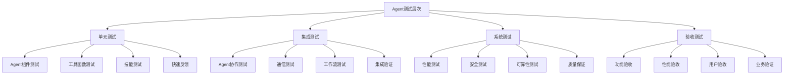
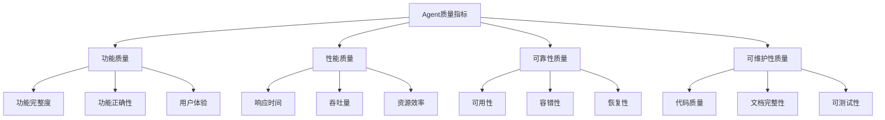

# 第18章：测试和质量保证

> **本章学习目标**
> - 理解Agent测试策略和方法
> - 掌握单元测试实践和框架
> - 学习集成测试模式和工具
> - 理解性能测试和基准测试
> - 掌握质量度量指标体系

---

## 18.1 Agent测试策略

### 18.1.1 测试层次模型



### 18.1.2 测试策略框架

```typescript
// Agent测试策略框架
class AgentTestingStrategy {
  private testSuites = new Map<string, TestSuite>();
  private testCoverage = new Map<string, CoverageData>();
  private qualityMetrics = new Map<string, QualityMetric>();
  
  // 定义测试策略
  defineStrategy(strategy: TestingStrategy): TestingPlan {
    const plan: TestingPlan = {
      name: strategy.name,
      description: strategy.description,
      testLayers: this.buildTestLayers(strategy),
      schedule: this.createTestSchedule(strategy),
      resources: this.allocateResources(strategy),
      acceptanceCriteria: strategy.acceptanceCriteria
    };
    
    return plan;
  }
  
  // 构建测试层次
  private buildTestLayers(strategy: TestingStrategy): TestLayer[] {
    const layers: TestLayer[] = [];
    
    // 单元测试层
    if (strategy.includeUnitTests) {
      layers.push({
        type: 'unit',
        scope: 'component',
        tests: this.generateUnitTests(strategy.targetComponents),
        executionTime: 'fast',
        priority: 'high'
      });
    }
    
    // 集成测试层
    if (strategy.includeIntegrationTests) {
      layers.push({
        type: 'integration',
        scope: 'component-interaction',
        tests: this.generateIntegrationTests(strategy.targetComponents),
        executionTime: 'medium',
        priority: 'medium'
      });
    }
    
    // 系统测试层
    if (strategy.includeSystemTests) {
      layers.push({
        type: 'system',
        scope: 'full-system',
        tests: this.generateSystemTests(strategy.targetComponents),
        executionTime: 'slow',
        priority: 'medium'
      });
    }
    
    // 验收测试层
    if (strategy.includeAcceptanceTests) {
      layers.push({
        type: 'acceptance',
        scope: 'business-requirements',
        tests: this.generateAcceptanceTests(strategy.targetComponents),
        executionTime: 'slow',
        priority: 'high'
      });
    }
    
    return layers;
  }
  
  // 生成单元测试
  private generateUnitTests(components: string[]): UnitTest[] {
    const tests: UnitTest[] = [];
    
    for (const component of components) {
      tests.push({
        id: `unit-${component}-basic`,
        name: `${component} basic functionality`,
        component,
        type: 'unit',
        setup: () => this.setupComponent(component),
        execute: (context) => this.executeUnitTest(component, context),
        verify: (result) => this.verifyUnitResult(component, result),
        teardown: (context) => this.teardownComponent(component, context),
        timeout: 5000
      });
    }
    
    return tests;
  }
  
  // 生成集成测试
  private generateIntegrationTests(components: string[]): IntegrationTest[] {
    const tests: IntegrationTest[] = [];
    
    // Agent协作测试
    tests.push({
      id: 'integration-agent-collaboration',
      name: 'Agent collaboration test',
      type: 'integration',
      scope: 'agent-communication',
      participants: components.filter(c => c.startsWith('agent-')),
      scenarios: this.generateCollaborationScenarios(),
      setup: () => this.setupIntegrationEnvironment(),
      execute: (context) => this.executeIntegrationTest('collaboration', context),
      verify: (result) => this.verifyIntegrationResult('collaboration', result),
      teardown: (context) => this.teardownIntegrationEnvironment(context),
      timeout: 30000
    });
    
    // 工作流测试
    tests.push({
      id: 'integration-workflow-execution',
      name: 'Workflow execution test',
      type: 'integration',
      scope: 'workflow-system',
      participants: ['workflow-engine', 'agent-orchestrator'],
      scenarios: this.generateWorkflowScenarios(),
      setup: () => this.setupWorkflowEnvironment(),
      execute: (context) => this.executeIntegrationTest('workflow', context),
      verify: (result) => this.verifyIntegrationResult('workflow', result),
      teardown: (context) => this.teardownWorkflowEnvironment(context),
      timeout: 60000
    });
    
    return tests;
  }
  
  // 生成系统测试
  private generateSystemTests(components: string[]): SystemTest[] {
    const tests: SystemTest[] = [];
    
    // 性能测试
    tests.push({
      id: 'system-performance',
      name: 'System performance test',
      type: 'system',
      scope: 'performance',
      setup: () => this.setupPerformanceTest(),
      execute: (context) => this.executePerformanceTest(context),
      verify: (result) => this.verifyPerformanceResult(result),
      teardown: (context) => this.teardownPerformanceTest(context),
      timeout: 300000,
      metrics: ['responseTime', 'throughput', 'resourceUsage']
    });
    
    // 负载测试
    tests.push({
      id: 'system-load',
      name: 'System load test',
      type: 'system',
      scope: 'load',
      setup: () => this.setupLoadTest(),
      execute: (context) => this.executeLoadTest(context),
      verify: (result) => this.verifyLoadResult(result),
      teardown: (context) => this.teardownLoadTest(context),
      timeout: 600000,
      loadProfile: {
        users: 100,
        rampUp: 60,
        duration: 300
      }
    });
    
    return tests;
  }
  
  // 生成验收测试
  private generateAcceptanceTests(components: string[]): AcceptanceTest[] {
    const tests: AcceptanceTest[] = [];
    
    // 功能验收测试
    tests.push({
      id: 'acceptance-functional',
      name: 'Functional acceptance test',
      type: 'acceptance',
      scope: 'functional',
      acceptanceCriteria: [
        'All core features work as specified',
        'No critical bugs present',
        'Performance meets requirements'
      ],
      setup: () => this.setupAcceptanceTest(),
      execute: (context) => this.executeAcceptanceTest('functional', context),
      verify: (result) => this.verifyAcceptanceResult('functional', result),
      teardown: (context) => this.teardownAcceptanceTest(context),
      timeout: 120000
    });
    
    return tests;
  }
  
  // 创建测试计划
  createTestPlan(strategy: TestingStrategy): TestPlan {
    const layers = this.buildTestLayers(strategy);
    const schedule = this.createTestSchedule(strategy);
    
    return {
      name: strategy.name,
      description: strategy.description,
      layers,
      schedule,
      totalTests: this.countTotalTests(layers),
      estimatedDuration: this.estimateDuration(layers),
      resources: this.allocateResources(strategy),
      risks: this.identifyRisks(strategy),
      mitigation: this.planMitigation(strategy)
    };
  }
  
  // 执行测试计划
  async executeTestPlan(plan: TestPlan): Promise<TestExecutionResult> {
    const results: TestExecutionResult = {
      planName: plan.name,
      startTime: new Date(),
      status: 'running',
      layerResults: [],
      issues: []
    };
    
    try {
      for (const layer of plan.layers) {
        const layerResult = await this.executeTestLayer(layer);
        results.layerResults.push(layerResult);
        
        if (layerResult.failedTests.length > 0 && layer.type === 'unit') {
          // 单元测试失败，停止执行
          results.status = 'failed';
          results.issues.push(
            `Unit tests failed: ${layerResult.failedTests.length} failures`
          );
          break;
        }
      }
      
      results.status = results.issues.length === 0 ? 'passed' : 'failed';
      
    } catch (error) {
      results.status = 'error';
      results.issues.push(`Test execution error: ${error.message}`);
    }
    
    results.endTime = new Date();
    results.duration = results.endTime.getTime() - results.startTime.getTime();
    
    return results;
  }
  
  // 执行测试层次
  private async executeTestLayer(layer: TestLayer): Promise<TestLayerResult> {
    const result: TestLayerResult = {
      layerType: layer.type,
      totalTests: layer.tests.length,
      passedTests: [],
      failedTests: [],
      skippedTests: [],
      duration: 0
    };
    
    const startTime = Date.now();
    
    for (const test of layer.tests) {
      try {
        const testResult = await this.executeTest(test);
        
        if (testResult.passed) {
          result.passedTests.push(testResult);
        } else {
          result.failedTests.push(testResult);
        }
        
      } catch (error) {
        result.failedTests.push({
          testId: test.id,
          passed: false,
          error: error as Error,
          duration: 0
        });
      }
    }
    
    result.duration = Date.now() - startTime;
    
    return result;
  }
  
  // 执行单个测试
  private async executeTest(test: Test): Promise<TestResult> {
    const startTime = Date.now();
    let context: any;
    
    try {
      // 设置
      if (test.setup) {
        context = await test.setup();
      }
      
      // 执行
      const result = await test.execute(context);
      
      // 验证
      const passed = test.verify ? await test.verify(result) : true;
      
      return {
        testId: test.id,
        passed,
        result,
        duration: Date.now() - startTime
      };
      
    } finally {
      // 清理
      if (test.teardown && context) {
        await test.teardown(context);
      }
    }
  }
  
  // 分析测试覆盖率
  analyzeCoverage(agentId: string): CoverageReport {
    const coverage = this.testCoverage.get(agentId);
    
    if (!coverage) {
      return {
        agentId,
        lineCoverage: 0,
        branchCoverage: 0,
        functionCoverage: 0,
        statementCoverage: 0,
        uncoveredAreas: [],
        recommendations: ['No coverage data available']
      };
    }
    
    const recommendations = this.generateCoverageRecommendations(coverage);
    
    return {
      agentId,
      lineCoverage: coverage.lineCoverage,
      branchCoverage: coverage.branchCoverage,
      functionCoverage: coverage.functionCoverage,
      statementCoverage: coverage.statementCoverage,
      uncoveredAreas: coverage.uncoveredAreas,
      recommendations
    };
  }
  
  // 生成覆盖率建议
  private generateCoverageRecommendations(coverage: CoverageData): string[] {
    const recommendations: string[] = [];
    
    if (coverage.lineCoverage < 80) {
      recommendations.push('Line coverage is below 80%, consider adding more unit tests');
    }
    
    if (coverage.branchCoverage < 70) {
      recommendations.push('Branch coverage is below 70%, improve condition testing');
    }
    
    if (coverage.functionCoverage < 90) {
      recommendations.push('Function coverage is below 90%, ensure all functions are tested');
    }
    
    if (coverage.uncoveredAreas.length > 0) {
      recommendations.push(
        `Focus on covering: ${coverage.uncoveredAreas.join(', ')}`
      );
    }
    
    return recommendations;
  }
  
  // 辅助方法
  private setupComponent(component: string): any {
    return { component };
  }
  
  private executeUnitTest(component: string, context: any): Promise<any> {
    return Promise.resolve({ success: true });
  }
  
  private verifyUnitResult(component: string, result: any): boolean {
    return result.success === true;
  }
  
  private teardownComponent(component: string, context: any): Promise<void> {
    return Promise.resolve();
  }
  
  private generateCollaborationScenarios(): Scenario[] {
    return [];
  }
  
  private generateWorkflowScenarios(): Scenario[] {
    return [];
  }
  
  private setupIntegrationEnvironment(): any {
    return {};
  }
  
  private executeIntegrationTest(type: string, context: any): Promise<any> {
    return Promise.resolve({ success: true });
  }
  
  private verifyIntegrationResult(type: string, result: any): boolean {
    return result.success === true;
  }
  
  private teardownIntegrationEnvironment(context: any): Promise<void> {
    return Promise.resolve();
  }
  
  private setupWorkflowEnvironment(): any {
    return {};
  }
  
  private teardownWorkflowEnvironment(context: any): Promise<void> {
    return Promise.resolve();
  }
  
  private setupPerformanceTest(): any {
    return {};
  }
  
  private executePerformanceTest(context: any): Promise<any> {
    return Promise.resolve({ success: true });
  }
  
  private verifyPerformanceResult(result: any): boolean {
    return result.success === true;
  }
  
  private teardownPerformanceTest(context: any): Promise<void> {
    return Promise.resolve();
  }
  
  private setupLoadTest(): any {
    return {};
  }
  
  private executeLoadTest(context: any): Promise<any> {
    return Promise.resolve({ success: true });
  }
  
  private verifyLoadResult(result: any): boolean {
    return result.success === true;
  }
  
  private teardownLoadTest(context: any): Promise<void> {
    return Promise.resolve();
  }
  
  private setupAcceptanceTest(): any {
    return {};
  }
  
  private executeAcceptanceTest(type: string, context: any): Promise<any> {
    return Promise.resolve({ success: true });
  }
  
  private verifyAcceptanceResult(type: string, result: any): boolean {
    return result.success === true;
  }
  
  private teardownAcceptanceTest(context: any): Promise<void> {
    return Promise.resolve();
  }
  
  private createTestSchedule(strategy: TestingStrategy): TestSchedule {
    return {
      frequency: strategy.frequency || 'on-commit',
      triggers: strategy.triggers || [],
      timeSlots: strategy.timeSlots || []
    };
  }
  
  private allocateResources(strategy: TestingStrategy): ResourceAllocation {
    return {
      compute: 'high',
      memory: 'medium',
      storage: 'low',
      network: 'medium'
    };
  }
  
  private countTotalTests(layers: TestLayer[]): number {
    return layers.reduce((sum, layer) => sum + layer.tests.length, 0);
  }
  
  private estimateDuration(layers: TestLayer[]): number {
    return layers.reduce((sum, layer) => {
      const timePerTest = layer.executionTime === 'fast' ? 1 : 
                          layer.executionTime === 'medium' ? 10 : 60;
      return sum + layer.tests.length * timePerTest;
    }, 0);
  }
  
  private identifyRisks(strategy: TestingStrategy): Risk[] {
    return [];
  }
  
  private planMitigation(strategy: TestingStrategy): MitigationPlan {
    return {};
  }
}

// 相关接口定义
interface TestingStrategy {
  name: string;
  description: string;
  targetComponents: string[];
  includeUnitTests: boolean;
  includeIntegrationTests: boolean;
  includeSystemTests: boolean;
  includeAcceptanceTests: boolean;
  frequency?: string;
  triggers?: string[];
  timeSlots?: TimeSlot[];
  acceptanceCriteria: string[];
}

interface TestingPlan {
  name: string;
  description: string;
  testLayers: TestLayer[];
  schedule: TestSchedule;
  resources: ResourceAllocation;
  acceptanceCriteria: string[];
}

interface TestPlan extends TestingPlan {
  totalTests: number;
  estimatedDuration: number;
  risks: Risk[];
  mitigation: MitigationPlan;
}

interface TestLayer {
  type: 'unit' | 'integration' | 'system' | 'acceptance';
  scope: string;
  tests: Test[];
  executionTime: 'fast' | 'medium' | 'slow';
  priority: 'low' | 'medium' | 'high';
}

interface Test {
  id: string;
  name: string;
  type: string;
  setup?: () => Promise<any>;
  execute: (context: any) => Promise<any>;
  verify?: (result: any) => boolean | Promise<boolean>;
  teardown?: (context: any) => Promise<void>;
  timeout: number;
}

interface UnitTest extends Test {
  component: string;
  type: 'unit';
}

interface IntegrationTest extends Test {
  type: 'integration';
  scope: string;
  participants: string[];
  scenarios: Scenario[];
}

interface SystemTest extends Test {
  type: 'system';
  scope: string;
  metrics?: string[];
  loadProfile?: LoadProfile;
}

interface AcceptanceTest extends Test {
  type: 'acceptance';
  scope: string;
  acceptanceCriteria: string[];
}

interface Scenario {
  name: string;
  description: string;
  steps: TestStep[];
}

interface TestStep {
  action: string;
  expected: string;
}

interface LoadProfile {
  users: number;
  rampUp: number;
  duration: number;
}

interface TestExecutionResult {
  planName: string;
  startTime: Date;
  endTime?: Date;
  duration?: number;
  status: 'running' | 'passed' | 'failed' | 'error';
  layerResults: TestLayerResult[];
  issues: string[];
}

interface TestLayerResult {
  layerType: string;
  totalTests: number;
  passedTests: TestResult[];
  failedTests: TestResult[];
  skippedTests: TestResult[];
  duration: number;
}

interface TestResult {
  testId: string;
  passed: boolean;
  result?: any;
  error?: Error;
  duration: number;
}

interface CoverageData {
  lineCoverage: number;
  branchCoverage: number;
  functionCoverage: number;
  statementCoverage: number;
  uncoveredAreas: string[];
}

interface CoverageReport {
  agentId: string;
  lineCoverage: number;
  branchCoverage: number;
  functionCoverage: number;
  statementCoverage: number;
  uncoveredAreas: string[];
  recommendations: string[];
}

interface TestSchedule {
  frequency: string;
  triggers: string[];
  timeSlots: TimeSlot[];
}

interface TimeSlot {
  start: string;
  end: string;
  days: string[];
}

interface ResourceAllocation {
  compute: string;
  memory: string;
  storage: string;
  network: string;
}

interface Risk {
  type: string;
  description: string;
  likelihood: 'low' | 'medium' | 'high';
  impact: 'low' | 'medium' | 'high';
}

interface MitigationPlan {
  [key: string]: any;
}
```

---

## 18.2 单元测试实践

### 18.2.1 单元测试框架

```typescript
// Agent单元测试框架
class AgentUnitTestFramework {
  private testRegistry = new Map<string, UnitTest[]>();
  private testMocks = new Map<string, MockObject>();
  private testStubs = new Map<string, StubFunction>();
  private assertions = new AssertionLibrary();
  
  // 注册单元测试
  registerTest(agentId: string, test: UnitTest): void {
    let tests = this.testRegistry.get(agentId);
    if (!tests) {
      tests = [];
      this.testRegistry.set(agentId, tests);
    }
    tests.push(test);
  }
  
  // 执行单元测试
  async executeTests(agentId: string): Promise<UnitTestResults> {
    const tests = this.testRegistry.get(agentId) || [];
    const results: UnitTestResults = {
      agentId,
      totalTests: tests.length,
      passed: 0,
      failed: 0,
      skipped: 0,
      results: [],
      duration: 0
    };
    
    const startTime = Date.now();
    
    for (const test of tests) {
      const testResult = await this.executeSingleTest(test);
      results.results.push(testResult);
      
      if (testResult.status === 'passed') {
        results.passed++;
      } else if (testResult.status === 'failed') {
        results.failed++;
      } else {
        results.skipped++;
      }
    }
    
    results.duration = Date.now() - startTime;
    
    return results;
  }
  
  // 执行单个测试
  private async executeSingleTest(test: UnitTest): Promise<SingleTestResult> {
    const startTime = Date.now();
    
    try {
      // 设置测试环境
      const context = await this.setupTest(test);
      
      // 执行测试
      const result = await this.runTest(test, context);
      
      // 验证结果
      const passed = await this.verifyTest(test, result);
      
      return {
        testName: test.name,
        status: passed ? 'passed' : 'failed',
        duration: Date.now() - startTime,
        result,
        assertions: test.assertions || []
      };
      
    } catch (error) {
      return {
        testName: test.name,
        status: 'failed',
        duration: Date.now() - startTime,
        error: error as Error,
        errorMessage: (error as Error).message
      };
    } finally {
      // 清理测试环境
      await this.teardownTest(test);
    }
  }
  
  // 设置测试
  private async setupTest(test: UnitTest): Promise<any> {
    const context: any = {};
    
    // 设置模拟对象
    if (test.mocks) {
      for (const mock of test.mocks) {
        this.setupMock(mock);
      }
    }
    
    // 设置存根函数
    if (test.stubs) {
      for (const stub of test.stubs) {
        this.setupStub(stub);
      }
    }
    
    // 执行测试特定的设置
    if (test.setup) {
      await test.setup(context);
    }
    
    return context;
  }
  
  // 运行测试
  private async runTest(test: UnitTest, context: any): Promise<any> {
    return test.execute(context);
  }
  
  // 验证测试
  private async verifyTest(test: UnitTest, result: any): Promise<boolean> {
    if (test.assertions && test.assertions.length > 0) {
      for (const assertion of test.assertions) {
        const passed = this.assertions.evaluate(assertion, result);
        if (!passed) {
          return false;
        }
      }
    }
    
    return true;
  }
  
  // 清理测试
  private async teardownTest(test: UnitTest): Promise<void> {
    // 清理模拟对象
    if (test.mocks) {
      for (const mock of test.mocks) {
        this.teardownMock(mock);
      }
    }
    
    // 清理存根函数
    if (test.stubs) {
      for (const stub of test.stubs) {
        this.teardownStub(stub);
      }
    }
    
    // 执行测试特定的清理
    if (test.teardown) {
      await test.teardown();
    }
  }
  
  // 设置模拟对象
  private setupMock(mock: MockDefinition): void {
    const mockObject = this.createMock(mock);
    this.testMocks.set(mock.name, mockObject);
  }
  
  // 创建模拟对象
  private createMock(mock: MockDefinition): MockObject {
    const mockObj: any = {};
    
    for (const method of mock.methods || []) {
      mockObj[method] = jest.fn();
    }
    
    return {
      name: mock.name,
      object: mockObj,
      calls: [],
      expectations: mock.expectations || []
    };
  }
  
  // 设置存根函数
  private setupStub(stub: StubDefinition): void {
    const stubFunction = this.createStub(stub);
    this.testStubs.set(stub.name, stubFunction);
  }
  
  // 创建存根函数
  private createStub(stub: StubDefinition): StubFunction {
    return {
      name: stub.name,
      implementation: stub.implementation || (() => stub.returnValue),
      calls: [],
      original: stub.original
    };
  }
  
  // 清理模拟对象
  private teardownMock(mock: MockDefinition): void {
    this.testMocks.delete(mock.name);
  }
  
  // 清理存根函数
  private teardownStub(stub: StubDefinition): void {
    this.testStubs.delete(stub.name);
  }
  
  // 获取测试覆盖率
  getCoverage(agentId: string): TestCoverage {
    const tests = this.testRegistry.get(agentId) || [];
    
    // 简化的覆盖率计算
    const coverage: TestCoverage = {
      agentId,
      lineCoverage: this.calculateLineCoverage(tests),
      branchCoverage: this.calculateBranchCoverage(tests),
      functionCoverage: this.calculateFunctionCoverage(tests),
      statementCoverage: this.calculateStatementCoverage(tests),
      uncoveredLines: [],
      partiallyCoveredLines: [],
      fullyCoveredLines: []
    };
    
    return coverage;
  }
  
  // 计算行覆盖率
  private calculateLineCoverage(tests: UnitTest[]): number {
    // 简化实现
    return Math.min(100, tests.length * 10);
  }
  
  // 计算分支覆盖率
  private calculateBranchCoverage(tests: UnitTest[]): number {
    // 简化实现
    return Math.min(100, tests.length * 8);
  }
  
  // 计算函数覆盖率
  private calculateFunctionCoverage(tests: UnitTest[]): number {
    // 简化实现
    return Math.min(100, tests.length * 15);
  }
  
  // 计算语句覆盖率
  private calculateStatementCoverage(tests: UnitTest[]): number {
    // 简化实现
    return Math.min(100, tests.length * 12);
  }
}

// 断言库
class AssertionLibrary {
  // 评估断言
  evaluate(assertion: Assertion, value: any): boolean {
    switch (assertion.type) {
      case 'equal':
        return this.assertEqual(value, assertion.expected);
      
      case 'deepEqual':
        return this.assertDeepEqual(value, assertion.expected);
      
      case 'truthy':
        return this.assertTruthy(value);
      
      case 'falsy':
        return this.assertFalsy(value);
      
      case 'contains':
        return this.assertContains(value, assertion.expected);
      
      case 'match':
        return this.assertMatch(value, assertion.expected);
      
      case 'throws':
        return this.assertThrows(value, assertion.expected);
      
      default:
        throw new Error(`Unknown assertion type: ${assertion.type}`);
    }
  }
  
  // 相等断言
  private assertEqual(actual: any, expected: any): boolean {
    return actual === expected;
  }
  
  // 深度相等断言
  private assertDeepEqual(actual: any, expected: any): boolean {
    return JSON.stringify(actual) === JSON.stringify(expected);
  }
  
  // 真值断言
  private assertTruthy(value: any): boolean {
    return !!value;
  }
  
  // 假值断言
  private assertFalsy(value: any): boolean {
    return !value;
  }
  
  // 包含断言
  private assertContains(actual: any, expected: any): boolean {
    if (Array.isArray(actual)) {
      return actual.includes(expected);
    }
    if (typeof actual === 'string') {
      return actual.includes(expected);
    }
    if (typeof actual === 'object') {
      return expected in actual;
    }
    return false;
  }
  
  // 匹配断言
  private assertMatch(actual: any, expected: RegExp): boolean {
    return expected.test(String(actual));
  }
  
  // 异常断言
  private assertThrows(actual: any, expected: Error): boolean {
    try {
      if (typeof actual === 'function') {
        actual();
      }
      return false;
    } catch (error) {
      return error instanceof expected.constructor;
    }
  }
}

// 相关接口定义
interface UnitTest {
  name: string;
  description?: string;
  setup?: (context: any) => Promise<void>;
  execute: (context: any) => Promise<any>;
  teardown?: () => Promise<void>;
  assertions?: Assertion[];
  mocks?: MockDefinition[];
  stubs?: StubDefinition[];
  timeout?: number;
  skip?: boolean;
}

interface Assertion {
  type: 'equal' | 'deepEqual' | 'truthy' | 'falsy' | 'contains' | 'match' | 'throws';
  expected: any;
  message?: string;
}

interface MockDefinition {
  name: string;
  methods: string[];
  expectations?: MockExpectation[];
}

interface MockExpectation {
  method: string;
  args: any[];
  returnValue: any;
  times?: number;
}

interface StubDefinition {
  name: string;
  original?: Function;
  returnValue?: any;
  implementation?: Function;
}

interface MockObject {
  name: string;
  object: any;
  calls: any[];
  expectations: MockExpectation[];
}

interface StubFunction {
  name: string;
  implementation: Function;
  calls: any[];
  original?: Function;
}

interface UnitTestResults {
  agentId: string;
  totalTests: number;
  passed: number;
  failed: number;
  skipped: number;
  results: SingleTestResult[];
  duration: number;
}

interface SingleTestResult {
  testName: string;
  status: 'passed' | 'failed' | 'skipped';
  duration: number;
  result?: any;
  error?: Error;
  errorMessage?: string;
  assertions?: Assertion[];
}

interface TestCoverage {
  agentId: string;
  lineCoverage: number;
  branchCoverage: number;
  functionCoverage: number;
  statementCoverage: number;
  uncoveredLines: number[];
  partiallyCoveredLines: number[];
  fullyCoveredLines: number[];
}
```

### 18.2.2 单元测试最佳实践

```typescript
// 单元测试示例和最佳实践
class AgentUnitTestExamples {
  // 测试Agent工厂
  static testAgentFactory(): UnitTest[] {
    return [
      {
        name: 'should create agent with valid config',
        execute: async (context) => {
          const factory = new AgentFactory();
          const config = {
            id: 'test-agent',
            name: 'Test Agent',
            systemPrompt: 'You are a test agent'
          };
          
          const agent = factory.createAgent(config);
          
          return {
            assertions: [
              { type: 'equal', expected: 'test-agent', actual: agent.id },
              { type: 'equal', expected: 'Test Agent', actual: agent.name },
              { type: 'truthy', actual: agent.systemPrompt }
            ]
          };
        }
      },
      
      {
        name: 'should handle invalid config gracefully',
        execute: async (context) => {
          const factory = new AgentFactory();
          
          try {
            factory.createAgent({ id: '' });
            return { passed: false };
          } catch (error) {
            return {
              assertions: [
                { type: 'truthy', actual: error },
                { type: 'contains', expected: 'Invalid', actual: error.message }
              ]
            };
          }
        }
      },
      
      {
        name: 'should inherit parent configuration',
        execute: async (context) => {
          const factory = new AgentFactory();
          const parentConfig = {
            id: 'parent-agent',
            name: 'Parent Agent',
            systemPrompt: 'Parent prompt',
            settings: { temperature: 0.7 }
          };
          
          const childConfig = {
            id: 'child-agent',
            name: 'Child Agent',
            parent: 'parent-agent'
          };
          
          factory.createAgent(parentConfig);
          const childAgent = factory.createAgent(childConfig);
          
          return {
            assertions: [
              { type: 'equal', expected: 0.7, actual: childAgent.settings.temperature },
              { type: 'equal', expected: 'Parent prompt', actual: childAgent.systemPrompt }
            ]
          };
        }
      }
    ];
  }
  
  // 测试工具系统
  static testToolSystem(): UnitTest[] {
    return [
      {
        name: 'should execute tool successfully',
        execute: async (context) => {
          const toolRegistry = new ToolRegistry();
          const testTool = {
            name: 'test-tool',
            description: 'A test tool',
            parameters: { input: 'string' },
            execute: async (params) => ({ result: `processed: ${params.input}` })
          };
          
          toolRegistry.registerTool(testTool);
          const result = await toolRegistry.executeTool('test-tool', { input: 'test' });
          
          return {
            assertions: [
              { type: 'equal', expected: 'processed: test', actual: result.result }
            ]
          };
        }
      },
      
      {
        name: 'should handle tool errors gracefully',
        execute: async (context) => {
          const toolRegistry = new ToolRegistry();
          const errorTool = {
            name: 'error-tool',
            description: 'An error-prone tool',
            parameters: {},
            execute: async () => { throw new Error('Tool execution failed'); }
          };
          
          toolRegistry.registerTool(errorTool);
          
          try {
            await toolRegistry.executeTool('error-tool', {});
            return { passed: false };
          } catch (error) {
            return {
              assertions: [
                { type: 'truthy', actual: error },
                { type: 'contains', expected: 'Tool execution failed', actual: error.message }
              ]
            };
          }
        }
      }
    ];
  }
  
  // 测试技能系统
  static testSkillSystem(): UnitTest[] {
    return [
      {
        name: 'should execute skill with valid parameters',
        execute: async (context) => {
          const skillRegistry = new SkillRegistry();
          const testSkill = {
            id: 'test-skill',
            name: 'Test Skill',
            parameters: [
              { name: 'input', type: 'string', required: true }
            ],
            handler: async (params) => ({ output: `skill processed: ${params.input}` })
          };
          
          skillRegistry.register(testSkill);
          const result = await skillRegistry.execute('test-skill', { input: 'test' });
          
          return {
            assertions: [
              { type: 'truthy', actual: result.success },
              { type: 'equal', expected: 'skill processed: test', actual: result.data.output }
            ]
          };
        }
      },
      
      {
        name: 'should validate skill parameters',
        execute: async (context) => {
          const skillRegistry = new SkillRegistry();
          const testSkill = {
            id: 'validation-skill',
            name: 'Validation Skill',
            parameters: [
              { name: 'input', type: 'string', required: true },
              { name: 'count', type: 'number', required: true }
            ],
            handler: async (params) => ({ result: 'ok' })
          };
          
          skillRegistry.register(testSkill);
          
          try {
            await skillRegistry.execute('validation-skill', { input: 'test' });
            return { passed: false };
          } catch (error) {
            return {
              assertions: [
                { type: 'contains', expected: 'required', actual: error.message }
              ]
            };
          }
        }
      }
    ];
  }
  
  // 测试异步Agent系统
  static testAsyncAgentSystem(): UnitTest[] {
    return [
      {
        name: 'should execute agent asynchronously',
        setup: async (context) => {
          context.asyncAgent = new AsyncAgentExecutor();
          context.executedTasks = [];
        },
        execute: async (context) => {
          const task = {
            id: 'task-1',
            handler: async () => {
              await new Promise(resolve => setTimeout(resolve, 100));
              context.executedTasks.push('task-1');
              return 'result-1';
            }
          };
          
          await context.asyncAgent.execute(task);
          
          return {
            assertions: [
              { type: 'equal', expected: 1, actual: context.executedTasks.length },
              { type: 'equal', expected: 'task-1', actual: context.executedTasks[0] }
            ]
          };
        },
        teardown: async (context) => {
          await context.asyncAgent?.cleanup();
        }
      },
      
      {
        name: 'should handle task timeout',
        execute: async (context) => {
          const executor = new AsyncAgentExecutor({ timeout: 100 });
          const slowTask = {
            id: 'slow-task',
            handler: async () => {
              await new Promise(resolve => setTimeout(resolve, 500));
              return 'late-result';
            }
          };
          
          try {
            await executor.execute(slowTask);
            return { passed: false };
          } catch (error) {
            return {
              assertions: [
                { type: 'contains', expected: 'timeout', actual: error.message.toLowerCase() }
              ]
            };
          }
        }
      }
    ];
  }
}
```

---

## 18.3 集成测试模式

### 18.3.1 集成测试框架

```typescript
// Agent集成测试框架
class AgentIntegrationTestFramework {
  private testSuites = new Map<string, IntegrationTestSuite>();
  private testEnvironments = new Map<string, TestEnvironment>();
  private mockServers = new Map<string, MockServer>();
  
  // 创建集成测试套件
  createTestSuite(config: IntegrationTestSuiteConfig): IntegrationTestSuite {
    const suite: IntegrationTestSuite = {
      id: `suite-${Date.now()}`,
      name: config.name,
      description: config.description,
      tests: [],
      setup: config.setup,
      teardown: config.teardown,
      timeout: config.timeout || 60000
    };
    
    this.testSuites.set(suite.id, suite);
    
    return suite;
  }
  
  // 添加集成测试
  addTest(suiteId: string, test: IntegrationTest): void {
    const suite = this.testSuites.get(suiteId);
    if (!suite) {
      throw new Error(`Test suite not found: ${suiteId}`);
    }
    
    suite.tests.push(test);
  }
  
  // 执行测试套件
  async executeSuite(suiteId: string): Promise<IntegrationTestResults> {
    const suite = this.testSuites.get(suiteId);
    if (!suite) {
      throw new Error(`Test suite not found: ${suiteId}`);
    }
    
    const results: IntegrationTestResults = {
      suiteId,
      suiteName: suite.name,
      totalTests: suite.tests.length,
      passed: 0,
      failed: 0,
      skipped: 0,
      testResults: [],
      startTime: new Date(),
      duration: 0
    };
    
    // 设置测试环境
    const environment = await this.setupEnvironment(suite);
    
    try {
      // 执行测试
      for (const test of suite.tests) {
        const testResult = await this.executeTest(test, environment);
        results.testResults.push(testResult);
        
        if (testResult.status === 'passed') {
          results.passed++;
        } else if (testResult.status === 'failed') {
          results.failed++;
          
          // 根据配置决定是否继续
          if (test.stopOnFailure) {
            break;
          }
        } else {
          results.skipped++;
        }
      }
      
      results.endTime = new Date();
      results.duration = results.endTime.getTime() - results.startTime.getTime();
      
      return results;
      
    } finally {
      // 清理测试环境
      await this.teardownEnvironment(suite, environment);
    }
  }
  
  // 设置测试环境
  private async setupEnvironment(suite: IntegrationTestSuite): Promise<TestEnvironment> {
    const environment: TestEnvironment = {
      id: `env-${suite.id}`,
      agents: new Map(),
      tools: new Map(),
      skills: new Map(),
      mockServers: new Map(),
      state: new Map()
    };
    
    // 执行套件级别的设置
    if (suite.setup) {
      await suite.setup(environment);
    }
    
    this.testEnvironments.set(environment.id, environment);
    
    return environment;
  }
  
  // 执行单个测试
  private async executeTest(
    test: IntegrationTest,
    environment: TestEnvironment
  ): Promise<IntegrationTestResult> {
    const startTime = Date.now();
    
    try {
      // 测试设置
      if (test.setup) {
        await test.setup(environment);
      }
      
      // 执行测试场景
      const scenarioResults = [];
      for (const scenario of test.scenarios) {
        const result = await this.executeScenario(scenario, environment);
        scenarioResults.push(result);
        
        if (!result.passed && test.stopOnScenarioFailure) {
          break;
        }
      }
      
      const allPassed = scenarioResults.every(r => r.passed);
      
      return {
        testName: test.name,
        status: allPassed ? 'passed' : 'failed',
        duration: Date.now() - startTime,
        scenarioResults,
        assertions: test.assertions || []
      };
      
    } catch (error) {
      return {
        testName: test.name,
        status: 'failed',
        duration: Date.now() - startTime,
        error: error as Error,
        errorMessage: (error as Error).message
      };
    } finally {
      // 测试清理
      if (test.teardown) {
        await test.teardown(environment);
      }
    }
  }
  
  // 执行测试场景
  private async executeScenario(
    scenario: TestScenario,
    environment: TestEnvironment
  ): Promise<ScenarioResult> {
    const startTime = Date.now();
    const steps = [];
    
    try {
      // 执行场景步骤
      for (const step of scenario.steps) {
        const stepResult = await this.executeStep(step, environment);
        steps.push(stepResult);
        
        if (!stepResult.passed && step.stopOnFailure) {
          break;
        }
      }
      
      const allPassed = steps.every(s => s.passed);
      
      return {
        scenarioName: scenario.name,
        passed: allPassed,
        duration: Date.now() - startTime,
        steps
      };
      
    } catch (error) {
      return {
        scenarioName: scenario.name,
        passed: false,
        duration: Date.now() - startTime,
        error: error as Error
      };
    }
  }
  
  // 执行测试步骤
  private async executeStep(
    step: TestStep,
    environment: TestEnvironment
  ): Promise<StepResult> {
    const startTime = Date.now();
    
    try {
      // 执行步骤动作
      const result = await this.executeAction(step.action, environment);
      
      // 验证步骤结果
      const passed = await this.verifyStep(step, result, environment);
      
      return {
        stepName: step.name,
        passed,
        duration: Date.now() - startTime,
        result,
        expected: step.expected,
        actual: result
      };
      
    } catch (error) {
      return {
        stepName: step.name,
        passed: false,
        duration: Date.now() - startTime,
        error: error as Error
      };
    }
  }
  
  // 执行动作
  private async executeAction(action: TestAction, environment: TestEnvironment): Promise<any> {
    switch (action.type) {
      case 'create-agent':
        return this.createAgentAction(action, environment);
      
      case 'send-message':
        return this.sendMessageAction(action, environment);
      
      case 'execute-tool':
        return this.executeToolAction(action, environment);
      
      case 'execute-skill':
        return this.executeSkillAction(action, environment);
      
      case 'wait':
        return this.waitAction(action, environment);
      
      case 'assert':
        return this.assertAction(action, environment);
      
      default:
        throw new Error(`Unknown action type: ${action.type}`);
    }
  }
  
  // 创建Agent动作
  private async createAgentAction(action: TestAction, environment: TestEnvironment): Promise<any> {
    const agentConfig = action.params.config;
    const factory = new AgentFactory();
    const agent = factory.createAgent(agentConfig);
    
    environment.agents.set(agentConfig.id, agent);
    
    return { agentId: agentConfig.id, status: 'created' };
  }
  
  // 发送消息动作
  private async sendMessageAction(action: TestAction, environment: TestEnvironment): Promise<any> {
    const { from, to, message } = action.params;
    const fromAgent = environment.agents.get(from);
    const toAgent = environment.agents.get(to);
    
    if (!fromAgent || !toAgent) {
      throw new Error(`Agent not found: from=${from}, to=${to}`);
    }
    
    const result = await fromAgent.sendMessage(to, message);
    
    return { from, to, message, result };
  }
  
  // 执行工具动作
  private async executeToolAction(action: TestAction, environment: TestEnvironment): Promise<any> {
    const { agentId, toolName, params } = action.params;
    const agent = environment.agents.get(agentId);
    
    if (!agent) {
      throw new Error(`Agent not found: ${agentId}`);
    }
    
    const result = await agent.executeTool(toolName, params);
    
    return { agentId, toolName, params, result };
  }
  
  // 执行技能动作
  private async executeSkillAction(action: TestAction, environment: TestEnvironment): Promise<any> {
    const { agentId, skillName, params } = action.params;
    const agent = environment.agents.get(agentId);
    
    if (!agent) {
      throw new Error(`Agent not found: ${agentId}`);
    }
    
    const result = await agent.executeSkill(skillName, params);
    
    return { agentId, skillName, params, result };
  }
  
  // 等待动作
  private async waitAction(action: TestAction, environment: TestEnvironment): Promise<any> {
    const duration = action.params.duration || 1000;
    await new Promise(resolve => setTimeout(resolve, duration));
    
    return { waited: duration };
  }
  
  // 断言动作
  private async assertAction(action: TestAction, environment: TestEnvironment): Promise<any> {
    const { condition, expected } = action.params;
    const actual = this.evaluateCondition(condition, environment);
    
    return { condition, expected, actual, passed: actual === expected };
  }
  
  // 验证步骤
  private async verifyStep(step: TestStep, result: any, environment: TestEnvironment): Promise<boolean> {
    if (!step.validation) {
      return true;
    }
    
    return step.validation(result, environment);
  }
  
  // 评估条件
  private evaluateCondition(condition: string, environment: TestEnvironment): any {
    // 简化的条件评估
    return true;
  }
  
  // 清理测试环境
  private async teardownEnvironment(
    suite: IntegrationTestSuite,
    environment: TestEnvironment
  ): Promise<void> {
    // 执行套件级别的清理
    if (suite.teardown) {
      await suite.teardown(environment);
    }
    
    // 清理环境
    this.testEnvironments.delete(environment.id);
  }
  
  // 创建模拟服务器
  createMockServer(config: MockServerConfig): MockServer {
    const server = new MockServer(config);
    this.mockServers.set(config.id, server);
    return server;
  }
  
  // 启动模拟服务器
  async startMockServer(serverId: string): Promise<void> {
    const server = this.mockServers.get(serverId);
    if (server) {
      await server.start();
    }
  }
  
  // 停止模拟服务器
  async stopMockServer(serverId: string): Promise<void> {
    const server = this.mockServers.get(serverId);
    if (server) {
      await server.stop();
    }
  }
}

// 相关接口定义
interface IntegrationTestSuite {
  id: string;
  name: string;
  description: string;
  tests: IntegrationTest[];
  setup?: (environment: TestEnvironment) => Promise<void>;
  teardown?: (environment: TestEnvironment) => Promise<void>;
  timeout: number;
}

interface IntegrationTestSuiteConfig {
  name: string;
  description: string;
  setup?: (environment: TestEnvironment) => Promise<void>;
  teardown?: (environment: TestEnvironment) => Promise<void>;
  timeout?: number;
}

interface IntegrationTest {
  name: string;
  description?: string;
  scenarios: TestScenario[];
  setup?: (environment: TestEnvironment) => Promise<void>;
  teardown?: (environment: TestEnvironment) => Promise<void>;
  assertions?: Assertion[];
  stopOnFailure?: boolean;
  stopOnScenarioFailure?: boolean;
}

interface TestScenario {
  name: string;
  description?: string;
  steps: TestStep[];
  timeout?: number;
}

interface TestStep {
  name: string;
  action: TestAction;
  expected?: any;
  validation?: (result: any, environment: TestEnvironment) => boolean | Promise<boolean>;
  stopOnFailure?: boolean;
}

interface TestAction {
  type: 'create-agent' | 'send-message' | 'execute-tool' | 'execute-skill' | 'wait' | 'assert';
  params: any;
}

interface TestEnvironment {
  id: string;
  agents: Map<string, any>;
  tools: Map<string, any>;
  skills: Map<string, any>;
  mockServers: Map<string, MockServer>;
  state: Map<string, any>;
}

interface IntegrationTestResults {
  suiteId: string;
  suiteName: string;
  totalTests: number;
  passed: number;
  failed: number;
  skipped: number;
  testResults: IntegrationTestResult[];
  startTime: Date;
  endTime?: Date;
  duration: number;
}

interface IntegrationTestResult {
  testName: string;
  status: 'passed' | 'failed' | 'skipped';
  duration: number;
  scenarioResults: ScenarioResult[];
  assertions?: Assertion[];
  error?: Error;
  errorMessage?: string;
}

interface ScenarioResult {
  scenarioName: string;
  passed: boolean;
  duration: number;
  steps: StepResult[];
  error?: Error;
}

interface StepResult {
  stepName: string;
  passed: boolean;
  duration: number;
  result?: any;
  expected?: any;
  actual?: any;
  error?: Error;
}

interface MockServer {
  id: string;
  start(): Promise<void>;
  stop(): Promise<void>;
}

interface MockServerConfig {
  id: string;
  port: number;
  routes: MockRoute[];
}

interface MockRoute {
  path: string;
  method: string;
  response: any;
  delay?: number;
}
```

---

## 18.4 性能测试和基准测试

### 18.4.1 性能测试框架

```typescript
// Agent性能测试框架
class AgentPerformanceTestFramework {
  private benchmarks = new Map<string, PerformanceBenchmark>();
  private baselines = new Map<string, PerformanceBaseline>();
  private results = new Map<string, PerformanceTestResult[]>();
  
  // 创建性能基准测试
  createBenchmark(config: PerformanceBenchmarkConfig): PerformanceBenchmark {
    const benchmark: PerformanceBenchmark = {
      id: `benchmark-${Date.now()}`,
      name: config.name,
      description: config.description,
      target: config.target,
      metrics: config.metrics || ['responseTime', 'throughput', 'resourceUsage'],
      workload: config.workload || this.defaultWorkload(),
      threshold: config.threshold || this.defaultThreshold(),
      duration: config.duration || 60000,
      warmup: config.warmup || 5000
    };
    
    this.benchmarks.set(benchmark.id, benchmark);
    
    return benchmark;
  }
  
  // 执行性能基准测试
  async executeBenchmark(benchmarkId: string): Promise<PerformanceTestResult> {
    const benchmark = this.benchmarks.get(benchmarkId);
    if (!benchmark) {
      throw new Error(`Benchmark not found: ${benchmarkId}`);
    }
    
    const startTime = Date.now();
    const measurements: PerformanceMeasurement[] = [];
    
    try {
      // 预热阶段
      await this.warmupPhase(benchmark);
      
      // 执行阶段
      const executionResults = await this.executionPhase(benchmark);
      measurements.push(...executionResults);
      
      // 计算统计数据
      const stats = this.calculateStatistics(measurements);
      
      // 与基线比较
      const baseline = this.baselines.get(benchmarkId);
      const comparison = baseline 
        ? this.compareWithBaseline(stats, baseline)
        : null;
      
      // 检查是否通过阈值
      const passed = this.checkThreshold(stats, benchmark.threshold);
      
      const result: PerformanceTestResult = {
        benchmarkId,
        benchmarkName: benchmark.name,
        startTime: new Date(startTime),
        endTime: new Date(),
        duration: Date.now() - startTime,
        measurements,
        statistics: stats,
        baseline: baseline,
        comparison,
        passed,
        threshold: benchmark.threshold
      };
      
      // 保存结果
      const existingResults = this.results.get(benchmarkId) || [];
      existingResults.push(result);
      this.results.set(benchmarkId, existingResults);
      
      return result;
      
    } catch (error) {
      return {
        benchmarkId,
        benchmarkName: benchmark.name,
        startTime: new Date(startTime),
        endTime: new Date(),
        duration: Date.now() - startTime,
        measurements,
        error: error as Error,
        passed: false
      };
    }
  }
  
  // 预热阶段
  private async warmupPhase(benchmark: PerformanceBenchmark): Promise<void> {
    logger.info(`Starting warmup phase for ${benchmark.name}`);
    
    const warmupStartTime = Date.now();
    const warmupDuration = benchmark.warmup;
    
    while (Date.now() - warmupStartTime < warmupDuration) {
      try {
        await this.executeWorkloadItem(benchmark);
      } catch (error) {
        logger.warn('Warmup execution error:', error);
      }
    }
    
    logger.info(`Warmup phase completed for ${benchmark.name}`);
  }
  
  // 执行阶段
  private async executionPhase(benchmark: PerformanceBenchmark): Promise<PerformanceMeasurement[]> {
    const measurements: PerformanceMeasurement[] = [];
    const startTime = Date.now();
    const duration = benchmark.duration;
    
    logger.info(`Starting execution phase for ${benchmark.name}`);
    
    while (Date.now() - startTime < duration) {
      const measurement = await this.measureWorkload(benchmark);
      measurements.push(measurement);
    }
    
    logger.info(`Execution phase completed for ${benchmark.name}`);
    
    return measurements;
  }
  
  // 测量工作负载
  private async measureWorkload(benchmark: PerformanceBenchmark): Promise<PerformanceMeasurement> {
    const startMemory = process.memoryUsage();
    const startCpu = process.cpuUsage();
    const startTime = Date.now();
    
    try {
      await this.executeWorkloadItem(benchmark);
      
      const endTime = Date.now();
      const endMemory = process.memoryUsage();
      const endCpu = process.cpuUsage(startCpu);
      
      return {
        timestamp: new Date(),
        responseTime: endTime - startTime,
        memoryUsed: endMemory.heapUsed - startMemory.heapUsed,
        cpuUsed: (endCpu.user + endCpu.system) / 1000, // 转换为毫秒
        success: true
      };
      
    } catch (error) {
      const endTime = Date.now();
      
      return {
        timestamp: new Date(),
        responseTime: endTime - startTime,
        memoryUsed: 0,
        cpuUsed: 0,
        success: false,
        error: error as Error
      };
    }
  }
  
  // 执行工作负载项
  private async executeWorkloadItem(benchmark: PerformanceBenchmark): Promise<any> {
    const workload = benchmark.workload;
    
    switch (workload.type) {
      case 'agent-execution':
        return this.executeAgentWorkload(workload);
      
      case 'tool-execution':
        return this.executeToolWorkload(workload);
      
      case 'skill-execution':
        return this.executeSkillWorkload(workload);
      
      case 'message-passing':
        return this.executeMessageWorkload(workload);
      
      default:
        throw new Error(`Unknown workload type: ${workload.type}`);
    }
  }
  
  // 执行Agent工作负载
  private async executeAgentWorkload(workload: AgentWorkload): Promise<any> {
    const agent = workload.agent;
    const input = workload.input;
    
    return agent.execute(input);
  }
  
  // 执行工具工作负载
  private async executeToolWorkload(workload: ToolWorkload): Promise<any> {
    const agent = workload.agent;
    const toolName = workload.toolName;
    const params = workload.params;
    
    return agent.executeTool(toolName, params);
  }
  
  // 执行技能工作负载
  private async executeSkillWorkload(workload: SkillWorkload): Promise<any> {
    const agent = workload.agent;
    const skillName = workload.skillName;
    const params = workload.params;
    
    return agent.executeSkill(skillName, params);
  }
  
  // 执行消息工作负载
  private async executeMessageWorkload(workload: MessageWorkload): Promise<any> {
    const fromAgent = workload.fromAgent;
    const toAgent = workload.toAgent;
    const message = workload.message;
    
    return fromAgent.sendMessage(toAgent.id, message);
  }
  
  // 计算统计数据
  private calculateStatistics(measurements: PerformanceMeasurement[]): PerformanceStatistics {
    const successful = measurements.filter(m => m.success);
    const failed = measurements.filter(m => !m.success);
    
    const responseTimes = successful.map(m => m.responseTime);
    const memoryUsage = successful.map(m => m.memoryUsed);
    const cpuUsage = successful.map(m => m.cpuUsed);
    
    return {
      totalOperations: measurements.length,
      successfulOperations: successful.length,
      failedOperations: failed.length,
      successRate: successful.length / measurements.length,
      
      responseTime: {
        average: this.average(responseTimes),
        median: this.median(responseTimes),
        percentile95: this.percentile(responseTimes, 95),
        percentile99: this.percentile(responseTimes, 99),
        min: Math.min(...responseTimes),
        max: Math.max(...responseTimes),
        standardDeviation: this.standardDeviation(responseTimes)
      },
      
      throughput: successful.length / (this.totalDuration(measurements) / 1000),
      
      memoryUsage: {
        average: this.average(memoryUsage),
        peak: Math.max(...memoryUsage),
        min: Math.min(...memoryUsage)
      },
      
      cpuUsage: {
        average: this.average(cpuUsage),
        peak: Math.max(...cpuUsage),
        min: Math.min(...cpuUsage)
      }
    };
  }
  
  // 与基线比较
  private compareWithBaseline(
    stats: PerformanceStatistics,
    baseline: PerformanceBaseline
  ): PerformanceComparison {
    return {
      responseTime: {
        baseline: baseline.responseTime,
        current: stats.responseTime.average,
        change: ((stats.responseTime.average - baseline.responseTime) / baseline.responseTime) * 100,
        significant: Math.abs(stats.responseTime.average - baseline.responseTime) > baseline.responseTime * 0.1
      },
      throughput: {
        baseline: baseline.throughput,
        current: stats.throughput,
        change: ((stats.throughput - baseline.throughput) / baseline.throughput) * 100,
        significant: Math.abs(stats.throughput - baseline.throughput) > baseline.throughput * 0.1
      },
      overall: this.calculateOverallChange(stats, baseline)
    };
  }
  
  // 计算整体变化
  private calculateOverallChange(
    stats: PerformanceStatistics,
    baseline: PerformanceBaseline
  ): 'improved' | 'degraded' | 'stable' {
    const responseTimeChange = (stats.responseTime.average - baseline.responseTime) / baseline.responseTime;
    const throughputChange = (stats.throughput - baseline.throughput) / baseline.throughput;
    
    if (responseTimeChange < -0.1 && throughputChange > 0.1) {
      return 'improved';
    } else if (responseTimeChange > 0.1 && throughputChange < -0.1) {
      return 'degraded';
    } else {
      return 'stable';
    }
  }
  
  // 检查阈值
  private checkThreshold(
    stats: PerformanceStatistics,
    threshold: PerformanceThreshold
  ): boolean {
    if (threshold.maxResponseTime && stats.responseTime.average > threshold.maxResponseTime) {
      return false;
    }
    
    if (threshold.minThroughput && stats.throughput < threshold.minThroughput) {
      return false;
    }
    
    if (threshold.maxMemoryUsage && stats.memoryUsage.average > threshold.maxMemoryUsage) {
      return false;
    }
    
    if (threshold.maxCpuUsage && stats.cpuUsage.average > threshold.maxCpuUsage) {
      return false;
    }
    
    if (threshold.minSuccessRate && stats.successRate < threshold.minSuccessRate) {
      return false;
    }
    
    return true;
  }
  
  // 设置性能基线
  setBaseline(benchmarkId: string, baseline: PerformanceBaseline): void {
    this.baselines.set(benchmarkId, baseline);
  }
  
  // 获取性能报告
  getPerformanceReport(benchmarkId: string): PerformanceReport {
    const benchmark = this.benchmarks.get(benchmarkId);
    const results = this.results.get(benchmarkId) || [];
    const baseline = this.baselines.get(benchmarkId);
    
    if (!benchmark) {
      throw new Error(`Benchmark not found: ${benchmarkId}`);
    }
    
    return {
      benchmark,
      results,
      baseline,
      summary: this.generateSummary(results, baseline),
      recommendations: this.generateRecommendations(results, baseline)
    };
  }
  
  // 生成摘要
  private generateSummary(
    results: PerformanceTestResult[],
    baseline?: PerformanceBaseline
  ): PerformanceSummary {
    if (results.length === 0) {
      return {
        totalTests: 0,
        passedTests: 0,
        failedTests: 0,
        averageResponseTime: 0,
        averageThroughput: 0,
        trend: 'unknown'
      };
    }
    
    const latest = results[results.length - 1];
    
    return {
      totalTests: results.length,
      passedTests: results.filter(r => r.passed).length,
      failedTests: results.filter(r => !r.passed).length,
      averageResponseTime: latest.statistics.responseTime.average,
      averageThroughput: latest.statistics.throughput,
      trend: this.calculateTrend(results),
      comparison: latest.comparison
    };
  }
  
  // 计算趋势
  private calculateTrend(results: PerformanceTestResult[]): 'improving' | 'degrading' | 'stable' {
    if (results.length < 2) {
      return 'stable';
    }
    
    const recent = results.slice(-5);
    const improvements = recent.filter(r => 
      r.comparison && r.comparison.overall === 'improved'
    ).length;
    
    const degradations = recent.filter(r => 
      r.comparison && r.comparison.overall === 'degraded'
    ).length;
    
    if (improvements > degradations + 1) {
      return 'improving';
    } else if (degradations > improvements + 1) {
      return 'degrading';
    } else {
      return 'stable';
    }
  }
  
  // 生成建议
  private generateRecommendations(
    results: PerformanceTestResult[],
    baseline?: PerformanceBaseline
  ): string[] {
    const recommendations: string[] = [];
    
    if (results.length === 0) {
      return ['No performance data available'];
    }
    
    const latest = results[results.length - 1];
    const stats = latest.statistics;
    
    // 响应时间建议
    if (stats.responseTime.average > 1000) {
      recommendations.push('Average response time is high (>1s). Consider optimization.');
    }
    
    // 吞吐量建议
    if (stats.throughput < 10) {
      recommendations.push('Low throughput detected. Consider scaling or optimization.');
    }
    
    // 内存使用建议
    if (stats.memoryUsage.average > 100 * 1024 * 1024) {
      recommendations.push('High memory usage detected. Consider memory optimization.');
    }
    
    // 成功率建议
    if (stats.successRate < 0.95) {
      recommendations.push('Low success rate detected. Improve error handling and stability.');
    }
    
    // 趋势建议
    const trend = this.calculateTrend(results);
    if (trend === 'degrading') {
      recommendations.push('Performance is degrading over time. Investigate and optimize.');
    }
    
    return recommendations;
  }
  
  // 辅助方法
  private defaultWorkload(): Workload {
    return {
      type: 'agent-execution',
      agent: null,
      input: 'test input'
    };
  }
  
  private defaultThreshold(): PerformanceThreshold {
    return {
      maxResponseTime: 5000,
      minThroughput: 10,
      maxMemoryUsage: 200 * 1024 * 1024,
      maxCpuUsage: 80,
      minSuccessRate: 0.95
    };
  }
  
  private totalDuration(measurements: PerformanceMeasurement[]): number {
    if (measurements.length < 2) return 0;
    const first = measurements[0].timestamp.getTime();
    const last = measurements[measurements.length - 1].timestamp.getTime();
    return last - first;
  }
  
  private average(values: number[]): number {
    return values.reduce((sum, val) => sum + val, 0) / values.length;
  }
  
  private median(values: number[]): number {
    const sorted = [...values].sort((a, b) => a - b);
    const mid = Math.floor(sorted.length / 2);
    return sorted.length % 2 === 0 
      ? (sorted[mid - 1] + sorted[mid]) / 2 
      : sorted[mid];
  }
  
  private percentile(values: number[], p: number): number {
    const sorted = [...values].sort((a, b) => a - b);
    const index = (p / 100) * (sorted.length - 1);
    const lower = Math.floor(index);
    const upper = Math.ceil(index);
    
    if (lower === upper) {
      return sorted[lower];
    }
    
    return sorted[lower] * (upper - index) + sorted[upper] * (index - lower);
  }
  
  private standardDeviation(values: number[]): number {
    const avg = this.average(values);
    const squareDiffs = values.map(val => Math.pow(val - avg, 2));
    return Math.sqrt(this.average(squareDiffs));
  }
}

// 相关接口定义
interface PerformanceBenchmark {
  id: string;
  name: string;
  description: string;
  target: string;
  metrics: string[];
  workload: Workload;
  threshold: PerformanceThreshold;
  duration: number;
  warmup: number;
}

interface PerformanceBenchmarkConfig {
  name: string;
  description: string;
  target: string;
  metrics?: string[];
  workload?: Workload;
  threshold?: PerformanceThreshold;
  duration?: number;
  warmup?: number;
}

interface Workload {
  type: 'agent-execution' | 'tool-execution' | 'skill-execution' | 'message-passing';
  agent?: any;
  input?: any;
  toolName?: string;
  params?: any;
  skillName?: string;
  fromAgent?: any;
  toAgent?: any;
  message?: any;
}

interface AgentWorkload extends Workload {
  type: 'agent-execution';
  agent: any;
  input: any;
}

interface ToolWorkload extends Workload {
  type: 'tool-execution';
  agent: any;
  toolName: string;
  params: any;
}

interface SkillWorkload extends Workload {
  type: 'skill-execution';
  agent: any;
  skillName: string;
  params: any;
}

interface MessageWorkload extends Workload {
  type: 'message-passing';
  fromAgent: any;
  toAgent: any;
  message: any;
}

interface PerformanceThreshold {
  maxResponseTime?: number;
  minThroughput?: number;
  maxMemoryUsage?: number;
  maxCpuUsage?: number;
  minSuccessRate?: number;
}

interface PerformanceMeasurement {
  timestamp: Date;
  responseTime: number;
  memoryUsed: number;
  cpuUsed: number;
  success: boolean;
  error?: Error;
}

interface PerformanceStatistics {
  totalOperations: number;
  successfulOperations: number;
  failedOperations: number;
  successRate: number;
  responseTime: {
    average: number;
    median: number;
    percentile95: number;
    percentile99: number;
    min: number;
    max: number;
    standardDeviation: number;
  };
  throughput: number;
  memoryUsage: {
    average: number;
    peak: number;
    min: number;
  };
  cpuUsage: {
    average: number;
    peak: number;
    min: number;
  };
}

interface PerformanceBaseline {
  responseTime: number;
  throughput: number;
  memoryUsage: number;
  cpuUsage: number;
  date: Date;
}

interface PerformanceComparison {
  responseTime: {
    baseline: number;
    current: number;
    change: number;
    significant: boolean;
  };
  throughput: {
    baseline: number;
    current: number;
    change: number;
    significant: boolean;
  };
  overall: 'improved' | 'degraded' | 'stable';
}

interface PerformanceTestResult {
  benchmarkId: string;
  benchmarkName: string;
  startTime: Date;
  endTime: Date;
  duration: number;
  measurements: PerformanceMeasurement[];
  statistics: PerformanceStatistics;
  baseline?: PerformanceBaseline;
  comparison?: PerformanceComparison;
  passed: boolean;
  threshold: PerformanceThreshold;
  error?: Error;
}

interface PerformanceReport {
  benchmark: PerformanceBenchmark;
  results: PerformanceTestResult[];
  baseline?: PerformanceBaseline;
  summary: PerformanceSummary;
  recommendations: string[];
}

interface PerformanceSummary {
  totalTests: number;
  passedTests: number;
  failedTests: number;
  averageResponseTime: number;
  averageThroughput: number;
  trend: 'improving' | 'degrading' | 'stable';
  comparison?: PerformanceComparison;
}
```

---

## 18.5 质量度量指标

### 18.5.1 质量指标体系



### 18.5.2 质量度量系统

```typescript
// Agent质量度量系统
class AgentQualityMetrics {
  private metricCollectors = new Map<string, MetricCollector>();
  private metricData = new Map<string, MetricData[]>();
  private qualityThresholds = new Map<string, QualityThreshold>();
  
  // 注册指标收集器
  registerCollector(collector: MetricCollector): void {
    this.metricCollectors.set(collector.id, collector);
  }
  
  // 收集指标
  async collectMetrics(agentId: string, scope: MetricScope): Promise<QualityMetrics> {
    const metrics: QualityMetrics = {
      agentId,
      timestamp: new Date(),
      functional: await this.collectFunctionalMetrics(agentId, scope),
      performance: await this.collectPerformanceMetrics(agentId, scope),
      reliability: await this.collectReliabilityMetrics(agentId, scope),
      maintainability: await this.collectMaintainabilityMetrics(agentId, scope)
    };
    
    // 存储指标数据
    this.storeMetricData(agentId, metrics);
    
    return metrics;
  }
  
  // 收集功能指标
  private async collectFunctionalMetrics(agentId: string, scope: MetricScope): Promise<FunctionalMetrics> {
    const functionalTests = await this.runFunctionalTests(agentId, scope);
    const featureCoverage = await this.calculateFeatureCoverage(agentId, scope);
    const userSatisfaction = await this.collectUserSatisfaction(agentId);
    
    return {
      completeness: functionalTests.coverage,
      correctness: functionalTests.passRate,
      userSatisfaction,
      featureCompliance: featureCoverage.complianceRate,
      issueCount: functionalTests.issueCount,
      criticalIssues: functionalTests.criticalIssues
    };
  }
  
  // 收集性能指标
  private async collectPerformanceMetrics(agentId: string, scope: MetricScope): Promise<PerformanceMetrics> {
    const performanceData = await this.runPerformanceTests(agentId, scope);
    const resourceUsage = await this.monitorResourceUsage(agentId);
    const efficiency = await this.calculateEfficiency(agentId, performanceData);
    
    return {
      responseTime: performanceData.responseTime,
      throughput: performanceData.throughput,
      resourceEfficiency: efficiency,
      scalability: performanceData.scalability,
      resourceUsage: {
        memory: resourceUsage.memory,
        cpu: resourceUsage.cpu,
        network: resourceUsage.network,
        storage: resourceUsage.storage
      }
    };
  }
  
  // 收集可靠性指标
  private async collectReliabilityMetrics(agentId: string, scope: MetricScope): Promise<ReliabilityMetrics> {
    const availability = await this.calculateAvailability(agentId);
    const errorRate = await this.calculateErrorRate(agentId);
    const recoveryTime = await this.calculateRecoveryTime(agentId);
    const faultTolerance = await this.assessFaultTolerance(agentId);
    
    return {
      availability,
      meanTimeBetweenFailures: availability > 0.99 ? 720 : 24, // 简化计算
      meanTimeToRecovery: recoveryTime,
      errorRate,
      faultTolerance,
      dataIntegrity: await this.assessDataIntegrity(agentId)
    };
  }
  
  // 收集可维护性指标
  private async collectMaintainabilityMetrics(agentId: string, scope: MetricScope): Promise<MaintainabilityMetrics> {
    const codeMetrics = await this.analyzeCodeQuality(agentId);
    const documentation = await this.assessDocumentation(agentId);
    const testCoverage = await this.calculateTestCoverage(agentId);
    const technicalDebt = await this.assessTechnicalDebt(agentId);
    
    return {
      codeQuality: codeMetrics.score,
      complexity: codeMetrics.complexity,
      duplications: codeMetrics.duplications,
      documentation: documentation.score,
      testCoverage: testCoverage.percentage,
      technicalDebt: technicalDebt.hours,
      modularity: codeMetrics.modularity
    };
  }
  
  // 计算质量分数
  calculateQualityScore(metrics: QualityMetrics): QualityScore {
    const functionalScore = this.calculateFunctionalScore(metrics.functional);
    const performanceScore = this.calculatePerformanceScore(metrics.performance);
    const reliabilityScore = this.calculateReliabilityScore(metrics.reliability);
    const maintainabilityScore = this.calculateMaintainabilityScore(metrics.maintainability);
    
    const weights = {
      functional: 0.3,
      performance: 0.25,
      reliability: 0.25,
      maintainability: 0.2
    };
    
    const overallScore = 
      functionalScore * weights.functional +
      performanceScore * weights.performance +
      reliabilityScore * weights.reliability +
      maintainabilityScore * weights.maintainability;
    
    return {
      overall: Math.round(overallScore),
      functional: Math.round(functionalScore),
      performance: Math.round(performanceScore),
      reliability: Math.round(reliabilityScore),
      maintainability: Math.round(maintainabilityScore),
      grade: this.getQualityGrade(overallScore),
      recommendations: this.generateQualityRecommendations(metrics)
    };
  }
  
  // 计算功能分数
  private calculateFunctionalScore(metrics: FunctionalMetrics): number {
    let score = 0;
    
    // 完整度 (30%)
    score += metrics.completeness * 30;
    
    // 正确性 (40%)
    score += metrics.correctness * 40;
    
    // 用户满意度 (20%)
    score += metrics.userSatisfaction * 20;
    
    // 功能合规性 (10%)
    score += metrics.featureCompliance * 10;
    
    // 问题扣分
    score -= metrics.criticalIssues * 5;
    score -= metrics.issueCount * 0.5;
    
    return Math.max(0, Math.min(100, score));
  }
  
  // 计算性能分数
  private calculatePerformanceScore(metrics: PerformanceMetrics): number {
    let score = 100;
    
    // 响应时间扣分
    if (metrics.responseTime > 2000) {
      score -= 30;
    } else if (metrics.responseTime > 1000) {
      score -= 15;
    } else if (metrics.responseTime > 500) {
      score -= 5;
    }
    
    // 吞吐量评分
    if (metrics.throughput < 10) {
      score -= 20;
    } else if (metrics.throughput < 50) {
      score -= 10;
    }
    
    // 资源效率评分
    score -= (1 - metrics.resourceEfficiency) * 20;
    
    // 资源使用扣分
    if (metrics.resourceUsage.memory > 500 * 1024 * 1024) { // > 500MB
      score -= 10;
    }
    
    if (metrics.resourceUsage.cpu > 80) {
      score -= 10;
    }
    
    return Math.max(0, Math.min(100, score));
  }
  
  // 计算可靠性分数
  private calculateReliabilityScore(metrics: ReliabilityMetrics): number {
    let score = 0;
    
    // 可用性 (40%)
    score += metrics.availability * 40;
    
    // 故障间隔时间 (20%)
    const mtbfScore = Math.min(metrics.meanTimeBetweenFailures / 72, 1) * 20;
    score += mtbfScore;
    
    // 错误率 (20%)
    score += (1 - metrics.errorRate) * 20;
    
    // 容错性 (10%)
    score += metrics.faultTolerance * 10;
    
    // 数据完整性 (10%)
    score += metrics.dataIntegrity * 10;
    
    return Math.max(0, Math.min(100, score));
  }
  
  // 计算可维护性分数
  private calculateMaintainabilityScore(metrics: MaintainabilityMetrics): number {
    let score = 0;
    
    // 代码质量 (30%)
    score += metrics.codeQuality * 30;
    
    // 复杂度 (20%)
    const complexityScore = Math.max(1 - metrics.complexity / 20, 0) * 20;
    score += complexityScore;
    
    // 测试覆盖率 (25%)
    score += metrics.testCoverage * 25;
    
    // 文档完整性 (15%)
    score += metrics.documentation * 15;
    
    // 技术债务扣分
    score -= Math.min(metrics.technicalDebt / 10, 10);
    
    // 重复代码扣分
    score -= metrics.duplications * 2;
    
    return Math.max(0, Math.min(100, score));
  }
  
  // 获取质量等级
  private getQualityGrade(score: number): QualityGrade {
    if (score >= 90) return 'excellent';
    if (score >= 80) return 'good';
    if (score >= 70) return 'satisfactory';
    if (score >= 60) return 'acceptable';
    return 'poor';
  }
  
  // 生成质量建议
  private generateQualityRecommendations(metrics: QualityMetrics): string[] {
    const recommendations: string[] = [];
    
    // 功能建议
    if (metrics.functional.correctness < 0.95) {
      recommendations.push('功能正确性低于95%，建议加强测试和质量控制');
    }
    
    if (metrics.functional.criticalIssues > 0) {
      recommendations.push(`存在${metrics.functional.criticalIssues}个关键问题，需要立即解决`);
    }
    
    // 性能建议
    if (metrics.performance.responseTime > 1000) {
      recommendations.push('响应时间超过1秒，建议进行性能优化');
    }
    
    if (metrics.performance.resourceEfficiency < 0.7) {
      recommendations.push('资源效率低于70%，建议优化资源使用');
    }
    
    // 可靠性建议
    if (metrics.reliability.availability < 0.99) {
      recommendations.push('可用性低于99%，需要提高系统稳定性');
    }
    
    if (metrics.reliability.errorRate > 0.05) {
      recommendations.push('错误率超过5%，需要改进错误处理');
    }
    
    // 可维护性建议
    if (metrics.maintainability.testCoverage < 80) {
      recommendations.push('测试覆盖率低于80%，建议增加测试用例');
    }
    
    if (metrics.maintainability.codeQuality < 70) {
      recommendations.push('代码质量较低，建议进行代码重构');
    }
    
    if (metrics.maintainability.technicalDebt > 40) {
      recommendations.push('技术债务较高，建议制定还债计划');
    }
    
    return recommendations;
  }
  
  // 存储指标数据
  private storeMetricData(agentId: string, metrics: QualityMetrics): void {
    let data = this.metricData.get(agentId);
    if (!data) {
      data = [];
      this.metricData.set(agentId, data);
    }
    
    data.push(metrics);
    
    // 限制数据历史
    if (data.length > 100) {
      data.shift();
    }
  }
  
  // 获取质量趋势
  getQualityTrend(agentId: string, days: number = 30): QualityTrend {
    const data = this.metricData.get(agentId);
    if (!data || data.length === 0) {
      return {
        agentId,
        period: `${days} days`,
        trend: 'stable',
        scores: [],
        summary: 'No data available'
      };
    }
    
    // 筛选指定天数的数据
    const cutoffDate = new Date(Date.now() - days * 24 * 60 * 60 * 1000);
    const filteredData = data.filter(m => m.timestamp >= cutoffDate);
    
    // 计算每日分数
    const dailyScores = filteredData.map(metrics => ({
      date: metrics.timestamp,
      score: this.calculateQualityScore(metrics)
    }));
    
    // 分析趋势
    const recentScores = dailyScores.slice(-7).map(s => s.score.overall);
    const olderScores = dailyScores.slice(0, Math.min(7, dailyScores.length)).map(s => s.score.overall);
    
    const recentAvg = recentScores.reduce((sum, score) => sum + score, 0) / recentScores.length;
    const olderAvg = olderScores.reduce((sum, score) => sum + score, 0) / olderScores.length;
    
    let trend: 'improving' | 'degrading' | 'stable';
    if (recentAvg - olderAvg > 5) {
      trend = 'improving';
    } else if (olderAvg - recentAvg > 5) {
      trend = 'degrading';
    } else {
      trend = 'stable';
    }
    
    return {
      agentId,
      period: `${days} days`,
      trend,
      scores: dailyScores,
      summary: `Quality trend is ${trend} (${recentAvg.toFixed(1)} vs ${olderAvg.toFixed(1)})`
    };
  }
  
  // 辅助方法
  private async runFunctionalTests(agentId: string, scope: MetricScope): Promise<any> {
    // 简化实现
    return {
      coverage: 0.85,
      passRate: 0.92,
      issueCount: 5,
      criticalIssues: 1
    };
  }
  
  private async calculateFeatureCoverage(agentId: string, scope: MetricScope): Promise<any> {
    return { complianceRate: 0.88 };
  }
  
  private async collectUserSatisfaction(agentId: string): Promise<number> {
    return 0.87;
  }
  
  private async runPerformanceTests(agentId: string, scope: MetricScope): Promise<any> {
    return {
      responseTime: 850,
      throughput: 45,
      scalability: 0.82
    };
  }
  
  private async monitorResourceUsage(agentId: string): Promise<any> {
    return {
      memory: 250 * 1024 * 1024,
      cpu: 65,
      network: 10 * 1024 * 1024,
      storage: 100 * 1024 * 1024
    };
  }
  
  private async calculateEfficiency(agentId: string, performanceData: any): Promise<number> {
    return 0.78;
  }
  
  private async calculateAvailability(agentId: string): Promise<number> {
    return 0.985;
  }
  
  private async calculateErrorRate(agentId: string): Promise<number> {
    return 0.035;
  }
  
  private async calculateRecoveryTime(agentId: string): Promise<number> {
    return 15; // 分钟
  }
  
  private async assessFaultTolerance(agentId: string): Promise<number> {
    return 0.75;
  }
  
  private async assessDataIntegrity(agentId: string): Promise<number> {
    return 0.92;
  }
  
  private async analyzeCodeQuality(agentId: string): Promise<any> {
    return {
      score: 72,
      complexity: 8.5,
      duplications: 12,
      modularity: 0.68
    };
  }
  
  private async assessDocumentation(agentId: string): Promise<any> {
    return { score: 0.65 };
  }
  
  private async calculateTestCoverage(agentId: string): Promise<any> {
    return { percentage: 78 };
  }
  
  private async assessTechnicalDebt(agentId: string): Promise<any> {
    return { hours: 35 };
  }
}

// 相关接口定义
interface QualityMetrics {
  agentId: string;
  timestamp: Date;
  functional: FunctionalMetrics;
  performance: PerformanceMetrics;
  reliability: ReliabilityMetrics;
  maintainability: MaintainabilityMetrics;
}

interface FunctionalMetrics {
  completeness: number;
  correctness: number;
  userSatisfaction: number;
  featureCompliance: number;
  issueCount: number;
  criticalIssues: number;
}

interface PerformanceMetrics {
  responseTime: number;
  throughput: number;
  resourceEfficiency: number;
  scalability: number;
  resourceUsage: {
    memory: number;
    cpu: number;
    network: number;
    storage: number;
  };
}

interface ReliabilityMetrics {
  availability: number;
  meanTimeBetweenFailures: number;
  meanTimeToRecovery: number;
  errorRate: number;
  faultTolerance: number;
  dataIntegrity: number;
}

interface MaintainabilityMetrics {
  codeQuality: number;
  complexity: number;
  duplications: number;
  documentation: number;
  testCoverage: number;
  technicalDebt: number;
  modularity: number;
}

interface MetricScope {
  components?: string[];
  timeRange?: { start: Date; end: Date };
  environment?: 'development' | 'staging' | 'production';
}

interface MetricCollector {
  id: string;
  collect(agentId: string, scope: MetricScope): Promise<any>;
}

interface MetricData {
  timestamp: Date;
  collectorId: string;
  data: any;
}

interface QualityThreshold {
  functional?: number;
  performance?: number;
  reliability?: number;
  maintainability?: number;
}

interface QualityScore {
  overall: number;
  functional: number;
  performance: number;
  reliability: number;
  maintainability: number;
  grade: QualityGrade;
  recommendations: string[];
}

type QualityGrade = 'excellent' | 'good' | 'satisfactory' | 'acceptable' | 'poor';

interface QualityTrend {
  agentId: string;
  period: string;
  trend: 'improving' | 'degrading' | 'stable';
  scores: Array<{
    date: Date;
    score: QualityScore;
  }>;
  summary: string;
}
```

---

## 18.6 本章小结

### 18.6.1 关键概念回顾

1. **测试策略框架**
   - 分层测试模型：单元、集成、系统、验收测试
   - 测试计划和执行策略
   - 覆盖率分析和质量保证

2. **单元测试实践**
   - Agent、工具、技能的单元测试
   - 模拟和存根技术
   - 断言库和测试框架

3. **集成测试模式**
   - Agent协作测试
   - 工作流集成测试
   - 测试环境和模拟服务器

4. **性能测试和基准**
   - 性能基准测试框架
   - 工作负载类型和测量
   - 基线比较和趋势分析

5. **质量度量指标**
   - 功能、性能、可靠性、可维护性指标
   - 质量分数计算和等级评定
   - 质量趋势分析和建议生成

### 18.6.2 实践练习

**练习1：创建Agent单元测试**
```typescript
// 为Agent工厂创建单元测试套件
// 实现测试用例和断言验证
```

**练习2：构建集成测试框架**
```typescript
// 实现Agent协作的集成测试
// 添加测试场景和验证逻辑
```

**练习3：性能基准测试**
```typescript
// 创建性能测试套件
// 分析性能数据并生成报告
```

### 18.6.3 下一步学习

本章介绍了测试和质量保证的核心技术和实践方法。下一章将学习安全和合规，了解如何构建安全可靠的Agent系统。

测试和质量保证是构建高质量Agent系统的基础。通过完善的测试策略和质量度量，可以大大提高系统的可靠性和可维护性。掌握这些技术对于企业级Agent开发具有重要意义。