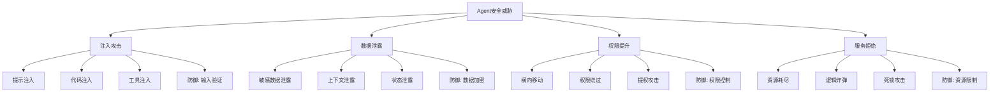
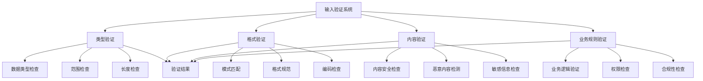
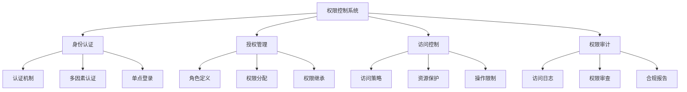
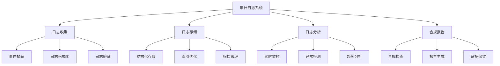

# 第19章：安全和合规

> **本章学习目标**
> - 理解安全威胁模型和风险评估
> - 掌握输入验证和清理技术
> - 学习权限控制和访问管理
> - 理解审计日志和监控机制
> - 掌握合规性检查和报告

---

## 19.1 安全威胁模型

### 19.1.1 威胁分类体系



### 19.1.2 威胁建模框架

```typescript
// Agent安全威胁建模框架
class AgentSecurityThreatModel {
  private threatDatabase = new Map<string, ThreatDefinition>();
  private vulnerabilityDatabase = new Map<string, VulnerabilityDefinition>();
  private riskAssessment = new Map<string, RiskAssessment>();
  
  // 定义威胁
  defineThreat(threat: ThreatDefinition): void {
    this.threatDatabase.set(threat.id, threat);
    logger.info(`Threat defined: ${threat.id}`);
  }
  
  // 定义漏洞
  defineVulnerability(vulnerability: VulnerabilityDefinition): void {
    this.vulnerabilityDatabase.set(vulnerability.id, vulnerability);
    logger.info(`Vulnerability defined: ${vulnerability.id}`);
  }
  
  // 执行威胁分析
  analyzeThreats(agentId: string, agentConfig: AgentConfig): ThreatAnalysis {
    const identifiedThreats = this.identifyThreats(agentId, agentConfig);
    const vulnerabilities = this.identifyVulnerabilities(agentId, agentConfig);
    const attackVectors = this.determineAttackVectors(identifiedThreats, vulnerabilities);
    const impact = this.assessImpact(attackVectors);
    const mitigations = this.suggestMitigations(attackVectors);
    
    return {
      agentId,
      timestamp: new Date(),
      threats: identifiedThreats,
      vulnerabilities,
      attackVectors,
      impact,
      mitigations,
      riskLevel: this.calculateRiskLevel(impact)
    };
  }
  
  // 识别威胁
  private identifyThreats(agentId: string, config: AgentConfig): Threat[] {
    const threats: Threat[] = [];
    
    // 检查外部输入处理
    if (config.acceptsExternalInput) {
      threats.push({
        type: 'prompt-injection',
        severity: 'high',
        description: 'Agent accepts external input that could contain malicious prompts',
        likelihood: 'medium',
        impact: 'high'
      });
    }
    
    // 检查工具访问
    if (config.hasToolAccess) {
      threats.push({
        type: 'tool-injection',
        severity: 'medium',
        description: 'Agent has tool access that could be exploited',
        likelihood: 'low',
        impact: 'medium'
      });
    }
    
    // 检查数据存储
    if (config.storesSensitiveData) {
      threats.push({
        type: 'data-exposure',
        severity: 'high',
        description: 'Agent stores sensitive data that could be exposed',
        likelihood: 'medium',
        impact: 'high'
      });
    }
    
    // 检查权限级别
    if (config.hasElevatedPrivileges) {
      threats.push({
        type: 'privilege-escalation',
        severity: 'critical',
        description: 'Agent has elevated privileges that could be abused',
        likelihood: 'low',
        impact: 'critical'
      });
    }
    
    return threats;
  }
  
  // 识别漏洞
  private identifyVulnerabilities(agentId: string, config: AgentConfig): Vulnerability[] {
    const vulnerabilities: Vulnerability[] = [];
    
    // 检查输入验证
    if (!config.hasInputValidation) {
      vulnerabilities.push({
        id: 'no-input-validation',
        type: 'input-validation',
        severity: 'high',
        description: 'Agent lacks proper input validation',
        remediation: 'Implement comprehensive input validation'
      });
    }
    
    // 检查输出过滤
    if (!config.hasOutputFiltering) {
      vulnerabilities.push({
        id: 'no-output-filtering',
        type: 'data-exposure',
        severity: 'medium',
        description: 'Agent lacks output filtering',
        remediation: 'Implement output data filtering and sanitization'
      });
    }
    
    // 检查权限控制
    if (!config.hasProperAuthorization) {
      vulnerabilities.push({
        id: 'weak-authorization',
        type: 'authorization',
        severity: 'high',
        description: 'Agent has weak authorization controls',
        remediation: 'Implement proper authorization and permission checks'
      });
    }
    
    // 检查加密
    if (!config.hasDataEncryption) {
      vulnerabilities.push({
        id: 'no-encryption',
        type: 'data-protection',
        severity: 'high',
        description: 'Agent lacks data encryption',
        remediation: 'Implement encryption for sensitive data at rest and in transit'
      });
    }
    
    // 检查资源限制
    if (!config.hasResourceLimits) {
      vulnerabilities.push({
        id: 'no-resource-limits',
        type: 'resource-exhaustion',
        severity: 'medium',
        description: 'Agent lacks resource usage limits',
        remediation: 'Implement resource quotas and limits'
      });
    }
    
    return vulnerabilities;
  }
  
  // 确定攻击向量
  private determineAttackVectors(threats: Threat[], vulnerabilities: Vulnerability[]): AttackVector[] {
    const attackVectors: AttackVector[] = [];
    
    // 提示注入攻击向量
    if (threats.some(t => t.type === 'prompt-injection')) {
      const inputVuln = vulnerabilities.find(v => v.type === 'input-validation');
      if (inputVuln) {
        attackVectors.push({
          name: 'Prompt Injection Attack',
          description: 'Attacker injects malicious prompts to manipulate agent behavior',
          threats: [threats.find(t => t.type === 'prompt-injection')!],
          vulnerabilities: [inputVuln],
          likelihood: 'medium',
          impact: 'high',
          feasibility: 'high'
        });
      }
    }
    
    // 数据泄露攻击向量
    if (threats.some(t => t.type === 'data-exposure')) {
      const encryptionVuln = vulnerabilities.find(v => v.type === 'data-protection');
      const outputVuln = vulnerabilities.find(v => v.type === 'data-exposure');
      
      if (encryptionVuln || outputVuln) {
        attackVectors.push({
          name: 'Data Exposure Attack',
          description: 'Attacker extracts sensitive data from agent responses',
          threats: [threats.find(t => t.type === 'data-exposure')!],
          vulnerabilities: [encryptionVuln, outputVuln].filter(Boolean) as Vulnerability[],
          likelihood: 'medium',
          impact: 'high',
          feasibility: 'medium'
        });
      }
    }
    
    // 权限提升攻击向量
    if (threats.some(t => t.type === 'privilege-escalation')) {
      const authVuln = vulnerabilities.find(v => v.type === 'authorization');
      if (authVuln) {
        attackVectors.push({
          name: 'Privilege Escalation Attack',
          description: 'Attacker elevates privileges to gain unauthorized access',
          threats: [threats.find(t => t.type === 'privilege-escalation')!],
          vulnerabilities: [authVuln],
          likelihood: 'low',
          impact: 'critical',
          feasibility: 'medium'
        });
      }
    }
    
    return attackVectors;
  }
  
  // 评估影响
  private assessImpact(attackVectors: AttackVector[]): ImpactAssessment {
    const impactLevels = attackVectors.map(av => this.impactToLevel(av.impact));
    const maxImpact = impactLevels.reduce((max, level) => 
      level === 'critical' ? 'critical' : level === 'high' && max !== 'critical' ? 'high' : max, 
      'low'
    );
    
    return {
      overallImpact: maxImpact,
      dataImpact: this.assessDataImpact(attackVectors),
      systemImpact: this.assessSystemImpact(attackVectors),
      operationalImpact: this.assessOperationalImpact(attackVectors),
      financialImpact: this.assessFinancialImpact(attackVectors),
      reputationImpact: this.assessReputationImpact(attackVectors)
    };
  }
  
  // 建议缓解措施
  private suggestMitigations(attackVectors: AttackVector[]): Mitigation[] {
    const mitigations: Mitigation[] = [];
    
    for (const vector of attackVectors) {
      // 输入验证缓解
      if (vector.vulnerabilities.some(v => v.type === 'input-validation')) {
        mitigations.push({
          priority: 'high',
          action: 'Implement comprehensive input validation',
          description: 'Validate and sanitize all external inputs before processing',
          effectiveness: 'high',
          cost: 'low'
        });
      }
      
      // 数据加密缓解
      if (vector.vulnerabilities.some(v => v.type === 'data-protection')) {
        mitigations.push({
          priority: 'high',
          action: 'Implement data encryption',
          description: 'Encrypt sensitive data at rest and in transit',
          effectiveness: 'high',
          cost: 'medium'
        });
      }
      
      // 权限控制缓解
      if (vector.vulnerabilities.some(v => v.type === 'authorization')) {
        mitigations.push({
          priority: 'high',
          action: 'Implement proper authorization',
          description: 'Enforce principle of least privilege and proper access controls',
          effectiveness: 'high',
          cost: 'medium'
        });
      }
      
      // 资源限制缓解
      if (vector.vulnerabilities.some(v => v.type === 'resource-exhaustion')) {
        mitigations.push({
          priority: 'medium',
          action: 'Implement resource limits',
          description: 'Set quotas and limits on resource usage',
          effectiveness: 'medium',
          cost: 'low'
        });
      }
    }
    
    return mitigations;
  }
  
  // 计算风险级别
  private calculateRiskLevel(impact: ImpactAssessment): RiskLevel {
    if (impact.overallImpact === 'critical') {
      return 'critical';
    } else if (impact.overallImpact === 'high') {
      return 'high';
    } else if (impact.overallImpact === 'medium') {
      return 'medium';
    } else {
      return 'low';
    }
  }
  
  // 辅助方法
  private impactToLevel(impact: string): 'critical' | 'high' | 'medium' | 'low' {
    if (impact === 'critical') return 'critical';
    if (impact === 'high') return 'high';
    if (impact === 'medium') return 'medium';
    return 'low';
  }
  
  private assessDataImpact(vectors: AttackVector[]): 'critical' | 'high' | 'medium' | 'low' {
    if (vectors.some(v => v.impact === 'critical' && 
        v.name.includes('Data'))) return 'critical';
    if (vectors.some(v => v.impact === 'high' && 
        v.name.includes('Data'))) return 'high';
    return 'medium';
  }
  
  private assessSystemImpact(vectors: AttackVector[]): 'critical' | 'high' | 'medium' | 'low' {
    const systemThreats = vectors.filter(v => 
      v.name.includes('Privilege') || v.name.includes('System'));
    if (systemThreats.some(v => v.impact === 'critical')) return 'critical';
    if (systemThreats.some(v => v.impact === 'high')) return 'high';
    return 'medium';
  }
  
  private assessOperationalImpact(vectors: AttackVector[]): 'critical' | 'high' | 'medium' | 'low' {
    return 'medium';
  }
  
  private assessFinancialImpact(vectors: AttackVector[]): 'critical' | 'high' | 'medium' | 'low' {
    return 'medium';
  }
  
  private assessReputationImpact(vectors: AttackVector[]): 'critical' | 'high' | 'medium' | 'low' {
    if (vectors.some(v => v.name.includes('Data'))) return 'high';
    return 'medium';
  }
}

// 相关接口定义
interface ThreatDefinition {
  id: string;
  type: string;
  category: string;
  description: string;
  mitigation: string;
}

interface VulnerabilityDefinition {
  id: string;
  type: string;
  severity: 'low' | 'medium' | 'high' | 'critical';
  description: string;
  remediation: string;
}

interface Threat {
  type: string;
  severity: 'low' | 'medium' | 'high' | 'critical';
  description: string;
  likelihood: 'low' | 'medium' | 'high';
  impact: 'low' | 'medium' | 'high' | 'critical';
}

interface Vulnerability {
  id: string;
  type: string;
  severity: 'low' | 'medium' | 'high' | 'critical';
  description: string;
  remediation: string;
}

interface AttackVector {
  name: string;
  description: string;
  threats: Threat[];
  vulnerabilities: Vulnerability[];
  likelihood: 'low' | 'medium' | 'high';
  impact: 'low' | 'medium' | 'high' | 'critical';
  feasibility: 'low' | 'medium' | 'high';
}

interface ThreatAnalysis {
  agentId: string;
  timestamp: Date;
  threats: Threat[];
  vulnerabilities: Vulnerability[];
  attackVectors: AttackVector[];
  impact: ImpactAssessment;
  mitigations: Mitigation[];
  riskLevel: 'low' | 'medium' | 'high' | 'critical';
}

interface ImpactAssessment {
  overallImpact: 'low' | 'medium' | 'high' | 'critical';
  dataImpact: 'low' | 'medium' | 'high' | 'critical';
  systemImpact: 'low' | 'medium' | 'high' | 'critical';
  operationalImpact: 'low' | 'medium' | 'high' | 'critical';
  financialImpact: 'low' | 'medium' | 'high' | 'critical';
  reputationImpact: 'low' | 'medium' | 'high' | 'critical';
}

interface Mitigation {
  priority: 'low' | 'medium' | 'high';
  action: string;
  description: string;
  effectiveness: 'low' | 'medium' | 'high';
  cost: 'low' | 'medium' | 'high';
}

interface RiskAssessment {
  agentId: string;
  timestamp: Date;
  riskLevel: 'low' | 'medium' | 'high' | 'critical';
  factors: RiskFactor[];
  recommendations: string[];
}

interface RiskFactor {
  type: string;
  weight: number;
  score: number;
  description: string;
}

interface AgentConfig {
  acceptsExternalInput: boolean;
  hasToolAccess: boolean;
  storesSensitiveData: boolean;
  hasElevatedPrivileges: boolean;
  hasInputValidation: boolean;
  hasOutputFiltering: boolean;
  hasProperAuthorization: boolean;
  hasDataEncryption: boolean;
  hasResourceLimits: boolean;
}
```

### 19.1.3 安全风险评估

```typescript
// 安全风险评估系统
class SecurityRiskAssessmentSystem {
  private riskMatrix = new Map<string, RiskLevel>();
  private riskFactors = new Map<string, RiskFactor[]>();
  
  // 执行风险评估
  async assessRisk(agentId: string, context: SecurityContext): Promise<RiskAssessment> {
    const factors = this.identifyRiskFactors(agentId, context);
    const scores = this.calculateRiskScores(factors);
    const overallRisk = this.determineOverallRisk(scores);
    const recommendations = this.generateRiskRecommendations(factors, overallRisk);
    
    return {
      agentId,
      timestamp: new Date(),
      riskLevel: overallRisk,
      factors,
      scores,
      recommendations,
      mitigationPlan: this.createMitigationPlan(factors, overallRisk)
    };
  }
  
  // 识别风险因素
  private identifyRiskFactors(agentId: string, context: SecurityContext): RiskFactor[] {
    const factors: RiskFactor[] = [];
    
    // 输入处理风险
    if (context.acceptsExternalInput) {
      const inputRisk = this.assessInputRisk(context);
      factors.push({
        type: 'input-processing',
        weight: 0.25,
        score: inputRisk,
        description: 'Risk related to external input processing'
      });
    }
    
    // 数据处理风险
    if (context.processesSensitiveData) {
      const dataRisk = this.assessDataRisk(context);
      factors.push({
        type: 'data-handling',
        weight: 0.25,
        score: dataRisk,
        description: 'Risk related to sensitive data handling'
      });
    }
    
    // 权限管理风险
    if (context.hasElevatedPermissions) {
      const permissionRisk = this.assessPermissionRisk(context);
      factors.push({
        type: 'permission-management',
        weight: 0.2,
        score: permissionRisk,
        description: 'Risk related to permission management'
      });
    }
    
    // 资源使用风险
    if (context.usesSignificantResources) {
      const resourceRisk = this.assessResourceRisk(context);
      factors.push({
        type: 'resource-usage',
        weight: 0.15,
        score: resourceRisk,
        description: 'Risk related to resource usage'
      });
    }
    
    // 通信风险
    if (context.communicatesExternally) {
      const communicationRisk = this.assessCommunicationRisk(context);
      factors.push({
        type: 'communication',
        weight: 0.15,
        score: communicationRisk,
        description: 'Risk related to external communication'
      });
    }
    
    return factors;
  }
  
  // 评估输入风险
  private assessInputRisk(context: SecurityContext): number {
    let risk = 0.5;
    
    // 检查输入验证
    if (!context.hasInputValidation) {
      risk += 0.3;
    }
    
    // 检查输入过滤
    if (!context.hasInputFiltering) {
      risk += 0.2;
    }
    
    // 检查输入来源
    if (context.acceptsUntrustedInput) {
      risk += 0.15;
    }
    
    return Math.min(1, risk);
  }
  
  // 评估数据风险
  private assessDataRisk(context: SecurityContext): number {
    let risk = 0.3;
    
    // 检查数据敏感性
    if (context.handlesPII) {
      risk += 0.3;
    }
    
    // 检查加密
    if (!context.hasEncryptionAtRest) {
      risk += 0.2;
    }
    
    if (!context.hasEncryptionInTransit) {
      risk += 0.15;
    }
    
    // 检查数据保留
    if (context.retainsDataLongTerm) {
      risk += 0.1;
    }
    
    return Math.min(1, risk);
  }
  
  // 评估权限风险
  private assessPermissionRisk(context: SecurityContext): number {
    let risk = 0.4;
    
    // 检查权限级别
    if (context.hasAdminPrivileges) {
      risk += 0.3;
    }
    
    // 检查权限控制
    if (!context.hasLeastPrivilegePolicy) {
      risk += 0.2;
    }
    
    // 检查权限审计
    if (!context.hasPermissionAuditing) {
      risk += 0.1;
    }
    
    return Math.min(1, risk);
  }
  
  // 评估资源风险
  private assessResourceRisk(context: SecurityContext): number {
    let risk = 0.3;
    
    // 检查资源限制
    if (!context.hasResourceLimits) {
      risk += 0.3;
    }
    
    // 检查资源监控
    if (!context.hasResourceMonitoring) {
      risk += 0.2;
    }
    
    // 检查资源分配
    if (!context.hasFairResourceAllocation) {
      risk += 0.1;
    }
    
    return Math.min(1, risk);
  }
  
  // 评估通信风险
  private assessCommunicationRisk(context: SecurityContext): number {
    let risk = 0.3;
    
    // 检查通信加密
    if (!context.usesSecureChannels) {
      risk += 0.3;
    }
    
    // 检查身份验证
    if (!context.hasMutualAuthentication) {
      risk += 0.2;
    }
    
    // 检查消息验证
    if (!context.hasMessageSigning) {
      risk += 0.1;
    }
    
    return Math.min(1, risk);
  }
  
  // 计算风险分数
  private calculateRiskScores(factors: RiskFactor[]): RiskScores {
    const weightedScores = factors.map(factor => 
      factor.score * factor.weight
    );
    
    const overallScore = weightedScores.reduce((sum, score) => sum + score, 0);
    const highestScore = Math.max(...factors.map(f => f.score));
    const averageScore = factors.reduce((sum, f) => sum + f.score, 0) / factors.length;
    
    return {
      overall: overallScore,
      highest: highestScore,
      average: averageScore,
      byFactor: factors.map(f => ({ type: f.type, score: f.score }))
    };
  }
  
  // 确定总体风险
  private determineOverallRisk(scores: RiskScores): RiskLevel {
    if (scores.overall >= 0.8) return 'critical';
    if (scores.overall >= 0.6) return 'high';
    if (scores.overall >= 0.4) return 'medium';
    return 'low';
  }
  
  // 生成风险建议
  private generateRiskRecommendations(factors: RiskFactor[], riskLevel: RiskLevel): string[] {
    const recommendations: string[] = [];
    
    for (const factor of factors) {
      if (factor.score > 0.7) {
        switch (factor.type) {
          case 'input-processing':
            recommendations.push('Implement comprehensive input validation and filtering');
            break;
          case 'data-handling':
            recommendations.push('Enable encryption for sensitive data at rest and in transit');
            break;
          case 'permission-management':
            recommendations.push('Apply principle of least privilege and implement proper authorization');
            break;
          case 'resource-usage':
            recommendations.push('Implement resource quotas and monitoring');
            break;
          case 'communication':
            recommendations.push('Use secure communication channels with mutual authentication');
            break;
        }
      }
    }
    
    // 基于风险级别的建议
    if (riskLevel === 'critical' || riskLevel === 'high') {
      recommendations.push('Conduct immediate security review and implement mitigations');
      recommendations.push('Enable comprehensive security monitoring and alerting');
    }
    
    return recommendations;
  }
  
  // 创建缓解计划
  private createMitigationPlan(factors: RiskFactor[], riskLevel: RiskLevel): MitigationPlan {
    const highPriorityFactors = factors.filter(f => f.score > 0.7);
    const mediumPriorityFactors = factors.filter(f => f.score > 0.4 && f.score <= 0.7);
    
    const immediateActions = highPriorityFactors.map(factor => ({
      factor: factor.type,
      action: this.getMitigationAction(factor.type),
      timeline: 'immediate',
      priority: 'high'
    }));
    
    const shortTermActions = mediumPriorityFactors.map(factor => ({
      factor: factor.type,
      action: this.getMitigationAction(factor.type),
      timeline: '2-4 weeks',
      priority: 'medium'
    }));
    
    return {
      immediateActions,
      shortTermActions,
      longTermActions: [
        {
          factor: 'security-posture',
          action: 'Establish continuous security monitoring and improvement program',
          timeline: '1-3 months',
          priority: 'medium'
        }
      ],
      estimatedEffort: this.estimateMitigationEffort(immediateActions, shortTermActions),
      expectedRiskReduction: this.estimateRiskReduction(riskLevel, immediateActions)
    };
  }
  
  // 获取缓解措施
  private getMitigationAction(factorType: string): string {
    const actions: Record<string, string> = {
      'input-processing': 'Implement input validation, sanitization, and rate limiting',
      'data-handling': 'Implement encryption, data minimization, and secure disposal',
      'permission-management': 'Implement least privilege, RBAC, and permission auditing',
      'resource-usage': 'Implement quotas, monitoring, and fair allocation algorithms',
      'communication': 'Implement TLS, mutual authentication, and message signing'
    };
    
    return actions[factorType] || 'Review and address security concerns';
  }
  
  // 估算缓解工作量
  private estimateMitigationEffort(immediate: Action[], shortTerm: Action[]): EffortEstimate {
    const immediateEffort = immediate.length * 8; // 每项8小时
    const shortTermEffort = shortTerm.length * 16; // 每项16小时
    const totalHours = immediateEffort + shortTermEffort;
    
    return {
      totalHours,
      totalWeeks: Math.ceil(totalHours / 40),
      byPriority: {
        high: immediateEffort,
        medium: shortTermEffort,
        low: 0
      }
    };
  }
  
  // 估算风险降低
  private estimateRiskReduction(currentRisk: RiskLevel, actions: Action[]): string {
    const highPriorityCount = actions.filter(a => a.priority === 'high').length;
    const reductionPercentage = Math.min(highPriorityCount * 20, 60); // 最多60%
    
    return `${reductionPercentage}% expected risk reduction`;
  }
}

// 相关接口定义
interface SecurityContext {
  acceptsExternalInput: boolean;
  hasInputValidation: boolean;
  hasInputFiltering: boolean;
  acceptsUntrustedInput: boolean;
  processesSensitiveData: boolean;
  handlesPII: boolean;
  hasEncryptionAtRest: boolean;
  hasEncryptionInTransit: boolean;
  retainsDataLongTerm: boolean;
  hasElevatedPermissions: boolean;
  hasAdminPrivileges: boolean;
  hasLeastPrivilegePolicy: boolean;
  hasPermissionAuditing: boolean;
  usesSignificantResources: boolean;
  hasResourceLimits: boolean;
  hasResourceMonitoring: boolean;
  hasFairResourceAllocation: boolean;
  communicatesExternally: boolean;
  usesSecureChannels: boolean;
  hasMutualAuthentication: boolean;
  hasMessageSigning: boolean;
}

interface RiskScores {
  overall: number;
  highest: number;
  average: number;
  byFactor: Array<{ type: string; score: number }>;
}

type RiskLevel = 'low' | 'medium' | 'high' | 'critical';

interface MitigationPlan {
  immediateActions: Action[];
  shortTermActions: Action[];
  longTermActions: Action[];
  estimatedEffort: EffortEstimate;
  expectedRiskReduction: string;
}

interface Action {
  factor: string;
  action: string;
  timeline: string;
  priority: 'low' | 'medium' | 'high';
}

interface EffortEstimate {
  totalHours: number;
  totalWeeks: number;
  byPriority: {
    high: number;
    medium: number;
    low: number;
  };
}
```

---

## 19.2 输入验证和清理

### 19.2.1 输入验证框架



### 19.2.2 输入验证实现

```typescript
// Agent输入验证系统
class AgentInputValidationSystem {
  private validators = new Map<string, InputValidator>();
  private sanitizers = new Map<string, InputSanitizer>();
  private validationRules = new Map<string, ValidationRule[]>();
  
  // 注册验证器
  registerValidator(validator: InputValidator): void {
    this.validators.set(validator.id, validator);
  }
  
  // 注册清理器
  registerSanitizer(sanitizer: InputSanitizer): void {
    this.sanitizers.set(sanitizer.id, sanitizer);
  }
  
  // 添加验证规则
  addValidationRule(agentId: string, rule: ValidationRule): void {
    let rules = this.validationRules.get(agentId);
    if (!rules) {
      rules = [];
      this.validationRules.set(agentId, rules);
    }
    rules.push(rule);
  }
  
  // 验证输入
  async validateInput(agentId: string, input: any, context: ValidationContext): Promise<ValidationResult> {
    const rules = this.validationRules.get(agentId) || [];
    const errors: ValidationError[] = [];
    const warnings: ValidationWarning[] = [];
    
    // 应用验证规则
    for (const rule of rules) {
      const result = await this.applyValidationRule(rule, input, context);
      if (!result.valid) {
        errors.push(...result.errors);
      }
      warnings.push(...result.warnings);
    }
    
    // 类型验证
    const typeValidation = await this.validateType(input, context.expectedType);
    if (!typeValidation.valid) {
      errors.push(...typeValidation.errors);
    }
    
    // 格式验证
    const formatValidation = await this.validateFormat(input, context.expectedFormat);
    if (!formatValidation.valid) {
      errors.push(...formatValidation.errors);
    }
    
    // 内容验证
    const contentValidation = await this.validateContent(input, context);
    if (!contentValidation.valid) {
      errors.push(...contentValidation.errors);
    }
    
    // 业务规则验证
    const businessValidation = await this.validateBusinessRules(input, context);
    if (!businessValidation.valid) {
      errors.push(...businessValidation.errors);
    }
    
    return {
      valid: errors.length === 0,
      errors,
      warnings,
      sanitized: errors.length === 0 ? input : await this.sanitizeInput(input, context)
    };
  }
  
  // 应用验证规则
  private async applyValidationRule(
    rule: ValidationRule,
    input: any,
    context: ValidationContext
  ): Promise<ValidationResult> {
    const errors: ValidationError[] = [];
    const warnings: ValidationWarning[] = [];
    
    for (const validator of rule.validators) {
      const validatorImpl = this.validators.get(validator.type);
      if (!validatorImpl) {
        warnings.push({
          type: 'missing-validator',
          message: `Validator not found: ${validator.type}`,
          severity: 'low'
        });
        continue;
      }
      
      try {
        const result = await validatorImpl.validate(input, validator.params, context);
        if (!result.valid) {
          errors.push({
            type: validator.type,
            message: result.message || `Validation failed: ${validator.type}`,
            severity: validator.severity || 'medium',
            field: validator.field
          });
        }
      } catch (error) {
        errors.push({
          type: 'validation-error',
          message: `Validator execution error: ${error.message}`,
          severity: 'high',
          field: validator.field
        });
      }
    }
    
    return {
      valid: errors.length === 0,
      errors,
      warnings
    };
  }
  
  // 类型验证
  private async validateType(input: any, expectedType?: string): Promise<ValidationResult> {
    const errors: ValidationError[] = [];
    
    if (!expectedType) {
      return { valid: true, errors: [], warnings: [] };
    }
    
    const actualType = this.detectType(input);
    
    if (actualType !== expectedType) {
      errors.push({
        type: 'type-mismatch',
        message: `Expected type ${expectedType}, got ${actualType}`,
        severity: 'high',
        field: 'type'
      });
    }
    
    return {
      valid: errors.length === 0,
      errors,
      warnings: []
    };
  }
  
  // 格式验证
  private async validateFormat(input: any, expectedFormat?: string): Promise<ValidationResult> {
    const errors: ValidationError[] = [];
    
    if (!expectedFormat) {
      return { valid: true, errors: [], warnings: [] };
    }
    
    const formatValidator = this.validators.get(`format-${expectedFormat}`);
    if (formatValidator) {
      return formatValidator.validate(input, {}, {});
    }
    
    // 默认格式验证
    switch (expectedFormat) {
      case 'email':
        if (!this.validateEmail(input)) {
          errors.push({
            type: 'format-error',
            message: 'Invalid email format',
            severity: 'medium',
            field: 'email'
          });
        }
        break;
      
      case 'url':
        if (!this.validateURL(input)) {
          errors.push({
            type: 'format-error',
            message: 'Invalid URL format',
            severity: 'medium',
            field: 'url'
          });
        }
        break;
      
      case 'json':
        if (!this.validateJSON(input)) {
          errors.push({
            type: 'format-error',
            message: 'Invalid JSON format',
            severity: 'medium',
            field: 'json'
          });
        }
        break;
    }
    
    return {
      valid: errors.length === 0,
      errors,
      warnings: []
    };
  }
  
  // 内容验证
  private async validateContent(input: any, context: ValidationContext): Promise<ValidationResult> {
    const errors: ValidationError[] = [];
    
    // 检查恶意内容
    const maliciousCheck = await this.checkMaliciousContent(input);
    if (!maliciousCheck.safe) {
      errors.push({
        type: 'malicious-content',
        message: 'Input contains potentially malicious content',
        severity: 'high',
        field: 'content'
      });
    }
    
    // 检查敏感信息
    const sensitiveCheck = await this.checkSensitiveInfo(input, context);
    if (!sensitiveCheck.safe) {
      errors.push({
        type: 'sensitive-info',
        message: 'Input contains sensitive information',
        severity: 'medium',
        field: 'content'
      });
    }
    
    // 检查输入长度
    if (typeof input === 'string') {
      if (input.length > (context.maxLength || 10000)) {
        errors.push({
          type: 'length-exceeded',
          message: `Input length exceeds maximum allowed length`,
          severity: 'medium',
          field: 'length'
        });
      }
    }
    
    return {
      valid: errors.length === 0,
      errors,
      warnings: []
    };
  }
  
  // 业务规则验证
  private async validateBusinessRules(input: any, context: ValidationContext): Promise<ValidationResult> {
    const errors: ValidationError[] = [];
    
    // 检查权限
    if (context.requiredPermission && !context.userPermissions?.includes(context.requiredPermission)) {
      errors.push({
        type: 'permission-denied',
        message: 'Insufficient permissions for this operation',
        severity: 'high',
        field: 'permission'
      });
    }
    
    // 检查业务约束
    if (context.businessConstraints) {
      for (const constraint of context.businessConstraints) {
        const result = await this.validateConstraint(input, constraint);
        if (!result.valid) {
          errors.push({
            type: 'constraint-violation',
            message: result.message || 'Business constraint violated',
            severity: 'medium',
            field: constraint.field
          });
        }
      }
    }
    
    return {
      valid: errors.length === 0,
      errors,
      warnings: []
    };
  }
  
  // 清理输入
  async sanitizeInput(input: any, context: ValidationContext): Promise<any> {
    let sanitized = input;
    
    // 应用清理器
    for (const sanitizer of this.sanitizers.values()) {
      if (sanitizer.appliesTo(input, context)) {
        sanitized = await sanitizer.sanitize(sanitized, context);
      }
    }
    
    return sanitized;
  }
  
  // 检查恶意内容
  private async checkMaliciousContent(input: any): Promise<{ safe: boolean; threats: string[] }> {
    const threats: string[] = [];
    const inputStr = String(input);
    
    // 检查SQL注入模式
    const sqlPatterns = [
      /(\bunion\b.*\bselect\b)/i,
      /(\bselect\b.*\bfrom\b)/i,
      /(\binsert\b.*\binto\b)/i,
      /(\bdelete\b.*\bfrom\b)/i,
      /(\bupdate\b.*\bset\b)/i,
      /(\bdrop\b.*\btable\b)/i
    ];
    
    for (const pattern of sqlPatterns) {
      if (pattern.test(inputStr)) {
        threats.push('sql-injection');
        break;
      }
    }
    
    // 检查XSS模式
    const xssPatterns = [
      /<script[^>]*>/i,
      /javascript:/i,
      /on\w+\s*=/i,
      /<iframe[^>]*>/i
    ];
    
    for (const pattern of xssPatterns) {
      if (pattern.test(inputStr)) {
        threats.push('xss');
        break;
      }
    }
    
    // 检查命令注入模式
    const commandPatterns = [
      /;\s*\w+\s*-/i,
      /\|?\s*\w+\s*\|/i,
      /`[^`]*`/i,
      /\$[^$]*/
    ];
    
    for (const pattern of commandPatterns) {
      if (pattern.test(inputStr)) {
        threats.push('command-injection');
        break;
      }
    }
    
    // 检查路径遍历模式
    const pathTraversalPatterns = [
      /\.\.\//,
      /\.\.\\/ ,
      /%2e%2e%2f/i,
      /%2e%2e%5c/i
    ];
    
    for (const pattern of pathTraversalPatterns) {
      if (pattern.test(inputStr)) {
        threats.push('path-traversal');
        break;
      }
    }
    
    return {
      safe: threats.length === 0,
      threats
    };
  }
  
  // 检查敏感信息
  private async checkSensitiveInfo(input: any, context: ValidationContext): Promise<{ safe: boolean; found: string[] }> {
    const found: string[] = [];
    const inputStr = String(input);
    
    // 检查信用卡号
    const ccPattern = /\b\d{4}[-\s]?\d{4}[-\s]?\d{4}[-\s]?\d{4}\b/;
    if (ccPattern.test(inputStr)) {
      found.push('credit-card');
    }
    
    // 检查社会安全号
    const ssnPattern = /\b\d{3}[-]?\d{2}[-]?\d{4}\b/;
    if (ssnPattern.test(inputStr)) {
      found.push('ssn');
    }
    
    // 检查API密钥
    const apiKeyPattern = /\b[A-Z0-9]{20,}\b/;
    if (apiKeyPattern.test(inputStr)) {
      found.push('api-key');
    }
    
    // 检查密码
    const passwordPatterns = [
      /\bpassword\s*[:=]\s*\S+/i,
      /\bpass\s*[:=]\s*\S+/i,
      /\bpwd\s*[:=]\s*\S+/i
    ];
    
    for (const pattern of passwordPatterns) {
      if (pattern.test(inputStr)) {
        found.push('password');
        break;
      }
    }
    
    return {
      safe: found.length === 0,
      found
    };
  }
  
  // 验证约束
  private async validateConstraint(input: any, constraint: BusinessConstraint): Promise<ValidationResult> {
    // 实现约束验证逻辑
    return { valid: true, errors: [], warnings: [] };
  }
  
  // 辅助验证方法
  private detectType(input: any): string {
    if (input === null) return 'null';
    if (Array.isArray(input)) return 'array';
    return typeof input;
  }
  
  private validateEmail(input: string): boolean {
    const emailPattern = /^[^\s@]+@[^\s@]+\.[^\s@]+$/;
    return emailPattern.test(input);
  }
  
  private validateURL(input: string): boolean {
    try {
      new URL(input);
      return true;
    } catch {
      return false;
    }
  }
  
  private validateJSON(input: string): boolean {
    try {
      JSON.parse(input);
      return true;
    } catch {
      return false;
    }
  }
}

// 相关接口定义
interface InputValidator {
  id: string;
  validate(input: any, params: any, context: ValidationContext): Promise<ValidationResult>;
}

interface InputSanitizer {
  id: string;
  appliesTo(input: any, context: ValidationContext): boolean;
  sanitize(input: any, context: ValidationContext): Promise<any>;
}

interface ValidationRule {
  name: string;
  validators: ValidatorConfig[];
  priority: number;
}

interface ValidatorConfig {
  type: string;
  params: any;
  field?: string;
  severity?: 'low' | 'medium' | 'high';
}

interface ValidationResult {
  valid: boolean;
  errors: ValidationError[];
  warnings: ValidationWarning[];
  sanitized?: any;
}

interface ValidationError {
  type: string;
  message: string;
  severity: 'low' | 'medium' | 'high';
  field?: string;
}

interface ValidationWarning {
  type: string;
  message: string;
  severity: 'low' | 'medium' | 'high';
}

interface ValidationContext {
  expectedType?: string;
  expectedFormat?: string;
  maxLength?: number;
  requiredPermission?: string;
  userPermissions?: string[];
  businessConstraints?: BusinessConstraint[];
  agentId?: string;
  operation?: string;
}

interface BusinessConstraint {
  name: string;
  field: string;
  validator: (input: any) => boolean | Promise<boolean>;
  message?: string;
}
```

### 19.2.3 输入清理和净化

```typescript
// 输入清理和净化系统
class InputSanitizationSystem {
  private sanitizers = new Map<string, Sanitizer>();
  private cleaners = new Map<string, Cleaner>();
  private transformers = new Map<string, Transformer>();
  
  // 注册清理器
  registerSanitizer(sanitizer: Sanitizer): void {
    this.sanitizers.set(sanitizer.id, sanitizer);
  }
  
  // 注册清洁器
  registerCleaner(cleaner: Cleaner): void {
    this.cleaners.set(cleaner.id, cleaner);
  }
  
  // 注册转换器
  registerTransformer(transformer: Transformer): void {
    this.transformers.set(transformer.id, transformer);
  }
  
  // 清理输入
  async sanitize(input: any, options: SanitizationOptions): Promise<SanitizationResult> {
    let sanitized = input;
    const operations: SanitizationOperation[] = [];
    
    // 应用清理器
    if (options.applyCleaners) {
      for (const cleaner of this.cleaners.values()) {
        if (cleaner.appliesTo(input, options)) {
          const result = await cleaner.clean(sanitized, options);
          sanitized = result.cleaned;
          operations.push({
            type: 'clean',
            operation: cleaner.id,
            description: cleaner.description,
            modifications: result.modifications
          });
        }
      }
    }
  
    // 应用转换器
    if (options.applyTransformers) {
      for (const transformer of this.transformers.values()) {
        if (transformer.appliesTo(sanitized, options)) {
          const result = await transformer.transform(sanitized, options);
          sanitized = result.transformed;
          operations.push({
            type: 'transform',
            operation: transformer.id,
            description: transformer.description,
            modifications: result.modifications
          });
        }
      }
    }
  
    // 最终验证
    const validation = await this.validateSanitized(sanitized, options);
  
    return {
      original: input,
      sanitized,
      operations,
      validation,
      safe: validation.safe
    };
  }
  
  // 验证清理结果
  private async validateSanitized(sanitized: any, options: SanitizationOptions): Promise<SanitizationValidation> {
    const threats: string[] = [];
    const warnings: string[] = [];
  
    // 检查是否还包含恶意内容
    const maliciousCheck = await this.checkMaliciousContent(sanitized);
    threats.push(...maliciousCheck.threats);
  
    // 检查数据完整性
    if (options.preserveStructure && typeof sanitized !== typeof options.originalInput) {
      warnings.push('Data structure may have been modified during sanitization');
    }
  
    // 检查信息丢失
    const infoLoss = this.checkInformationLoss(options.originalInput, sanitized);
    if (infoLoss.significant) {
      warnings.push(`Significant information loss detected: ${infoLoss.percentage.toFixed(1)}%`);
    }
  
    return {
      safe: threats.length === 0,
      threats,
      warnings,
      integrity: infoLoss.integrity
    };
  }
  
  // 检查恶意内容
  private async checkMaliciousContent(input: any): Promise<{ threats: string[] }> {
    const threats: string[] = [];
    const inputStr = String(input);
  
    // 检查脚本标签
    if (/<script[^>]*>.*?<\/script>/is.test(inputStr)) {
      threats.push('script-tag');
    }
  
    // 检查事件处理器
    if (/\bon\w+\s*=/is.test(inputStr)) {
      threats.push('event-handler');
    }
  
    // 检查协议
    if (/\b(javascript|data|vbscript):/is.test(inputStr)) {
      threats.push('dangerous-protocol');
    }
  
    return { threats };
  }
  
  // 检查信息丢失
  private checkInformationLoss(original: any, sanitized: any): InformationLoss {
    const originalStr = String(original);
    const sanitizedStr = String(sanitized);
  
    const lengthDifference = originalStr.length - sanitizedStr.length;
    const percentage = originalStr.length > 0 
      ? (lengthDifference / originalStr.length) * 100 
      : 0;
  
    return {
      significant: percentage > 20,
      percentage,
      integrity: percentage < 10 ? 'high' : percentage < 30 ? 'medium' : 'low'
    };
  }
  
  // HTML转义
  escapeHTML(input: string): string {
    return input
      .replace(/&/g, '&amp;')
      .replace(/</g, '&lt;')
      .replace(/>/g, '&gt;')
      .replace(/"/g, '&quot;')
      .replace(/'/g, '&#x27;');
  }
  
  // SQL转义
  escapeSQL(input: string): string {
    return input.replace(/'/g, "''");
  }
  
  // JSON转义
  escapeJSON(input: string): string {
    return input.replace(/[\\"']/g, '\\$&');
  }
  
  // 移除控制字符
  removeControlCharacters(input: string): string {
    return input.replace(/[\x00-\x08\x0B-\x0C\x0E-\x1F\x7F]/g, '');
  }
  
  // 规范化Unicode
  normalizeUnicode(input: string): string {
    return input.normalize('NFC');
  }
  
  // 截断长度
  truncateLength(input: string, maxLength: number): string {
    return input.length > maxLength ? input.substring(0, maxLength) : input;
  }
}

// 相关接口定义
interface Sanitizer {
  id: string;
  appliesTo(input: any, options: SanitizationOptions): boolean;
  sanitize(input: any, options: SanitizationOptions): Promise<any>;
}

interface Cleaner {
  id: string;
  description: string;
  appliesTo(input: any, options: SanitizationOptions): boolean;
  clean(input: any, options: SanitizationOptions): Promise<CleanResult>;
}

interface Transformer {
  id: string;
  description: string;
  appliesTo(input: any, options: SanitizationOptions): boolean;
  transform(input: any, options: SanitizationOptions): Promise<TransformResult>;
}

interface SanitizationOptions {
  applyCleaners: boolean;
  applyTransformers: boolean;
  preserveStructure: boolean;
  maxLength?: number;
  encoding?: string;
  originalInput: any;
}

interface SanitizationResult {
  original: any;
  sanitized: any;
  operations: SanitizationOperation[];
  validation: SanitizationValidation;
  safe: boolean;
}

interface SanitizationOperation {
  type: 'clean' | 'transform';
  operation: string;
  description: string;
  modifications: string[];
}

interface SanitizationValidation {
  safe: boolean;
  threats: string[];
  warnings: string[];
  integrity: 'high' | 'medium' | 'low';
}

interface CleanResult {
  cleaned: any;
  modifications: string[];
}

interface TransformResult {
  transformed: any;
  modifications: string[];
}

interface InformationLoss {
  significant: boolean;
  percentage: number;
  integrity: 'high' | 'medium' | 'low';
}
```

---

## 19.3 权限控制和访问管理

### 19.3.1 权限系统架构



### 19.3.2 权限控制系统

```typescript
// Agent权限控制系统
class AgentPermissionControlSystem {
  private roles = new Map<string, Role>();
  private permissions = new Map<string, Permission>();
  private policies = new Map<string, AccessPolicy>();
  private sessions = new Map<string, AuthSession>();
  
  // 创建角色
  createRole(role: Role): void {
    this.validateRole(role);
    this.roles.set(role.id, role);
    logger.info(`Role created: ${role.id}`);
  }
  
  // 分配权限
  assignPermission(roleId: string, permission: Permission): void {
    const role = this.roles.get(roleId);
    if (!role) {
      throw new Error(`Role not found: ${roleId}`);
    }
  
    this.permissions.set(permission.id, permission);
    role.permissions.push(permission.id);
  
    logger.info(`Permission assigned to role ${roleId}: ${permission.id}`);
  }
  
  // 创建访问策略
  createPolicy(policy: AccessPolicy): void {
    this.policies.set(policy.id, policy);
    logger.info(`Access policy created: ${policy.id}`);
  }
  
  // 验证权限
  async checkPermission(
    agentId: string,
    requiredPermission: string,
    context: AccessContext
  ): Promise<PermissionCheckResult> {
    // 获取会话信息
    const session = this.sessions.get(context.sessionId);
    if (!session) {
      return {
        granted: false,
        reason: 'Invalid session',
        requiresAuthentication: true
      };
    }
  
    // 检查会话有效性
    if (!this.isSessionValid(session)) {
      return {
        granted: false,
        reason: 'Session expired or invalid',
        requiresAuthentication: true
      };
    }
  
    // 获取用户角色
    const userRoles = session.roles;
  
    // 检查角色权限
    for (const roleId of userRoles) {
      const role = this.roles.get(roleId);
      if (!role) continue;
  
      if (role.permissions.includes(requiredPermission)) {
        // 检查访问策略
        const policyCheck = await this.checkAccessPolicies(
          agentId,
          requiredPermission,
          context
        );
  
        if (policyCheck.allowed) {
          return {
            granted: true,
            reason: 'Permission granted',
            roleId: roleId,
            policyResults: policyCheck.results
          };
        } else {
          return {
            granted: false,
            reason: policyCheck.reason,
            roleId: roleId,
            policyResults: policyCheck.results
          };
        }
      }
    }
  
    return {
      granted: false,
      reason: 'Insufficient permissions'
    };
  }
  
  // 检查访问策略
  private async checkAccessPolicies(
    agentId: string,
    permission: string,
    context: AccessContext
  ): Promise<PolicyCheckResult> {
    const results: PolicyResult[] = [];
  
    for (const policy of this.policies.values()) {
      const result = await this.evaluatePolicy(policy, agentId, permission, context);
      results.push(result);
  
      if (!result.allowed && policy.effect === 'deny') {
        // 拒绝策略优先
        return {
          allowed: false,
          reason: `Access denied by policy: ${policy.id}`,
          results
        };
      }
    }
  
    // 默认允许
    return {
      allowed: true,
      reason: 'Access granted by default',
      results
    };
  }
  
  // 评估策略
  private async evaluatePolicy(
    policy: AccessPolicy,
    agentId: string,
    permission: string,
    context: AccessContext
  ): Promise<PolicyResult> {
    // 检查策略条件
    const conditionsMet = await this.evaluateConditions(policy.conditions, context);
  
    if (!conditionsMet) {
      return {
        policyId: policy.id,
        allowed: true,
        reason: 'Policy conditions not met'
      };
    }
  
    // 应用策略效果
    if (policy.effect === 'deny') {
      return {
        policyId: policy.id,
        allowed: false,
        reason: policy.reason || 'Access denied by policy'
      };
    } else {
      return {
        policyId: policy.id,
        allowed: true,
        reason: policy.reason || 'Access granted by policy'
      };
    }
  }
  
  // 评估条件
  private async evaluateConditions(conditions: PolicyCondition[], context: AccessContext): Promise<boolean> {
    for (const condition of conditions) {
      const met = await this.evaluateCondition(condition, context);
      if (!met) {
        return false;
      }
    }
    return true;
  }
  
  // 评估单个条件
  private async evaluateCondition(condition: PolicyCondition, context: AccessContext): Promise<boolean> {
    switch (condition.type) {
      case 'time-range':
        return this.evaluateTimeRange(condition, context);
  
      case 'ip-range':
        return this.evaluateIPRange(condition, context);
  
      case 'resource-limit':
        return this.evaluateResourceLimit(condition, context);
  
      case 'concurrent-access':
        return this.evaluateConcurrentAccess(condition, context);
  
      default:
        return true;
    }
  }
  
  // 创建认证会话
  async createSession(credentials: AuthCredentials): Promise<AuthSession> {
    // 验证凭据
    const user = await this.authenticate(credentials);
  
    if (!user) {
      throw new Error('Authentication failed');
    }
  
    // 创建会话
    const session: AuthSession = {
      id: this.generateSessionId(),
      userId: user.id,
      roles: user.roles,
      createdAt: new Date(),
      expiresAt: new Date(Date.now() + 3600000), // 1小时
      metadata: {
        userAgent: credentials.userAgent,
        ipAddress: credentials.ipAddress,
        location: credentials.location
      }
    };
  
    this.sessions.set(session.id, session);
  
    logger.info(`Session created for user: ${user.id}`);
  
    return session;
  }
  
  // 验证用户身份
  private async authenticate(credentials: AuthCredentials): Promise<User | null> {
    // 实现身份验证逻辑
    // 这里应该是实际的认证实现
    return {
      id: credentials.username,
      roles: ['user'],
      permissions: []
    };
  }
  
  // 撤销会话
  revokeSession(sessionId: string): void {
    const session = this.sessions.get(sessionId);
    if (session) {
      session.revokedAt = new Date();
      logger.info(`Session revoked: ${sessionId}`);
    }
  }
  
  // 获取用户权限
  getUserPermissions(userId: string): Permission[] {
    // 这里应该从用户存储中获取用户权限
    return [];
  }
  
  // 检查会话有效性
  private isSessionValid(session: AuthSession): boolean {
    if (session.revokedAt) {
      return false;
    }
  
    if (session.expiresAt < new Date()) {
      return false;
    }
  
    return true;
  }
  
  // 辅助评估方法
  private evaluateTimeRange(condition: PolicyCondition, context: AccessContext): boolean {
    if (!condition.timeRange) return true;
  
    const now = new Date();
    const currentHour = now.getHours();
  
    return currentHour >= condition.timeRange.start && 
           currentHour < condition.timeRange.end;
  }
  
  private evaluateIPRange(condition: PolicyCondition, context: AccessContext): boolean {
    if (!condition.ipRange || !context.ipAddress) return true;
  
    // 简化的IP范围检查
    return context.ipAddress.startsWith(condition.ipRange);
  }
  
  private evaluateResourceLimit(condition: PolicyCondition, context: AccessContext): boolean {
    if (!condition.resourceLimit) return true;
  
    // 检查资源使用限制
    return true;
  }
  
  private evaluateConcurrentAccess(condition: PolicyCondition, context: AccessContext): boolean {
    if (!condition.concurrentAccess) return true;
  
    // 检查并发访问限制
    return true;
  }
  
  // 验证角色
  private validateRole(role: Role): void {
    if (!role.id || !role.name) {
      throw new Error('Role must have id and name');
    }
  
    // 检查权限是否存在
    for (const permId of role.permissions) {
      if (!this.permissions.has(permId)) {
        throw new Error(`Permission not found: ${permId}`);
      }
    }
  }
  
  // 生成会话ID
  private generateSessionId(): string {
    return `session-${Date.now()}-${Math.random().toString(36).slice(2, 11)}`;
  }
  
  // 获取角色信息
  getRole(roleId: string): Role | undefined {
    return this.roles.get(roleId);
  }
  
  // 获取权限信息
  getPermission(permissionId: string): Permission | undefined {
    return this.permissions.get(permissionId);
  }
  
  // 列出所有角色
  listRoles(): Role[] {
    return Array.from(this.roles.values());
  }
  
  // 列出所有权限
  listPermissions(): Permission[] {
    return Array.from(this.permissions.values());
  }
  
  // 列出所有策略
  listPolicies(): AccessPolicy[] {
    return Array.from(this.policies.values());
  }
}

// 相关接口定义
interface Role {
  id: string;
  name: string;
  description: string;
  permissions: string[];
  inheritsFrom?: string[];
  metadata?: Record<string, any>;
}

interface Permission {
  id: string;
  name: string;
  description: string;
  resource: string;
  actions: string[];
  conditions?: string[];
}

interface AccessPolicy {
  id: string;
  name: string;
  description: string;
  effect: 'allow' | 'deny';
  resources: string[];
  actions: string[];
  subjects: string[]; // roles or users
  conditions: PolicyCondition[];
  reason?: string;
  priority?: number;
}

interface PolicyCondition {
  type: 'time-range' | 'ip-range' | 'resource-limit' | 'concurrent-access';
  timeRange?: { start: number; end: number };
  ipRange?: string;
  resourceLimit?: { resource: string; limit: number };
  concurrentAccess?: { maxConcurrent: number };
}

interface AuthSession {
  id: string;
  userId: string;
  roles: string[];
  createdAt: Date;
  expiresAt: Date;
  revokedAt?: Date;
  metadata: {
    userAgent?: string;
    ipAddress?: string;
    location?: string;
  };
}

interface AuthCredentials {
  username: string;
  password: string;
  mfaCode?: string;
  userAgent?: string;
  ipAddress?: string;
  location?: string;
}

interface User {
  id: string;
  roles: string[];
  permissions: string[];
}

interface AccessContext {
  sessionId: string;
  userId?: string;
  ipAddress?: string;
  userAgent?: string;
  resource?: string;
  action?: string;
  additionalContext?: Record<string, any>;
}

interface PermissionCheckResult {
  granted: boolean;
  reason: string;
  requiresAuthentication?: boolean;
  roleId?: string;
  policyResults?: PolicyResult[];
}

interface PolicyCheckResult {
  allowed: boolean;
  reason: string;
  results: PolicyResult[];
}

interface PolicyResult {
  policyId: string;
  allowed: boolean;
  reason: string;
}
```

---

## 19.4 审计日志和监控

### 19.4.1 审计系统架构



### 19.4.2 审计日志系统

```typescript
// Agent审计日志系统
class AgentAuditLoggingSystem {
  private loggers = new Map<string, AuditLogger>();
  private logStorage: AuditLogStorage;
  private logAnalyzer: AuditLogAnalyzer;
  private complianceChecker: ComplianceChecker;
  
  constructor() {
    this.logStorage = new AuditLogStorage();
    this.logAnalyzer = new AuditLogAnalyzer();
    this.complianceChecker = new ComplianceChecker();
  }
  
  // 记录审计事件
  async logEvent(event: AuditEvent): Promise<void> {
    // 验证事件
    const validation = this.validateEvent(event);
    if (!validation.valid) {
      throw new Error(`Invalid audit event: ${validation.reason}`);
    }
  
    // 丰富事件信息
    const enrichedEvent = this.enrichEvent(event);
  
    // 存储事件
    await this.logStorage.store(enrichedEvent);
  
    // 实时分析
    await this.logAnalyzer.analyzeRealtime(enrichedEvent);
  
    logger.debug(`Audit event logged: ${event.type}`);
  }
  
  // 批量记录事件
  async logBatchEvents(events: AuditEvent[]): Promise<void> {
    const enrichedEvents = events.map(event => this.enrichEvent(event));
    await this.logStorage.storeBatch(enrichedEvents);
    logger.info(`Batch audit events logged: ${events.length}`);
  }
  
  // 查询审计日志
  async queryLogs(query: AuditLogQuery): Promise<AuditLogQueryResult> {
    // 验证查询权限
    if (!query.hasPermission) {
      throw new Error('Insufficient permissions to query audit logs');
    }
  
    // 执行查询
    const logs = await this.logStorage.query(query);
  
    // 格式化结果
    return {
      query,
      logs,
      total: logs.length,
      summary: this.generateQuerySummary(logs),
      executionTime: 0
    };
  }
  
  // 生成合规报告
  async generateComplianceReport(
    requirements: ComplianceRequirements
  ): Promise<ComplianceReport> {
    const timeRange = requirements.timeRange || {
      start: new Date(Date.now() - 90 * 24 * 60 * 60 * 1000),
      end: new Date()
    };
  
    // 查询相关日志
    const query: AuditLogQuery = {
      timeRange,
      eventTypes: requirements.requiredEventTypes,
      includeDetails: true
    };
  
    const logs = await this.logStorage.query(query);
  
    // 检查合规性
    const compliance = await this.complianceChecker.checkCompliance(logs, requirements);
  
    // 生成报告
    return {
      requirements,
      timeRange,
      compliance,
      summary: this.generateComplianceSummary(compliance),
      recommendations: this.generateComplianceRecommendations(compliance),
      generatedAt: new Date()
    };
  }
  
  // 实时监控
  async monitorRealtime(callback: (alert: SecurityAlert) => void): Promise<void> {
    this.logAnalyzer.setAlertCallback(callback);
    logger.info('Realtime audit monitoring started');
  }
  
  // 事件趋势分析
  async analyzeTrends(
    eventType: string,
    timeRange: TimeRange
  ): Promise<TrendAnalysis> {
    const query: AuditLogQuery = {
      eventType,
      timeRange,
      includeDetails: false
    };
  
    const logs = await this.logStorage.query(query);
  
    return this.logAnalyzer.analyzeTrends(logs, timeRange);
  }
  
  // 异常检测
  async detectAnomalies(timeWindow: TimeWindow): Promise<AnomalyDetection> {
    const cutoffDate = new Date(Date.now() - timeWindow.duration);
    const query: AuditLogQuery = {
      timeRange: { start: cutoffDate, end: new Date() },
      includeDetails: true
    };
  
    const logs = await this.logStorage.query(query);
  
    return this.logAnalyzer.detectAnomalies(logs);
  }
  
  // 验证事件
  private validateEvent(event: AuditEvent): EventValidation {
    if (!event.type) {
      return { valid: false, reason: 'Event type is required' };
    }
  
    if (!event.timestamp) {
      return { valid: false, reason: 'Event timestamp is required' };
    }
  
    if (!event.actor) {
      return { valid: false, reason: 'Event actor is required' };
    }
  
    return { valid: true };
  }
  
  // 丰富事件信息
  private enrichEvent(event: AuditEvent): EnrichedAuditEvent {
    return {
      ...event,
      id: event.id || this.generateEventId(),
      timestamp: event.timestamp || new Date(),
      enrichedAt: new Date(),
      metadata: {
        environment: this.getEnvironmentInfo(),
        system: this.getSystemInfo(),
        session: this.getSessionInfo(event),
        request: this.getRequestInfo(event)
      },
      tags: this.generateEventTags(event),
      severity: this.determineSeverity(event)
    };
  }
  
  // 生成事件ID
  private generateEventId(): string {
    return `audit-${Date.now()}-${Math.random().toString(36).slice(2, 11)}`;
  }
  
  // 获取环境信息
  private getEnvironmentInfo(): EnvironmentInfo {
    return {
      nodeVersion: process.version,
      platform: process.platform,
      arch: process.arch,
      timezone: Intl.DateTimeFormat().resolvedOptions().timeZone
    };
  }
  
  // 获取系统信息
  private getSystemInfo(): SystemInfo {
    return {
      hostname: require('os').hostname(),
      uptime: require('os').uptime(),
      totalmem: require('os').totalmem(),
      freemem: require('os').freemem(),
      cpus: require('os').cpus().length
    };
  }
  
  // 获取会话信息
  private getSessionInfo(event: AuditEvent): SessionInfo {
    return {
      sessionId: event.sessionId,
      ipAddress: event.ipAddress,
      userAgent: event.userAgent
    };
  }
  
  // 获取请求信息
  private getRequestInfo(event: AuditEvent): RequestInfo {
    return {
      requestId: event.requestId,
      correlationId: event.correlationId,
      source: event.source,
      destination: event.destination
    };
  }
  
  // 生成事件标签
  private generateEventTags(event: AuditEvent): string[] {
    const tags: string[] = [];
  
    tags.push(`type:${event.type}`);
    tags.push(`severity:${this.determineSeverity(event)}`);
  
    if (event.resource) {
      tags.push(`resource:${event.resource}`);
    }
  
    if (event.action) {
      tags.push(`action:${event.action}`);
    }
  
    return tags;
  }
  
  // 确定严重程度
  private determineSeverity(event: AuditEvent): 'low' | 'medium' | 'high' | 'critical' {
    // 基于事件类型确定严重程度
    const severityMap: Record<string, 'low' | 'medium' | 'high' | 'critical'> = {
      'authentication-success': 'low',
      'authentication-failure': 'medium',
      'authorization-failure': 'medium',
      'permission-denied': 'medium',
      'data-access': 'medium',
      'data-modification': 'high',
      'data-deletion': 'high',
      'privilege-escalation': 'critical',
      'security-violation': 'critical',
      'system-breach': 'critical'
    };
  
    return severityMap[event.type] || 'low';
  }
  
  // 生成查询摘要
  private generateQuerySummary(logs: EnrichedAuditEvent[]): QuerySummary {
    const eventTypeCounts = new Map<string, number>();
    const severityCounts = new Map<string, number>();
  
    for (const log of logs) {
      eventTypeCounts.set(log.type, (eventTypeCounts.get(log.type) || 0) + 1);
      severityCounts.set(log.severity, (severityCounts.get(log.severity) || 0) + 1);
    }
  
    return {
      totalEvents: logs.length,
      eventTypeDistribution: Object.fromEntries(eventTypeCounts),
      severityDistribution: Object.fromEntries(severityCounts),
      timeRange: {
        earliest: logs.length > 0 ? logs[0].timestamp : new Date(),
        latest: logs.length > 0 ? logs[logs.length - 1].timestamp : new Date()
      }
    };
  }
  
  // 生成合规摘要
  private generateComplianceSummary(compliance: ComplianceCheckResult): string {
    const passedRequirements = compliance.requirements.filter(r => r.compliant).length;
    const totalRequirements = compliance.requirements.length;
  
    if (compliance.overallCompliant) {
      return `All compliance requirements met (${totalRequirements}/${totalRequirements})`;
    } else {
      return `${passedRequirements}/${totalRequirements} requirements compliant, ${totalRequirements - passedRequirements} failures identified`;
    }
  }
  
  // 生成合规建议
  private generateComplianceRecommendations(compliance: ComplianceCheckResult): string[] {
    const recommendations: string[] = [];
  
    for (const requirement of compliance.requirements) {
      if (!requirement.compliant) {
        recommendations.push(
          `Fix compliance issue: ${requirement.description} - ${requirement.issues.join(', ')}`
        );
      }
    }
  
    return recommendations;
  }
}

// 相关接口定义
interface AuditEvent {
  id?: string;
  type: string;
  timestamp?: Date;
  actor: ActorInfo;
  action?: string;
  resource?: string;
  result?: 'success' | 'failure';
  reason?: string;
  details?: Record<string, any>;
  sessionId?: string;
  ipAddress?: string;
  userAgent?: string;
  requestId?: string;
  correlationId?: string;
  source?: string;
  destination?: string;
}

interface ActorInfo {
  id: string;
  type: 'user' | 'agent' | 'system';
  name?: string;
  roles?: string[];
}

interface EnrichedAuditEvent extends AuditEvent {
  id: string;
  timestamp: Date;
  enrichedAt: Date;
  metadata: {
    environment: EnvironmentInfo;
    system: SystemInfo;
    session: SessionInfo;
    request: RequestInfo;
  };
  tags: string[];
  severity: 'low' | 'medium' | 'high' | 'critical';
}

interface AuditLogQuery {
  timeRange?: TimeRange;
  eventTypes?: string[];
  actorId?: string;
  resourceId?: string;
  severity?: string[];
  includeDetails?: boolean;
  hasPermission?: boolean;
  limit?: number;
  offset?: number;
}

interface AuditLogQueryResult {
  query: AuditLogQuery;
  logs: EnrichedAuditEvent[];
  total: number;
  summary: QuerySummary;
  executionTime: number;
}

interface QuerySummary {
  totalEvents: number;
  eventTypeDistribution: Record<string, number>;
  severityDistribution: Record<string, number>;
  timeRange: {
    earliest: Date;
    latest: Date;
  };
}

interface ComplianceRequirements {
  timeRange?: TimeRange;
  requiredEventTypes: string[];
  retentionPeriod: number;
  accessControl: boolean;
  integrityProtection: boolean;
  monitoringRequirements: string[];
}

interface ComplianceReport {
  requirements: ComplianceRequirements;
  timeRange: TimeRange;
  compliance: ComplianceCheckResult;
  summary: string;
  recommendations: string[];
  generatedAt: Date;
}

interface ComplianceCheckResult {
  overallCompliant: boolean;
  requirements: ComplianceRequirementResult[];
  score: number;
  issues: string[];
}

interface ComplianceRequirementResult {
  requirement: string;
  description: string;
  compliant: boolean;
  issues: string[];
  evidence: string[];
}

interface EventValidation {
  valid: boolean;
  reason?: string;
}

interface EnvironmentInfo {
  nodeVersion: string;
  platform: string;
  arch: string;
  timezone: string;
}

interface SystemInfo {
  hostname: string;
  uptime: number;
  totalmem: number;
  freemem: number;
  cpus: number;
}

interface SessionInfo {
  sessionId?: string;
  ipAddress?: string;
  userAgent?: string;
}

interface RequestInfo {
  requestId?: string;
  correlationId?: string;
  source?: string;
  destination?: string;
}
```

---

## 19.5 本章小结

### 19.5.1 关键概念回顾

1. **安全威胁模型**
   - 威胁分类和识别方法
   - 漏洞分析和攻击向量确定
   - 风险评估和缓解措施

2. **输入验证和清理**
   - 多层次输入验证框架
   - 恶意内容检测和防范
   - 数据清理和净化技术

3. **权限控制系统**
   - 基于角色的访问控制
   - 会话管理和认证
   - 访问策略和条件评估

4. **审计日志和监控**
   - 完整的审计日志系统
   - 实时监控和异常检测
   - 合规性检查和报告

### 19.5.2 实践练习

**练习1：构建输入验证系统**
```typescript
// 实现多层次的输入验证
// 添加恶意内容检测和数据清理
```

**练习2：创建权限控制系统**
```typescript
// 实现基于角色的访问控制
// 添加会话管理和权限审计
```

**练习3：构建审计日志系统**
```typescript
// 实现完整的审计日志记录
// 添加合规性检查和报告生成
```

### 19.5.3 下一步学习

本章介绍了安全和合规的核心技术。下一章将学习监控和运维，了解如何构建生产环境的监控系统和运维最佳实践。

安全和合规是企业级Agent系统的重要组成部分。通过完善的安全防护和合规管理，可以保护系统和数据安全，确保业务连续性和法规合规性。