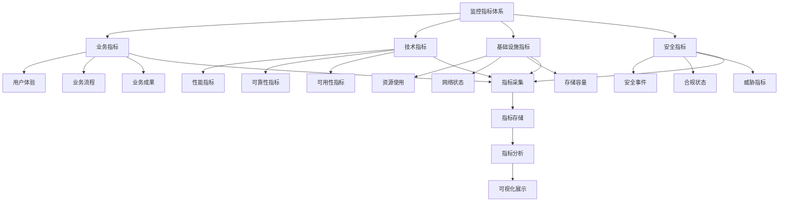
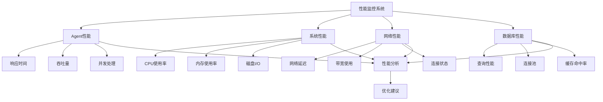
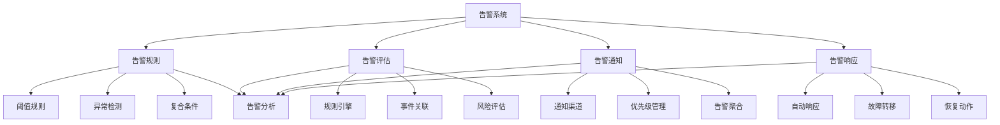
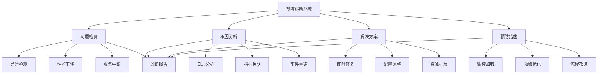
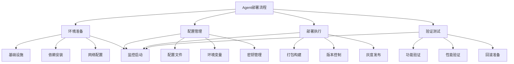

# 第20章：监控和运维

> **本章学习目标**
> - 理解监控指标设计和采集
> - 掌握性能监控和资源监控
> - 学习告警系统和通知机制
> - 理解故障排查和诊断
> - 掌握部署和运维最佳实践

---

## 20.1 监控指标设计

### 20.1.1 指标体系架构



### 20.1.2 指标定义和采集

```typescript
// 监控指标定义和采集系统
class MonitoringMetricsSystem {
  private metricDefinitions = new Map<string, MetricDefinition>();
  private metricCollectors = new Map<string, MetricCollector>();
  private metricStorage: MetricStorage;
  private metricAggregator: MetricAggregator;
  
  constructor() {
    this.metricStorage = new MetricStorage();
    this.metricAggregator = new MetricAggregator();
    this.initializeDefaultMetrics();
  }
  
  // 初始化默认指标
  private initializeDefaultMetrics(): void {
    // Agent性能指标
    this.defineMetric({
      id: 'agent.response_time',
      name: 'Agent Response Time',
      type: 'gauge',
      category: 'performance',
      unit: 'milliseconds',
      description: 'Time taken for agent to process requests',
      labels: ['agent_id', 'operation_type']
    });
  
    // Agent吞吐量指标
    this.defineMetric({
      id: 'agent.throughput',
      name: 'Agent Throughput',
      type: 'counter',
      category: 'performance',
      unit: 'requests/second',
      description: 'Number of requests processed per second',
      labels: ['agent_id', 'status']
    });
  
    // Agent错误率指标
    this.defineMetric({
      id: 'agent.error_rate',
      name: 'Agent Error Rate',
      type: 'gauge',
      category: 'reliability',
      unit: 'percentage',
      description: 'Percentage of failed agent operations',
      labels: ['agent_id', 'error_type']
    });
  
    // 系统资源指标
    this.defineMetric({
      id: 'system.memory_usage',
      name: 'Memory Usage',
      type: 'gauge',
      category: 'infrastructure',
      unit: 'bytes',
      description: 'Current memory usage',
      labels: ['component', 'type']
    });
  
    // CPU使用率指标
    this.defineMetric({
      id: 'system.cpu_usage',
      name: 'CPU Usage',
      type: 'gauge',
      category: 'infrastructure',
      unit: 'percentage',
      description: 'Current CPU usage percentage',
      labels: ['core', 'mode']
    });
  
    // 网络流量指标
    this.defineMetric({
      id: 'system.network_traffic',
      name: 'Network Traffic',
      type: 'counter',
      category: 'infrastructure',
      unit: 'bytes',
      description: 'Network traffic in bytes',
      labels: ['interface', 'direction']
    });
  
    // 业务指标
    this.defineMetric({
      id: 'business.user_satisfaction',
      name: 'User Satisfaction Score',
      type: 'gauge',
      category: 'business',
      unit: 'score',
      description: 'User satisfaction rating',
      labels: ['service', 'dimension']
    });
  
    // 安全指标
    this.defineMetric({
      id: 'security.threats_blocked',
      name: 'Threats Blocked',
      type: 'counter',
      category: 'security',
      unit: 'count',
      description: 'Number of security threats blocked',
      labels: ['threat_type', 'severity']
    });
  }
  
  // 定义指标
  defineMetric(definition: MetricDefinition): void {
    this.metricDefinitions.set(definition.id, definition);
  
    // 注册指标收集器
    this.registerCollector(definition.id, this.createCollector(definition));
  
    logger.info(`Metric defined: ${definition.id}`);
  }
  
  // 创建指标收集器
  private createCollector(definition: MetricDefinition): MetricCollector {
    return {
      id: `collector-${definition.id}`,
      metricId: definition.id,
      type: definition.type,
      collect: async (labels) => {
        return await this.collectMetric(definition, labels);
      },
      interval: this.getCollectionInterval(definition)
    };
  }
  
  // 采集指标
  async collectMetric(
    definition: MetricDefinition,
    labels: Record<string, string>
  ): Promise<MetricValue> {
    const timestamp = Date.now();
    let value: number;
  
    switch (definition.category) {
      case 'performance':
        value = await this.collectPerformanceMetric(definition, labels);
        break;
  
      case 'reliability':
        value = await this.collectReliabilityMetric(definition, labels);
        break;
  
      case 'infrastructure':
        value = await this.collectInfrastructureMetric(definition, labels);
        break;
  
      case 'business':
        value = await this.collectBusinessMetric(definition, labels);
        break;
  
      case 'security':
        value = await this.collectSecurityMetric(definition, labels);
        break;
  
      default:
        throw new Error(`Unknown metric category: ${definition.category}`);
    }
  
    return {
      metricId: definition.id,
      value,
      timestamp,
      labels,
      metadata: {
        unit: definition.unit,
        type: definition.type
      }
    };
  }
  
  // 采集性能指标
  private async collectPerformanceMetric(
    definition: MetricDefinition,
    labels: Record<string, string>
  ): Promise<number> {
    switch (definition.id) {
      case 'agent.response_time':
        return await this.collectResponseTime(labels);
  
      case 'agent.throughput':
        return await this.collectThroughput(labels);
  
      default:
        return 0;
    }
  }
  
  // 采集可靠性指标
  private async collectReliabilityMetric(
    definition: MetricDefinition,
    labels: Record<string, string>
  ): Promise<number> {
    switch (definition.id) {
      case 'agent.error_rate':
        return await this.collectErrorRate(labels);
  
      default:
        return 0;
    }
  }
  
  // 采集基础设施指标
  private async collectInfrastructureMetric(
    definition: MetricDefinition,
    labels: Record<string, string>
  ): Promise<number> {
    switch (definition.id) {
      case 'system.memory_usage':
        return await this.collectMemoryUsage(labels);
  
      case 'system.cpu_usage':
        return await this.collectCPUUsage(labels);
  
      case 'system.network_traffic':
        return await this.collectNetworkTraffic(labels);
  
      default:
        return 0;
    }
  }
  
  // 采集业务指标
  private async collectBusinessMetric(
    definition: MetricDefinition,
    labels: Record<string, string>
  ): Promise<number> {
    switch (definition.id) {
      case 'business.user_satisfaction':
        return await this.collectUserSatisfaction(labels);
  
      default:
        return 0;
    }
  }
  
  // 采集安全指标
  private async collectSecurityMetric(
    definition: MetricDefinition,
    labels: Record<string, string>
  ): Promise<number> {
    switch (definition.id) {
      case 'security.threats_blocked':
        return await this.collectThreatsBlocked(labels);
  
      default:
        return 0;
    }
  }
  
  // 具体指标采集方法
  private async collectResponseTime(labels: Record<string, string>): Promise<number> {
    // 实现响应时间采集逻辑
    return Math.random() * 1000;
  }
  
  private async collectThroughput(labels: Record<string, string>): Promise<number> {
    // 实现吞吐量采集逻辑
    return Math.floor(Math.random() * 100);
  }
  
  private async collectErrorRate(labels: Record<string, string>): Promise<number> {
    // 实现错误率采集逻辑
    return Math.random() * 0.1;
  }
  
  private async collectMemoryUsage(labels: Record<string, string>): Promise<number> {
    const memoryUsage = process.memoryUsage();
    return memoryUsage.heapUsed;
  }
  
  private async collectCPUUsage(labels: Record<string, string>): Promise<number> {
    const cpuUsage = process.cpuUsage();
    return (cpuUsage.user + cpuUsage.system) / 1000000; // 转换为百分比
  }
  
  private async collectNetworkTraffic(labels: Record<string, string>): Promise<number> {
    // 实现网络流量采集逻辑
    return Math.floor(Math.random() * 1000000);
  }
  
  private async collectUserSatisfaction(labels: Record<string, string>): Promise<number> {
    // 实现用户满意度采集逻辑
    return 3 + Math.random() * 2; // 3-5分
  }
  
  private async collectThreatsBlocked(labels: Record<string, string>): Promise<number> {
    // 实现威胁拦截统计逻辑
    return Math.floor(Math.random() * 10);
  }
  
  // 注册收集器
  registerCollector(collector: MetricCollector): void {
    this.metricCollectors.set(collector.id, collector);
  
    // 启动定期采集
    if (collector.interval > 0) {
      this.startCollection(collector);
    }
  }
  
  // 启动指标采集
  private startCollection(collector: MetricCollector): void {
    setInterval(async () => {
      try {
        const value = await collector.collect({});
        await this.recordMetric(value);
      } catch (error) {
        logger.error(`Metric collection error for ${collector.metricId}:`, error);
      }
    }, collector.interval);
  }
  
  // 记录指标
  async recordMetric(metric: MetricValue): Promise<void> {
    await this.metricStorage.store(metric);
  }
  
  // 查询指标
  async queryMetrics(query: MetricsQuery): Promise<MetricsQueryResult> {
    return this.metricStorage.query(query);
  }
  
  // 聚合指标
  async aggregateMetrics(metricId: string, aggregation: AggregationSpec): Promise<AggregatedMetrics> {
    return this.metricAggregator.aggregate(metricId, aggregation);
  }
  
  // 获取采集间隔
  private getCollectionInterval(definition: MetricDefinition): number {
    const intervals: Record<string, number> = {
      'gauge': 60000,      // 1分钟
      'counter': 30000,    // 30秒
      'histogram': 60000,   // 1分钟
      'summary': 60000      // 1分钟
    };
  
    return intervals[definition.type] || 60000;
  }
}

// 指标存储
class MetricStorage {
  private metrics = new Map<string, MetricValue[]>();
  private indexes = new Map<string, Set<number>>();
  
  // 存储指标
  async store(metric: MetricValue): Promise<void> {
    let metrics = this.metrics.get(metric.metricId);
    if (!metrics) {
      metrics = [];
      this.metrics.set(metric.metricId, metrics);
    }
  
    metrics.push(metric);
  
    // 限制存储大小
    if (metrics.length > 10000) {
      this.removeOldest(metric.metricId);
    }
  
    // 更新索引
    this.updateIndexes(metric);
  }
  
  // 批量存储
  async storeBatch(metrics: MetricValue[]): Promise<void> {
    for (const metric of metrics) {
      await this.store(metric);
    }
  }
  
  // 查询指标
  async query(query: MetricsQuery): Promise<MetricsQueryResult> {
    let results = this.metrics.get(query.metricId) || [];
  
    // 应用时间范围过滤
    if (query.timeRange) {
      results = results.filter(metric => {
        const time = metric.timestamp;
        return time >= query.timeRange!.start.getTime() && 
               time <= query.timeRange!.end.getTime();
      });
    }
  
    // 应用标签过滤
    if (query.labelFilters) {
      results = results.filter(metric => {
        return this.matchesLabels(metric.labels || {}, query.labelFilters!);
      });
    }
  
    // 应用聚合
    if (query.aggregation) {
      results = this.applyAggregation(results, query.aggregation);
    }
  
    return {
      metricId: query.metricId,
      results,
      total: results.length,
      query
    };
  }
  
  // 匹配标签
  private matchesLabels(labels: Record<string, string>, filters: Record<string, string>): boolean {
    for (const [key, value] of Object.entries(filters)) {
      if (labels[key] !== value) {
        return false;
      }
    }
    return true;
  }
  
  // 应用聚合
  private applyAggregation(metrics: MetricValue[], aggregation: AggregationSpec): MetricValue[] {
    switch (aggregation.function) {
      case 'avg':
        return [{
          ...metrics[0],
          value: metrics.reduce((sum, m) => sum + m.value, 0) / metrics.length
        }];
  
      case 'sum':
        return [{
          ...metrics[0],
          value: metrics.reduce((sum, m) => sum + m.value, 0)
        }];
  
      case 'min':
        return [{
          ...metrics[0],
          value: Math.min(...metrics.map(m => m.value))
        }];
  
      case 'max':
        return [{
          ...metrics[0],
          value: Math.max(...metrics.map(m => m.value))
        }];
  
      default:
        return metrics;
    }
  }
  
  // 更新索引
  private updateIndexes(metric: MetricValue): void {
    const indexKey = `${metric.metricId}:${metric.timestamp}`;
    let index = this.indexes.get(indexKey);
    if (!index) {
      index = new Set();
      this.indexes.set(indexKey, index);
    }
    index.add(metric.metricId);
  }
  
  // 移除最旧的指标
  private removeOldest(metricId: string): void {
    const metrics = this.metrics.get(metricId);
    if (metrics && metrics.length > 0) {
      metrics.shift();
    }
  }
}

// 指标聚合器
class MetricAggregator {
  async aggregate(metricId: string, spec: AggregationSpec): Promise<AggregatedMetrics> {
    // 实现指标聚合逻辑
    return {
      metricId,
      aggregation: spec,
      results: []
    };
  }
}

// 相关接口定义
interface MetricDefinition {
  id: string;
  name: string;
  type: 'gauge' | 'counter' | 'histogram' | 'summary';
  category: 'performance' | 'reliability' | 'infrastructure' | 'business' | 'security';
  unit: string;
  description: string;
  labels: string[];
  aggregation?: AggregationSpec;
}

interface MetricCollector {
  id: string;
  metricId: string;
  type: string;
  collect: (labels: Record<string, string>) => Promise<number>;
  interval: number;
}

interface MetricValue {
  metricId: string;
  value: number;
  timestamp: number;
  labels: Record<string, string>;
  metadata?: {
    unit: string;
    type: string;
  };
}

interface MetricsQuery {
  metricId: string;
  timeRange?: {
    start: Date;
    end: Date;
  };
  labelFilters?: Record<string, string>;
  aggregation?: AggregationSpec;
  limit?: number;
}

interface MetricsQueryResult {
  metricId: string;
  results: MetricValue[];
  total: number;
  query: MetricsQuery;
}

interface AggregationSpec {
  function: 'avg' | 'sum' | 'min' | 'max' | 'count';
  interval?: number;
  window?: number;
}

interface AggregatedMetrics {
  metricId: string;
  aggregation: AggregationSpec;
  results: MetricValue[];
}
```

---

## 20.2 性能监控和资源监控

### 20.2.1 性能监控系统



### 20.2.2 性能监控实现

```typescript
// 性能监控系统实现
class PerformanceMonitoringSystem {
  private agentMonitors = new Map<string, AgentMonitor>();
  private systemMonitors = new Map<string, SystemMonitor>();
  private performanceAnalyzers = new Map<string, PerformanceAnalyzer>();
  private alertThresholds = new Map<string, PerformanceAlertThreshold>();
  
  // 监控Agent性能
  async monitorAgentPerformance(agentId: string): Promise<AgentPerformanceReport> {
    let monitor = this.agentMonitors.get(agentId);
    
    if (!monitor) {
      monitor = new AgentMonitor(agentId);
      this.agentMonitors.set(agentId, monitor);
    }
  
    const metrics = await monitor.collectMetrics();
    const analysis = await this.analyzeAgentPerformance(agentId, metrics);
    const alerts = this.checkPerformanceThresholds(agentId, metrics);
  
    return {
      agentId,
      timestamp: new Date(),
      metrics,
      analysis,
      alerts,
      recommendations: this.generatePerformanceRecommendations(analysis, alerts)
    };
  }
  
  // 监控系统性能
  async monitorSystemPerformance(): Promise<SystemPerformanceReport> {
    const metrics = await this.collectSystemMetrics();
    const analysis = await this.analyzeSystemPerformance(metrics);
    const alerts = this.checkSystemThresholds(metrics);
  
    return {
      timestamp: new Date(),
      metrics,
      analysis,
      alerts,
      recommendations: this.generateSystemRecommendations(analysis, alerts)
    };
  }
  
  // 分析Agent性能
  private async analyzeAgentPerformance(
    agentId: string,
    metrics: AgentMetrics
  ): Promise<PerformanceAnalysis> {
    const analyzer = this.performanceAnalyzers.get(agentId);
  
    if (!analyzer) {
      // 创建默认分析器
      const newAnalyzer = new PerformanceAnalyzer();
      this.performanceAnalyzers.set(agentId, newAnalyzer);
      return newAnalyzer.analyze(metrics);
    }
  
    return analyzer.analyze(metrics);
  }
  
  // 分析系统性能
  private async analyzeSystemPerformance(metrics: SystemMetrics): Promise<SystemPerformanceAnalysis> {
    const analysis: SystemPerformanceAnalysis = {
      cpu: {
        usage: metrics.cpu.usage,
        trend: this.calculateTrend(metrics.cpu.history),
        load: this.calculateCPULoad(metrics.cpu)
      },
      memory: {
        usage: metrics.memory.usage,
        trend: this.calculateTrend(metrics.memory.history),
        pressure: this.calculateMemoryPressure(metrics.memory)
      },
      disk: {
        usage: metrics.disk.usage,
        io: metrics.disk.io,
        wait: metrics.disk.wait
      },
      network: {
        bandwidth: metrics.network.bandwidth,
        latency: metrics.network.latency,
        errors: metrics.network.errors
      },
      overall: {
        health: this.calculateOverallHealth(metrics),
        bottlenecks: this.identifyBottlenecks(metrics)
      }
    };
  
    return analysis;
  }
  
  // 收集系统指标
  private async collectSystemMetrics(): Promise<SystemMetrics> {
    const cpuUsage = process.cpuUsage();
    const memoryUsage = process.memoryUsage();
  
    return {
      cpu: {
        usage: (cpuUsage.user + cpuUsage.system) / 1000000,
        cores: require('os').cpus().length,
        history: [] // 简化实现
      },
      memory: {
        usage: memoryUsage.heapUsed,
        total: memoryUsage.heapTotal,
        external: memoryUsage.external,
        history: [] // 简化实现
      },
      disk: {
        usage: 0.5, // 简化实现
        io: 100, // MB/s
        wait: 10 // ms
      },
      network: {
        bandwidth: 1000, // Mbps
        latency: 50, // ms
        errors: 0
      }
    };
  }
  
  // 检查性能阈值
  private checkPerformanceThresholds(agentId: string, metrics: AgentMetrics): PerformanceAlert[] {
    const alerts: PerformanceAlert[] = [];
    const thresholds = this.alertThresholds.get(agentId);
  
    if (!thresholds) {
      return alerts;
    }
  
    // 检查响应时间
    if (metrics.responseTime > thresholds.maxResponseTime) {
      alerts.push({
        type: 'response-time',
        severity: 'high',
        message: `Response time ${metrics.responseTime}ms exceeds threshold ${thresholds.maxResponseTime}ms`,
        current: metrics.responseTime,
        threshold: thresholds.maxResponseTime
      });
    }
  
    // 检查错误率
    if (metrics.errorRate > thresholds.maxErrorRate) {
      alerts.push({
        type: 'error-rate',
        severity: 'critical',
        message: `Error rate ${metrics.errorRate} exceeds threshold ${thresholds.maxErrorRate}`,
        current: metrics.errorRate,
        threshold: thresholds.maxErrorRate
      });
    }
  
    // 检查资源使用
    if (metrics.memoryUsage > thresholds.maxMemoryUsage) {
      alerts.push({
        type: 'memory-usage',
        severity: 'medium',
        message: `Memory usage ${metrics.memoryUsage}MB exceeds threshold ${thresholds.maxMemoryUsage}MB`,
        current: metrics.memoryUsage,
        threshold: thresholds.maxMemoryUsage
      });
    }
  
    return alerts;
  }
  
  // 检查系统阈值
  private checkSystemThresholds(metrics: SystemMetrics): SystemAlert[] {
    const alerts: SystemAlert[] = [];
  
    // CPU使用率检查
    if (metrics.cpu.usage > 0.8) {
      alerts.push({
        type: 'cpu',
        severity: 'high',
        message: `CPU usage ${metrics.cpu.usage} exceeds 80%`,
        current: metrics.cpu.usage
      });
    }
  
    // 内存使用率检查
    if (metrics.memory.usage / metrics.memory.total > 0.85) {
      alerts.push({
        type: 'memory',
        severity: 'high',
        message: `Memory usage ${(metrics.memory.usage / metrics.memory.total * 100).toFixed(1)}% exceeds 85%`,
        current: metrics.memory.usage / metrics.memory.total
      });
    }
  
    return alerts;
  }
  
  // 生成性能建议
  private generatePerformanceRecommendations(
    analysis: PerformanceAnalysis,
    alerts: PerformanceAlert[]
  ): string[] {
    const recommendations: string[] = [];
  
    // 基于分析结果的建议
    if (analysis.responseTime.trend === 'increasing') {
      recommendations.push('Response time is increasing. Consider optimizing code or adding resources.');
    }
  
    if (analysis.throughput.trend === 'decreasing') {
      recommendations.push('Throughput is decreasing. Investigate bottlenecks and optimize performance.');
    }
  
    if (analysis.resourceUsage.cpu > 0.7) {
      recommendations.push('High CPU usage detected. Consider optimizing algorithms or scaling horizontally.');
    }
  
    // 基于告警的建议
    for (const alert of alerts) {
      switch (alert.type) {
        case 'response-time':
          recommendations.push('Optimize code execution, implement caching, or scale resources.');
          break;
  
        case 'error-rate':
          recommendations.push('Improve error handling, implement retry mechanisms, and investigate root causes.');
          break;
  
        case 'memory-usage':
          recommendations.push('Optimize memory usage, implement memory leak detection, and add memory limits.');
          break;
      }
    }
  
    return recommendations;
  }
  
  // 生成系统建议
  private generateSystemRecommendations(
    analysis: SystemPerformanceAnalysis,
    alerts: SystemAlert[]
  ): string[] {
    const recommendations: string[] = [];
  
    if (analysis.cpu.usage > 0.8) {
      recommendations.push('CPU usage is high. Consider optimizing CPU-intensive operations or scaling vertically.');
    }
  
    if (analysis.memory.pressure === 'high') {
      recommendations.push('Memory pressure is high. Consider optimizing memory usage or adding more memory.');
    }
  
    if (analysis.disk.io > 80) {
      recommendations.push('Disk I/O is high. Consider using faster storage or optimizing disk operations.');
    }
  
    if (analysis.network.latency > 100) {
      recommendations.push('Network latency is high. Investigate network connectivity and optimize network operations.');
    }
  
    return recommendations;
  }
  
  // 计算趋势
  private calculateTrend(history: number[]): 'increasing' | 'decreasing' | 'stable' {
    if (history.length < 3) return 'stable';
  
    const recent = history.slice(-3);
    const older = history.slice(0, Math.min(3, history.length));
  
    const recentAvg = recent.reduce((sum, val) => sum + val, 0) / recent.length;
    const olderAvg = older.reduce((sum, val) => sum + val, 0) / older.length;
  
    const change = (recentAvg - olderAvg) / olderAvg;
  
    if (change > 0.1) return 'increasing';
    if (change < -0.1) return 'decreasing';
    return 'stable';
  }
  
  // 计算CPU负载
  private calculateCPULoad(cpu: CPUMetrics): number {
    return cpu.usage * cpu.cores;
  }
  
  // 计算内存压力
  private calculateMemoryPressure(memory: MemoryMetrics): 'low' | 'medium' | 'high' {
    const usageRatio = memory.usage / memory.total;
  
    if (usageRatio > 0.85) return 'high';
    if (usageRatio > 0.7) return 'medium';
    return 'low';
  }
  
  // 计算整体健康度
  private calculateOverallHealth(metrics: SystemMetrics): number {
    let health = 100;
  
    // CPU健康度
    if (metrics.cpu.usage > 0.8) {
      health -= (metrics.cpu.usage - 0.8) * 50;
    }
  
    // 内存健康度
    const memUsageRatio = metrics.memory.usage / metrics.memory.total;
    if (memUsageRatio > 0.85) {
      health -= (memUsageRatio - 0.85) * 50;
    }
  
    // 磁盘健康度
    if (metrics.disk.io > 80) {
      health -= (metrics.disk.io - 80) / 4;
    }
  
    return Math.max(0, Math.min(100, health));
  }
  
  // 识别瓶颈
  private identifyBottlenecks(metrics: SystemMetrics): Bottleneck[] {
    const bottlenecks: Bottleneck[] = [];
  
    if (metrics.cpu.usage > 0.7) {
      bottlenecks.push({
        type: 'cpu',
        severity: metrics.cpu.usage > 0.85 ? 'high' : 'medium',
        description: 'CPU usage is high',
        impact: 'performance',
        recommendation: 'Optimize CPU operations or add more CPU resources'
      });
    }
  
    if (metrics.memory.usage / metrics.memory.total > 0.8) {
      bottlenecks.push({
        type: 'memory',
        severity: 'high',
        description: 'Memory usage is high',
        impact: 'performance',
        recommendation: 'Optimize memory usage or add more memory'
      });
    }
  
    if (metrics.disk.io > 70) {
      bottlenecks.push({
        type: 'disk',
        severity: 'medium',
        description: 'Disk I/O is high',
        impact: 'performance',
        recommendation: 'Optimize disk operations or use faster storage'
      });
    }
  
    return bottlenecks;
  }
  
  // 设置性能阈值
  setPerformanceThresholds(agentId: string, thresholds: PerformanceAlertThreshold): void {
    this.alertThresholds.set(agentId, thresholds);
  }
}

// Agent监控器
class AgentMonitor {
  private metrics = new Map<string, MetricValue[]>();
  
  constructor(private agentId: string) {}
  
  async collectMetrics(): Promise<AgentMetrics> {
    // 收集Agent指标
    return {
      agentId: this.agentId,
      responseTime: await this.collectResponseTime(),
      throughput: await this.collectThroughput(),
      errorRate: await this.collectErrorRate(),
      memoryUsage: await this.collectMemoryUsage(),
      cpuUsage: await this.collectCPUUsage(),
      activeConnections: await this.collectActiveConnections(),
      queueDepth: await this.collectQueueDepth()
    };
  }
  
  private async collectResponseTime(): Promise<number> {
    // 实现响应时间采集
    return Math.random() * 1000;
  }
  
  private async collectThroughput(): Promise<number> {
    // 实现吞吐量采集
    return Math.floor(Math.random() * 100);
  }
  
  private async collectErrorRate(): Promise<number> {
    // 实现错误率采集
    return Math.random() * 0.1;
  }
  
  private async collectMemoryUsage(): Promise<number> {
    // 实现内存使用采集
    return Math.random() * 100 * 1024 * 1024;
  }
  
  private async collectCPUUsage(): Promise<number> {
    // 实现CPU使用率采集
    return Math.random() * 100;
  }
  
  private async collectActiveConnections(): Promise<number> {
    // 实现活动连接数采集
    return Math.floor(Math.random() * 50);
  }
  
  private async collectQueueDepth(): Promise<number> {
    // 实现队列深度采集
    return Math.floor(Math.random() * 20);
  }
}

// 性能分析器
class PerformanceAnalyzer {
  analyze(metrics: AgentMetrics): PerformanceAnalysis {
    return {
      responseTime: {
        current: metrics.responseTime,
        trend: 'stable',
        average: metrics.responseTime * 0.9,
        percentile95: metrics.responseTime * 1.2,
        percentile99: metrics.responseTime * 1.5
      },
      throughput: {
        current: metrics.throughput,
        trend: 'stable',
        average: metrics.throughput * 1.1,
        peak: metrics.throughput * 1.5
      },
      errorRate: {
        current: metrics.errorRate,
        trend: 'stable',
        average: metrics.errorRate * 0.9
      },
      resourceUsage: {
        cpu: metrics.cpuUsage,
        memory: metrics.memoryUsage / (1024 * 1024 * 1024), // 转换为GB
        connections: metrics.activeConnections
      },
      bottlenecks: this.identifyBottlenecks(metrics),
      recommendations: this.generateRecommendations(metrics)
    };
  }
  
  private identifyBottlenecks(metrics: AgentMetrics): Bottleneck[] {
    const bottlenecks: Bottleneck[] = [];
  
    if (metrics.responseTime > 1000) {
      bottlenecks.push({
        type: 'response-time',
        severity: 'high',
        description: 'Slow response time detected',
        impact: 'user-experience',
        recommendation: 'Optimize code execution or implement caching'
      });
    }
  
    if (metrics.cpuUsage > 70) {
      bottlenecks.push({
        type: 'cpu',
        severity: 'medium',
        description: 'High CPU usage detected',
        impact: 'performance',
        recommendation: 'Optimize CPU operations or scale horizontally'
      });
    }
  
    return bottlenecks;
  }
  
  private generateRecommendations(metrics: AgentMetrics): string[] {
    const recommendations: string[] = [];
  
    if (metrics.errorRate > 0.05) {
      recommendations.push('Error rate is above 5%. Implement better error handling and monitoring.');
    }
  
    if (metrics.memoryUsage > 500 * 1024 * 1024) {
      recommendations.push('Memory usage is above 500MB. Consider memory optimization.');
    }
  
    if (metrics.queueDepth > 15) {
      recommendations.push('Queue depth is high. Consider scaling or optimizing processing speed.');
    }
  
    return recommendations;
  }
}

// 相关接口定义
interface AgentMetrics {
  agentId: string;
  responseTime: number;
  throughput: number;
  errorRate: number;
  memoryUsage: number;
  cpuUsage: number;
  activeConnections: number;
  queueDepth: number;
}

interface SystemMetrics {
  cpu: CPUMetrics;
  memory: MemoryMetrics;
  disk: DiskMetrics;
  network: NetworkMetrics;
}

interface CPUMetrics {
  usage: number;
  cores: number;
  history: number[];
}

interface MemoryMetrics {
  usage: number;
  total: number;
  external: number;
  history: number[];
}

interface DiskMetrics {
  usage: number;
  io: number;
  wait: number;
}

interface NetworkMetrics {
  bandwidth: number;
  latency: number;
  errors: number;
}

interface PerformanceAnalysis {
  responseTime: MetricAnalysis;
  throughput: MetricAnalysis;
  errorRate: MetricAnalysis;
  resourceUsage: ResourceUsage;
  bottlenecks: Bottleneck[];
  recommendations: string[];
}

interface MetricAnalysis {
  current: number;
  trend: 'increasing' | 'decreasing' | 'stable';
  average: number;
  percentile95?: number;
  percentile99?: number;
  peak?: number;
}

interface ResourceUsage {
  cpu: number;
  memory: number;
  connections: number;
}

interface SystemPerformanceAnalysis {
  cpu: {
    usage: number;
    trend: 'increasing' | 'decreasing' | 'stable';
    load: number;
  };
  memory: {
    usage: number;
    trend: 'increasing' | 'decreasing' | 'stable';
    pressure: 'low' | 'medium' | 'high';
  };
  disk: {
    usage: number;
    io: number;
    wait: number;
  };
  network: {
    bandwidth: number;
    latency: number;
    errors: number;
  };
  overall: {
    health: number;
    bottlenecks: Bottleneck[];
  };
}

interface AgentPerformanceReport {
  agentId: string;
  timestamp: Date;
  metrics: AgentMetrics;
  analysis: PerformanceAnalysis;
  alerts: PerformanceAlert[];
  recommendations: string[];
}

interface SystemPerformanceReport {
  timestamp: Date;
  metrics: SystemMetrics;
  analysis: SystemPerformanceAnalysis;
  alerts: SystemAlert[];
  recommendations: string[];
}

interface PerformanceAlert {
  type: string;
  severity: 'low' | 'medium' | 'high' | 'critical';
  message: string;
  current: number;
  threshold: number;
}

interface SystemAlert {
  type: string;
  severity: 'low' | 'medium' | 'high' | 'critical';
  message: string;
  current: number;
}

interface PerformanceAlertThreshold {
  maxResponseTime: number;
  maxErrorRate: number;
  maxMemoryUsage: number;
  maxCPUUsage: number;
}

interface Bottleneck {
  type: string;
  severity: 'low' | 'medium' | 'high';
  description: string;
  impact: string;
  recommendation: string;
}
```

---

## 20.3 告警系统和通知机制

### 20.3.1 告警系统架构



### 20.3.2 告警系统实现

```typescript
// 告警和通知系统
class AlertNotificationSystem {
  private alertRules = new Map<string, AlertRule>();
  private alertChannels = new Map<string, AlertChannel>();
  private alertHistory = new Map<string, AlertHistory>();
  private alertEscalations = new Map<string, EscalationPolicy>();
  private autoResponses = new Map<string, AutoResponse>();
  
  // 创建告警规则
  createAlertRule(rule: AlertRule): void {
    this.validateRule(rule);
    this.alertRules.set(rule.id, rule);
    logger.info(`Alert rule created: ${rule.id}`);
  }
  
  // 评估告警条件
  async evaluateAlerts(metrics: MonitoringData): Promise<AlertEvaluation[]> {
    const evaluations: AlertEvaluation[] = [];
  
    for (const rule of this.alertRules.values()) {
      if (rule.enabled) {
        const evaluation = await this.evaluateRule(rule, metrics);
        evaluations.push(evaluation);
  
        // 如果满足条件，触发告警
        if (evaluation.triggered) {
          await this.triggerAlert(rule, evaluation);
        }
      }
    }
  
    return evaluations;
  }
  
  // 评估单个规则
  private async evaluateRule(rule: AlertRule, metrics: MonitoringData): Promise<AlertEvaluation> {
    const conditions = rule.conditions;
    const results: ConditionResult[] = [];
  
    for (const condition of conditions) {
      const result = await this.evaluateCondition(condition, metrics);
      results.push(result);
    }
  
    // 检查是否所有条件都满足
    const allMatched = results.every(r => r.matched);
  
    // 计算严重程度
    const severity = this.calculateSeverity(rule, results);
  
    return {
      ruleId: rule.id,
      triggered: allMatched,
      severity,
      conditionResults: results,
      timestamp: new Date()
    };
  }
  
  // 评估条件
  private async evaluateCondition(
    condition: AlertCondition,
    metrics: MonitoringData
  ): Promise<ConditionResult> {
    const metricValue = this.getMetricValue(metrics, condition.metric);
  
    let matched = false;
  
    switch (condition.operator) {
      case 'gt':
        matched = metricValue > condition.value;
        break;
  
      case 'lt':
        matched = metricValue < condition.value;
        break;
  
      case 'eq':
        matched = metricValue === condition.value;
        break;
  
      case 'ne':
        matched = metricValue !== condition.value;
        break;
  
      case 'gte':
        matched = metricValue >= condition.value;
        break;
  
      case 'lte':
        matched = metricValue <= condition.value;
        break;
  
      case 'contains':
        matched = String(metricValue).includes(String(condition.value));
        break;
  
      case 'regex':
        matched = new RegExp(condition.value).test(String(metricValue));
        break;
  
      default:
        throw new Error(`Unknown operator: ${condition.operator}`);
    }
  
    return {
      conditionId: condition.id,
      matched,
      metricValue,
      expected: condition.value,
      operator: condition.operator
    };
  }
  
  // 触发告警
  async triggerAlert(rule: AlertRule, evaluation: AlertEvaluation): Promise<void> {
    // 检查告警抑制
    if (await this.isAlertSuppressed(rule, evaluation)) {
      logger.info(`Alert suppressed: ${rule.id}`);
      return;
    }
  
    // 检查告警频率限制
    if (!await this.checkRateLimit(rule)) {
      logger.warn(`Alert rate limit exceeded: ${rule.id}`);
      return;
    }
  
    // 创建告警
    const alert: Alert = {
      id: this.generateAlertId(),
      ruleId: rule.id,
      severity: evaluation.severity,
      status: 'firing',
      triggeredAt: evaluation.timestamp,
      resolvedAt: null,
      conditionResults: evaluation.conditionResults,
      labels: rule.labels || {}
    };
  
    // 记录告警历史
    this.recordAlertHistory(alert);
  
    // 执行自动响应
    await this.executeAutoResponses(rule, alert);
  
    // 发送通知
    await this.sendNotifications(rule, alert);
  
    // 设置升级策略
    if (rule.escalationPolicyId) {
      await this.setupEscalation(rule, alert);
    }
  
    logger.warn(`Alert triggered: ${rule.id} (${evaluation.severity})`);
  }
  
  // 检查告警抑制
  private async isAlertSuppressed(rule: AlertRule, evaluation: AlertEvaluation): Promise<boolean> {
    // 检查抑制条件
    if (!rule.suppressionRules) return false;
  
    for (const suppressionRule of rule.suppressionRules) {
      if (await this.evaluateSuppressionRule(suppressionRule, evaluation)) {
        return true;
      }
    }
  
    return false;
  }
  
  // 检查频率限制
  private async checkRateLimit(rule: AlertRule): Promise<boolean> {
    if (!rule.rateLimit) return true;
  
    const history = this.alertHistory.get(rule.id);
    if (!history) return true;
  
    const now = Date.now();
    const recentAlerts = history.alerts.filter(
      alert => now - alert.triggeredAt.getTime() < rule.rateLimit!.window
    );
  
    return recentAlerts.length < rule.rateLimit!.maxAlerts;
  }
  
  // 发送通知
  async sendNotifications(rule: AlertRule, alert: Alert): Promise<void> {
    const channels = this.getNotificationChannels(rule);
  
    for (const channel of channels) {
      try {
        await channel.send(alert);
      } catch (error) {
        logger.error(`Failed to send alert via ${channel.id}:`, error);
      }
    }
  }
  
  // 获取通知渠道
  private getNotificationChannels(rule: AlertRule): AlertChannel[] {
    const channels: AlertChannel[] = [];
  
    for (const channelId of rule.notificationChannels || []) {
      const channel = this.alertChannels.get(channelId);
      if (channel) {
        channels.push(channel);
      }
    }
  
    return channels;
  }
  
  // 执行自动响应
  async executeAutoResponses(rule: AlertRule, alert: Alert): Promise<void> {
    for (const responseId of rule.autoResponseIds || []) {
      const response = this.autoResponses.get(responseId);
  
      if (response && response.enabled) {
        try {
          await response.execute(alert);
          logger.info(`Auto-response executed: ${responseId}`);
        } catch (error) {
          logger.error(`Auto-response failed: ${responseId}`, error);
        }
      }
    }
  }
  
  // 设置升级策略
  private async setupEscalation(rule: AlertRule, alert: Alert): Promise<void> {
    const policy = this.alertEscalations.get(rule.escalationPolicyId);
  
    if (!policy) return;
  
    // 设置升级定时器
    const escalationTimeout = policy.escalationTimeout || 300000; // 5分钟
  
    setTimeout(async () => {
      if (alert.status === 'firing') {
        await this.escalateAlert(policy, alert);
      }
    }, escalationTimeout);
  }
  
  // 升级告警
  private async escalateAlert(policy: EscalationPolicy, alert: Alert): Promise<void> {
    // 提高严重程度
    const escalatedSeverity = this.escalateSeverity(alert.severity);
    alert.severity = escalatedSeverity;
  
    // 发送升级通知
    const escalationChannels = policy.escalationChannels || [];
    for (const channelId of escalationChannels) {
      const channel = this.alertChannels.get(channelId);
      if (channel) {
        const escalatedAlert: Alert = {
          ...alert,
          id: this.generateAlertId(),
          severity: escalatedSeverity,
          escalatedFrom: alert.id,
          escalatedAt: new Date()
        };
  
        try {
          await channel.send(escalatedAlert);
        } catch (error) {
          logger.error(`Failed to send escalated alert:`, error);
        }
      }
    }
  
    logger.warn(`Alert escalated: ${alert.id} to ${escalatedSeverity}`);
  }
  
  // 解析告警
  async resolveAlert(alertId: string, reason: string): Promise<void> {
    // 更新告警状态
    const histories = Array.from(this.alertHistory.values());
  
    for (const history of histories) {
      const alert = history.alerts.find(a => a.id === alertId);
      if (alert && alert.status === 'firing') {
        alert.status = 'resolved';
        alert.resolvedAt = new Date();
        alert.resolutionReason = reason;
  
        // 发送解决通知
        await this.sendResolutionNotification(alert);
  
        logger.info(`Alert resolved: ${alertId}`);
        break;
      }
    }
  }
  
  // 发送解决通知
  private async sendResolutionNotification(alert: Alert): Promise<void> {
    const resolutionChannels = this.alertChannels.get('resolution');
  
    if (resolutionChannels) {
      await resolutionChannels.send({
        ...alert,
        status: 'resolved'
      } as Alert);
    }
  }
  
  // 记录告警历史
  private recordAlertHistory(alert: Alert): void {
    let history = this.alertHistory.get(alert.ruleId);
  
    if (!history) {
      history = {
        ruleId: alert.ruleId,
        alerts: [],
        totalAlerts: 0,
        lastAlert: alert
      };
      this.alertHistory.set(alert.ruleId, history);
    }
  
    history.alerts.push(alert);
    history.totalAlerts++;
    history.lastAlert = alert;
  
    // 限制历史大小
    if (history.alerts.length > 100) {
      history.alerts.shift();
    }
  }
  
  // 获取告警统计
  getAlertStatistics(ruleId?: string): AlertStatistics {
    if (ruleId) {
      const history = this.alertHistory.get(ruleId);
      return {
        ruleId,
        totalAlerts: history?.totalAlerts || 0,
        activeAlerts: history?.alerts.filter(a => a.status === 'firing').length || 0,
        resolvedAlerts: history?.alerts.filter(a => a.status === 'resolved').length || 0,
        lastAlert: history?.lastAlert
      };
    }
  
    // 返回全局统计
    const allHistories = Array.from(this.alertHistory.values());
    return {
      totalRules: this.alertRules.size,
      totalAlerts: allHistories.reduce((sum, h) => sum + h.totalAlerts, 0),
      activeAlerts: allHistories.reduce((sum, h) => sum + h.alerts.filter(a => a.status === 'firing').length, 0),
      resolvedAlerts: allHistories.reduce((sum, h) => sum + h.alerts.filter(a => a.status === 'resolved').length, 0)
    };
  }
  
  // 辅助方法
  private validateRule(rule: AlertRule): void {
    if (!rule.id || !rule.name) {
      throw new Error('Rule must have id and name');
    }
  
    if (!rule.conditions || rule.conditions.length === 0) {
      throw new Error('Rule must have at least one condition');
    }
  }
  
  private getMetricValue(metrics: MonitoringData, metricName: string): number {
    const parts = metricName.split('.');
    let value: any = metrics;
  
    for (const part of parts) {
      if (value && typeof value === 'object') {
        value = value[part];
      } else {
        return 0;
      }
    }
  
    return typeof value === 'number' ? value : 0;
  }
  
  private calculateSeverity(rule: AlertRule, results: ConditionResult[]): AlertSeverity {
    if (rule.severity) {
      return rule.severity;
    }
  
    // 基于条件结果计算严重程度
    const highSeverityCount = results.filter(r => r.matched && r.highImpact).length;
  
    if (highSeverityCount >= 3) return 'critical';
    if (highSeverityCount >= 2) return 'high';
    if (highSeverityCount >= 1) return 'medium';
    return 'low';
  }
  
  private escalateSeverity(current: AlertSeverity): AlertSeverity {
    const escalationMap: Record<AlertSeverity, AlertSeverity> = {
      'info': 'warning',
      'warning': 'minor',
      'minor': 'major',
      'major': 'critical',
      'critical': 'critical' // 已经是最高级别
    };
  
    return escalationMap[current] || current;
  }
  
  private generateAlertId(): string {
    return `alert-${Date.now()}-${Math.random().toString(36).slice(2, 11)}`;
  }
}

// 相关接口定义
interface AlertRule {
  id: string;
  name: string;
  description: string;
  enabled: boolean;
  severity: AlertSeverity;
  conditions: AlertCondition[];
  notificationChannels: string[];
  suppressionRules?: SuppressionRule[];
  rateLimit?: {
    window: number;
    maxAlerts: number;
  };
  autoResponseIds?: string[];
  escalationPolicyId?: string;
  labels?: Record<string, string>;
}

interface AlertCondition {
  id: string;
  metric: string;
  operator: 'gt' | 'lt' | 'eq' | 'ne' | 'gte' | 'lte' | 'contains' | 'regex';
  value: any;
  highImpact?: boolean;
}

interface MonitoringData {
  [key: string]: any;
}

interface AlertEvaluation {
  ruleId: string;
  triggered: boolean;
  severity: AlertSeverity;
  conditionResults: ConditionResult[];
  timestamp: Date;
}

interface ConditionResult {
  conditionId: string;
  matched: boolean;
  metricValue: number;
  expected: any;
  operator: string;
}

type AlertSeverity = 'info' | 'warning' | 'minor' | 'major' | 'critical';

interface Alert {
  id: string;
  ruleId: string;
  severity: AlertSeverity;
  status: 'firing' | 'resolved';
  triggeredAt: Date;
  resolvedAt?: Date;
  conditionResults: ConditionResult[];
  labels: Record<string, string>;
  escalatedFrom?: string;
  escalatedAt?: Date;
  resolutionReason?: string;
}

interface AlertChannel {
  id: string;
  type: 'email' | 'sms' | 'webhook' | 'slack' | 'pagerduty';
  config: any;
  send: (alert: Alert) => Promise<void>;
}

interface EscalationPolicy {
  id: string;
  escalationTimeout: number;
  escalationChannels: string[];
  escalationMessage?: string;
}

interface AutoResponse {
  id: string;
  enabled: boolean;
  execute: (alert: Alert) => Promise<void>;
}

interface SuppressionRule {
  condition: string;
  duration: number;
  reason: string;
}

interface AlertHistory {
  ruleId: string;
  alerts: Alert[];
  totalAlerts: number;
  lastAlert: Alert;
}

interface AlertStatistics {
  ruleId?: string;
  totalRules?: number;
  totalAlerts: number;
  activeAlerts: number;
  resolvedAlerts: number;
  lastAlert?: Alert;
}
```

---

## 20.4 故障排查和诊断

### 20.4.1 故障诊断框架



### 20.4.2 故障诊断系统

```typescript
// 故障诊断和排查系统
class TroubleshootingDiagnosticsSystem {
  private diagnosticModules = new Map<string, DiagnosticModule>();
  private diagnosticHistory = new Map<string, DiagnosticHistory>();
  private solutionDatabase = new Map<string, Solution[]>();
  
  // 诊断问题
  async diagnoseIssue(
    issue: IssueReport,
    context: DiagnosticContext
  ): Promise<DiagnosticReport> {
    logger.info(`Starting diagnosis for issue: ${issue.type}`);
  
    // 收集诊断信息
    const diagnosticInfo = await this.collectDiagnosticInfo(issue, context);
  
    // 识别问题模式
    const pattern = this.identifyPattern(diagnosticInfo);
  
    // 分析根本原因
    const rootCause = await this.analyzeRootCause(diagnosticInfo, pattern);
  
    // 生成解决方案
    const solutions = await this.generateSolutions(rootCause, context);
  
    // 创建诊断报告
    const report: DiagnosticReport = {
      issueId: issue.id,
      issueType: issue.type,
      severity: issue.severity,
      timestamp: new Date(),
      pattern,
      rootCause,
      solutions,
      diagnosticInfo,
      recommendations: this.generateRecommendations(rootCause, solutions),
      estimatedResolutionTime: this.estimateResolutionTime(rootCause, solutions),
      requiresAction: this.determineRequiredAction(rootCause)
    };
  
    // 记录诊断历史
    this.recordDiagnosticHistory(report);
  
    return report;
  }
  
  // 收集诊断信息
  private async collectDiagnosticInfo(
    issue: IssueReport,
    context: DiagnosticContext
  ): Promise<DiagnosticInfo> {
    const info: DiagnosticInfo = {
      systemState: await this.collectSystemState(),
      applicationLogs: await this.collectApplicationLogs(issue, context),
      performanceMetrics: await this.collectPerformanceMetrics(context),
      configurationState: await this.collectConfigurationState(context),
      resourceUsage: await this.collectResourceUsage(),
      networkStatus: await this.collectNetworkStatus(),
      errorLogs: await this.collectErrorLogs(issue, context),
      recentChanges: await this.collectRecentChanges(context),
      environmentalFactors: await this.collectEnvironmentalFactors(context)
    };
  
    return info;
  }
  
  // 识别问题模式
  private identifyPattern(info: DiagnosticInfo): ProblemPattern {
    // 检查性能模式
    if (this.isPerformancePattern(info)) {
      return {
        type: 'performance',
        confidence: 0.8,
        characteristics: ['high-response-time', 'low-throughput'],
        commonCauses: ['resource-contention', 'inefficient-code', 'external-dependency']
      };
    }
  
    // 检查可用性模式
    if (this.isAvailabilityPattern(info)) {
      return {
        type: 'availability',
        confidence: 0.9,
        characteristics: ['service-unavailable', 'connection-failed', 'timeout'],
        commonCauses: ['network-connectivity', 'service-down', 'infrastructure-failure']
      };
    }
  
    // 检查资源模式
    if (this.isResourcePattern(info)) {
      return {
        type: 'resource',
        confidence: 0.85,
        characteristics: ['high-memory-usage', 'high-cpu-usage', 'disk-full'],
        commonCauses: ['memory-leak', 'inefficient-algorithm', 'insufficient-resources']
      };
    }
  
    // 检查配置模式
    if (this.isConfigurationPattern(info)) {
      return {
        type: 'configuration',
        confidence: 0.75,
        characteristics: ['misconfiguration', 'invalid-settings', 'conflicting-options'],
        commonCauses: ['recent-changes', 'migration-issues', 'human-error']
      };
    }
  
    // 默认模式
    return {
      type: 'unknown',
      confidence: 0.3,
      characteristics: [],
      commonCauses: ['unknown-cause', 'multiple-factors', 'environmental-issues']
    };
  }
  
  // 分析根本原因
  private async analyzeRootCause(
    info: DiagnosticInfo,
    pattern: ProblemPattern
  ): Promise<RootCauseAnalysis> {
    const causes: PossibleCause[] = [];
  
    // 基于模式生成可能的原因
    for (const commonCause of pattern.commonCauses) {
      causes.push({
        cause: commonCause,
        likelihood: 0.7,
        evidence: this.gatherEvidence(commonCause, info),
        relatedFactors: this.identifyRelatedFactors(commonCause, info)
      });
    }
  
    // 评估每个原因
    for (const cause of causes) {
      cause.likelihood = this.evaluateCauseLikelihood(cause, info);
      cause.confidence = this.calculateConfidence(cause);
    }
  
    // 排序并选择最可能的原因
    causes.sort((a, b) => b.likelihood - a.likelihood);
  
    return {
      primaryCause: causes[0] || null,
      contributingFactors: causes.slice(1, 3),
      confidence: causes[0]?.confidence || 0,
      analysisMethod: 'pattern-matching',
      evidenceAvailable: true
    };
  }
  
  // 生成解决方案
  private async generateSolutions(
    rootCause: RootCauseAnalysis,
    context: DiagnosticContext
  ): Promise<Solution[]> {
    const solutions: Solution[] = [];
  
    if (!rootCause.primaryCause) {
      return [{
        type: 'investigation',
        description: 'Conduct detailed investigation to identify root cause',
        priority: 'high',
        estimatedEffort: 'medium',
        expectedOutcome: 'Root cause identified',
        steps: ['Enable detailed logging', 'Monitor system behavior', 'Collect diagnostic data']
      }];
    }
  
    const primaryCause = rootCause.primaryCause.cause;
  
    // 从解决方案数据库中查找
    const knownSolutions = this.solutionDatabase.get(primaryCause);
    if (knownSolutions) {
      solutions.push(...knownSolutions);
    }
  
    // 生成通用解决方案
    const genericSolutions = this.generateGenericSolutions(primaryCause, context);
    solutions.push(...genericSolutions);
  
    // 排序解决方案
    solutions.sort((a, b) => {
      const priorityOrder = { critical: 0, high: 1, medium: 2, low: 3 };
      return priorityOrder[a.priority] - priorityOrder[b.priority];
    });
  
    return solutions.slice(0, 5); // 返回前5个解决方案
  }
  
  // 生成通用解决方案
  private generateGenericSolutions(cause: string, context: DiagnosticContext): Solution[] {
    const solutions: Solution[] = [];
  
    switch (cause) {
      case 'resource-contention':
        solutions.push({
          type: 'resource-scaling',
          description: 'Scale resources to alleviate contention',
          priority: 'high',
          estimatedEffort: 'low',
          expectedOutcome: 'Performance improved',
          steps: [
            'Identify resource bottlenecks',
            'Scale horizontally or vertically',
            'Implement load balancing',
            'Monitor resource usage'
          ]
        });
        break;
  
      case 'memory-leak':
        solutions.push({
          type: 'memory-optimization',
          description: 'Fix memory leak and optimize memory usage',
          priority: 'critical',
          estimatedEffort: 'medium',
          expectedOutcome: 'Memory usage stabilized',
          steps: [
            'Identify memory leak source',
            'Fix memory leak issues',
            'Implement memory monitoring',
            'Add garbage collection tuning'
          ]
        });
        break;
  
      case 'network-connectivity':
        solutions.push({
          type: 'network-troubleshooting',
          description: 'Resolve network connectivity issues',
          priority: 'high',
          estimatedEffort: 'medium',
          expectedOutcome: 'Network connectivity restored',
          steps: [
            'Check network configuration',
            'Verify network hardware',
            'Test network connectivity',
            'Check firewall rules'
          ]
        });
        break;
    }
  
    return solutions;
  }
  
  // 估算解决时间
  private estimateResolutionTime(rootCause: RootCauseAnalysis, solutions: Solution[]): string {
    if (!rootCause.primaryCause || solutions.length === 0) {
      return 'Unknown - requires investigation';
    }
  
    const primarySolution = solutions[0];
  
    const effortMap: Record<string, string> = {
      'low': '< 1 hour',
      'medium': '1-4 hours',
      'high': '4-24 hours',
      'critical': '> 24 hours'
    };
  
    return effortMap[primarySolution.estimatedEffort] || 'Unknown';
  }
  
  // 确定所需操作
  private determineRequiredAction(rootCause: RootCauseAnalysis): boolean {
    if (!rootCause.primaryCause) {
      return true;
    }
  
    const criticalCauses = ['memory-leak', 'security-breach', 'data-loss', 'hardware-failure'];
    return criticalCauses.includes(rootCause.primaryCause.cause);
  }
  
  // 记录诊断历史
  private recordDiagnosticHistory(report: DiagnosticReport): void {
    let history = this.diagnosticHistory.get(report.issueId);
  
    if (!history) {
      history = {
        issueId: report.issueId,
        diagnoses: [],
        resolutions: []
      };
      this.diagnosticHistory.set(report.issueId, history);
    }
  
    history.diagnoses.push(report);
  
    // 限制历史大小
    if (history.diagnoses.length > 10) {
      history.diagnoses.shift();
    }
  }
  
  // 辅助诊断方法
  private isPerformancePattern(info: DiagnosticInfo): boolean {
    const perfMetrics = info.performanceMetrics;
    return perfMetrics.responseTime > 1000 || perfMetrics.throughput < 10;
  }
  
  private isAvailabilityPattern(info: DiagnosticInfo): boolean {
    const logs = info.applicationLogs;
    return logs.some(log => 
      log.level === 'error' && 
      log.message.includes('connection') ||
      log.message.includes('timeout')
    );
  }
  
  private isResourcePattern(info: DiagnosticInfo): boolean {
    const resources = info.resourceUsage;
    return resources.memory > 0.8 || resources.cpu > 0.8 || resources.disk > 0.9;
  }
  
  private isConfigurationPattern(info: DiagnosticInfo): boolean {
    const changes = info.recentChanges;
    const recentConfigChanges = changes.filter(c => 
      c.type === 'configuration' && 
      Date.now() - c.timestamp.getTime() < 3600000 // 1小时内
    );
  
    return recentConfigChanges.length > 0;
  }
  
  private async collectSystemState(): Promise<any> {
    return {
      hostname: require('os').hostname(),
      platform: process.platform,
      uptime: require('os').uptime(),
      loadAverage: process.cpuUsage(),
      memory: process.memoryUsage(),
      cpuArch: process.arch,
      nodeVersion: process.version
    };
  }
  
  private async collectApplicationLogs(issue: IssueReport, context: DiagnosticContext): Promise<any[]> {
    // 实现日志收集逻辑
    return [];
  }
  
  private async collectPerformanceMetrics(context: DiagnosticContext): Promise<PerformanceMetrics> {
    // 实现性能指标收集
    return {
      responseTime: 500,
      throughput: 50,
      errorRate: 0.02,
      resourceUtilization: {
        cpu: 0.6,
        memory: 0.7,
        disk: 0.3
      }
    };
  }
  
  private async collectConfigurationState(context: DiagnosticContext): Promise<any> {
    // 实现配置状态收集
    return {};
  }
  
  private async collectResourceUsage(): Promise<ResourceUsage> {
    const memory = process.memoryUsage();
    const cpu = process.cpuUsage();
  
    return {
      memory: {
        used: memory.heapUsed,
        total: memory.heapTotal,
        percentage: memory.heapUsed / memory.heapTotal
      },
      cpu: {
        user: cpu.user,
        system: cpu.system,
        percentage: (cpu.user + cpu.system) / 1000000
      },
      disk: {
        used: 100 * 1024 * 1024 * 1024, // 100GB
        total: 500 * 1024 * 1024 * 1024, // 500GB
        percentage: 0.2
      },
      network: {
        bandwidth: 1000,
        latency: 50
      }
    };
  }
  
  private async collectNetworkStatus(): Promise<NetworkStatus> {
    return {
      connectivity: true,
      latency: 50,
      bandwidth: 1000,
      errors: 0
    };
  }
  
  private async collectErrorLogs(issue: IssueReport, context: DiagnosticContext): Promise<any[]> {
    // 实现错误日志收集
    return [];
  }
  
  private async collectRecentChanges(context: DiagnosticContext): Promise<any[]> {
    // 实现最近变更收集
    return [];
  }
  
  private async collectEnvironmentalFactors(context: DiagnosticContext): Promise<any> {
    return {
      temperature: 22,
      humidity: 45,
      powerStatus: 'stable'
    };
  }
  
  // 证据收集
  private gatherEvidence(cause: string, info: DiagnosticInfo): string[] {
    const evidence: string[] = [];
  
    if (cause === 'memory-leak') {
      if (info.resourceUsage.memory.percentage > 0.9) {
        evidence.push('Memory usage > 90%');
      }
    }
  
    if (cause === 'resource-contention') {
      if (info.performanceMetrics.resourceUtilization.cpu > 0.8) {
        evidence.push('CPU usage > 80%');
      }
    }
  
    return evidence;
  }
  
  // 识别相关因素
  private identifyRelatedFactors(cause: string, info: DiagnosticInfo): string[] {
    const factors: string[] = [];
  
    if (cause === 'memory-leak') {
      factors.push('Memory usage trend', 'Garbage collection frequency', 'Heap size changes');
    }
  
    if (cause === 'network-connectivity') {
      factors.push('Network latency', 'Packet loss', 'Connection timeout rate');
    }
  
    return factors;
  }
  
  // 评估原因可能性
  private evaluateCauseLikelihood(cause: PossibleCause, info: DiagnosticInfo): number {
    let likelihood = cause.likelihood;
  
    // 基于证据调整可能性
    if (cause.evidence && cause.evidence.length > 0) {
      likelihood += 0.2;
    }
  
    return Math.min(1, likelihood);
  }
  
  // 计算置信度
  private calculateConfidence(cause: PossibleCause): number {
    const evidenceStrength = cause.evidence ? cause.evidence.length * 0.1 : 0;
    const relatedFactorCount = cause.relatedFactors ? cause.relatedFactors.length * 0.05 : 0;
  
    return Math.min(1, cause.likelihood + evidenceStrength + relatedFactorCount);
  }
  
  // 生成建议
  private generateRecommendations(
    rootCause: RootCauseAnalysis,
    solutions: Solution[]
  ): string[] {
    const recommendations: string[] = [];
  
    if (solutions.length === 0) {
      recommendations.push('Investigate issue further to identify root cause');
    } else {
      recommendations.push(`Address primary cause: ${rootCause.primaryCause?.cause}`);
      recommendations.push('Implement preventive measures to avoid recurrence');
    }
  
    return recommendations;
  }
  
  // 注册解决方案
  registerSolution(cause: string, solution: Solution): void {
    let solutions = this.solutionDatabase.get(cause);
    if (!solutions) {
      solutions = [];
      this.solutionDatabase.set(cause, solutions);
    }
    solutions.push(solution);
  }
}

// 相关接口定义
interface IssueReport {
  id: string;
  type: string;
  severity: 'low' | 'medium' | 'high' | 'critical';
  description: string;
  affectedComponent: string;
  timestamp: Date;
  reporter: string;
  additionalContext?: Record<string, any>;
}

interface DiagnosticContext {
  environment: string;
  agentId?: string;
  userId?: string;
  sessionId?: string;
  configuration?: any;
}

interface DiagnosticReport {
  issueId: string;
  issueType: string;
  severity: string;
  timestamp: Date;
  pattern: ProblemPattern;
  rootCause: RootCauseAnalysis;
  solutions: Solution[];
  diagnosticInfo: DiagnosticInfo;
  recommendations: string[];
  estimatedResolutionTime: string;
  requiresAction: boolean;
}

interface DiagnosticInfo {
  systemState: any;
  applicationLogs: any[];
  performanceMetrics: PerformanceMetrics;
  configurationState: any;
  resourceUsage: ResourceUsage;
  networkStatus: NetworkStatus;
  errorLogs: any[];
  recentChanges: any[];
  environmentalFactors: any;
}

interface ProblemPattern {
  type: string;
  confidence: number;
  characteristics: string[];
  commonCauses: string[];
}

interface RootCauseAnalysis {
  primaryCause: PossibleCause | null;
  contributingFactors: PossibleCause[];
  confidence: number;
  analysisMethod: string;
  evidenceAvailable: boolean;
}

interface PossibleCause {
  cause: string;
  likelihood: number;
  evidence: string[];
  relatedFactors: string[];
  confidence: number;
}

interface Solution {
  type: string;
  description: string;
  priority: 'low' | 'medium' | 'high' | 'critical';
  estimatedEffort: string;
  expectedOutcome: string;
  steps: string[];
  risk?: string;
}

interface DiagnosticHistory {
  issueId: string;
  diagnoses: DiagnosticReport[];
  resolutions: Resolution[];
}

interface Resolution {
  timestamp: Date;
  solution: Solution;
  outcome: string;
  resolvedBy: string;
  effectiveness: 'high' | 'medium' | 'low';
}

interface PerformanceMetrics {
  responseTime: number;
  throughput: number;
  errorRate: number;
  resourceUtilization: {
    cpu: number;
    memory: number;
    disk: number;
  };
}

interface ResourceUsage {
  memory: {
    used: number;
    total: number;
    percentage: number;
  };
  cpu: {
    user: number;
    system: number;
    percentage: number;
  };
  disk: {
    used: number;
    total: number;
    percentage: number;
  };
  network: {
    bandwidth: number;
    latency: number;
  };
}

interface NetworkStatus {
  connectivity: boolean;
  latency: number;
  bandwidth: number;
  errors: number;
}
```

---

## 20.5 部署和运维最佳实践

### 20.5.1 部署策略和流程



### 20.5.2 部署和运维实现

```typescript
// Agent部署和运维系统
class AgentDeploymentOpsSystem {
  private deploymentConfigs = new Map<string, DeploymentConfig>();
  private environments = new Map<string, DeploymentEnvironment>();
  private deployments = new Map<string, Deployment>();
  private deploymentStrategies = new Map<string, DeploymentStrategy>();
  
  // 创建部署配置
  createDeploymentConfig(config: DeploymentConfig): void {
    this.validateConfig(config);
    this.deploymentConfigs.set(config.id, config);
    logger.info(`Deployment config created: ${config.id}`);
  }
  
  // 部署Agent
  async deployAgent(config: DeploymentRequest): Promise<DeploymentResult> {
    const deploymentId = this.generateDeploymentId();
    const strategy = this.deploymentStrategies.get(config.strategy);
  
    if (!strategy) {
      throw new Error(`Deployment strategy not found: ${config.strategy}`);
    }
  
    const deployment: Deployment = {
      id: deploymentId,
      agentId: config.agentId,
      version: config.version,
      environment: config.environment,
      status: 'pending',
      startTime: new Date(),
      strategy: config.strategy
    };
  
    this.deployments.set(deploymentId, deployment);
  
    try {
      // 执行部署策略
      await strategy.execute(deployment, config);
  
      deployment.status = 'success';
      deployment.endTime = new Date();
  
      // 启动监控
      await this.startMonitoring(deployment);
  
      return {
        deploymentId,
        status: 'success',
        message: 'Agent deployed successfully',
        deployment,
        nextSteps: ['Verify agent functionality', 'Monitor agent performance', 'Set up alerts']
      };
  
    } catch (error) {
      deployment.status = 'failed';
      deployment.error = error as Error;
      deployment.endTime = new Date();
  
      return {
        deploymentId,
        status: 'failed',
        message: `Deployment failed: ${error.message}`,
        deployment,
        error: error as Error,
        rollbackSteps: this.generateRollbackSteps(deployment)
      };
    }
  }
  
  // 回滚部署
  async rollbackDeployment(deploymentId: string, reason: string): Promise<RollbackResult> {
    const deployment = this.deployments.get(deploymentId);
  
    if (!deployment) {
      throw new Error(`Deployment not found: ${deploymentId}`);
    }
  
    logger.info(`Rolling back deployment: ${deploymentId} (${reason})`);
  
    try {
      // 停止当前部署
      await this.stopDeployment(deployment);
  
      // 恢复之前的版本
      await this.restorePreviousVersion(deployment);
  
      deployment.status = 'rolled_back';
  
      return {
        deploymentId,
        status: 'success',
        message: 'Deployment rolled back successfully',
        rollbackReason: reason
      };
  
    } catch (error) {
      return {
        deploymentId,
        status: 'failed',
        message: `Rollback failed: ${error.message}`,
        error: error as Error
      };
    }
  }
  
  // 监控部署
  async monitorDeployment(deploymentId: string): Promise<DeploymentMonitoring> {
    const deployment = this.deployments.get(deploymentId);
  
    if (!deployment) {
      throw new Error(`Deployment not found: ${deploymentId}`);
    }
  
    // 收集部署指标
    const metrics = await this.collectDeploymentMetrics(deployment);
  
    // 分析部署健康状况
    const health = this.analyzeDeploymentHealth(metrics);
  
    return {
      deploymentId,
      deployment,
      metrics,
      health,
      recommendations: this.generateDeploymentRecommendations(health)
    };
  }
  
  // 验证部署
  async validateDeployment(deploymentId: string): Promise<DeploymentValidation> {
    const deployment = this.deployments.get(deploymentId);
  
    if (!deployment) {
      throw new Error(`Deployment not found: ${deploymentId}`);
    }
  
    // 执行验证测试
    const tests = await this.runDeploymentTests(deployment);
  
    return {
      deploymentId,
      validationResults: tests,
      passed: tests.every(t => t.passed),
      summary: this.generateValidationSummary(tests)
    };
  }
  
  // 伸缩容
  async scaleAgent(agentId: string, scaling: ScalingRequest): Promise<ScalingResult> {
    const environment = this.environments.get(scaling.environment);
  
    if (!environment) {
      throw new Error(`Environment not found: ${scaling.environment}`);
    }
  
    const currentCapacity = environment.agents.get(agentId);
    const targetCapacity = scaling.targetInstances;
  
    if (scaling.direction === 'out') {
      // 扩容
      if (targetCapacity > currentCapacity) {
        const instancesToAdd = targetCapacity - currentCapacity;
        for (let i = 0; i < instancesToAdd; i++) {
          await this.provisionAgentInstance(agentId, environment);
        }
  
        return {
          agentId,
          direction: 'out',
          previousInstances: currentCapacity,
          newInstances: targetCapacity,
          status: 'success',
          message: `Scaled out from ${currentCapacity} to ${targetCapacity} instances`
        };
      }
    } else if (scaling.direction === 'in') {
      // 缩容
      if (targetCapacity < currentCapacity) {
        const instancesToRemove = currentCapacity - targetCapacity;
        for (let i = 0; i < instancesToRemove; i++) {
          await this.removeAgentInstance(agentId, environment);
        }
  
        return {
          agentId,
          direction: 'in',
          previousInstances: currentCapacity,
          newInstances: targetCapacity,
          status: 'success',
          message: `Scaled in from ${currentCapacity} to ${targetCapacity} instances`
        };
      }
    }
  
    return {
      agentId,
      direction: scaling.direction,
      previousInstances: currentCapacity,
      newInstances: currentCapacity,
      status: 'no-change',
      message: 'No scaling needed'
    };
  }
  
  // 执行运维任务
  async executeOpsTask(task: OpsTask): Promise<OpsTaskResult> {
    const taskId = this.generateTaskId();
  
    try {
      let result: any;
  
      switch (task.type) {
        case 'restart':
          result = await this.restartAgent(task.agentId, task.environment);
          break;
  
        case 'reconfigure':
          result = await this.reconfigureAgent(task.agentId, task.config);
          break;
  
        case 'backup':
          result = await this.backupAgent(task.agentId, task.backupConfig);
          break;
  
        case 'restore':
          result = await this.restoreAgent(task.agentId, task.backupId);
          break;
  
        case 'log-rotate':
          result = await this.rotateLogs(task.agentId);
          break;
  
        case 'cache-clear':
          result = await this.clearCache(task.agentId);
          break;
  
        default:
          throw new Error(`Unknown task type: ${task.type}`);
      }
  
      return {
        taskId,
        taskType: task.type,
        status: 'success',
        result,
        message: `${task.type} task completed successfully`
      };
  
    } catch (error) {
      return {
        taskId,
        taskType: task.type,
        status: 'failed',
        error: error as Error,
        message: `${task.type} task failed: ${error.message}`
      };
    }
  }
  
  // 停止部署
  private async stopDeployment(deployment: Deployment): Promise<void> {
    // 实现停止部署的逻辑
    logger.info(`Stopping deployment: ${deployment.id}`);
  }
  
  // 恢复之前版本
  private async restorePreviousVersion(deployment: Deployment): Promise<void> {
    // 实现版本恢复的逻辑
    logger.info(`Restoring previous version for: ${deployment.id}`);
  }
  
  // 启动监控
  private async startMonitoring(deployment: Deployment): Promise<void> {
    // 实现监控启动的逻辑
    logger.info(`Starting monitoring for deployment: ${deployment.id}`);
  }
  
  // 收集部署指标
  private async collectDeploymentMetrics(deployment: Deployment): Promise<DeploymentMetrics> {
    return {
      uptime: Date.now() - deployment.startTime.getTime(),
      resourceUsage: await this.collectResourceUsage(),
      errorRate: await this.collectErrorRate(deployment),
      requestCount: await this.collectRequestCount(deployment),
      responseTime: await this.collectResponseTime(deployment)
    };
  }
  
  // 分析部署健康状态
  private analyzeDeploymentHealth(metrics: DeploymentMetrics): DeploymentHealth {
    const healthScore = this.calculateHealthScore(metrics);
  
    let status: 'healthy' | 'degraded' | 'unhealthy';
  
    if (healthScore > 80) {
      status = 'healthy';
    } else if (healthScore > 50) {
      status = 'degraded';
    } else {
      status = 'unhealthy';
    }
  
    return {
      status,
      score: healthScore,
      issues: this.identifyHealthIssues(metrics)
    };
  }
  
  // 生成部署建议
  private generateDeploymentRecommendations(health: DeploymentHealth): string[] {
    const recommendations: string[] = [];
  
    if (health.status === 'unhealthy') {
      recommendations.push('Deployment is unhealthy - consider rollback or investigation');
    } else if (health.status === 'degraded') {
      recommendations.push('Deployment is degraded - monitor and consider intervention');
    }
  
    for (const issue of health.issues) {
      recommendations.push(`Address: ${issue}`);
    }
  
    return recommendations;
  }
  
  // 运维任务辅助方法
  private async restartAgent(agentId: string, environment: string): Promise<any> {
    logger.info(`Restarting agent ${agentId} in ${environment}`);
    return { agentId, status: 'restarted' };
  }
  
  private async reconfigureAgent(agentId: string, config: any): Promise<any> {
    logger.info(`Reconfiguring agent ${agentId}`);
    return { agentId, config, status: 'reconfigured' };
  }
  
  private async backupAgent(agentId: string, backupConfig: any): Promise<any> {
    logger.info(`Creating backup for agent ${agentId}`);
    return { agentId, backupId: this.generateBackupId(), status: 'backed-up' };
  }
  
  private async restoreAgent(agentId: string, backupId: string): Promise<any> {
    logger.info(`Restoring agent ${agentId} from backup ${backupId}`);
    return { agentId, backupId, status: 'restored' };
  }
  
  private async rotateLogs(agentId: string): Promise<any> {
    logger.info(`Rotating logs for agent ${agentId}`);
    return { agentId, status: 'logs-rotated' };
  }
  
  private async clearCache(agentId: string): Promise<any> {
    logger.info(`Clearing cache for agent ${agentId}`);
    return { agentId, status: 'cache-cleared' };
  }
  
  // 辅助方法
  private validateConfig(config: DeploymentConfig): void {
    if (!config.id || !config.name) {
      throw new Error('Deployment config must have id and name');
    }
  }
  
  private generateDeploymentId(): string {
    return `deploy-${Date.now()}-${Math.random().toString(36).slice(2, 11)}`;
  }
  
  private generateTaskId(): string {
    return `task-${Date.now()}-${Math.random().toString(36).slice(2, 11)}`;
  }
  
  private generateBackupId(): string {
    return `backup-${Date.now()}-${Math.random().toString(36).slice(2, 11)}`;
  }
  
  private async collectResourceUsage(): Promise<any> {
    const memory = process.memoryUsage();
    return {
      memory: memory.heapUsed,
      cpu: process.cpuUsage()
    };
  }
  
  private async collectErrorRate(deployment: Deployment): Promise<number> {
    // 实现错误率收集
    return Math.random() * 0.1;
  }
  
  private async collectRequestCount(deployment: Deployment): Promise<number> {
    // 实现请求计数收集
    return Math.floor(Math.random() * 1000);
  }
  
  private async collectResponseTime(deployment: Deployment): Promise<number> {
    // 实现响应时间收集
    return Math.random() * 500;
  }
  
  private calculateHealthScore(metrics: DeploymentMetrics): number {
    let score = 100;
  
    if (metrics.errorRate > 0.05) {
      score -= (metrics.errorRate - 0.05) * 200;
    }
  
    if (metrics.responseTime > 1000) {
      score -= (metrics.responseTime - 1000) / 20;
    }
  
    return Math.max(0, Math.min(100, score));
  }
  
  private identifyHealthIssues(metrics: DeploymentMetrics): string[] {
    const issues: string[] = [];
  
    if (metrics.errorRate > 0.05) {
      issues.push('High error rate');
    }
  
    if (metrics.responseTime > 1000) {
      issues.push('Slow response time');
    }
  
    if (metrics.resourceUsage.memory > 0.9) {
      issues.push('High memory usage');
    }
  
    return issues;
  }
  
  private generateRollbackSteps(deployment: Deployment): string[] {
    return [
      'Stop current deployment',
      'Restore previous version',
      'Verify rollback success',
      'Monitor system stability'
    ];
  }
  
  private async provisionAgentInstance(agentId: string, environment: DeploymentEnvironment): Promise<void> {
    // 实现实例创建逻辑
    logger.info(`Provisioning instance for agent ${agentId}`);
  
    const currentCount = environment.agents.get(agentId) || 0;
    environment.agents.set(agentId, currentCount + 1);
  }
  
  private async removeAgentInstance(agentId: string, environment: DeploymentEnvironment): Promise<void> {
    // 实现实例移除逻辑
    logger.info(`Removing instance for agent ${agentId}`);
  
    const currentCount = environment.agents.get(agentId) || 0;
    environment.agents.set(agentId, Math.max(0, currentCount - 1));
  }
  
  private async runDeploymentTests(deployment: Deployment): Promise<DeploymentTest[]> {
    // 实现部署测试逻辑
    return [];
  }
  
  private generateValidationSummary(tests: DeploymentTest[]): string {
    const passed = tests.filter(t => t.passed).length;
    const total = tests.length;
  
    return `${passed}/${total} tests passed`;
  }
}

// 相关接口定义
interface DeploymentConfig {
  id: string;
  name: string;
  type: 'production' | 'staging' | 'development';
  infrastructure: InfrastructureConfig;
  monitoring: MonitoringConfig;
  scaling: ScalingConfig;
}

interface DeploymentRequest {
  agentId: string;
  version: string;
  environment: string;
  strategy: string;
  config?: any;
}

interface Deployment {
  id: string;
  agentId: string;
  version: string;
  environment: string;
  status: 'pending' | 'deploying' | 'success' | 'failed' | 'rolled_back';
  startTime: Date;
  endTime?: Date;
  strategy: string;
  error?: Error;
}

interface DeploymentResult {
  deploymentId: string;
  status: 'success' | 'failed';
  message: string;
  deployment: Deployment;
  nextSteps?: string[];
  error?: Error;
  rollbackSteps?: string[];
}

interface RollbackResult {
  deploymentId: string;
  status: 'success' | 'failed';
  message: string;
  rollbackReason: string;
  error?: Error;
}

interface DeploymentMonitoring {
  deploymentId: string;
  deployment: Deployment;
  metrics: DeploymentMetrics;
  health: DeploymentHealth;
  recommendations: string[];
}

interface DeploymentMetrics {
  uptime: number;
  resourceUsage: any;
  errorRate: number;
  requestCount: number;
  responseTime: number;
}

interface DeploymentHealth {
  status: 'healthy' | 'degraded' | 'unhealthy';
  score: number;
  issues: string[];
}

interface DeploymentValidation {
  deploymentId: string;
  validationResults: DeploymentTest[];
  passed: boolean;
  summary: string;
}

interface DeploymentTest {
  name: string;
  type: 'functional' | 'performance' | 'security';
  passed: boolean;
  result: any;
}

interface ScalingRequest {
  agentId: string;
  environment: string;
  direction: 'out' | 'in';
  targetInstances: number;
  reason?: string;
}

interface ScalingResult {
  agentId: string;
  direction: 'out' | 'in';
  previousInstances: number;
  newInstances: number;
  status: 'success' | 'no-change';
  message: string;
}

interface OpsTask {
  type: 'restart' | 'reconfigure' | 'backup' | 'restore' | 'log-rotate' | 'cache-clear';
  agentId: string;
  environment?: string;
  config?: any;
  backupConfig?: any;
  backupId?: string;
}

interface OpsTaskResult {
  taskId: string;
  taskType: string;
  status: 'success' | 'failed';
  result?: any;
  message: string;
  error?: Error;
}

interface DeploymentEnvironment {
  id: string;
  name: string;
  type: string;
  agents: Map<string, number>;
  config: any;
}
```

---

## 20.6 本章小结

### 20.6.1 关键概念回顾

1. **监控指标设计**
   - 业务指标、技术指标、基础设施指标、安全指标
   - 指标定义、采集、聚合和分析
   - 实时监控和历史趋势分析

2. **性能和资源监控**
   - Agent性能监控系统
   - 系统资源和网络监控
   - 性能分析和瓶颈识别
   - 自动化优化建议

3. **告警和通知系统**
   - 告警规则和条件评估
   - 多渠道通知机制
   - 告警升级和自动响应
   - 告警历史和统计分析

4. **故障诊断和排查**
   - 问题模式识别和根因分析
   - 系统化诊断流程
   - 解决方案生成和执行
   - 预防措施建立

5. **部署和运维实践**
   - 部署策略和流程管理
   - 环境配置和版本控制
   - 监控验证和自动伸缩
   - 运维任务自动化

### 20.6.2 实践练习

**练习1：构建监控系统**
```typescript
// 实现指标定义和采集系统
// 添加性能监控和资源监控
```

**练习2：创建告警系统**
```typescript
// 实现告警规则和通知渠道
// 添加自动响应和升级策略
```

**练习3：部署自动化**
```typescript
// 实现部署流程和验证测试
// 添加监控启动和故障恢复
```

### 20.6.3 下一步学习

本章介绍了监控和运维的核心技术和实践方法。下一章将学习完整项目实践，通过实际案例综合运用所学知识。

监控和运维是保障Agent系统稳定运行的关键。通过完善的监控系统、告警机制和运维实践，可以大大提高系统的可靠性和可维护性。掌握这些技术对于构建生产级Agent应用具有重要意义。