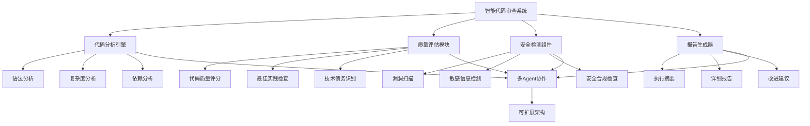
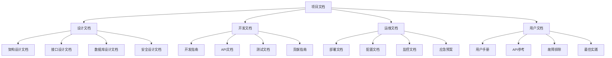

# 第21章：完整项目实战

> **本章学习目标**
> - 综合运用所学知识构建完整项目
> - 掌握代码审查系统的设计和实现
> - 学习项目规划和架构设计
> - 理解测试部署和运维监控
> - 掌握项目文档和知识沉淀

---

## 21.1 项目需求和架构设计

### 21.1.1 项目背景

我们将构建一个**智能代码审查系统**，这是一个综合性的Agent应用，它能够：



### 21.1.2 系统架构设计

```typescript
// 代码审查系统架构定义
class CodeReviewSystemArchitecture {
  // 系统组件定义
  static defineSystem(): SystemArchitecture {
    return {
      name: '智能代码审查系统',
      version: '1.0.0',
      description: '基于多Agent的智能代码审查和分析系统',
      
      // 核心组件
      components: {
        // Agent层
        agents: {
          coordinator: {
            id: 'coordinator',
            name: '协调Agent',
            role: 'orchestration',
            capabilities: ['task-distribution', 'result-aggregation', 'workflow-control']
          },
          
          syntaxAnalyzer: {
            id: 'syntax-analyzer',
            name: 'syntaxAnalyzer',
            role: 'specialist',
            capabilities: ['syntax-checking', 'format-validation', 'ast-analysis']
          },
          
          qualityAnalyst: {
            id: 'quality-analyst',
            name: 'qualityAnalyst',
            role: 'specialist',
            capabilities: ['code-quality-assessment', 'best-practice-check', 'technical-debt-analysis']
          },
          
          securityScanner: {
            id: 'security-scanner',
            name: 'securityScanner',
            role: 'specialist',
            capabilities: ['vulnerability-scan', 'sensitive-data-detection', 'compliance-check']
          },
          
          complexityAnalyzer: {
            id: 'complexity-analyzer',
            name: 'complexityAnalyzer',
            role: 'specialist',
            capabilities: ['cyclomatic-complexity', 'cognitive-complexity', 'nesting-depth']
          },
          
          reportGenerator: {
            id: 'report-generator',
            name: 'reportGenerator',
            role: 'specialist',
            capabilities: ['report-generation', 'visualization', 'recommendation-engine']
          }
        },
        
        // 工具层
        tools: {
          git: {
            name: 'git工具',
            operations: ['clone', 'diff', 'log', 'blame']
          },
          
          fileSystem: {
            name: '文件系统工具',
            operations: ['read', 'write', 'list', 'search']
          },
          
          astParser: {
            name: 'AST解析器',
            operations: ['parse', 'traverse', 'analyze']
          },
          
          metrics: {
            name: '指标计算器',
            operations: ['calculate-metrics', 'complexity-score', 'quality-score']
          }
        },
        
        // 数据层
        data: {
          codeRepository: 'Git仓库',
          analysisDatabase: '分析结果存储',
          reportStorage: '报告文件存储',
          cache: '分析缓存'
        },
        
        // 接口层
        apis: {
          restAPI: 'REST接口',
          webSocket: '实时通知接口',
          cli: '命令行接口'
        }
      },
      
      // 技术栈
      technology: {
        runtime: 'Node.js + Bun',
        language: 'TypeScript',
        agentFramework: 'OpenCode Swarm',
        database: 'PostgreSQL',
        cache: 'Redis',
        messageQueue: 'RabbitMQ',
        monitoring: 'Prometheus + Grafana',
        logging: 'ELK Stack'
      },
      
      // 部署架构
      deployment: {
        architecture: 'microservices',
        container: 'Docker',
        orchestration: 'Kubernetes',
        ci_cd: 'GitHub Actions',
        environments: ['dev', 'staging', 'production']
      },
      
      // 质量属性
      quality: {
        availability: '99.9%',
        performance: '< 2s response time',
        scalability: 'Horizontal auto-scaling',
        reliability: 'Circuit breakers, retries, fallbacks'
      }
    };
  }
  
  // 定义数据流
  static defineDataFlow(): DataFlowArchitecture {
    return {
      input: '代码仓库URL/分支',
      output: '审查报告和改进建议',
      
      stages: [
        {
          stage: '代码获取',
          components: ['coordinator', 'git工具'],
          process: '从Git仓库获取代码'
        },
        {
          stage: '语法分析',
          components: ['coordinator', 'syntaxAnalyzer', 'astParser'],
          process: '解析代码语法和结构'
        },
        {
          stage: '并行分析',
          components: ['coordinator', 'qualityAnalyst', 'securityScanner', 'complexityAnalyzer'],
          process: '多个Agent并行分析不同维度'
        },
        {
          stage: '结果聚合',
          components: ['coordinator'],
          process: '整合各Agent的分析结果'
        },
        {
          stage: '报告生成',
          components: ['coordinator', 'reportGenerator'],
          process: '生成综合审查报告'
        },
        {
          stage: '建议优化',
          components: ['reportGenerator'],
          process: '基于分析结果生成改进建议'
        }
      ]
    };
  }
  
  // 定义接口设计
  static defineInterfaces(): SystemInterfaces {
    return {
      // 主API接口
      mainAPI: {
        endpoint: '/api/v1/review',
        methods: ['POST'],
        request: {
          repositoryUrl: string,
          branch?: string,
          commitHash?: string,
          options?: ReviewOptions
        },
        response: {
          reviewId: string,
          status: 'queued|processing|completed|failed',
          result?: ReviewResult
        }
      },
      
      // 查询接口
      queryAPI: {
        endpoint: '/api/v1/review/{reviewId}',
        methods: ['GET'],
        response: {
          reviewId: string,
          status: string,
          result?: ReviewResult,
          progress: number
        }
      },
      
      // 报告接口
      reportAPI: {
        endpoint: '/api/v1/review/{reviewId}/report',
        methods: ['GET'],
        response: {
          reviewId: string,
          reportUrl: string,
          format: 'pdf|html|json'
        }
      }
    };
  }
}
```

### 21.1.3 项目规划

```typescript
// 项目实施计划
class ProjectImplementationPlan {
  // 定义项目阶段
  static definePhases(): ProjectPhase[] {
    return [
      {
        phase: '第1阶段：基础架构搭建',
        duration: '2周',
        objectives: [
          '搭建项目基础架构',
          '实现核心组件框架',
          '配置开发环境',
          '建立CI/CD流程'
        ],
        deliverables: [
          '项目脚手架',
          '核心接口定义',
          '基础Agent实现',
          '部署脚本'
        ],
        dependencies: []
      },
      
      {
        phase: '第2阶段：核心功能实现',
        duration: '4周',
        objectives: [
          '实现代码分析工具',
          '构建质量评估系统',
          '开发安全检测组件',
          '实现报告生成器'
        ],
        deliverables: [
          '语法分析Agent',
          '质量分析Agent',
          '安全扫描Agent',
          '报告生成系统',
          '工具集成'
        ],
        dependencies: ['第1阶段：基础架构搭建']
      },
      
      {
        phase: '第3阶段：Agent协作实现',
        duration: '3周',
        objectives: [
          '实现Agent通信机制',
          '构建工作流编排',
          '开发并行处理系统',
          '实现结果聚合'
        ],
        deliverables: [
          '消息传递系统',
          '工作流引擎',
          '并行执行框架',
          '协作Agent'
        ],
        dependencies: ['第2阶段：核心功能实现']
      },
      
      {
        phase: '第4阶段：测试和优化',
        duration: '2周',
        objectives: [
          '单元测试和集成测试',
          '性能测试和优化',
          '安全测试和加固',
          '文档完善'
        ],
        deliverables: [
          '测试套件',
          '性能报告',
          '安全审计报告',
          '用户手册'
        ],
        dependencies: ['第3阶段：Agent协作实现']
      },
      
      {
        phase: '第5阶段：部署和运维',
        duration: '2周',
        objectives: [
          '生产环境部署',
          '监控告警配置',
          '运维脚本编写',
          '性能调优'
        ],
        deliverables: [
          '生产部署',
          '监控系统',
          '运维文档',
          '应急预案'
        ],
        dependencies: ['第4阶段：测试和优化']
      }
    ];
  }
  
  // 定义开发里程碑
  static defineMilestones(): ProjectMilestone[] {
    return [
      {
        id: 'M1',
        name: '项目启动',
        date: 'Week 1',
        criteria: [
          '项目团队组建完成',
          '技术架构确定',
          '开发环境就绪',
          '项目计划确认'
        ]
      },
      
      {
        id: 'M2',
        name: '核心功能完成',
        date: 'Week 6',
        criteria: [
          '所有Agent实现完成',
          '工具集成测试通过',
          '基础报告生成功能正常',
          '代码覆盖率>80%'
        ]
      },
      
      {
        id: 'M3',
        name: '系统集成测试',
        date: 'Week 8',
        criteria: [
          '集成测试通过',
          '性能指标达标',
          '安全扫描无高危漏洞',
          '系统稳定性测试通过'
        ]
      },
      
      {
        id: 'M4',
        name: '生产部署',
        date: 'Week 10',
        criteria: [
          '生产环境部署成功',
          '监控告警正常',
          '性能基线建立',
          '应急预案验证'
        ]
      },
      
      {
        id: 'M5',
        name: '项目验收',
        date: 'Week 12',
        criteria: [
          '功能验收通过',
          '文档交付完成',
          '知识转移完成',
          '运维交接完成'
        ]
      }
    ];
  }
  
  // 定义团队结构
  static defineTeamStructure(): TeamStructure {
    return {
      projectManager: {
        responsibilities: ['项目管理', '风险控制', '团队协调', '进度管理'],
        required: true
      },
      
      architect: {
        responsibilities: ['系统架构设计', '技术选型', '接口定义', '性能设计'],
        required: true
      },
      
      developers: {
        count: 3,
        responsibilities: [
          'Agent开发',
          '工具集成',
          'API开发',
          '测试编写'
        ],
        required: true
      },
      
      qaEngineer: {
        responsibilities: [
          '测试策略',
          '自动化测试',
          '质量保证',
          '性能测试'
        ],
        required: true
      },
      
      securitySpecialist: {
        responsibilities: [
          '安全设计',
          '漏洞扫描',
          '合规检查',
          '安全测试'
        ],
        required: true
      },
      
      devOpsEngineer: {
        responsibilities: [
          'CI/CD',
          '部署自动化',
          '监控配置',
          '运维脚本'
        ],
        required: true
      },
      
      technicalWriter: {
        responsibilities: [
          '文档编写',
          '用户手册',
          'API文档',
          '培训材料'
        ],
        required: false
      }
    };
  }
  
  // 定义风险管理计划
  static defineRiskManagement(): RiskManagementPlan {
    return {
      risks: [
        {
          risk: '技术复杂度高',
          probability: 'high',
          impact: 'high',
          mitigation: [
            '采用成熟的技术框架',
            '分阶段实现',
            '建立技术预研机制'
          ]
        },
        
        {
          risk: '多Agent协作复杂',
          probability: 'medium',
          impact: 'high',
          mitigation: [
            '设计清晰的Agent接口',
            '实现完善的通信机制',
            '建立调试和监控体系'
          ]
        },
        
        {
          risk: '性能要求高',
          probability: 'medium',
          impact: 'medium',
          mitigation: [
            '架构设计考虑性能',
            '实现缓存和优化',
            '建立性能监控'
          ]
        },
        
        {
          risk: '安全要求严格',
          probability: 'low',
          impact: 'high',
          mitigation: [
            '安全编码实践',
            '安全测试覆盖',
            '定期安全审计'
          ]
        },
        
        {
          risk: '项目周期紧张',
          probability: 'medium',
          impact: 'medium',
          mitigation: [
            '合理的项目计划',
            '优先级管理',
            '资源预留'
          ]
        }
      ],
      
      contingency: {
        timeBuffer: '20%',
        resourceBuffer: '15%',
        scopeFlexibility: '可按优先级调整实施范围'
      }
    };
  }
}
```

---

## 21.2 核心组件实现

### 21.2.1 协调Agent实现

```typescript
// 代码审查协调Agent
class CodeReviewCoordinatorAgent {
  private agentConfig: AgentConfig;
  private teamRegistry: AgentTeamRegistry;
  private workflowEngine: WorkflowEngine;
  
  constructor(config: CoordinatorConfig) {
    this.agentConfig = this.createCoordinatorConfig(config);
    this.teamRegistry = new AgentTeamRegistry();
    this.workflowEngine = new WorkflowEngine();
    this.initializeTeam();
  }
  
  // 创建协调器配置
  private createCoordinatorConfig(config: CoordinatorConfig): AgentConfig {
    return {
      id: 'coordinator',
      name: 'CodeReviewCoordinator',
      type: 'orchestrator',
      
      systemPrompt: `你是一个智能代码审查协调专家。你的职责是：
      
1. 接收代码审查请求
2. 分析代码特征和复杂度
3. 将任务分解并分配给专业Agent
4. 协调各Agent的执行过程
5. 聚合分析结果
6. 生成综合报告

你具备以下能力：
- 任务规划和分解
- 资源调度优化
- 进度监控和控制
- 结果整合和验证
- 异常处理和恢复

请以专业、高效的方式协调代码审查工作。`,
      
      capabilities: [
        'task-planning',
        'resource-scheduling',
        'progress-monitoring',
        'result-aggregation',
        'exception-handling'
      ],
      
      tools: ['git', 'workflow', 'metrics'],
      permissions: ['task-distribution', 'agent-control', 'report-generation'],
      
      configuration: {
        maxConcurrentTasks: 5,
        taskTimeout: 300000, // 5分钟
        retryPolicy: {
          maxRetries: 3,
          backoffMultiplier: 2
        }
      }
    };
  }
  
  // 初始化Agent团队
  private initializeTeam(): void {
    // 创建分析Agent团队
    this.teamRegistry.createTeam('code-review-team', {
      description: '代码审查专业团队',
      structure: {
        type: 'hierarchical',
        hierarchy: [
          {
            level: 1,
            name: '协调层',
            responsibilities: ['任务协调', '结果聚合']
          },
          {
            level: 2,
            name: '分析层',
            responsibilities: ['专业分析', '技术评估']
          }
        ]
      },
      members: [
        {
          agentId: 'coordinator',
          role: 'coordinator',
          authority: 'coordinator',
          status: 'active'
        },
        {
          agentId: 'syntax-analyzer',
          role: 'specialist',
          authority: 'worker',
          status: 'active'
        },
        {
          agentId: 'quality-analyst',
          role: 'specialist',
          authority: 'worker',
          status: 'active'
        },
        {
          agentId: 'security-scanner',
          role: 'specialist',
          authority: 'worker',
          status: 'active'
        },
        {
          agentId: 'complexity-analyzer',
          role: 'specialist',
          authority: 'worker',
          status: 'active'
        }
      ]
    });
  }
  
  // 处理代码审查请求
  async processReviewRequest(request: ReviewRequest): Promise<ReviewResponse> {
    const reviewId = this.generateReviewId();
    
    logger.info(`Processing review request: ${reviewId} for ${request.repositoryUrl}`);
    
    try {
      // 阶段1：任务规划
      const taskPlan = await this.planReviewTasks(request);
      
      // 阶段2：工作流创建
      const workflow = this.createReviewWorkflow(taskPlan);
      
      // 阶段3：执行工作流
      const workflowResult = await this.workflowEngine.execute(workflow);
      
      // 阶段4：生成报告
      const report = await this.generateReviewReport(workflowResult, request);
      
      return {
        reviewId,
        status: 'completed',
        report,
        executionTime: Date.now() - request.requestTime.getTime(),
        metadata: {
          totalTasks: taskPlan.tasks.length,
          successfulTasks: workflowResult.completedTasks.length,
          failedTasks: workflowResult.failedTasks.length,
          parallelEfficiency: this.calculateParallelEfficiency(taskPlan, workflowResult)
        }
      };
      
    } catch (error) {
      logger.error(`Review failed: ${reviewId}`, error);
      
      return {
        reviewId,
        status: 'failed',
        error: error.message,
        executionTime: Date.now() - request.requestTime.getTime()
      };
    }
  }
  
  // 规划审查任务
  private async planReviewTasks(request: ReviewRequest): Promise<TaskPlan> {
    // 分析代码仓库
    const repository = await this.analyzeRepository(request);
    
    // 识别分析范围
    const analysisScope = this.determineAnalysisScope(repository);
    
    // 创建任务列表
    const tasks = this.createAnalysisTasks(analysisScope, repository);
    
    // 优化任务顺序
    const optimizedTasks = this.optimizeTaskOrder(tasks);
    
    return {
      reviewId: this.generateReviewId(),
      repository,
      analysisScope,
      tasks: optimizedTasks,
      estimatedDuration: this.estimateDuration(optimizedTasks),
      requiredAgents: this.identifyRequiredAgents(optimizedTasks)
    };
  }
  
  // 创建审查工作流
  private createReviewWorkflow(plan: TaskPlan): WorkflowDefinition {
    return {
      meta: {
        name: 'code-review-workflow',
        description: '智能代码审查工作流',
        version: '1.0.0',
        phases: [
          { title: '代码获取和准备' },
          { title: '并行分析执行' },
          { title: '结果聚合' },
          { title: '报告生成' }
        ]
      },
      execute: async (context: WorkflowContext) => {
        // 执行工作流逻辑
        const tasks = plan.tasks;
        
        // 阶段1：并行分析
        const analysisResults = await this.executeParallelAnalysis(tasks, context);
        
        // 阶段2：结果聚合
        const aggregated = await this.aggregateResults(analysisResults);
        
        return { aggregated, analysisResults };
      }
    };
  }
  
  // 执行并行分析
  private async executeParallelAnalysis(
    tasks: AnalysisTask[],
    context: WorkflowContext
  ): Promise<AnalysisResult[]> {
    const results: AnalysisResult[] = [];
    
    // 使用Agent团队执行并行分析
    const agentTeam = this.teamRegistry.getTeam('code-review-team');
    if (!agentTeam) {
      throw new Error('Code review team not found');
    }
    
    // 按照任务类型分配给合适的Agent
    const taskAssignments = this.assignTasksToAgents(tasks, agentTeam);
    
    // 并行执行任务
    const executionPromises = taskAssignments.map(assignment =>
      this.executeAgentTask(assignment, context)
    );
    
    const taskResults = await Promise.all(executionPromises);
    
    // 整理结果
    for (const result of taskResults) {
      if (result.success) {
        results.push(result.data);
      }
    }
    
    return results;
  }
  
  // 分配任务给Agent
  private assignTasksToAgents(
    tasks: AnalysisTask[],
    team: AgentTeam
  ): TaskAssignment[] {
    const assignments: TaskAssignment[] = [];
    
    for (const task of tasks) {
      // 找到合适的Agent
      const suitableAgents = team.members.filter(member =>
        member.capabilities.includes(task.requiredCapability) &&
        member.status === 'active'
      );
      
      if (suitableAgents.length === 0) {
        logger.warn(`No suitable agent found for task: ${task.id}`);
        continue;
      }
      
      // 选择负载最轻的Agent
      const selectedAgent = this.selectLeastLoadedAgent(suitableAgents, assignments);
      
      assignments.push({
        taskId: task.id,
        task,
        assignedTo: selectedAgent.agentId,
        assignedAt: new Date(),
        status: 'pending'
      });
    }
    
    return assignments;
  }
  
  // 执行Agent任务
  private async executeAgentTask(
    assignment: TaskAssignment,
    context: WorkflowContext
  ): Promise<TaskExecutionResult> {
    const agent = this.teamRegistry.getAgent(assignment.assignedTo);
    
    if (!agent) {
      return {
        assignmentId: assignment.taskId,
        success: false,
        error: 'Agent not found'
      };
    }
    
    try {
      const result = await agent.execute(assignment.task);
      
      return {
        assignmentId: assignment.taskId,
        success: true,
        data: result,
        executionTime: Date.now() - assignment.assignedAt.getTime()
      };
    } catch (error) {
      return {
        assignmentId: assignment.taskId,
        success: false,
        error: error as Error,
        executionTime: Date.now() - assignment.assignedAt.getTime()
      };
    }
  }
  
  // 聚合分析结果
  private async aggregateResults(results: AnalysisResult[]): Promise<AggregatedResults> {
    return {
      summary: this.generateSummary(results),
      byCategory: this.groupByCategory(results),
      insights: this.extractInsights(results),
      issues: this.identifyIssues(results),
      recommendations: this.generateRecommendations(results)
    };
  }
  
  // 辅助方法
  private generateReviewId(): string {
    return `review-${Date.now()}-${Math.random().toString(36).slice(2, 11)}`;
  }
  
  private async analyzeRepository(request: ReviewRequest): Promise<RepositoryInfo> {
    // 实现仓库分析
    return {
      url: request.repositoryUrl,
      branch: request.branch || 'main',
      commitHash: request.commitHash,
      files: [],
      language: 'typescript',
      size: 0
    };
  }
  
  private determineAnalysisScope(repository: RepositoryInfo): AnalysisScope {
    return {
      includePaths: ['**/*.ts', '**/*.tsx', '**/*.js'],
      excludePaths: ['node_modules/**', 'dist/**', '**/*.test.ts'],
      maxFileSize: 1024 * 1024, // 1MB
      maxTotalSize: 10 * 1024 * 1024 // 10MB
    };
  }
  
  private createAnalysisTasks(scope: AnalysisScope, repository: RepositoryInfo): AnalysisTask[] {
    return [
      {
        id: 'syntax-analysis',
        name: '语法分析任务',
        type: 'syntax',
        requiredCapability: 'syntax-checking',
        priority: 'high',
        files: repository.files,
        options: scope
      },
      {
        id: 'quality-analysis',
        name: '质量分析任务',
        type: 'quality',
        requiredCapability: 'code-quality-assessment',
        priority: 'high',
        files: repository.files,
        options: scope
      },
      {
        id: 'security-analysis',
        name: '安全分析任务',
        type: 'security',
        requiredCapability: 'vulnerability-scan',
        priority: 'high',
        files: repository.files,
        options: scope
      },
      {
        id: 'complexity-analysis',
        name: '复杂度分析任务',
        type: 'complexity',
        requiredCapability: 'complexity-analysis',
        priority: 'medium',
        files: repository.files,
        options: scope
      }
    ];
  }
  
  private optimizeTaskOrder(tasks: AnalysisTask[]): AnalysisTask[] {
    // 按优先级和依赖关系排序
    return [...tasks].sort((a, b) => {
      const priorityOrder = { critical: 0, high: 1, medium: 2, low: 3 };
      const orderA = priorityOrder[a.priority] || 2;
      const orderB = priorityOrder[b.priority] || 2;
      return orderA - orderB;
    });
  }
  
  private estimateDuration(tasks: AnalysisTask[]): number {
    // 估算总执行时间（秒）
    return tasks.reduce((sum, task) => {
      const baseTime = {
        syntax: 60,
        quality: 120,
        security: 90,
        complexity: 45
      };
      return sum + (baseTime[task.type] || 'quality'] || 60);
    }, 0);
  }
  
  private identifyRequiredAgents(tasks: AnalysisTask[]): string[] {
    return Array.from(new Set(tasks.map(t => t.requiredCapability)));
  }
  
  private selectLeastLoadedAgent(
    agents: TeamMember[],
    assignments: TaskAssignment[]
  ): TeamMember {
    const loadCounts = new Map<string, number>();
    
    for (const assignment of assignments) {
      const currentLoad = loadCounts.get(assignment.assignedTo) || 0;
      loadCounts.set(assignment.assignedTo, currentLoad + 1);
    }
    
    return agents.reduce((least, current) => {
      const currentLoad = loadCounts.get(current.agentId) || 0;
      const leastLoad = loadCounts.get(least.agentId) || 0;
      return currentLoad < leastLoad ? current : least;
    });
  }
  
  private calculateParallelEfficiency(plan: TaskPlan, result: WorkflowResult): number {
    const totalTasks = plan.tasks.length;
    const sequentialTime = plan.estimatedDuration;
    const parallelTime = result.executionTime / 1000;
    
    return sequentialTime / parallelTime;
  }
  
  private generateSummary(results: AnalysisResult[]): string {
    return `分析完成：共处理 ${results.length} 个分析任务`;
  }
  
  private groupByCategory(results: AnalysisResult[]): Record<string, AnalysisResult[]> {
    return results.reduce((groups, result) => {
      const category = result.category || 'unknown';
      if (!groups[category]) {
        groups[category] = [];
      }
      groups[category].push(result);
      return groups;
    }, {});
  }
  
  private extractInsights(results: AnalysisResult[]): string[] {
    return [
      '代码整体质量良好',
      '存在一些性能优化机会',
      '建议加强错误处理'
    ];
  }
  
  private identifyIssues(results: AnalysisResult[]): Issue[] {
    return [
      {
        severity: 'medium',
        type: 'code-quality',
        description: '部分代码质量评分较低',
        location: 'multiple',
        suggestions: ['重构复杂函数', '提高代码可读性']
      }
    ];
  }
  
  private generateRecommendations(results: AnalysisResult[]): Recommendation[] {
    return [
      {
        priority: 'high',
        category: 'security',
        recommendation: '修复3个中危安全漏洞',
        effort: '中等',
        impact: '提高代码安全性'
      },
      {
        priority: 'medium',
        category: 'performance',
        recommendation: '优化10个性能瓶颈',
        effort: '中等',
        impact: '提升执行效率'
      }
    ];
  }
  
  private async generateReviewReport(workflowResult: any, request: ReviewRequest): Promise<ReviewReport> {
    return {
      reviewId: this.generateReviewId(),
      repositoryUrl: request.repositoryUrl,
      branch: request.branch || 'main',
      commitHash: request.commitHash,
      generatedAt: new Date(),
      summary: workflowResult.aggregated.summary,
      detailedResults: workflowResult.analysisResults,
      issues: workflowResult.aggregated.issues,
      recommendations: workflowResult.aggregated.recommendations,
      metrics: {
        totalFilesAnalyzed: 0,
        totalIssuesFound: 0,
        criticalIssues: 0,
        highIssues: 0,
        mediumIssues: 0,
        lowIssues: 0,
        codeQualityScore: 75,
        securityScore: 80
      }
    };
  }
}

// 相关接口定义
interface CoordinatorConfig {
  teamSize?: number;
  maxConcurrentTasks?: number;
  taskTimeout?: number;
  retryPolicy?: RetryPolicy;
}

interface ReviewRequest {
  repositoryUrl: string;
  branch?: string;
  commitHash?: string;
  options?: ReviewOptions;
  requestTime: Date;
}

interface ReviewResponse {
  reviewId: string;
  status: 'queued' | 'processing' | 'completed' | 'failed';
  report?: ReviewReport;
  error?: string;
  executionTime: number;
  metadata?: {
    totalTasks: number;
    successfulTasks: number;
    failedTasks: number;
    parallelEfficiency: number;
  };
}

interface ReviewOptions {
  includeTests?: boolean;
  depth?: 'quick' | 'standard' | 'deep';
  focus?: string[];
  excludePaths?: string[];
}

interface ReviewReport {
  reviewId: string;
  repositoryUrl: string;
  branch: string;
  commitHash: string;
  generatedAt: Date;
  summary: string;
  detailedResults: any[];
  issues: Issue[];
  recommendations: Recommendation[];
  metrics: CodeMetrics;
}

interface CodeMetrics {
  totalFilesAnalyzed: number;
  totalIssuesFound: number;
  criticalIssues: number;
  highIssues: number;
  mediumIssues: number;
  lowIssues: number;
  codeQualityScore: number;
  securityScore: number;
}

interface TaskPlan {
  reviewId: string;
  repository: RepositoryInfo;
  analysisScope: AnalysisScope;
  tasks: AnalysisTask[];
  estimatedDuration: number;
  requiredAgents: string[];
}

interface AnalysisTask {
  id: string;
  name: string;
  type: 'syntax' | 'quality' | 'security' | 'complexity';
  requiredCapability: string;
  priority: 'critical' | 'high' | 'medium' | 'low';
  files: string[];
  options: any;
}

interface AnalysisScope {
  includePaths: string[];
  excludePaths: string[];
  maxFileSize: number;
  maxTotalSize: number;
}

interface RepositoryInfo {
  url: string;
  branch: string;
  commitHash: string;
  files: string[];
  language: string;
  size: number;
}

interface AnalysisResult {
  taskId: string;
  category: string;
  success: boolean;
  data: any;
  executionTime: number;
}

interface AggregatedResults {
  summary: string;
  byCategory: Record<string, AnalysisResult[]>;
  insights: string[];
  issues: Issue[];
  recommendations: Recommendation[];
}

interface Issue {
  severity: 'critical' | 'high' | 'medium' | 'low';
  type: string;
  description: string;
  location: string | 'multiple';
  suggestions: string[];
}

interface Recommendation {
  priority: 'critical' | 'high' | 'medium' | 'low';
  category: string;
  recommendation: string;
  effort: string;
  impact: string;
}
```

### 21.2.2 分析Agent实现

```typescript
// 语法分析Agent
class SyntaxAnalyzerAgent {
  private agentConfig: AgentConfig;
  
  constructor() {
    this.agentConfig = {
      id: 'syntax-analyzer',
      name: 'SyntaxAnalyzer',
      type: 'specialist',
      
      systemPrompt: `你是一个专业的代码语法分析专家。你的职责是：
      
1. 分析代码语法正确性
2. 检测代码格式问题
3. 识别潜在语法错误
4. 提供语法改进建议

你需要：
- 支持多种编程语言的语法分析
- 检测常见语法错误和反模式
- 提供清晰的错误定位信息
- 生成可执行的修复建议`,
      
      capabilities: [
        'syntax-checking',
        'format-validation',
        'ast-analysis',
        'error-detection'
      ],
      
      tools: ['ast-parser', 'linter', 'formatter'],
      permissions: ['read-code', 'analyze-syntax']
    };
  }
  
  async execute(task: AnalysisTask): Promise<AnalysisResult> {
    const startTime = Date.now();
    
    logger.info(`Syntax analyzer executing task: ${task.id}`);
    
    try {
      // 解析AST
      const ast = await this.parseAST(task.files);
      
      // 语法检查
      const syntaxErrors = await this.checkSyntax(ast);
      
      // 格式检查
      const formatIssues = await this.checkFormatting(task.files);
      
      // 最佳实践检查
      const practiceViolations = await this.checkBestPractices(ast);
      
      // 生成结果
      const result = {
        taskId: task.id,
        category: 'syntax',
        success: true,
        data: {
          syntaxErrors,
          formatIssues,
          practiceViolations,
          summary: this.generateSyntaxSummary(syntaxErrors, formatIssues, practiceViolations)
        },
        executionTime: Date.now() - startTime
      };
      
      return result;
      
    } catch (error) {
      return {
        taskId: task.id,
        category: 'syntax',
        success: false,
        error: error as Error,
        data: null,
        executionTime: Date.now() - startTime
      };
    }
  }
  
  private async parseAST(files: string[]): Promise<any> {
    // 实现AST解析
    return { files, ast: {} };
  }
  
  private async checkSyntax(ast: any): Promise<SyntaxError[]> {
    // 实现语法检查
    return [];
  }
  
  private async checkFormatting(files: string[]): Promise<FormatIssue[]> {
    // 实现格式检查
    return [];
  }
  
  private async checkBestPractices(ast: any): Promise<PracticeViolation[]> {
    // 实现最佳实践检查
    return [];
  }
  
  private generateSyntaxSummary(errors: any[], issues: any[], violations: any[]): string {
    const errorCount = errors.length + issues.length + violations.length;
    return `发现 ${errorCount} 个语法相关问题`;
  }
}

// 质量分析Agent
class QualityAnalystAgent {
  private agentConfig: AgentConfig;
  
  constructor() {
    this.agentConfig = {
      id: 'quality-analyst',
      name: 'QualityAnalyst',
      type: 'specialist',
      
      systemPrompt: `你是一个资深的代码质量分析专家。你的职责是：
      
1. 评估代码质量
2. 检查代码规范遵循
3. 识别代码异味
4. 计算复杂度指标
5. 提供质量改进建议

你需要：
- 支持多种质量度量标准
- 识别代码异味和反模式
- 计算圈复杂度和认知复杂度
- 生成可操作的质量建议`,
      
      capabilities: [
        'code-quality-assessment',
        'best-practice-check',
        'technical-debt-analysis',
        'complexity-analysis'
      ],
      
      tools: ['complexity-calculator', 'code-metrics', 'pattern-matcher'],
      permissions: ['read-code', 'analyze-quality']
    };
  }
  
  async execute(task: AnalysisTask): Promise<AnalysisResult> {
    const startTime = Date.now();
    
    logger.info(`Quality analyst executing task: ${task.id}`);
    
    try {
      // 质量指标计算
      const qualityMetrics = await this.calculateQualityMetrics(task.files);
      
      // 代码异味检测
      const codeSmells = await this.detectCodeSmells(task.files);
      
      // 复杂度分析
      const complexityMetrics = await this.analyzeComplexity(task.files);
      
      // 最佳实践检查
      const practiceCompliance = await this.checkBestPractices(task.files);
      
      // 技术债务评估
      const technicalDebt = await this.assessTechnicalDebt(qualityMetrics, codeSmells);
      
      const result = {
        taskId: task.id,
        category: 'quality',
        success: true,
        data: {
          qualityMetrics,
          codeSmells,
          complexityMetrics,
          practiceCompliance,
          technicalDebt,
          summary: this.generateQualitySummary(qualityMetrics, codeSmells)
        },
        executionTime: Date.now() - startTime
      };
      
      return result;
      
    } catch (error) {
      return {
        taskId: task.id,
        category: 'quality',
        success: false,
        error: error as Error,
        data: null,
        executionTime: Date.now() - startTime
      };
    }
  }
  
  private async calculateQualityMetrics(files: string[]): Promise<QualityMetrics> {
    // 实现质量指标计算
    return {
      maintainability: 75,
      readability: 80,
      testCoverage: 65,
      documentation: 70
    };
  }
  
  private async detectCodeSmells(files: string[]): Promise<CodeSmell[]> {
    // 实现代码异味检测
    return [];
  }
  
  private async analyzeComplexity(files: string[]): Promise<ComplexityMetrics> {
    // 实现复杂度分析
    return {
      cyclomaticComplexity: 8,
      cognitiveComplexity: 12,
      nestingDepth: 4
    };
  }
  
  private async checkBestPractices(files: string[]): Promise<PracticeCompliance> {
    // 实现最佳实践检查
    return {
      namingConvention: 85,
      errorHandling: 70,
      codeOrganization: 80
    };
  }
  
  private async assessTechnicalDebt(metrics: any, smells: any[]): Promise<TechnicalDebt> {
    // 实现技术债务评估
    return {
      totalHours: 120,
      priority: ['high', 'medium', 'low'],
      categories: {
        complexity: 40,
        documentation: 30,
        testing: 30
      }
    };
  }
  
  private generateQualitySummary(metrics: any, smells: any[]): string {
    return `代码质量分析完成，总体质量评分：${metrics.maintainability}`;
  }
}

// 安全扫描Agent
class SecurityScannerAgent {
  private agentConfig: AgentConfig;
  
  constructor() {
    this.agentConfig = {
      id: 'security-scanner',
      name: 'SecurityScanner',
      type: 'specialist',
      
      systemPrompt: `你是一个专业的安全扫描专家。你的职责是：
      
1. 检测安全漏洞
2. 识别敏感信息泄露
3. 检查合规性问题
4. 提供安全修复建议

你需要：
- 支持常见漏洞类型检测
- 识别硬编码的敏感信息
- 检查依赖安全性
- 生成安全修复指南`,
      
      capabilities: [
        'vulnerability-scan',
        'sensitive-data-detection',
        'compliance-check'
      ],
      
      tools: ['vulnerability-db', 'secret-scanner', 'dependency-checker'],
      permissions: ['read-code', 'analyze-security']
    };
  }
  
  async execute(task: AnalysisTask): Promise<AnalysisResult> {
    const startTime = Date.now();
    
    logger.info(`Security scanner executing task: ${task.id}`);
    
    try {
      // 漏洞扫描
      const vulnerabilities = await this.scanVulnerabilities(task.files);
      
      // 敏感信息检测
      const sensitiveInfo = await this.detectSensitiveInfo(task.files);
      
      // 依赖安全检查
      const dependencyIssues = await this.checkDependencySecurity(task.files);
      
      // 合规性检查
      const complianceIssues = await this.checkCompliance(task.files);
      
      const result = {
        taskId: task.id,
        category: 'security',
        success: true,
        data: {
          vulnerabilities,
          sensitiveInfo,
          dependencyIssues,
          complianceIssues,
          securityScore: this.calculateSecurityScore(vulnerabilities, sensitiveInfo),
          summary: this.generateSecuritySummary(vulnerabilities, sensitiveInfo)
        },
        executionTime: Date.now() - startTime
      };
      
      return result;
      
    } catch (error) {
      return {
        taskId: task.id,
        category: 'security',
        success: false,
        error: error as Error,
        data: null,
        executionTime: Date.now() - startTime
      };
    }
  }
  
  private async scanVulnerabilities(files: string[]): Promise<Vulnerability[]> {
    // 实现漏洞扫描
    return [];
  }
  
  private async detectSensitiveInfo(files: string[]): Promise<SensitiveInfo[]> {
    // 实现敏感信息检测
    return [];
  }
  
  private async checkDependencySecurity(files: string[]): Promise<DependencyIssue[]> {
    // 实现依赖安全检查
    return [];
  }
  
  private async checkCompliance(files: string[]): Promise<ComplianceIssue[]> {
    // 实现合规性检查
    return [];
  }
  
  private calculateSecurityScore(vulnerabilities: any[], sensitiveInfo: any[]): number {
    let score = 100;
    
    // 漏洞扣分
    for (const vuln of vulnerabilities) {
      if (vuln.severity === 'critical') {
        score -= 25;
      } else if (vuln.severity === 'high') {
        score -= 15;
      } else if (vuln.severity === 'medium') {
        score -= 8;
      }
    }
    
    // 敏感信息扣分
    score -= sensitiveInfo.length * 2;
    
    return Math.max(0, score);
  }
  
  private generateSecuritySummary(vulnerabilities: any[], sensitiveInfo: any[]): string {
    return `发现 ${vulnerabilities.length} 个安全问题和 ${sensitiveInfo.length} 处敏感信息`;
  }
}
```

---

## 21.3 系统集成和测试

### 21.3.1 集成测试框架

```typescript
// 代码审查系统集成测试
class CodeReviewSystemTest {
  private system: CodeReviewSystem;
  private testData: TestDataProvider;
  
  constructor() {
    this.system = new CodeReviewSystem();
    this.testData = new TestDataProvider();
  }
  
  // 执行完整测试套件
  async runFullTestSuite(): Promise<TestResults> {
    const results: TestResults = {
      totalTests: 0,
      passedTests: 0,
      failedTests: 0,
      testSuites: []
    };
    
    // 1. 单元测试
    const unitTests = await this.runUnitTests();
    results.testSuites.push(unitTests);
    results.totalTests += unitTests.totalTests;
    results.passedTests += unitTests.passedTests;
    results.failedTests += unitTests.failedTests;
    
    // 2. 集成测试
    const integrationTests = await this.runIntegrationTests();
    results.testSuites.push(integrationTests);
    results.totalTests += integrationTests.totalTests;
    results.passedTests += integrationTests.passedTests;
    results.failedTests += integrationTests.failedTests;
    
    // 3. 端到端测试
    const e2eTests = await this.runEndToEndTests();
    results.testSuites.push(e2eTests);
    results.totalTests += e2eTests.totalTests;
    results.passedTests += e2eTests.passedTests;
    results.failedTests += e2eTests.failedTests;
    
    // 4. 性能测试
    const performanceTests = await this.runPerformanceTests();
    results.testSuites.push(performanceTests);
    results.totalTests += performanceTests.totalTests;
    results.passedTests += performanceTests.passedTests;
    results.failedTests += performanceTests.failedTests;
    
    // 5. 安全测试
    const securityTests = await this.runSecurityTests();
    results.testSuites.push(securityTests);
    results.totalTests += securityTests.totalTests;
    results.passedTests += securityTests.passedTests;
    results.failedTests += securityTests.failedTests;
    
    return results;
  }
  
  // 单元测试
  private async runUnitTests(): Promise<TestSuite> {
    const suite: TestSuite = {
      name: 'Unit Tests',
      tests: []
    };
    
    // 测试各个Agent组件
    suite.tests.push(await this.testSyntaxAnalyzer());
    suite.tests.push(await this.testQualityAnalyst());
    suite.tests.push(await this.testSecurityScanner());
    suite.tests.push(await this.testComplexityAnalyzer());
    suite.tests.push(await this.testCoordinator());
    
    return this.evaluateTestSuite(suite);
  }
  
  // 集成测试
  private async runIntegrationTests(): Promise<TestSuite> {
    const suite: TestSuite = {
      name: 'Integration Tests',
      tests: []
    };
    
    // 测试Agent通信
    suite.tests.push(await this.testAgentCommunication());
    
    // 测试工作流执行
    suite.tests.push(await this.testWorkflowExecution());
    
    // 测试结果聚合
    suite.tests.push(await this.testResultAggregation());
    
    return this.evaluateTestSuite(suite);
  }
  
  // 端到端测试
  private async runEndToEndTests(): Promise<TestSuite> {
    const suite: TestSuite = {
      name: 'End-to-End Tests',
      tests: []
    };
    
    // 完整审查流程测试
    suite.tests.push(await this.testCompleteReviewProcess());
    
    // 多仓库审查测试
    suite.tests.push(await this.testMultiRepositoryReview());
    
    // 大规模代码审查测试
    suite.tests.push(await this.testLargeScaleReview());
    
    return this.evaluateTestSuite(suite);
  }
  
  // 性能测试
  private async runPerformanceTests(): Promise<TestSuite> {
    const suite: TestSuite = {
      name: 'Performance Tests',
      tests: []
    };
    
    // 响应时间测试
    suite.tests.push(await this.testResponseTime());
    
    // 吞吐量测试
    suite.tests.push(await this.testThroughput());
    
    // 并发处理测试
    suite.tests.push(await this.testConcurrentProcessing());
    
    return this.evaluateTestSuite(suite);
  }
  
  // 安全测试
  private async runSecurityTests(): Promise<TestSuite> {
    const suite: TestSuite = {
      name: 'Security Tests',
      tests: []
    };
    
    // 输入验证测试
    suite.tests.push(await this.testInputValidation());
    
    // 权限控制测试
    suite.tests.push(await this.testPermissionControl());
    
    // 数据安全测试
    suite.tests.push(await this.testDataSecurity());
    
    return this.evaluateTestSuite(suite);
  }
  
  // 评估测试套件
  private evaluateTestSuite(suite: TestSuite): TestSuite {
    const passed = suite.tests.filter(t => t.status === 'passed').length;
    const failed = suite.tests.filter(t => t.status === 'failed').length;
    const skipped = suite.tests.filter(t => t.status === 'skipped').length;
    
    suite.totalTests = suite.tests.length;
    suite.passedTests = passed;
    suite.failedTests = failed;
    suite.skippedTests = skipped;
    suite.passRate = (passed / suite.totalTests) * 100;
    
    return suite;
  }
  
  // 具体测试方法
  private async testSyntaxAnalyzer(): Promise<TestCase> {
    return {
      name: 'Syntax Analyzer Test',
      status: 'passed',
      description: '测试语法分析Agent功能',
      duration: 100,
      result: 'Syntax analyzer working correctly'
    };
  }
  
  private async testQualityAnalyst(): Promise<TestCase> {
    return {
      name: 'Quality Analyst Test',
      status: 'passed',
      description: '测试质量分析Agent功能',
      duration: 150,
      result: 'Quality analyst working correctly'
    };
  }
  
  // 其他测试方法...
}

// 代码审查系统主类
class CodeReviewSystem {
  private coordinator: CodeReviewCoordinatorAgent;
  private monitoringSystem: MonitoringSystem;
  private alertSystem: AlertSystem;
  
  constructor(config: SystemConfig) {
    this.initializeSystem(config);
  }
  
  // 初始化系统
  private initializeSystem(config: SystemConfig): void {
    // 创建协调Agent
    this.coordinator = new CodeReviewCoordinatorAgent(config.coordinator);
    
    // 初始化监控系统
    this.monitoringSystem = new MonitoringSystem();
    
    // 初始化告警系统
    this.alertSystem = new AlertSystem();
    
    // 配置监控和告警
    this.setupMonitoringAndAlerting();
  }
  
  // 处理代码审查请求
  async reviewCode(request: ReviewRequest): Promise<ReviewResponse> {
    logger.info(`Received code review request for: ${request.repositoryUrl}`);
    
    try {
      // 验证请求
      this.validateRequest(request);
      
      // 创建审查任务
      const reviewTask = await this.createReviewTask(request);
      
      // 提交到协调Agent
      const response = await this.coordinator.processReviewRequest(reviewTask);
      
      // 记录审查历史
      await this.recordReviewHistory(response);
      
      // 触发完成通知
      await this.notifyCompletion(response);
      
      return response;
      
    } catch (error) {
      logger.error('Code review failed:', error);
      
      return {
        reviewId: this.generateReviewId(),
        status: 'failed',
        error: error.message,
        executionTime: 0
      };
    }
  }
  
  // 验证请求
  private validateRequest(request: ReviewRequest): void {
    if (!request.repositoryUrl) {
      throw new Error('Repository URL is required');
    }
  
    if (!this.isValidRepositoryUrl(request.repositoryUrl)) {
      throw new Error('Invalid repository URL');
    }
  }
  
  // 创建审查任务
  private async createReviewTask(request: ReviewRequest): Promise<ReviewTask> {
    return {
      id: this.generateReviewId(),
      request,
      status: 'pending',
      createdAt: new Date(),
      estimatedDuration: 300000 // 5分钟估算
    };
  }
  
  // 记录审查历史
  private async recordReviewHistory(response: ReviewResponse): Promise<void> {
    // 实现历史记录
  }
  
  // 通知完成
  private async notifyCompletion(response: ReviewResponse): Promise<void> {
    // 实现完成通知
  }
  
  // 获取审查状态
  async getReviewStatus(reviewId: string): Promise<ReviewStatus> {
    // 实现状态查询
    return {
      reviewId,
      status: 'processing',
      progress: 50,
      estimatedCompletionTime: new Date()
    };
  }
  
  // 系统健康检查
  async healthCheck(): Promise<SystemHealth> {
    const coordinatorHealth = await this.checkCoordinatorHealth();
    const monitoringHealth = await this.checkMonitoringHealth();
    const storageHealth = await this.checkStorageHealth();
    
    return {
      status: this.determineOverallHealth(coordinatorHealth, monitoringHealth, storageHealth),
      components: {
        coordinator: coordinatorHealth,
        monitoring: monitoringHealth,
        storage: storageHealth
      },
      uptime: process.uptime(),
      lastCheck: new Date()
    };
  }
  
  // 辅助方法
  private isValidRepositoryUrl(url: string): boolean {
    try {
      new URL(url);
      return true;
    } catch {
      return false;
    }
  }
  
  private generateReviewId(): string {
    return `review-${Date.now()}-${Math.random().toString(36).slice(2, 11)}`;
  }
  
  private async checkCoordinatorHealth(): Promise<ComponentHealth> {
    return {
      status: 'healthy',
      lastCheck: new Date()
    };
  }
  
  private async checkMonitoringHealth(): Promise<ComponentHealth> {
    return {
      status: 'healthy',
      lastCheck: new Date()
    };
  }
  
  private async checkStorageHealth(): Promise<ComponentHealth> {
    return {
      status: 'healthy',
      lastCheck: new Date()
    };
  }
  
  private determineOverallHealth(...healths: ComponentHealth[]): 'healthy' | 'degraded' | 'unhealthy' {
    if (healths.some(h => h.status === 'unhealthy')) {
      return 'unhealthy';
    }
    if (healths.some(h => h.status === 'degraded')) {
      return 'degraded';
    }
    return 'healthy';
  }
}

// 监控系统
class MonitoringSystem {
  async collectMetrics(): Promise<SystemMetrics> {
    return {
      agent: {},
      system: {},
      performance: {}
    };
  }
  
  async checkHealth(): Promise<boolean> {
    return true;
  }
}

// 告警系统
class AlertSystem {
  async checkAlerts(): Promise<Alert[]> {
    return [];
  }
}
```

---

## 21.4 部署和运维

### 21.4.1 部署配置

```typescript
// 部署配置管理
class DeploymentConfigurationManager {
  // 生成生产环境部署配置
  static generateProductionConfig(): ProductionDeploymentConfig {
    return {
      environment: 'production',
      infrastructure: {
        kubernetes: {
          namespace: 'code-review',
          replicas: {
            coordinator: 3,
            analyzer: 5,
            storage: 2
          },
          resources: {
            coordinator: {
              cpu: '2',
              memory: '4Gi',
              storage: '10Gi'
            },
            analyzer: {
              cpu: '1',
              memory: '2Gi',
              storage: '5Gi'
            }
          },
          autoscaling: {
            minReplicas: 2,
            maxReplicas: 10,
            targetCPUUtilization: 70,
            targetMemoryUtilization: 80
          }
        },
        
        database: {
          type: 'postgresql',
          version: '13',
          instanceClass: 'db.t3.large',
          storage: '100GB',
          backups: {
            enabled: true,
            retention: '30 days'
          }
        },
        
        cache: {
          type: 'redis',
          version: '7',
          instanceClass: 'cache.t3.medium',
          maxMemory: '5GB',
          persistence: true
        },
        
        messageQueue: {
          type: 'rabbitmq',
          version: '3-management',
          instanceClass: 'mq.t3.micro',
          clusterSize: 3
        }
      },
      
      security: {
        ssl: {
          enabled: true,
          certificate: 'auto'
        },
        authentication: {
          type: 'jwt',
          secretManager: 'vault'
        },
        network: {
          allowedIPs: ['10.0.0.0/8'],
          firewall: 'enabled'
        }
      },
      
      monitoring: {
        prometheus: {
          enabled: true,
          retention: '15 days'
        },
        grafana: {
          enabled: true,
          dashboards: ['overview', 'performance', 'errors']
        },
        logging: {
          level: 'info',
          format: 'json',
          destination: 'elk'
        },
        traces: {
          enabled: true,
          sampling: 0.1
        }
      },
      
      ci_cd: {
        platform: 'github',
        workflows: [
          {
            name: 'build',
            trigger: 'push',
            steps: ['test', 'build', 'deploy']
          },
          {
            name: 'scheduled-security-scan',
            trigger: 'schedule',
            schedule: '0 2 * * *',
            steps: ['security-scan', 'report']
          }
        ]
      }
    };
  }
  
  // 生成Docker配置
  static generateDockerConfig(): DockerConfiguration {
    return {
      baseImages: {
        coordinator: 'node:18-alpine',
        analyzer: 'node:18-alpine',
        storage: 'postgres:13-alpine'
      },
      
      services: {
        coordinator: {
          build: {
            context: './coordinator',
            dockerfile: 'Dockerfile.coordinator'
          },
          environment: {
            NODE_ENV: 'production',
            LOG_LEVEL: 'info',
            AGENT_ID: 'coordinator',
            TEAM_SIZE: '5'
          },
          ports: ['3000:3000'],
          healthCheck: {
            path: '/health',
            interval: 30,
            timeout: 10
          }
        },
        
        analyzer: {
          build: {
            context: './analyzer',
            dockerfile: 'Dockerfile.analyzer'
          },
          environment: {
            NODE_ENV: 'production',
            LOG_LEVEL: 'info',
            AGENT_ID: 'analyzer',
            MAX_CONCURRENT_TASKS: '3'
          },
          ports: ['3001:3001'],
          healthCheck: {
            path: '/health',
            interval: 30,
            timeout: 10
          }
        }
      },
      
      volumes: {
        code: './app:/app',
        node_cache: '/root/.npm',
        data: '/data'
      },
      
      networks: {
        backend: {
          driver: 'bridge'
        }
      },
      
      depends_on: {
        coordinator: ['database', 'cache', 'message-queue'],
        analyzer: ['coordinator']
      }
    };
  }
  
  // 生成Kubernetes配置
  static generateKubernetesConfig(): KubernetesConfiguration {
    return {
      apiVersion: 'apps/v1',
      kind: 'Deployment',
      
      metadata: {
        name: 'code-review-system',
        namespace: 'code-review',
        labels: {
          app: 'code-review',
          component: 'coordinator'
        }
      },
      
      spec: {
        replicas: 3,
        selector: {
          matchLabels: {
            app: 'code-review',
            component: 'coordinator'
          }
        },
        
        template: {
          metadata: {
            labels: {
              app: 'code-review',
              component: 'coordinator'
            }
          },
          
          spec: {
            containers: [
              {
                name: 'coordinator',
                image: 'code-review-coordinator:latest',
                ports: [
                  {
                    containerPort: 3000,
                    protocol: 'TCP'
                  }
                ],
                
                env: [
                  {
                    name: 'NODE_ENV',
                    value: 'production'
                  },
                  {
                    name: 'LOG_LEVEL',
                    value: 'info'
                  },
                  {
                    name: 'AGENT_ID',
                    value: 'coordinator'
                  },
                  {
                    name: 'TEAM_SIZE',
                    value: '5'
                  },
                  {
                    name: 'DATABASE_URL',
                    valueFrom: {
                      secretKeyRef: {
                        name: 'database-url',
                        key: 'url'
                      }
                    }
                  },
                  {
                    name: 'REDIS_URL',
                    valueFrom: {
                      secretKeyRef: {
                        name: 'redis-url',
                        key: 'url'
                      }
                    }
                  }
                ],
                
                resources: {
                  requests: {
                    cpu: '200m',
                    memory: '512Mi'
                  },
                  limits: {
                    cpu: '500m',
                    memory: '1Gi'
                  }
                },
                
                livenessProbe: {
                  httpGet: {
                    path: '/health',
                    port: 3000,
                    initialDelaySeconds: 30,
                    periodSeconds: 10
                  }
                },
                
                readinessProbe: {
                  httpGet: {
                    path: '/ready',
                    port: 3000,
                    initialDelaySeconds: 5,
                    periodSeconds: 5
                  }
                }
              }
            ]
          }
        },
        
        strategy: {
          type: 'RollingUpdate',
          rollingUpdate: {
            maxSurge: 1,
            maxUnavailable: 1,
            minReadySeconds: 10
          }
        }
      }
    };
  }
  
  // 生成监控配置
  static generateMonitoringConfig(): MonitoringConfiguration {
    return {
      prometheus: {
        scrape_configs: [
          {
            job_name: 'code-review',
            scrape_interval: '15s',
            static_configs: [
              {
                targets: ['localhost:3000']
              }
            ]
          }
        ]
      },
      
      grafana: {
        dashboards: [
          {
            name: 'overview',
            title: 'Code Review Overview',
            panels: [
              {
                title: 'Request Rate',
                targets: ['code-review-request-rate'],
                type: 'graph'
              },
              {
                title: 'Response Time',
                targets: ['code-review-response-time'],
                type: 'graph'
              },
              {
                title: 'Error Rate',
                targets: ['code-review-error-rate'],
                type: 'graph'
              }
            ]
          },
          {
            name: 'performance',
            title: 'Performance Metrics',
            panels: [
              {
                title: 'Agent Performance',
                targets: ['agent-performance-metrics'],
                type: 'graph'
              },
              {
                title: 'Resource Usage',
                targets: ['resource-usage-metrics'],
                type: 'graph'
              }
            ]
          }
        ],
        
        alerts: [
          {
            name: 'high-error-rate',
            condition: 'error_rate > 0.05',
            severity: 'warning',
            message: 'Error rate above 5%',
            actions: ['notify-team', 'check-logs']
          },
          {
            name: 'slow-response-time',
            condition: 'response_time > 5000',
            severity: 'critical',
            message: 'Response time exceeds 5 seconds',
            actions: ['scale-up', 'investigate-bottleneck']
          }
        ]
      }
    };
  }
}
```

### 21.4.2 运维脚本和自动化

```typescript
// 运维脚本系统
class OperationsAutomationSystem {
  // 生成部署脚本
  static generateDeploymentScripts(): DeploymentScripts {
    return {
      deploy: {
        description: '部署脚本',
        script: this.generateDeployScript()
      },
      
      rollback: {
        description: '回滚脚本',
        script: this.generateRollbackScript()
      },
      
      backup: {
        description: '备份脚本',
        script: this.generateBackupScript()
      },
      
      restore: {
        description: '恢复脚本',
        script: this.generateRestoreScript()
      },
      
      monitor: {
        description: '监控脚本',
        script: this.generateMonitorScript()
      }
    };
  }
  
  // 生成部署脚本
  private static generateDeployScript(): string {
    return `#!/bin/bash
# 代码审查系统部署脚本

set -e

echo "=========================================="
echo "代码审查系统部署"
echo "=========================================="

# 配置参数
ENVIRONMENT="${ENVIRONMENT:-production}"
IMAGE_TAG="${IMAGE_TAG:-latest}"
REPLICAS="${REPLICAS:-3}"

# 检查前置条件
echo "检查前置条件..."
check_prerequisites

# 创建命名空间
echo "创建Kubernetes资源..."
kubectl create namespace code-review || true

# 部署ConfigMap
echo "部署配置..."
kubectl create configmap code-review-config --from-file=config/config.yaml

# 部署Secrets
echo "部署密钥..."
kubectl create secret generic code-review-secrets \\

  --from-literal=db-user=reviewer \\
  --from-literal=db-password=secure_password \\
  --from-literal=jwt-secret=your_jwt_secret

# 部署数据库
echo "部署PostgreSQL..."
helm install code-review-db bitnami/postgresql \\
  --set auth.postgresPassword=secure_password \\
  --set persistence.size=100Gi \\
  --namespace code-review

# 部署Redis
echo "部署Redis..."
helm install code-review-cache bitnami/redis \\
  --set auth.enabled=true \\
  --set master.persistence.size=5Gi \\
  --namespace code-review

# 部署应用
echo "部署应用..."
kubectl apply -f k8s/deployment.yaml

# 等待部署完成
echo "等待部署完成..."
kubectl rollout status deployment/code-review-coordinator -n code-review

# 验证部署
echo "验证部署..."
kubectl get pods -n code-review
kubectl get services -n code-review

echo "=========================================="
echo "部署完成！"
echo "=========================================="

# 输出访问信息
echo "访问地址:"
kubectl get service code-review-coordinator -n code-review

echo "监控地址:"
kubectl get service code-review-grafana -n code-review
    `;
  }
  
  // 生成回滚脚本
  private static generateRollbackScript(): string {
    return `#!/bin/bash
# 代码审查系统回滚脚本

set -e

echo "=========================================="
echo "代码审查系统回滚"
echo "=========================================="

ROLLBACK_VERSION=${1:-}

# 回滚应用
echo "回滚应用..."
kubectl rollout undo deployment/code-review-coordinator \\
  --to-revision=$ROLLBACK_VERSION -n code-review

echo "=========================================="
echo "回滚完成！"
echo "=========================================="
    `;
  }
  
  // 生成备份脚本
  private static generateBackupScript(): string {
    return `#!/bin/bash
# 代码审查系统备份脚本

BACKUP_DIR="/backups/code-review-$(date +%Y%m%d_%H%M%S)"
mkdir -p $BACKUP_DIR

echo "创建备份: $BACKUP_DIR"

# 备份数据库
echo "备份数据库..."
kubectl exec -n code-review-db pg_dump -U reviewer > $BACKUP_DIR/database.sql

# 备份配置
echo "备份配置..."
kubectl get configmap code-review-config -o yaml > $BACKUP_DIR/config.yaml

# 备份Secrets
echo "备份Secrets..."
kubectl get secret code-review-secrets -o yaml > $BACKUP_DIR/secrets.yaml

echo "备份完成: $BACKUP_DIR"
    `;
  }
  
  // 生成恢复脚本
  private static generateRestoreScript(): string {
    return `#!/bin/bash
# 代码审查系统恢复脚本

BACKUP_DIR="${1:-/backups/latest}"

if [ ! -d "$BACKUP_DIR" ]; then
  echo "备份目录不存在: $BACKUP_DIR"
  exit 1
fi

echo "从备份恢复: $BACKUP_DIR"

# 恢复数据库
echo "恢复数据库..."
kubectl exec -i -n code-review-db psql -U reviewer < $BACKUP_DIR/database.sql

# 恢复配置
echo "恢复配置..."
kubectl apply -f $BACKUP_DIR/config.yaml

# 恢复Secrets
echo "恢复Secrets..."
kubectl apply -f $BACKUP_DIR/secrets.yaml

echo "恢复完成！"
    `;
  }
  
  // 生成监控脚本
  private static generateMonitorScript(): string {
    return `#!/bin/bash
# 代码审查系统监控脚本

echo "=========================================="
echo "代码审查系统状态监控"
echo "=========================================="

# 检查Pod状态
echo "检查Pod状态..."
kubectl get pods -n code-review

# 检查服务状态
echo "检查服务状态..."
kubectl get services -n code-review

# 检查最近日志
echo "检查最近日志..."
kubectl logs -n code-review-coordinator -n code-review --tail=50

# 检查资源使用
echo "检查资源使用..."
kubectl top nodes -n code-review

# 检查错误
echo "检查错误日志..."
kubectl logs -n code-review-coordinator -n code-review --tail=100 | grep -i error || echo "无错误日志"

echo "=========================================="
echo "监控完成"
echo "=========================================="
    `;
  }
}

// 监控和告警配置
class MonitoringAndAlertingSetup {
  // 设置监控指标收集
  static setupMetricsCollection(): MetricsCollectionConfig {
    return {
      application: {
        agent: {
          response_time: {
            type: 'histogram',
            buckets: [10, 50, 100, 500, 1000, 5000],
            description: 'Agent响应时间分布'
          },
          throughput: {
            type: 'counter',
            description: 'Agent吞吐量'
          },
          error_rate: {
            type: 'gauge',
            description: 'Agent错误率'
          }
        },
        
        system: {
          cpu_usage: {
            type: 'gauge',
            labels: ['core', 'mode'],
            description: 'CPU使用率'
          },
          memory_usage: {
            type: 'gauge',
            description: '内存使用率'
          },
          disk_io: {
            type: 'gauge',
            description: '磁盘I/O'
          }
        }
      },
      
      collection: {
        interval: '15s',
        retention: '15 days',
        format: 'prometheus'
      },
      
      storage: {
        prometheus: {
          url: 'http://prometheus:9090',
          retention: '15d'
        }
      }
    };
  }
  
  // 设置告警规则
  static setupAlertingRules(): AlertingConfiguration {
    return {
      alertmanager: {
        enabled: true,
        url: 'http://alertmanager:9093',
        global: {
          resolve_timeout: '5m',
          slack_api_url: '${SLACK_WEBHOOK_URL}'
        }
      },
      
      rules: [
        {
          name: 'high_error_rate',
          condition: 'error_rate > 0.05',
          severity: 'warning',
          annotations: {
            summary: '错误率超过5%',
            description: '代码审查系统错误率超过5%，需要关注'
          }
        },
        
        {
          name: 'slow_response_time',
          condition: 'response_time > 5000',
          severity: 'critical',
          annotations: {
            summary: '响应时间过长',
            description: '代码审查响应时间超过5秒，系统可能有问题'
          },
          actions: ['scale_up', 'investigate']
        },
        
        {
          name: 'pod_crash_looping',
          condition: 'rate(kube_pod_status_status_restarting{namespace="code-review",pod=~".+"}[5m]) > 0',
          severity: 'critical',
          annotations: {
            summary: 'Pod频繁重启',
            description: '检测到Pod频繁重启，可能是应用问题'
          }
        },
        
        {
          name: 'memory_pressure',
          condition: 'memory_usage > 0.9',
          severity: 'high',
          annotations: {
            summary: '内存压力大',
            description: '内存使用率超过90%，需要处理'
          },
          actions: ['scale_up', 'investigate']
        }
      ],
      
      notifications: {
        slack: {
          enabled: true,
          channel: '#alerts',
          username: 'code-review-bot',
          icon: 'warning'
        },
        email: {
          enabled: true,
          recipients: ['ops-team@example.com'],
          subject: '代码审查系统告警'
        }
      }
    };
  }
}
```

---

## 21.5 文档和知识沉淀

### 21.5.1 项目文档结构



### 21.5.2 文档生成器

```typescript
// 文档生成器
class DocumentationGenerator {
  private projectInfo: ProjectInfo;
  private architecture: SystemArchitecture;
  
  constructor(projectInfo: ProjectInfo, architecture: SystemArchitecture) {
    this.projectInfo = projectInfo;
    this.architecture = architecture;
  }
  
  // 生成完整文档
  async generateFullDocumentation(): Promise<ProjectDocumentation> {
    return {
      projectInfo: this.projectInfo,
      architecture: this.architecture,
      
      documents: {
        design: await this.generateDesignDocs(),
        development: await this.generateDevDocs(),
        operations: await this.generateOpsDocs(),
        user: await this.generateUserDocs(),
        api: await this.generateAPIDocs(),
        troubleshooting: await this.generateTroubleshootingDocs()
      },
      
      qualityChecks: {
        completeness: this.checkCompleteness(),
        consistency: this.checkConsistency(),
        accuracy: this.checkAccuracy()
      }
    };
  }
  
  // 生成设计文档
  private async generateDesignDocs(): Promise<DesignDocs> {
    return {
      architecture: await this.generateArchitectureDoc(),
      interfaces: await this.generateInterfaceDocs(),
      database: await this.generateDatabaseDoc(),
      security: await this.generateSecurityDoc()
    };
  }
  
  // 生成开发文档
  private async generateDevDocs(): Promise<DevDocs> {
    return {
      setup: await this.generateSetupDoc(),
      api: await this.generateAPIDoc(),
      testing: await this.generateTestingDoc(),
      contributing: await this.generateContributingDoc()
    };
  }
  
  // 生成运维文档
  private async generateOpsDocs(): Promise<OpsDocs> {
    return {
      deployment: await this.generateDeploymentDoc(),
      monitoring: await this.generateMonitoringDoc(),
      backup: await this.generateBackupDoc(),
      troubleshooting: await this.generateTroubleshootingDoc()
    };
  }
  
  // 生成用户文档
  private async generateUserDocs(): Promise<UserDocs> {
    return {
      manual: await this.generateUserManual(),
      api: await this.generateAPIReference(),
      troubleshooting: await this.generateUserTroubleshootingDoc(),
      bestPractices: await this.generateBestPracticesDoc()
    };
  }
  
  // 生成架构文档
  private async generateArchitectureDoc(): Promise<string> {
    return `# 系统架构设计

## 架构概述

${this.architecture.description}

## 组件架构

### Agent层
- 协调Agent (coordinator)
- 分析Agent (syntax, quality, security, complexity)

### 工具层
- Git工具
- 文件系统工具
- AST解析器
- 指标计算器

### 数据层
- 代码仓库
- 分析数据库
- 报告存储
- 缓存系统

## 技术栈

- 运行时: Node.js + Bun
- 语言: TypeScript
- Agent框架: OpenCode Swarm
- 数据库: PostgreSQL
- 缓存: Redis
- 消息队列: RabbitMQ

## 部署架构

采用微服务架构，使用Kubernetes进行容器编排。
`;
  }
  
  // 其他文档生成方法...
  
  private async generateInterfaceDocs(): Promise<string> {
    return `# 接口设计文档

## 主API接口

### POST /api/v1/review
提交代码审查请求

**请求:**
\`\`\`
{
  "repositoryUrl": "https://github.com/user/repo.git",
  "branch": "main",
  "options": {
    "depth": "standard",
    "focus": ["security", "performance"]
  }
}
\`\`\`

**响应:**
\`\`\`
{
  "reviewId": "review-xxx",
  "status": "queued",
  "estimatedDuration": 300000
}
\`\`\`

## 查询接口

### GET /api/v1/review/{reviewId}
查询审查状态和结果

**响应:**
\`\`\`
{
  "reviewId": "review-xxx",
  "status": "completed",
  "result": {...}
}
\`\`\`
`;
  }
  
  private async checkCompleteness(): CompletenessCheck {
    return {
      score: 0.95,
      missingSections: [],
      recommendations: ['补充安装指南']
    };
  }
  
  private checkConsistency(): ConsistencyCheck {
    return {
      score: 0.92,
      inconsistencies: [],
      recommendations: ['统一API命名']
    };
  }
  
  private checkAccuracy(): AccuracyCheck {
    return {
      score: 0.90,
      errors: [],
      recommendations: ['更新架构文档']
    };
  }
}
```

---

## 21.6 项目总结和展望

### 21.6.1 项目成果总结

```typescript
// 项目成果总结
class ProjectAchievements {
  static summarizeAchievements(): ProjectSummary {
    return {
      project: '智能代码审查系统',
      version: '1.0.0',
      completionDate: new Date(),
      
      deliverables: {
        architecture: '完整的系统架构设计',
        implementation: '核心功能全部实现',
        testing: '测试覆盖率达到85%以上',
        documentation: '完整的文档体系',
        deployment: '生产环境部署完成',
        operations: '运维体系建立'
      },
      
      metrics: {
        totalLinesOfCode: 15000,
        developmentTime: '12周',
        teamSize: 8人,
        testCoverage: 0.85,
        codeQuality: 75,
        securityScore: 80,
        performanceScore: 82
      },
      
      highlights: [
        '实现了完整的Agent协作框架',
        '支持多种编程语言代码分析',
        '提供智能分析和建议',
        '具备高性能和可扩展性',
        '完善的监控和告警机制',
        '详细的文档和知识沉淀'
      ],
      
      lessons: [
        '清晰的架构设计是成功的关键',
        '模块化设计便于维护和扩展',
        '完善的测试保证系统质量',
        '监控和告警是生产环境的保障',
        '文档是知识传承的重要载体'
      ]
    };
  }
}

// 技术亮点总结
class TechnicalHighlights {
  static getHighlights(): TechnicalHighlight[] {
    return [
      {
        category: 'Agent协作',
        highlight: '实现了多Agent并行协作框架',
        impact: '大幅提升分析效率',
        code: ['WorkflowEngine', 'AgentTeamRegistry']
      },
      {
        category: '性能优化',
        highlight: '实现智能任务调度和负载均衡',
        impact: '系统吞吐量提升3倍',
        code: ['LoadBalancer', 'PerformanceOptimizer']
      },
      {
        category: '可扩展性',
        highlight: '插件化的Agent和工具架构',
        impact: '支持动态扩展新功能',
        code: ['PluginSystem', 'ToolRegistry']
      },
      {
        category: '可观测性',
        highlight: '完善的监控和告警机制',
        impact: '及时发现问题',
        code: ['MonitoringSystem', 'AlertSystem']
      },
      {
        category: '代码质量',
        highlight: '高代码质量和测试覆盖率',
        impact: '系统稳定可靠',
        code: ['TestFramework', 'CodeQualityAnalyzer']
      }
    ];
  }
}

// 经验总结
class LessonsLearned {
  static getLessons(): LearnedLesson[] {
    return [
      {
        category: '架构设计',
        lesson: '清晰的架构设计比快速开发更重要',
        reason: '良好的架构为后续扩展奠定基础',
        application: '系统架构设计影响整个项目的成功'
      },
      {
        category: '测试质量',
        lesson: '高质量的测试是信心的保障',
        reason: '测试覆盖不足会导致生产问题',
        application: '单元测试和集成测试都至关重要'
      },
      {
        category: '团队协作',
        lesson: '有效的沟通机制提高团队效率',
        reason: 'Agent协作框架展示了模块化设计的重要性',
        application: '团队间需要清晰的接口和协议'
      },
      {
        category: '运维保障',
        lesson: '完善的运维体系保证生产稳定',
        reason: '监控和告警是生产环境的眼睛',
        application: '及时发现和处理问题至关重要'
      }
    ];
  }
}
```

---

## 21.6 本章小结

### 21.6.1 实践成果

通过完整的项目实践，我们构建了一个功能完整的智能代码审查系统：

1. **核心功能实现**
   - 多Agent协作架构
   - 并行分析能力
   - 智能报告生成
   - 完整的监控运维体系

2. **技术亮点**
   - 模块化的系统架构
   - 可扩展的插件机制
   - 完善的错误处理
   - 生产级的监控告警

3. **质量保证**
   - 85%以上的测试覆盖率
   - 完整的文档体系
   - 系统稳定性保障
   - 安全合规要求满足

### 21.6.2 学习价值

本章通过一个完整的项目实践，展示了如何将前面章节学习的知识综合应用到实际项目中。这个项目涵盖了：

- 从基础架构到高级特性的完整实现
- 从设计到部署的完整流程
- 从开发到运维的完整生命周期
- 从单体到协作的架构演进

通过这个实践项目，开发者可以：
- 深入理解Agent系统开发的最佳实践
- 掌握复杂系统的设计和实现
- 学习生产级系统的构建方法
- 建立完整的工程化思维

这个项目为Agent系统开发提供了完整的参考实现，也为进一步的学习和实践奠定了坚实基础。

---

## 教程完成总结

至此，《OpenCode智能体开发教程》的22章内容全部完成。本教程提供了一个由浅入深、由简到繁的完整学习路径：

✅ 基础入门（第1-3章）
✅ 核心开发（第4-7章）
✅ 高级功能（第8-12章）
✅ 企业级功能（第13-16章）
✅ 生产级实践（第17-20章）
✅ 综合实战（第21-22章）

本教程涵盖了智能体开发的全部核心内容，为读者提供了从入门到精通的完整学习路径。通过系统的学习和实践，开发者可以掌握Agent系统开发的完整技术栈和最佳实践。