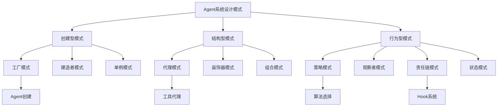
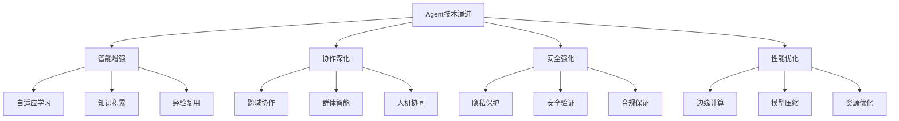
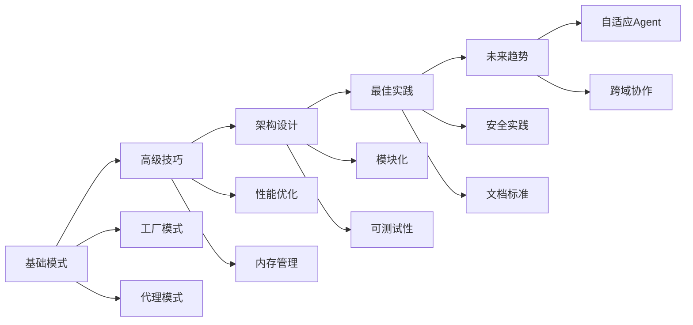

# 第22章：高级模式和最佳实践

> **本章学习目标**
> - 掌握Agent开发中的常见设计模式
> - 学习性能优化的高级技巧
> - 理解可维护性最佳实践
> - 掌握扩展性设计原则
> - 了解未来发展趋势和社区最佳实践

---

## 22.1 设计模式总结

### 22.1.1 Agent系统中的设计模式

在Agent开发中，我们运用了多种经典设计模式，每种模式都解决了特定的问题：



#### 1. 工厂模式（Factory Pattern）

工厂模式在Agent系统中用于创建和管理Agent实例：

```typescript
// Agent工厂模式实现
class AgentFactory {
  private static agentRegistry = new Map<string, AgentConstructor>();
  
  // 注册Agent类型
  static registerAgent(type: string, constructor: AgentConstructor): void {
    this.agentRegistry.set(type, constructor);
  }
  
  // 创建Agent实例
  static createAgent(config: AgentConfig): Agent {
    const AgentClass = this.agentRegistry.get(config.type);
    if (!AgentClass) {
      throw new Error(`Unknown agent type: ${config.type}`);
    }
    
    const agent = new AgentClass(config);
    return this.configureAgent(agent, config);
  }
  
  // 配置Agent
  private static configureAgent(agent: Agent, config: AgentConfig): Agent {
    // 应用配置构建器
    const builder = new AgentConfigBuilder(config);
    const enhancedConfig = builder
      .withSystemPrompt()
      .withContext()
      .withTools()
      .withModel()
      .build();
      
    agent.updateConfig(enhancedConfig);
    return agent;
  }
}

// 使用示例
const analyzer = AgentFactory.createAgent({
  type: 'syntax-analyzer',
  name: 'syntaxAnalyzer',
  config: { language: 'typescript' }
});
```

#### 2. 代理模式（Proxy Pattern）

代理模式用于工具调用和权限控制：

```typescript
// 工具代理实现
class ToolProxy implements ToolInterface {
  private tool: ToolInterface;
  private permissionChecker: PermissionChecker;
  private auditLogger: AuditLogger;
  
  constructor(tool: ToolInterface, permissions: string[]) {
    this.tool = tool;
    this.permissionChecker = new PermissionChecker(permissions);
    this.auditLogger = new AuditLogger();
  }
  
  async execute(params: any): Promise<any> {
    // 前置权限检查
    await this.permissionChecker.check(params);
    
    try {
      // 执行实际工具
      const result = await this.tool.execute(params);
      
      // 记录审计日志
      await this.auditLogger.logSuccess(this.tool.name, params);
      
      return result;
    } catch (error) {
      // 错误审计
      await this.auditLogger.logFailure(this.tool.name, params, error);
      throw error;
    }
  }
  
  get metadata(): ToolMetadata {
    return this.tool.metadata;
  }
}
```

#### 3. 策略模式（Strategy Pattern）

策略模式用于算法选择和模型回退：

```typescript
// 模型选择策略
interface ModelSelectionStrategy {
  selectModel(request: AgentRequest): ModelConfig;
}

class CostOptimizedStrategy implements ModelSelectionStrategy {
  selectModel(request: AgentRequest): ModelConfig {
    // 根据任务复杂度选择最经济的模型
    if (request.complexity === 'simple') {
      return { model: 'haiku', maxTokens: 4096 };
    }
    return { model: 'sonnet', maxTokens: 8192 };
  }
}

class PerformanceOptimizedStrategy implements ModelSelectionStrategy {
  selectModel(request: AgentRequest): ModelConfig {
    // 始终选择性能最优的模型
    return { model: 'opus', maxTokens: 16384 };
  }
}

class ModelSelector {
  private strategy: ModelSelectionStrategy;
  
  constructor(strategy: ModelSelectionStrategy) {
    this.strategy = strategy;
  }
  
  setStrategy(strategy: ModelSelectionStrategy): void {
    this.strategy = strategy;
  }
  
  selectModel(request: AgentRequest): ModelConfig {
    return this.strategy.selectModel(request);
  }
}
```

#### 4. 责任链模式（Chain of Responsibility）

Hook系统是责任链模式的经典应用：

```typescript
// Hook责任链实现
abstract class HookHandler {
  protected nextHook?: HookHandler;
  
  setNext(hook: HookHandler): HookHandler {
    this.nextHook = hook;
    return hook;
  }
  
  async handle(context: HookContext): Promise<HookResult> {
    if (this.nextHook) {
      return this.nextHook.handle(context);
    }
    return { status: 'success', data: context };
  }
}

class ValidationHook extends HookHandler {
  async handle(context: HookContext): Promise<HookResult> {
    // 验证逻辑
    const isValid = await this.validate(context);
    
    if (!isValid) {
      return { status: 'error', message: 'Validation failed' };
    }
    
    return super.handle(context);
  }
  
  private async validate(context: HookContext): Promise<boolean> {
    // 具体验证逻辑
    return context.data !== null;
  }
}

class ProcessingHook extends HookHandler {
  async handle(context: HookContext): Promise<HookResult> {
    // 处理逻辑
    const processed = await this.process(context);
    context.data = processed;
    
    return super.handle(context);
  }
  
  private async process(context: HookContext): Promise<any> {
    // 具体处理逻辑
    return context.data;
  }
}

// 构建Hook链
const validationHook = new ValidationHook();
const processingHook = new ProcessingHook();

validationHook.setNext(processingHook);
```

#### 5. 观察者模式（Observer Pattern）

观察者模式用于Agent间通信：

```typescript
// 事件观察者系统
interface AgentObserver {
  update(event: AgentEvent): void;
}

class AgentEventBus {
  private observers = new Map<string, Set<AgentObserver>>();
  
  subscribe(eventType: string, observer: AgentObserver): void {
    if (!this.observers.has(eventType)) {
      this.observers.set(eventType, new Set());
    }
    this.observers.get(eventType)!.add(observer);
  }
  
  unsubscribe(eventType: string, observer: AgentObserver): void {
    this.observers.get(eventType)?.delete(observer);
  }
  
  async publish(event: AgentEvent): Promise<void> {
    const observers = this.observers.get(event.type);
    if (observers) {
      await Promise.all(
        Array.from(observers).map(observer => observer.update(event))
      );
    }
  }
}

// Agent作为观察者
class AgentObserverImpl implements AgentObserver {
  constructor(private agent: Agent) {}
  
  update(event: AgentEvent): void {
    if (event.type === 'task-completed') {
      this.agent.onTaskCompleted(event.data);
    }
  }
}
```

### 22.1.2 高级组合模式

#### 1. Agent组合模式

```typescript
// Agent组合系统
interface AgentComponent {
  execute(request: AgentRequest): Promise<AgentResponse>;
}

class AgentComposite implements AgentComponent {
  private components: AgentComponent[] = [];
  
  add(component: AgentComponent): void {
    this.components.push(component);
  }
  
  remove(component: AgentComponent): void {
    const index = this.components.indexOf(component);
    if (index !== -1) {
      this.components.splice(index, 1);
    }
  }
  
  async execute(request: AgentRequest): Promise<AgentResponse> {
    // 并行执行所有组件
    const results = await Promise.all(
      this.components.map(component => component.execute(request))
    );
    
    // 合并结果
    return this.aggregateResults(results);
  }
  
  private aggregateResults(results: AgentResponse[]): AgentResponse {
    return {
      status: 'success',
      data: results.map(r => r.data).flat(),
      metadata: {
        componentCount: results.length,
        timestamp: Date.now()
      }
    };
  }
}
```

#### 2. 工具链模式

```typescript
// 工具链实现
class ToolChain implements ToolInterface {
  private tools: ToolInterface[] = [];
  
  addTool(tool: ToolInterface): ToolChain {
    this.tools.push(tool);
    return this;
  }
  
  async execute(initialInput: any): Promise<any> {
    let result = initialInput;
    
    for (const tool of this.tools) {
      result = await tool.execute(result);
      
      // 中断条件
      if (result.stop) {
        break;
      }
    }
    
    return result;
  }
  
  get metadata(): ToolMetadata {
    return {
      name: 'tool-chain',
      description: 'Chained tool execution',
      tools: this.tools.map(t => t.metadata)
    };
  }
}

// 流水线工具模式
class PipelineTool implements ToolInterface {
  private stages: PipelineStage[] = [];
  
  addStage(stage: PipelineStage): PipelineTool {
    this.stages.push(stage);
    return this;
  }
  
  async execute(input: any): Promise<any> {
    // 流水线并行执行
    const results = await this.executeStages(input);
    return this.collectResults(results);
  }
  
  private async executeStages(input: any): Promise<any[]> {
    return Promise.all(
      this.stages.map(stage => stage.process(input))
    );
  }
  
  private collectResults(results: any[]): any {
    return {
      status: 'completed',
      stages: results.length,
      outputs: results
    };
  }
}
```

---

## 22.2 性能优化技巧

### 22.2.1 Agent性能优化

#### 1. 智能缓存策略

```typescript
// Agent响应缓存系统
class AgentResponseCache {
  private cache = new Map<string, CachedResponse>();
  private ttl: number;
  
  constructor(ttl: number = 3600000) { // 1小时默认TTL
    this.ttl = ttl;
  }
  
  // 生成缓存键
  private generateKey(request: AgentRequest): string {
    const keyData = {
      agent: request.agentId,
      prompt: this.normalizePrompt(request.prompt),
      context: request.context,
      tools: request.tools?.map(t => t.name).sort()
    };
    return JSON.stringify(keyData);
  }
  
  // 标准化提示词
  private normalizePrompt(prompt: string): string {
    return prompt.trim().toLowerCase().replace(/\s+/g, ' ');
  }
  
  // 获取缓存
  get(request: AgentRequest): CachedResponse | null {
    const key = this.generateKey(request);
    const cached = this.cache.get(key);
    
    if (cached && !this.isExpired(cached)) {
      return cached;
    }
    
    this.cache.delete(key);
    return null;
  }
  
  // 设置缓存
  set(request: AgentRequest, response: AgentResponse): void {
    const key = this.generateKey(request);
    this.cache.set(key, {
      response,
      timestamp: Date.now(),
      hits: 0
    });
  }
  
  // 检查过期
  private isExpired(cached: CachedResponse): boolean {
    return Date.now() - cached.timestamp > this.ttl;
  }
  
  // 缓存统计
  getStats(): CacheStats {
    return {
      size: this.cache.size,
      hitRate: this.calculateHitRate(),
      avgResponseTime: this.calculateAvgResponseTime()
    };
  }
}

// 智能预加载
class AgentPreloader {
  private preloadQueue: PreloadTask[] = [];
  private maxPreloadTasks: number = 5;
  
  async preload(request: AgentRequest): Promise<void> {
    if (this.preloadQueue.length < this.maxPreloadTasks) {
      const task: PreloadTask = {
        request,
        priority: this.estimatePriority(request),
        timestamp: Date.now()
      };
      
      this.preloadQueue.push(task);
      await this.processPreloadQueue();
    }
  }
  
  private estimatePriority(request: AgentRequest): number {
    // 基于历史数据估算优先级
    const factors = {
      frequency: this.getFrequency(request),
      recency: this.getRecency(request),
      importance: this.getImportance(request)
    };
    
    return factors.frequency * 0.4 + 
           factors.recency * 0.3 + 
           factors.importance * 0.3;
  }
  
  private async processPreloadQueue(): Promise<void> {
    // 按优先级排序
    this.preloadQueue.sort((a, b) => b.priority - a.priority);
    
    // 处理高优先级任务
    const highPriorityTasks = this.preloadQueue.slice(0, 3);
    await Promise.all(
      highPriorityTasks.map(task => this.executePreload(task))
    );
  }
}
```

#### 2. 并行优化

```typescript
// 并行Agent执行优化器
class ParallelAgentOptimizer {
  private concurrencyLimit: number;
  private taskQueue: AgentTask[] = [];
  
  constructor(concurrencyLimit: number = 5) {
    this.concurrencyLimit = concurrencyLimit;
  }
  
  async executeTasks(tasks: AgentTask[]): Promise<AgentResult[]> {
    // 任务分组
    const taskGroups = this.groupTasksByCompatibility(tasks);
    
    // 并行执行兼容任务
    const results = await this.executeParallelGroups(taskGroups);
    
    return this.mergeResults(results);
  }
  
  private groupTasksByCompatibility(tasks: AgentTask[]): TaskGroup[] {
    const groups: TaskGroup[] = [];
    
    for (const task of tasks) {
      let assigned = false;
      
      // 尝试添加到现有组
      for (const group of groups) {
        if (this.isCompatible(task, group)) {
          group.tasks.push(task);
          assigned = true;
          break;
        }
      }
      
      // 创建新组
      if (!assigned) {
        groups.push({
          id: `group-${groups.length}`,
          tasks: [task],
          dependencies: this.analyzeDependencies(task)
        });
      }
    }
    
    return groups;
  }
  
  private isCompatible(task: AgentTask, group: TaskGroup): boolean {
    // 检查资源兼容性
    const resourceCompatible = this.checkResourceCompatibility(task, group);
    
    // 检查数据依赖
    const dependencyCompatible = this.checkDependencyCompatibility(task, group);
    
    return resourceCompatible && dependencyCompatible;
  }
  
  private async executeParallelGroups(groups: TaskGroup[]): Promise<AgentResult[]> {
    const semaphore = new Semaphore(this.concurrencyLimit);
    
    return Promise.all(
      groups.map(group => 
        semaphore.acquire().then(() => 
          this.executeGroup(group).finally(() => semaphore.release())
        )
      )
    );
  }
}
```

### 22.2.2 内存优化

#### 1. 流式处理

```typescript
// 流式Agent处理器
class StreamingAgentProcessor {
  private chunkSize: number;
  
  constructor(chunkSize: number = 1024) {
    this.chunkSize = chunkSize;
  }
  
  async *processStream(request: AgentRequest): AsyncGenerator<ProcessChunk> {
    // 分块读取输入
    const chunks = this.chunkInput(request.input);
    
    for (const chunk of chunks) {
      // 处理单个块
      const result = await this.processChunk(chunk);
      
      // 流式输出
      yield {
        chunkId: chunk.id,
        result,
        progress: chunk.progress,
        complete: chunk.complete
      };
      
      // 内存清理
      this.cleanupChunk(chunk);
    }
  }
  
  private *chunkInput(input: any): Generator<InputChunk> {
    const totalSize = this.calculateSize(input);
    let processed = 0;
    
    while (processed < totalSize) {
      const chunk = this.extractChunk(input, processed, this.chunkSize);
      processed += chunk.size;
      
      yield {
        id: `chunk-${processed}`,
        data: chunk,
        size: chunk.size,
        progress: processed / totalSize,
        complete: processed >= totalSize
      };
    }
  }
  
  private cleanupChunk(chunk: InputChunk): void {
    // 清理已处理的块数据
    chunk.data = null;
  }
}
```

#### 2. 资源池管理

```typescript
// Agent资源池
class AgentResourcePool {
  private agentPool: Map<string, PooledAgent[]>;
  private maxPoolSize: number;
  
  constructor(maxPoolSize: number = 10) {
    this.agentPool = new Map();
    this.maxPoolSize = maxPoolSize;
  }
  
  async acquireAgent(agentType: string): Promise<Agent> {
    let pool = this.agentPool.get(agentType);
    
    if (!pool) {
      pool = [];
      this.agentPool.set(agentType, pool);
    }
    
    // 尝试从池中获取
    if (pool.length > 0) {
      return pool.pop()!;
    }
    
    // 创建新实例
    return this.createAgent(agentType);
  }
  
  async releaseAgent(agentType: string, agent: Agent): Promise<void> {
    const pool = this.agentPool.get(agentType);
    
    if (pool && pool.length < this.maxPoolSize) {
      // 重置Agent状态
      await this.resetAgent(agent);
      pool.push(agent as PooledAgent);
    } else {
      // 销毁Agent
      await this.destroyAgent(agent);
    }
  }
  
  private async resetAgent(agent: Agent): Promise<void> {
    // 清理Agent状态
    agent.clearContext();
    agent.clearMemory();
  }
  
  private async destroyAgent(agent: Agent): Promise<void> {
    // 完全销毁Agent
    await agent.dispose();
  }
}
```

### 22.2.3 网络优化

#### 1. 批量请求处理

```typescript
// 批量请求处理器
class BatchRequestProcessor {
  private batchSize: number;
  private batchTimeout: number;
  private requestBuffer: AgentRequest[] = [];
  private processingTimer?: any;
  
  constructor(batchSize: number = 10, batchTimeout: number = 100) {
    this.batchSize = batchSize;
    this.batchTimeout = batchTimeout;
  }
  
  async addRequest(request: AgentRequest): Promise<AgentResponse> {
    return new Promise((resolve, reject) => {
      this.requestBuffer.push({
        ...request,
        resolve,
        reject
      } as BatchedRequest);
      
      if (this.requestBuffer.length >= this.batchSize) {
        this.processBatch();
      } else {
        this.scheduleBatch();
      }
    });
  }
  
  private scheduleBatch(): void {
    if (this.processingTimer) {
      clearTimeout(this.processingTimer);
    }
    
    this.processingTimer = setTimeout(() => {
      this.processBatch();
    }, this.batchTimeout);
  }
  
  private async processBatch(): Promise<void> {
    const batch = this.requestBuffer.splice(0, this.batchSize);
    
    try {
      const responses = await this.executeBatch(batch);
      
      // 分发响应
      batch.forEach((request, index) => {
        request.resolve(responses[index]);
      });
    } catch (error) {
      // 批量错误处理
      batch.forEach(request => {
        request.reject(error);
      });
    }
  }
  
  private async executeBatch(batch: BatchedRequest[]): Promise<AgentResponse[]> {
    // 批量执行逻辑
    const batchedRequest = this.createBatchRequest(batch);
    const batchedResponse = await this.executeBatchedRequest(batchedRequest);
    
    return this.splitBatchResponse(batchedResponse, batch.length);
  }
}
```

#### 2. 连接复用

```typescript
// Agent连接池
class AgentConnectionPool {
  private connections: Map<string, AgentConnection[]>;
  private maxConnections: number;
  private connectionTimeout: number;
  
  constructor(maxConnections: number = 5, connectionTimeout: number = 30000) {
    this.connections = new Map();
    this.maxConnections = maxConnections;
    this.connectionTimeout = connectionTimeout;
  }
  
  async getConnection(endpoint: string): Promise<AgentConnection> {
    let pool = this.connections.get(endpoint);
    
    if (!pool) {
      pool = [];
      this.connections.set(endpoint, pool);
    }
    
    // 查找可用连接
    const availableConnection = pool.find(conn => conn.isAvailable());
    if (availableConnection) {
      return availableConnection;
    }
    
    // 创建新连接
    if (pool.length < this.maxConnections) {
      const connection = await this.createConnection(endpoint);
      pool.push(connection);
      return connection;
    }
    
    // 等待连接可用
    return this.waitForAvailableConnection(pool);
  }
  
  private async waitForAvailableConnection(pool: AgentConnection[]): Promise<AgentConnection> {
    return new Promise((resolve, reject) => {
      const checkInterval = setInterval(() => {
        const available = pool.find(conn => conn.isAvailable());
        if (available) {
          clearInterval(checkInterval);
          resolve(available);
        }
      }, 100);
      
      // 超时处理
      setTimeout(() => {
        clearInterval(checkInterval);
        reject(new Error('Connection timeout'));
      }, this.connectionTimeout);
    });
  }
  
  private async createConnection(endpoint: string): Promise<AgentConnection> {
    // 连接创建逻辑
    const connection = new AgentConnection(endpoint);
    await connection.connect();
    return connection;
  }
}
```

---

## 22.3 可维护性最佳实践

### 22.3.1 代码组织

#### 1. 分层架构

```typescript
// Agent分层架构
namespace AgentArchitecture {
  // 表示层 - API接口
  export interface AgentAPI {
    execute(request: AgentRequest): Promise<AgentResponse>;
    getStatus(): AgentStatus;
    getConfig(): AgentConfig;
  }
  
  // 应用层 - 业务逻辑
  export class AgentApplication implements AgentAPI {
    private coordinator: AgentCoordinator;
    private validator: RequestValidator;
    private logger: AgentLogger;
    
    async execute(request: AgentRequest): Promise<AgentResponse> {
      // 验证请求
      await this.validator.validate(request);
      
      // 记录日志
      this.logger.logRequest(request);
      
      try {
        // 协调执行
        const response = await this.coordinator.coordinate(request);
        
        this.logger.logResponse(response);
        return response;
        
      } catch (error) {
        this.logger.logError(error);
        throw error;
      }
    }
    
    getStatus(): AgentStatus {
      return this.coordinator.getStatus();
    }
    
    getConfig(): AgentConfig {
      return this.coordinator.getConfig();
    }
  }
  
  // 领域层 - 核心业务
  export class AgentDomain {
    private agents: Map<string, AgentEntity>;
    private relationships: AgentRelationshipMap;
    
    registerAgent(agent: AgentEntity): void {
      this.agents.set(agent.id, agent);
      this.updateRelationships(agent);
    }
    
    getAgent(id: string): AgentEntity | undefined {
      return this.agents.get(id);
    }
    
    private updateRelationships(agent: AgentEntity): void {
      // 更新Agent关系图
    }
  }
  
  // 基础设施层 - 技术实现
  export class AgentInfrastructure {
    private persistence: AgentPersistence;
    private messaging: AgentMessaging;
    private monitoring: AgentMonitoring;
    
    constructor() {
      this.persistence = new AgentPersistence();
      this.messaging = new AgentMessaging();
      this.monitoring = new AgentMonitoring();
    }
    
    async persistAgent(agent: AgentEntity): Promise<void> {
      return this.persistence.save(agent);
    }
    
    async sendMessage(message: AgentMessage): Promise<void> {
      return this.messaging.send(message);
    }
    
    async monitor(agent: AgentEntity): Promise<void> {
      return this.monitoring.track(agent);
    }
  }
}
```

#### 2. 模块化设计

```typescript
// Agent模块系统
interface AgentModule {
  name: string;
  version: string;
  dependencies?: string[];
  initialize(): Promise<void>;
  destroy(): Promise<void>;
}

class AgentModuleManager {
  private modules = new Map<string, AgentModule>();
  private dependencyGraph: DependencyGraph;
  
  async loadModule(module: AgentModule): Promise<void> {
    // 检查依赖
    await this.checkDependencies(module);
    
    // 初始化模块
    await module.initialize();
    
    // 注册模块
    this.modules.set(module.name, module);
    
    // 更新依赖图
    this.updateDependencyGraph(module);
  }
  
  async unloadModule(moduleName: string): Promise<void> {
    const module = this.modules.get(moduleName);
    if (!module) return;
    
    // 检查反向依赖
    const dependents = this.getDependents(moduleName);
    if (dependents.length > 0) {
      throw new Error(`Cannot unload module: ${dependents.length} modules depend on it`);
    }
    
    // 销毁模块
    await module.destroy();
    
    // 移除模块
    this.modules.delete(moduleName);
    
    // 更新依赖图
    this.updateDependencyGraph(module);
  }
  
  private async checkDependencies(module: AgentModule): Promise<void> {
    if (module.dependencies) {
      for (const dep of module.dependencies) {
        if (!this.modules.has(dep)) {
          throw new Error(`Missing dependency: ${dep}`);
        }
      }
    }
  }
  
  private getDependents(moduleName: string): string[] {
    return Array.from(this.modules.values())
      .filter(m => m.dependencies?.includes(moduleName))
      .map(m => m.name);
  }
}
```

### 22.3.2 错误处理

#### 1. 统一错误处理

```typescript
// Agent错误处理系统
namespace AgentErrorHandling {
  export class AgentError extends Error {
    constructor(
      message: string,
      public code: string,
      public details?: any,
      public cause?: Error
    ) {
      super(message);
      this.name = 'AgentError';
    }
  }
  
  export class ErrorHandler {
    private handlers = new Map<string, ErrorHandlingStrategy>();
    
    register(code: string, strategy: ErrorHandlingStrategy): void {
      this.handlers.set(code, strategy);
    }
    
    async handle(error: AgentError): Promise<ErrorResult> {
      const strategy = this.handlers.get(error.code);
      
      if (strategy) {
        return strategy.execute(error);
      }
      
      // 默认处理
      return this.defaultHandler(error);
    }
    
    private defaultHandler(error: AgentError): ErrorResult {
      return {
        handled: false,
        action: 'propagate',
        error
      };
    }
  }
  
  export interface ErrorHandlingStrategy {
    execute(error: AgentError): Promise<ErrorResult>;
  }
  
  export class RetryStrategy implements ErrorHandlingStrategy {
    constructor(
      private maxRetries: number = 3,
      private delay: number = 1000
    ) {}
    
    async execute(error: AgentError): Promise<ErrorResult> {
      if (error.code === 'RATE_LIMIT_EXCEEDED') {
        return {
          handled: true,
          action: 'retry',
          retryAfter: this.delay,
          error
        };
      }
      
      return { handled: false, action: 'propagate', error };
    }
  }
  
  export class FallbackStrategy implements ErrorHandlingStrategy {
    constructor(private fallbackAgent?: string) {}
    
    async execute(error: AgentError): Promise<ErrorResult> {
      if (error.code === 'MODEL_UNAVAILABLE') {
        return {
          handled: true,
          action: 'fallback',
          fallbackAgent: this.fallbackAgent,
          error
        };
      }
      
      return { handled: false, action: 'propagate', error };
    }
  }
}
```

### 22.3.3 测试策略

#### 1. 可测试性设计

```typescript
// 可测试的Agent设计
export class TestableAgent {
  private logger: AgentLogger;
  private validator: RequestValidator;
  private executor: AgentExecutor;
  
  constructor(
    logger?: AgentLogger,
    validator?: RequestValidator,
    executor?: AgentExecutor
  ) {
    // 依赖注入便于测试
    this.logger = logger || new ProductionLogger();
    this.validator = validator || new ProductionValidator();
    this.executor = executor || new ProductionExecutor();
  }
  
  async execute(request: AgentRequest): Promise<AgentResponse> {
    // 验证
    await this.validator.validate(request);
    
    // 记录
    this.logger.log(request);
    
    // 执行
    return this.executor.execute(request);
  }
}

// 测试工具
export class AgentTestBuilder {
  private mockLogger = new MockLogger();
  private mockValidator = new MockValidator();
  private mockExecutor = new MockExecutor();
  
  withLogger(logger: AgentLogger): this {
    this.mockLogger = logger as any;
    return this;
  }
  
  withValidator(validator: RequestValidator): this {
    this.mockValidator = validator as any;
    return this;
  }
  
  withExecutor(executor: AgentExecutor): this {
    this.mockExecutor = executor as any;
    return this;
  }
  
  build(): TestableAgent {
    return new TestableAgent(
      this.mockLogger,
      this.mockValidator,
      this.mockExecutor
    );
  }
}
```

---

## 22.4 扩展性设计原则

### 22.4.1 插件化架构

```typescript
// Agent插件系统
interface AgentPlugin {
  name: string;
  version: string;
  hooks?: PluginHooks;
  tools?: ToolProvider[];
  agents?: AgentProvider[];
}

class AgentPluginSystem {
  private plugins = new Map<string, AgentPlugin>();
  private hookRegistry: HookRegistry;
  private toolRegistry: ToolRegistry;
  private agentRegistry: AgentRegistry;
  
  constructor() {
    this.hookRegistry = new HookRegistry();
    this.toolRegistry = new ToolRegistry();
    this.agentRegistry = new AgentRegistry();
  }
  
  async loadPlugin(plugin: AgentPlugin): Promise<void> {
    // 注册钩子
    if (plugin.hooks) {
      this.registerHooks(plugin.name, plugin.hooks);
    }
    
    // 注册工具
    if (plugin.tools) {
      for (const provider of plugin.tools) {
        await this.toolRegistry.register(provider);
      }
    }
    
    // 注册Agent
    if (plugin.agents) {
      for (const provider of plugin.agents) {
        await this.agentRegistry.register(provider);
      }
    }
    
    this.plugins.set(plugin.name, plugin);
  }
  
  async unloadPlugin(pluginName: string): Promise<void> {
    const plugin = this.plugins.get(pluginName);
    if (!plugin) return;
    
    // 移除钩子
    if (plugin.hooks) {
      this.unregisterHooks(pluginName, plugin.hooks);
    }
    
    // 移除工具
    if (plugin.tools) {
      for (const provider of plugin.tools) {
        await this.toolRegistry.unregister(provider.name);
      }
    }
    
    // 移除Agent
    if (plugin.agents) {
      for (const provider of plugin.agents) {
        await this.agentRegistry.unregister(provider.name);
      }
    }
    
    this.plugins.delete(pluginName);
  }
  
  private registerHooks(pluginName: string, hooks: PluginHooks): void {
    for (const [hookName, handler] of Object.entries(hooks)) {
      this.hookRegistry.register(hookName, {
        plugin: pluginName,
        handler
      });
    }
  }
  
  private unregisterHooks(pluginName: string, hooks: PluginHooks): void {
    for (const hookName of Object.keys(hooks)) {
      this.hookRegistry.unregister(hookName, pluginName);
    }
  }
}
```

### 22.4.2 配置驱动

```typescript
// 配置驱动的Agent系统
class ConfigurableAgentSystem {
  private configSchema: ConfigSchema;
  private configValidator: ConfigValidator;
  private configApplier: ConfigApplier;
  
  constructor() {
    this.configSchema = this.buildSchema();
    this.configValidator = new ConfigValidator(this.configSchema);
    this.configApplier = new ConfigApplier();
  }
  
  async updateConfig(config: AgentSystemConfig): Promise<void> {
    // 验证配置
    const validationResult = await this.configValidator.validate(config);
    
    if (!validationResult.valid) {
      throw new ConfigValidationError(validationResult.errors);
    }
    
    // 应用配置
    await this.configApplier.apply(config);
    
    // 热重载
    await this.hotReload(config);
  }
  
  private buildSchema(): ConfigSchema {
    return {
      agents: {
        type: 'array',
        items: {
          type: 'object',
          properties: {
            id: { type: 'string' },
            type: { type: 'string', enum: ['specialist', 'generalist', 'coordinator'] },
            config: { type: 'object' },
            enabled: { type: 'boolean' }
          },
          required: ['id', 'type']
        }
      },
      tools: {
        type: 'array',
        items: {
          type: 'object',
          properties: {
            name: { type: 'string' },
            permissions: { type: 'array', items: { type: 'string' } }
          }
        }
      }
    };
  }
  
  private async hotReload(config: AgentSystemConfig): Promise<void> {
    // 热重载逻辑
    const changes = this.detectChanges(config);
    
    for (const change of changes) {
      await this.applyChange(change);
    }
  }
}
```

---

## 22.5 社区最佳实践

### 22.5.1 命名约定

```typescript
// Agent命名约定
namespace NamingConventions {
  // Agent命名：PascalCase + 功能描述
  export class CodeQualityAnalyzer extends AgentBase {}
  export class SecurityReviewAgent extends AgentBase {}
  export class PerformanceOptimizerAgent extends AgentBase {}
  
  // 工具命名：动词开头 + camelCase
  export const analyzeCode = createTool({
    name: 'analyzeCode',
    // ...
  });
  
  export const refactorCode = createTool({
    name: 'refactorCode',
    // ...
  });
  
  // Hook命名：事件描述 + Before/After
  export const beforeAgentExecution = createHook({
    name: 'beforeAgentExecution',
    // ...
  });
  
  export const afterToolExecution = createHook({
    name: 'afterToolExecution',
    // ...
  });
  
  // 配置命名：描述性 + 环境后缀
  export const productionConfig = {
    agentTimeout: 30000,
    maxRetries: 3,
    // ...
  };
  
  export const developmentConfig = {
    agentTimeout: 60000,
    maxRetries: 1,
    // ...
  };
}
```

### 22.5.2 文档标准

```typescript
// Agent文档标准
/**
 * CodeQualityAnalyzer Agent
 * 
 * @description 分析代码质量并提供改进建议
 * @category Analysis
 * @version 1.0.0
 * 
 * @example
 * ```typescript
 * const analyzer = new CodeQualityAnalyzer({
 *   language: 'typescript',
 *   rules: ['complexity', 'maintainability']
 * });
 * 
 * const result = await analyzer.analyze(code);
 * ```
 * 
 * @capabilities
 * - 代码复杂度分析
 * - 可维护性评估
 * - 最佳实践检查
 * 
 * @limitations
 * - 仅支持静态分析
 * - 不执行运行时检查
 * - 需要完整代码上下文
 * 
 * @performance
 * - 分析时间: ~100ms/100行代码
 * - 内存使用: ~50MB
 * - 并发支持: 是
 * 
 * @see {@link https://docs.opencode.com/agents/code-quality}
 */
export class CodeQualityAnalyzer extends AgentBase {
  // 实现代码
}
```

### 22.5.3 安全最佳实践

```typescript
// Agent安全实践
namespace SecurityBestPractices {
  // 输入验证
  export class SecureAgent extends AgentBase {
    private inputValidator: InputValidator;
    
    constructor(config: SecureAgentConfig) {
      super(config);
      this.inputValidator = new InputValidator(config.securityRules);
    }
    
    protected async validateInput(input: any): Promise<void> {
      // 验证输入大小
      if (input.size > this.config.maxInputSize) {
        throw new SecurityError('Input size exceeds limit');
      }
      
      // 验证输入格式
      if (!this.inputValidator.validate(input)) {
        throw new SecurityError('Invalid input format');
      }
      
      // 检查恶意内容
      if (this.containsMaliciousContent(input)) {
        throw new SecurityError('Malicious content detected');
      }
    }
    
    private containsMaliciousContent(input: any): boolean {
      // 恶意内容检测逻辑
      return false;
    }
  }
  
  // 输出过滤
  export class OutputFilter {
    private filterRules: FilterRule[];
    
    constructor(filterRules: FilterRule[]) {
      this.filterRules = filterRules;
    }
    
    filter(output: any): any {
      let filtered = output;
      
      for (const rule of this.filterRules) {
        filtered = rule.apply(filtered);
      }
      
      return filtered;
    }
  }
  
  // 权限控制
  export class PermissionController {
    private permissions = new Map<string, PermissionSet>();
    
    checkPermission(agentId: string, resource: string, action: string): boolean {
      const perms = this.permissions.get(agentId);
      if (!perms) return false;
      
      return perms.can(resource, action);
    }
    
    grantPermission(agentId: string, permission: Permission): void {
      let perms = this.permissions.get(agentId);
      if (!perms) {
        perms = new PermissionSet();
        this.permissions.set(agentId, perms);
      }
      
      perms.add(permission);
    }
  }
}
```

---

## 22.6 未来发展趋势

### 22.6.1 技术演进方向



#### 1. 自适应Agent

```typescript
// 自适应Agent原型
class AdaptiveAgent extends AgentBase {
  private learningEngine: LearningEngine;
  private experienceStore: ExperienceStore;
  
  constructor(config: AdaptiveAgentConfig) {
    super(config);
    this.learningEngine = new LearningEngine();
    this.experienceStore = new ExperienceStore();
  }
  
  async execute(request: AgentRequest): Promise<AgentResponse> {
    // 检索相关经验
    const experiences = await this.experienceStore.findRelevant(request);
    
    // 应用学习
    const enhancedRequest = this.applyLearning(request, experiences);
    
    // 执行任务
    const response = await super.execute(enhancedRequest);
    
    // 学习和改进
    await this.learningFromExecution(request, response);
    
    return response;
  }
  
  private applyLearning(request: AgentRequest, experiences: Experience[]): AgentRequest {
    // 应用历史经验改进当前请求
    return this.learningEngine.enhanceRequest(request, experiences);
  }
  
  private async learningFromExecution(request: AgentRequest, response: AgentResponse): Promise<void> {
    // 从执行中学习
    const experience = await this.learningEngine.analyzeExecution(request, response);
    
    // 存储经验
    await this.experienceStore.store(experience);
  }
}
```

#### 2. 跨域协作

```typescript
// 跨域协作Agent
class CrossDomainAgent extends AgentBase {
  private domainExpertise: Map<string, DomainKnowledge>;
  private translationLayer: DomainTranslationLayer;
  
  constructor(config: CrossDomainAgentConfig) {
    super(config);
    this.domainExpertise = new Map();
    this.translationLayer = new DomainTranslationLayer();
  }
  
  async collaborateWith(agent: Agent, domain: string): Promise<AgentResponse> {
    // 获取领域知识
    const domainKnowledge = this.domainExpertise.get(domain);
    
    // 翻译请求
    const translatedRequest = await this.translationLayer.translate(
      this.currentRequest,
      this.currentDomain,
      domain,
      domainKnowledge
    );
    
    // 跨域协作
    return agent.execute(translatedRequest);
  }
  
  addDomainExpertise(domain: string, knowledge: DomainKnowledge): void {
    this.domainExpertise.set(domain, knowledge);
  }
}
```

### 22.6.2 生态系统发展

#### 1. Agent市场

```typescript
// Agent市场系统
interface AgentMarketplace {
  // 发现Agent
  discoverAgents(query: AgentQuery): Promise<AgentListing[]>;
  
  // 获取Agent
  acquireAgent(agentId: string): Promise<AgentPackage>;
  
  // 评价Agent
  rateAgent(agentId: string, rating: AgentRating): Promise<void>;
  
  // 发布Agent
  publishAgent(agent: AgentPackage): Promise<string>;
}

class AgentMarketClient implements AgentMarketplace {
  private apiClient: MarketplaceAPIClient;
  
  async discoverAgents(query: AgentQuery): Promise<AgentListing[]> {
    const response = await this.apiClient.get('/agents/discover', {
      params: this.buildQueryParams(query)
    });
    
    return response.data.map(this.parseAgentListing);
  }
  
  async acquireAgent(agentId: string): Promise<AgentPackage> {
    const response = await this.apiClient.get(`/agents/${agentId}/package`);
    return this.parseAgentPackage(response.data);
  }
  
  async rateAgent(agentId: string, rating: AgentRating): Promise<void> {
    await this.apiClient.post(`/agents/${agentId}/ratings`, rating);
  }
  
  async publishAgent(agent: AgentPackage): Promise<string> {
    const response = await this.apiClient.post('/agents/publish', agent);
    return response.data.agentId;
  }
}
```

#### 2. 标准化协议

```typescript
// Agent通信协议标准
namespace AgentProtocol {
  // 标准消息格式
  export interface AgentMessage {
    version: string;
    timestamp: number;
    source: AgentEndpoint;
    destination: AgentEndpoint;
    payload: MessagePayload;
    signature?: string;
  }
  
  // 标准接口
  export interface StandardAgentInterface {
    // 能力查询
    getCapabilities(): Promise<AgentCapabilities>;
    
    // 健康检查
    healthCheck(): Promise<HealthStatus>;
    
    // 配置管理
    getConfig(): Promise<AgentConfig>;
    updateConfig(config: AgentConfig): Promise<void>;
    
    // 生命周期
    start(): Promise<void>;
    stop(): Promise<void>;
  }
  
  // 标准事件
  export interface AgentEvent {
    type: EventType;
    source: string;
    timestamp: number;
    data: any;
  }
  
  export enum EventType {
    AGENT_STARTED = 'agent.started',
    AGENT_STOPPED = 'agent.stopped',
    TASK_COMPLETED = 'task.completed',
    ERROR_OCCURRED = 'error.occurred',
    CONFIG_UPDATED = 'config.updated'
  }
}
```

---

## 22.7 实践练习

### 练习1：应用设计模式

**任务**: 使用工厂模式和策略模式重构一个简单的Agent系统

**要求**:
1. 创建Agent工厂，支持多种Agent类型
2. 实现不同的执行策略
3. 支持策略的动态切换

**参考实现**:

```typescript
// Agent工厂
class EnhancedAgentFactory {
  static createAgent(type: AgentType, strategy: ExecutionStrategy): Agent {
    const config = new AgentConfigBuilder()
      .withType(type)
      .withStrategy(strategy)
      .build();
      
    return new EnhancedAgent(config);
  }
}

// 使用示例
const fastAgent = EnhancedAgentFactory.createAgent(
  'generalist',
  new FastExecutionStrategy()
);

const qualityAgent = EnhancedAgentFactory.createAgent(
  'specialist',
  new QualityFirstStrategy()
);
```

### 练习2：性能优化

**任务**: 实现Agent响应缓存和批量处理

**要求**:
1. 实现智能缓存系统
2. 支持批量请求处理
3. 监控性能改进效果

**参考实现**:

```typescript
// 缓存优化Agent
class CachedAgent extends AgentBase {
  private cache: AgentResponseCache;
  
  constructor(config: AgentConfig) {
    super(config);
    this.cache = new AgentResponseCache(3600000);
  }
  
  async execute(request: AgentRequest): Promise<AgentResponse> {
    // 检查缓存
    const cached = this.cache.get(request);
    if (cached) {
      return cached.response;
    }
    
    // 执行请求
    const response = await super.execute(request);
    
    // 缓存响应
    this.cache.set(request, response);
    
    return response;
  }
}
```

### 练习3：重构代码

**任务**: 将现有的单体Agent重构为模块化系统

**要求**:
1. 识别可分离的功能模块
2. 设计模块间接口
3. 实现依赖注入
4. 添加单元测试

**参考步骤**:

1. 分析现有Agent代码
2. 识别核心功能点
3. 设计模块接口
4. 实现依赖注入容器
5. 编写单元测试
6. 验证功能完整性

---

## 22.8 本章小结

### 核心要点

1. **设计模式应用**
   - 工厂模式：Agent创建和管理
   - 代理模式：权限控制和访问管理
   - 策略模式：算法选择和动态切换
   - 责任链模式：Hook系统实现
   - 观察者模式：Agent间通信

2. **性能优化**
   - 智能缓存策略
   - 并行执行优化
   - 流式数据处理
   - 资源池管理
   - 网络优化技术

3. **可维护性**
   - 分层架构设计
   - 模块化开发
   - 统一错误处理
   - 可测试性设计

4. **扩展性**
   - 插件化架构
   - 配置驱动设计
   - 标准化接口

5. **最佳实践**
   - 命名约定
   - 文档标准
   - 安全实践
   - 社区规范

### 学习路径



### 下一步学习

1. **深入实践**
   - 参与开源项目
   - 构建完整应用
   - 分享经验总结

2. **持续学习**
   - 关注技术发展
   - 参与社区讨论
   - 贡献开源代码

3. **知识沉淀**
   - 编写技术博客
   - 制作教学视频
   - 组织技术分享

---

## 22.9 参考资源

### 官方资源
- OpenCode官方文档: https://docs.opencode.com
- Agent开发指南: https://docs.opencode.com/agent-guide
- API参考手册: https://docs.opencode.com/api-reference

### 社区资源
- GitHub仓库: https://github.com/opencode-swarm
- 讨论论坛: https://community.opencode.com
- Stack Overflow: https://stackoverflow.com/questions/tagged/opencode

### 推荐阅读
- 《设计模式：可复用面向对象软件的基础》
- 《企业应用架构模式》
- 《程序员修炼之道》

### 在线课程
- Agent开发入门到精通
- 高级Agent架构设计
- Agent性能优化实践

---

**恭喜！** 你已经完成了OpenCode智能体开发教程的全部内容。现在你可以：

1. ✅ 构建复杂的Agent系统
2. ✅ 应用最佳实践和设计模式
3. ✅ 优化系统性能
4. ✅ 参与开源社区贡献
5. ✅ 分享你的知识和经验

**继续学习之旅，探索Agent技术的无限可能！** 🚀