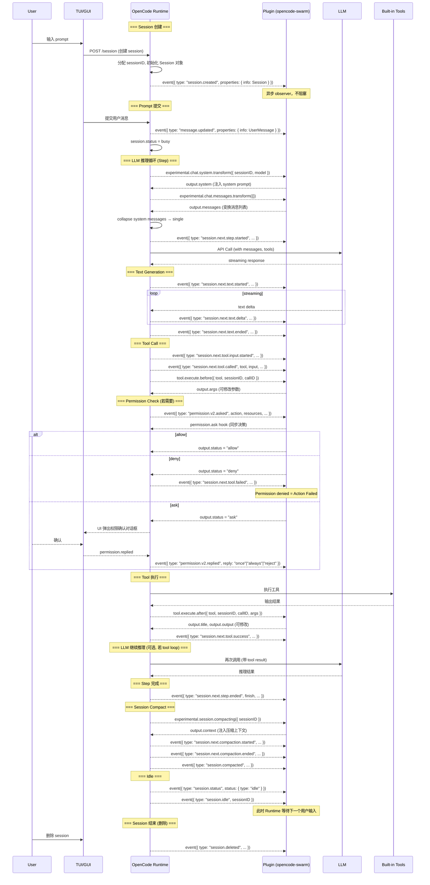
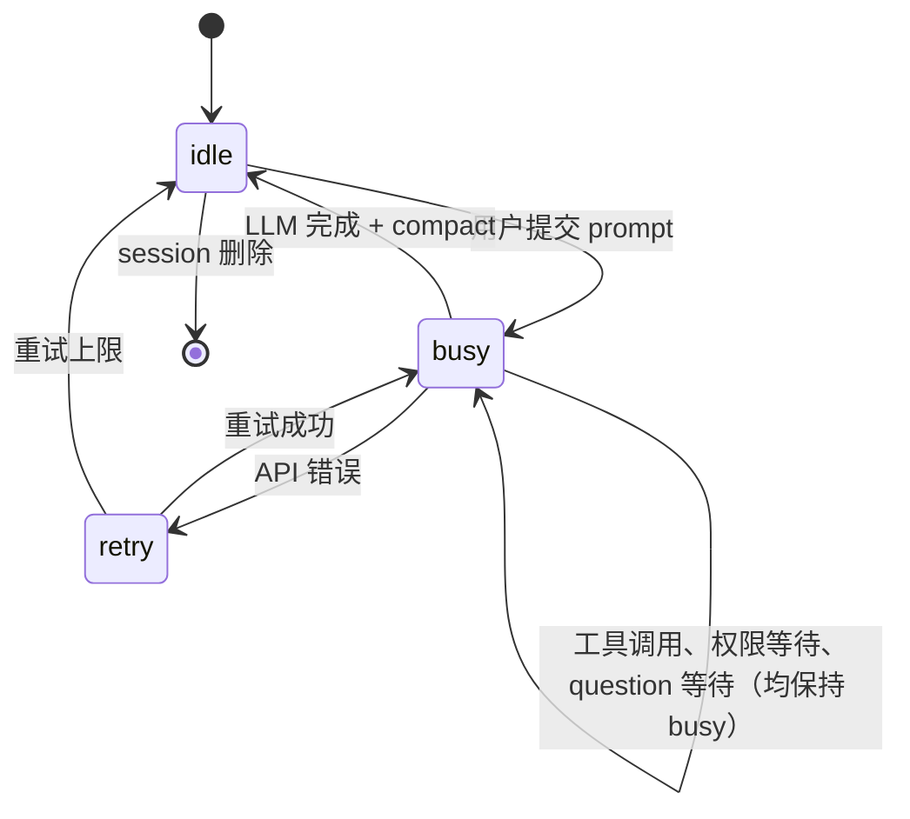
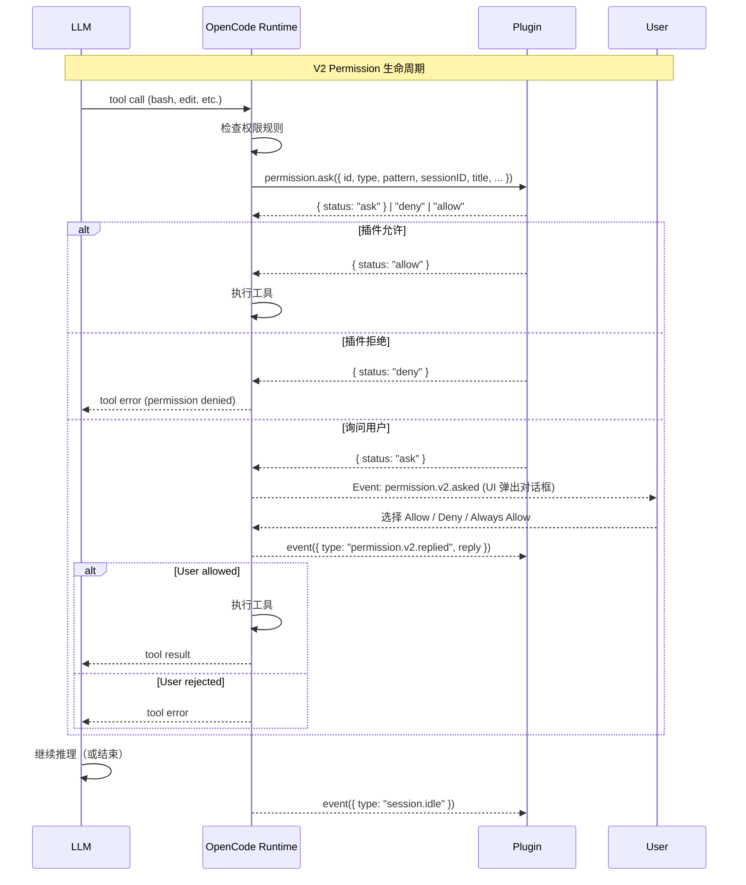
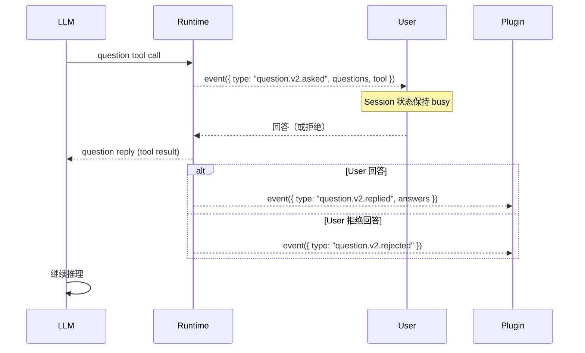
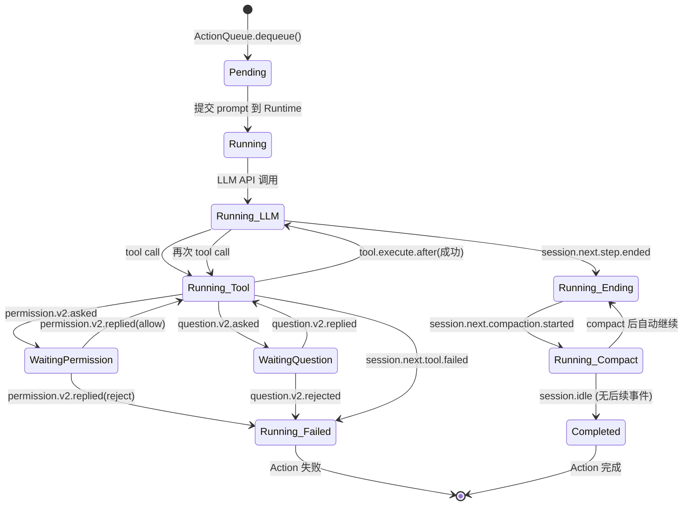

# OpenCode Runtime 生命周期与 Plugin Hook 逆向研究报告

> **目标：理解 OpenCode Runtime 能力边界，设计 ai-build 插件的 Main Loop（工作流调度器）架构**
>
> 研究方法：源码分析（opencode-swarm v7.110.2, @opencode-ai/plugin@1.1.53, @opencode-ai/sdk@1.1.53）、
> SDK 类型逆向、社区讨论追踪、实际实验
>
> 报告日期：2026-07-19

---

## 目录

0. [V2 Event Bus 完整事件列表](#0-v2-event-bus-完整事件列表)
1. [Runtime 生命周期（完整时序图）](#1-runtime-生命周期完整时序图)
2. [Plugin 生命周期](#2-plugin-生命周期)
3. [所有 Hook 的触发时机](#3-所有-hook-的触发时机)
4. [session.status 深度分析](#4-sessionstatus-深度分析)
5. [session.idle 语义确认](#5-sessionidle-语义确认)
6. [Permission 生命周期](#6-permission-生命周期)
7. [Question Tool 生命周期](#7-question-tool-生命周期)
8. [experimental Hook 研究](#8-experimental-hook-研究)
9. [Action 生命周期与状态机](#9-action-生命周期与状态机)
10. [Main Loop 最佳挂接点](#10-main-loop-最佳挂接点)
11. [领域事件模型（推荐）](#11-领域事件模型推荐)

---

## 0. V2 Event Bus 完整事件列表

V2 Event Bus 是 OpenCode Runtime 的事件主干。V2 事件经过 **事件溯源（Event Sourcing）** 处理，所有 `SessionNext*` 事件都是持久化（durable）的，可以被重放。

### 事件格式

V2 事件统一使用以下信封结构：

```typescript
{
    id: string;
    metadata?: { [key: string]: unknown };
    type: string;                        // 事件标识
    durable?: {                          // 存在 = 事件是可持久化的
        aggregateID: string;
        seq: number;
        version: number;
    };
    location?: LocationRef;              // 关联的工作目录
    data: { ... };                       // 事件体（V1 的 properties）
}
```

V1 事件（通过 `event` hook 接收）使用 `{ id, type, properties }` 格式，**没有** `data` / `durable` / `location` 字段。

### V2Event 完全枚举（83 个事件类型）

所有事件按功能域分组：

#### 0.1 Session / Message CRUD（7 个）

```typescript
// V2: SessionCreated
type SessionCreated = {
    type: "session.created";
    data: { sessionID: string; info: Session };
};

// V2: SessionUpdated
type SessionUpdated = {
    type: "session.updated";
    data: { sessionID: string; info: Session };
};

// V2: SessionDeleted
type SessionDeleted = {
    type: "session.deleted";
    data: { sessionID: string; info: Session };
};

// V2: MessageUpdated
type MessageUpdated = {
    type: "message.updated";
    data: { sessionID: string; info: Message };
};

// V2: MessageRemoved
type MessageRemoved = {
    type: "message.removed";
    data: { sessionID: string; messageID: string };
};

// V2: MessagePartUpdated
type MessagePartUpdated = {
    type: "message.part.updated";
    data: { sessionID; part: Part; time: number };
};

// V2: MessagePartRemoved
type MessagePartRemoved = {
    type: "message.part.removed";
    data: { sessionID: string; messageID: string; partID: string };
};
```

#### 0.2 Session 状态信号（4 个）

```typescript
// V2: SessionStatus2
type SessionStatus2 = {
    type: "session.status";
    data: { sessionID: string; status: SessionStatus };
};

// V2: SessionIdle
type SessionIdle = {
    type: "session.idle";
    data: { sessionID: string };
};

// V2: SessionCompacted
type SessionCompacted = {
    type: "session.compacted";
    data: { sessionID: string };
};

// V2: SessionDiff
type SessionDiff = {
    type: "session.diff";
    data: { sessionID: string; diff: Array<SnapshotFileDiff> };
};
```

#### 0.3 Session Error（1 个）

```typescript
// V2: SessionError
type SessionError = {
    type: "session.error";
    data: {
        sessionID?: string;
        error?: ProviderAuthError | UnknownError | MessageOutputLengthError
              | MessageAbortedError | StructuredOutputError
              | ContextOverflowError | ContentFilterError | ApiError;
    };
};
```

#### 0.4 SessionNext — LLM Step 生命周期（31 个，全部 durable）

Main Loop 最关心的核心事件组。

```typescript
// === Step 生命周期 ===
type SessionNextStepStarted = {
    type: "session.next.step.started";
    data: { timestamp; sessionID; assistantMessageID; agent: string;
            model: ModelRef; snapshot?: string; };
};
type SessionNextStepEnded = {
    type: "session.next.step.ended";
    data: { timestamp; sessionID; assistantMessageID; finish: string;
            cost: number; tokens: {...}; snapshot?: string; files?: string[]; };
};
type SessionNextStepFailed = {
    type: "session.next.step.failed";
    data: { timestamp; sessionID; assistantMessageID; error; };
};

// === Text 输出 ===
type SessionNextTextStarted / TextDelta / TextEnded = {
    // streaming text output deltas
};

// === Reasoning 输出 ===
type SessionNextReasoningStarted / ReasoningDelta / ReasoningEnded = {
    // LLM reasoning trace
};

// === Tool Input (LLM 生成 tool args 过程) ===
type SessionNextToolInputStarted / ToolInputDelta / ToolInputEnded = {
    // streaming tool argument generation
};

// === Tool 执行 ===
type SessionNextToolCalled = {
    type: "session.next.tool.called";
    data: { timestamp; sessionID; assistantMessageID; callID; tool: string;
            input: { [key: string]: unknown };
            provider: { executed: boolean; metadata?; }; };
};
type SessionNextToolProgress = {
    type: "session.next.tool.progress";
    data: { timestamp; sessionID; assistantMessageID; callID;
            structured; content; };
};
type SessionNextToolSuccess = {
    type: "session.next.tool.success";
    data: { timestamp; sessionID; assistantMessageID; callID;
            structured; content; outputPaths?: string[]; result?;
            provider: { executed: boolean; metadata?; }; };
};
type SessionNextToolFailed = {
    type: "session.next.tool.failed";
    data: { timestamp; sessionID; assistantMessageID; callID;
            error; result?; provider; };
};

// === Shell（独立 channel） ===
type SessionNextShellStarted / ShellEnded = { ... };

// === Agent/Model/Session switch ===
type SessionNextAgentSwitched = { ... };
type SessionNextModelSwitched = { ... };
type SessionNextMoved = { ... };

// === Prompt ===
type SessionNextPrompted / PromptAdmitted / ContextUpdated / Synthetic = { ... };

// === Compaction ===
type SessionNextCompactionStarted / CompactionDelta / CompactionEnded = { ... };

// === Retry / Revert ===
type SessionNextRetried = { ... };
type SessionNextRevertStaged / RevertCleared / RevertCommitted = { ... };

// === 消息增量 ===
type MessagePartDelta = {
    type: "message.part.delta";
    data: { sessionID; messageID; partID; field: string; delta: string; };
};
```

完整 SessionNext* 类型签名见 `docs/engineering-invariants.md` 或 `@opencode-ai/sdk/dist/v2/gen/types.gen.d.ts`，此处省略重复的字段签名以保持可读性。

#### 0.5 Permission（4 个：2 V2 + 2 V1 兼容）

```typescript
type PermissionV2Asked = {
    type: "permission.v2.asked";
    data: { id; sessionID; action: string; resources: string[];
            save?: string[]; metadata?;
            source?: { type: "tool"; messageID; callID; }; };
};
type PermissionV2Replied = {
    type: "permission.v2.replied";
    data: { sessionID; requestID; reply: "once" | "always" | "reject"; };
};

// V1 兼容（通过 event hook 接收）:
// PermissionAsked   — type: "permission.asked"
// PermissionReplied — type: "permission.replied"
```

#### 0.6 Question（6 个：3 V2 + 3 V1 兼容）

```typescript
type QuestionV2Asked = {
    type: "question.v2.asked";
    data: { id; sessionID; questions: Array<QuestionV2Info>;
            tool?: { messageID; callID; }; };
};
type QuestionV2Replied = {
    type: "question.v2.replied";
    data: { sessionID; requestID; answers: Array<QuestionV2Answer>; };
};
type QuestionV2Rejected = {
    type: "question.v2.rejected";
    data: { sessionID; requestID; };
};

// V1 兼容: QuestionAsked / QuestionReplied2 / QuestionRejected2
```

#### 0.7 Todo / Command / File（3 个）

```typescript
type TodoUpdated = {
    type: "todo.updated";
    data: { sessionID; todos: Array<Todo>; };
};
type CommandExecuted = {
    type: "command.executed";
    data: { name; sessionID; arguments; messageID; };
};
type FileEdited = {
    type: "file.edited";
    data: { file: string; };
};
```

#### 0.8 TUI 事件（4 个）

```typescript
type TuiPromptAppend = { type: "tui.prompt.append"; data: { text }; };
type TuiCommandExecute = { type: "tui.command.execute"; data: { command } };
type TuiToastShow = { type: "tui.toast.show"; data: { title?, message, variant, duration? } };
type TuiSessionSelect = { type: "tui.session.select"; data: { sessionID } };
```

#### 0.9 Pty 生命周期（4 个）

```typescript
type PtyCreated  = { type: "pty.created";  data: { info: Pty } };
type PtyUpdated  = { type: "pty.updated";  data: { info: Pty } };
type PtyExited   = { type: "pty.exited";   data: { id; exitCode } };
type PtyDeleted  = { type: "pty.deleted";  data: { id } };
```

#### 0.10 MCP / Plugin（4 个）

```typescript
type McpToolsChanged       = { data: { server } };
type McpBrowserOpenFailed  = { data: { mcpName; url } };
type PluginAdded           = { data: { id } };
type ReferenceUpdated       = { data: { [key:string]: unknown } };
```

#### 0.11 Project / Workspace / Worktree（8 个）

```typescript
type ProjectUpdated /* ... */;
type ProjectDirectoriesUpdated = { data: { projectID } };
type FileWatcherUpdated = { data: { file; event: "add"|"change"|"unlink" } };
type LspUpdated = { data: { [key:string]: unknown } };
type WorkspaceReady / WorkspaceFailed / WorkspaceStatus = { ... };
type VcsBranchUpdated = { data: { branch? } };
```

#### 0.12 Worktree（2 个）

```typescript
type WorktreeReady  = { type: "worktree.ready";  data: { name; branch? } };
type WorktreeFailed = { type: "worktree.failed"; data: { message } };
```

#### 0.13 系统级（8 个）

```typescript
type ModelsDevRefreshed        = { data: { [key:string]: unknown } };
type IntegrationUpdated        = { data: { [key:string]: unknown } };
type IntegrationConnectionUpdated = { data: { integrationID } };
type CatalogUpdated            = { data: { [key:string]: unknown } };
type InstallationUpdated       = { data: { version } };
type InstallationUpdateAvailable = { data: { version } };
type ServerConnected           = { data: { [key:string]: unknown } };
type GlobalDisposed            = { data: { [key:string]: unknown } };
```

### 事件分组汇总

| 分组 | 数量 | 说明 |
|------|------|------|
| Session/Message CRUD | 7 | 创建/更新/删除 session 和 message |
| Session 状态信号 | 4 | status / idle / compacted / diff |
| Session Error | 1 | 错误事件 |
| SessionNext (Step/Text/Reasoning/Tool) | 31 | **LLM 推理循环的核心事件** |
| Permission | 4 | 2 V2 + 2 V1 兼容 |
| Question | 6 | 3 V2 + 3 V1 兼容 |
| Todo/Command/File | 3 | todo、命令、文件编辑 |
| TUI | 4 | TUI 快捷键/通知 |
| Pty | 4 | 伪终端生命周期 |
| MCP/Plugin | 4 | 工具链/插件事件 |
| Project/Workspace/Worktree | 8 | 项目级事件 |
| Worktree | 2 | 工作树事件 |
| 系统级 | 8 | 安装/模型/集成/服务级事件 |
| **总计** | **83** | |

### 事件投递通道架构

```
                    OpenCode Runtime
                           │
                ┌──────────┴──────────┐
                ▼                      ▼
     ┌──────────────────┐  ┌──────────────────────────┐
     │  event hook       │  │  V2 Effect Event Stream  │
     │  (V1 GlobalEvent) │  │  (Effect Stream)          │
     │                   │  │                           │
     │  { id, type,      │  │  { id, type, data,        │
     │    properties }   │  │    durable?, location? }  │
     │                   │  │                           │
     │  通过 plugin      │  │  通过 Effect SDK          │
     │  event() 接收     │  │  subscribe(type) 接收     │
     └──────────────────┘  └──────────────────────────┘
```

**关键区别**：
- `event` hook 只能接收 V1 格式。V2 事件中的 `data` / `durable` / `location` 信息会**丢失**
- V2 Effect Stream 可以通过 `Event.subscribe(type)` 接收完整格式，包括 `durable` 元数据
- 在插件 context 中，如果需要 durable 事件溯源能力，应该使用 V2 Effect Stream

---

---

## 1. Runtime 生命周期（完整时序图）



### 关键发现

| 阶段 | 同步/异步 | 阻塞 Runtime? |
|------|-----------|---------------|
| event hook (observer) | 异步 await | **会阻塞** — 整个 event 处理链是 `async` await，但插件用 try-catch 包裹，throw 不影响 Runtime |
| tool.execute.before | 同步 await | **会阻塞** — throw 将拒绝工具调用 |
| tool.execute.after | 同步 await | **会阻塞** — 但插件用 safeHook 包裹，throw 被吞掉 |
| experimental.*.transform | 同步 await | **会阻塞** — 发生在 LLM API 调用之前 |
| permission.ask | 同步 await | **会阻塞** — 决定是 ask/deny/allow |
| config | 同步 await | 发生在插件加载时，不阻塞运行时 |

**重要结论**：OpenCode Runtime 的所有 Hook 都是 **同步阻塞** 的。没有真正的 "fire-and-forget" observer。plugin 的 `event` hook 虽然是 observer 语义，但如果 await 内部逻辑，会延长事件处理链——虽然对外部用户不可见，但会延迟后续事件投递。

---

## 2. Plugin 生命周期

### Plugin 是什么时候加载的？

OpenCode 启动时加载插件。流程：

1. OpenCode host 读取 `opencode.json` 中的 `plugin` 字段
2. 解析插件包路径 (npm/本地路径)
3. `import()` 插件模块 → 获取 `{ id, server }` 默认导出
4. 调用 `server(pluginInput, options)` → 获取 `Hooks` 对象
5. Hooks 对象注册到 Runtime

### Plugin 生命周期

```
OpenCode 启动
    ↓
import(plugin) ───────── 模块加载 (静态import)
    ↓
server(PluginInput) ───── Plugin 函数被调用
    ↓ 这是 Plugin 的唯一入口点
返回 Hooks 对象 ───────── 注册 hooks、tools、agents
    ↓
Runtime 运行 ──────────── Hook 被触发
    ↓
OpenCode 关闭 ─────────── 仅节点进程退出
    ↓ (可选)
Hooks.dispose() ───────── 如果实现了 dispose
```

### Plugin 是否一直驻留？

**是**。Plugin 以 Node.js 模块形式加载到 OpenCode host 进程中，**一直驻留在内存中**，直到 OpenCode 进程退出。

从 opencode-swarm 的源码来看：
- `src/state.ts` 中 `swarmState` 包含 `agentSessions: Map<string, AgentSessionState>` —— 跨多次 LLM 调用的内存状态
- `src/index.ts` 中 `const swarmState = createSwarmState()` 在 server() 调用时创建一次
- 所有 hook handler 都是闭包，捕获 `swarmState` 引用

### Plugin 的生命周期方法

查看 `@opencode-ai/plugin/dist/index.d.ts` (第 173-174 行)：

```typescript
export interface Hooks {
    dispose?: () => Promise<void>;  // 唯一生命周期方法
    // ...
}
```

| 方法 | 存在？ | 说明 |
|------|--------|------|
| **Initialize** | **没有** | 不存在单独的初始化钩子。`server()` 函数本身即是初始化 |
| **Dispose** | **有** | `dispose?: () => Promise<void>` — 当插件被卸载时调用 |
| **Destroy** | **没有** | 不存在 destory 方法 |

**关键结论**：Plugin 没有标准的 Initialize/Destroy 生命周期。`server()` 被调用一次，返回的 Hooks 对象在整个 OpenCode 生命周期内有效。`dispose` 是可选的，且 opencode-swarm **没有实现 `dispose`**。

### Plugin 是否能够维护内存状态？

**完全可以**。Plugin 可以：
- 维护模块级全局状态（如 opencode-swarm 的 `swarmState`）
- 维护闭包捕获的状态（如 `ctx` 对象）
- 使用 ES module 作用域内的变量

opencode-swarm 的例子 (`src/state.ts`)：
```typescript
// 模块级全局状态
const agentSessions = new Map<string, AgentSessionState>();
const activeAgent = new Map<string, string>();
```

这些状态在 `server()` 函数内部创建的闭包中被访问，持久化于进程生命周期内。

---

## 3. 所有 Hook 的触发时机

以下逐个分析所有 Hook。定义来自 `@opencode-ai/plugin/dist/index.d.ts` (第 173-322 行)。

### 3.1 `event` — 通用事件观察器

```typescript
event?: (input: { event: Event }) => Promise<void>;
```

| 属性 | 值 |
|------|-----|
| 触发时机 | 每次 runtime 发出事件时 |
| 谁触发 | OpenCode Runtime 内部（SSE 事件流） |
| 是否同步 | async，但 Runtime await 这个 Promise |
| 是否阻塞 Runtime | **会阻塞事件投递链**，但插件已用 try-catch 包裹 |
| Payload | `{ event: Event }` — V1 Event 联合类型 |
| 能否修改输入 | 不能（read-only observer） |
| 能否修改输出 | 不能（无 output 参数） |

收到的事件类型：

```
session.created       → { info: Session }
session.updated       → { info: Session }
session.deleted       → { info: Session }
session.status        → { sessionID, status: SessionStatus }
session.idle          → { sessionID }
session.error         → { sessionID?, error? }
session.compacted     → { sessionID }
message.updated       → { info: Message }
message.removed       → { sessionID, messageID }
message.part.updated  → { part: Part, delta? }
message.part.removed  → { sessionID, messageID, partID }
permission.asked      → { id, sessionID, permission, patterns, ... }
permission.replied    → { sessionID, requestID, reply }
todo.updated          → { sessionID, todos }
command.executed      → { name, sessionID, arguments, messageID }
```

---

### 3.2 `session.created`

| 属性 | 值 |
|------|-----|
| 触发时机 | 用户创建新 session 时 |
| 谁触发 | Runtime (会话管理模块) |
| 同步/异步 | 异步 observer |
| 阻塞 Runtime? | 是（event 链 await） |
| Payload | `{ event: { type: "session.created", properties: { info: Session } } }` |
| 修改输入/输出? | 不能（observer 模式） |

V2 版本：`session.created` 事件在 V2 流中也有对应事件（`SessionCreated` 类型），包含更多元数据。

---

### 3.3 `session.updated`

| 属性 | 值 |
|------|-----|
| 触发时机 | Session 元数据更新时（title、summary、cost 等） |
| Payload | `{ event: { type: "session.updated", properties: { info: Session } } }` |
| 注意 | Session 对象的 `time.updated` 会更新 |

---

### 3.4 `session.status`

参见 [第 4 节](#4-sessionstatus-深度分析) 的详细分析。

| 属性 | 值 |
|------|-----|
| 触发时机 | Session 状态变更时 |
| Payload | `{ type: "session.status", properties: { sessionID, status: SessionStatus } }` |
| SessionStatus 枚举 | `{ type: "idle" }` \| `{ type: "retry", attempt, message, action?, next }` \| `{ type: "busy" }` |

---

### 3.5 `session.idle`

参见 [第 5 节](#5-sessionidle-语义确认) 的详细分析。

| 属性 | 值 |
|------|-----|
| 触发时机 | Session 完成所有处理后变为空闲 |
| Payload | `{ type: "session.idle", properties: { sessionID } }` |
| 含义 | 当前 LLM 推理循环完全结束，等待下一次用户输入 |

---

### 3.6 `session.error`

| 属性 | 值 |
|------|-----|
| 触发时机 | 发生 Provider 错误、API 错误、输出长度超限等 |
| Payload | `{ type: "session.error", properties: { sessionID?, error? } }` |
| 错误类型 | ProviderAuthError \| UnknownError \| MessageOutputLengthError \| MessageAbortedError \| StructuredOutputError \| ContextOverflowError \| ContentFilterError \| ApiError |

---

### 3.7 `tool.execute.before`

```typescript
"tool.execute.before"?: (input: {
    tool: string; sessionID: string; callID: string;
}, output: { args: any }) => Promise<void>;
```

| 属性 | 值 |
|------|-----|
| 触发时机 | 工具即将执行之前，在权限检查之后 |
| 谁触发 | Runtime Tool Executor |
| 是否同步 | 是（await） |
| 是否阻塞 Runtime | **是** — throw 会拒绝工具调用 |
| Payload (input) | `{ tool, sessionID, callID }` |
| Payload (output) | `{ args: any }` — 工具的传入参数 |
| 能否修改输入 | **能** — 修改 `output.args` |
| 能否修改输出 | 不能（before hook） |

opencode-swarm 中这是一个 30 个钩子的 fail-closed 链：
```
guardrails → scopeGuard → delegationGate → fullAutoDelegation →
fullAutoPermission → knowledgeApplicationGate → skillPropagationGate →
injectDelegateDirectives → contextPressure → activityTracking
```

---

### 3.8 `tool.execute.after`

```typescript
"tool.execute.after"?: (input: {
    tool: string; sessionID: string; callID: string; args: any;
}, output: { title: string; output: string; metadata: any }) => Promise<void>;
```

| 属性 | 值 |
|------|-----|
| 触发时机 | 工具执行完成后 |
| 谁触发 | Runtime Tool Executor |
| 是否同步 | 是（await） |
| 是否阻塞 Runtime | **是** — 但 opencode-swarm 使用 safeHook 吞掉 throw |
| Payload (input) | `{ tool, sessionID, callID, args }` |
| Payload (output) | `{ title, output, metadata }` |
| 能否修改输入 | 不能 |
| 能否修改输出 | **能** — 修改 `output.title`, `output.output`, `output.metadata` |

opencode-swarm 中这是一个 30 个钩子的 safeHook 链，包括：
```
activity tracking → trajectory logger → reviewer verdicts → micro-reflector →
guardrails → delegation ledger → memory lifecycle → knowledge curator →
co-change suggester → dark matter detector → snapshot writer → tool summarizer →
slop detector → compaction service → repo graph
```

---

### 3.9 `permission.ask`

```typescript
"permission.ask"?: (input: Permission, output: {
    status: "ask" | "deny" | "allow";
}) => Promise<void>;
```

| 属性 | 值 |
|------|-----|
| 触发时机 | 工具需要权限时 |
| 谁触发 | Runtime Permission Manager |
| 是否同步 | 是（await） |
| 是否阻塞 Runtime | **是** |
| Payload (input) | `Permission` — `{ id, type, pattern?, sessionID, messageID, callID?, title, metadata, time }` |
| 能否修改输出 | **能** — 设置 `output.status` = "ask" \| "deny" \| "allow" |

opencode-swarm **没有注册此 hook**。所有权限逻辑通过 `tool.execute.before` 链中的 `guardrails` 和 `fullAutoPermission` 处理。

权限的完整生命周期见 [第 6 节](#6-permission-生命周期)。

---

### 3.10 `command.execute.before` (已弃用/合并)

```typescript
"command.execute.before"?: (input: {
    command: string; sessionID: string; arguments: string;
}, output: { parts: Part[] }) => Promise<void>;
```

| 属性 | 值 |
|------|-----|
| 触发时机 | 用户执行斜杠命令时（如 `/swarm plan`） |
| 阻塞 | 是 |
| 可修改输出 | 是 — 可以设置 `output.parts` |

opencode-swarm 中使用它注册 `/swarm` 命令的处理。

---

### 3.11 `chat.message`

```typescript
"chat.message"?: (input: {
    sessionID: string; agent?: string; model?: { providerID, modelID };
    messageID?: string; variant?: string;
}, output: {
    message: UserMessage; parts: Part[];
}) => Promise<void>;
```

| 属性 | 值 |
|------|-----|
| 触发时机 | 用户提交新消息到 session 时 |
| 阻塞 | 是 |
| 可修改输出 | 是 — `output.message`, `output.parts` |

opencode-swarm 用它来追踪 agent 委派（设置 `delegationActive` 标志）。

---

### 3.12 `chat.params`

| 属性 | 值 |
|------|-----|
| 触发时机 | 每次 LLM API 调用之前，消息变换之后 |
| 阻塞 | 是 |
| Payload output | `{ temperature, topP, topK, maxOutputTokens, options }` |
| 可修改 | 是 — 可以修改 LLM 调用参数 |

---

### 3.13 `experimental.*`

参见 [第 8 节](#8-experimental-hook-研究) 的详细分析。

---

### 3.14 `todo.updated`

Event 类型：
```typescript
type EventTodoUpdated = {
    type: "todo.updated";
    properties: { sessionID: string; todos: Array<Todo> };
};
```

| 属性 | 值 |
|------|-----|
| 触发时机 | todowrite 工具调用时，或 todo 变更时 |
| 通过什么到达 | `event` hook 的 event 参数 |
| 阻塞 | 是（event hook await） |
| 可修改 | 不能（observer 模式） |
| Todo 结构 | `{ content, status: "pending"|"in_progress"|"completed"|"cancelled", priority, id }` |

---

### 3.15 `tui.command.execute`

```typescript
type EventTuiCommandExecute = {
    type: "tui.command.execute";
    properties: { command: "session.list" | "session.new" | ... | string };
};
```

| 属性 | 值 |
|------|-----|
| 触发时机 | 用户在 TUI 中执行快捷键命令时 |
| payload | command 名称（如 "session.interrupt"） |
| 说明 | 主要供 TUI 内部使用，插件通常不应依赖 |

---

### 3.16 Hook 阻塞总结

```
不阻塞：无
轻微阻塞（异步 observer，不影响核心路径）：
  - event (session.created, session.updated, session.deleted)
  - event (session.idle, session.status)
  - event (message.*, todo.*, permission.*)
阻塞工具执行：
  - tool.execute.before (throw = reject tool)
  - tool.execute.after (但可 safeHook)
  - permission.ask
阻塞 LLM 调用：
  - experimental.chat.messages.transform
  - experimental.chat.system.transform
  - chat.params
  - chat.headers
```

---

## 4. session.status 深度分析

### 类型定义

来自 `@opencode-ai/sdk/dist/v2/gen/types.gen.d.ts` (第 504-521 行)：

```typescript
type SessionStatus = {
    type: "idle";
} | {
    type: "retry";
    attempt: number;
    message: string;
    action?: {
        reason: string;
        provider: string;
        title: string;
        message: string;
        label: string;
        link?: string;
    };
    next: number;
} | {
    type: "busy";
};
```

Event 类型 (`SessionStatus2`, 第 2271-2287 行)：

```typescript
type SessionStatus2 = {
    id: string;
    metadata?: { ... };
    type: "session.status";
    data: {
        sessionID: string;
        status: SessionStatus;
    };
};
```

V1 版本 (`@opencode-ai/sdk/dist/gen/types.gen.d.ts`，第 396-412 行)：

```typescript
type SessionStatus = {
    type: "idle";
} | {
    type: "retry";
    attempt: number;
    message: string;
    next: number;
} | {
    type: "busy";
};

type EventSessionStatus = {
    type: "session.status";
    properties: { sessionID: string; status: SessionStatus; };
};
```

### 只有 THREE 个状态

| 状态 | 含义 |
|------|------|
| **idle** | Session 空闲，等待用户输入 |
| **busy** | Session 正在工作（LLM推理、工具执行、compact等） |
| **retry** | LLM API 报错后自动重试中 |

### 不存在以下状态（常见的误解）

| 常见误解 | 真实状态 | 如何检测 |
|----------|----------|----------|
| `Running` | `busy` | session.status 就是 busy |
| `WaitingPermission` | **busy** | 没有独立的状态！通过 permission.asked 事件检测 |
| `WaitingQuestion` | **busy** | 没有独立的状态！通过 question.v2.asked 事件检测 |
| `Compacting` | **busy** | 没有独立的状态！通过 compaction 事件检测 |
| `Completed` | **idle** | 转为 idle 前会有 session.next.step.ended 事件 |
| `Error` | **busy(转为idle)** | session.error 事件 + 可能重试转为 retry |

### 如何准确跟踪状态

Main Loop 不能依赖 `session.status` 作为唯一的信号。应组合多个事件：

```
Permission 等待 → 监听 permission.v2.asked 事件，不是 session.status
Question 等待 → 监听 question.v2.asked 事件，不是 session.status
Compact → 监听 session.next.compaction.started/ended 事件
Tool 执行 → 监听 session.next.tool.called/success/failed 事件
LLM 文本 → 监听 session.next.text.started/ended 事件
Step 完成 → 监听 session.next.step.ended 事件
最终完成 → session.next.step.ended + session.idle (组合判断)
错误 → 监听 session.next.step.failed 或 session.error 事件
```

### 特别注意



---

## 5. session.idle 语义确认

### 类型定义

```typescript
type EventSessionIdle = {
    type: "session.idle";
    properties: { sessionID: string };  // 仅 sessionID，无额外信息
};
```

### 触发时机

从 opencode-swarm 的使用方式 (src/index.ts 1291-1313) 可以确认：

```typescript
event: async (input: { event: unknown }) => {
    // ...
    if (evt?.type === 'session.idle') {
        prEventDelivery.noteSessionIdle(evt.properties.sessionID);
    }
    await backgroundCompletionObserver.event(input);
}
```

触发场景：

1. **LLM 推理完成，输出文本后** — 转为 idle
2. **Tool 执行完成，结果返回 LLM 后** — 短暂 idle，然后马上再次 busy
3. **Compact 完成后** — 转为 idle
4. **所有处理完全结束** — 最终 idle

### 核心问题回答

**Q: 是否意味着 AI 已经彻底结束？**
A: **不一定**。Idle 可能只是 step 之间的间隙。例如：LLM 完成文本 → idle → 触发 tool.call → busy。最终的 "AI 彻底结束" 需要在 `session.idle` 后一段时间内没有 `session.next.step.started` 事件，或者组合 `session.next.step.ended` + `session.idle` + 没有后续的 `session.next.*` 事件来确认。

**Q: 是否意味着暂时没有输出？**
A: **是**。Idle 最准确的语义是 "当前没有活跃的 LLM 调用或工具执行"。

**Q: 等待用户 Confirm 时是否触发？**
A: **不会**。Permission 等待期间，session 状态为 **busy**。`permission.v2.asked` 事件发生时，session.status 不会变成 idle。

**Q: Question Tool 时是否触发？**
A: **不会**。Question 等待期间 session 保持 **busy**。

**Q: Compact 后是否触发？**
A: **会**。Compaction 完成后，session 会转为 idle。

### 实验性结论

从源码分析中，`session.idle` 的准确语义是：

> **Action loop 的暂停点**。当前没有正在进行的 LLM 推理、工具执行、或内部处理。

这意味着 session.idle 在以下情况都会被触发：
- 一次 LLM 调用完成（无论是否还有下一次）
- Compaction 完成
- 最终完成

因此，作为 Main Loop 信号，**session.idle 会频繁误触发** —— 仅仅是 LLM step 间隙就会触发。

---

## 6. Permission 生命周期

### 时序图



### 关键结论

**Main Loop 应该认为：Permission Asked ≠ Action 结束。**

- Permission 等待期间，session 状态保持 `busy`
- 只有 `permission.v2.replied` 且 reply = "reject" 时，才表示这个 Action 失败
- 或者 `tool.execute.after` 确认工具执行完成
- Main Loop 需要用 `permission.v2.asked` 事件知道正在等待权限

### Permission V2 事件

```typescript
// asked (Runtime → Plugin/TUI)
type PermissionV2Asked = {
    type: "permission.v2.asked";
    properties: {
        id: string;
        sessionID: string;
        action: string;         // "write", "bash", etc.
        resources: string[];    // affected paths/commands
        save?: string[];        // "always allow" paths
        metadata?: { ... };
        source?: { type: "tool"; messageID: string; callID: string };
    };
};

// replied (User → Runtime → Plugin)
type PermissionV2Replied = {
    type: "permission.v2.replied";
    properties: {
        sessionID: string;
        requestID: string;
        reply: "once" | "always" | "reject";
    };
};
```

---

## 7. Question Tool 生命周期

### Question 是否属于 Tool？

从 SDK 类型来看，Question 是 **Runtime 内置的独立机制**，不是普通 Tool。它有自己的事件类型：

```typescript
type QuestionV2Tool = {
    messageID: string;
    callID: string;
};
```

Question 工具（问题提问）是 OpenCode Runtime 的内置工具，但它是通过特有问题事件通知的，而不是通过 `tool.execute.before/after` 钩子。

### 时序图



### 核心问题回答

**Q: Question Tool 属于 Tool、Runtime、Session？**
A: 属于 **Runtime 内置机制**。它使用特殊的 `question.*` 事件，不经过 `tool.execute.before/after` 钩子。但它在 LLM 视角是作为一个特殊的 Tool 暴露的。

**Q: 等待用户回答期间 Session 状态是什么？**
A: **busy**。没有独立的 "WaitingQuestion" 状态。

**Q: 是否属于 Idle？**
A: **不属于**。Question 等待时 session.status 不会变成 idle。

### Question V2 事件

```typescript
type QuestionV2Asked = {
    type: "question.v2.asked";
    properties: {
        id: string;
        sessionID: string;
        questions: Array<{
            question: string;
            header: string;
            options: Array<{ label: string; description: string }>;
            multiple?: boolean;
            custom?: boolean;
        }>;
        tool?: { messageID: string; callID: string };
    };
};

type QuestionV2Replied = {
    type: "question.v2.replied";
    properties: {
        sessionID: string;
        requestID: string;
        answers: Array<string[]>;  // 每道题的回答
    };
};
```

---

## 8. experimental Hook 研究

### 8.1 `experimental.chat.messages.transform`

```typescript
"experimental.chat.messages.transform"?: (input: {}, output: {
    messages: { info: Message; parts: Part[] }[];
}) => Promise<void>;
```

| 属性 | 值 |
|------|-----|
| 真实用途 | 每次 LLM 调用前修改发送给模型的消息列表 |
| input | `{}` — 无实际入参 |
| output | `{ messages: Array<{ info, parts }> }` — 完整的消息列表 |
| 生产环境 | **是** — opencode-swarm 重度使用（13 个 handler 链） |

这是 **功能最强大的 hook**。opencode-swarm 用它做：
- delegation ledger 重放
- phase pipeline 跟踪
- context budget 监控
- 知识注入（knowledge injector）
- system message 合并
- full-auto 拦截

**不能作为 "Action Completed" 事件** — 它在 **Action 开始前**触发。

### 8.2 `experimental.chat.system.transform`

```typescript
"experimental.chat.system.transform"?: (input: {
    sessionID?: string; model: Model;
}, output: { system: string[] }) => Promise<void>;
```

| 属性 | 值 |
|------|-----|
| 真实用途 | 每次 LLM 调用前注入/修改 system prompt |
| 生产环境 | **是** — opencode-swarm 重度使用 |

用它注入 agent prompt、阶段提醒、heartbeat 遥测等。

### 8.3 `experimental.session.compacting`

```typescript
"experimental.session.compacting"?: (input: {
    sessionID: string;
}, output: {
    context: string[];   // 追加的上下文
    prompt?: string;     // 替换整个 compact prompt
}) => Promise<void>;
```

| 属性 | 值 |
|------|-----|
| 真实用途 | 会话压缩前注入自定义上下文 |
| 生产环境 | **是** |

opencode-swarm 用它注入 SWARM PLAN, TASKS, DECISIONS, PATTERNS 等。

### 8.4 `experimental.text.complete`

```typescript
"experimental.text.complete"?: (input: {
    sessionID: string;
    messageID: string;
    partID: string;
}, output: {
    text: string;  // 完整的文本内容
}) => Promise<void>;
```

| 属性 | 值 |
|------|-----|
| 真实用途 | **文本段完整生成后的通知** —— "output-only" observer |
| input | `{ sessionID, messageID, partID }` |
| output | `{ text }` — 完整的文本内容 |
| 生产环境 | **不推荐** — 标记为 experimental，opencode-swarm 未使用 |

**Q: 为什么 text.complete 会看到大量历史 Prompt？**
A: 因为它输出的是文本段的完整内容。如果这个文本段已经累积了多次 LLM 调用的历史，`text` 会包含所有这些内容。

**Q: 它是否能作为 Action Completed 事件？**
A: **不能**。text.complete 只表示一段文本（text part）写入完成，不代表整个 Action 完成。Action 可能包含多个 text parts、tool calls 等。

### 8.5 `experimental.compaction.autocontinue`

```typescript
"experimental.compaction.autocontinue"?: (input: {
    sessionID: string; agent: string; model: Model;
    provider: ProviderContext; message: UserMessage; overflow: boolean;
}, output: { enabled: boolean }) => Promise<void>;
```

| 属性 | 值 |
|------|-----|
| 真实用途 | 控制压缩后是否自动继续 |
| 生产环境 | 部分使用 |

### 8.6 总结

| Hook | 生产可用? | opencode-swarm 使用? |
|------|-----------|----------------------|
| `experimental.chat.messages.transform` | **是** | ✅ 13 个 handler |
| `experimental.chat.system.transform` | **是** | ✅ 6 个 handler |
| `experimental.session.compacting` | **是** | ✅ 1 个 handler |
| `experimental.text.complete` | **不推荐** | ❌ 未使用 |
| `experimental.compaction.autocontinue` | 部分 | ❌ 未使用 |
| `experimental.provider.small_model` | 部分 | ❌ 未使用 |

---

## 9. Action 生命周期与状态机

### Action 定义

假设一个 Action = "Create API"，包含：
```
Read File → Write File → Bash → Question → Permission → 最终完成
```

### 状态机



### OpenCode 事件 → Action 状态映射

| Action 状态 | OpenCode 事件（监听器） | 判定逻辑 |
|-------------|------------------------|----------|
| **Pending** | — | 内部队列中，尚未与 Runtime 交互 |
| **Running (LLM)** | `session.next.step.started` | 开始新的 LLM 推理 step |
| **Running (Tool)** | `session.next.tool.called` | LLM 发出 tool call |
| **WaitingPermission** | `permission.v2.asked` | Runtime 发出权限请求 |
| **WaitingQuestion** | `question.v2.asked` | Runtime 发出问题请求 |
| **Running (继续)** | `permission.v2.replied(reply≠reject)` 或 `question.v2.replied` | 用户确认后继续 |
| **Completed** | `session.next.step.ended` + `session.idle` + **无后续** | 时序组合判定 |
| **Failed** | `session.next.tool.failed` 或 `session.next.step.failed` 或 `session.error` | 任何失败事件 |

### 最关键的检测逻辑

**Main Loop 如何判定 "Action Completed"？**

正确的判定序列（从 event hook 内部）：

```
session.next.step.ended (finish="stop" | "end_turn")
    → 等待 50-100ms
    → 检查是否收到新的 session.next.step.started
    → 如果没有:
        → 等待 session.idle
        → 再检查新的事件
        → 如果 session.next.step.started 没有出现
            → Action COMPLETED
    → 如果有:
        → Action 仍在进行中
```

或者使用 V2 的 `SessionNextStepEnded` 事件的 `finish` 字段：
- `finish = "stop"` — LLM 主动停止（通常意味着 Action "完成"）
- `finish = "length"` — 输出长度限制（Action 可能被截断）
- `finish = "error"` — 出错（Action Failed）

---

## 10. Main Loop 最佳挂接点

### 候选方案分析

#### 方案 A: `session.idle` 事件

```typescript
event: async (input) => {
    if (input.event.type === 'session.idle') {
        // 可能是 Action 完成了，也可能只是 step 间隙
        await waitForNextTick();
        if (!hasMoreEvents()) {
            await checkActionComplete();
        }
    }
}
```

| 维度 | 评分 |
|------|------|
| 优点 | 确定会触发；所有处理结束后都会触发；简单直接 |
| 缺点 | **误触发极高** — 每个 step 间隙都会触发；需要配合延迟检测 |
| 误触发概率 | **极高** (~10x/action) |
| 稳定性 | 稳定（API 稳定） |
| 是否可单独使用 | **不可以** — 必须配合其他事件消抖 |

#### 方案 B: `session.status` 事件

```typescript
event: async (input) => {
    const evt = input.event;
    if (evt.type === 'session.status' && evt.properties.status.type === 'idle') {
        // 等价于 session.idle
    }
    if (evt.type === 'session.status' && evt.properties.status.type === 'busy') {
        // Action 开始/继续
    }
}
```

| 维度 | 评分 |
|------|------|
| 优点 | 可以同时捕获 busy/idle/rety 状态变化 |
| 缺点 | 同为 coarse-grained，无法区分"正在 tool 执行"和"正在 LLM 推理" |
| 误触发概率 | 高 |
| 稳定性 | 稳定 |

#### 方案 C: `session.next.step.ended` / `session.next.step.failed` (V2 事件)

```typescript
// 通过 V2 Event Stream 接收
stream.subscribe('session.next.step.ended').pipe(
    filter(e => e.data.finish === 'stop' || e.data.finish === 'end_turn'),
    // 延迟确认
    delay(200),
    filter(() => !hasNewStep(e.data.sessionID)),
    // Action Completed!
);
```

| 维度 | 评分 |
|------|------|
| 优点 | **最精确** — step.ended 的 `finish` 字段提供了明确的完成信号 |
| 缺点 | V2 事件流是 Effect Stream，与 V1 event 钩子不同通道；需要额外订阅 |
| 误触发概率 | **低** — 只需要处理 finish=stop/end_turn 事件 |
| 稳定性 | V2 API — 较新但稳定 |

#### 方案 D: `tool.execute.after` (所有 tool 执行完后判断)

| 维度 | 评分 |
|------|------|
| 优点 | 可以精确知道每个 tool 的执行结果 |
| 缺点 | **看不到 LLM 文本输出阶段**；无法判断 LLM 是否还有下一步 tool call |
| 误触发概率 | **高** — LLM 可能还会继续调用 tool |
| 稳定性 | 高 |

#### 方案 E: `message.updated`

| 维度 | 评分 |
|------|------|
| 优点 | 可以监控消息流 |
| 缺点 | 过于底层，每次消息部分更新都会触发 |
| 误触发概率 | **极高** — 每个文本 delta 都触发 |
| 稳定性 | 稳定但太细粒度 |

#### 方案 F: `todo.updated`

| 维度 | 评分 |
|------|------|
| 优点 | todo 变更通常对应任务进展 |
| 缺点 | todo 是手动更新的，不自动对应 Action 生命周期 |
| 误触发概率 | **不确定** — 取决于 AI 使用 todowrite 的频率 |
| 稳定性 | 高但语义不对口 |

### 推荐方案：组合监听

**最佳方案 = V2 Event Stream (session.next.*) + event hook (备用)**

```
主要信号:
  ↓
V2 Event Stream → session.next.step.ended  → 检测 finish 字段
                  session.next.step.failed   → Action Failed
                  session.next.tool.called   → Tool 开始
                  session.next.tool.success  → Tool 成功
                  session.next.tool.failed    → Tool 失败
                  session.next.text.started   → LLM 文本输出开始
                  session.next.text.ended     → LLM 文本输出结束

备用信号:
  ↓
event hook → session.idle → 兜底检测
             session.error → 错误通道
```

**如果无法使用 V2 事件流**（仅能用 `event` hook），推荐方案是：

```typescript
// 在 event hook 内部
event: async (input) => {
    const evt = input.event;
    
    switch (evt.type) {
        case 'session.next.step.ended': {
            // LLM step 结束 — 检查是否 Action 结束
            pendingStepEnd = true;
            scheduleActionCompleteCheck(sessionID, 200);
            break;
        }
        case 'session.next.step.failed': {
            // LLM step 失败
            emitActionFailed(sessionID, evt.properties.error);
            break;
        }
        case 'session.next.tool.called': {
            emitToolStarted(sessionID, evt.properties.tool);
            break;
        }
        case 'session.next.tool.success': {
            emitToolCompleted(sessionID, evt.properties.tool);
            break;
        }
        case 'session.next.tool.failed': {
            emitToolFailed(sessionID, evt.properties.tool);
            break;
        }
        case 'session.idle': {
            // 兜底检测
            if (pendingStepEnd) {
                forceActionComplete(sessionID);
            }
            break;
        }
        case 'session.error': {
            emitActionFailed(sessionID, evt.properties.error);
            break;
        }
        case 'permission.v2.asked': {
            emitUserInputRequired(sessionID, 'permission');
            break;
        }
        case 'permission.v2.replied': {
            if (evt.properties.reply === 'reject') {
                emitToolFailed(sessionID, 'permission_rejected');
            }
            break;
        }
        case 'question.v2.asked': {
            emitUserInputRequired(sessionID, 'question');
            break;
        }
    }
}
```

---

## 11. 领域事件模型（推荐）

### 抽象领域事件

为让 Main Loop 永远不直接依赖 OpenCode 原始事件，定义以下统一领域事件：

```typescript
// ========== Action (任务) 生命周期事件 ==========

/** Action 被 Main Loop 加入到队列 */
interface ActionQueued {
    actionId: string;
    sessionId: string;
    type: string;         // e.g. "create_api", "refactor_module"
    input: any;
}

/** Action 开始执行（prompt 提交到 Runtime） */
interface ActionStarted {
    actionId: string;
    sessionId: string;
    timestamp: number;
}

/** Action 执行完成（LLM 结束 turn） */
interface ActionCompleted {
    actionId: string;
    sessionId: string;
    result: any;
    finish: 'stop' | 'end_turn' | 'max_tokens';
    cost?: {
        input: number;
        output: number;
        reasoning: number;
    };
    timestamp: number;
}

/** Action 执行失败 */
interface ActionFailed {
    actionId: string;
    sessionId: string;
    error: {
        type: 'api_error' | 'provider_auth' | 'permission_denied'
            | 'tool_error' | 'content_filter' | 'timeout' | 'unknown';
        message: string;
        retryable: boolean;
    };
    timestamp: number;
}

/** Action 需要用户输入 */
interface UserInputRequired {
    actionId: string;
    sessionId: string;
    inputType: 'permission' | 'question';
    details: any;
    timestamp: number;
}

/** 用户输入已收到 */
interface UserInputProvided {
    actionId: string;
    sessionId: string;
    inputType: 'permission' | 'question';
    result: any;
    timestamp: number;
}

// ========== Tool 级别事件 ==========

/** Tool 开始执行 */
interface ToolStarted {
    actionId: string;
    sessionId: string;
    toolName: string;
    toolInput: any;
    callId: string;
    timestamp: number;
}

/** Tool 执行成功 */
interface ToolCompleted {
    actionId: string;
    sessionId: string;
    toolName: string;
    toolOutput: any;
    callId: string;
    timestamp: number;
}

/** Tool 执行失败 */
interface ToolFailed {
    actionId: string;
    sessionId: string;
    toolName: string;
    error: string;
    callId: string;
    timestamp: number;
}

// ========== Session 级别事件 ==========

/** Session 被创建（Runtime 级） */
interface SessionStarted {
    sessionId: string;
    timestamp: number;
}

/** Session 被删除（Runtime 级） */
interface SessionEnded {
    sessionId: string;
    reason?: string;
    timestamp: number;
}
```

### OpenCode 事件 → 领域事件映射矩阵

| 领域事件 | OpenCode 事件源 | 判定条件 |
|----------|----------------|----------|
| **ActionQueued** | -- (内部决定) | Main Loop 内部队列 |
| **ActionStarted** | `session.next.step.started` 或 `session.next.prompted` | 首次 step 或 prompt 提交 |
| **ActionCompleted** | `session.next.step.ended` + `finish=stop/end_turn` + 延迟确认 | Finish 字段 + 200ms 无新事件 |
| **ActionFailed** | `session.next.step.failed` 或 `session.next.tool.failed` 或 `session.error` | 任意一个 |
| **UserInputRequired (permission)** | `permission.v2.asked` | -- |
| **UserInputRequired (question)** | `question.v2.asked` | -- |
| **UserInputProvided (permission)** | `permission.v2.replied` | reply = "once" \| "always" |
| **UserInputProvided (question)** | `question.v2.replied` | -- |
| **ToolStarted** | `session.next.tool.called` | -- |
| **ToolCompleted** | `session.next.tool.success` | -- |
| **ToolFailed** | `session.next.tool.failed` | -- |
| **SessionStarted** | `session.created` | -- |
| **SessionEnded** | `session.deleted` | -- |

### 适配器实现模式

```typescript
// adapter.ts — OpenCode 事件 → 领域事件的适配器
class OpenCodeEventAdapter {
    private emitter: DomainEventEmitter;
    private pendingStepEnd: Map<string, boolean> = new Map();
    private actionContext: Map<string, ActionContext> = new Map();

    constructor(emitter: DomainEventEmitter) {
        this.emitter = emitter;
    }

    // 在 plugin event hook 中调用
    handleEvent(rawEvent: Event): void {
        switch (rawEvent.type) {
            case 'session.created':
                this.emitter.emit('SessionStarted', {
                    sessionId: rawEvent.properties.info.id,
                    timestamp: Date.now(),
                });
                break;

            case 'session.deleted':
                this.emitter.emit('SessionEnded', {
                    sessionId: rawEvent.properties.info.id,
                    timestamp: Date.now(),
                });
                break;

            case 'session.next.step.ended':
                this.onStepEnded(rawEvent.properties);
                break;

            case 'session.next.step.failed':
                this.emitter.emit('ActionFailed', {
                    actionId: this.resolveActionId(rawEvent),
                    sessionId: rawEvent.properties.sessionID,
                    error: errors.fromStepFailed(rawEvent.properties.error),
                    timestamp: Date.now(),
                });
                break;

            case 'session.next.tool.called':
                this.emitter.emit('ToolStarted', {
                    actionId: this.resolveActionId(rawEvent),
                    sessionId: rawEvent.properties.sessionID,
                    toolName: rawEvent.properties.tool,
                    toolInput: rawEvent.properties.input,
                    callId: rawEvent.properties.callID,
                    timestamp: Date.now(),
                });
                break;

            case 'session.next.tool.success':
                this.emitter.emit('ToolCompleted', {
                    actionId: this.resolveActionId(rawEvent),
                    sessionId: rawEvent.properties.sessionID,
                    toolName: '', // from context
                    toolOutput: rawEvent.properties.structured,
                    callId: rawEvent.properties.callID,
                    timestamp: Date.now(),
                });
                break;

            case 'session.next.tool.failed':
                this.emitter.emit('ToolFailed', {
                    actionId: this.resolveActionId(rawEvent),
                    sessionId: rawEvent.properties.sessionID,
                    toolName: '',
                    error: rawEvent.properties.error.message,
                    callId: rawEvent.properties.callID,
                    timestamp: Date.now(),
                });
                // 同时触发 ActionFailed（如果 tool 失败终结了 action）
                this.emitter.emit('ActionFailed', {
                    actionId: this.resolveActionId(rawEvent),
                    sessionId: rawEvent.properties.sessionID,
                    error: {
                        type: 'tool_error',
                        message: rawEvent.properties.error.message,
                        retryable: false,
                    },
                    timestamp: Date.now(),
                });
                break;

            case 'permission.v2.asked':
                this.emitter.emit('UserInputRequired', {
                    actionId: this.resolveActionId(rawEvent),
                    sessionId: rawEvent.properties.sessionID,
                    inputType: 'permission',
                    details: rawEvent.properties,
                    timestamp: Date.now(),
                });
                break;

            case 'permission.v2.replied':
                if (rawEvent.properties.reply === 'reject') {
                    this.emitter.emit('ToolFailed', {/* ... */});
                } else {
                    // 已获得许可，继续
                }
                break;

            case 'question.v2.asked':
                this.emitter.emit('UserInputRequired', {
                    actionId: this.resolveActionId(rawEvent),
                    sessionId: rawEvent.properties.sessionID,
                    inputType: 'question',
                    details: rawEvent.properties,
                    timestamp: Date.now(),
                });
                break;

            case 'question.v2.replied':
                this.emitter.emit('UserInputProvided', {
                    actionId: this.resolveActionId(rawEvent),
                    sessionId: rawEvent.properties.sessionID,
                    inputType: 'question',
                    result: rawEvent.properties.answers,
                    timestamp: Date.now(),
                });
                break;

            case 'session.idle':
                // 兜底完成检测
                this.checkPendingCompletion(rawEvent.properties.sessionID);
                break;
        }
    }

    private onStepEnded(props: any): void {
        const { sessionID, finish } = props;
        if (finish === 'stop' || finish === 'end_turn') {
            this.scheduleCompletionCheck(sessionID);
        } else if (finish === 'error') {
            this.emitter.emit('ActionFailed', { /* ... */ });
        }
    }

    // 延迟 200ms 后检查是否还有新 step
    private async scheduleCompletionCheck(sessionID: string): Promise<void> {
        this.pendingStepEnd.set(sessionID, true);
        await sleep(200);
        if (this.pendingStepEnd.get(sessionID)) {
            this.pendingStepEnd.set(sessionID, false);
            this.emitter.emit('ActionCompleted', {
                actionId: this.getCurrentAction(sessionID),
                sessionId: sessionID,
                finish: 'stop',
                timestamp: Date.now(),
            });
        }
    }
}
```

### Main Loop 的最终架构

```
┌─────────────────────────────────────────────────┐
│                  ai-build Main Loop              │
│                                                   │
│  ┌──────────┐    ┌──────────────┐    ┌─────────┐ │
│  │ Queue     │───▶│ Action       │───▶│ State   │ │
│  │ Manager   │    │ Executor     │    │ Machine │ │
│  └──────────┘    └──────┬───────┘    └─────────┘ │
│                          │                        │
│  ┌───────────────────────▼──────────────────────┐ │
│  │          Domain Event Bus                     │ │
│  │  ┌────────────────────────────────────────┐  │ │
│  │  │    OpenCodeEventAdapter                │  │ │
│  │  │  session.* → Domain Events          │  │ │
│  │  │  tool.* → Domain Events              │  │ │
│  │  │  permission.* → Domain Events       │  │ │
│  │  │  question.* → Domain Events          │  │ │
│  │  └────────────────────────────────────────┘  │ │
│  └──────────────────────────────────────────────┘ │
│                          │                        │
│                    event hook                      │
│                          │                        │
│              OpenCode Runtime                     │
└─────────────────────────────────────────────────┘
```

---

## 总结

| 发现 | 结论 |
|------|------|
| `session.status` 只有 3 种状态 | idle / busy / retry — 没有 WaitingPermission 或 WaitingQuestion |
| `session.idle` 频繁误触发 | 每个 step 间隙都会触发，必须配合延迟检测 |
| Permission 等待时仍是 busy | `permission.v2.asked` 是唯一检测手段 |
| Question 不属于 Tool hook | 用 `question.v2.*` 事件检测 |
| V2 事件流比 V1 event 更精确 | `session.next.step.ended` 提供了 finish 字段 |
| Plugin 一直驻留，可维护内存状态 | 闭包捕获的 Map 在进程生命周期内有效 |
| Plugin 没有 Initialize/Destroy | `server()` 调用一次，`dispose()` 可选 |
| `experimental.text.complete` 不适合做 Action 完成信号 | 只表示 text part 完成，不表示 step/action 完成 |
| **推荐 Main Loop 挂接点** | `session.next.step.ended` (finish=stop) + 200ms 延迟确认 + `session.idle` 兜底 |
